## Instrutor

- Thiago Poiani (Principal Engineer at Skip)
- Contato Linkedin: / [thpoiani](https://www.linkedin.com/in/thpoiani/)

## Parte 1 - Introdução ao Consumindo APIs Externas

### 🟩 Vídeo 01 - Introdução ao consumindo APIs Externas

<video width="60%" controls>
  <source src="000-Midia_e_Anexos/bootcamp_ntt_data_java_spring_ai-modulo.04-curso.04-video_01.webm" type="video/webm">
  Seu navegador não suporta vídeo HTML5.
</video>

link do vídeo: https://web.dio.me/track/ntt-data-2026-ai-java-back-end/course/consumindo-apis-externas-com-o-spring-cloud-openfeign/learning/ceddcc80-24c5-4e0d-b0a8-45fcbf3d5602?autoplay=1

### Anotações

<p align="center">
  
</p>

Slide de abertura do curso "Consumindo APIs Externas com o Spring Cloud OpenFeign", parte da Jornada Tech. À direita, a agenda numerada de 01 a 08 antecipa o percurso da aula: introdução ao consumo de APIs externas, setup do projeto de compliance, modelagem de empresas com Spring Data, estruturação de use cases, monitoramento de requisições e respostas, configuração de cenários de exceção, consumo de dados complexos e estratégias de tolerância a falhas. O tópico em destaque, "Introdução ao consumindo APIs Externas", indica que a aula abre com os fundamentos conceituais antes de avançar para a implementação prática.

<p align="center">
  
</p>

Slide "Agenda do Curso", que resume a estrutura macro do conteúdo em três blocos principais: Fundamentos e Conceitos, Estudo de Caso (desdobrado em etapas de desenvolvimento) e Roadmap do Aluno. Essa organização confirma o formato anunciado na abertura: primeiro a base teórica sobre consumo de APIs REST, em seguida a construção prática de uma aplicação de estudo de caso, e por fim um vídeo de encerramento com desafios e sugestões de aprofundamento para quem está acompanhando o curso.

<p align="center">
  
</p>

Slide "De Provedor de Dados a Orquestrador", que contrasta dois papéis de um servidor. Do lado esquerdo, o "Backend Isolado" tradicional apenas recebe requisições de clientes (celular e navegador) e serve dados do próprio banco. Do lado direito, o "Backend Consumidor" mostra o mesmo servidor emitindo requisições ativamente para uma nuvem, um serviço externo e um banco de dados. A ideia central é que um servidor não é apenas um provedor passivo de dados: em um ecossistema distribuído moderno, ele também atua como consumidor, integrando-se a APIs de terceiros ou a outros microsserviços para entregar valor.

<p align="center">
  
</p>

Slide "HTTP: O Idioma dos Sistemas Distribuídos", que ilustra a comunicação entre "Nossa Aplicação" e uma "API Externa" através do protocolo HTTP, representado como um canal com pacotes de dados trafegando nos dois sentidos. A mensagem do slide é que máquinas construídas em tecnologias diferentes precisam de uma semântica rígida, universal e previsível para conversar entre si — e é exatamente esse papel que o protocolo HTTP cumpre. Assim como um site se comunica com um servidor por meio de uma requisição indo pela internet, um servidor também pode fazer requisições para outro servidor ou para uma API externa, usando esse mesmo canal.

<p align="center">
  
</p>

Slide "A Anatomia de uma Integração Perfeita", apresentando uma "Tabela Periódica da Semântica Web" que cruza os verbos HTTP (GET, POST, PUT/PATCH, DELETE) no eixo X com as faixas de código de resposta (2xx de sucesso, 4xx de erro do cliente, 5xx de erro do servidor) no eixo Y. A célula em destaque combina POST com a faixa 2xx, especificamente o código 201, indicando "Recurso Criado com Sucesso". Essa é a essência do REST: usar a semântica do HTTP para expressar intenções e resultados — o verbo indica a ação desejada (por exemplo, GET para buscar um recurso, POST para criar) e o código de status confirma o que de fato aconteceu na requisição, formando um "contrato inquebrável" entre cliente e servidor. A imagem não contém código-fonte, apenas uma tabela conceitual.

<p align="center">
  
</p>

Slide "A Ilusão da Comunicação Simples", que traz um gráfico de rosca mostrando como o tempo do desenvolvedor costuma ser gasto em uma integração manual: 80% em infraestrutura (gerenciamento manual de sockets e parsing arriscado de JSON) contra apenas 20% em lógica real de negócio. Ao lado, uma lista detalha essas fontes de esforço: abertura e fechamento manual de conexões (sockets), configuração imperativa e verbosa, tradução manual de strings JSON para objetos e tratamento de erros de rede sem contexto de domínio. O slide reforça um ponto prático: fazer uma integração HTTP "na unha" consome bastante tempo — criando a conexão, enviando a requisição e convertendo a resposta JSON em objeto — antes mesmo de o desenvolvedor tocar na regra de negócio propriamente dita. A imagem não apresenta código-fonte, apenas um gráfico e uma lista conceitual.

<p align="center">
  
</p>

Slide "A Era Declarativa com Spring Cloud OpenFeign", com o subtítulo "Diga o que você quer, não como fazer". A comparação visual mostra um bloco denso de texto cinza representando a abordagem "Imperativo (Legado)" transformando-se, por uma seta, em um bloco enxuto de poucas linhas representando o "Declarativo (OpenFeign)". Três blocos explicam essa mudança: o framework assume todo o trabalho pesado de roteamento, a implementação é gerada dinamicamente em tempo de execução, e a mecânica de rede torna-se invisível para quem programa. É aqui que entra o OpenFeign como biblioteca do Spring que elimina a necessidade de código imperativo para integrações: não é preciso criar a conexão nem mapear manualmente o JSON para um objeto, pois isso pode ser feito de modo declarativo, por meio de anotações. A imagem é conceitual e não contém código real, apenas uma representação estilizada de blocos de texto.

<p align="center">
  
</p>

Slide "Mudança de Foco Arquitetural", organizado como uma tabela comparativa entre a "Abordagem Manual (Antiga)" e a "Abordagem OpenFeign (Nova)" em quatro dimensões: foco do código (implementação da rede vs. declaração do contrato de negócio), mapeamento HTTP (hardcoded/manipulação de strings vs. anotações nativas com semântica limpa), conversão de dados (parsing manual explícito com Jackson/Gson vs. parsing automático e transparente) e manutenibilidade (altíssima complexidade e refatoração frágil vs. simplicidade absoluta baseada em interfaces). Essa tabela sintetiza o ganho de produtividade discutido na aula: ao delegar o boilerplate de infraestrutura para o OpenFeign, o desenvolvedor passa a dedicar seu tempo à construção das regras de negócio e do domínio da aplicação, em vez de reescrever repetidamente a mecânica de comunicação HTTP. Não há código-fonte na imagem, apenas uma tabela comparativa.

<p align="center">
  
</p>

Slide "O Verdadeiro Valor dos REST Clients", com um gráfico de rosca invertido em relação ao slide anterior sobre a "Ilusão da Comunicação Simples": agora 95% do esforço é atribuído à lógica de negócio e foco no domínio, contra apenas 5% de declaração de contrato e infraestrutura. Ao lado, os textos "Viabilizadores de Escala" e "Isolamento de Domínio" reforçam que REST Clients não são apenas um facilitador de código, mas o alicerce de arquiteturas distribuídas resilientes: ao delegar a complexidade da rede ao Spring Cloud OpenFeign, a aplicação permanece pura, focada no domínio e imune ao caos do ecossistema externo. É a conclusão direta da comparação entre as abordagens manual e declarativa — o tempo do desenvolvedor deixa de ser consumido por integração e passa a ser investido, quase que integralmente, no que realmente importa para o negócio. A imagem não contém código-fonte, apenas um gráfico e blocos de texto explicativo.

<p align="center">
  
</p>

Slide "Compliance Digital: O Escudo de KYC e AML", que introduz o estudo de caso do curso por meio de uma ilustração estilo mapa mental. À esquerda, o "Desafio do Risco no Onboarding" reúne os conceitos de KYC (Know Your Customer), descrito como o processo crítico de identificação para validar a identidade do cliente no início do relacionamento, e AML (Anti-Money Laundering), ligado à mitigação de riscos por meio de dados externos vitais para segurança e legalidade. À direita, o slide detalha a "Integração e Resiliência no Mundo Real": provedores de sanções (simulação de consultas a listas globais, como a OpenSanctions), teste de estresse da API (simular latência e falhas para evitar travamentos) e resiliência obrigatória, já que o serviço consumido não é perfeito e a aplicação precisa lidar com respostas lentas e quedas. Isso conecta diretamente com o estudo de caso anunciado: uma aplicação que mantém empresas cadastradas e consulta APIs mocadas para verificar se essas empresas possuem sanções ou diretores classificados como PEP (pessoa politicamente exposta), sinalizando risco de compliance como o exigido, por exemplo, no controle de restaurantes integrados a uma plataforma de delivery.      


### 🟩 Vídeo 02 - Setup do Projeto Compliance

<video width="60%" controls>
  <source src="000-Midia_e_Anexos/bootcamp_ntt_data_java_spring_ai-modulo.04-curso.04-video_02.webm" type="video/webm">
  Seu navegador não suporta vídeo HTML5.
</video>

link do vídeo: https://web.dio.me/track/ntt-data-2026-ai-java-back-end/course/consumindo-apis-externas-com-o-spring-cloud-openfeign/learning/2abe0939-7196-418c-9611-67ec341f8179?autoplay=1

### Anotações

#### Abertura: Consumindo APIs Externas com Spring Cloud OpenFeign

<p align="center">
  
</p>

Slide de abertura da aula "Jornada Tech", apresentando o tema: consumo de APIs externas usando **Spring Cloud OpenFeign**. O sumário lista os 8 tópicos da jornada, com destaque para o tópico 2 — **"Setup do Projeto Compliance"** — etapa que será desenvolvida nesta aula.


#### Criação do projeto Spring Boot

<p align="center">
  
</p>

Tela de criação de novo projeto no IntelliJ IDEA usando o gerador Spring Boot. O projeto é nomeado **compliance**, grupo **dio**, pacote **dio.compliance**, com build **Gradle (Groovy)** e linguagem Java, utilizando o **JDK Java 25** tanto para o toolchain quanto para o nível de linguagem de desenvolvimento.


#### Criação do pacote domain

<p align="center">
  
</p>

Criação do primeiro pacote da estrutura do projeto: **dio.compliance.domain**. Esse pacote concentrará as regras de negócio da aplicação, seguindo os princípios de Domain Driven Design (DDD), com o mínimo de dependência de frameworks externos.


#### Criação do pacote application

<p align="center">
  
</p>

Criação do pacote **dio.compliance.application**, responsável pela orquestração e interação entre as camadas de domínio e infraestrutura.


#### Criação do pacote infrastructure

<p align="center">
  
</p>

Criação do pacote **dio.compliance.infrastructure**, destinado às implementações concretas de acesso a dados e comunicação com APIs externas, completando os três pacotes principais da arquitetura DDD do projeto.


#### Configuração inicial do build.gradle

<p align="center">
  
</p>

Arquivo `build.gradle` gerado automaticamente na criação do projeto, já configurado com os plugins do Spring Boot 4.0.5 e do gerenciamento de dependências, toolchain Java 25 e as dependências mínimas de starter e testes.

```groovy
plugins {
    id 'java'
    id 'org.springframework.boot' version '4.0.5'
    id 'io.spring.dependency-management' version '1.1.7'
}

group = 'dio'
version = '0.0.1-SNAPSHOT'
description = 'compliance'

java {
    toolchain {
        languageVersion = JavaLanguageVersion.of(25)
    }
}

repositories {
    mavenCentral()
}

dependencies {
    implementation 'org.springframework.boot:spring-boot-starter'
    testImplementation 'org.springframework.boot:spring-boot-starter-test'
    testRuntimeOnly 'org.junit.platform:junit-platform-launcher'
}

tasks.named('test') {
    useJUnitPlatform()
}
```


#### Consultando o Project Lombok

<p align="center">
  
</p>

Página oficial do **Project Lombok**, biblioteca Java que gera automaticamente métodos como getters, setters e construtores por meio de anotações, reduzindo código repetitivo (boilerplate).


#### Plugin io.freefair.lombok no Gradle

<p align="center">
  
</p>

Página do plugin Gradle **io.freefair.lombok** (versão 9.2.0), utilizado para configurar automaticamente o Lombok no processo de build, facilitando o uso das suas anotações no projeto.


#### Adição do plugin Lombok ao build.gradle

<p align="center">
  
</p>

Inclusão do plugin `io.freefair.lombok` no bloco `plugins` do `build.gradle`, o que já libera automaticamente o uso das anotações do Lombok no projeto.

```groovy
plugins {
    id 'java'
    id 'org.springframework.boot' version '4.0.5'
    id 'io.spring.dependency-management' version '1.1.7'

    id("io.freefair.lombok") version "9.2.0"
}
```


#### Dependências adicionais: Spring Data KeyValue, Data Rest, Web e Actuator

<p align="center">
  
</p>

Dependências adicionadas ao bloco `dependencies`: **spring-data-keyvalue** (persistência em memória via repositórios, sem banco de dados tradicional), **spring-boot-starter-data-rest** (exposição automática de repositórios como endpoints REST), **spring-boot-starter-web** (subida da aplicação como serviço web) e **spring-boot-starter-actuator** (monitoramento da saúde da aplicação).

```groovy
dependencies {
    implementation 'org.springframework.boot:spring-boot-starter'
    testImplementation 'org.springframework.boot:spring-boot-starter-test'
    testRuntimeOnly 'org.junit.platform:junit-platform-launcher'

    implementation 'org.springframework.data:spring-data-keyvalue'
    implementation 'org.springframework.boot:spring-boot-starter-data-rest'
    implementation 'org.springframework.boot:spring-boot-starter-web'
    implementation 'org.springframework.boot:spring-boot-starter-actuator'
}
```


#### Classe principal com @EnableMapRepositories

<p align="center">
  
</p>

Classe principal da aplicação, anotada com `@SpringBootApplication` e `@EnableMapRepositories`. Essa segunda anotação é necessária para habilitar os repositórios do Spring Data KeyValue, que armazenam os dados em memória (map) em vez de em um banco de dados relacional.

```java
package dio.compliance;

import ...

@SpringBootApplication
@EnableMapRepositories
public class ComplianceApplication {

    public static void main(String[] args) { SpringApplication.run(ComplianceApplication.class, args); }

}
```


#### Criação da classe Company

<p align="center">
  
</p>

Criação da primeira classe de domínio do projeto: **Company**. Ela representa a entidade central do sistema — as empresas que passarão pelo processo de compliance.


#### Campo id tipado e criação do CompanyId

<p align="center">
  
</p>

A classe `Company` recebe um campo `id` do tipo `CompanyId`, um identificador fortemente tipado (strongly typed ID). Em seguida, inicia-se a criação da classe `CompanyId`, com preferência por defini-la como **record**, para tornar mais claro qual identificador está sendo passado entre métodos.

```java
public class Company {
    private CompanyId id;
}
```


#### Record CompanyId

<p align="center">
  
</p>

Definição do record `CompanyId`, que encapsula um `UUID` como identificador único e fortemente tipado da entidade `Company`.

```java
package dio.compliance.domain;

import java.util.UUID;

public record CompanyId(UUID id) {
}
```


#### Company com identificador definido

<p align="center">
  
</p>

Com o `CompanyId` definido, a classe `Company` passa a utilizá-lo como tipo do seu identificador, facilitando a identificação do parâmetro correto ao passar esse valor entre métodos da aplicação.

```java
public class Company {
    private CompanyId id;
}
```


#### Campos completos da entidade Company

<p align="center">
  
</p>

A entidade `Company` recebe os demais atributos: `name` (nome da empresa), `registrationNumber` (número de registro/CNPJ) e um `Optional<RiskAssessment>`, representando a avaliação de risco de compliance, que pode ainda não existir no momento do cadastro.

```java
public class Company {
    private CompanyId id;
    private String name;
    private String registrationNumber;
    private Optional<RiskAssessment> riskAssessment;
}
```


#### Record RiskAssessment

<p align="center">
  
</p>

`RiskAssessment` é modelado como **record**, já que não possui um ciclo de vida ou identidade próprios tão bem definidos quanto `Company`. Ele armazena o score da avaliação, o nível de risco (`RiskLevel`) e o status da avaliação.

```java
public record RiskAssessment(int score, RiskLevel level, RiskAssessmentStatus status) {
}
```


#### Enum RiskLevel

<p align="center">
  
</p>

Enum `RiskLevel` com os quatro níveis de risco possíveis para uma empresa: **Low**, **Medium**, **High** e **Critical**.

```java
public enum RiskLevel {
    LOW,
    MEDIUM,
    HIGH,
    CRITICAL
}
```


#### Interface CompanyRepository

<p align="center">
  
</p>

Interface `CompanyRepository` definida na camada de domínio, contendo inicialmente o método `save`. A implementação concreta desse repositório ficará na camada de infraestrutura, seguindo o princípio de inversão de dependência — o domínio define o contrato, e a infraestrutura o implementa.

```java
public interface CompanyRepository {
    Company save(Company company);
}
```


#### Anotações Lombok em Company

<p align="center">
  
</p>

A classe `Company` recebe as anotações do Lombok `@Getter` (gera automaticamente os getters de todos os campos) e `@AllArgsConstructor` (gera um construtor com todos os campos da classe), eliminando a necessidade de escrever esse código manualmente.

```java
import lombok.AllArgsConstructor;
import lombok.Getter;

import java.util.Optional;

@Getter
@AllArgsConstructor
public class Company {
    private CompanyId id;
    private String name;
    private String registrationNumber;
    private Optional<RiskAssessment> riskAssessment;
}
```


#### Record ComplianceScreening e SanctionIdentity

<p align="center">
  
</p>

Criação da classe `ComplianceScreening`, responsável por armazenar os dados retornados pela consulta de compliance a uma API externa. Ela contém uma lista de sanções (`SanctionIdentity`) — com nome, lista de origem da sanção, motivo e nível de confiança do resultado — e um perfil de anti-lavagem de dinheiro (`AmlProfile`), ainda vazio nesse momento.

```java
package dio.compliance.domain;

import java.util.List;

public record ComplianceScreening(
        List<SanctionIdentity> sanctions,
        AmlProfile amlProfile
) {
    public record SanctionIdentity(
            String name,
            String sourceList,
            String reason,
            double confidence
    ) {
    }

    public record AmlProfile() {}
}
```


#### Exemplo de serviço: OpenSanctions

<p align="center">
  
</p>

Página inicial do serviço **OpenSanctions**, citado como exemplo de base de dados que lista pessoas e empresas sancionadas ou politicamente expostas, ilustrando o tipo de fonte externa que a API mocada do projeto simulará.


#### Conjuntos de dados do OpenSanctions

<p align="center">
  
</p>

Página de datasets do OpenSanctions, mostrando as coleções disponíveis (sanções consolidadas, pessoas politicamente expostas, listas regulatórias, entre outras), reforçando o padrão de dados que estruturas como `SanctionIdentity` buscam representar.


#### AmlProfile completo e PoliticalExposure

<p align="center">
  
</p>

O record `AmlProfile` é completado com `riskScore` (pontuação de risco de lavagem de dinheiro), `riskFlags` (lista de sinalizadores de risco), `isPepPresent` (indica se algum membro é pessoa politicamente exposta) e `exposures`, uma lista de `PoliticalExposure` contendo o nome da pessoa e o cargo público ocupado.

```java
public record ComplianceScreening(
        List<SanctionIdentity> sanctions,
        AmlProfile amlProfile
) {
    public record SanctionIdentity(
            String name,
            String sourceList,
            String reason,
            double confidence
    ) {
    }

    public record AmlProfile(
            int riskScore,
            List<String> riskFlags,
            boolean isPepPresent,
            List<PoliticalExposure> exposures
    ) {

        public record PoliticalExposure(
                String personName,
                String publicOffice
        ) {}
    }
}
```


#### Criação da classe CompliancePolicy

<p align="center">
  
</p>

Criação de uma nova classe de domínio, `CompliancePolicy`, que funcionará como um **Domain Service** responsável por processar os dados do `ComplianceScreening` e gerar o `RiskAssessment` final da empresa.


#### Lógica de avaliação de risco em CompliancePolicy

<p align="center">
  
</p>

O método `evaluate` da classe `CompliancePolicy` implementa a regra de negócio central do compliance: o status começa como `APPROVED`; torna-se `REJECTED` se houver alguma sanção com confiança acima de 80%; passa para `MANUAL_REVIEW` se houver pessoa politicamente exposta ou se o score de AML for superior a 70. Ao final, um novo `RiskAssessment` é criado com o score e o status resultantes.

```java
public class CompliancePolicy {

    public static RiskAssessment evaluate(ComplianceScreening screening) {
        var status = RiskAssessmentStatus.APPROVED;

        boolean hasCriticalSanction = screening.sanctions().stream()
                .anyMatch(SanctionIdentity s -> s.confidence() > 0.8);

        if (hasCriticalSanction) {
            status = RiskAssessmentStatus.REJECTED;
        } else if (screening.amlProfile().isPepPresent()) {
            status = RiskAssessmentStatus.MANUAL_REVIEW;
        }

        int amlScore = screening.amlProfile().riskScore();

        if (status == RiskAssessmentStatus.APPROVED && amlScore > 70) {
            status = RiskAssessmentStatus.MANUAL_REVIEW;
        }

        return new RiskAssessment(amlScore, status);
    }

}
```


#### Construtor customizado e cálculo automático do RiskLevel

<p align="center">
  
</p>

`RiskAssessment` ganha um construtor customizado que recebe apenas `score` e `status`, calculando automaticamente o `RiskLevel` por meio do método `determineRiskLevel`: status rejeitado resulta em risco Crítico; score acima de 70 resulta em Alto; acima de 30, Médio; caso contrário, Baixo. Essa alteração conclui as principais classes de domínio do projeto Compliance.

```java
public record RiskAssessment(int score, RiskLevel level, RiskAssessmentStatus status) {
    public RiskAssessment(int score, RiskAssessmentStatus status) {
        this(score, determineRiskLevel(score, status), status);
    }

    private static RiskLevel determineRiskLevel(int score, RiskAssessmentStatus status) {
        if (status == RiskAssessmentStatus.REJECTED) return RiskLevel.CRITICAL;
        if (score > 70) return RiskLevel.HIGH;
        if (score > 30) return RiskLevel.MEDIUM;
        return RiskLevel.LOW;
    }

}
```

#### Material de Apoio Até Esta Etapa

- Arquivos do projeto nesta etapa: [./000-Midia_e_Anexos/etapas_do_codigo/compliance_ate_o_video02.zip](./000-Midia_e_Anexos/etapas_do_codigo/compliance_ate_o_video02.zip)
- [001-Tutorial_Compliance_OpenFeign_Videos01a02.md](./001-Tutorial_Compliance_OpenFeign_Videos01a02.md)


### 🟩 Vídeo 03 - Modelando Empresas com Spring Data

<video width="60%" controls>
  <source src="000-Midia_e_Anexos/bootcamp_ntt_data_java_spring_ai-modulo.04-curso.04-video_03.webm" type="video/webm">
  Seu navegador não suporta vídeo HTML5.
</video>

link do vídeo: https://web.dio.me/track/ntt-data-2026-ai-java-back-end/course/consumindo-apis-externas-com-o-spring-cloud-openfeign/learning/e480f1e5-fcaa-4a50-9e9b-0cf3f301b652?autoplay=1

### Anotações

#### Abertura da aula

<p align="center">
  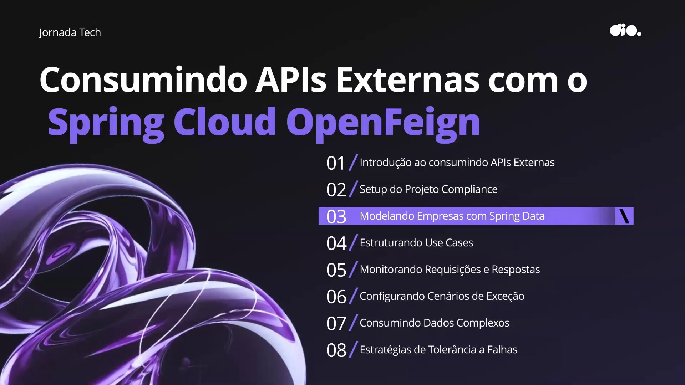
</p>

Slide de abertura da Jornada Tech, apresentando o tema "Consumindo APIs Externas com o Spring Cloud OpenFeign" e o roteiro da aula em oito tópicos. O item 03, "Modelando Empresas com Spring Data", está destacado, indicando que é essa a etapa que será trabalhada a partir daqui: dar sequência à estrutura de classes criada anteriormente (Company, CompanyRepository, RiskAssessment, ComplianceScreening) avançando agora para a camada de persistência.

#### Criando o pacote de persistência

<p align="center">
  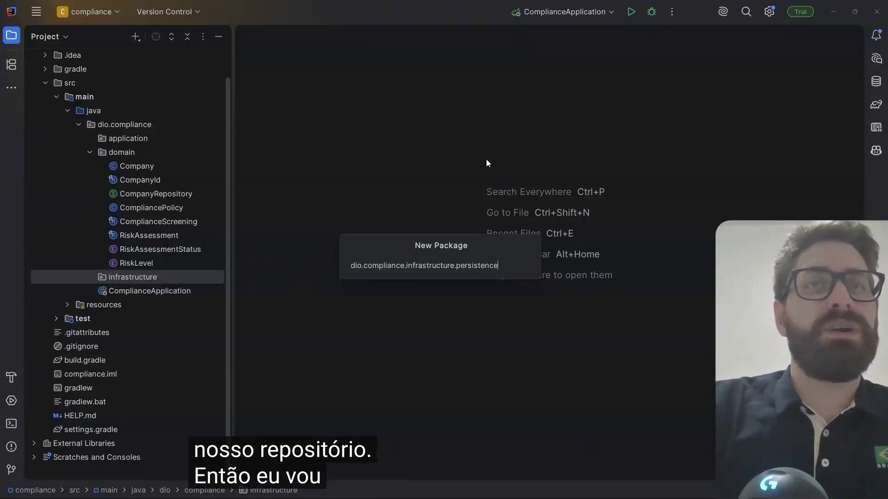
</p>

No IntelliJ IDEA, é criado o novo pacote `dio.compliance.infrastructure.persistence` dentro do projeto `compliance`. Esse pacote vai concentrar tudo relacionado à persistência de dados, mantendo essa responsabilidade separada da camada de domínio (`domain`), onde já estão as regras de negócio.

#### Criando o subpacote entity

<p align="center">
  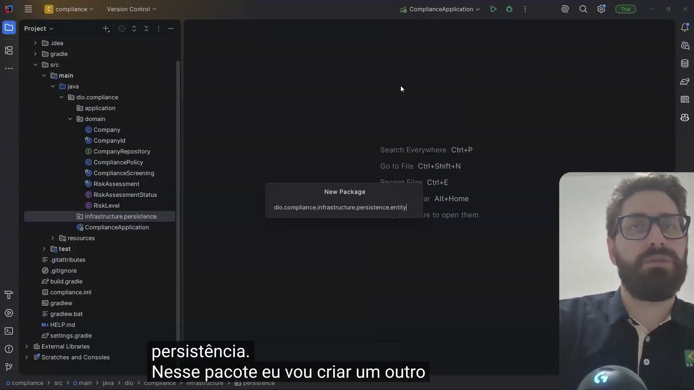
</p>

Dentro do pacote de persistência recém-criado, é adicionado o subpacote `dio.compliance.infrastructure.persistence.entity`, que vai abrigar as classes de entidade — ou seja, as representações dos dados que efetivamente serão persistidas, separadas das classes de domínio.

#### Criando o subpacote repository

<p align="center">
  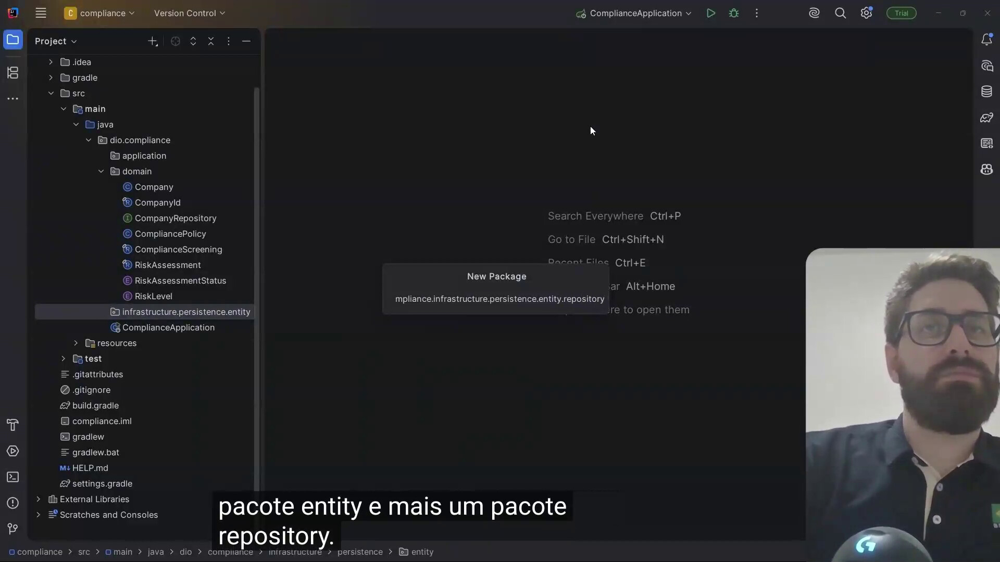
</p>

Em seguida é criado também o subpacote `repository`, irmão do `entity`, dentro de `infrastructure.persistence`. A ideia é isolar em pacotes distintos as entidades de persistência e os repositórios responsáveis por acessá-las.

#### Definindo a CompanyEntity

<p align="center">
  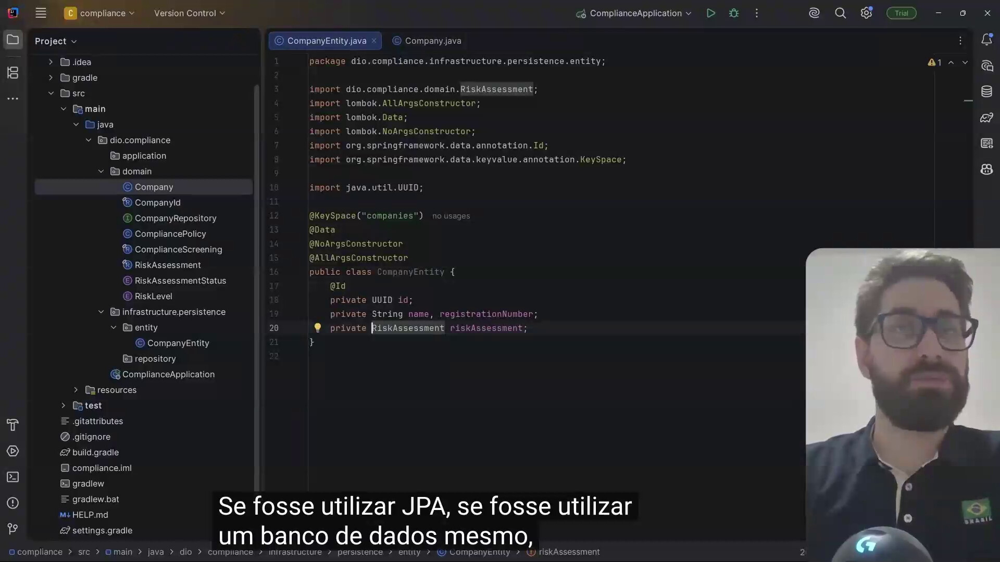
</p>

É criada a classe `CompanyEntity` no pacote `entity`. Ela é anotada com `@KeySpace("companies")` — anotação específica do Spring Data Key/Value usada para persistência em memória, definindo o nome da chave que será utilizada — além das anotações do Lombok `@Data`, `@NoArgsConstructor` e `@AllArgsConstructor`, que geram getters, setters, `toString` e os construtores necessários para o Spring Data instanciar a classe. Os atributos definidos são `id` (UUID), `name`, `registrationNumber` (Strings) e `riskAssessment` (reaproveitando diretamente a classe `RiskAssessment` do domínio). Fica explicado que essa é uma escolha possível por se tratar de persistência em memória: caso fosse usado JPA com um banco relacional de verdade, essa relação provavelmente seria modelada em uma tabela separada — ou, alternativamente, como um objeto embutido (`@Embedded`).

#### Mapeando o domínio para a entidade (from)

<p align="center">
  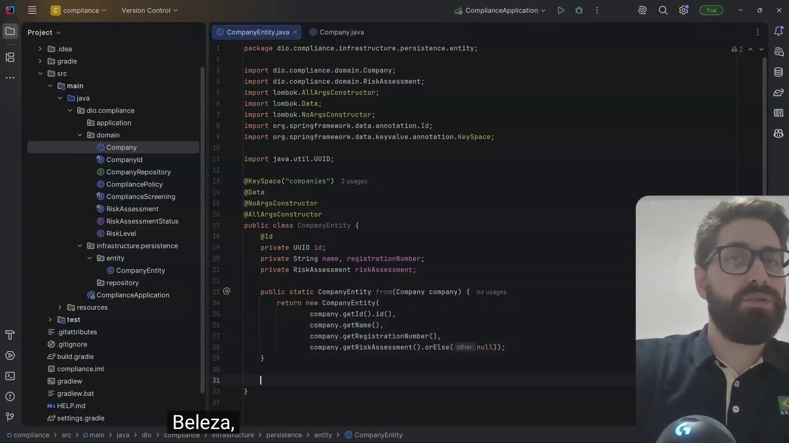
</p>

É adicionado à `CompanyEntity` um método estático `from(Company company)`, responsável por converter a classe de domínio `Company` na entidade de persistência. Ele repassa `id`, `name` e `registrationNumber`, e, como `getRiskAssessment()` no domínio retorna um `Optional`, usa `.orElse(null)` para obter o valor (ou `null`, caso não exista) a ser armazenado na entidade.

#### Mapeando a entidade para o domínio (toDomain)

<p align="center">
  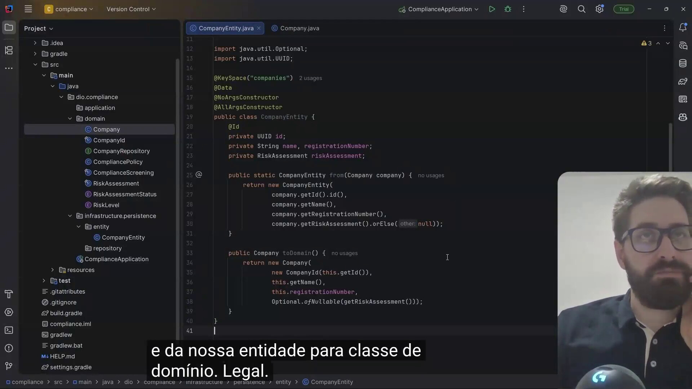
</p>

Agora é criado o caminho inverso: o método `toDomain()`, que transforma a `CompanyEntity` de volta em um objeto `Company` de domínio. Ele monta um novo `CompanyId` a partir do `id` da entidade, repassa `name` e `registrationNumber`, e envolve o `riskAssessment` em `Optional.ofNullable(...)`, já que na entidade esse campo pode vir nulo. Com isso ficam prontos os dois métodos de mapeamento entre entidade e domínio, que serão úteis principalmente nas operações de salvamento.

#### Criando o CompanyEntityRepository

<p align="center">
  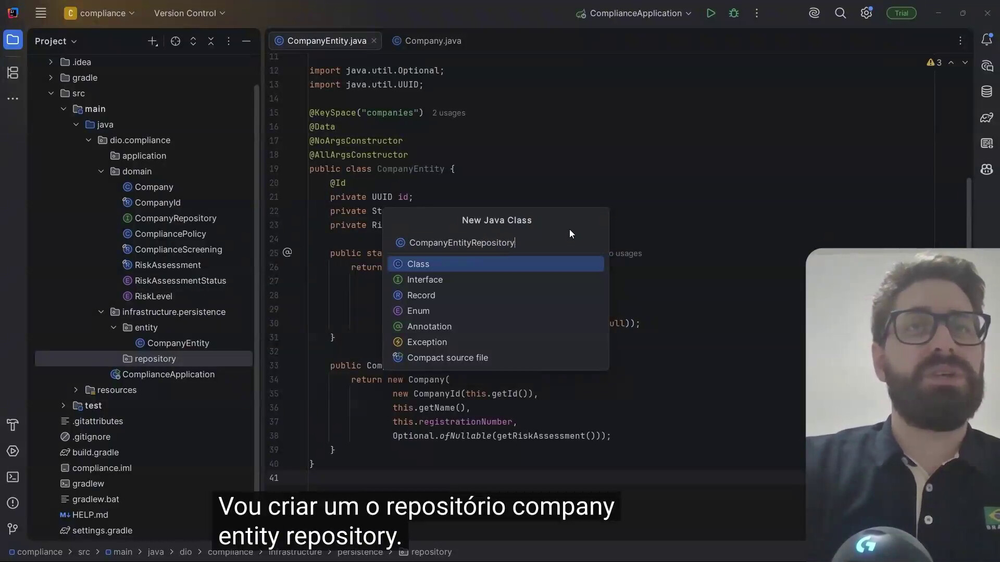
</p>

É criada uma nova interface chamada `CompanyEntityRepository`, dentro do pacote `repository`, que será o repositório responsável por operações de persistência sobre a `CompanyEntity`.

#### Expondo o repositório via Spring Data REST

<p align="center">
  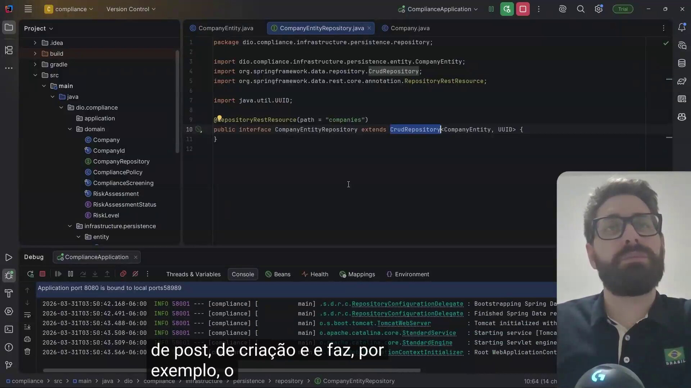
</p>

A interface `CompanyEntityRepository` passa a estender `CrudRepository<CompanyEntity, UUID>`, interface do Spring Data que já traz implementações prontas de `save`, `findAll`, `findById`, `exists`, `count` e `delete`, além de permitir a criação de consultas customizadas (como um `findByName`) sem necessidade de implementação manual. Também é adicionada a anotação `@RepositoryRestResource(path = "companies")`, do Spring Data REST, que expõe automaticamente esse repositório como uma API REST completa. Com a aplicação já em execução (visível no console de debug), basta essa anotação para disponibilizar os endpoints de criação, listagem e consulta, com o mapeamento feito automaticamente pelo framework.

#### Testando o endpoint raiz da API

<p align="center">
  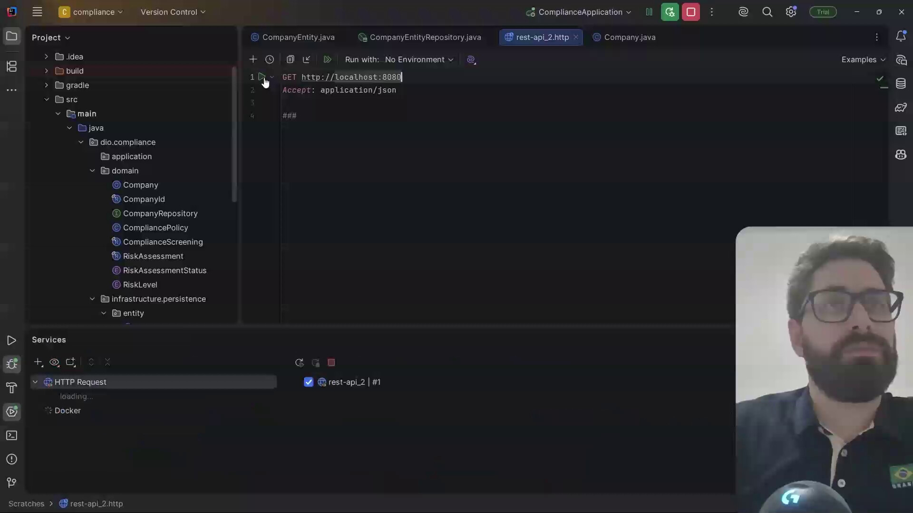
</p>

Usando o cliente HTTP embutido do IntelliJ, é montada uma requisição `GET` para `http://localhost:8080`, a raiz da aplicação, para verificar o que a API expõe automaticamente após a anotação `@RepositoryRestResource`.

#### Explorando o HATEOAS na resposta raiz

<p align="center">
  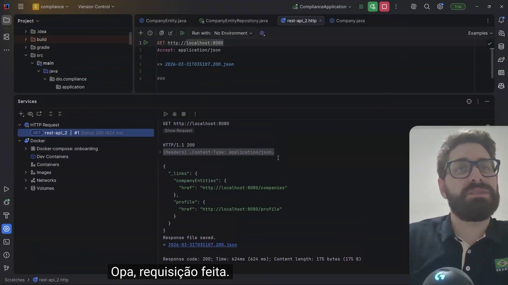
</p>

A requisição é executada e retorna um JSON contendo `_links`, com referências para `companyEntities` (apontando para `/companies`) e para `profile`. Esse comportamento é o padrão HATEOAS: a API retorna, junto com os dados, links relacionados que permitem a descoberta de outros recursos disponíveis — nesse caso, indicando que existe o recurso de companhias e como acessá-lo.

#### Consultando a lista de empresas (vazia)

<p align="center">
  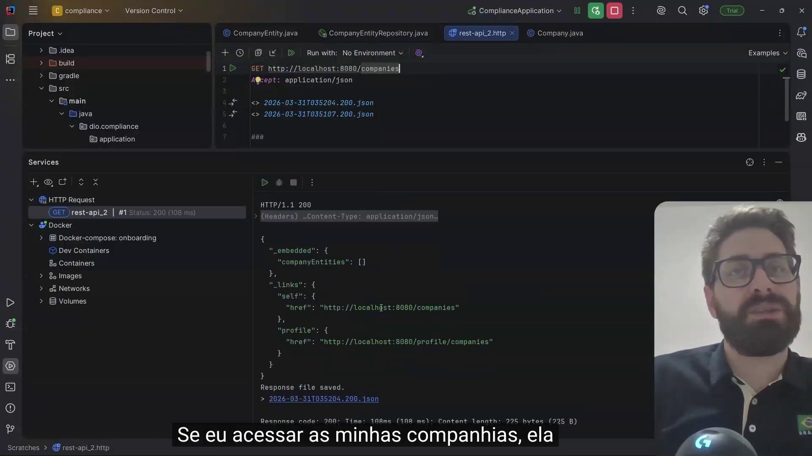
</p>

Seguindo os links descobertos, é feita uma requisição `GET` para `http://localhost:8080/companies`. Como ainda não há nenhuma empresa cadastrada, a resposta traz `_embedded.companyEntities` como um array vazio, além dos links `self` e `profile` relativos a esse recurso — reforçando o padrão de navegação HATEOAS também no nível da coleção.

#### Criando uma empresa via POST

<p align="center">
  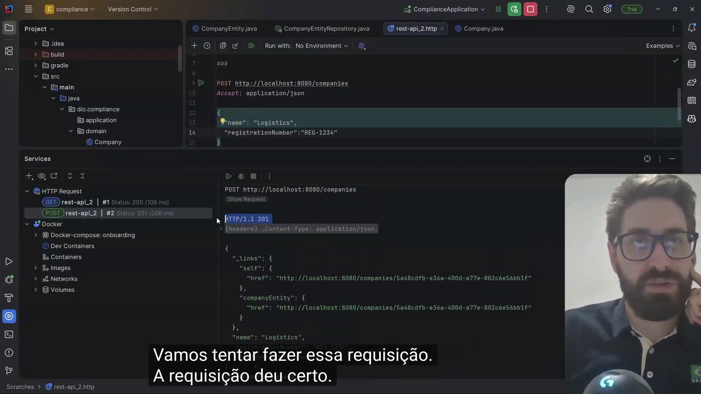
</p>

É montada uma requisição `POST` para `http://localhost:8080/companies`, com um corpo JSON contendo os campos existentes na entidade: `"name": "Logistics"` e `"registrationNumber": "REG-1234"`.

#### Empresa criada com sucesso (201)

<p align="center">
  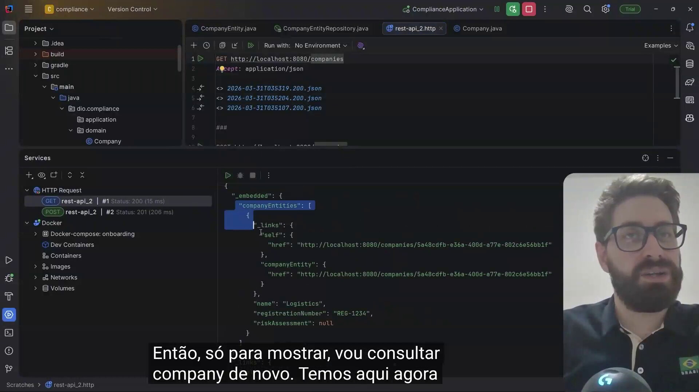
</p>

A requisição é enviada e retorna status `201`, confirmando que a empresa foi criada. O corpo da resposta traz os links `self` e `companyEntity` (ambos apontando para a URL do recurso recém-criado, com seu identificador), além dos dados `name` e `registrationNumber` persistidos — tudo isso disponível sem que nenhuma linha de código de controller tenha sido escrita manualmente.

#### Consultando a lista de empresas atualizada

<p align="center">
  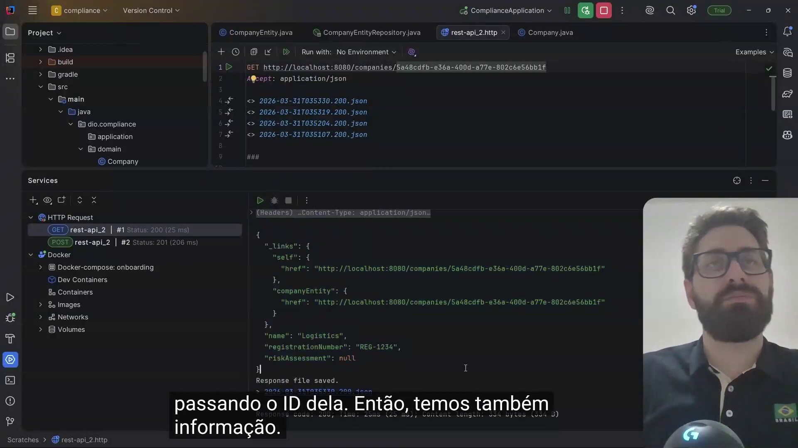
</p>

Uma nova consulta `GET` a `/companies` é feita para confirmar a criação. Agora `_embedded.companyEntities` já traz a empresa "Logistics" cadastrada, com seus links de navegação, `name`, `registrationNumber` e `riskAssessment` (ainda `null`, já que não foi definido).

#### Consultando uma empresa pelo ID

<p align="center">
  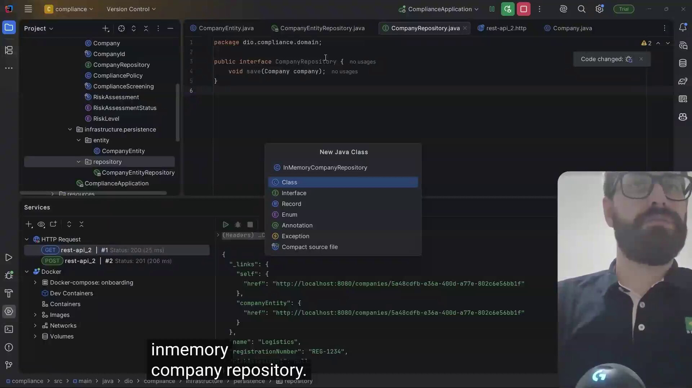
</p>

Por fim, é feita uma requisição `GET` diretamente para a URL específica da empresa, passando o seu ID (`/companies/{id}`). A resposta traz as mesmas informações da empresa individual: `name`, `registrationNumber` e `riskAssessment`. Isso demonstra que, apenas com a anotação de Spring Data REST, já está disponível um CRUD completo exposto via API — bastante útil para cenários sem muita regra de negócio envolvida.

#### Criando o InMemoryCompanyRepository

<p align="center">
  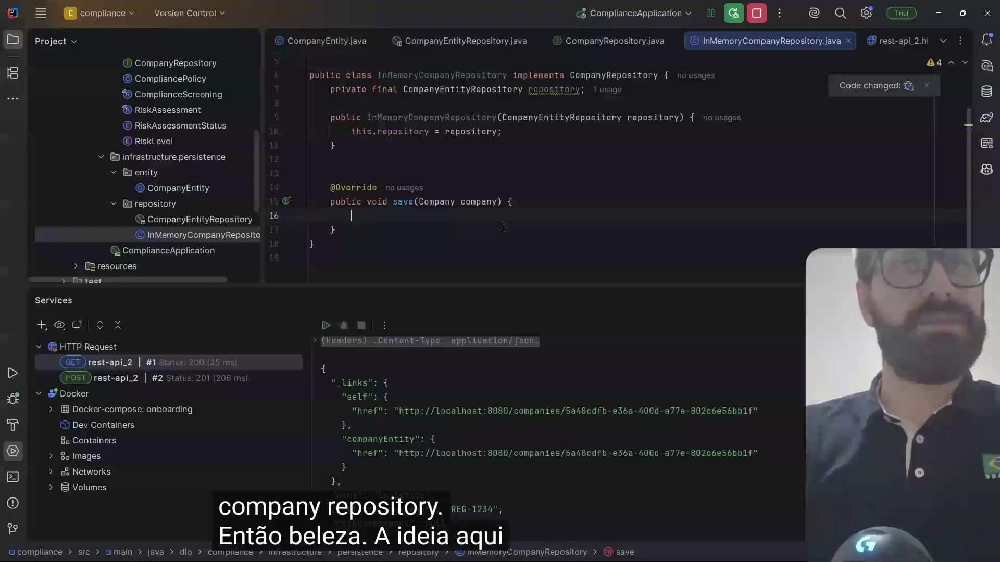
</p>

Voltando ao código, é exibida a interface `CompanyRepository` do domínio, que declara o método `void save(Company company)`. A partir dela, é criada uma nova classe, `InMemoryCompanyRepository`, que será a implementação concreta dessa interface, permitindo executar operações de salvamento a partir das regras de negócio.

#### Estrutura inicial do InMemoryCompanyRepository

<p align="center">
  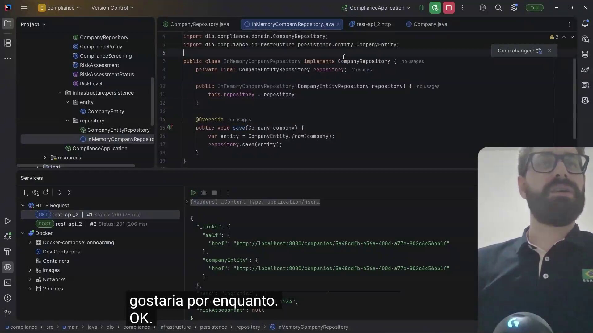
</p>

A classe `InMemoryCompanyRepository` é criada implementando `CompanyRepository`, com uma dependência final do tipo `CompanyEntityRepository` injetada via construtor. O método `save(Company company)` é sobrescrito, porém ainda vazio, pronto para receber a implementação.

#### Implementando o método save

<p align="center">
  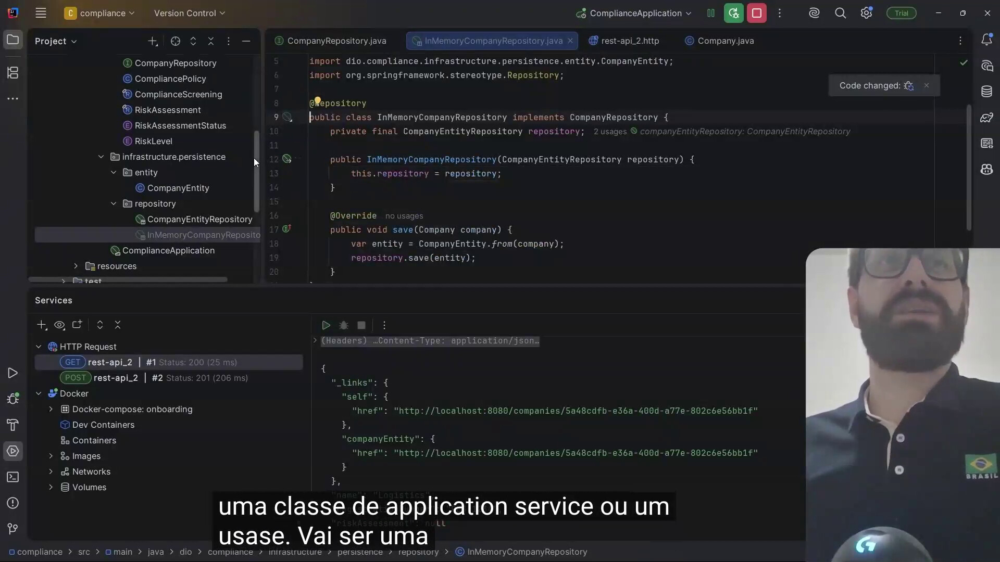
</p>

O método `save` é implementado: primeiro a `Company` de domínio é convertida em `CompanyEntity` usando o método `CompanyEntity.from(company)` criado anteriormente, e em seguida essa entidade é persistida chamando `repository.save(entity)` — reaproveitando o `CrudRepository` que já possui o `save` pronto.

#### Anotando o repositório com @Repository

<p align="center">
  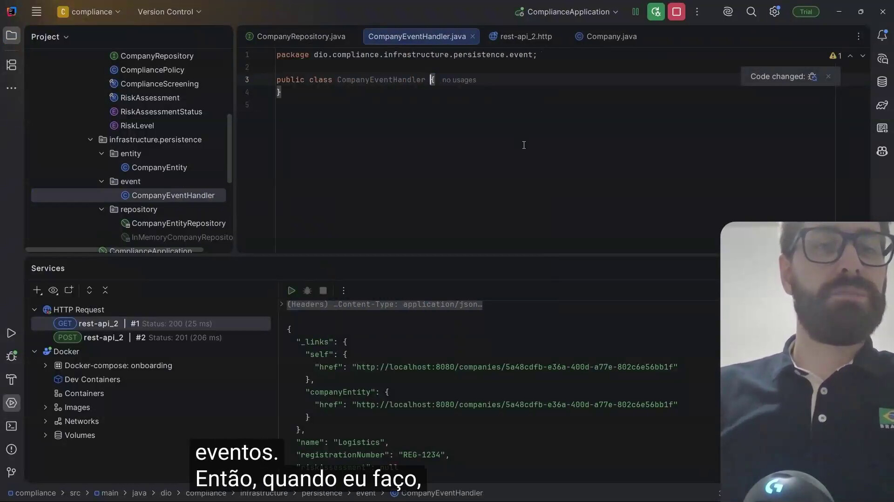
</p>

A classe `InMemoryCompanyRepository` recebe a anotação `@Repository`, uma das anotações que o Spring disponibiliza (junto com `@Service` e `@Component`) para habilitar a injeção de dependência. Dessa forma, quando futuramente for criada uma classe de `ApplicationService` ou `UseCase` que dependa da interface `CompanyRepository`, o Spring já saberá qual implementação injetar automaticamente — o que caracteriza a inversão de controle.

#### Criando o CompanyEventHandler

<p align="center">
  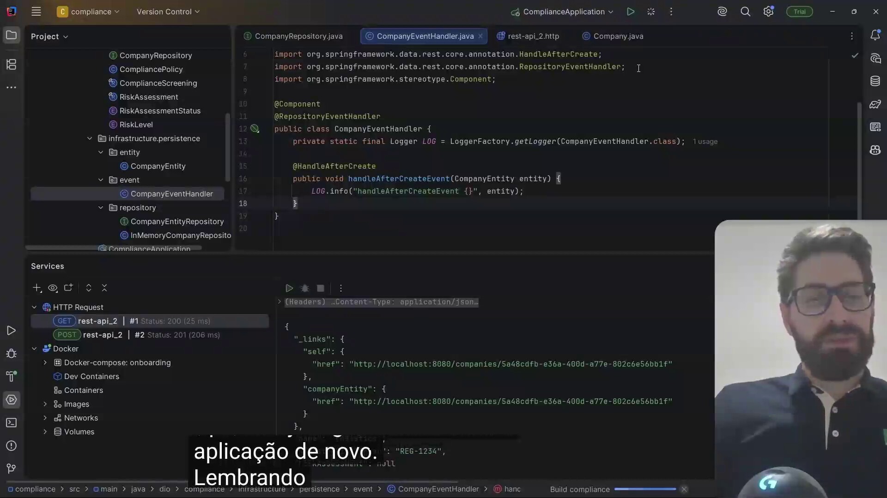
</p>

É criado um novo pacote `event` e, dentro dele, a classe `CompanyEventHandler`, ainda vazia. A ideia é aproveitar os eventos disponibilizados pelo Spring Data: ao criar uma `Company`, é possível disparar um evento de "após a criação" (`afterCreate`), que servirá como gatilho para a regra de validação de compliance, sem a necessidade de criar um endpoint específico para isso.

#### Implementando o handler de afterCreate

<p align="center">
  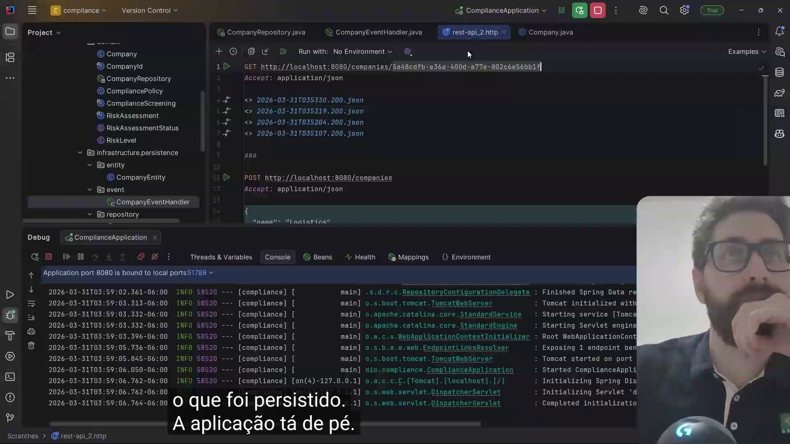
</p>

A classe `CompanyEventHandler` é anotada com `@Component` e `@RepositoryEventHandler`, o que dá acesso aos métodos de tratamento de eventos do Spring Data. É implementado o método `handleAfterCreateEvent(CompanyEntity entity)`, anotado com `@HandleAfterCreate` — importante notar que o parâmetro recebido é a `CompanyEntity`, e não a classe de domínio `Company`, já que esses eventos pertencem à camada de persistência do Spring Data. Um `Logger` estático é adicionado para registrar, via `LOG.info`, a execução do evento.

#### Reiniciando a aplicação

<p align="center">
  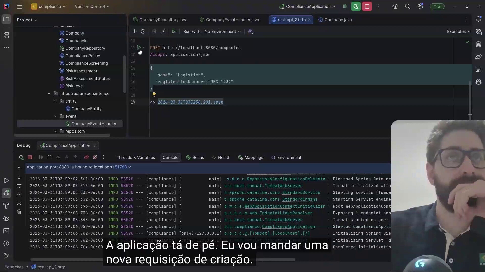
</p>

A aplicação é reiniciada — já que a persistência é feita em memória, todos os dados criados anteriormente são perdidos a cada restart. O console de debug confirma que a aplicação subiu corretamente na porta 8080.

#### Enviando nova requisição de criação

<p align="center">
  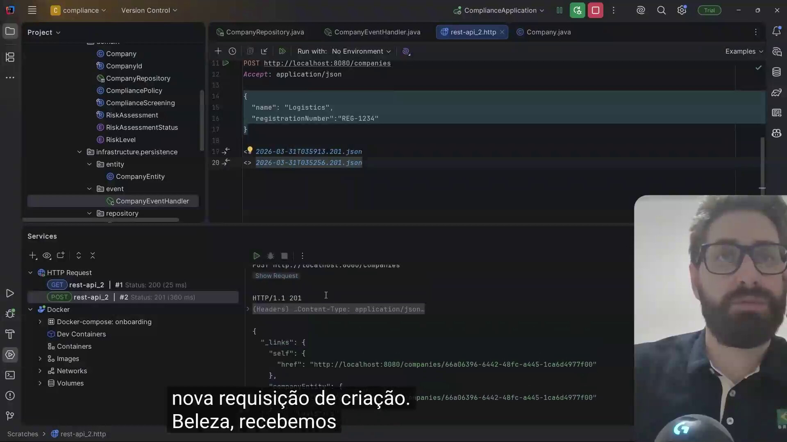
</p>

Com a aplicação novamente de pé, é preparada e enviada uma nova requisição `POST` para `/companies`, reutilizando o mesmo corpo com `name: "Logistics"` e `registrationNumber: "REG-1234"`, agora com o objetivo de verificar se o `CompanyEventHandler` será acionado após a criação.

#### Confirmando a criação da empresa

<p align="center">
  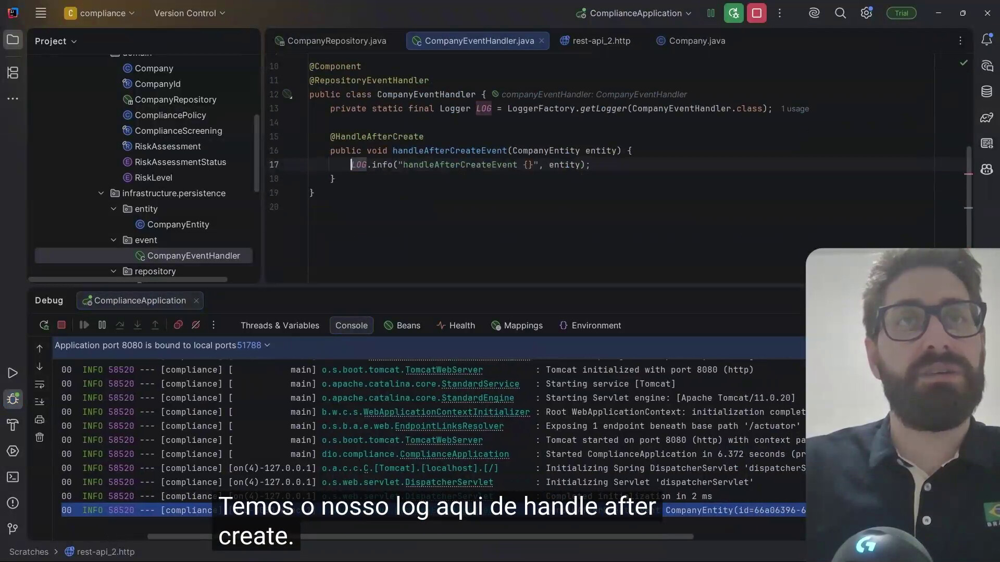
</p>

A requisição retorna novamente status `201`, confirmando que a empresa foi cadastrada com sucesso, com um novo identificador gerado para esse novo registro.

#### Validando o evento afterCreate nos logs

<p align="center">
  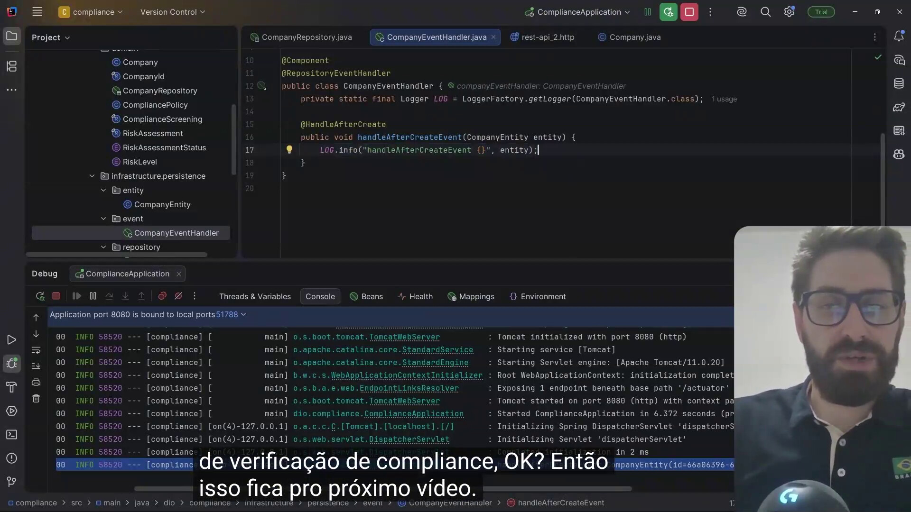
</p>

No console da aplicação aparece a linha de log gerada pelo `handleAfterCreateEvent`, confirmando que o evento `afterCreate` foi disparado corretamente logo após a persistência da `CompanyEntity`. É esse gatilho que, a partir daqui, vai dar início à execução da lógica de verificação de compliance — conteúdo que fica para o próximo vídeo.


### 🟩 Vídeo 04 - Estruturando Use Cases

<video width="60%" controls>
  <source src="000-Midia_e_Anexos/bootcamp_ntt_data_java_spring_ai-modulo.04-curso.04-video_04.webm" type="video/webm">
  Seu navegador não suporta vídeo HTML5.
</video>

link do vídeo: https://web.dio.me/track/ntt-data-2026-ai-java-back-end/course/consumindo-apis-externas-com-o-spring-cloud-openfeign/learning/53dd9050-589d-44d6-8f99-1536a9835c86?autoplay=1

### Anotações

#### Abertura: Consumindo APIs Externas com Spring Cloud OpenFeign

<p align="center">
  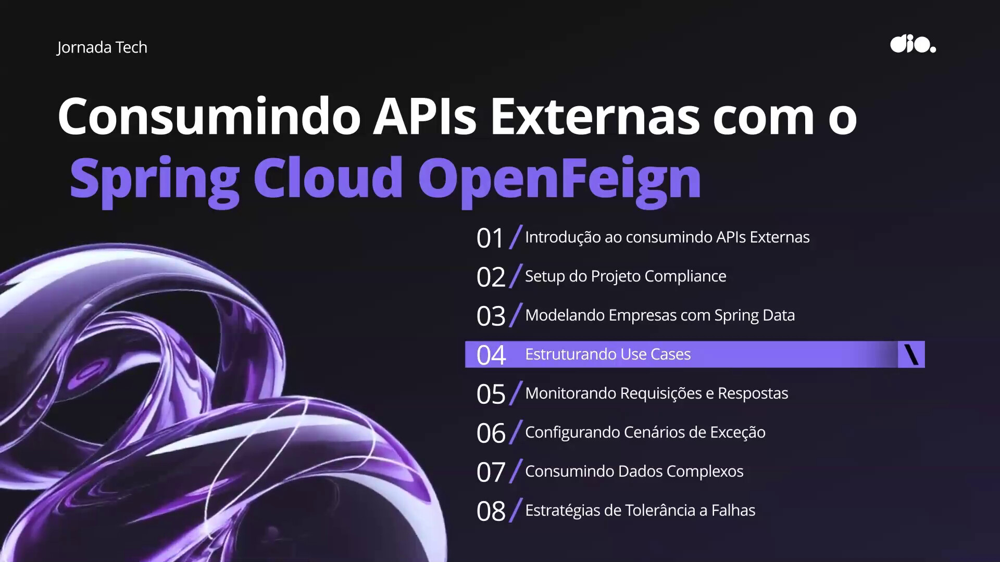
</p>

Slide de abertura da aula "Consumindo APIs Externas com o Spring Cloud OpenFeign", parte da Jornada Tech. O índice mostra as etapas do módulo, com destaque para o tópico 04 — "Estruturando Use Cases" —, que é o ponto de partida da aula: organizar as regras de negócio do projeto Compliance antes de integrar as chamadas externas com o OpenFeign.

#### Criando a classe AnalyzeCompanyRiskUseCase

<p align="center">
  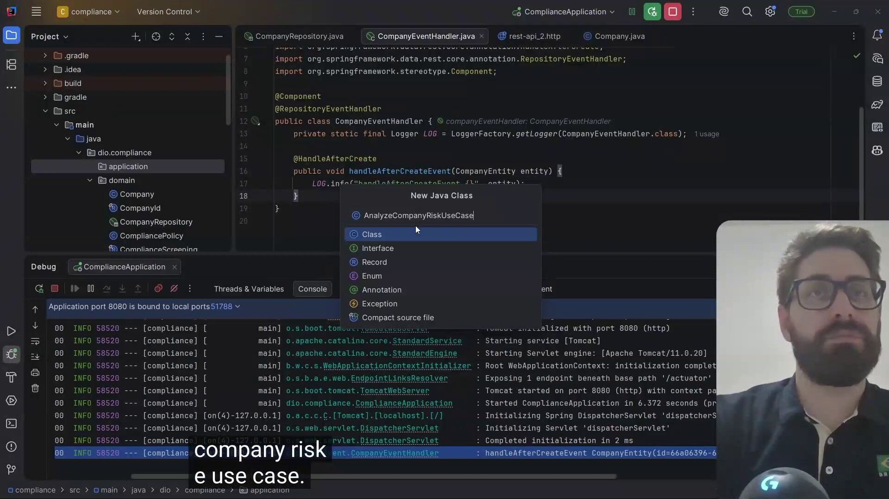
</p>

No IntelliJ, dentro do pacote `dio.compliance.application`, é criada uma nova classe chamada `AnalyzeCompanyRiskUseCase`. Essa classe segue o padrão *use case* da Clean Architecture: cada caso de uso concentra uma única responsabilidade de negócio, evitando classes de serviço genéricas e sobrecarregadas com múltiplos métodos (save, find, delete etc.).

#### Estrutura inicial do use case

<p align="center">
  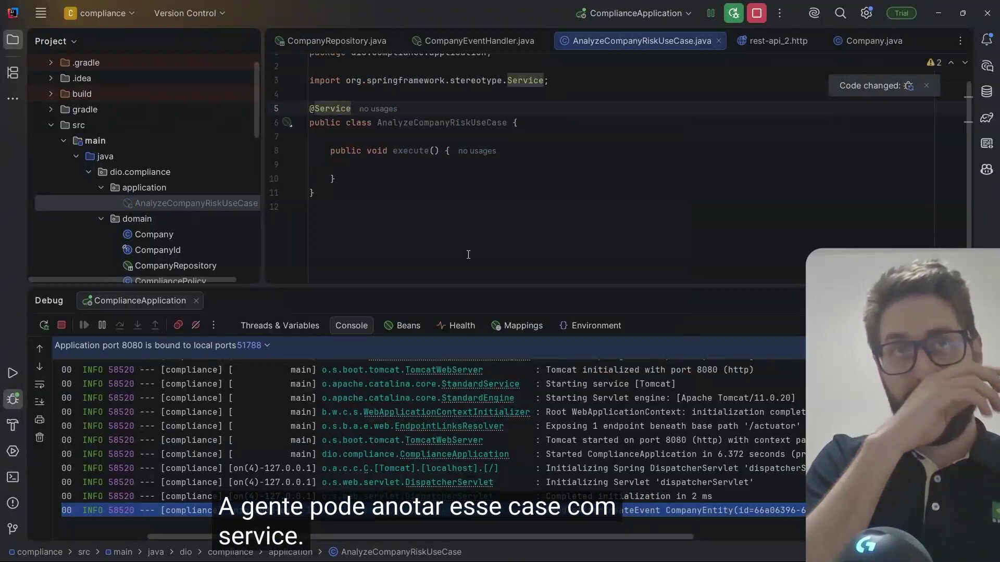
</p>

```java
package dio.complianceApplication;

import org.springframework.stereotype.Service;

@Service
public class AnalyzeCompanyRiskUseCase {

    public void execute() {

    }
}
```

A classe é anotada com `@Service`, permitindo que o Spring a reconheça como um bean gerenciado e a injete automaticamente onde for necessário. Por convenção, todo use case expõe um único método público chamado `execute`, que concentra a regra de negócio daquele caso específico.

#### Instanciando o use case no event handler

<p align="center">
  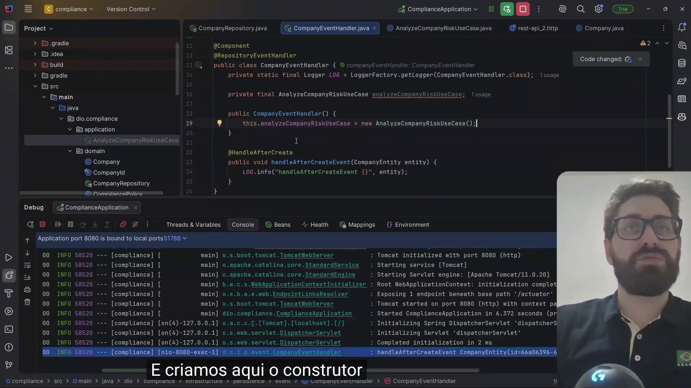
</p>

```java
@Component
@RepositoryEventHandler
public class CompanyEventHandler {
    private static final Logger LOG = LoggerFactory.getLogger(CompanyEventHandler.class);

    private final AnalyzeCompanyRiskUseCase analyzeCompanyRiskUseCase;

    public CompanyEventHandler() {
        this.analyzeCompanyRiskUseCase = new AnalyzeCompanyRiskUseCase();
    }

    @HandleAfterCreate
    public void handleAfterCreateEvent(CompanyEntity entity) {
        LOG.info("handleAfterCreateEvent {}", entity);
    }
}
```

Um primeiro construtor é criado instanciando o use case manualmente com `new`. Esse é apenas um passo intermediário — o objetivo é substituir essa instanciação manual pela injeção de dependência do Spring, que é o padrão recomendado.

#### Ajustando o construtor para injeção de dependência

<p align="center">
  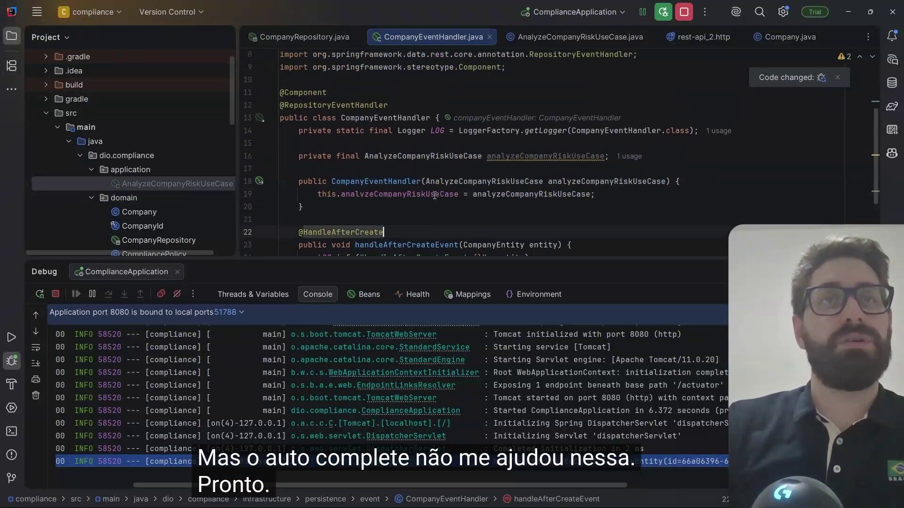
</p>

```java
private final AnalyzeCompanyRiskUseCase analyzeCompanyRiskUseCase;

public CompanyEventHandler(AnalyzeCompanyRiskUseCase analyzeCompanyRiskUseCase) {
    this.analyzeCompanyRiskUseCase = analyzeCompanyRiskUseCase;
}
```

O construtor passa a receber o use case como parâmetro. Como a classe já está anotada com `@Service`, o Spring sabe como instanciá-la e injetá-la automaticamente nesse construtor — esse mecanismo é a injeção de dependência: ao anotar uma classe com `@Component` ou `@Service`, dizemos ao Spring "você sabe criar essa classe e pode passá-la como argumento sempre que precisar".

#### Chamando o use case a partir do evento de criação

<p align="center">
  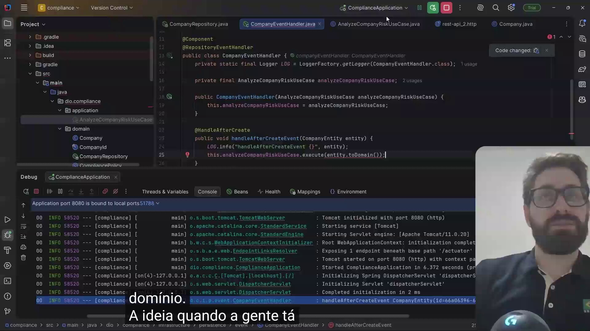
</p>

```java
private final AnalyzeCompanyRiskUseCase analyzeCompanyRiskUseCase;

public CompanyEventHandler(AnalyzeCompanyRiskUseCase analyzeCompanyRiskUseCase) {
    this.analyzeCompanyRiskUseCase = analyzeCompanyRiskUseCase;
}

@HandleAfterCreate
public void handleAfterCreateEvent(CompanyEntity entity) {
    LOG.info("handleAfterCreateEvent {}", entity);
    this.analyzeCompanyRiskUseCase.execute(entity.toDomain());
}
```

Dentro do `handleAfterCreateEvent`, o use case é finalmente chamado, convertendo a entidade (`CompanyEntity`) em objeto de domínio antes de repassá-la (`entity.toDomain()`). A ideia é que, dentro das camadas de aplicação e domínio, sempre se trabalhe com classes de domínio — evitando misturar regras de negócio com detalhes de persistência, que pertencem à infraestrutura.

#### Preparando os pontos de verificação KYC e AML

<p align="center">
  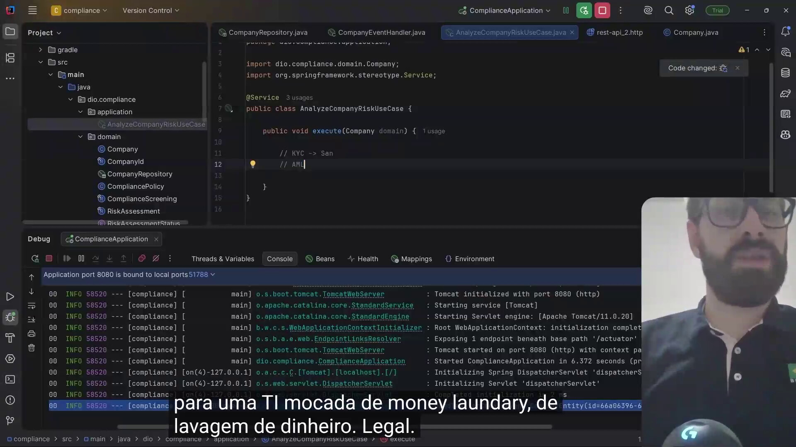
</p>

```java
package dio.compliance.application;

import dio.compliance.domain.Company;
import org.springframework.stereotype.Service;

@Service
public class AnalyzeCompanyRiskUseCase {

    public void execute(Company domain) {

        // KYC -> San
        // AML

    }
}
```

Com o método `execute` já recebendo o domínio `Company`, são deixados comentários indicando os dois pontos de verificação que a regra de negócio vai realizar: uma checagem de **KYC** (Know Your Customer, incluindo consulta de sanções) e uma checagem de **AML** (Anti-Money Laundering, prevenção à lavagem de dinheiro). Essas verificações serão implementadas consumindo APIs externas mocadas.

#### Conhecendo a ferramenta Mockoon

<p align="center">
  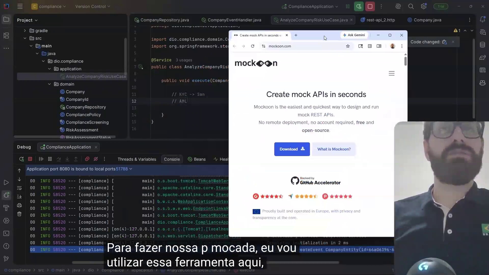
</p>

Para simular as APIs externas de KYC e AML, é apresentada a ferramenta Mockoon, que permite criar e rodar mock APIs REST rapidamente, sem necessidade de implantação remota ou conta de usuário. Outras alternativas citadas para esse tipo de mock são o WireMock e o próprio Postman.

#### Página inicial do Mockoon

<p align="center">
  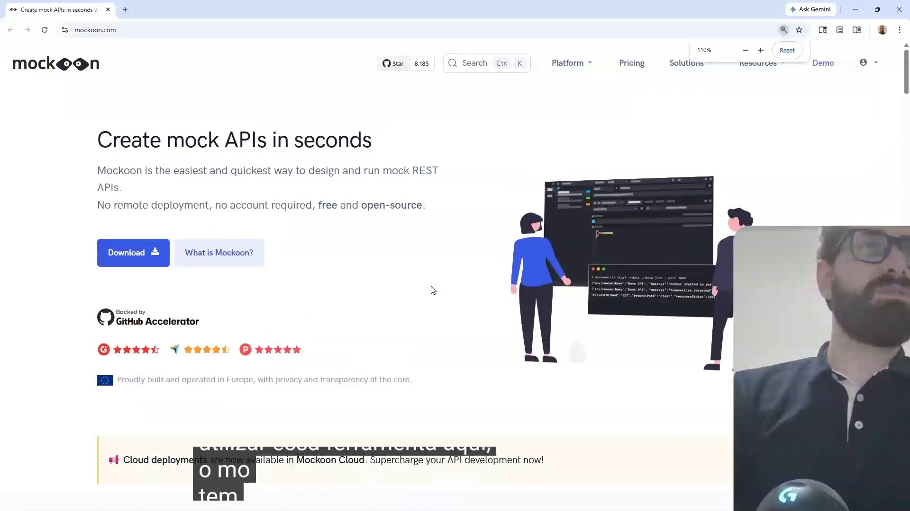
</p>

A página do Mockoon é aberta novamente para localizar o link de download da ferramenta, que já havia sido instalada previamente para uso nesta aula.

#### API de demonstração do Mockoon

<p align="center">
  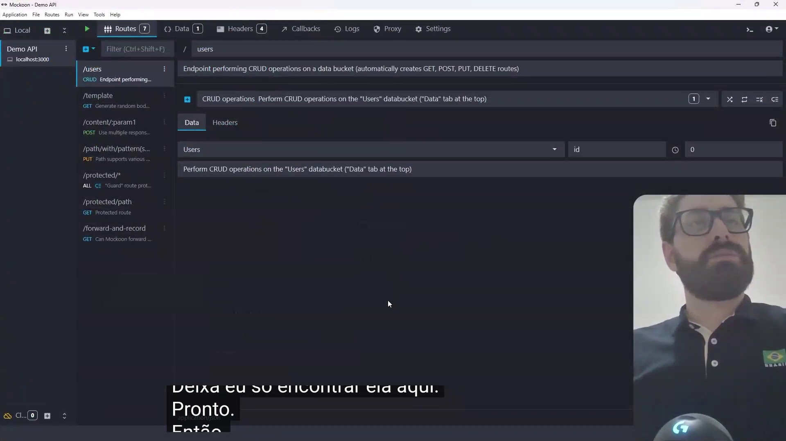
</p>

Com o Mockoon aberto, é exibida a API de demonstração ("Demo API") que já vem configurada por padrão na ferramenta, disponível em `localhost:3000` e contendo rotas de exemplo como `/users`, `/template`, `/content/:param1`, entre outras. Essa API serve para validar que a ferramenta está funcionando antes de criar os mocks específicos do projeto.

#### Testando a API de demonstração

<p align="center">
  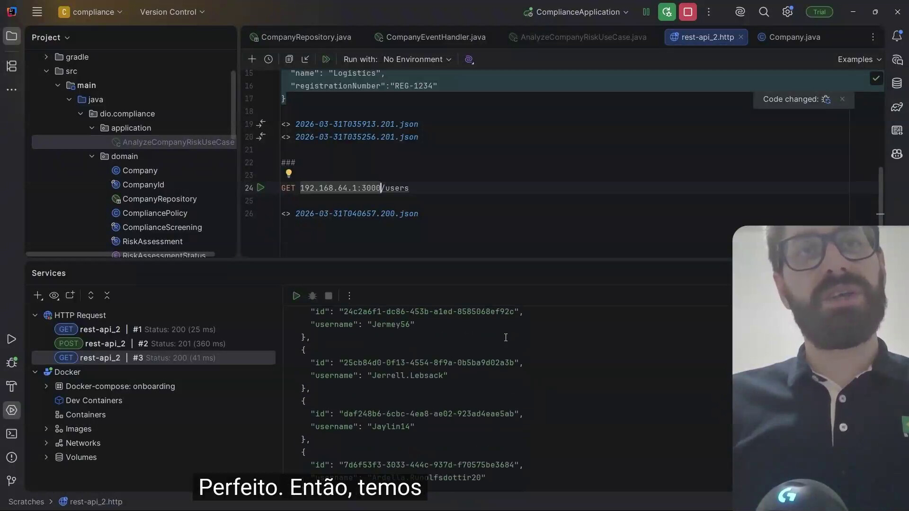
</p>

```http
GET 192.168.64.1:3000/users
```

Utilizando o HTTP client do IntelliJ, é feita uma requisição GET para a API de demonstração do Mockoon, confirmando que o mock está de pé e respondendo corretamente. A partir daqui, os mocks específicos do projeto de compliance começam a ser criados.

#### Salvando o ambiente mock "KYC"

<p align="center">
  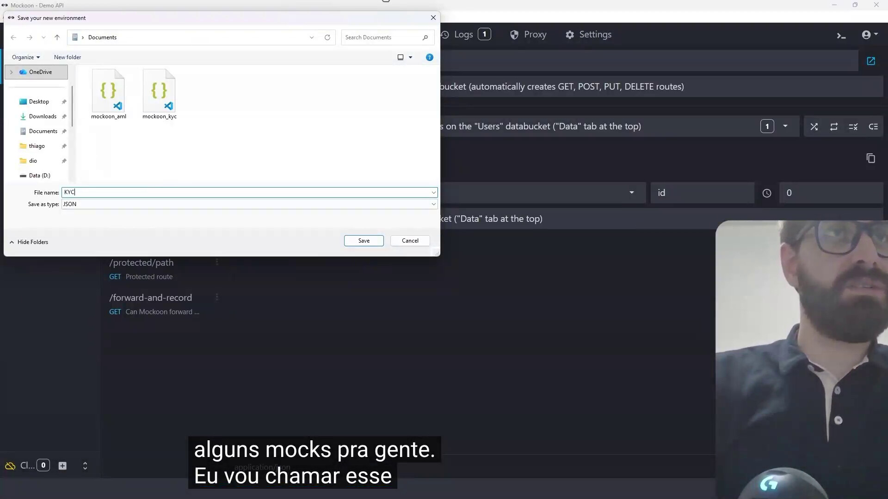
</p>

É criado um novo ambiente no Mockoon, salvo com o nome "KYC". Esse ambiente vai concentrar as rotas mocadas relacionadas à verificação de Know Your Customer, começando por um cenário simples: uma consulta de sanções que retorna uma lista vazia.

#### Configurando a rota de sanções sem risco

<p align="center">
  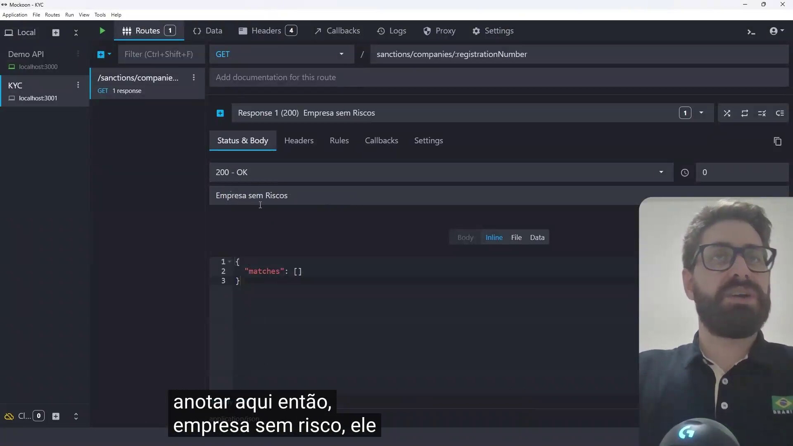
</p>

```json
{
  "matches": []
}
```

No ambiente KYC, é criada a rota `GET /sanctions/companies/:registrationNumber`, com uma resposta chamada "Empresa sem Riscos", retornando status 200 e o corpo acima, indicando que nenhuma sanção foi encontrada para a empresa consultada. Esse é o primeiro cenário de teste — casos de erro e outras situações serão adicionados posteriormente.

#### Configurando a porta do ambiente KYC

<p align="center">
  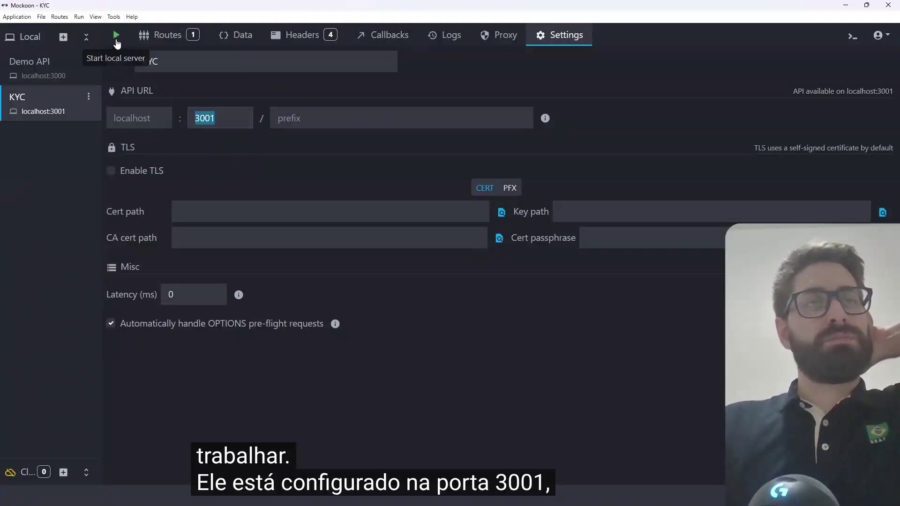
</p>

Nas configurações do ambiente KYC, a porta da API é definida como `3001`, diferenciando esse mock da API de demonstração (que roda em `3000`). Em seguida, o servidor local é iniciado.

#### Validando a rota de sanções mocada

<p align="center">
  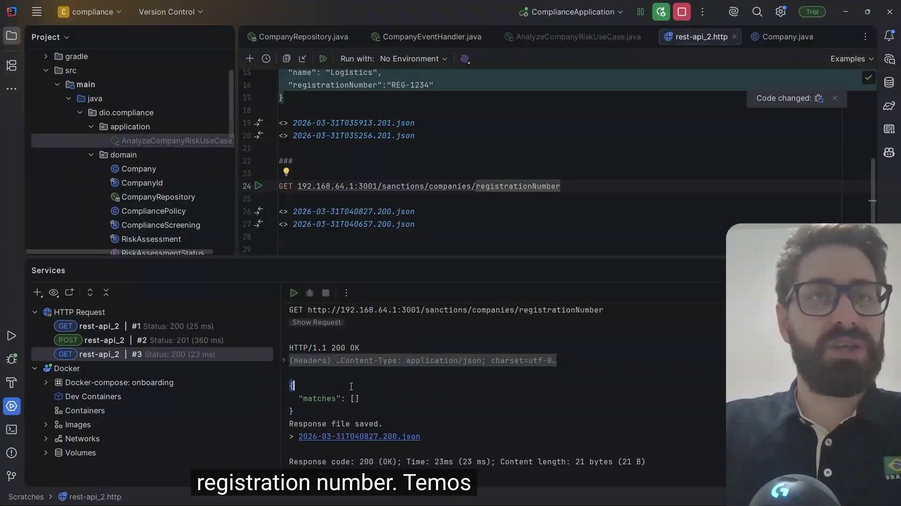
</p>

```http
GET 192.168.64.1:3001/sanctions/companies/registrationNumber
```

```json
{
  "matches": []
}
```

Uma requisição de teste confirma que o mock de sanções, rodando na porta 3001, está funcionando corretamente e retornando o corpo esperado com status 200. Com essa API mocada validada, o próximo passo é começar a configurar o Spring Cloud OpenFeign no projeto.

#### Definindo a versão do Spring Cloud

<p align="center">
  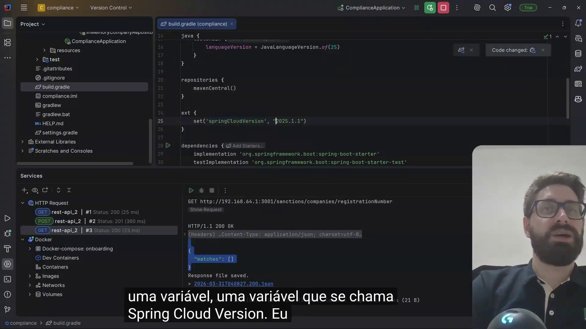
</p>

```groovy
ext {
    set('springCloudVersion', "2025.1.1")
}
```

No `build.gradle` do projeto, é adicionada a variável `springCloudVersion`. Diferente das dependências padrão do Spring Boot, o OpenFeign faz parte do Spring Cloud, que é distribuído em um repositório próprio e precisa dessa variável de versão para ser resolvido corretamente.

#### Consultando a versão no Spring Initializr

<p align="center">
  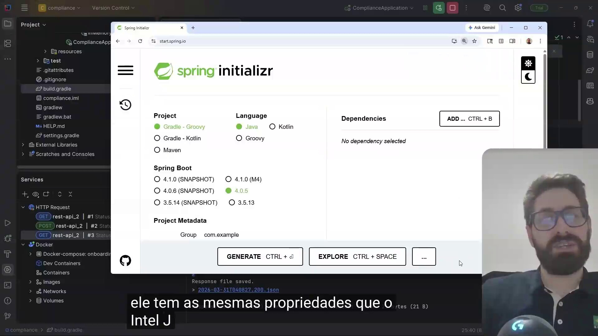
</p>

Para descobrir a versão correta do Spring Cloud, é aberto o Spring Initializr, que oferece as mesmas opções de configuração de projeto disponíveis no IntelliJ (build tool, linguagem, versão do Spring Boot etc.), além da possibilidade de explorar as dependências antes de gerar o projeto.

#### Pesquisando a dependência do OpenFeign

<p align="center">
  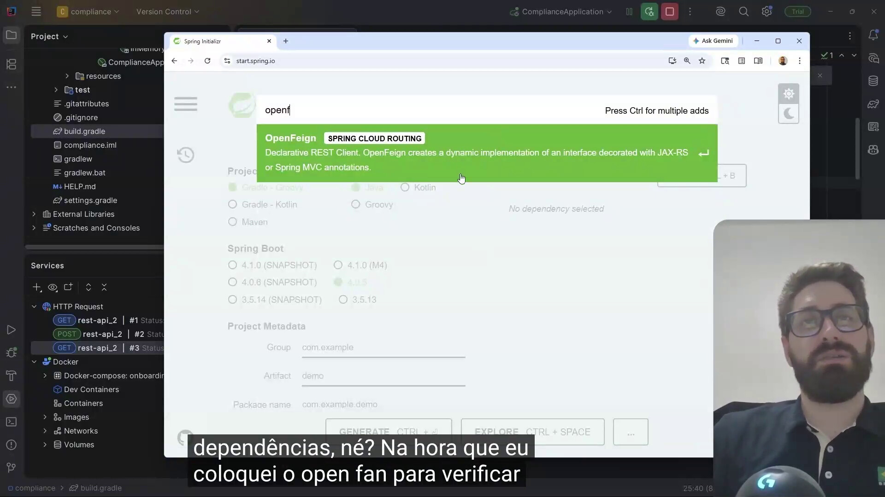
</p>

Ao pesquisar "openf" no campo de dependências do Spring Initializr, a sugestão "OpenFeign" aparece categorizada como "Spring Cloud Routing", confirmando que essa dependência pertence ao ecossistema Spring Cloud e não ao conjunto padrão de starters do Spring Boot.

#### Explorando o build.gradle gerado pelo Initializr

<p align="center">
  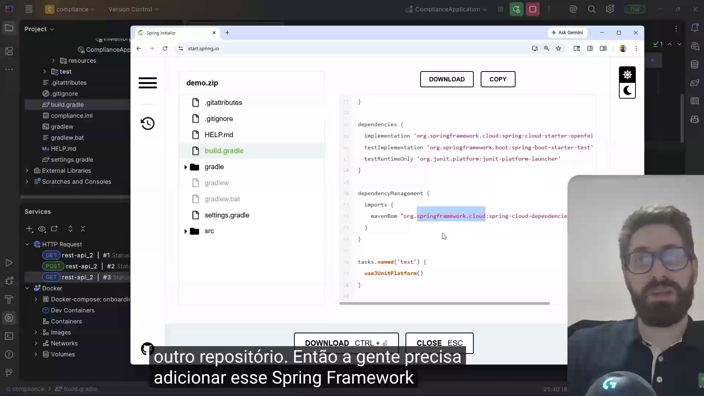
</p>

```groovy
dependencies {
    implementation 'org.springframework.cloud:spring-cloud-starter-openfeign'
    testImplementation 'org.springframework.boot:spring-boot-starter-test'
    testRuntimeOnly 'org.junit.platform:junit-platform-launcher'
}

dependencyManagement {
    imports {
        mavenBom "org.springframework.cloud:spring-cloud-dependencies:..."
    }
}
```

Ao gerar o projeto de exemplo, o Spring Initializr mostra o `build.gradle` resultante, revelando exatamente quais trechos precisam ser copiados para o projeto Compliance: a dependência `spring-cloud-starter-openfeign` e o bloco `dependencyManagement` com o BOM do Spring Cloud.

#### Conferindo o restante do build.gradle gerado

<p align="center">
  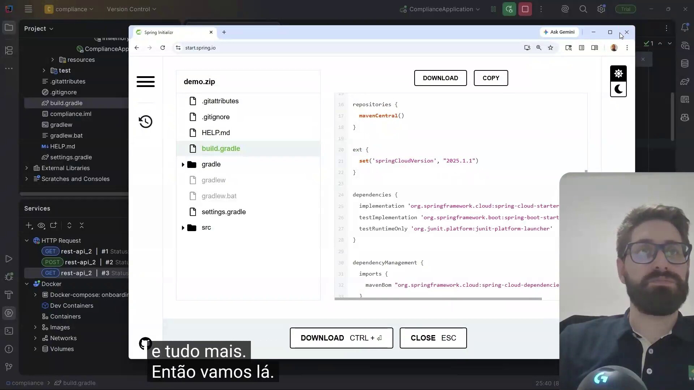
</p>

```groovy
repositories {
    mavenCentral()
}

ext {
    set('springCloudVersion', "2025.1.1")
}
```

Antes de fechar a visualização do projeto gerado, o restante do arquivo é conferido, incluindo o bloco `ext` com a variável `springCloudVersion`, que é exatamente o trecho já adicionado anteriormente no projeto Compliance.

#### Dependências finais adicionadas ao projeto

<p align="center">
  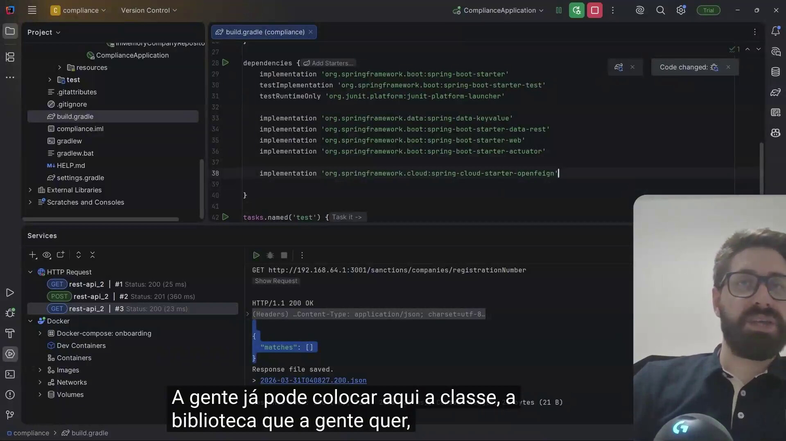
</p>

```groovy
dependencies {
    implementation 'org.springframework.boot:spring-boot-starter'
    testImplementation 'org.springframework.boot:spring-boot-starter-test'
    testRuntimeOnly 'org.junit.platform:junit-platform-launcher'

    implementation 'org.springframework.data:spring-data-keyvalue'
    implementation 'org.springframework.boot:spring-boot-starter-data-rest'
    implementation 'org.springframework.boot:spring-boot-starter-web'
    implementation 'org.springframework.boot:spring-boot-starter-actuator'

    implementation 'org.springframework.cloud:spring-cloud-starter-openfeign'
}
```

De volta ao projeto Compliance, a dependência `spring-cloud-starter-openfeign` é adicionada ao bloco `dependencies`, junto das demais dependências já existentes no projeto (persistência em memória, REST, actuator).

#### Adicionando o gerenciamento de dependências do Spring Cloud

<p align="center">
  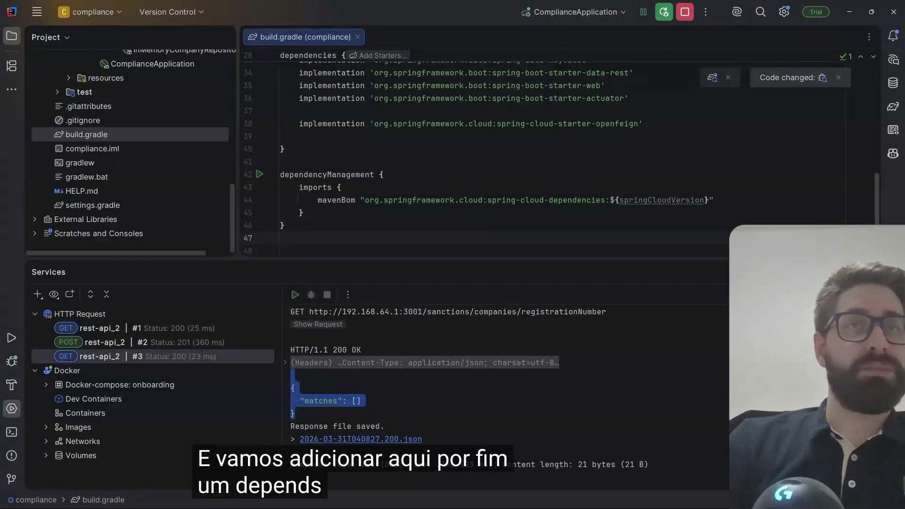
</p>

```groovy
dependencyManagement {
    imports {
        mavenBom "org.springframework.cloud:spring-cloud-dependencies:${springCloudVersion}"
    }
}
```

O bloco `dependencyManagement` é adicionado ao `build.gradle`, importando o BOM (Bill of Materials) do Spring Cloud através da variável `springCloudVersion` definida anteriormente. Esse bloco garante que todas as dependências do Spring Cloud usadas no projeto fiquem com versões compatíveis entre si.

#### Fechando a configuração de dependências

<p align="center">
  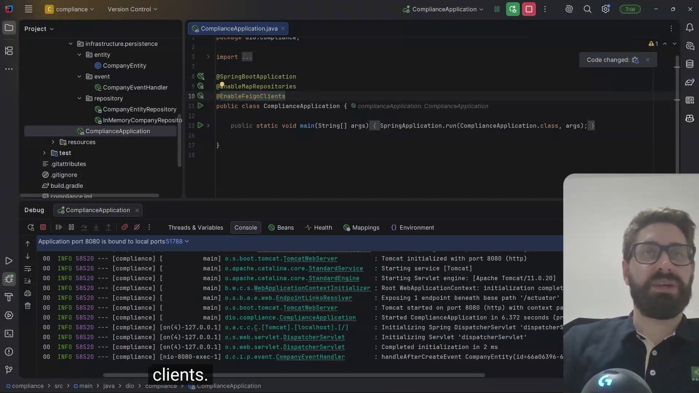
</p>

```groovy
implementation 'org.springframework.cloud:spring-cloud-starter-openfeign'
```

Com a variável de versão e o bloco `dependencyManagement` configurados, a dependência do OpenFeign no `build.gradle` fica pronta para ser resolvida corretamente pelo Gradle, trazendo todas as classes necessárias para criar os REST clients.

#### Habilitando os Feign Clients na aplicação

<p align="center">
  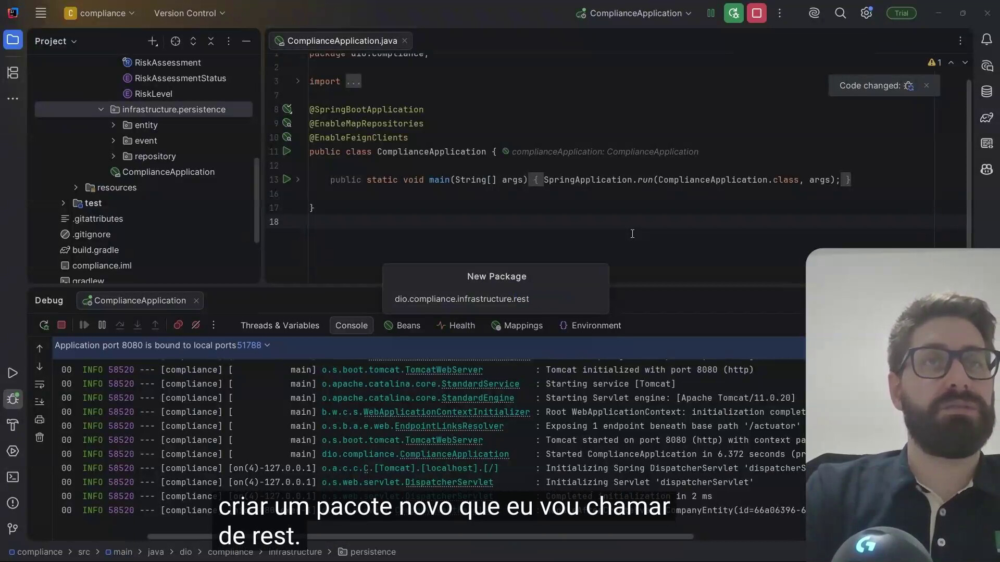
</p>

```java
@SpringBootApplication
@EnableMapRepositories
@EnableFeignClients
public class ComplianceApplication {

    public static void main(String[] args) { SpringApplication.run(ComplianceApplication.class, args); }

}
```

A primeira alteração necessária após adicionar a dependência é anotar a classe principal da aplicação com `@EnableFeignClients`. Essa anotação diz ao Spring que ele deve escanear e resolver as interfaces anotadas como Feign clients, construindo automaticamente as implementações REST correspondentes.

#### Criando o pacote rest.client

<p align="center">
  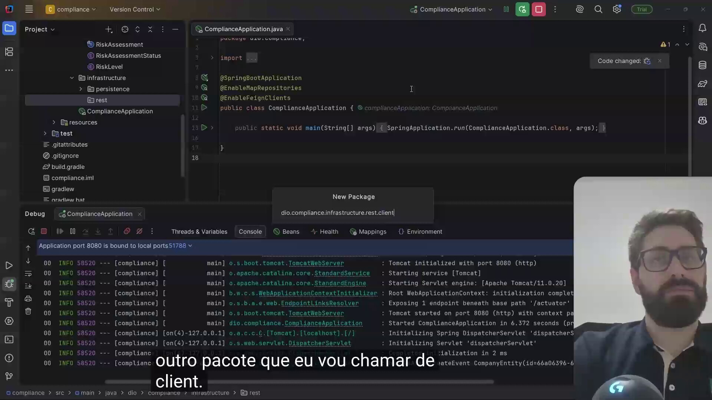
</p>

Dentro da camada de infraestrutura (`infrastructure`), é criado um novo pacote chamado `rest`, que vai concentrar tudo relacionado a chamadas HTTP para fora da aplicação.

#### Criando o subpacote client

<p align="center">
  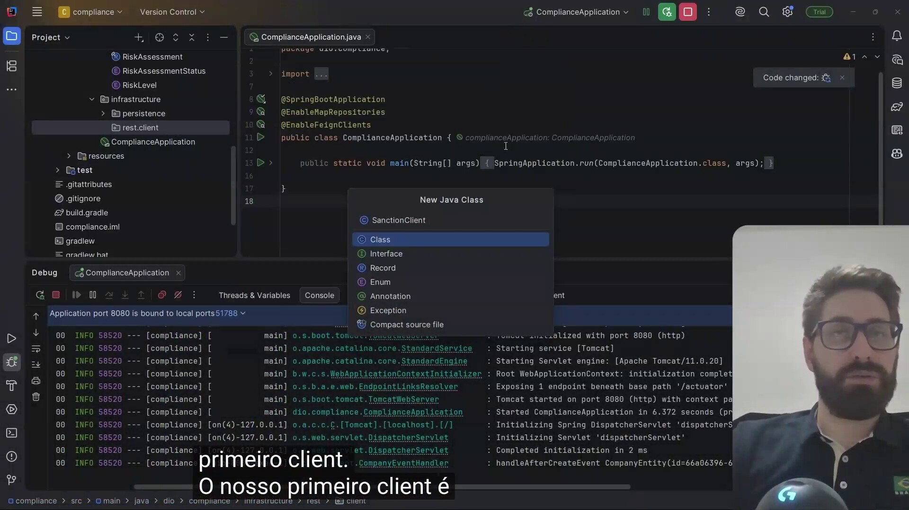
</p>

Dentro do pacote `rest`, é criado o subpacote `client`, formando `dio.compliance.infrastructure.rest.client`. Quando uma aplicação faz requisições para uma API externa, o componente responsável costuma ser chamado de *REST client* — esse é o padrão de nomenclatura adotado aqui para deixar essa responsabilidade explícita na estrutura do projeto.

#### Criando a interface SanctionClient

<p align="center">
  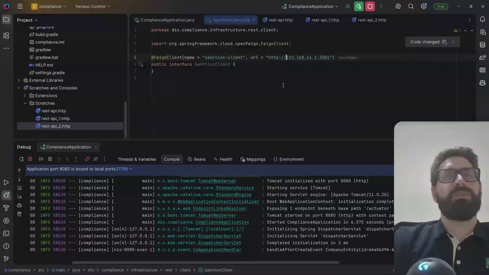
</p>

Dentro do pacote `client`, é criada a primeira interface Feign client do projeto: `SanctionClient`, responsável por consumir a API mocada de sanções (KYC) criada anteriormente no Mockoon.

#### Anotando o SanctionClient com @FeignClient

<p align="center">
  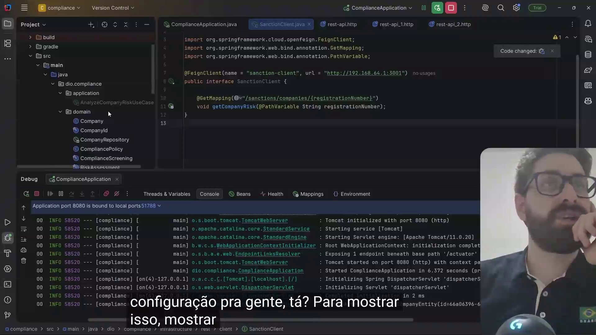
</p>

```java
package dio.compliance.infrastructure.rest.client;

import org.springframework.cloud.openfeign.FeignClient;

@FeignClient(name = "sanction-client", url = "http://192.168.64.1:3001")
public interface SanctionClient {
}
```

A interface é anotada com `@FeignClient`, informando um `name` (identificador do client, `sanction-client`) e a `url` base do serviço — nesse caso, o endereço e a porta 3001 onde o mock KYC está rodando no Mockoon. Só com essa anotação, o Open Feign já traz toda a configuração básica de comunicação, podendo inclusive ser complementada com uma classe de configuração própria, se necessário.

#### Implementando o método getCompanyRisk

<p align="center">
  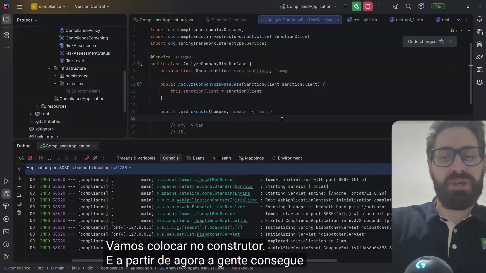
</p>

```java
@FeignClient(name = "sanction-client", url = "http://192.168.64.1:3001")
public interface SanctionClient {

    @GetMapping("/sanctions/companies/{registrationNumber}")
    void getCompanyRisk(@PathVariable String registrationNumber);
}
```

O método `getCompanyRisk` é declarado na interface, anotado com `@GetMapping`, apontando para a rota `/sanctions/companies/{registrationNumber}` — exatamente a mesma rota configurada no mock. O parâmetro é vinculado com `@PathVariable`, da mesma forma que seria feito em um controller REST comum. Basta essa assinatura de método para que o Open Feign monte toda a chamada HTTP correspondente, sem necessidade de implementação manual.

#### Injetando o SanctionClient no use case

<p align="center">
  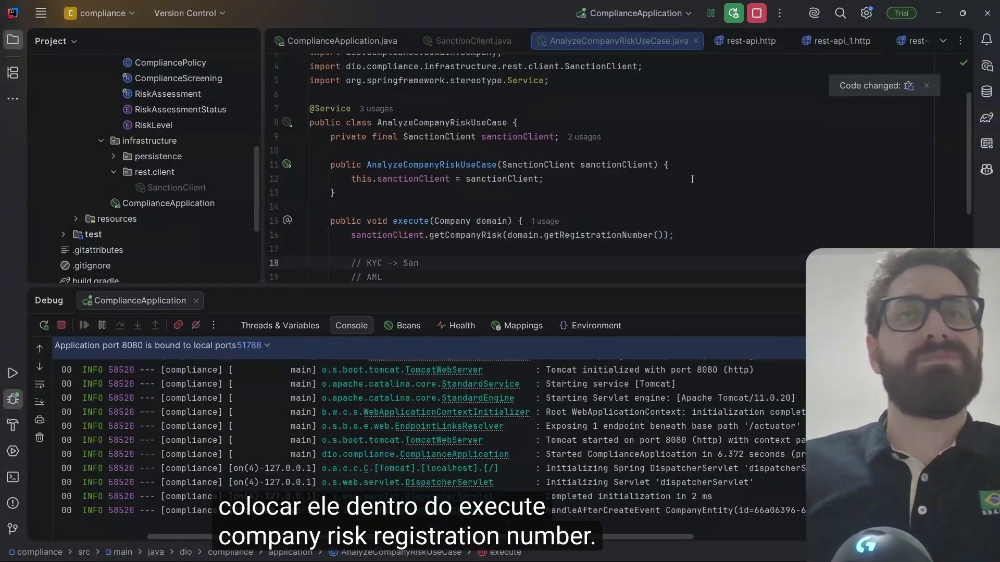
</p>

```java
import dio.compliance.domain.Company;
import dio.compliance.infrastructure.rest.client.SanctionClient;
import org.springframework.stereotype.Service;

@Service
public class AnalyzeCompanyRiskUseCase {
    private final SanctionClient sanctionClient;

    public AnalyzeCompanyRiskUseCase(SanctionClient sanctionClient) {
        this.sanctionClient = sanctionClient;
    }

    public void execute(Company domain) {

        // KYC -> San
        // AML

    }
}
```

O `SanctionClient` é injetado no `AnalyzeCompanyRiskUseCase` através do construtor, seguindo o mesmo padrão de injeção de dependência já usado no `CompanyEventHandler`. Vale notar que, nesse cenário de teste, uma classe de infraestrutura está sendo injetada diretamente no use case — o que não é o ideal em uma arquitetura limpa, mas é aceitável para validar a integração neste momento da aula.

#### Chamando o SanctionClient dentro do execute

<p align="center">
  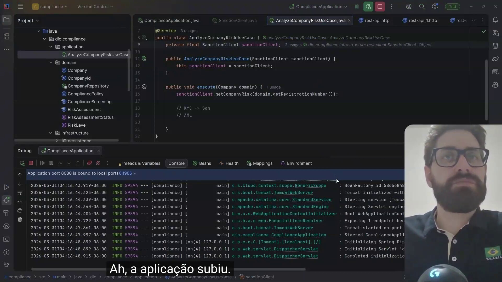
</p>

```java
public void execute(Company domain) {
    sanctionClient.getCompanyRisk(domain.getRegistrationNumber());

    // KYC -> San
    // AML

}
```

Dentro do método `execute`, o `sanctionClient.getCompanyRisk(...)` é chamado passando o número de registro da empresa (`domain.getRegistrationNumber()`). A partir desse ponto, ao rodar a aplicação, já é possível verificar se a requisição está de fato chegando até a API mocada.

#### Aplicação no ar, pronta para receber o evento

<p align="center">
  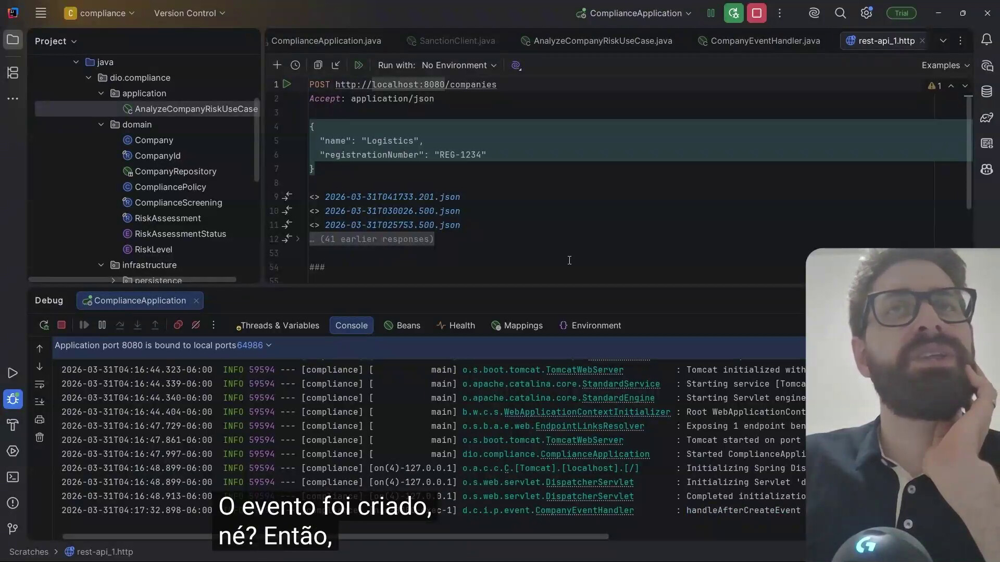
</p>

```java
package dio.compliance.application;

import dio.compliance.domain.Company;
import dio.compliance.infrastructure.rest.client.SanctionClient;
import org.springframework.stereotype.Service;

@Service
public class AnalyzeCompanyRiskUseCase {
    private final SanctionClient sanctionClient;

    public AnalyzeCompanyRiskUseCase(SanctionClient sanctionClient) {
        this.sanctionClient = sanctionClient;
    }

    public void execute(Company domain) {
        sanctionClient.getCompanyRisk(domain.getRegistrationNumber());

        // KYC -> San
        // AML

    }
}
```

Com a aplicação Compliance rodando, os logs no console confirmam que ela subiu corretamente. O Mockoon (API mocada) também é reaberto, com os logs limpos, para acompanhar em tempo real se a requisição feita pelo `SanctionClient` chega até o mock quando o fluxo for disparado.

#### Disparando o evento com uma nova empresa

<p align="center">
  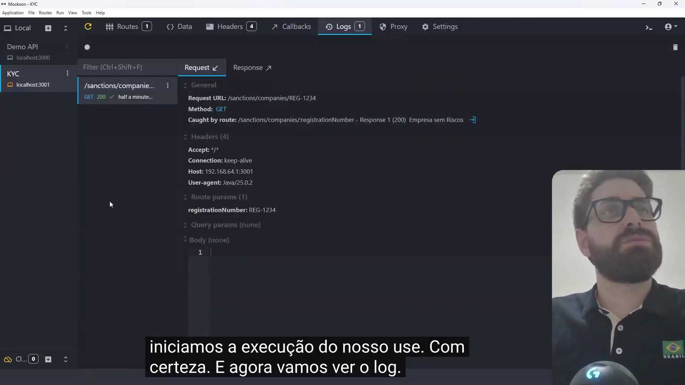
</p>

```http
POST http://localhost:8080/companies
Accept: application/json

{
  "name": "Logistics",
  "registrationNumber": "REG-1234"
}
```

Uma requisição POST é enviada para a aplicação, criando uma nova empresa chamada "Logistics" com o número de registro "REG-1234". Essa criação dispara o evento `handleAfterCreateEvent`, que por sua vez aciona o `AnalyzeCompanyRiskUseCase` e, consequentemente, a chamada ao `SanctionClient`.

#### Confirmando a requisição no log do Mockoon

<p align="center">
  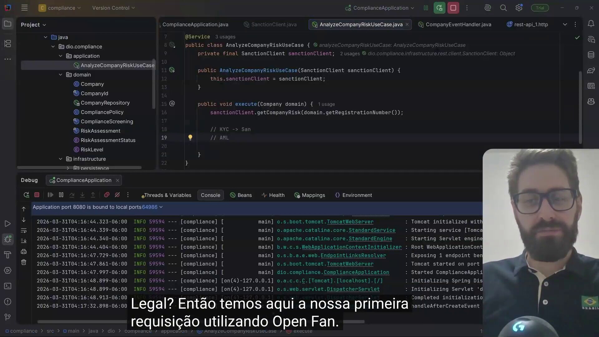
</p>

Nos logs do Mockoon, aparece o registro da requisição `GET /sanctions/companies/REG-1234`, capturada pela rota `/sanctions/companies/:registrationNumber` e respondida com status 200 — exatamente o número de registro da empresa criada no passo anterior. Isso confirma que a primeira integração via Spring Cloud OpenFeign está funcionando de ponta a ponta: da criação da empresa até a chamada real ao serviço externo mocado.

#### Material de Apoio Até Esta Etapa

- Arquivos do projeto nesta etapa: [000-Midia_e_Anexos/etapas_do_codigo/compliance_ate_o_video04.zip](./000-Midia_e_Anexos/etapas_do_codigo/compliance_ate_o_video04.zip)
- [002-Tutorial_Compliance_OpenFeign_Videos03a04.md](./002-Tutorial_Compliance_OpenFeign_Videos03a04.md)

### 🟩 Vídeo 05 - Monitorando Requisições e Respostas

<video width="60%" controls>
  <source src="000-Midia_e_Anexos/bootcamp_ntt_data_java_spring_ai-modulo.04-curso.04-video_05.webm" type="video/webm">
  Seu navegador não suporta vídeo HTML5.
</video>

link do vídeo: https://web.dio.me/track/ntt-data-2026-ai-java-back-end/course/consumindo-apis-externas-com-o-spring-cloud-openfeign/learning/d8b71ec3-0d63-44ad-a6a9-dbc2bf06e0fb?autoplay=1

### Anotações

<p align="center">
  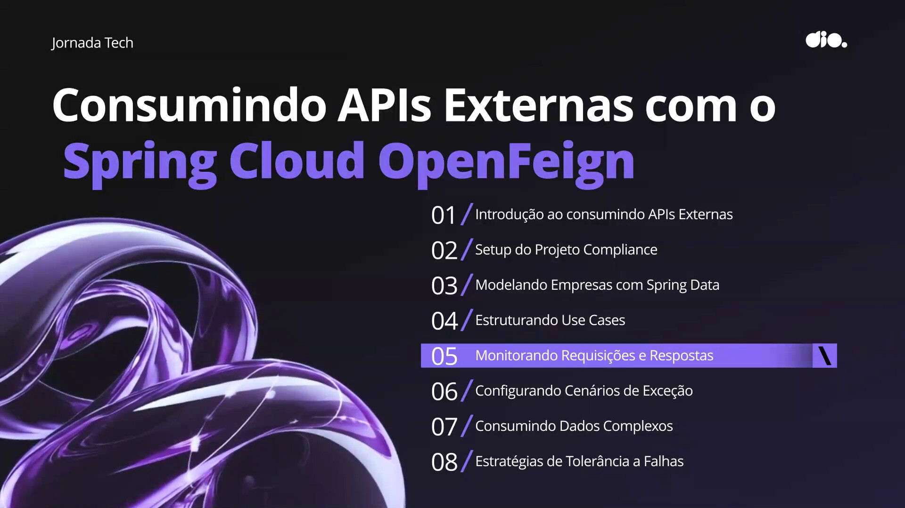
</p>

Slide de abertura da aula "Consumindo APIs Externas com o Spring Cloud OpenFeign", parte da Jornada Tech. O sumário lista oito tópicos do módulo (introdução ao consumo de APIs externas, setup do projeto Compliance, modelagem de empresas, estruturação de use cases, monitoramento de requisições e respostas, cenários de exceção, consumo de dados complexos e estratégias de tolerância a falhas), com o item **05 – Monitorando Requisições e Respostas** destacado em roxo, indicando que esse é o tópico tratado a partir deste ponto da aula.

<p align="center">
  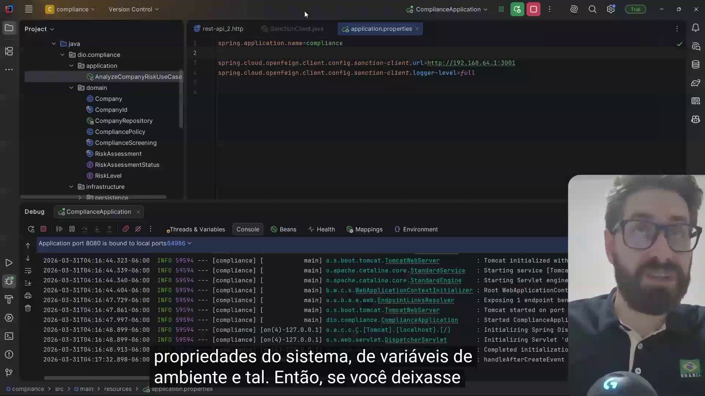
</p>

O arquivo `application.properties` do projeto Compliance é editado para externalizar a configuração do Feign Client `sanction-client`: a URL do serviço mocado e o nível de log (`full`) deixam de estar fixos no código Java e passam a ser propriedades configuráveis, podendo ser sobrescritas por variáveis de ambiente sem necessidade de rebuild da aplicação.

```properties
spring.application.name=compliance

spring.cloud.openfeign.client.config.sanction-client.url=http://192.168.64.1:3001
spring.cloud.openfeign.client.config.sanction-client.logger-level=full
```

<p align="center">
  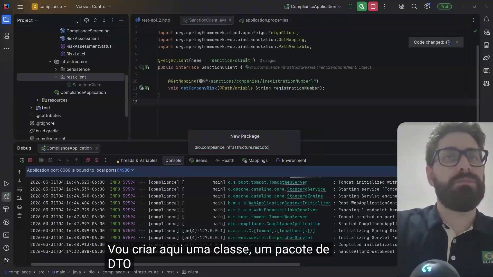
</p>

Com a interface `SanctionClient` já declarada (Feign Client `sanction-client`, expondo o método `getCompanyRisk`), um novo pacote `dio.compliance.infrastructure.rest.dto` é criado no IntelliJ para abrigar os DTOs responsáveis por representar o retorno da API de sanções.

```java
import org.springframework.cloud.openfeign.FeignClient;
import org.springframework.web.bind.annotation.GetMapping;
import org.springframework.web.bind.annotation.PathVariable;

@FeignClient(name = "sanction-client")
public interface SanctionClient {

    @GetMapping("/sanctions/companies/{registrationNumber}")
    void getCompanyRisk(@PathVariable String registrationNumber);
}
```

<p align="center">
  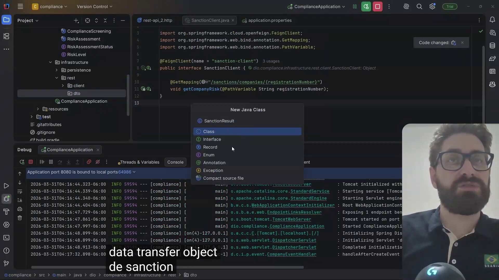
</p>

Dentro do novo pacote `dto`, o menu de criação de classe do IntelliJ é aberto para definir o tipo do novo elemento (Class, Interface, Record, Enum, Annotation, Exception ou Compact source file). O DTO que receberá o resultado da consulta de sanções é nomeado `SanctionResult`, seguindo a convenção de Data Transfer Object.

<p align="center">
  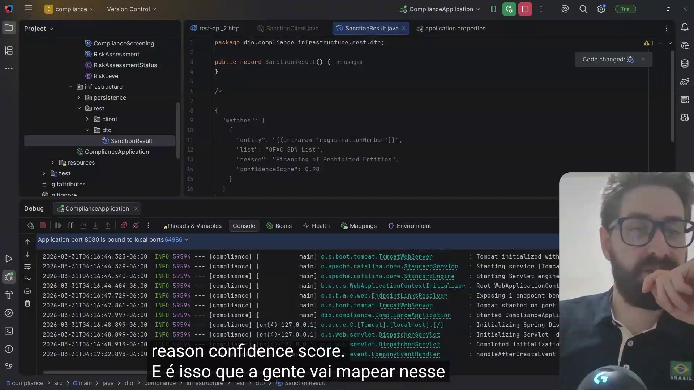
</p>

O record `SanctionResult` é criado vazio no pacote `dio.compliance.infrastructure.rest.dto`. Um comentário de bloco documenta o formato de resposta planejado para a futura API mocada de sanções, servindo de referência para o mapeamento dos campos: entidade, lista, motivo e score de confiança.

```java
package dio.compliance.infrastructure.rest.dto;

public record SanctionResult() {
}

/*
{
  "matches": [
    {
      "entity": "{{urlParam 'registrationNumber'}}",
      "list": "OFAC SDN List",
      "reason": "Financing of Prohibited Entities",
      "confidenceScore": 0.98
    }
  ]
}
*/
```

<p align="center">
  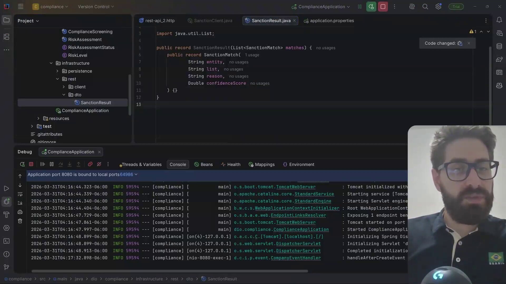
</p>

O record `SanctionResult` é completado com uma lista de `SanctionMatch`, e o record aninhado `SanctionMatch` é definido com os quatro campos previstos no comentário anterior: `entity`, `list`, `reason` e `confidenceScore`.

```java
import java.util.List;

public record SanctionResult(List<SanctionMatch> matches) {
    public record SanctionMatch(
            String entity,
            String list,
            String reason,
            Double confidenceScore
    ) {}
}
```

<p align="center">
  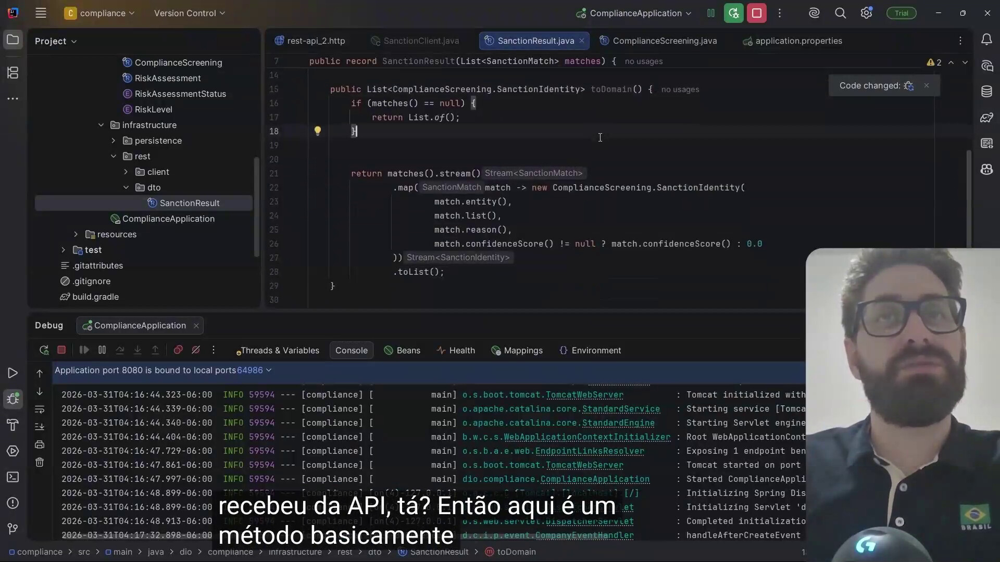
</p>

Com o DTO pronto, um método `toDomain()` é adicionado ao `SanctionResult` para converter a lista de `SanctionMatch` recebida da API em uma lista de `SanctionIdentity`, tipo usado pelo `ComplianceScreening` do domínio. O método percorre os matches com `stream().map(...)`, tratando o caso de lista nula e aplicando um valor padrão quando o score de confiança não é informado.

```java
public List<ComplianceScreening.SanctionIdentity> toDomain() {
    if (matches() == null) {
        return List.of();
    }

    return matches().stream()
            .map(match -> new ComplianceScreening.SanctionIdentity(
                    match.entity(),
                    match.list(),
                    match.reason(),
                    match.confidenceScore() != null ? match.confidenceScore() : 0.0
            ))
            .toList();
}
```

<p align="center">
  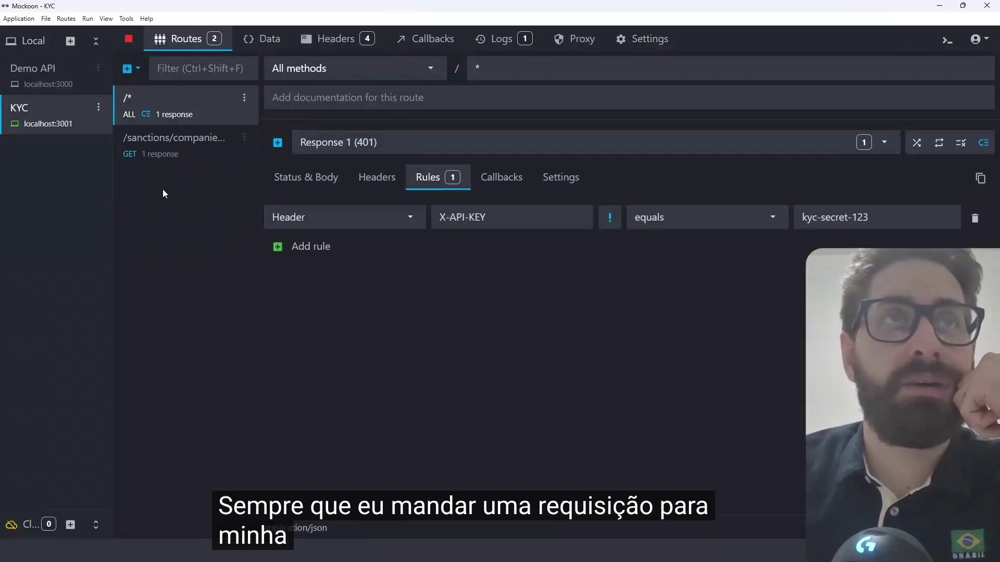
</p>

No Mockoon (API mocada "KYC", `localhost:3001`), uma rota curinga (`/* `, todos os métodos) é configurada como resposta padrão **401 Unauthorized**. Na aba Rules dessa resposta, é definida uma regra de simulação de autenticação: a requisição só passa dessa rota "guarda" se o header `X-API-KEY` for igual a `kyc-secret-123`; caso contrário, o mock intercepta a chamada e retorna 401 antes mesmo de alcançar a rota real de sanções.

<p align="center">
  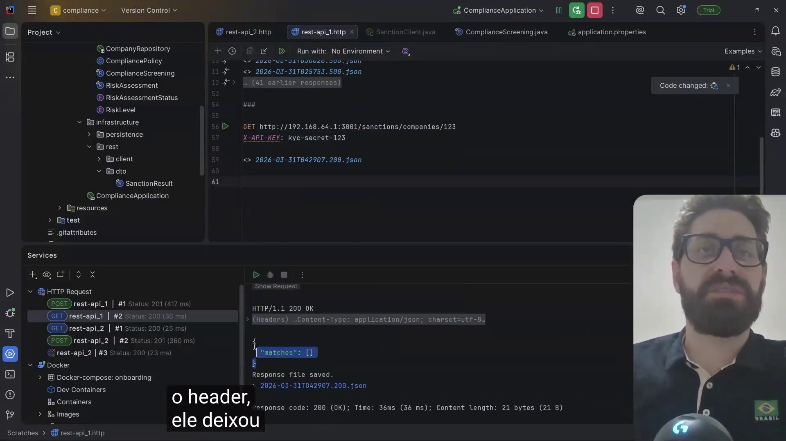
</p>

Teste manual da regra de autenticação feito diretamente no arquivo `.http` do IntelliJ: a requisição `GET` para a rota de sanções agora inclui o header `X-API-KEY` com o valor esperado, e a API mocada responde com **200 OK** e uma lista de matches vazia, confirmando que o header enviado deixou a requisição passar pela regra de autorização configurada no Mockoon.

```http
GET http://192.168.64.1:3001/sanctions/companies/123
X-API-KEY: kyc-secret-123
```

```json
{
  "matches": []
}
```

<p align="center">
  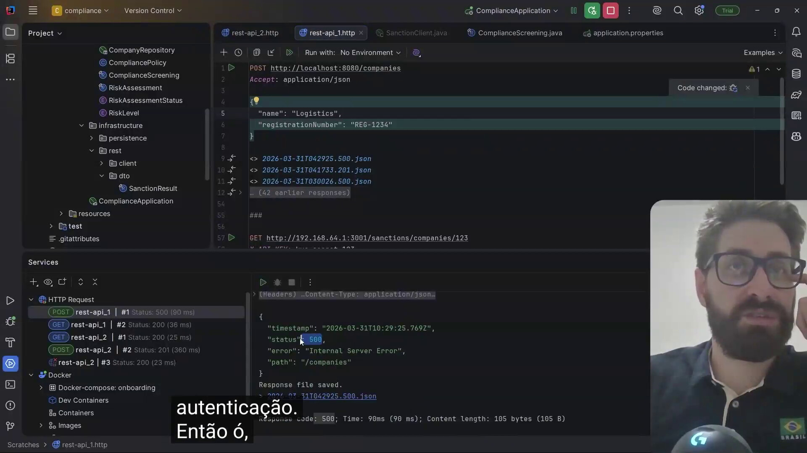
</p>

Agora testando o fluxo completo pela aplicação Compliance: uma requisição `POST /companies` é enviada para criar uma empresa, mas como o Feign Client ainda não envia o header de autenticação exigido pelo mock, a aplicação falha ao chamar a API de sanções e retorna **500 Internal Server Error** para quem chamou o endpoint.

```http
POST http://localhost:8080/companies
Accept: application/json

{
  "name": "Logistics",
  "registrationNumber": "REG-1234"
}
```

```json
{
  "timestamp": "2026-03-31T10:29:25.769Z",
  "status": 500,
  "error": "Internal Server Error",
  "path": "/companies"
}
```

<p align="center">
  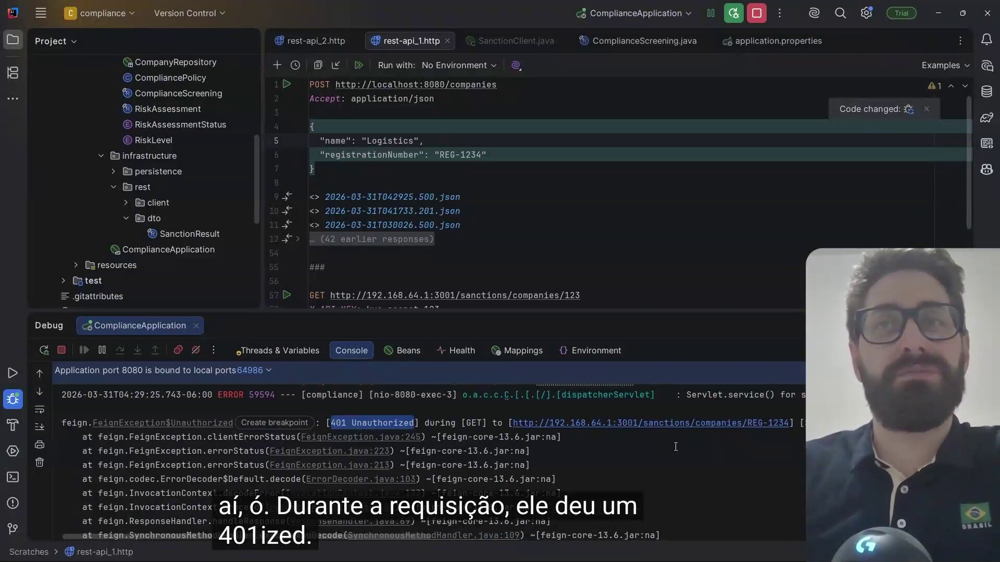
</p>

Investigando a causa do erro 500 no console de debug da aplicação: o log mostra que, durante a chamada Feign para a API de sanções, foi lançada uma `feign.FeignException$Unauthorized`, confirmando que a requisição feita pelo `SanctionClient` retornou 401 por falta do header de autenticação exigido pelo mock.

```
feign.FeignException$Unauthorized: [401 Unauthorized] during [GET] to [http://192.168.64.1:3001/sanctions/companies/REG-1234]
    at feign.FeignException.clientErrorStatus(FeignException.java:245)
    at feign.FeignException.errorStatus(FeignException.java:223)
    at feign.codec.ErrorDecoder$Default.decode(ErrorDecoder.java:103)
    at feign.InvocationContext.decodeError(...)
    at feign.ResponseHandler.handleResponse(...)
    at feign.SynchronousMethodHandler.execute(SynchronousMethodHandler.java:109)
```

<p align="center">
  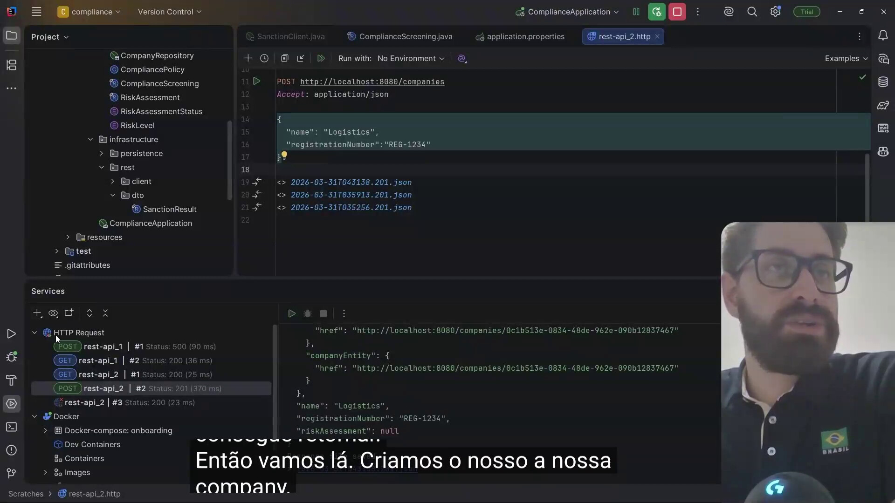
</p>

Após configurar no Feign um header padrão (`X-API-KEY: kyc-secret-123`) enviado em toda requisição e reiniciar a aplicação, a mesma chamada `POST /companies` agora é concluída com sucesso: o corpo de resposta traz o link (`href`) do recurso criado, a entidade da empresa, seus dados (`name`, `registrationNumber`) e o campo `riskAssessment`, ainda nulo nesse momento do fluxo.

```json
{
  "href": "http://localhost:8080/companies/0c1b513e-0834-48de-962e-090b12837467",
  "companyEntity": {
    "href": "http://localhost:8080/companies/0c1b513e-0834-48de-962e-090b12837467"
  },
  "name": "Logistics",
  "registrationNumber": "REG-1234",
  "riskAssessment": null
}
```

<p align="center">
  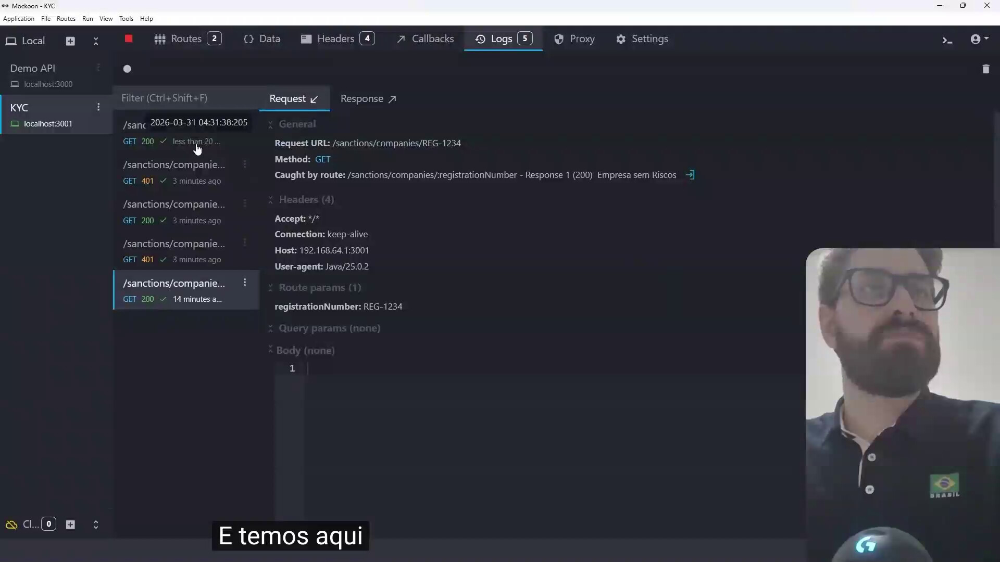
</p>

De volta ao Mockoon, a aba **Logs** confirma o resultado: a requisição `GET /sanctions/companies/REG-1234` foi capturada com status **200**, "Empresa sem Riscos", e o detalhe da requisição mostra o header `X-API-KEY` chegando corretamente, validando de ponta a ponta que o Feign Client agora está autenticado ao consumir a API mocada de sanções.
      
#### Material de Apoio Até Esta Etapa

- Arquivos do projeto nesta etapa: [./000-Midia_e_Anexos/etapas_do_codigo/compliance_ate_o_video05.zip](./000-Midia_e_Anexos/etapas_do_codigo/compliance_ate_o_video05.zip)
- [yyyyyyyyyyyy](./xxxxxxxxxxxxxxxxx)


### 🟩 Vídeo 06 - Configurando Cenários de Exceção

<video width="60%" controls>
  <source src="000-Midia_e_Anexos/bootcamp_ntt_data_java_spring_ai-modulo.04-curso.04-video_06.webm" type="video/webm">
  Seu navegador não suporta vídeo HTML5.
</video>

link do vídeo:

### 🟩 Vídeo 07 - Consumindo Dados Complexos

<video width="60%" controls>
  <source src="000-Midia_e_Anexos/bootcamp_ntt_data_java_spring_ai-modulo.04-curso.04-video_07.webm" type="video/webm">
  Seu navegador não suporta vídeo HTML5.
</video>

link do vídeo:

### 🟩 Vídeo 08 - Estratégias de Tolerância a Falhas

<video width="60%" controls>
  <source src="000-Midia_e_Anexos/bootcamp_ntt_data_java_spring_ai-modulo.04-curso.04-video_08.webm" type="video/webm">
  Seu navegador não suporta vídeo HTML5.
</video>

link do vídeo:

##  Materiais de Apoio

# Certificado: Consumindo APIs Externas com a Spring Cloud OpenFeign

- Link na plataforma: 
- Certificado em pdf: