## Instrutor

- Thiago Poiani (Principal Engineer at Skip)
- Contato Linkedin: / [thpoiani](https://www.linkedin.com/in/thpoiani/)

## Parte 1 - Introdução ao Consumindo APIs Externas

### 🟩 Vídeo 01 - Introdução ao consumindo APIs Externas

<video width="60%" controls>
  <source src="000-Midia_e_Anexos/bootcamp_ntt_data_java_spring_ai-modulo.04-curso.04-video_01.webm" type="video/webm">
  Seu navegador não suporta vídeo HTML5.
</video>

link do vídeo: https://web.dio.me/track/ntt-data-2026-ai-java-back-end/course/consumindo-apis-externas-com-o-spring-cloud-openfeign/learning/ceddcc80-24c5-4e0d-b0a8-45fcbf3d5602?autoplay=1

### Anotações

<p align="center">
  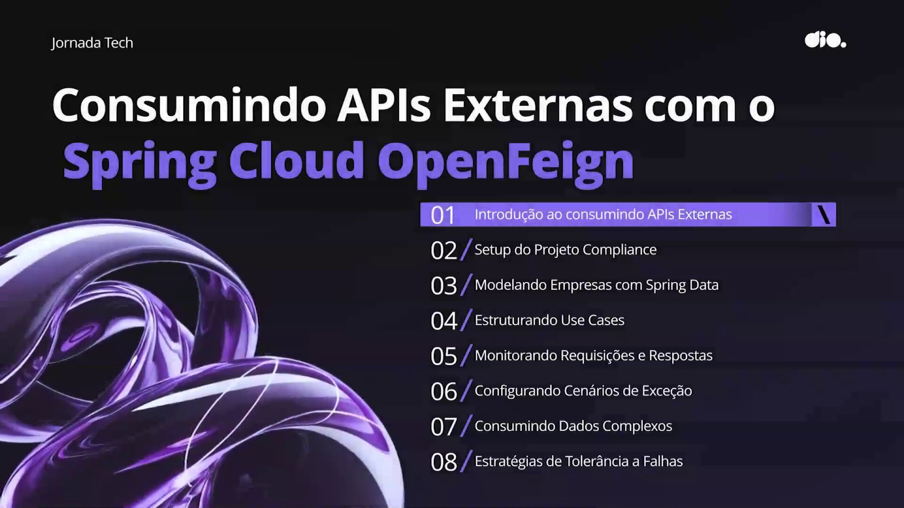
</p>

Slide de abertura do curso "Consumindo APIs Externas com o Spring Cloud OpenFeign", parte da Jornada Tech. À direita, a agenda numerada de 01 a 08 antecipa o percurso da aula: introdução ao consumo de APIs externas, setup do projeto de compliance, modelagem de empresas com Spring Data, estruturação de use cases, monitoramento de requisições e respostas, configuração de cenários de exceção, consumo de dados complexos e estratégias de tolerância a falhas. O tópico em destaque, "Introdução ao consumindo APIs Externas", indica que a aula abre com os fundamentos conceituais antes de avançar para a implementação prática.

<p align="center">
  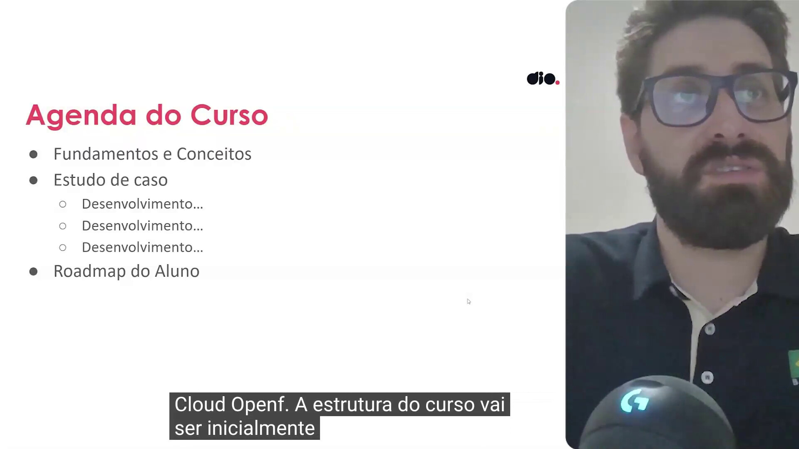
</p>

Slide "Agenda do Curso", que resume a estrutura macro do conteúdo em três blocos principais: Fundamentos e Conceitos, Estudo de Caso (desdobrado em etapas de desenvolvimento) e Roadmap do Aluno. Essa organização confirma o formato anunciado na abertura: primeiro a base teórica sobre consumo de APIs REST, em seguida a construção prática de uma aplicação de estudo de caso, e por fim um vídeo de encerramento com desafios e sugestões de aprofundamento para quem está acompanhando o curso.

<p align="center">
  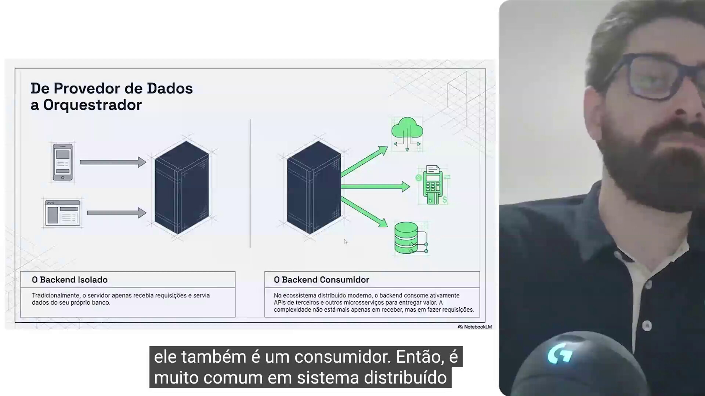
</p>

Slide "De Provedor de Dados a Orquestrador", que contrasta dois papéis de um servidor. Do lado esquerdo, o "Backend Isolado" tradicional apenas recebe requisições de clientes (celular e navegador) e serve dados do próprio banco. Do lado direito, o "Backend Consumidor" mostra o mesmo servidor emitindo requisições ativamente para uma nuvem, um serviço externo e um banco de dados. A ideia central é que um servidor não é apenas um provedor passivo de dados: em um ecossistema distribuído moderno, ele também atua como consumidor, integrando-se a APIs de terceiros ou a outros microsserviços para entregar valor.

<p align="center">
  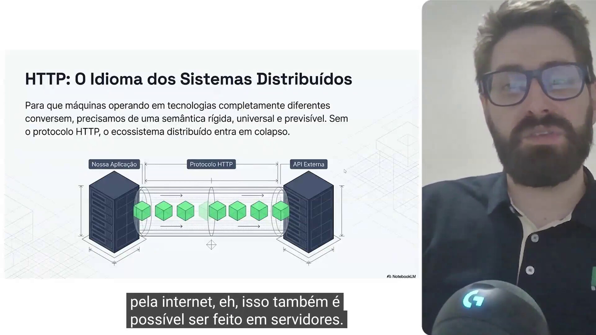
</p>

Slide "HTTP: O Idioma dos Sistemas Distribuídos", que ilustra a comunicação entre "Nossa Aplicação" e uma "API Externa" através do protocolo HTTP, representado como um canal com pacotes de dados trafegando nos dois sentidos. A mensagem do slide é que máquinas construídas em tecnologias diferentes precisam de uma semântica rígida, universal e previsível para conversar entre si — e é exatamente esse papel que o protocolo HTTP cumpre. Assim como um site se comunica com um servidor por meio de uma requisição indo pela internet, um servidor também pode fazer requisições para outro servidor ou para uma API externa, usando esse mesmo canal.

<p align="center">
  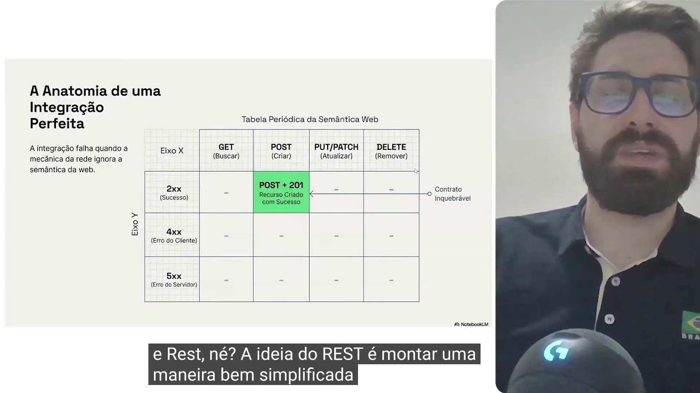
</p>

Slide "A Anatomia de uma Integração Perfeita", apresentando uma "Tabela Periódica da Semântica Web" que cruza os verbos HTTP (GET, POST, PUT/PATCH, DELETE) no eixo X com as faixas de código de resposta (2xx de sucesso, 4xx de erro do cliente, 5xx de erro do servidor) no eixo Y. A célula em destaque combina POST com a faixa 2xx, especificamente o código 201, indicando "Recurso Criado com Sucesso". Essa é a essência do REST: usar a semântica do HTTP para expressar intenções e resultados — o verbo indica a ação desejada (por exemplo, GET para buscar um recurso, POST para criar) e o código de status confirma o que de fato aconteceu na requisição, formando um "contrato inquebrável" entre cliente e servidor. A imagem não contém código-fonte, apenas uma tabela conceitual.

<p align="center">
  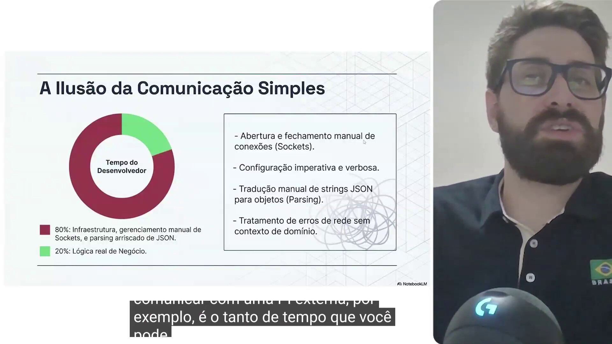
</p>

Slide "A Ilusão da Comunicação Simples", que traz um gráfico de rosca mostrando como o tempo do desenvolvedor costuma ser gasto em uma integração manual: 80% em infraestrutura (gerenciamento manual de sockets e parsing arriscado de JSON) contra apenas 20% em lógica real de negócio. Ao lado, uma lista detalha essas fontes de esforço: abertura e fechamento manual de conexões (sockets), configuração imperativa e verbosa, tradução manual de strings JSON para objetos e tratamento de erros de rede sem contexto de domínio. O slide reforça um ponto prático: fazer uma integração HTTP "na unha" consome bastante tempo — criando a conexão, enviando a requisição e convertendo a resposta JSON em objeto — antes mesmo de o desenvolvedor tocar na regra de negócio propriamente dita. A imagem não apresenta código-fonte, apenas um gráfico e uma lista conceitual.

<p align="center">
  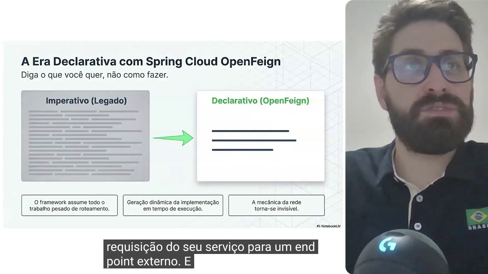
</p>

Slide "A Era Declarativa com Spring Cloud OpenFeign", com o subtítulo "Diga o que você quer, não como fazer". A comparação visual mostra um bloco denso de texto cinza representando a abordagem "Imperativo (Legado)" transformando-se, por uma seta, em um bloco enxuto de poucas linhas representando o "Declarativo (OpenFeign)". Três blocos explicam essa mudança: o framework assume todo o trabalho pesado de roteamento, a implementação é gerada dinamicamente em tempo de execução, e a mecânica de rede torna-se invisível para quem programa. É aqui que entra o OpenFeign como biblioteca do Spring que elimina a necessidade de código imperativo para integrações: não é preciso criar a conexão nem mapear manualmente o JSON para um objeto, pois isso pode ser feito de modo declarativo, por meio de anotações. A imagem é conceitual e não contém código real, apenas uma representação estilizada de blocos de texto.

<p align="center">
  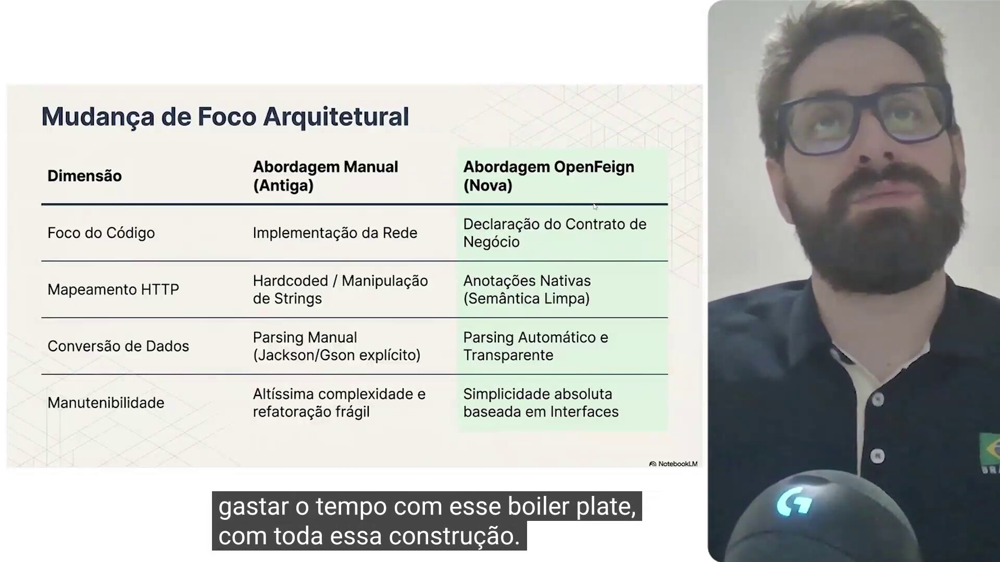
</p>

Slide "Mudança de Foco Arquitetural", organizado como uma tabela comparativa entre a "Abordagem Manual (Antiga)" e a "Abordagem OpenFeign (Nova)" em quatro dimensões: foco do código (implementação da rede vs. declaração do contrato de negócio), mapeamento HTTP (hardcoded/manipulação de strings vs. anotações nativas com semântica limpa), conversão de dados (parsing manual explícito com Jackson/Gson vs. parsing automático e transparente) e manutenibilidade (altíssima complexidade e refatoração frágil vs. simplicidade absoluta baseada em interfaces). Essa tabela sintetiza o ganho de produtividade discutido na aula: ao delegar o boilerplate de infraestrutura para o OpenFeign, o desenvolvedor passa a dedicar seu tempo à construção das regras de negócio e do domínio da aplicação, em vez de reescrever repetidamente a mecânica de comunicação HTTP. Não há código-fonte na imagem, apenas uma tabela comparativa.

<p align="center">
  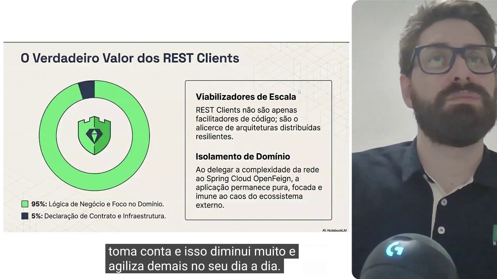
</p>

Slide "O Verdadeiro Valor dos REST Clients", com um gráfico de rosca invertido em relação ao slide anterior sobre a "Ilusão da Comunicação Simples": agora 95% do esforço é atribuído à lógica de negócio e foco no domínio, contra apenas 5% de declaração de contrato e infraestrutura. Ao lado, os textos "Viabilizadores de Escala" e "Isolamento de Domínio" reforçam que REST Clients não são apenas um facilitador de código, mas o alicerce de arquiteturas distribuídas resilientes: ao delegar a complexidade da rede ao Spring Cloud OpenFeign, a aplicação permanece pura, focada no domínio e imune ao caos do ecossistema externo. É a conclusão direta da comparação entre as abordagens manual e declarativa — o tempo do desenvolvedor deixa de ser consumido por integração e passa a ser investido, quase que integralmente, no que realmente importa para o negócio. A imagem não contém código-fonte, apenas um gráfico e blocos de texto explicativo.

<p align="center">
  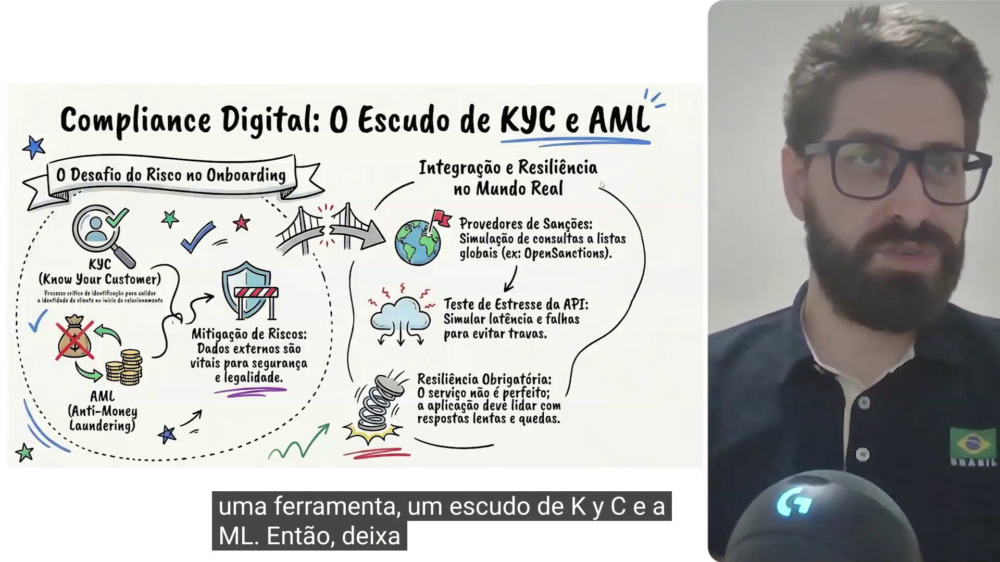
</p>

Slide "Compliance Digital: O Escudo de KYC e AML", que introduz o estudo de caso do curso por meio de uma ilustração estilo mapa mental. À esquerda, o "Desafio do Risco no Onboarding" reúne os conceitos de KYC (Know Your Customer), descrito como o processo crítico de identificação para validar a identidade do cliente no início do relacionamento, e AML (Anti-Money Laundering), ligado à mitigação de riscos por meio de dados externos vitais para segurança e legalidade. À direita, o slide detalha a "Integração e Resiliência no Mundo Real": provedores de sanções (simulação de consultas a listas globais, como a OpenSanctions), teste de estresse da API (simular latência e falhas para evitar travamentos) e resiliência obrigatória, já que o serviço consumido não é perfeito e a aplicação precisa lidar com respostas lentas e quedas. Isso conecta diretamente com o estudo de caso anunciado: uma aplicação que mantém empresas cadastradas e consulta APIs mocadas para verificar se essas empresas possuem sanções ou diretores classificados como PEP (pessoa politicamente exposta), sinalizando risco de compliance como o exigido, por exemplo, no controle de restaurantes integrados a uma plataforma de delivery.      


### 🟩 Vídeo 02 - Setup do Projeto Compliance

<video width="60%" controls>
  <source src="000-Midia_e_Anexos/bootcamp_ntt_data_java_spring_ai-modulo.04-curso.04-video_02.webm" type="video/webm">
  Seu navegador não suporta vídeo HTML5.
</video>

link do vídeo: https://web.dio.me/track/ntt-data-2026-ai-java-back-end/course/consumindo-apis-externas-com-o-spring-cloud-openfeign/learning/2abe0939-7196-418c-9611-67ec341f8179?autoplay=1

### Anotações

#### Abertura: Consumindo APIs Externas com Spring Cloud OpenFeign

<p align="center">
  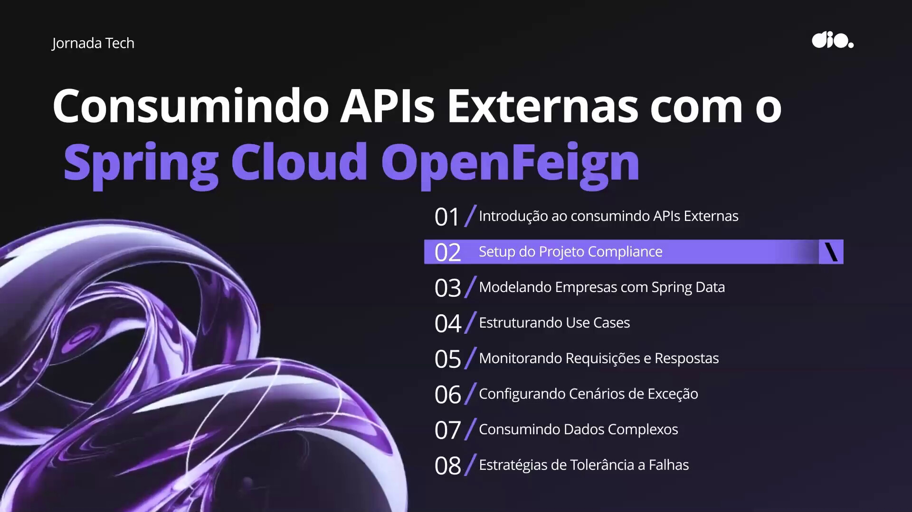
</p>

Slide de abertura da aula "Jornada Tech", apresentando o tema: consumo de APIs externas usando **Spring Cloud OpenFeign**. O sumário lista os 8 tópicos da jornada, com destaque para o tópico 2 — **"Setup do Projeto Compliance"** — etapa que será desenvolvida nesta aula.


#### Criação do projeto Spring Boot

<p align="center">
  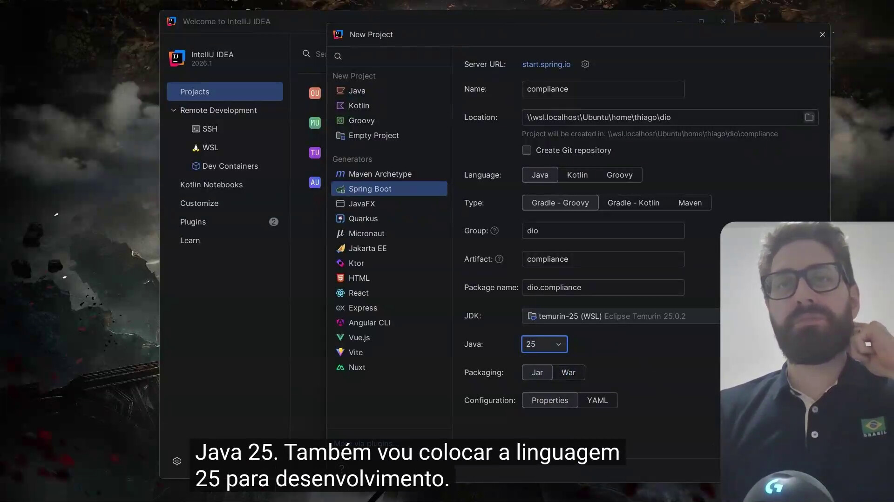
</p>

Tela de criação de novo projeto no IntelliJ IDEA usando o gerador Spring Boot. O projeto é nomeado **compliance**, grupo **dio**, pacote **dio.compliance**, com build **Gradle (Groovy)** e linguagem Java, utilizando o **JDK Java 25** tanto para o toolchain quanto para o nível de linguagem de desenvolvimento.


#### Criação do pacote domain

<p align="center">
  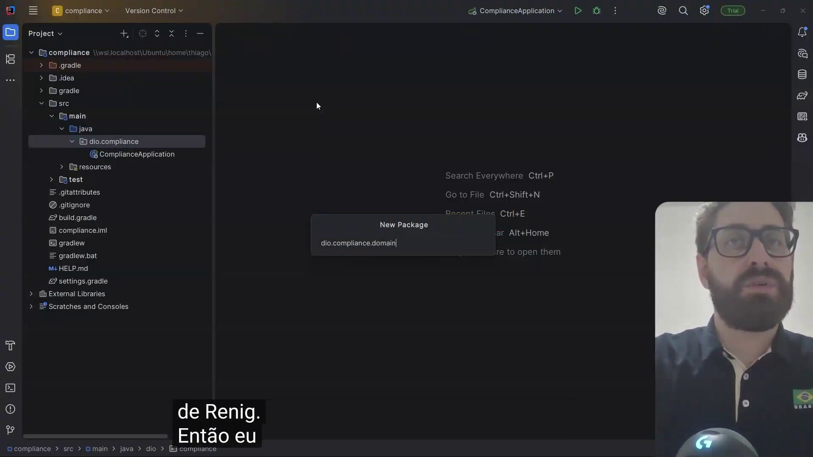
</p>

Criação do primeiro pacote da estrutura do projeto: **dio.compliance.domain**. Esse pacote concentrará as regras de negócio da aplicação, seguindo os princípios de Domain Driven Design (DDD), com o mínimo de dependência de frameworks externos.


#### Criação do pacote application

<p align="center">
  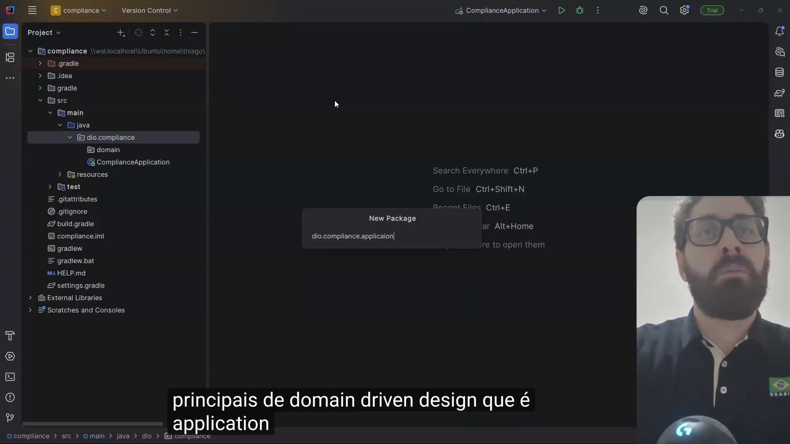
</p>

Criação do pacote **dio.compliance.application**, responsável pela orquestração e interação entre as camadas de domínio e infraestrutura.


#### Criação do pacote infrastructure

<p align="center">
  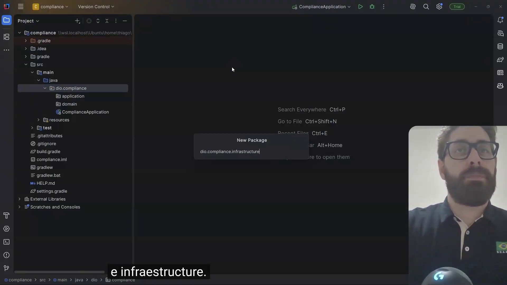
</p>

Criação do pacote **dio.compliance.infrastructure**, destinado às implementações concretas de acesso a dados e comunicação com APIs externas, completando os três pacotes principais da arquitetura DDD do projeto.


#### Configuração inicial do build.gradle

<p align="center">
  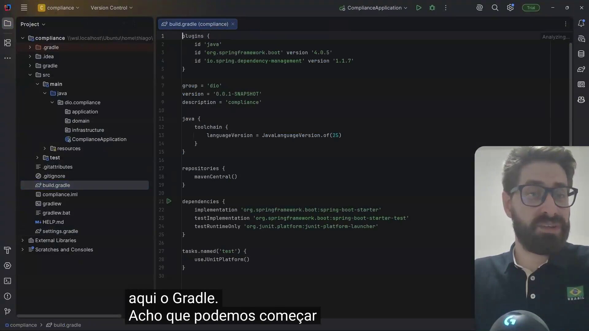
</p>

Arquivo `build.gradle` gerado automaticamente na criação do projeto, já configurado com os plugins do Spring Boot 4.0.5 e do gerenciamento de dependências, toolchain Java 25 e as dependências mínimas de starter e testes.

```groovy
plugins {
    id 'java'
    id 'org.springframework.boot' version '4.0.5'
    id 'io.spring.dependency-management' version '1.1.7'
}

group = 'dio'
version = '0.0.1-SNAPSHOT'
description = 'compliance'

java {
    toolchain {
        languageVersion = JavaLanguageVersion.of(25)
    }
}

repositories {
    mavenCentral()
}

dependencies {
    implementation 'org.springframework.boot:spring-boot-starter'
    testImplementation 'org.springframework.boot:spring-boot-starter-test'
    testRuntimeOnly 'org.junit.platform:junit-platform-launcher'
}

tasks.named('test') {
    useJUnitPlatform()
}
```


#### Consultando o Project Lombok

<p align="center">
  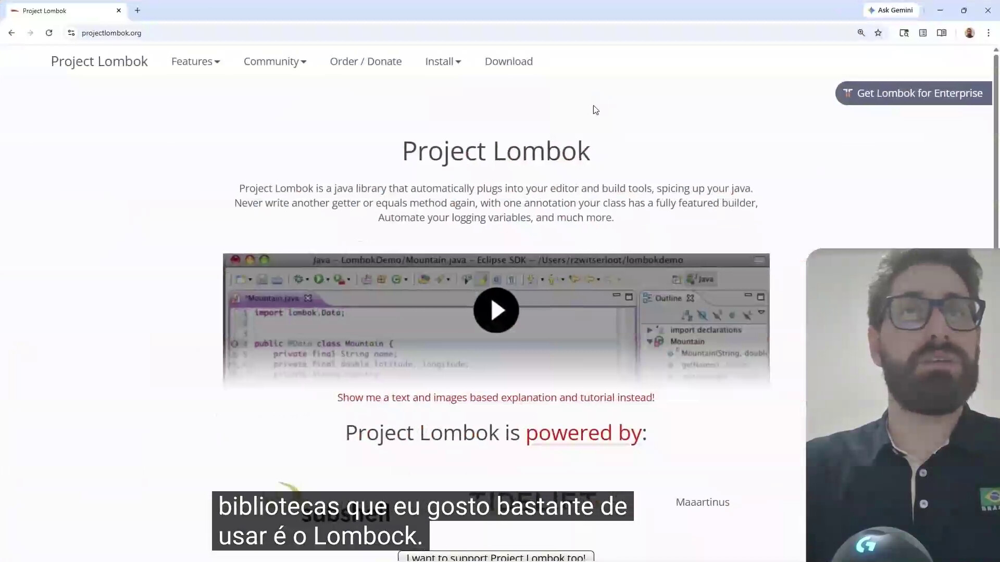
</p>

Página oficial do **Project Lombok**, biblioteca Java que gera automaticamente métodos como getters, setters e construtores por meio de anotações, reduzindo código repetitivo (boilerplate).


#### Plugin io.freefair.lombok no Gradle

<p align="center">
  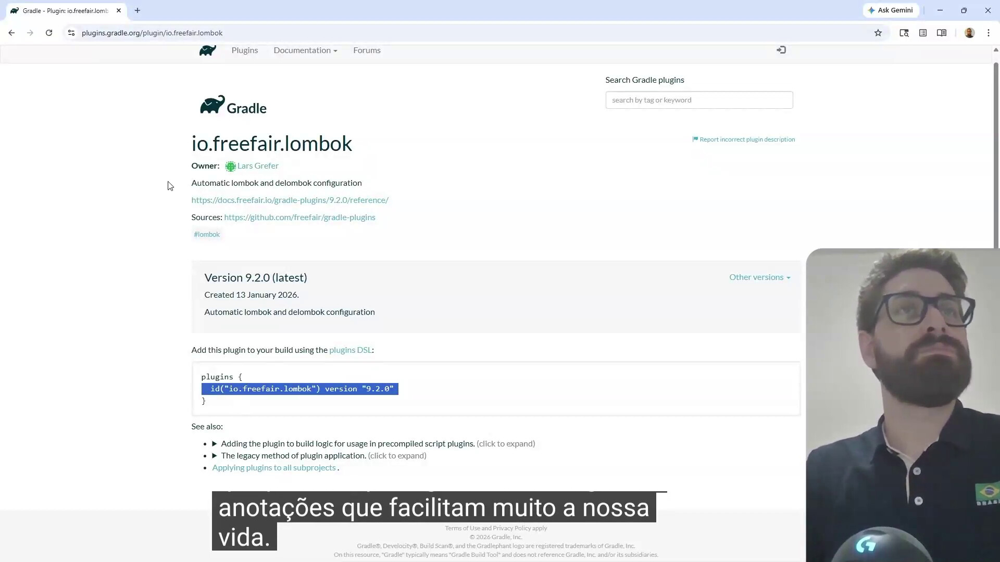
</p>

Página do plugin Gradle **io.freefair.lombok** (versão 9.2.0), utilizado para configurar automaticamente o Lombok no processo de build, facilitando o uso das suas anotações no projeto.


#### Adição do plugin Lombok ao build.gradle

<p align="center">
  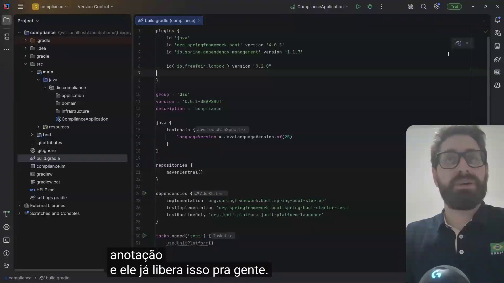
</p>

Inclusão do plugin `io.freefair.lombok` no bloco `plugins` do `build.gradle`, o que já libera automaticamente o uso das anotações do Lombok no projeto.

```groovy
plugins {
    id 'java'
    id 'org.springframework.boot' version '4.0.5'
    id 'io.spring.dependency-management' version '1.1.7'

    id("io.freefair.lombok") version "9.2.0"
}
```


#### Dependências adicionais: Spring Data KeyValue, Data Rest, Web e Actuator

<p align="center">
  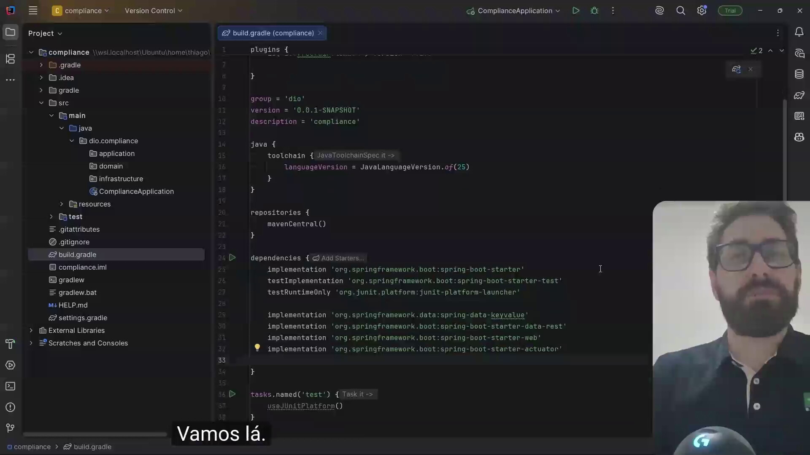
</p>

Dependências adicionadas ao bloco `dependencies`: **spring-data-keyvalue** (persistência em memória via repositórios, sem banco de dados tradicional), **spring-boot-starter-data-rest** (exposição automática de repositórios como endpoints REST), **spring-boot-starter-web** (subida da aplicação como serviço web) e **spring-boot-starter-actuator** (monitoramento da saúde da aplicação).

```groovy
dependencies {
    implementation 'org.springframework.boot:spring-boot-starter'
    testImplementation 'org.springframework.boot:spring-boot-starter-test'
    testRuntimeOnly 'org.junit.platform:junit-platform-launcher'

    implementation 'org.springframework.data:spring-data-keyvalue'
    implementation 'org.springframework.boot:spring-boot-starter-data-rest'
    implementation 'org.springframework.boot:spring-boot-starter-web'
    implementation 'org.springframework.boot:spring-boot-starter-actuator'
}
```


#### Classe principal com @EnableMapRepositories

<p align="center">
  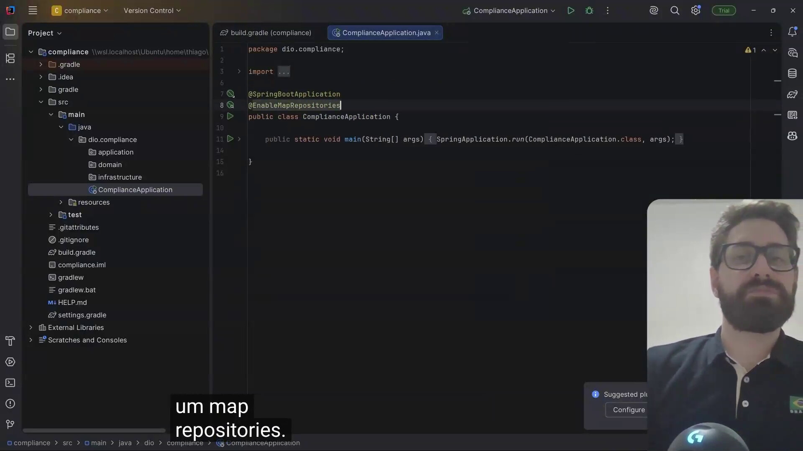
</p>

Classe principal da aplicação, anotada com `@SpringBootApplication` e `@EnableMapRepositories`. Essa segunda anotação é necessária para habilitar os repositórios do Spring Data KeyValue, que armazenam os dados em memória (map) em vez de em um banco de dados relacional.

```java
package dio.compliance;

import ...

@SpringBootApplication
@EnableMapRepositories
public class ComplianceApplication {

    public static void main(String[] args) { SpringApplication.run(ComplianceApplication.class, args); }

}
```


#### Criação da classe Company

<p align="center">
  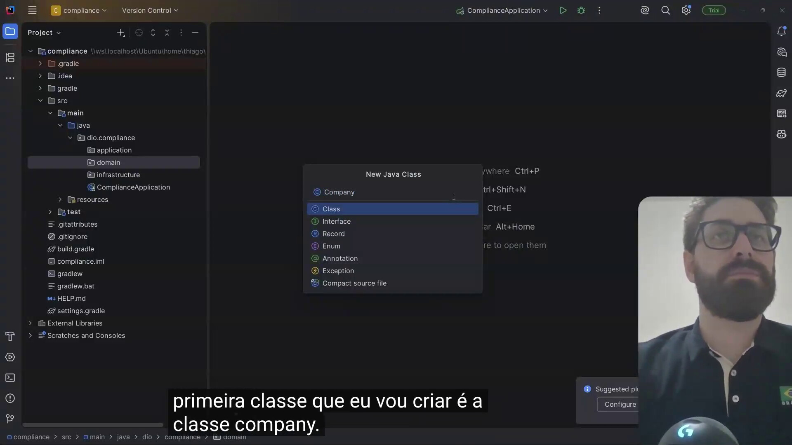
</p>

Criação da primeira classe de domínio do projeto: **Company**. Ela representa a entidade central do sistema — as empresas que passarão pelo processo de compliance.


#### Campo id tipado e criação do CompanyId

<p align="center">
  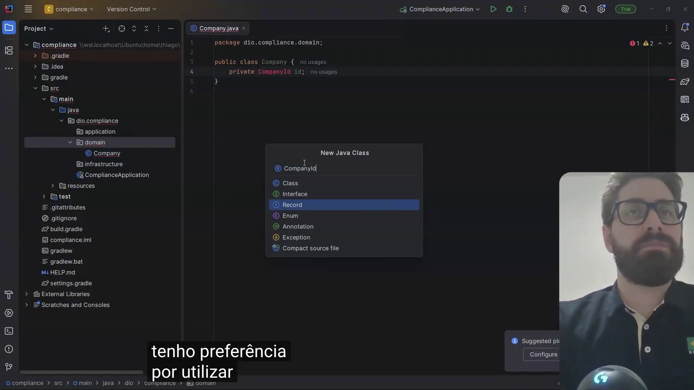
</p>

A classe `Company` recebe um campo `id` do tipo `CompanyId`, um identificador fortemente tipado (strongly typed ID). Em seguida, inicia-se a criação da classe `CompanyId`, com preferência por defini-la como **record**, para tornar mais claro qual identificador está sendo passado entre métodos.

```java
public class Company {
    private CompanyId id;
}
```


#### Record CompanyId

<p align="center">
  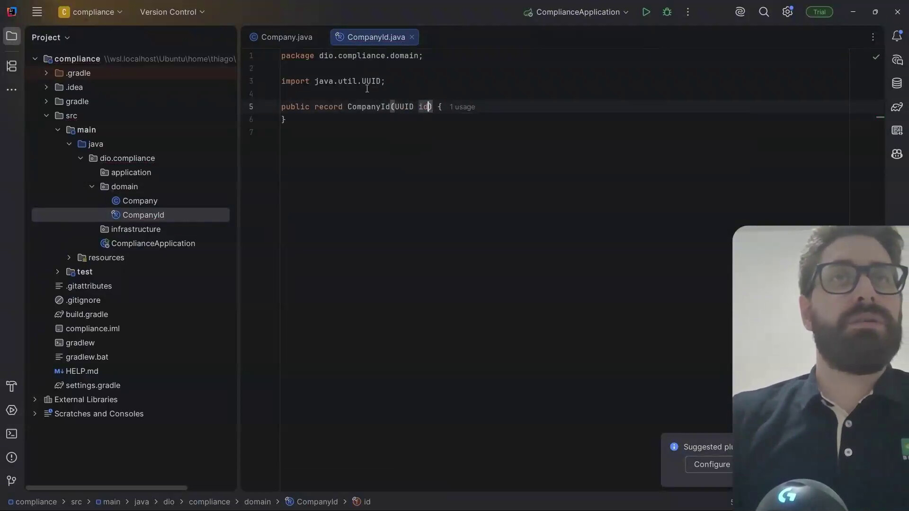
</p>

Definição do record `CompanyId`, que encapsula um `UUID` como identificador único e fortemente tipado da entidade `Company`.

```java
package dio.compliance.domain;

import java.util.UUID;

public record CompanyId(UUID id) {
}
```


#### Company com identificador definido

<p align="center">
  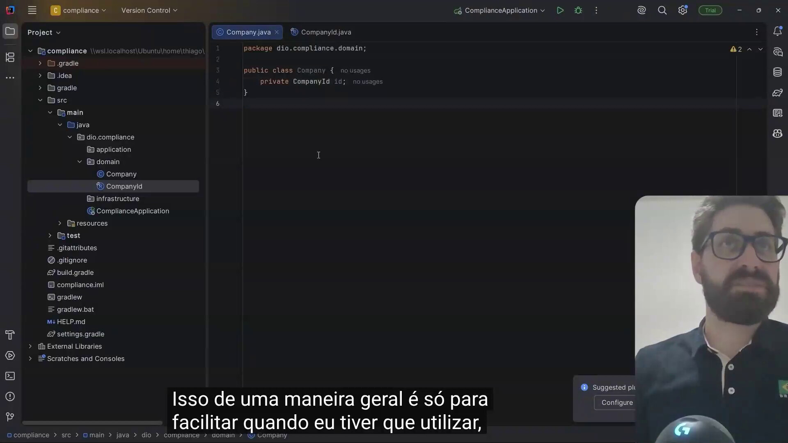
</p>

Com o `CompanyId` definido, a classe `Company` passa a utilizá-lo como tipo do seu identificador, facilitando a identificação do parâmetro correto ao passar esse valor entre métodos da aplicação.

```java
public class Company {
    private CompanyId id;
}
```


#### Campos completos da entidade Company

<p align="center">
  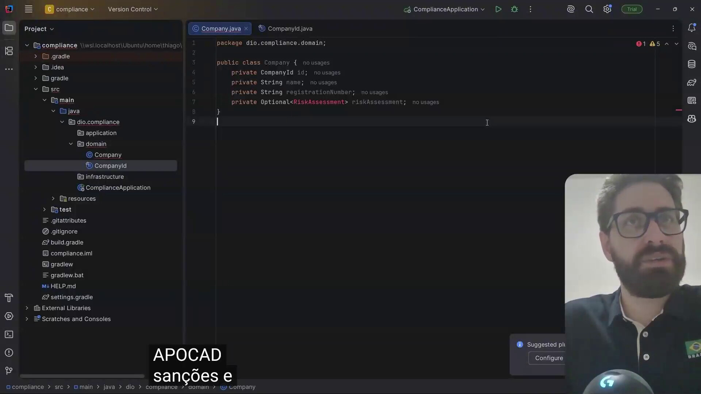
</p>

A entidade `Company` recebe os demais atributos: `name` (nome da empresa), `registrationNumber` (número de registro/CNPJ) e um `Optional<RiskAssessment>`, representando a avaliação de risco de compliance, que pode ainda não existir no momento do cadastro.

```java
public class Company {
    private CompanyId id;
    private String name;
    private String registrationNumber;
    private Optional<RiskAssessment> riskAssessment;
}
```


#### Record RiskAssessment

<p align="center">
  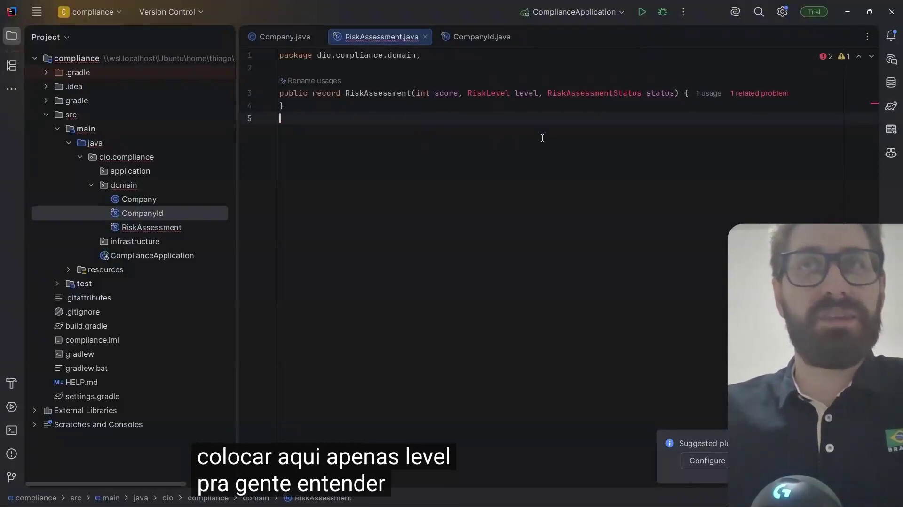
</p>

`RiskAssessment` é modelado como **record**, já que não possui um ciclo de vida ou identidade próprios tão bem definidos quanto `Company`. Ele armazena o score da avaliação, o nível de risco (`RiskLevel`) e o status da avaliação.

```java
public record RiskAssessment(int score, RiskLevel level, RiskAssessmentStatus status) {
}
```


#### Enum RiskLevel

<p align="center">
  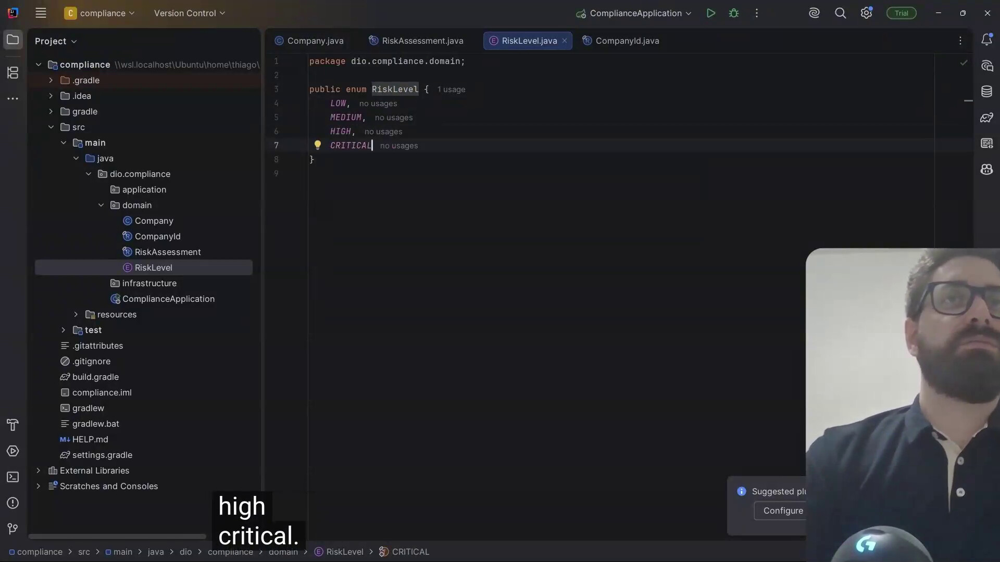
</p>

Enum `RiskLevel` com os quatro níveis de risco possíveis para uma empresa: **Low**, **Medium**, **High** e **Critical**.

```java
public enum RiskLevel {
    LOW,
    MEDIUM,
    HIGH,
    CRITICAL
}
```


#### Interface CompanyRepository

<p align="center">
  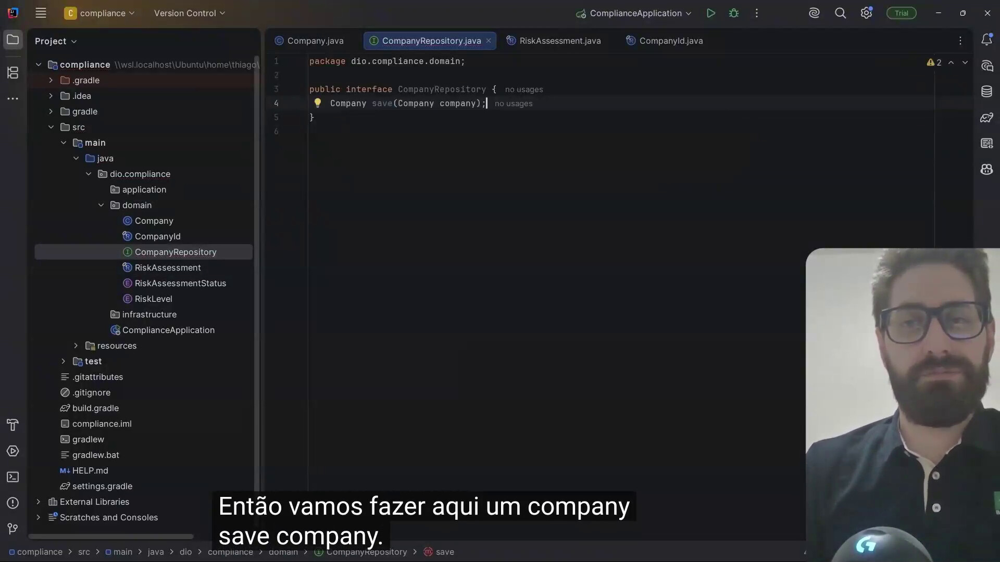
</p>

Interface `CompanyRepository` definida na camada de domínio, contendo inicialmente o método `save`. A implementação concreta desse repositório ficará na camada de infraestrutura, seguindo o princípio de inversão de dependência — o domínio define o contrato, e a infraestrutura o implementa.

```java
public interface CompanyRepository {
    Company save(Company company);
}
```


#### Anotações Lombok em Company

<p align="center">
  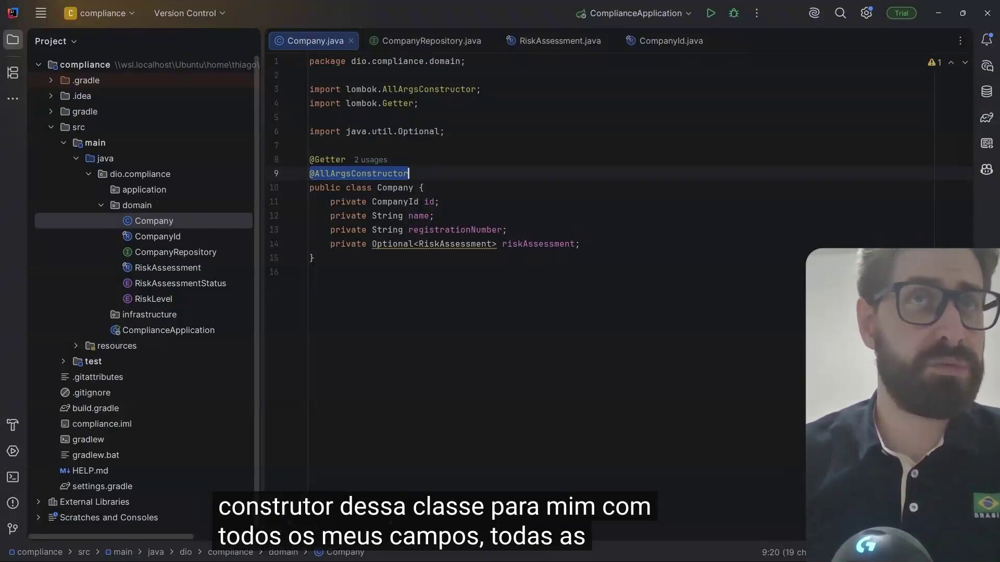
</p>

A classe `Company` recebe as anotações do Lombok `@Getter` (gera automaticamente os getters de todos os campos) e `@AllArgsConstructor` (gera um construtor com todos os campos da classe), eliminando a necessidade de escrever esse código manualmente.

```java
import lombok.AllArgsConstructor;
import lombok.Getter;

import java.util.Optional;

@Getter
@AllArgsConstructor
public class Company {
    private CompanyId id;
    private String name;
    private String registrationNumber;
    private Optional<RiskAssessment> riskAssessment;
}
```


#### Record ComplianceScreening e SanctionIdentity

<p align="center">
  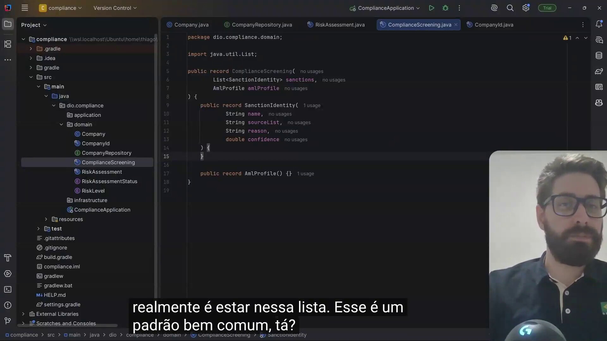
</p>

Criação da classe `ComplianceScreening`, responsável por armazenar os dados retornados pela consulta de compliance a uma API externa. Ela contém uma lista de sanções (`SanctionIdentity`) — com nome, lista de origem da sanção, motivo e nível de confiança do resultado — e um perfil de anti-lavagem de dinheiro (`AmlProfile`), ainda vazio nesse momento.

```java
package dio.compliance.domain;

import java.util.List;

public record ComplianceScreening(
        List<SanctionIdentity> sanctions,
        AmlProfile amlProfile
) {
    public record SanctionIdentity(
            String name,
            String sourceList,
            String reason,
            double confidence
    ) {
    }

    public record AmlProfile() {}
}
```


#### Exemplo de serviço: OpenSanctions

<p align="center">
  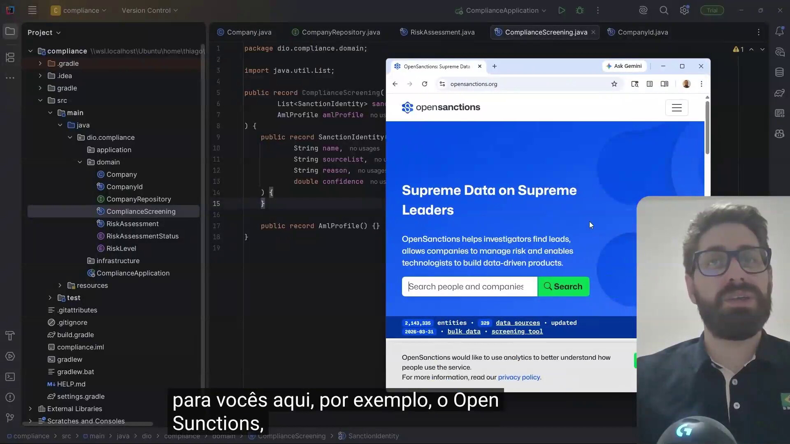
</p>

Página inicial do serviço **OpenSanctions**, citado como exemplo de base de dados que lista pessoas e empresas sancionadas ou politicamente expostas, ilustrando o tipo de fonte externa que a API mocada do projeto simulará.


#### Conjuntos de dados do OpenSanctions

<p align="center">
  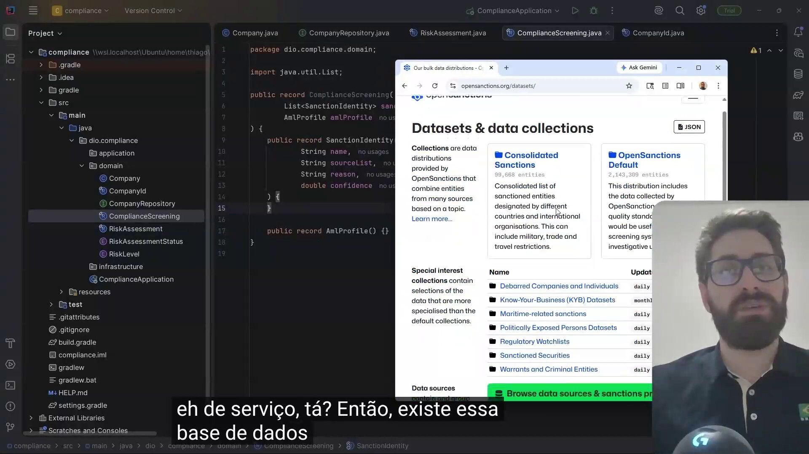
</p>

Página de datasets do OpenSanctions, mostrando as coleções disponíveis (sanções consolidadas, pessoas politicamente expostas, listas regulatórias, entre outras), reforçando o padrão de dados que estruturas como `SanctionIdentity` buscam representar.


#### AmlProfile completo e PoliticalExposure

<p align="center">
  
</p>

O record `AmlProfile` é completado com `riskScore` (pontuação de risco de lavagem de dinheiro), `riskFlags` (lista de sinalizadores de risco), `isPepPresent` (indica se algum membro é pessoa politicamente exposta) e `exposures`, uma lista de `PoliticalExposure` contendo o nome da pessoa e o cargo público ocupado.

```java
public record ComplianceScreening(
        List<SanctionIdentity> sanctions,
        AmlProfile amlProfile
) {
    public record SanctionIdentity(
            String name,
            String sourceList,
            String reason,
            double confidence
    ) {
    }

    public record AmlProfile(
            int riskScore,
            List<String> riskFlags,
            boolean isPepPresent,
            List<PoliticalExposure> exposures
    ) {

        public record PoliticalExposure(
                String personName,
                String publicOffice
        ) {}
    }
}
```


#### Criação da classe CompliancePolicy

<p align="center">
  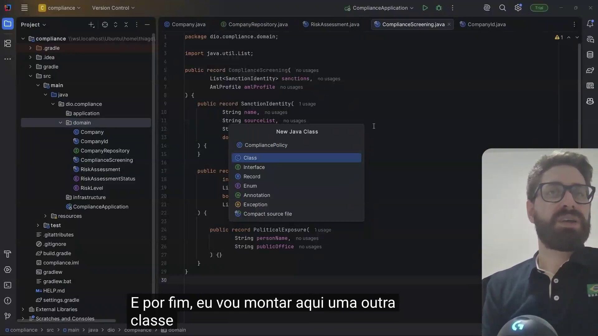
</p>

Criação de uma nova classe de domínio, `CompliancePolicy`, que funcionará como um **Domain Service** responsável por processar os dados do `ComplianceScreening` e gerar o `RiskAssessment` final da empresa.


#### Lógica de avaliação de risco em CompliancePolicy

<p align="center">
  
</p>

O método `evaluate` da classe `CompliancePolicy` implementa a regra de negócio central do compliance: o status começa como `APPROVED`; torna-se `REJECTED` se houver alguma sanção com confiança acima de 80%; passa para `MANUAL_REVIEW` se houver pessoa politicamente exposta ou se o score de AML for superior a 70. Ao final, um novo `RiskAssessment` é criado com o score e o status resultantes.

```java
public class CompliancePolicy {

    public static RiskAssessment evaluate(ComplianceScreening screening) {
        var status = RiskAssessmentStatus.APPROVED;

        boolean hasCriticalSanction = screening.sanctions().stream()
                .anyMatch(SanctionIdentity s -> s.confidence() > 0.8);

        if (hasCriticalSanction) {
            status = RiskAssessmentStatus.REJECTED;
        } else if (screening.amlProfile().isPepPresent()) {
            status = RiskAssessmentStatus.MANUAL_REVIEW;
        }

        int amlScore = screening.amlProfile().riskScore();

        if (status == RiskAssessmentStatus.APPROVED && amlScore > 70) {
            status = RiskAssessmentStatus.MANUAL_REVIEW;
        }

        return new RiskAssessment(amlScore, status);
    }

}
```


#### Construtor customizado e cálculo automático do RiskLevel

<p align="center">
  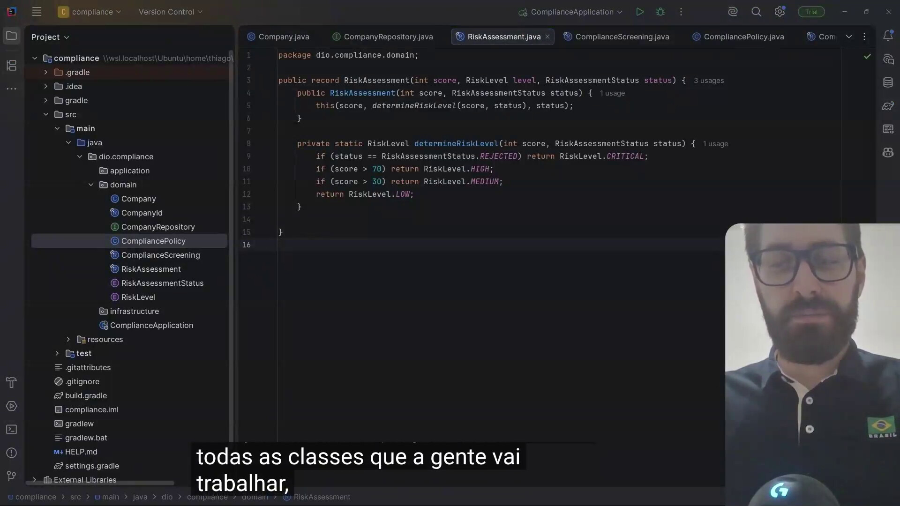
</p>

`RiskAssessment` ganha um construtor customizado que recebe apenas `score` e `status`, calculando automaticamente o `RiskLevel` por meio do método `determineRiskLevel`: status rejeitado resulta em risco Crítico; score acima de 70 resulta em Alto; acima de 30, Médio; caso contrário, Baixo. Essa alteração conclui as principais classes de domínio do projeto Compliance.

```java
public record RiskAssessment(int score, RiskLevel level, RiskAssessmentStatus status) {
    public RiskAssessment(int score, RiskAssessmentStatus status) {
        this(score, determineRiskLevel(score, status), status);
    }

    private static RiskLevel determineRiskLevel(int score, RiskAssessmentStatus status) {
        if (status == RiskAssessmentStatus.REJECTED) return RiskLevel.CRITICAL;
        if (score > 70) return RiskLevel.HIGH;
        if (score > 30) return RiskLevel.MEDIUM;
        return RiskLevel.LOW;
    }

}
```

#### Material de Apoio Até Esta Etapa

- Arquivos do projeto nesta etapa: [./000-Midia_e_Anexos/etapas_do_codigo/compliance_ate_o_video02.zip](./000-Midia_e_Anexos/etapas_do_codigo/compliance_ate_o_video02.zip)
- [001-Tutorial_Compliance_OpenFeign_Videos01a02.md](./001-Tutorial_Compliance_OpenFeign_Videos01a02.md)
      


### 🟩 Vídeo 03 - Modelando Empresas com Spring Data

<video width="60%" controls>
  <source src="000-Midia_e_Anexos/bootcamp_ntt_data_java_spring_ai-modulo.04-curso.04-video_03.webm" type="video/webm">
  Seu navegador não suporta vídeo HTML5.
</video>

link do vídeo: https://web.dio.me/track/ntt-data-2026-ai-java-back-end/course/consumindo-apis-externas-com-o-spring-cloud-openfeign/learning/e480f1e5-fcaa-4a50-9e9b-0cf3f301b652?autoplay=1

### 🟩 Vídeo 04 - Estruturando Use Cases

<video width="60%" controls>
  <source src="000-Midia_e_Anexos/bootcamp_ntt_data_java_spring_ai-modulo.04-curso.04-video_04.webm" type="video/webm">
  Seu navegador não suporta vídeo HTML5.
</video>

link do vídeo: https://web.dio.me/track/ntt-data-2026-ai-java-back-end/course/consumindo-apis-externas-com-o-spring-cloud-openfeign/learning/53dd9050-589d-44d6-8f99-1536a9835c86?autoplay=1

### 🟩 Vídeo 05 - Monitorando Requisições e Respostas

<video width="60%" controls>
  <source src="000-Midia_e_Anexos/bootcamp_ntt_data_java_spring_ai-modulo.04-curso.04-video_05.webm" type="video/webm">
  Seu navegador não suporta vídeo HTML5.
</video>

link do vídeo: https://web.dio.me/track/ntt-data-2026-ai-java-back-end/course/consumindo-apis-externas-com-o-spring-cloud-openfeign/learning/d8b71ec3-0d63-44ad-a6a9-dbc2bf06e0fb?autoplay=1

### 🟩 Vídeo 06 - Configurando Cenários de Exceção

<video width="60%" controls>
  <source src="000-Midia_e_Anexos/bootcamp_ntt_data_java_spring_ai-modulo.04-curso.04-video_06.webm" type="video/webm">
  Seu navegador não suporta vídeo HTML5.
</video>

link do vídeo:

### 🟩 Vídeo 07 - Consumindo Dados Complexos

<video width="60%" controls>
  <source src="000-Midia_e_Anexos/bootcamp_ntt_data_java_spring_ai-modulo.04-curso.04-video_07.webm" type="video/webm">
  Seu navegador não suporta vídeo HTML5.
</video>

link do vídeo:

### 🟩 Vídeo 08 - Estratégias de Tolerância a Falhas

<video width="60%" controls>
  <source src="000-Midia_e_Anexos/bootcamp_ntt_data_java_spring_ai-modulo.04-curso.04-video_08.webm" type="video/webm">
  Seu navegador não suporta vídeo HTML5.
</video>

link do vídeo:

##  Materiais de Apoio

# Certificado: Consumindo APIs Externas com a Spring Cloud OpenFeign

- Link na plataforma: 
- Certificado em pdf: