## Instrutor

- Thiago Poiani (Principal Engineer at Skip)
- Contato Linkedin: / [thpoiani](https://www.linkedin.com/in/thpoiani/)

### 🟩 Vídeo 01 - Introdução ao desenvolvendo sua API Inteligente

<video width="60%" controls>
  <source src="000-Midia_e_Anexos/bootcamp_ntt_data_java_spring_ai-modulo.04-curso.05-video_01.webm" type="video/webm">
    Seu navegador não suporta vídeo HTML5.
</video>

link do vídeo: https://web.dio.me/lab/desenvolvendo-sua-api-inteligente-com-reconhecimento-de-fala-e-spring-boot-1/learning/6a27cad6-eb4b-453c-9ba7-d0b3d8916a17?back=/track/ntt-data-2026-ai-java-back-end

### Anotações

<p align="center">
  
</p>

O slide apresenta a **Agenda do Curso**, com cinco tópicos que estruturam a aula: Apresentação, Fundamentos e Conceitos, Estudo de Caso, Desenvolvimento do Projeto e Roadmap do Aluno. Esse roteiro define a ordem em que o conteúdo será abordado: primeiro a ideia geral do projeto de API inteligente com reconhecimento de fala, depois os conceitos de IA envolvidos, em seguida um estudo de caso prático, o desenvolvimento do projeto em si e, por fim, sugestões de evolução para o aluno.

<p align="center">
  
</p>

O diagrama **"A Nova Anatomia da API"** resume visualmente a arquitetura do projeto, dividida em quatro etapas sequenciais:

1. **Áudio -> STT**: entrada de onda sonora, convertida em texto processável.
2. **MCP / Tool Calling (Spring AI)**: integração de modelo, roteamento lógico e conexão com ferramentas remotas ou dados locais.
3. **Java Use Case**: execução da lógica de negócio Spring Boot e das tarefas específicas da aplicação.
4. **TTS -> Áudio**: geração de voz sintetizada como saída para o usuário.

Essa ilustração antecipa o fluxo completo que será detalhado ao longo da aula, mostrando como uma entrada de áudio percorre o sistema até se transformar novamente em áudio na resposta.

<p align="center">
  
</p>

O slide **"A Evolução das Interfaces"** contrasta o padrão atual de APIs com a nova proposta do projeto. Do lado esquerdo, o **Padrão Atual** é caracterizado por receptores de JSON estáticos, regras de validação rígidas e dependência de input perfeitamente estruturado — o modelo REST tradicional, onde uma requisição como um POST para `/companies` segue um contrato fixo. Do lado direito, a **Nova Era** propõe ouvintes ativos de áudio, compreensão de contexto fluida via Spring AI e processamento de linguagem natural nativa, eliminando a rigidez do formato JSON em favor de uma entrada por voz.

<p align="center">
  
</p>

O diagrama **"O Novo Fluxo de Interação"** detalha, de ponta a ponta, como um comando de voz viaja através da aplicação Spring Boot: **Usuário (Microfone) -> Transcrição de Áudio -> Interpretação de Intenção -> Lógica de Domínio (Java) -> Geração de Resposta -> Usuário**. Esse fluxo linear mostra as cinco etapas pelas quais uma mensagem falada passa até retornar como resposta ao usuário, servindo de mapa geral para os componentes que serão explicados individualmente na sequência.

<p align="center">
  
</p>

O slide **"Glossário de IA para Desenvolvedores Java"** abre a seção conceitual da aula com o termo **Linguagem Natural**, apresentando um exemplo de código Java que ilustra a ideia de decodificar uma intenção a partir de texto livre:

```java
public String decodeIntent(String naturalLanguage) {
    return naturalLanguageParser.parse(naturalLanguage).getIntent();
}
```

O trecho representa, de forma conceitual, como uma entrada em linguagem natural pode ser interpretada por um parser para extrair a intenção do usuário — a base sobre a qual os próximos conceitos (Speech-to-Text, Tool Calling e Text-to-Speech) serão construídos.

<p align="center">
  
</p>

O slide **"Speech-to-Text (STT)"** explica a primeira etapa do pipeline: a transformação de ondas sonoras em texto processável, onde "o áudio não estruturado ganha forma para a máquina entender". A ilustração mostra uma onda sonora sendo processada e convertida em um trecho de texto de exemplo, "Gastei 50 reais...", representando o resultado da transcrição de um áudio de entrada.

<p align="center">
  
</p>

O slide **"Tool Calling"** descreve a segunda etapa do pipeline como "a ponte para o domínio": a capacidade da IA de interpretar uma intenção e "chamar" funções Java específicas (Use Cases) para realizar tarefas no mundo real. O diagrama mostra o bloco **IA** direcionando uma seta até o bloco **Use Case (Java)**, representando como o modelo, a partir do texto transcrito, identifica qual método da aplicação deve ser executado e com quais parâmetros.

<p align="center">
  
</p>

O slide **"Text-to-Speech (TTS)"** apresenta a última etapa do pipeline: a humanização da resposta, transformando a saída da lógica de negócio de volta em uma interação humana e fluida. A imagem mostra um objeto JSON de resposta sendo convertido em onda sonora sintetizada:

```json
{
  "status": "ok",
  "response": {
    "message": "Sua conta foi criada com sucesso."
  }
}
```

O diagrama ilustra esse JSON sendo processado por um alto-falante, gerando uma "Acoustic Waveform" (onda acústica) como saída de voz sintetizada para o usuário.

<p align="center">
  
</p>

O diagrama **"A Nova Anatomia da API"** retorna à tela, agora como fechamento da explicação conceitual, reunindo as quatro etapas já detalhadas individualmente: **Áudio -> STT**, **MCP / Tool Calling (Spring AI)**, **Java Use Case** e **TTS -> Áudio**. Ao revisitar essa visão de conjunto, fica evidente o ciclo completo do sistema: um áudio de entrada é transcrito, interpretado para acionar a lógica de negócio correta e, por fim, convertido novamente em áudio como resposta ao usuário.

<p align="center">
  
</p>

O infográfico **"O Assistente de Budgeting: Transformando Voz em Dados Financeiros"** apresenta o estudo de caso do projeto: um sistema que elimina a fricção da entrada manual de dados, permitindo que o usuário registre gastos apenas falando, enquanto a IA processa e categoriza as informações automaticamente. O exemplo mostrado é a frase "Gastei 50 reais no Starbucks agora", que passa por uma etapa de **Extração de Entidades** (Valor, Local, Data/Hora) e **Categorização Automática** (o sistema infere que Starbucks corresponde à categoria Alimentação/Café), resultando em dados estruturados prontos para persistência: Valor = 50.00, Local = Starbucks, Data/Hora = Agora (Hoje).


### 🟩 Vídeo 02 - Spring AI: Setup e Integração com LLMs

<video width="60%" controls>
  <source src="000-Midia_e_Anexos/bootcamp_ntt_data_java_spring_ai-modulo.04-curso.05-video_02.webm" type="video/webm">
    Seu navegador não suporta vídeo HTML5.
</video>

link do vídeo: https://web.dio.me/lab/desenvolvendo-sua-api-inteligente-com-reconhecimento-de-fala-e-spring-boot-1/learning/f6d5285c-3962-41d4-8e19-ca821da8eabf?back=/track/ntt-data-2026-ai-java-back-end

### Anotações

#### Introdução ao Spring AI

<p align="center">
  
</p>

A imagem mostra a página de documentação oficial do Spring AI aberta no navegador, na seção "Introduction". O texto exibido explica que o projeto Spring AI busca simplificar o desenvolvimento de aplicações com funcionalidades de inteligência artificial, sem complexidade desnecessária, inspirando-se em projetos Python como LangChain e LlamaIndex. Um destaque em nota explica que o Spring AI resolve o desafio fundamental de conectar dados e APIs corporativas aos modelos de IA, ilustrado pelo diagrama "Your Data / Your APIs → Generative AI" presente na página.

#### Provedores de Modelos Suportados

<p align="center">
  
</p>

A página segue exibindo a lista de funcionalidades do Spring AI, com destaque para o suporte a diversos provedores de modelos de IA — Anthropic, OpenAI (destacado em azul na imagem), Microsoft, Amazon, Google e Ollama. Também são listados os tipos de modelo suportados: Chat Completion, Embedding, Text to Image, Audio Transcription, Text to Speech e Moderation. Isso corresponde diretamente ao momento em que o instrutor comenta que o Spring AI possui interfaces prontas para se comunicar com diferentes Large Language Models, citando esses mesmos provedores.

#### Demais Recursos do Ecossistema

<p align="center">
  
</p>

Com a rolagem da página, aparecem outros recursos do Spring AI: Structured Outputs (mapeamento da saída do modelo para POJOs), suporte a diversos bancos de dados vetoriais, Tools/Function Calling, Observability, ingestão de documentos via ETL framework, avaliação de modelos de IA, Spring Boot Auto Configuration, ChatClient API, Advisors API e suporte a memória de conversa e RAG (Retrieval Augmented Generation). Esse trecho ilustra o momento em que o instrutor menciona o ChatClient como uma interface que facilita a comunicação com os modelos, além da integração com bancos de dados de vetor e do tool calling.

#### Conceitos de IA — Modelos

<p align="center">
  
</p>

A navegação avança para a seção "AI Concepts", especificamente para o tópico "Models". A página apresenta uma tabela que categoriza os modelos de IA de acordo com os tipos de entrada (linguagem/código, imagem, áudio) e saída (linguagem/código, imagem, áudio), evidenciando a especialização de cada modelo generativo (como LLMs). Esse conteúdo reforça a fala do instrutor de que o Spring AI disponibiliza uma série de componentes por meio de uma interface comum, permitindo trocar um modelo por outro sem alterar o código da aplicação.

#### Conceitos de IA — Prompts

<p align="center">
  
</p>

A imagem mostra a seção "Prompts" da documentação, explicando que o prompt é a base da entrada em linguagem natural enviada ao modelo de IA, podendo ser composto por diferentes papéis (como "system" e "user"). O texto também comenta sobre a importância da engenharia de prompt. Isso corresponde à explicação do instrutor de que o prompt é justamente a forma como se comunica ao modelo o que se deseja fazer.

#### Conceitos de IA — Tokens

<p align="center">
  
</p>

A página avança para a seção "Tokens", explicando que os tokens são as unidades básicas de processamento dos modelos de IA: na entrada, palavras são convertidas em tokens; na saída, tokens são convertidos de volta em palavras. O texto ainda destaca que tokens estão diretamente relacionados ao custo de uso dos modelos hospedados, já que a cobrança é feita com base na quantidade de tokens processados (entrada e saída). Esse trecho corresponde ao momento em que o instrutor esclarece que, diferente do embedding, o token está muito mais relacionado ao custo do uso do modelo de IA.

#### Conceitos de IA — Tool Calling

<p align="center">
  
</p>

A imagem mostra a seção "Tool Calling" da documentação, acompanhada de um diagrama que ilustra o fluxo entre a aplicação (Chat Request), o Spring AI e a Tool externa, até a geração da Chat Response. O texto explica que os LLMs ficam "congelados" após o treinamento e não conseguem acessar ou modificar dados externos por conta própria, sendo esse o problema que o mecanismo de Tool Calling resolve. Esse conteúdo corresponde exatamente à explicação do instrutor de que o tool calling consiste em informar ao LLM que ele pode acessar dados externos, como dados da própria aplicação, por meio de ferramentas registradas.

#### Criando o Projeto no IntelliJ

<p align="center">
  
</p>

A tela agora mostra a IDE IntelliJ IDEA aberta na tela de boas-vindas, exibindo uma lista de projetos remotos existentes (via WSL Ubuntu) e o botão "New Project" em destaque. Esse momento corresponde à fala do instrutor informando que utilizará o IntelliJ, por ser a IDE de sua preferência, para criar o novo projeto Spring Boot.

#### Configurando o Novo Projeto Spring Boot

<p align="center">
  
</p>

A imagem mostra a janela "New Project" do IntelliJ, com o gerador "Spring Boot" selecionado. Os campos exibidos são: Server URL (start.spring.io), Name preenchido como "budgeting", Location apontando para o diretório do usuário via WSL, Language definida como Java, JDK "Eclipse Temurin 25.0.2", Packaging "Jar" e Configuration "Properties". Isso corresponde ao momento em que o instrutor define o nome do projeto como "budgeting" e configura a versão do Java a ser utilizada (25, via SDKMAN).

#### Adicionando o BOM do Spring AI

<p align="center">
  
</p>

A imagem mostra o arquivo `build.gradle` do projeto "budgeting" já criado, com o plugin de gerenciamento de dependências do Spring configurado e a dependência do BOM (Bill of Materials) do Spring AI recém-adicionada:

```groovy
plugins {
    id 'io.spring.dependency-management' version '1.1.7'
}

group = 'dio'
version = '0.0.1-SNAPSHOT'
description = 'budgeting'

java {
    toolchain {
        languageVersion = JavaLanguageVersion.of(25)
    }
}

repositories {
    mavenCentral()
}

dependencies {
    implementation 'org.springframework.boot:spring-boot-starter'
    testImplementation 'org.springframework.boot:spring-boot-starter-test'
    testRuntimeOnly 'org.junit.platform:junit-platform-launcher'

    implementation platform("org.springframework.ai:spring-ai-bom:2.0.0-M4")
}

tasks.named('test') {
    useJUnitPlatform()
}
```

Isso corresponde ao trecho em que o instrutor explica que o BOM (Bill of Materials) disponibiliza um índice de dependências do Spring AI com as versões corretas já resolvidas, evitando a necessidade de declarar manualmente a versão de cada dependência relacionada.

#### Adicionando o Starter do Modelo OpenAI

<p align="center">
  
</p>

No mesmo arquivo `build.gradle`, uma nova linha é adicionada ao bloco de dependências, referente ao starter do modelo OpenAI do Spring AI (destacada em azul na imagem):

```groovy
dependencies {
    implementation 'org.springframework.boot:spring-boot-starter'
    testImplementation 'org.springframework.boot:spring-boot-starter-test'
    testRuntimeOnly 'org.junit.platform:junit-platform-launcher'

    implementation platform("org.springframework.ai:spring-ai-bom:2.0.0-M4")
    implementation 'org.springframework.ai:spring-ai-starter-model-openai'
}
```

Esse trecho corresponde ao momento em que o instrutor explica que, além do BOM, é necessário adicionar a dependência específica do modelo que será utilizado — nesse caso, o modelo da OpenAI.

#### Configurando a API Key da OpenAI

<p align="center">
  
</p>

A imagem mostra o arquivo `application.properties` configurado com o nome da aplicação e a propriedade da chave da API da OpenAI referenciando uma variável de ambiente:

```properties
spring.application.name=budgeting
spring.ai.openai.api-key=${OPENAI_API_KEY}
```

Abaixo, no console de execução, é exibido um erro anterior, indicando que a chave da API ainda não havia sido configurada:

```
Caused by: java.lang.IllegalArgumentException: OpenAI API key must be set. Use the connection property: spring.ai.openai.api-key
```

Esse conteúdo corresponde à explicação do instrutor de que a propriedade `spring.ai.openai.api-key` deve receber o valor da chave, mas, por segurança, em vez de colocar o valor diretamente no arquivo, ele optou por referenciá-lo através de uma variável de ambiente chamada `OPENAI_API_KEY`, evitando expor a chave em um eventual commit do `application.properties`.

#### Configurações de Execução da Aplicação

<p align="center">
  
</p>

A imagem mostra a janela "Run/Debug Configurations" do IntelliJ, referente à configuração "BudgetingApplication", com o menu "Add Run Options" aberto exibindo diversas opções disponíveis, entre elas "Environment variables" (destacada em azul). Isso corresponde ao momento em que o instrutor explica que é possível acessar as opções de configuração da execução (VM) e, entre elas, definir variáveis de ambiente para a aplicação.

#### Cadastrando a Variável de Ambiente

<p align="center">
  
</p>

A imagem mostra a janela "Environment Variables" aberta, com a variável `OPENAI_API_KEY` cadastrada manualmente e seu respectivo valor (a chave secreta, parcialmente oculta na imagem), além da opção "Include system environment variables" marcada. Esse trecho corresponde à explicação do instrutor sobre como cadastrar manualmente a variável de ambiente contendo a chave da API diretamente na configuração de execução da aplicação no IntelliJ, para que ela seja injetada automaticamente sempre que a aplicação for executada.

#### Aplicação Executada com Sucesso

<p align="center">
  
</p>

A imagem mostra novamente o `build.gradle` com as dependências do Spring AI (BOM e starter do modelo OpenAI) já configuradas, e o console de execução exibindo o banner padrão do Spring Boot seguido do log de inicialização:

```
:: Spring Boot ::                (v4.0.5)

INFO 1871 --- [budgeting] [           main] dio.budgeting.BudgetingApplication       : Starting BudgetingApplication
INFO 1871 --- [budgeting] [           main] dio.budgeting.BudgetingApplication       : No active profile set, fa...
INFO 1871 --- [budgeting] [           main] dio.budgeting.BudgetingApplication       : Started BudgetingApplicat...

Process finished with exit code 0
```

Isso corresponde ao momento em que o instrutor executa novamente a aplicação e confirma que, com a variável de ambiente `OPENAI_API_KEY` corretamente configurada, a aplicação sobe sem erros, comprovando que a conexão com a OpenAI está pronta para ser utilizada nos próximos vídeos, quando serão abordados o Chat API, o Tool Calling, a Transcription API e a Speech API do Spring AI.
      
#### Material de Apoio Até Esta Etapa

- Arquivos do projeto nesta etapa: [budgeting_ate_o_video02.zip](./000-Midia_e_Anexos/etapas_do_codigo/budgeting_ate_o_video02.zip)
- [001-Tutorial_Budgeting_Spring_AI_Videos01a02.md](./001-Tutorial_Budgeting_Spring_AI_Videos01a02.md)


### 🟩 Vídeo 03 - Explorando o ChatModel e Modelos de Linguagem

<video width="60%" controls>
  <source src="000-Midia_e_Anexos/bootcamp_ntt_data_java_spring_ai-modulo.04-curso.05-video_03.webm" type="video/webm">
    Seu navegador não suporta vídeo HTML5.
</video>

link do vídeo: https://web.dio.me/lab/desenvolvendo-sua-api-inteligente-com-reconhecimento-de-fala-e-spring-boot-1/learning/3e985ba4-23c0-4cd5-b114-da91136e4198?back=/track/ntt-data-2026-ai-java-back-end

### Anotações

#### Introdução ao Spring AI e ao Chat Model

<p align="center">
  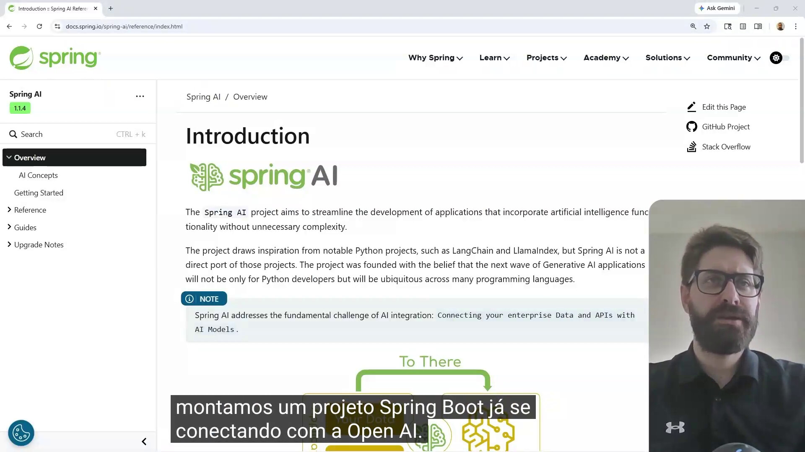
</p>

A documentação oficial do Spring AI é o ponto de partida da aula. A página de introdução explica que o projeto tem como objetivo simplificar o desenvolvimento de aplicações que incorporam inteligência artificial, conectando os dados e as APIs da empresa aos modelos de IA. É a partir daqui que a integração já feita anteriormente entre um projeto Spring Boot e a Open AI será aprofundada, começando pelo primeiro serviço a ser estudado em detalhe: o Chat Model.

---

#### A página de referência do Chat Model API

<p align="center">
  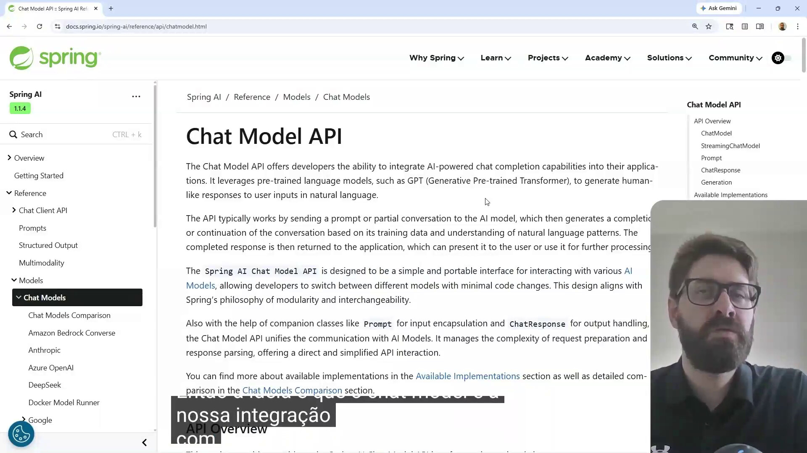
</p>

Na seção Reference → Models → Chat Models da documentação, o Chat Model API é apresentado como a camada responsável por integrar capacidades de chat com modelos de linguagem pré-treinados. O texto destaca que essa API foi projetada para ser uma interface simples e portátil, permitindo trocar entre diferentes modelos com o mínimo de alteração de código, e que classes auxiliares como `Prompt` e `ChatResponse` cuidam da preparação da requisição e do tratamento da resposta.

---

#### As interfaces `ChatModel` e o início de `StreamingChatModel`

<p align="center">
  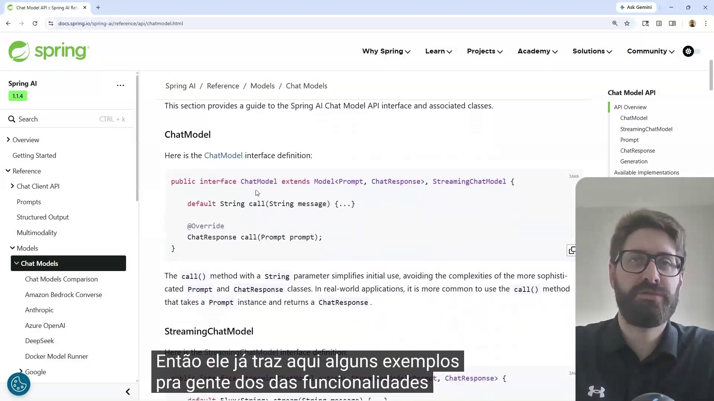
</p>

A documentação mostra a definição da interface `ChatModel`, que possui um método simplificado `call(String message)` para uso rápido e uma versão sobrecarregada que recebe um `Prompt` e devolve um `ChatResponse`, mais utilizada em aplicações reais:

```java
public interface ChatModel extends Model<Prompt, ChatResponse>, StreamingChatModel {

    default String call(String message) {...}

    @Override
    ChatResponse call(Prompt prompt);
}
```

---

#### A interface `StreamingChatModel`

<p align="center">
  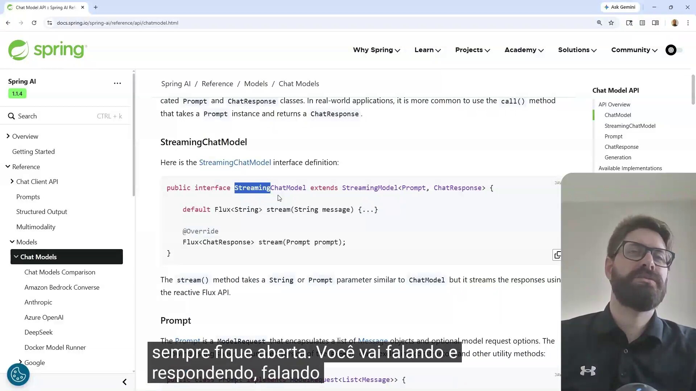
</p>

Logo abaixo, a documentação apresenta a interface `StreamingChatModel`, usada quando se deseja manter a conexão aberta e receber a resposta aos poucos — um cenário mais próximo de uma conversa de chat em tempo real, no qual o usuário vai enviando e recebendo mensagens continuamente:

```java
public interface StreamingChatModel extends StreamingModel<Prompt, ChatResponse> {

    default Flux<String> stream(String message) {...}

    @Override
    Flux<ChatResponse> stream(Prompt prompt);
}
```

---

#### A classe `Prompt`

<p align="center">
  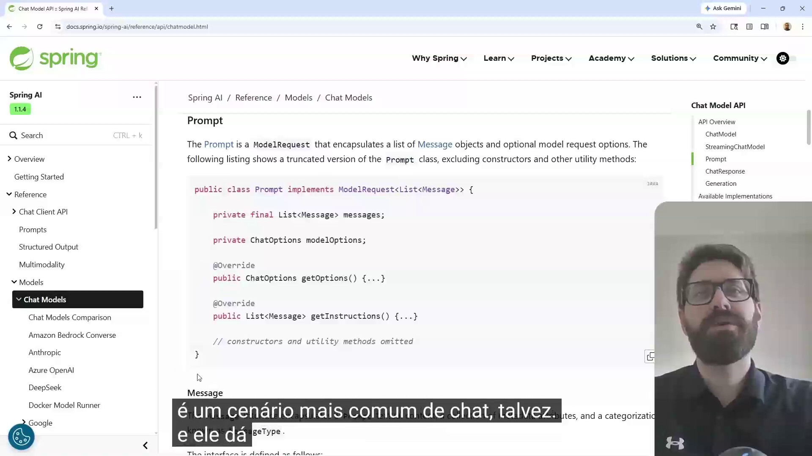
</p>

Em seguida, a documentação detalha a classe `Prompt`, que encapsula uma lista de objetos `Message` e opcionalmente as opções de configuração do modelo (`ChatOptions`). É essa estrutura que representa, de forma completa, o que será enviado ao modelo de linguagem:

```java
public class Prompt implements ModelRequest<List<Message>> {

    private final List<Message> messages;

    private ChatOptions modelOptions;

    @Override
    public ChatOptions getOptions() {...}

    @Override
    public List<Message> getInstructions() {...}

    // constructors and utility methods omitted
}
```

---

#### O diagrama da Spring AI Message API

<p align="center">
  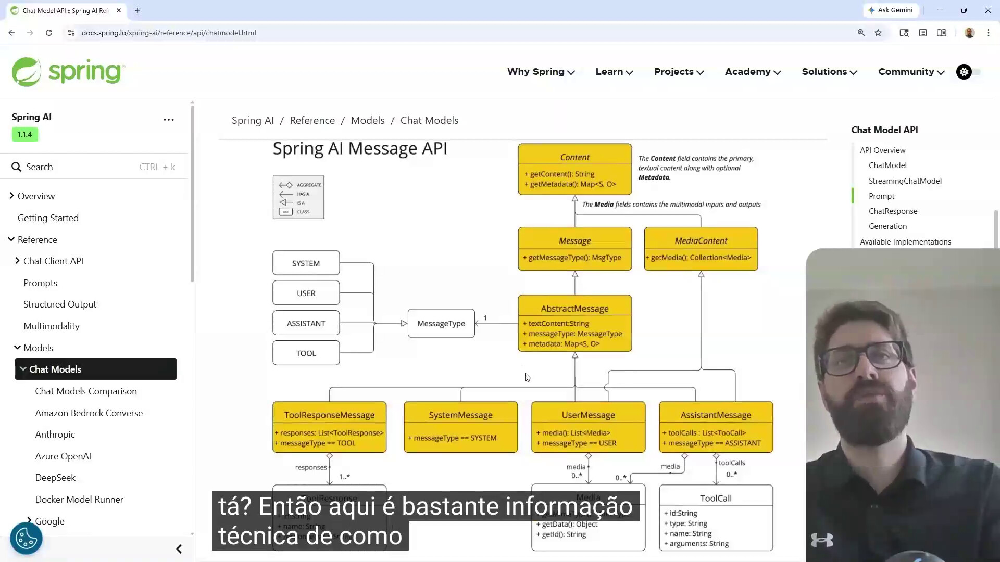
</p>

O diagrama exibido mostra como as mensagens são estruturadas dentro do Spring AI. A classe `Content` concentra o conteúdo textual principal e metadados; `Message` e `MediaContent` derivam dela; e a partir de `AbstractMessage` surgem os tipos específicos `SystemMessage`, `UserMessage`, `AssistantMessage` e `ToolResponseMessage`, cada um associado a um `MessageType` (SYSTEM, USER, ASSISTANT, TOOL). Esse é o nível mais técnico de como o Spring AI organiza a comunicação entre as partes de uma conversa.

---

#### A documentação do DeepSeek Chat

<p align="center">
  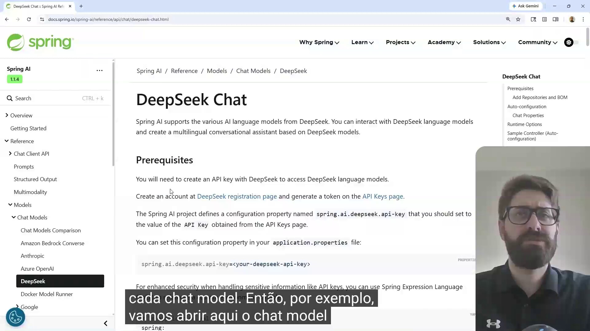
</p>

Para reforçar que cada provedor de LLM tem sua própria página de referência dentro da documentação, é aberta a página do DeepSeek Chat. Ali são explicados os pré-requisitos: é necessário criar uma conta e gerar uma chave de API no DeepSeek, que deve ser configurada através da propriedade `spring.ai.deepseek.api-key`.

---

#### Configuração segura da chave via Spring Expression Language

<p align="center">
  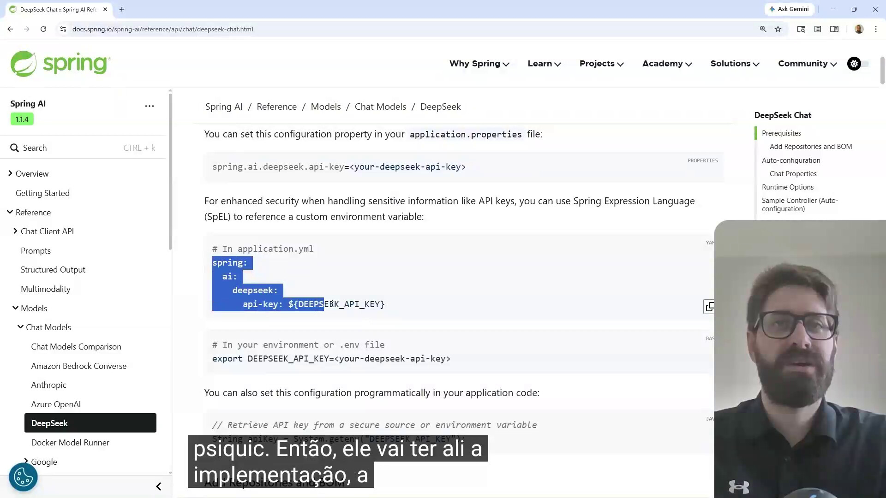
</p>

A documentação recomenda o uso do Spring Expression Language (SpEL) para referenciar uma variável de ambiente customizada em vez de expor a chave diretamente no arquivo de propriedades, aumentando a segurança no tratamento de informações sensíveis como chaves de API:

```yaml
# In application.yml
spring:
  ai:
    deepseek:
      api-key: ${DEEPSEEK_API_KEY}
```

---

#### Auto-configuração e dependência Maven do DeepSeek

<p align="center">
  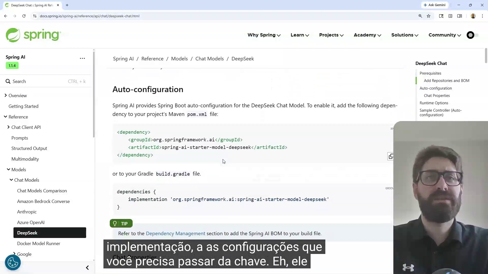
</p>

A seção de Auto-configuration mostra que o Spring AI fornece auto-configuração do Spring Boot para o modelo de chat do DeepSeek, bastando adicionar a dependência correspondente ao `pom.xml` do projeto Maven:

```xml
<dependency>
    <groupId>org.springframework.ai</groupId>
    <artifactId>spring-ai-starter-model-deepseek</artifactId>
</dependency>
```

---

#### A mesma dependência para projetos Gradle

<p align="center">
  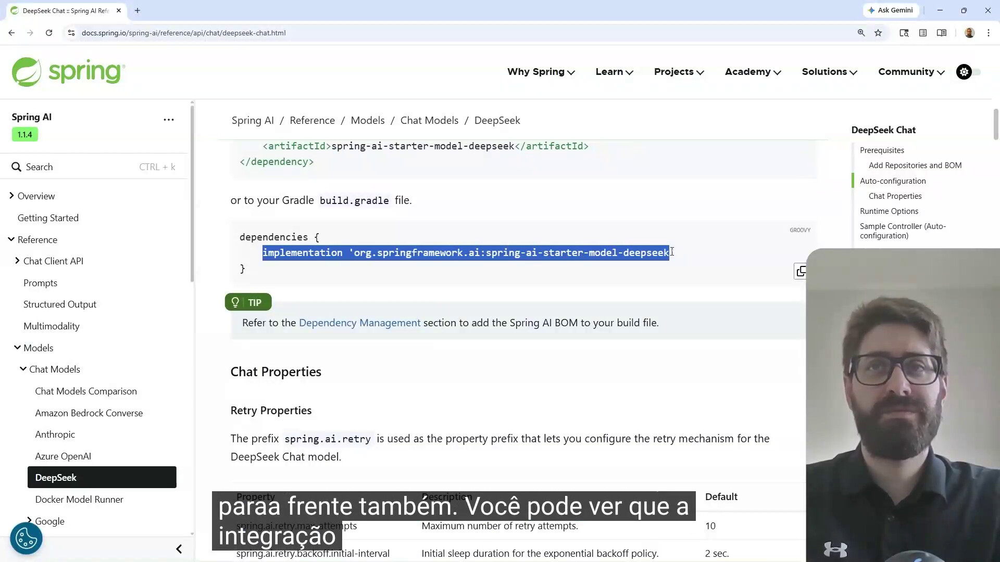
</p>

Para quem utiliza Gradle, a documentação apresenta a forma equivalente de declarar a dependência do starter do DeepSeek, o que evidencia como a integração de cada provedor segue o mesmo padrão de configuração dentro do ecossistema Spring:

```groovy
dependencies {
    implementation 'org.springframework.ai:spring-ai-starter-model-deepseek'
}
```

---

#### Propriedades de retentativa (retry) do DeepSeek

<p align="center">
  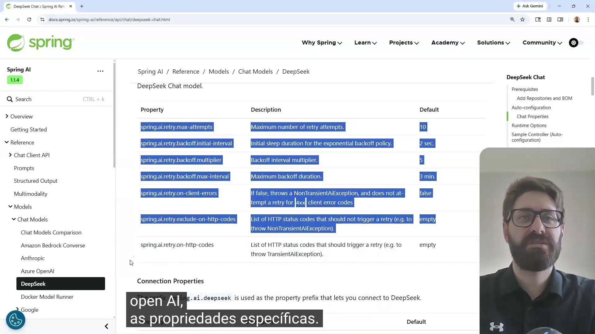
</p>

A tabela de propriedades mostra as configurações de retentativa disponíveis com o prefixo `spring.ai.retry`, como número máximo de tentativas, duração inicial do backoff exponencial, multiplicador do intervalo, duração máxima do backoff e se erros de cliente (4xx) devem ou não disparar uma nova tentativa. Essas propriedades evitam que a aplicação sobrecarregue a API do provedor ao tentar novamente sempre no mesmo ritmo.

---

#### Configuração manual das opções de chat do DeepSeek

<p align="center">
  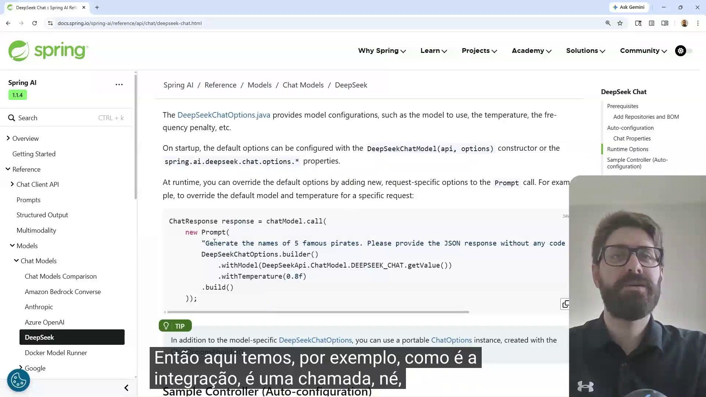
</p>

A documentação mostra como sobrescrever, em tempo de execução, o modelo e a temperatura padrão para uma requisição específica, usando `DeepSeekChatOptions` diretamente na chamada ao `Prompt`:

```java
ChatResponse response = chatModel.call(
    new Prompt(
        "Generate the names of 5 famous pirates. Please provide the JSON response without any code ...",
        DeepSeekChatOptions.builder()
            .withModel(DeepSeekApi.ChatModel.DEEPSEEK_CHAT.getValue())
            .withTemperature(0.8f)
            .build()
    ));
```

---

#### A página de documentação do OpenAI Chat

<p align="center">
  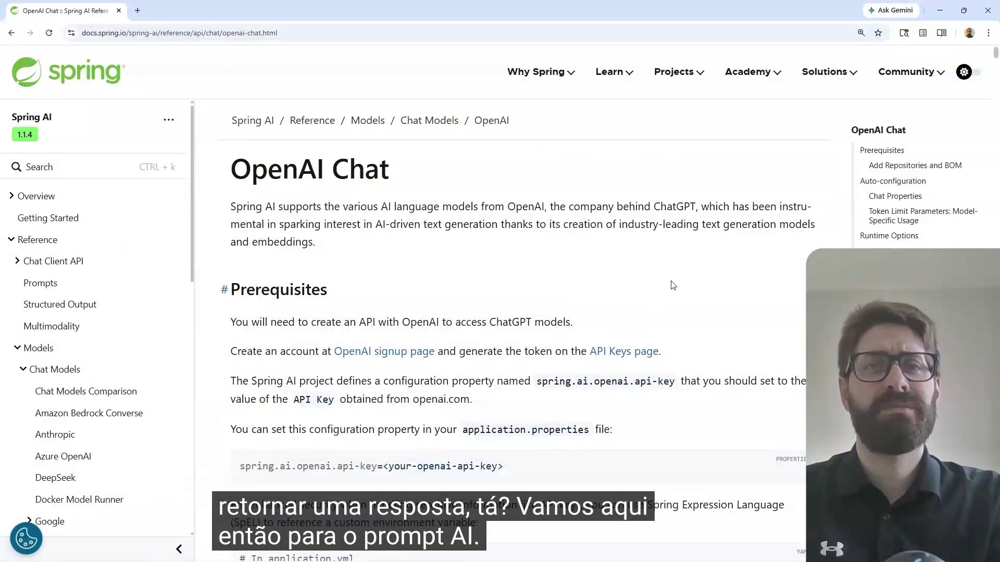
</p>

Agora a navegação passa para a página de referência do OpenAI Chat, o provedor que será efetivamente utilizado no projeto. A seção de pré-requisitos explica que é necessário criar uma conta na OpenAI e gerar um token na página de API Keys, configurando-o através da propriedade `spring.ai.openai.api-key`.

---

#### Configuração da chave de API da OpenAI

<p align="center">
  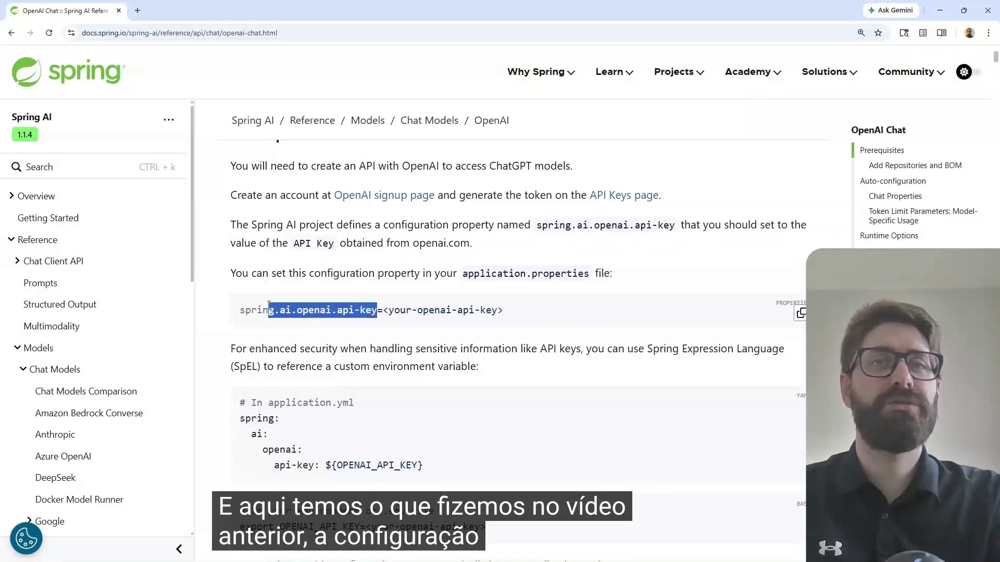
</p>

Esta é exatamente a configuração já realizada no vídeo anterior: a chave da OpenAI é definida na propriedade `spring.ai.openai.api-key`, podendo ser referenciada de forma segura por meio de uma variável de ambiente com Spring Expression Language:

```properties
spring.ai.openai.api-key=<your-openai-api-key>
```

```yaml
# In application.yml
spring:
  ai:
    openai:
      api-key: ${OPENAI_API_KEY}
```

---

#### Auto-configuração do OpenAI Chat Client

<p align="center">
  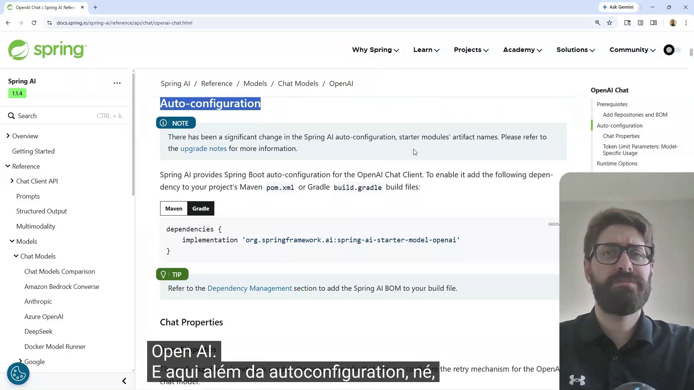
</p>

A seção de Auto-configuration do OpenAI explica que o Spring AI oferece auto-configuração do Spring Boot para o Chat Client, bastando adicionar a dependência do starter correspondente ao build do projeto:

```groovy
dependencies {
    implementation 'org.springframework.ai:spring-ai-starter-model-openai'
}
```

---

#### Propriedades de retry específicas do OpenAI

<p align="center">
  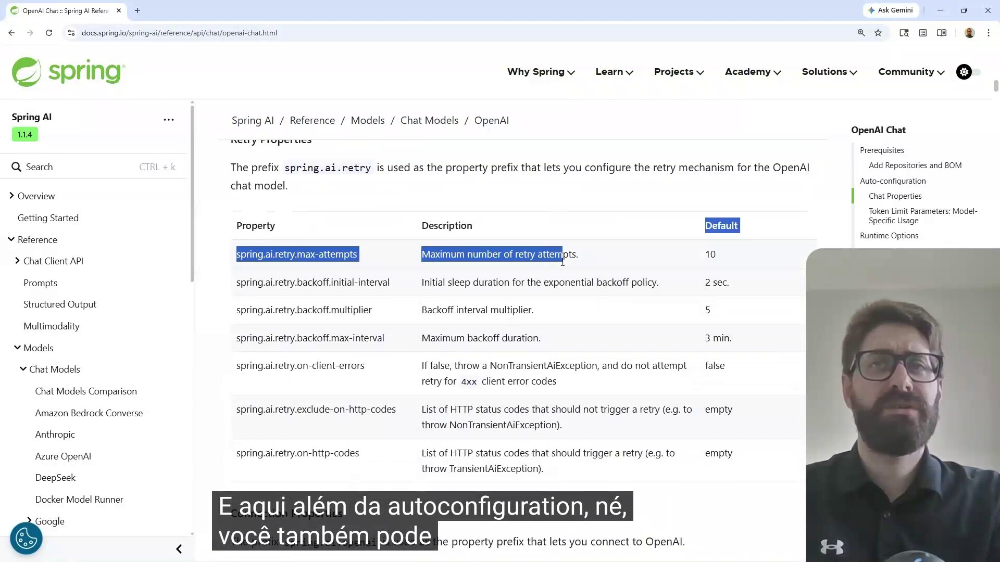
</p>

Assim como visto para o DeepSeek, o OpenAI também possui sua própria tabela de propriedades de retentativa sob o prefixo `spring.ai.retry`, controlando número de tentativas, backoff inicial, multiplicador, backoff máximo e o comportamento diante de erros de cliente — demonstrando que, apesar de cada provedor ter particularidades, o padrão de configuração se repete.

---

#### Propriedades específicas do modelo de chat da OpenAI

<p align="center">
  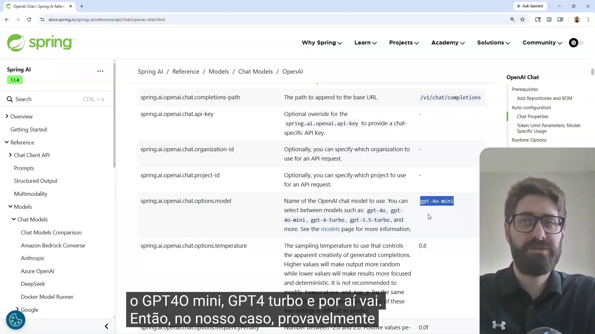
</p>

Aqui aparecem as propriedades mais específicas do LLM da OpenAI, como `spring.ai.openai.chat.options.model`, que aceita valores como `gpt-4o`, `gpt-4o-mini`, `gpt-4-turbo` e `gpt-3.5-turbo`, tendo `gpt-4o-mini` como padrão — provavelmente o modelo que será utilizado no projeto — além da propriedade de `temperature`, que controla o quanto a resposta pode variar ou "criar" em relação ao prompt.

---

#### Visão geral da AI Model API do Spring AI

<p align="center">
  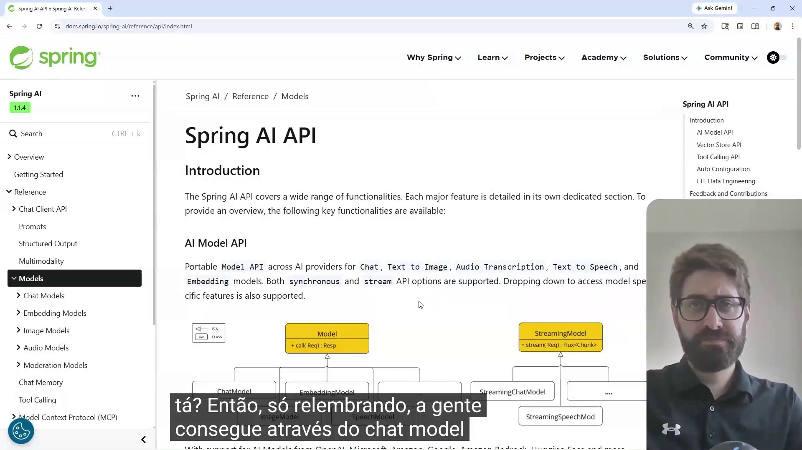
</p>

Voltando à página geral da Spring AI API, o diagrama recapitula que é através do Chat Model que se interage com a LLM, e que esse mesmo modelo pode ser usado com diferentes tipos de conteúdo: texto, imagem, transcrição de áudio, texto-para-fala, entre outros serviços que a LLM disponibiliza. As classes base `Model` e `StreamingModel` dão origem a `ChatModel`, `EmbeddingModel`, `ImageModel`, `StreamingChatModel` e `StreamingSpeechModel`.

---

#### O panorama completo das implementações de Chat Model

<p align="center">
  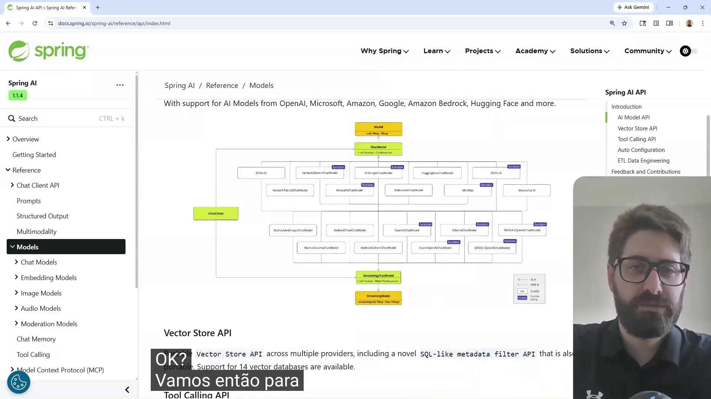
</p>

O diagrama expandido mostra a árvore completa de implementações de `ChatModel` suportadas pelo Spring AI, com integrações a provedores como OpenAI, Anthropic, Google, Hugging Face, Ollama, Bedrock, Groq, entre muitos outros, todos acessados de forma unificada através do `ChatClient`. Isso encerra a parte de documentação e conceitos antes de o vídeo seguir para a implementação prática no código.

---

#### Abrindo o Run Configuration do projeto no IntelliJ

<p align="center">
  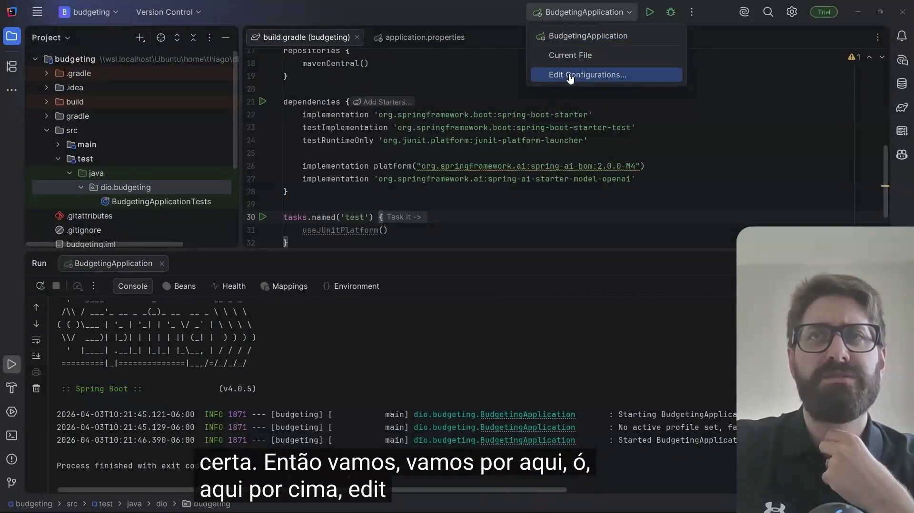
</p>

A aula passa para o código do projeto `budgeting` no IntelliJ IDEA. O primeiro passo prático é acessar o menu de execução no canto superior direito e selecionar "Edit Configurations...", pois será necessário ajustar as variáveis de ambiente também para a execução dos testes, e não apenas para a aplicação.

---

#### A tela de Run/Debug Configurations

<p align="center">
  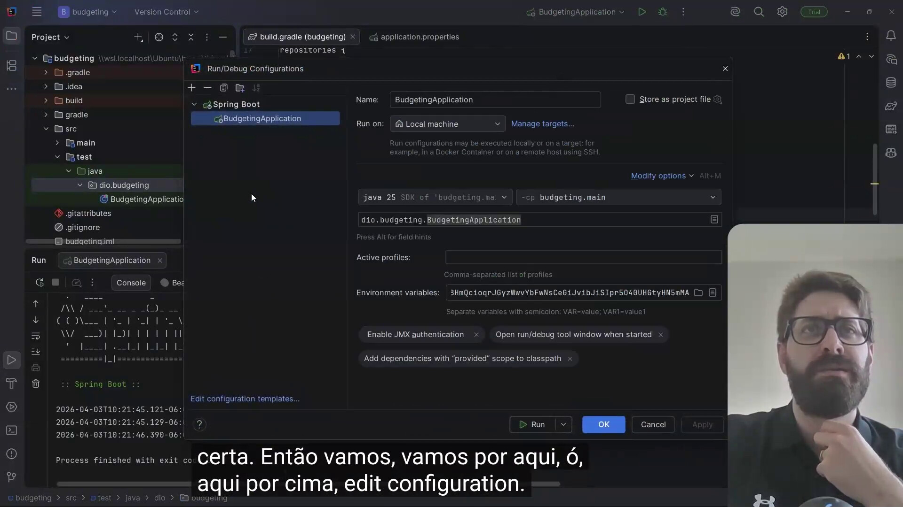
</p>

A janela de Run/Debug Configurations é aberta, mostrando a configuração já existente `BudgetingApplication`, com sua variável de ambiente da chave da OpenAI já definida para a aplicação. A variável de ambiente configurada aqui, porém, não é automaticamente herdada pelos testes que ainda serão criados.

---

#### Criando uma nova configuração de execução

<p align="center">
  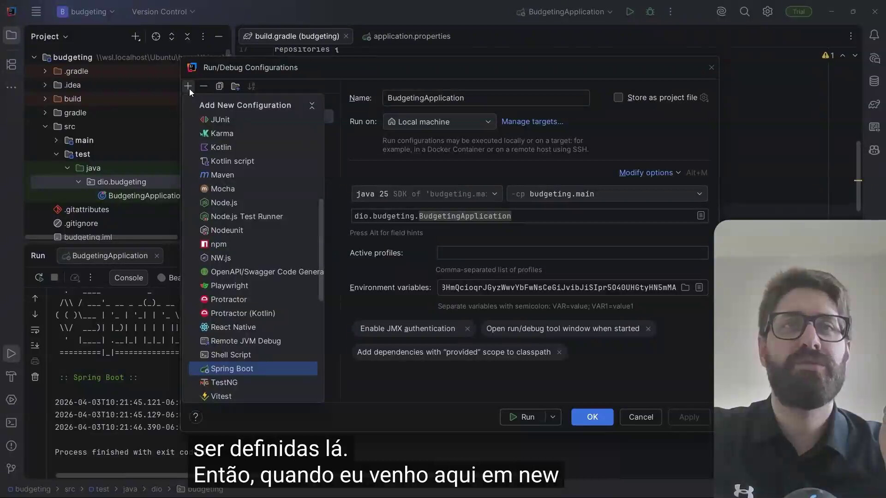
</p>

Ao clicar em "New Configuration", o IntelliJ apresenta uma lista com os diversos tipos de configuração de execução disponíveis (JUnit, Karma, Kotlin, Maven, Mocha, entre outros), incluindo a opção "Spring Boot" já destacada na lista.

---

#### Localizando o tipo de configuração Gradle

<p align="center">
  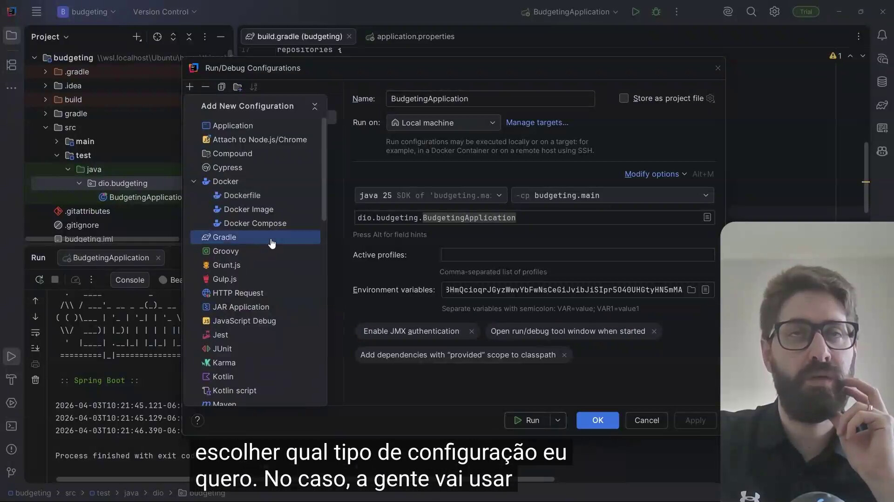
</p>

A lista de tipos de configuração é rolada para baixo até a opção "Gradle", que é o tipo escolhido para a execução dos testes do projeto — já que, ao rodar cada teste, o IntelliJ cria automaticamente uma configuração individual desse tipo.

---

#### Voltando à tela principal de configurações

<p align="center">
  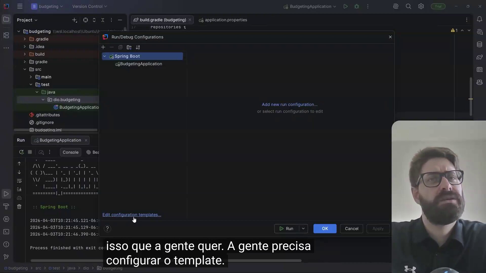
</p>

Como cada execução de teste cria uma nova configuração de Gradle isolada, seria necessário repetir a definição da variável de ambiente toda vez — o que não é prático. A solução apontada é editar diretamente o template de configuração, através do link "Edit configuration templates..." destacado na parte inferior da janela.

---

#### A janela de templates de configuração

<p align="center">
  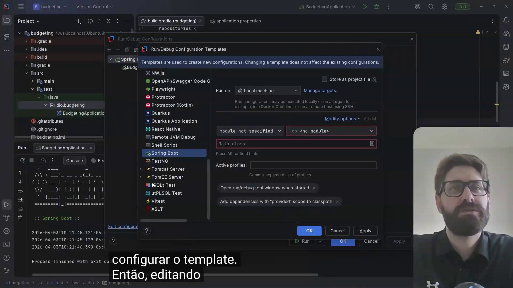
</p>

A janela "Run/Debug Configuration Templates" é aberta, listando os diversos templates disponíveis (Database Script, Docker, Gradle, Groovy, JUnit, Maven, entre outros), com o template "Spring Boot" inicialmente selecionado.

---

#### Selecionando o template do Gradle

<p align="center">
  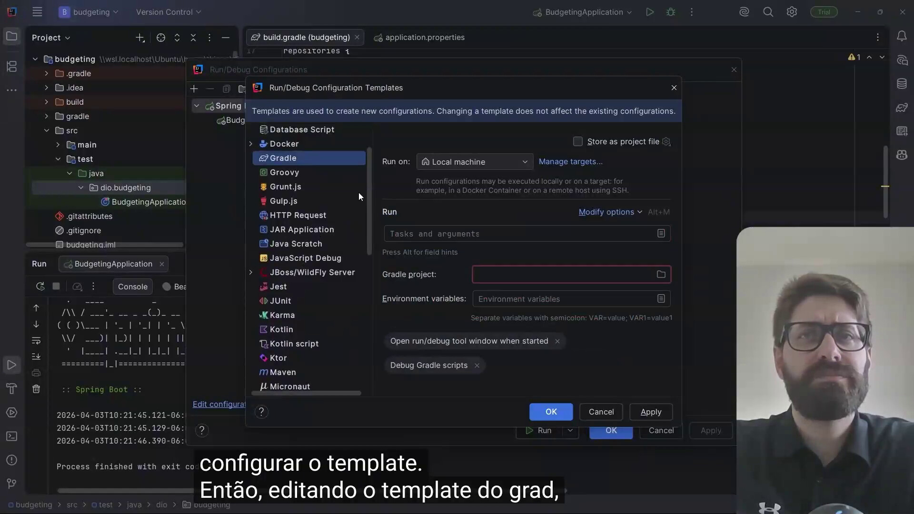
</p>

Dentro da mesma janela de templates, é selecionado especificamente o template "Gradle" — que é o tipo de configuração usado para executar os testes —, exibindo os campos de tarefas, projeto Gradle e variáveis de ambiente que poderão ser editados para valerem por padrão em todos os novos testes criados a partir dele.

---

#### Definindo a variável de ambiente no template

<p align="center">
  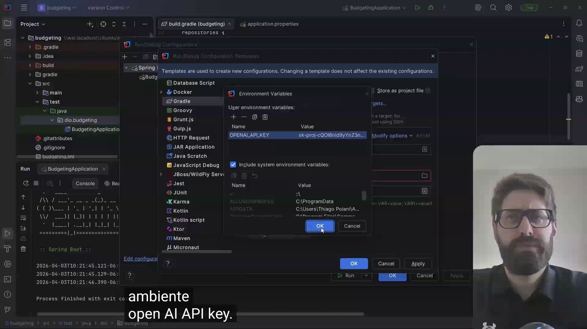
</p>

Na janela de edição de variáveis de ambiente do template, é adicionada a variável `OPENAI_API_KEY` com seu valor (mascarado na tela), mantendo também marcada a opção "Include system environment variables", que garante que as demais variáveis do sistema continuem disponíveis.

---

#### Template do Gradle atualizado

<p align="center">
  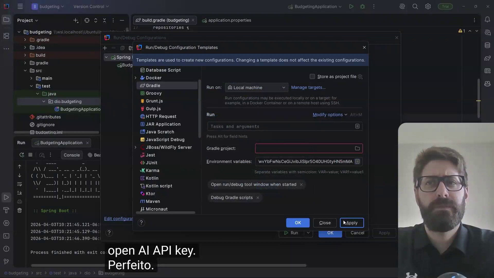
</p>

Com a variável de ambiente já aplicada ao campo "Environment variables" do template Gradle, resta clicar em "Apply" para confirmar a alteração. A partir de agora, todo novo teste criado a partir desse template herdará automaticamente a chave da OpenAI como variável de ambiente.

---

#### Criando uma nova classe Java para o teste de integração

<p align="center">
  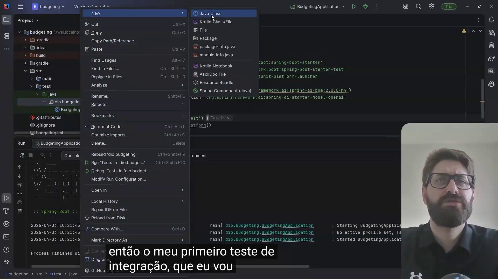
</p>

De volta à árvore de arquivos do projeto, é utilizado o menu de contexto (botão direito) sobre o pacote de testes, escolhendo a opção "New" → "Java Class" para criar a primeira classe de teste de integração com o Chat Model da OpenAI.

---

#### Nomeando a classe de teste de integração

<p align="center">
  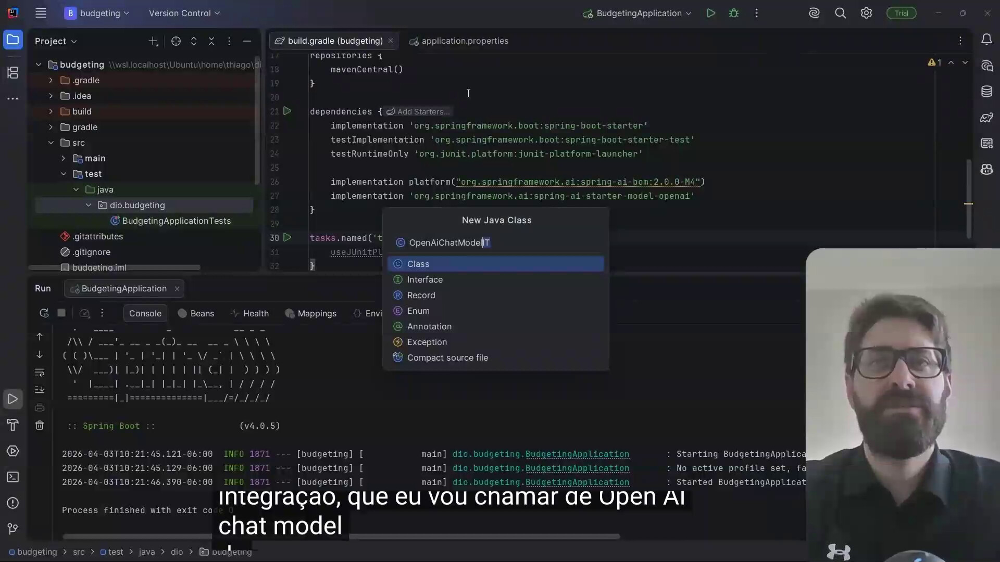
</p>

No diálogo de criação de nova classe Java, é digitado o nome `OpenAiChatModelIT`. O sufixo "IT" (Integration Test) é utilizado propositalmente, pois esse padrão de nomenclatura permite maior controle sobre quais testes são executados durante o processo de build da aplicação, diferenciando testes de integração dos testes unitários comuns.

---

#### Estrutura inicial do teste de integração

<p align="center">
  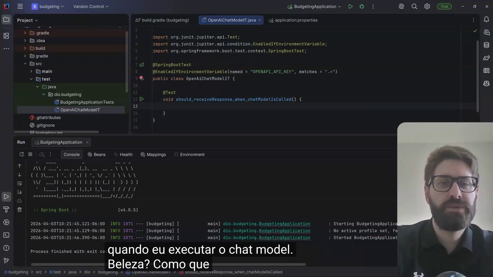
</p>

A classe recém-criada é anotada com `@SpringBootTest` e com `@EnabledIfEnvironmentVariable`, garantindo que o teste só seja executado quando a variável de ambiente da chave da API estiver definida:

```java
import org.junit.jupiter.api.Test;
import org.junit.jupiter.api.condition.EnabledIfEnvironmentVariable;
import org.springframework.boot.test.context.SpringBootTest;

@SpringBootTest
@EnabledIfEnvironmentVariable(named = "OPENAPI_API_KEY", matches = ".+")
public class OpenAiChatModelIT {

    @Test
    void should_receiveResponse_when_chatModelIsCalled() {

    }
}
```

---

#### Injetando o `OpenAiApi` via `@Autowired`

<p align="center">
  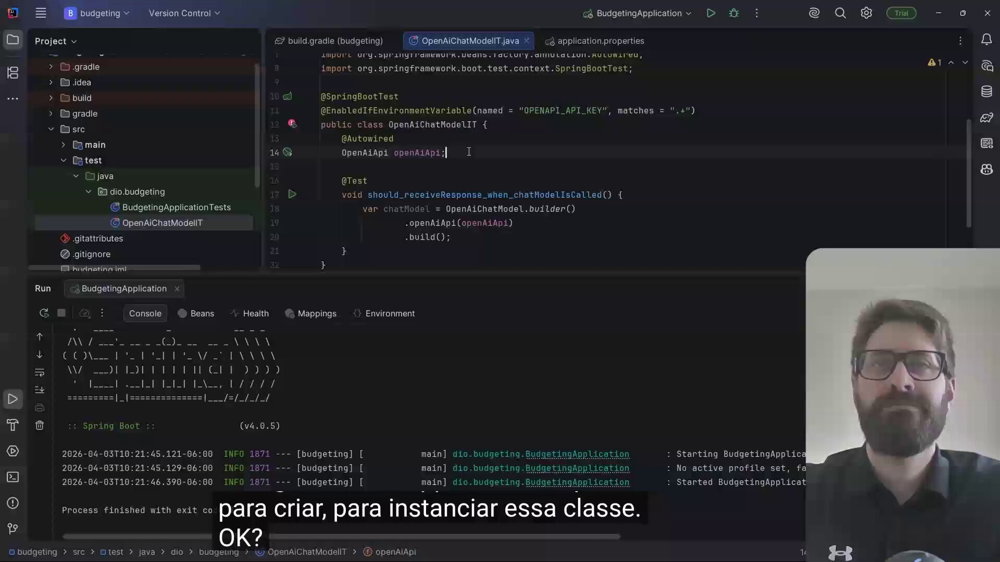
</p>

Para instanciar o `OpenAiChatModel`, o código utiliza o padrão builder, passando um `OpenAiApi` obtido por injeção de dependência com `@Autowired`. Essa injeção só é possível graças à auto-configuração do Spring Boot, que já monta o `OpenAiApi` com as propriedades definidas no `application.properties`:

```java
@SpringBootTest
@EnabledIfEnvironmentVariable(named = "OPENAPI_API_KEY", matches = ".+")
public class OpenAiChatModelIT {

    @Autowired
    OpenAiApi openAiApi;

    @Test
    void should_receiveResponse_when_chatModelIsCalled() {
        var chatModel = OpenAiChatModel.builder()
                .openAiApi(openAiApi)
                .build();
    }
}
```

---

#### Primeira tentativa de configurar as opções do chat model

<p align="center">
  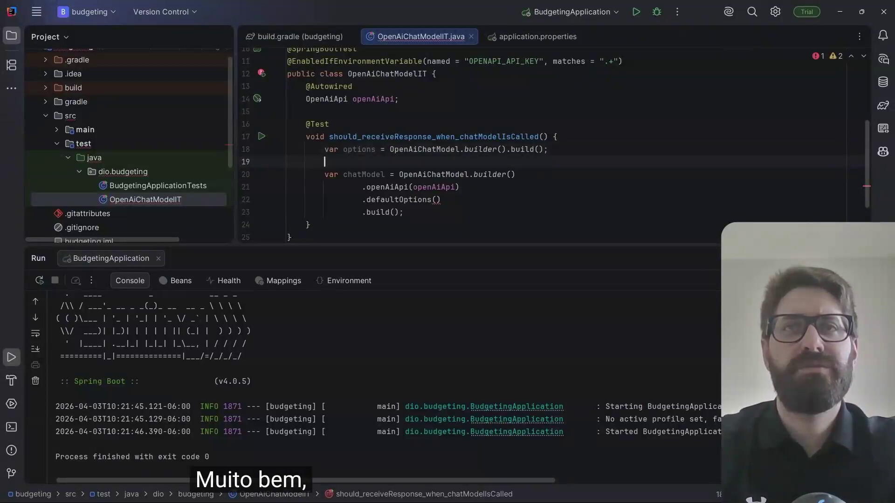
</p>

Nesse momento intermediário do código, é criada uma variável `options`, ainda em construção, e mantido o método `defaultOptions()` sem parâmetro no builder do chat model — um passo de transição antes de definir corretamente as opções do chat na sequência:

```java
@Test
void should_receiveResponse_when_chatModelIsCalled() {
    var options = OpenAiChatModel.builder().build();

    var chatModel = OpenAiChatModel.builder()
            .openAiApi(openAiApi)
            .defaultOptions()
            .build();
}
```

---

#### Configurando `OpenAiChatOptions` com modelo, temperatura e formato de resposta

<p align="center">
  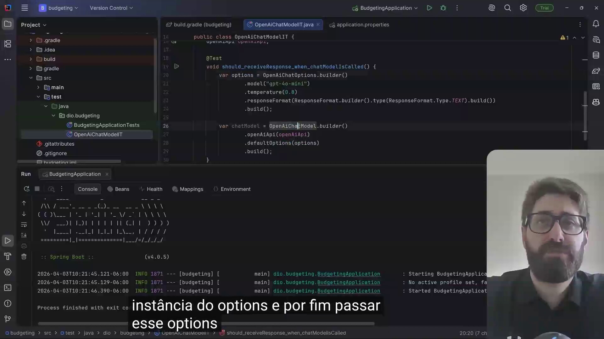
</p>

Agora a variável `options` é corretamente construída a partir de `OpenAiChatOptions.builder()`, definindo o modelo `gpt-4o-mini`, a temperatura `0.8` e o formato de resposta como texto simples. Em seguida, essas opções são passadas para o builder do `OpenAiChatModel` através de `defaultOptions(options)`:

```java
var options = OpenAiChatOptions.builder()
        .model("gpt-4o-mini")
        .temperature(0.8)
        .responseFormat(ResponseFormat.builder().type(ResponseFormat.Type.TEXT).build())
        .build();

var chatModel = OpenAiChatModel.builder()
        .openAiApi(openAiApi)
        .defaultOptions(options)
        .build();
```

---

#### As mesmas configurações definidas via `application.properties`

<p align="center">
  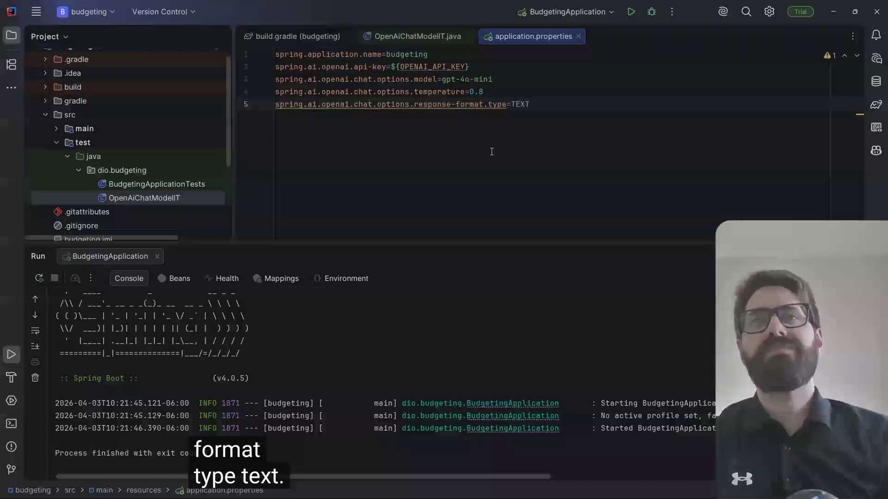
</p>

Como alternativa à configuração manual feita em código, as mesmas opções podem ser definidas diretamente no arquivo de propriedades da aplicação, deixando a instanciação do chat model totalmente a cargo da auto-configuração do Spring Boot:

```properties
spring.application.name=budgeting
spring.ai.openai.api-key=${OPENAI_API_KEY}
spring.ai.openai.chat.options.model=gpt-4o-mini
spring.ai.openai.chat.options.temperature=0.8
spring.ai.openai.chat.options.response-format.type=TEXT
```

---

#### Injetando o `OpenAiChatModel` já configurado

<p align="center">
  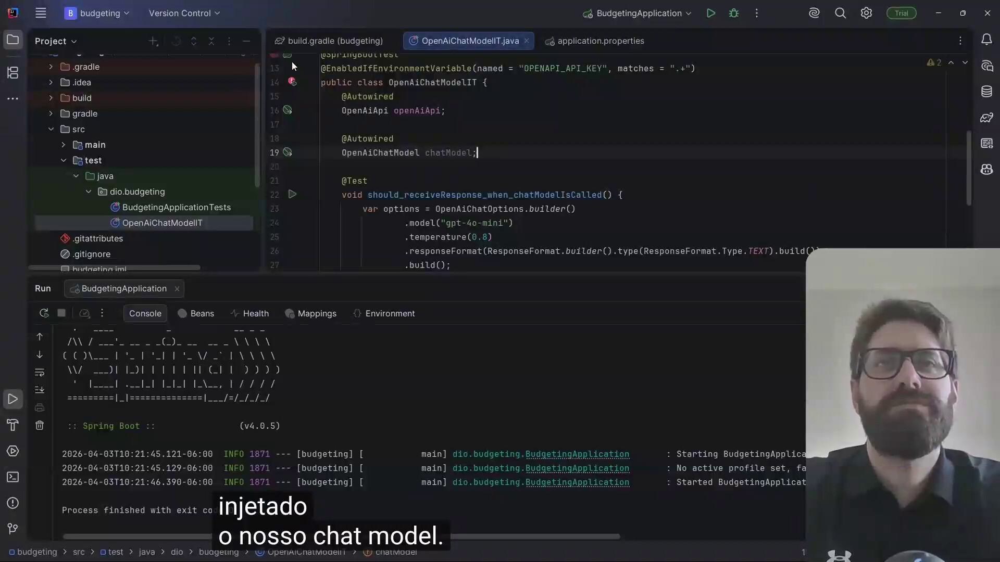
</p>

Com as propriedades definidas no `application.properties`, um novo campo `chatModel`, do tipo `OpenAiChatModel`, é adicionado à classe de teste e injetado via `@Autowired`, demonstrando que o Spring Boot já é capaz de montar o chat model completo automaticamente, sem a necessidade de construí-lo manualmente:

```java
@Autowired
OpenAiApi openAiApi;

@Autowired
OpenAiChatModel chatModel;
```

---

#### Comentando a construção manual do chat model

<p align="center">
  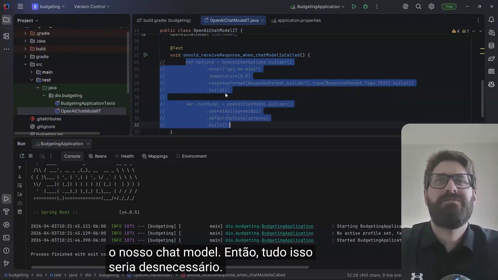
</p>

Como agora o chat model já chega pronto por injeção de dependência a partir das propriedades da aplicação, todo o trecho de código que construía manualmente as `options` e o `chatModel` é comentado, evidenciando que essa etapa deixou de ser necessária:

```java
public class OpenAiChatModelIT {

    @Test
    void should_receiveResponse_when_chatModelIsCalled() {
//        var options = OpenAiChatOptions.builder()
//                .model("gpt-4o-mini")
//                .temperature(0.8)
//                .responseFormat(ResponseFormat.builder().type(ResponseFormat.Type.TEXT).build())
//                .build();
//
//        var chatModel = OpenAiChatModel.builder()
//                .openAiApi(openAiApi)
//                .defaultOptions(options)
//                .build();
    }
}
```

---

#### Chamando o chat model e validando a resposta

<p align="center">
  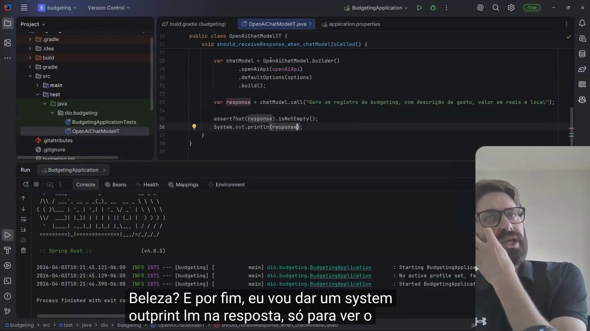
</p>

Com o chat model já injetado, o teste chama o método `call`, passando como prompt o pedido para gerar um registro de gasto (descrição, valor em reais e local). A resposta é validada com uma asserção simples de que não está vazia, e impressa no console apenas para conferência do resultado gerado pela LLM:

```java
var chatModel = OpenAiChatModel.builder()
        .openAiApi(openAiApi)
        .defaultOptions(options)
        .build();

var response = chatModel.call("Gere um registro de budgeting, com descrição de gasto, valor em reais e local");

assertThat(response).isNotEmpty();
System.out.println(response);
```

---

#### O teste passa e a resposta gerada pela LLM é exibida

<p align="center">
  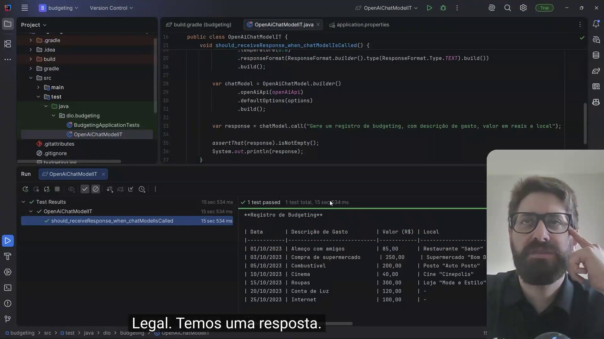
</p>

A execução do teste é bem-sucedida, confirmando que a integração com a OpenAI está funcionando corretamente. No console de resultados, é possível ver a resposta gerada pela LLM: um registro de budgeting em formato de tabela, contendo itens como almoço com amigos, compra de supermercado, combustível, cinema, roupas, conta de luz e internet, cada um com sua respectiva descrição, valor e local.

---

#### Adicionando o starter web ao projeto

<p align="center">
  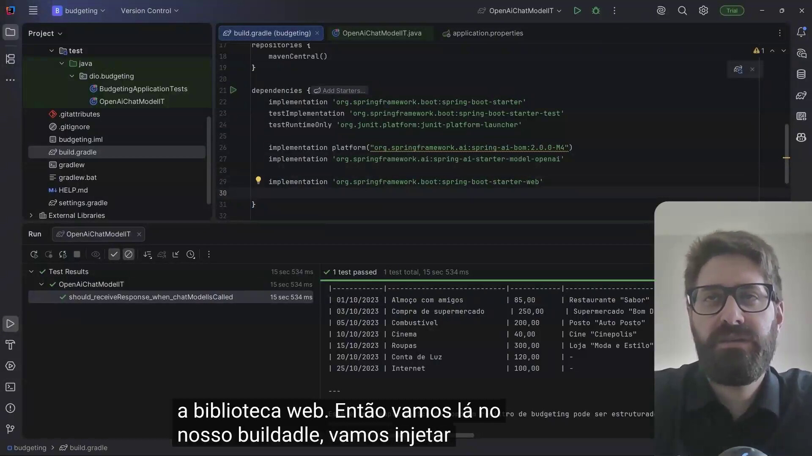
</p>

Para avançar e expor o chat model através de um endpoint HTTP, é necessário adicionar a dependência `spring-boot-starter-web` ao `build.gradle` do projeto, complementando as dependências já existentes do Spring Boot e do Spring AI:

```groovy
dependencies {
    implementation 'org.springframework.boot:spring-boot-starter'
    testImplementation 'org.springframework.boot:spring-boot-starter-test'
    testRuntimeOnly 'org.junit.platform:junit-platform-launcher'

    implementation platform("org.springframework.ai:spring-ai-bom:2.0.0-M4")
    implementation 'org.springframework.ai:spring-ai-starter-model-openai'

    implementation 'org.springframework.boot:spring-boot-starter-web'
}
```

---

#### Criando o `ChatModelController`

<p align="center">
  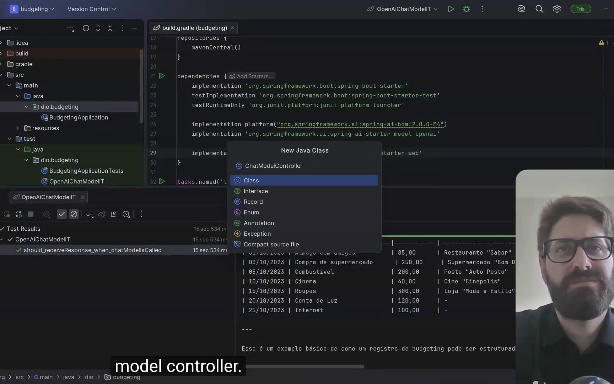
</p>

Com a dependência web já disponível, é criada uma nova classe Java chamada `ChatModelController`, responsável por expor o chat model através de um endpoint REST, permitindo interagir com a LLM diretamente por requisições HTTP.

---

#### Implementação do endpoint que consome o chat model

<p align="center">
  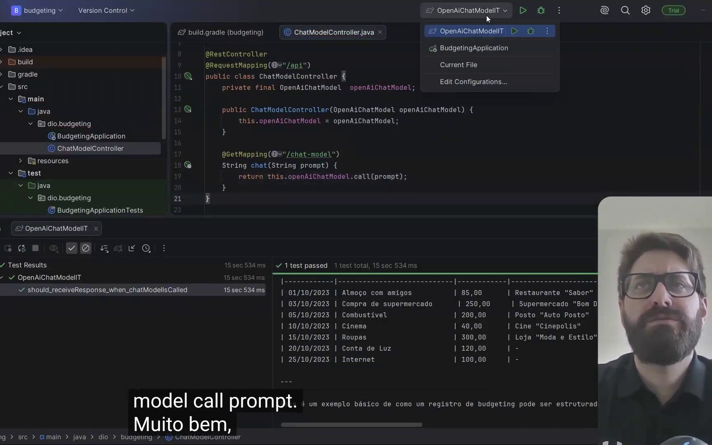
</p>

O controller é anotado com `@RestController` e `@RequestMapping("/api")`, recebendo o `OpenAiChatModel` por injeção de dependência via construtor — o mesmo princípio de injeção usado no teste, agora aplicado à camada web. O método `chat`, mapeado em `@GetMapping("/chat-model")`, recebe um parâmetro `prompt` e simplesmente repassa essa string para o `call` do chat model, devolvendo a resposta da LLM:

```java
@RestController
@RequestMapping("/api")
public class ChatModelController {

    private final OpenAiChatModel openAiChatModel;

    public ChatModelController(OpenAiChatModel openAiChatModel) {
        this.openAiChatModel = openAiChatModel;
    }

    @GetMapping("/chat-model")
    String chat(String prompt) {
        return this.openAiChatModel.call(prompt);
    }
}
```

---

#### Executando a aplicação com o novo endpoint

<p align="center">
  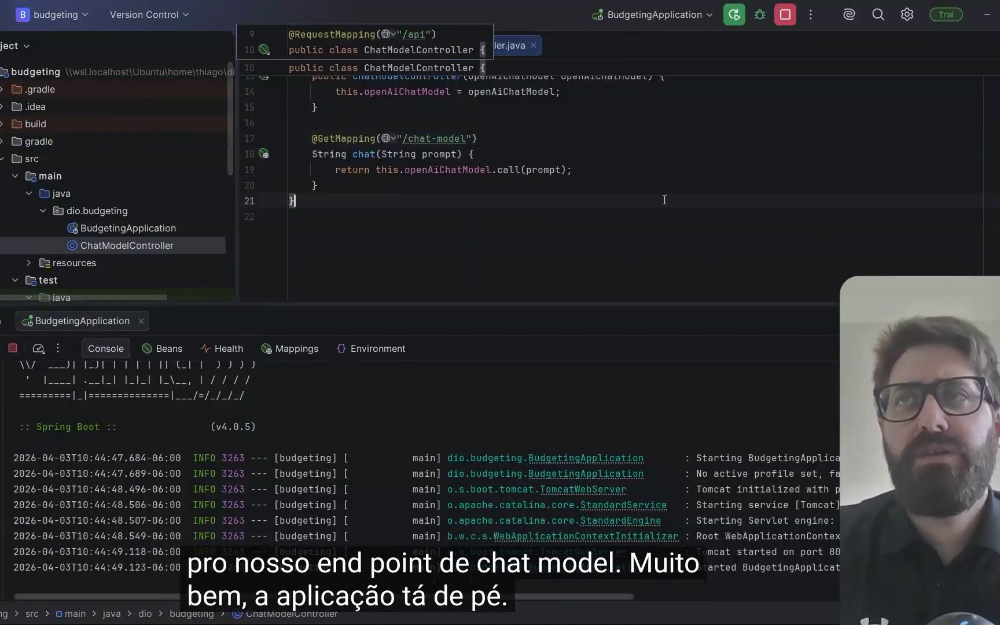
</p>

Antes de testar o endpoint, é selecionada a configuração de execução `BudgetingApplication` no menu superior, e a aplicação é iniciada. O console confirma que o servidor Tomcat foi inicializado e que a aplicação Spring Boot está de pé, pronta para receber requisições.

---

#### Testando o endpoint `/api/chat-model` via HTTP Client

<p align="center">
  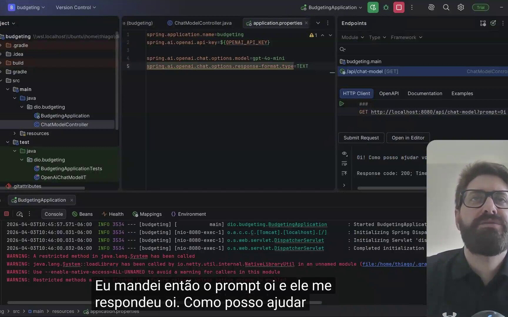
</p>

Usando a ferramenta de Endpoints do IntelliJ, que identifica automaticamente o endpoint criado no controller, é enviada uma requisição de teste com o prompt "Oi":

```http
GET http://localhost:8080/api/chat-model?prompt=Oi
```

A aplicação responde com sucesso (código 200), retornando a mensagem gerada pela LLM: "Oi! Como posso ajudar você hoje?". Isso confirma, de ponta a ponta, o fluxo completo: a requisição chega ao controller, é repassada ao chat model via injeção de dependência, o chat model se comunica com a API da OpenAI usando as propriedades definidas por auto-configuração, e a resposta retorna até o cliente HTTP.

#### Material de Apoio Até Esta Etapa

- Arquivos do projeto nesta etapa: [budgeting_ate_o_video03.zip](./000-Midia_e_Anexos/etapas_do_codigo/budgeting_ate_o_video03.zip)
- [002-Tutorial_Budgeting_Spring_AI_Video03.md](./002-Tutorial_Budgeting_Spring_AI_Video03.md)


### 🟩 Vídeo 04 - ChatClient: Fluência e Contexto no Spring AI

<video width="60%" controls>
  <source src="000-Midia_e_Anexos/bootcamp_ntt_data_java_spring_ai-modulo.04-curso.05-video_04.webm" type="video/webm">
    Seu navegador não suporta vídeo HTML5.
</video>

link do vídeo: https://web.dio.me/lab/desenvolvendo-sua-api-inteligente-com-reconhecimento-de-fala-e-spring-boot-1/learning/af78f4fc-cd36-4230-90cd-8ce61a3d4395

### Anotações

<p align="center">
  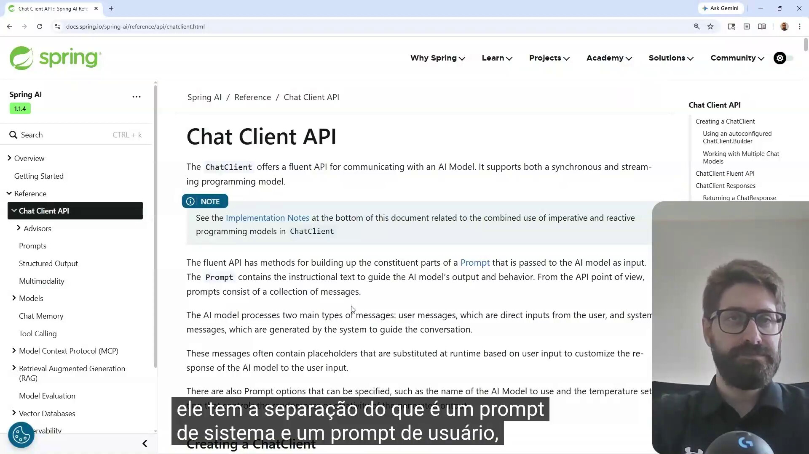
</p>

A imagem mostra a documentação oficial do Spring AI (docs.spring.io), na página referente à **Chat Client API**. O texto da página explica que o `ChatClient` oferece uma API fluente para se comunicar com um modelo de IA, com suporte tanto ao modelo síncrono quanto ao modelo reativo (streaming). É destacado que o modelo de IA processa dois tipos principais de mensagens: mensagens de usuário, que são entradas diretas do usuário, e mensagens de sistema, geradas para orientar o comportamento da conversa — essa é justamente a separação entre prompt de sistema e prompt de usuário que caracteriza o `ChatClient` como uma API mais completa que o `ChatModel`.

<p align="center">
  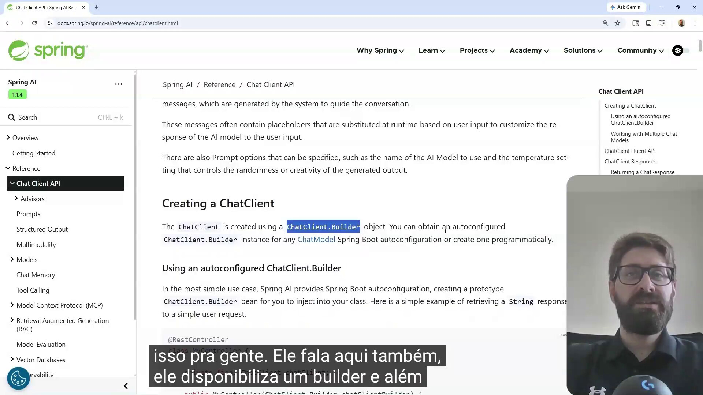
</p>

Aqui a página de documentação está rolada um pouco mais para baixo, mostrando a seção "Creating a ChatClient". O trecho destaca que o `ChatClient` é criado a partir de um objeto `ChatClient.Builder`, podendo ser obtido de forma autoconfigurada pelo Spring Boot ou criado programaticamente. Isso confirma que o `ChatClient` disponibiliza um builder próprio e reaproveita toda a autoconfiguração de `ChatModel` já existente na aplicação.

<p align="center">
  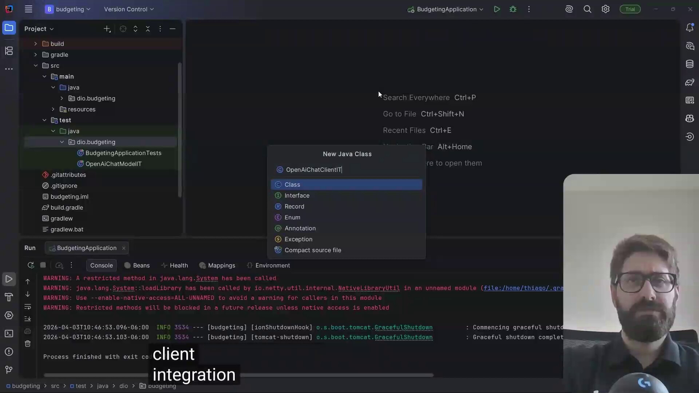
</p>

A imagem mostra a IDE (IntelliJ IDEA) com a janela de criação de uma nova classe Java. O nome digitado é `OpenAiChatClientIT`, criada dentro do pacote de testes do projeto `budgeting`, ao lado da classe `OpenAiChatModelIT` já existente. Essa nova classe será usada para testar o `ChatClient` de forma equivalente ao teste de integração já feito anteriormente para o `ChatModel`.

<p align="center">
  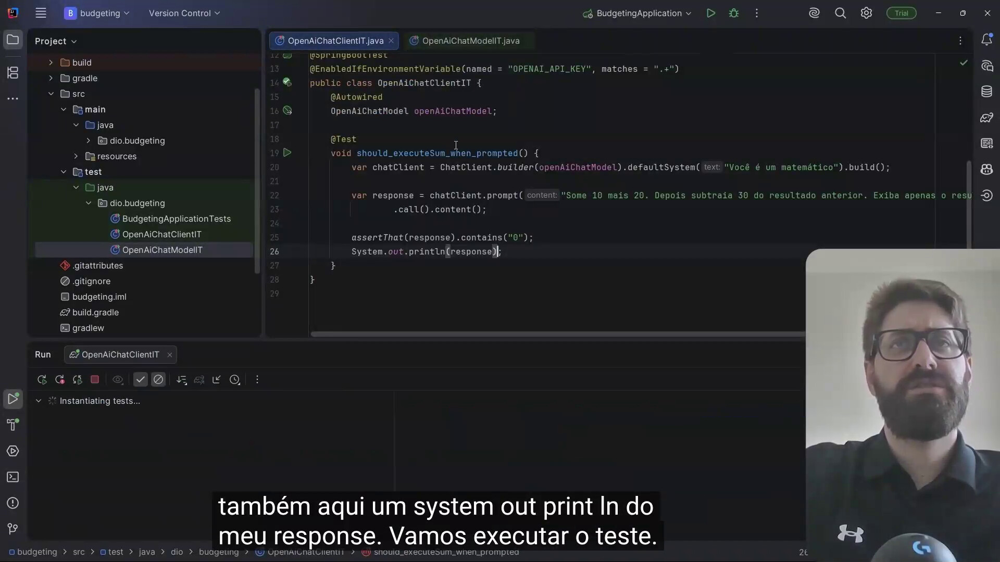
</p>

A imagem mostra o código já escrito na classe `OpenAiChatClientIT`. A classe está anotada com `@SpringBootTest` e `@EnabledIfEnvironmentVariable`, garantindo que o teste só rode quando a variável de ambiente `OPENAI_API_KEY` estiver definida. O `OpenAiChatModel` é injetado via `@Autowired`, e a partir dele o `ChatClient` é construído usando o builder, com um prompt de sistema definindo o papel do modelo como "matemático". Em seguida, um prompt de usuário pede uma operação aritmética, e a resposta é validada com `assertThat(response).contains("0")`, além de ser impressa no console com `System.out.println`.

```java
@SpringBootTest
@EnabledIfEnvironmentVariable(named = "OPENAI_API_KEY", matches = ".+")
public class OpenAiChatClientIT {

    @Autowired
    OpenAiChatModel openAiChatModel;

    @Test
    void should_executeSum_when_prompted() {
        var chatClient = ChatClient.builder(openAiChatModel)
                .defaultSystem("Você é um matemático")
                .build();

        var response = chatClient.prompt("Some 10 mais 20. Depois subtraia 30 do resultado anterior. Exiba apenas o resultado final sem explicações.")
                .call()
                .content();

        assertThat(response).contains("0");
        System.out.println(response);
    }
}
```

<p align="center">
  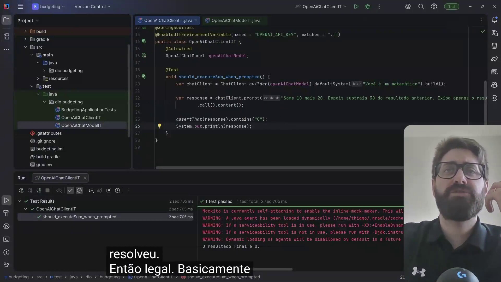
</p>

A imagem mostra o mesmo arquivo de teste, agora com um ícone de sugestão (lâmpada) ao lado da linha do `System.out.println`, indicando uma dica da IDE sobre aquela instrução. O código permanece o mesmo já apresentado na imagem anterior, pronto para ser executado.

<p align="center">
  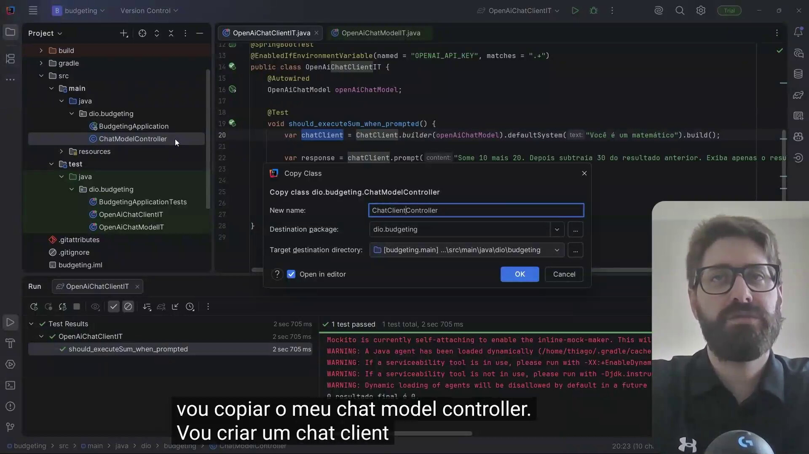
</p>

A imagem mostra o painel de resultados de testes da IDE, indicando que o teste `should_executeSum_when_prompted` passou com sucesso ("1 test passed"). No console é possível ver a saída impressa pelo `System.out.println`, mostrando que a resposta do modelo foi "O resultado final é 0", confirmando que a asserção com `contains("0")` foi bem-sucedida — uma escolha mais flexível do que `equals`, já que o modelo pode retornar texto adicional além do número puro.


<p align="center">
  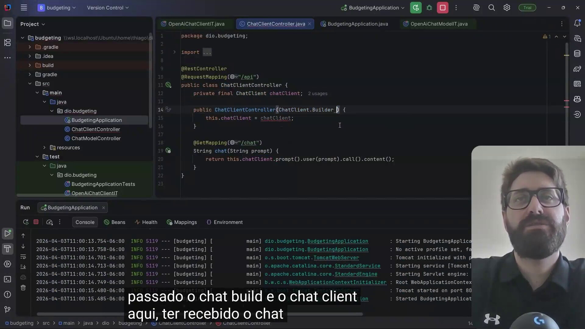
</p>

A imagem mostra a janela "Copy Class" da IDE, usada para duplicar a classe `ChatModelController` já existente no projeto. O novo nome definido é `ChatClientController`, mantendo o mesmo pacote `dio.budgeting`. Essa cópia servirá de ponto de partida para criar um controller equivalente ao anterior, mas utilizando o `ChatClient` em vez do `ChatModel`.


<p align="center">
  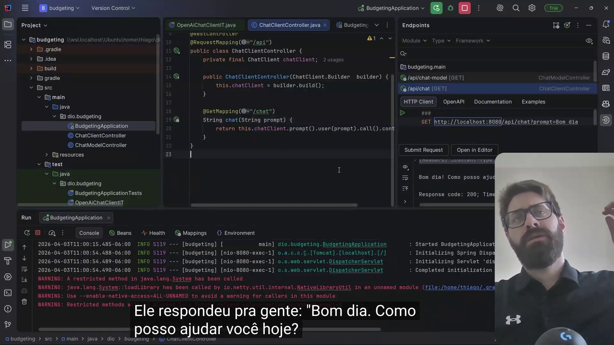
</p>

A imagem mostra o resultado final: o código da classe `ChatClientController`, anotada com `@RestController` e `@RequestMapping("/api")`, injetando um `ChatClient` construído a partir de um `ChatClient.Builder` recebido no construtor. O endpoint `/chat`, mapeado com `@GetMapping`, recebe um prompt de usuário e retorna o conteúdo da resposta obtida via `this.chatClient.prompt().user(prompt).call().content()`. Ao lado, o painel de Endpoints da IDE mostra uma requisição de teste para `GET /api/chat?prompt=Bom dia`, cuja resposta retornada pelo modelo foi "Bom dia! Como posso ajudar você hoje?", confirmando que o controller está funcionando corretamente.

```java
package dio.budgeting;

import ...

@RestController
@RequestMapping("/api")
public class ChatClientController {

    private final ChatClient chatClient;

    public ChatClientController(ChatClient.Builder builder) {
        this.chatClient = builder.build();
    }

    @GetMapping("/chat")
    String chat(String prompt) {
        return this.chatClient.prompt().user(prompt).call().content();
    }
}
```
      
#### Material de Apoio Até Esta Etapa

- Arquivos do projeto nesta etapa: [budgeting_ate_o_video04.zip](./000-Midia_e_Anexos/etapas_do_codigo/budgeting_ate_o_video04.zip)
- [003-Tutorial_Budgeting_Spring_AI_Video04.md](./003-Tutorial_Budgeting_Spring_AI_Video04.md)


### 🟩 Vídeo 05 - Tool Calling: Executando Funções Reais com IA

<video width="60%" controls>
  <source src="000-Midia_e_Anexos/bootcamp_ntt_data_java_spring_ai-modulo.04-curso.05-video_05.webm" type="video/webm">
    Seu navegador não suporta vídeo HTML5.
</video>

link do vídeo: https://web.dio.me/lab/desenvolvendo-sua-api-inteligente-com-reconhecimento-de-fala-e-spring-boot-1/learning/d358b84d-acee-4119-a443-cd2c9327ac70

### Anotações

<p align="center">
  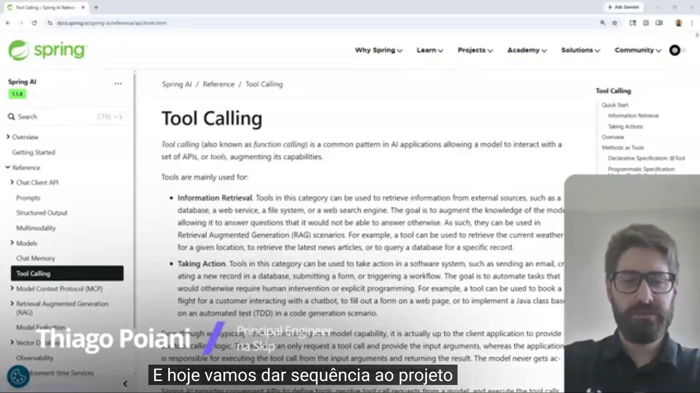
</p>

Esta tela mostra a página oficial da documentação do Spring AI dedicada a Tool Calling. O texto define o conceito como um padrão comum em aplicações de IA, também conhecido como Function Calling, que permite a um modelo interagir com um conjunto de APIs ou ferramentas para ampliar suas capacidades. A página destaca dois usos principais para as tools: **Information Retrieval** (buscar informações em fontes externas, como bancos de dados, serviços web ou motores de busca, para complementar o conhecimento do modelo) e **Taking Action** (executar ações em um sistema, como enviar um e-mail, criar um registro ou disparar um fluxo de trabalho). Essa introdução marca o início do assunto do dia, que dá sequência ao projeto de API inteligente com reconhecimento de fala, apresentando o Tool Calling como uma forma de trazer mais contexto ao Chat Client em vez de depender apenas da LLM.

<p align="center">
  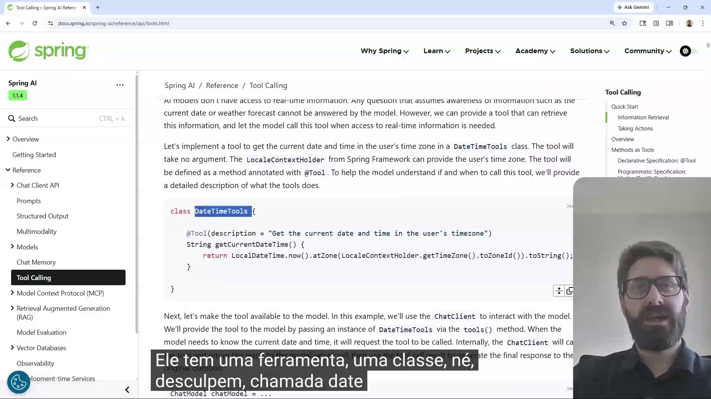
</p>

A documentação exibe um exemplo prático de implementação de uma tool para obter a data e hora atuais no fuso horário do usuário, usando a classe `DateTimeTools`. O método é anotado com `@Tool`, cuja `description` explica ao modelo o propósito da ferramenta, permitindo que ele decida quando chamá-la.

```java
class DateTimeTools {

    @Tool(description = "Get the current date and time in the user's timezone")
    String getCurrentDateTime() {
        return LocalDateTime.now().atZone(LocaleContextHolder.getTimeZone().toZoneId()).toString();
    }

}
```

<p align="center">
  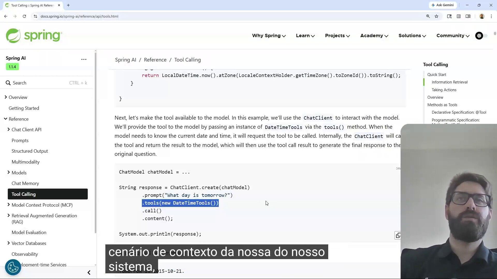
</p>

Na sequência da documentação, é mostrado como disponibilizar a tool para o modelo através do `ChatClient`, passando uma instância de `DateTimeTools` pelo método `.tools()`. Quando o modelo precisa saber a data atual, ele solicita a chamada da ferramenta e usa o resultado para gerar a resposta final ao prompt original.

```java
ChatModel chatModel = ...

String response = ChatClient.create(chatModel)
        .prompt("What day is tomorrow?")
        .tools(new DateTimeTools())
        .call()
        .content();

System.out.println(response);
```

<p align="center">
  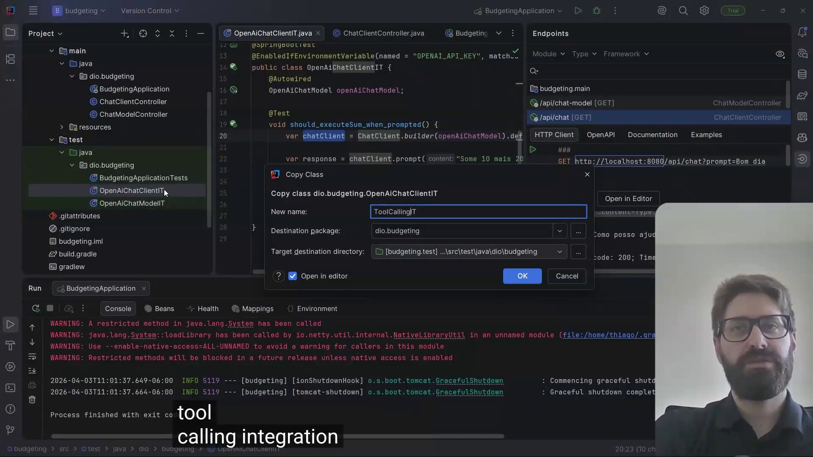
</p>

A tela agora muda para a IDE, mostrando a caixa de diálogo "Copy Class" sendo usada para duplicar a classe de teste `OpenAiChatClientIT`, criando uma nova classe chamada `ToolCallingIT` dentro do mesmo pacote `dio.budgeting`. Essa é a etapa inicial de criação do teste de integração dedicado a demonstrar o Tool Calling, reaproveitando a estrutura do teste de Chat Client já existente.

<p align="center">
  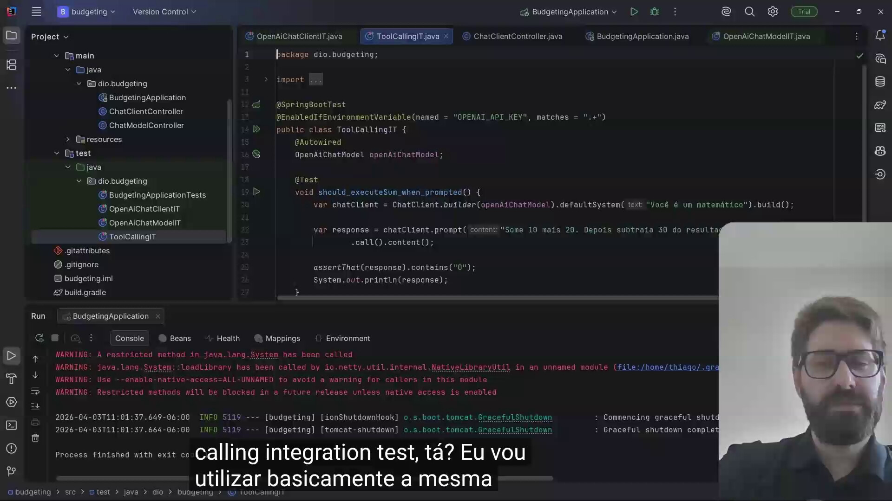
</p>

Com a nova classe já criada, o código mostra o teste `ToolCallingIT`, praticamente idêntico ao teste de Chat Client anterior: o `ChatClient` é configurado com um `defaultSystem` instruindo o modelo a se comportar como um matemático, e o prompt pede para somar 10 mais 20 e depois subtrair 30 do resultado anterior.

```java
package dio.budgeting;

import ...

@SpringBootTest
@EnabledIfEnvironmentVariable(named = "OPENAI_API_KEY", matches = ".+")
public class ToolCallingIT {

    @Autowired
    OpenAiChatModel openAiChatModel;

    @Test
    void should_executeSum_when_prompted() {
        var chatClient = ChatClient.builder(openAiChatModel).defaultSystem("Você é um matemático").build();

        var response = chatClient.prompt("Some 10 mais 20. Depois subtraia 30 do resultado...")
                .call().content();

        assertThat(response).contains("0");
        System.out.println(response);
    }
}
```

<p align="center">
  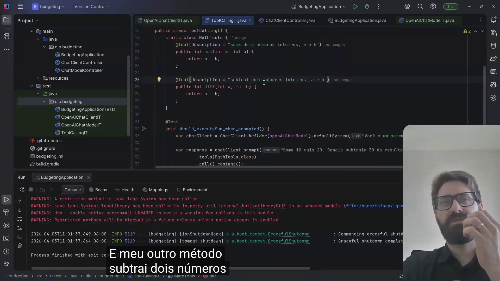
</p>

Dentro da classe de teste, é criada a classe `MathTools`, com dois métodos anotados com `@Tool`: `sum`, que soma dois números inteiros, e `diff`, que subtrai um do outro. Cada anotação recebe uma `description` explicando o que o método faz, informação usada pelo modelo para decidir qual ferramenta chamar de acordo com o prompt recebido.

```java
static class MathTools {
    @Tool(description = "soma dois números inteiros, a e b")
    public int sum(int a, int b) {
        return a + b;
    }

    @Tool(description = "subtrai dois números inteiros, a e b")
    public int diff(int a, int b) {
        return a - b;
    }
}
```

<p align="center">
  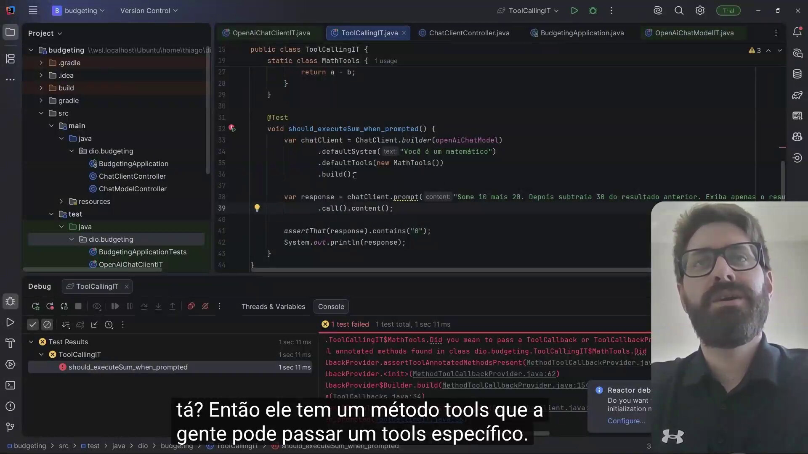
</p>

O painel de debug mostra um erro de execução: `MathTools.Did you mean to pass a ToolCallback or ToolCallbackProvider? No annotated methods found in class...`. O erro ocorreu porque a tool estava sendo passada no método `.tools()` durante a execução do prompt, e não na configuração do `ChatClient`. A correção é usar `.defaultTools(new MathTools())` já na construção do `ChatClient`, garantindo que o modelo reconheça a ferramenta corretamente.

```java
var chatClient = ChatClient.builder(openAiChatModel)
        .defaultSystem("Você é um matemático")
        .defaultTools(new MathTools())
        .build();

var response = chatClient.prompt("Some 10 mais 20. Depois subtraia 30 do resultado anterior. Exiba apenas o resu...")
        .call().content();

assertThat(response).contains("0");
```

<p align="center">
  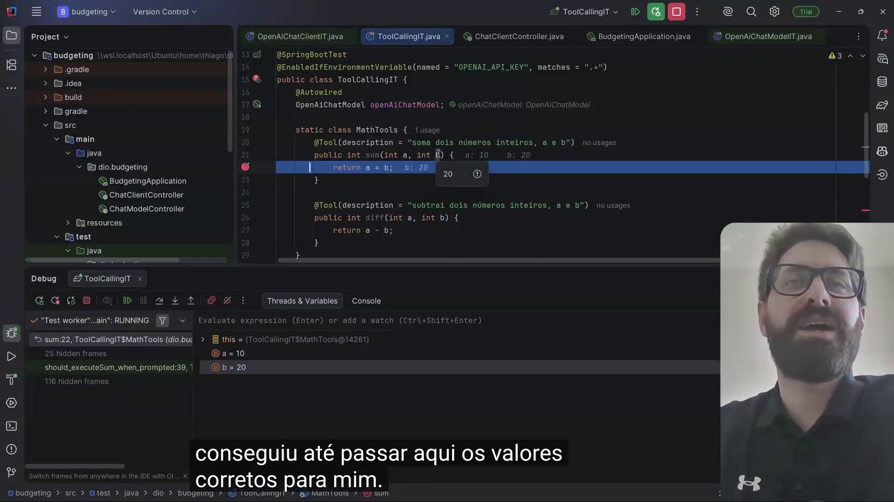
</p>

Com a configuração corrigida, o debug é executado novamente, desta vez parando em um breakpoint dentro do método `sum`. O painel de variáveis confirma que os valores `a = 10` e `b = 20` foram interpretados corretamente a partir do prompt "Some 10 mais 20", mostrando que o modelo conseguiu identificar a tool certa e extrair os argumentos numéricos corretos para a chamada.

<p align="center">
  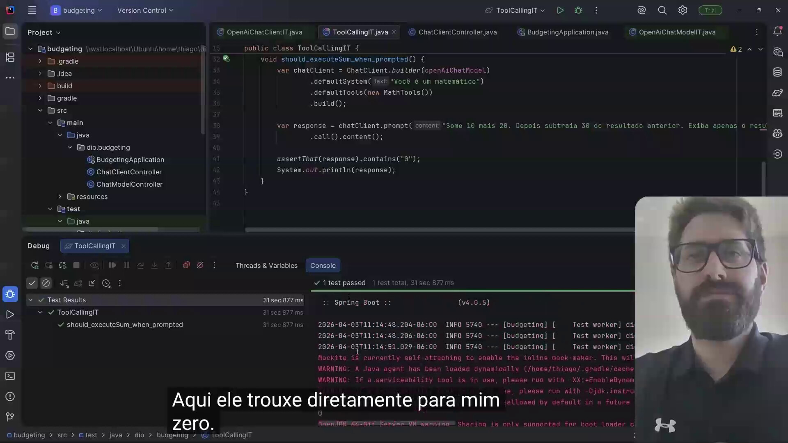
</p>

O painel de resultados de teste mostra "1 test passed", confirmando que a asserção `assertThat(response).contains("0")` foi satisfeita. Diferente da execução anterior via apenas a LLM (que respondia incorretamente), agora o resultado calculado pelas tools de soma e subtração é retornado diretamente na resposta.


<p align="center">
  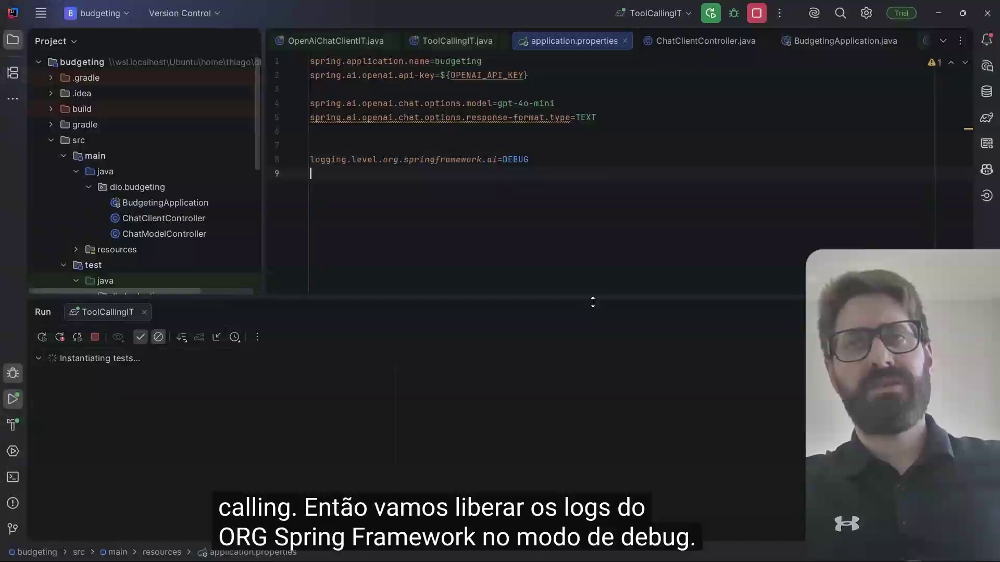
</p>

O arquivo `application.properties` é editado para adicionar uma configuração extra de logging, elevando o nível de log do pacote `org.springframework.ai` para `DEBUG`. Essa mudança permite visualizar nos logs, com mais clareza, o momento em que a execução passa pelas chamadas de tool calling.

```properties
spring.application.name=budgeting
spring.ai.openai.api-key=${OPENAI_API_KEY}

spring.ai.openai.chat.options.model=gpt-4o-mini
spring.ai.openai.chat.options.response-format.type=TEXT

logging.level.org.springframework.ai=DEBUG
```

<p align="center">
  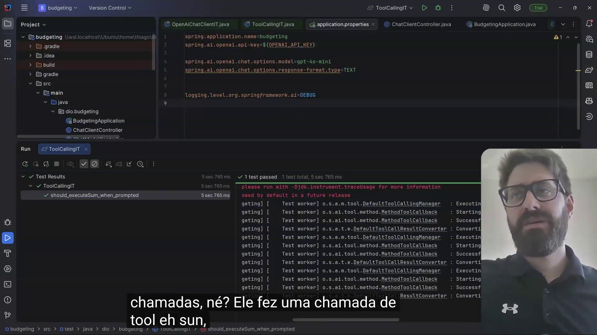
</p>

Com o novo nível de log ativado, o teste é executado novamente e o painel de resultados mostra "1 test passed" acompanhado de um log detalhado do Spring AI: são registradas as chamadas ao `DefaultToolCallingManager` e ao `MethodToolCallback`, evidenciando a execução das tools `sum` e `diff` (esta chamada uma segunda vez) e a conversão dos resultados para JSON antes de retornarem ao modelo. Isso confirma visualmente que, desta vez, o resultado foi resolvido pelos métodos Java criados, e não diretamente pela LLM.
     
#### Material de Apoio Até Esta Etapa

- Arquivos do projeto nesta etapa: [budgeting_ate_o_video05.zip](./000-Midia_e_Anexos/etapas_do_codigo/budgeting_ate_o_video05.zip)
- [004-Tutorial_Budgeting_Spring_AI_Video05.md](./004-Tutorial_Budgeting_Spring_AI_Video05.md)


### 🟩 Vídeo 06 - Transcription API: Transformando Áudio em Texto

<video width="60%" controls>
  <source src="000-Midia_e_Anexos/bootcamp_ntt_data_java_spring_ai-modulo.04-curso.05-video_06.webm" type="video/webm">
    Seu navegador não suporta vídeo HTML5.
</video>

link do vídeo: https://web.dio.me/lab/desenvolvendo-sua-api-inteligente-com-reconhecimento-de-fala-e-spring-boot-1/learning/68270c44-f264-4073-b102-a7eb9d2c3284?back=/track/ntt-data-2026-ai-java-back-end

### Anotações

<p align="center">
  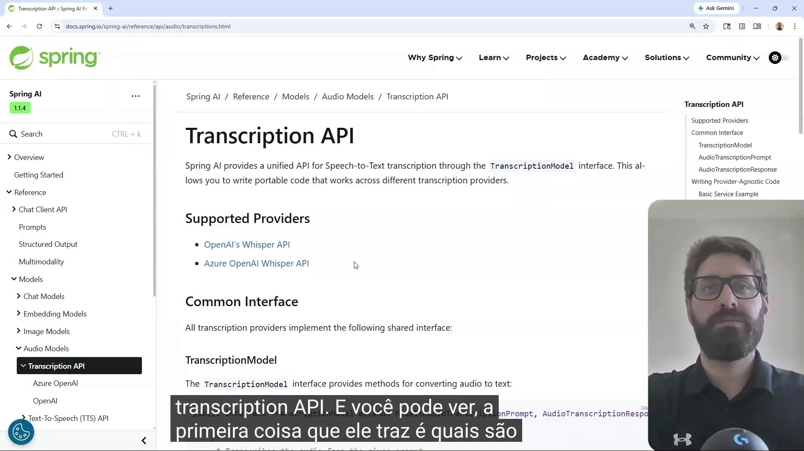
</p>

A página exibida é a documentação oficial do Spring AI, na seção **Models → Audio Models → Transcription API**. Ela apresenta a `TranscriptionModel`, interface responsável por unificar o acesso a serviços de conversão de fala em texto (*speech-to-text*), permitindo escrever código portável entre diferentes provedores. Logo abaixo, a seção **Supported Providers** lista os dois provedores atualmente suportados: **OpenAI's Whisper API** e **Azure OpenAI Whisper API**.

<p align="center">
  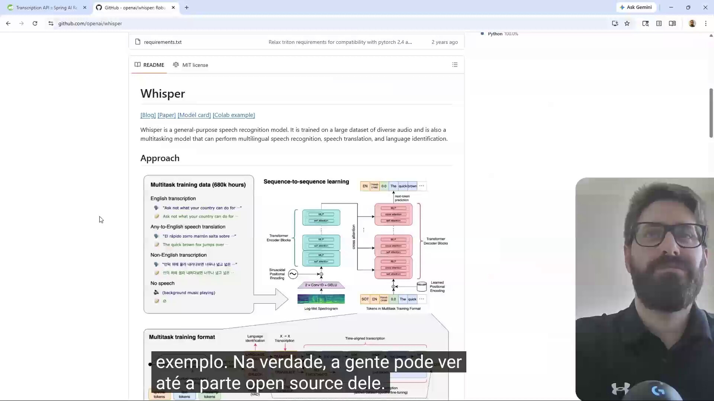
</p>

A imagem mostra o repositório oficial do **Whisper** no GitHub (`github.com/openai/whisper`), o modelo de reconhecimento de fala de propósito geral desenvolvido pela OpenAI, que dá suporte ao provedor citado anteriormente. O README destaca que se trata de um modelo *multitasking*, capaz de realizar transcrição multilíngue, tradução de fala e identificação de idioma, além de exibir um diagrama de sua arquitetura (*Sequence-to-sequence learning*).

<p align="center">
  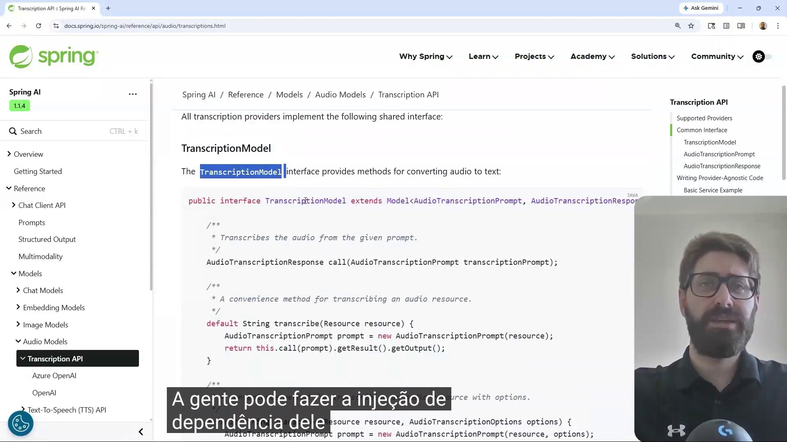
</p>

Voltando à documentação do Spring AI, a seção **Common Interface** apresenta o contrato da `TranscriptionModel`. Ele define o método `call`, que recebe um `AudioTranscriptionPrompt` e devolve um `AudioTranscriptionResponse`, além de um método de conveniência `transcribe`, que recebe diretamente um `Resource` e já retorna o texto transcrito como `String`.

```java
public interface TranscriptionModel extends Model<AudioTranscriptionPrompt, AudioTranscriptionResponse> {

    /**
     * Transcribes the audio from the given prompt.
     */
    AudioTranscriptionResponse call(AudioTranscriptionPrompt transcriptionPrompt);

    /**
     * A convenience method for transcribing an audio resource.
     */
    default String transcribe(Resource resource) {
        AudioTranscriptionPrompt prompt = new AudioTranscriptionPrompt(resource);
        return this.call(prompt).getResult().getOutput();
    }
}
```

<p align="center">
  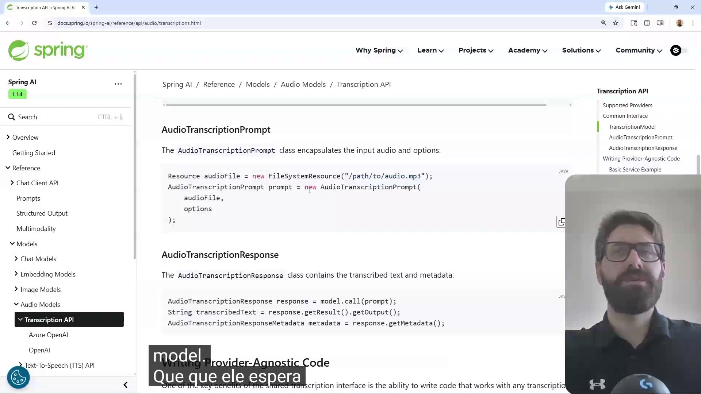
</p>

Ainda na documentação, agora nas seções **AudioTranscriptionPrompt** e **AudioTranscriptionResponse**, é mostrado como o áudio de entrada é encapsulado (junto de suas `options`) e como a resposta expõe o texto transcrito e os metadados associados.

```java
Resource audioFile = new FileSystemResource("/path/to/audio.mp3");
AudioTranscriptionPrompt prompt = new AudioTranscriptionPrompt(
    audioFile,
    options
);
```

```java
AudioTranscriptionResponse response = model.call(prompt);
String transcribedText = response.getResult().getOutput();
AudioTranscriptionResponseMetadata metadata = response.getMetadata();
```

<p align="center">
  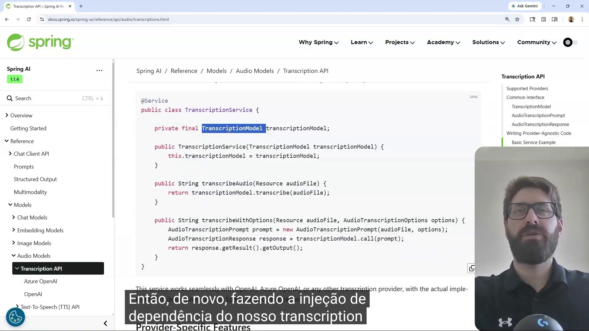
</p>

A seção **Writing Provider-Agnostic Code → Basic Service Example** traz um exemplo completo de serviço Spring que injeta a interface `TranscriptionModel` via construtor, reforçando que o mesmo código funciona independentemente do provedor configurado (OpenAI, Azure OpenAI, etc.).

```java
@Service
public class TranscriptionService {

    private final TranscriptionModel transcriptionModel;

    public TranscriptionService(TranscriptionModel transcriptionModel) {
        this.transcriptionModel = transcriptionModel;
    }

    public String transcribeAudio(Resource audioFile) {
        return transcriptionModel.transcribe(audioFile);
    }

    public String transcribeWithOptions(Resource audioFile, AudioTranscriptionOptions options) {
        AudioTranscriptionPrompt prompt = new AudioTranscriptionPrompt(audioFile, options);
        AudioTranscriptionResponse response = transcriptionModel.call(prompt);
        return response.getResult().getOutput();
    }
}
```

<p align="center">
  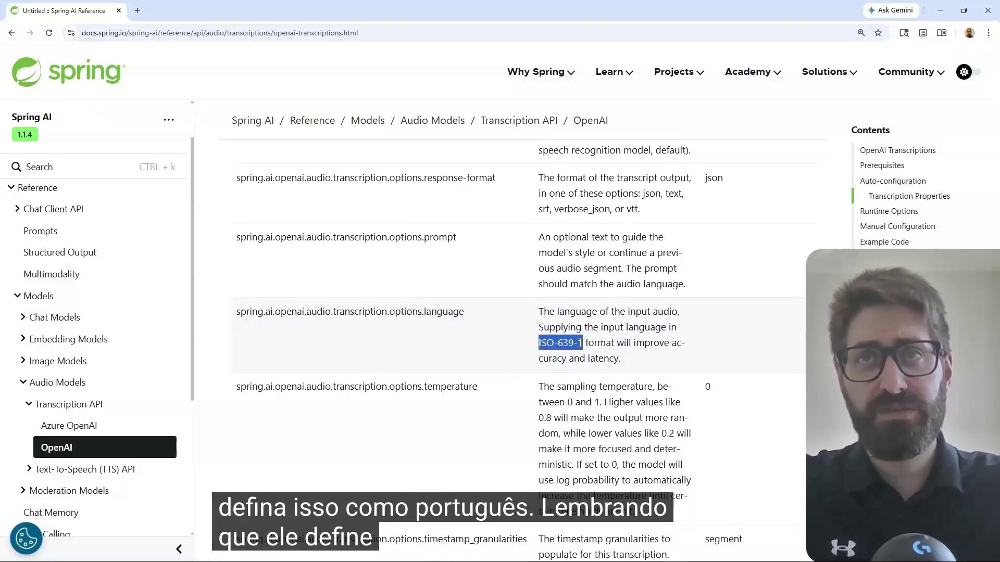
</p>

Aqui a documentação passa para a página específica do provedor **OpenAI** (`openai-transcriptions.html`), detalhando as propriedades de configuração disponíveis via `application.properties`. Destacam-se `response-format` (json, text, srt, verbose_json ou vtt), `prompt` (texto opcional para guiar o estilo do modelo), `language` — que deve seguir o formato **ISO-639-1** para melhorar precisão e latência — e `temperature`, cujo valor `0` torna a saída mais determinística e menos "criativa".

<p align="center">
  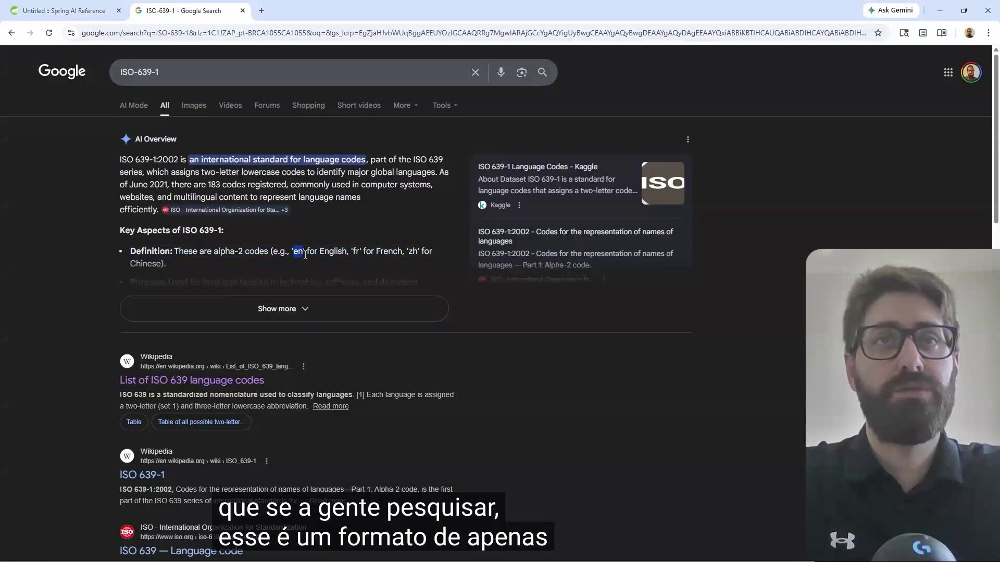
</p>

Uma pesquisa complementar no Google pelo termo "ISO-639-1" é feita para confirmar o significado desse padrão: trata-se de um padrão internacional de códigos de idioma, formado por códigos alfa-2 de duas letras (por exemplo, "en" para inglês, "fr" para francês, "zh" para chinês), usado para representar nomes de idiomas em sistemas computacionais.

<p align="center">
  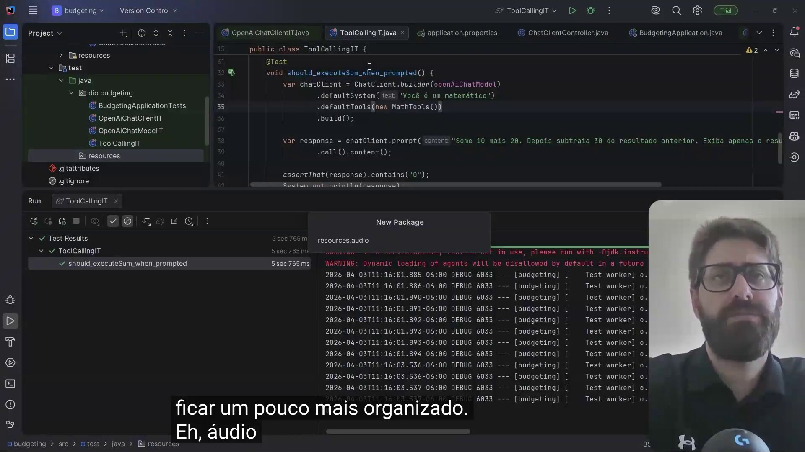
</p>

No IntelliJ, dentro do projeto `budgeting`, é criado um novo pacote chamado `resources.audio` na pasta de testes. Esse pacote servirá para organizar os arquivos de áudio que serão usados nos testes de integração, mantendo a estrutura do projeto organizada.

<p align="center">
  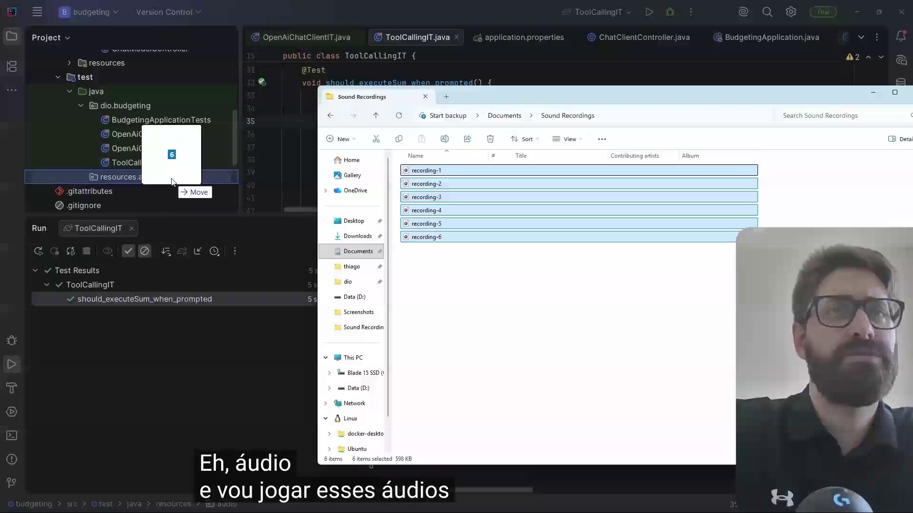
</p>

A imagem mostra o explorador de arquivos do sistema operacional, na pasta **Sound Recordings**, com seis arquivos de áudio (`recording-1` a `recording-6`) selecionados. Esses são os áudios previamente gerados com frases sobre gastos financeiros do dia a dia, que serão copiados para dentro do projeto.

<p align="center">
  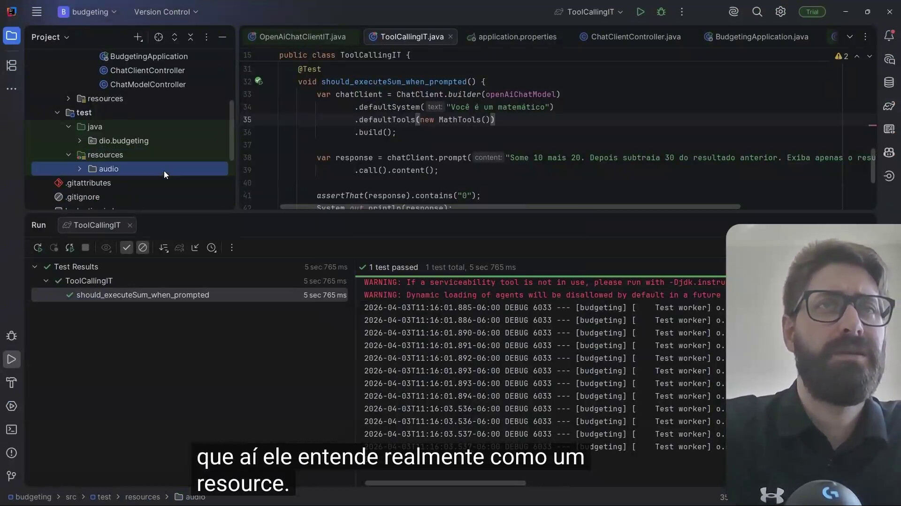
</p>

De volta ao IntelliJ, os arquivos de áudio já aparecem organizados dentro da pasta `resources/audio` do módulo de testes. Estando nesse local padrão de *resources*, o Spring consegue reconhecê-los corretamente como um `Resource` (via `ClassPathResource`), permitindo que sejam carregados pelos testes de integração.

<p align="center">
  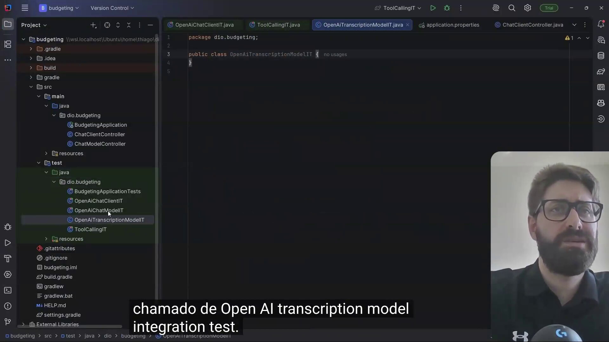
</p>

É criada a classe de teste `OpenAiTranscriptionModelIT`, ainda vazia, no pacote `dio.budgeting`. Ela servirá como ponto de partida para o teste de integração que validará o comportamento do modelo de transcrição da OpenAI.

```java
package dio.budgeting;

public class OpenAiTranscriptionModelIT {
}
```

<p align="center">
  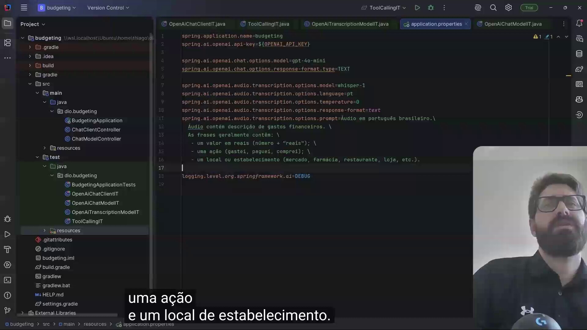
</p>

No arquivo `application.properties`, são definidas as opções do modelo de transcrição: o modelo **Whisper 1**, a linguagem `pt` (português), a `temperature` em `0` e o formato de resposta como `text`. Também é configurado um `prompt` que contextualiza o modelo, informando que o áudio está em português brasileiro, contém descrições de gastos financeiros e que as frases costumam trazer um valor em reais, uma ação e um local ou estabelecimento.

```properties
spring.application.name=budgeting
spring.ai.openai.api-key=${OPENAI_API_KEY}

spring.ai.openai.chat.options.model=gpt-4o-mini
spring.ai.openai.chat.options.response-format.type=TEXT

spring.ai.openai.audio.transcription.options.model=whisper-1
spring.ai.openai.audio.transcription.options.language=pt
spring.ai.openai.audio.transcription.options.temperature=0
spring.ai.openai.audio.transcription.options.response-format=text
spring.ai.openai.audio.transcription.options.prompt=Áudio em português brasileiro.\
  Áudio contém descrição de gastos financeiros. \
  As frases geralmente contêm: \
  - um valor em reais (número + "reais"); \
  - uma ação (gastei, paguei, comprei); \
  - um local ou estabelecimento (mercado, farmácia, restaurante, loja, etc.).

logging.level.org.springframework.ai=DEBUG
```

<p align="center">
  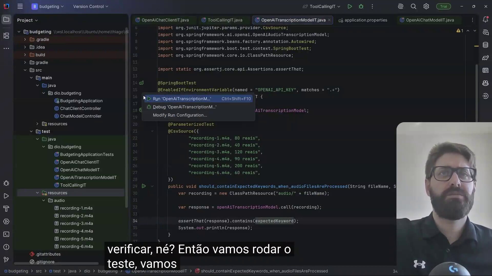
</p>

A classe de teste é preenchida por completo. Nela, o `OpenAiAudioTranscriptionModel` é injetado via `@Autowired`, aproveitando a autoconfiguração do Spring Boot. O método de teste usa `@ParameterizedTest` com `@CsvSource`, percorrendo os seis arquivos de áudio e suas palavras-chave esperadas, chamando o modelo para cada arquivo e validando, com `assertThat(...).contains(...)`, se o texto retornado contém o valor esperado.

```java
import org.junit.jupiter.params.provider.CsvSource;
import org.springframework.ai.openai.OpenAiAudioTranscriptionModel;
import org.springframework.beans.factory.annotation.Autowired;
import org.springframework.boot.test.context.SpringBootTest;
import org.springframework.core.io.ClassPathResource;

import static org.assertj.core.api.Assertions.assertThat;

@SpringBootTest
@EnabledIfEnvironmentVariable(named = "OPENAI_API_KEY", matches = ".+")
public class OpenAiTranscriptionModelIT {

    @Autowired
    OpenAiAudioTranscriptionModel openAiTranscriptionModel;

    @ParameterizedTest
    @CsvSource({
            "recording-1.m4a, 80 reais",
            "recording-2.m4a, 40 reais",
            "recording-3.m4a, 120 reais",
            "recording-4.m4a, 90 reais",
            "recording-5.m4a, 200 reais",
            "recording-6.m4a, 60 reais",
    })
    public void should_containExpectedKeywords_when_audioFilesAreProcessed(String fileName, String expectedKeyword) {
        var recording = new ClassPathResource("audio/" + fileName);

        var response = openAiTranscriptionModel.call(recording);

        assertThat(response).contains(expectedKeyword);
        System.out.println(response);
    }
}
```

<p align="center">
  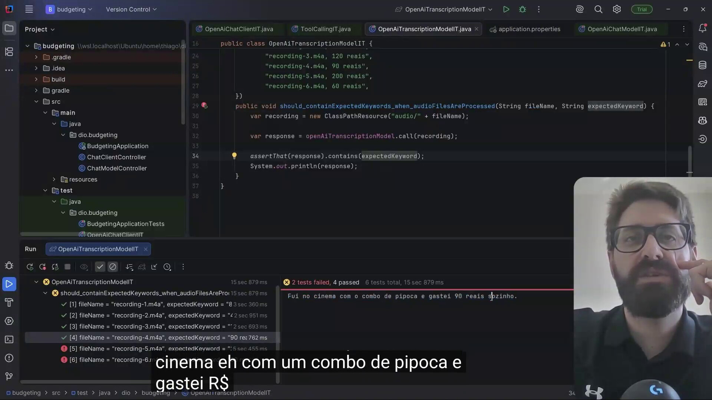
</p>

O teste parametrizado é executado. O painel de resultados mostra **2 testes falhando e 4 passando**, de um total de 6. Um dos casos exibidos retorna o texto "Fui no cinema com o combo de pipoca e gastei 90 reais sozinho.", confirmando que o modelo consegue transcrever corretamente boa parte dos áudios, mas alguns casos ainda precisam ser investigados.

<p align="center">
  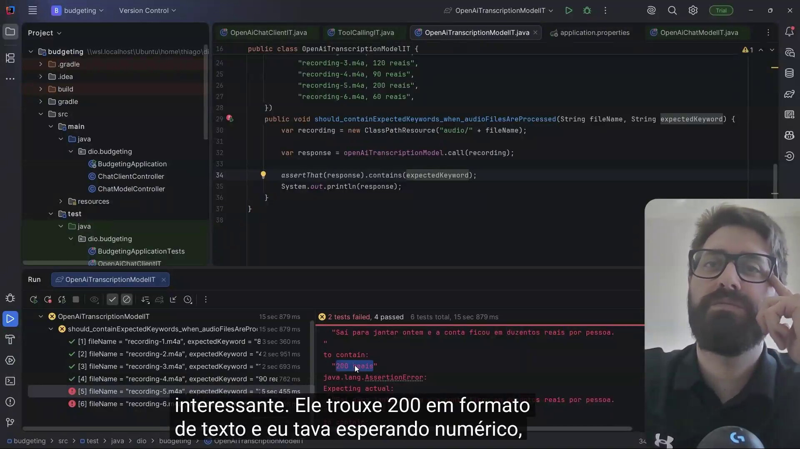
</p>

O detalhe de uma das falhas é exibido: o áudio "Sai para jantar ontem e a conta ficou em duzentos reais por pessoa." foi transcrito corretamente em termos de conteúdo, mas o modelo escreveu o valor por extenso ("duzentos reais") em vez de numérico ("200 reais"), o que faz a asserção `contains("200 reais")` falhar. Esse comportamento evidencia que o Whisper pode converter números para a forma escrita, exigindo validações mais flexíveis nos testes.

<p align="center">
  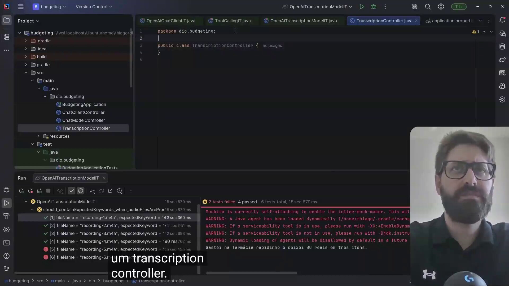
</p>

Com o modelo validado, o próximo passo é expor a funcionalidade via API REST. É criada a classe `TranscriptionController`, ainda vazia, no pacote principal da aplicação (`dio.budgeting`), que servirá de base para o novo endpoint.

```java
package dio.budgeting;

public class TranscriptionController {
}
```

<p align="center">
  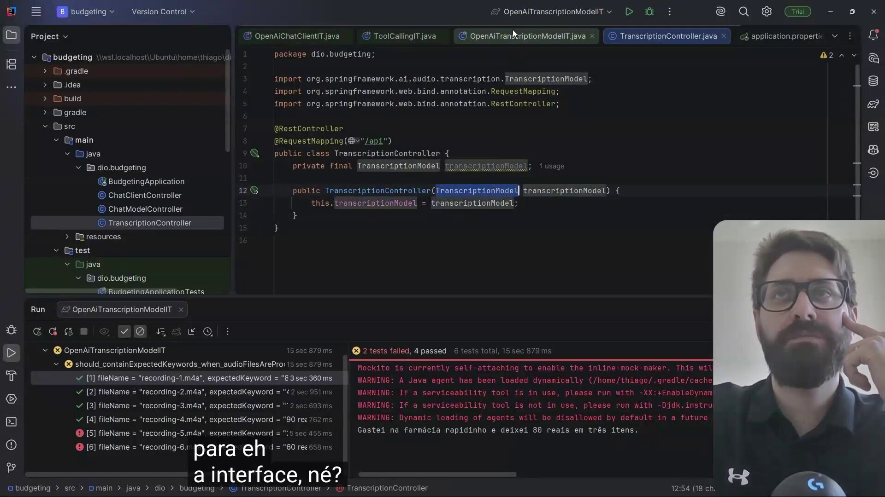
</p>

O `application.properties` é ajustado com a propriedade `spring.ai.model.audio.transcription=openai`, deixando explícito qual provedor de transcrição deve ser usado pela autoconfiguração do Spring AI, além de manter as demais opções de modelo, idioma, temperatura, formato de resposta e prompt já configuradas anteriormente.

```properties
spring.ai.model.audio.transcription=openai

spring.ai.openai.audio.transcription.options.model=whisper-1
spring.ai.openai.audio.transcription.options.language=pt
spring.ai.openai.audio.transcription.options.temperature=0
spring.ai.openai.audio.transcription.options.response-format=text
spring.ai.openai.audio.transcription.options.prompt=Áudio em português brasileiro.\
  Áudio contém descrição de gastos financeiros. \
  As frases geralmente contêm: \
  - um valor em reais (número + "reais"); \
  - uma ação (gastei, paguei, comprei); \
  - um local ou estabelecimento (mercado, farmácia, restaurante, loja, etc.).

logging.level.org.springframework.ai=DEBUG
```

<p align="center">
  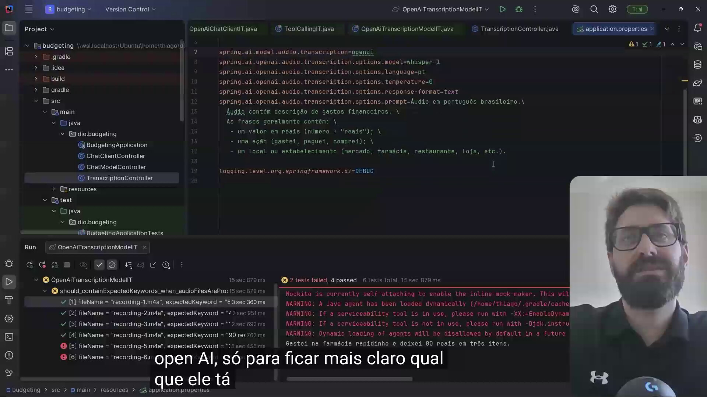
</p>

O `TranscriptionController` começa a ser implementado: é anotado com `@RestController`, recebe o mapeamento base `/api` e passa a depender da interface `TranscriptionModel` (e não de uma implementação específica), injetada via construtor. Isso garante flexibilidade caso o provedor de transcrição mude no futuro.

```java
package dio.budgeting;

import org.springframework.ai.audio.transcription.TranscriptionModel;
import org.springframework.web.bind.annotation.RequestMapping;
import org.springframework.web.bind.annotation.RestController;

@RestController
@RequestMapping("/api")
public class TranscriptionController {

    private final TranscriptionModel transcriptionModel;

    public TranscriptionController(TranscriptionModel transcriptionModel) {
        this.transcriptionModel = transcriptionModel;
    }
}
```

<p align="center">
  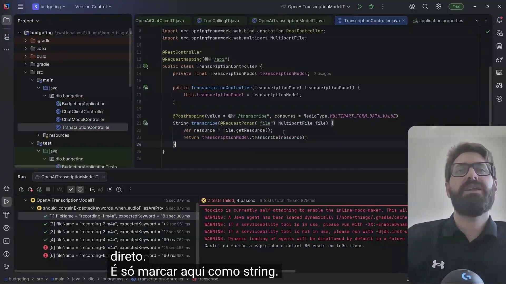
</p>

O endpoint é finalizado: um método `transcribe`, anotado com `@PostMapping(value = "/transcribe", consumes = MediaType.MULTIPART_FORM_DATA_VALUE)`, recebe o arquivo de áudio como `MultipartFile` via `@RequestParam("file")`, converte-o em `Resource` através de `file.getResource()` e delega a transcrição ao `transcriptionModel`, retornando diretamente uma `String` com o texto reconhecido.

```java
package dio.budgeting;

import org.springframework.ai.audio.transcription.TranscriptionModel;
import org.springframework.http.MediaType;
import org.springframework.web.bind.annotation.PostMapping;
import org.springframework.web.bind.annotation.RequestMapping;
import org.springframework.web.bind.annotation.RequestParam;
import org.springframework.web.bind.annotation.RestController;
import org.springframework.web.multipart.MultipartFile;

@RestController
@RequestMapping("/api")
public class TranscriptionController {

    private final TranscriptionModel transcriptionModel;

    public TranscriptionController(TranscriptionModel transcriptionModel) {
        this.transcriptionModel = transcriptionModel;
    }

    @PostMapping(value = "/transcribe", consumes = MediaType.MULTIPART_FORM_DATA_VALUE)
    String transcribe(@RequestParam("file") MultipartFile file) {
        var resource = file.getResource();
        return transcriptionModel.transcribe(resource);
    }
}
```

<p align="center">
  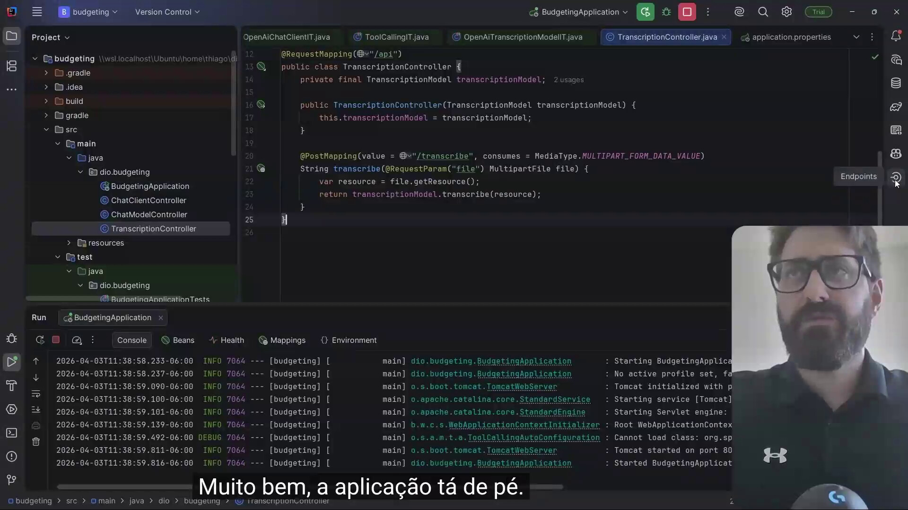
</p>

A aplicação `BudgetingApplication` é iniciada com sucesso, como indicam os logs no console ("Started BudgetingApplication") e o painel de **Endpoints** do IntelliJ, confirmando que o Tomcat embutido subiu corretamente e que o novo endpoint de transcrição está disponível para ser testado.

<p align="center">
  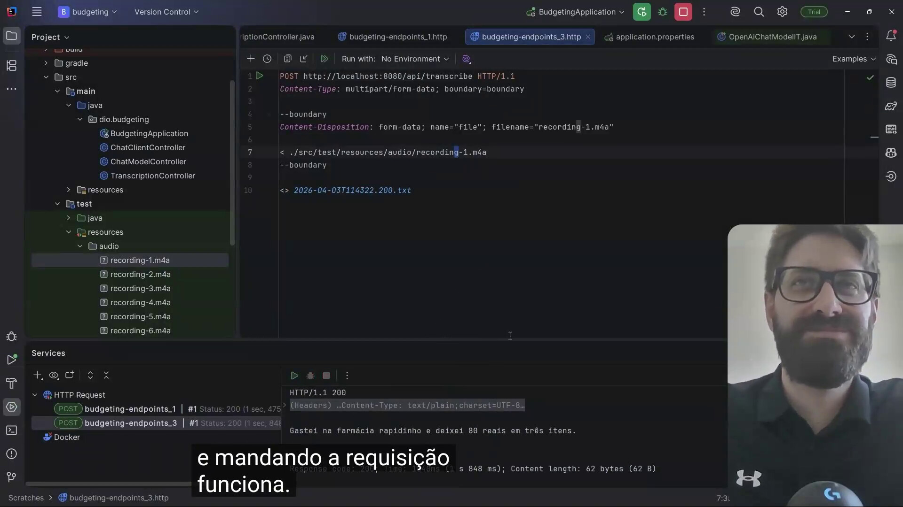
</p>

Usando o cliente HTTP do IntelliJ, é enviada uma requisição `POST` para `http://localhost:8080/api/transcribe`, com o corpo `multipart/form-data` contendo o arquivo `recording-1.m4a`. A resposta retorna `HTTP/1.1 200`, com o corpo "Gastei na farmácia rapidinho e deixei 80 reais em três itens.", confirmando que o endpoint está funcionando corretamente de ponta a ponta.

```http
POST http://localhost:8080/api/transcribe HTTP/1.1
Content-Type: multipart/form-data; boundary=boundary

--boundary
Content-Disposition: form-data; name="file"; filename="recording-1.m4a"

< ./src/test/resources/audio/recording-1.m4a
--boundary
```

#### Material de Apoio Até Esta Etapa

- Arquivos do projeto nesta etapa: [budgeting_ate_o_video06.zip](./000-Midia_e_Anexos/etapas_do_codigo/budgeting_ate_o_video06.zip)
- [005-Tutorial_Budgeting_Spring_AI_Video06.md](./005-Tutorial_Budgeting_Spring_AI_Video06.md)
  

### 🟩 Vídeo 07 - Speech API: Sintetizando Voz com Text-to-Speech

<video width="60%" controls>
  <source src="000-Midia_e_Anexos/bootcamp_ntt_data_java_spring_ai-modulo.04-curso.05-video_07.webm" type="video/webm">
    Seu navegador não suporta vídeo HTML5.
</video>

link do vídeo: https://web.dio.me/lab/desenvolvendo-sua-api-inteligente-com-reconhecimento-de-fala-e-spring-boot-1/learning/ad624205-af61-4e2c-be7e-1bdc188a8f26?back=/track/ntt-data-2026-ai-java-back-end

### Anotações

#### Visão geral da API de Text-to-Speech no Spring AI

<p align="center">
  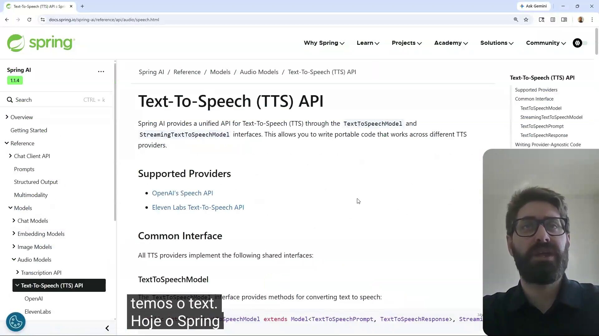
</p>

A documentação oficial do Spring AI mostra que a API de Text-to-Speech (TTS) é acessada pela seção *Reference → Models → Audio Models → Text-To-Speech (TTS) API*. Nessa página estão listados os provedores atualmente suportados: a Speech API da OpenAI e a Text-To-Speech API da Eleven Labs. Logo abaixo começa a apresentação da interface comum (`TextToSpeechModel`), responsável por padronizar o uso de qualquer um desses provedores dentro da aplicação.

#### Interface TextToSpeechModel

<p align="center">
  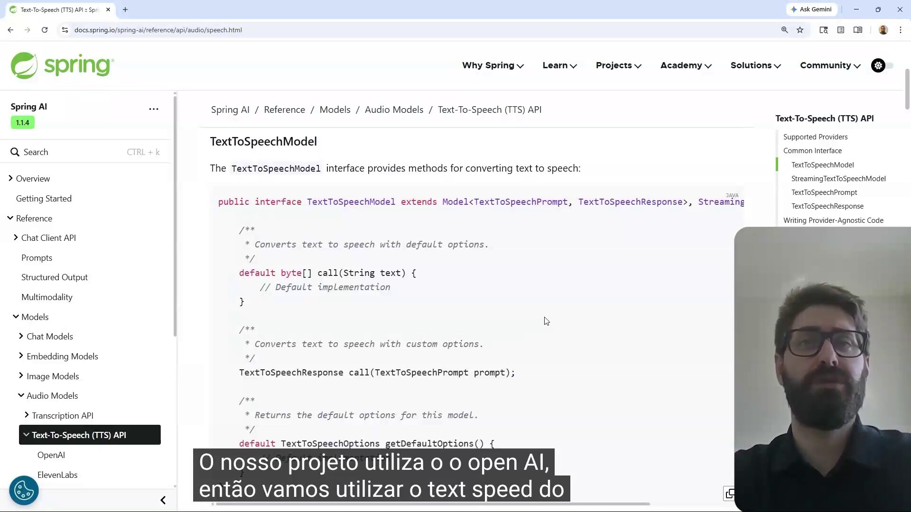
</p>

A imagem mostra a definição da interface `TextToSpeechModel`, que estende `Model<TextToSpeechPrompt, TextToSpeechResponse>` e também suporta streaming. Ela expõe três métodos principais: um `call(String text)` com implementação padrão para conversão simples de texto em áudio, um `call(TextToSpeechPrompt prompt)` para quando se deseja passar opções customizadas, e um `getDefaultOptions()` que retorna as opções padrão do modelo.

```java
public interface TextToSpeechModel extends Model<TextToSpeechPrompt, TextToSpeechResponse>, StreamingTextToSpeechModel {

    /**
     * Converts text to speech with default options.
     */
    default byte[] call(String text) {
        // Default implementation
    }

    /**
     * Converts text to speech with custom options.
     */
    TextToSpeechResponse call(TextToSpeechPrompt prompt);

    /**
     * Returns the default options for this model.
     */
    default TextToSpeechOptions getDefaultOptions() {
        ...
    }
}
```

#### Classes TextToSpeechPrompt e TextToSpeechResponse

<p align="center">
  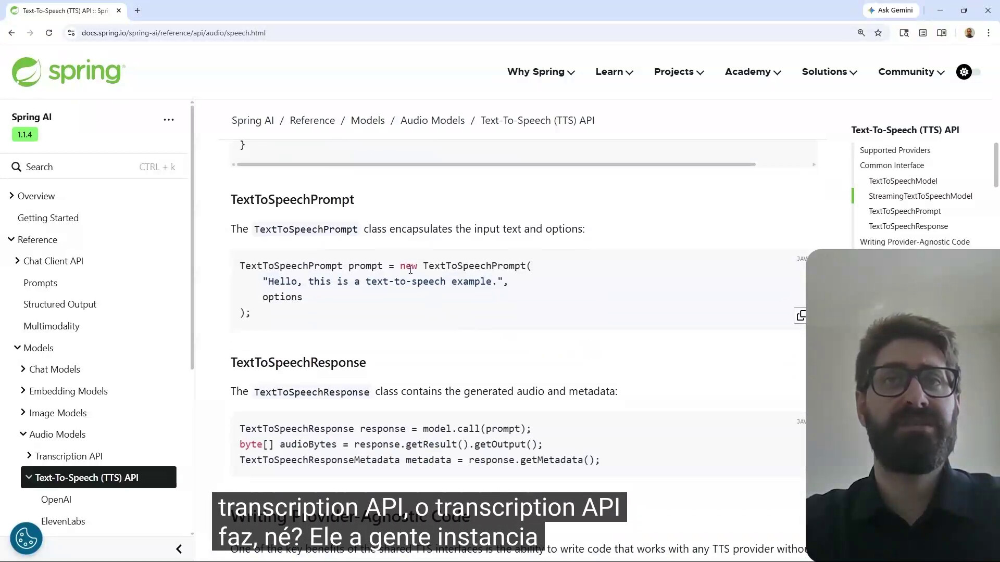
</p>

Aqui a documentação detalha as duas classes que compõem a chamada ao modelo. A classe `TextToSpeechPrompt` encapsula o texto de entrada junto das opções de síntese, enquanto a classe `TextToSpeechResponse` contém o áudio gerado (em bytes) e os metadados da resposta.

```java
TextToSpeechPrompt prompt = new TextToSpeechPrompt(
    "Hello, this is a text-to-speech example.",
    options
);

TextToSpeechResponse response = model.call(prompt);
byte[] audioBytes = response.getResult().getOutput();
TextToSpeechResponseMetadata metadata = response.getMetadata();
```

#### Escrevendo código independente de provedor

<p align="center">
  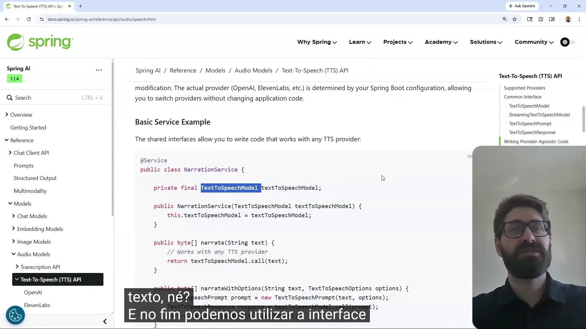
</p>

Este trecho da documentação mostra um exemplo prático de serviço (`NarrationService`) que depende apenas da interface `TextToSpeechModel`, e não de uma implementação específica como a da OpenAI. Isso permite trocar o provedor de TTS configurado no Spring Boot sem precisar alterar o código da aplicação, já que a injeção de dependência resolve automaticamente qual implementação usar.

```java
@Service
public class NarrationService {

    private final TextToSpeechModel textToSpeechModel;

    public NarrationService(TextToSpeechModel textToSpeechModel) {
        this.textToSpeechModel = textToSpeechModel;
    }

    public byte[] narrate(String text) {
        // Works with any TTS provider
        return textToSpeechModel.call(text);
    }

    public byte[] narrateWithOptions(String text, TextToSpeechOptions options) {
        TextToSpeechPrompt prompt = new TextToSpeechPrompt(text, options);
        TextToSpeechResponse response = textToSpeechModel.call(prompt);
        ...
    }
}
```

#### Duplicando o teste de transcrição como ponto de partida

<p align="center">
  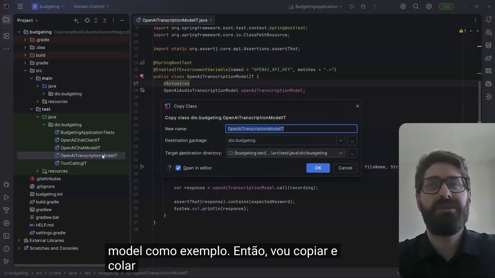
</p>

Na IDE, a classe de teste `OpenAiTranscriptionModelIT` é selecionada para ser copiada através da opção *Copy Class*. Essa classe existente serve como ponto de partida, já que a estrutura de um teste de integração para o modelo de fala é muito parecida com a de um teste para o modelo de transcrição.

#### Renomeando a cópia para o teste de síntese de voz

<p align="center">
  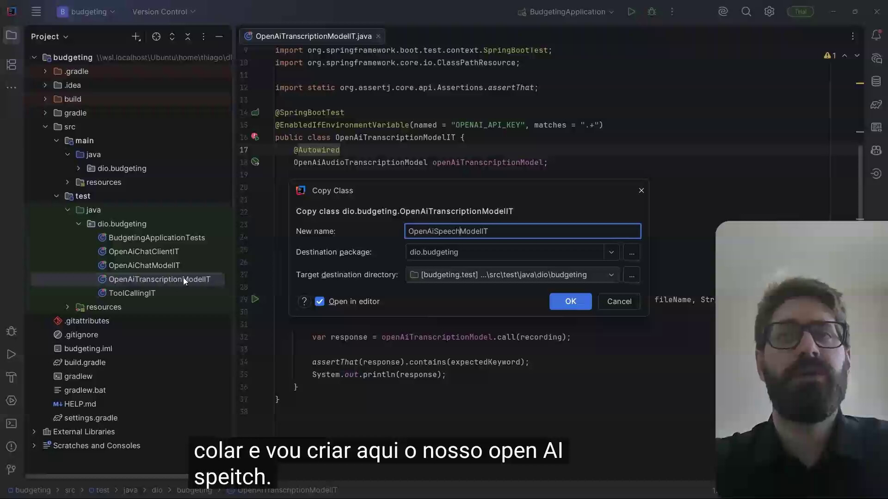
</p>

Ainda na caixa de diálogo *Copy Class*, o campo de nome é alterado para `OpenAiSpeechModelIT`, mantendo o mesmo pacote (`dio.budgeting`) e diretório de destino da classe original. Essa nova classe será o teste de integração dedicado ao modelo de Text-to-Speech.

#### Ajustando a classe duplicada para o modelo de áudio

<p align="center">
  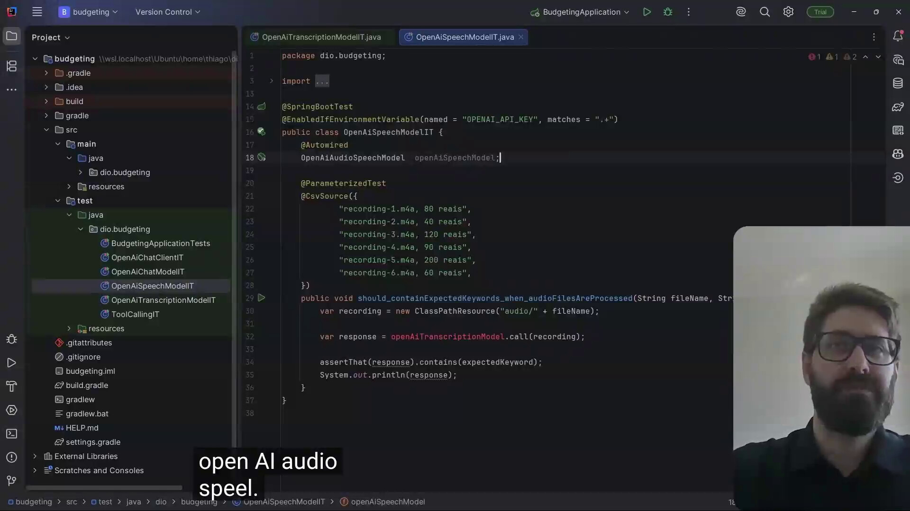
</p>

Neste momento a classe `OpenAiSpeechModelIT` ainda carrega o conteúdo herdado do teste de transcrição, incluindo o `@ParameterizedTest` com `@CsvSource` listando vários arquivos de gravação e seus valores em reais. A única mudança feita até aqui é a troca do tipo do campo injetado para `OpenAiAudioSpeechModel`, preparando a classe para ser adaptada ao novo propósito.

```java
@SpringBootTest
@EnabledIfEnvironmentVariable(named = "OPENAI_API_KEY", matches = ".+")
public class OpenAiSpeechModelIT {

    @Autowired
    OpenAiAudioSpeechModel openAiSpeechModel;

    @ParameterizedTest
    @CsvSource({
        "recording-1.m4a, 80 reais",
        "recording-2.m4a, 40 reais",
        "recording-3.m4a, 120 reais",
        "recording-4.m4a, 90 reais",
        "recording-5.m4a, 200 reais",
        "recording-6.m4a, 60 reais",
    })
    public void should_containExpectedKeywords_when_audioFilesAreProcessed(String fileName, String expectedKeyword) {
        var recording = new ClassPathResource("audio/" + fileName);

        var response = openAiTranscriptionModel.call(recording);

        assertThat(response).contains(expectedKeyword);
        System.out.println(response);
    }
}
```

#### Definindo o método de teste de geração de áudio

<p align="center">
  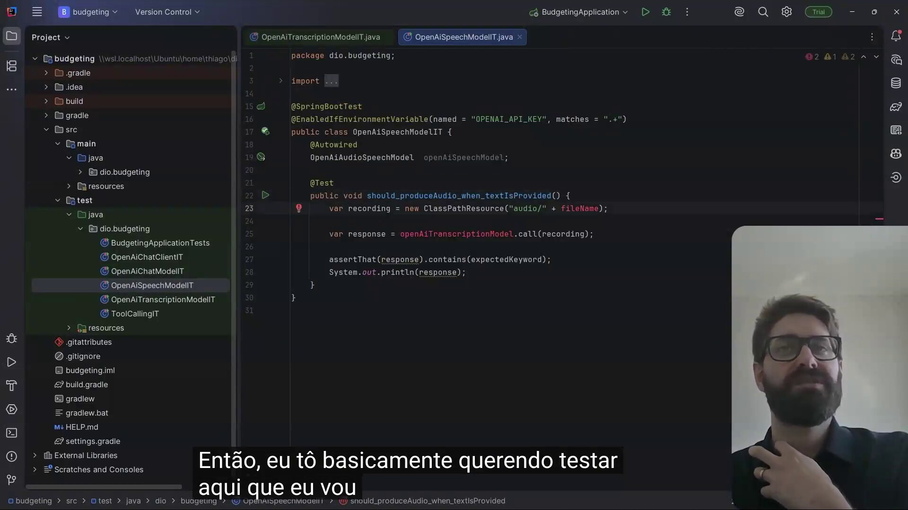
</p>

O conteúdo herdado do teste de transcrição é removido e um novo teste é criado: `should_produceAudio_when_textIsProvided`. O objetivo agora é verificar que, ao enviar um texto para o modelo, um áudio é recebido como resposta. Neste ponto o corpo do teste ainda referencia uma variável `fileName` que não existe mais, o que gera um erro sinalizado pela IDE — um resquício do código anterior que ainda precisa ser corrigido.

```java
@SpringBootTest
@EnabledIfEnvironmentVariable(named = "OPENAI_API_KEY", matches = ".+")
public class OpenAiSpeechModelIT {

    @Autowired
    OpenAiAudioSpeechModel openAiSpeechModel;

    @Test
    public void should_produceAudio_when_textIsProvided() {
        var recording = new ClassPathResource("audio/" + fileName);

        var response = openAiTranscriptionModel.call(recording);

        assertThat(response).contains(expectedKeyword);
        System.out.println(response);
    }
}
```

#### Configurando o provedor de Text-to-Speech no application.properties

<p align="center">
  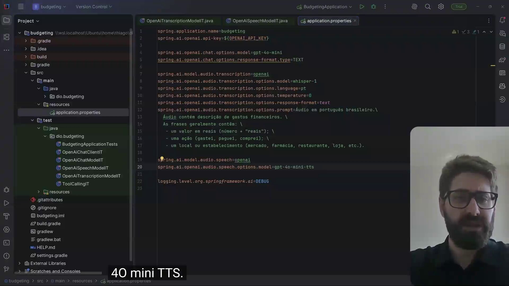
</p>

No arquivo `application.properties`, além das configurações já existentes de chat e de transcrição, duas novas propriedades são adicionadas para habilitar a síntese de voz: `spring.ai.model.audio.speech=openai`, definindo a OpenAI como provedor de fala, e `spring.ai.openai.audio.speech.options.model=gpt-4o-mini-tts`, definindo o modelo de TTS a ser usado.

```properties
spring.application.name=budgeting
spring.ai.openai.api-key=${OPENAI_API_KEY}

spring.ai.openai.chat.options.model=gpt-4o-mini
spring.ai.openai.chat.options.response-format.type=TEXT

spring.ai.model.audio.transcription=openai
spring.ai.openai.audio.transcription.options.model=whisper-1
spring.ai.openai.audio.transcription.options.language=pt
spring.ai.openai.audio.transcription.options.temperature=0
spring.ai.openai.audio.transcription.options.response-format=text
spring.ai.openai.audio.transcription.options.prompt=Áudio em português brasileiro.\
  Áudio contém descrição de gastos financeiros. \
  As frases geralmente contêm: \
  - um valor em reais (número + "reais"); \
  - uma ação (gastei, paguei, comprei); \
  - um local ou estabelecimento (mercado, farmácia, restaurante, loja, etc.).

spring.ai.model.audio.speech=openai
spring.ai.openai.audio.speech.options.model=gpt-4o-mini-tts

logging.level.org.springframework.ai=DEBUG
```

#### Consultando as opções disponíveis para o Speech da OpenAI

<p align="center">
  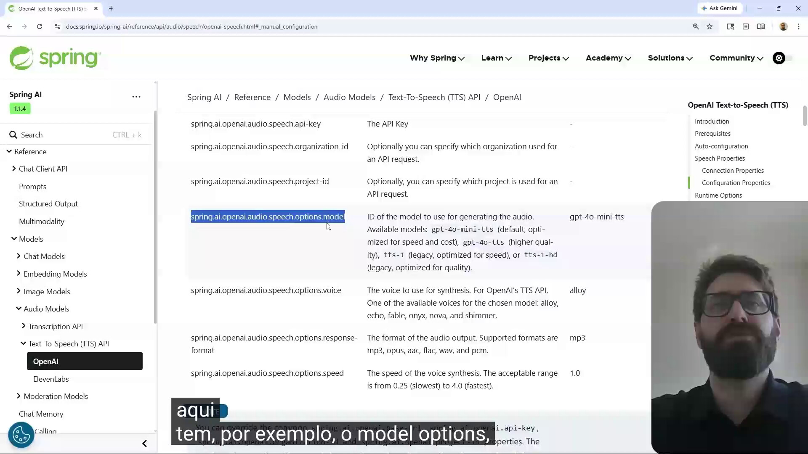
</p>

De volta à documentação do Spring AI, a página de referência da OpenAI para Text-to-Speech mostra a tabela completa de propriedades de configuração disponíveis, como `spring.ai.openai.audio.speech.api-key`, `organization-id`, `project-id`, `options.model` (com os modelos disponíveis: `gpt-4o-mini-tts`, `gpt-4o-tts`, `tts-1` e `tts-1-hd`), `options.voice` (com as vozes `alloy`, `echo`, `fable`, `onyx`, `nova` e `shimmer`), `options.response-format` (formatos como mp3, opus, aac, flac e wav) e `options.speed` (velocidade de 0.25 a 4.0).

#### Finalizando as opções de voz, velocidade e formato

<p align="center">
  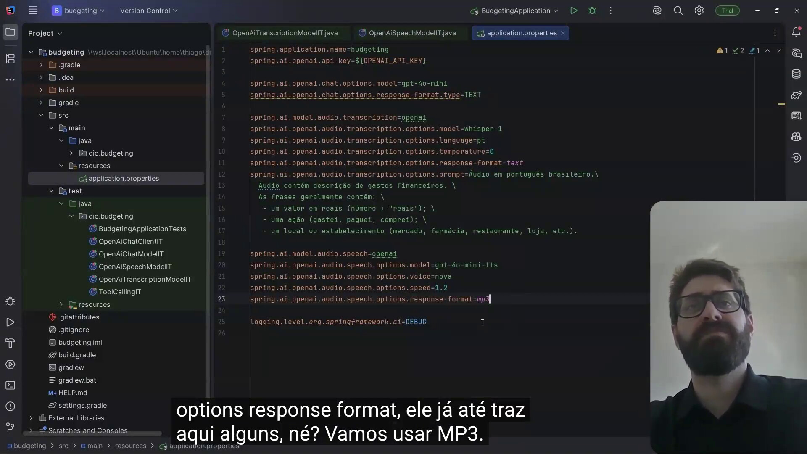
</p>

Com base nas opções vistas na documentação, o `application.properties` é atualizado com três novas propriedades: a voz `nova`, a velocidade `1.2` (ligeiramente mais rápida que o padrão) e o formato de saída `mp3`.

```properties
spring.ai.model.audio.speech=openai
spring.ai.openai.audio.speech.options.model=gpt-4o-mini-tts
spring.ai.openai.audio.speech.options.voice=nova
spring.ai.openai.audio.speech.options.speed=1.2
spring.ai.openai.audio.speech.options.response-format=mp3
```

#### Injeção do modelo de fala já configurado

<p align="center">
  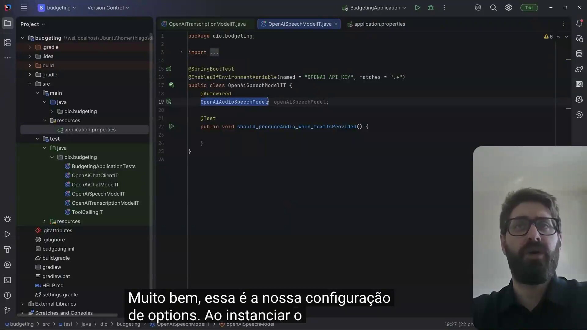
</p>

Com as opções definidas no `application.properties`, basta injetar a interface `OpenAiAudioSpeechModel` no teste para que o Spring Boot já carregue automaticamente todas as configurações via autoconfiguração, sem necessidade de instanciar manualmente o modelo com essas opções no código.

```java
@Autowired
OpenAiAudioSpeechModel openAiSpeechModel;

@Test
public void should_produceAudio_when_textIsProvided() {

}
```

#### Chamando o modelo com um texto de exemplo

<p align="center">
  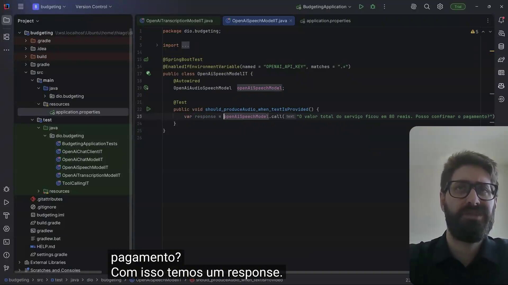
</p>

O modelo é chamado através do método `call`, passando um texto relacionado ao contexto do sistema de pagamentos do projeto. A resposta obtida é um array de bytes representando o áudio gerado.

```java
@Test
public void should_produceAudio_when_textIsProvided() {
    var response = openAiSpeechModel.call("O valor total do serviço ficou em 80 reais. Posso confirmar o pagamento?");
}
```

#### Validando o áudio gerado e salvando em arquivo temporário

<p align="center">
  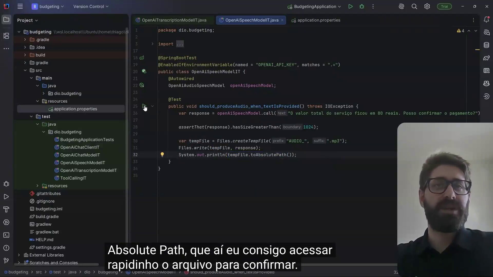
</p>

Para validar que o array de bytes retornado não está vazio, é feita uma verificação de que seu tamanho é maior que 1 kilobyte. Em seguida, um arquivo temporário com extensão `.mp3` é criado e o conteúdo do áudio é escrito nele, permitindo que o caminho absoluto do arquivo seja impresso no console para posterior conferência.

```java
@Test
public void should_produceAudio_when_textIsProvided() throws IOException {
    var response = openAiSpeechModel.call("O valor total do serviço ficou em 80 reais. Posso confirmar o pagamento?");

    assertThat(response).hasSizeGreaterThan(1024);

    var tempFile = Files.createTempFile("AUDIO_", ".mp3");
    Files.write(tempFile, response);
    System.out.println(tempFile.toAbsolutePath());
}
```

#### Visão completa do teste de integração do Speech Model

<p align="center">
  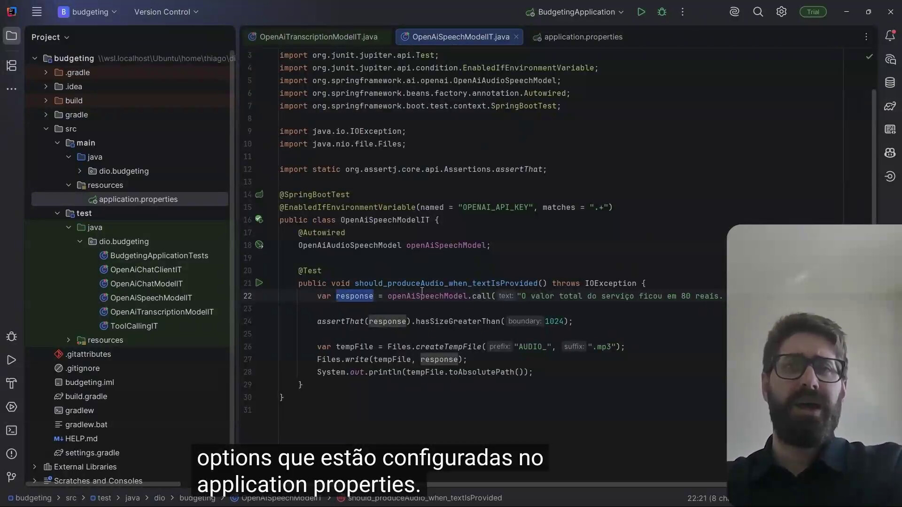
</p>

Com todos os imports organizados, a classe de teste fica completa: ela injeta o `OpenAiAudioSpeechModel` já configurado pelo `application.properties`, envia um texto para o método `call`, valida o tamanho do áudio retornado e grava o resultado em um arquivo temporário para conferência manual.

```java
import org.junit.jupiter.api.Test;
import org.junit.jupiter.api.condition.EnabledIfEnvironmentVariable;
import org.springframework.ai.openai.OpenAiAudioSpeechModel;
import org.springframework.beans.factory.annotation.Autowired;
import org.springframework.boot.test.context.SpringBootTest;

import java.io.IOException;
import java.nio.file.Files;

import static org.assertj.core.api.Assertions.assertThat;

@SpringBootTest
@EnabledIfEnvironmentVariable(named = "OPENAI_API_KEY", matches = ".+")
public class OpenAiSpeechModelIT {

    @Autowired
    OpenAiAudioSpeechModel openAiSpeechModel;

    @Test
    public void should_produceAudio_when_textIsProvided() throws IOException {
        var response = openAiSpeechModel.call("O valor total do serviço ficou em 80 reais. Posso confirmar o pagamento?");

        assertThat(response).hasSizeGreaterThan(1024);

        var tempFile = Files.createTempFile("AUDIO_", ".mp3");
        Files.write(tempFile, response);
        System.out.println(tempFile.toAbsolutePath());
    }
}
```

#### Execução do teste e localização do arquivo gerado

<p align="center">
  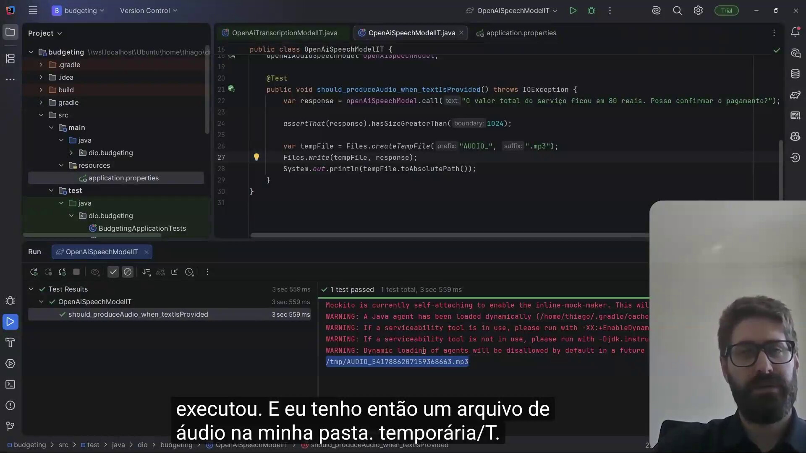
</p>

O teste é executado e passa com sucesso (1 teste, 1 total). No console de saída, entre os avisos padrão do Mockito e do agente Java, aparece o caminho absoluto do arquivo de áudio gerado na pasta temporária do sistema operacional.

```
/tmp/AUDIO_5417886207159368663.mp3
```

#### Reproduzindo o áudio gerado para conferência

<p align="center">
  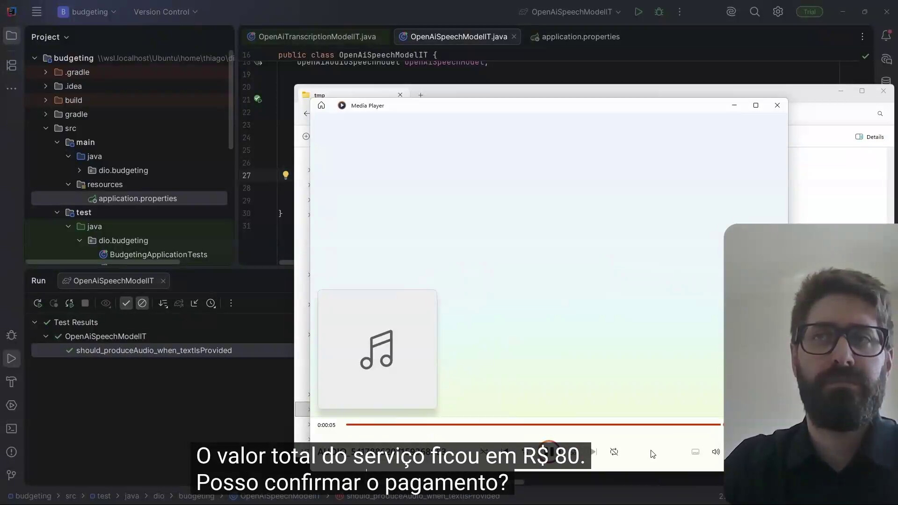
</p>

O arquivo `.mp3` salvo na pasta temporária é aberto em um reprodutor de mídia. Ao tocar o áudio, a fala sintetizada reproduz corretamente o texto enviado ao modelo — "O valor total do serviço ficou em R$ 80. Posso confirmar o pagamento?" — confirmando que a integração com o Speech API da OpenAI está funcionando como esperado.

#### Criando o controller para expor a síntese de voz

<p align="center">
  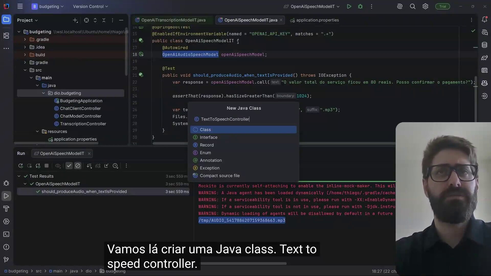
</p>

Com o modelo validado no teste de integração, o próximo passo é criar uma nova classe Java chamada `TextToSpeechController`, que será responsável por expor a funcionalidade de conversão de texto em áudio através de um endpoint REST.

#### Estrutura inicial do TextToSpeechController

<p align="center">
  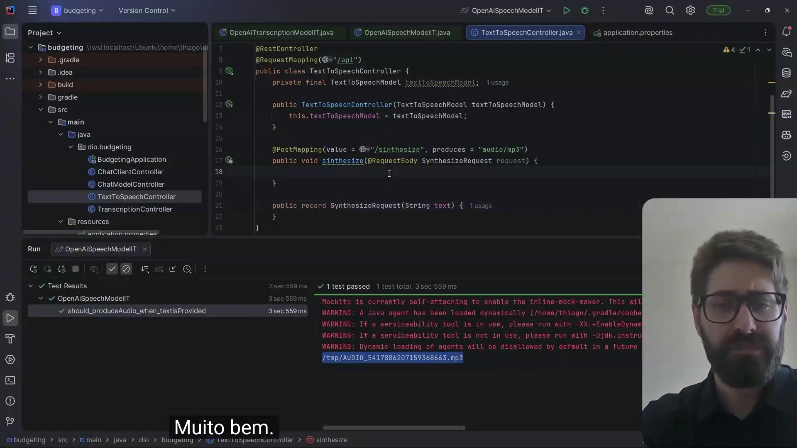
</p>

O controller é criado como um `@RestController` mapeado para `/api`, injetando a interface `TextToSpeechModel` (e não uma implementação específica da OpenAI), o que mantém o código desacoplado do provedor. É definido um endpoint `POST /sinthesize`, que produzirá uma resposta do tipo `audio/mp3`, recebendo no corpo da requisição um `record SynthesizeRequest` contendo apenas o campo `text`.

```java
@RestController
@RequestMapping("/api")
public class TextToSpeechController {

    private final TextToSpeechModel textToSpeechModel;

    public TextToSpeechController(TextToSpeechModel textToSpeechModel) {
        this.textToSpeechModel = textToSpeechModel;
    }

    @PostMapping(value = "/sinthesize", produces = "audio/mp3")
    public void sinthesize(@RequestBody SynthesizeRequest request) {

    }

    public record SynthesizeRequest(String text) {
    }
}
```

#### Chamando o modelo a partir da requisição recebida

<p align="center">
  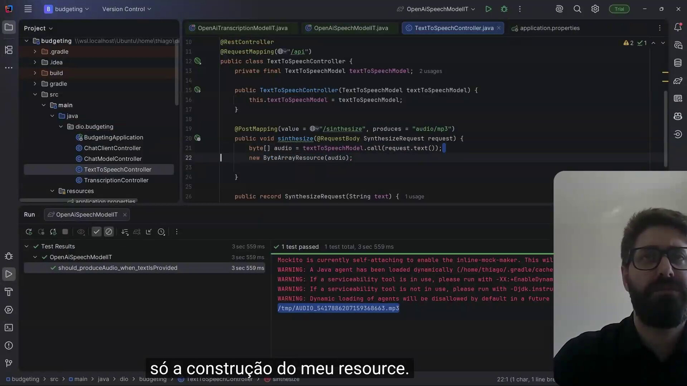
</p>

Dentro do método `sinthesize`, o texto recebido no corpo da requisição (`request.text()`) é passado para o `textToSpeechModel.call(...)`, retornando um array de bytes com o áudio gerado. Esse array é então utilizado para construir um `ByteArrayResource`, preparando o conteúdo para ser devolvido como um recurso na resposta HTTP.

```java
@PostMapping(value = "/sinthesize", produces = "audio/mp3")
public void sinthesize(@RequestBody SynthesizeRequest request) {
    byte[] audio = textToSpeechModel.call(request.text());
    new ByteArrayResource(audio);
}
```

#### Construindo a resposta HTTP com o cabeçalho de anexo

<p align="center">
  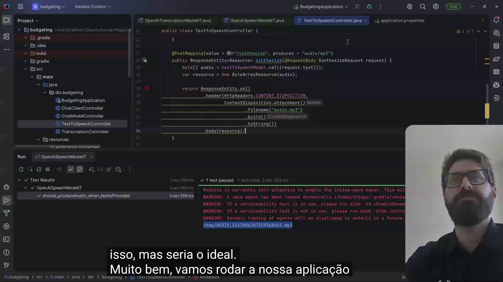
</p>

Para que o cliente receba o áudio como se fosse um arquivo para download, o método passa a retornar um `ResponseEntity<Resource>` com status `200 OK`. É adicionado um cabeçalho `Content-Disposition` do tipo `attachment`, definindo o nome do arquivo como `audio.mp3`, e o corpo da resposta recebe o `resource` construído a partir do áudio gerado.

```java
@PostMapping(value = "/sinthesize", produces = "audio/mp3")
public ResponseEntity<Resource> sinthesize(@RequestBody SynthesizeRequest request) {
    byte[] audio = textToSpeechModel.call(request.text());
    var resource = new ByteArrayResource(audio);

    return ResponseEntity.ok()
            .header(HttpHeaders.CONTENT_DISPOSITION,
                    ContentDisposition.attachment()
                            .filename("audio.mp3")
                            .build()
                            .toString())
            .body(resource);
}
```

#### Versão final do TextToSpeechController

Abaixo o código final e completo do controller, já com todos os imports organizados: `ByteArrayResource`, `Resource`, `ContentDisposition`, `HttpHeaders`, `ResponseEntity`, além das anotações do Spring Web. O endpoint `/sinthesize` recebe um texto, gera o áudio através do `TextToSpeechModel`, monta o `Resource` correspondente e devolve a resposta com o cabeçalho de anexo apontando para `audio.mp3`.

```java
package dio.budgeting;

import org.springframework.core.io.ByteArrayResource;
import org.springframework.core.io.Resource;
import org.springframework.http.ContentDisposition;
import org.springframework.http.HttpHeaders;
import org.springframework.http.ResponseEntity;
import org.springframework.ai.openai.OpenAiAudioSpeechModel; // ou org.springframework.ai.model.TextToSpeechModel
import org.springframework.web.bind.annotation.PostMapping;
import org.springframework.web.bind.annotation.RequestBody;
import org.springframework.web.bind.annotation.RequestMapping;
import org.springframework.web.bind.annotation.RestController;

@RestController
@RequestMapping("/api")
public class TextToSpeechController {

    private final TextToSpeechModel textToSpeechModel;

    public TextToSpeechController(TextToSpeechModel textToSpeechModel) {
        this.textToSpeechModel = textToSpeechModel;
    }

    @PostMapping(value = "/sinthesize", produces = "audio/mp3")
    public ResponseEntity<Resource> sinthesize(@RequestBody SynthesizeRequest request) {
        byte[] audio = textToSpeechModel.call(request.text());
        var resource = new ByteArrayResource(audio);

        return ResponseEntity.ok()
                .header(HttpHeaders.CONTENT_DISPOSITION,
                        ContentDisposition.attachment()
                                .filename("audio.mp3")
                                .build()
                                .toString())
                .body(resource);
    }

    public record SynthesizeRequest(String text) {
    }
}
```

#### Testando o endpoint pelo HTTP Client da IDE

<p align="center">
  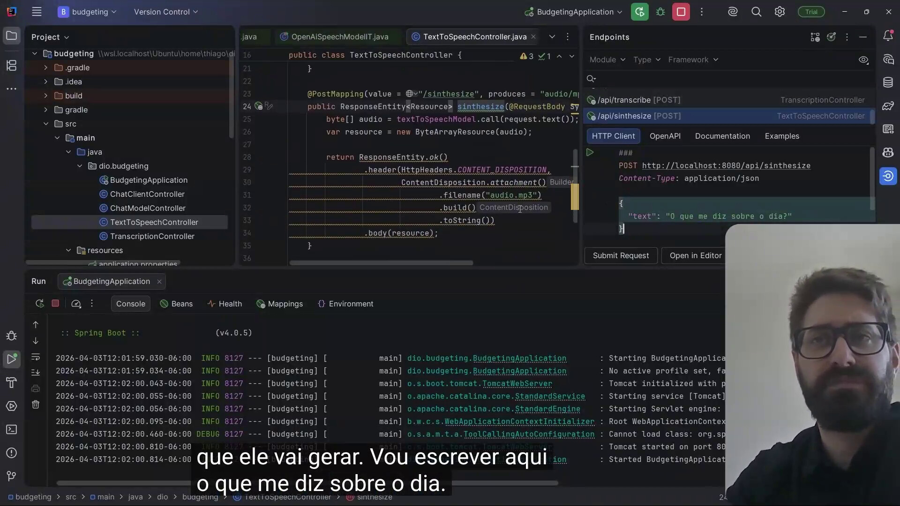
</p>

Com a aplicação em execução, o painel de *Endpoints* da IDE lista as rotas disponíveis, incluindo `/api/transcribe` (do `TranscriptionController`) e o novo `/api/sinthesize` (do `TextToSpeechController`). Uma requisição de teste é montada diretamente pelo HTTP Client, enviando um corpo JSON com o texto a ser convertido em áudio.

```json
POST http://localhost:8080/api/sinthesize
Content-Type: application/json

{
  "text": "O que me diz sobre o dia?"
}
```

#### Verificando o cabeçalho e o corpo da resposta

<p align="center">
  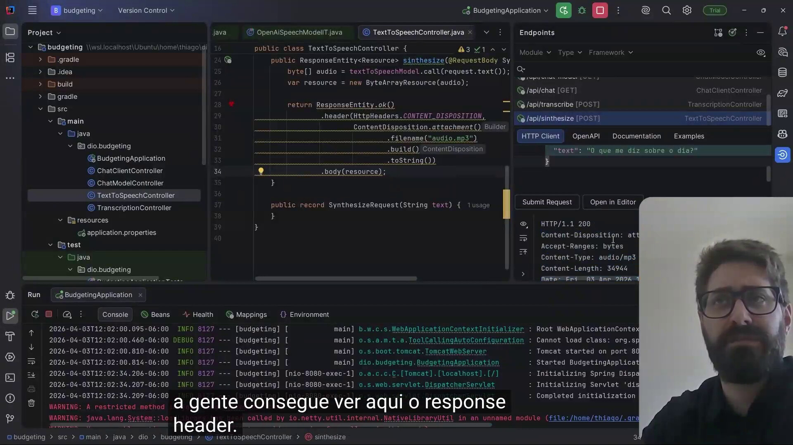
</p>

Após o envio da requisição, a resposta HTTP retorna com status `200`. É possível observar no cabeçalho o `Content-Disposition: attachment` com o nome do arquivo, o `Content-Type: audio/mp3` e o `Content-Length` correspondente ao tamanho do áudio gerado, confirmando que o endpoint está retornando corretamente o arquivo de áudio.

```
HTTP/1.1 200
Content-Disposition: attachment; filename="audio.mp3"
Accept-Ranges: bytes
Content-Type: audio/mp3
Content-Length: 34944
```

#### Reproduzindo o áudio retornado pelo endpoint

<p align="center">
  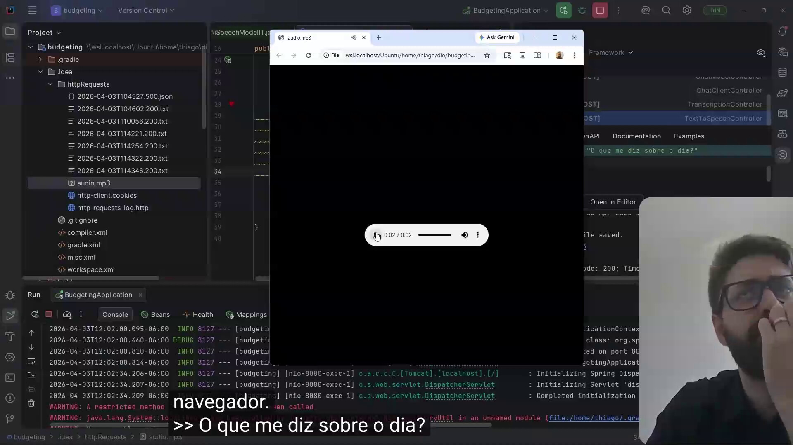
</p>

O arquivo `audio.mp3` gerado pela requisição é aberto automaticamente no navegador, onde o player embutido permite reproduzir o conteúdo. Ao tocar o áudio, a fala sintetizada corresponde exatamente ao texto enviado na requisição — "O que me diz sobre o dia?" — confirmando que todo o fluxo, do texto à geração e entrega do áudio pelo endpoint, funciona corretamente de ponta a ponta.

#### Material de Apoio Até Esta Etapa

- Arquivos do projeto nesta etapa: [budgeting_ate_o_video07.zip](./000-Midia_e_Anexos/etapas_do_codigo/budgeting_ate_o_video07.zip)
- [006-Tutorial_Budgeting_Spring_AI_Video07.md](./006-Tutorial_Budgeting_Spring_AI_Video07.md)


### 🟩 Vídeo 08 - Integração do Assistente: Orquestrando o Fluxo de Budget

<video width="60%" controls>
  <source src="000-Midia_e_Anexos/bootcamp_ntt_data_java_spring_ai-modulo.04-curso.05-video_08.webm" type="video/webm">
    Seu navegador não suporta vídeo HTML5.
</video>

link do vídeo: https://web.dio.me/lab/desenvolvendo-sua-api-inteligente-com-reconhecimento-de-fala-e-spring-boot-1/learning/afaf83bb-585f-4293-a3f8-09adf880e0af?back=/track/ntt-data-2026-ai-java-back-end

### Anotações

#### Visão geral: o Assistente de Budgeting

<p align="center">
  
</p>

O diagrama resume o fluxo completo do assistente: o usuário fala algo como "Gastei 50 reais no Starbucks agora", e essa fala é convertida em texto pelo modelo de transcrição do Spring AI. Em seguida, o texto passa por uma etapa de interpretação, em que a IA extrai entidades como valor, local e data/hora, categorizando automaticamente o gasto (por exemplo, associando "Starbucks" a "Alimentação/Café") sem qualquer intervenção manual. O resultado final é um conjunto de dados estruturados, prontos para serem persistidos.

#### Criando o pacote de domínio

<p align="center">
  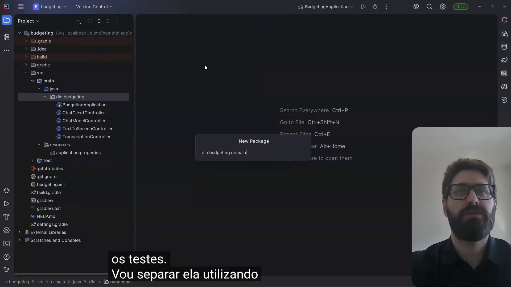
</p>

No IntelliJ IDEA, é criado o primeiro pacote do projeto, `dio.budgeting.domain`, que vai concentrar as regras e entidades centrais da aplicação, separando essa camada do restante do código.

#### Criando o pacote de application

<p align="center">
  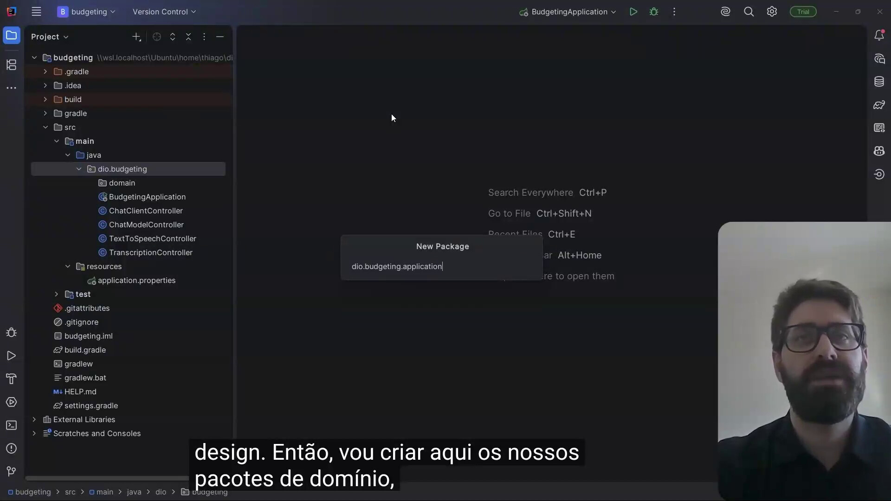
</p>

Na sequência, é criado o pacote `dio.budgeting.application`, responsável por orquestrar os casos de uso da aplicação, mantendo essa camada isolada da camada de domínio.

#### Criando o pacote de infrastructure

<p align="center">
  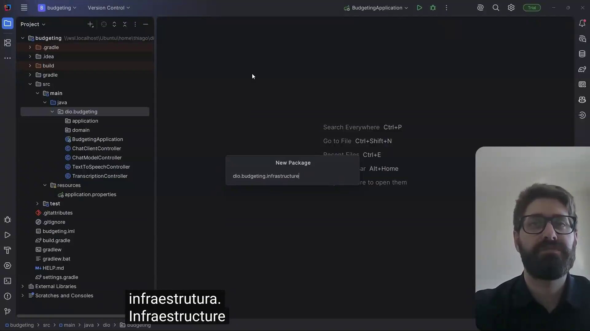
</p>

Por fim, é criado o pacote `dio.budgeting.infrastructure`, que futuramente concentrará as implementações técnicas (como acesso a banco de dados), completando a separação inicial dos três pacotes principais do projeto.

#### A classe Transaction e o campo id

<p align="center">
  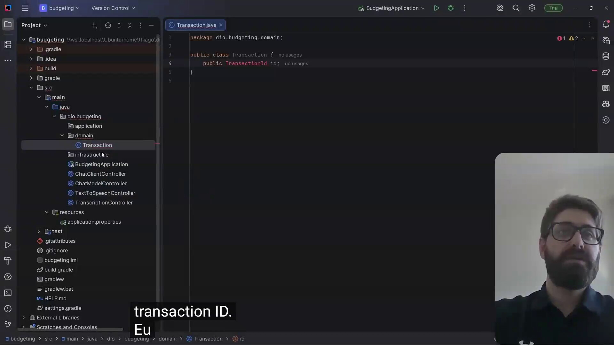
</p>

É criada a classe `Transaction` dentro do pacote de domínio, com um primeiro campo público do tipo `TransactionId`, que ainda será definido.

```java
package dio.budgeting.domain;

public class Transaction {
    public TransactionId id;
}
```

#### TransactionId como identificador fortemente tipado

<p align="center">
  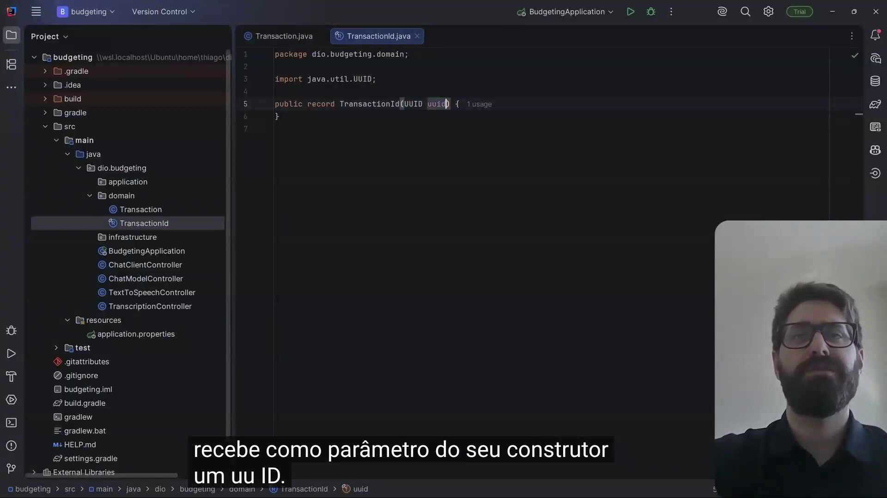
</p>

O identificador da transação é modelado como um `record` chamado `TransactionId`, que recebe um `UUID` em seu construtor. Essa escolha evita o uso de uma `String` genérica como identificador, reduzindo erros acidentais e tornando os métodos mais expressivos, além de permitir reaproveitar esse tipo em outros módulos.

```java
package dio.budgeting.domain;

import java.util.UUID;

public record TransactionId(UUID uuid) {
}
```

#### Campos privados da classe Transaction

<p align="center">
  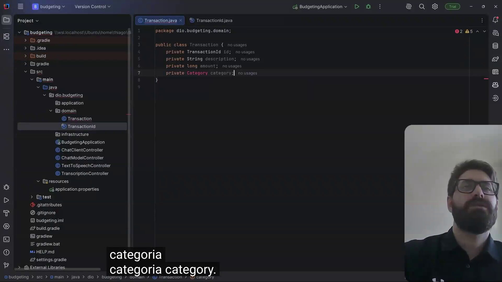
</p>

Os atributos da classe `Transaction` são declarados como privados, para manter o encapsulamento: o identificador (`TransactionId id`), a descrição do gasto (`String description`), o valor em centavos (`long amount`) e a categoria (`Category category`).

```java
package dio.budgeting.domain;

public class Transaction {
    private TransactionId id;
    private String description;
    private long amount;
    private Category category;
}
```

#### O enum Category

<p align="center">
  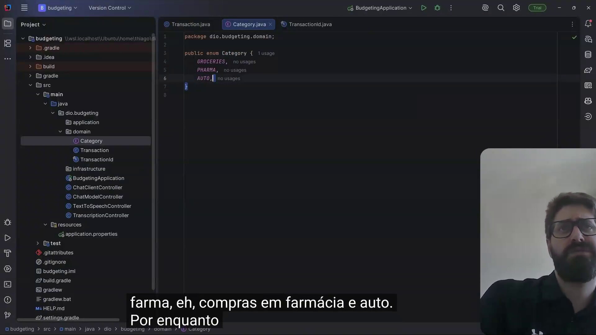
</p>

A categoria do gasto é modelada como um `enum` chamado `Category`, contendo por enquanto três valores: `GROCERIES` (compras de mercado), `PHARMA` (farmácia) e `AUTO`, suficientes para o estágio atual de desenvolvimento.

```java
package dio.budgeting.domain;

public enum Category {
    GROCERIES,
    PHARMA,
    AUTO,
}
```

#### Construtor inicial de Transaction

<p align="center">
  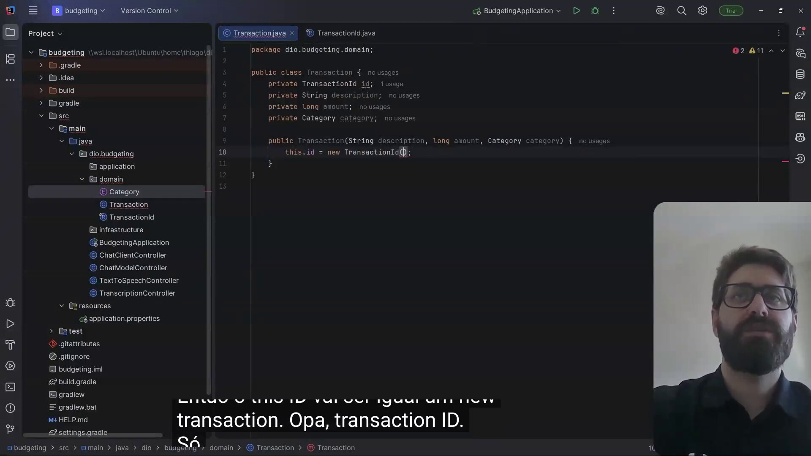
</p>

É adicionado um construtor à classe `Transaction`, recebendo `description`, `amount` e `category`. Dentro dele, o campo `id` é atribuído chamando `new TransactionId()`, ainda sem parâmetros — o que exigirá a criação de um construtor adicional no record `TransactionId`.

```java
public Transaction(String description, long amount, Category category) {
    this.id = new TransactionId();
}
```

#### Construtor auxiliar de TransactionId

<p align="center">
  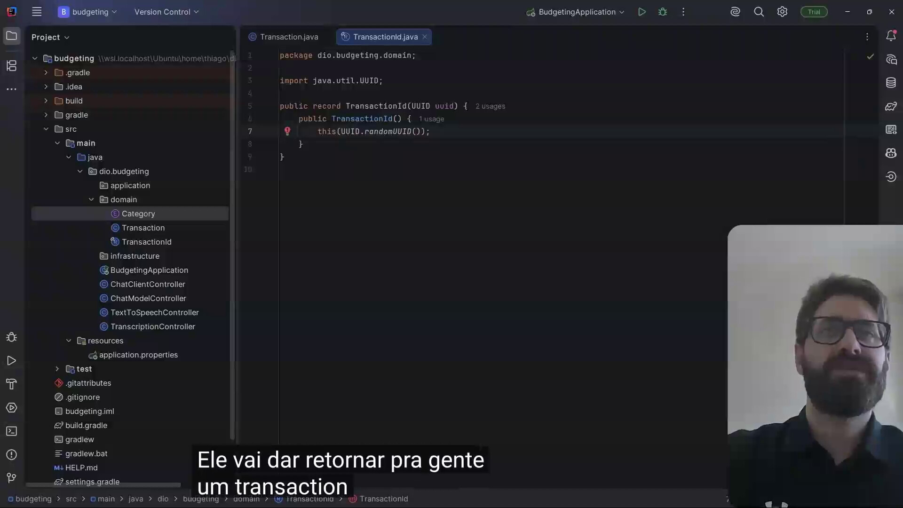
</p>

Para permitir a instanciação de `TransactionId` sem informar um UUID manualmente, é adicionado um construtor auxiliar que delega para o construtor principal do record, gerando automaticamente um novo UUID aleatório.

```java
public record TransactionId(UUID uuid) {
    public TransactionId() {
        this(UUID.randomUUID());
    }
}
```

#### Construtor completo de Transaction

<p align="center">
  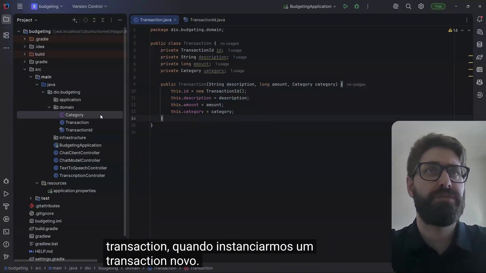
</p>

O construtor de `Transaction` é completado, atribuindo todos os campos recebidos: `id` (gerado automaticamente), `description`, `amount` e `category`. Assim, toda nova transação já nasce com um identificador único.

```java
public Transaction(String description, long amount, Category category) {
    this.id = new TransactionId();
    this.description = description;
    this.amount = amount;
    this.category = category;
}
```

#### Criando a interface TransactionRepository

<p align="center">
  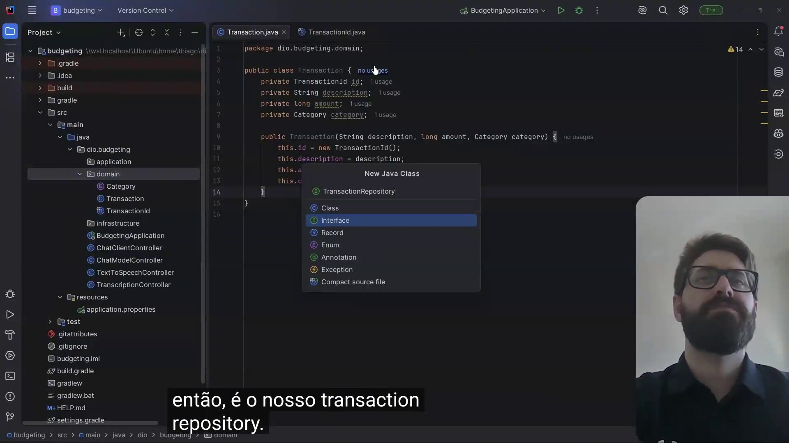
</p>

Ainda no pacote de domínio, é criada a interface `TransactionRepository`, seguindo os princípios de Domain-Driven Design: o domínio expõe apenas o contrato dos métodos, deixando a implementação concreta para a camada de infraestrutura.

#### Métodos expostos pelo TransactionRepository

<p align="center">
  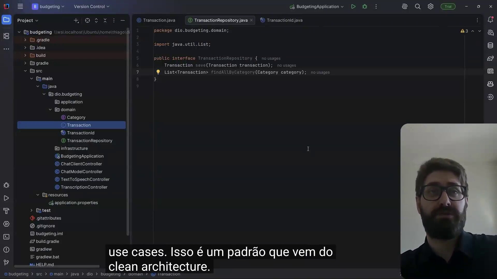
</p>

A interface define dois métodos: `save`, para persistir uma transação, e `findAllByCategory`, para buscar transações filtradas por categoria. Esses dois métodos serão consumidos pelos casos de uso da camada de aplicação, seguindo um padrão inspirado no Clean Architecture.

```java
package dio.budgeting.domain;

import java.util.List;

public interface TransactionRepository {
    Transaction save(Transaction transaction);
    List<Transaction> findAllByCategory(Category category);
}
```

#### Criando o PersistTransactionUseCase

<p align="center">
  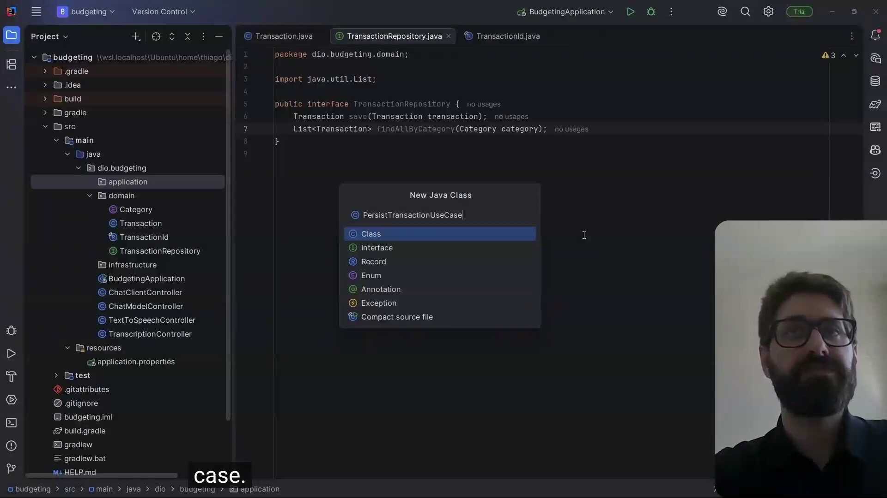
</p>

No pacote de aplicação, é criada a classe `PersistTransactionUseCase`. Em vez de um serviço genérico com muitos métodos, a opção é criar um caso de uso dedicado, com responsabilidade única de tratar a persistência de uma transação.

#### Estrutura inicial do PersistTransactionUseCase

<p align="center">
  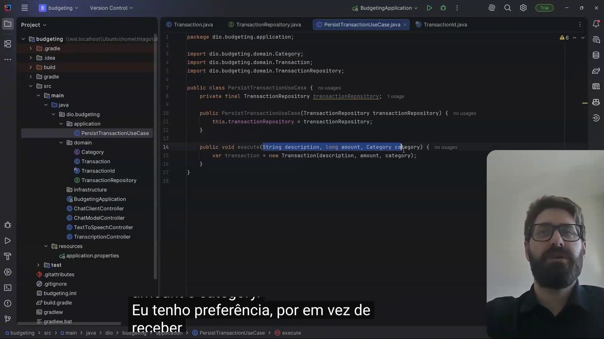
</p>

O caso de uso recebe, via injeção de dependência, uma instância de `TransactionRepository`. Seguindo o padrão de use case, é definido um único método público chamado `execute`, que por enquanto recebe `description`, `amount` e `category` diretamente como parâmetros para instanciar uma nova `Transaction`.

```java
package dio.budgeting.application;

import dio.budgeting.domain.Category;
import dio.budgeting.domain.Transaction;
import dio.budgeting.domain.TransactionRepository;

public class PersistTransactionUseCase {
    private final TransactionRepository transactionRepository;

    public PersistTransactionUseCase(TransactionRepository transactionRepository) {
        this.transactionRepository = transactionRepository;
    }

    public void execute(String description, long amount, Category category) {
        var transaction = new Transaction(description, amount, category);
    }
}
```

#### Criando o pacote input

<p align="center">
  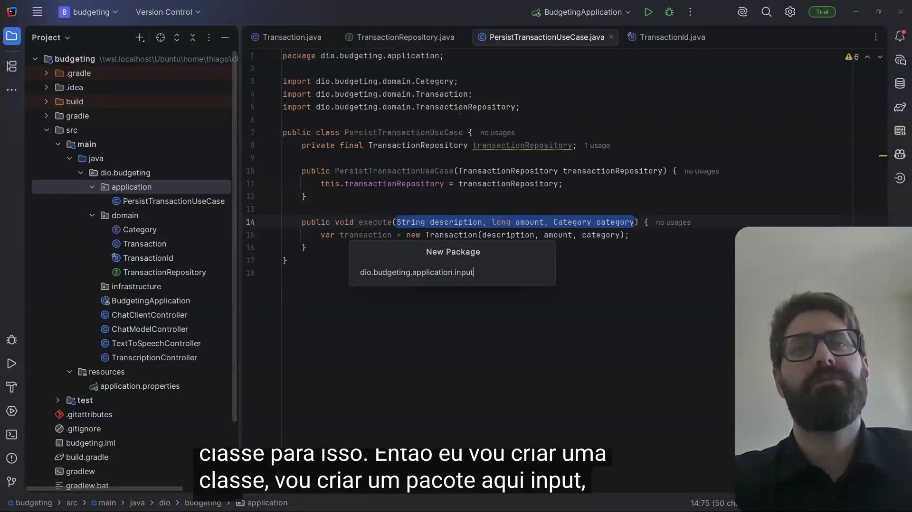
</p>

Em vez de manter vários parâmetros soltos no método `execute`, opta-se por agrupar os dados de entrada em uma classe dedicada. Para isso, é criado o pacote `dio.budgeting.application.input`.

#### Criando a classe PersistTransactionInput

<p align="center">
  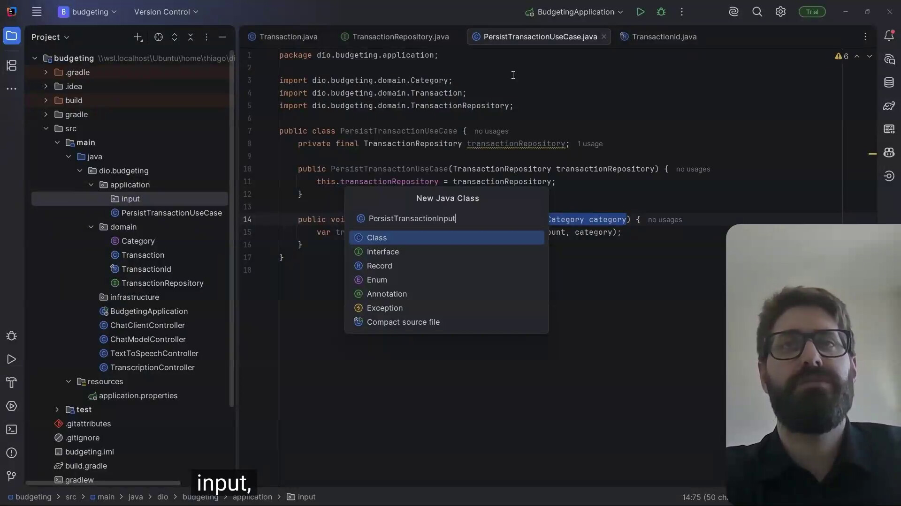
</p>

Dentro do pacote `input`, é criada a classe `PersistTransactionInput`, que vai atuar como um objeto de transferência de dados (DTO) para o caso de uso de persistência.

#### O record PersistTransactionInput

<p align="center">
  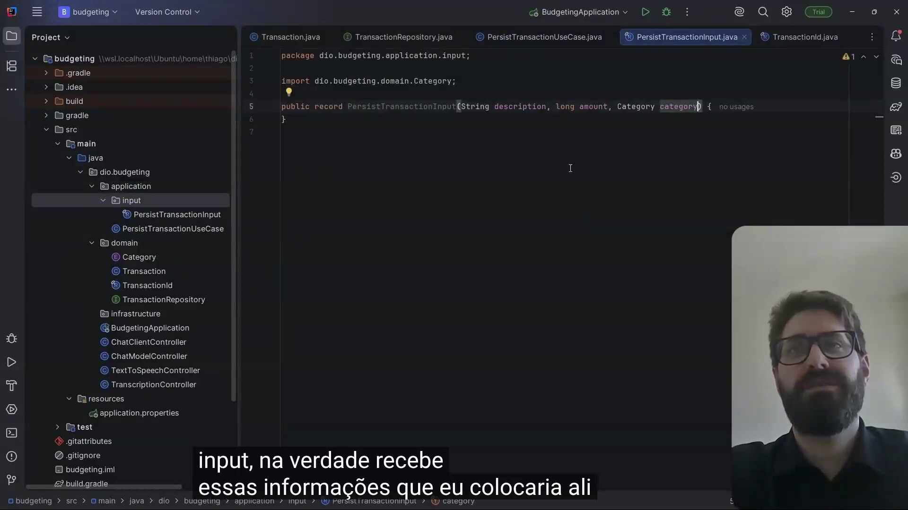
</p>

`PersistTransactionInput` é definido como um `record`, agrupando `description`, `amount` e `category`. Esse DTO simplifica a comunicação entre camadas, concentrando em um único parâmetro as informações que antes seriam passadas separadamente para o `execute`.

```java
package dio.budgeting.application.input;

import dio.budgeting.domain.Category;

public record PersistTransactionInput(String description, long amount, Category category) {
}
```

#### Use case consumindo o Input e retornando a transação persistida

<p align="center">
  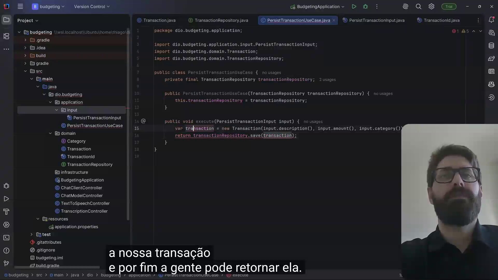
</p>

O método `execute` passa a receber um único parâmetro, `PersistTransactionInput input`, extraindo dele a descrição, o valor e a categoria para montar a `Transaction`. Em seguida, a transação é enviada ao repositório para ser salva, e o resultado é retornado ao chamador.

```java
package dio.budgeting.application;

import dio.budgeting.application.input.PersistTransactionInput;
import dio.budgeting.domain.Transaction;
import dio.budgeting.domain.TransactionRepository;

public class PersistTransactionUseCase {
    private final TransactionRepository transactionRepository;

    public PersistTransactionUseCase(TransactionRepository transactionRepository) {
        this.transactionRepository = transactionRepository;
    }

    public void execute(PersistTransactionInput input) {
        var transaction = new Transaction(input.description(), input.amount(), input.category());
        return transactionRepository.save(transaction);
    }
}
```

#### Ajustando o tipo de retorno do execute

<p align="center">
  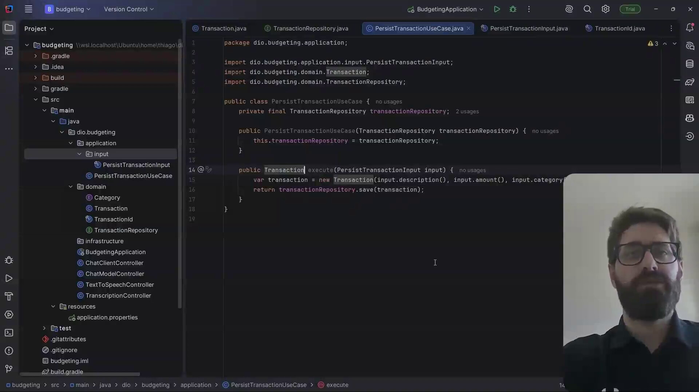
</p>

O tipo de retorno do método `execute` é alterado de `void` para `Transaction`, permitindo que o caso de uso devolva a transação recém-persistida para quem o chamou.

#### Criando o pacote output

<p align="center">
  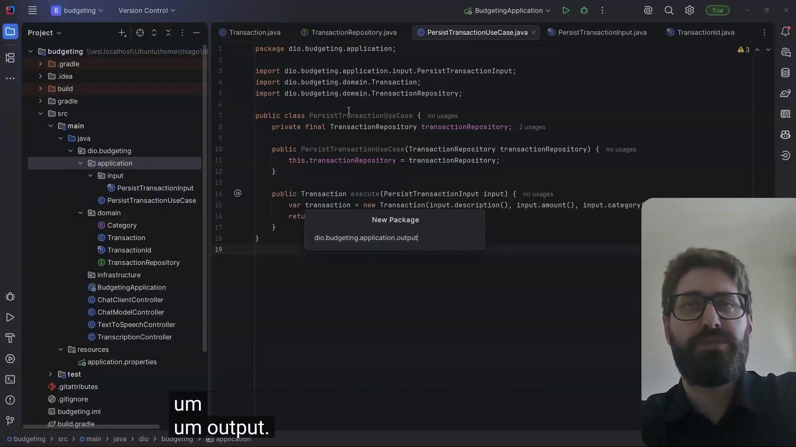
</p>

Assim como foi feito para a entrada, também será criado um objeto de saída dedicado. Para isso, é criado o pacote `dio.budgeting.application.output`.

#### Primeira versão de TransactionOutput

<p align="center">
  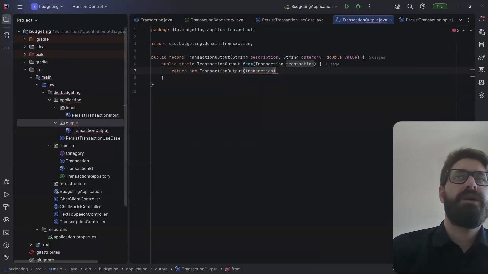
</p>

É criado o `record TransactionOutput`, com um método estático `from`, responsável por converter uma `Transaction` do domínio em um objeto de saída. Nesta primeira versão, o record ainda contém apenas `description`, `category` e `value`.

```java
package dio.budgeting.application.output;

import dio.budgeting.domain.Transaction;

public record TransactionOutput(String description, String category, double value) {
    public static TransactionOutput from(Transaction transaction) {
        return new TransactionOutput(transaction);
    }
}
```

#### Consultando o Project Lombok

<p align="center">
  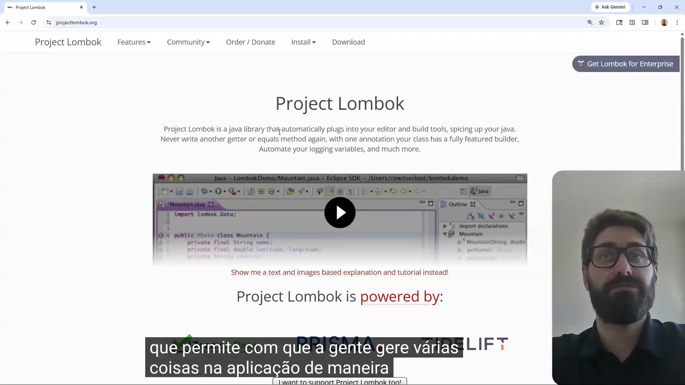
</p>

Como os campos de `Transaction` são privados, não existem getters automáticos gerados pela linguagem. Em vez de gerá-los manualmente pela IDE, opta-se por usar o Project Lombok, uma biblioteca que gera automaticamente métodos como getters, setters e outros recursos por meio de anotações, o que reduz a quantidade de código repetitivo.

#### Configurando o Lombok no Gradle

<p align="center">
  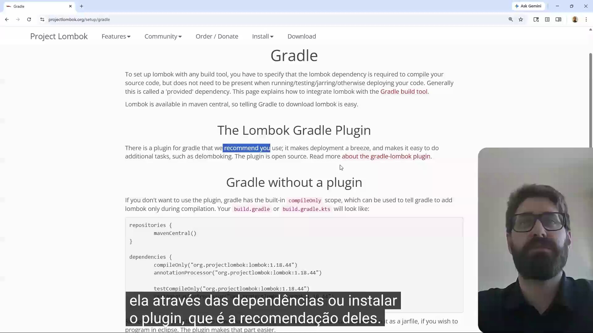
</p>

Na documentação oficial, é consultada a página de configuração do Lombok para projetos Gradle, que recomenda o uso do plugin oficial do Gradle para facilitar a integração, em vez de configurar as dependências manualmente.

#### O plugin io.freefair.lombok

<p align="center">
  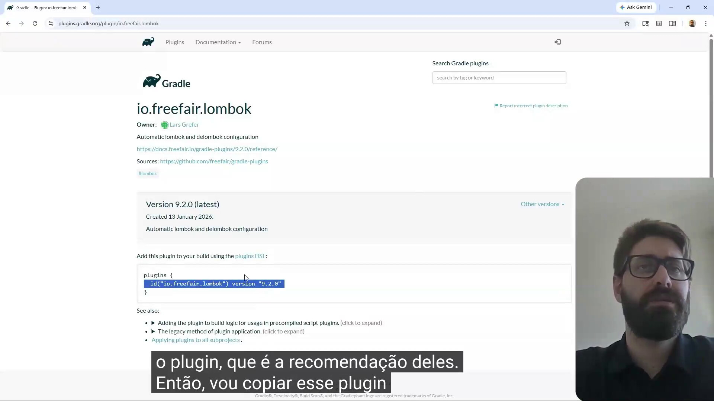
</p>

É localizado o plugin `io.freefair.lombok` no repositório de plugins do Gradle, com o trecho de configuração necessário para adicioná-lo ao projeto através do bloco `plugins`.

#### Adicionando o plugin ao build.gradle

<p align="center">
  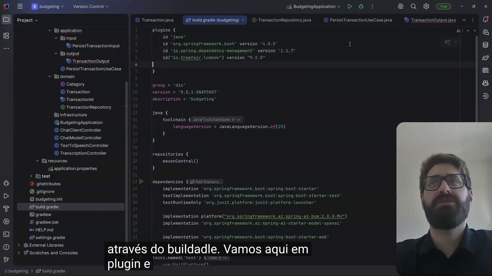
</p>

O plugin `io.freefair.lombok`, na versão `9.2.0`, é adicionado ao bloco `plugins` do arquivo `build.gradle` do projeto, juntamente com os plugins já existentes (`java`, `org.springframework.boot` e `io.spring.dependency-management`).

```gradle
plugins {
    id 'java'
    id 'org.springframework.boot' version '4.0.5'
    id 'io.spring.dependency-management' version '1.1.7'
    id("io.freefair.lombok") version "9.2.0"
}
```

#### Usando @Getter em Transaction

<p align="center">
  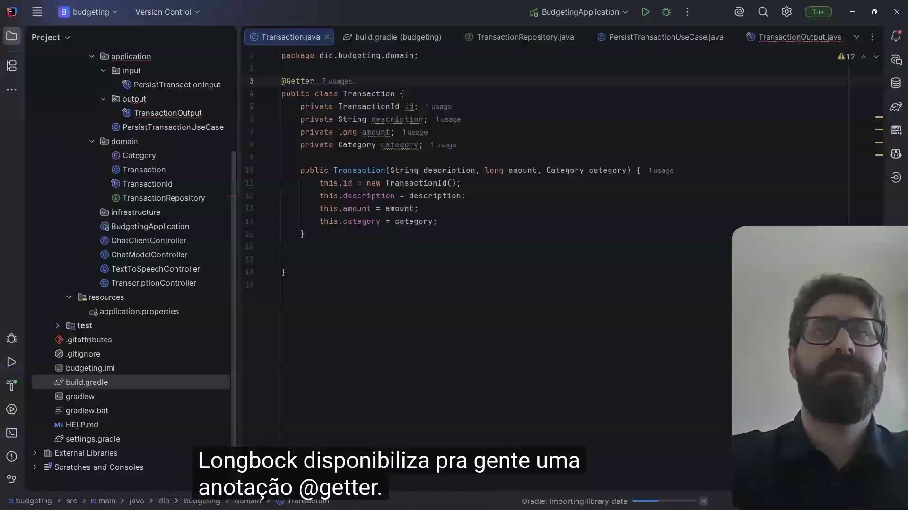
</p>

Com o Lombok configurado, a anotação `@Getter` é adicionada à classe `Transaction`. Isso faz com que os métodos `getId`, `getDescription`, `getAmount` e `getCategory` sejam gerados automaticamente, sem a necessidade de escrevê-los manualmente.

```java
package dio.budgeting.domain;

@Getter
public class Transaction {
    private TransactionId id;
    private String description;
    private long amount;
    private Category category;

    public Transaction(String description, long amount, Category category) {
        this.id = new TransactionId();
        this.description = description;
        this.amount = amount;
        this.category = category;
    }
}
```

#### Incluindo o id no TransactionOutput

<p align="center">
  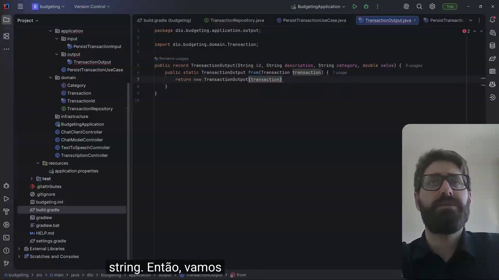
</p>

O `record TransactionOutput` é ajustado para incluir também o campo `id`, do tipo `String`, já que o identificador da transação precisa ser exposto como texto na resposta, e não como o tipo fortemente tipado `TransactionId` usado internamente no domínio.

#### Versão final do método from, com conversão do amount

<p align="center">
  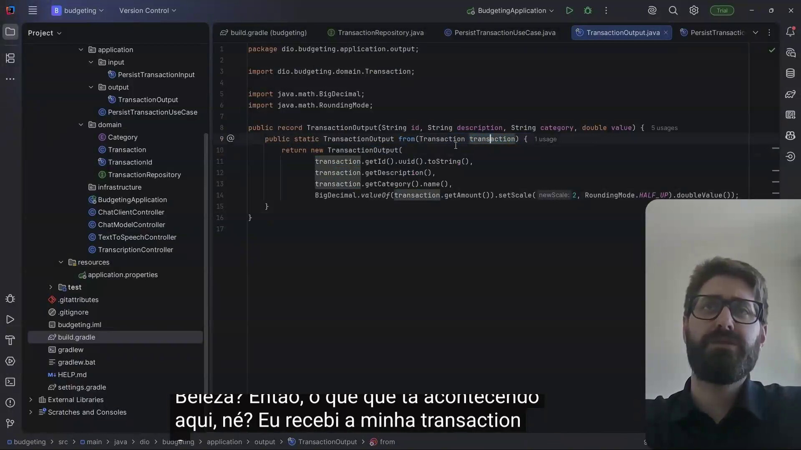
</p>

O método estático `from` é completado: o `id` da transação é convertido para `String` a partir do UUID, a descrição é copiada diretamente, a categoria é convertida para `String` usando `name()`, e o valor em centavos (`long`) é convertido para um `double` com duas casas decimais de precisão, usando `BigDecimal` com `setScale(2, RoundingMode.HALF_UP)`.

```java
package dio.budgeting.application.output;

import dio.budgeting.domain.Transaction;

import java.math.BigDecimal;
import java.math.RoundingMode;

public record TransactionOutput(String id, String description, String category, double value) {
    public static TransactionOutput from(Transaction transaction) {
        return new TransactionOutput(
                transaction.getId().uuid().toString(),
                transaction.getDescription(),
                transaction.getCategory().name(),
                BigDecimal.valueOf(transaction.getAmount()).setScale(2, RoundingMode.HALF_UP).doubleValue());
    }
}
```
      
#### Material de Apoio Até Esta Etapa

- Arquivos do projeto nesta etapa: [budgeting_ate_o_video08.zip](./000-Midia_e_Anexos/etapas_do_codigo/budgeting_ate_o_video08.zip)
- [007-Tutorial_Budgeting_Spring_AI_Video08.md](./007-Tutorial_Budgeting_Spring_AI_Video08.md)


### 🟩 Vídeo 09 - Persistência e Infraestrutura: Configurando o Banco com Docker

<video width="60%" controls>
  <source src="000-Midia_e_Anexos/bootcamp_ntt_data_java_spring_ai-modulo.04-curso.05-video_09.webm" type="video/webm">
    Seu navegador não suporta vídeo HTML5.
</video>

link do vídeo: https://web.dio.me/lab/desenvolvendo-sua-api-inteligente-com-reconhecimento-de-fala-e-spring-boot-1/learning/b7250107-c95a-4bb9-b62b-2dca8d0c29b7?back=/track/ntt-data-2026-ai-java-back-end

### Anotações

#### Criando o arquivo compose.yml

<p align="center">
  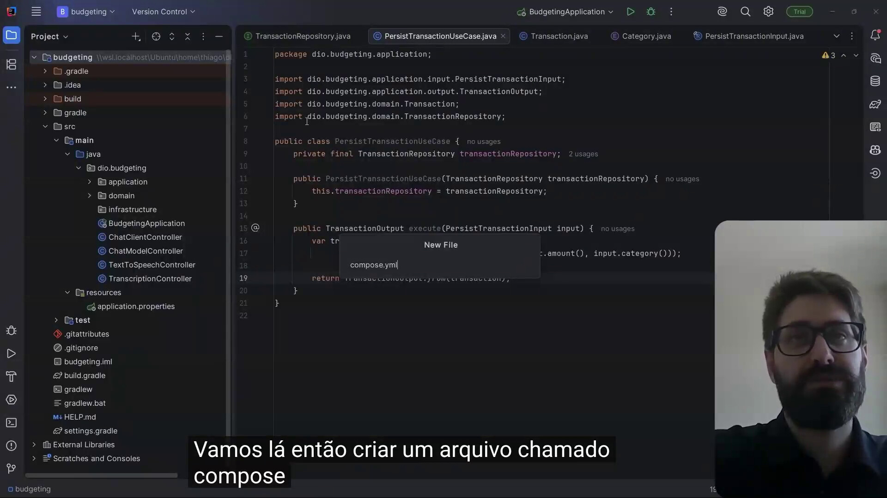
</p>

No IntelliJ, um novo arquivo chamado `compose.yml` está sendo criado na raiz do projeto, através do diálogo **New File**. Esse arquivo vai concentrar a definição do ambiente de banco de dados usado durante o desenvolvimento.

#### Definindo o serviço de banco de dados no compose.yml

<p align="center">
  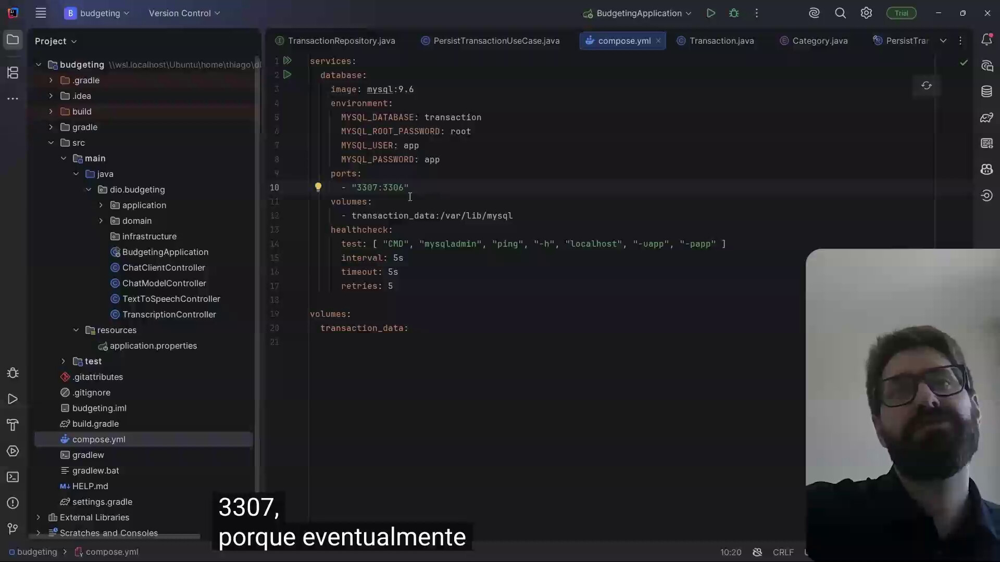
</p>

O `compose.yml` já está preenchido com o serviço `database`, usando a imagem `mysql:9.6`. As variáveis de ambiente definem o banco (`transaction`), o usuário (`app`) e as senhas de root e da aplicação. A porta local `3307` é mapeada para a porta padrão do MySQL (`3306`) dentro do contêiner, evitando conflito com uma instância de MySQL que já possa existir na máquina. Também há um volume (`transaction_data`) para persistir os dados fora do contêiner e uma configuração de `healthcheck` para validar se o banco está de fato pronto para uso.

```yaml
services:
  database:
    image: mysql:9.6
    environment:
      MYSQL_DATABASE: transaction
      MYSQL_ROOT_PASSWORD: root
      MYSQL_USER: app
      MYSQL_PASSWORD: app
    ports:
      - "3307:3306"
    volumes:
      - transaction_data:/var/lib/mysql
    healthcheck:
      test: [ "CMD", "mysqladmin", "ping", "-h", "localhost", "-uapp", "-papp" ]
      interval: 5s
      timeout: 5s
      retries: 5

volumes:
  transaction_data:
```

#### Adicionando a dependência do Spring Boot Docker Compose

<p align="center">
  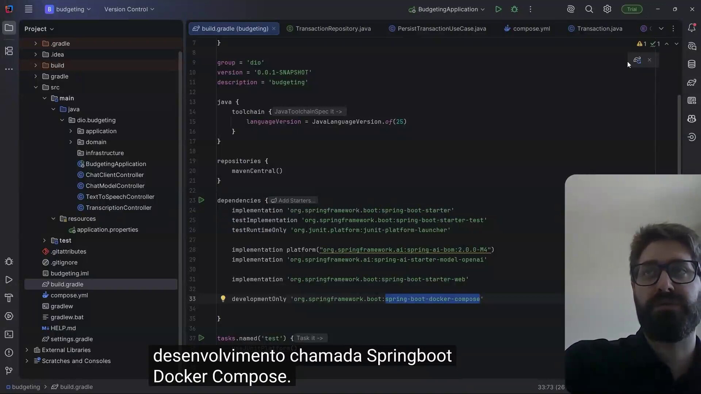
</p>

No `build.gradle`, a dependência `spring-boot-docker-compose` é adicionada como `developmentOnly`. Ela é responsável por integrar o Spring Boot ao arquivo `compose.yml`, permitindo que os serviços definidos ali sejam gerenciados automaticamente durante o ciclo de vida da aplicação.

```groovy
dependencies {
    implementation 'org.springframework.boot:spring-boot-starter'
    testImplementation 'org.springframework.boot:spring-boot-starter-test'
    testRuntimeOnly 'org.junit.platform:junit-platform-launcher'

    implementation platform("org.springframework.ai:spring-ai-bom:2.0.0-M4")
    implementation 'org.springframework.ai:spring-ai-starter-model-openai'

    implementation 'org.springframework.boot:spring-boot-starter-web'

    developmentOnly 'org.springframework.boot:spring-boot-docker-compose'
}
```

#### Subindo o contêiner automaticamente ao iniciar a aplicação

<p align="center">
  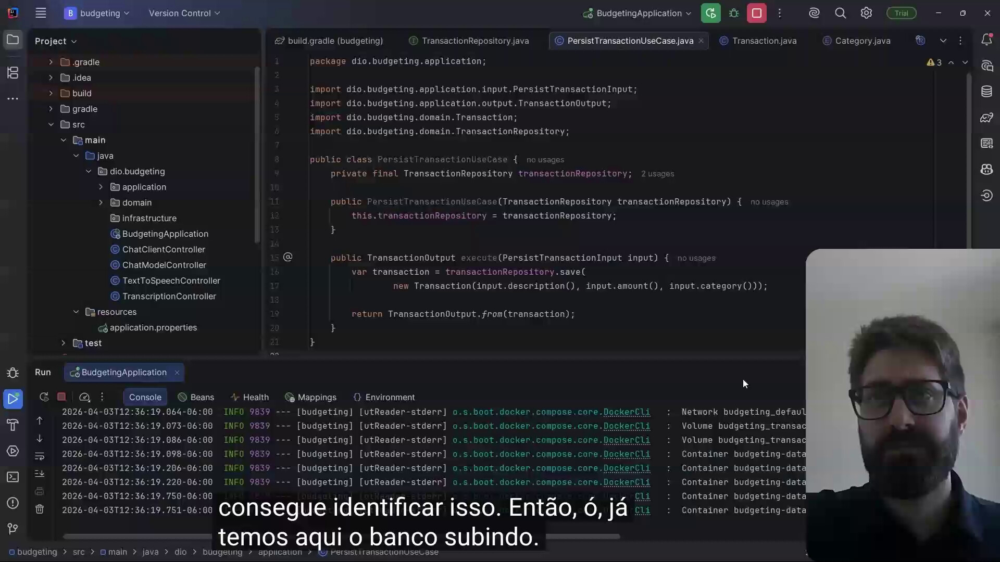
</p>

Com a aplicação em execução, o console mostra o Spring Boot orquestrando o Docker: criação de rede (`Network`), volumes e contêineres a partir do `compose.yml`. Essa é a integração citada anteriormente — ao iniciar a aplicação, o próprio Spring Boot sobe o contêiner do MySQL, sem exigir configuração manual de porta, usuário, URL ou banco.


#### Visualizando o contêiner na aba Services do IntelliJ

<p align="center">
  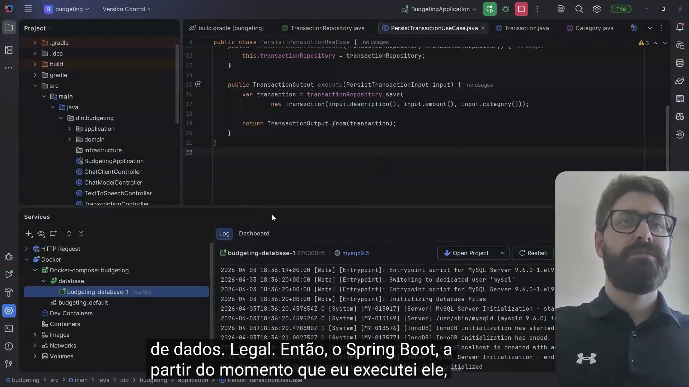
</p>

Na aba **Services**, é possível visualizar a árvore do Docker Compose do projeto, mostrando o contêiner `budgeting-database-1` com status **healthy**. Isso confirma que o healthcheck configurado no `compose.yml` está passando e que o banco está pronto para receber conexões.


#### Adicionando o Spring Data JPA

<p align="center">
  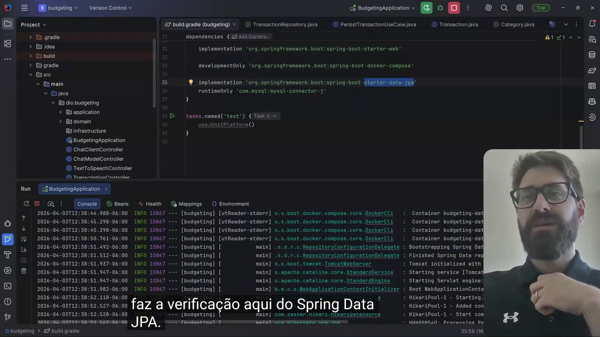
</p>

A dependência `spring-boot-starter-data-jpa` é adicionada ao `build.gradle`, junto com o `runtimeOnly 'com.mysql:mysql-connector-j'`. No console, os logs mostram o Spring Data inicializando os repositórios e o HikariCP (pool de conexões) se conectando ao banco, confirmando que a integração entre JPA e o contêiner MySQL já está funcionando.

```groovy
implementation 'org.springframework.boot:spring-boot-starter-data-jpa'
runtimeOnly 'com.mysql:mysql-connector-j'
```

#### Criando o pacote persistence

<p align="center">
  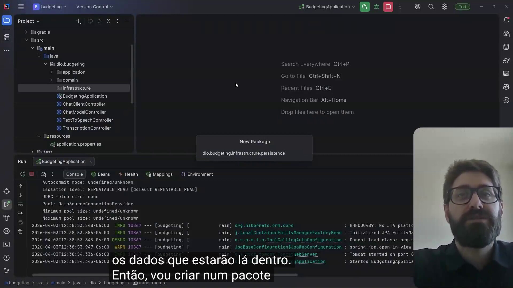
</p>

Dentro do pacote `infrastructure`, é criado o novo pacote `persistence` (`dio.budgeting.infrastructure.persistence`), que vai concentrar tudo relacionado à forma como a aplicação manipula o banco de dados.

#### Criando o subpacote entity

<p align="center">
  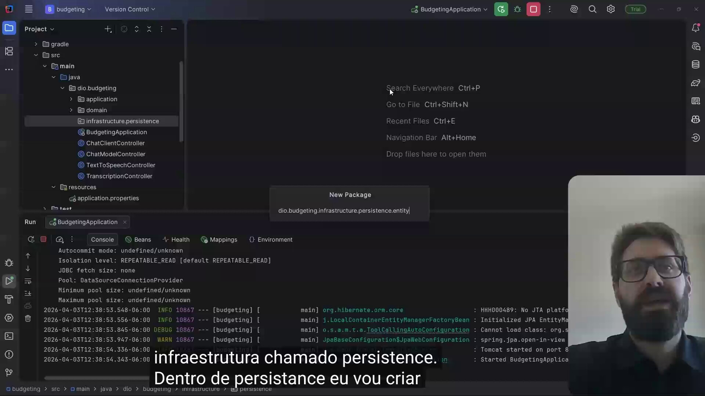
</p>

Dentro de `persistence`, é criado o subpacote `entity` (`dio.budgeting.infrastructure.persistence.entity`), onde ficarão as classes anotadas com JPA que representam as tabelas do banco.

#### Criando o subpacote repository

<p align="center">
  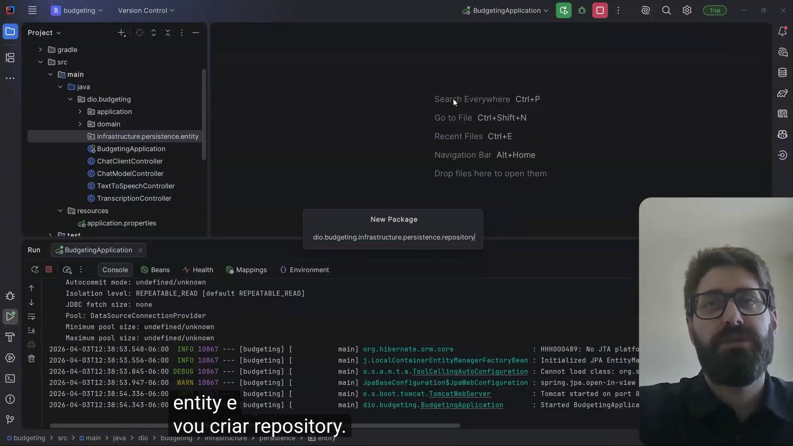
</p>

Ainda dentro de `persistence`, é criado o subpacote `repository` (`dio.budgeting.infrastructure.persistence.repository`), que vai concentrar as interfaces e implementações responsáveis pelo acesso aos dados.

#### Criando a classe TransactionEntity

<p align="center">
  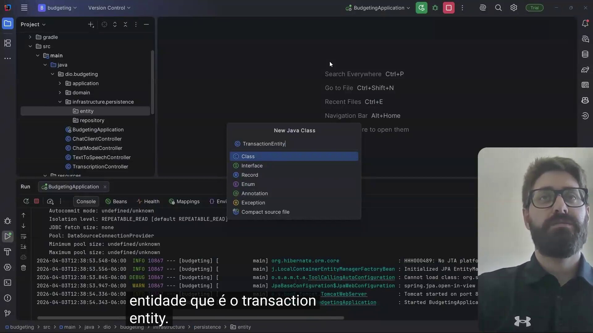
</p>

Dentro do pacote `entity`, é criada a primeira entidade JPA da aplicação: `TransactionEntity`, através do diálogo **New Java Class**.

#### Anotando a entidade com @Entity

<p align="center">
  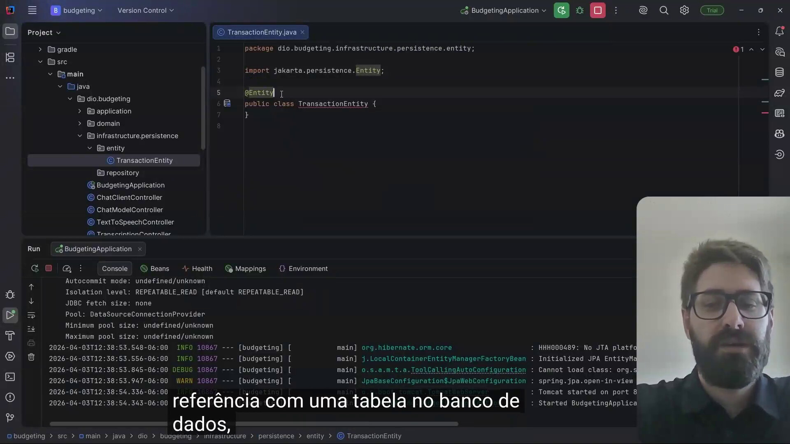
</p>

A classe `TransactionEntity` recebe a anotação `@Entity`, do pacote `jakarta.persistence`, indicando que ela representa uma tabela no banco de dados.

```java
package dio.budgeting.infrastructure.persistence.entity;

import jakarta.persistence.Entity;

@Entity
public class TransactionEntity {
}
```

#### Adicionando os campos e as anotações do Lombok

<p align="center">
  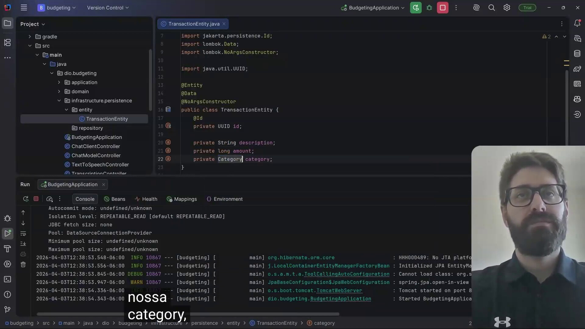
</p>

A entidade recebe as anotações `@Data` e `@NoArgsConstructor`, do Lombok. O `@Data` já gera automaticamente getters, setters, `toString`, `equals` e o construtor com os argumentos obrigatórios; o `@NoArgsConstructor` garante um construtor sem argumentos, exigido pelo JPA em alguns cenários. Os campos definidos são: `id` (UUID), `description` (String), `amount` (tipo `long`, para representar valores em centavos) e `category` (do tipo `Category`, um enum que será persistido).

```java
package dio.budgeting.infrastructure.persistence.entity;

import jakarta.persistence.Entity;
import jakarta.persistence.Id;
import lombok.Data;
import lombok.NoArgsConstructor;

import java.util.UUID;

@Entity
@Data
@NoArgsConstructor
public class TransactionEntity {
    @Id
    private UUID id;

    private String description;
    private long amount;
    private Category category;
}
```

#### Criando a interface TransactionEntityRepository

<p align="center">
  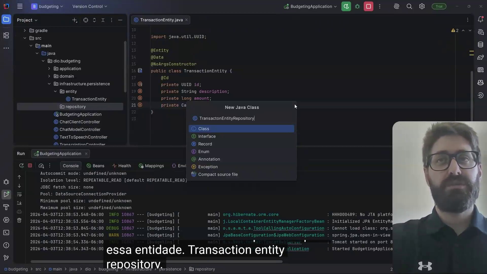
</p>

No pacote `repository`, é criada uma interface chamada `TransactionEntityRepository`, que vai representar o repositório JPA responsável por manipular a entidade `TransactionEntity`.

#### Estendendo CrudRepository

<p align="center">
  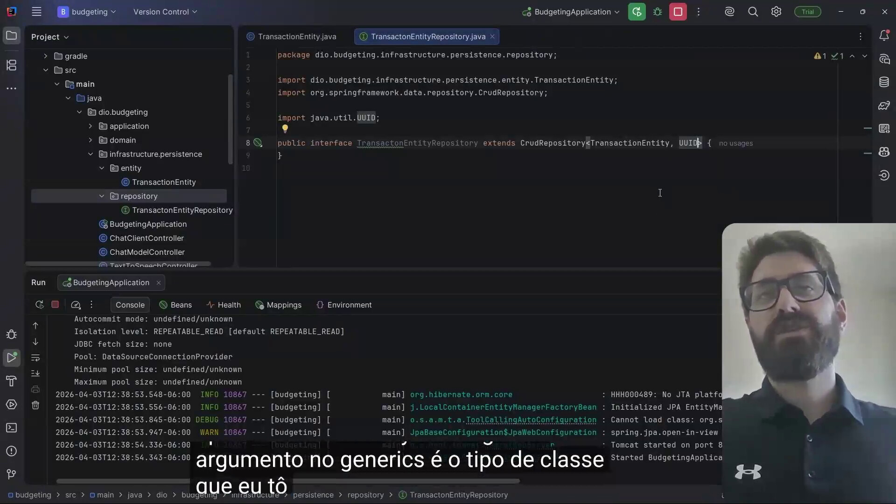
</p>

A interface `TransactionEntityRepository` passa a estender `CrudRepository`, disponibilizado pelo Spring Data. Os dois parâmetros genéricos definem, respectivamente, o tipo da entidade manipulada (`TransactionEntity`) e o tipo da chave primária (`UUID`). Com isso, o repositório já ganha automaticamente uma série de métodos prontos de CRUD.

```java
package dio.budgeting.infrastructure.persistence.repository;

import dio.budgeting.infrastructure.persistence.entity.TransactionEntity;
import org.springframework.data.repository.CrudRepository;

import java.util.UUID;

public interface TransactionEntityRepository extends CrudRepository<TransactionEntity, UUID> {
}
```

#### Criando a classe JpaTransactionRepository

<p align="center">
  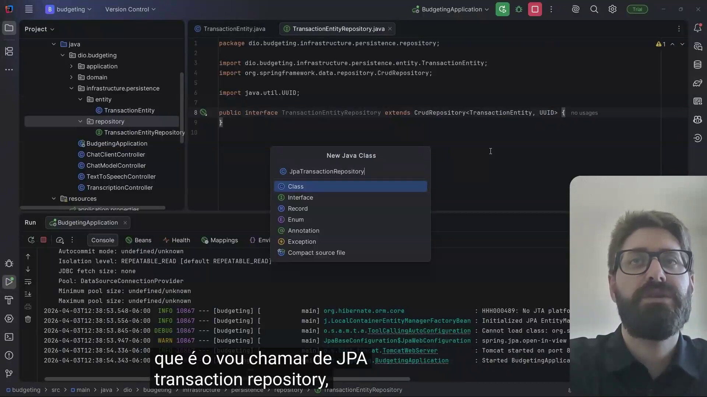
</p>

Uma nova classe é criada: `JpaTransactionRepository`. Ela será a implementação concreta da interface `TransactionRepository` definida no domínio da aplicação, fazendo a ponte entre o domínio e o repositório JPA criado anteriormente.

#### Estruturando os métodos save e findAllByCategory

<p align="center">
  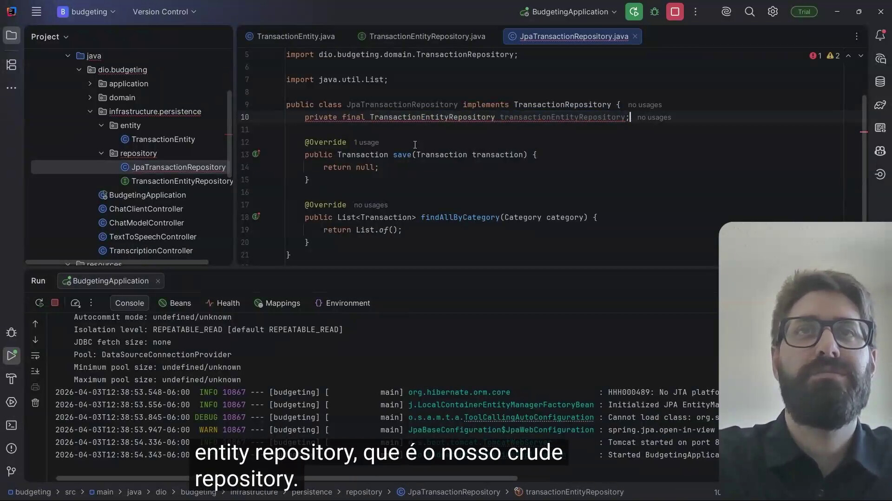
</p>

A classe `JpaTransactionRepository` passa a implementar `TransactionRepository`, com um campo `transactionEntityRepository` do tipo `TransactionEntityRepository`. Os métodos `save` e `findAllByCategory` são criados como esqueleto (retornando `null` e `List.of()`, respectivamente), prontos para receber a implementação real.

```java
public class JpaTransactionRepository implements TransactionRepository {
    private final TransactionEntityRepository transactionEntityRepository;

    @Override
    public Transaction save(Transaction transaction) {
        return null;
    }

    @Override
    public List<Transaction> findAllByCategory(Category category) {
        return List.of();
    }
}
```

#### Criando o construtor com injeção de dependência

<p align="center">
  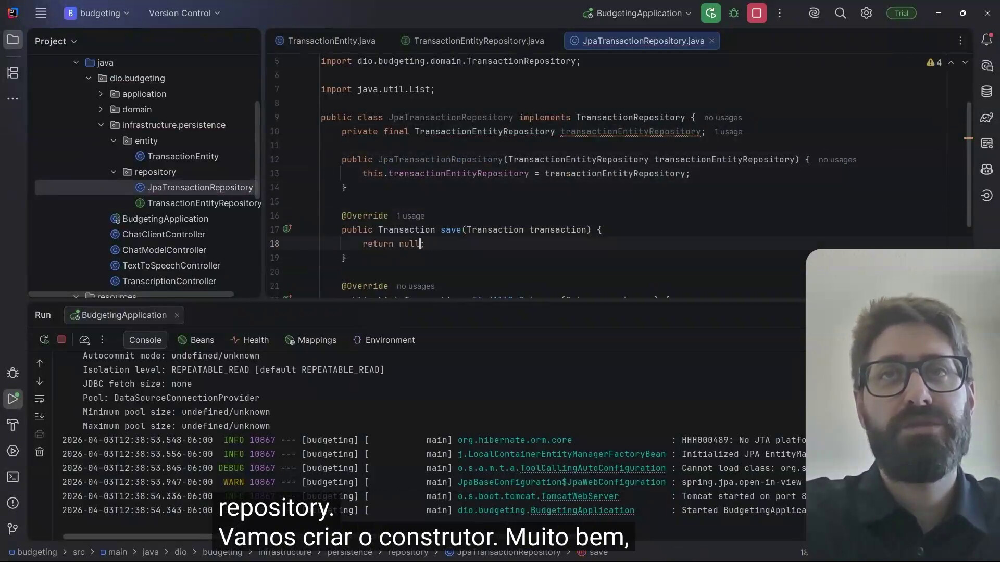
</p>

O construtor de `JpaTransactionRepository` é gerado, recebendo `TransactionEntityRepository` como parâmetro e atribuindo-o ao campo da classe. Essa injeção é o que vai permitir que a classe utilize o repositório JPA internamente.

```java
public JpaTransactionRepository(TransactionEntityRepository transactionEntityRepository) {
    this.transactionEntityRepository = transactionEntityRepository;
}
```

#### Iniciando o mapper: de Transaction para TransactionEntity

<p align="center">
  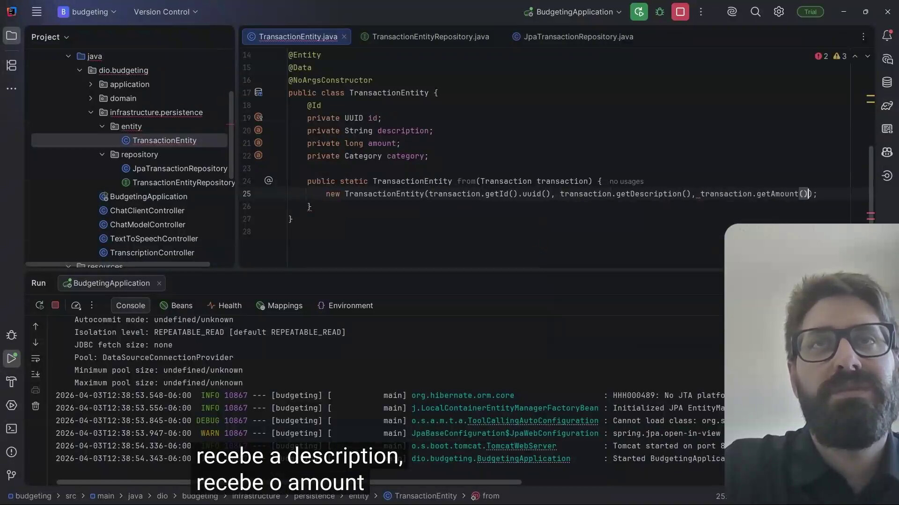
</p>

Na classe `TransactionEntity`, começa a ser escrito um método estático `from(Transaction transaction)`, que vai converter um objeto de domínio `Transaction` em uma `TransactionEntity`. Nesse momento, o construtor está recebendo o id, a description e o amount da transação de origem.

#### Completando os parâmetros do mapper com a category

<p align="center">
  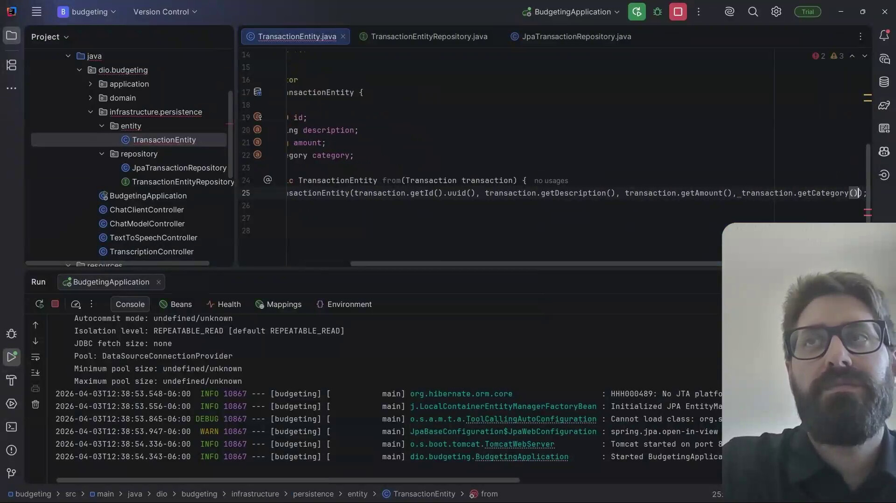
</p>

A construção do `TransactionEntity` dentro do método `from` é completada com o parâmetro `transaction.getCategory()`, além do id, description e amount já adicionados anteriormente.

#### Finalizando o retorno do método from

<p align="center">
  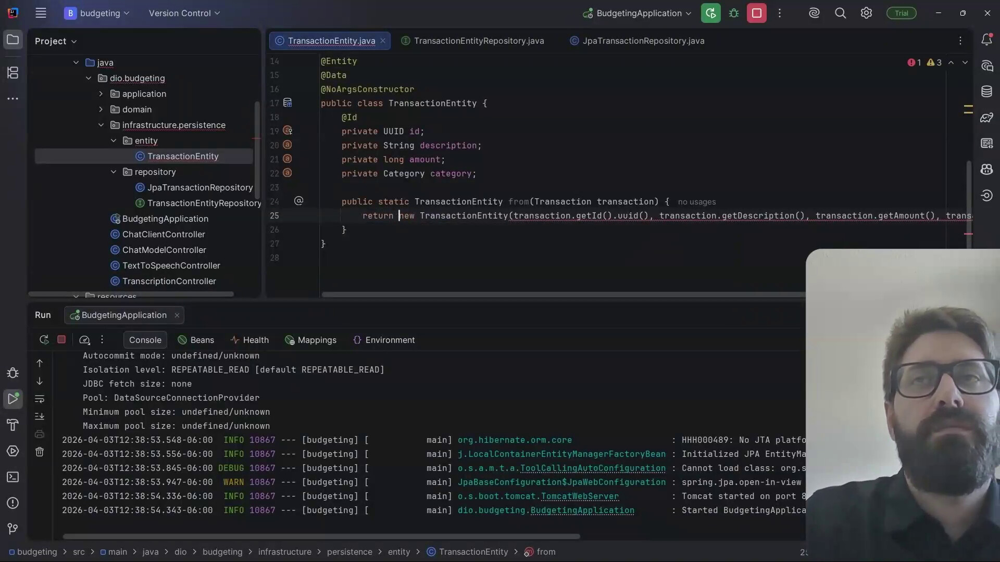
</p>

O método `from` passa a ter um `return new TransactionEntity(...)` explícito, montando a nova entidade a partir dos dados da transação de domínio.

#### Simplificando o construtor com @AllArgsConstructor

<p align="center">
  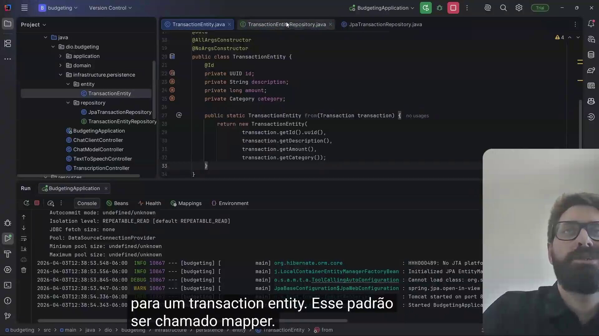
</p>

Em vez de escrever manualmente o construtor completo, a entidade `TransactionEntity` é anotada com `@AllArgsConstructor` (do Lombok), que gera automaticamente um construtor com todas as propriedades, complementando o `@NoArgsConstructor` já existente (necessário para o JPA). Com isso, o método `from` fica completo, representando o mapeamento de `Transaction` para `TransactionEntity` — um padrão comumente chamado de **mapper**.

```java
@Entity
@Data
@AllArgsConstructor
@NoArgsConstructor
public class TransactionEntity {
    @Id
    private UUID id;

    private String description;
    private long amount;
    private Category category;

    public static TransactionEntity from(Transaction transaction) {
        return new TransactionEntity(
                transaction.getId().uuid(),
                transaction.getDescription(),
                transaction.getAmount(),
                transaction.getCategory());
    }
}
```

#### Implementando o método save do repositório

<p align="center">
  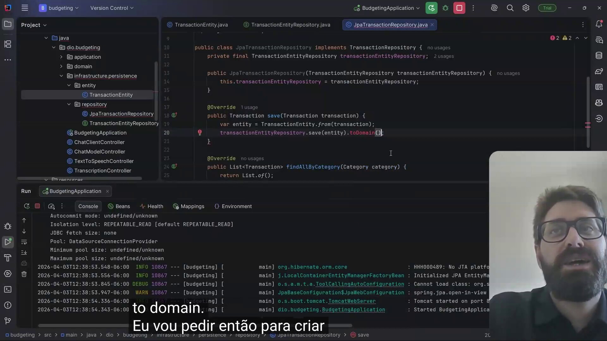
</p>

O método `save` de `JpaTransactionRepository` é implementado: a `Transaction` recebida é convertida em `TransactionEntity` através do mapper `from`, persistida via `transactionEntityRepository.save(entity)`, e o resultado é convertido de volta para `Transaction` através de uma chamada a `.toDomain()` — método que ainda precisa ser criado na entidade.

```java
@Override
public Transaction save(Transaction transaction) {
    var entity = TransactionEntity.from(transaction);
    return transactionEntityRepository.save(entity).toDomain();
}
```

#### Criando o mapper reverso: toDomain

<p align="center">
  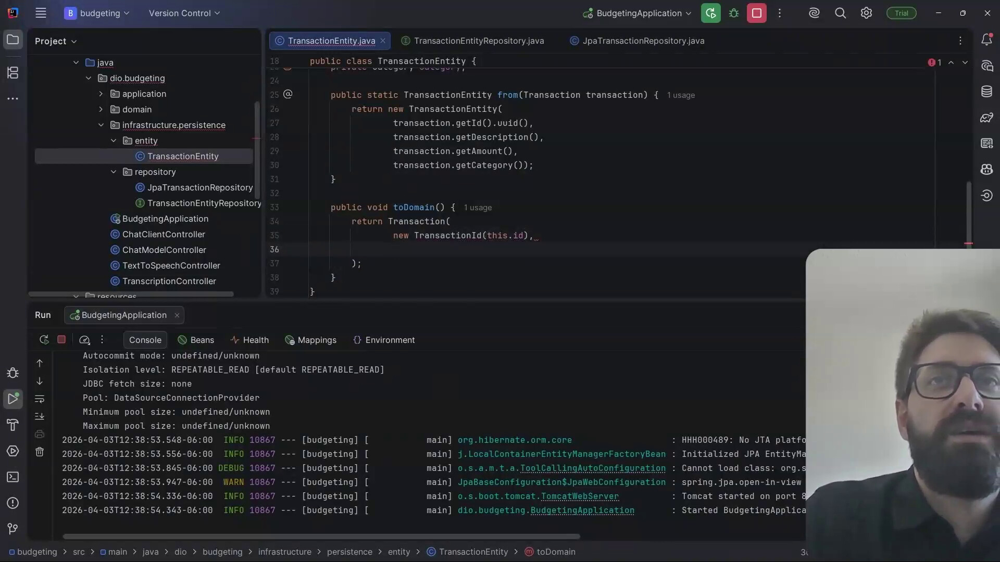
</p>

Na classe `TransactionEntity`, é criado o método `toDomain()`, responsável pelo caminho inverso do mapper: converter a entidade de volta para o objeto de domínio `Transaction`. O primeiro campo tratado é o `id`, convertido para um novo `TransactionId` a partir do `this.id` da entidade.

```java
public Transaction toDomain() {
    return new Transaction(
            new TransactionId(this.id),
            ...
    );
}
```

#### Ajustando o construtor da classe de domínio Transaction

<p align="center">
  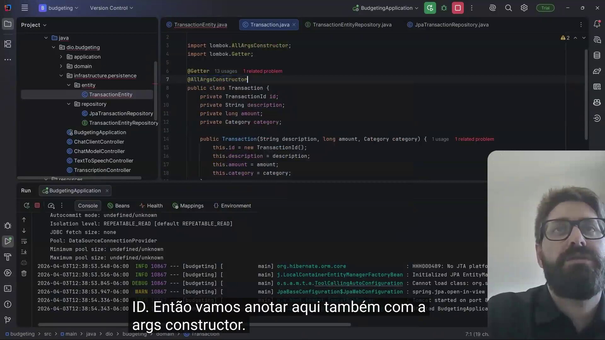
</p>

Como a classe de domínio `Transaction` não possui um construtor que aceite diretamente o `id`, ela é anotada com `@AllArgsConstructor`, complementando o construtor manual já existente que gera um novo `TransactionId()`. Isso permite que o `toDomain()` da entidade instancie uma `Transaction` completa, incluindo o id vindo do banco.

```java
@Getter
@AllArgsConstructor
public class Transaction {
    private TransactionId id;
    private String description;
    private long amount;
    private Category category;

    public Transaction(String description, long amount, Category category) {
        this.id = new TransactionId();
        this.description = description;
        this.amount = amount;
        this.category = category;
    }
}
```

#### Iniciando a implementação de findAllByCategory

<p align="center">
  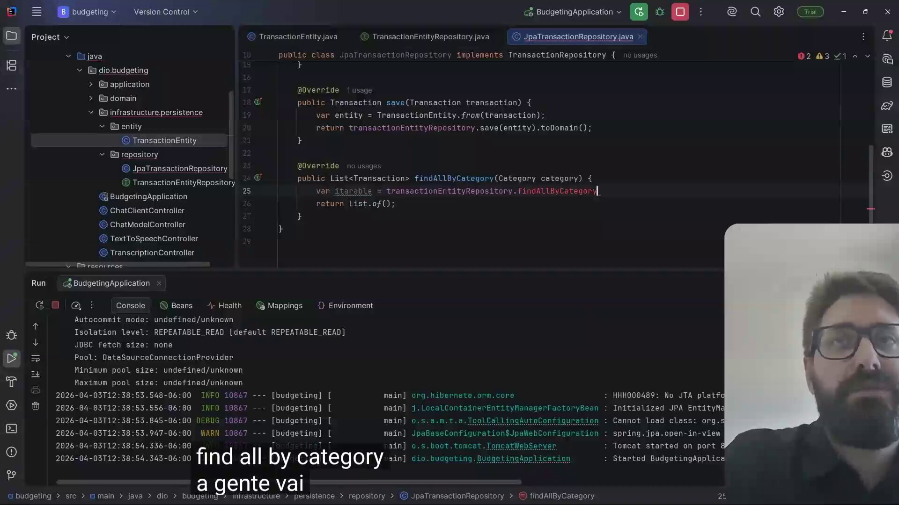
</p>

Com o método `save` finalizado, a implementação avança para `findAllByCategory`. Como o `CrudRepository` padrão não expõe um método de busca por categoria, a variável `iterable` começa a ser atribuída a partir de uma chamada a `transactionEntityRepository.findAllByCategory`, método que ainda precisa ser declarado na interface do repositório JPA.

#### Declarando findAllByCategory na interface do repositório

<p align="center">
  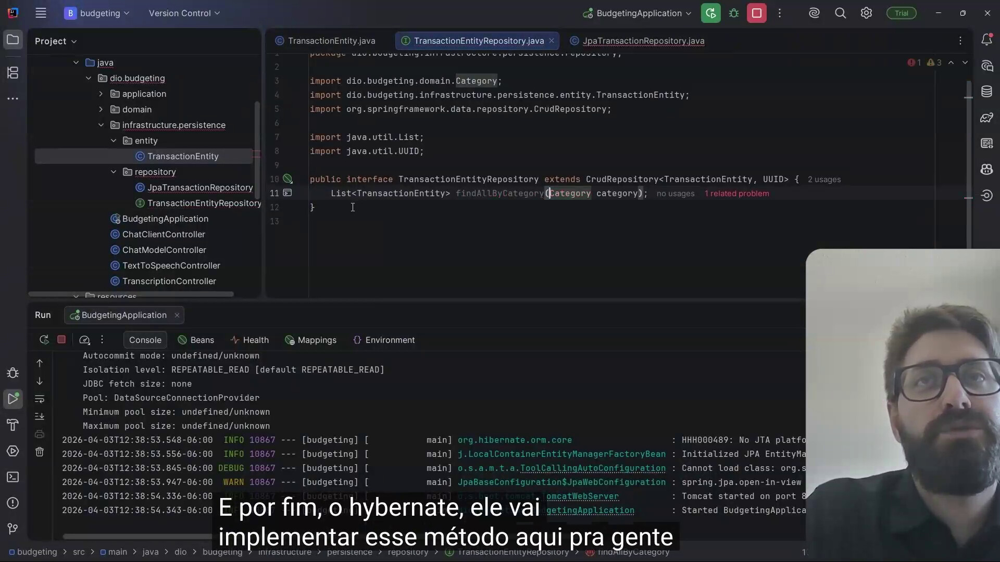
</p>

Na interface `TransactionEntityRepository`, é adicionado o método `findAllByCategory(Category category)`, retornando `List<TransactionEntity>`. Por seguir a convenção de nomenclatura de query methods do Spring Data, o Hibernate consegue implementar essa consulta automaticamente, sem necessidade de escrever a query manualmente.

```java
public interface TransactionEntityRepository extends CrudRepository<TransactionEntity, UUID> {
    List<TransactionEntity> findAllByCategory(Category category);
}
```

#### Convertendo a lista de entidades para o domínio

<p align="center">
  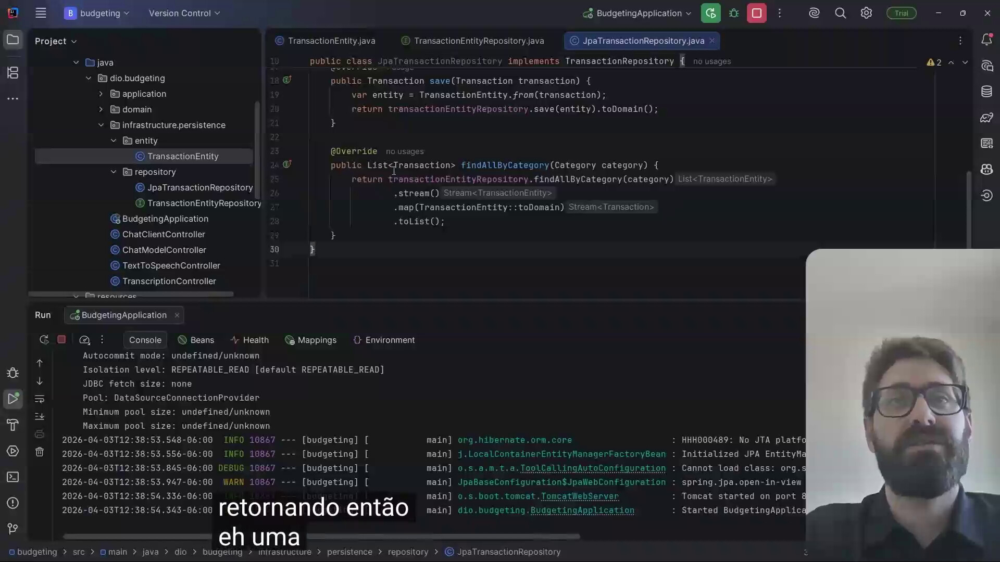
</p>

O método `findAllByCategory` de `JpaTransactionRepository` é finalizado: a lista de `TransactionEntity` retornada pelo repositório JPA é transformada em uma `Stream`, cada item é convertido para `Transaction` através de `TransactionEntity::toDomain`, e o resultado é coletado de volta em uma lista com `.toList()`.

```java
@Override
public List<Transaction> findAllByCategory(Category category) {
    return transactionEntityRepository.findAllByCategory(category)
            .stream()
            .map(TransactionEntity::toDomain)
            .toList();
}
```

#### Anotando o repositório com @Repository

<p align="center">
  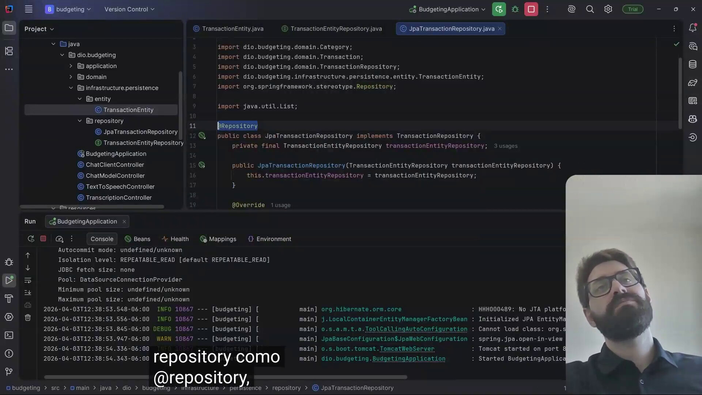
</p>

A classe `JpaTransactionRepository` recebe a anotação `@Repository`, do Spring. Isso permite que o Spring identifique essa classe como candidata à injeção de dependência sempre que a interface `TransactionRepository` (do domínio) for requisitada em outro ponto da aplicação, como no `PersistTransactionUseCase`.

```java
@Repository
public class JpaTransactionRepository implements TransactionRepository {
    private final TransactionEntityRepository transactionEntityRepository;
    ...
}
```

#### Configurando a criação automática do schema

<p align="center">
  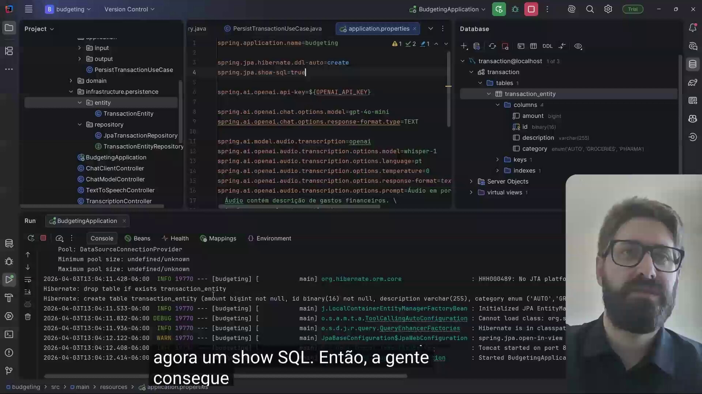
</p>

No `application.properties`, as propriedades `spring.jpa.hibernate.ddl-auto=create` e `spring.jpa.show-sql=true` são adicionadas. Com isso, ao subir a aplicação, o Hibernate recria as tabelas a partir das entidades mapeadas e exibe no console o SQL executado. O painel de banco de dados do IntelliJ confirma a criação da tabela `transaction_entity`, com as colunas `amount`, `id`, `description` e `category` (esta última mapeada como enum).

```properties
spring.application.name=budgeting

spring.jpa.hibernate.ddl-auto=create
spring.jpa.show-sql=true
```

#### Alterando ddl-auto para update

<p align="center">
  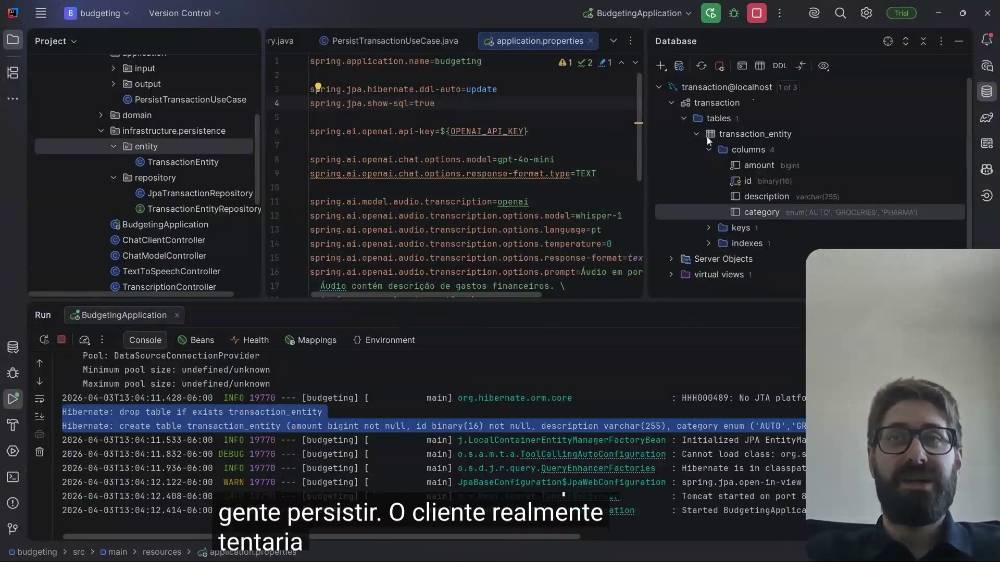
</p>

Após confirmar que a tabela foi criada corretamente, a propriedade `spring.jpa.hibernate.ddl-auto` é alterada de `create` para `update`. Dessa forma, o Hibernate passa a preservar os dados já persistidos entre as execuções, em vez de recriar o banco do zero a cada subida da aplicação — o que seria o comportamento do modo `create`.

```properties
spring.jpa.hibernate.ddl-auto=update
spring.jpa.show-sql=true
```
 
#### Material de Apoio Até Esta Etapa

- Arquivos do projeto nesta etapa: [budgeting_ate_o_video09.zip](./000-Midia_e_Anexos/etapas_do_codigo/budgeting_ate_o_video09.zip)
- [008-Tutorial_Budgeting_Spring_AI_Video09.md](./008-Tutorial_Budgeting_Spring_AI_Video09.md)


### 🟩 Vídeo 10 - Exposição REST: Implementando o TransactionController

<video width="60%" controls>
  <source src="000-Midia_e_Anexos/bootcamp_ntt_data_java_spring_ai-modulo.04-curso.05-video_10.webm" type="video/webm">
    Seu navegador não suporta vídeo HTML5.
</video>

link do vídeo: https://web.dio.me/lab/desenvolvendo-sua-api-inteligente-com-reconhecimento-de-fala-e-spring-boot-1/learning/2aee74d9-9d18-4af8-bd20-53fa862394a6?back=/track/ntt-data-2026-ai-java-back-end

### Anotações

#### Criando o pacote HTTP

<p align="center">
  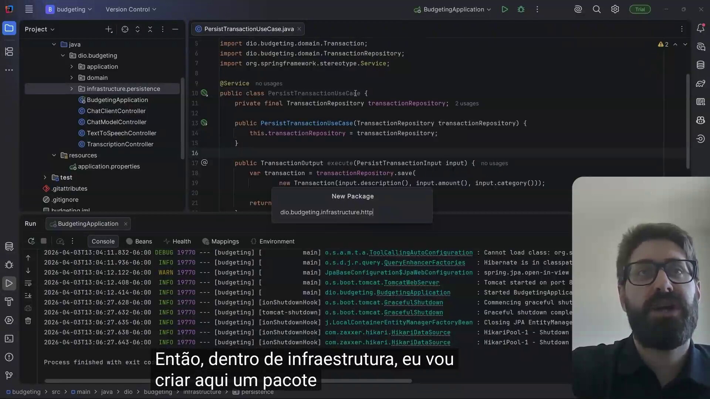
</p>

O ponto de partida é organizar a camada de infraestrutura web separadamente da persistência. Dentro de `infrastructure`, é criado o pacote `dio.budgeting.infrastructure.http`, que vai concentrar os controllers responsáveis por expor os endpoints da API.

#### Criando a classe TransactionController

<p align="center">
  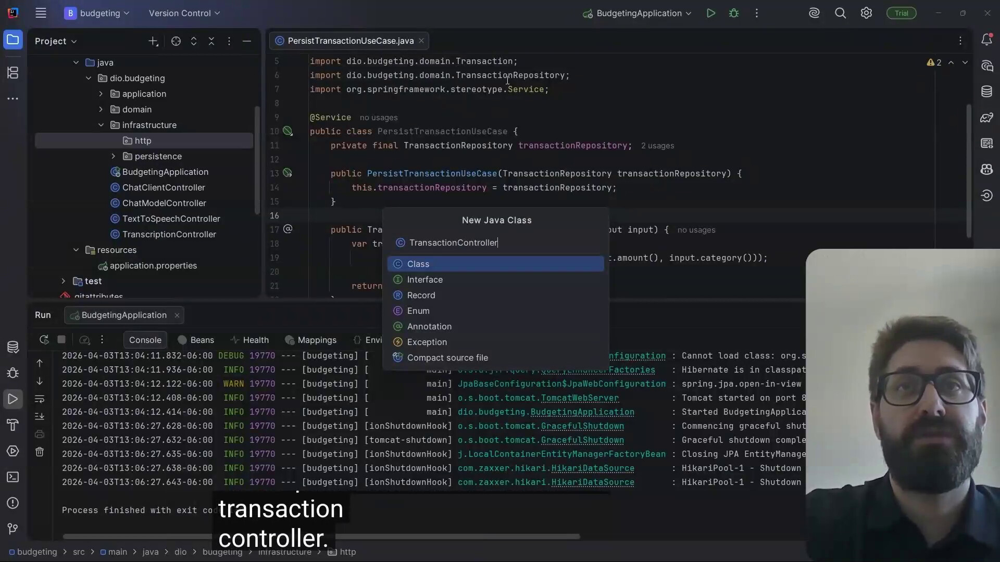
</p>

Dentro do novo pacote `http`, é criada a classe `TransactionController`, que será o ponto de entrada HTTP para as operações de transação.

#### Anotando o controller e injetando o use case

<p align="center">
  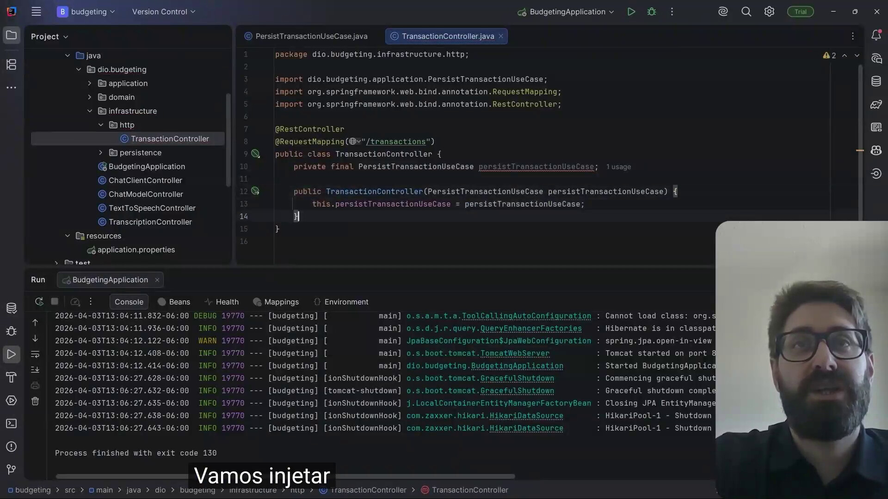
</p>

A classe é anotada com `@RestController` e `@RequestMapping("/transactions")`, definindo a URL base do recurso. Em seguida, o `PersistTransactionUseCase` criado anteriormente é declarado como dependência final e injetado via construtor.

```java
@RestController
@RequestMapping("/transactions")
public class TransactionController {
    private final PersistTransactionUseCase persistTransactionUseCase;

    public TransactionController(PersistTransactionUseCase persistTransactionUseCase) {
        this.persistTransactionUseCase = persistTransactionUseCase;
    }
}
```

#### Criando o endpoint POST e o pacote de requests

<p align="center">
  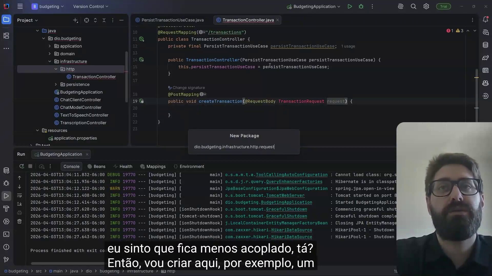
</p>

É criado o método `createTransaction`, mapeado com `@PostMapping` na raiz do recurso. Ele recebe um `@RequestBody` do tipo `TransactionRequest`, que ainda não existe. Para evitar acoplar o controller diretamente ao objeto de entrada do use case, é criado um novo pacote `request`, destinado a abrigar os DTOs de entrada da camada HTTP.

```java
@PostMapping
public void createTransaction(@RequestBody TransactionRequest request) {

}
```

#### Criando o TransactionRequest como record

<p align="center">
  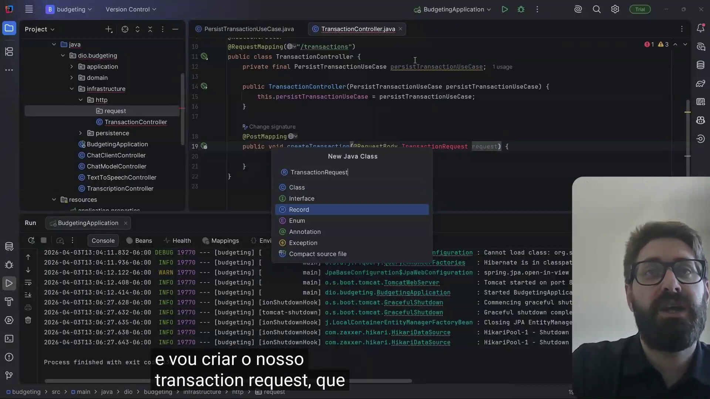
</p>

Dentro do pacote `request`, é criada a classe `TransactionRequest`, optando-se pelo tipo `Record`, adequado para representar um objeto de transferência de dados (DTO) imutável.

#### Definindo os campos do TransactionRequest

<p align="center">
  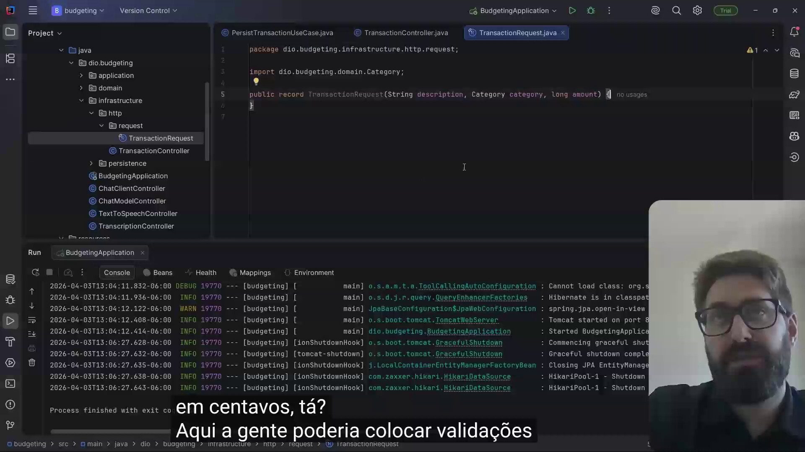
</p>

O record `TransactionRequest` é definido com os campos `description`, `category` (já mapeado diretamente para o enum `Category`) e `amount`, este último representado em centavos. É observado que, nesse ponto, também seria possível adicionar validações aos campos.

```java
public record TransactionRequest(String description, Category category, long amount) {

}
```

#### Chamando o use case a partir do request

<p align="center">
  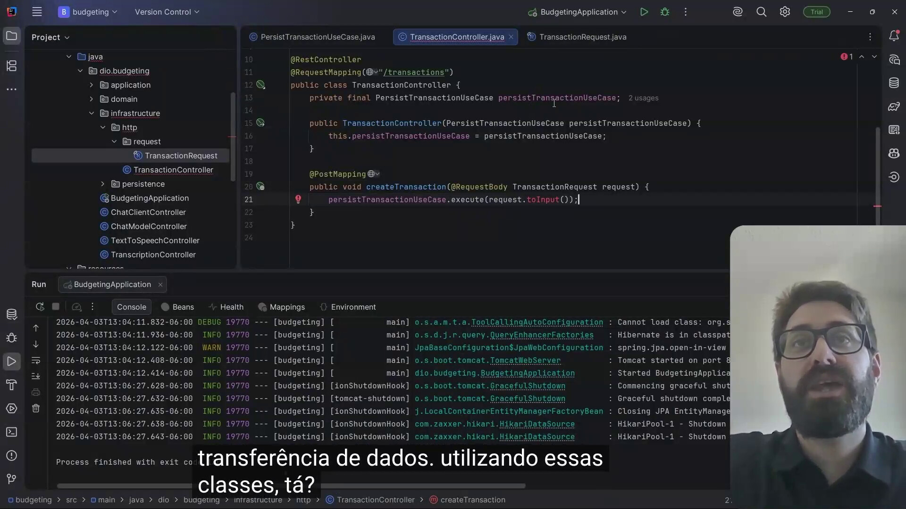
</p>

De volta ao controller, o `request` recebido é convertido para o input esperado pelo use case através de uma chamada a `request.toInput()`, método que ainda será implementado. Essa transferência de dados entre camadas por meio de objetos próprios de cada camada é uma prática de DDD que evita que mudanças no formato de entrada impactem a regra de negócio.

```java
@PostMapping
public void createTransaction(@RequestBody TransactionRequest request) {
    persistTransactionUseCase.execute(request.toInput());
}
```

#### Implementando o método toInput()

<p align="center">
  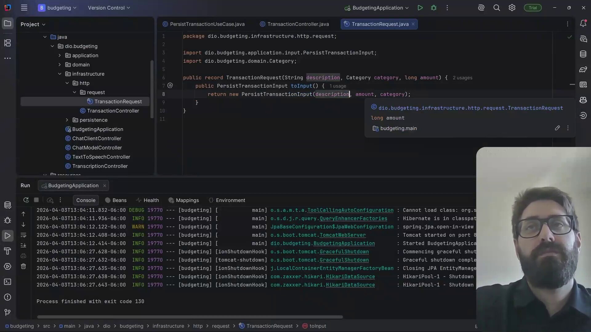
</p>

O método `toInput()` é implementado dentro do próprio `TransactionRequest`, retornando um `PersistTransactionInput` construído a partir de `description`, `amount` e `category`.

```java
public PersistTransactionInput toInput() {
    return new PersistTransactionInput(description, amount, category);
}
```

#### Guardando o resultado da execução

<p align="center">
  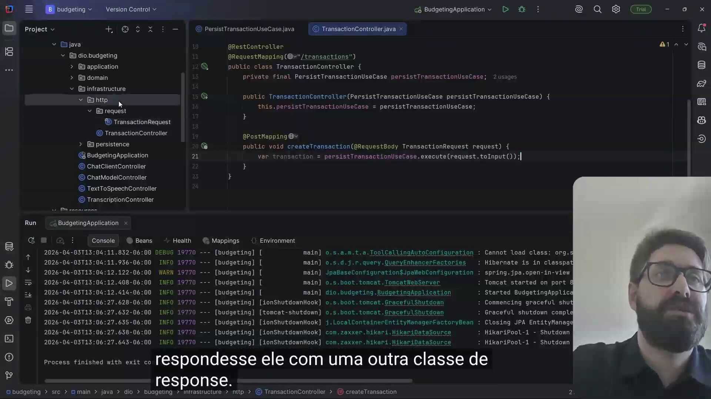
</p>

O retorno da execução do use case é guardado na variável `transaction`. A partir daqui, a ideia é que o controller também responda a requisição utilizando uma outra classe, dedicada à resposta, em vez de expor diretamente o objeto de domínio.

```java
var transaction = persistTransactionUseCase.execute(request.toInput());
```

#### Criando o pacote de responses

<p align="center">
  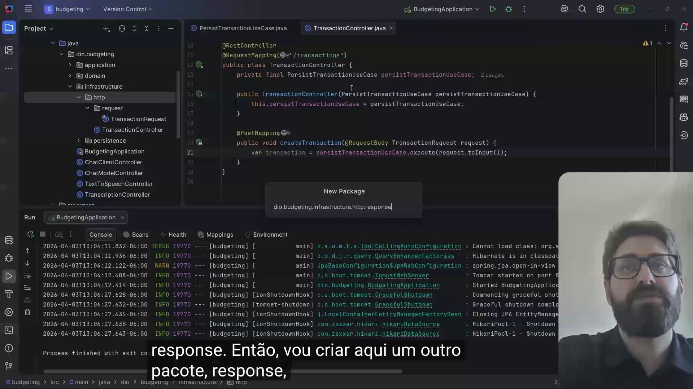
</p>

Assim como foi feito para a entrada, é criado um novo pacote, `response`, para abrigar os DTOs de saída da camada HTTP.

#### Criando o TransactionResponse

<p align="center">
  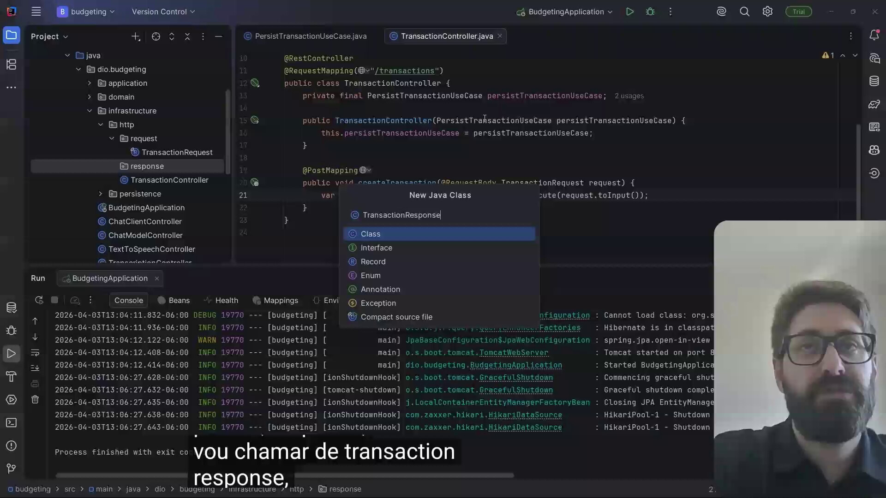
</p>

Dentro do pacote `response`, é criada a classe `TransactionResponse`, que representará os dados devolvidos ao cliente da API.

#### TransactionResponse como record

<p align="center">
  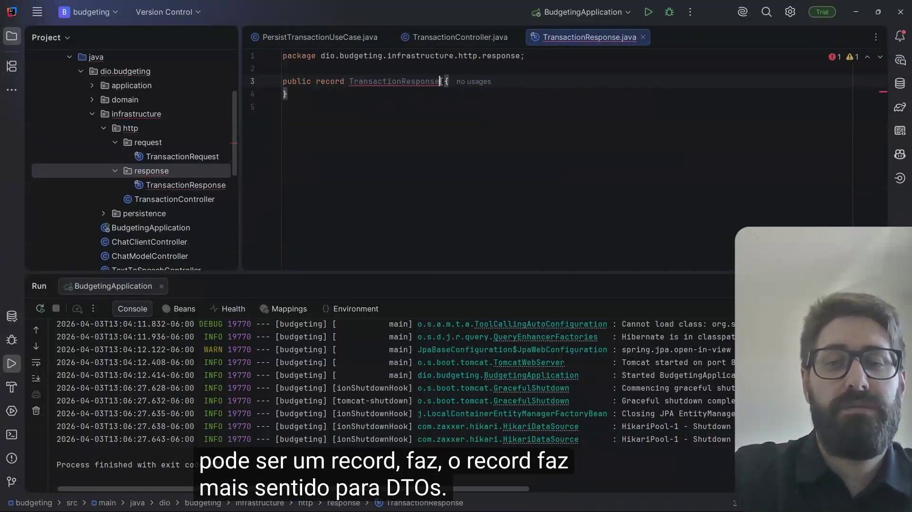
</p>

Novamente é escolhido o tipo `Record` para o `TransactionResponse`, já que records fazem mais sentido para representar DTOs.

```java
public record TransactionResponse() {

}
```

#### Convertendo a transação para TransactionResponse

<p align="center">
  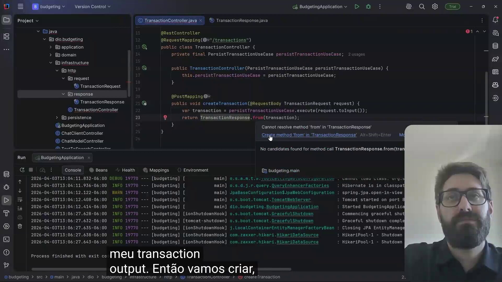
</p>

No controller, o método passa a retornar `TransactionResponse.from(transaction)`. Como esse método `from` ainda não existe na classe `TransactionResponse`, a IDE sugere criá-lo automaticamente a partir do uso.

```java
return TransactionResponse.from(transaction);
```

#### Implementando o método from()

<p align="center">
  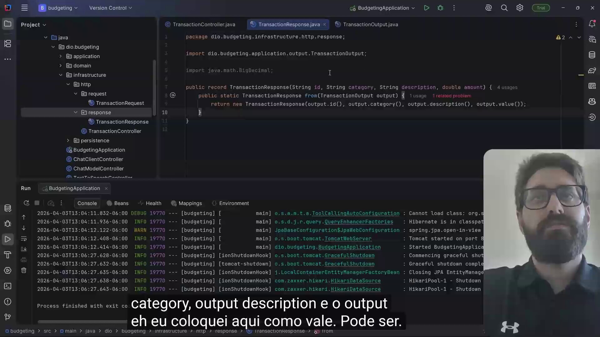
</p>

O `TransactionResponse` é definido com os campos `id`, `category`, `description` (todos como `String`) e `amount` como `double`. O método estático `from` recebe um `TransactionOutput` e monta o response a partir de `id()`, `category()`, `description()` e do valor da transação.

```java
public record TransactionResponse(String id, String category, String description, double amount) {
    public static TransactionResponse from(TransactionOutput output) {
        return new TransactionResponse(output.id(), output.category(), output.description(), output.value());
    }
}
```

#### Retornando o response com status 201

<p align="center">
  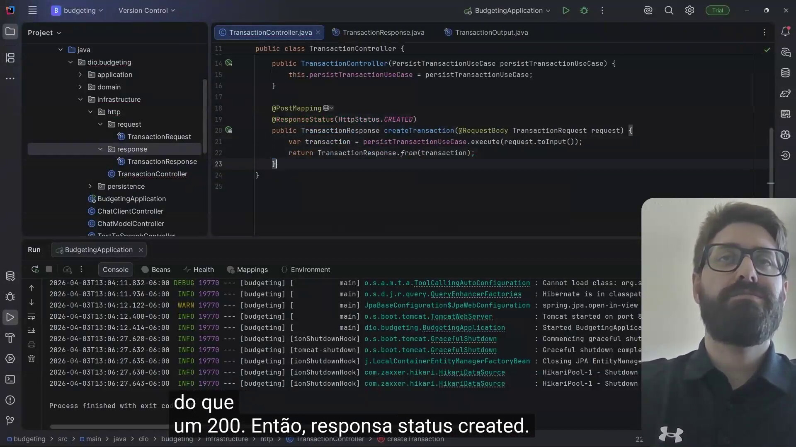
</p>

O método `createTransaction` passa a retornar o `TransactionResponse` gerado. Como se trata da criação de um novo recurso, é adicionada a anotação `@ResponseStatus(HttpStatus.CREATED)`, retornando um código HTTP 201 em vez do 200 padrão.

```java
@PostMapping
@ResponseStatus(HttpStatus.CREATED)
public TransactionResponse createTransaction(@RequestBody TransactionRequest request) {
    var transaction = persistTransactionUseCase.execute(request.toInput());
    return TransactionResponse.from(transaction);
}
```

#### Subindo a aplicação para testar

<p align="center">
  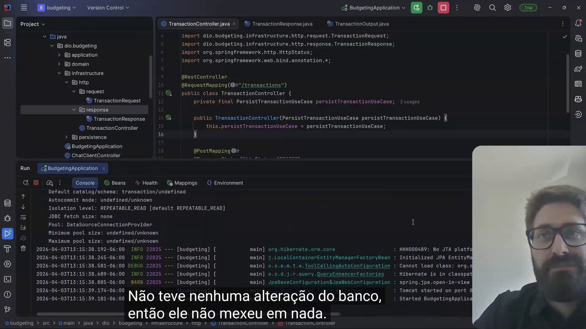
</p>

Com o endpoint implementado, a aplicação Spring Boot é reiniciada. Como não houve nenhuma alteração no schema do banco de dados, a subida ocorre sem migrações adicionais.

#### Testando o endpoint de criação

<p align="center">
  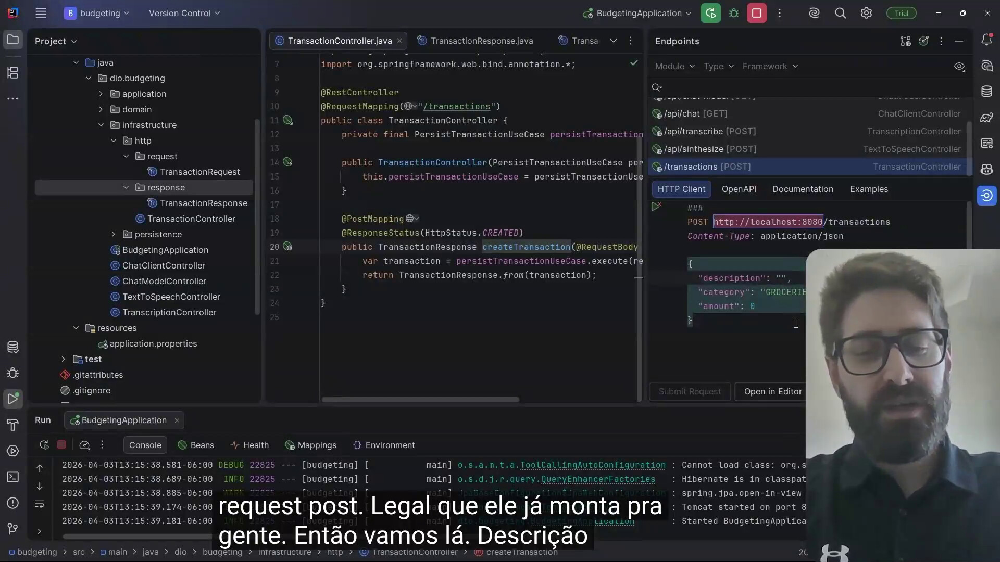
</p>

No painel de Endpoints da IDE, é localizado o endpoint `POST /transactions`, que já vem com um corpo de requisição de exemplo pronto para ser preenchido, contendo `description`, `category` e `amount`.

#### Verificando a resposta da requisição

<p align="center">
  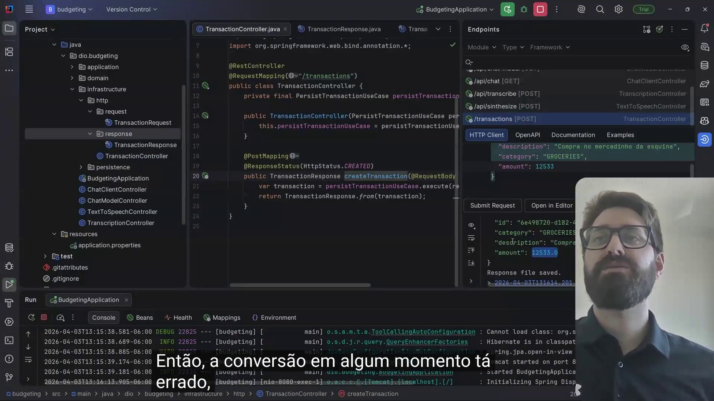
</p>

Após preencher a requisição com uma descrição, a categoria `GROCERIES` e o valor de 12533 centavos, o request é enviado. A resposta retorna os dados persistidos, porém o campo `amount` volta como `12533.0`, evidenciando que a conversão de centavos para valor monetário ainda não está correta — um ajuste a ser feito posteriormente.

#### Confirmando a persistência no banco de dados

<p align="center">
  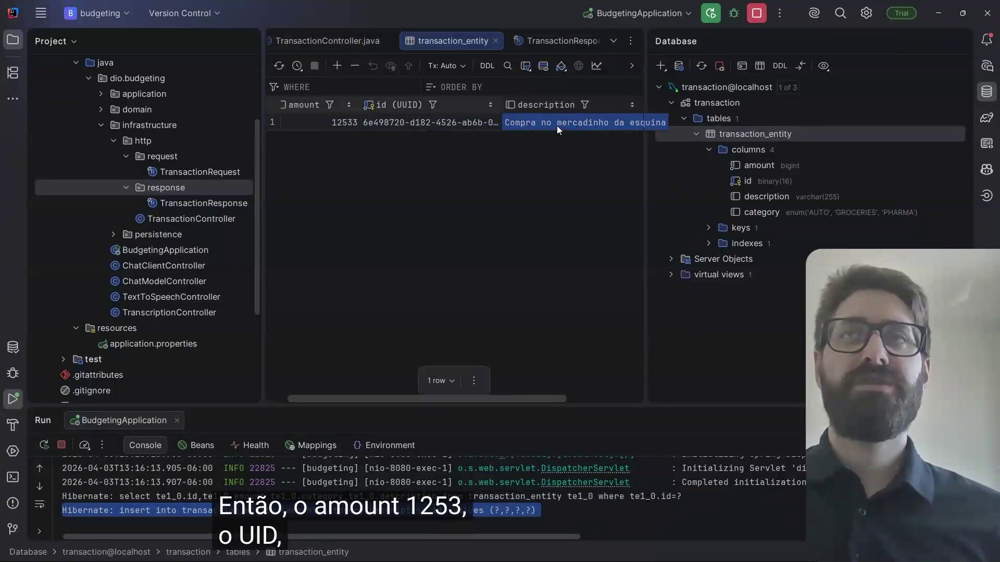
</p>

Para validar que a transação foi realmente salva, é feita uma consulta na tabela `transaction_entity`, confirmando o registro com o `amount`, o `id` em UUID, a `description` e a `category` correspondentes ao que foi enviado na requisição.

#### Criando o ListTransactionsByCategoryUseCase

<p align="center">
  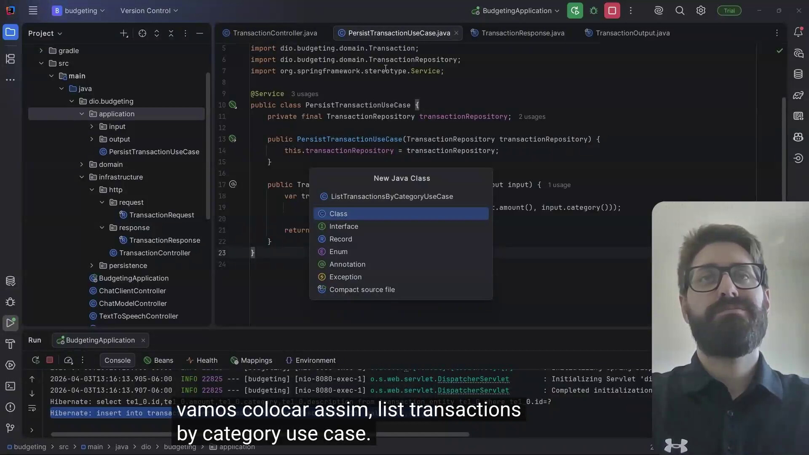
</p>

Avançando para a listagem de transações, é criado um novo use case, `ListTransactionsByCategoryUseCase`, seguindo o mesmo padrão dos use cases anteriores.

#### Implementando a listagem por categoria

<p align="center">
  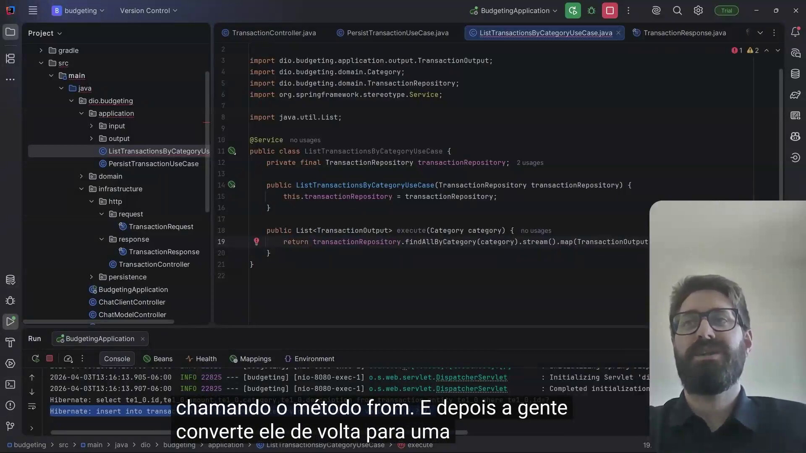
</p>

O novo use case é anotado com `@Service` e recebe o `TransactionRepository` por injeção de construtor. O método `execute`, seguindo o padrão adotado para use cases, recebe uma `Category` e retorna uma lista de `TransactionOutput`, obtida ao buscar todas as transações da categoria no repositório, convertê-las através do método `from` e transformá-las em lista.

```java
@Service
public class ListTransactionsByCategoryUseCase {
    private final TransactionRepository transactionRepository;

    public ListTransactionsByCategoryUseCase(TransactionRepository transactionRepository) {
        this.transactionRepository = transactionRepository;
    }

    public List<TransactionOutput> execute(Category category) {
        return transactionRepository.findAllByCategory(category).stream()
                .map(TransactionOutput::from)
                .toList();
    }
}
```

#### Preparando o controller para a listagem

<p align="center">
  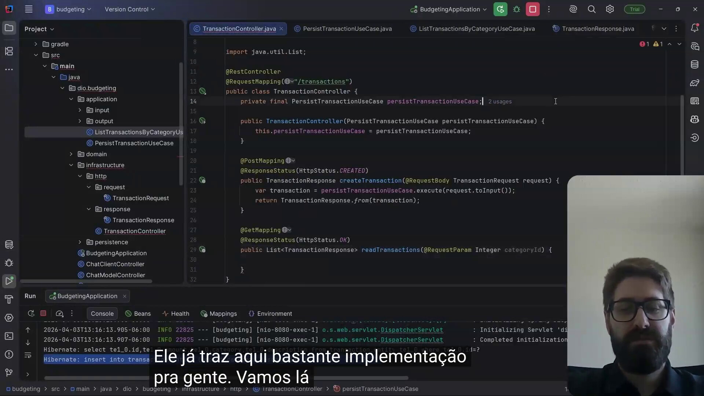
</p>

De volta ao `TransactionController`, a IDE já sugere automaticamente a assinatura de um novo endpoint de leitura, com `@GetMapping` e um parâmetro `categoryId`, que serve de ponto de partida para o próximo ajuste.

```java
@GetMapping
@ResponseStatus(HttpStatus.OK)
public List<TransactionResponse> readTransactions(@RequestParam Integer categoryId) {

}
```

#### Injetando o ListTransactionsByCategoryUseCase

<p align="center">
  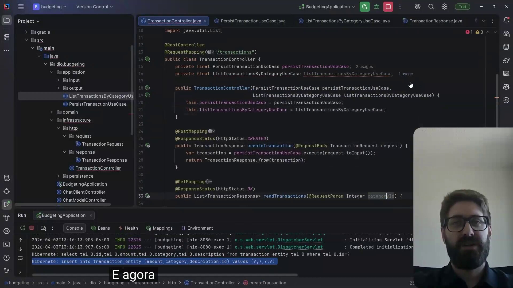
</p>

O `ListTransactionsByCategoryUseCase` é declarado como novo campo `final` no controller e passa a ser injetado no construtor, ao lado do `PersistTransactionUseCase` já existente.

```java
private final PersistTransactionUseCase persistTransactionUseCase;
private final ListTransactionsByCategoryUseCase listTransactionsByCategoryUseCase;

public TransactionController(PersistTransactionUseCase persistTransactionUseCase,
                              ListTransactionsByCategoryUseCase listTransactionsByCategoryUseCase) {
    this.persistTransactionUseCase = persistTransactionUseCase;
    this.listTransactionsByCategoryUseCase = listTransactionsByCategoryUseCase;
}
```

#### Definindo o endpoint por categoria via path variable

<p align="center">
  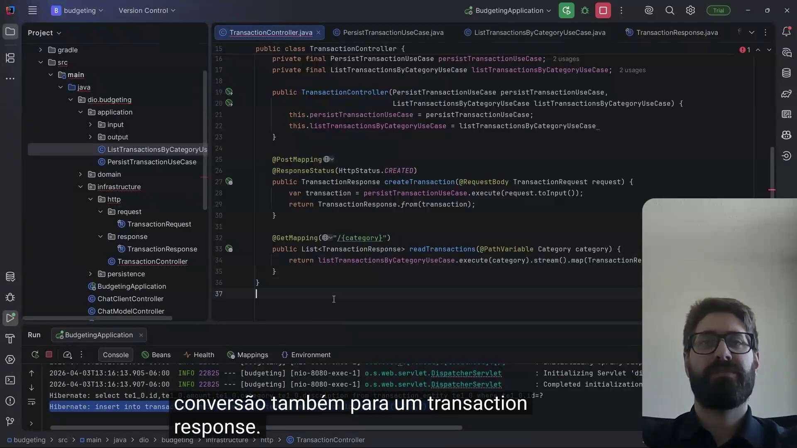
</p>

O endpoint é ajustado para receber a categoria diretamente na URL, através de `@GetMapping("/{category}")` e `@PathVariable Category category`. O Spring Boot converte automaticamente o valor recebido na URL para a entidade `Category`. Dentro do método, o use case é executado e o resultado é convertido em stream para ser mapeado para `TransactionResponse`.

```java
@GetMapping("/{category}")
public List<TransactionResponse> readTransactions(@PathVariable Category category) {
    return listTransactionsByCategoryUseCase.execute(category).stream()
            .map(TransactionResponse::from)
            .toList();
}
```

#### Subindo a aplicação novamente para testar a listagem

<p align="center">
  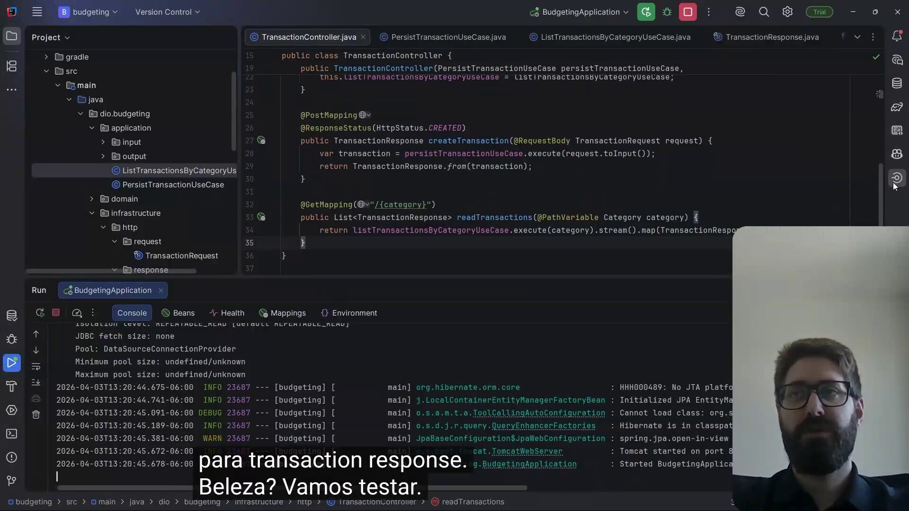
</p>

Com o novo endpoint pronto, a aplicação é reiniciada para que o endpoint de listagem por categoria fique disponível para teste.

#### Testando a listagem com categoria inexistente

<p align="center">
  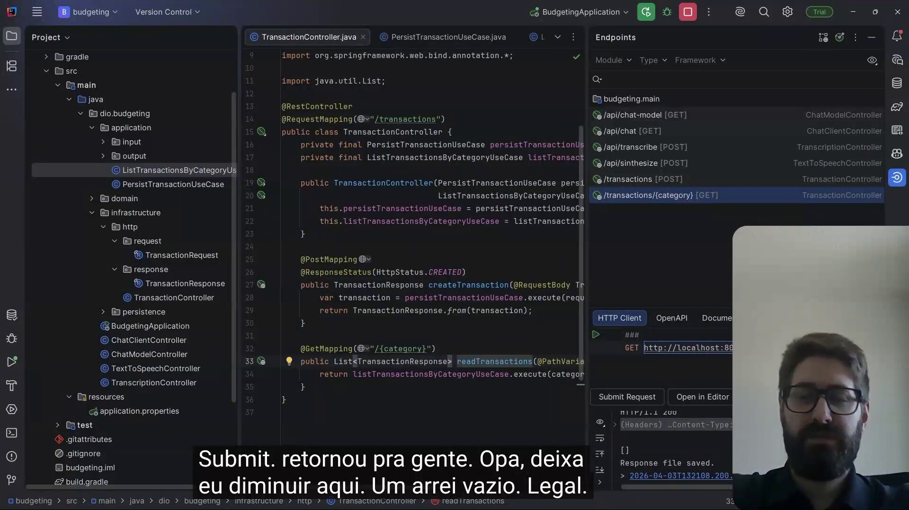
</p>

No painel de Endpoints, é localizado o novo endpoint `GET /transactions/{category}`. No primeiro teste, utilizando um valor de categoria que não corresponde a nenhuma transação salva, a resposta retorna um array vazio, confirmando que o filtro está funcionando.

#### Testando a listagem com a categoria GROCERIES

<p align="center">
  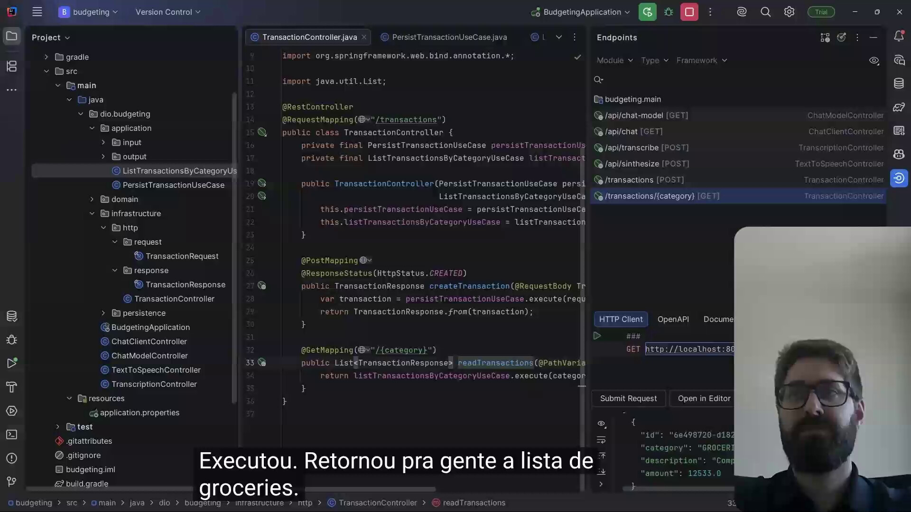
</p>

Ao repetir o teste utilizando a categoria `GROCERIES`, a API retorna a lista contendo a transação criada anteriormente, confirmando que tanto a criação quanto a listagem de transações por categoria estão funcionando corretamente.

#### Material de Apoio Até Esta Etapa

- Arquivos do projeto nesta etapa: [budgeting_ate_o_video10.zip](./000-Midia_e_Anexos/etapas_do_codigo/budgeting_ate_o_video10.zip)
- [009-Tutorial_Budgeting_Spring_AI_Video10.md](./009-Tutorial_Budgeting_Spring_AI_Video10.md)


### 🟩 Vídeo 11 - Endpoint de Transcrição: Integrando Áudio ao Controller

<video width="60%" controls>
  <source src="000-Midia_e_Anexos/bootcamp_ntt_data_java_spring_ai-modulo.04-curso.05-video_11.webm" type="video/webm">
    Seu navegador não suporta vídeo HTML5.
</video>

link do vídeo: https://web.dio.me/lab/desenvolvendo-sua-api-inteligente-com-reconhecimento-de-fala-e-spring-boot-1/learning/cffe330b-6114-43cf-8b7d-f79869400c6c?back=/track/ntt-data-2026-ai-java-back-end

### Anotações

<p align="center">
  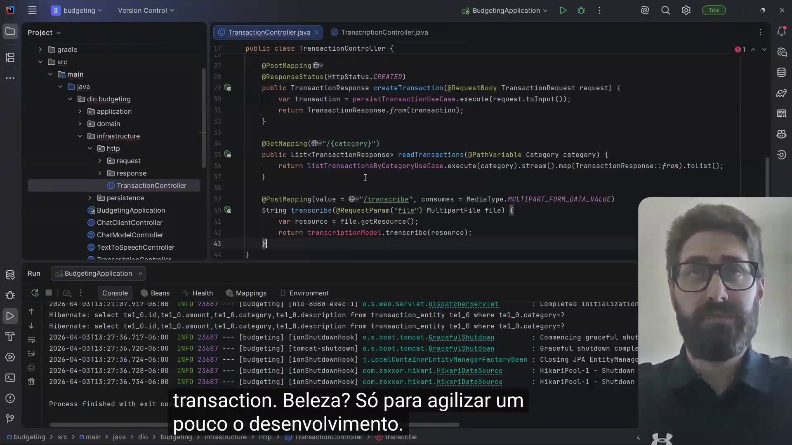
</p>

**O que a imagem mostra:** dentro do `TransactionController`, é criado um novo endpoint `/transcribe`, reaproveitando a mesma lógica já usada no `TranscriptionController` para agilizar o desenvolvimento. O método recebe um arquivo via `multipart/form-data` e delega a transcrição ao `transcriptionModel`.

```java
@PostMapping(value = "/transcribe", consumes = MediaType.MULTIPART_FORM_DATA_VALUE)
String transcribe(@RequestParam("file") MultipartFile file) {
    var resource = file.getResource();
    return transcriptionModel.transcribe(resource);
}
```

<p align="center">
  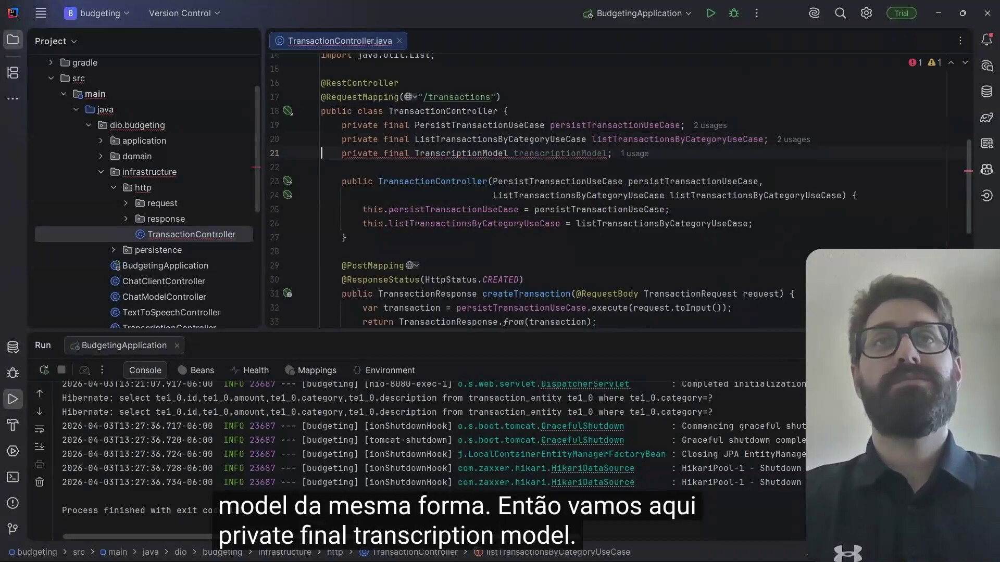
</p>

**O que a imagem mostra:** o `TransactionController` passa a declarar a dependência `TranscriptionModel`, que será injetada via construtor, da mesma forma como já era feita no controller de transcrição usado como base.

```java
private final TranscriptionModel transcriptionModel;
```

<p align="center">
  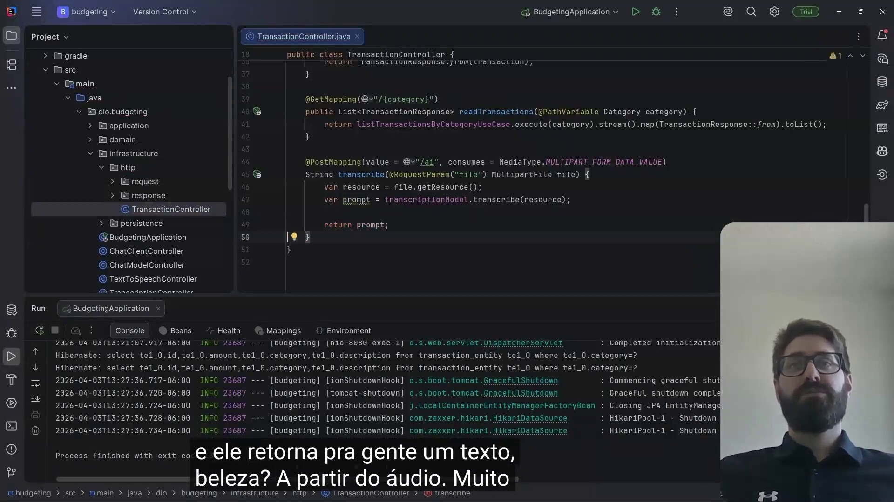
</p>

**O que a imagem mostra:** o endpoint é renomeado de `/transcribe` para `/ai` e o texto retornado pela transcrição do áudio é atribuído a uma variável (`prompt`), representando o resultado do passo "áudio para texto" do fluxo.

```java
@PostMapping(value = "/ai", consumes = MediaType.MULTIPART_FORM_DATA_VALUE)
String transcribe(@RequestParam("file") MultipartFile file) {
    var resource = file.getResource();
    var prompt = transcriptionModel.transcribe(resource);
    return prompt;
}
```

<p align="center">
  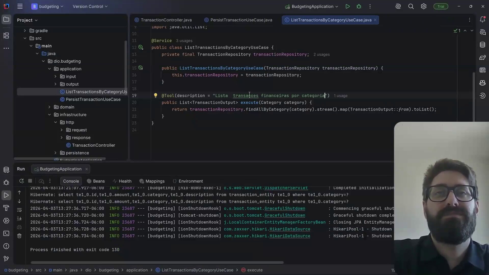
</p>

**O que a imagem mostra:** o método `execute` de `ListTransactionsByCategoryUseCase` é anotado com `@Tool`, transformando esse use case em uma ferramenta que poderá ser chamada pelo modelo de IA, com uma descrição explicando sua finalidade.

```java
@Tool(description = "Lista transasões financeiras por categoria")
public List<TransactionOutput> execute(Category category) {
    return transactionRepository.findAllByCategory(category).stream().map(TransactionOutput::from).toList();
}
```

<p align="center">
  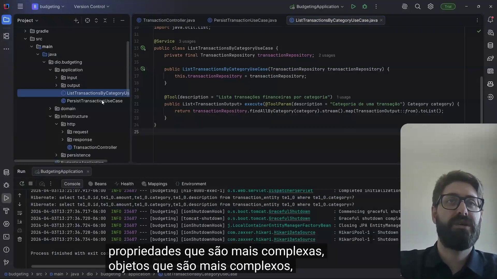
</p>

**O que a imagem mostra:** o parâmetro do método também recebe uma anotação `@ToolParam` com uma descrição própria, dando mais contexto ao modelo sobre o significado de cada argumento da ferramenta — recurso especialmente útil quando os parâmetros são objetos mais complexos.

```java
public List<TransactionOutput> execute(@ToolParam(description = "Categoria de uma transação") Category category) {
    ...
}
```

<p align="center">
  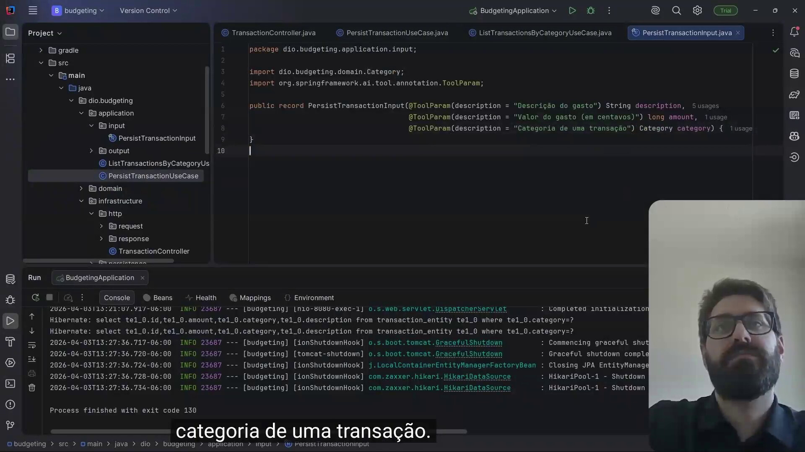
</p>

**O que a imagem mostra:** o record `PersistTransactionInput`, usado como entrada da ferramenta de persistência, recebe anotações `@ToolParam` em cada um de seus campos, descrevendo a descrição do gasto, o valor em centavos e a categoria da transação.

```java
public record PersistTransactionInput(
    @ToolParam(description = "Descrição do gasto") String description,
    @ToolParam(description = "Valor do gasto (em centavos)") long amount,
    @ToolParam(description = "Categoria de uma transação") Category category) {
}
```

<p align="center">
  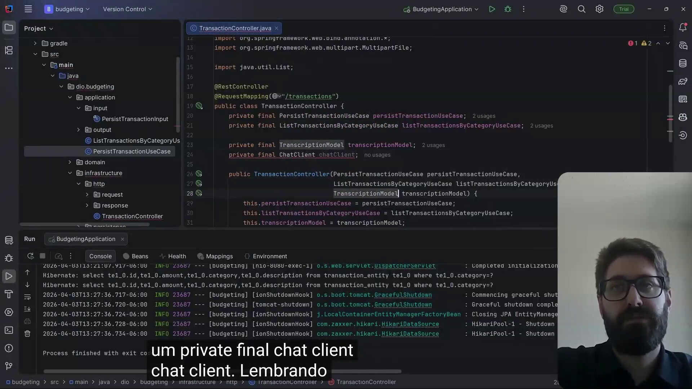
</p>

**O que a imagem mostra:** um novo campo `ChatClient chatClient` é declarado no `TransactionController`. Ele será responsável por orquestrar a chamada ao modelo de linguagem, usando as ferramentas já anotadas anteriormente.

```java
private final ChatClient chatClient;
```

<p align="center">
  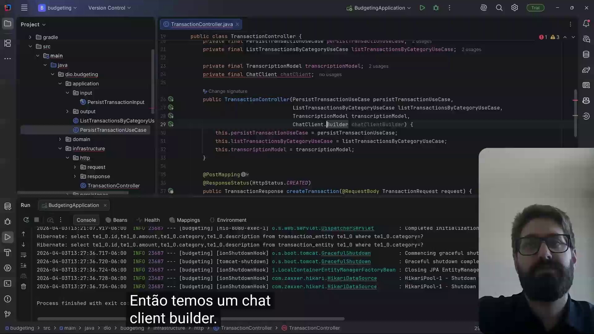
</p>

**O que a imagem mostra:** a assinatura do construtor do `TransactionController` é alterada para receber um `ChatClient.Builder`, mecanismo usado para configurar e, em seguida, instanciar o `ChatClient`.

<p align="center">
  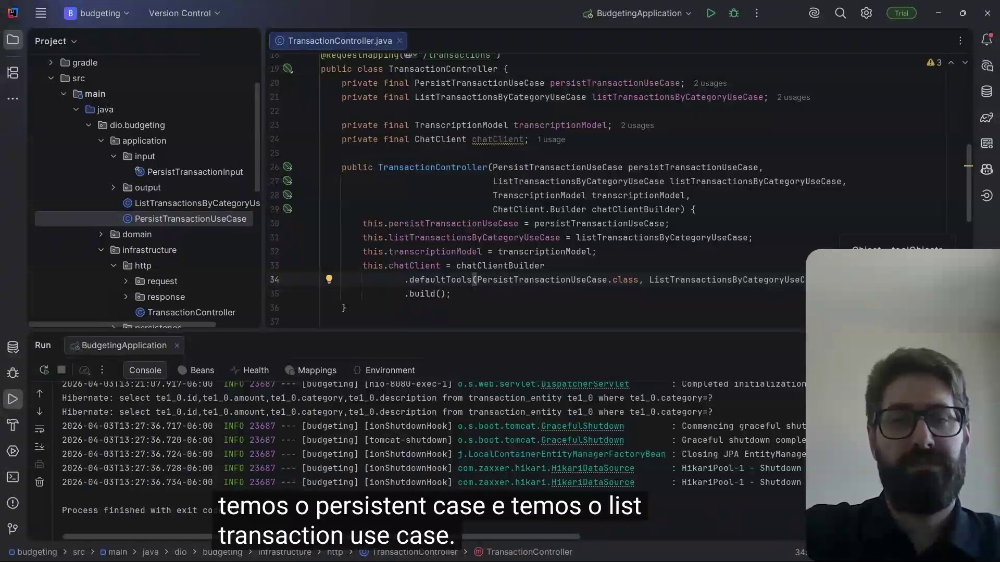
</p>

**O que a imagem mostra:** no corpo do construtor, o `chatClient` é montado a partir do builder, registrando as ferramentas disponíveis (`PersistTransactionUseCase` e `ListTransactionsByCategoryUseCase`) através de `defaultTools`.

```java
this.chatClient = chatClientBuilder
        .defaultTools(PersistTransactionUseCase.class, ListTransactionsByCategoryUseCase.class)
        .build();
```

<p align="center">
  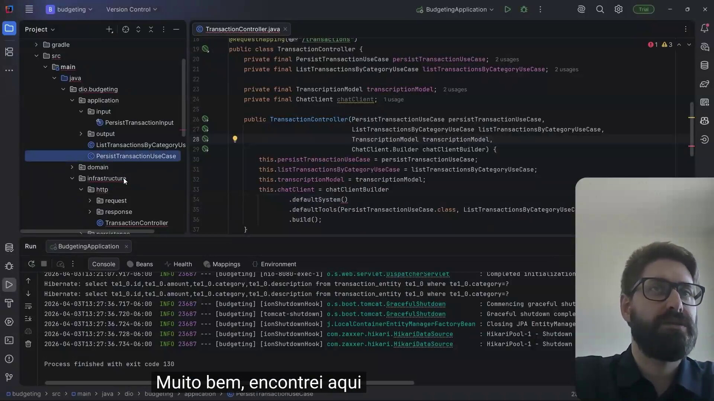
</p>

**O que a imagem mostra:** a mesma configuração do `chatClient` é revisada, com o arquivo `PersistTransactionUseCase` aberto na árvore do projeto para conferir a ferramenta que acabou de ser registrada.

<p align="center">
  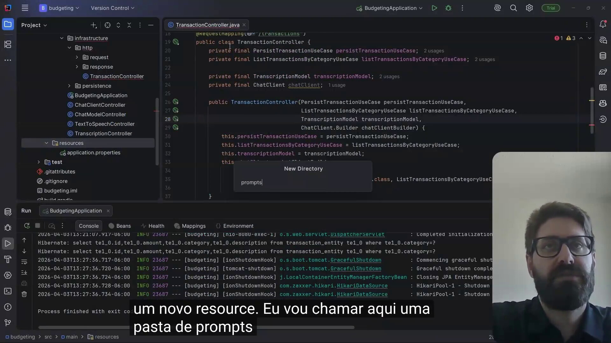
</p>

**O que a imagem mostra:** é criada uma nova pasta de recursos chamada `prompts`, dentro de `resources`, destinada a armazenar o texto do system prompt que dará contexto ao modelo de IA.

<p align="center">
  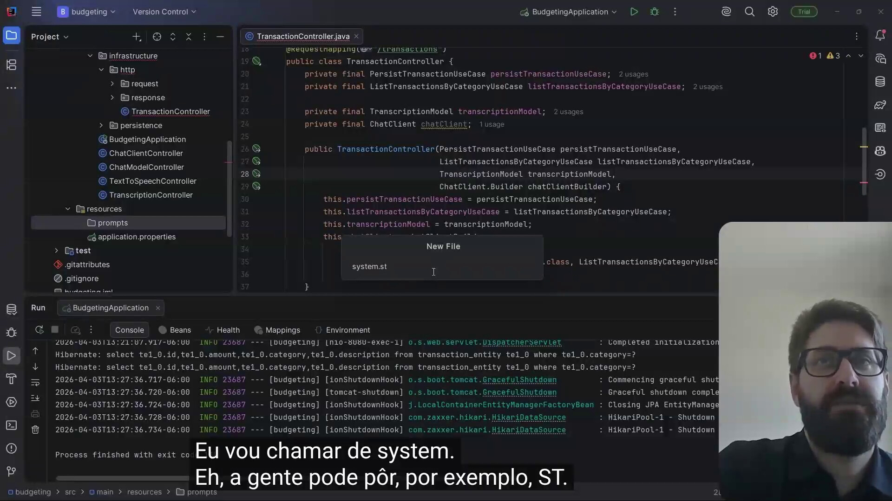
</p>

**O que a imagem mostra:** dentro da pasta `prompts`, é criado o arquivo `system.st`, usando a extensão do StringTemplate (ST), uma forma de trabalhar com templates de texto/contexto.

<p align="center">
  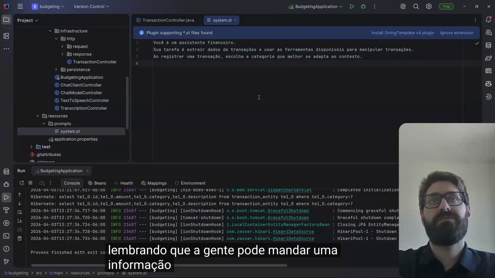
</p>

**O que a imagem mostra:** o conteúdo do system prompt é escrito no arquivo, definindo o papel do assistente como um assistente financeiro, responsável por extrair dados de transações e usar as ferramentas disponíveis, escolhendo a categoria mais adequada ao contexto.

```
Você é um assistente financeiro.
Sua tarefa é extrair dados de transações e usar as ferramentas disponíveis para manipular transações.
Ao registrar uma transação, escolha a categoria que melhor se adapta ao contexto.
```

<p align="center">
  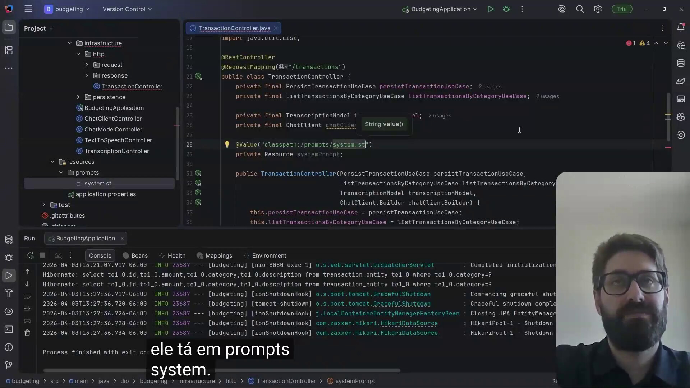
</p>

**O que a imagem mostra:** o `TransactionController` passa a carregar esse arquivo como um `Resource`, usando a anotação `@Value("classpath:/prompts/system.st")` para injetar o conteúdo do prompt em um campo `systemPrompt`.

```java
@Value("classpath:/prompts/system.st")
private Resource systemPrompt;
```

<p align="center">
  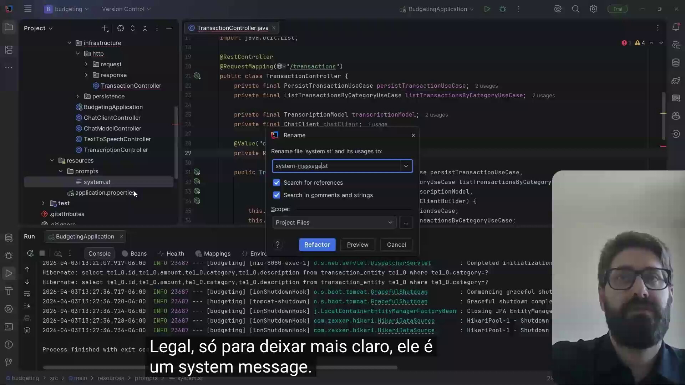
</p>

**O que a imagem mostra:** o arquivo é renomeado de `system.st` para `system-message.st`, deixando mais explícito que seu conteúdo representa uma mensagem de sistema (system message) usada pelo chat.

<p align="center">
  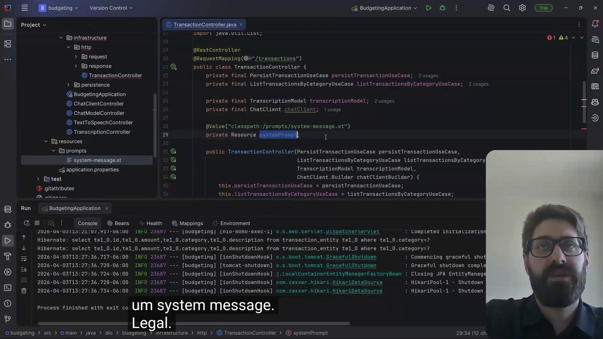
</p>

**O que a imagem mostra:** a anotação `@Value` é atualizada para refletir o novo nome do arquivo, apontando agora para `classpath:/prompts/system-message.st`.

```java
@Value("classpath:/prompts/system-message.st")
private Resource systemPrompt;
```

<p align="center">
  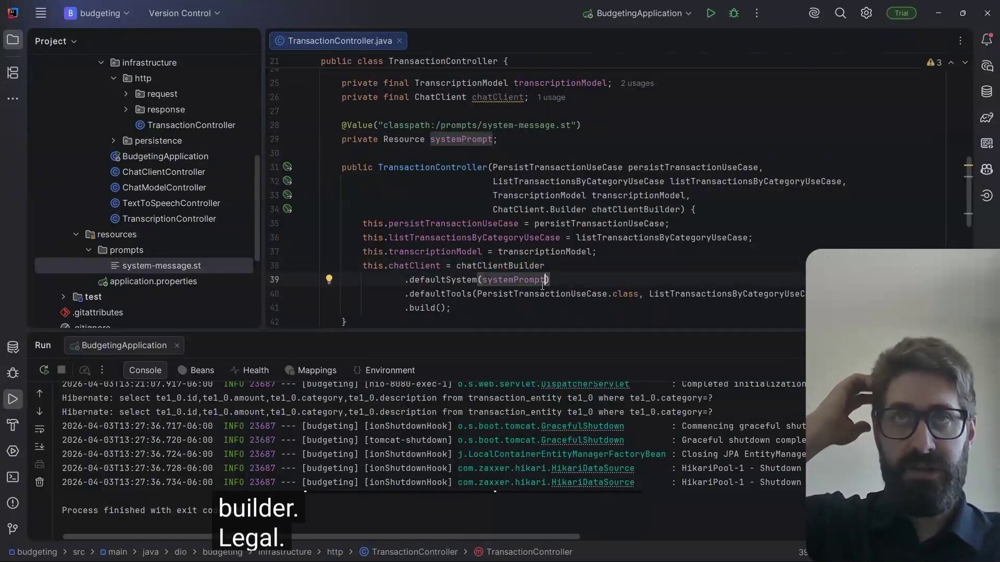
</p>

**O que a imagem mostra:** o `systemPrompt` é passado ao builder do `ChatClient` por meio do método `defaultSystem`, complementando a configuração já existente das ferramentas (`defaultTools`).

```java
this.chatClient = chatClientBuilder
        .defaultSystem(systemPrompt)
        .defaultTools(PersistTransactionUseCase.class, ListTransactionsByCategoryUseCase.class)
        .build();
```

<p align="center">
  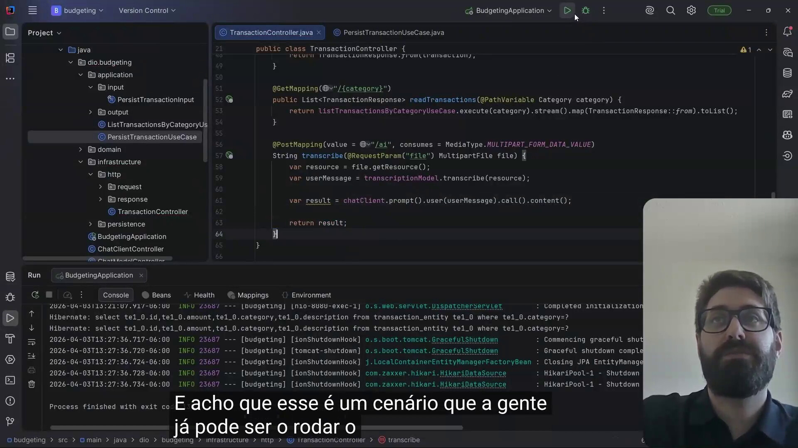
</p>

**O que a imagem mostra:** dentro do método `transcribe`, o texto obtido pela transcrição do áudio é usado como mensagem do usuário (`user message`) enviada ao `chatClient`, e o conteúdo da resposta do modelo é devolvido como resultado do endpoint.

```java
var userMessage = transcriptionModel.transcribe(resource);
var result = chatClient.prompt().user(userMessage).call().content();
return result;
```

<p align="center">
  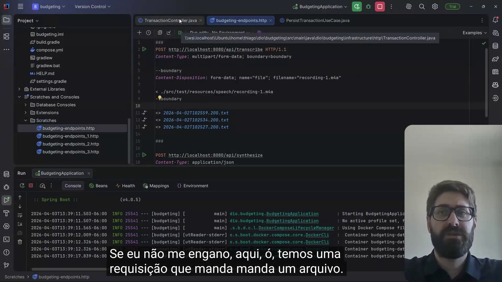
</p>

**O que a imagem mostra:** uma requisição HTTP de teste (arquivo `.http` do IntelliJ) é usada para enviar um arquivo de áudio via `multipart/form-data` ao endpoint recém-criado, permitindo validar o fluxo de ponta a ponta.

<p align="center">
  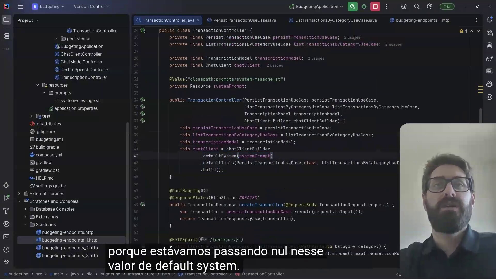
</p>

**O que a imagem mostra:** ao executar a aplicação e disparar a requisição, ocorre um erro indicando que o valor do `systemPrompt` está nulo no momento em que é passado ao `defaultSystem`. Isso acontece porque a injeção via `@Value` em campo ocorre depois da execução do construtor, e o `chatClient` está sendo montado justamente dentro dele.

<p align="center">
  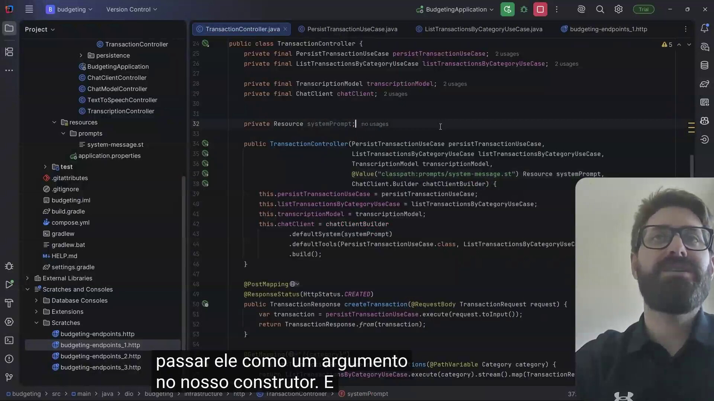
</p>

**O que a imagem mostra:** a correção do problema é feita movendo a injeção do `systemPrompt` para o construtor, passando-o como parâmetro anotado com `@Value`. Dessa forma, o valor já estará disponível no momento em que o `ChatClient` é construído.

<p align="center">
  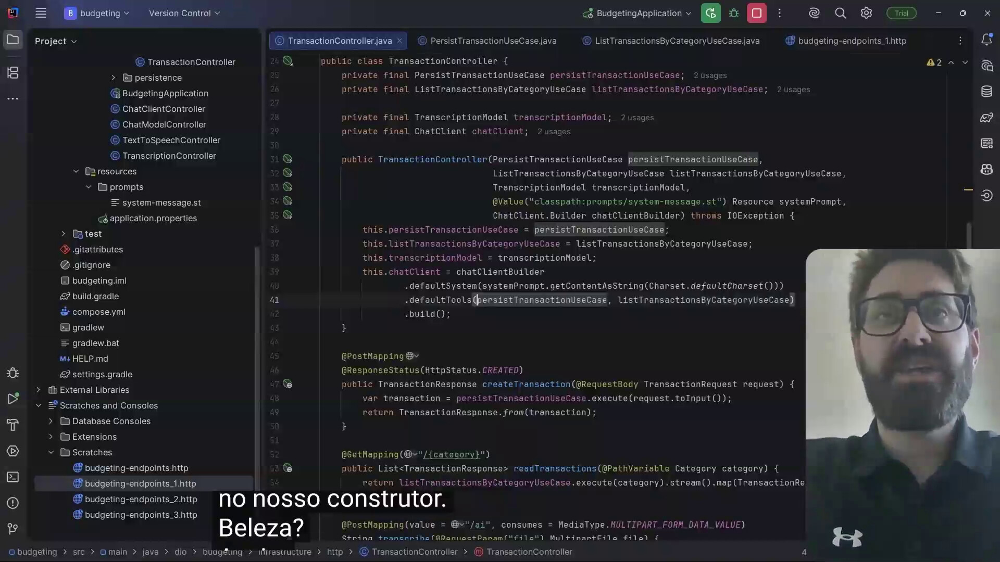
</p>

**O que a imagem mostra:** ajustes finais no construtor — o `Resource` do `systemPrompt` é convertido para `String` (via `getContentAsString`) antes de ser passado ao `defaultSystem`, e o `defaultTools` passa a receber as instâncias já injetadas (`persistTransactionUseCase`, `listTransactionsByCategoryUseCase`) em vez das classes, o que é necessário para que o construtor possa lançar `IOException`.

```java
this.chatClient = chatClientBuilder
        .defaultSystem(systemPrompt.getContentAsString(Charset.defaultCharset()))
        .defaultTools(persistTransactionUseCase, listTransactionsByCategoryUseCase)
        .build();
```

<p align="center">
  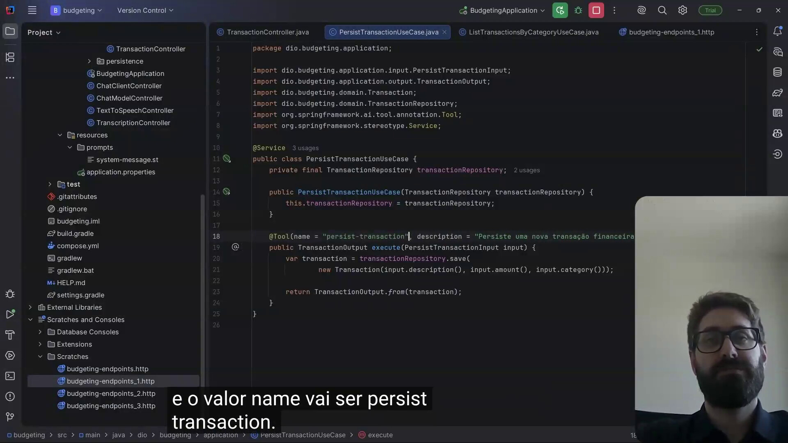
</p>

**O que a imagem mostra:** a ferramenta de persistência recebe um nome explícito através do atributo `name` da anotação `@Tool` (`"persist-transaction"`), necessário porque, por padrão, o nome da ferramenta seria o nome do método (`execute`), que é o mesmo em mais de uma classe.

```java
@Tool(name = "persist-transaction", description = "Persiste uma nova transação financeira")
public TransactionOutput execute(PersistTransactionInput input) { ... }
```

<p align="center">
  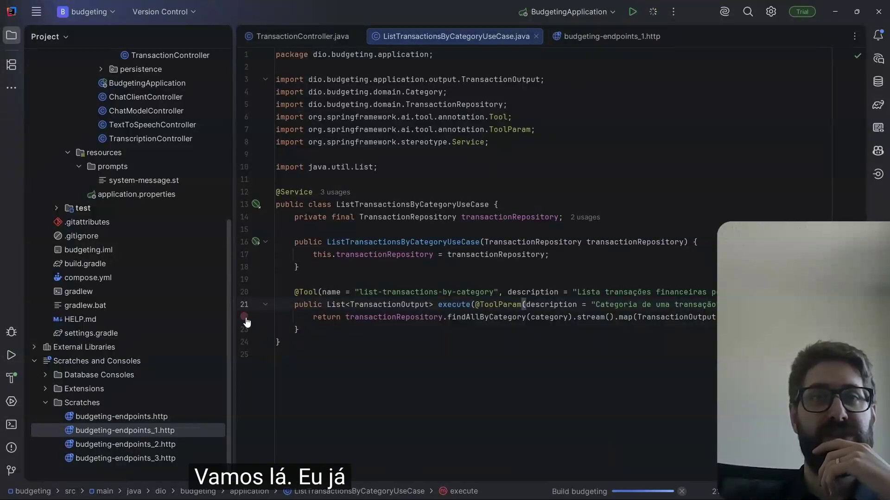
</p>

**O que a imagem mostra:** o mesmo ajuste é aplicado à ferramenta de listagem, que recebe o nome `"list-transactions-by-category"`, evitando o conflito de nomes entre as ferramentas que compartilhavam o método `execute`.

```java
@Tool(name = "list-transactions-by-category", description = "Lista transações financeiras p...")
public List<TransactionOutput> execute(@ToolParam(...) Category category) { ... }
```

<p align="center">
  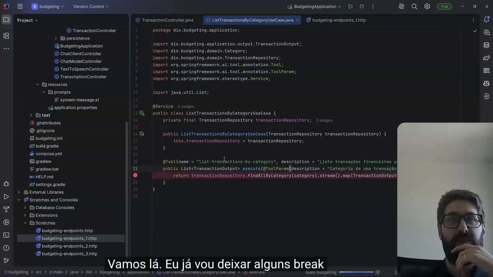
</p>

**O que a imagem mostra:** um breakpoint é adicionado na linha de retorno do método `execute` de `ListTransactionsByCategoryUseCase`, para permitir acompanhar sua execução durante o teste da aplicação.

<p align="center">
  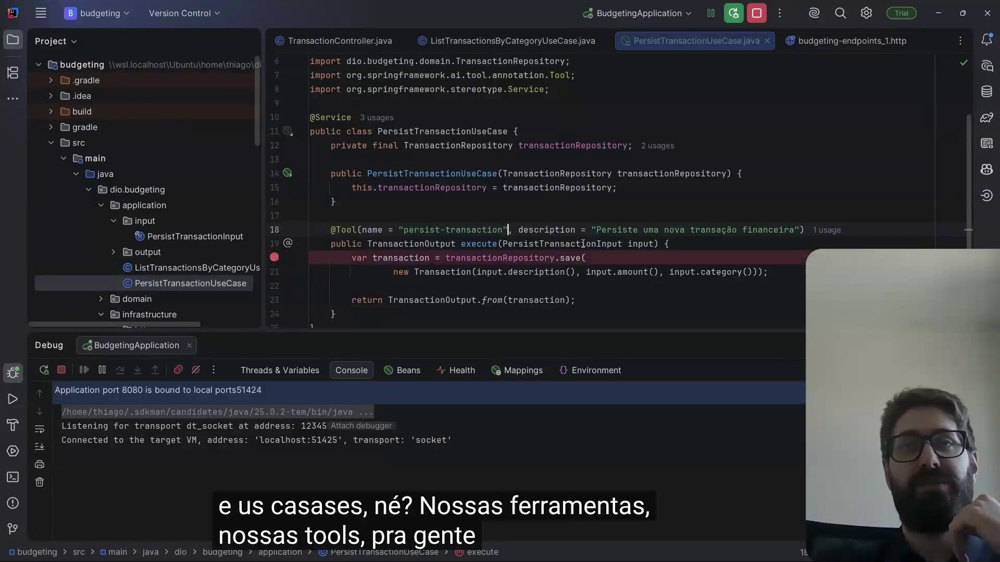
</p>

**O que a imagem mostra:** outro breakpoint é adicionado no método `execute` de `PersistTransactionUseCase`, no ponto em que a transação é persistida no repositório, com a aplicação já em execução (modo debug).

<p align="center">
  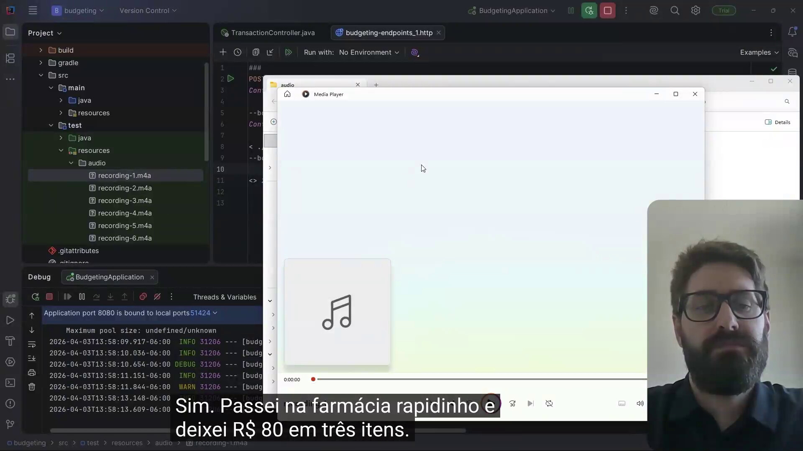
</p>

**O que a imagem mostra:** reprodução do áudio de teste usado na primeira chamada da aplicação, no qual é dito: "Passei na farmácia rapidinho e deixei R$ 80 em três itens." Esse será o áudio enviado para validar o fluxo completo.

<p align="center">
  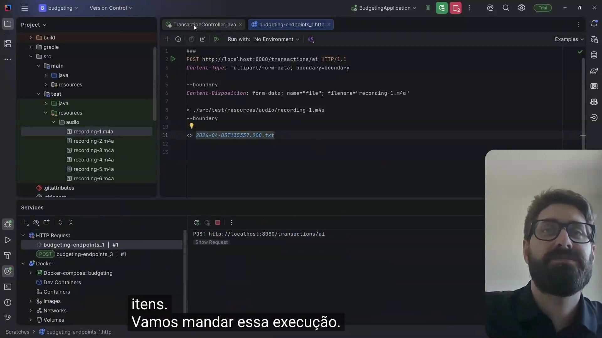
</p>

**O que a imagem mostra:** a requisição HTTP contendo esse áudio é disparada para o endpoint `/transactions/ai`, iniciando o processamento de ponta a ponta: transcrição, interpretação pelo modelo e chamada da ferramenta correspondente.

<p align="center">
  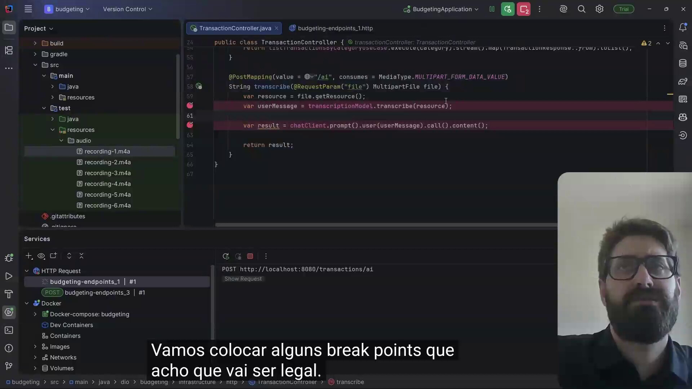
</p>

**O que a imagem mostra:** durante a execução, os breakpoints colocados no método `transcribe` do controller são atingidos, permitindo inspecionar o fluxo antes da chamada ao modelo de IA.

<p align="center">
  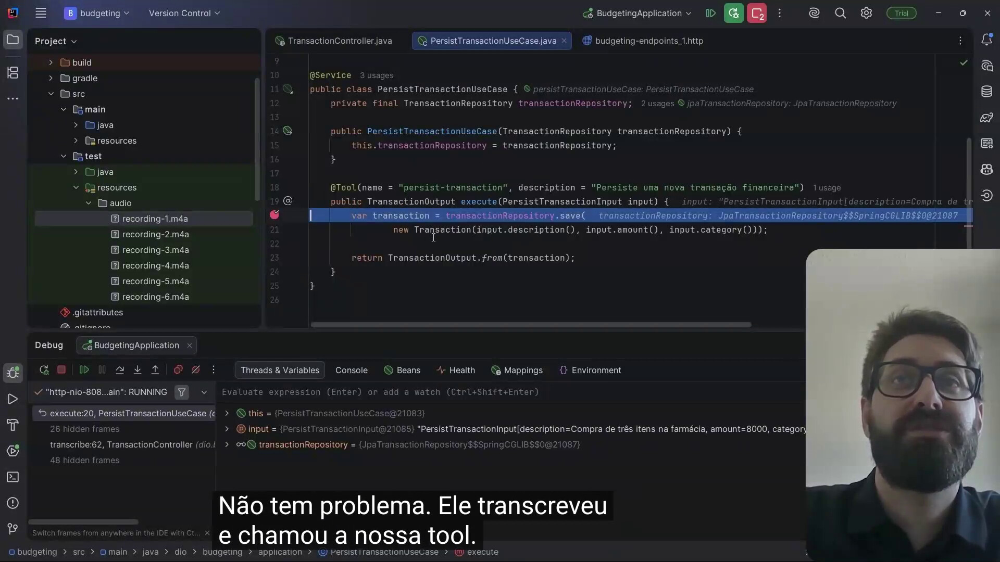
</p>

**O que a imagem mostra:** no breakpoint de `PersistTransactionUseCase`, é possível confirmar que a transcrição foi realizada e que a ferramenta de persistência foi de fato chamada, recebendo um objeto `PersistTransactionInput` já preenchido pelo modelo com os dados extraídos do áudio.

<p align="center">
  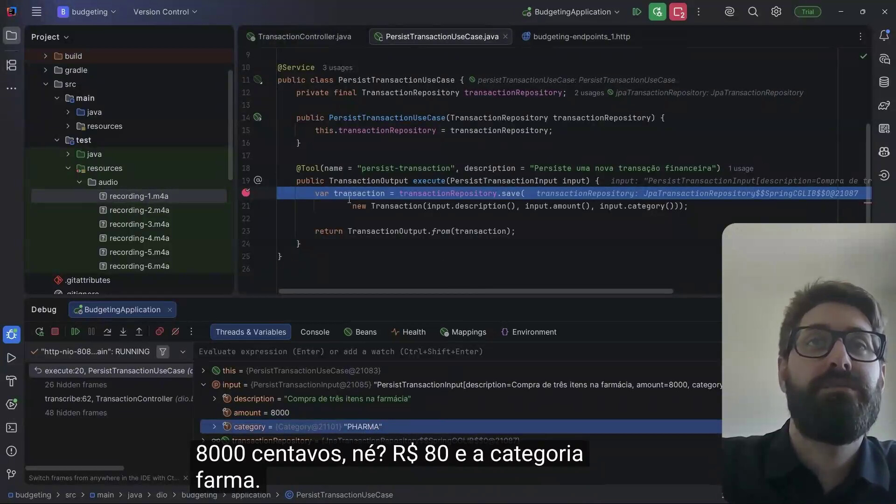
</p>

**O que a imagem mostra:** ao expandir a variável `input` no painel de debug, é possível ver os valores extraídos pelo modelo a partir da fala: descrição "Compra de três itens na farmácia", valor `8000` centavos (equivalente a R$ 80) e categoria `PHARMA`.

<p align="center">
  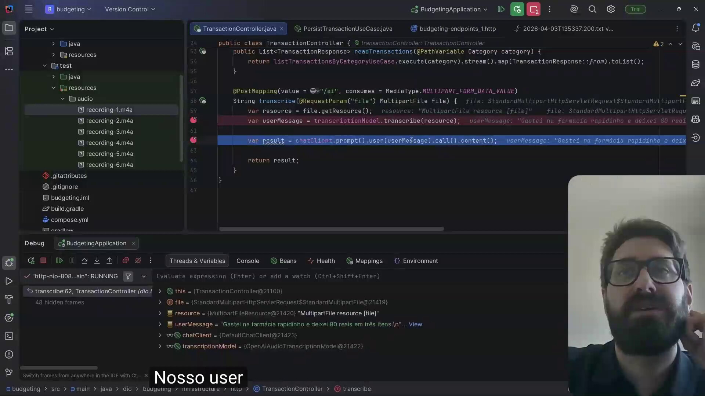
</p>

**O que a imagem mostra:** de volta ao `TransactionController`, o painel de variáveis confirma o conteúdo de `userMessage`, ou seja, o texto exatamente como foi transcrito a partir do áudio enviado.

<p align="center">
  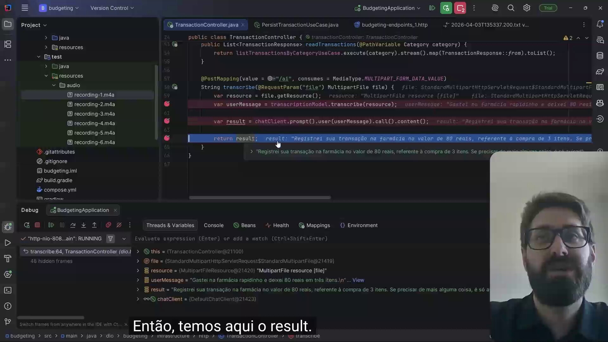
</p>

**O que a imagem mostra:** após a chamada ao `chatClient`, a variável `result` já contém a resposta final gerada pelo modelo — uma mensagem mais amigável confirmando o registro da transação, montada a partir do objeto retornado pela ferramenta.

<p align="center">
  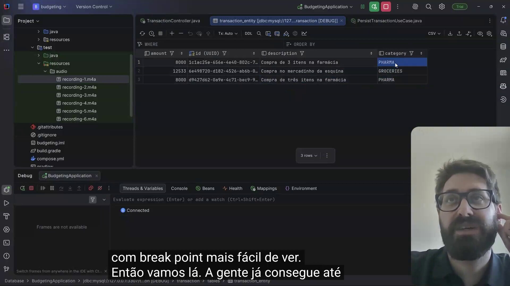
</p>

**O que a imagem mostra:** consulta à tabela `transaction_entity` no banco de dados, confirmando que a nova transação (categoria `PHARMA`) foi persistida com sucesso, somando-se aos registros anteriores já existentes na tabela.

<p align="center">
  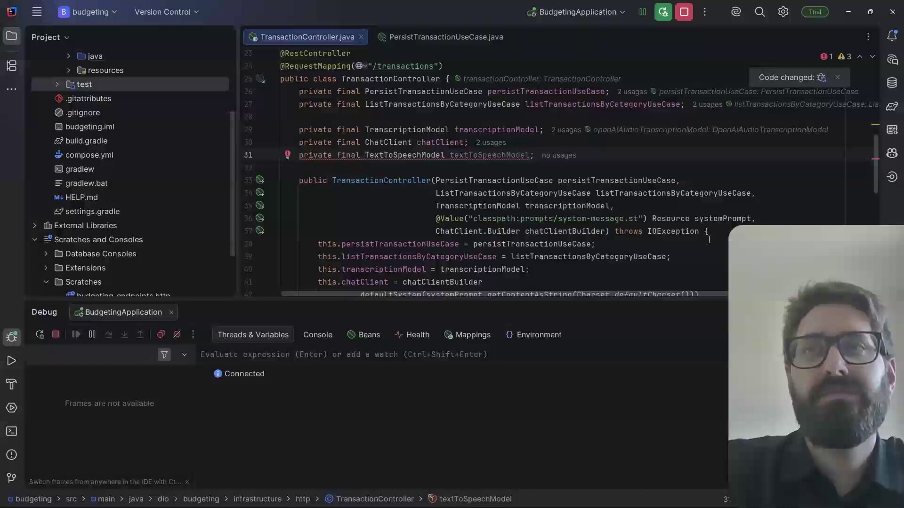
</p>

**O que a imagem mostra:** um novo campo, `TextToSpeechModel textToSpeechModel`, é declarado no `TransactionController` (ainda sem uso), como preparação para a próxima etapa: converter a resposta textual do modelo em áudio.

<p align="center">
  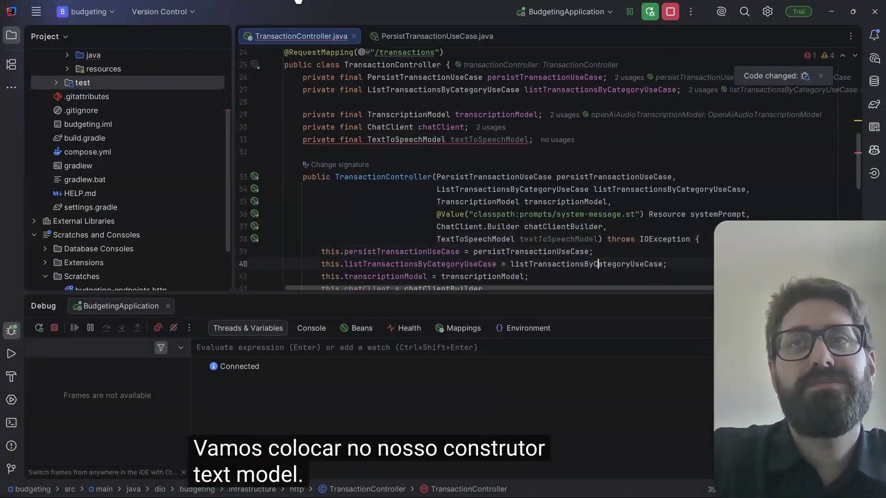
</p>

**O que a imagem mostra:** a assinatura do construtor é alterada novamente para receber essa nova dependência, `TextToSpeechModel textToSpeechModel`, seguindo o mesmo padrão de injeção via construtor usado para as demais dependências.

<p align="center">
  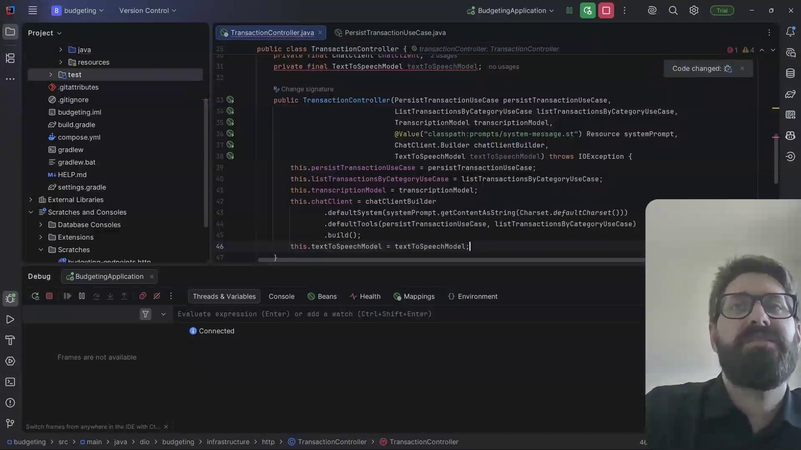
</p>

**O que a imagem mostra:** o campo `textToSpeechModel` é atribuído no corpo do construtor, completando sua injeção e disponibilizando o recurso para ser usado no método do endpoint.

```java
this.textToSpeechModel = textToSpeechModel;
```

<p align="center">
  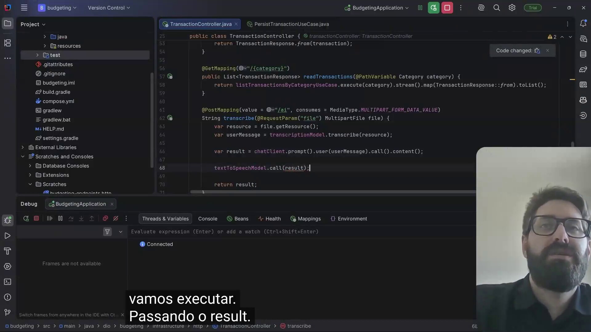
</p>

**O que a imagem mostra:** no método `transcribe`, a resposta textual (`result`) é convertida em áudio por meio de `textToSpeechModel.call(result)`, gerando um array de bytes que é encapsulado em um `ByteArrayResource` e devolvido como corpo de uma resposta HTTP com cabeçalho de anexo.

```java
byte[] audio = textToSpeechModel.call(result);
var resource = new ByteArrayResource(audio);

return ResponseEntity.ok()
        .header(HttpHeaders.CONTENT_DISPOSITION,
                ContentDisposition.attachment()
                        .filename("audio.mp3")
                        .build()
                        .toString())
        .body(resource);
```

<p align="center">
  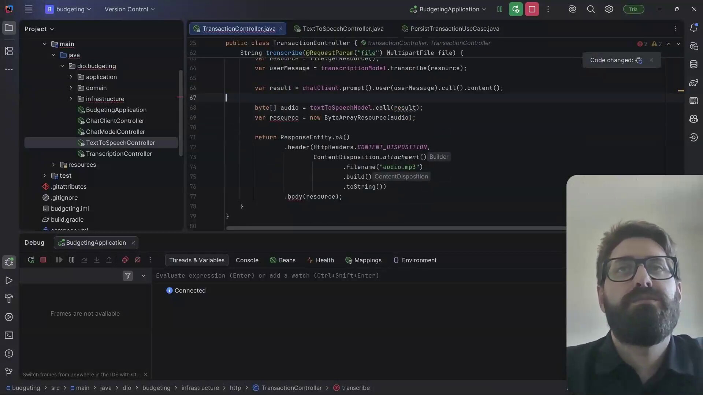
</p>

**O que a imagem mostra:** o mesmo trecho de código de montagem da resposta em áudio é conferido a partir do `TextToSpeechController`, usado como referência para reaproveitar essa configuração de resposta no `TransactionController`.

<p align="center">
  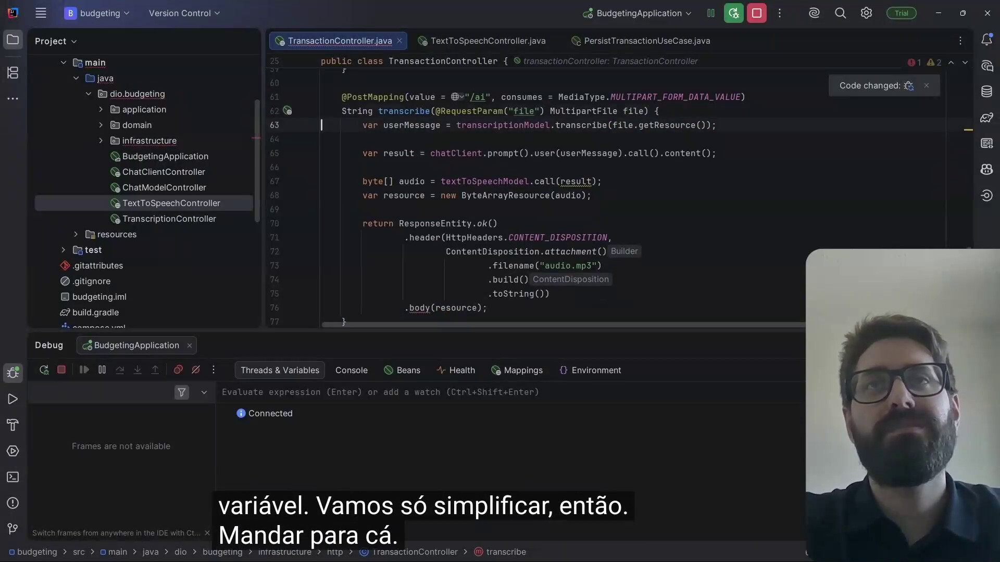
</p>

**O que a imagem mostra:** o código do método `transcribe` é simplificado, eliminando variáveis intermediárias desnecessárias (como o `resource` do arquivo recebido), deixando o fluxo mais direto entre a transcrição, a chamada ao chat e a geração do áudio de resposta.

<p align="center">
  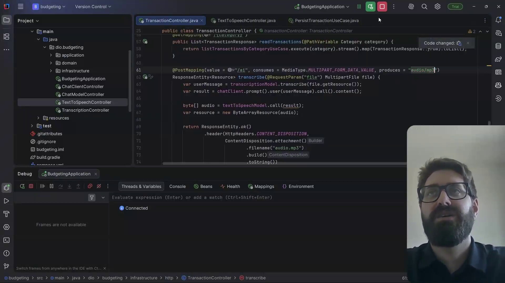
</p>

**O que a imagem mostra:** o mapeamento do endpoint é ajustado para declarar `produces = "audio/mp3"`, e o tipo de retorno do método passa a ser `ResponseEntity<Resource>`, deixando explícito para o cliente da API que a resposta será um arquivo de áudio.

```java
@PostMapping(value = "/ai", consumes = MediaType.MULTIPART_FORM_DATA_VALUE, produces = "audio/mp3")
ResponseEntity<Resource> transcribe(@RequestParam("file") MultipartFile file) { ... }
```

<p align="center">
  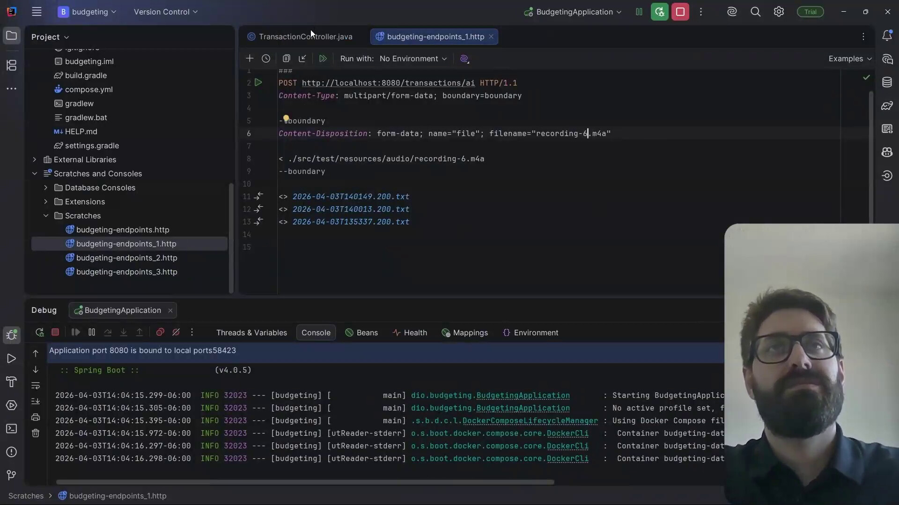
</p>

**O que a imagem mostra:** uma nova requisição de teste é preparada, desta vez enviando o áudio `recording-6.m4a` ao endpoint `/transactions/ai`, para validar o fluxo completo com um novo caso de uso.

<p align="center">
  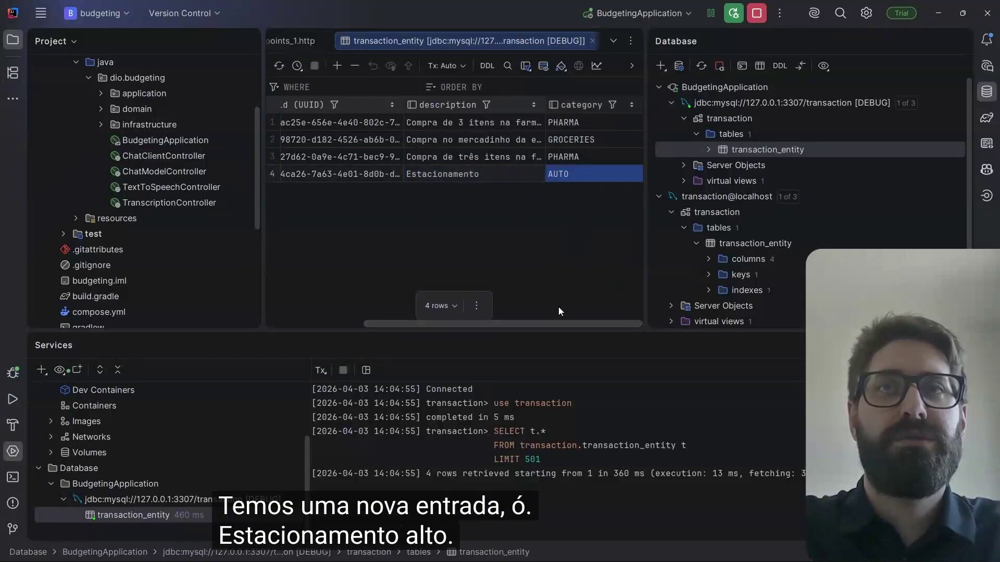
</p>

**O que a imagem mostra:** após a execução dessa nova requisição, o banco de dados exibe uma nova entrada na tabela de transações, referente a um gasto com estacionamento, classificado na categoria `AUTO`.

<p align="center">
  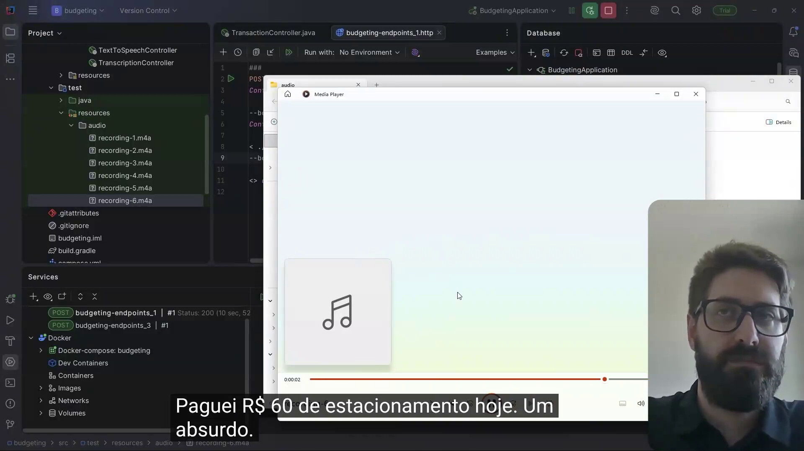
</p>

**O que a imagem mostra:** reprodução do áudio de entrada usado nesse teste, no qual é dito: "Paguei R$ 60 de estacionamento hoje, um absurdo." Esse é o conteúdo que o modelo precisará transcrever e interpretar.

<p align="center">
  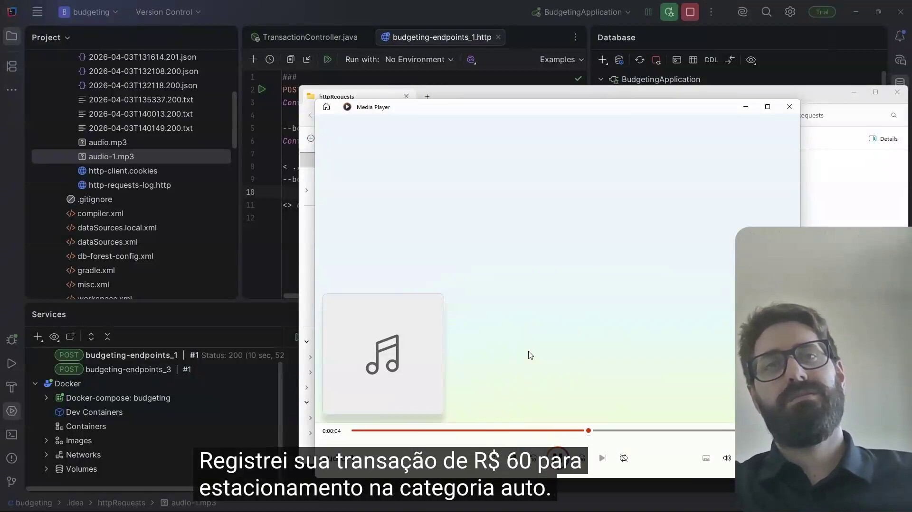
</p>

**O que a imagem mostra:** reprodução do áudio de resposta gerado pela aplicação, confirmando de forma sintetizada o registro da transação: "Registrei sua transação de R$ 60 para estacionamento na categoria auto." Esse é o resultado do fluxo completo — do áudio de entrada até a resposta falada — funcionando de ponta a ponta.

#### Material de Apoio Até Esta Etapa

- Arquivos do projeto nesta etapa: [./000-Midia_e_Anexos/xxxxxxxxxxxxxxxxx](./000-Midia_e_Anexos/etapas_do_codigo/xxxxxxxxxxxxxxxxx)
- [yyy-yyyyyyyyyyyy](./yyy-xxxxxxxxxxxxxxxxx.md)


### 🟩 Vídeo 12 - Roadmap e Auditoria: Evoluindo a API Inteligente

<video width="60%" controls>
  <source src="000-Midia_e_Anexos/bootcamp_ntt_data_java_spring_ai-modulo.04-curso.05-video_12.webm" type="video/webm">
    Seu navegador não suporta vídeo HTML5.
</video>

link do vídeo: https://web.dio.me/lab/desenvolvendo-sua-api-inteligente-com-reconhecimento-de-fala-e-spring-boot-1/learning/c494eb75-1917-43ac-8251-42553137870a?back=/track/ntt-data-2026-ai-java-back-end


## Entendendo o Desafio

Agora é a sua hora de praticar, aprender fazendo e evoluir um projeto completo com **Spring Boot + Inteligência Artificial**. Neste desafio, você vai trabalhar com uma **API inteligente** desenvolvida com **Spring AI**. O projeto mostra como integrar recursos de IA a uma aplicação Java, mantendo uma arquitetura organizada e pronta para evoluir. Antes de começar, acesse os repositórios do projeto:

**Repositório Com Todos Os Conteúdos Sobre Spring:**

[https://github.com/digitalinnovationone/dio-spring-boot-learning-track](https://www.google.com/url?sa=E&source=gmail&q=https://github.com/digitalinnovationone/dio-spring-boot-learning-track)

**Pasta Com Detalhes Sobre O Projeto Final:**

[https://github.com/digitalinnovationone/dio-spring-boot-learning-track/blob/main/06-spring-ai/README.md](https://www.google.com/url?sa=E&source=gmail&q=https://github.com/digitalinnovationone/dio-spring-boot-learning-track/blob/main/06-spring-ai/README.md)

Nas aulas, o expert Poiani construiu os principais pontos junto com você. Por isso, use o projeto como base, revise os conteúdos sempre que precisar e depois evolua a solução com as suas próprias ideias.

### O Que Criar

O objetivo é evoluir uma API de orçamento que usa IA para processar comandos de voz relacionados a transações financeiras. Na prática, o fluxo principal é:

* Receber um arquivo de áudio enviado pelo cliente;
* Transformar o áudio em texto;
* Usar IA para entender a intenção do comando;
* Executar uma função real da aplicação;
* Criar ou consultar transações financeiras;
* Gerar uma resposta final para a pessoa usuária.

O foco não é apenas usar IA. O mais importante é entender como conectar IA com uma aplicação real, respeitando as responsabilidades do código e a organização do projeto.

### Como Fazer

Siga o caminho apresentado nas aulas e no repositório. O projeto passa por temas importantes, como:

* Configuração do Spring AI;
* Integração com modelos de linguagem;
* Uso do ChatClient;
* Tool Calling para executar funções reais;
* Transcrição de áudio em texto;
* Geração de voz a partir de texto;
* Persistência de dados;
* Exposição de endpoints REST;
* Evolução e auditoria da API.

Se você ainda está começando, tudo bem. Primeiro, tente executar o projeto como foi apresentado. Depois, escolha uma melhoria simples para implementar.

### Ideias Para Evoluir

Depois de entender o projeto base, você pode evoluir a API de diferentes formas:

* Adicionar novos tipos de consulta financeira;
* Melhorar as respostas geradas pela IA;
* Criar novas ferramentas para o Tool Calling;
* Adicionar validações antes de salvar uma transação;
* Melhorar os endpoints REST;
* Criar testes para os principais fluxos;
* Documentar melhor como usar a API;
* Propor uma nova ideia de assistente usando a mesma base técnica.

Escolha uma evolução compatível com o seu momento. Uma melhoria pequena, bem explicada e funcionando, vale muito mais do que uma ideia grande incompleta.

### Use o DIO Agent Como Apoio

Durante o desafio, você também pode usar o **DIO Agent** como um parceiro de estudos. Ele pode te ajudar a entender o desafio, revisar conceitos de Spring, organizar o raciocínio, melhorar sua documentação e destravar dúvidas sem entregar tudo pronto. Você pode começar com um prompt simples como este:

```text
Repositório da trilha:
https://github.com/digitalinnovationone/dio-spring-boot-learning-track

Pasta do projeto final:
https://github.com/digitalinnovationone/dio-spring-boot-learning-track/blob/main/06-spring-ai/README.md

Quero evoluir o projeto com uma melhoria simples.

Me ajude a entender:
- O objetivo do projeto;
- O fluxo principal da API;
- Onde posso fazer uma melhoria;
- Quais arquivos preciso revisar;
- Como explicar minha entrega no README.

Importante: não quero uma resposta pronta para copiar. Quero entender o processo e construir minha própria solução.
```

Use o **DIO Agent** como apoio, mas lembre-se: a entrega final deve refletir suas escolhas, seus testes e seu aprendizado.

### O Que Entregar

Dê um Fork no repositório do expert ou crie seu próprio repositório no GitHub com a sua versão do projeto. No `README.md`, explique de forma simples:

* O que o projeto faz;
* Como executar a aplicação;
* Qual melhoria você implementou;
* Quais tecnologias foram usadas;
* Como testar o fluxo principal;
* O que você aprendeu durante o desafio.

Se você fez prints, exemplos de requisições, testes ou anotações, inclua também. Isso ajuda a mostrar seu processo de aprendizagem.

### Resultado Esperado

Ao final, você terá um projeto público mostrando como usar **Spring Boot + Spring AI** para criar uma API inteligente com recursos de texto, áudio e execução de funções reais.

Comece pelo projeto base, avance com calma e evolua um passo de cada vez. O importante é entender o fluxo, testar a solução e mostrar claramente o que você construiu.

Bons estudos e bom projeto! 🚀

# Certificado: Desafio de projeto - Desenvolvendo sua API Inteligente com Recrutamento de IA com Spring Boot

- Link na plataforma: 
- Certificado em pdf: