## Instrutor

- Thiago Poiani (Principal Engineer at Skip)
- Contato Linkedin: / [thpoiani](https://www.linkedin.com/in/thpoiani/)

### 🟩 Vídeo 01 - Introdução ao desenvolvendo sua API Inteligente

<video width="60%" controls>
  <source src="000-Midia_e_Anexos/bootcamp_ntt_data_java_spring_ai-modulo.04-curso.05-video_01.webm" type="video/webm">
    Seu navegador não suporta vídeo HTML5.
</video>

link do vídeo: https://web.dio.me/lab/desenvolvendo-sua-api-inteligente-com-reconhecimento-de-fala-e-spring-boot-1/learning/6a27cad6-eb4b-453c-9ba7-d0b3d8916a17?back=/track/ntt-data-2026-ai-java-back-end

### Anotações

<p align="center">
  
</p>

O slide apresenta a **Agenda do Curso**, com cinco tópicos que estruturam a aula: Apresentação, Fundamentos e Conceitos, Estudo de Caso, Desenvolvimento do Projeto e Roadmap do Aluno. Esse roteiro define a ordem em que o conteúdo será abordado: primeiro a ideia geral do projeto de API inteligente com reconhecimento de fala, depois os conceitos de IA envolvidos, em seguida um estudo de caso prático, o desenvolvimento do projeto em si e, por fim, sugestões de evolução para o aluno.

<p align="center">
  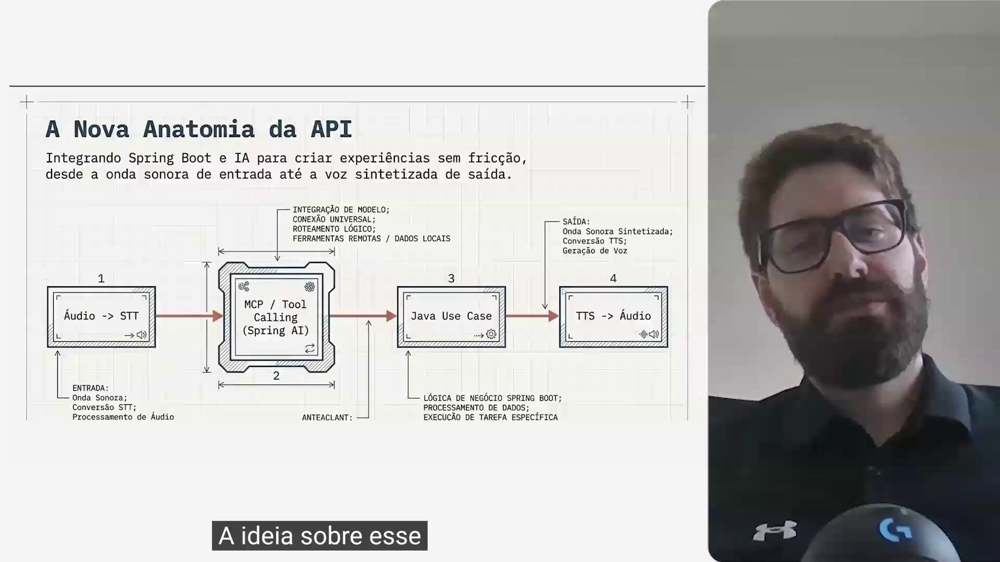
</p>

O diagrama **"A Nova Anatomia da API"** resume visualmente a arquitetura do projeto, dividida em quatro etapas sequenciais:

1. **Áudio -> STT**: entrada de onda sonora, convertida em texto processável.
2. **MCP / Tool Calling (Spring AI)**: integração de modelo, roteamento lógico e conexão com ferramentas remotas ou dados locais.
3. **Java Use Case**: execução da lógica de negócio Spring Boot e das tarefas específicas da aplicação.
4. **TTS -> Áudio**: geração de voz sintetizada como saída para o usuário.

Essa ilustração antecipa o fluxo completo que será detalhado ao longo da aula, mostrando como uma entrada de áudio percorre o sistema até se transformar novamente em áudio na resposta.

<p align="center">
  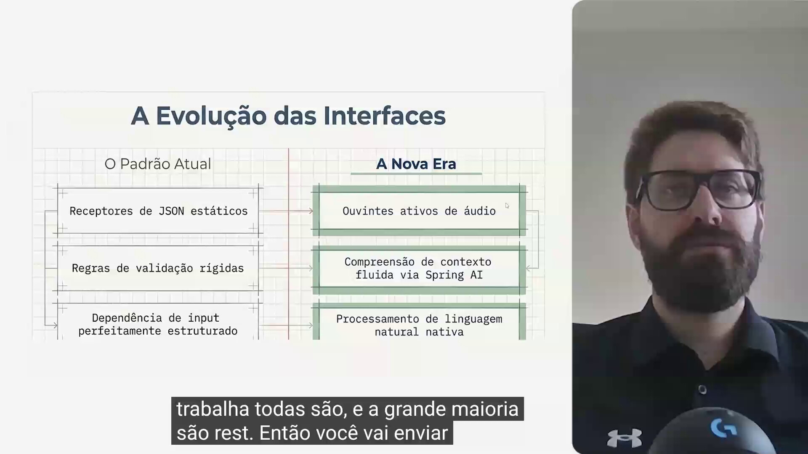
</p>

O slide **"A Evolução das Interfaces"** contrasta o padrão atual de APIs com a nova proposta do projeto. Do lado esquerdo, o **Padrão Atual** é caracterizado por receptores de JSON estáticos, regras de validação rígidas e dependência de input perfeitamente estruturado — o modelo REST tradicional, onde uma requisição como um POST para `/companies` segue um contrato fixo. Do lado direito, a **Nova Era** propõe ouvintes ativos de áudio, compreensão de contexto fluida via Spring AI e processamento de linguagem natural nativa, eliminando a rigidez do formato JSON em favor de uma entrada por voz.

<p align="center">
  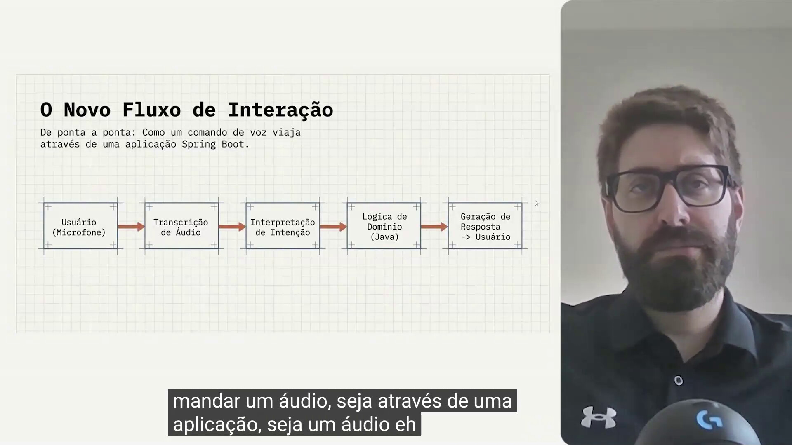
</p>

O diagrama **"O Novo Fluxo de Interação"** detalha, de ponta a ponta, como um comando de voz viaja através da aplicação Spring Boot: **Usuário (Microfone) -> Transcrição de Áudio -> Interpretação de Intenção -> Lógica de Domínio (Java) -> Geração de Resposta -> Usuário**. Esse fluxo linear mostra as cinco etapas pelas quais uma mensagem falada passa até retornar como resposta ao usuário, servindo de mapa geral para os componentes que serão explicados individualmente na sequência.

<p align="center">
  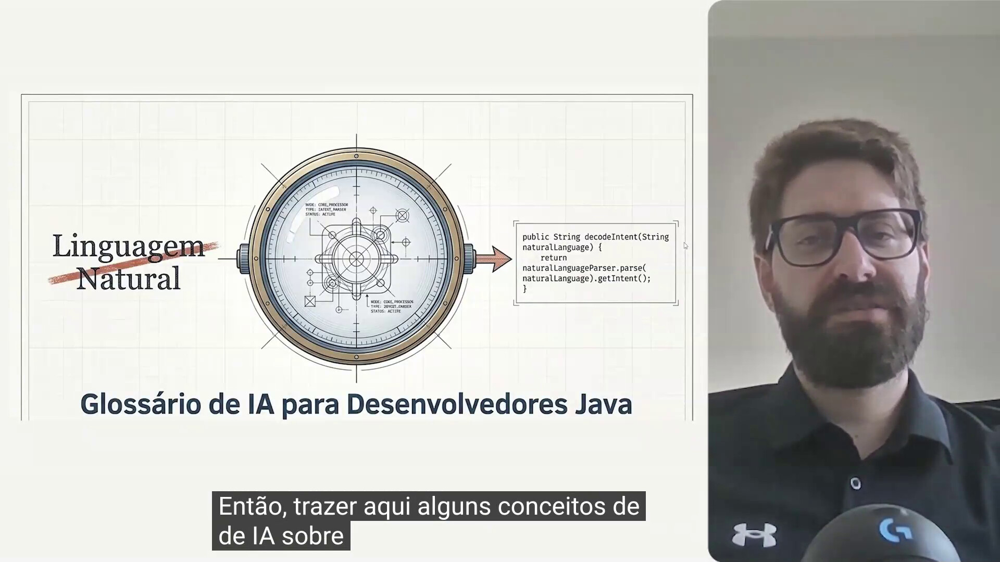
</p>

O slide **"Glossário de IA para Desenvolvedores Java"** abre a seção conceitual da aula com o termo **Linguagem Natural**, apresentando um exemplo de código Java que ilustra a ideia de decodificar uma intenção a partir de texto livre:

```java
public String decodeIntent(String naturalLanguage) {
    return naturalLanguageParser.parse(naturalLanguage).getIntent();
}
```

O trecho representa, de forma conceitual, como uma entrada em linguagem natural pode ser interpretada por um parser para extrair a intenção do usuário — a base sobre a qual os próximos conceitos (Speech-to-Text, Tool Calling e Text-to-Speech) serão construídos.

<p align="center">
  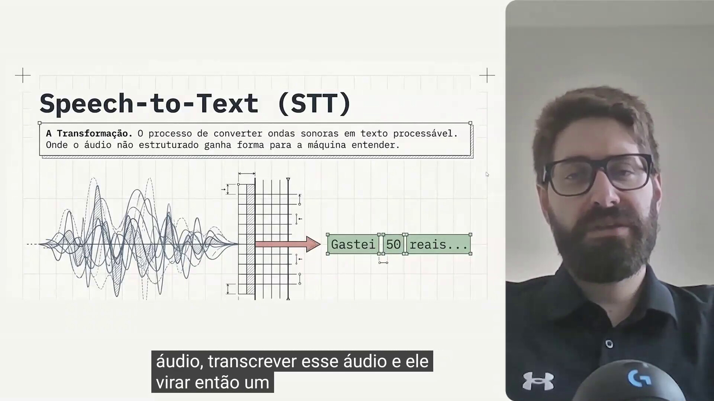
</p>

O slide **"Speech-to-Text (STT)"** explica a primeira etapa do pipeline: a transformação de ondas sonoras em texto processável, onde "o áudio não estruturado ganha forma para a máquina entender". A ilustração mostra uma onda sonora sendo processada e convertida em um trecho de texto de exemplo, "Gastei 50 reais...", representando o resultado da transcrição de um áudio de entrada.

<p align="center">
  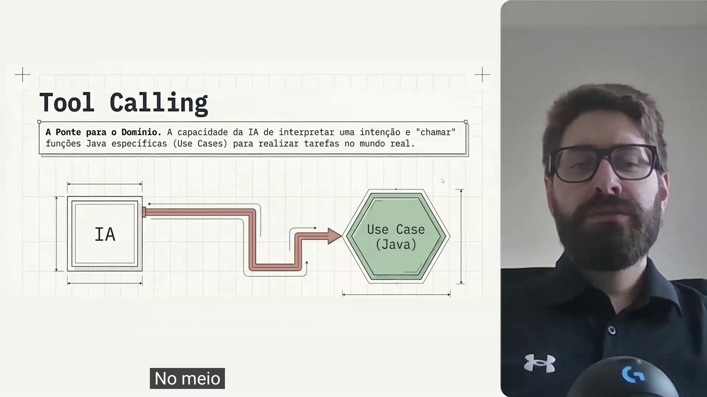
</p>

O slide **"Tool Calling"** descreve a segunda etapa do pipeline como "a ponte para o domínio": a capacidade da IA de interpretar uma intenção e "chamar" funções Java específicas (Use Cases) para realizar tarefas no mundo real. O diagrama mostra o bloco **IA** direcionando uma seta até o bloco **Use Case (Java)**, representando como o modelo, a partir do texto transcrito, identifica qual método da aplicação deve ser executado e com quais parâmetros.

<p align="center">
  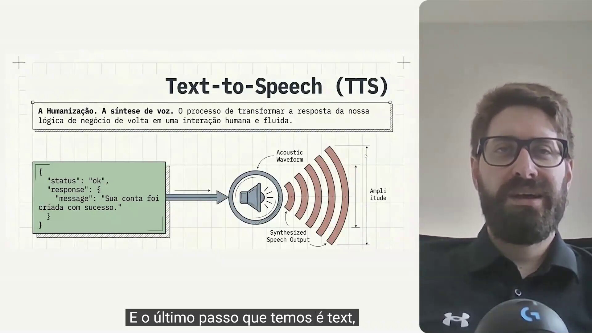
</p>

O slide **"Text-to-Speech (TTS)"** apresenta a última etapa do pipeline: a humanização da resposta, transformando a saída da lógica de negócio de volta em uma interação humana e fluida. A imagem mostra um objeto JSON de resposta sendo convertido em onda sonora sintetizada:

```json
{
  "status": "ok",
  "response": {
    "message": "Sua conta foi criada com sucesso."
  }
}
```

O diagrama ilustra esse JSON sendo processado por um alto-falante, gerando uma "Acoustic Waveform" (onda acústica) como saída de voz sintetizada para o usuário.

<p align="center">
  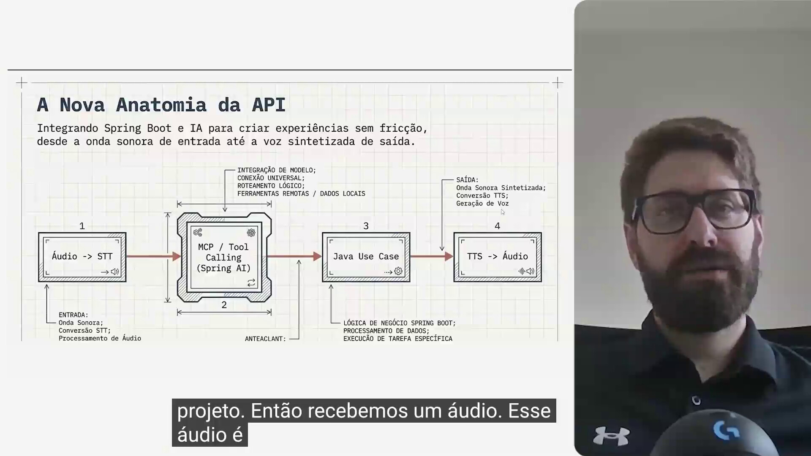
</p>

O diagrama **"A Nova Anatomia da API"** retorna à tela, agora como fechamento da explicação conceitual, reunindo as quatro etapas já detalhadas individualmente: **Áudio -> STT**, **MCP / Tool Calling (Spring AI)**, **Java Use Case** e **TTS -> Áudio**. Ao revisitar essa visão de conjunto, fica evidente o ciclo completo do sistema: um áudio de entrada é transcrito, interpretado para acionar a lógica de negócio correta e, por fim, convertido novamente em áudio como resposta ao usuário.

<p align="center">
  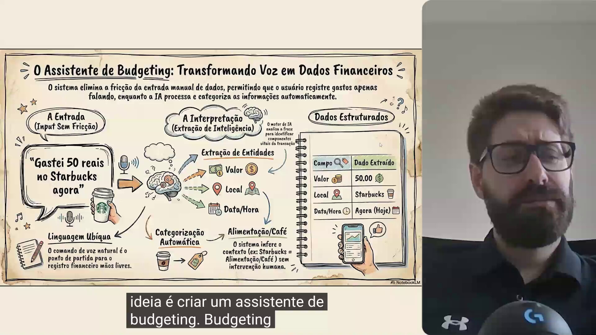
</p>

O infográfico **"O Assistente de Budgeting: Transformando Voz em Dados Financeiros"** apresenta o estudo de caso do projeto: um sistema que elimina a fricção da entrada manual de dados, permitindo que o usuário registre gastos apenas falando, enquanto a IA processa e categoriza as informações automaticamente. O exemplo mostrado é a frase "Gastei 50 reais no Starbucks agora", que passa por uma etapa de **Extração de Entidades** (Valor, Local, Data/Hora) e **Categorização Automática** (o sistema infere que Starbucks corresponde à categoria Alimentação/Café), resultando em dados estruturados prontos para persistência: Valor = 50.00, Local = Starbucks, Data/Hora = Agora (Hoje).


### 🟩 Vídeo 02 - Spring AI: Setup e Integração com LLMs

<video width="60%" controls>
  <source src="000-Midia_e_Anexos/bootcamp_ntt_data_java_spring_ai-modulo.04-curso.05-video_02.webm" type="video/webm">
    Seu navegador não suporta vídeo HTML5.
</video>

link do vídeo: https://web.dio.me/lab/desenvolvendo-sua-api-inteligente-com-reconhecimento-de-fala-e-spring-boot-1/learning/f6d5285c-3962-41d4-8e19-ca821da8eabf?back=/track/ntt-data-2026-ai-java-back-end

### Anotações

#### Introdução ao Spring AI

<p align="center">
  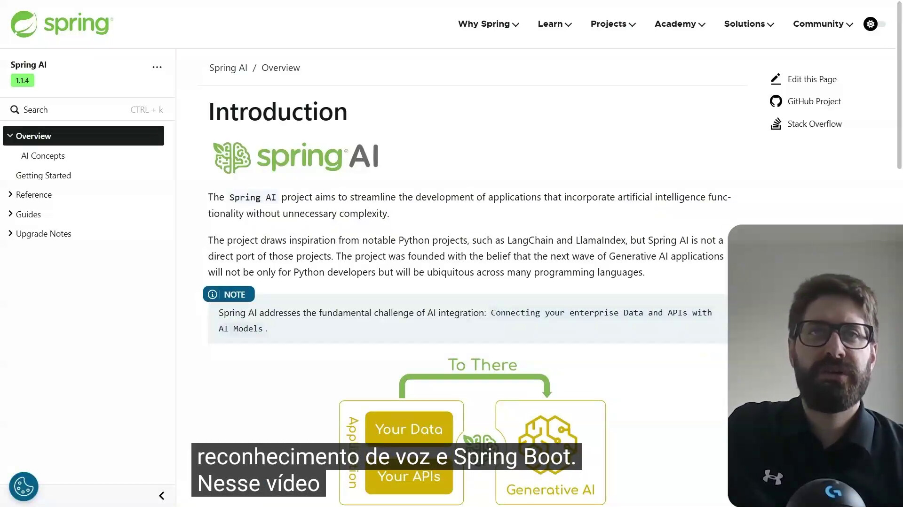
</p>

A imagem mostra a página de documentação oficial do Spring AI aberta no navegador, na seção "Introduction". O texto exibido explica que o projeto Spring AI busca simplificar o desenvolvimento de aplicações com funcionalidades de inteligência artificial, sem complexidade desnecessária, inspirando-se em projetos Python como LangChain e LlamaIndex. Um destaque em nota explica que o Spring AI resolve o desafio fundamental de conectar dados e APIs corporativas aos modelos de IA, ilustrado pelo diagrama "Your Data / Your APIs → Generative AI" presente na página.

#### Provedores de Modelos Suportados

<p align="center">
  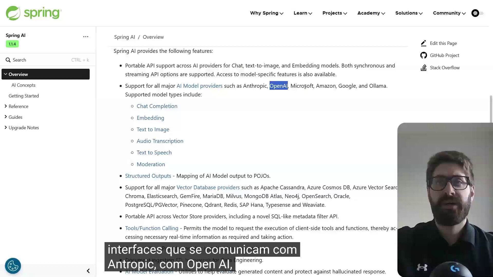
</p>

A página segue exibindo a lista de funcionalidades do Spring AI, com destaque para o suporte a diversos provedores de modelos de IA — Anthropic, OpenAI (destacado em azul na imagem), Microsoft, Amazon, Google e Ollama. Também são listados os tipos de modelo suportados: Chat Completion, Embedding, Text to Image, Audio Transcription, Text to Speech e Moderation. Isso corresponde diretamente ao momento em que o instrutor comenta que o Spring AI possui interfaces prontas para se comunicar com diferentes Large Language Models, citando esses mesmos provedores.

#### Demais Recursos do Ecossistema

<p align="center">
  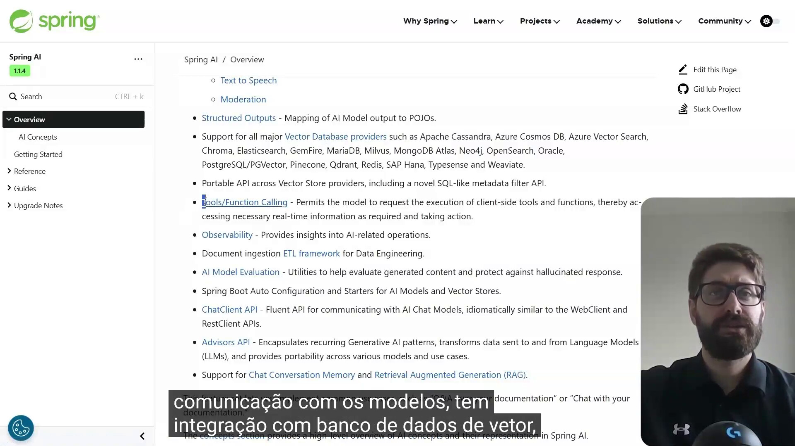
</p>

Com a rolagem da página, aparecem outros recursos do Spring AI: Structured Outputs (mapeamento da saída do modelo para POJOs), suporte a diversos bancos de dados vetoriais, Tools/Function Calling, Observability, ingestão de documentos via ETL framework, avaliação de modelos de IA, Spring Boot Auto Configuration, ChatClient API, Advisors API e suporte a memória de conversa e RAG (Retrieval Augmented Generation). Esse trecho ilustra o momento em que o instrutor menciona o ChatClient como uma interface que facilita a comunicação com os modelos, além da integração com bancos de dados de vetor e do tool calling.

#### Conceitos de IA — Modelos

<p align="center">
  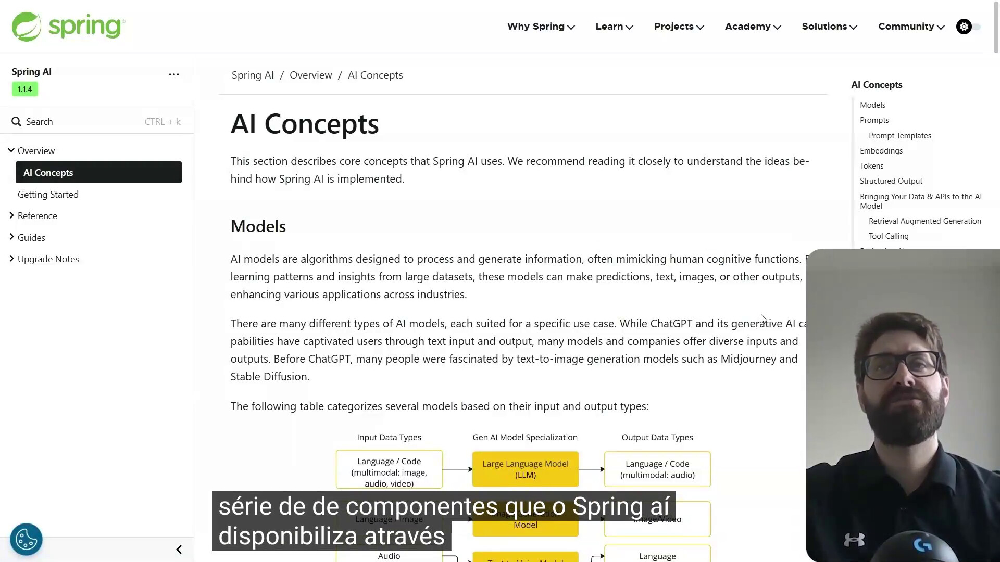
</p>

A navegação avança para a seção "AI Concepts", especificamente para o tópico "Models". A página apresenta uma tabela que categoriza os modelos de IA de acordo com os tipos de entrada (linguagem/código, imagem, áudio) e saída (linguagem/código, imagem, áudio), evidenciando a especialização de cada modelo generativo (como LLMs). Esse conteúdo reforça a fala do instrutor de que o Spring AI disponibiliza uma série de componentes por meio de uma interface comum, permitindo trocar um modelo por outro sem alterar o código da aplicação.

#### Conceitos de IA — Prompts

<p align="center">
  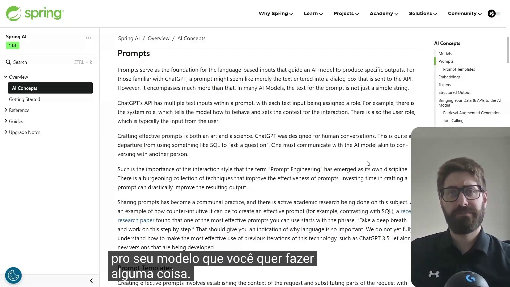
</p>

A imagem mostra a seção "Prompts" da documentação, explicando que o prompt é a base da entrada em linguagem natural enviada ao modelo de IA, podendo ser composto por diferentes papéis (como "system" e "user"). O texto também comenta sobre a importância da engenharia de prompt. Isso corresponde à explicação do instrutor de que o prompt é justamente a forma como se comunica ao modelo o que se deseja fazer.

#### Conceitos de IA — Tokens

<p align="center">
  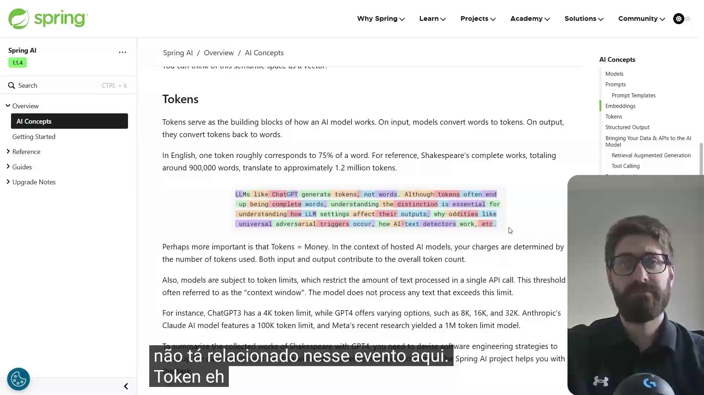
</p>

A página avança para a seção "Tokens", explicando que os tokens são as unidades básicas de processamento dos modelos de IA: na entrada, palavras são convertidas em tokens; na saída, tokens são convertidos de volta em palavras. O texto ainda destaca que tokens estão diretamente relacionados ao custo de uso dos modelos hospedados, já que a cobrança é feita com base na quantidade de tokens processados (entrada e saída). Esse trecho corresponde ao momento em que o instrutor esclarece que, diferente do embedding, o token está muito mais relacionado ao custo do uso do modelo de IA.

#### Conceitos de IA — Tool Calling

<p align="center">
  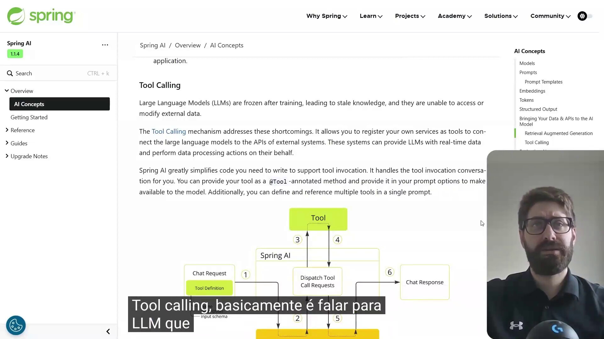
</p>

A imagem mostra a seção "Tool Calling" da documentação, acompanhada de um diagrama que ilustra o fluxo entre a aplicação (Chat Request), o Spring AI e a Tool externa, até a geração da Chat Response. O texto explica que os LLMs ficam "congelados" após o treinamento e não conseguem acessar ou modificar dados externos por conta própria, sendo esse o problema que o mecanismo de Tool Calling resolve. Esse conteúdo corresponde exatamente à explicação do instrutor de que o tool calling consiste em informar ao LLM que ele pode acessar dados externos, como dados da própria aplicação, por meio de ferramentas registradas.

#### Criando o Projeto no IntelliJ

<p align="center">
  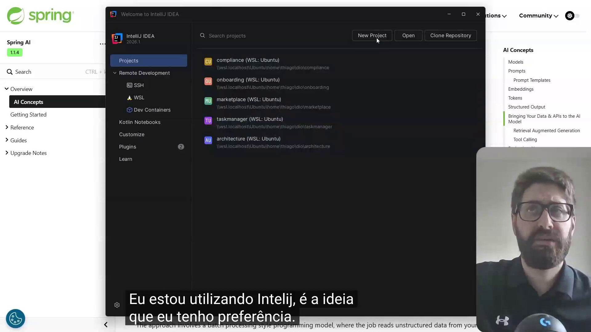
</p>

A tela agora mostra a IDE IntelliJ IDEA aberta na tela de boas-vindas, exibindo uma lista de projetos remotos existentes (via WSL Ubuntu) e o botão "New Project" em destaque. Esse momento corresponde à fala do instrutor informando que utilizará o IntelliJ, por ser a IDE de sua preferência, para criar o novo projeto Spring Boot.

#### Configurando o Novo Projeto Spring Boot

<p align="center">
  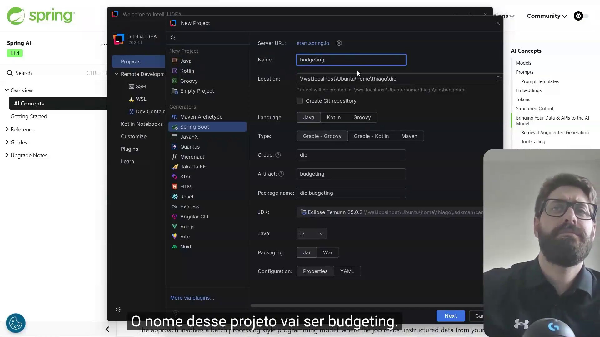
</p>

A imagem mostra a janela "New Project" do IntelliJ, com o gerador "Spring Boot" selecionado. Os campos exibidos são: Server URL (start.spring.io), Name preenchido como "budgeting", Location apontando para o diretório do usuário via WSL, Language definida como Java, JDK "Eclipse Temurin 25.0.2", Packaging "Jar" e Configuration "Properties". Isso corresponde ao momento em que o instrutor define o nome do projeto como "budgeting" e configura a versão do Java a ser utilizada (25, via SDKMAN).

#### Adicionando o BOM do Spring AI

<p align="center">
  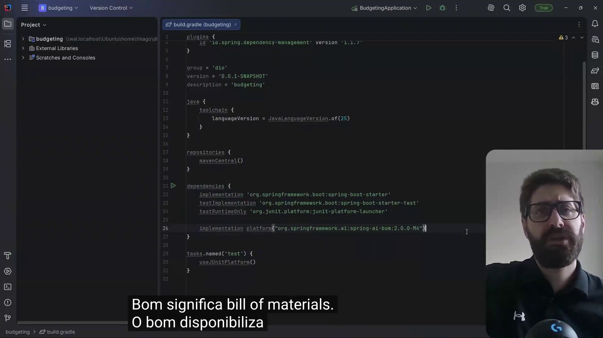
</p>

A imagem mostra o arquivo `build.gradle` do projeto "budgeting" já criado, com o plugin de gerenciamento de dependências do Spring configurado e a dependência do BOM (Bill of Materials) do Spring AI recém-adicionada:

```groovy
plugins {
    id 'io.spring.dependency-management' version '1.1.7'
}

group = 'dio'
version = '0.0.1-SNAPSHOT'
description = 'budgeting'

java {
    toolchain {
        languageVersion = JavaLanguageVersion.of(25)
    }
}

repositories {
    mavenCentral()
}

dependencies {
    implementation 'org.springframework.boot:spring-boot-starter'
    testImplementation 'org.springframework.boot:spring-boot-starter-test'
    testRuntimeOnly 'org.junit.platform:junit-platform-launcher'

    implementation platform("org.springframework.ai:spring-ai-bom:2.0.0-M4")
}

tasks.named('test') {
    useJUnitPlatform()
}
```

Isso corresponde ao trecho em que o instrutor explica que o BOM (Bill of Materials) disponibiliza um índice de dependências do Spring AI com as versões corretas já resolvidas, evitando a necessidade de declarar manualmente a versão de cada dependência relacionada.

#### Adicionando o Starter do Modelo OpenAI

<p align="center">
  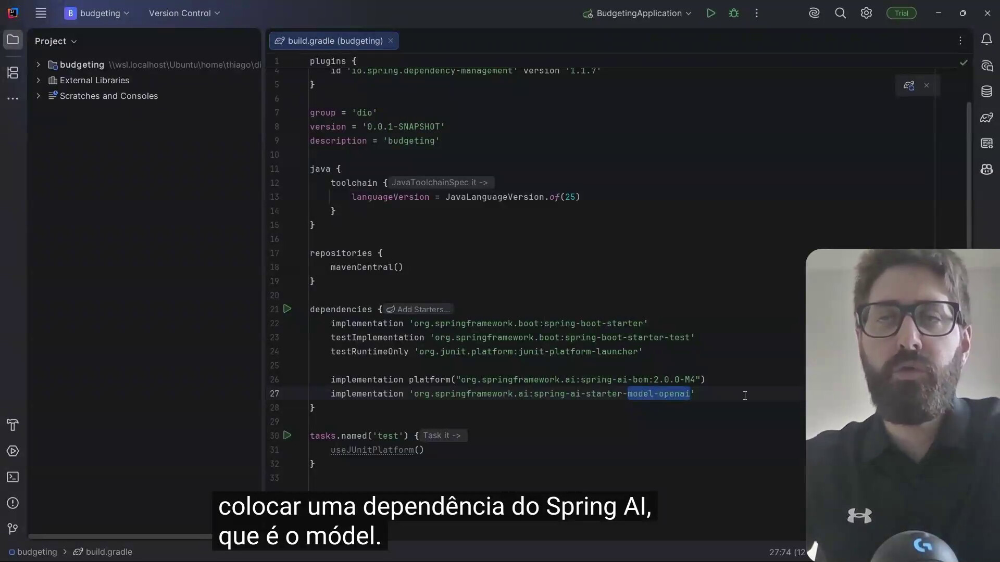
</p>

No mesmo arquivo `build.gradle`, uma nova linha é adicionada ao bloco de dependências, referente ao starter do modelo OpenAI do Spring AI (destacada em azul na imagem):

```groovy
dependencies {
    implementation 'org.springframework.boot:spring-boot-starter'
    testImplementation 'org.springframework.boot:spring-boot-starter-test'
    testRuntimeOnly 'org.junit.platform:junit-platform-launcher'

    implementation platform("org.springframework.ai:spring-ai-bom:2.0.0-M4")
    implementation 'org.springframework.ai:spring-ai-starter-model-openai'
}
```

Esse trecho corresponde ao momento em que o instrutor explica que, além do BOM, é necessário adicionar a dependência específica do modelo que será utilizado — nesse caso, o modelo da OpenAI.

#### Configurando a API Key da OpenAI

<p align="center">
  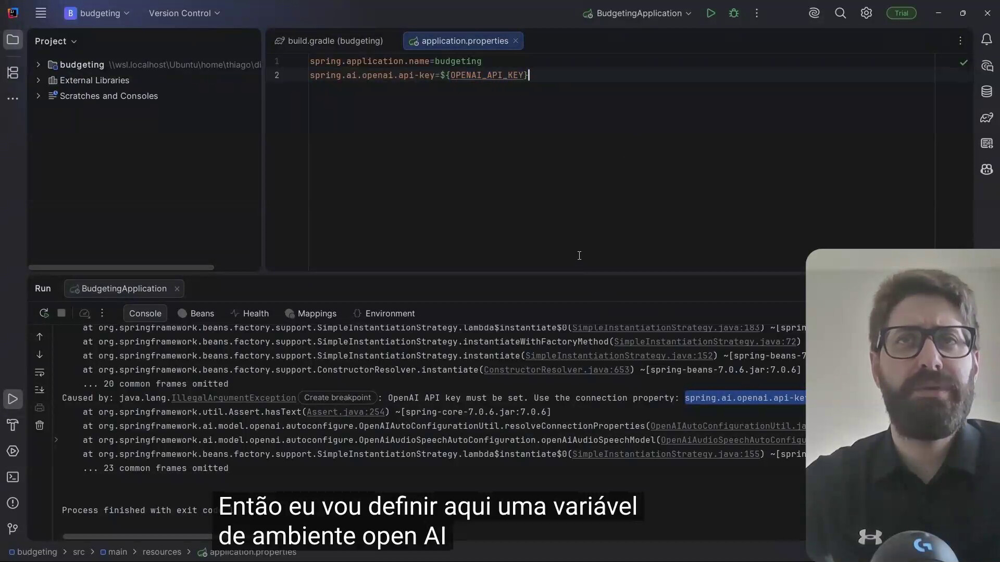
</p>

A imagem mostra o arquivo `application.properties` configurado com o nome da aplicação e a propriedade da chave da API da OpenAI referenciando uma variável de ambiente:

```properties
spring.application.name=budgeting
spring.ai.openai.api-key=${OPENAI_API_KEY}
```

Abaixo, no console de execução, é exibido um erro anterior, indicando que a chave da API ainda não havia sido configurada:

```
Caused by: java.lang.IllegalArgumentException: OpenAI API key must be set. Use the connection property: spring.ai.openai.api-key
```

Esse conteúdo corresponde à explicação do instrutor de que a propriedade `spring.ai.openai.api-key` deve receber o valor da chave, mas, por segurança, em vez de colocar o valor diretamente no arquivo, ele optou por referenciá-lo através de uma variável de ambiente chamada `OPENAI_API_KEY`, evitando expor a chave em um eventual commit do `application.properties`.

#### Configurações de Execução da Aplicação

<p align="center">
  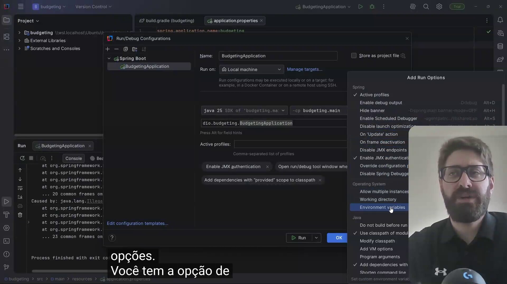
</p>

A imagem mostra a janela "Run/Debug Configurations" do IntelliJ, referente à configuração "BudgetingApplication", com o menu "Add Run Options" aberto exibindo diversas opções disponíveis, entre elas "Environment variables" (destacada em azul). Isso corresponde ao momento em que o instrutor explica que é possível acessar as opções de configuração da execução (VM) e, entre elas, definir variáveis de ambiente para a aplicação.

#### Cadastrando a Variável de Ambiente

<p align="center">
  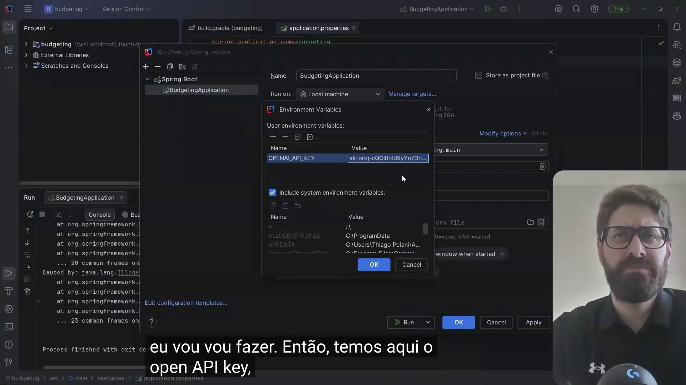
</p>

A imagem mostra a janela "Environment Variables" aberta, com a variável `OPENAI_API_KEY` cadastrada manualmente e seu respectivo valor (a chave secreta, parcialmente oculta na imagem), além da opção "Include system environment variables" marcada. Esse trecho corresponde à explicação do instrutor sobre como cadastrar manualmente a variável de ambiente contendo a chave da API diretamente na configuração de execução da aplicação no IntelliJ, para que ela seja injetada automaticamente sempre que a aplicação for executada.

#### Aplicação Executada com Sucesso

<p align="center">
  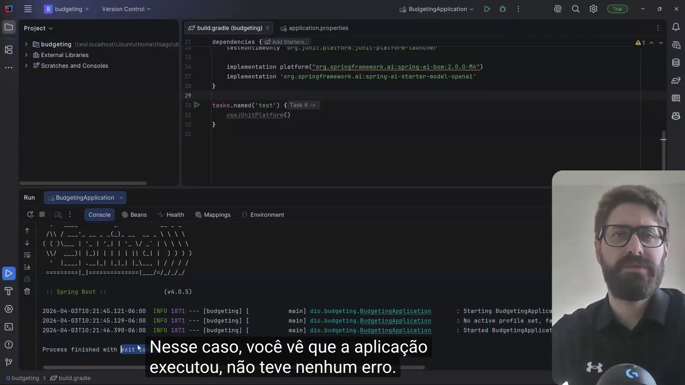
</p>

A imagem mostra novamente o `build.gradle` com as dependências do Spring AI (BOM e starter do modelo OpenAI) já configuradas, e o console de execução exibindo o banner padrão do Spring Boot seguido do log de inicialização:

```
:: Spring Boot ::                (v4.0.5)

INFO 1871 --- [budgeting] [           main] dio.budgeting.BudgetingApplication       : Starting BudgetingApplication
INFO 1871 --- [budgeting] [           main] dio.budgeting.BudgetingApplication       : No active profile set, fa...
INFO 1871 --- [budgeting] [           main] dio.budgeting.BudgetingApplication       : Started BudgetingApplicat...

Process finished with exit code 0
```

Isso corresponde ao momento em que o instrutor executa novamente a aplicação e confirma que, com a variável de ambiente `OPENAI_API_KEY` corretamente configurada, a aplicação sobe sem erros, comprovando que a conexão com a OpenAI está pronta para ser utilizada nos próximos vídeos, quando serão abordados o Chat API, o Tool Calling, a Transcription API e a Speech API do Spring AI.
      
#### Material de Apoio Até Esta Etapa

- Arquivos do projeto nesta etapa: [budgeting_ate_o_video02.zip](./000-Midia_e_Anexos/etapas_do_codigo/budgeting_ate_o_video02.zip)
- [yyyyyyyyyyyy](./xxxxxxxxxxxxxxxxx)


### 🟩 Vídeo 03 - Explorando o ChatModel e Modelos de Linguagem

<video width="60%" controls>
  <source src="000-Midia_e_Anexos/bootcamp_ntt_data_java_spring_ai-modulo.04-curso.05-video_03.webm" type="video/webm">
    Seu navegador não suporta vídeo HTML5.
</video>

link do vídeo:

### 🟩 Vídeo 04 - ChatClient: Fluência e Contexto no Spring AI

<video width="60%" controls>
  <source src="000-Midia_e_Anexos/bootcamp_ntt_data_java_spring_ai-modulo.04-curso.05-video_04.webm" type="video/webm">
    Seu navegador não suporta vídeo HTML5.
</video>

link do vídeo:

### 🟩 Vídeo 05 - Tool Calling: Executando Funções Reais com IA

<video width="60%" controls>
  <source src="000-Midia_e_Anexos/bootcamp_ntt_data_java_spring_ai-modulo.04-curso.05-video_05.webm" type="video/webm">
    Seu navegador não suporta vídeo HTML5.
</video>

link do vídeo:

### 🟩 Vídeo 06 - Transcription API: Transformando Áudio em Texto

<video width="60%" controls>
  <source src="000-Midia_e_Anexos/bootcamp_ntt_data_java_spring_ai-modulo.04-curso.05-video_06.webm" type="video/webm">
    Seu navegador não suporta vídeo HTML5.
</video>

link do vídeo:

### 🟩 Vídeo 07 - Speech API: Sintetizando Voz com Text-to-Speech

<video width="60%" controls>
  <source src="000-Midia_e_Anexos/bootcamp_ntt_data_java_spring_ai-modulo.04-curso.05-video_07.webm" type="video/webm">
    Seu navegador não suporta vídeo HTML5.
</video>

link do vídeo:

### 🟩 Vídeo 08 - Integração do Assistente: Orquestrando o Fluxo de Budget

<video width="60%" controls>
  <source src="000-Midia_e_Anexos/bootcamp_ntt_data_java_spring_ai-modulo.04-curso.05-video_08.webm" type="video/webm">
    Seu navegador não suporta vídeo HTML5.
</video>

link do vídeo:

### 🟩 Vídeo 09 - Persistência e Infraestrutura: Configurando o Banco com Docker

<video width="60%" controls>
  <source src="000-Midia_e_Anexos/bootcamp_ntt_data_java_spring_ai-modulo.04-curso.05-video_09.webm" type="video/webm">
    Seu navegador não suporta vídeo HTML5.
</video>

link do vídeo:

### 🟩 Vídeo 10 - Exposição REST: Implementando o TransactionController

<video width="60%" controls>
  <source src="000-Midia_e_Anexos/bootcamp_ntt_data_java_spring_ai-modulo.04-curso.05-video_10.webm" type="video/webm">
    Seu navegador não suporta vídeo HTML5.
</video>

link do vídeo:

### 🟩 Vídeo 11 - Endpoint de Transcrição: Integrando Áudio ao Controller

<video width="60%" controls>
  <source src="000-Midia_e_Anexos/bootcamp_ntt_data_java_spring_ai-modulo.04-curso.05-video_11.webm" type="video/webm">
    Seu navegador não suporta vídeo HTML5.
</video>

link do vídeo:

### 🟩 Vídeo 12 - Roadmap e Auditoria: Evoluindo a API Inteligente

<video width="60%" controls>
  <source src="000-Midia_e_Anexos/bootcamp_ntt_data_java_spring_ai-modulo.04-curso.05-video_12.webm" type="video/webm">
    Seu navegador não suporta vídeo HTML5.
</video>

link do vídeo:

### 🟩 Vídeo 13 - Entendendo o Desafio

<video width="60%" controls>
  <source src="000-Midia_e_Anexos/bootcamp_ntt_data_java_spring_ai-modulo.04-curso.05-video_13.webm" type="video/webm">
    Seu navegador não suporta vídeo HTML5.
</video>

link do vídeo:

##  Materiais de Apoio

# Certificado: 

- Link na plataforma: 
- Certificado em pdf: