# Parte 1: Visão Geral do Curso e Ferramentas

## Vídeo 01 - Introdução ao Curso

- Instrutor: Elidiana Andrade (Tech Education Analyst at DIO)
- Contato Libkedin: https://www.linkedin.com/in/elidiana/
 
- A autora se apresenta e dá uma visão geral do curso:
    - Conhecer as ferramentas.
    - Instalar, configurar e autenticar
    - Primeiros passos com Git e Github
    - Dicas e materiais de apoio 

## Vídeo 02 - O que é Versionamento de Código
 
- Sistemas de controle de versão:
    - Registrar o histórico de atualizações de um arquivo; 
    - Gerenciar quais foram as alterações, a data, autor, etc.;
    - Organizar, controlar e garantir a segurança.

- Tipos de Sistemas de Controle de Versão:
    - VCS Centralizado (CVCS) - Ex.: CVS, Subversion.
    - VCS Distribuído (DVCS) - Ex: Git, Mercurial.

- VCS Distribuído (DVCS)
    - Clona o repositório completo, o que inclui o histórico de versões.
    - Cada clone é como um backup;
    - Possibilita um fluxo de trabalho flexível;
    - Possibilidade de trabalhar sem conexão à rede.

## Vídeo 03 - O que é Git

- Sistema de Controle de Versão Distribuído
    - Gratuito e Open Source (Código Aberto);
    - Ramificações (branching) e fusões (merging) eficientes;
    - Leve e rápido.

- Referência: https://git-scm.com/ (site oficial do Git)
    - __Principais recursos__:
        - Download do Git para Windows, macOS e Linux
        - Documentação oficial com tutoriais e manuais
        - Livro gratuito "Pro Git" (em português também)
        - Referência de comandos Git com exemplos
        - Comunidade e traduções

- Breve histórico do Git
    - 2002: O projeto do núcleo (kernel) do Linux, que é open source, começa a utilizar o BitKeeper, um DVCS proprietário;
    - 2005: Após conflitos com a comunidade, o BitKeeper rescinde a licença gratuita. O que leva a Linus Torvalds, o criador do Linux, e sua equipe, a desenvolverem sua própria ferramenta, o Git.

- Fluxo Básico no Git:
    - git clone → clona um repositório Git existente para um novo diretório (pasta) local.
    - git commit → grava alterações no repositório.
    - git pull → “puxa” as alterações do repositório remoto para o local (busca e mescla).
    - git push → “empurra” as alterações do repositório local para o remoto.
 
## Vídeo 04 - O que é Github

- Plataforma de hospedagem de código para controle de versão com Git, e colaboração.
    - Comunidade ativa;
    - Utilizado mundialmente;
    - Mascote “Octocat”.
        - É uma criatura híbrida entre um gato e um polvo (cat + octopus).
        - Foi criado por Simon Oxley, um ilustrador japonês, e adotado pelo GitHub como símbolo da marca.
        - Representa o espírito divertido e amigável do GitHub.
        - É usado em material promocional, documentação, eventos, e como ícone da cultura open source.

- Breve Histórico do GitHub:
    - 2008: Desenvolvido por Chris Wanstrath, J. Hyett, Tom Preston-Werner e Scott Chacon.
    - 2018: Vítima de um dos maiores ataques de DDoS (ataque distribuído de negação de serviço); Comprado pela Microsoft Corporation por US $ 7,5 bilhões.

- Git ≠ GitHub (apresentação das diferenças)

- Autenticação de Dois Fatores
    - Acesse sua conta do GitHub e vá em Settings > Password and authentication > Two-factor authentication > Authenticator app
        - Leia o QR Code através do aplicativo autenticador (ex.: Microsoft Authenticator) e insira o código no GitHub;
        - Salve os códigos de recuperação;
        - Autenticação ativada!

- Referência: https://github.com/ (site oficial do Github)
    - Plataforma de hospedagem de código-fonte e controle de versão baseada no sistema Git.
    - __Principais recursos__:
        - Armazenar projetos de software (código-fonte, documentação, scripts etc.); - Controlar versões dos arquivos (ver o histórico de alterações);
        - Colaborar com outras pessoas desenvolvedoras (em equipes ou em projetos open source);
        - Publicar portfólios técnicos;
        - Automatizar processos (como testes e deploys com GitHub Actions).

- Instalação, Configuração e Autenticação
    - Instalando e configurando o Git, e autenticando o GitHub via Token e Chave SSH

# Parte 2: Instalação, Configuração e Autenticação

## Vídeo 05 - Instalando o Git no Windows

- Acesse https://git-scm.com/download/win;
- Faça o download do instalador e execute;
- Aceite a licença e clique em “Next”, e siga configurando como desejar¹ e clicando em “Next”;
- Finalize clicando em “Install”, e “Finish”.
    - Em "Select Components“, deixe as opções “Git Bash Here” e “Git GUI Here” marcadas.
 
## Vídeo 06 - Instalando o Git no Linux (Ubuntu)

- Confira a doc.: https://git-scm.com/download/linux
- Instale a última versão estável do Git:
    ```
    add-apt-repository ppa:git-core/ppa
    apt update
    apt install git 
    ```
- Referência: https://git-scm.com/downloads/linux
    - Comando: 
        ``` 
        git --version 
        ```
    - Resultado: ``` git version 2.43.0 ```

- Instalando o Git no macOS
    - Confira a doc.: https://git-scm.com/download/mac
    - Instale o Homebrew: https://brew.sh/
    - Instale o Git: 
        ``` 
        brew install git 
        ```
    
## Vídeo 07 - Configurando o Git
 
- Comando: 
    ``` 
    git config --list 
    ```
- Resultado:
    ```
    credential.https://github.com.helper=
    credential.https://github.com.helper=!/usr/bin/gh auth git-credential
    credential.https://gist.github.com.helper=
    credential.https://gist.github.com.helper=!/usr/bin/gh auth git-credential
    user.name= ...
    user.email= ...
    ```
- Configurando seu nome de usuário e e-mail (globalmente):
    ```
    git config --global user.name "Nome Sobrenome"
    git config --global user.email seuemail@email.com
    ```
- Configurando o nome da Branch Padrão:
    ```
    git config --global init.defaultBranch main
    ```
- Para gerar um Token, acesse sua conta no GitHub, e no menu superior direito clique em Settings > Developer settings > Tokens (classic) > Generate new token.

- Você pode armazenar suas credenciais para reduzir o número de vezes que você deve digitar seu nome de usuário ou senha:
    - Salvando no cache: 
        ``` 
        git config --global credential.helper cache 
        ```
    - Ou permanentemente: 
        ``` 
        git config --global credential.helper store 
        ```
    - Veja mais na doc.: https://git-scm.com/book/pt-br/v2/Git-Tools-Credential-Storage


## Vídeo 08 - Autenticando via Token

- Para gerar um Token, acesse sua conta no GitHub, e no menu superior direito clique em Settings > Developer settings > Tokens (classic) > Generate new token.

- Você pode armazenar suas credenciais para reduzir o número de vezes que você deve digitar seu nome de usuário ou senha:
    - Salvando no cache: 
        ``` 
        git config --global credential.helper cache 
        ```
    - Ou permanentemente: 
        ``` 
        git config --global credential.helper store 
        ```
    - Veja mais na doc.: https://git-scm.com/book/pt-br/v2/Git-Tools-Credential-Storage
 
## Vídeo 09 - Autenticando via Chave SSH

- Para adicionar uma Chave SSH, acesse sua conta no GitHub, e no menu superior direito clique em Settings > SSH and GPG keys > New SSH key.

# Parte 3: Primeiros Passos com Git e GitHub
 
## Vídeo 10 - Criando e Clonando Repositórios

- Existem duas formas de obter um repositório Git na sua máquina:
    - Transformando um diretório local que não está sob controle de versão, num repositório Git;
    - Clonando um repositório Git existente.

### Criando um Repositório Local
    
- Acesse a pasta que deseja transformar em um repositório Git  pelo terminal ou clique no atalho em “Git Bash Here
- Inicialize um repositório Git no diretório escolhido: 
    ``` 
    git init 
    ```
- Conecte o repositório local com o repositório remoto:
    ```
    git remote add origin https://github.com/username/nome-do-repositorio.git
    ```

### ⭐ <mark>Clonando um Repositório</mark>

- Em “Code”, copie o código HTTPS ou SSH (a depender de como autenticou sua conta) do repositório no GitHub;
- Abra o GitBash, insira o comando git clone e cole o conteúdo copiado para cloná-lo:
    ```
       git clone https://github.com/username/nome-do-repositorio
    ```

### Criando um Repositório Remoto

- Acesse a sua conta do GitHub, clique no “+” no canto superior direito, e em “New repository”
- Insira um nome (obrigatório), e a descrição (opcional);
- Coloque uma breve descrição sobre o projeto, essa etapa é opcional;
- Defina se o acesso será público ou privado;
- Escolha como deseja inicializar seu repositório (se quiser vazio, deixe as opções desmarcadas)
- Clique em “Create repository”, e pronto!
 
## Vídeo 11 - Salvando Alterações no Repositório Local

- Como criar um commit
    - Adicione o conteúdo que deseja inserir no commit:
        ```
        git add
        ```
    - Crie um commit e adicione uma mensagem descritiva:
        ```
        git commit -m "message"
        ```
 
## Vídeo 12 - Desfazendo Alterações no Repositório Local
 
- Como alterar a mensagem do último commit:
    ```
    git commit --amend
    ```
- Alterando a mensagem sem abrir o editor:
    ```
    git commit --amend –m"nova mensagem"
    ```
- Como desfazer um commit:
    ```
    git reset
    ```
    ```
    git reset --soft
    ```
    ```
    git reset --mixed
    ```
    ```
    git reset --hard
    ```

## Vídeo 13 - Enviando e Baixando Alterações com o Repositório Remoto

- Como enviar as alterações do repositório local para o remoto:
    ```
    git push
    ```
- “Puxar” as alterações do repositório remoto para o local (busca e mescla):
    ```
    git pull
    ```
 
## Vídeo 14 - Trabalhando com Branches - Criando, Mesclando, Deletando e Tratando Conflitos

- De maneira simplista, uma Branch (em tradução, “Ramo”), é uma ramificação do seu projeto.
- É um ponteiro móvel para um commit no histórico do repositório;
- Quando você cria uma nova Branch a partir de outra existente, a nova se inicia apontando para o mesmo commit da Branch que estava quando foi criada.
 
- Cria-se o primeiro commit chamado de `commit-0`. A partir desse momento a branch passa a apontar pra esse commit.

<p align="center">
  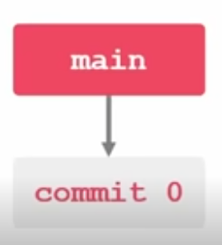
</p>

- Em seguida nós gera-se um novo commit (`commit-1`) e essa branch passa a apontar pra ele.

<p align="center">
  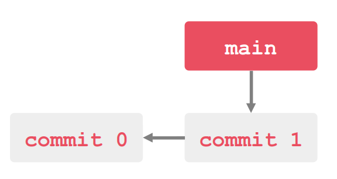
</p>

- Cria-se mais um (`commit-2`) e assim sucessivamente (lembrar do comando `git log` com a indicação HEAD do commit mais recente)
- Vamos supor que dentro da branch main decidimos testar um novo recurso. Para isso criamos uma nova branch que decidimos chamar de `teste`.
- Quando criamos uma branch dentro de um commit já existente ela passa a apontar para o mesmo commit que já estava apontando.

<p align="center">
  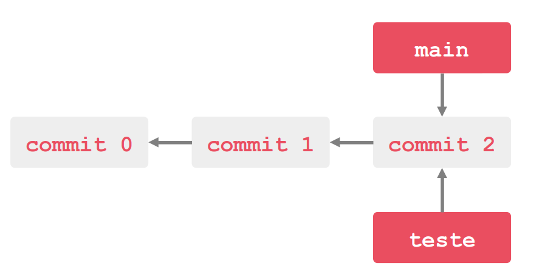
</p>

- Como ela trabalha de forma independente a partir do mesmo commit, nós ppodemos criar um novo commit a partir da branch teste. 
- Feito isso, ela deixa de apontar para o `commit-2` e passa a apontar para o `commit-3`.

<p align="center">
  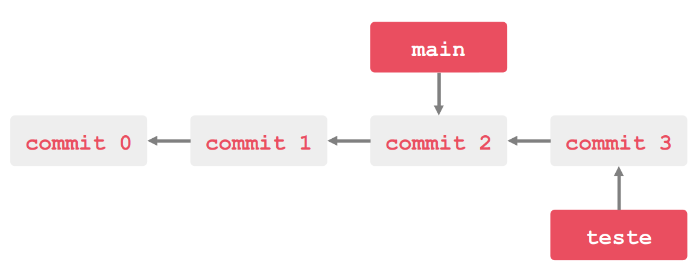
</p>

- Observe que a branch main continua apontando para o `commit-2`.

### Operações realizadas no terminal:

#### 1. Gerando-se um novo commit (commit-1):

```
git log
echo "#commit-1-branch-main" > commit-1-branch-main.txt"
git add .
git commit -m "commit-1"
```

<p align="center">
    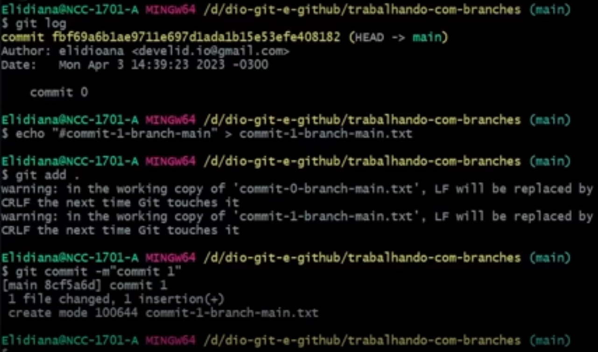
</p>

#### 2. Branch apontando para o `commit-1`:

```
git log
```
<p align="center">
  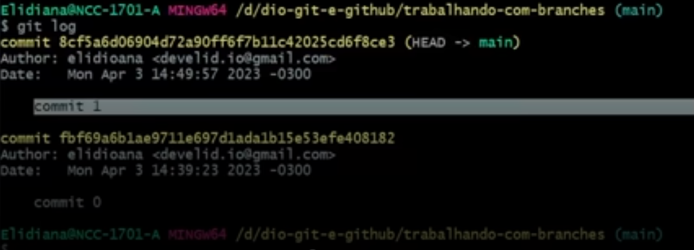
</p>

#### 3. Criando mais um commit:

```
echo "#commit-2-branch-main" > commit-2-branch-main.txt"
git add .
git commit -m "commit-2"
```

<p align="center">
  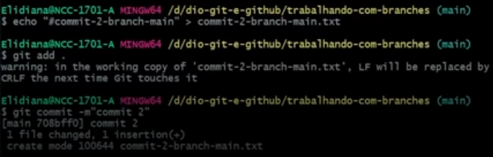
</p>

#### 4. Verificação:

```
git log
```
Veja que o ponteiro agora está apontando para o `commit-2`.

<p align="center">
  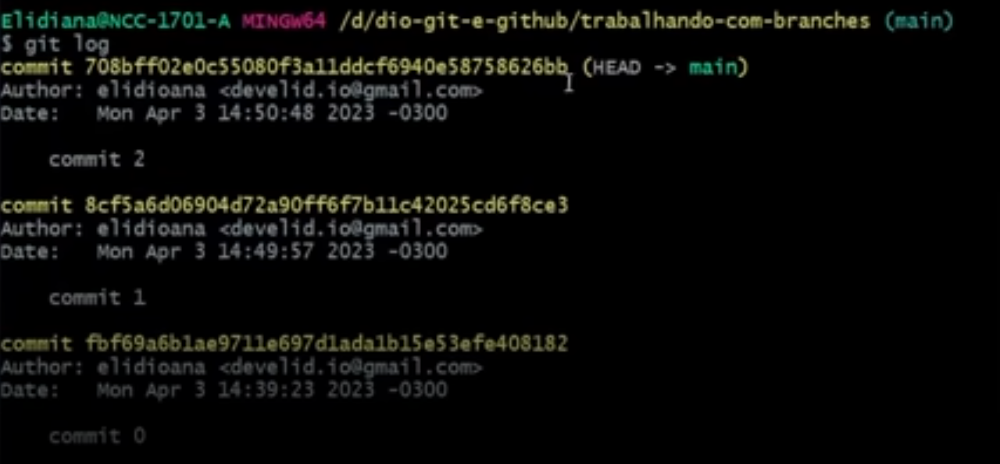
</p>

#### 5. Criando a branch teste:

```
git checkout -b teste
``` 
Este comando irá mover ponteiro de `main` para `teste`. Perceba que a branch `teste` está apontando para o mesmo commit da branch `main` (que é o `commit-2`).

<p align="center">
  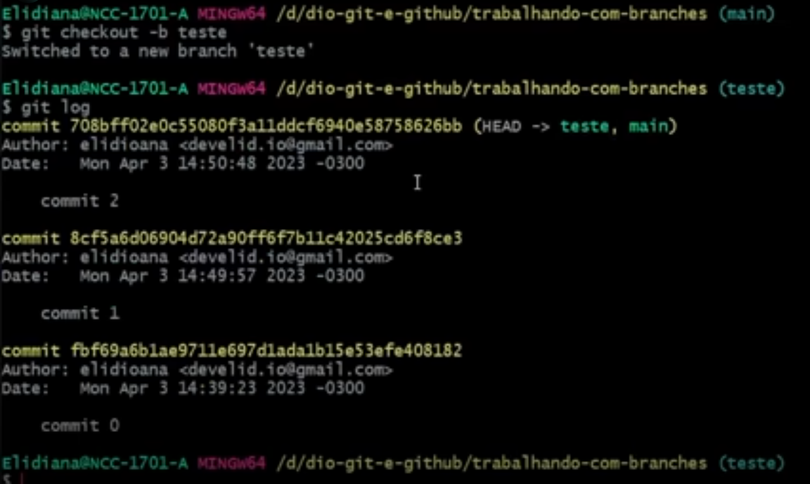
</p>

#### 6. Fazendo um novo commit dentro da branch `teste`.

Repetindo os passos para o `commit-3`. Perceba que a branch `teste` estará apontando para o `commit-3`, enquanto a branch `main` continuará apontando para o `commit-2`.

```
echo "#commit-3-branch-main" > commit-3-branch-main.txt"
git add .
git commit -m "commit-3"
git log
```

<p align="center">
  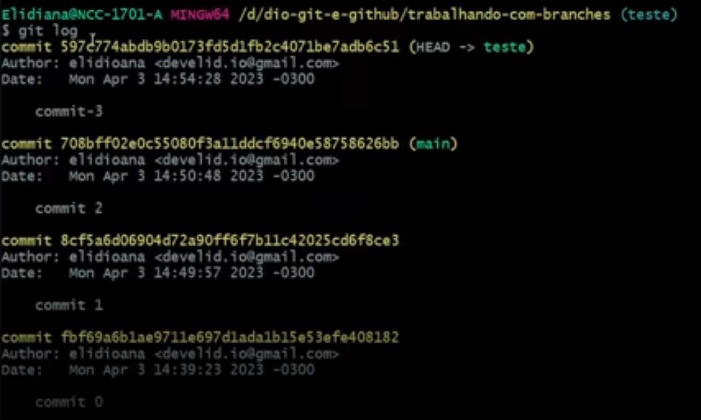
</p>

#### 7. Retornando para a branch `main`.

```
git checkout main
```

<p align="center">
  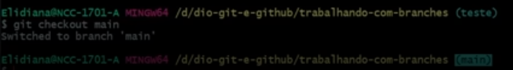
</p>

#### 8. O comando `git branch -v` irá listar o último commit de cada branch.

```
git branch -v
```

<p align="center">
  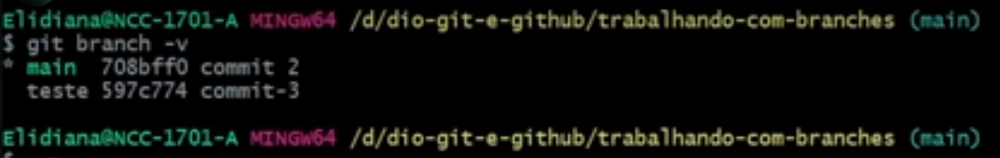
</p>

- Caso desejemos que as alteraçòes que fizemos na branch teste apareça também na branch main, preciremos mesclá-las.
- Para isso nos vamos usar o comando ```git merge teste``` (teste será a branch que iremos mesclar com a branch main).

<p align="center">
  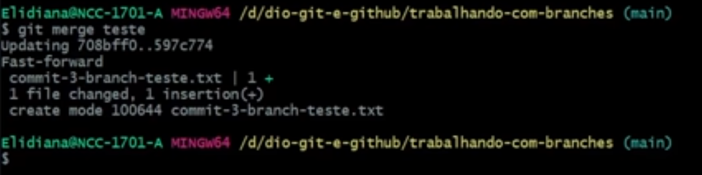
</p>

- Podemos excluir a branch teste, já que não iremos mais utilizá-la.

<p align="center">
  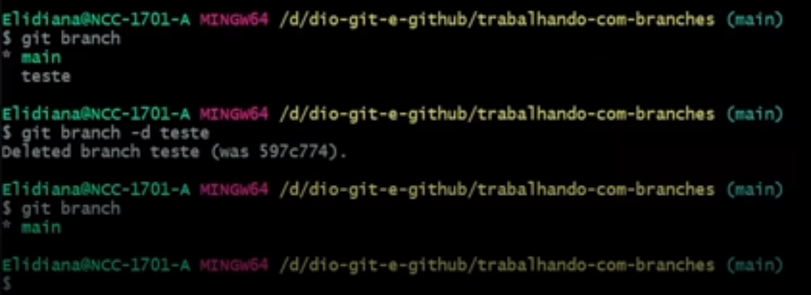
</p>

## Vídeo 15 - Trabalhando com Branches - Comandos Úteis no Dia a Dia
 
- Comandos ```git fetch```e ```git merge```.
- O comando ```git fetch``` baixa o arquivo no repositório remoto para o local sem estar mesclando.
- Usar o comando ```git diff```para verificaar as diferenças.

<p align="center">
  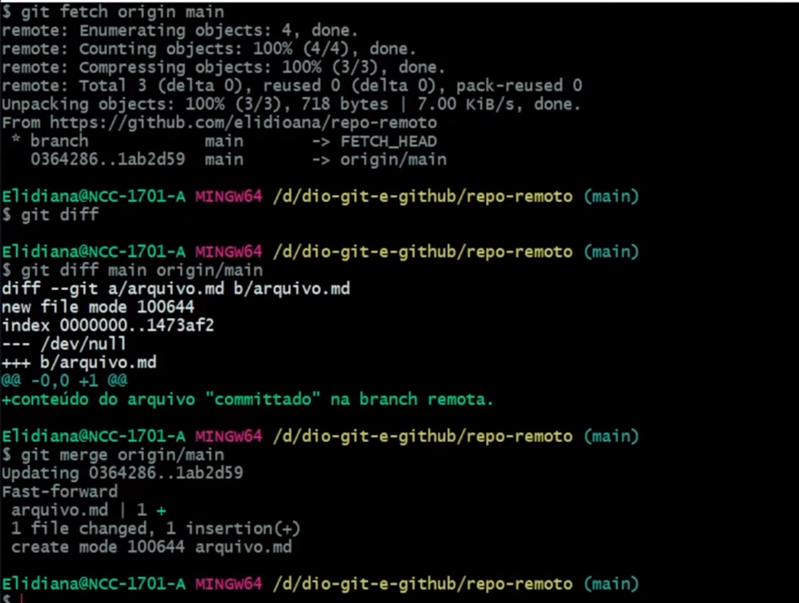
</p>

- Agora uma forma de clonar apenas uma branch em específica do repositório. 
- Atentar para o parâmetro ```--single-branch```.

<p align="center">
  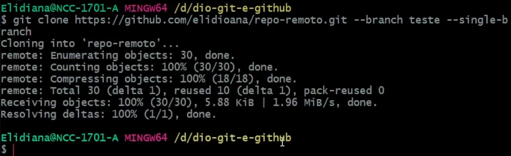
</p>

## Vídeo 16 - Dicas e Materiais de Apoio

### 📚 Recursos Úteis
#### 🔗 Repositório

- [elidianaandrade/git-github-learning-quest](https://github.com/elidianaandrade/git-github-learning-quest) — Repositório com material de apoio gamificado.

#### 🖥️ Slide

- Versionamento de Código com Git e GitHub.pptx — Apresentação utilizada no curso.

#### 🌐 Links Úteis

- [GitHub Quick Start](https://github.com/githubtraining/hellogitworld) — Repositório com link para aulas de Git e GitHub.
- [GitBook](https://github.com/github/certification): Formação GitHub Certification — Material textual sobre GitHub.
- [Documentação do GitHub](https://docs.github.com/pt) — Guia completo para uso do GitHub.
- [GitHub Markdown](https://guides.github.com/features/mastering-markdown/) — Guia específico para Markdown no GitHub.

#### 💡 Dicas

- Artigos/Fórum: você pode compartilhar conteúdos técnicos através de Artigos (visíveis globalmente na plataforma da DIO). Por outro lado, você também pode compartilhar suas conquistas e dúvidas usando os Fóruns (que são específicos para cada experiência educacional na DIO, como um Bootcamp por exemplo).
- Pesquise na Web: pode parecer óbvio, mas é importante frisar a importância das engines de busca no dia a dia de um profissional de TI. Caso não encontre o que procura dentro da DIO, pesquise sobre o assunto (conceito, dúvida, erro etc) na Internet

# Certificado: Versionamento de Código com Git

Link do certificado: https://hermes.dio.me/certificates/F10OC6FU.pdf
