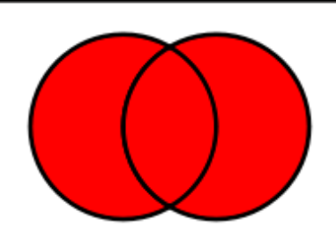
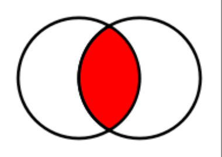

# Parte 1 - Explorando Conjuntos em Python

# 🟩 Vídeo 01 - Conjuntos

## Objetivo Geral

- Entender o funcionamento da estrutura de dados set.

## Criando sets

- Um set é uma coleção que não possui objetos repetidos, usamos sets para representar conjuntos matemáticos ou eliminar itens duplicados de um iterável.

## Exemplo

```
set([1, 2, 3, 1, 3, 4])  # {1, 2, 3, 4}

set("abacaxi")  # {"b", "a", "c", "x", "i"}

set(("palio", "gol", "celta", "palio"))  # {"gol", "celta", "palio"}
```

## Acessando os dados

- Conjuntos em Python não suportam indexação e nem fatiamento, caso queira acessar os seus valores é necessário converter o conjunto para lista.

## Exemplo

```
numeros = {1, 2, 3, 2}

numeros = list(numeros)

numeros[0]
```

### Iterar conjuntos

- A forma mais comum para percorrer os dados de um conjunto é utilizando o comando for.

### Exemplo

```
carros = {"gol", "celta", "palio"}

for carro in carros:
    print(carro)
```

### Função enumerate

- Às vezes é necessário saber qual o índice do objeto dentro do laço for. Para isso podemos usar a função enumerate.

### Exemplo

```
carros = {"gol", "celta", "palio"}

for indice, carro in enumerate(carros):
    print(f"{indice}: {carro}")
```

## Métodos da classe set

### {}.union

```
conjunto_a = {1, 2}
conjunto_b = {3, 4}

conjunto_a.union(conjunto_b) # {1, 2, 3, 4}
```

<p align="center">
    
</p>

### {}.intersection

```
conjunto_a = {1, 2, 3}
conjunto_b = {2, 3, 4}

conjunto_a.intersection(conjunto_b) # {2, 3}
```

<p align="center">
    
</p>


# Parte 2 - Materiais de apoio e Questionário

## Materiais de apoio

Disponibilizados os seguinte arquivos em formato MS Powerpoint:
- 03-Dio_Conjuntos.pdf

# Certificado: Conhecendo Tuplas em Python

Link do certificado: