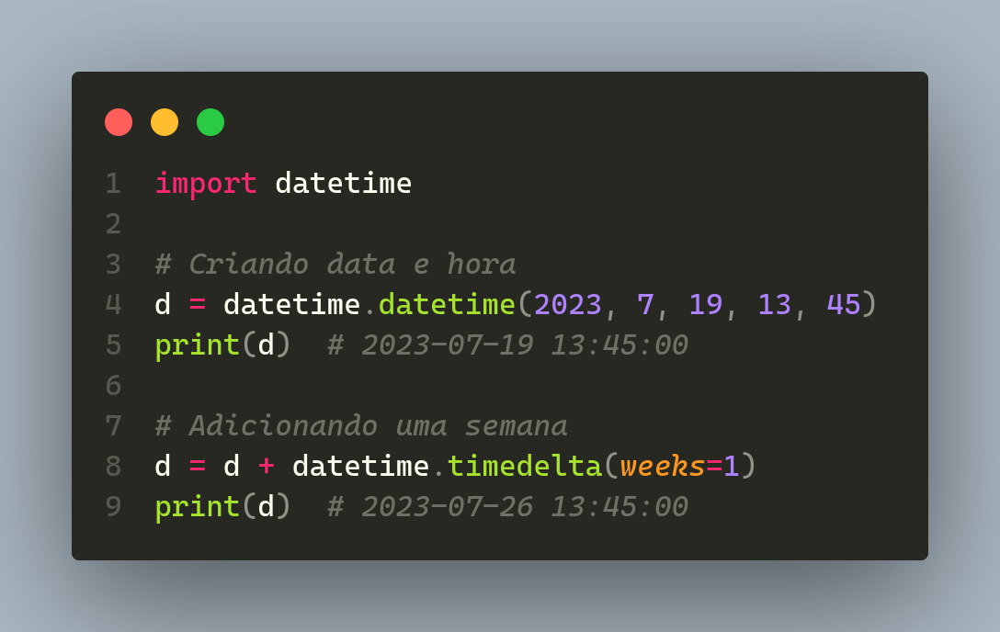
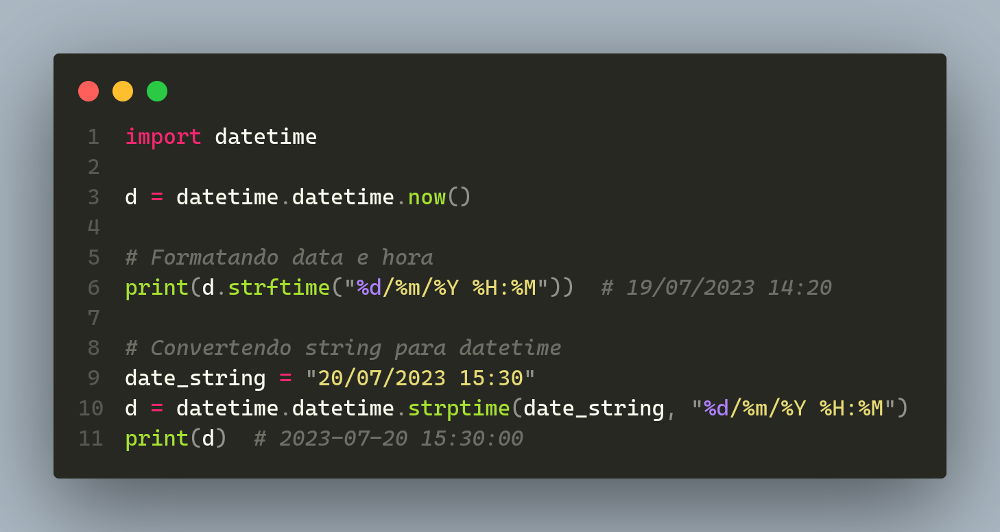
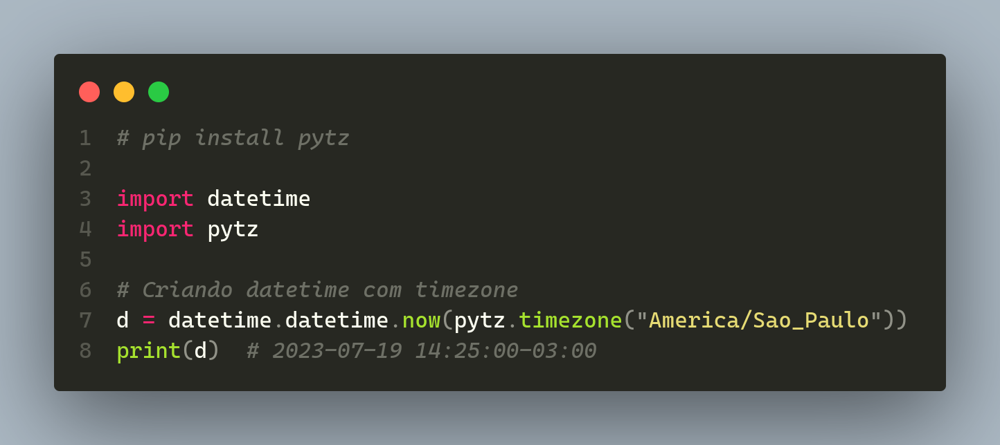
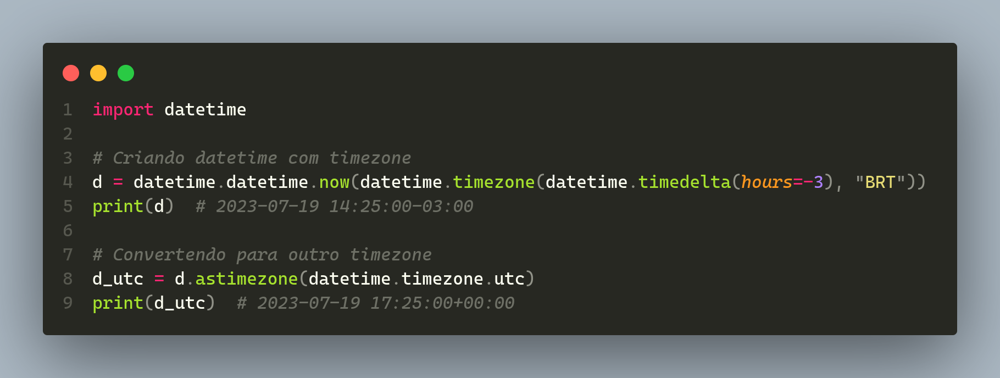

# Parte 1 - Lidando com Data, Hora e Fuso Horário no Python

- Instrutor: Guilherme Arthur de Carvalho (Analista de Sistemas)
- Contato Libkedin: https://www.linkedin.com/in/decarvalhogui/
- Linktree: https://linktr.ee/decarvalhogui

## 🟩 Vídeo 01 - Trabalhando com objetos date, datetime e time

### Objetivo Geral

- Aprender a trabalhar com datas, horas e fusos horários em Python, dominando o módulo 'datetime' para manipulações precisas.

### Introdução ao módulo datetime

#### O que é o módulo datetime?

- O módulo 'datetime' em Python é usado para lidar com datas e horas. Ele possui várias classes úteis como date, time e timedelta.

#### Exemplo de código

<p align="center">
    
</p>

## 🟩 Vídeo 02 - Manipulando datas com timedelta

### Introdução

- Podemos criar e manipular objetos date, time e datetime de várias maneiras. Por exemplo, podemos adicionar e subtrair datas, verificar a diferença entre datas e muito mais.

### Exemplo de código

<p align="center">
    
</p>

### Exercício feito em aula

```
from datetime import datetime, timedelta

tipo_carro = "P"  # P, M, G
tempo_pequeno = 30
tempo_medio = 45
tempo_grande = 60
data_atual = datetime.now()

if tipo_carro == "P":
    data_estimada = data_atual + timedelta(minutes=tempo_pequeno)
    print(f"O carro chegou: {data_atual} e ficará pronto às {data_estimada}")
elif tipo_carro == "M":
    data_estimada = data_atual + timedelta(minutes=tempo_medio)
    print(f"O carro chegou: {data_atual} e ficará pronto às {data_estimada}")
else:
    data_estimada = data_atual + timedelta(minutes=tempo_grande)
    print(f"O carro chegou: {data_atual} e ficará pronto às {data_estimada}")

```

### Saída:

```
O carro chegou: 2025-07-26 14:45:05.077475 e ficará pronto às 2025-07-26 15:15:05.077475
```

## 🟩 Vídeo 03 - Formatando e convertendo datas com strftime e strptime

#### Introdução

- Python também permite converter e formatar datas e horas. Para isso, usamos os métodos 'strftime' (string format time) e 'strptime' (string parse time).

#### Exemplo de código

<p align="center">
    
</p>

## 🟩 Vídeo 04 - Trabalhando com timezone

#### Introdução

- Quando trabalhamos com data e hora, lidar com fusos horários é uma necessidade comum. Python facilita isso através do módulo 'pytz'.

#### Exemplo de código

<p align="center">
    
</p>

### Trabalhando com tz sem bibliotecas externas

- O Python permite fazer isso com o módulo datetime padrão, embora seja um pouco mais complexo do que usando bibliotecas como 'pytz'.

#### Exemplo de código

<p align="center">
    
</p>

# Parte 2 - Hands-On - Lidando com Data, Hora e Fuso Horário no Python 

## 🟩 Vídeo 05 - Explicação do desafio

### Introdução

- Com os novos conhecimentos adquiridos sobre data e hora, você foi encarregado de implementar as seguintes funcionalidades no sisetma:

    - Estabelecer um limite de 10 transações diárias para uma conta
    - Se o usuário tentar fazer uma transação após atingir o limite, deve ser informado que ele excedeu o número de transações permitidas para aquele dia.
    - Mostre no extrato, a data e hora de todas as transações.

### Algoritmo do Desafio (apresentado na aula)

<details>
     <summary> 🟨🟨🟨<h3>Algoritmo Versão 1 (template sem implementação) - Clique para expandir<h3>🟨🟨🟨 </summary>

```
import textwrap
from abc import ABC, abstractclassmethod, abstractproperty
from datetime import datetime


class ContasIterador:
    def __init__(self, contas):
        self.contas = contas
        self._index = 0

    def __iter__(self):
        return self

    def __next__(self):
        try:
            conta = self.contas[self._index]
            return f"""\
            Agência:\t{conta.agencia}
            Número:\t\t{conta.numero}
            Titular:\t{conta.cliente.nome}
            Saldo:\t\tR$ {conta.saldo:.2f}
        """
        except IndexError:
            raise StopIteration
        finally:
            self._index += 1


class Cliente:
    def __init__(self, endereco):
        self.endereco = endereco
        self.contas = []
        self.indice_conta = 0

    def realizar_transacao(self, conta, transacao):
        # TODO: validar o número de transações e invalidar a operação se for necessário
        # print("\n@@@ Você excedeu o número de transações permitidas para hoje! @@@")
        transacao.registrar(conta)

    def adicionar_conta(self, conta):
        self.contas.append(conta)


class PessoaFisica(Cliente):
    def __init__(self, nome, data_nascimento, cpf, endereco):
        super().__init__(endereco)
        self.nome = nome
        self.data_nascimento = data_nascimento
        self.cpf = cpf


class Conta:
    def __init__(self, numero, cliente):
        self._saldo = 0
        self._numero = numero
        self._agencia = "0001"
        self._cliente = cliente
        self._historico = Historico()

    @classmethod
    def nova_conta(cls, cliente, numero):
        return cls(numero, cliente)

    @property
    def saldo(self):
        return self._saldo

    @property
    def numero(self):
        return self._numero

    @property
    def agencia(self):
        return self._agencia

    @property
    def cliente(self):
        return self._cliente

    @property
    def historico(self):
        return self._historico

    def sacar(self, valor):
        saldo = self.saldo
        excedeu_saldo = valor > saldo

        if excedeu_saldo:
            print("\n@@@ Operação falhou! Você não tem saldo suficiente. @@@")

        elif valor > 0:
            self._saldo -= valor
            print("\n=== Saque realizado com sucesso! ===")
            return True

        else:
            print("\n@@@ Operação falhou! O valor informado é inválido. @@@")

        return False

    def depositar(self, valor):
        if valor > 0:
            self._saldo += valor
            print("\n=== Depósito realizado com sucesso! ===")
        else:
            print("\n@@@ Operação falhou! O valor informado é inválido. @@@")
            return False

        return True


class ContaCorrente(Conta):
    def __init__(self, numero, cliente, limite=500, limite_saques=3):
        super().__init__(numero, cliente)
        self._limite = limite
        self._limite_saques = limite_saques

    @classmethod
    def nova_conta(cls, cliente, numero, limite, limite_saques):
        return cls(numero, cliente, limite, limite_saques)

    def sacar(self, valor):
        numero_saques = len(
            [transacao for transacao in self.historico.transacoes if transacao["tipo"] == Saque.__name__]
        )

        excedeu_limite = valor > self._limite
        excedeu_saques = numero_saques >= self._limite_saques

        if excedeu_limite:
            print("\n@@@ Operação falhou! O valor do saque excede o limite. @@@")

        elif excedeu_saques:
            print("\n@@@ Operação falhou! Número máximo de saques excedido. @@@")

        else:
            return super().sacar(valor)

        return False

    def __str__(self):
        return f"""\
            Agência:\t{self.agencia}
            C/C:\t\t{self.numero}
            Titular:\t{self.cliente.nome}
        """


class Historico:
    def __init__(self):
        self._transacoes = []

    @property
    def transacoes(self):
        return self._transacoes

    def adicionar_transacao(self, transacao):
        self._transacoes.append(
            {
                "tipo": transacao.__class__.__name__,
                "valor": transacao.valor,
                "data": datetime.now().strftime("%d-%m-%Y %H:%M:%S"),
            }
        )

    def gerar_relatorio(self, tipo_transacao=None):
        for transacao in self._transacoes:
            if tipo_transacao is None or transacao["tipo"].lower() == tipo_transacao.lower():
                yield transacao

    # TODO: filtrar todas as transações realizadas no dia
    def transacoes_do_dia(self):
        pass


class Transacao(ABC):
    @property
    @abstractproperty
    def valor(self):
        pass

    @abstractclassmethod
    def registrar(self, conta):
        pass


class Saque(Transacao):
    def __init__(self, valor):
        self._valor = valor

    @property
    def valor(self):
        return self._valor

    def registrar(self, conta):
        sucesso_transacao = conta.sacar(self.valor)

        if sucesso_transacao:
            conta.historico.adicionar_transacao(self)


class Deposito(Transacao):
    def __init__(self, valor):
        self._valor = valor

    @property
    def valor(self):
        return self._valor

    def registrar(self, conta):
        sucesso_transacao = conta.depositar(self.valor)

        if sucesso_transacao:
            conta.historico.adicionar_transacao(self)


def log_transacao(func):
    def envelope(*args, **kwargs):
        resultado = func(*args, **kwargs)
        print(f"{datetime.now()}: {func.__name__.upper()}")
        return resultado

    return envelope


def menu():
    menu = """\n
    ================ MENU ================
    [d]\tDepositar
    [s]\tSacar
    [e]\tExtrato
    [nc]\tNova conta
    [lc]\tListar contas
    [nu]\tNovo usuário
    [q]\tSair
    => """
    return input(textwrap.dedent(menu))


def filtrar_cliente(cpf, clientes):
    clientes_filtrados = [cliente for cliente in clientes if cliente.cpf == cpf]
    return clientes_filtrados[0] if clientes_filtrados else None


def recuperar_conta_cliente(cliente):
    if not cliente.contas:
        print("\n@@@ Cliente não possui conta! @@@")
        return

    # FIXME: não permite cliente escolher a conta
    return cliente.contas[0]


@log_transacao
def depositar(clientes):
    cpf = input("Informe o CPF do cliente: ")
    cliente = filtrar_cliente(cpf, clientes)

    if not cliente:
        print("\n@@@ Cliente não encontrado! @@@")
        return

    valor = float(input("Informe o valor do depósito: "))
    transacao = Deposito(valor)

    conta = recuperar_conta_cliente(cliente)
    if not conta:
        return

    cliente.realizar_transacao(conta, transacao)


@log_transacao
def sacar(clientes):
    cpf = input("Informe o CPF do cliente: ")
    cliente = filtrar_cliente(cpf, clientes)

    if not cliente:
        print("\n@@@ Cliente não encontrado! @@@")
        return

    valor = float(input("Informe o valor do saque: "))
    transacao = Saque(valor)

    conta = recuperar_conta_cliente(cliente)
    if not conta:
        return

    cliente.realizar_transacao(conta, transacao)


@log_transacao
def exibir_extrato(clientes):
    cpf = input("Informe o CPF do cliente: ")
    cliente = filtrar_cliente(cpf, clientes)

    if not cliente:
        print("\n@@@ Cliente não encontrado! @@@")
        return

    conta = recuperar_conta_cliente(cliente)
    if not conta:
        return

    print("\n================ EXTRATO ================")
    extrato = ""
    tem_transacao = False
    for transacao in conta.historico.gerar_relatorio():
        tem_transacao = True
        extrato += f"\n{transacao['tipo']}:\n\tR$ {transacao['valor']:.2f}"

    if not tem_transacao:
        extrato = "Não foram realizadas movimentações"

    print(extrato)
    print(f"\nSaldo:\n\tR$ {conta.saldo:.2f}")
    print("==========================================")


@log_transacao
def criar_cliente(clientes):
    cpf = input("Informe o CPF (somente número): ")
    cliente = filtrar_cliente(cpf, clientes)

    if cliente:
        print("\n@@@ Já existe cliente com esse CPF! @@@")
        return

    nome = input("Informe o nome completo: ")
    data_nascimento = input("Informe a data de nascimento (dd-mm-aaaa): ")
    endereco = input("Informe o endereço (logradouro, nro - bairro - cidade/sigla estado): ")

    cliente = PessoaFisica(nome=nome, data_nascimento=data_nascimento, cpf=cpf, endereco=endereco)

    clientes.append(cliente)

    print("\n=== Cliente criado com sucesso! ===")


@log_transacao
def criar_conta(numero_conta, clientes, contas):
    cpf = input("Informe o CPF do cliente: ")
    cliente = filtrar_cliente(cpf, clientes)

    if not cliente:
        print("\n@@@ Cliente não encontrado, fluxo de criação de conta encerrado! @@@")
        return

    # NOTE: O valor padrão de limite de saques foi alterado para 50 saques
    conta = ContaCorrente.nova_conta(cliente=cliente, numero=numero_conta, limite=500, limite_saques=50)
    contas.append(conta)
    cliente.contas.append(conta)

    print("\n=== Conta criada com sucesso! ===")


def listar_contas(contas):
    for conta in ContasIterador(contas):
        print("=" * 100)
        print(textwrap.dedent(str(conta)))


def main():
    clientes = []
    contas = []

    while True:
        opcao = menu()

        if opcao == "d":
            depositar(clientes)

        elif opcao == "s":
            sacar(clientes)

        elif opcao == "e":
            exibir_extrato(clientes)

        elif opcao == "nu":
            criar_cliente(clientes)

        elif opcao == "nc":
            numero_conta = len(contas) + 1
            criar_conta(numero_conta, clientes, contas)

        elif opcao == "lc":
            listar_contas(contas)

        elif opcao == "q":
            break

        else:
            print("\n@@@ Operação inválida, por favor selecione novamente a operação desejada. @@@")


main()

```
</details>


## 🟩 Vídeo 06 - Resolução do desafio

<details>
     <summary> 🟥🟥🟥 <h3>Algoritmo Versão 2 (template COM implementação) - Clique para expandir<h3>🟥🟥🟥 </summary>

```
import textwrap
from abc import ABC, abstractclassmethod, abstractproperty
from datetime import datetime


class ContasIterador:
    def __init__(self, contas):
        self.contas = contas
        self._index = 0

    def __iter__(self):
        return self

    def __next__(self):
        try:
            conta = self.contas[self._index]
            return f"""\
            Agência:\t{conta.agencia}
            Número:\t\t{conta.numero}
            Titular:\t{conta.cliente.nome}
            Saldo:\t\tR$ {conta.saldo:.2f}
        """
        except IndexError:
            raise StopIteration
        finally:
            self._index += 1


class Cliente:
    def __init__(self, endereco):
        self.endereco = endereco
        self.contas = []
        self.indice_conta = 0

    def realizar_transacao(self, conta, transacao):
        if len(conta.historico.transacoes_do_dia()) >= 2:
            print("\n@@@ Você excedeu o número de transações permitidas para hoje! @@@")
            return

        transacao.registrar(conta)

    def adicionar_conta(self, conta):
        self.contas.append(conta)


class PessoaFisica(Cliente):
    def __init__(self, nome, data_nascimento, cpf, endereco):
        super().__init__(endereco)
        self.nome = nome
        self.data_nascimento = data_nascimento
        self.cpf = cpf


class Conta:
    def __init__(self, numero, cliente):
        self._saldo = 0
        self._numero = numero
        self._agencia = "0001"
        self._cliente = cliente
        self._historico = Historico()

    @classmethod
    def nova_conta(cls, cliente, numero):
        return cls(numero, cliente)

    @property
    def saldo(self):
        return self._saldo

    @property
    def numero(self):
        return self._numero

    @property
    def agencia(self):
        return self._agencia

    @property
    def cliente(self):
        return self._cliente

    @property
    def historico(self):
        return self._historico

    def sacar(self, valor):
        saldo = self.saldo
        excedeu_saldo = valor > saldo

        if excedeu_saldo:
            print("\n@@@ Operação falhou! Você não tem saldo suficiente. @@@")

        elif valor > 0:
            self._saldo -= valor
            print("\n=== Saque realizado com sucesso! ===")
            return True

        else:
            print("\n@@@ Operação falhou! O valor informado é inválido. @@@")

        return False

    def depositar(self, valor):
        if valor > 0:
            self._saldo += valor
            print("\n=== Depósito realizado com sucesso! ===")
        else:
            print("\n@@@ Operação falhou! O valor informado é inválido. @@@")
            return False

        return True


class ContaCorrente(Conta):
    def __init__(self, numero, cliente, limite=500, limite_saques=3):
        super().__init__(numero, cliente)
        self._limite = limite
        self._limite_saques = limite_saques

    @classmethod
    def nova_conta(cls, cliente, numero, limite, limite_saques):
        return cls(numero, cliente, limite, limite_saques)

    def sacar(self, valor):
        numero_saques = len(
            [
                transacao
                for transacao in self.historico.transacoes
                if transacao["tipo"] == Saque.__name__
            ]
        )

        excedeu_limite = valor > self._limite
        excedeu_saques = numero_saques >= self._limite_saques

        if excedeu_limite:
            print("\n@@@ Operação falhou! O valor do saque excede o limite. @@@")

        elif excedeu_saques:
            print("\n@@@ Operação falhou! Número máximo de saques excedido. @@@")

        else:
            return super().sacar(valor)

        return False

    def __str__(self):
        return f"""\
            Agência:\t{self.agencia}
            C/C:\t\t{self.numero}
            Titular:\t{self.cliente.nome}
        """


class Historico:
    def __init__(self):
        self._transacoes = []

    @property
    def transacoes(self):
        return self._transacoes

    def adicionar_transacao(self, transacao):
        self._transacoes.append(
            {
                "tipo": transacao.__class__.__name__,
                "valor": transacao.valor,
                "data": datetime.utcnow().strftime("%d-%m-%Y %H:%M:%S"),
            }
        )

    def gerar_relatorio(self, tipo_transacao=None):
        for transacao in self._transacoes:
            if (
                tipo_transacao is None
                or transacao["tipo"].lower() == tipo_transacao.lower()
            ):
                yield transacao

    def transacoes_do_dia(self):
        data_atual = datetime.utcnow().date()
        transacoes = []
        for transacao in self._transacoes:
            data_transacao = datetime.strptime(
                transacao["data"], "%d-%m-%Y %H:%M:%S"
            ).date()
            if data_atual == data_transacao:
                transacoes.append(transacao)
        return transacoes


class Transacao(ABC):
    @property
    @abstractproperty
    def valor(self):
        pass

    @abstractclassmethod
    def registrar(self, conta):
        pass


class Saque(Transacao):
    def __init__(self, valor):
        self._valor = valor

    @property
    def valor(self):
        return self._valor

    def registrar(self, conta):
        sucesso_transacao = conta.sacar(self.valor)

        if sucesso_transacao:
            conta.historico.adicionar_transacao(self)


class Deposito(Transacao):
    def __init__(self, valor):
        self._valor = valor

    @property
    def valor(self):
        return self._valor

    def registrar(self, conta):
        sucesso_transacao = conta.depositar(self.valor)

        if sucesso_transacao:
            conta.historico.adicionar_transacao(self)


def log_transacao(func):
    def envelope(*args, **kwargs):
        resultado = func(*args, **kwargs)
        print(f"{datetime.now()}: {func.__name__.upper()}")
        return resultado

    return envelope


def menu():
    menu = """\n
    ================ MENU ================
    [d]\tDepositar
    [s]\tSacar
    [e]\tExtrato
    [nc]\tNova conta
    [lc]\tListar contas
    [nu]\tNovo usuário
    [q]\tSair
    => """
    return input(textwrap.dedent(menu))


def filtrar_cliente(cpf, clientes):
    clientes_filtrados = [cliente for cliente in clientes if cliente.cpf == cpf]
    return clientes_filtrados[0] if clientes_filtrados else None


def recuperar_conta_cliente(cliente):
    if not cliente.contas:
        print("\n@@@ Cliente não possui conta! @@@")
        return

    # FIXME: não permite cliente escolher a conta
    return cliente.contas[0]


@log_transacao
def depositar(clientes):
    cpf = input("Informe o CPF do cliente: ")
    cliente = filtrar_cliente(cpf, clientes)

    if not cliente:
        print("\n@@@ Cliente não encontrado! @@@")
        return

    valor = float(input("Informe o valor do depósito: "))
    transacao = Deposito(valor)

    conta = recuperar_conta_cliente(cliente)
    if not conta:
        return

    cliente.realizar_transacao(conta, transacao)


@log_transacao
def sacar(clientes):
    cpf = input("Informe o CPF do cliente: ")
    cliente = filtrar_cliente(cpf, clientes)

    if not cliente:
        print("\n@@@ Cliente não encontrado! @@@")
        return

    valor = float(input("Informe o valor do saque: "))
    transacao = Saque(valor)

    conta = recuperar_conta_cliente(cliente)
    if not conta:
        return

    cliente.realizar_transacao(conta, transacao)


@log_transacao
def exibir_extrato(clientes):
    cpf = input("Informe o CPF do cliente: ")
    cliente = filtrar_cliente(cpf, clientes)

    if not cliente:
        print("\n@@@ Cliente não encontrado! @@@")
        return

    conta = recuperar_conta_cliente(cliente)
    if not conta:
        return

    print("\n================ EXTRATO ================")
    extrato = ""
    tem_transacao = False
    for transacao in conta.historico.gerar_relatorio():
        tem_transacao = True
        extrato += f"\n{transacao['data']}\n{transacao['tipo']}:\n\tR$ {transacao['valor']:.2f}"

    if not tem_transacao:
        extrato = "Não foram realizadas movimentações"

    print(extrato)
    print(f"\nSaldo:\n\tR$ {conta.saldo:.2f}")
    print("==========================================")


@log_transacao
def criar_cliente(clientes):
    cpf = input("Informe o CPF (somente número): ")
    cliente = filtrar_cliente(cpf, clientes)

    if cliente:
        print("\n@@@ Já existe cliente com esse CPF! @@@")
        return

    nome = input("Informe o nome completo: ")
    data_nascimento = input("Informe a data de nascimento (dd-mm-aaaa): ")
    endereco = input(
        "Informe o endereço (logradouro, nro - bairro - cidade/sigla estado): "
    )

    cliente = PessoaFisica(
        nome=nome, data_nascimento=data_nascimento, cpf=cpf, endereco=endereco
    )

    clientes.append(cliente)

    print("\n=== Cliente criado com sucesso! ===")


@log_transacao
def criar_conta(numero_conta, clientes, contas):
    cpf = input("Informe o CPF do cliente: ")
    cliente = filtrar_cliente(cpf, clientes)

    if not cliente:
        print("\n@@@ Cliente não encontrado, fluxo de criação de conta encerrado! @@@")
        return

    conta = ContaCorrente.nova_conta(
        cliente=cliente, numero=numero_conta, limite=500, limite_saques=50
    )
    contas.append(conta)
    cliente.contas.append(conta)

    print("\n=== Conta criada com sucesso! ===")


def listar_contas(contas):
    for conta in ContasIterador(contas):
        print("=" * 100)
        print(textwrap.dedent(str(conta)))


def main():
    clientes = []
    contas = []

    while True:
        opcao = menu()

        if opcao == "d":
            depositar(clientes)

        elif opcao == "s":
            sacar(clientes)

        elif opcao == "e":
            exibir_extrato(clientes)

        elif opcao == "nu":
            criar_cliente(clientes)

        elif opcao == "nc":
            numero_conta = len(contas) + 1
            criar_conta(numero_conta, clientes, contas)

        elif opcao == "lc":
            listar_contas(contas)

        elif opcao == "q":
            break

        else:
            print(
                "\n@@@ Operação inválida, por favor selecione novamente a operação desejada. @@@"
            )


main()
```
</details>

# Parte 3 - Materiais de apoio e Questionário

## Materiais de apoio

Disponibilizados os seguinte arquivos em formato MS Powerpoint:
- 04-Dio_Dicionarios.pptx

## Certificado: Aprendendo a Utilizar Dicionários em Python

Link do certificado: 