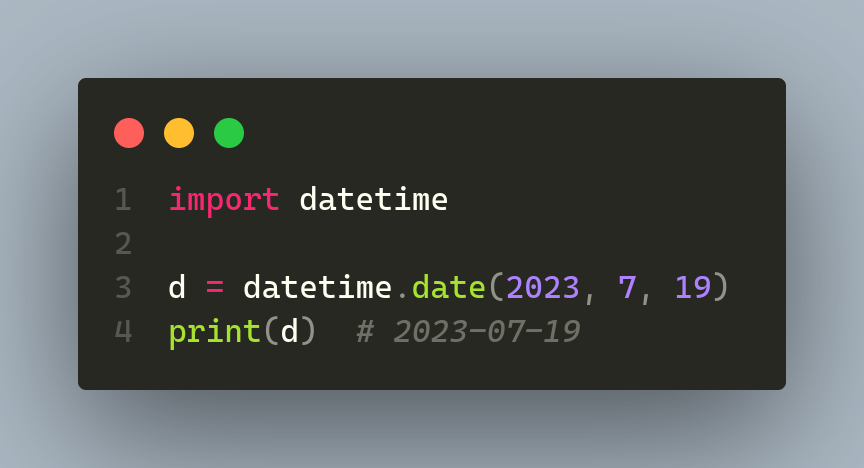

# Parte 1 - Lidando com Data, Hora e Fuso Horário no Python

## 🟩 Vídeo 01 - Trabalhando com objetos date, datetime e time

### Objetivo Geral

- Aprender a trabalhar com datas, horas e fusos horários em Python, dominando o módulo 'datetime' para manipulações precisas.

### Introdução ao módulo datetime

#### O que é o módulo datetime?

- O módulo 'datetime' em Python é usado para lidar com datas e horas. Ele possui várias classes úteis como date, time e timedelta.

#### Exemplo de código

    

## 🟩 Vídeo 02 - Manipulando datas com timedelta

## 🟩 Vídeo 03 - Formatando e convertendo datas com strftime e strptime

## 🟩 Vídeo 04 - Trabalhando com timezone

# Parte 2 - Hands-On - Lidando com Data, Hora e Fuso Horário no Python 

## 🟩 Vídeo 01 - Explicação do desafio

## 🟩 Vídeo 02 - Resolução do desafio

# Parte 3 - Materiais de apoio e Questionário

## Materiais de apoio

Disponibilizados os seguinte arquivos em formato MS Powerpoint:
- 04-Dio_Dicionarios.pptx

## Certificado: Aprendendo a Utilizar Dicionários em Python

Link do certificado: https://hermes.dio.me/certificates/UZPKD2UH.pdf