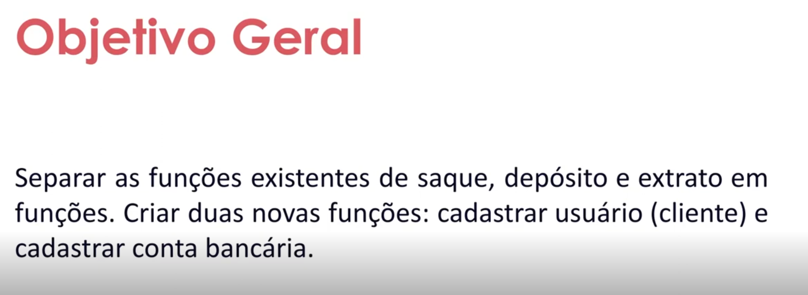

# Parte 1 - Desafio - Otimizando o Sistema Bancário com Funções Python

- Instrutor: Guilherme Arthur de Carvalho (Analista de Sistemas)
- Contato Libkedin: https://www.linkedin.com/in/decarvalhogui/
- Linktree: https://linktr.ee/decarvalhogui

## 🟩 Vídeo 01 - Apresentação do Desafio


<p align="center">
    
</p>

### Arquivo utilizado neste módulo

- Arquivo `desafio.py` do módulo de Fundamentos

<details>
     <summary> 🟩🟩🟩 <h3>Algoritmo - Clique para expandir<h3>🟨🟨🟨 </summary>

```
menu = """

[d] Depositar
[s] Sacar
[e] Extrato
[q] Sair

=> """

saldo = 0
limite = 500
extrato = ""
numero_saques = 0
LIMITE_SAQUES = 3

while True:

    opcao = input(menu)

    if opcao == "d":
        valor = float(input("Informe o valor do depósito: "))

        if valor > 0:
            saldo += valor
            extrato += f"Depósito: R$ {valor:.2f}\n"

        else:
            print("Operação falhou! O valor informado é inválido.")

    elif opcao == "s":
        valor = float(input("Informe o valor do saque: "))

        excedeu_saldo = valor > saldo

        excedeu_limite = valor > limite

        excedeu_saques = numero_saques >= LIMITE_SAQUES

        if excedeu_saldo:
            print("Operação falhou! Você não tem saldo suficiente.")

        elif excedeu_limite:
            print("Operação falhou! O valor do saque excede o limite.")

        elif excedeu_saques:
            print("Operação falhou! Número máximo de saques excedido.")

        elif valor > 0:
            saldo -= valor
            extrato += f"Saque: R$ {valor:.2f}\n"
            numero_saques += 1

        else:
            print("Operação falhou! O valor informado é inválido.")

    elif opcao == "e":
        print("\n================ EXTRATO ================")
        print("Não foram realizadas movimentações." if not extrato else extrato)
        print(f"\nSaldo: R$ {saldo:.2f}")
        print("==========================================")

    elif opcao == "q":
        break

    else:
        print("Operação inválida, por favor selecione novamente a operação desejada.")

```
</details>


# Parte 2 - Entrega do Desafio

## Materiais de apoio

## Certificado: Aprendendo a Utilizar Dicionários em Python

Link do certificado: https://hermes.dio.me/certificates/AQA3RRPA.pdf