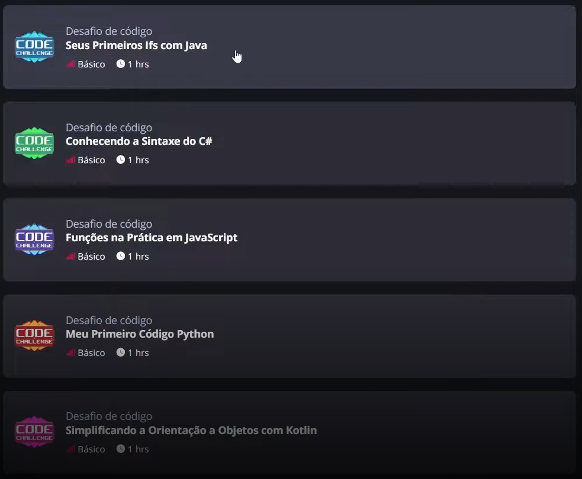
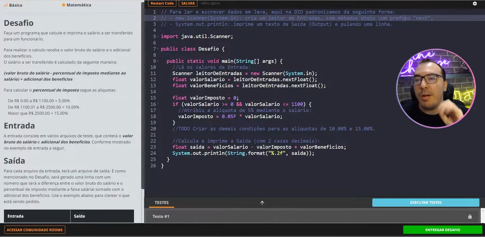
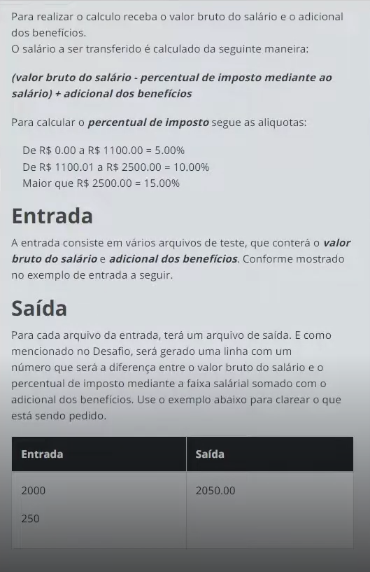
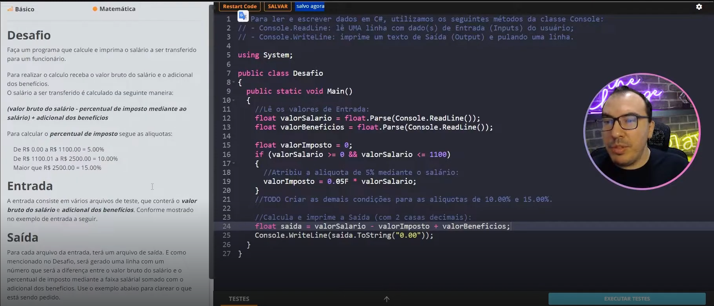
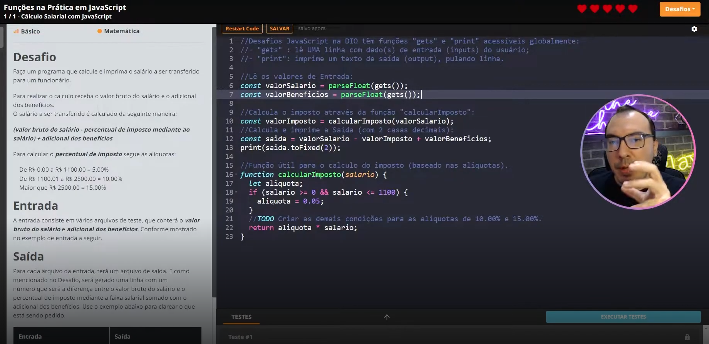
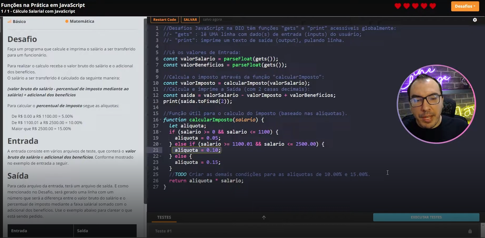
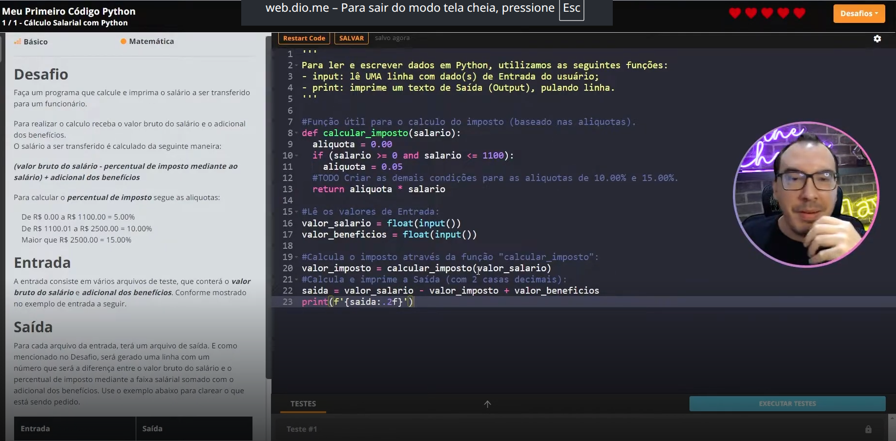
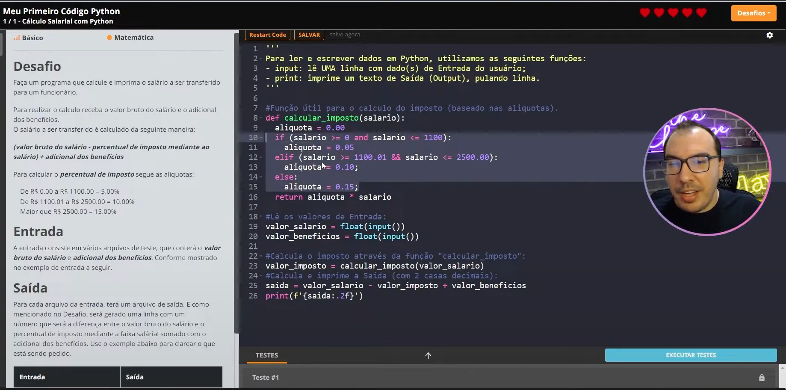

- Instrutor: Venilton Falvo Jr (Doutor em Engenharia de Software, Education Tech Lead na DIO)
- Contato: https://www.linkedin.com/in/falvojr/

## 🟩 Vídeo 01 - Introdução

- O instrutor explica o propósito dos desafios de código no aprendizado.
- Cada problema é uma oportunidade de superar limites.
- Compreender a engrenagem de uma lógica de programação e como aplicá-la nos desafios.
- Tour por diversas linguagens e de como usá-las como ferramentas de uma lógica estruturada.

## 🟩 Vídeo 02 - PBL, Lógica e Pensamento Computacional

### PBL (Problem Based Learning)

- Explicação acerca da metodologia educacional.
- PBL (Problem Based Learning) - uso de problemas reais para potencializar os esutdos.

### Lógica de programação e o pensamento computacional 

- Lógica de programação é como aprender um novo idioma, um que permite transformar problemas em soluções claras e ordenadas através de passos lógicos e algoritmos.

- Já o pensamento computacional é como ter um mapa que te ajuda a encontrar caminhos para resolver desafios, projetar sistemas e compreender comportamentos.

### Por Que Aprender Assim?
    
- Aprendizagem Ativa
    - Porque a melhor forma de aprender é fazendo.
    - É mais do que teoria; é se preparar para o mundo real, para as demandas e desafios do futuro.

- Transformação Digital
    - A programação se tornou mais do que uma habilidade, é a linguagem do futuro!
    - Dominar essa competência pode promover oportunidades incríveis!

- Comunidade Protagonista
    - Aqui, aprendemos juntos, interagindo, colaborando e compartilhando conhecimento.
    - Seja protagonista na comunidade tech mais vibrante do mundo!

## 🟩 Vídeo 03 - A Linguagem é Só Um Detalhe... Como Resolver Desafios de Código

- O professor apresenta na tela 5 desafios de código, cada um numa linguagem de programação diferente.

    

### PRIMEIRO Desafio de Código: Java

    

- Detalhamento do desafio e explicação de como funciona a plataforma 

    

### SEGUNDO Desafio de Código: C#

- Exatamente igual ao primeiro, mas em C#.

    

### TERCEIRO Desafio de Código: JavaScript

- O JavaScript é menos verboso que os anteriores.

    

- Podemos aproveitar as formas de representar as condições do Java e do C#.
- Substituindo `ValorImposto` por `aliquota` e `valorSalario` por `salario`.
- Também nõa preciso colocar o F do ponto flutuante no valor.

    

### QUARTO Desafio de Código: Python

    

- Solução

    

## 🟩 Vídeo 04 - Transcrições

## Certificado: Desafios de Código: Aperfeiçoe Sua Lógica e Pensamento Computacional

Link do certificado: 