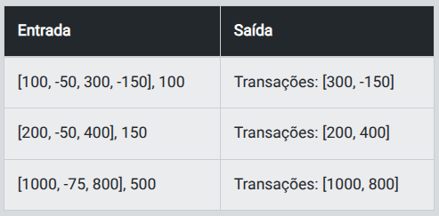

- Instrutor: Venilton Falvo Jr (Doutor em Engenharia de Software, Education Tech Lead na DIO)
- Contato: https://www.linkedin.com/in/falvojr/

# Desafio 1 - Registro de Transações Bancárias

## Descrição

- Imagine que você trabalha no setor de TI de um banco e precisa criar um programa que registre as transações de uma conta bancária. Cada transação pode ser um depósito ou um saque, e todas elas serão armazenadas em uma lista. Seu programa deve calcular o saldo final da conta com base nas transações realizadas. Depósitos serão representados como valores positivos e saques como valores negativos.

## Entrada

- Uma lista contendo valores inteiros ou decimais representando as transações realizadas (ex.: [100, -50, 200]).

- Valores positivos representam depósitos.
- Valores negativos representam saques.
-Saída
    - O saldo final da conta no formato: "Saldo: R$ X.XX"

## Exemplos

- A tabela abaixo apresenta exemplos com alguns dados de entrada e suas respectivas saídas esperadas. Certifique-se de testar seu programa com esses exemplos e com outros casos possíveis.

- Entrada / Saída

<p align="center">
    
</p>

> Atenção: É extremamente importante que as entradas e saídas sejam exatamente iguais às descritas na descrição do desafio de código.

> Os desafios apresentados aqui têm como objetivo principal exercitar os conceitos aprendidos e proporcionar um primeiro contato com lógica de programação. Caso não tenha experiência em programação, utilize o template disponível e preencha com os conceitos aprendidos. Para resetar o template, basta clicar em “Restart Code”.

## Solução:

```python
''' 
Para ler e escrever dados em Python, utilizamos as seguintes funções: 
- input: lê UMA linha com dado(s) de Entrada do usuário;
- print: imprime um texto de Saída (Output), pulando linha.  
'''

def calcular_saldo(transacoes):
    saldo = 0

    # TODO: Itere sobre cada transação na lista:
    for transacao in transacoes:
        # Adicione o valor da transação ao saldo
        saldo += transacao
    
    # TODO: Retorne o saldo formatado em moeda brasileira com duas casas decimais:
    return f"Saldo: R$ {saldo:.2f}"

entrada_usuario = input()

entrada_usuario = entrada_usuario.strip("[]").replace(" ", "")

transacoes = [float(valor) for valor in entrada_usuario.split(",")]

# TODO: Calcule o saldo com base nas transações informadas:
resultado = calcular_saldo(transacoes)

print(resultado)
```

# Desafio 2 - Transações Acima de um Limite

## Descrição

- Você foi solicitado a criar um programa que analise uma lista de transações bancárias e filtre apenas aquelas que ultrapassam um valor limite. Seu programa deve retornar uma nova lista contendo somente as transações cujo valor absoluto (ignorar sinal negativo) seja maior que o limite informado.

## Atenção:

- As transações incluem tanto depósitos (positivos) quanto saques (negativos).
- Valor absoluto é o critério para filtrar, então tanto 300 (depósito) quanto -150 (saque) serão considerados, já que ambos têm módulo maior que 100.

## Entrada

- Uma lista de valores representando as transações bancárias (ex.: [100, -50, 300, -150]).
- Um valor limite (inteiro ou decimal) fornecido pelo usuário.

## Saída

- Uma nova lista com as transações que ultrapassam o limite, no formato: "Transações: [X, Y, Z]"

## Exemplos

- A tabela abaixo apresenta exemplos com alguns dados de entrada e suas respectivas saídas esperadas. Certifique-se de testar seu programa com esses exemplos e com outros casos possíveis.

<p align="center">
    
</p>

> Atenção: É extremamente importante que as entradas e saídas sejam exatamente iguais às descritas na descrição do desafio de código.

> Os desafios apresentados aqui têm como objetivo principal exercitar os conceitos aprendidos e proporcionar um primeiro contato com lógica de programação. Caso não tenha experiência em programação, utilize o template disponível e preencha com os conceitos aprendidos. Para resetar o template, basta clicar em “Restart Code”.

## Solução

```python
''' 
Para ler e escrever dados em Python, utilizamos as seguintes funções: 
- input: lê UMA linha com dado(s) de Entrada do usuário;
- print: imprime um texto de Saída (Output), pulando linha.  
'''

def filtrar_transacoes(transacoes, limite):
    transacoes_filtradas = []

    # TODO: Itere sobre cada transação na lista:
    for transacao in transacoes:
    
        # TODO: Verifique se o valor absoluto da transação é maior que o limite:
        if abs(transacao) > limite:
        
            # TODO: Adicione a transação à lista filtrada:
            transacoes_filtradas.append(transacao)


    # Retorna a lista de transações filtradas
    return transacoes_filtradas


entrada = input()

entrada_transacoes, limite = entrada.split("],")
entrada_transacoes = entrada_transacoes.strip("[]").replace(" ", "") 
limite = float(limite.strip())  # Converte o limite para float


transacoes = [int(valor) for valor in entrada_transacoes.split(",")]

# TODO: Filtre as transações que ultrapassam o limite:
resultado = filtrar_transacoes(transacoes, limite)


print(f"Transações: {resultado}")
```
