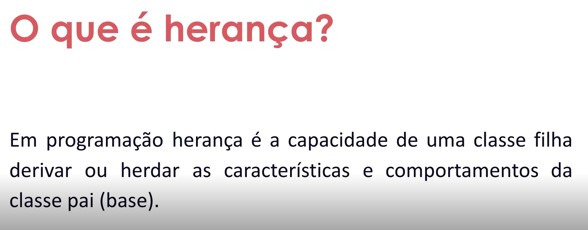
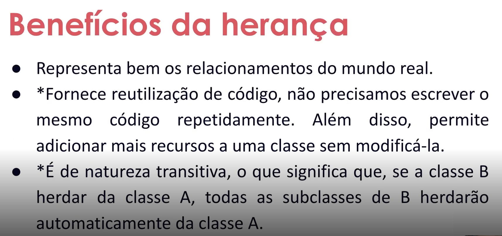
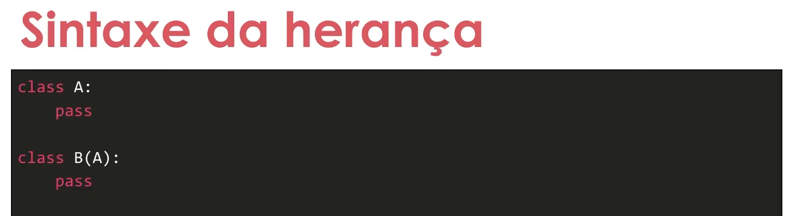

- Instrutor: Guilherme Arthur de Carvalho (Analista de Sistemas)
- Contato Libkedin: https://www.linkedin.com/in/decarvalhogui/

# Parte 1 -  Introdução à Programação Orientada a Objetos (POO) com Python

## 🟩 Vídeo 01 - Herança em POO  

### O que é herança?

- Em programação herança é a capacidade de uma classe filha derivar ou herdar as características e comportamentos da classe pai (base).

### Benefícios da herança

- Representa bem os relacionamentos do mundo real.
- *Fornece reutilização de código*, não precisamos escrever o mesmo código repetidamente. Além disso, permite adicionar mais recursos a uma classe sem modificá-la.
- *É de natureza transitiva*, o que significa que, se a classe B herdar da classe A, todas as subclasses de B herdarão automaticamente da classe A.

### Sintaxe da herança

```python
class A:
    pass

class B(A):
    pass
```


 





## 🟩 Vídeo 02 - Conceituando Herança Simples e Herança Múltipla

## 🟩 Vídeo 03 - Hands-on: Herança Simples

## 🟩 Vídeo 04 - Hands-on: Herança Múltipla

# Parte 2 - Materiais de apoio e Questionário

## Materiais de apoio

Disponibilizados os seguinte arquivos em formato MS Powerpoint:

- Programacao_Orientada_a_Objetos_Com_Python.pptx

## Certificado: Introdução à Programação Orientada a Objetos (POO) com Python

Link do certificado: 