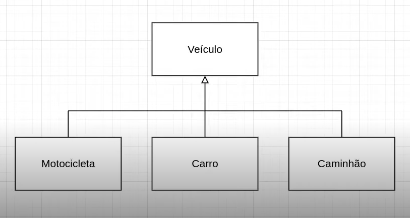
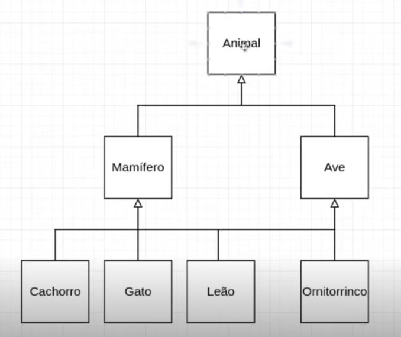

- Instrutor: Guilherme Arthur de Carvalho (Analista de Sistemas)
- Contato Libkedin: https://www.linkedin.com/in/decarvalhogui/

# Parte 1 -  Introdução à Programação Orientada a Objetos (POO) com Python

## 🟩 Vídeo 01 - Herança em POO  

### O que é herança?

- Em programação herança é a capacidade de uma classe filha derivar ou herdar as características e comportamentos da classe pai (base).

### Benefícios da herança

- Representa bem os relacionamentos do mundo real.
- *Fornece reutilização de código*, não precisamos escrever o mesmo código repetidamente. Além disso, permite adicionar mais recursos a uma classe sem modificá-la.
- *É de natureza transitiva*, o que significa que, se a classe B herdar da classe A, todas as subclasses de B herdarão automaticamente da classe A.

### Sintaxe da herança

```python
class A:
    pass

class B(A):
    pass
```

## 🟩 Vídeo 02 - Conceituando Herança Simples e Herança Múltipla

### Herança simples

- Quando uma classe filha herda apenas uma classe pai, ela é chamada de herança simples.

### Exemplo

```python
class A:
    pass

class B(A):
    pass
```

### Herança múltipla

- Quando uma classe filha herda de várias classes pai, ela é chamada de herança múltipla.

## Exemplo

```python
class A:
    pass

class B:
    pass

class C(A, B):
    pass
```

## 🟩 Vídeo 03 - Hands-on: Herança Simples

#### Diagrama 

<p align="center">
    
</p>

### Código (exemplo)

```python
class Veiculo:
    def __init__(self, cor, placa, numero_rodas):
        self.cor = cor
        self.placa = placa
        self.numero_rodas = numero_rodas

    def ligar_motor(self):
        print("Ligando o motor")

    def __str__(self):
        return f"{self.__class__.__name__}: {', '.join([f'{chave}={valor}' for chave, valor in self.__dict__.items()])}"


class Motocicleta(Veiculo):
    pass


class Carro(Veiculo):
    pass


class Caminhao(Veiculo):
    def __init__(self, cor, placa, numero_rodas, carregado):
        super().__init__(cor, placa, numero_rodas)
        self.carregado = carregado

    def esta_carregado(self):
        print(f"{'Sim' if self.carregado else 'Não'} estou carregado")


moto = Motocicleta("preta", "abc-1234", 2)
carro = Carro("branco", "xde-0098", 4)
caminhao = Caminhao("roxo", "gfd-8712", 8, True)

print(moto)
print(carro)
print(caminhao)
```

### Análise

#### 1. Definição da classe base Veiculo

- Construtor (__init__): recebe cor, placa e numero_rodas e atribui aos atributos do objeto.
    - Método ligar_motor(): simplesmente imprime "Ligando o motor".
    - Método especial __str__():
        - Retorna uma string representando o objeto.
        - Usa self.__class__.__name__ para pegar o nome da classe (ex: Carro, Motocicleta).
        - Usa um list comprehension para montar uma lista de chave=valor para todos os atributos do objeto (self.__dict__.items()).
        - Junta tudo com vírgulas e retorna no formato:
            - Classe: atributo1=valor1, atributo2=valor2, ...

#### 2. Classes filhas Motocicleta e Carro

- Herdam diretamente de Veiculo.
- Não acrescentam ou alteram nada (pass), então usam tudo da classe base.

#### 3. Classe filha Caminhao

- Sobrescreve o construtor para adicionar um atributo extra carregado.
- Usa super().__init__(...) para chamar o construtor da classe base e inicializar os atributos herdados.
- Define método esta_carregado() que imprime se o caminhão está carregado ou não, baseado no atributo carregado.

#### . Criação e impressão dos objetos

- Três objetos são criados:
    
    - moto: Motocicleta preta, placa "abc-1234", 2 rodas.
    - carro: Carro branco, placa "xde-0098", 4 rodas.
    - caminhao: Caminhão roxo, placa "gfd-8712", 8 rodas, carregado (True).
    - print(moto), print(carro), print(caminhao) chamam implicitamente o método __str__() definido em Veiculo.

#### 5. Exemplo da saída esperada

    Motocicleta: cor=preta, placa=abc-1234, numero_rodas=2
    Carro: cor=branco, placa=xde-0098, numero_rodas=4
    Caminhao: cor=roxo, placa=gfd-8712, numero_rodas=8, carregado=True
    
#### 6. Observações finais

- O método __str__() facilita a visualização do estado do objeto.
- A herança reutiliza código da classe base.
- O uso de super().__init__() no Caminhao é a forma de estender o construtor.
- O método esta_carregado() é um exemplo de funcionalidade específica da subclasse.


## 🟩 Vídeo 04 - Hands-on: Herança Múltipla

#### Diagrama 

<p align="center">
    
</p>

### Código (exemplo)

```python
class Animal:
    def __init__(self, nro_patas):
        self.nro_patas = nro_patas

    def __str__(self):
        return f"{self.__class__.__name__}: {', '.join([f'{chave}={valor}' for chave, valor in self.__dict__.items()])}"


class Mamifero(Animal):
    def __init__(self, cor_pelo, **kw):
        self.cor_pelo = cor_pelo
        super().__init__(**kw)


class Ave(Animal):
    def __init__(self, cor_bico, **kw):
        self.cor_bico = cor_bico
        super().__init__(**kw)


class Gato(Mamifero):
    pass


class Ornitorrinco(Mamifero, Ave):
    def __init__(self, cor_bico, cor_pelo, nro_patas):
        super().__init__(cor_pelo=cor_pelo, cor_bico=cor_bico, nro_patas=nro_patas)
        # print(Ornitorrinco.__mro__)


gato = Gato(nro_patas=4, cor_pelo="Preto")
print(gato)

ornitorrinco = Ornitorrinco(nro_patas=2, cor_pelo="vermelho", cor_bico="laranja")
print(ornitorrinco)
```

### Análise

#### 1. Estrutura das classes e herança

- Animal é a superclasse base, que tem o atributo nro_patas e um método __str__ que imprime o nome da classe e todos os atributos do objeto.
- Mamifero e Ave herdam de Animal e adicionam atributos próprios (cor_pelo e cor_bico, respectivamente).
- Gato herda de Mamifero (uma herança simples).
- Ornitorrinco herda de dois lugares: Mamifero e Ave (herança múltipla), e define o seu próprio __init__.

#### 2. Como o construtor __init__ é chamado

- Repare que Mamifero e Ave usam um padrão com **kw para aceitar argumentos extras e passar para super().__init__(**kw). Isso é fundamental para herança múltipla funcionar bem com super().
- Quando criamos o gato = Gato(nro_patas=4, cor_pelo="Preto"), o fluxo é:
    - Gato.__init__ não existe, então vai para Mamifero.__init__(cor_pelo="Preto", nro_patas=4)
    - Mamifero.__init__ define self.cor_pelo = cor_pelo, e chama super().__init__(nro_patas=4)
    - super() em Mamifero aponta para Animal.__init__ (pois Mamifero herda direto de Animal)
    - Animal.__init__(nro_patas=4) define o atributo self.nro_patas = 4
-Para o ornitorrinco (Ornitorrinco(nro_patas=2, cor_pelo="vermelho", cor_bico="laranja")), a chamada é:
    - Ornitorrinco.__init__ chama super().__init__(cor_pelo=cor_pelo, cor_bico=cor_bico, nro_patas=nro_patas)
    - Como Ornitorrinco herda de Mamifero e Ave, a ordem de resolução de método (MRO) será:
        ```
            Ornitorrinco
            Mamifero
            Ave
            Animal
            Objeto
        ```
    - Saída de `print(Ornitorrinco.__mro__)`:
        ```python
            (<class '__main__.Ornitorrinco'>,
             <class '__main__.Mamifero'>,
             <class '__main__.Ave'>,
             <class '__main__.Animal'>,
             <class 'object'>)
        ```
- Logo, super() em Ornitorrinco chama Mamifero.__init__ com todos os argumentos cor_pelo, cor_bico, nro_patas
- Mamifero.__init__ consome cor_pelo e chama super().__init__(cor_bico=cor_bico, nro_patas=nro_patas)
- Agora super() em Mamifero é Ave.__init__, que consome cor_bico e chama super().__init__(nro_patas=nro_patas)
- super() em Ave é Animal.__init__, que consome nro_patas
- Finalmente, Animal.__init__ define self.nro_patas
- Isso mostra o uso da herança múltipla com super() e **kwargs, para que cada construtor consuma seus parâmetros e passe os restantes para a próxima classe.

3. O que o print() mostra?

- O método __str__ de Animal mostra o nome da classe (self.__class__.__name__) e os atributos do objeto, por exemplo:
```
    print(gato)
    # Saída: Gato: cor_pelo=Preto, nro_patas=4

    print(ornitorrinco)
    # Saída: Ornitorrinco: cor_pelo=vermelho, cor_bico=laranja, nro_patas=2
```

## 📌 O que é MRO?

- A ordem de resolução de métodos (__mro__) é a sequência que o Python segue para procurar métodos e atributos em uma hierarquia de herança — especialmente em casos de herança múltipla, como no seu exemplo.
- É uma tupla de classes, da mais específica até a mais genérica, indicando a ordem exata em que Python vai procurar métodos (como __init__, __str__, etc).

# Parte 2 - Materiais de apoio e Questionário

## Materiais de apoio

- O material de apoio desta aula não foi disponibilizado.

## Certificado: Introdução à Programação Orientada a Objetos (POO) com Python

Link do certificado: https://hermes.dio.me/certificates/IYESG1OU.pdf