- Instrutor: Karina Kato (Machine Learning Engineer)
    - Linkedin: https://www.linkedin.com/in/karinakato/
    -  Github: https://github.com/tiemi/

- Neste projeto você aprenderá a criar o seu primeiro pacote de processamento de imagens em Python e disponibilizá-lo no repositório Pypi. Assim você poderá reutilizá-lo facilmente e compartilhá-lo com outras pessoas. A especialista também vai mostrar um exemplo de pacote para processamento de imagens.

## 🟩 Vídeo 01 - Parte 1 - Introdução e Conceitos

### Objetivos

- Entender conceitos relacionados aos pacotes
- Atualizar o projeto e gerar as distribuições
- Publicar o pacote

### Módulo vs Pacote

- Módulo: objeto que serve como unidade organizacional do código que é carregado pelo comando de import.
- Pacote: coleção de módulos com hierarquia.

### Modularização

- Vantagens da modularização:
    - Legibilidade
    - Manutenção
    - Reaproveitamento de código

### Pacote em Python

- Vantagens de criar um pacote:
    - Facilidade de compartilhamento
    - Facilidade de instalação

### Conceitos

- **Pypi**: repositório público oficial de pacotes
- **Wheel e Sdist**: dois tipos de distribuições
- **Setuptools**: pacote usado em setup.py para gerar as distribuições
- **Twine**: pacote usado para subir as distribuições no repositório Pypi

### Passos

    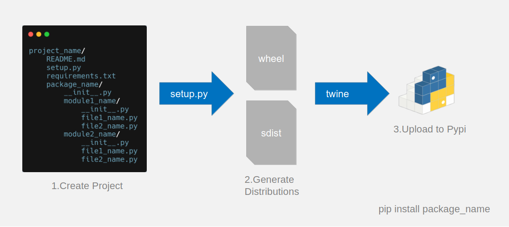

## 🟩 Vídeo 02 - Parte 2 - Criar o projeto e gerar as distribuições

### Exemplos de estruturas

    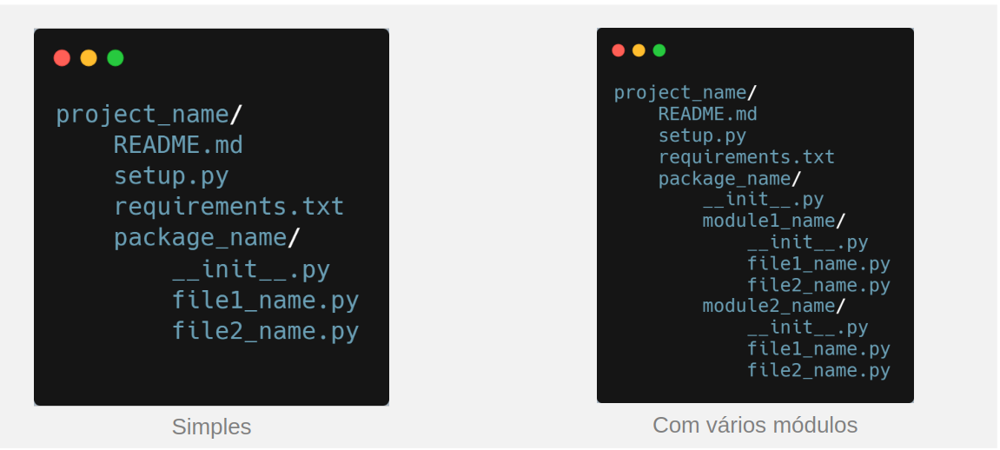

### Estrutura de pacote simples

    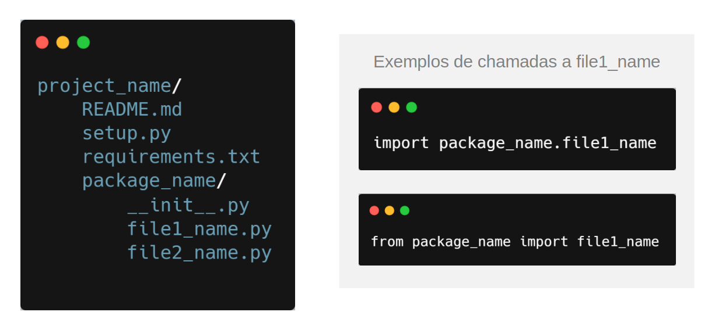

### Estrutura de pacote com vários módulos

    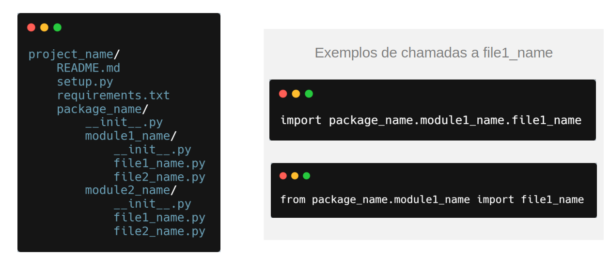

### Repositórios disponíveis

    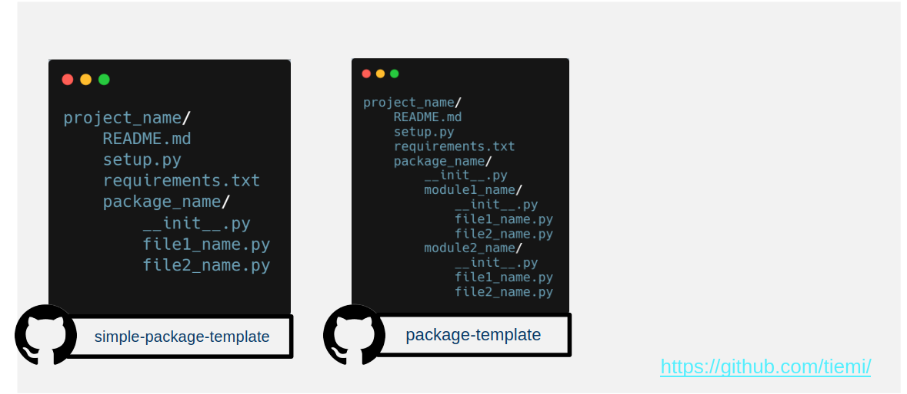

- Repositórios com os templates:
    - https://github.com/tiemi/simple-package-template
    - https://github.com/tiemi/package-template
    - https://github.com/tiemi/image-processing-package

### Passos

    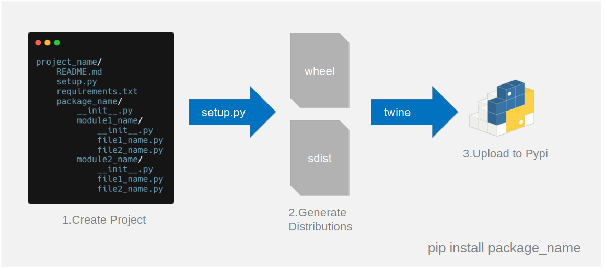

### Passos para criar o projeto

    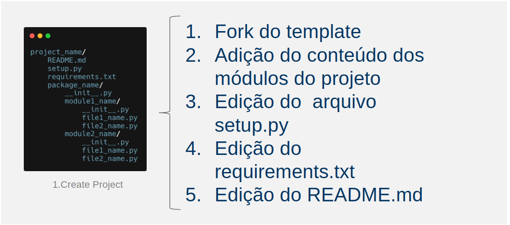

### Exemplo de pacote com vários módulos

    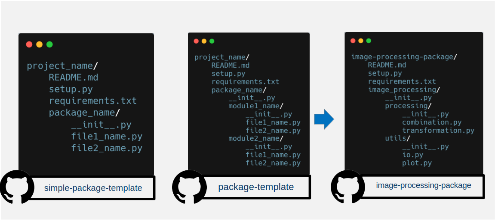

- `image-processing-package` ➡️ gerado a partir do `package-template`

    

### Arquivos do projeto image-processing

    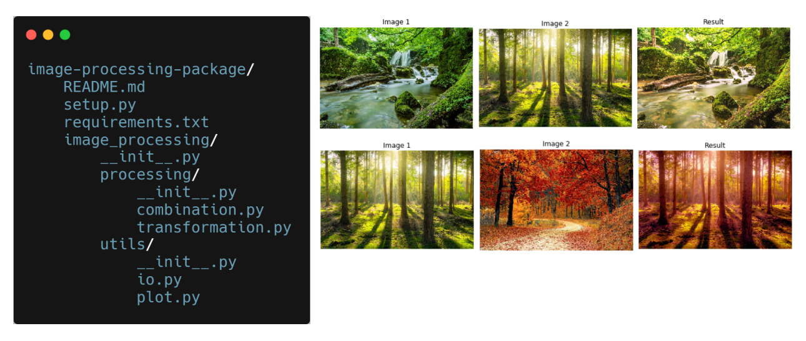

- Mostrando em mais detalhes o que esse pacote faz:

    - Aqui tem um exemplo de resultado na saída.
    - Este é um exemplo que tem deentro de `combinatio.py`.
    - Em `combination.py` uma das operações que voc6e pode fazer é o matching de histogramas.
    - Em match de histogramas basicamente a ideia é você passar duas imagens, onde a primeira é uma imagem de referência e a segunda é uma de referência de histograma. 
    - A terceira gerada é o matching de histograma da segunda, com o conteúdo da primeira.

### Arquivos do projeto image-processing

    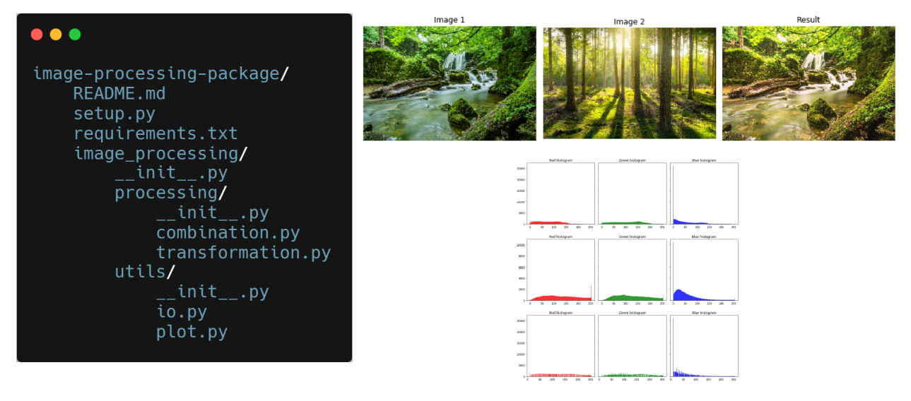

### Arquivos do projeto image-processing

    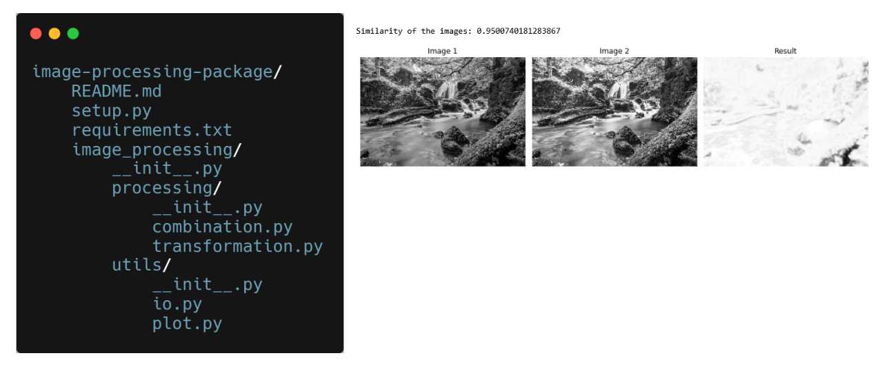

- Verificação de similaridade (a imagem resultante mostra a diferença).
- Para tanto, as imagens são, antes, convertidas em tons de cinza.
- O nível de similaridade é quantizado (entre 0 e 1).
- No processamento em questão o resultado foi 0.95.

## 🟩 Vídeo 03 - Parte 3 - Arquivos do projeto image-processing

### Apresentando os arquivos da estrutura real

    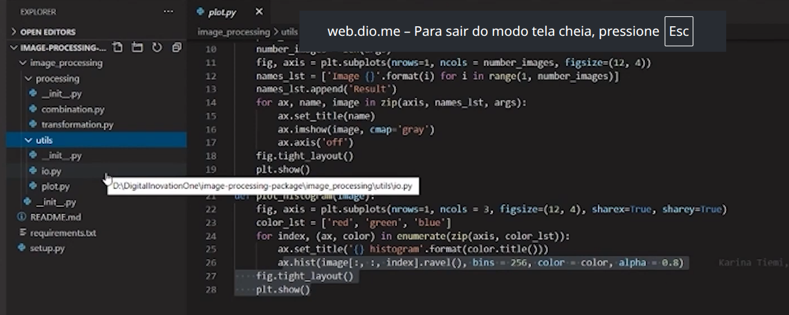

## 🟩 Vídeo 04 - Parte 4 -  Arquivos do pacote

- Detalhes dos arquivos de configuração (e se devemos usar todos).

### Arquivo setup.py

- É o arquivo principal de configuração.
- Usado para especificar como o pacote deve ser construído.
- Documentação (caso sejam necessárias configurações extras):
    - https://setuptools.readthedocs.io/en/latest/setuptools.html
- Através do parâmetro `packages` você vai especificar todos os módulos e submódulos do seu projeto. A função `find_modules()`é usada para encontrá-los automaticamente.
- O parâmetro `install_requires` deve ser utilizado se o seu pacote tiver dependência de outros pacotes.

    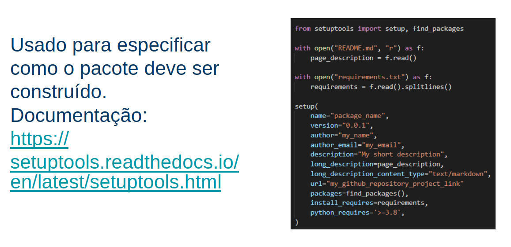

### Arquivo requirements.txt

- Usado para passar as dependências que devem ser instaladas com o seu pacote. Opcionalmente, podem ser especificadas as versões.
- Ele identifica os requisitos do seu pacote (não do seu projeto).

    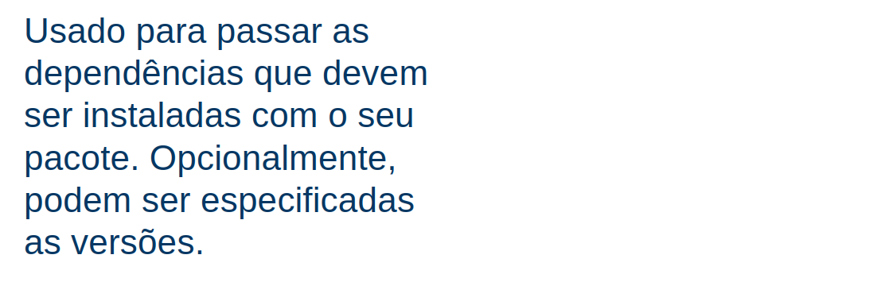

### Arquivo README.md

- Será exibido como documentação na página do Pypi do seu pacote. Foi usado markdown.

    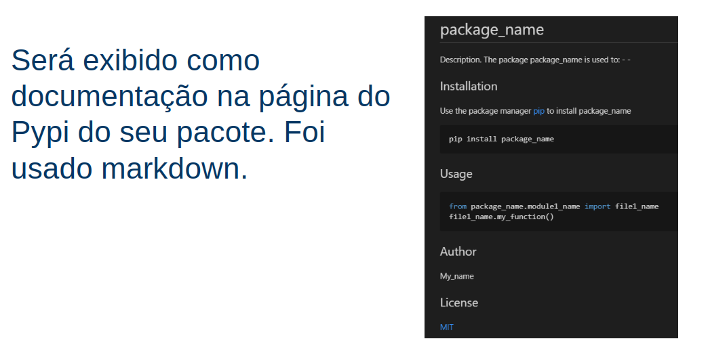

### Passos

    

## 🟩 Vídeo 05 - Parte 5 - Distribuições

### Distribuições

- Para subir o pacote, criar uma distribuição binária ou distribuição de código fonte. 
- As versões mais recentes do pip instalam primeiramente a binária e usam a distribuição de código fonte, apenas se necessário. 
- De qualquer forma, iremos criar ambas distribuições.

    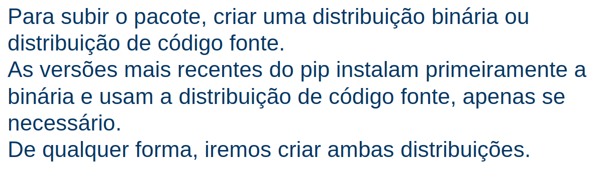

### Passos para gerar as distribuições

    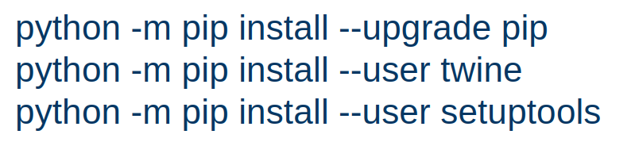

### Comandos de Instalação

    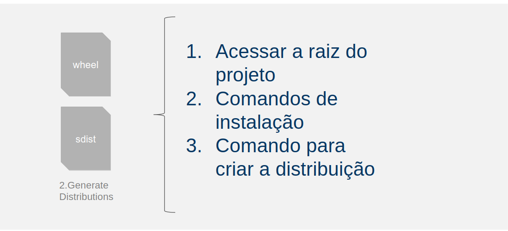

## 🟩 Vídeo 06 - Parte 6

## 🟩 Vídeo 07 - Parte 7

