- Instrutor: Karina Kato (Machine Learning Engineer)
    - Linkedin: https://www.linkedin.com/in/karinakato/
    -  Github: https://github.com/tiemi/


- Neste projeto você aprenderá a criar o seu primeiro pacote de processamento de imagens em Python e disponibilizá-lo no repositório Pypi. Assim você poderá reutilizá-lo facilmente e compartilhá-lo com outras pessoas. A especialista também vai mostrar um exemplo de pacote para processamento de imagens.

## 🟩 Vídeo 01 - Parte 1 - Introdução e Conceitos

### Objetivos

- Entender conceitos relacionados aos pacotes
- Atualizar o projeto e gerar as distribuições
- Publicar o pacote

### Módulo vs Pacote

- Módulo: objeto que serve como unidade organizacional do código que é carregado pelo comando de import.
- Pacote: coleção de módulos com hierarquia.

### Modularização

- Vantagens da modularização:
    - Legibilidade
    - Manutenção
    - Reaproveitamento de código

### Pacote em Python

- Vantagens de criar um pacote:
    - Facilidade de compartilhamento
    - Facilidade de instalação

### Conceitos

- **Pypi**: repositório público oficial de pacotes
- **Wheel e Sdist**: dois tipos de distribuições
- **Setuptools**: pacote usado em setup.py para gerar as distribuições
- **Twine**: pacote usado para subir as distribuições no repositório Pypi

### Passos

<p align="center">
    
</p>

## 🟩 Vídeo 02 - Parte 2 - Criar o projeto e gerar as distribuições

### Exemplos de estruturas

<p align="center">
    
</p>

### Estrutura de pacote simples

<p align="center">
    
</p>

### Estrutura de pacote com vários módulos

<p align="center">
    
</p>

### Repositórios disponíveis

<p align="center">
    
</p>

- Repositórios com os templates:
    - https://github.com/tiemi/simple-package-template
    - https://github.com/tiemi/package-template
    - https://github.com/tiemi/image-processing-package

### Passos

<p align="center">
    
</p>

### Passos para criar o projeto

<p align="center">
    
</p>

### Exemplo de pacote com vários módulos

<p align="center">
    
</p>

- `image-processing-package` ➡️ gerado a partir do `package-template`

<p align="center">
    
</p>

### Arquivos do projeto image-processing

<p align="center">
    
</p>

- Mostrando em mais detalhes o que esse pacote faz:

    - Aqui tem um exemplo de resultado na saída.
    - Este é um exemplo que tem dentro de `combination.py`.
    - Em `combination.py` uma das operações que voc6e pode fazer é o matching de histogramas.
    - Em matching de histogramas basicamente a ideia é você passar duas imagens, onde a primeira é uma imagem de referência e a segunda é uma de referência de histograma. 
    - A terceira gerada é o matching de histograma da segunda, com o conteúdo da primeira.

### Arquivos do projeto image-processing

<p align="center">
    
</p>

### Arquivos do projeto image-processing

<p align="center">
    
</p>

- Verificação de similaridade (a imagem resultante mostra a diferença).
- Para tanto, as imagens são, antes, convertidas em tons de cinza.
- O nível de similaridade é quantizado (entre 0 e 1).
- No processamento em questão o resultado foi 0.95.

## 🟩 Vídeo 03 - Parte 3 - Arquivos do projeto image-processing

### Apresentando os arquivos da estrutura real

<p align="center">
    
</p>


## 🟩 Vídeo 04 - Parte 4 -  Arquivos do pacote

- Detalhes dos arquivos de configuração (e se devemos usar todos).

### Arquivo setup.py

- É o arquivo principal de configuração.
- Usado para especificar como o pacote deve ser construído.
- Documentação (caso sejam necessárias configurações extras):
    - https://setuptools.readthedocs.io/en/latest/setuptools.html
- Através do parâmetro `packages` você vai especificar todos os módulos e submódulos do seu projeto. A função `find_modules()`é usada para encontrá-los automaticamente.
- O parâmetro `install_requires` deve ser utilizado se o seu pacote tiver dependência de outros pacotes.

<p align="center">
    
</p>

### Arquivo requirements.txt

- Usado para passar as dependências que devem ser instaladas com o seu pacote. Opcionalmente, podem ser especificadas as versões.
- Ele identifica os requisitos do seu pacote (não do seu projeto).

<p align="center">
    
</p>

### Arquivo README.md

- Será exibido como documentação na página do Pypi do seu pacote. Foi usado markdown.

<p align="center">
    
</p>

### Passos

<p align="center">
    
</p>

## 🟩 Vídeo 05 - Parte 5 - Distribuições

### Distribuições

- Para subir o pacote, criar uma distribuição binária ou distribuição de código fonte. 
- As versões mais recentes do pip instalam primeiramente a binária e usam a distribuição de código fonte apenas se necessário. 
- De qualquer forma, iremos criar ambas distribuições.

<p align="center">
    
</p>

### Passos para gerar as distribuições

<p align="center">
    
</p>

### Comandos de Instalação

#### Primeiramente:

```bash
python -m pip install --upgrade pip         
python -m pip install --user twine          
python -m pip install --user setuptools     
```

- Esses comandos fazem o seguinte:

    - Atualizam o pip para a versão mais recente.
    - Instalam o Twine, uma ferramenta para publicar pacotes Python.
    - Instalam o Setuptools, que ajuda na criação e distribuição de pacotes Python.

#### Em seguida:

```bash
python setup.py sdist bdist_wheel
```

- Esse comando é usado para gerar distribuições do seu pacote Python:
    
    - sdist: cria um pacote fonte (um arquivo .tar.gz).
    - bdist_wheel: cria um pacote binário no formato .whl (Wheel), que é mais rápido de instalar.


## 🟩 Vídeo 06 - Parte 6 - Publicando o Pacote

### Passos

<p align="center">
    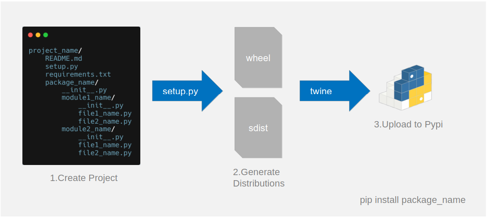
</p>

### Passos para Subir o Pacote

- Passos do 1 ao 4 são opcionais mas muito recomendados 
- São relativos à criação da conta no Test PyPI (uma boa prática)
- As contas no Teste Pypi e PyPi são separadas.
- Recomenda-se usar a mesma senha para facilitar.
- Se preferir, pode ir para os passos 5, 6 e 7 diretamente (mas é recomendado testar o pacote localmente)

<p align="center">
    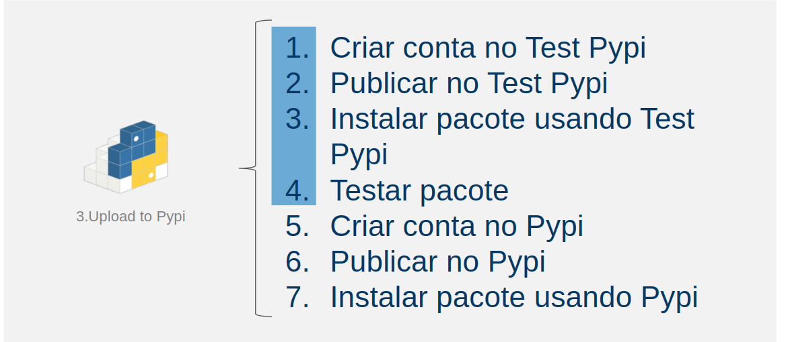
</p>

### Criando contas no Pypi

- https://pypi.org/account/register/
- https://test.pypi.org/account/register/

- É demonstrada a criação as contas (tela de abertura no test.pypi)... 👇

<p align="center">
    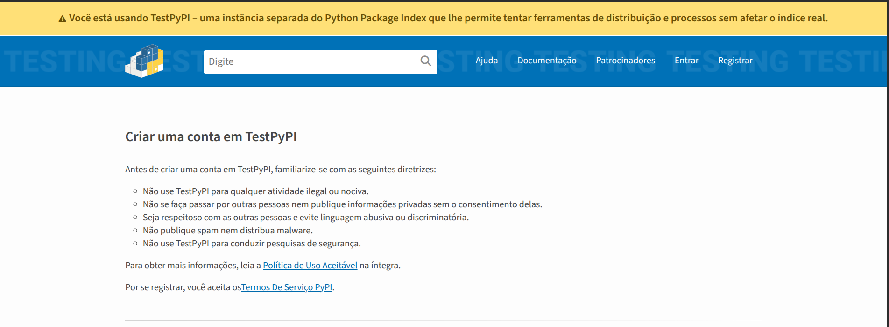
</p>

### Comando para publicar no Test PypI

```bash
python -m twine upload --repository-url https://test.pypi.org/legacy/ dist/*
```

- A instrutora mostra o pacote do image-processo no repositorio (depois do upload):

<p align="center">
    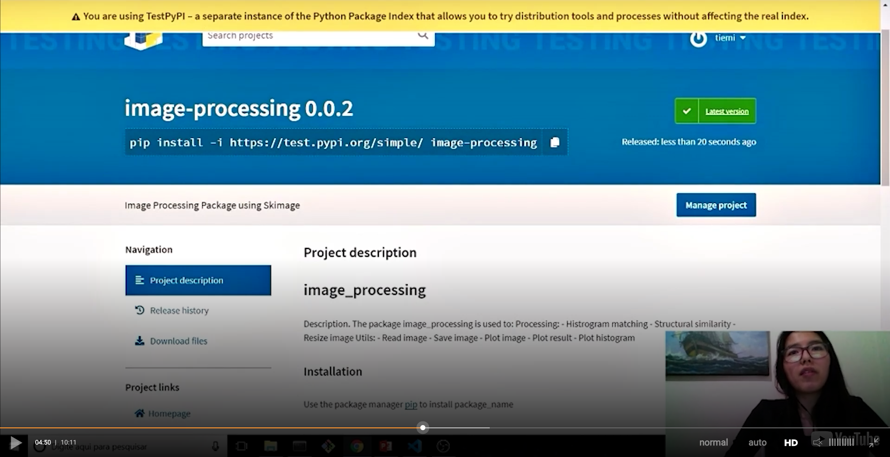
</p>

### Comando para instalar o pacote de teste

```python
pip install –-index-url https://test.pypi.org/simple/ image-processing
```

- A instrutora executa o comando de instalação acima:

<p align="center">
    
</p>

- Procedendo 1a instalação:
    - Lembrando que dentro do requirements.txt estão sendo passadas as dependências.

<p align="center">
    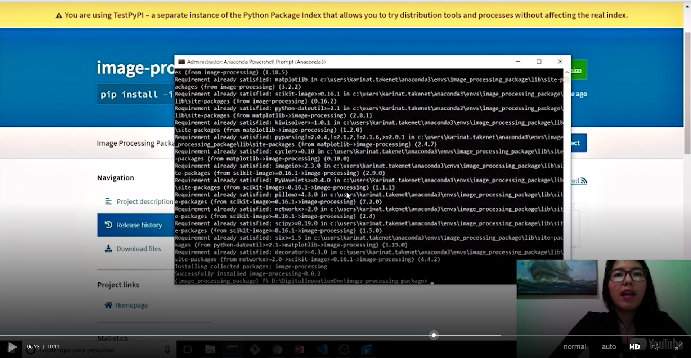
</p>

### Comando para publicar no Pypi

```bash
python -m twine upload --repository-url https://upload.pypi.org/legacy/ dist/*
```

- Exxecutando o comando ...

<p align="center">
    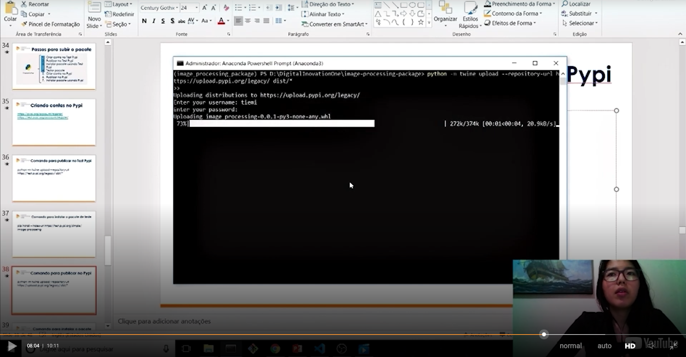
</p>

- Verificando se o pacote subiu ...

<p align="center">
    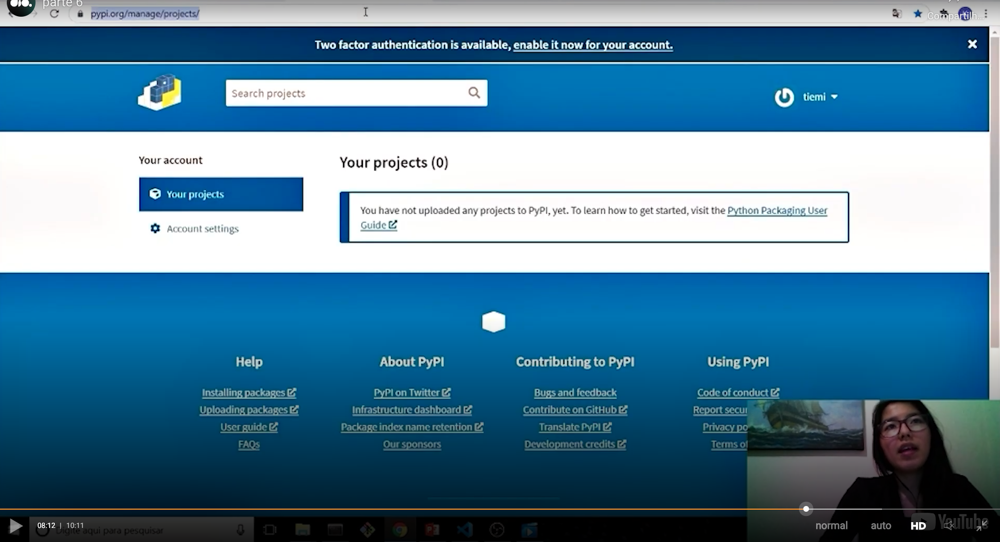
</p>

### Comando para instalar o pacote

```python
python -m pip install package_name
```

- Fazendo a instalação ...

<p align="center">
    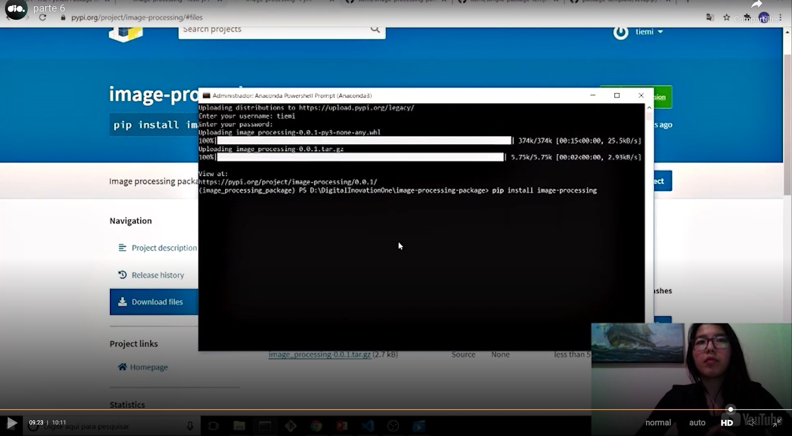
</p>

## 🟩 Vídeo 07 - Parte 7 - Resumo e Exercício Prático

### Resumo

<p align="center">
    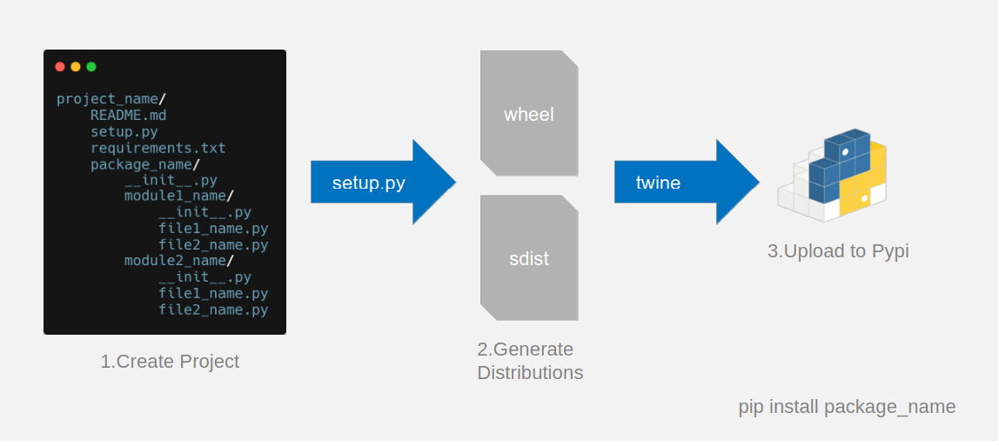
</p>

<p align="center">
    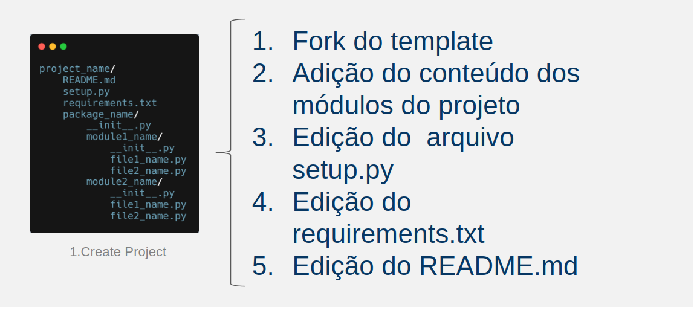
</p>

<p align="center">
    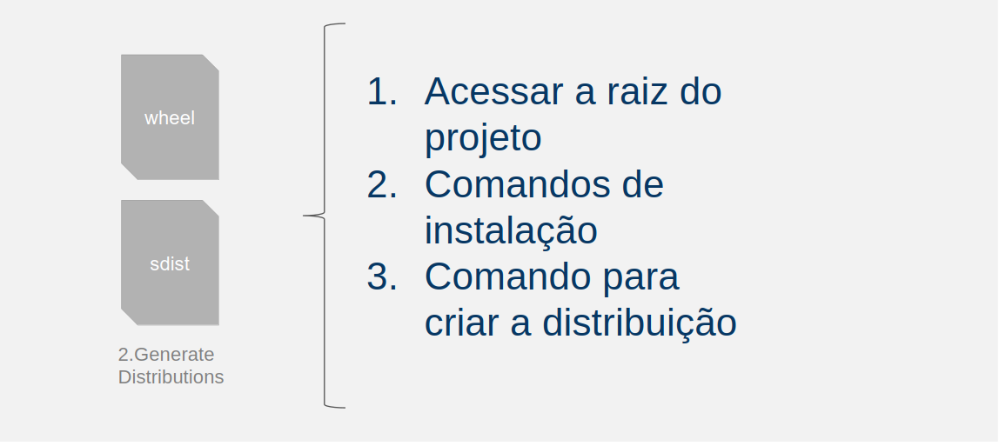
</p>

### Exercício prático

<p align="center">
    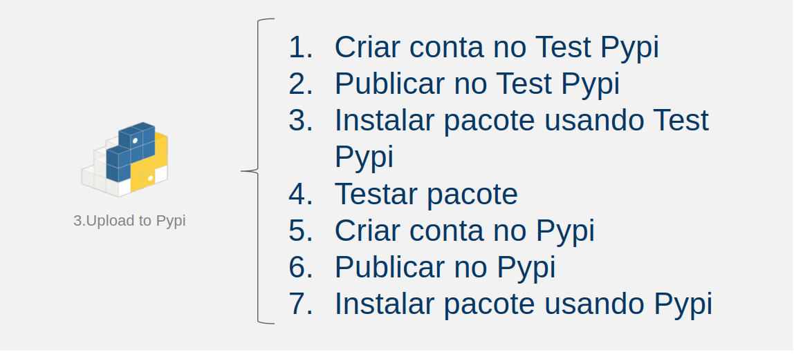
</p>

<p align="center">
    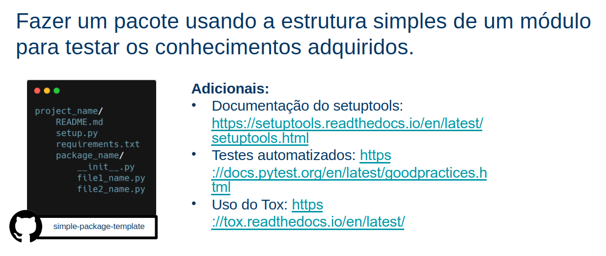
</p>

<p align="center">
    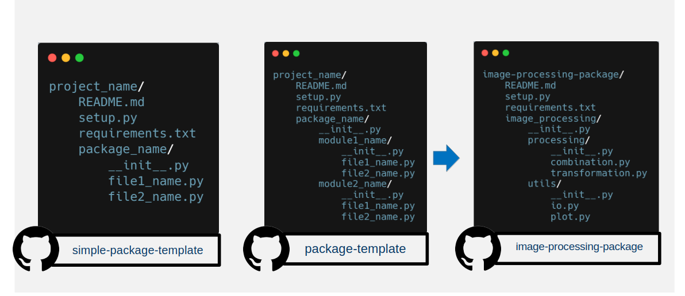
</p>

- Aqui a instrutora mostra que o pacote image_processing está funcionando e que os alunos podem testá-lo depois que terminarem.
- Chamando os submódulos.

<p align="center">
    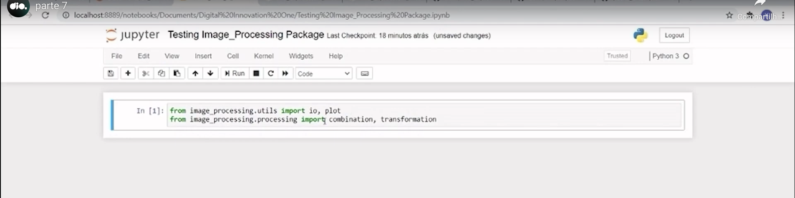
</p>

- Eu já tenho um conjunto de imagens que vou querer ler.

<p align="center">
    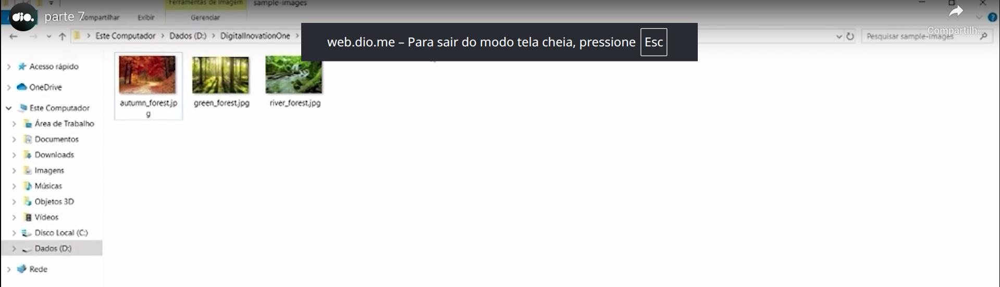
</p>

<p align="center">
    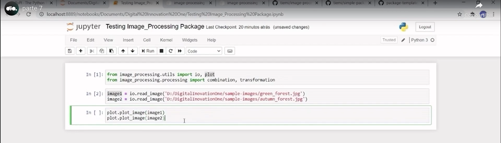
</p>

- Duas imagens sendo plotadas.

<p align="center">
    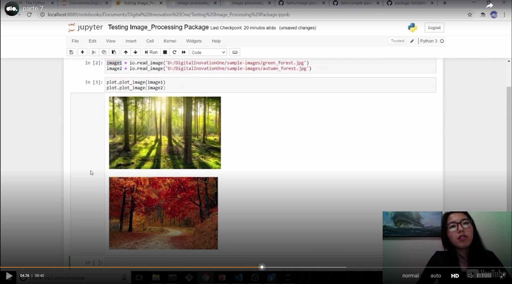
</p>

- Fazendo um matching de histograma com as duas imagens.

<p align="center">
    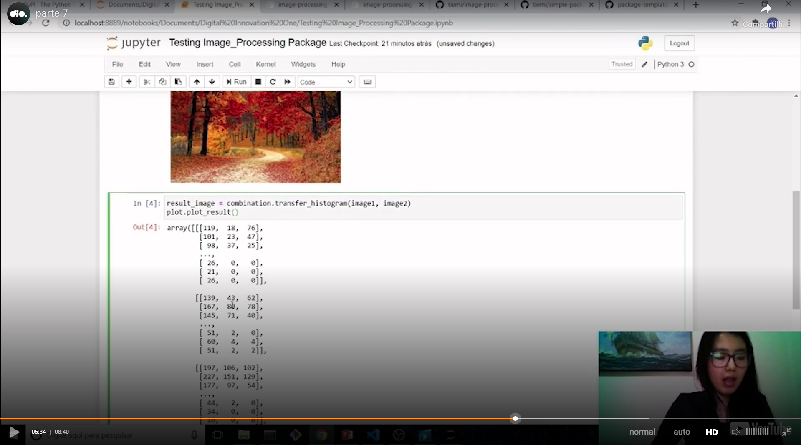
</p>

<p align="center">
    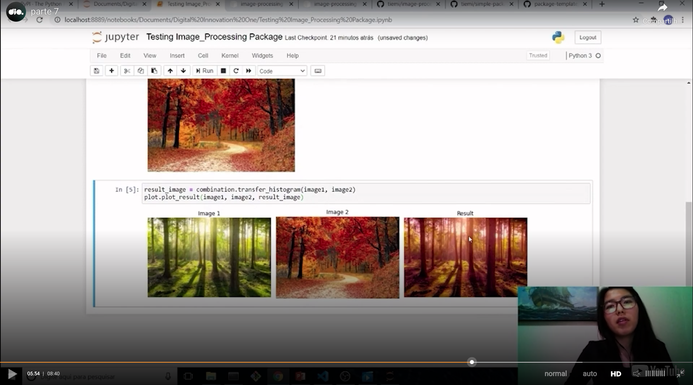
</p>

### 🟥🟥🟥 Código que funcionou (testado)

```python
#!/usr/bin/env python3ZZ

# Importação dos módulos do pacote image_processing
from image_processing.utils import io, plot
from image_processing.processing import combination, transformation

# Leitura das imagens
image1 = io.read_image('green_forest.jpg')
image2 = io.read_image('autumn_forest.jpg')

# Exibição das imagens
plot.plot_image(image1)
plot.plot_image(image2)

from skimage.exposure import match_histograms

# Substitua multichannel=True por channel_axis=-1
matched_image = match_histograms(image1, image2, channel_axis=-1)

# Exibição do resultado

plot.plot_image(matched_image)
```


### Para o exercício prático

- Peguem do repositório o simple-package-template.
- É aquele com menos hierarquia, só pra testarem se entenderam bem esses conceitos de criação de pacotes.

<p align="center">
    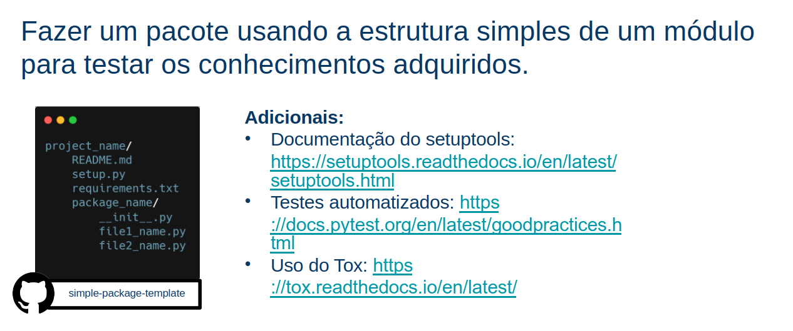
</p>

### Repositórios Disponíveis

<p align="center">
    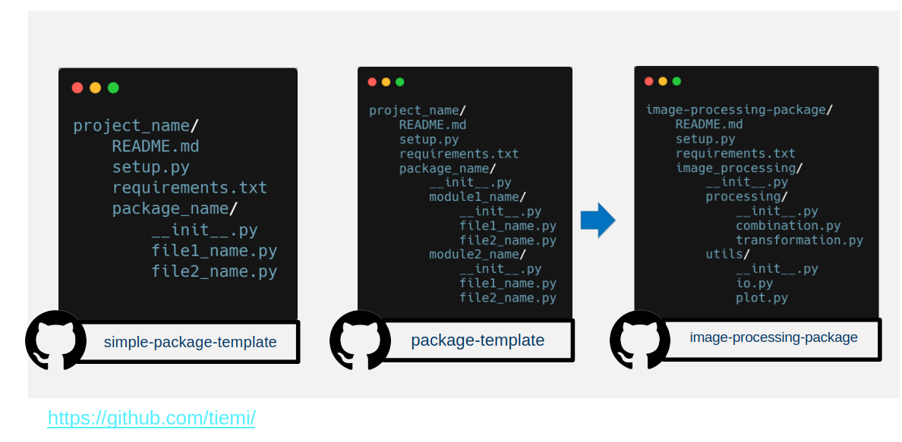
</p>

## 🟥🟥🟥 Exercício Prático (Desafio de Projeto)

### 1️⃣ Criar conta no Test PyPI ✅

- no link: https://test.pypi.org/

### 2️⃣ Publicar no Test PyPI

- O que é "Publicar no Test PyPI"?
    - TestPyPI é uma instância separada e de testes da Python Package Index (PyPI), usada especificamente para você praticar o processo de publicação sem afetar o repositório oficial.
    - A ideia é validar todo o fluxo — geração dos pacotes, envio, instalação — antes de ir para o ambiente real da PyPI.

#### Passos:

- Primeiramente, executar os comandos:

```bash
python -m pip install --upgrade pip         
python -m pip install twine          
python -m pip install setuptools     
```

- Esses comandos fazem o seguinte:

    - Atualizam o pip para a versão mais recente.
    - Instalam o Twine, uma ferramenta para publicar pacotes Python.
    - Instalam o Setuptools, que ajuda na criação e distribuição de pacotes Python.

Em seguida:

```bash
python setup.py sdist bdist_wheel
```

- Esse comando é usado para gerar distribuições do seu pacote Python:
    
    - sdist: cria um pacote fonte (um arquivo .tar.gz).
    - bdist_wheel: cria um pacote binário no formato .whl (Wheel), que é mais rápido de instalar.

- Depois de rodar este comando, foram criadas as pasta `dist/` e `build/` no seu projeto.
- O próximo passo é enviar o pacote para o Test PyPI com o twine.:

```bash
twine upload --repository testpypi dist/*
```

- Respositório deste projeto (com os arquivos de configuração):
    - https://github.com/ahaerdy/processamento-imagens-ahaerdy

- **Observação-1**: antes de subir o projeto torna-se necessário criar um token e gerar o arquivo `$HOME/.pypirc` no formato abaixo:

```bash
[testpypi]
  username = __token__
  password = pypi-XXXXX...
```

- **Observação-2**: o nome do projeto não pode coincidir com outro já existente (por isso foi utilizado `processamento-imagens-ahaerdy`).

<details>
    <summary> 🟨🟨🟨 Saída do comando `twine` (clicar para expandir) </summary>

```bash
INFO     Using configuration from /home/arthur/.pypirc                                                                                                
Uploading distributions to https://test.pypi.org/legacy/
INFO     dist/processamento_imagens_ahaerdy-0.0.1-py3-none-any.whl (3.4 KB)                                                                           
INFO     dist/processamento_imagens_ahaerdy-0.0.1.tar.gz (2.6 KB)                                                                                     
INFO     username set by command options                                                                                                              
INFO     password set from config file                                                                                                                
INFO     username: __token__                                                                                                                          
INFO     password: <hidden>                                                                                                                           
Uploading processamento_imagens_ahaerdy-0.0.1-py3-none-any.whl
100% ━━━━━━━━━━━━━━━━━━━━━━━━━━━━━━━━━━━━━━━━ 7.2/7.2 kB • 00:00 • ?
INFO     Response from https://test.pypi.org/legacy/:                                                                                                 
         200 OK                                                                                                                                       
INFO     <html>                                                                                                                                       
          <head>                                                                                                                                      
           <title>200 OK</title>                                                                                                                      
          </head>                                                                                                                                     
          <body>                                                                                                                                      
           <h1>200 OK</h1>                                                                                                                            
           <br/><br/>                                                                                                                                 
                                                                                                                                                      
                                                                                                                                                      
                                                                                                                                                      
          </body>                                                                                                                                     
         </html>                                                                                                                                      
Uploading processamento_imagens_ahaerdy-0.0.1.tar.gz
100% ━━━━━━━━━━━━━━━━━━━━━━━━━━━━━━━━━━━━━━━━ 6.5/6.5 kB • 00:00 • ?
INFO     Response from https://test.pypi.org/legacy/:                                                                                                 
         200 OK                                                                                                                                       
INFO     <html>                                                                                                                                       
          <head>                                                                                                                                      
           <title>200 OK</title>                                                                                                                      
          </head>                                                                                                                                     
          <body>                                                                                                                                      
           <h1>200 OK</h1>                                                                                                                            
           <br/><br/>                                                                                                                                 
                                                                                                                                                      
                                                                                                                                                      
                                                                                                                                                      
          </body>                                                                                                                                     
         </html>                                                                                                                                      

View at:
https://test.pypi.org/project/processamento-imagens-ahaerdy/0.0.1/
```

</details>

- O projeto subiu para o Test PypI:

<p align="center">
    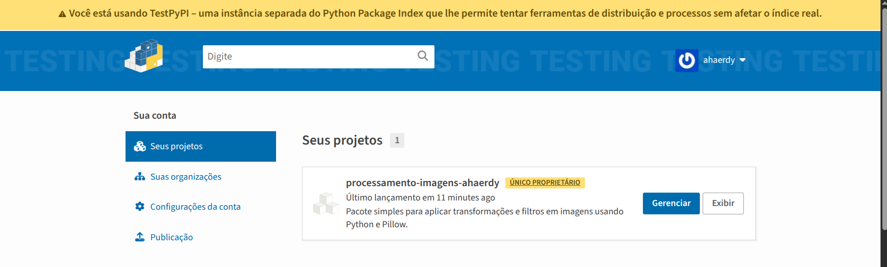
</p>


### 3️⃣ Instalar pacote usando Test PyPI

```bash
pip install --index-url https://test.pypi.org/simple/ processamento-imagens-ahaerdy
```

- Saida:

```bash
Looking in indexes: https://test.pypi.org/simple/
Collecting processamento-imagens-ahaerdy
  Downloading https://test-files.pythonhosted.org/packages/da/27/aa9536254f9ab6b482d3e35f973328b564ee2feddb024fea6cf38b0124c2/processamento_imagens_ahaerdy-0.0.1-py3-none-any.whl.metadata (1.1 kB)
Requirement already satisfied: Pillow>=10.0.0 in ./venv/lib/python3.12/site-packages (from processamento-imagens-ahaerdy) (11.3.0)
Downloading https://test-files.pythonhosted.org/packages/da/27/aa9536254f9ab6b482d3e35f973328b564ee2feddb024fea6cf38b0124c2/processamento_imagens_ahaerdy-0.0.1-py3-none-any.whl (3.5 kB)
Installing collected packages: processamento-imagens-ahaerdy
Successfully installed processamento-imagens-ahaerdy-0.0.1
```

- Verificando:

```bash
pip list | grep processamento-imagens-ahaerdy
```

- Saída: 

```bash
processamento-imagens-ahaerdy 0.0.1
```
### 4️⃣ Testar pacote

- Arquivo de testes do pacote:

```python
import os
from processamento_imagens import aplicar_filtro_pb, redimensionar

def teste_funcional():
    arquivo_entrada = "green_forest.jpg"
    saida_pb = "green_forest_pb.jpg"
    saida_red = "green_forest_redim.jpg"

    # Verifica se arquivo de entrada existe
    if not os.path.exists(arquivo_entrada):
        print(f"Arquivo de entrada '{arquivo_entrada}' não encontrado. Coloque uma imagem para o teste.")
        return

    print("Executando aplicar_filtro_pb...")
    aplicar_filtro_pb(arquivo_entrada, saida_pb)
    if os.path.exists(saida_pb):
        print(f"Arquivo '{saida_pb}' criado com sucesso.")
    else:
        print(f"Falha ao criar '{saida_pb}'.")

    print("Executando redimensionar...")
    redimensionar(arquivo_entrada, saida_red, 200, 200)
    if os.path.exists(saida_red):
        print(f"Arquivo '{saida_red}' criado com sucesso.")
    else:
        print(f"Falha ao criar '{saida_red}'.")

if __name__ == "__main__":
    teste_funcional()
```

#### Arquivo de entrada:

- `green_forest.jpg`:

<p align="center">
    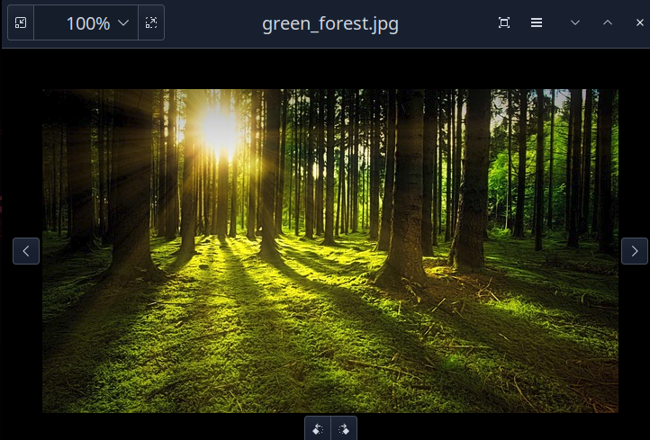
</p>

#### Arquivos de saída

- `green_forest_pb.jpg` (imagem em preto e branco)

<p align="center">
    
</p>

- `green_forest_redim.jpg` (imagem redimensionada)

<p align="center">
    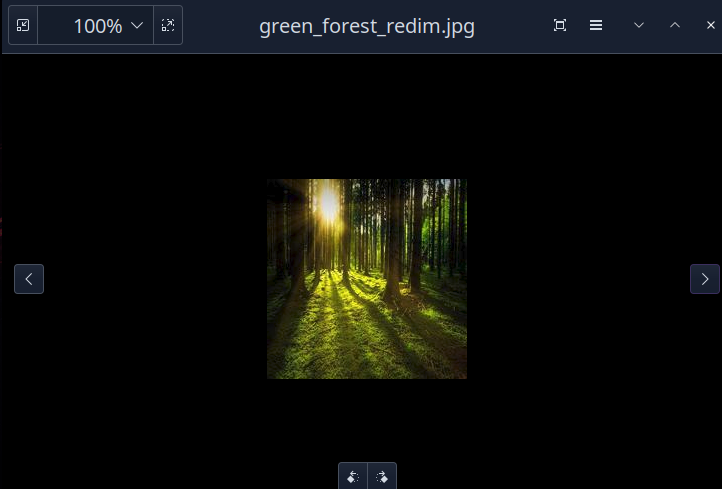
</p>

### 5️⃣ Criar conta no PyPI ✅

- no link: https://pypi.org/

### 6️⃣ Publicar no PyPI

- O comando `python setup.py ...` já foi executado na etapa de testes
- Gerar novo token para o projeto no PyPI
- Subir os arquivos para o repositorio do PypI
    ```bash
    twine upload --verbose --repository testpypi dist/*
    ```
- Upload bem sucedido ✅

<p align="center">
    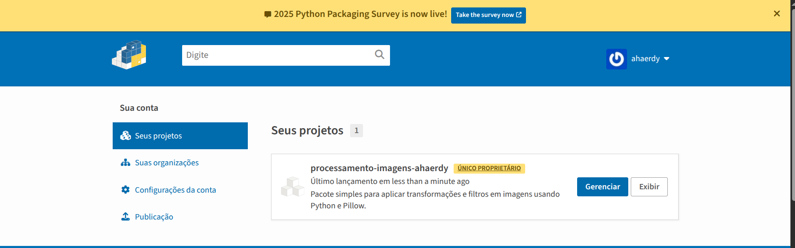
</p>

### 7️⃣ Instalar pacote usando PyPI

