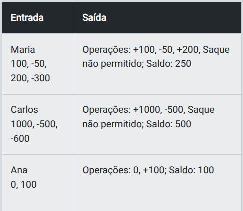
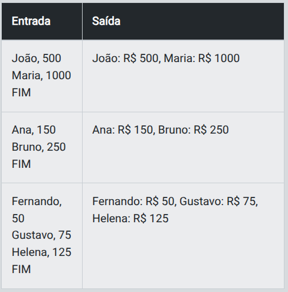

# Desafio 1 - Criando uma Conta Bancária

## Descrição

- Implemente uma classe chamada ContaBancaria para representar uma conta bancária simples. Essa classe deve permitir que você realize as operações básicas de uma conta: depósito, saque e consulta de saldo. O saldo negativo.

## Requisitos

- A classe `ContaBancaria` deve ter:

    - Atributos:
        - `titular` (nome do dono da conta).
        - `saldo` (saldo inicial, que começa com 0 por padrão).

    - Métodos:
        - `depositar(valor)`: adiciona o valor informado ao saldo.
        - `sacar(valor)`: subtrai o valor informado do saldo, se houver saldo suficiente. Caso contrário, exiba a mensagem "Saque não permitido".
        - `saldo_atual()`: retorna o saldo atual da conta.

## Entrada

1.  Nome do titular (string).
2.  Sequência de valores representando operações de depósito e saque:

    - Valores positivos representam depósitos.
    - Valores negativos representam saques.

## Saída

- Exiba as operações realizadas e o saldo final no formato:  
    - "Operações: +500, -200; Saldo: 300" 

## Exemplos

- A tabela abaixo apresenta exemplos com alguns dados de entrada e suas respectivas saídas esperadas. Certifique-se de testar seu programa com esses exemplos e com outros casos possíveis.

<p align="center">
    
</p>

- **Atenção**: É extremamente importante que as entradas e saídas sejam exatamente iguais às descritas na descrição do desafio de código.

> Os desafios apresentados aqui têm como objetivo principal exercitar os conceitos aprendidos e proporcionar um primeiro contato com lógica de programação. Caso não tenha experiência em programação, utilize o template disponível e preencha com os conceitos aprendidos. Para resetar o template, basta clicar em “`Restart Code`”.

## Solução

```python
'''
Para ler e escrever dados em Python, utilizamos as seguintes funções:
- input: lê UMA linha com dado(s) de Entrada do usuário;
- print: imprime um texto de Saída (Output), pulando linha.
'''

class ContaBancaria:
    # TODO: Inicialize a conta bancária com o nome do titular, saldo 0 e  liste para armazenar as operações realizadas:
    def __init__(self, titular):
      self.titular = titular
      self.saldo = 0
      self.operacoes = []

    # TODO: Implemente o método para realizar um depósito, adicione o valor ao saldo e registre a operação:
    def depositar(self, valor):
      self.saldo += valor
      self.operacoes.append("0" if valor == 0 else f"+{valor}")

    # TODO: Implemente o método para realizar um saque:
    def sacar(self, valor):
        saque = abs(valor)
        # TODO: Verifique se há saldo suficiente para o saque
        if self.saldo >= saque:
            # TODO: Subtraia o valor do saldo (valor já é negativo)
            self.saldo -= saque
            self.operacoes.append(f"-{saque}")
        else:
            # TODO: Registre a operação e retorne a  mensagem de saque negado
            self.operacoes.append("Saque não permitido")

    # TODO: Crie o método para exibir o extrato da conta e junte as operações no formato correto:
    def extrato(self):
        print(f"Operações: {', '.join(self.operacoes)}; Saldo: {self.saldo}")


nome_titular = input().strip()
conta = ContaBancaria(nome_titular)

entrada_transacoes = input().strip()
transacoes = [int(valor) for valor in entrada_transacoes.split(",")]

for valor in transacoes:
    if valor > 0:
        conta.depositar(valor)
    elif valor<0:
        conta.sacar(valor)
    else:
        conta.depositar(0)  # garante que vai aparecer "0" e não "-0"

conta.extrato()
```

# Desafio 2 - Sistema de Múltipas Contas bancárias

## Descrição

- Implemente um sistema que gerencie várias contas bancárias. Cada conta será representada como uma instância da classe ContaBancaria criada no desafio anterior. O sistema deve permitir que você crie contas para diferentes titulares e liste todas as contas cadastradas ao final da execução.

## Requisitos

- O sistema deve permitir:
  
    - Criar contas:  Ao criar uma conta, forneça o nome do titular e o saldo inicial no formato "Titular, SaldoInicial".
    - Listar contas:  Ao digitar o comando especial "FIM", o sistema deverá listar todas as contas cadastradas no formato especificado.

## Entrada

- O sistema deve permitir:

    - Criação de contas no formato: "Titular, SaldoInicial".
    - Um comando especial "FIM" será usado para encerrar o processo de entrada e listar as contas.

## Saída

- Liste todas as contas cadastradas no formato: "Titular: X, Saldo: R$ Y"

## Exemplos

- A tabela abaixo apresenta exemplos com alguns dados de entrada e suas respectivas saídas esperadas. Certifique-se de testar seu programa com esses exemplos e com outros casos possíveis.

<p align="center">
    
</p>

- Atenção: É extremamente importante que as entradas e saídas sejam exatamente iguais às descritas na descrição do desafio de código.

> Os desafios apresentados aqui têm como objetivo principal exercitar os conceitos aprendidos e proporcionar um primeiro contato com lógica de programação. Caso não tenha experiência em programação, utilize o template disponível e preencha com os conceitos aprendidos. Para resetar o template, basta clicar em “`Restart Code`”.