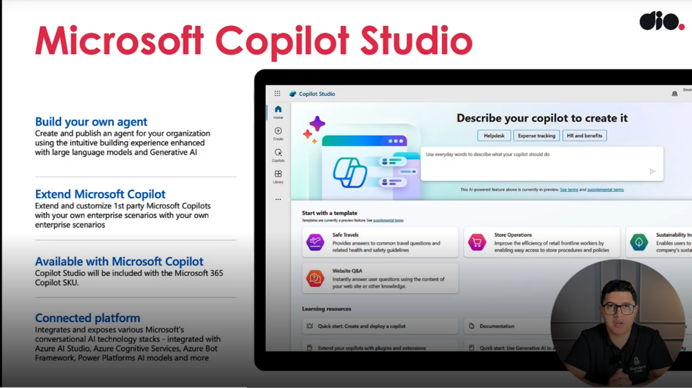
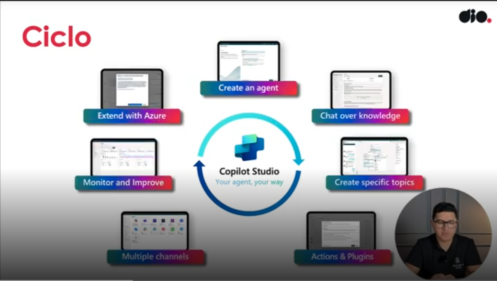
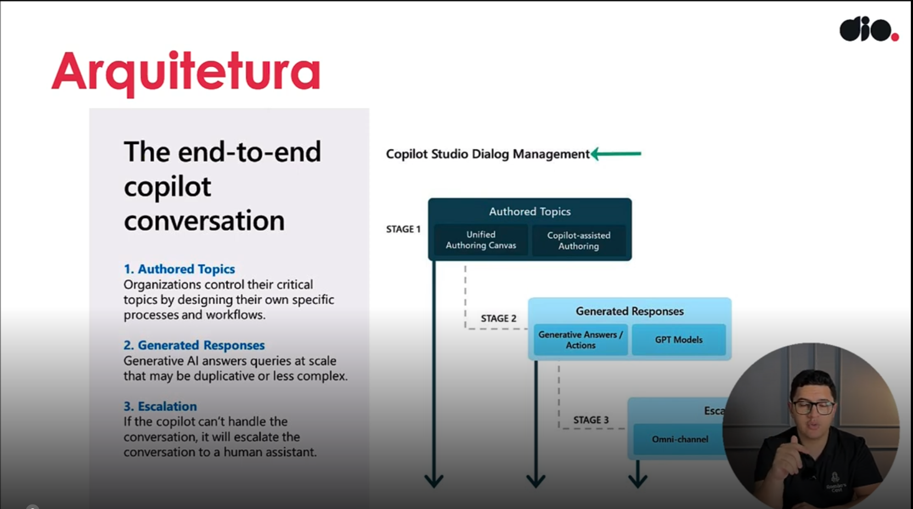

- Instrutor: Renato Romão de Souza (Microsoft MVP, MCT, Especialista em Copilot & IA).
- Contato Linkedin: https://www.linkedin.com/in/renatoromao

# Parte 1 -  Introdução à Programação Orientada a Objetos (POO) com Python

## 🟩 Vídeo 01 - Introdução

### Formação de Microsoft Copilot Studio

- Renato Romão de Souza  
- Microsoft MVP, MCT, Especialista em Copilot & IA  
- @renatooromao  
- LinkedIn: /in/renatoromao/

### Sobre o palestrante

- São Paulo, Brazil  
- 5x Microsoft MVP – Business Applications  
- Copilot Studio Super User  
- Senior M365/Power Platform Developer @Storm Technology  
- 10+ year working on Software Development  
- 6.000+ students  
- 11.000+ YouTube subscribers

## 🟩 Vídeo 02 - Objetivo Geral

### Objetivo Geral

- Aprender e se capacitar com a nova ferramenta de Inteligência Artificial da Microsoft.
- Você será capaz de criar o seu próprio GPT com seus dados e da sua empresa.
- Ao final desta formação, você terá uma visão geral dos benefícios do Copilot Studio.

## 🟩 Vídeo 03 - Pré-Requisitos

### Pré-requisitos

- ✓ Ter acesso a uma conta do Microsoft 365  
- ✓ Nenhum conhecimento técnico é exigido  
- ✓ Ter um computador

## 🟩 Vídeo 04 - Conteúdo Programático

### Conteúdo Programático

#### Conhecendo o Microsoft Copilot Studio

- ✓ O que é o Microsoft Copilot Studio?  
- ✓ O que é a Power Platform?  
- ✓ Qual a importância do Copilot Studio no cenário da Inteligência Artificial?  
- ✓ Entendendo o licenciamento do Copilot  
- ✓ Tipos de Copilot disponíveis

# Parte 2 - Materiais de apoio e Questionário

## 🟩 Vídeo 05 - Microsoft Copilot Studio

- Ferramenta lançada em 2019 com o intuito de facilitar a criação de chatbots (inicialmente eram somente chatbots, não eram agentes nem copilotos).

    

## 🟩 Vídeo 06 - Ciclo

    

### Ciclo de Aplicação com Copilot Studio

1. **Create an agent**  
   Você inicia criando um agente personalizado, que será o núcleo da sua aplicação de IA.

2. **Chat over knowledge**  
   O agente pode conversar com base em dados e documentos que você fornece, respondendo perguntas com base nesse conhecimento.

3. **Create specific topics**  
   Você define tópicos específicos para guiar as conversas e estruturar o comportamento do agente.

4. **Actions & Plugins**  
   Integrações com ações externas e plugins permitem que o agente execute tarefas, como buscar dados ou acionar sistemas.

5. **Multiple channels**  
   O agente pode ser publicado em diversos canais, como Microsoft Teams, sites, aplicativos e mais.

6. **Monitor and Improve**  
   Você acompanha o desempenho do agente e faz ajustes com base em métricas e feedback dos usuários.

7. **Extend with Azure**  
   Recursos avançados do Azure podem ser integrados para ampliar as capacidades do agente, como usar serviços cognitivos ou automações complexas.

## 🟩 Vídeo 07 - Arquitetura

    

### Arquitetura

### Copilot Studio Dialog Management (ESTÁGIOS)

#### 1. **Authored Topics**
Tópicos criados manualmente por especialistas ou administradores da organização para garantir controle e precisão.

- **Unified Authoring Canvas**  
  Interface unificada para criar, editar e organizar tópicos de conversa.  
  - Permite que autores definam fluxos de diálogo, regras de negócio e respostas específicas.  
  - Facilita a colaboração entre equipes e mantém consistência na experiência do usuário.

- **Copilot-assisted Authoring**  
  O Copilot ajuda na criação de tópicos com sugestões inteligentes.  
  - Propõe frases, intenções e fluxos com base em exemplos fornecidos.  
  - Acelera o processo de criação e reduz erros humanos.

#### 2. **Generated Responses**
Respostas criadas dinamicamente por modelos de IA, especialmente úteis para perguntas comuns ou menos críticas.

- **Generative Answers / Actions**  
  Respostas e ações geradas em tempo real com base em grandes volumes de dados.  
  - Ideal para perguntas frequentes, dúvidas genéricas ou tarefas simples.  
  - Pode sugerir ações como abrir um ticket, enviar um e-mail ou buscar informações.

- **GPT Models**  
  Modelos de linguagem avançados (como os da família GPT) que entendem contexto e geram respostas naturais.  
  - Usados para interpretar perguntas abertas e fornecer respostas relevantes.  
  - Aprendem com interações anteriores para melhorar continuamente.

#### 3. **Escalation**
Quando a IA não consegue resolver a solicitação, a conversa é encaminhada para um humano.

- **Omni-channel**  
  Suporte humano disponível em múltiplos canais (chat, e-mail, telefone, etc.).  
  - Garante continuidade da conversa, independentemente do canal.  
  - Preserva o histórico e o contexto para que o atendente humano possa agir com eficiência.

