- Instrutor: Renato Romão de Souza (Microsoft MVP, MCT, Especialista em Copilot & IA).
- Contato Linkedin: https://www.linkedin.com/in/renatoromao

# Parte 1 -  Introdução

    

    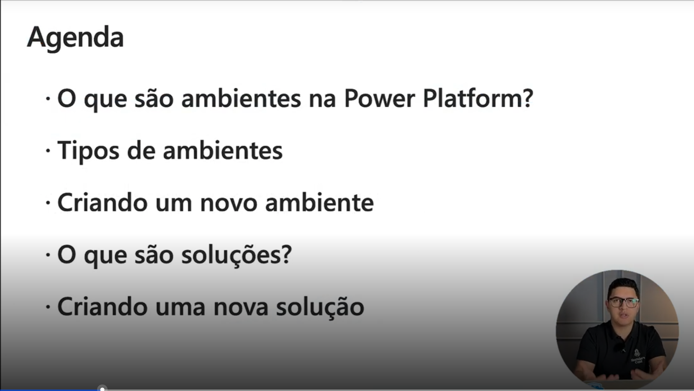

## 🟩 Vídeo 02 - Ambientes na Power Plataform

- Pra começar a usar os ambientes da Power Plataform temos duas opções:

### A primeira é usando `www.copilotstudio.microsoft.com`

- ... e lá de dentro do cenário do Copilot Studio temos o acesso aos ambientes da Power Platform

    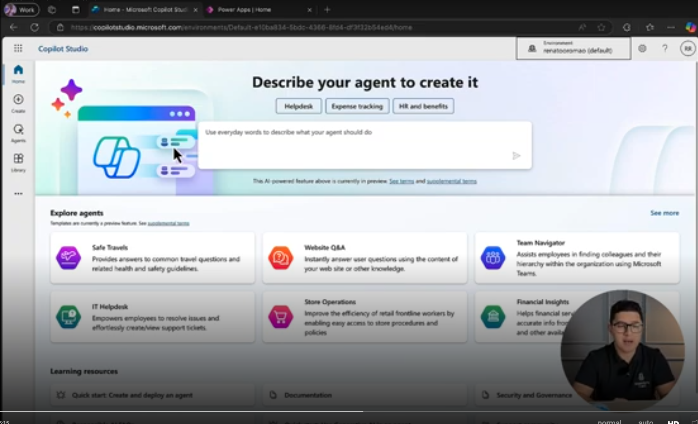

### Segunda opção: `www.make.powerapps.com`

    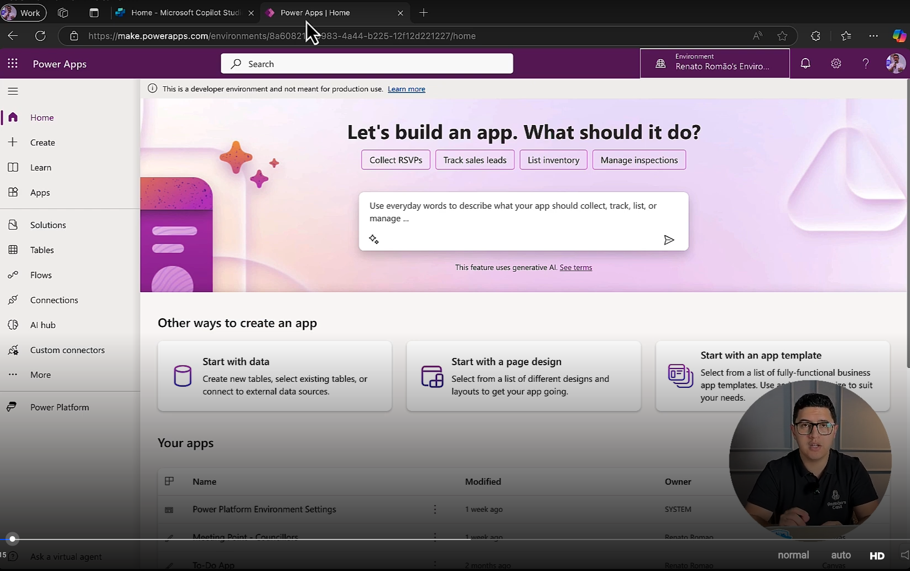

### Terceira opção: `www.make.powerautomate.com`

- Você acesso através do Power Automate a manipular seus ambientes do Power Platform

### Todos os ambientes vão ficar na parte superior direira, onde você vai poder manipular e trocar os ambientes de acordo com aquilo que você está mexendo

    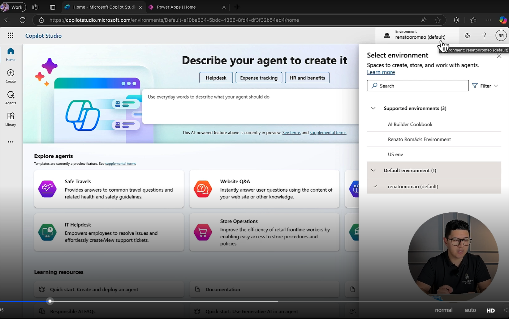

### Através do link `www.admin.powerplatform.microsoft.com` nós conseguimos administrar todos os ambientes.

    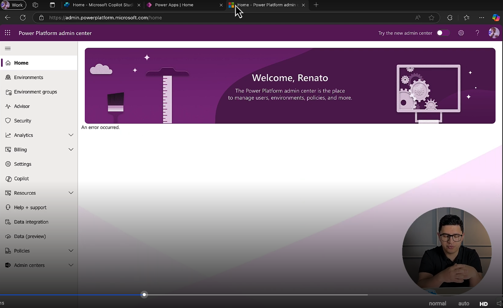

## 🟩 Vídeo 03 - Criando um novo ambiente

    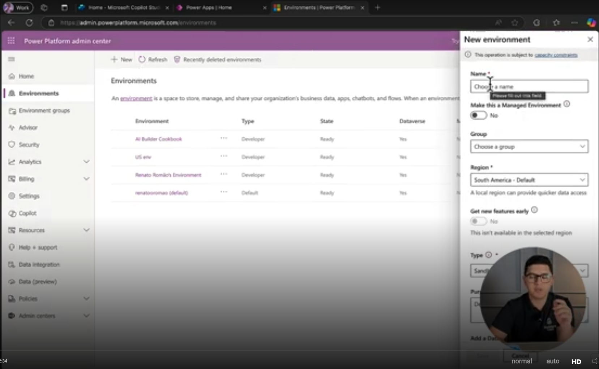

## 🟩 Vídeo 04 - Soluções

- Soluções são pastas organizadoras que temos dentro de cada ambbiente.
- Fazendo uma analogia com pastas do Windows, Ambientes são usuários e Solutions são pastas (dos usuários).
- Solutions conseguem ser facilmente movidas de um ambiente para outro.

    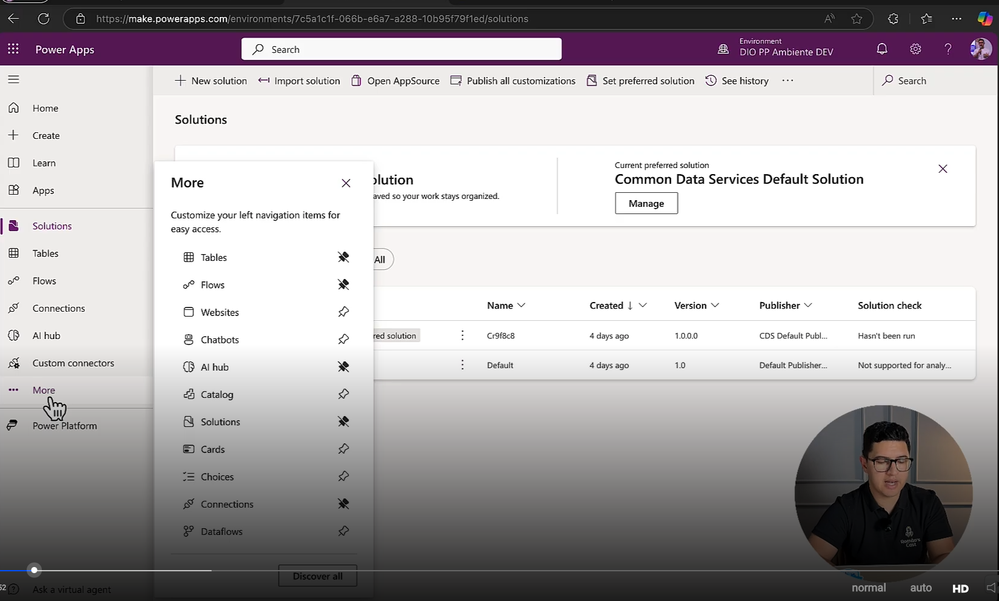

## 🟩 Vídeo 05 - Criando uma nova Solução

    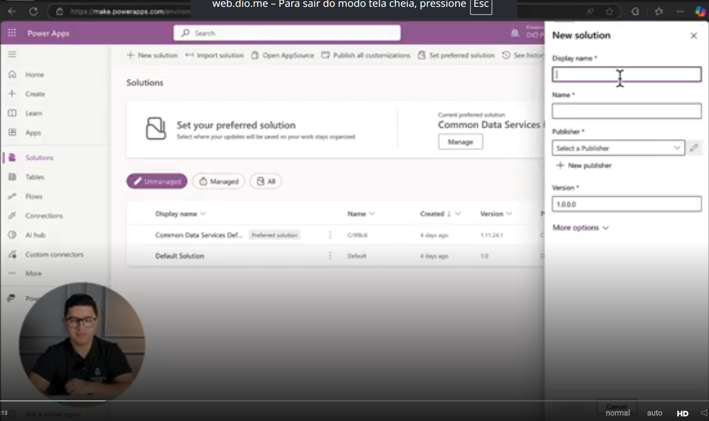

### O que pode ser criado

    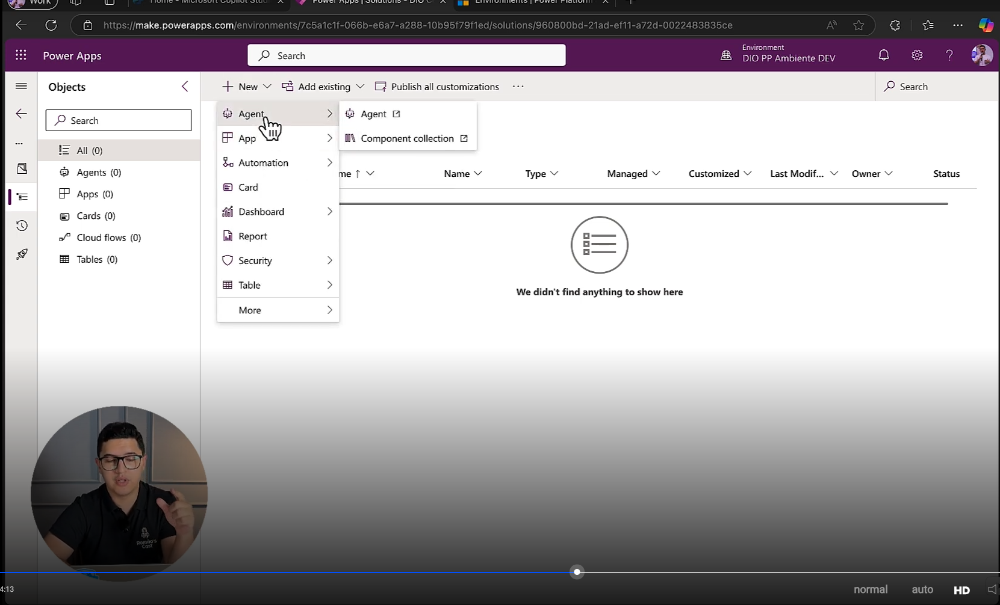

## 🟩 Vídeo 06 - Power Platform Pipelines

- Pipelines representam formas de executar comandos e mover coisas de um lugar pro outro. 

    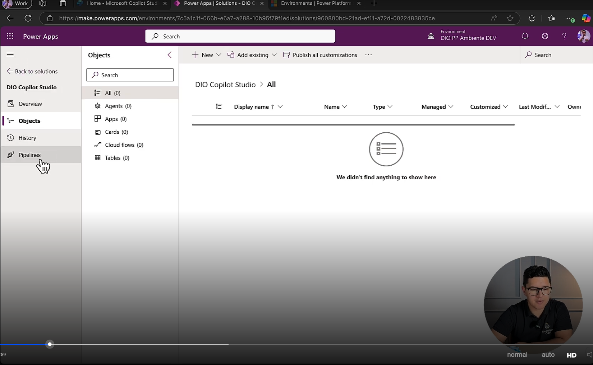

    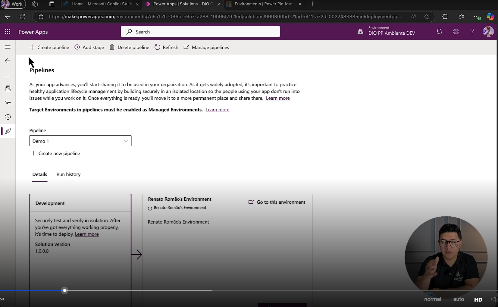

