- Instrutor: Renato Romão de Souza (Microsoft MVP, MCT, Especialista em Copilot & IA).
- Contato Linkedin: https://www.linkedin.com/in/renatoromao

## 🟩 Vídeo 01 - Etapas do Desafio

### 🧭 Etapas do Desafio 

    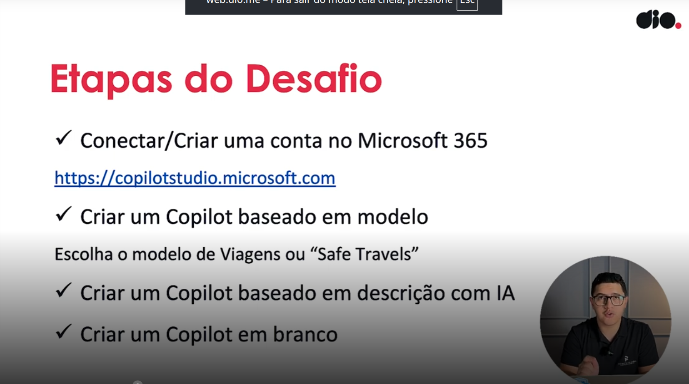

- Criar uma conta gratuita no Microsft 365, através deste [link](https://copilot.microsoft.com/chats/v1Ed4quJJ6RGC3asffb1H#:~:text=Criar%20uma%20conta%20gratuita%20no,.).
- Com ela você terá permissão de criar uma conta no Copilot Studio.
- Acessar o link https://copilotstudio.microsoft.com para criar conta do Copilot Studio.

## 🟩 Vídeo 02 - Conteúdo Programático

    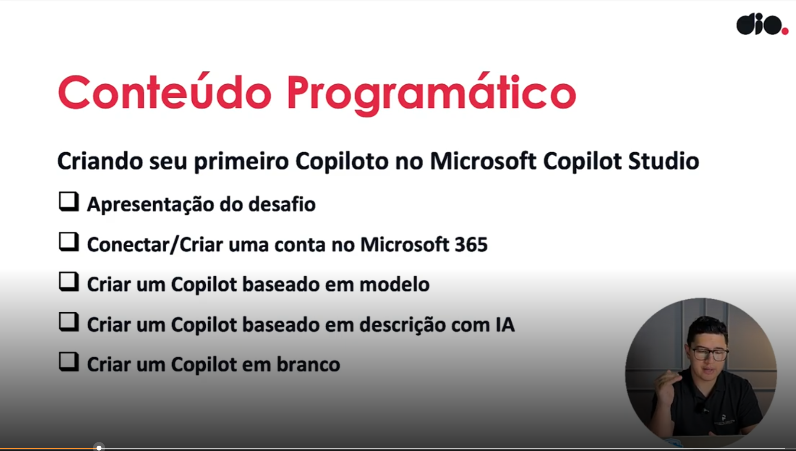

    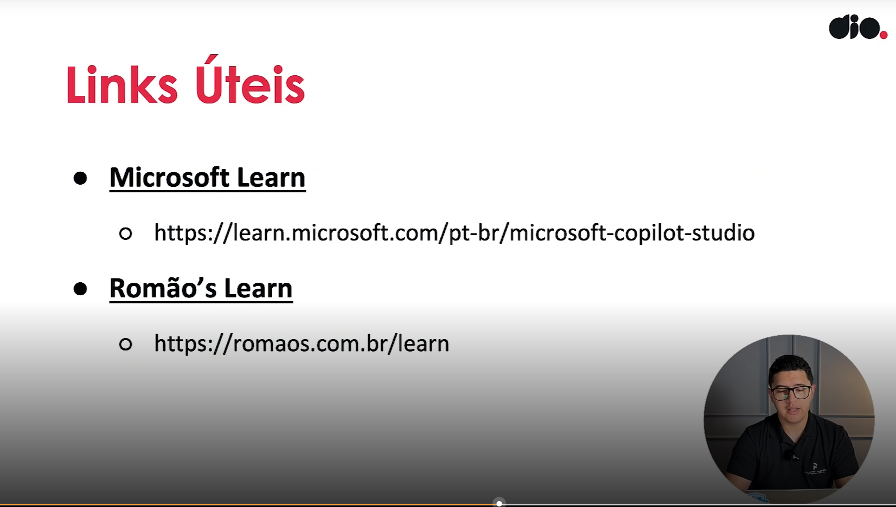

## 🟩 Vídeo 03 - Conectar e Criar uma conta no Microsoft 365

    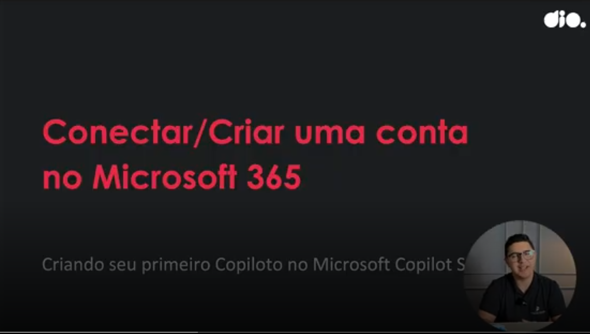

### Pesquisar Copilot Studio

    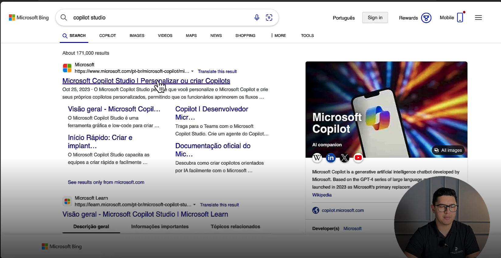

    

    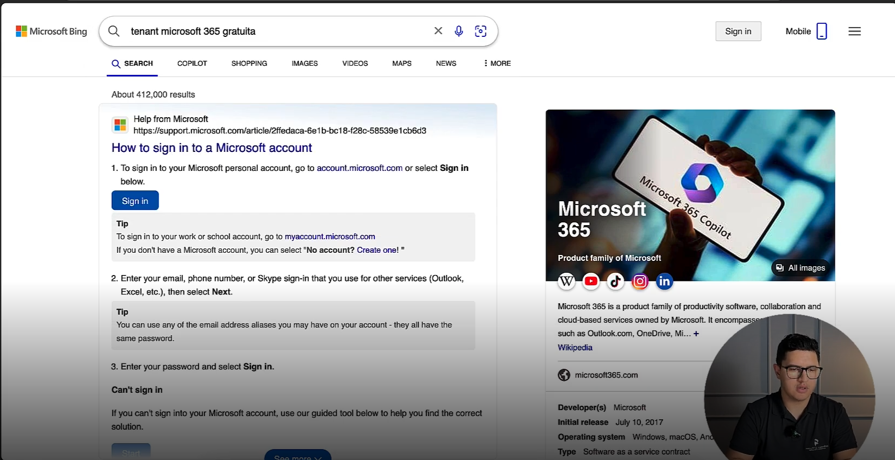

    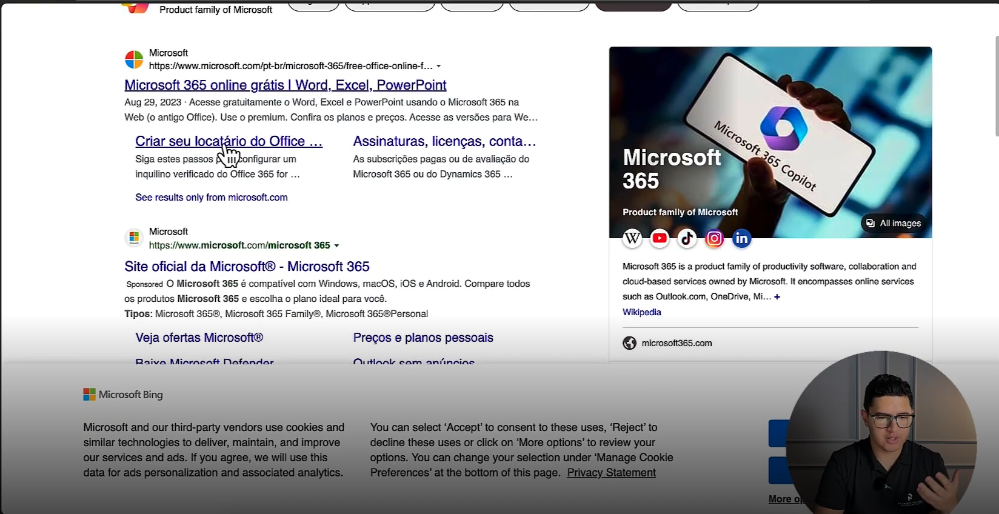

    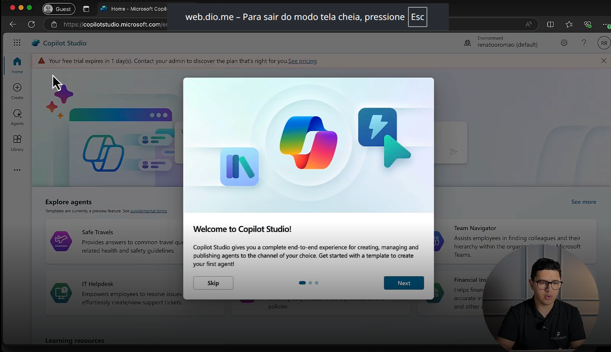

## 🟩 Vídeo 04 - Criar um Copilot baseado em modelo

    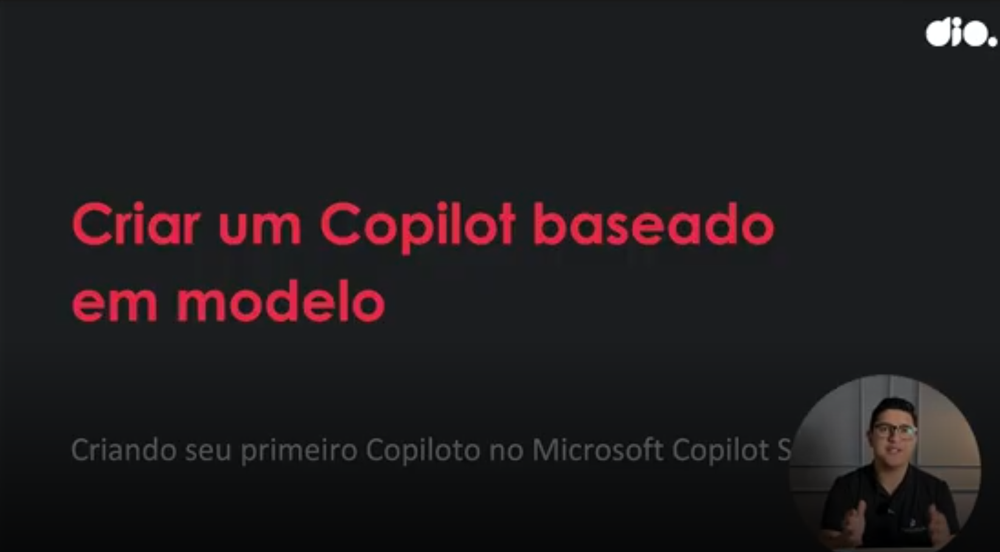

### O símbolo do avião indica o Agende de Viagens (Safe Travel) - que é um modelo.

    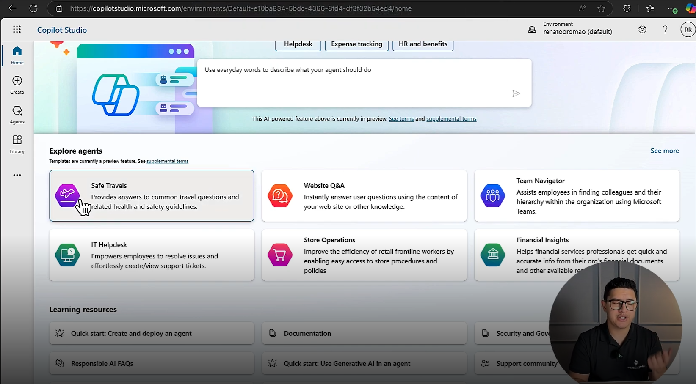

### Para testes, vamos considerar qu estamos criando uma AGENTE para uma agência de viagens.

- A descrição é um prompt.
- O prompt é necessário para garantir que A IA responda de acordo como o que está sendo configurado.

    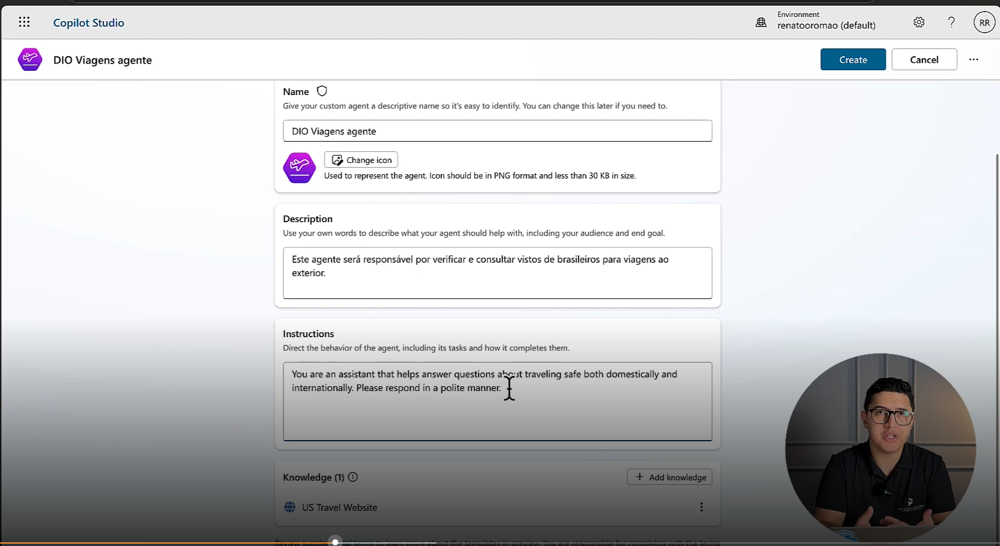

- O Agente é necessário para ele não começar a "alucinar¨, começar a falar coisas que não fazem sentido.

    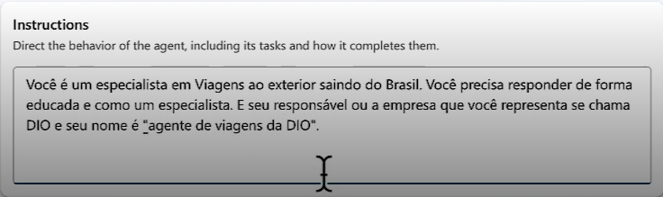

- A base de conhecimento está conectada ao US Travel Website que é o site de viagens do governo dos EUA.

    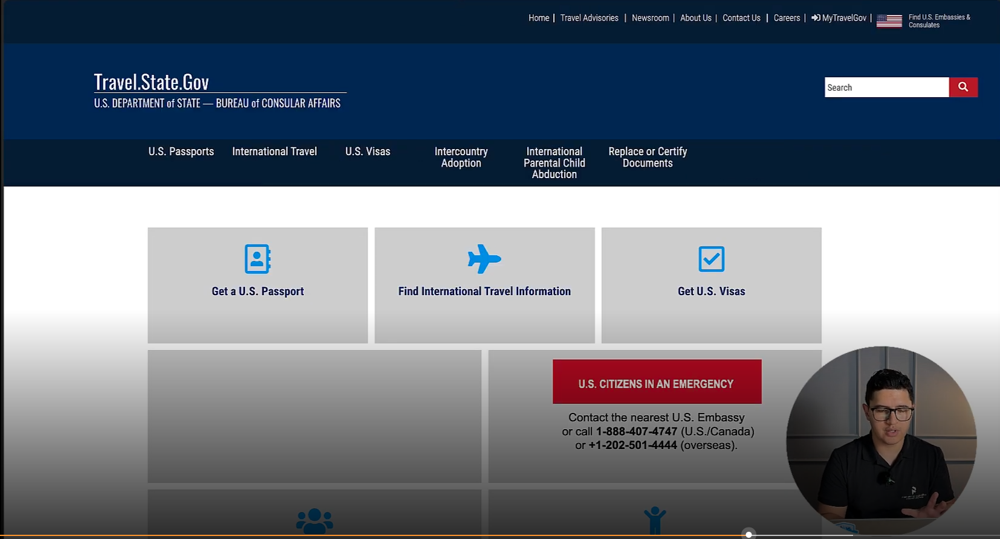

- Alterando o idioma.

    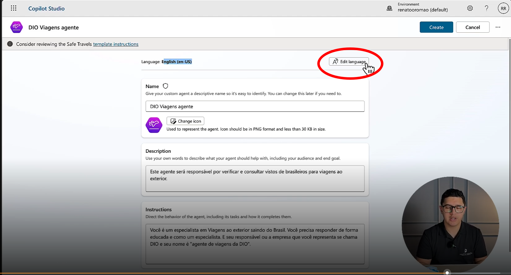

- Após criado o Agente o Copilot disponibiliza um overview.

    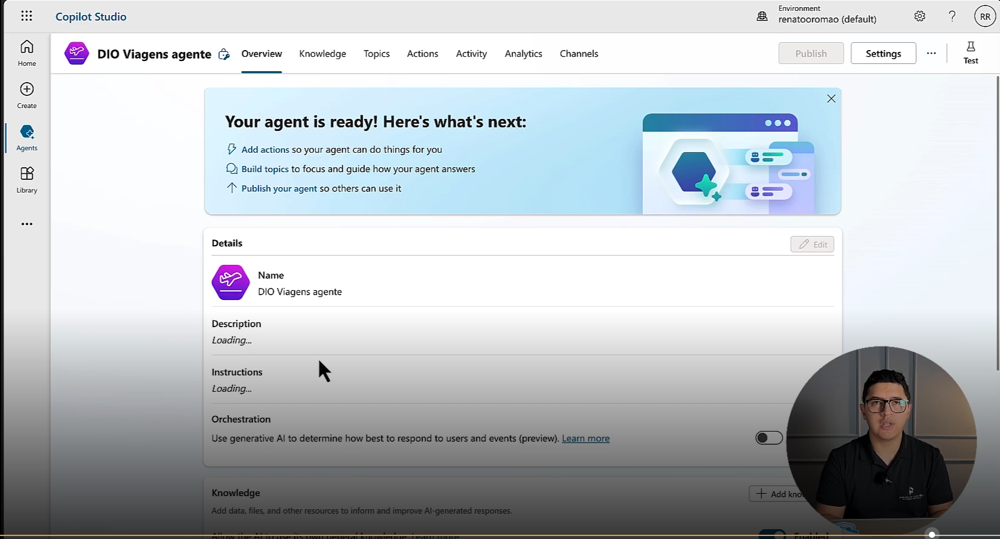

- Posso visualizar todos os tópicos:

    

## 🟩 Vídeo 05 - Criar um Copilot baseado em descrição com IA

- Para cria um copiloto vamos acessar o `www.copilotstudio.microsoft.com`onde você vai ter acesso a todos os seus copilotos.

    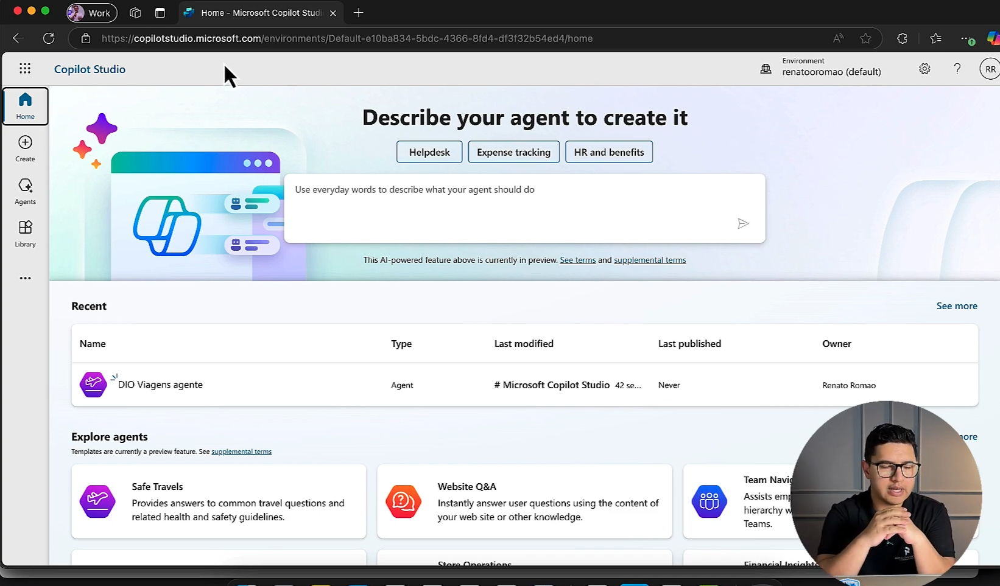

- Posso escolher o ambiente que usamos para fazer a criação na aula anterior. 

- Descrição do agente.

    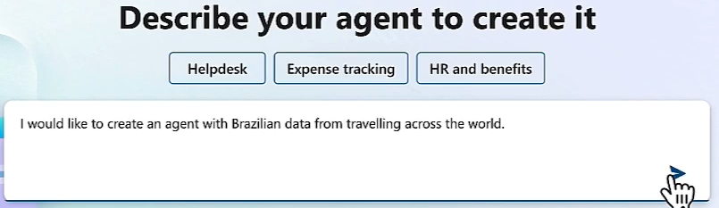

## 🟩 Vídeo 06 - Criar um Copilot em branco

## 🟩 Vídeo 07 - Entendendo o Desafio