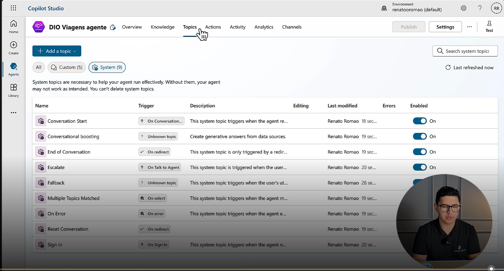

- Instrutor: Renato Romão de Souza (Microsoft MVP, MCT, Especialista em Copilot & IA).
- Contato Linkedin: https://www.linkedin.com/in/renatoromao

## 🟩 Vídeo 01 - Etapas do Desafio

 Slide da aula🔻

    

#### Anotações:

- Criar uma conta gratuita no Microsft 365 através deste [link](https://copilot.microsoft.com/chats/v1Ed4quJJ6RGC3asffb1H#:~:text=Criar%20uma%20conta%20gratuita%20no,.).
- Com ela você terá permissão de criar uma conta no Copilot Studio.
- Acessar o link https://copilotstudio.microsoft.com para criar conta do Copilot Studio.

## 🟩 Vídeo 02 - Conteúdo Programático

 Slide da aula🔻

    

## 🟩 Vídeo 03 - Conectar e Criar uma conta no Microsoft 365

 Slides da aula🔻

    

    

    

    

    

 

## 🟩 Vídeo 04 - Criar um Copilot baseado em modelo

- O símbolo do avião indica o Agente de Viagens (Safe Travel). É um modelo.

 Slides da aula🔻

    

- Para testes, vamos considerar qu estamos criando uma AGENTE para uma agência de viagens.
- A descrição é um prompt.
- O prompt funciona como instrução de configuração, orientando a IA a responder conforme os parâmetros definidos e garantindo alinhamento com o objetivo do copiloto.

 Slides da aula🔻

    

- O AGENTE atua como mecanismo de controle, garantindo que o copiloto mantenha consistência e relevância nas respostas, evitando a geração de informações incorretas ou sem relação com o contexto (‘alucinações’).

 Slides da aula🔻

    

- A base de conhecimento foi integrada ao US Travel Website, portal oficial de informações de viagens do governo dos Estados Unidos, permitindo que o copiloto acesse dados confiáveis e atualizados diretamente da fonte oficial.

 Slides da aula🔻

    

- Alterando o idioma.

 Slides da aula🔻

    

- Após a criação do AGENTE o Copilot disponibiliza um overview.

 Slides da aula🔻

    

- Posso visualizar todos os tópicos:

 Slides da aula🔻

    

## 🟩 Vídeo 05 - Criar um Copilot baseado em descrição com IA

- A criação e administração de copilotos é realizada por meio do portal Microsoft Copilot Studio, que centraliza a orquestração, configuração e gerenciamento de todos os copilotos associados à conta do usuário.

 Slide da aula🔻

    

- É possível selecionar o ambiente de desenvolvimento utilizado previamente, assegurando a continuidade da configuração e gerenciamento do copiloto no mesmo contexto criado na etapa anterior. 

 Slide da aula🔻

    

- Descrição do agente.

 Slide da aula🔻

    

- Dá-se o nome do agente (pressionar o botão "Criar¨).

 Slide da aula🔻

    

  

## Entendendo o Desafio

    

## Entrega do Projeto

Repositório de entrega do projeto: https://github.com/ahaerdy/DIO-criando-o-primeiro-copiloto-no-microsoft-copilot-studio
Descrição: Desenvolvimento de copiloto no Microsoft Copilot Studio como parte do Bootcamp Suzano Python Developer. O projeto documenta a criação de um agente conversacional, incluindo configuração de ambiente, estruturação de tópicos, integração com base de conhecimento, publicação e monitoramento.

## Certificado Criando seu primeiro Copiloto no Microsoft Copilot Studio

Link: https://hermes.dio.me/certificates/TGLHKPOO.pdf