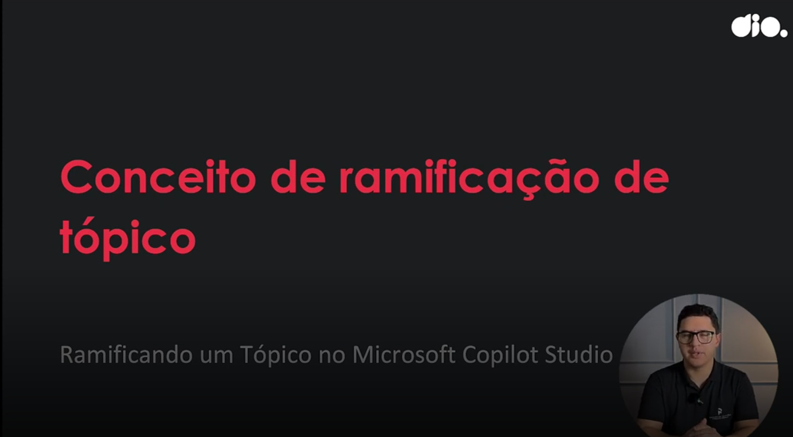
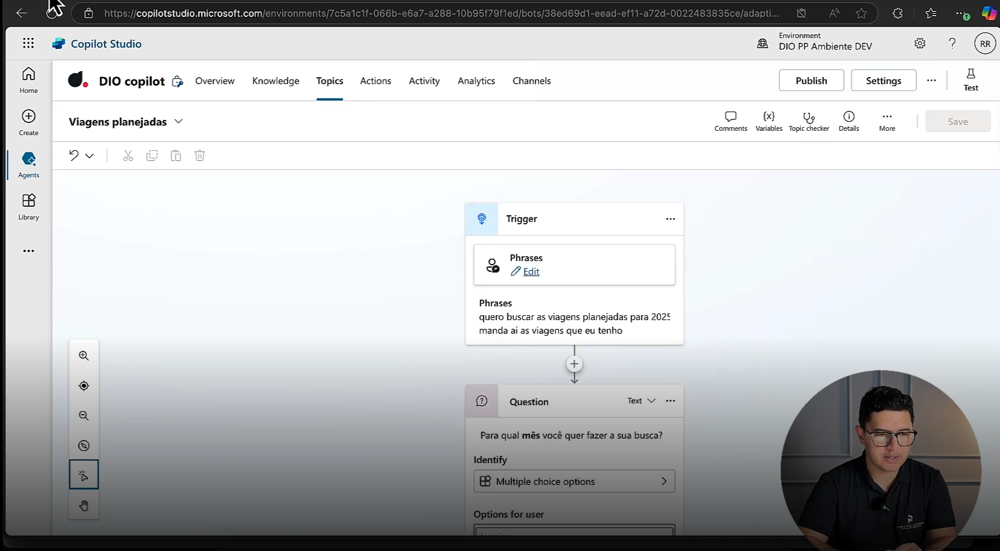
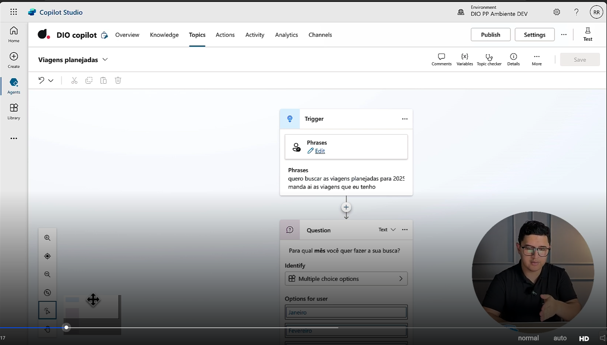
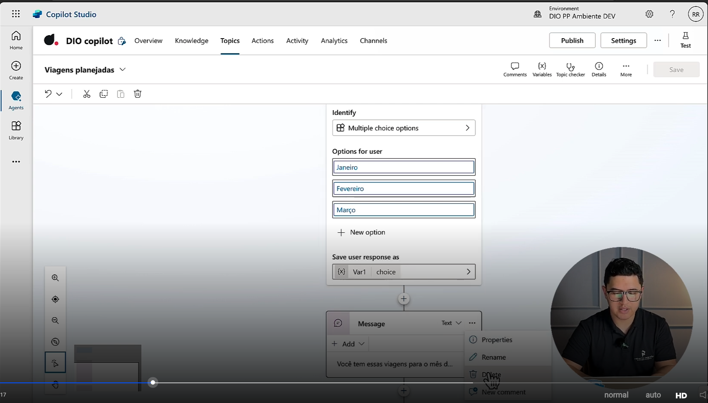
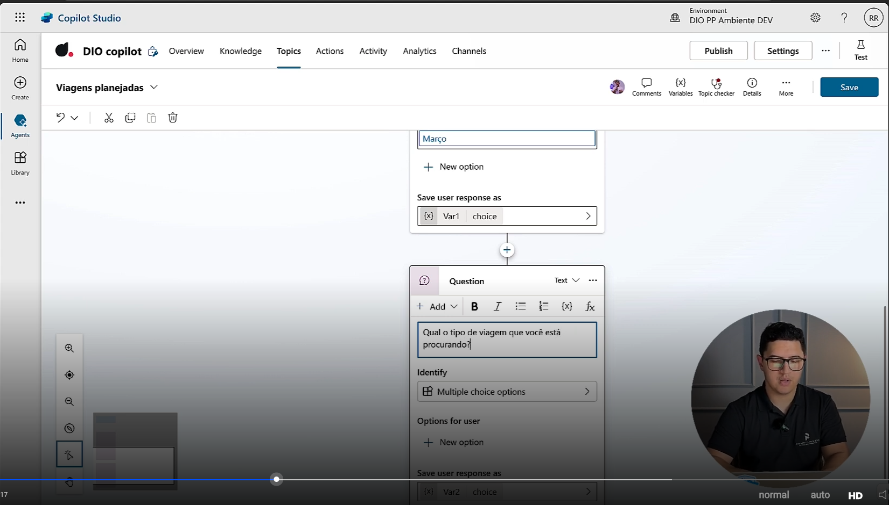
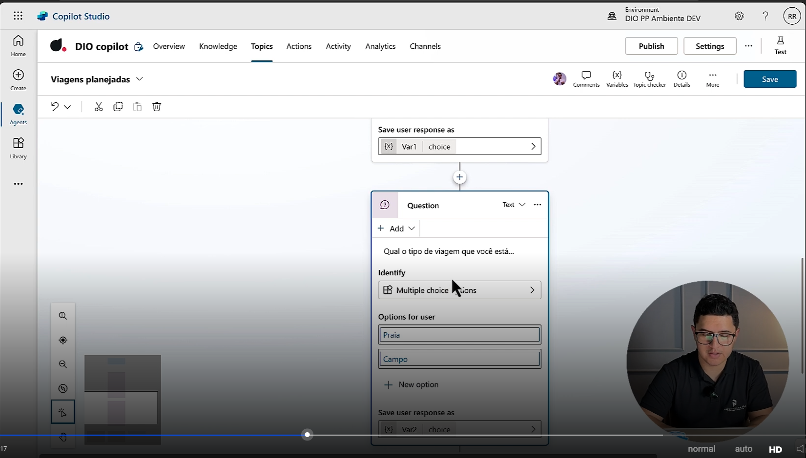
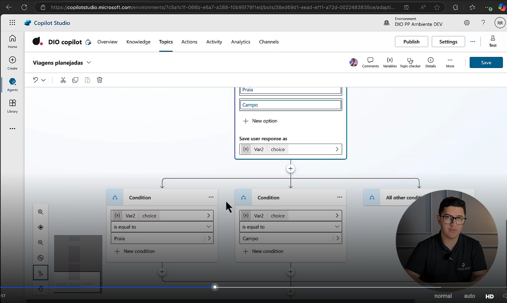
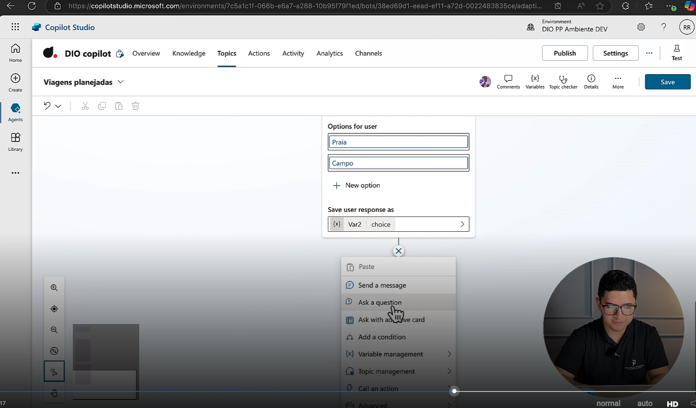
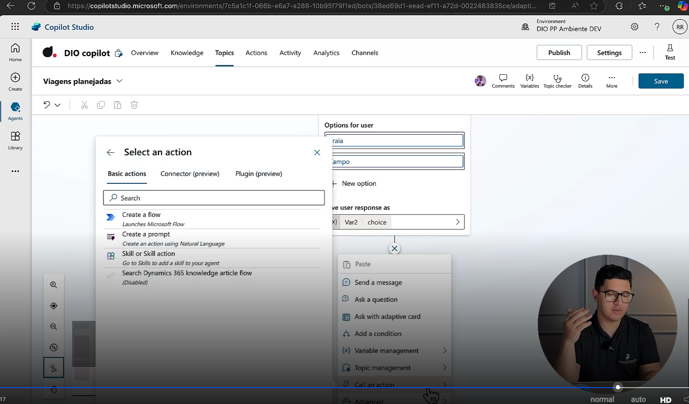
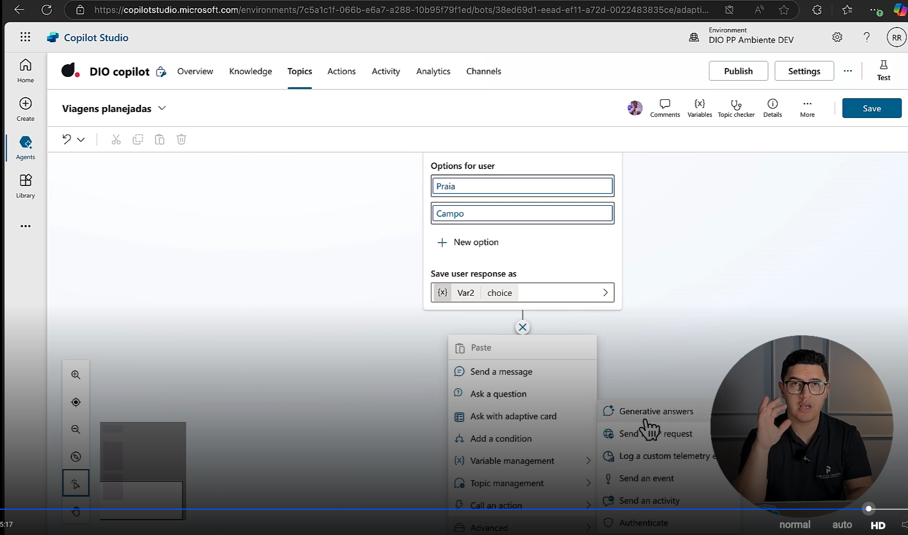

- Instrutor: Renato Romão de Souza (Microsoft MVP, MCT, Especialista em Copilot & IA).
- Contato Linkedin: https://www.linkedin.com/in/renatoromao

## 🟩 Vídeo 01 - Introdução

 Slide da aula🔻

    

## 🟩 Vídeo 02 - Quando Ramificar um Tópico?

- Retornando ao tópico de "Viagens Planejadas" anteriormente criado.
- Basicamente eu tenho um gatilho que vai disparar as minhas ações.
- Além disso eu posso ter as minhas questões, minhas perguntas, minhas mensagens.
- Quando eu sei quando ramificar?

 Slide da aula🔻

    

- Se formos olhar o minimap ele está em "reta".

 Slide da aula🔻

    

- Em que situações, neste caso, seria conveniente ramificar?
- Começo com o mês.
- Em que mês voc6e pretende viajar? Janeiro, fevereiro, março ...
- Aqui se remove a mensagem linear (comum a todos os meses) ...

 Slide da aula🔻

    

- ... e se insere uma outra pergunta:
    - Qual tipo de viagem você está procurando?

 Slide da aula🔻

    

- Posso adicionar opões:
    - Praia, Campo

 Slide da aula🔻

    

- Por padrão, quando eu adiciono uma questão, ele automaticamente já adiciona as minhas condições.

 Slide da aula🔻

    

- Independentemente do tipo de pergunta ele sempre vai salvar a resposta em uma variável.
- Como eu posso usar essa variável para fazer uma ramificação?
- Posso adicionar uma nova ação dentro do nosso Copilot Studio ...
    - Enviar uma mensagem, fazer uma pergunta, etc ...
    - A parte de gerenciamento de tópicos é muito importante para a ramificação ..

 Slide da aula🔻

    

- Além disso, posso chamar uma ação ...

 Slide da aula🔻

    

- Na parte avançada posso chamar uma parte "generativa" de respostas.

 Slide da aula🔻

    

## 🟩 Vídeo 03 - Criando uma Condição

## 🟩 Vídeo 04 - Redirecionando o Fluxo da Conversa para um Passo Específico

## 🟩 Vídeo 05 - Transferindo o Controle da Conversa para um Novo Tópico

## 🟩 Vídeo 06 - Encerrando a Conversa e o Tópico Atual