- Instrutor: Renato Romão de Souza (Microsoft MVP, MCT, Especialista em Copilot & IA).
- Contato Linkedin: https://www.linkedin.com/in/renatoromao

## 🟩 Vídeo 01 - Conteúdo Programático

 Slide da aula🔻

    

## 🟩 Vídeo 02 - O que são Entidades

### Entidades

- Uma parte significativa das conversas do copiloto no Copilot Studio é o reconhecimento de linguagem natural, que é a capacidade da IA de compreender a intenção do usuário.

- Uma **entidade** pode ser considerada uma **unidade de informação** que representa um **certo tipo de assunto**.

 Slide da aula🔻

    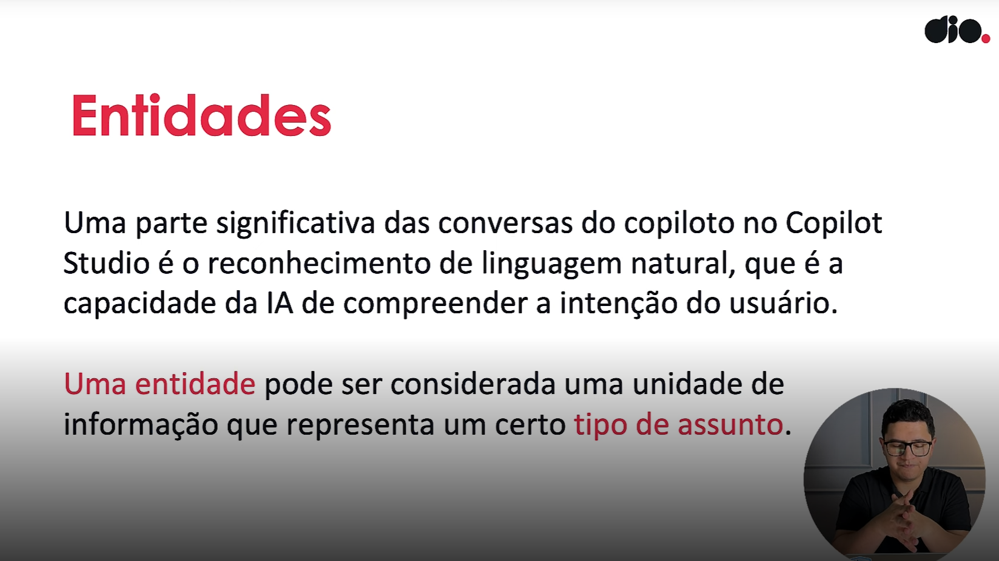

### Preenchimento de slot

- O preenchimento de slot é um conceito de reconhecimento de linguagem natural que significa salvar uma entidade extraída para um objeto.

- No entanto, no Copilot Studio, o preenchimento do slot significa colocar o valor da entidade extraída em uma variável.

 Slide da aula🔻

    

### Entidades

- “Quero solicitar 50 camisetas do Brasil para os meus funcionários.”

- Entidades:
  - Quantidade – 50  
  - País – Brasil

 Slide da aula🔻

    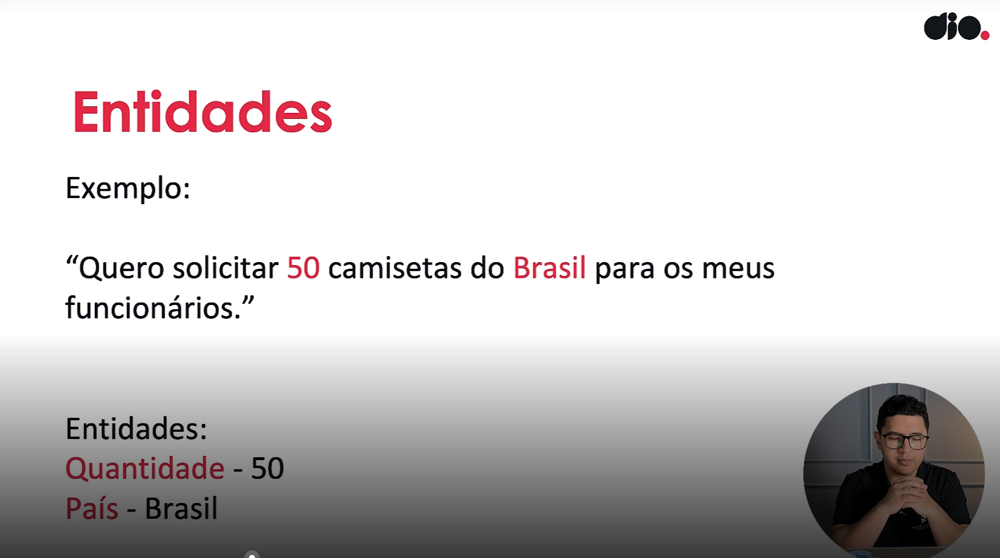

### Tipos de entidades

- Entidades predefinidas:
  - Idade
  - Verdadeiro e Falso
  - etc...

- Entidades personalizadas:
  - Closed list
  - Regular expression (Regex)

 Slide da aula🔻

    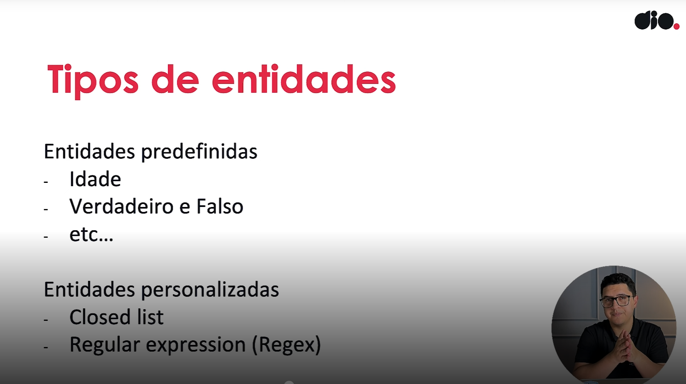

### Exemplos de Entidades Pré-definidas

- Age  
  - Descrição: Idade de uma pessoa, lugar ou coisa...  
  - Método: Prebuilt

- Boolean  
  - Descrição: Respostas positivas ou negativas, e...  
  - Método: Prebuilt

- City  
  - Descrição: Nomes de cidades, extraídos como string  
  - Método: Prebuilt

- Color  
  - Descrição: Cores primárias e tonalidades na c...  
  - Método: Prebuilt

 Slide da aula🔻

    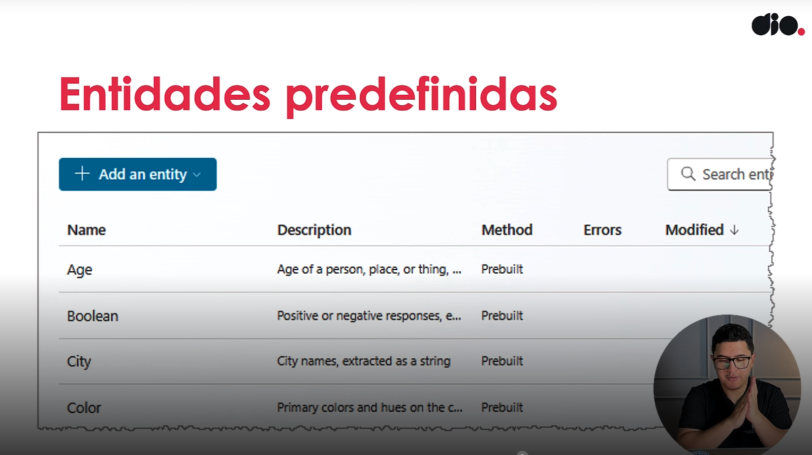

### Uso de Expressões Regulares

#### Expressões regulares do .NET – Microsoft Learn
- Link: https://learn.microsoft.com/pt-br/dotnet/standard/base-types/regular-expressions
    - A página Expressões regulares do .NET – Microsoft Learn oferece uma visão abrangente sobre o uso de expressões regulares na plataforma .NET. Aqui estão os principais conteúdos abordados:

 Slide da aula🔻

    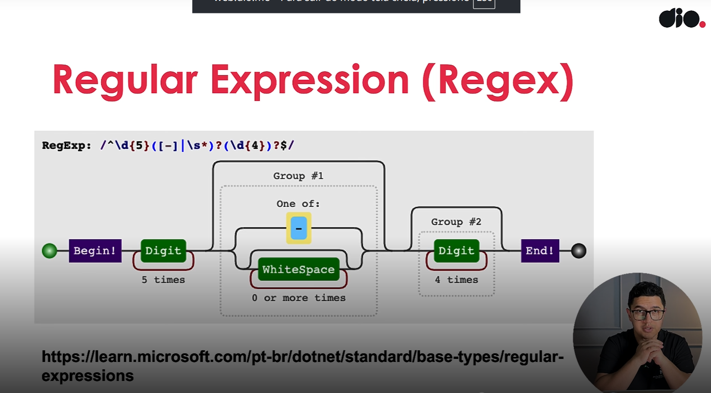

### Onde as Entidades ficam?

 Slide da aula🔻

    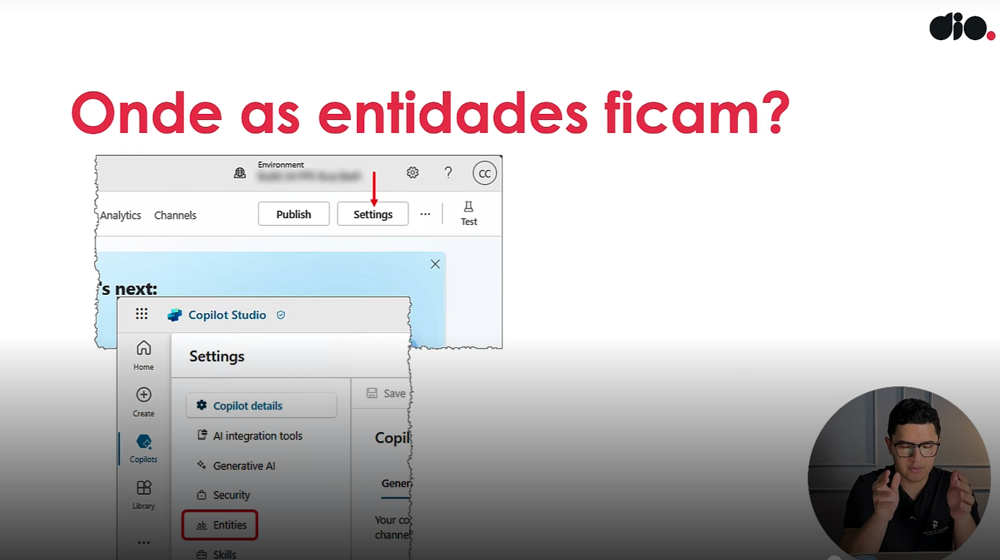

### Resumo

- As entidades podem facilitar as entradas do usuário sem a necessidade de usar a parte de Resposta Generativa ou AI Builder dentro do Copilot Studio para reconhecer informações já mapeadas.

 Slide da aula🔻

    

## 🟩 Vídeo 03 - Como usar uma entidade existente

### Dentro do Copilot Studio ir em "Settings" (Configurações)

 Slide da aula🔻

    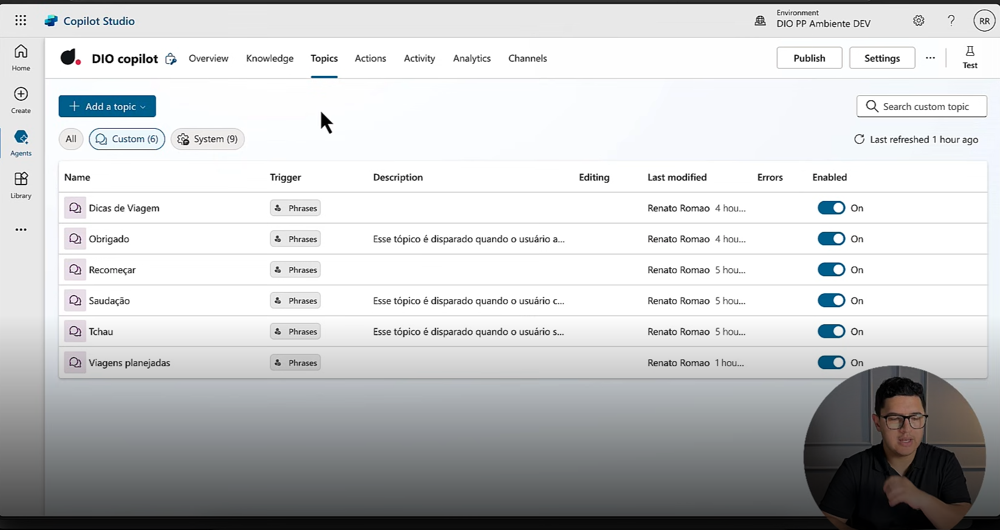

### Depois, ir em "Entidades"

 Slide da aula🔻

    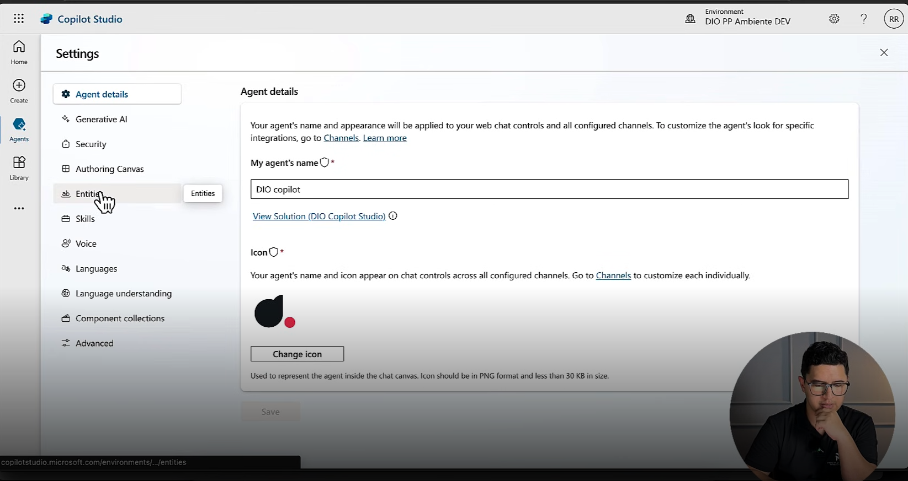

- Aqui você vai encontrar uma série de Entidades já definidas.

 Slide da aula🔻

    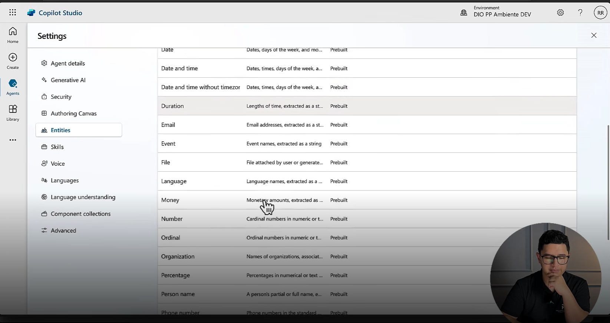

- Selecionando "Cidades" a título de exemplo.

 Slide da aula🔻

    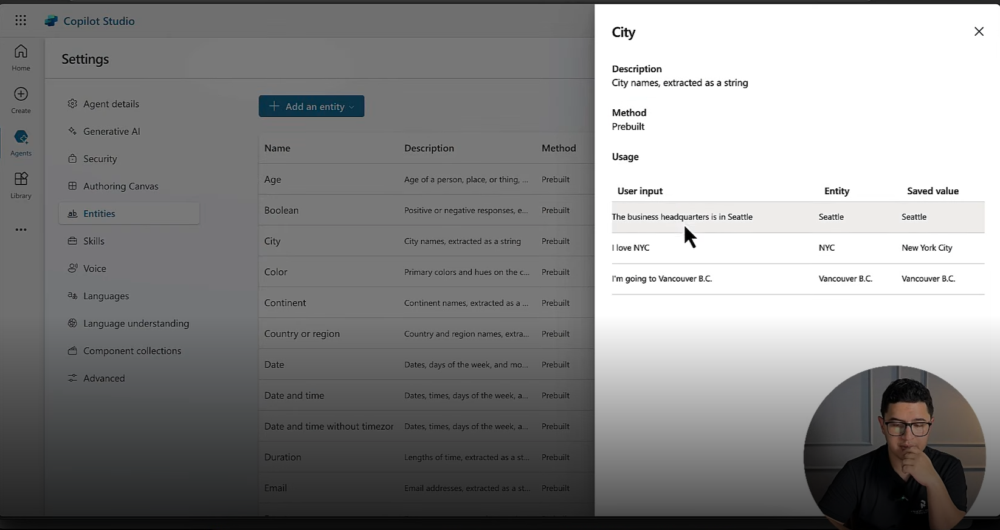

### Retornando ao nosso Tópico "Dicas de Viagem"

- Verifique que ele ja utiliza algumas dessas entidades, como Cidade (City), por exemplo, onde perguntamos sobre o destino.

 Slide da aula🔻

    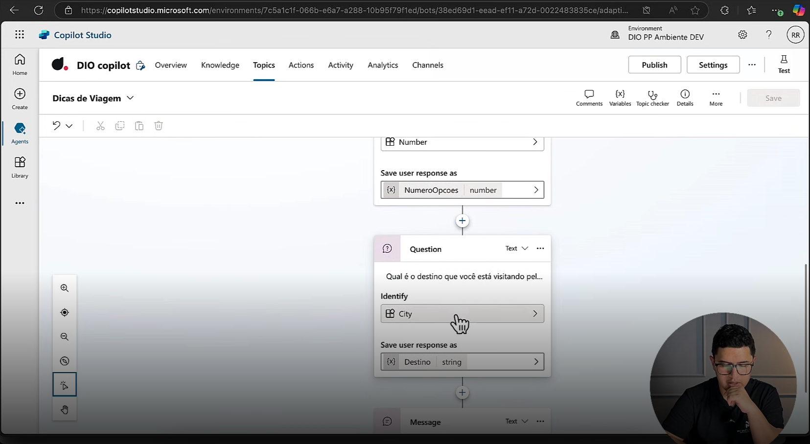

## 🟩 Vídeo 04 - Diferença entre entidade e tipos de perguntas

- Quando tivermos modelos de informações que são padronizadas eu sempre vou usar as Entidades.
- Caso contrário, ao invés de usar uma pergunta simples, nós temos a opção de usar "Adaptive Cards", que podem facilitar a forma de obter as informações.
- Em alguns casos os tipos de pergunta podem facilitar e melhorar a experiência do nosso usuário.
- As Entidades servem parar capturar e ignorar parte das entradas do nosso usuário.

 Slide da aula🔻

    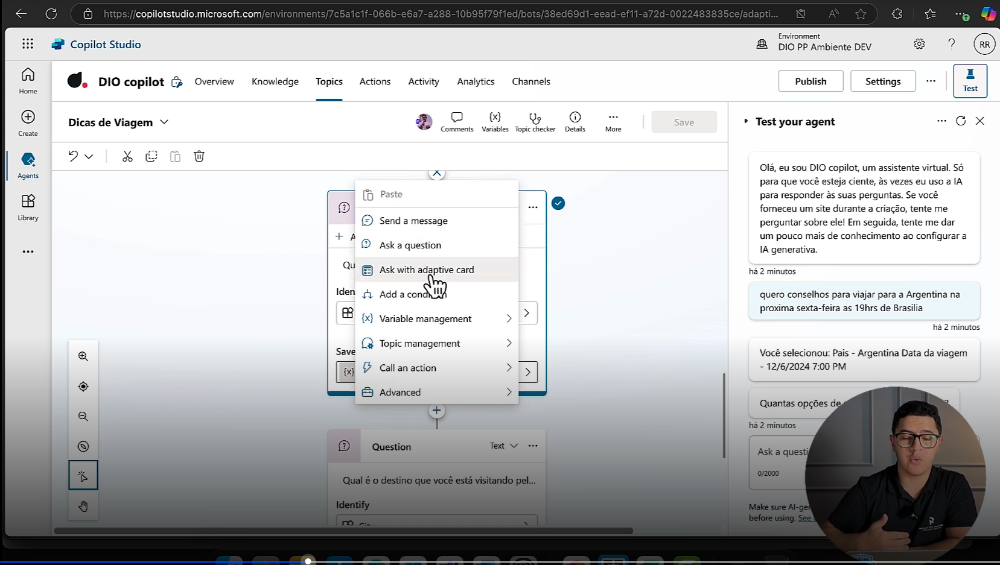

## 🟩 Vídeo 05 - O que são variáveis

### Variáveis

- As variáveis servem para salvar respostas do usuário e reutilizar seu conteúdo posteriormente na conversa.

- Também pode usar variáveis para criar expressões lógicas que direcionam dinamicamente o usuário por diferentes caminhos de conversa.

 Slide da aula🔻

    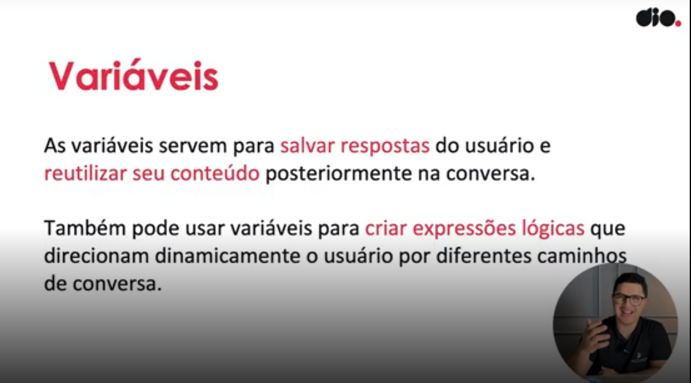

### Tipos de variáveis ✅

- Tópico  
    - Variáveis de tópico são específicas de um tópico de conversa. Elas armazenam informações temporárias enquanto o usuário está dentro daquele tópico. Por exemplo, se o tópico é sobre agendar uma reunião, a variável pode guardar a data escolhida. Assim que o usuário sai do tópico, essas variáveis geralmente são descartadas.

- Variáveis globais  
    - Variáveis globais estão disponíveis em qualquer parte do copiloto, independentemente do tópico. Elas são úteis para guardar informações que precisam ser acessadas em múltiplos fluxos, como o nome do usuário, idioma preferido ou status de autenticação. São persistentes durante toda a sessão.

- Variáveis de sistema  
    - Essas são variáveis pré-definidas pelo Copilot Studio e fornecem informações internas sobre o estado da conversa ou do usuário. Exemplos incluem user.name, conversation.id ou dialog.lastTurn. Você não precisa criá-las — elas já existem e ajudam a controlar o fluxo ou tomar decisões com base no contexto.

- Variáveis de ambiente
    - Variáveis de ambiente são definidas fora do copiloto, geralmente na configuração do ambiente onde ele está sendo executado. Elas são úteis para armazenar dados como URLs de APIs, chaves de acesso ou configurações específicas de produção vs. teste. Servem como parâmetros globais que não mudam com a conversa.

 Slide da aula🔻

    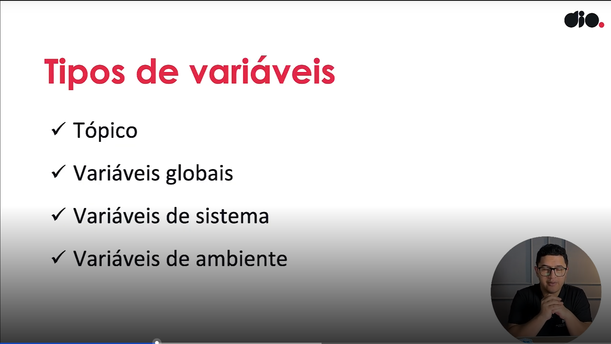

## Materiais de Apoio

Este documento tem como objetivo fornecer informações adicionais para enriquecer sua jornada de aprendizado no curso **"Trabalhando com Ambientes no Microsoft Copilot Studio"**. Aqui você encontrará links úteis, slides, repositórios, páginas oficiais e dicas para se destacar na DIO e no mercado de trabalho.

### Recursos Adicionais

Aprofunde seus conhecimentos com os seguintes materiais:

- [Microsoft Copilot Studio](https://www.microsoft.com/pt-br/microsoft-copilot/microsoft-copilot-studio)
- [Trabalhar com ambientes do Power Platform no Copilot Studio](https://learn.microsoft.com/pt-br/microsoft-copilot-studio/environments-first-run-experience)

### Dicas e Links Úteis

Explore formas de se desenvolver e se destacar na DIO e no mercado:

- **Artigos e Fórum da DIO**  
  Compartilhe conhecimento e dúvidas por meio de artigos e fóruns específicos para cada experiência educacional, como Bootcamps.

- **Rooms**  
  Participe de salas de bate-papo em tempo real para interagir com outros participantes dos Bootcamps, compartilhando dúvidas, dicas e trechos de código.

- **Exploração na Web**  
  Use buscadores para aprofundar temas específicos. Páginas como o StackOverflow são ótimos recursos para encontrar soluções e expandir seu entendimento.

**Continue aproveitando as oportunidades de aprendizado, buscando mais conhecimento e compartilhando suas descobertas com a comunidade!**

# Certificado: Introdução a Entidades e Variáveis no Microsoft Copilot Studio

- Link: https://hermes.dio.me/certificates/3YQQCK1B.pdf
