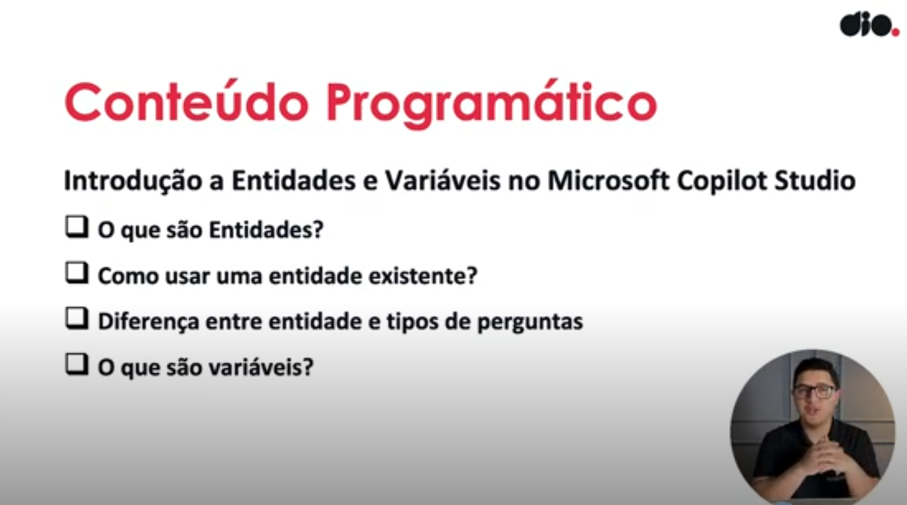

- Instrutor: Renato Romão de Souza (Microsoft MVP, MCT, Especialista em Copilot & IA).
- Contato Linkedin: https://www.linkedin.com/in/renatoromao

## 🟩 Vídeo 01 - Conteúdo Programático

 Slide da aula🔻

    

## 🟩 Vídeo 02 - O que são Entidades

## 🟩 Vídeo 03 - Como usar uma entidade existente

## 🟩 Vídeo 04 - Diferença entre entidade e tipos de perguntas

## 🟩 Vídeo 05 - O que são variáveis

