- Instrutor: Renato Romão de Souza (Microsoft MVP, MCT, Especialista em Copilot & IA).
- Contato Linkedin: https://www.linkedin.com/in/renatoromao

## 🟩 Vídeo 01 - Conteúdo Programático

### Conteúdo Programático

- Criando uma nova entidade  
- Melhores práticas de uma entidade

## 🟩 Vídeo 02 - Criando uma Nova Entidade

- Para criar uma nova Entidade, ir em Configurações (ou Settings).

 Slide da aula🔻

    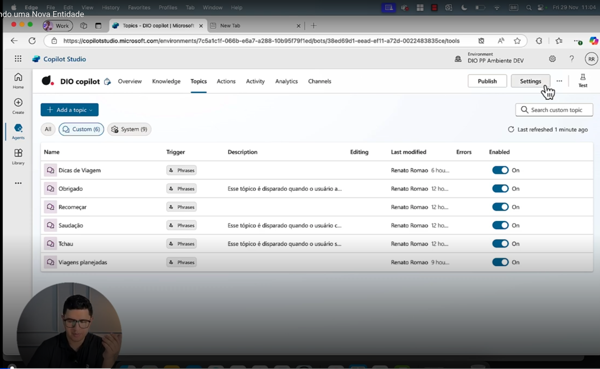

- Em seguida selecionar Entities, para criar as Entiades.

 Slide da aula🔻

    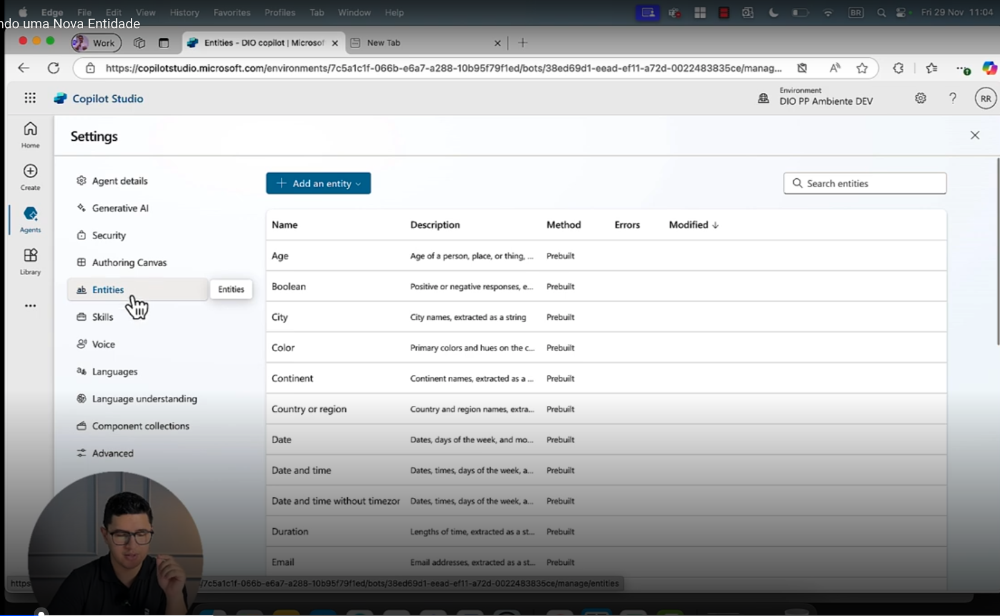

- É possĩvel criar uma nova Entidade ou registrar uma Entidade externa.

 Slide da aula🔻

    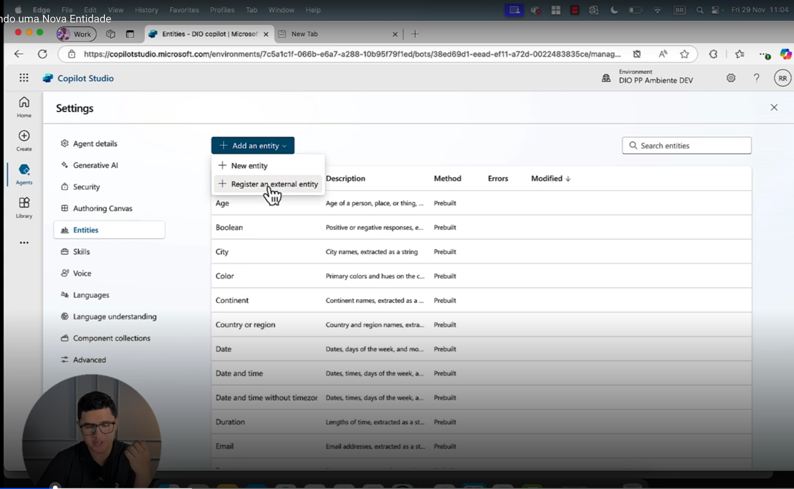

- Link de Referência para registro de uma Entidade externa.
    - https://learn.microsoft.com/en-us/microsoft-copilot-studio/advanced-entities-slot-filling

 Slide da aula🔻

    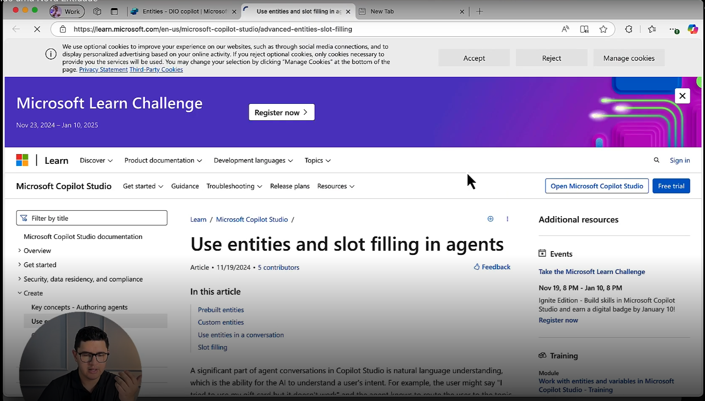

- Vamos criar uma nova Entidade do zero.

 Slide da aula🔻

    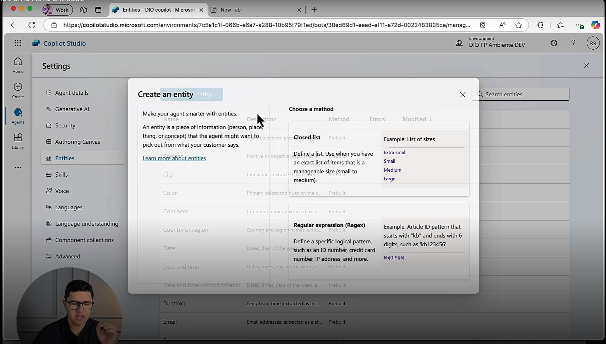

- Quando estamos criando, surgem algumas recomendações da Microsoft.
- Existem dois métodos: listas fechadas e expressões regulares.

 Slide da aula🔻

    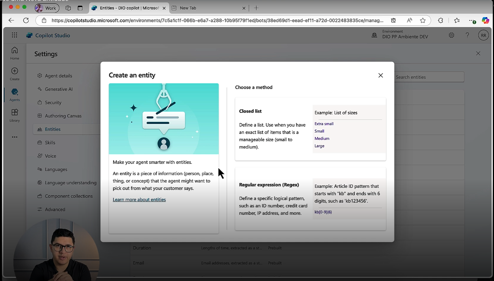

- Primeiro vamos criar uma lista fechada.
- Você vai ver que vai precisar definir um nome pra sua entidade (ex: Tipos de Viagem)
- A descrição é opcional, mas é recomendado utilizar (futuramente para dar manutenção).
    - Ex: Esta entidade é responsável por definir e encontrar os tipos de viagem existentes para os usuários.
- Existe uma funcionalidade muito interessante, que é o "Smart Matching" (recomanda-se habilitar).
    
    - A opção de correspondência inteligente ("Smart matching") permite que o agente compreenda melhor a linguagem natural. Isso pode ajudar a identificar erros de ortografia, variações gramaticais e palavras com significados semelhantes.

    - Se o agente não estiver reconhecendo palavras relacionadas o suficiente, você pode aprimorar ainda mais sua compreensão adicionando sinônimos aos itens da lista.

 Slide da aula🔻

    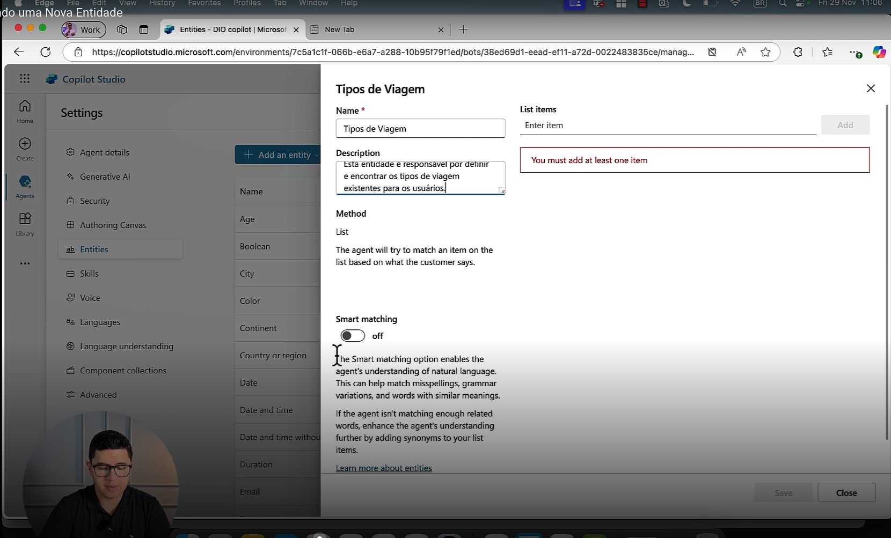

- Em seguida definimos a lista de termos (carro, barco, etc).

 Slide da aula🔻

    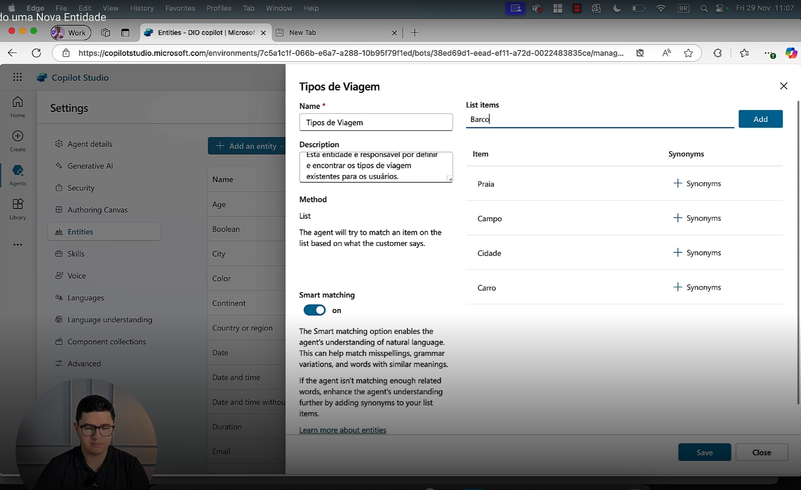

- Temos a opção, também, de editar a lista de sinônimos.

 Slide da aula🔻

    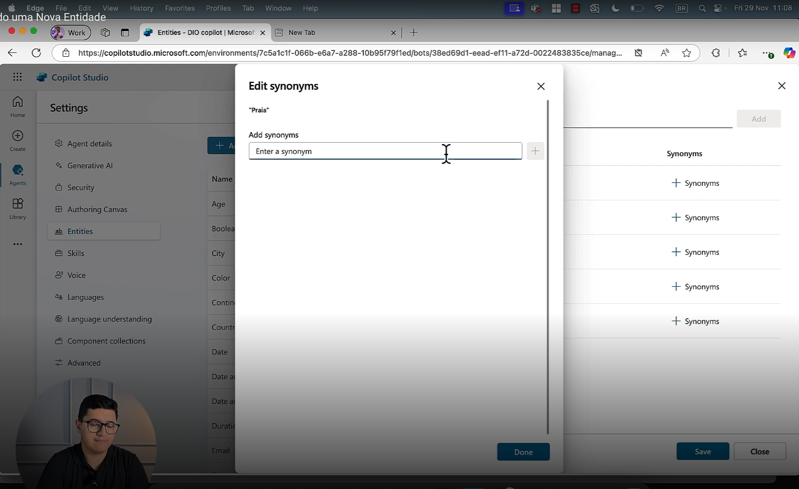

## 🟩 Vídeo 03 - Como Utilizar uma Entidade

- Demonstrando como utilizar essas opções.
- Entrar em "Dicas de Viagem".
- Inserindo uma pergunta: "Qual o tipo de viagem desejada?"
    - Eu seleciono quais opções esstarão disponíveis para meu usuário.

 Slide da aula🔻

    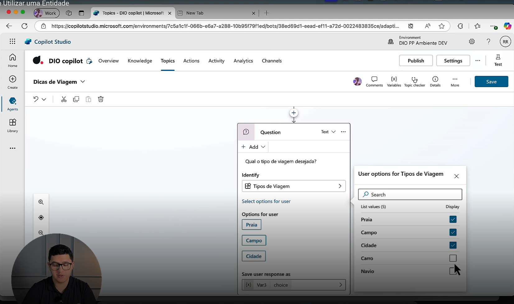

- Vou adicionar à nossa mensagem, o tipo de viagem, para conseguir fazer omapeamento.

 Slide da aula🔻

    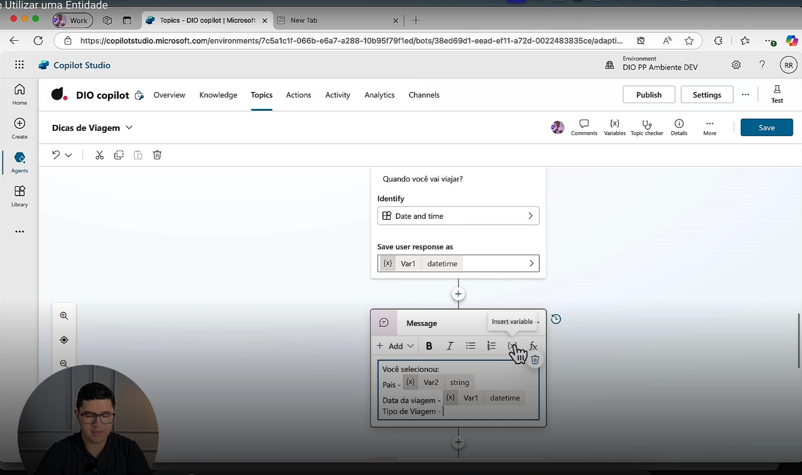

- Fazendo-se o teste.

 Slide da aula🔻

    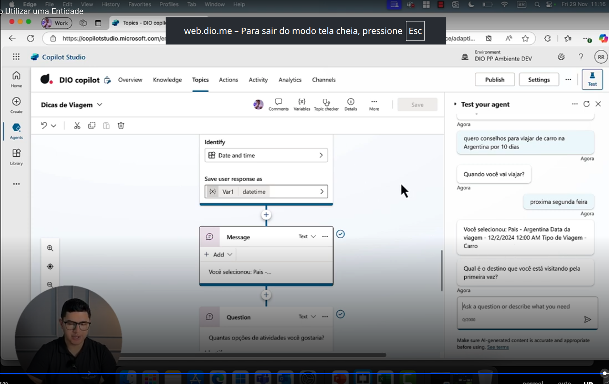

## 🟩 Vídeo 04 - Inserindo Expressões Regulares

- Aqui selecionamos o método de Expressões Regulares.
- A Microsoft disponibiliza alguns exemplos.

 Slide da aula🔻

    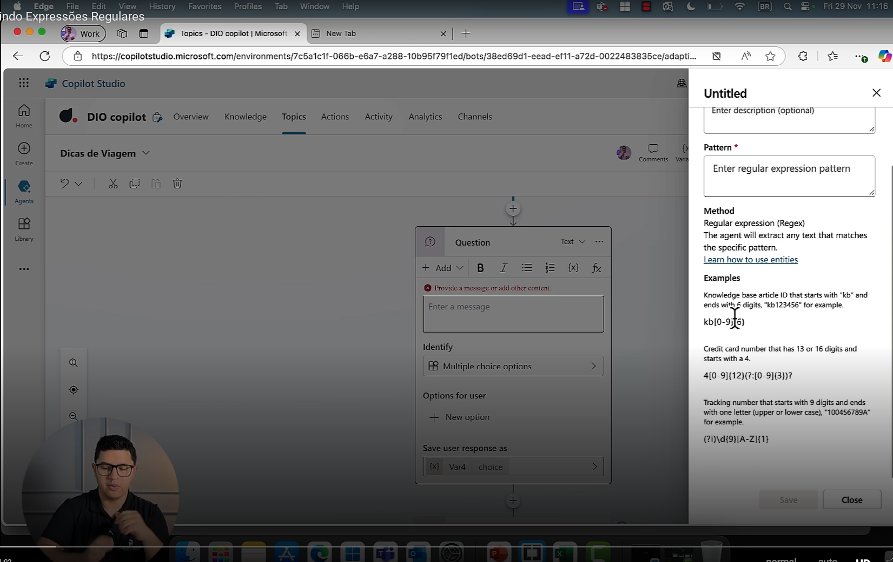

## 🟩 Vídeo 05 - Melhores práticas de uma entidade

## Materiais de Apoio

Este documento tem como objetivo fornecer informações adicionais para enriquecer sua jornada de aprendizado no curso **"Trabalhando com Ambientes no Microsoft Copilot Studio"**. Aqui você encontrará links úteis, slides, repositórios, páginas oficiais e dicas para se destacar na DIO e no mercado de trabalho.

### Recursos Adicionais

Aprofunde seus conhecimentos com os seguintes materiais:

- [Microsoft Copilot Studio](https://www.microsoft.com/pt-br/microsoft-copilot/microsoft-copilot-studio)
- [Trabalhar com ambientes do Power Platform no Copilot Studio](https://learn.microsoft.com/pt-br/microsoft-copilot-studio/environments-first-run-experience)

### Dicas e Links Úteis

Explore formas de se desenvolver e se destacar na DIO e no mercado:

- **Artigos e Fórum da DIO**  
  Compartilhe conhecimento e dúvidas por meio de artigos e fóruns específicos para cada experiência educacional, como Bootcamps.

- **Rooms**  
  Participe de salas de bate-papo em tempo real para interagir com outros participantes dos Bootcamps, compartilhando dúvidas, dicas e trechos de código.

- **Exploração na Web**  
  Use buscadores para aprofundar temas específicos. Páginas como o StackOverflow são ótimos recursos para encontrar soluções e expandir seu entendimento.

**Continue aproveitando as oportunidades de aprendizado, buscando mais conhecimento e compartilhando suas descobertas com a comunidade!**

# Certificado: Introdução a Entidades e Variáveis no Microsoft Copilot Studio

- Link: 