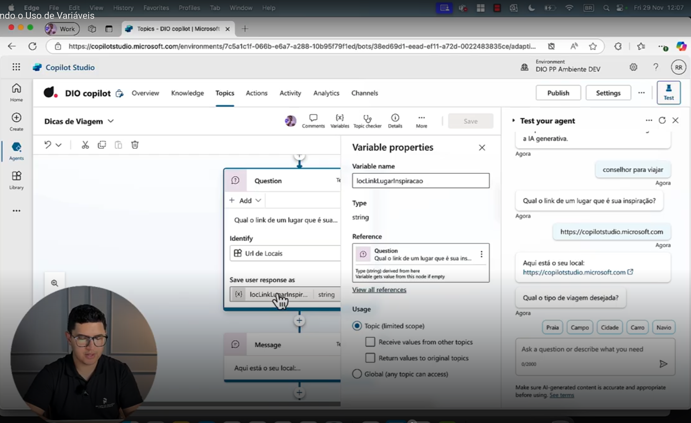
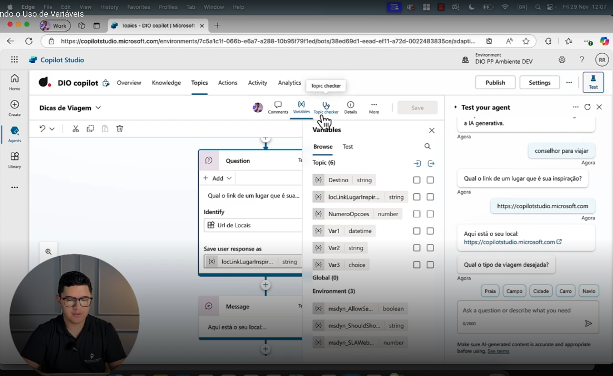
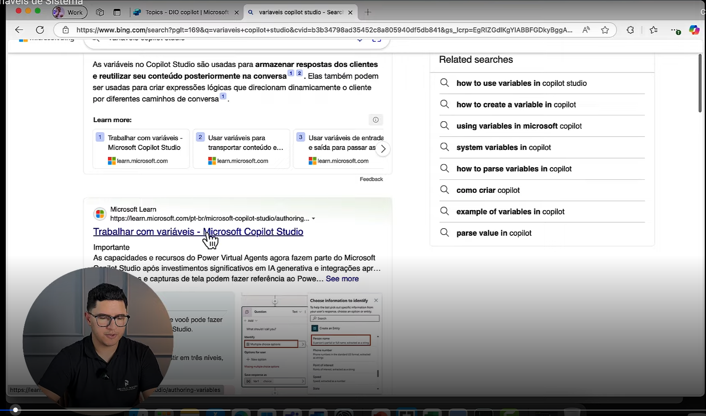
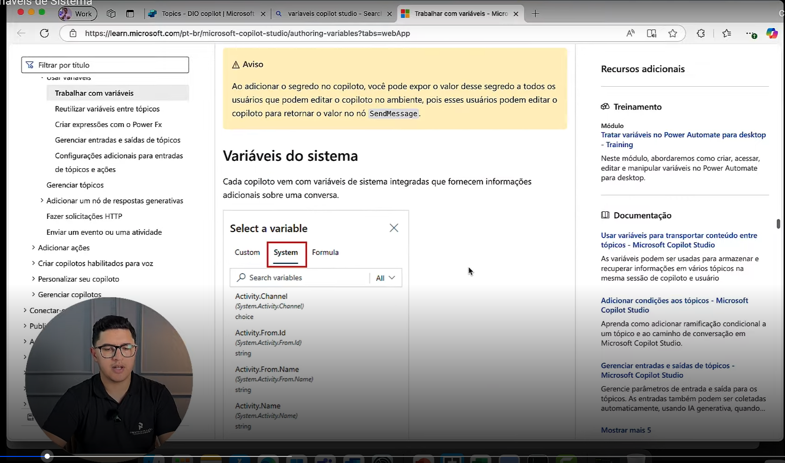
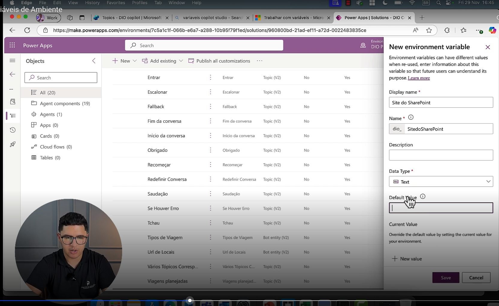
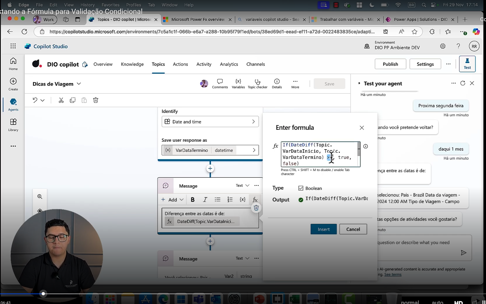
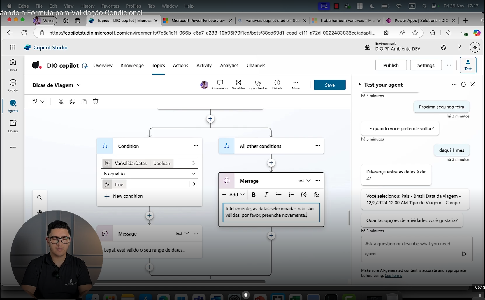
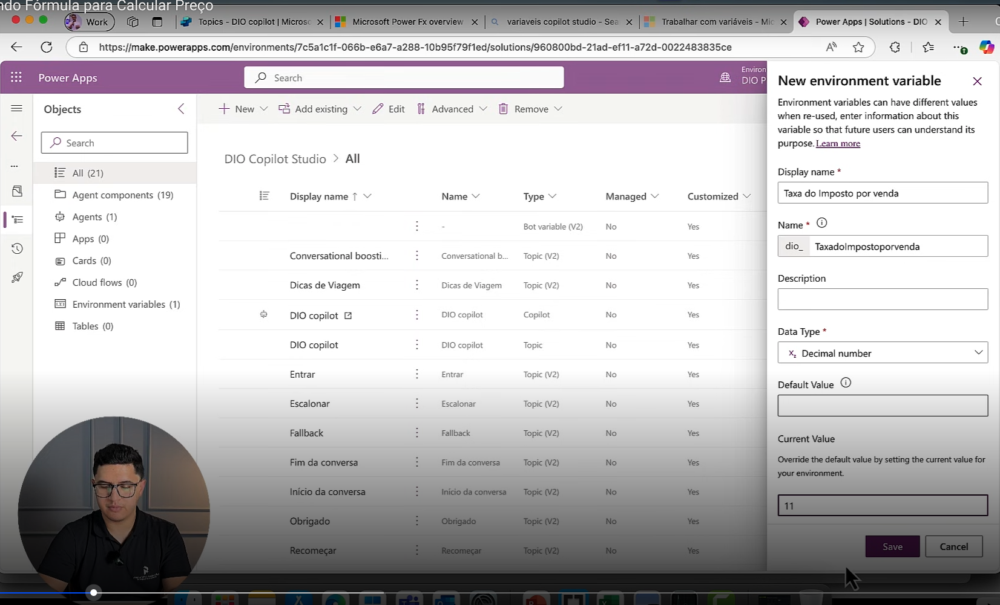
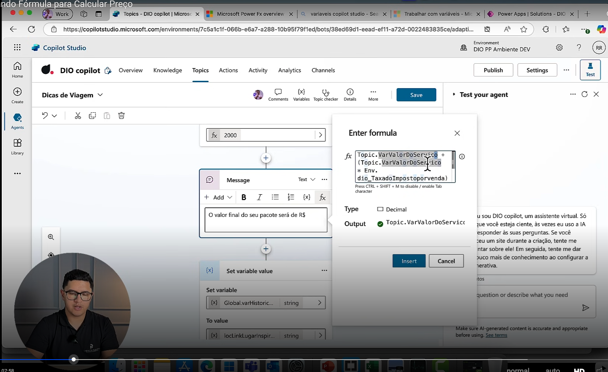
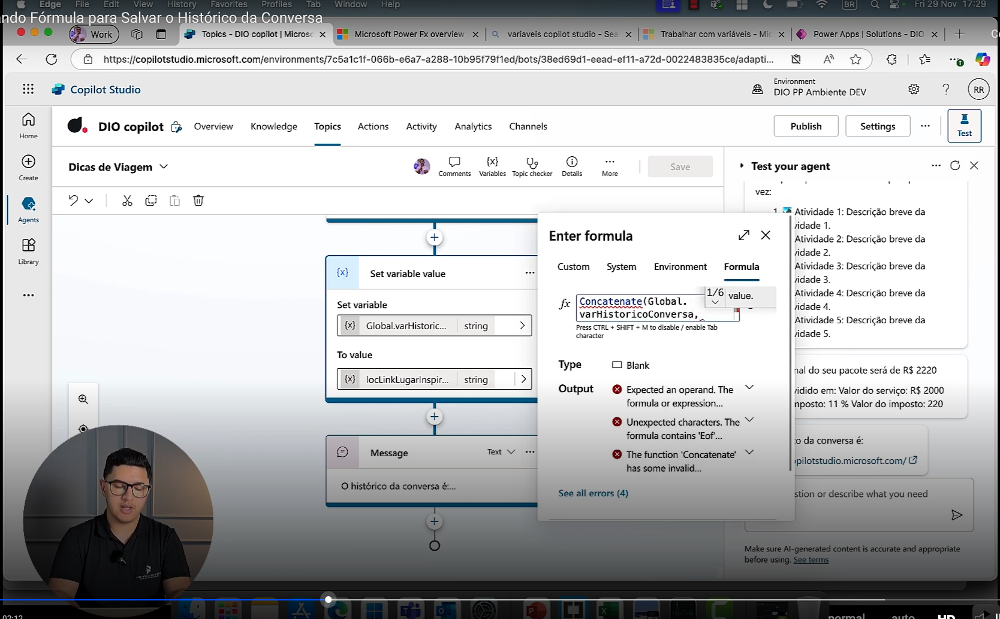

- Instrutor: Renato Romão de Souza (Microsoft MVP, MCT, Especialista em Copilot & IA).
- Contato Linkedin: https://www.linkedin.com/in/renatoromao

# Parte 01 - Como definir uma variável
 
## 🟩 Vídeo 01 - Como Definir uma Variável

### Conteúdo Programático

- Como definir uma variável?  
- Tipos de variáveis existentes  
- Trabalhando com fórmulas e variáveis

### Dentro do Copilot, ir em Tópicos

- Lembrando que as variáveis sempre vão estar dentro dos tópicos.

 Slide da aula🔻

    

### Selecionando um Tópico existente (p.ex, "Dicas de Viagem")

 Slide da aula🔻

    

- Uma pergunta, alguma informação que precisamos extrair do nosso usuário, acaba se tornando uma variável.
- O Copilot extrai uma informação do usuário e envia de volta para o chatbot de forma que, se o desenvolvedor quiser usar aquela variável, ele pode. Caso contrário é uma informação descartável.

 Slide da aula🔻

    

### Se cliacar em "Save respose as" ...

- O Copilot mostra automaticamente o nome, seu tipo, onde estão suas referências e algumas outras informações de uso.
- Eu consigo fazer uma série de configurações dentro de uma variável, que é simplesmente uma pergunta.

 Slide da aula🔻

    

- A primeira boa prática é dar um nome adequado à variável.
    - Ex: locLinklugarinspiracao ("loc" de local)

 Slide da aula🔻

    

## 🟩 Vídeo 02 - Entendendo o Uso de Variável de Tópico ou Global
 
- Toda variável tem um tipo que, por padrão, é string.

 Slide da aula🔻

    

- Eu consigo ver onde a variável está sendo utilizada (todas as referências).
- Também consigo definir se são variáveis de Tópico ou Globais.
    - É o motivo de ter colocado "loc" (de local) seguido do nome da variável.
- Por padrão ele vai sempre se limitar ao escopo de Tópico

 Slide da aula🔻

    

- Quando definimos como variável global, qualquer outro tópico dentro DESSE Copilot vai me permitir usar as mesmas variáveis (bem como sobreescrever seus varlores).

 Slide da aula🔻

    

## 🟩 Vídeo 03 - Testando o Uso de Variáveis

### Testando com pergunta

    - Conselhos para viajar?

 Slide da aula🔻

    

- O Copilot pergunta:
    - Qual o link para a sua inspiração
    -Copia-se o próprio link desta página

 Slide da aula🔻

    

- A variável por padrão foi definida.

 Slide da aula🔻

    

- Pode-se visualizar em "variables" também.

 Slide da aula🔻

    

## 🟩 Vídeo 04 - Gerenciando Variáveis
 
- Dentro de "Variable Management" tenho as opções de definir uma variável, fazer o parse de um valor e limpar todas as variáveis.

 Slide da aula🔻

    

## 🟩 Vídeo 05 - Trabalhando com Cartões Adaptáveis

### Outra opção é trabalhar com cartões adaptáveis

 Slide da aula🔻

    

### Propriedades dos Cartões Adaptáveis em formato JSON

 Slide da aula🔻

    

# Parte 02 - Tipos de variáveis existentes
 
## 🟩 Vídeo 06 - Variáveis de Tópico e Variáveis Globais
 
- No exemplo em questão é usada uma variável Global e local (de Tõpico).
- É possĩvel identificar pela sua formatação.

 Slide da aula🔻

    

## 🟩 Vídeo 07 - Variáveis de Sistema
 
- Há uma série de variáveis de sistema disponíveis para utilização.

 Slide da aula🔻

    

- Dentro da documentação da Microsoft as variáveis estão disciminadas.

 Slide da aula🔻

    

- AS principais são as variáveis relacionadas ao sistema.

 Slide da aula🔻

    

## 🟩 Vídeo 08 - Variáveis de Ambiente

- Além disso, nós temos também as variáveis de ambiente.

 Slide da aula🔻

    

- Adicionando uma variável (ex: site do Sharepoint).

 Slide da aula🔻

    

- Utilizando a variável.

 Slide da aula🔻

    

# Parte 03 - Trabalhando com fórmulas e variáveis
 
## 🟩 Vídeo 09 - Exemplos de Casos Reais
 
### Exemplos de casos reais

- Comparar duas datas para férias  
- Customizar o nome do usuário  
- Verificar se uma data está dentro do período  
- Calcular preço com imposto  
- Verificar se tem um produto no estoque  
- Calcular a média de preço  

 Slide da aula🔻

    
</tp>

 
## 🟩 Vídeo 10 - Criando Fórmula para Comparar Datas
 
### criando variáveis e testando.

- VarDataInicio e VarDataTermino

 Slide da aula🔻

    

### Utilizando o MIcrosoft PowerFX

 Slide da aula🔻

    

- Lembrando que a MicroSoft sempre tem documentação

 Slide da aula🔻

    

## 🟩 Vídeo 11 - Ajustando a Fórmula para Validação Condicional
 
- Fórmula para cálculo de diferença em dias entre datas.
- Depois compara: se resultado for maior que zero, retorna verdadeiro.

 Slide da aula🔻

    

- Estabelecendo condições com base nesse resultado.

 Slide da aula🔻

    

## 🟩 Vídeo 12 - Criando Fórmula para Calcular Preço
 
- Criando variável de ambiente Taxa do Imposto 
    - Com valor atual igual a 11%.

 Slide da aula🔻

    

- Entrando com a fórmula para cálculo do preço com imposto.

 Slide da aula🔻

    

## 🟩 Vídeo 13 - Criando Fórmula para Salvar o Histórico da Conversa

- Você pode usar uma variável para armazenar o histórico da conversa utilizando uma fórmula

 Slide da aula🔻

    

## Materiais de Apoio

Este documento tem como objetivo fornecer informações adicionais para enriquecer sua jornada de aprendizado no curso **"Trabalhando com Ambientes no Microsoft Copilot Studio"**. Aqui você encontrará links úteis, slides, repositórios, páginas oficiais e dicas para se destacar na DIO e no mercado de trabalho.

### Recursos Adicionais

Aprofunde seus conhecimentos com os seguintes materiais:

- [Microsoft Copilot Studio](https://www.microsoft.com/pt-br/microsoft-copilot/microsoft-copilot-studio)
- [Trabalhar com ambientes do Power Platform no Copilot Studio](https://learn.microsoft.com/pt-br/microsoft-copilot-studio/environments-first-run-experience)

### Dicas e Links Úteis

Explore formas de se desenvolver e se destacar na DIO e no mercado:

- **Artigos e Fórum da DIO**  
  Compartilhe conhecimento e dúvidas por meio de artigos e fóruns específicos para cada experiência educacional, como Bootcamps.

- **Rooms**  
  Participe de salas de bate-papo em tempo real para interagir com outros participantes dos Bootcamps, compartilhando dúvidas, dicas e trechos de código.

- **Exploração na Web**  
  Use buscadores para aprofundar temas específicos. Páginas como o StackOverflow são ótimos recursos para encontrar soluções e expandir seu entendimento.

**Continue aproveitando as oportunidades de aprendizado, buscando mais conhecimento e compartilhando suas descobertas com a comunidade!**

# Certificado: Criando Variáveis no Microsoft Copilot Studio

- Link:

