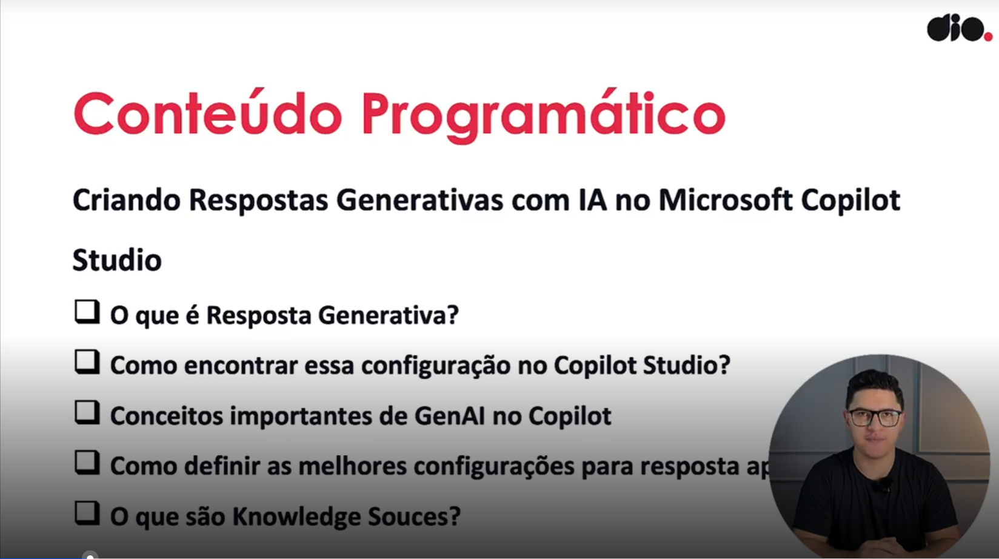

- Instrutor: Renato Romão de Souza (Microsoft MVP, MCT, Especialista em Copilot & IA).
- Contato Linkedin: https://www.linkedin.com/in/renatoromao

## 🟩 Vídeo 01 - Conteúdo Programático

### Conteúdo Programático

**Criando Respostas Generativas com IA no Microsoft Copilot Studio**

1. O que é Resposta Generativa?
2. Como encontrar essa configuração no Copilot Studio?
3. Conceitos importantes de GenAI no Copilot
4. Como definir as melhores configurações para resposta apropriada?
5. O que são Knowledge Sources?

 Slide da aula🔻

    

## 🟩 Vídeo 02 - O que é Resposta Generativa?

## 🟩 Vídeo 03 - Como encontrar essa configuração no Copilot Studio?

## 🟩 Vídeo 04 - Conceitos importantes de GenAI no Copilot

## 🟩 Vídeo 05 - Como definir as melhoras configurações para resposta apropriada?

## 🟩 Vídeo 06 - O que são Knowledge Souces?