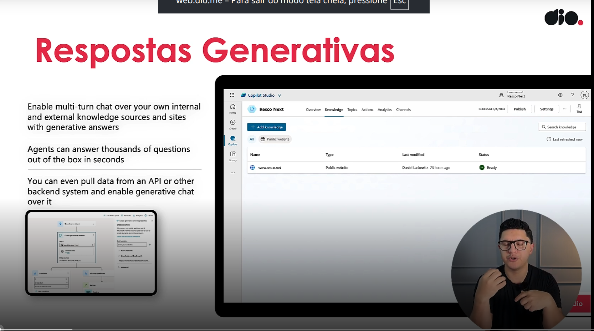
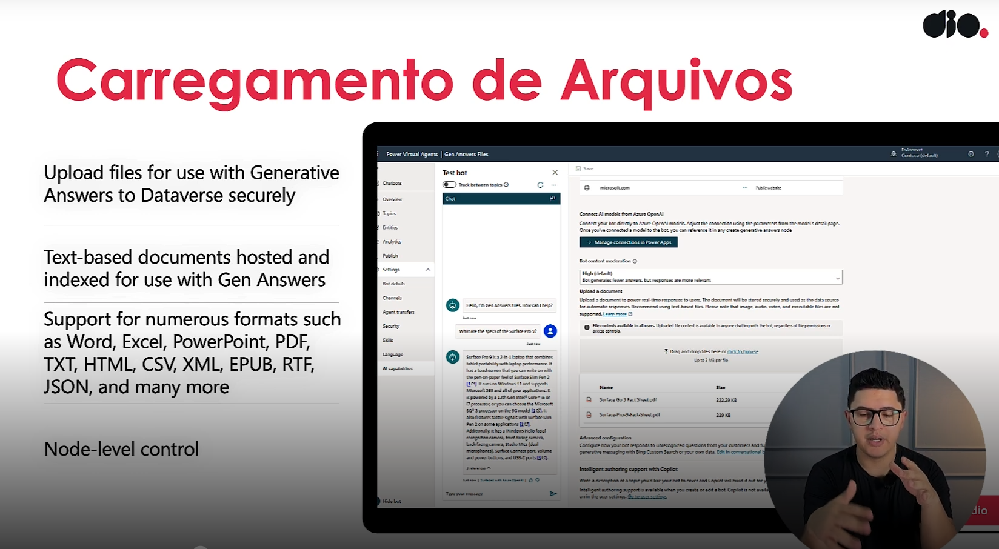

- Instrutor: Renato Romão de Souza (Microsoft MVP, MCT, Especialista em Copilot & IA).
- Contato Linkedin: https://www.linkedin.com/in/renatoromao

## 🟩 Vídeo 01 - Conteúdo Programático

### Conteúdo Programático

**Criando Respostas Generativas com IA no Microsoft Copilot Studio**

1. O que é Resposta Generativa?
2. Como encontrar essa configuração no Copilot Studio?
3. Conceitos importantes de GenAI no Copilot
4. Como definir as melhores configurações para resposta apropriada?
5. O que são Knowledge Sources?

 Slide da aula🔻

    

## 🟩 Vídeo 02 - O que é Resposta Generativa?

### Respostas Generativas

#### **Habilite conversa de múltiplas interações usando suas próprias fontes de conhecimento internas e externas e sites**

- Agentes podem fazer milhares de perguntas ao bot em segundos  
- Você pode até fornecer uma API ou outro chatbot externo para o chat generativo

 Slide da aula🔻

    

### Carregamento de Arquivos

**Documentos baseados em texto são hospedados e indexados para uso com Respostas Generativas**

- Suporte a diversos formatos: Word, Excel, PowerPoint, PDF, TXT, HTML, CSV, XML, EPUB, RTF, JSON e outros  
- Controle disponível em nível de nó  
- Arquivos são carregados com segurança para o Dataverse

 Slide da aula🔻

    

## 🟩 Vídeo 03 - Como encontrar essa configuração no Copilot Studio?

## 🟩 Vídeo 04 - Conceitos importantes de GenAI no Copilot

## 🟩 Vídeo 05 - Como definir as melhoras configurações para resposta apropriada?

## 🟩 Vídeo 06 - O que são Knowledge Souces?