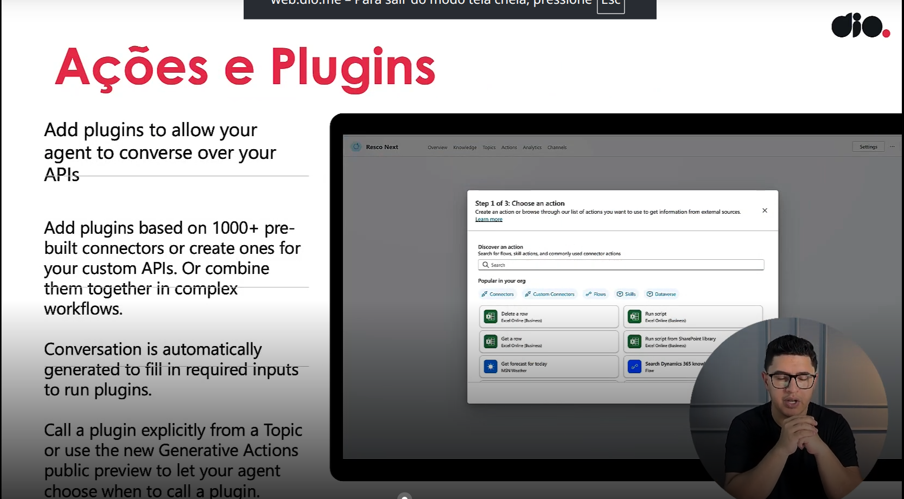
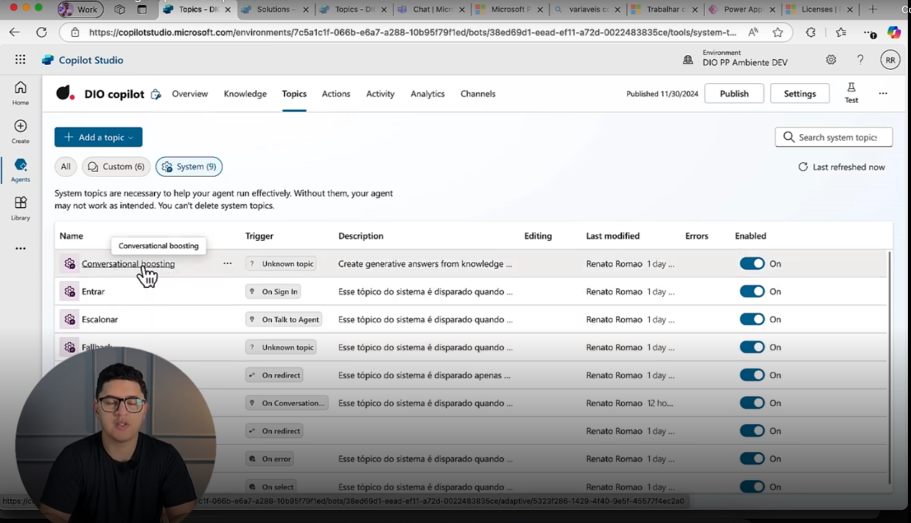
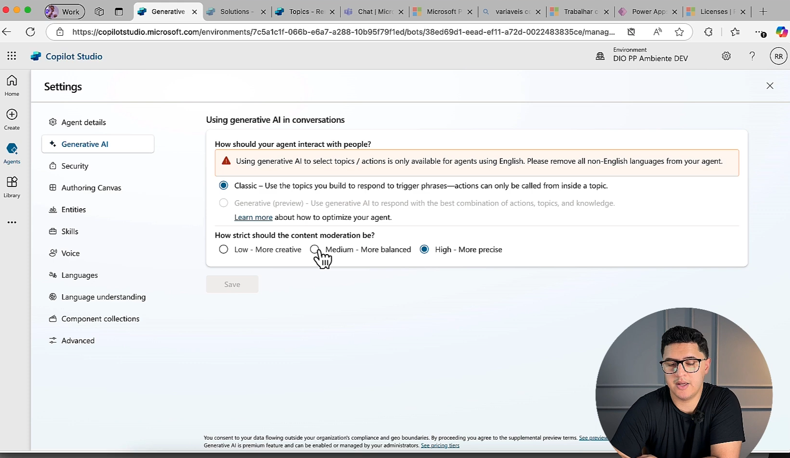
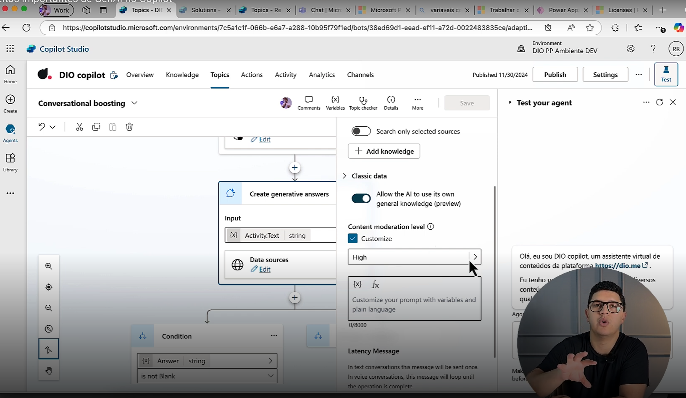
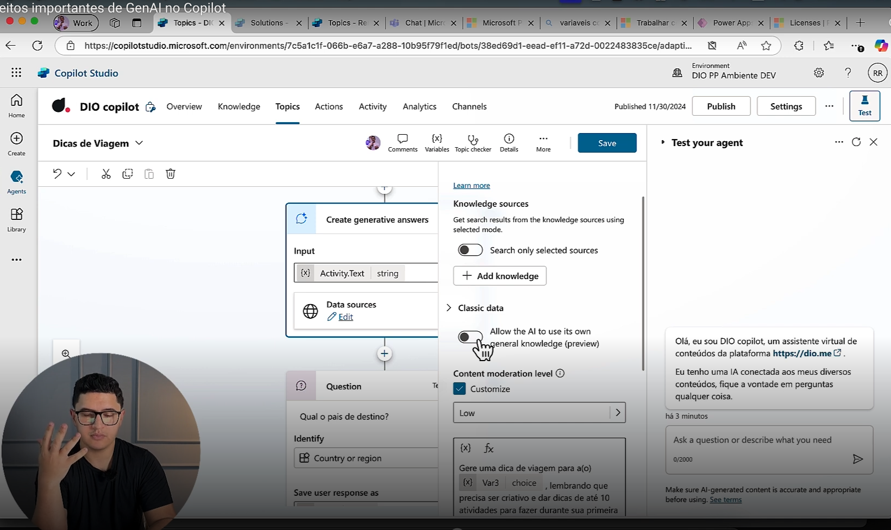
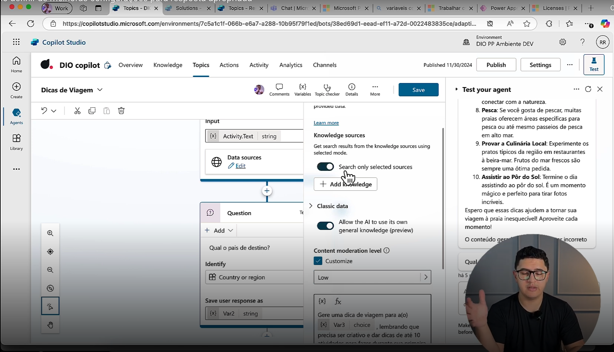
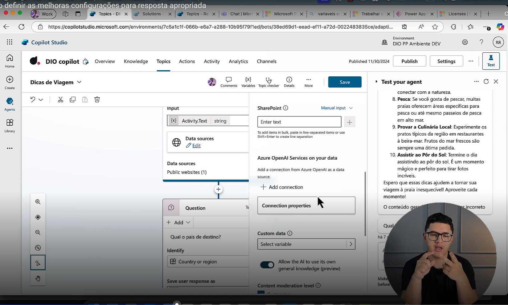
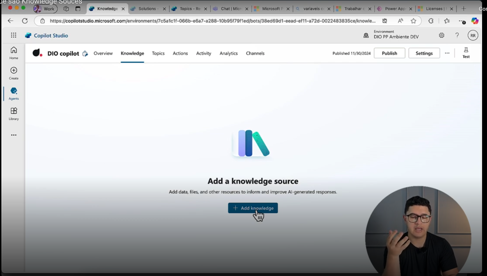
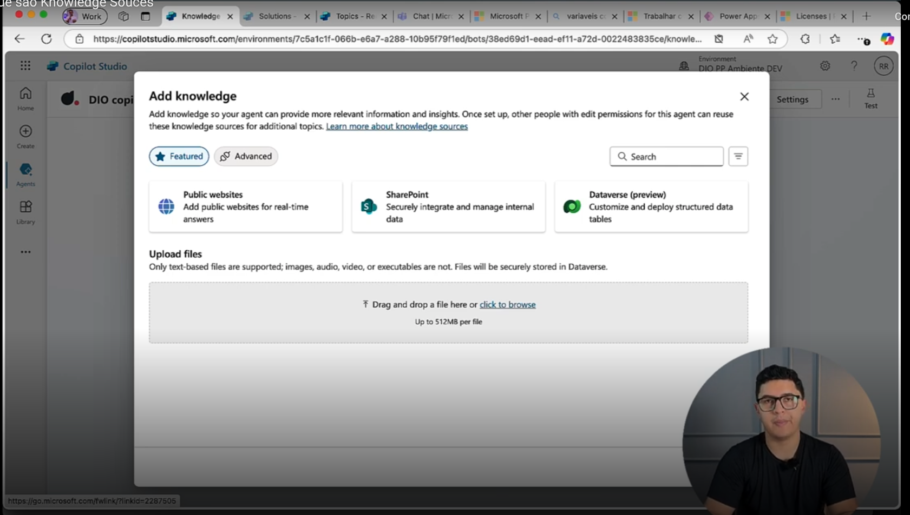

- Instrutor: Renato Romão de Souza (Microsoft MVP, MCT, Especialista em Copilot & IA).
- Contato Linkedin: https://www.linkedin.com/in/renatoromao

## 🟩 Vídeo 01 - Conteúdo Programático

### Conteúdo Programático

**Criando Respostas Generativas com IA no Microsoft Copilot Studio**

1. O que é Resposta Generativa?
2. Como encontrar essa configuração no Copilot Studio?
3. Conceitos importantes de GenAI no Copilot
4. Como definir as melhores configurações para resposta apropriada?
5. O que são Knowledge Sources?

 Slide da aula🔻

    

## 🟩 Vídeo 02 - O que é Resposta Generativa?

### Respostas Generativas

#### **Habilite conversa de múltiplas interações usando suas próprias fontes de conhecimento internas e externas e sites**

- Agentes podem fazer milhares de perguntas ao bot em segundos  
- Você pode até fornecer uma API ou outro chatbot externo para o chat generativo

 Slide da aula🔻

    

### Carregamento de Arquivos

**Documentos baseados em texto são hospedados e indexados para uso com Respostas Generativas**

- Suporte a diversos formatos: Word, Excel, PowerPoint, PDF, TXT, HTML, CSV, XML, EPUB, RTF, JSON e outros  
- Controle disponível em nível de nó  
- Arquivos são carregados com segurança para o Dataverse

 Slide da aula🔻

    

### Ações e Plugins

**Adicione plugins para permitir que seu agente converse com suas APIs**

- Adicione plugins com base em mais de 1000 conectores pré-criados ou crie seus próprios para APIs personalizadas.  
  Ou combine ambos para executar fluxos de trabalho complexos.

- A conversa é gerada automaticamente para preencher os dados necessários para executar os plugins.

- Chame um plugin diretamente a partir de um Tópico ou use o novo recurso de Ações Generativas para escolher o melhor plugin para a conversa do seu agente com um plugin.

 Slide da aula🔻

    

## 🟩 Vídeo 03 - Como encontrar essa configuração no Copilot Studio?

### Conversational boosting

- Toda a vez que o Copilot não reconhecer uma conversa de tópicos parametrizados pelo usuário ou de tópicos de sistema, ele sempre vai tentar utilizar a inteligência artificial.

 Slide da aula🔻

    

## 🟩 Vídeo 04 - Conceitos importantes de GenAI no Copilot

### Balanceamento de Conteúdo

 Slide da aula🔻

    

- É possível escolher o grau de moderação para um tópico específico

 Slide da aula🔻

    

- É possível desabilitar o acesso ao conteúdo da web para a IA.

 Slide da aula🔻

    

## 🟩 Vídeo 05 - Como definir as melhoras configurações para resposta apropriada?

- Selecionar como melhor prática apenas as bases de conhecimento de que você já dispõe.

 Slide da aula🔻

    

- Se não estiver sendo suficiente usar os meus documentos, arquivos, tabelas, é possúvel adicionar uma conexão com o Azure OpenAI Services.

 Slide da aula🔻

    

## 🟩 Vídeo 06 - O que são Knowledge Souces?

- São bases de conhecimento. É possível treinar uma modelo usando seus próprios dados.

 Slide da aula🔻

    

- O painel e suas opções.

 Slide da aula🔻

    

# Painel "Add knowledge" no Copilot Studio

O painel **"Add knowledge"** permite configurar as fontes de informação que alimentam um agente virtual criado no Copilot Studio. Ele é essencial para tornar o agente mais inteligente, contextualizado e útil nas interações com os usuários.

## Fontes de conhecimento disponíveis

### 1. Public websites
- Permite adicionar sites públicos como fonte de dados em tempo real.
- Ideal para informações abertas como notícias, conteúdo institucional ou dados de mercado.

### 2. SharePoint
- Integra dados internos de forma segura.
- Recomendado para empresas que usam SharePoint como repositório de documentos, políticas, FAQs, etc.

### 3. Dataverse (preview)
- Permite personalizar e usar tabelas estruturadas de dados.
- Útil para conectar o agente a bases organizadas como cadastros, inventários ou registros internos.

## Upload de arquivos

Além das fontes acima, é possível carregar arquivos diretamente para o Dataverse. Os tipos de arquivos suportados incluem:

- Imagens
- Áudio
- Vídeo
- Executáveis
- Documentos estruturados (PDF, DOCX, CSV, etc.)

Esses arquivos são armazenados com segurança e indexados para que o agente possa utilizá-los como base de conhecimento.

## Elementos da interface

- **Abas Featured e Advanced**: ajudam a filtrar e selecionar os tipos de fonte mais adequados.
- **Área de drag-and-drop**: facilita o envio de arquivos.
- **Barra de busca**: permite localizar rapidamente fontes já adicionadas.

## Finalidade

Esse painel é o núcleo da inteligência contextual do agente. Quanto mais bem alimentado com fontes confiáveis e organizadas, mais relevante e preciso será nas respostas.

