- Instrutor: Renato Romão de Souza (Microsoft MVP, MCT, Especialista em Copilot & IA).
- Contato Linkedin: https://www.linkedin.com/in/renatoromao

## 🟩 Vídeo 01 - Apresentação do desafio

### Pré-requisitos

- ✅ Ter acesso a uma conta do Microsoft 365  
- ✅ Ter um computador

### Etapas do Desafio

- ✅ Criar um Copilot em branco  
- ✅ [https://copilotstudio.microsoft.com](https://copilotstudio.microsoft.com)  
- ✅ Customizar um tópico  
- ✅ Personalizar uma mensagem de erro de tópico  
- ✅ Aumentar/diminuir a qualidade da resposta com GenAI

### Conteúdo Programático

- ✅ Apresentação do desafio  
- ✅ Criar um Copilot em branco  
- ✅ Customizar um tópico  
- ✅ Personalizar uma mensagem de erro de tópico  
- ✅ Aumentar/diminuir a qualidade da resposta com GenAI

### Links Úteis

- **Microsoft Learn**  
  [https://learn.microsoft.com/pt-br/microsoft-copilot-studio](https://learn.microsoft.com/pt-br/microsoft-copilot-studio)

- **Romão’s Learn**  
  [https://romaos.com.br/learn](https://romaos.com.br/learn)

## 🟩 Vídeo 02 - Criar um Copilot em branco

### Endereço do Copilot Studio

Link para início do projeto:
- [https://copilotstudio.microsoft.com/](https://copilotstudio.microsoft.com/)

- A partir da página inicial, você pode criar um Copilot a partir de uma descrição, mas nosso desafio é criar um Copilot em branco.

 Slide da aula🔻

    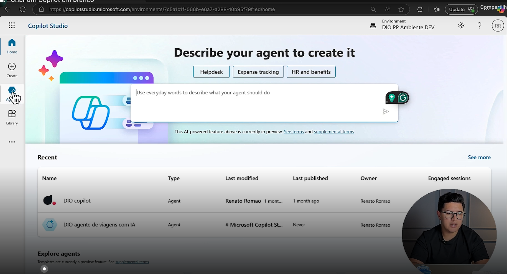

- Lembrando que dentro do Copilot Studio nós temos a parte de ambientes

 Slide da aula🔻

    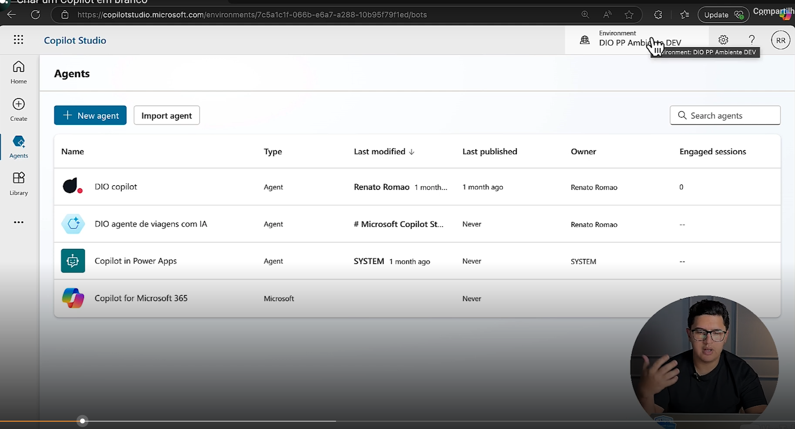

Essa imagem ilustra a seção “Agents” do Microsoft Copilot Studio, onde são gerenciados agentes inteligentes criados para automatizar tarefas e interações. A interface exibe uma lista com quatro agentes, incluindo detalhes como nome, tipo, data da última modificação, publicação e proprietário. Entre eles estão o “DIO Copilot” e o “Copilot Microsoft 365”, com diferentes níveis de personalização e autoria. Essa etapa do curso corresponde à visualização e organização dos agentes existentes, preparando o terreno para a criação de um novo copilot em branco, totalmente adaptado às necessidades do usuário.

- Clicando em "New Agent" criamos um novo agente.
- Na parte de idioma é recomendado usar o inglês.

 Slide da aula🔻

    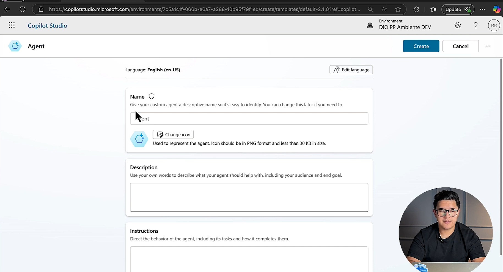

- Essa imagem mostra a etapa de personalização de um agente dentro do Microsoft Copilot Studio. O usuário está configurando um agente do zero, definindo elementos como nome, ícone, descrição e instruções de comportamento. A interface orienta o preenchimento com dicas sobre como descrever a função do agente, seu público-alvo e o tom que ele deve adotar. Essa fase do curso é essencial para moldar a identidade e o propósito do copilot, garantindo que ele atenda às necessidades específicas do projeto ou da organização.

 Slide da aula🔻

    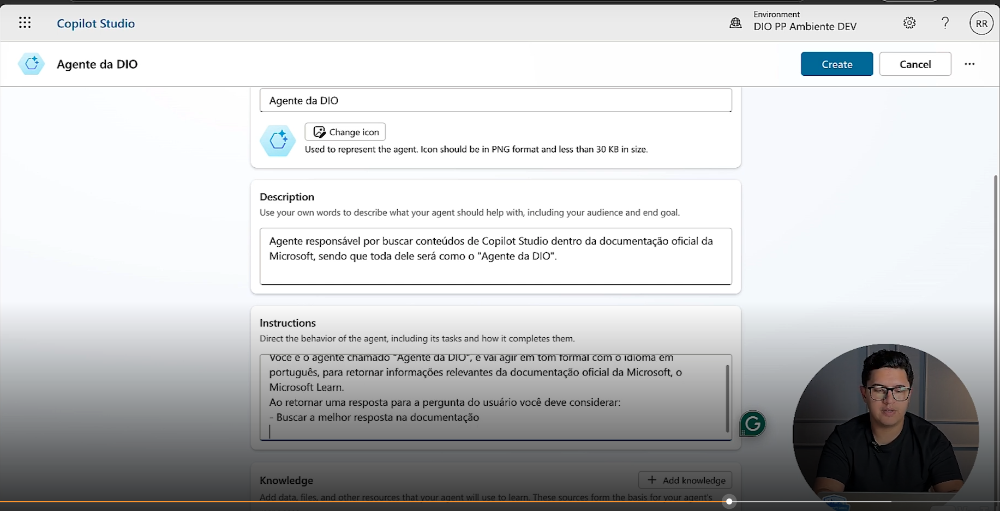

### Configuração do agente "Agente da DIO" no Copilot Studio

Na etapa, são preenchidos os campos de nome, ícone, descrição e instruções para configurar um agente personalizado chamado "Agente da DIO" dentro do ambiente do Copilot Studio.

#### O que foi preenchido:

- **Nome do agente:** *Agente da DIO* — um nome que identifica claramente a função e o contexto do bot.
- **Ícone:** opção de personalização visual, com a recomendação de usar arquivos PNG com menos de 1 MB.
- **Descrição:** define o propósito do agente: buscar conteúdos relacionados ao Copilot Studio na documentação oficial da Microsoft, especialmente no Microsoft Learn.
- **Instruções:** 
    - VOCÊ é o agente chamado “Agente da DIO” e sua tarefa é buscar conteúdos em Copilot Studio dentro da documentação oficial da Microsoft, como o Microsoft Learn.
    - Responda sempre apenas para a pergunta ou situação que deve considerar
    - Busque a melhor resposta na documentação
    - Retornar a resposta apropriada e amigável de tom formal
    - Retornar uma ou mais citações da documentação

#### Finalidade no contexto do curso:

Essa etapa tem como objetivo ensinar o aluno a criar um agente funcional e contextualizado, capaz de responder com precisão a perguntas sobre o Copilot Studio. Ao definir claramente o papel do agente, o aluno aprende a estruturar bots com intenção, escopo e linguagem adequada, o que é essencial para desenvolver soluções úteis e confiáveis em ambientes corporativos ou educacionais. Além disso, essa configuração prepara o agente para interagir com usuários de forma coerente, respeitando o propósito definido e garantindo consistência nas respostas.

## 🟩 Vídeo 03 - Customizar um tópico

 Slide da aula🔻

    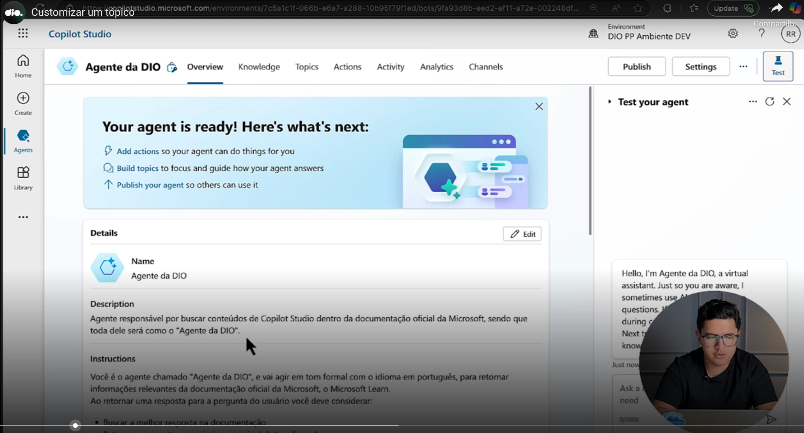

### Agente da DIO – Visão Geral

- **Seu agente está pronto! Próximos passos:**
    - ✅ Adicione tópicos para que seu agente possa executar ações  
    - ✅ Adicione autenticação para que seu agente forneça respostas corretas  
    - ✅ Publique seu agente para que outros possam utilizá-lo

-**Nome do agente:**  
    - Agente da DIO

- **Descrição do agente:**  
    - Você pode buscar conteúdos de Copilot Studio dentro da documentação oficial da Microsoft, sendo que este agente se chama **"Agente da DIO"**.  
    - O idioma está em português do Brasil.  
    - O nome **"Agente da DIO"** é válido e tem um bom formato com o idioma em português, para retomar a pergunta e a resposta com o usuário final.  
    - Você pode buscar **"Agente da DIO"** na seção de documentação oficial da Microsoft, com exemplos de como retomar a pergunta ou a solicitação com o usuário final.

- **Resposta do bot (teste):**  
    > Você pode buscar conteúdos de Copilot Studio dentro da documentação oficial da Microsoft, sendo que este agente se chama "Agente da DIO".

### Procedimento para customização de tópico

 Slide da aula🔻

    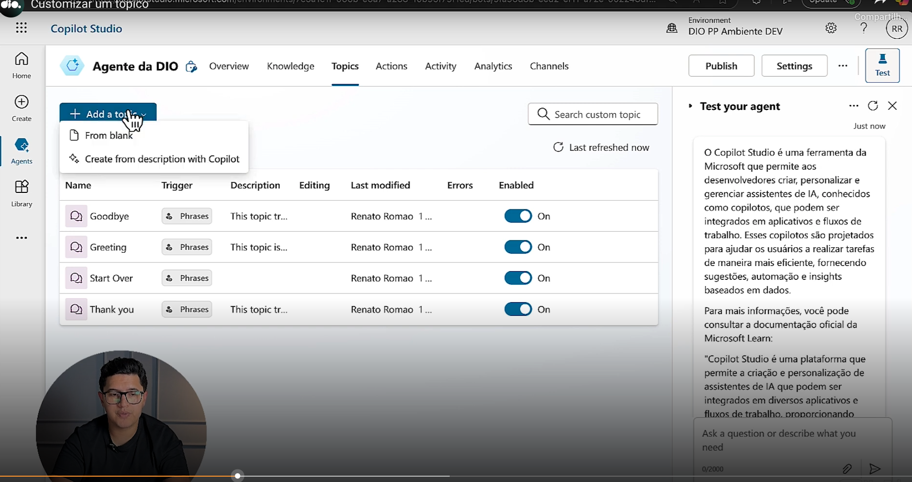

### Adicionando um novo tópico em branco

 Slide da aula🔻

    

### Customizando frases de gatilho

- Consultas sobre AI Builder
    - ✅ buscar informações de ai builder   
    - ✅ o que é ai builder  
    - ✅ onde encontro informações da ferramenta de

 Slide da aula🔻

    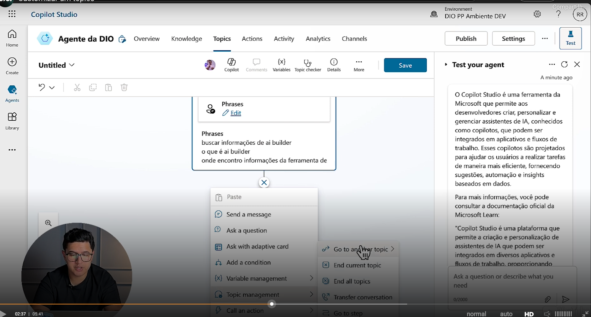

- Escolho usar respostas generativas.

 Slide da aula🔻

    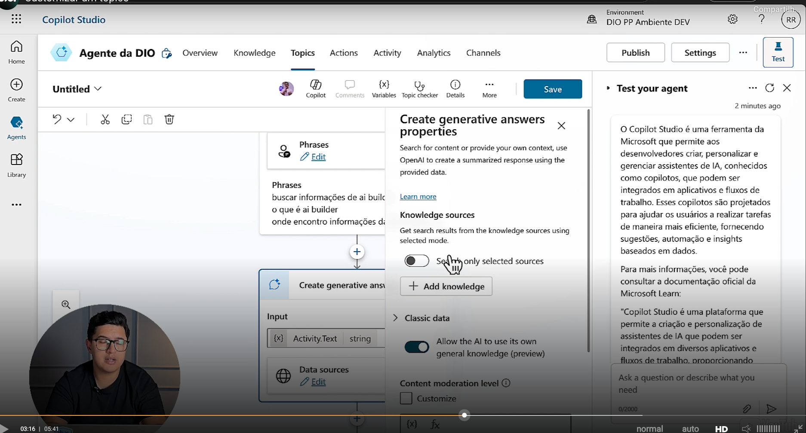

- A resposta generativa é baseada na resposta do usuário.

 Slide da aula🔻

    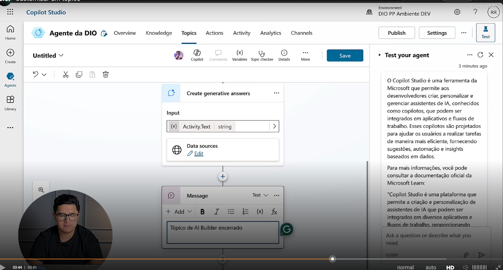

- Mensagem final: "Tópico de AI encerrado".
- Salvo como "AI Builder Topics".

 Slide da aula🔻

    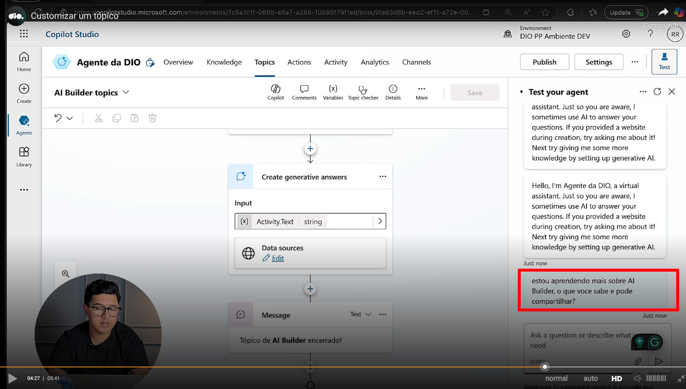

- Testando: ...
    > estou aprendendo mais sobre AI Builder, o que voce sabe e pode compartilhar?

 Slide da aula🔻

    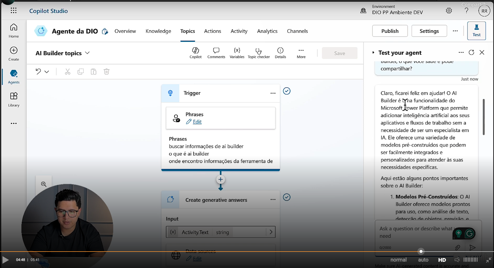

- Ele retornou as informações (em negrito, customizado, etc) inclusive com documentações da Microsoft.

> Claro, ficarei feliz em ajudar!  
>
>  O **AI Builder** é uma funcionalidade do **Microsoft Power Platform** que permite adicionar inteligência artificial aos seus aplicativos e fluxos de trabalho **sem a necessidade de ser um especialista em IA**.  
>
> Ele oferece uma variedade de **modelos pré-construídos** que podem ser facilmente integrados e personalizados para atender às suas necessidades específicas.
>
> **Aqui estão alguns pontos importantes sobre o AI Builder:** ...

- Esse padrão utiliza instruções do chatbot.
- Caso se queira customizar ainda mais o prompt em "Data Source".

## 🟩 Vídeo 04 - Personalizar uma mensagem de erro de tópico

- A primeira opção é fazer uso do Conversational Boosting, que é "qualquer coisa que ele nào consiga compreender, vai cair dentro deste tópico"

 Slide da aula🔻

    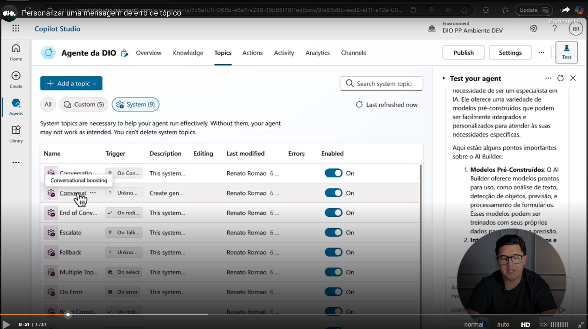

 Slide da aula🔻

    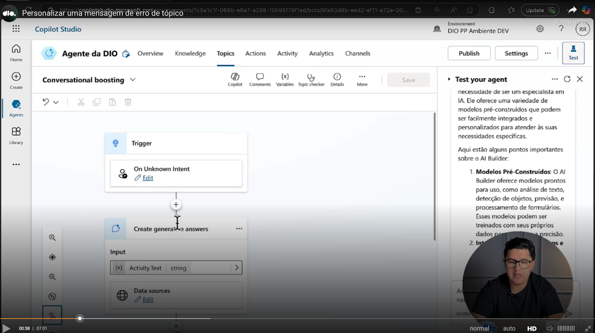

- Em seguida, ele vai usar respostas generativas. 
- Se a resposta estiver em branco, ele vai encerrar.
- Caso contrário vai para a outra parte da conversação.

 Slide da aula🔻

    

- A outra opção que você tem é dentro do Fallback.

 Slide da aula🔻

    

- Dentro do Fallback é "tudo que acontecer aqui de falhar, ele vai cair dentro desse tópico"

 Slide da aula🔻

    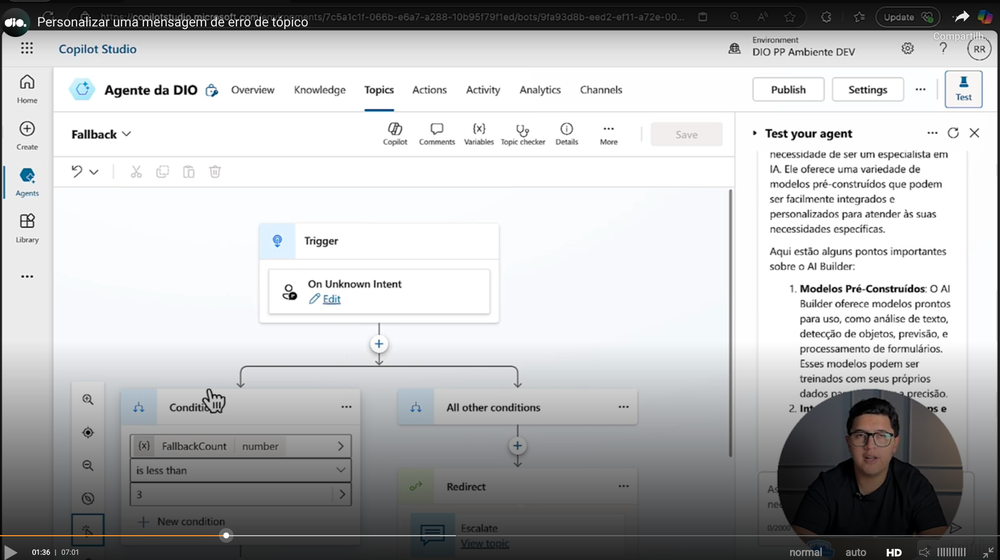

## 🟩 Vídeo 05 - Aumentar e diminuir a qualidade da resposta com GenAI

- O primeiro ponto que podemos configurar é dentro dos tópicos.
- No Conversational Boosting eu posso clicar no "Edit" do "Data Source" que são as bases de conhecimento.
- Posso selecionar as bases de conhecimento que existem dentro do meu agente.

 Slide da aula🔻

    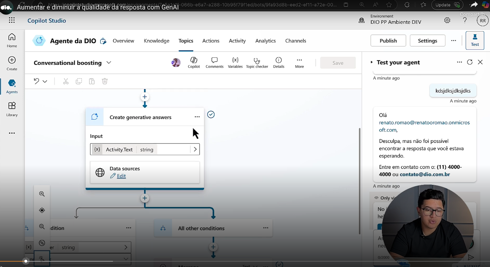

- Classic Data: essa opção quando ela está selecionada, ela usa o conhecimento do GPT.

 Slide da aula🔻

    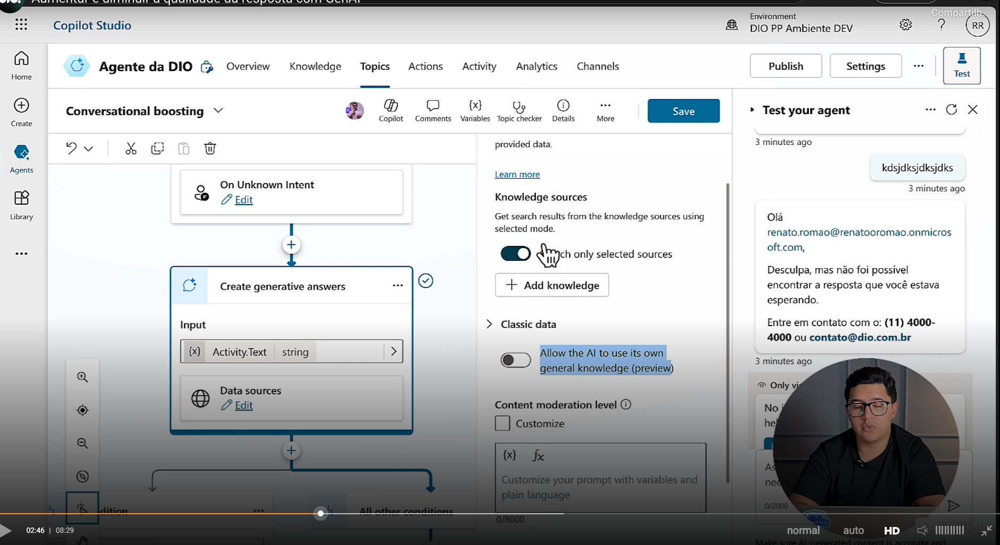

- Além disso, é possivel criar o seu prompt, conforme visto em aulas anteriores (em Content Moderation Level)

 Slide da aula🔻

    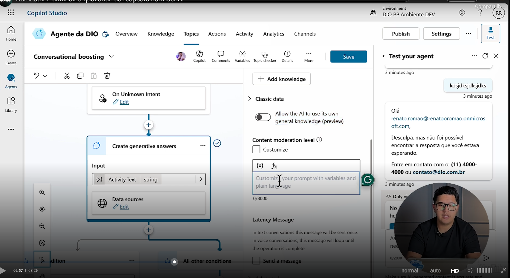

- Uma outra forma de aumentar e diminuir a qualidade da resposta com GenAI é entrar em Settings
- E escolher a opção Generative AI

 Slide da aula🔻

    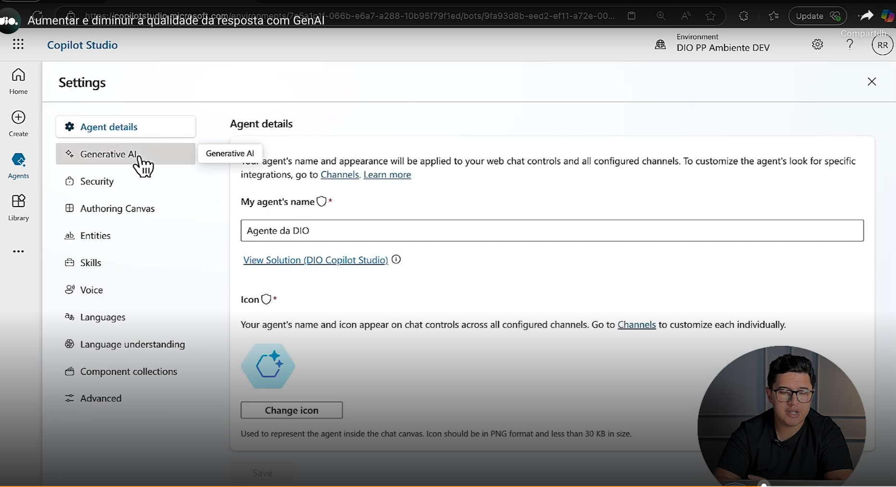

- Onde temos a opção de configurar ser mais criativa ou mais precisa.

 Slide da aula🔻

    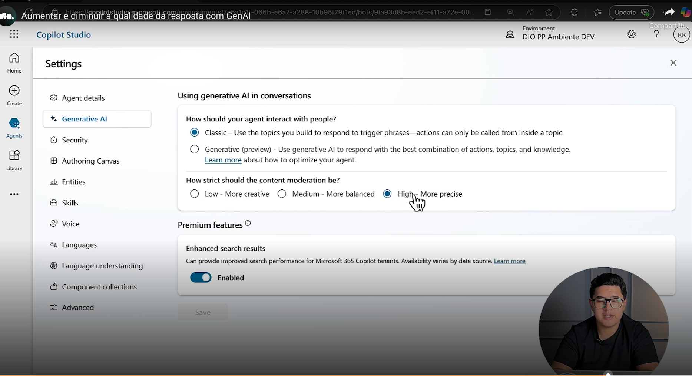

## 🟩 Entendendo o Desafio

O objetivo deste desafio é criar um Copilot com Fluxo de Conversa Personalizado no Microsoft Copilot Studio.

A) Explore a demonstração apresentada no conteúdo prático e faça um resumo do que aprendeu neste conteúdo.

B) Em seguida armazene em um repositório no GitHub e compartilhe o link na entrega do desafio.

C) Crie um repositório no GitHub.

D) Envie em "Entregar Projeto", o link do seu repositório no GitHub.

E) Documentação do Microsoft Copilot Studio: https://learn.microsoft.com/pt-br/microsoft-copilot-studio/

## Projeto entregue

Link: https://github.com/ahaerdy/DIO-criando-um-copilo-com-fluxo-de-conversa-personalizado-no-microsoft-copilot-studio#

## Certificado: Criando um Copiloto com Fluxo de Conversa Personalizado no Microsoft Copilot Studio

Link: https://hermes.dio.me/certificates/VNAWCUWE.pdf
