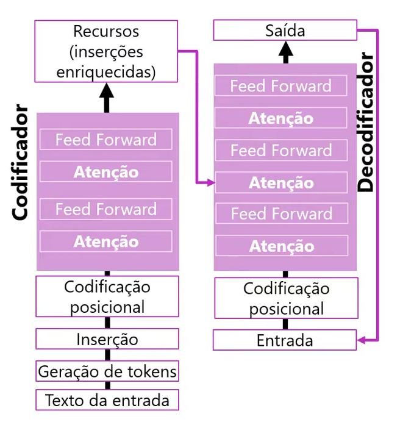
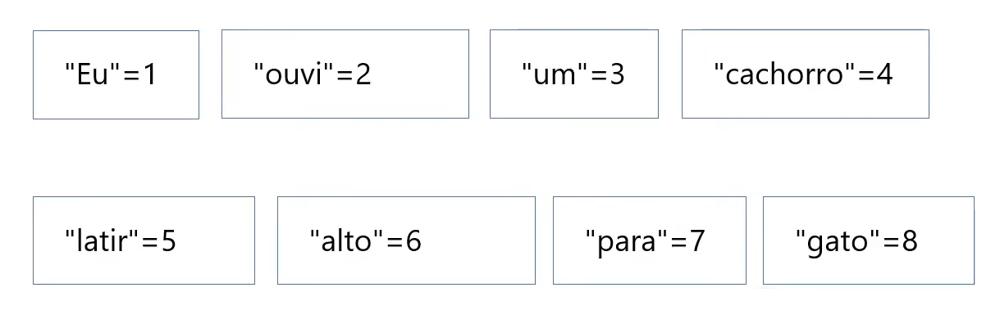
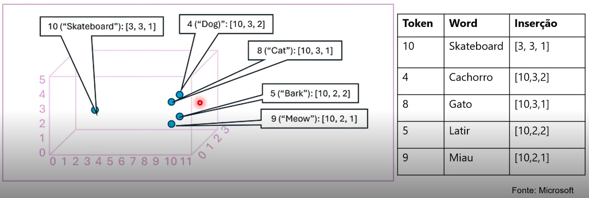
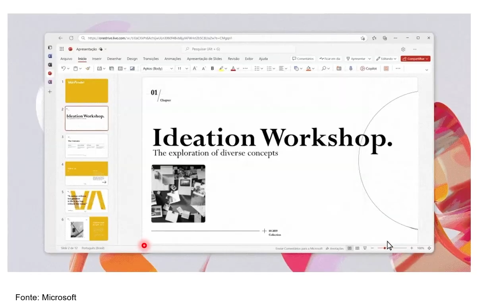
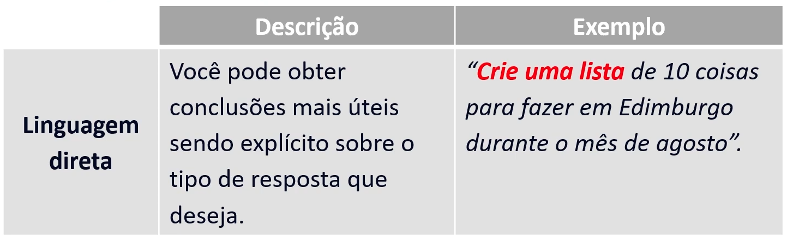
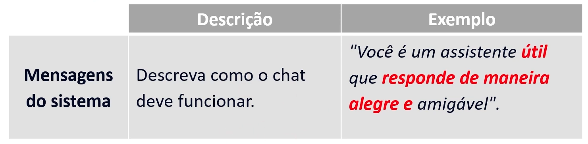
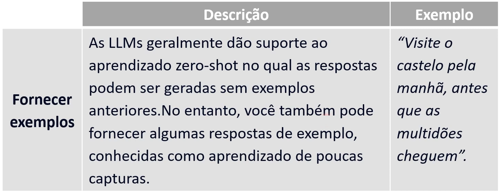
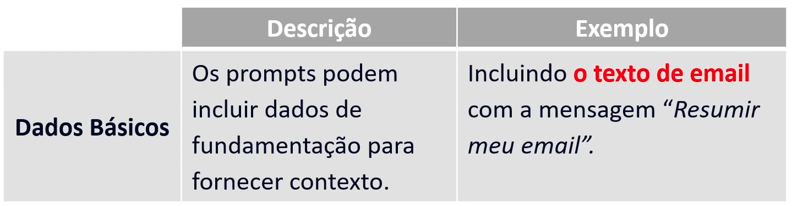

- Instrutor: Valéria Baptista (Head of Cloud and Cybersecurity | Professora e Mentora em Tecnologia)
- Contato Linkedin: / [valeriabaptista](https://www.linkedin.com/in/valeriabaptista/) 

## 🟩 Vídeo 01 - Conceitos básicos de IA Generativa - Agenda do curso

### Agenda

- [ ] Conceitos básicos de IA generativa  
- [ ] Conceitos básicos do Serviço OpenAI do Azure  
- [ ] Explore a IA Generativa Responsável

### Objetivos de Aprendizado

- Descreva a IA generativa.  
- Descreva os recursos de grandes modelos de linguagem.  
- Entenda como usar o Azure OpenAI para criar soluções generativas de IA.

## 🟩 Vídeo 02 - O que é IA Generativa

### O que é IA generativa?

IA: imita o comportamento humano usando aprendizado de máquina para interagir com o ambiente e executar tarefas sem instruções explícitas sobre o que gerar.

### IA generativa

IA generativa: cria conteúdo original, como IA gerativa que foi incorporada a aplicativos de chat.  
Os aplicativos de IA gerativa usam entrada em linguagem natural e retornam respostas apropriadas em uma variedade de formatos:

## 🟩 Vídeo 03 - Modelos de linguagem grandes

### Modelos de linguagem grandes

Os aplicativos de IA generativa são alimentados por LLMs (modelos de linguagem grandes),  
que são um tipo especializado de modelo de machine learning que você pode usar para executar tarefas de PLN (processamento de linguagem natural), incluindo:

### Tarefas de PLN com Modelos de Linguagem Grandes

- [ ] Determinar sentimento ou classificar de outra forma o texto em idioma natural.  
- [ ] Resumir um texto.  
- [ ] Comparar várias fontes de texto quanto à similaridade semântica.  
- [ ] Geração de nova linguagem natural.

## 🟩 Vídeo 04 - Modelos de linguagem grandes: Transformador parte 1

### Modelos de linguagem grandes - transformador

A arquitetura do modelo do transformador consiste em dois componentes principais, ou blocos.

### Componentes da Arquitetura Transformadora

- Um bloco *codificador* que cria representações semânticas do vocabulário de treinamento.  
- Um bloco *decodificador* que gera novas sequências de linguagem.

## 🟩 Vídeo 05 - Modelos de linguagem grandes: Transformador parte2

### Modelos de linguagem grandes - transformador

- O texto é tokenizado para que cada palavra ou frase seja representada por um token numérico exclusivo.  
- Inserções (valores de vetor com várias dimensões) são atribuídas aos tokens.

### Mecanismo de Atenção

- ☐ As camadas de atenção examinam cada token por vez e determinam valores incorporados que refletem os relacionamentos semânticos entre os tokens.

### Decodificador

- No decodificador, essas relações são usadas para prever a sequência mais provável de tokens.

 Slide da aula🔻

    

## 🟩 Vídeo 06 - Modelos de linguagem grande: Tokenização

### Modelos de linguagem grandes - tokenização

#### Etapa um: tokenização

- A primeira etapa no treinamento de um modelo de transformador é decompor o texto de treinamento em tokens.

**Frase de exemplo:** *Eu ouvi um cachorro latir alto para um gato.*

 Slide da aula🔻

    

### Representação por Tokens

- A frase agora é representada com os tokens: [1 2 3 4 5 6 7 3 8].
- Observe que “um” é tokenizado como 3 apenas uma vez.
- Da mesma forma, a frase “Eu ouvi um gato” poderia ser representada com as fichas [1 2 3 8].

### Etapa dois: inserções

- ☐ As relações entre tokens são capturadas como vetores, conhecidos como inserções.

## 🟩 Vídeo 07 - Modelos de linguagem grandes: Inserções

### Etapa dois: inserções

☐ As relações entre tokens são capturadas como vetores, conhecidos como inserções.

    

#### O que isso representa?

- Proximidade semântica: Palavras com significados semelhantes (como “Cachorro” e “Latir”) estão próximas no espaço vetorial.

- Representação matemática de linguagem: Ao transformar palavras em vetores, modelos de PLN conseguem realizar tarefas como tradução, classificação de texto, geração de texto, etc.

- Contextualização: A imagem parece ser uma continuação da etapa anterior (“Etapa dois: inserções”), ilustrando como as relações entre tokens são capturadas visualmente.

## 🟩 Vídeo 08 - Modelos de linguagem grandes: Atenção

### Terceiro passo: atenção

☐ Capture a força das relações entre tokens usando a técnica de atenção.

### Exemplo

- Meta: prever o token após "cachorro".
- Represente "Ouvi um cachorro" como vetores.
- Atribua mais peso a "ouvi" e "cachorro".

- Vários tokens possíveis podem vir depois de cachorro.
- O token mais provável é adicionado à sequência, nesse caso, "latir".

## 🟩 Vídeo 09 - Conceitos básicos de IA Generativas – Copilotos

### Copilotos

- Os copilotos são frequentemente integrados a outros aplicativos e fornecem uma maneira para os usuários obterem ajuda com tarefas comuns a partir de um modelo generativo de IA.

- Os desenvolvedores podem criar copilotos que enviam prompts para grandes modelos de linguagem e geram conteúdo para uso em aplicativos.

- Os usuários empresariais podem usar copilotos para aumentar sua produtividade e criatividade com conteúdo gerado por IA.

#### Cenário de Copiloto dentro da apresentaçãO

    

## 🟩 Vídeo 10 - Conceitos básicos de IA Generativa - Engenharia de prompts

### Aprimorar as respostas de IA generativa com a engenharia de prompts

- O termo engenharia de prompt descreve o processo de aprimoramento de prompts.

- Os desenvolvedores que projetam aplicativos e consumidores que usam aplicativos podem aprimorar a qualidade das respostas da IA gerativa usando linguagem direta, mensagens do sistema, exemplos e/ou dados de fundamentação.

    

    

    

    

## 🟩 Vídeo 11 - Revisão e Encerramento - Fundamentos da IA Generativa

- Comentários de encerramento.

## Transcrições e Material de Apoio

### Transcrições

- [Conceitos básicos de IA Generativa - Agenda do curso.pdf](https://hermes.dio.me/files/assets/b99f37a3-db2a-4669-8ed8-3ba8fece0af0.pdf)  
- [O que é IA Generativa.pdf](https://hermes.dio.me/files/assets/00b16425-e623-46ba-a198-2856613d14f4.pdf)  
- [Modelos de linguagem grandes.pdf](https://hermes.dio.me/files/assets/afe8ff25-ed4b-4713-a255-14c76450e5f0.pdf)  
- [Modelos de linguagem grandes: Transformador parte 1.pdf](https://hermes.dio.me/files/assets/15ecadd8-ccdb-475c-b3a7-7606b0150412.pdf)  
- [Modelos de linguagem grandes: Transformador parte 2.pdf](https://hermes.dio.me/files/assets/7a680bc3-99b1-40ad-b1f6-37ccf0e9d4a1.pdf)  
- [Modelos de linguagem grande: Tokenização.pdf](https://hermes.dio.me/files/assets/09b78597-2e13-4d14-bda1-7040d419067f.pdf)  
- [Modelos de linguagem grandes: Inserções.pdf](https://hermes.dio.me/files/assets/df5ed34c-58e4-4e01-a8e1-55c1a0d31d93.pdf)  
- [Modelos de linguagem grandes: Atenção.pdf](https://hermes.dio.me/files/assets/386f3a26-c395-478b-8315-740d4655cf3a.pdf)  
- [Conceitos básicos de IA Generativas – Copilotos.pdf](https://hermes.dio.me/files/assets/1bdf0a94-02a7-47c2-be91-b66380bd33bb.pdf)  
- [Conceitos básicos de IA Generativa - Engenharia de prompts.pdf](https://hermes.dio.me/files/assets/bf1e3480-b745-4f8a-ad71-a822e695119b.pdf)  

---

### Materiais Complementares

Nossos materiais complementares e de apoio têm como objetivo apresentar informações para facilitar e enriquecer a sua jornada de aprendizado. Para isso, links úteis (como slides, repositórios e páginas oficiais) serão disponibilizados, além de dicas sobre como se destacar na DIO e no mercado de trabalho 😉

---

### Slides

- [Módulo 5 - IA Generativa.pptx](https://academiapme-my.sharepoint.com/:p:/g/personal/nubia_dio_me/Ef88qA-boB1GuImGg67P-IQBAQP0mfwtVB0RjBnabfvdPw?e=PwuezC)

---

### Dicas/Links Úteis

- **Artigos/Fórum**: Compartilhe conteúdos técnicos através de Artigos (visíveis globalmente na plataforma da DIO) ou suas conquistas e dúvidas nos Fóruns (específicos para cada experiência educacional como Bootcamps);

- **Rooms**: Se estiver inscrito(a) em uma experiência educacional na DIO, você terá acesso ao Rooms — ferramenta de bate-papo em tempo real para interação entre participantes, com suporte a imagens e trechos de código;

- **Pesquise na Web**: Use motores de busca para investigar conceitos, dúvidas ou erros. Muitas vezes, você encontrará soluções valiosas em sites como o StackOverflow 😎

# Certificado: Conceitos Fundamentais de IA

Link: https://hermes.dio.me/certificates/AZZN4DOE.pdf