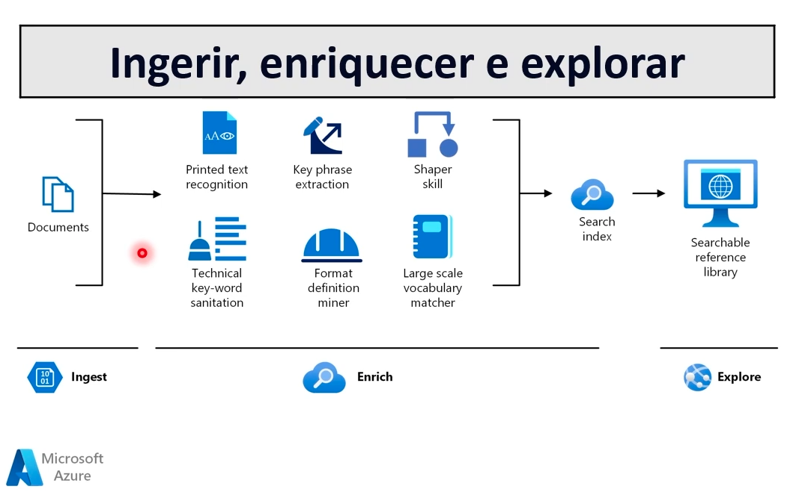
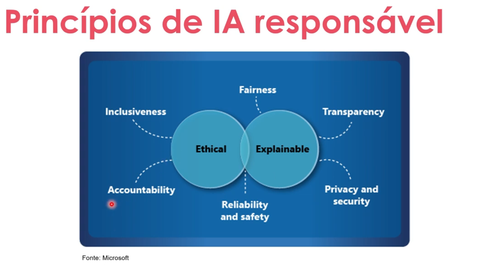

- Instrutor: Valéria Baptista (Head of Cloud and Cybersecurity | Professora e Mentora em Tecnologia)
- Contato Linkedin: / [valeriabaptista](https://www.linkedin.com/in/valeriabaptista/) 

## 🟩 Vídeo 01 - Apresentação do Curso e Instrutora

### AI-900: Conceitos Básicos de IA do Azure

**Valéria Baptista**  
Head of Cloud and Cybersecurity  
@baptista.valeria

### Sobre mim

- Desde 2008 trabalhando na área Tech  
- Ciências da Computação - ULBRA  
- MBA em Cloud Computing – XP Educação  
- Pós em Docência para o Ensino Superior - UniRitter  
- Fundadora da comunidade técnica Canal da Cloud  
- MCT Microsoft, palestrante e mentora de carreira  
- @canaldacloud

### Objetivo Geral

- A Inteligência Artificial definirá a próxima geração de soluções de software.  
- Este curso apresenta a IA e os serviços da Microsoft que podem ser usados para criar soluções de IA.  
- Você poderá identificar e descrever os principais conceitos de IA e os principais serviços de IA e machine learning no Microsoft Azure.

### Pré-requisitos

- Experiência com computadores e com a Internet.  
- Interesse em casos de uso para aplicativos de IA e modelos de machine learning.  
- Disposição para aprender por meio da exploração prática.

### Conteúdo Programático

- Visão geral da IA  
- Visão Computacional  
- Processamento de linguagem natural  
- Inteligência de Documentos e Mineração de Conhecimento  
- IA generativa

### Agenda

- Conceitos fundamentais de IA  
- Fundamentos do aprendizado de máquina  
- Fundamentos dos serviços de IA do Azure

### Objetivos de Aprendizado

- Explique o que é IA e compreenda a importância da IA responsável.  
- Compreenda os diferentes tipos de modelos de aprendizado de máquina.  
- Identifique os serviços de IA disponíveis no Azure e para que são utilizados.

## 🟩 Vídeo 02 - Cargas de Trabalho comuns de IA: O que é Inteligência Artificial

### O que é Inteligência Artificial?

- Prever resultados e reconhecer padrões com base em dados históricos.
- Extrair informações de fontes para obter conhecimento.
- Compreender a linguagem e participar de conversas.
- Reconhecer eventos anormais e tomar decisões.
- Interpretando informações visuais.

## 🟩 Vídeo 03 - Cargas de Trabalho comuns de IA: Machine Learning

### Machine Learning

- Modelos preditivos baseados em dados e estatísticas.

## 🟩 Vídeo 04 - Cargas de Trabalho comuns de IA: Visão Computacional

### Visão Computacional

- Capacidades da IA para interpretar o mundo visualmente por meio de câmeras, vídeos e imagens.

## 🟩 Vídeo 05 - Cargas de Trabalho comuns de IA: Processamento de linguagem natural

### Processamento de linguagem natural

- Capacidades da IA para que um computador interprete a linguagem escrita ou falada e responda adequadamente.

## 🟩 Vídeo 06 - Cargas de Trabalho comuns de IA: Inteligência de Documentos

### Inteligência de Documentos

- Capacidades de IA que lidam com o gerenciamento, processamento e uso de grandes volumes de dados encontrados em formulários e documentos.

## 🟩 Vídeo 07 - Cargas de Trabalho comuns de IA: Mineração de conhecimento

### Mineração de conhecimento

- Capacidades da IA para extrair informações de grandes volumes de dados muitas vezes não estruturados para criar um armazenamento de conhecimento pesquisável.

- A mineração vai trabalhar em 3 etapas distintas:
    - Ingerir
    - Enriquecer
    - Explorar

    

- A imagem apresenta um fluxo de trabalho típico de mineração de conhecimento utilizando serviços da Microsoft Azure, dividido em três etapas principais: ingerir, enriquecer e explorar. Na fase de ingestão, documentos são processados por meio de reconhecimento de texto impresso e sanitização de palavras-chave técnicas, preparando os dados brutos para análise.

- Na etapa de enriquecimento, são aplicadas habilidades cognitivas como extração de frases-chave, definição de formatos, correspondência com vocabulários em larga escala e organização dos dados com a ferramenta "Shaper Skill". Essas ações tornam o conteúdo mais estruturado e semântico, facilitando sua interpretação por sistemas de busca e análise.

- Por fim, os dados enriquecidos são direcionados para um índice de busca e uma biblioteca de referência pesquisável. Isso permite que usuários explorem o conhecimento extraído de forma eficiente, transformando grandes volumes de documentos em informações acessíveis e úteis para tomada de decisão, pesquisa ou automação de processos.

## 🟩 Vídeo 08 - Cargas de Trabalho comuns de IA: IA Generativa

### IA Generativa

- Recursos de IA que criam conteúdo original em vários formatos, incluindo linguagem natural, imagem, código e muito mais.

- ChatGPT como exemplo de IA Generativa.

## 🟩 Vídeo 09 - Cargas de Trabalho comuns de IA: Imparcialidade

    

### Princípios de IA Responsável

A imagem apresenta os **Princípios de IA Responsável**, conforme definidos pela Microsoft, e organiza visualmente os fundamentos éticos e explicáveis que devem orientar o desenvolvimento e uso da inteligência artificial.

Ela é composta por dois círculos centrais sobrepostos, rotulados como:

- **Ética (Ethical)**
- **Explicável (Explainable)**

Esses dois conceitos são o núcleo da IA responsável. Ao redor deles, estão distribuídos **seis princípios fundamentais**, cada um conectado a um ou ambos os círculos:

| Princípio                   | Significado geral                                          |
|-----------------------------|------------------------------------------------------------|
| **Inclusividade**           | A IA deve atender a diferentes perfis e necessidades.     |
| **Equidade**                | Evitar discriminação e viés nos sistemas de IA.           |
| **Transparência**           | Explicar como e por que a IA toma decisões.               |
| **Privacidade e segurança** | Proteger dados e garantir confidencialidade.              |
| **Confiabilidade e segurança** | A IA deve funcionar de forma segura e previsível.     |
| **Responsabilidade**        | Deve haver supervisão humana e prestação de contas.       |

### Imparcialidade

| Desafio ou Risco                              | Exemplo                                                                                   |
|-----------------------------------------------|-------------------------------------------------------------------------------------------|
| O preconceito pode afetar os resultados.      | Um modelo de aprovação de empréstimos que discrimina por gênero devido ao preconceito nos dados com os quais foi treinado. |

## 🟩 Vídeo 10 - Cargas de Trabalho comuns de IA: Confiabilidade e segurança

### Confiabilidade e segurança

| Desafio ou Risco                 | Exemplo                                                                 |
|----------------------------------|-------------------------------------------------------------------------|
| Erros podem causar danos.        | Um veículo autônomo sofre uma falha no sistema e causa uma colisão.    |

## 🟩 Vídeo 11 - Cargas de Trabalho comuns de IA: Privacidade e segurança

### Privacidade e segurança

| Desafio ou Risco                          | Exemplo                                                                                      |
|-------------------------------------------|----------------------------------------------------------------------------------------------|
| Dados privados podem ser expostos.        | Um bot de diagnóstico médico é treinado usando dados confidenciais de pacientes, que são armazenados de forma insegura. |

## 🟩 Vídeo 12 - Cargas de Trabalho comuns de IA: Inclusão e Transparência

### Inclusão

| Desafio ou Risco                              | Exemplo                                                                                      |
|-----------------------------------------------|----------------------------------------------------------------------------------------------|
| As soluções podem não funcionar para todos.   | Um aplicativo preditivo não fornece saída de áudio para usuários com deficiência visual.     |

### Transparência

| Desafio ou Risco                                 | Exemplo                                                                                      |
|--------------------------------------------------|----------------------------------------------------------------------------------------------|
| Os usuários devem confiar em um sistema complexo | Uma ferramenta financeira baseada em IA faz recomendações de investimento – em que se baseiam? |

## 🟩 Vídeo 13 - Cargas de Trabalho comuns de IA: Responsabilidade

### Responsabilidade

| Desafio ou Risco                                      | Exemplo                                                                                                      |
|--------------------------------------------------------|--------------------------------------------------------------------------------------------------------------|
| Quem é responsável pelas decisões baseadas na IA?     | Uma pessoa inocente é condenada por um crime com base em provas de reconhecimento facial – quem é o responsável? |

## Material de Apoio e Links Úteis

### Materiais Complementares

Nossos materiais complementares e de apoio têm como objetivo apresentar informações para facilitar e enriquecer a sua jornada de aprendizado. Para isso, links úteis (como slides, repositórios e páginas oficiais) serão disponibilizados, além de dicas sobre como se destacar na DIO e no mercado de trabalho 😉

---

### Slides

- [Módulo 1 - IA Overview.pptx](https://academiapme-my.sharepoint.com/:p:/g/personal/nubia_dio_me/EVdP5BFHxrJKgBBzFiK_UQMBWv4NAKXaMp4qkZyl27LaWw?rtime=RkLm3oYC3kg)

---

### Dicas/Links Úteis

Por fim, disponibilizamos alguns links úteis para que você possa se desenvolver ainda mais através de referências oficiais das tecnologias, páginas de documentação e/ou fóruns de discussão relevantes. Nesse contexto, seguem algumas sugestões:

- **Artigos/Fórum**:  
  Você pode compartilhar conteúdos técnicos através de Artigos (visíveis globalmente na plataforma da DIO). Por outro lado, você também pode compartilhar suas conquistas e dúvidas usando os Fóruns (que são específicos para cada experiência educacional na DIO, como um Bootcamp por exemplo);

- **Rooms**:  
  Caso você esteja inscrito(a) em uma experiência educacional na DIO (como um Bootcamp, por exemplo), você terá acesso ao Rooms. O Rooms é uma ferramenta de bate-papo em tempo real onde todos os inscritos podem interagir, compartilhando dúvidas e dicas (que podem conter imagens e snippets de código-fonte);

- **Pesquise na Web**:  
  Pode parecer óbvio, mas é importante frisar a importância das engines de busca no dia-a-dia de um profissional de TI. Caso não encontre o que procura dentro da DIO, pesquise sobre o assunto (conceito, dúvida, erro etc) na Internet (dê um Google), pois na maioria das vezes você será levado à páginas incríveis como o StackOverflow que salvarão o seu dia 😎

# Certificado: Conceitos Fundamentais de IA

Link: https://hermes.dio.me/certificates/AZZN4DOE.pdf

