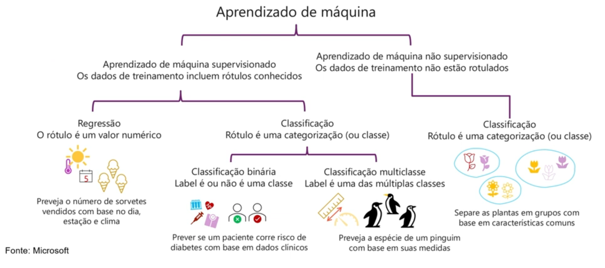
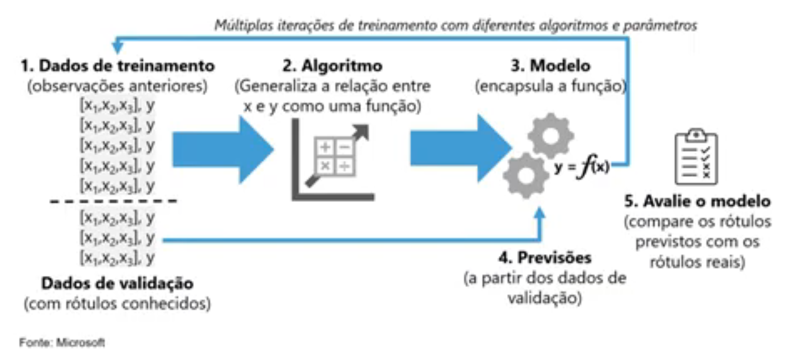
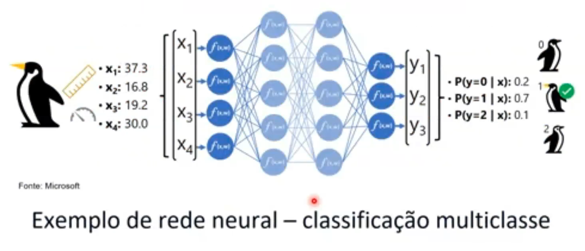

- Instrutor: Valéria Baptista (Head of Cloud and Cybersecurity | Professora e Mentora em Tecnologia)
- Contato Linkedin: / [valeriabaptista](https://www.linkedin.com/in/valeriabaptista/) 

## 🟩 Vídeo 01 - Tipos de aprendizado de máquina

    

O aprendizado de máquina é um processo estruturado que envolve cinco etapas principais. Primeiro, são utilizados dados de treinamento, compostos por exemplos anteriores que associam características a rótulos. Em seguida, um algoritmo analisa esses dados e aprende a relação entre entradas e saídas, gerando uma função. Essa função é encapsulada em um modelo, que pode ser usado para realizar inferências com novos dados ainda não rotulados. A partir dessas inferências, o modelo realiza previsões, atribuindo rótulos às novas entradas com base no que foi aprendido.

Esse processo pode ser aplicado em diferentes tipos de aprendizado. No aprendizado supervisionado, os dados de entrada já vêm com rótulos, permitindo treinar modelos para tarefas como regressão (previsão de valores numéricos) ou classificação (atribuição de categorias). A classificação pode ser binária, quando há apenas duas classes possíveis, ou multiclasse, quando há várias categorias distintas. Já no aprendizado não supervisionado, os dados não possuem rótulos, e o modelo busca identificar padrões e agrupar informações por similaridade, como ocorre em tarefas de segmentação.

A escolha entre esses métodos depende do tipo de problema a ser resolvido e da natureza dos dados disponíveis. Compreender essas abordagens é essencial para desenvolver aplicações inteligentes que tomem decisões com base em dados reais.

    

O aprendizado de máquina pode ser dividido em duas abordagens principais: supervisionado e não supervisionado. No modelo supervisionado, os dados de treinamento já vêm com rótulos conhecidos, permitindo que o algoritmo aprenda a relação entre características e resultados esperados. Dentro dessa abordagem, existem dois tipos principais de tarefas: regressão e classificação.

Na regressão, o objetivo é prever um valor numérico com base em variáveis de entrada. Por exemplo, estimar a quantidade de sorvetes vendidos em um dia quente com base na temperatura. Já na classificação, o modelo prevê categorias. A classificação binária determina se um item pertence ou não a uma classe, como identificar se um paciente está em risco de diabetes. A classificação multiclasse, por sua vez, lida com múltiplas categorias possíveis, como identificar a espécie de um animal com base em suas características físicas.

Por outro lado, o aprendizado não supervisionado trabalha com dados sem rótulos. O algoritmo busca padrões e semelhanças para agrupar os dados em categorias naturais. Um exemplo seria separar diferentes tipos de flores com base em suas características visuais, mesmo sem saber previamente seus nomes ou espécies. Essa abordagem é útil para descobrir estruturas ocultas nos dados e realizar segmentações automáticas.

Compreender essas diferenças é essencial para escolher a técnica adequada conforme o tipo de problema e os dados disponíveis.

## 🟩 Vídeo 02 - Treinamento e avaliação de modelo

    

O processo de treinamento e avaliação de um modelo de aprendizado de máquina segue uma sequência lógica e iterativa. Tudo começa com os dados de treinamento, que são exemplos históricos contendo características e rótulos conhecidos. Esses dados são usados para alimentar um algoritmo, que aprende a relação entre entradas e saídas e encapsula esse conhecimento em um modelo matemático, representado como uma função do tipo y = f(x).

Com o modelo treinado, é possível realizar previsões utilizando dados de validação — ou seja, dados que também possuem rótulos, mas que não foram usados durante o treinamento. Isso permite verificar se o modelo está generalizando corretamente. A etapa final consiste em avaliar o modelo, comparando os rótulos previstos com os reais. Se houver divergências significativas, ajustes são necessários, seja nos dados, no algoritmo ou nos parâmetros utilizados.

Esse ciclo de treinamento, previsão e avaliação é contínuo. À medida que novos dados são gerados, o modelo pode ser reavaliado e refinado para manter sua precisão. Em cenários como previsão de vendas com base em temperatura, é importante considerar dados atualizados e tendências futuras. Já em classificações estáticas, como espécies de animais, dados históricos podem ser suficientes. A escolha da abordagem e dos dados utilizados impacta diretamente na assertividade do modelo e na qualidade das decisões tomadas com base nele.

## 🟩 Vídeo 03 - Aprendizado profundo

### Funcionamento dos Neurônios

- Neurônios disparam em resposta a estímulos eletroquímicos.
- Quando disparado, o sinal é passado para neurônios conectados.

O funcionamento dos neurônios é baseado em estímulos eletroquímicos que provocam disparos de sinal. Quando um neurônio é ativado, ele transmite esse sinal para os neurônios aos quais está conectado, criando uma rede de comunicação entre células nervosas. Esse mecanismo é essencial para o processamento de informações no cérebro e está na base de funções como percepção, memória e tomada de decisão.

Esse princípio biológico inspira o desenvolvimento de redes neurais artificiais, utilizadas em sistemas de inteligência artificial. Assim como os neurônios biológicos, os neurônios artificiais recebem entradas, processam sinais e geram saídas, permitindo que modelos computacionais aprendam padrões e realizem previsões. A analogia entre os dois tipos de neurônios ajuda a compreender como algoritmos podem simular aspectos do raciocínio humano.

### Funcionamento dos Neurônios em Redes Neurais

- Cada neurônio é uma função que opera com um valor de entrada (x) e um peso (w)
- A função é envolvida em uma função de ativação que determina se a saída deve ser transmitida.

Em redes neurais artificiais, cada neurônio funciona como uma unidade de processamento que recebe um valor de entrada (x) e o multiplica por um peso (w). Esse produto representa a importância daquele sinal para o neurônio. Em seguida, o resultado é passado por uma função de ativação, que decide se o sinal deve ser transmitido para os próximos neurônios da rede.

Esse mecanismo simula o comportamento dos neurônios biológicos, que disparam sinais quando atingem um determinado limiar de estímulo. Na prática, a função de ativação introduz não-linearidade ao modelo, permitindo que a rede aprenda padrões complexos e tome decisões mais sofisticadas. O conjunto de neurônios conectados forma camadas, e o aprendizado ocorre ajustando os pesos com base nos erros das previsões, até que o modelo consiga generalizar corretamente os dados de entrada.

Esse conceito é fundamental para o aprendizado profundo, onde múltiplas camadas de neurônios artificiais são utilizadas para extrair representações cada vez mais abstratas dos dados, aproximando o funcionamento da rede ao modo como o cérebro humano processa informações.

    

Uma rede neural artificial é composta por camadas de neurônios que processam informações de forma semelhante ao cérebro humano. Cada neurônio recebe valores de entrada, como características numéricas extraídas de um objeto — por exemplo, medidas de um pinguim — e aplica um peso a cada valor. Esses sinais ponderados passam por funções de ativação, que determinam se a informação será transmitida para os próximos neurônios da rede.

Esse processo ocorre em múltiplas camadas, chamadas de camadas ocultas, que refinam progressivamente a interpretação dos dados. Ao final, a rede gera uma saída, que no caso de uma classificação multiclasse, corresponde a probabilidades associadas a diferentes categorias. A classe com maior probabilidade é considerada a previsão final do modelo.

Esse tipo de arquitetura é utilizado em aprendizado profundo, permitindo que o sistema aprenda padrões complexos e tome decisões com base em dados reais. A escolha das características de entrada e o ajuste dos pesos são fundamentais para que a rede neural consiga distinguir corretamente entre classes semelhantes, como diferentes espécies de pinguins, mesmo quando compartilham traços visuais comuns. Essa abordagem é amplamente aplicada em tarefas de reconhecimento de imagem, diagnóstico médico, recomendação de conteúdo e outras áreas da inteligência artificial.

## 🟩 Vídeo 04 - Revisão e Encerramento do Módulo

### Links Úteis

- [Documentação Oficial](https://learn.microsoft.com/en-us/training/paths/get-started-with-artificial-intelligence-on-azure/)

### Acesse

- [https://aka.ms/ai900-auto-ml](https://aka.ms/ai900-auto-ml)
- [https://aka.ms/ai900-azure-ai-services](https://aka.ms/ai900-azure-ai-services)
- [https://ml.azure.com/?azure-portal=true](https://ml.azure.com/?azure-portal=true)
- [https://contentsafety.cognitive.azure.com/?azure-portal=true](https://contentsafety.cognitive.azure.com/?azure-portal=true)

## Material de Apoio e Links Úteis

### Materiais Complementares

Nossos materiais complementares e de apoio têm como objetivo apresentar informações para facilitar e enriquecer a sua jornada de aprendizado. Para isso, links úteis (como slides, repositórios e páginas oficiais) serão disponibilizados, além de dicas sobre como se destacar na DIO e no mercado de trabalho 😉

---

### Slides

- [Módulo 1 - IA Overview.pptx](https://academiapme-my.sharepoint.com/:p:/g/personal/nubia_dio_me/EVdP5BFHxrJKgBBzFiK_UQMBWv4NAKXaMp4qkZyl27LaWw?rtime=RkLm3oYC3kg)

---

### Dicas/Links Úteis

Por fim, disponibilizamos alguns links úteis para que você possa se desenvolver ainda mais através de referências oficiais das tecnologias, páginas de documentação e/ou fóruns de discussão relevantes. Nesse contexto, seguem algumas sugestões:

- **Artigos/Fórum**:  
  Você pode compartilhar conteúdos técnicos através de Artigos (visíveis globalmente na plataforma da DIO). Por outro lado, você também pode compartilhar suas conquistas e dúvidas usando os Fóruns (que são específicos para cada experiência educacional na DIO, como um Bootcamp por exemplo);

- **Rooms**:  
  Caso você esteja inscrito(a) em uma experiência educacional na DIO (como um Bootcamp, por exemplo), você terá acesso ao Rooms. O Rooms é uma ferramenta de bate-papo em tempo real onde todos os inscritos podem interagir, compartilhando dúvidas e dicas (que podem conter imagens e snippets de código-fonte);

- **Pesquise na Web**:  
  Pode parecer óbvio, mas é importante frisar a importância das engines de busca no dia-a-dia de um profissional de TI. Caso não encontre o que procura dentro da DIO, pesquise sobre o assunto (conceito, dúvida, erro etc) na Internet (dê um Google), pois na maioria das vezes você será levado à páginas incríveis como o StackOverflow que salvarão o seu dia 😎

# Certificado: Fundamentos do Aprendizado de Máquina

Link: https://hermes.dio.me/certificates/PQV1ATXW.pdf