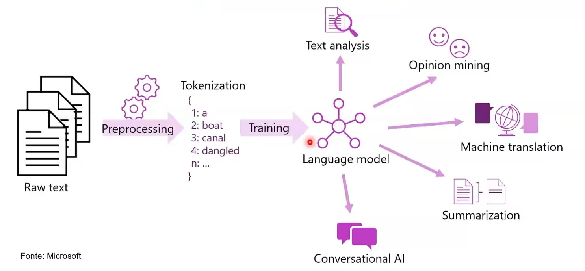
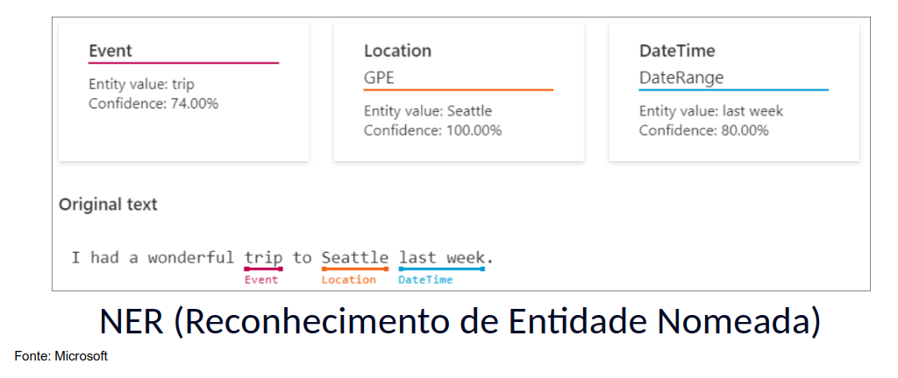
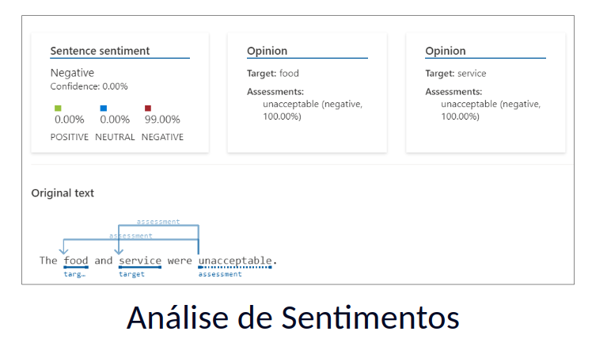
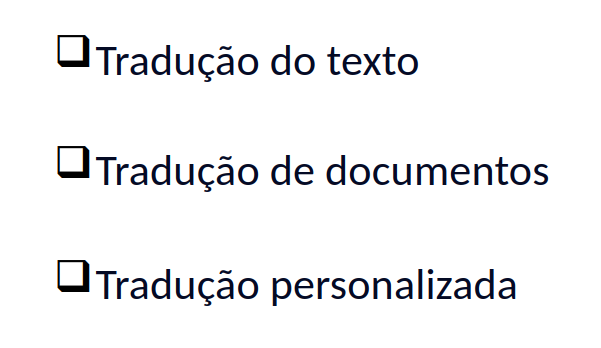

- Instrutor: Valéria Baptista (Head of Cloud and Cybersecurity | Professora e Mentora em Tecnologia)
- Contato Linkedin: / [valeriabaptista](https://www.linkedin.com/in/valeriabaptista/) 

## 🟩 Vídeo 01 - Conceitos de processamento de linguagem natural

### Agenda

1. Conceitos de processamento de linguagem natural  
2. Capacidades de processamento de linguagem natural no Azure

### Objetivos de Aprendizado

- Reconheça quando o processamento de linguagem natural e a IA conversacional podem ser usados.  
- Identifique os serviços de IA do Azure que incluem processamento de linguagem natural.  
- Use a análise de texto para você mesmo.

## 🟩 Vídeo 02 - O que é processamento de linguagem natural?

    

#### Panorama sobre Processamento de Linguagem Natural e suas Aplicações

O processamento de linguagem natural (PLN) é uma área da inteligência artificial que transforma textos em dados compreensíveis por máquinas. Tudo começa com a coleta de textos brutos, que passam por etapas como limpeza, segmentação e tokenização — ou seja, a conversão de palavras em unidades numéricas que possam ser interpretadas por algoritmos.

A partir desse processo, é possível treinar modelos de linguagem que servem como base para diversas aplicações. Uma das mais comuns é a **análise de texto**, que permite extrair informações relevantes como datas, locais, nomes de pessoas e até temas recorrentes. Isso é essencial para alimentar sistemas de busca, bancos de dados e mecanismos de recomendação.

Outra aplicação poderosa é a **análise de sentimentos**, que identifica emoções expressas nos textos. Essa técnica é amplamente usada por empresas para entender a percepção do público sobre produtos, campanhas ou marcas. Também pode ser útil em contextos jurídicos, por exemplo, para verificar se uma mensagem apresenta conteúdo ofensivo ou agressivo.

A **mineração de opinião** complementa esse processo ao mapear tendências e padrões em grandes volumes de texto, como postagens em redes sociais. Isso ajuda a prever comportamentos de consumo, ajustar estratégias de marketing e até antecipar demandas em datas comemorativas.

A **tradução automática** é outro recurso fundamental, especialmente em ambientes multiculturais e corporativos. Mais do que traduzir literalmente, os sistemas modernos oferecem sugestões de estilo, correções gramaticais e adaptações contextuais, tornando a comunicação mais fluida e eficiente.

Por fim, a **IA conversacional** representa um avanço significativo na interação entre humanos e máquinas. Bots bem treinados conseguem manter diálogos naturais, responder com empatia e oferecer suporte sem parecer robóticos. Isso é possível graças à combinação de modelos de linguagem robustos com técnicas de compreensão contextual.

Em resumo, o PLN é uma engrenagem essencial para transformar texto em inteligência. Ele permite que sistemas compreendam, analisem e interajam com linguagem humana de forma cada vez mais sofisticada e útil.

## 🟩 Vídeo 03 - Processamento de linguagem natural e IA conversacional no Azure - Análise de sentimento e respostas a perguntas

    

#### Aplicações de Processamento de Linguagem Natural com Azure

##### Visão Geral do NLP e IA Conversacional

O processamento de linguagem natural (NLP) é uma das bases da inteligência artificial moderna, permitindo que sistemas compreendam, analisem e interajam com a linguagem humana. No contexto da plataforma Microsoft Azure, esse recurso é acessado por meio do Language Studio, uma ferramenta que facilita a implementação de soluções de NLP sem a necessidade de escrever código.

##### Reconhecimento de Entidades e Detecção de Informações Sensíveis

Entre as funcionalidades disponíveis, destaca-se o reconhecimento de entidades nomeadas, que permite identificar elementos como nomes de pessoas, locais, datas e eventos em textos. Esse recurso é útil para categorizar informações e entender contextos específicos. Além disso, há mecanismos para detectar dados pessoais identificáveis (PII), como e-mails, telefones e endereços, o que é essencial para garantir segurança e conformidade em aplicações que lidam com dados sensíveis.

##### Identificação de Idioma e Tradução

Outro recurso importante é a detecção automática de idioma, que permite reconhecer em qual língua um texto foi escrito. Isso viabiliza traduções em tempo real e facilita a comunicação entre equipes multiculturais, especialmente em ambientes corporativos internacionais.

##### Análise de Sentimentos e Mineração de Opinião

A análise de sentimentos é uma funcionalidade que interpreta emoções expressas em textos, classificando opiniões como positivas, negativas ou neutras. Essa técnica é amplamente utilizada por empresas para avaliar feedbacks de clientes, entender a recepção de produtos e ajustar estratégias de mercado com base em dados reais.

##### Respostas a Perguntas e IA Conversacional

A IA conversacional, por meio de bots treinados, permite que sistemas respondam perguntas de forma natural e contextualizada. Esses bots são cada vez mais comuns em serviços de atendimento ao cliente, oferecendo respostas rápidas e precisas sem intervenção humana direta. A qualidade da experiência depende do treinamento adequado e da cobertura de múltiplos cenários de interação.

##### Conclusão

As ferramentas de NLP disponíveis no Azure Language Studio oferecem uma gama de funcionalidades que tornam possível extrair valor de grandes volumes de texto. Desde a categorização de informações até a interação inteligente com usuários, essas soluções são fundamentais para automatizar processos e melhorar a eficiência em diversos setores.

    

#### Reconhecimento de Entidades Nomeadas e Aplicações em NLP

##### Fundamentos do Processamento de Linguagem Natural

O processamento de linguagem natural (NLP) é uma tecnologia essencial para que sistemas de inteligência artificial compreendam e extraiam informações relevantes de textos. Ferramentas como o Language Studio, da Microsoft, permitem aplicar esses recursos de forma acessível, mesmo para quem não tem experiência em programação.

##### Reconhecimento de Entidades Nomeadas

Uma das funcionalidades mais importantes do NLP é o reconhecimento de entidades nomeadas (NER), que identifica elementos como eventos, locais e datas em frases comuns. Por exemplo, ao analisar a frase "I had a wonderful trip to Seattle last week", o sistema reconhece "trip" como evento, "Seattle" como localização e "last week" como referência temporal, atribuindo níveis de confiança a cada identificação. Esse tipo de categorização é útil para entender contextos, rotinas e padrões de comportamento a partir de dados públicos.

##### Aplicações Práticas

A partir dessas entidades, é possível realizar análises de mercado, prever tendências de turismo, identificar padrões em redes sociais e até alimentar sistemas de recomendação. A transcrição destaca como essas informações podem ser usadas para entender hábitos de consumo, movimentações geográficas e até sentimentos expressos em textos. Tudo isso contribui para decisões mais estratégicas e automatizadas em diversos setores.

##### Conclusão

O reconhecimento de entidades nomeadas é apenas uma das muitas capacidades do NLP, mas representa um ponto de partida poderoso para transformar linguagem natural em dados estruturados e acionáveis. Com ferramentas como o Language Studio, essas análises se tornam mais acessíveis e eficazes no cotidiano de empresas e pesquisadores.

    

#### Detecção de Informações Sensíveis com NLP

##### Aplicações do Processamento de Linguagem Natural

O uso de inteligência artificial aplicada à linguagem natural tem se expandido com ferramentas como o Language Studio da Microsoft, que permitem realizar tarefas complexas sem necessidade de programação. Entre essas tarefas, destaca-se a detecção de informações sensíveis, como dados pessoais e de saúde, que são fundamentais para garantir segurança e conformidade em ambientes digitais.

##### Identificação de PII e PHI

A tecnologia de NLP permite identificar automaticamente elementos como URLs, números de telefone, e-mails e nomes de organizações em textos comuns. Por exemplo, ao analisar uma frase simples que contém um site, um telefone e um e-mail, o sistema consegue classificar cada item com alto grau de confiança, atribuindo rótulos como “PhoneNumber”, “Email” e “Organization”. Essa categorização é essencial para proteger dados pessoais e evitar vazamentos de informações confidenciais.

##### Utilidade em Contextos Reais

A transcrição destaca como esse tipo de análise pode ser aplicado em mensagens automáticas, como respostas de ausência em e-mails, onde dados de contato são compartilhados. O sistema consegue extrair e classificar essas informações, permitindo que sejam tratadas com os cuidados necessários. Além disso, essa funcionalidade pode ser integrada a processos de auditoria, atendimento ao cliente e gestão documental, tornando o uso da linguagem natural mais seguro e eficiente.

##### Conclusão

A detecção de PII e PHI é uma das aplicações mais relevantes do processamento de linguagem natural, especialmente em ambientes que lidam com grandes volumes de dados. Com ferramentas acessíveis e automatizadas, é possível garantir que informações sensíveis sejam corretamente identificadas e protegidas, promovendo mais responsabilidade no uso da linguagem digital.

    

#### Detecção de Idioma com Processamento de Linguagem Natural

##### Reconhecimento Automático de Idiomas

A detecção de idioma é uma das funcionalidades fundamentais do processamento de linguagem natural (NLP), especialmente em ambientes onde há grande diversidade linguística. A tecnologia permite identificar automaticamente o idioma de um texto com alta precisão, como demonstrado na análise de uma frase simples — “This document is in English” — que foi corretamente classificada como inglês com 99% de confiança.

##### Aplicações Práticas

Esse tipo de reconhecimento é essencial em sistemas que lidam com textos não estruturados, como e-mails, mensagens em redes sociais ou interações com chatbots. A transcrição destaca que, ao trabalhar com dados em múltiplos idiomas, é importante que a máquina consiga não apenas identificar a língua, mas também adaptar a tradução e interpretação conforme variações regionais e culturais.

##### Integração com Ferramentas Inteligentes

Ferramentas como o Language Studio da Microsoft facilitam esse processo, permitindo que usuários sem conhecimento técnico apliquem recursos avançados de NLP. A detecção de idioma pode ser integrada a sistemas de tradução automática, análise de sentimentos e compreensão de texto, tornando a comunicação mais eficiente e acessível em contextos globais.

##### Conclusão

A capacidade de identificar o idioma de um texto com precisão é um componente essencial para aplicações modernas de inteligência artificial. Ela permite que sistemas compreendam melhor o conteúdo, personalizem respostas e ofereçam suporte multilíngue de forma automatizada e inteligente.

    

#### Análise de Sentimentos com NLP

##### Interpretação de Emoções em Texto

A análise de sentimentos é uma das funcionalidades mais impactantes do processamento de linguagem natural, permitindo que sistemas identifiquem emoções expressas em textos. A aplicação dessa técnica é especialmente útil em contextos comerciais, como avaliação de serviços e produtos, onde o feedback dos usuários pode ser automaticamente classificado como positivo, neutro ou negativo.

##### Avaliação de Sentenças e Opiniões

No exemplo analisado, a frase “The food and service were unacceptable” foi processada e classificada como negativa com 99% de confiança. O sistema identificou os termos “food” e “service” como alvos da opinião, e “unacceptable” como avaliação negativa, com 100% de certeza. Essa estrutura permite compreender não apenas o tom geral da mensagem, mas também os elementos específicos que geraram insatisfação.

##### Aplicações Estratégicas

A transcrição destaca como essa tecnologia pode ser usada para mapear a qualidade de serviços em larga escala. Em vez de ler milhares de comentários manualmente, empresas podem utilizar ferramentas como o Language Studio para automatizar essa análise, identificando padrões de satisfação ou insatisfação com rapidez e precisão. Isso contribui diretamente para decisões estratégicas, ajustes operacionais e melhoria da experiência do cliente.

##### Conclusão

A análise de sentimentos transforma opiniões subjetivas em dados objetivos, permitindo que organizações compreendam melhor o comportamento e as expectativas de seus públicos. Com o apoio de ferramentas acessíveis e inteligentes, essa abordagem se torna essencial para quem busca eficiência e profundidade na interpretação de textos.

    

#### Respostas Automatizadas com IA Conversacional

##### Compreensão de Perguntas em Linguagem Natural

A inteligência artificial aplicada à linguagem natural permite que sistemas compreendam perguntas feitas por usuários de forma espontânea e respondam com clareza e contexto. A imagem exemplifica essa funcionalidade ao apresentar uma pergunta comum — “Onde posso carregar meu laptop?” — e duas formas de resposta geradas automaticamente: uma curta e objetiva, e outra mais detalhada e empática.

##### Variação de Respostas e Experiência do Usuário

A resposta curta oferece uma instrução direta sobre o uso de tomadas disponíveis em áreas com sofás. Já a resposta longa reconhece a ausência de carregadores disponíveis, mas orienta o usuário sobre como utilizar os recursos existentes. Essa variação é importante para adaptar o nível de detalhamento conforme o perfil do usuário ou o canal de atendimento, contribuindo para uma experiência mais personalizada.

##### Aplicação em Interfaces de Atendimento

Segundo a transcrição, esse tipo de resposta é comum em sistemas de atendimento automatizado, como chatbots. A capacidade de gerar múltiplas respostas para uma mesma pergunta, com diferentes graus de formalidade e profundidade, é essencial para tornar o atendimento mais natural e eficiente. Além disso, a IA conversacional pode ser treinada para lidar com diferentes idiomas e estilos de escrita, ampliando sua aplicabilidade em ambientes diversos.

##### Conclusão

A geração de respostas a perguntas é uma das aplicações mais práticas do processamento de linguagem natural. Ao combinar compreensão semântica com estratégias de comunicação, sistemas como o Language Studio conseguem oferecer interações mais humanas e funcionais, mesmo em contextos automatizados.

## 🟩 Vídeo 04 - Processamento de linguagem natural e IA conversacional no Azure - Fala

    

#### Funcionalidades de Processamento de Fala com Inteligência Artificial

##### Recursos de Conversão entre Texto e Fala

O uso de inteligência artificial para processar fala tem se tornado cada vez mais comum em aplicações cotidianas. A imagem apresenta três funcionalidades centrais: **texto para fala**, **fala para texto** e **tradução de fala**. Esses recursos permitem que sistemas convertam texto escrito em áudio, reconheçam e transcrevam falas humanas, e traduzam conteúdos falados entre diferentes idiomas.

##### Aplicações Práticas e Inclusivas

Segundo a transcrição, essas funcionalidades não se limitam a cenários de acessibilidade. Elas são amplamente utilizadas em aplicativos de aprendizado de idiomas, assistentes virtuais, sistemas de atendimento automatizado e ferramentas de criação de conteúdo. Por exemplo, em ambientes de call center, a transcrição de chamadas permite armazenar e analisar grandes volumes de dados de forma eficiente. Já em aplicativos educacionais, o reconhecimento de fala ajuda a avaliar a pronúncia de usuários em tempo real.

##### Integração com o Estúdio de Fala

O Speech Studio da Microsoft é destacado como a plataforma que centraliza essas funcionalidades, permitindo que desenvolvedores integrem facilmente recursos de voz em suas aplicações. Além da conversão e tradução, o estúdio oferece suporte para criação de legendas, ditados, agentes de voz e análise de chamadas, ampliando o potencial de uso da fala como interface de interação.

##### Conclusão

A combinação entre texto e fala, mediada por inteligência artificial, representa um avanço significativo na forma como interagimos com sistemas digitais. Seja para tornar aplicações mais acessíveis, personalizadas ou eficientes, os recursos de fala são hoje elementos essenciais em soluções modernas de comunicação.

## 🟩 Vídeo 05 - Processamento de linguagem natural e IA conversacional no Azure - Tradução

    

#### Tipos de Tradução com Inteligência Artificial

##### Tradução de Texto

A tradução de texto é uma das funcionalidades mais básicas e amplamente utilizadas em sistemas de inteligência artificial. Ela permite converter frases ou parágrafos de um idioma para outro de forma rápida e precisa. Segundo a transcrição, esse recurso é ideal para aplicações em que o usuário insere conteúdo escrito e recebe a versão traduzida em outro idioma, facilitando a comunicação em ambientes multilíngues.

##### Tradução de Documentos

Já a tradução de documentos envolve o processamento de arquivos inteiros, como relatórios, livros ou bibliotecas digitais. Esse tipo de tradução é especialmente útil em contextos corporativos ou acadêmicos, onde há grande volume de conteúdo. A transcrição destaca que esse processo pode ser feito de forma assíncrona, com detecção automática do idioma original, otimizando tempo e recursos.

##### Tradução Personalizada

A tradução personalizada permite criar modelos específicos com terminologias próprias de uma empresa ou setor. Isso é essencial em áreas como indústria farmacêutica ou jurídica, onde o vocabulário técnico exige precisão. A transcrição explica que esse tipo de tradução pode ser configurado com base em modelos neurais e terminológicos, garantindo que o conteúdo seja adaptado ao contexto interno da organização.

##### Conclusão

A imagem apresenta essas três opções de tradução — texto, documentos e personalizada — como recursos complementares dentro de uma plataforma de IA. Cada uma atende a uma necessidade específica e pode ser integrada a aplicações diversas, desde apps de comunicação até sistemas corporativos. Com isso, a inteligência artificial se consolida como uma aliada poderosa na superação de barreiras linguísticas.

## 🟩 Vídeo 06 - Revisão e Encerramento do Módulo

### Links Úteis

- [Documentação Oficial](https://learn.microsoft.com/en-us/training/paths/get-started-with-artificial-intelligence-on-azure/)

### Acesse

- [https://aka.ms/ai900-auto-ml](https://aka.ms/ai900-auto-ml)
- [https://aka.ms/ai900-azure-ai-services](https://aka.ms/ai900-azure-ai-services)
- [https://ml.azure.com/?azure-portal=true](https://ml.azure.com/?azure-portal=true)
- [https://contentsafety.cognitive.azure.com/?azure-portal=true](https://contentsafety.cognitive.azure.com/?azure-portal=true)

## Material de Apoio e Links Úteis

### Materiais Complementares

Nossos materiais complementares e de apoio têm como objetivo apresentar informações para facilitar e enriquecer a sua jornada de aprendizado. Para isso, links úteis (como slides, repositórios e páginas oficiais) serão disponibilizados, além de dicas sobre como se destacar na DIO e no mercado de trabalho 😉

---

### Slides

- [Módulo 3 - Processamento de Linguagem Natural.pptx](https://web.dio.me/track/suzano-python-developer/course/conceitos-de-processamento-de-linguagem-natural/learning/66c57aa8-1a4b-4b0f-9acf-41f4dd10c566?autoplay=1#:~:text=M%C3%B3dulo%203%20%2D%20Processamento%20de%20Linguagem%20Natural.pptx)

---

### Dicas/Links Úteis

Por fim, disponibilizamos alguns links úteis para que você possa se desenvolver ainda mais através de referências oficiais das tecnologias, páginas de documentação e/ou fóruns de discussão relevantes. Nesse contexto, seguem algumas sugestões:

- **Artigos/Fórum**:  
  Você pode compartilhar conteúdos técnicos através de Artigos (visíveis globalmente na plataforma da DIO). Por outro lado, você também pode compartilhar suas conquistas e dúvidas usando os Fóruns (que são específicos para cada experiência educacional na DIO, como um Bootcamp por exemplo);

- **Rooms**:  
  Caso você esteja inscrito(a) em uma experiência educacional na DIO (como um Bootcamp, por exemplo), você terá acesso ao Rooms. O Rooms é uma ferramenta de bate-papo em tempo real onde todos os inscritos podem interagir, compartilhando dúvidas e dicas (que podem conter imagens e snippets de código-fonte);

- **Pesquise na Web**:  
  Pode parecer óbvio, mas é importante frisar a importância das engines de busca no dia-a-dia de um profissional de TI. Caso não encontre o que procura dentro da DIO, pesquise sobre o assunto (conceito, dúvida, erro etc) na Internet (dê um Google), pois na maioria das vezes você será levado à páginas incríveis como o StackOverflow que salvarão o seu dia 😎

# Certificado: Conceitos de Processamento de Linguagem Natural

Link: https://hermes.dio.me/certificates/8BVTH5W6.pdf