- Instrutor: Valéria Baptista (Head of Cloud and Cybersecurity | Professora e Mentora em Tecnologia)
- Contato Linkedin: / [valeriabaptista](https://www.linkedin.com/in/valeriabaptista/) 

## 🟩 Vídeo 01 - Análise de texto e resposta a perguntas

    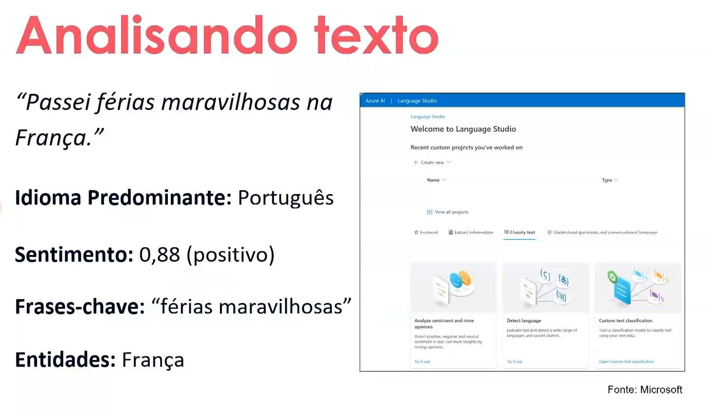

    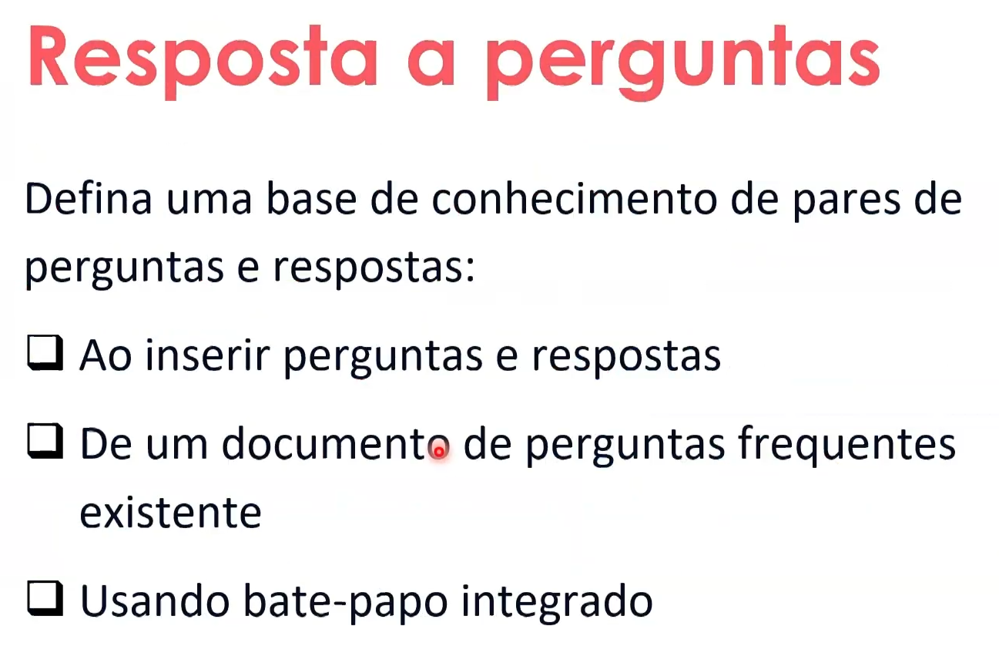

#### Processamento de Linguagem Natural com o Language Studio

##### Introdução à plataforma

O Language Studio da Microsoft é uma ferramenta voltada para o processamento de linguagem natural (PLN), permitindo que usuários explorem, integrem e criem recursos linguísticos por meio de uma interface intuitiva. A plataforma oferece funcionalidades como análise de texto, detecção de idioma, reconhecimento de entidades e sentimentos, além de integração com bate-papo e bases de conhecimento.

##### Análise de texto e sentimentos

Um exemplo prático apresentado é a frase “Passei férias maravilhosas na França.” Ao ser processada pelo Language Studio, são extraídas diversas informações relevantes:

- **Idioma predominante**: Português  
- **Sentimento**: Positivo, com pontuação de 0.88  
- **Frase-chave**: “férias maravilhosas”  
- **Entidade reconhecida**: França

Esses dados demonstram como o sistema é capaz de interpretar o conteúdo textual, identificar emoções, localizar entidades geográficas e destacar termos relevantes. Isso permite aplicações em larga escala, como análise de feedbacks de clientes, monitoramento de redes sociais ou avaliação de experiências turísticas.

##### Construção de bases de conhecimento

Além da análise textual, o Language Studio possibilita a criação de bases de perguntas e respostas. Isso pode ser feito manualmente, a partir de documentos de FAQ existentes ou por meio de bate-papo integrado. Essa funcionalidade é essencial para sistemas de atendimento automatizado, suporte técnico e assistentes virtuais.

##### Aplicações práticas e escalabilidade

Ao aplicar essas análises em grande volume, é possível obter insights valiosos sobre sentimentos, origens e comportamentos de usuários. Isso é especialmente útil em contextos com muitos dados e poucos recursos humanos para análise manual. O uso de inteligência artificial nesse cenário transforma grandes repositórios de informação em conhecimento acionável.

## 🟩 Vídeo 02 - Serviço de bot do Azure

    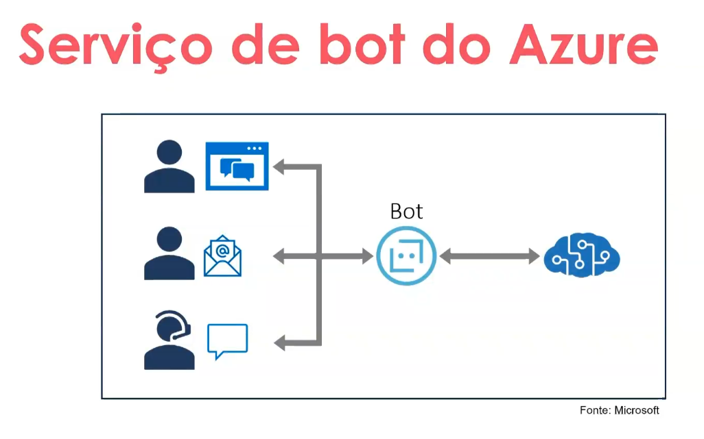

#### Serviço de Bot do Azure: Integração Inteligente com Múltiplos Canais

##### Evolução e propósito dos bots

O serviço de bot do Azure representa uma evolução significativa na forma como empresas interagem com seus usuários. Inicialmente limitados a respostas estáticas baseadas em listas de opções, os bots modernos utilizam inteligência artificial e computação em nuvem para oferecer respostas contextualizadas e precisas. Essa transformação permite que o atendimento seja mais ágil, personalizado e escalável.

##### Arquitetura e canais de comunicação

O diagrama apresentado ilustra como o bot centraliza interações vindas de diferentes canais — como web chat, e-mail e suporte por voz — conectando-se diretamente aos serviços em nuvem da Microsoft. Essa arquitetura garante alta disponibilidade e flexibilidade, permitindo que o usuário acesse o suporte por meio do canal de sua preferência, seja em sites, aplicativos, Microsoft Teams ou atendimento telefônico.

##### Inteligência artificial e base de conhecimento

A eficácia do bot depende diretamente da qualidade da base de dados utilizada. A IA integrada é capaz de interpretar linguagem natural, mesmo com erros ou variações coloquiais, identificando palavras-chave e frases relevantes para oferecer respostas adequadas. A manutenção contínua dessa base, com testes e atualizações, é essencial para garantir que novas demandas e produtos sejam contemplados.

##### Aplicações práticas e escalabilidade

O uso de bots permite a criação de um funil de atendimento, onde questões simples são resolvidas automaticamente, liberando os atendentes humanos para casos mais complexos. Além disso, é possível terceirizar o atendimento e distribuir scripts personalizados para diferentes marcas, otimizando recursos e ampliando a capacidade de resposta. Essa abordagem melhora a experiência do usuário e fortalece a confiança no serviço prestado.

    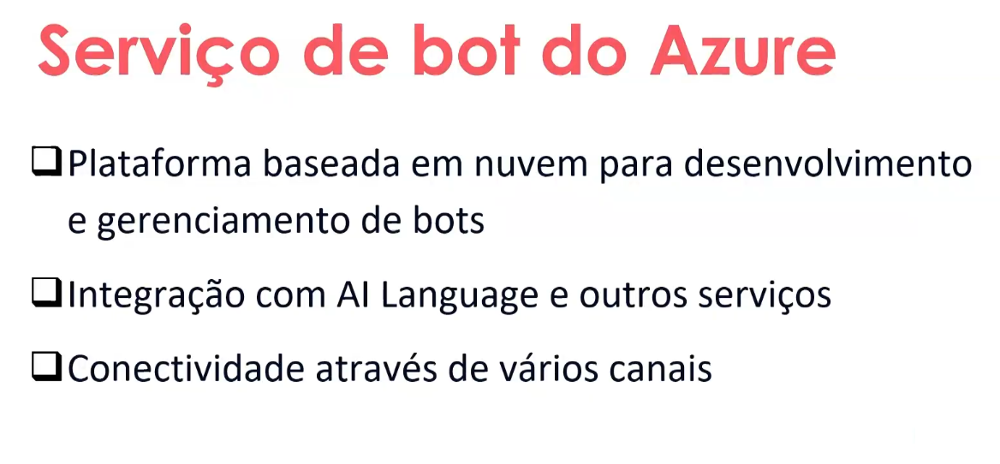

#### Azure Bot Service: Plataforma Inteligente para Atendimento Multicanal

##### Visão geral e evolução

O Serviço de Bot do Azure é uma solução baseada em nuvem que permite o desenvolvimento e gerenciamento de bots inteligentes, voltados para o atendimento automatizado de usuários. Ao longo dos anos, essa tecnologia evoluiu significativamente, saindo de sistemas simples baseados em listas de opções para plataformas robustas que integram inteligência artificial e compreensão de linguagem natural.

##### Integração com IA e base de conhecimento

A principal força do serviço está na sua capacidade de interpretar mensagens dos usuários por meio de palavras-chave e frases-chave, utilizando modelos de IA Language. Isso permite que o bot compreenda até mesmo textos com erros ou linguagem coloquial, oferecendo respostas relevantes com base em uma base de dados constantemente atualizada. A qualidade do atendimento depende diretamente da manutenção e testes frequentes dessa base de conhecimento.

##### Conectividade multicanal

O diagrama apresentado reforça a capacidade do Azure Bot Service de se conectar com diversos canais de comunicação, como web chat, e-mail, voz e até plataformas como Microsoft Teams. Essa flexibilidade garante que o usuário possa interagir com o bot por meio do canal mais conveniente, enquanto o sistema centralizado processa e responde de forma eficiente.

##### Aplicações práticas e escalabilidade

A adoção de bots permite a criação de funis de atendimento, onde questões simples são resolvidas automaticamente, liberando os atendentes humanos para demandas mais complexas. Além disso, é possível terceirizar o atendimento e distribuir scripts personalizados para diferentes marcas, otimizando recursos e ampliando a capacidade de resposta. Essa abordagem melhora a experiência do usuário e fortalece a confiança no serviço prestado.

## 🟩 Vídeo 03 - Links úteis

    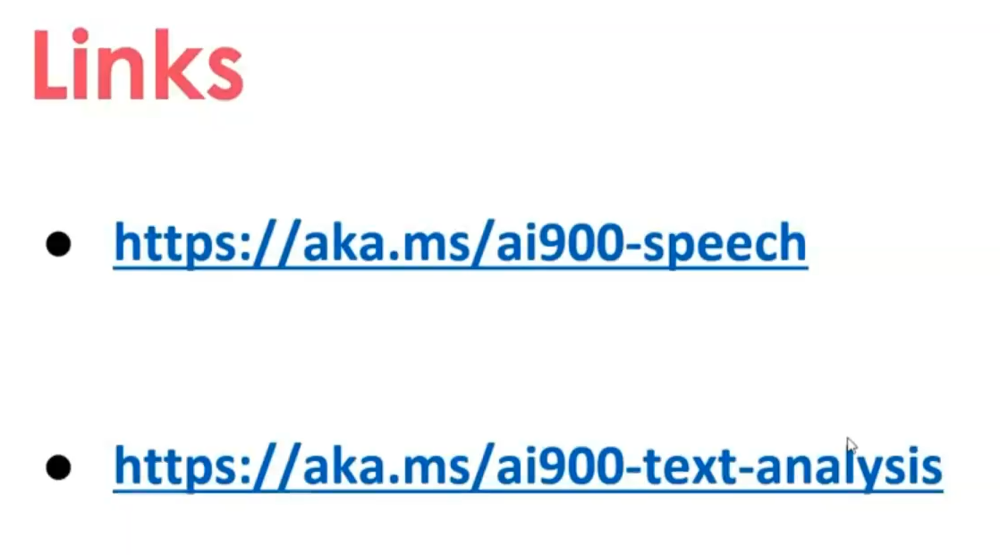

#### Laboratório de Fala e Análise de Texto com Language Studio

##### Introdução ao módulo prático

O laboratório do módulo 3 propõe uma imersão prática nas ferramentas de inteligência artificial da Microsoft voltadas para linguagem, com foco no estúdio de fala e no Language Studio. A proposta é que os participantes explorem recursos de análise de texto e voz, aplicando conceitos discutidos em aula em um ambiente real de experimentação.

##### Recursos disponíveis

Para facilitar a execução das atividades, foram disponibilizados dois links oficiais da Microsoft com documentação detalhada:

- [Documentação de Fala (Speech)](https://aka.ms/ai900-speech)  
- [Documentação de Análise de Texto](https://aka.ms/ai900-text-analysis)

Esses materiais oferecem o passo a passo necessário para configurar e testar os serviços, permitindo que os alunos repliquem os experimentos em seus próprios ambientes.

##### Aplicação prática e integração

Durante o laboratório, os participantes terão a oportunidade de compreender como os serviços de fala e análise de texto se integram ao Language Studio, utilizando inteligência artificial para extrair informações relevantes de mensagens, como idioma, sentimento, entidades e frases-chave. Essa prática reforça a importância de ferramentas automatizadas na interpretação de dados linguísticos, especialmente em contextos de atendimento ao cliente e análise de feedback.

## 🟩 Vídeo 04 - Conhecendo o Estudio de fala 

    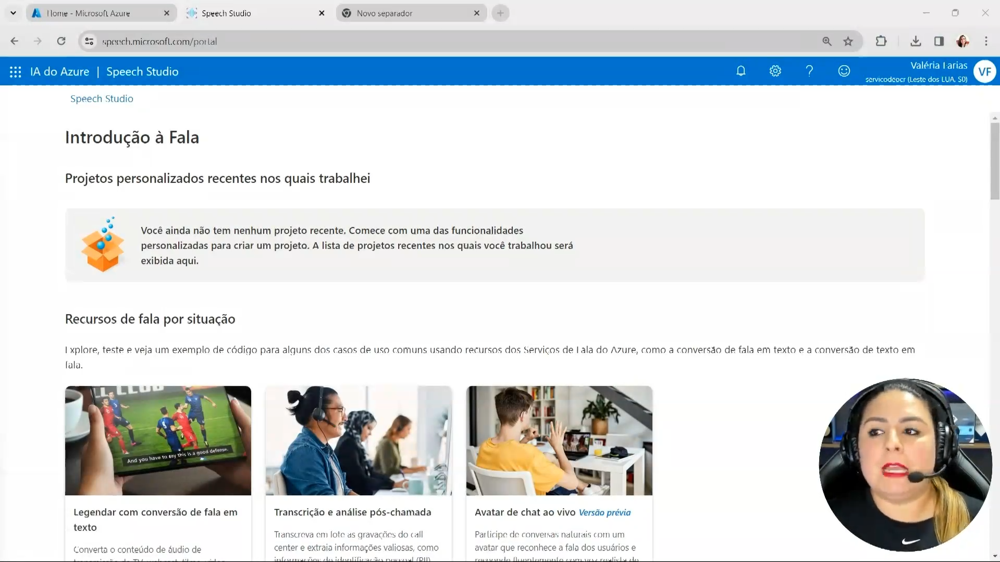

#### Funcionalidades do Azure AI Studio: Aplicações em Fala e Interação

##### Interface Inicial e Recursos de Início Rápido

A interface do Azure AI Studio apresenta uma abordagem intuitiva para usuários que desejam iniciar projetos de inteligência artificial voltados à comunicação. Na ausência de projetos recentes, o portal sugere três funcionalidades principais: legenda de vídeo em tempo real, transcrição e análise pós-chamada, e avatar de chat ao vivo. Cada uma dessas opções é ilustrada com imagens que remetem a contextos reais de uso, como transmissões esportivas, ambientes corporativos e interações com assistentes virtuais.

##### Legenda de Vídeo em Tempo Real

Essa funcionalidade permite aplicar modelos de IA para gerar legendas instantâneas em vídeos, como transmissões esportivas ou conteúdos audiovisuais diversos. A aplicação é especialmente útil para acessibilidade, tradução simultânea e consumo de mídia em ambientes multilíngues.

##### Transcrição e Análise Pós-Chamada

Voltada para ambientes corporativos, essa solução utiliza IA para transcrever chamadas de atendimento e realizar análises posteriores. É ideal para empresas que operam com centrais de relacionamento, oferecendo insights sobre qualidade de atendimento, padrões de comunicação e oportunidades de melhoria.

##### Avatar de Chat ao Vivo

O recurso de avatar com visão prévia representa uma aplicação interativa da IA em atendimentos virtuais. Ele simula conversas em tempo real com usuários, podendo ser integrado a sites, aplicativos ou sistemas internos. A proposta é humanizar o atendimento automatizado, oferecendo respostas naturais e contextualizadas.

##### Potencial de Integração e Expansão

Essas funcionalidades demonstram o potencial do Azure AI Studio como plataforma para desenvolvimento de soluções inteligentes em fala, texto e interação. Com recursos personalizáveis e integração com serviços como GitHub, o ambiente favorece tanto desenvolvedores quanto profissionais de negócios que buscam inovação com responsabilidade e eficiência.

    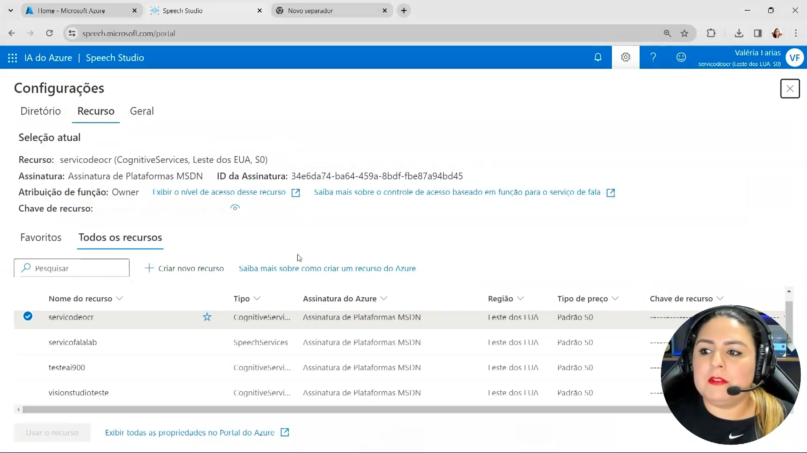

    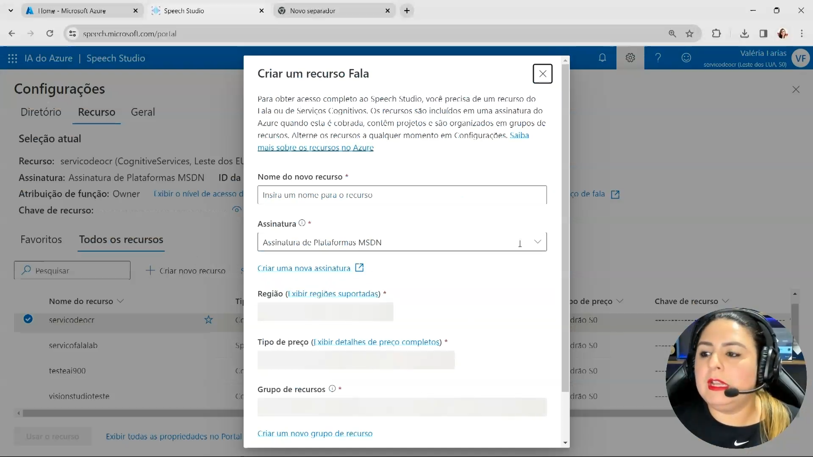

#### Configuração e Criação de Recursos no Speech Studio do Azure

##### Gerenciamento de Recursos Cognitivos

A interface do Speech Studio apresenta a seção de configurações, onde é possível visualizar os detalhes da assinatura vinculada à conta, como o nome da assinatura, o ID e o diretório do Azure. Nessa área, o usuário também encontra uma tabela com os recursos cognitivos já criados, incluindo nome, tipo, região, modelo de preço e data de criação. Todos os recursos listados estão configurados na região "Leste dos EUA" com o modelo de preço "Padrão S0", evidenciando uma padronização para testes e uso inicial.

##### Criação de Novo Recurso de Fala

Ao acessar o formulário "Criar um recurso Fala", o usuário pode configurar um novo serviço de reconhecimento ou síntese de fala. O processo exige a definição de um nome para o recurso, a seleção da assinatura ativa, a escolha da região de hospedagem e do grupo de recursos. Também é possível criar um novo grupo diretamente pela interface. O modelo de preço pode ser ajustado conforme a necessidade, com links disponíveis para consulta das regiões suportadas e dos detalhes tarifários.

##### Considerações Técnicas e Operacionais

A criação e ativação de recursos no Speech Studio permite o uso de funcionalidades como conversão de fala em texto em tempo real, geração de voz a partir de texto e integração com aplicações externas. Esses recursos são fundamentais para soluções que envolvem acessibilidade, automação de atendimento, tradução simultânea e análise de chamadas. A interface clara e segmentada facilita o gerenciamento e a expansão dos serviços, promovendo agilidade na implementação de projetos com inteligência artificial aplicada à fala.

    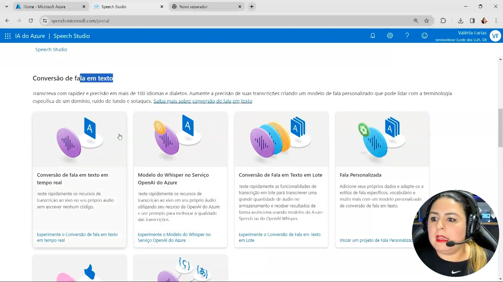

    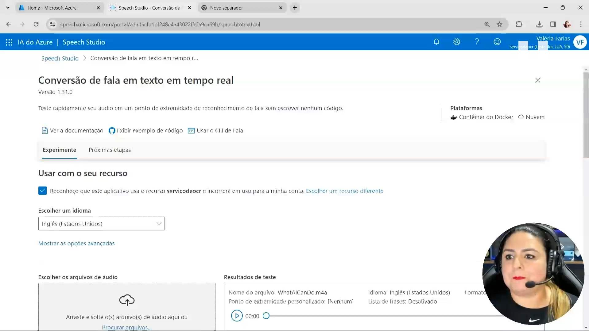

    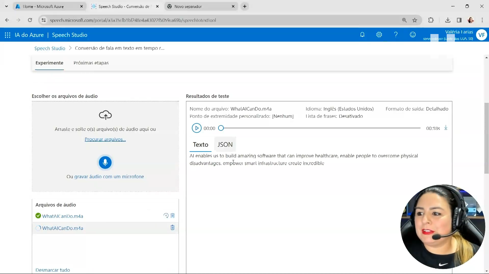

#### Recursos e Funcionalidades do Microsoft Azure Speech Studio

##### Módulos de Conversão de Fala em Texto

O Speech Studio do Azure oferece uma variedade de módulos voltados à conversão de fala em texto, com suporte para mais de 100 idiomas e dialetos. O usuário pode optar por modelos pré-treinados para situações comuns ou criar modelos personalizados para vocabulários específicos e sotaques regionais. Além disso, há suporte para processamento em lote, permitindo a transcrição de múltiplos arquivos de áudio simultaneamente.

##### Integração com OpenAI e Modelo Whisper

Entre os recursos disponíveis, destaca-se a integração com o modelo Whisper da OpenAI, que permite transcrições precisas em diversos idiomas e sotaques. Essa funcionalidade amplia a capacidade de reconhecimento de fala, tornando o serviço mais robusto e adaptável a diferentes contextos linguísticos.

##### Testes em Tempo Real e Interface Interativa

A interface do Speech Studio permite testar recursos de fala em tempo real sem necessidade de escrever código. O usuário pode gravar diretamente com o microfone ou carregar arquivos de áudio, visualizando instantaneamente os resultados da transcrição. O painel de resultados exibe informações como nome do arquivo, idioma, tipo de modelo e licença, além de permitir a visualização em formato JSON.

##### Experiência Guiada e Configuração de Recursos

Durante a criação de um novo recurso de fala, o usuário define parâmetros como nome, assinatura, região, grupo de recursos e modelo de preço. A interface orienta o processo com links para regiões suportadas e detalhes tarifários, facilitando a configuração inicial. Recursos já criados são listados com informações detalhadas, permitindo o gerenciamento eficiente dos serviços cognitivos.

##### Aplicações Práticas e Potencial de Uso

As funcionalidades do Speech Studio são ideais para aplicações em acessibilidade, atendimento automatizado, tradução simultânea e análise de chamadas. Com suporte a personalização e integração com repositórios externos, como GitHub, a plataforma se mostra versátil para desenvolvedores e profissionais de negócios que desejam incorporar inteligência artificial em soluções de comunicação.

    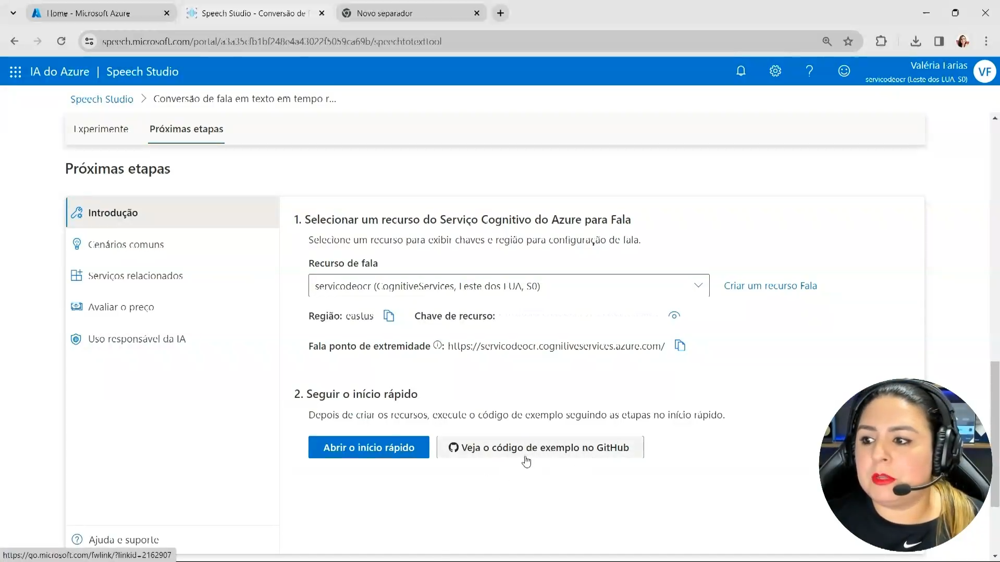

## 🟩 Vídeo 05 - 

## 🟩 Vídeo 06 - 

## 🟩 Vídeo 07 - 