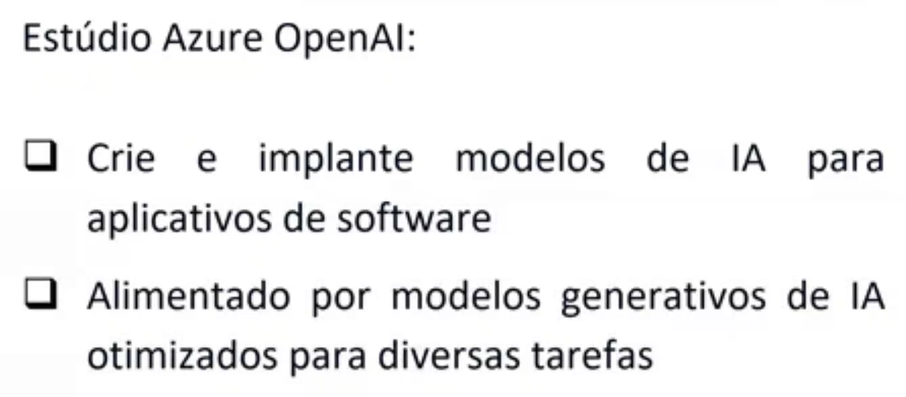
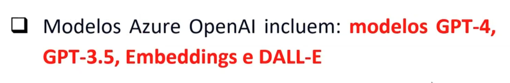
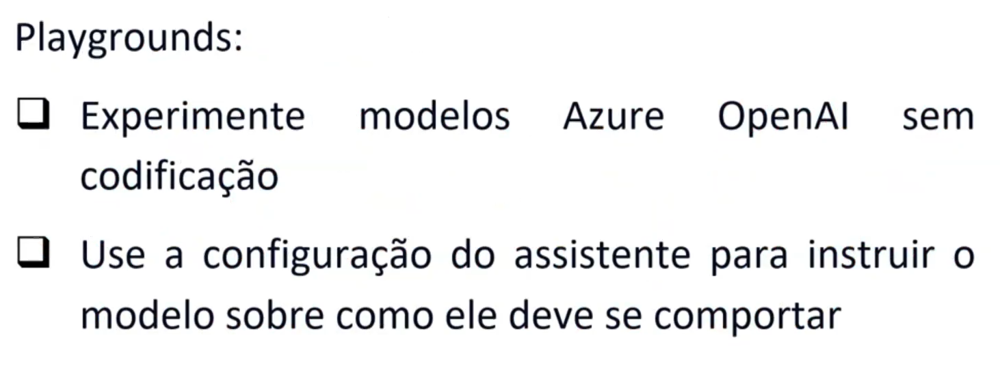
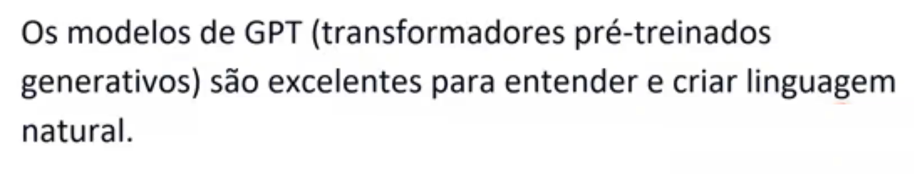
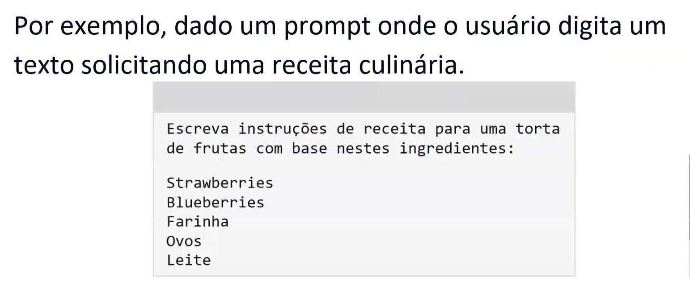
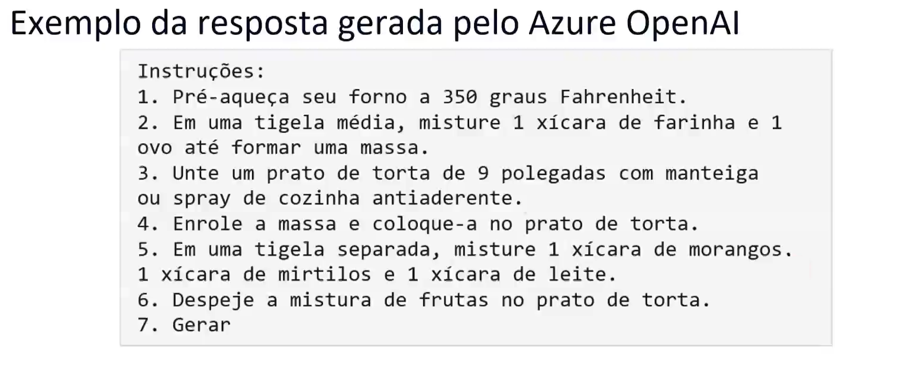
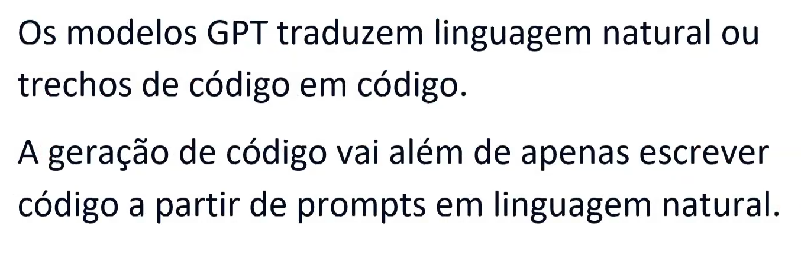
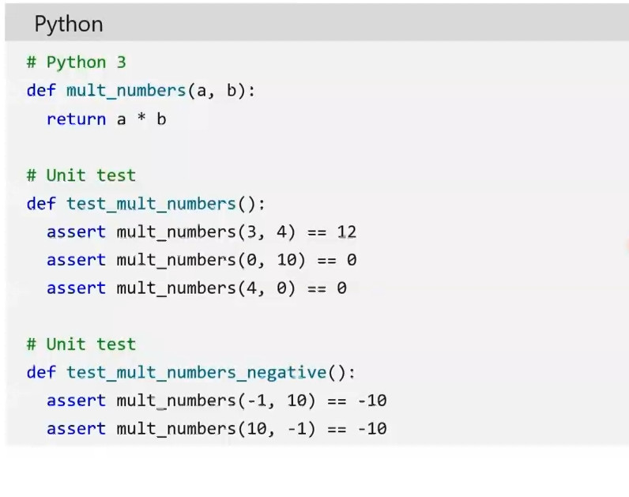

- Instrutor: Valéria Baptista (Head of Cloud and Cybersecurity | Professora e Mentora em Tecnologia)
- Contato Linkedin: / [valeriabaptista](https://www.linkedin.com/in/valeriabaptista/) 

## 🟩 Vídeo 01 - O que é o OpenAI do Azure

    

#### Introdução ao Serviço Azure OpenAI

##### O que é o Azure OpenAI?

O Azure OpenAI é a solução de nuvem da Microsoft voltada para a implantação, personalização e hospedagem de modelos de linguagem de grande escala. Ele permite que empresas integrem inteligência artificial generativa com segurança, escalabilidade e controle, aproveitando os modelos mais avançados da OpenAI dentro da infraestrutura confiável do Azure.

##### Segurança e Governança

A plataforma oferece mecanismos robustos de segurança, como o controle de acesso baseado em função (RBAC), que define quem pode acessar quais recursos. Isso garante que os dados sejam protegidos contra acessos indevidos e ataques externos, promovendo o uso responsável da IA.

##### Modelos Disponíveis

O serviço disponibiliza diferentes modelos de linguagem, cada um com características específicas:

- **GPT-4**: última geração de modelos generativos, ideal para tarefas complexas de linguagem natural e preenchimento de código.
- **GPT-3.5**: otimizado para interações em formato de chat, com bom desempenho em aplicações conversacionais.
- **Modelo de inserção**: converte texto em vetores numéricos, útil para análise de linguagem, comparação e similaridade textual.
- **DALL·E**: modelo voltado para geração de imagens a partir de descrições em linguagem natural, atualmente em versão prévia sem SLA garantido.

##### Estratégias de Uso

Empresas podem optar por diferentes abordagens de processamento, seja em nuvem ou local, considerando fatores como custo, velocidade e finalidade. O Azure OpenAI oferece flexibilidade de acesso via portal, código ou APIs REST, permitindo que desenvolvedores escolham o método mais adequado ao seu fluxo de trabalho.

##### Aplicações Práticas

Com suporte a ambientes como o Azure AI Studio e o playground interativo, os usuários podem testar, implantar e gerenciar modelos de forma intuitiva. Isso facilita a criação de soluções inovadoras com IA generativa, desde assistentes virtuais até sistemas de recomendação e análise de dados.

    

#### Azure OpenAI: Fundamentos e Aplicações

##### Visão Geral do Serviço

O Azure OpenAI é uma solução de nuvem desenvolvida pela Microsoft que permite a implantação, personalização e hospedagem de modelos de linguagem de grande escala. Integrado à plataforma Azure, o serviço oferece acesso seguro e escalável aos modelos mais avançados da OpenAI, com foco em inteligência artificial generativa.

##### Componentes Centrais

O serviço é composto por modelos de IA generativa predefinidos e funcionalidades de personalização. Essa combinação permite que empresas adaptem os modelos às suas necessidades específicas, garantindo respostas rápidas e precisas em diversos contextos. A flexibilidade de uso inclui acesso via portal, código ou APIs REST, com suporte a ambientes como o Azure AI Studio e playgrounds interativos.

##### Segurança e Governança

A segurança é garantida por mecanismos como o controle de acesso baseado em função (RBAC), que define permissões específicas para cada usuário. Isso assegura que os dados sejam acessados apenas por quem tem autorização, mitigando riscos e promovendo o uso responsável da IA.

##### Modelos Disponíveis

Entre os modelos oferecidos estão o GPT-4, GPT-3.5, modelos de inserção e o DALL·E. O GPT-4 representa a última geração de modelos generativos, com alta capacidade de compreensão e geração de linguagem natural. O GPT-3.5 é otimizado para interações em formato de chat. Os modelos de inserção convertem texto em vetores numéricos, úteis para análise semântica e comparação textual. Já o DALL·E é voltado para geração de imagens a partir de descrições em linguagem natural, estando disponível em versão prévia.

##### Estratégia e Aplicação

A escolha entre os modelos depende de fatores como custo, velocidade e complexidade da tarefa. A parceria entre Microsoft e OpenAI permite que empresas explorem soluções inovadoras com inteligência artificial, sempre considerando a melhor estratégia de implementação e uso responsável dos recursos disponíveis.

    

    

    

#### Azure OpenAI: Solução Inteligente e Segura para IA Generativa

##### Visão Geral do Serviço

O Azure OpenAI é uma solução de nuvem da Microsoft que permite a implantação e personalização de modelos de linguagem de grande escala. Integrado à infraestrutura do Azure, o serviço oferece acesso aos modelos mais avançados da OpenAI com escalabilidade, segurança e flexibilidade para diferentes cenários empresariais.

##### Inteligência Artificial com Responsabilidade

O serviço incorpora ferramentas integradas para detectar e mitigar casos de uso prejudiciais, garantindo que a inteligência artificial seja implementada com responsabilidade. Essa abordagem é essencial para proteger usuários e organizações contra riscos éticos e operacionais, promovendo o uso seguro da tecnologia.

##### Segurança Corporativa

A segurança é reforçada por mecanismos como o RBAC (Role-Based Access Control), que define permissões de acesso com base em funções. Além disso, o uso de redes privadas contribui para a proteção dos dados e a integridade das operações, criando um ambiente confiável para o desenvolvimento de soluções com IA.

##### Métodos de Desenvolvimento

Os usuários podem interagir com os modelos por meio de diferentes interfaces, como o Estúdio de IA do Azure, APIs REST e SDKs com suporte via CLI. Essa diversidade de ferramentas permite que desenvolvedores escolham o método mais adequado ao seu fluxo de trabalho, seja via portal gráfico ou por código.

    

    

    

    

#### Azure OpenAI: Modelos, Segurança e Ferramentas de Desenvolvimento

##### Visão Geral do Serviço

O Azure OpenAI é uma solução de nuvem da Microsoft que permite a implantação, personalização e hospedagem de modelos de linguagem de grande escala. Ele combina a infraestrutura segura do Azure com os modelos avançados da OpenAI, oferecendo recursos de inteligência artificial generativa com escalabilidade e controle.

##### Segurança e Governança

A plataforma incorpora ferramentas integradas para detectar e mitigar casos de uso prejudiciais, promovendo a implementação responsável da IA. Além disso, oferece segurança corporativa com RBAC (controle de acesso baseado em função) e redes privadas, garantindo que apenas usuários autorizados tenham acesso aos dados e recursos.

##### Ferramentas de Desenvolvimento

Os desenvolvedores podem interagir com os modelos por meio de três métodos principais: o Estúdio de IA do Azure, APIs REST e SDKs com suporte via CLI. Essa variedade de interfaces permite flexibilidade na criação, teste e gerenciamento de soluções baseadas em IA.

##### Modelos Disponíveis

O Azure OpenAI dá suporte a diversos modelos de linguagem (LLMs), cada um com características específicas:

**GPT-4** é um conjunto de modelos que aprimoram o GPT-3.5, com capacidade de compreender e gerar linguagem e código naturais.

**GPT-3.5** melhora o GPT-3 e também é capaz de lidar com linguagem e código, sendo otimizado para interações em formato de chat.

**Incorporações** são modelos que convertem texto em vetores numéricos, facilitando a análise de similaridade textual.

**DALL-E (visualização)** é uma série de modelos em pré-visualização que geram imagens originais a partir de descrições em linguagem natural, ideal para aplicações criativas.

## 🟩 Vídeo 02 - Como usar o OpenAI do Azure

    

    

    

#### Estúdio Azure OpenAI: Implantação Ágil de Modelos Generativos

##### Ambiente de Desenvolvimento

O Estúdio Azure OpenAI é uma plataforma acessível via navegador que permite criar e implantar modelos de inteligência artificial voltados para aplicativos de software. Ele oferece um ambiente visual e interativo, com recursos como playgrounds de chat e preenchimento, facilitando testes e ajustes em tempo real.

##### Modelos e Tarefas

Alimentado por modelos generativos otimizados para diversas tarefas, o estúdio suporta aplicações como geração de texto, preenchimento de código, análise semântica e criação de imagens. Os modelos já vêm treinados e prontos para uso, bastando ao usuário personalizar conforme suas necessidades específicas.

##### Facilidade de Uso

A interface do estúdio é intuitiva e permite que profissionais implantem soluções de IA sem a necessidade de dominar todos os aspectos técnicos. Com funcionalidades pré-configuradas e opções de personalização, o processo se assemelha à montagem de soluções com componentes prontos, tornando a experiência mais acessível e eficiente.

## 🟩 Vídeo 03 - Funcionalidade de linguagem natural do OpenAI do Azure

    

    

    

    

    

    

#### Aplicações de Linguagem Natural e Geração de Conteúdo com Azure OpenAI

##### Compreensão e Criação de Linguagem Natural

Os modelos GPT (transformadores pré-treinados generativos) são altamente eficazes na interpretação e geração de linguagem natural. Essa capacidade permite que sistemas como o ChatGPT atuem como interfaces conversacionais inteligentes, combinando front-end interativo com back-end baseado em IA generativa. A partir de prompts simples, como uma lista de ingredientes, o modelo é capaz de produzir instruções completas e coerentes, como receitas culinárias detalhadas.

##### Geração de Código e Suporte ao Desenvolvimento

Além da linguagem natural, os modelos GPT também traduzem trechos de texto ou código em scripts funcionais. Essa funcionalidade é amplificada com ferramentas como o GitHub Copilot, que atua como um programador de pares, sugerindo e validando trechos de código em ambientes como o Visual Studio Code. A IA pode inclusive gerar testes automatizados, como unit tests em Python, otimizando o fluxo de desenvolvimento.

##### Criação e Edição de Imagens

A IA generativa também se estende à produção visual. Com modelos como DALL·E, é possível gerar imagens originais a partir de descrições em linguagem natural, incluindo variações estilísticas e edições específicas. Isso permite desde a criação de personagens fictícios até composições inusitadas, como elefantes com hambúrgueres, com alto nível de realismo e personalização.

##### Impacto e Realismo

A sofisticação desses modelos é tamanha que já se observa a criação de personas digitais hiper-realistas, capazes de gerar engajamento e receita em redes sociais. A linha entre o real e o artificial torna-se cada vez mais tênue, exigindo reflexão sobre autenticidade e ética no uso da inteligência artificial.

## 🟩 Vídeo 04 - Revisão e Encerramento do Módulo

    

# Material de Apoio e Links Úteis

### Materiais Complementares

Nossos materiais complementares e de apoio têm como objetivo apresentar informações para facilitar e enriquecer a sua jornada de aprendizado. Para isso, links úteis (como slides, repositórios e páginas oficiais) serão disponibilizados, além de dicas sobre como se destacar na DIO e no mercado de trabalho 😉

---

### Slides

- [Módulo 5 - IA Generativa.pptx](https://academiapme-my.sharepoint.com/:p:/g/personal/nubia_dio_me/Ef88qA-boB1GuImGg67P-IQBAQP0mfwtVB0RjBnabfvdPw?e=PwuezC)

---

### Dicas/Links Úteis

Por fim, disponibilizamos alguns links úteis para que você possa se desenvolver ainda mais através de referências oficiais das tecnologias, páginas de documentação e/ou fóruns de discussão relevantes. Nesse contexto, seguem algumas sugestões:

- **Artigos/Fórum**:  
  Você pode compartilhar conteúdos técnicos através de Artigos (visíveis globalmente na plataforma da DIO). Por outro lado, você também pode compartilhar suas conquistas e dúvidas usando os Fóruns (que são específicos para cada experiência educacional na DIO, como um Bootcamp por exemplo);

- **Rooms**:  
  Caso você esteja inscrito(a) em uma experiência educacional na DIO (como um Bootcamp, por exemplo), você terá acesso ao Rooms. O Rooms é uma ferramenta de bate-papo em tempo real onde todos os inscritos podem interagir, compartilhando dúvidas e dicas (que podem conter imagens e snippets de código-fonte);

- **Pesquise na Web**:  
  Pode parecer óbvio, mas é importante frisar a importância das engines de busca no dia-a-dia de um profissional de TI. Caso não encontre o que procura dentro da DIO, pesquise sobre o assunto (conceito, dúvida, erro etc) na Internet (dê um Google), pois na maioria das vezes você será levado à páginas incríveis como o StackOverflow que salvarão o seu dia 😎

# Certificado: Trabalhando com Serviços Azure OpenAl

Link: https://hermes.dio.me/certificates/TDU2Y2DR.pdf

