## Instrutor:

- ROtávio Reis Perkles (Desenvolvedor Full-stack Sênior (Python - Java) / Líder técnico)
- Contato Linkedin: / [operkles](https://www.linkedin.com/in/operkles/)

# Parte 1 - Introdução ao Git

## 🟩 Vídeo 01 - Entendendo o que é Git e sua importância

![[bootcamp_tqi_fullstack-modulo_01-Curso_05-Video_01.webm|vid-60]]

Link do vídeo:  https://web.dio.me/track/tqi-fullstack-developer/course/introducao-ao-git-e-ao-github/learning/75b9fe49-6ed4-4480-83a7-7e37fc356aa9?autoplay=1

O vídeo apresenta uma introdução ao curso de **Git e GitHub** ministrado por Otávio Reis, que utiliza a analogia de um jornalista revisando textos para explicar a importância do **controle de versão**. O instrutor detalha que o **Git** foi criado por **Linus Torvalds** para gerenciar o desenvolvimento colaborativo do kernel do Linux de forma eficiente e organizada. É enfatizada a distinção fundamental entre o Git, que é a ferramenta local de versionamento, e o **GitHub**, uma plataforma em nuvem da Microsoft para hospedagem de código e interação social. O curso promete benefícios como o aprimoramento do **trabalho em equipe**, reconhecimento na comunidade e armazenamento seguro de projetos. Por fim, a metodologia une **teoria e prática** através da criação de um repositório de receitas para facilitar a compreensão de conceitos abstratos por iniciantes.


# Parte 2 - Navegação via command line interface e instalação

## 🟩 Vídeo 02 - Comandos básicos para um bom desempenho no terminal

![[bootcamp_tqi_fullstack-modulo_01-Curso_05-Video_02.webm|vid-60]]

Link do vídeo:  https://web.dio.me/track/tqi-fullstack-developer/course/introducao-ao-git-e-ao-github/learning/5008950d-a42b-4fc3-813b-fdaeebc86529?autoplay=1

Esta fonte consiste em uma aula técnica que ensina **comandos básicos de terminal** para navegação e manipulação de arquivos em diferentes sistemas operacionais. O instrutor justifica o uso da **interface de linha de comando (CLI)**, em vez de interfaces gráficas, para proporcionar uma compreensão mais profunda do funcionamento do **Git**. São apresentadas as equivalências de comandos entre o **Windows** e sistemas baseados em **Unix**, como Linux e macOS, para listar, criar, acessar e remover diretórios. Além disso, o conteúdo aborda o uso de **atalhos e flags** que otimizam o fluxo de trabalho e a limpeza do ambiente virtual. O objetivo final é capacitar o aluno a gerenciar pastas e arquivos com segurança antes de iniciar a instalação do controle de versão.


## 🟩 Vídeo 03 - Realizando a instalação do GIT

![[bootcamp_tqi_fullstack-modulo_01-Curso_05-Video_03.webm|vid-60]]

Link do vídeo: https://web.dio.me/track/tqi-fullstack-developer/course/introducao-ao-git-e-ao-github/learning/014fe14a-dc5a-41ec-9965-755a79694f27?autoplay=1

Este guia tutorial ensina como realizar a **instalação do Git** nos sistemas operacionais **Windows, Linux e macOS**, enfatizando a importância de manter o software atualizado. O autor destaca que versões a partir da **2.30** trazem mudanças críticas, como a transição para o **Git Credential Manager Core** e a nova nomenclatura da branch padrão para **"main"**. No **Windows**, o processo é feito via instalador oficial, garantindo que ferramentas como o **Git Bash** sejam integradas ao sistema. Para usuários de **Linux**, a recomendação é utilizar repositórios **PPA** para obter a versão mais recente, enquanto no **macOS** sugere-se o gerenciador de pacotes **Homebrew**. O objetivo central é padronizar o ambiente de desenvolvimento para evitar erros de compatibilidade e permissão durante o uso de repositórios remotos.

# Parte 3 - Entendendo como o Git funciona por baixo dos panos

## 🟩 Vídeo 04 - Tópicos fundamentais para entender o funcionamento do Git

![[bootcamp_tqi_fullstack-modulo_01-Curso_05-Video_04.webm|vid-60]]

Link do vídeo:  https://web.dio.me/track/tqi-fullstack-developer/course/introducao-ao-git-e-ao-github/learning/0f9c0907-c8dd-4cf4-b9f5-05f5dd486875?autoplay=1

Esta fonte consiste em uma aula técnica que explora o **funcionamento interno do Git**, focando especialmente em como a tecnologia gerencia dados de forma invisível ao usuário. O instrutor destaca a importância do **algoritmo SHA-1**, uma função de encriptação que gera identificadores únicos de 40 caracteres para garantir a **integridade e segurança** dos arquivos. Através de exemplos práticos no **Git Bash**, demonstra-se que qualquer alteração mínima em um documento resulta em uma assinatura digital completamente nova. Além disso, o conteúdo orienta sobre a personalização da interface do terminal e a utilização de comandos de navegação para facilitar o fluxo de trabalho. O objetivo central é capacitar o aluno a entender a **lógica estrutural** do sistema antes de avançar para comandos práticos complexos.


## 🟩 Vídeo 05 - Objetos internos do Git

![[bootcamp_tqi_fullstack-modulo_01-Curso_05-Video_05.webm|vid-60]]

Link do vídeo: https://web.dio.me/track/tqi-fullstack-developer/course/introducao-ao-git-e-ao-github/learning/02d99abe-e83c-4800-9100-a4258119a781?autoplay=1

O vídeo explica os fundamentos técnicos que tornam o **Git** um sistema de versionamento **seguro** e **distribuído**, focando em seus três objetos principais. As **blobs** armazenam o conteúdo bruto dos arquivos e seus metadados, enquanto as **trees** organizam a estrutura de diretórios e nomes. Os **commits** consolidam essas informações, vinculando o estado do projeto a autores, mensagens e registros temporais por meio de identificadores únicos. Toda essa arquitetura é protegida pela criptografia **SHA-1**, que gera um código específico para cada alteração, garantindo que qualquer modificação mínima invalide o histórico anterior. Essa interdependência assegura a integridade total dos dados, permitindo que cada cópia do repositório funcione como um backup **confiável** e autêntico do projeto original.

### Anotações

#### Objetos Fundamentais do Git

O Git baseia seu funcionamento em três tipos básicos de objetos responsáveis pelo versionamento do código: **Blobs**, **Trees** (Árvores) e **Commits**. Compreender esses objetos é essencial para entender por que o Git é um sistema distribuído tão seguro e eficiente.

<p align="center">
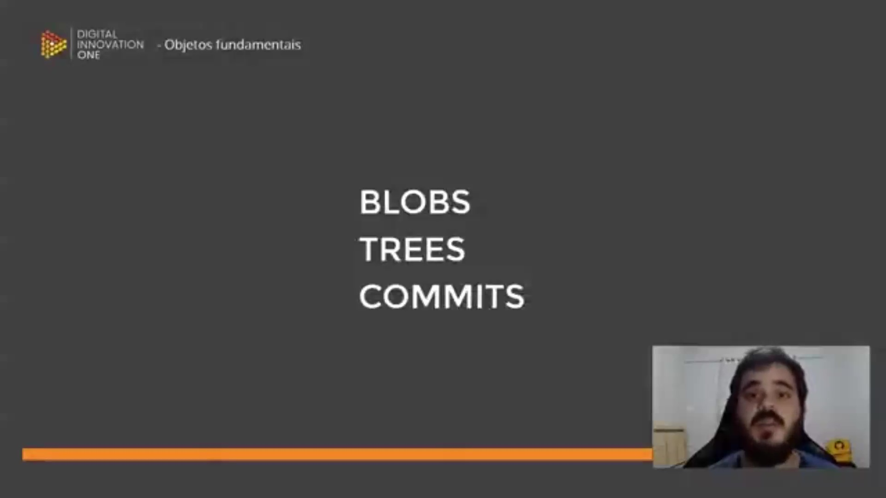
</p>

#### Blobs (Binary Large Objects)

O **Blob** é o objeto mais básico do Git. Ele é utilizado para armazenar o conteúdo dos arquivos. Quando o Git processa um arquivo, ele gera um identificador único chamado **SHA-1** baseado no conteúdo desse objeto.

<p align="center">
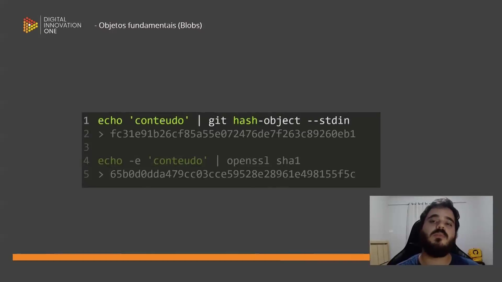
</p>

```bash
echo 'conteudo' | git hash-object --stdin
> fc31e91b26cf85a55e072476de7f263c89260eb1

echo -e 'conteudo' | openssl sha1
> 65b0d0dda479cc03cce59528e28961e498155f5c

```

Note que o hash gerado pelo comando `git hash-object` é diferente de um hash SHA-1 comum gerado pelo OpenSSL sobre a mesma string. Isso ocorre porque o Git não armazena apenas o conteúdo puro; ele adiciona **metadados** ao objeto.

#### Estrutura Interna de uma Blob

A estrutura de uma Blob inclui o tipo do objeto (`blob`), o tamanho do conteúdo, um caractere nulo (`\0`) e, finalmente, o conteúdo do arquivo (seja ele texto ou binário).

<p align="center">
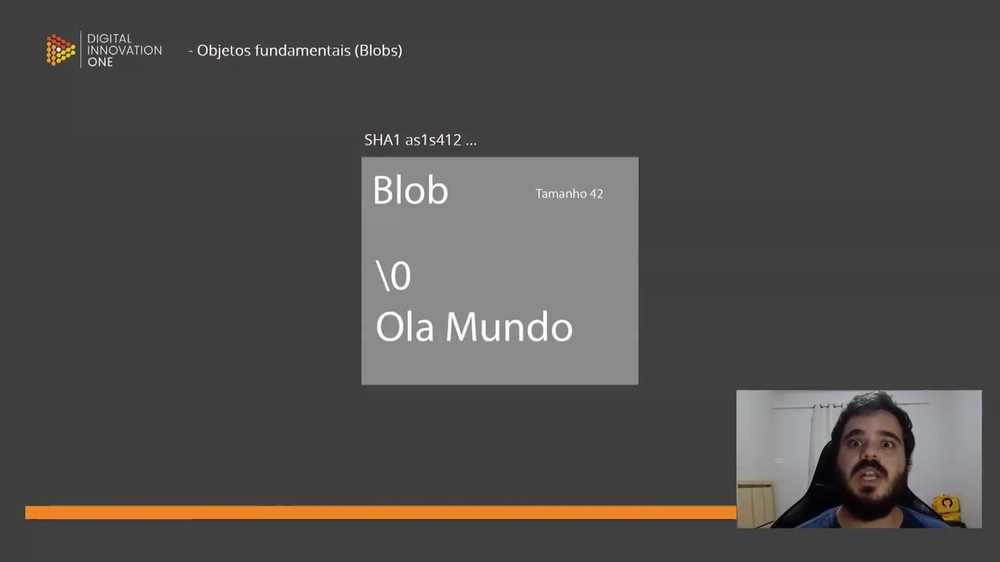
</p>

Ao incluirmos esses metadados manualmente usando o OpenSSL, conseguimos chegar ao mesmo hash gerado pelo Git, comprovando como a estrutura é montada internamente.

<p align="center">
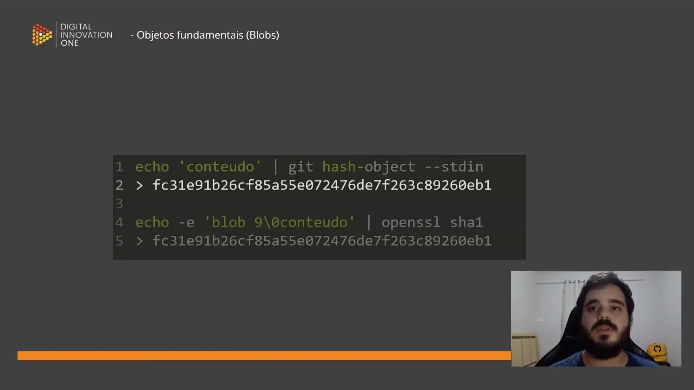
</p>

```bash
echo 'conteudo' | git hash-object --stdin
> fc31e91b26cf85a55e072476de7f263c89260eb1

echo -e 'blob 9\0conteudo' | openssl sha1
> fc31e91b26cf85a55e072476de7f263c89260eb1

```

Importante notar: **o Blob não armazena o nome do arquivo**, apenas o seu conteúdo e metadados básicos.

#### Trees (Árvores)

As **Trees** são os objetos responsáveis por organizar a estrutura de diretórios e armazenar os nomes dos arquivos. Uma Tree aponta para Blobs (arquivos) ou para outras Trees (subdiretórios).

<p align="center">
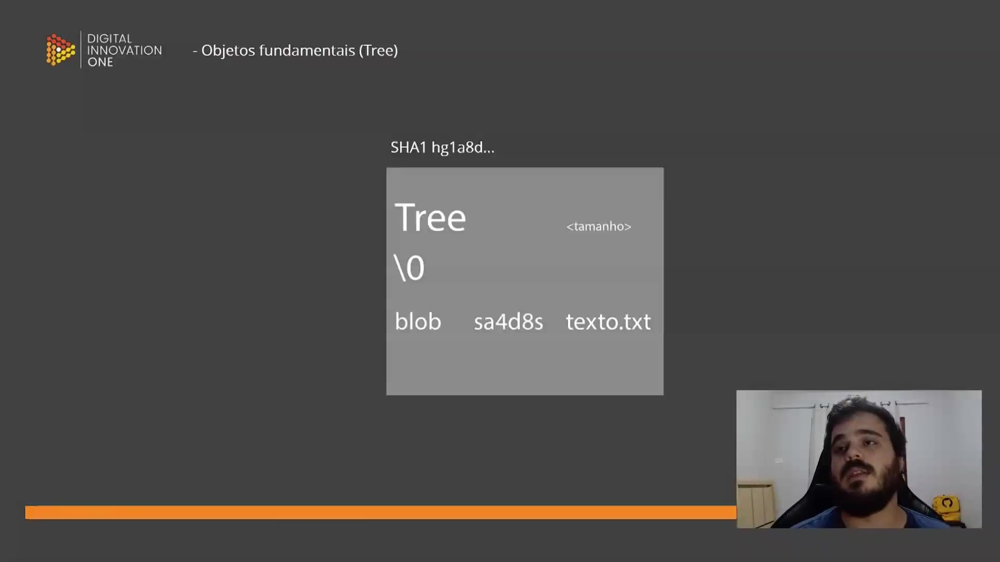
</p>

Assim como as Blobs, as Trees também possuem metadados e geram seu próprio hash SHA-1. Elas funcionam de forma recursiva: uma árvore pode conter referências para arquivos específicos ou para outras pastas, espelhando a hierarquia do sistema operacional.

<p align="center">
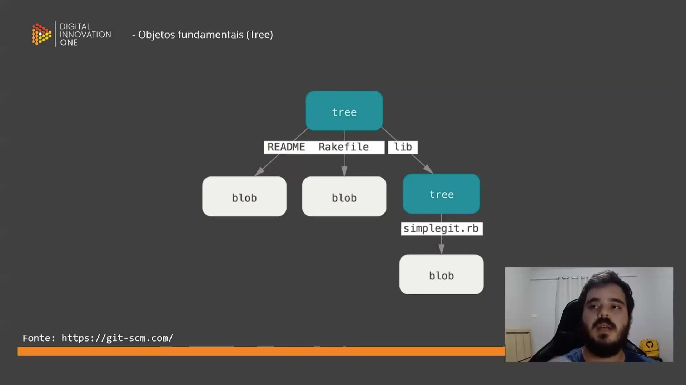
</p>

#### Commits: O Elo de Ligação

O **Commit** é o objeto que une todas as informações e dá sentido às alterações. Ele aponta para uma Tree (o estado do projeto naquele momento) e contém informações contextuais cruciais.

<p align="center">

</p>

Um objeto de commit armazena:

* A referência para a Tree principal.
* O **Parent** (commit anterior), criando uma linha do tempo.
* O **Autor** da alteração.
* A **Mensagem** de commit.
* O **Timestamp** (data e hora exata).

#### Integridade e Segurança dos Dados

A genialidade do Git reside no fato de que o hash do commit é gerado a partir de todos esses metadados. Como o commit aponta para uma Tree, que por sua vez aponta para Blobs, qualquer alteração mínima em um único arquivo mudará o hash da Blob, o que mudará o hash da Tree e, consequentemente, invalidará o hash do Commit.

<p align="center">
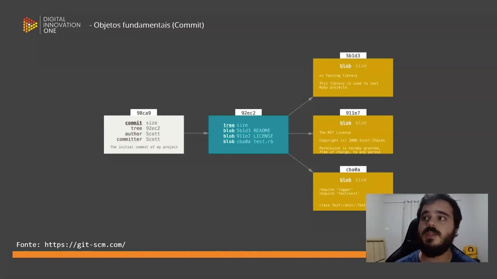
</p>

Essa estrutura em cadeia garante que o histórico seja imutável e seguro: é virtualmente impossível alterar um arquivo no passado sem corromper toda a sequência de hashes subsequente.

#### O Git como Sistema Distribuído e Seguro

Devido a essa arquitetura baseada em hashes persistentes, o Git torna-se um sistema distribuído extremamente confiável.

<p align="center">
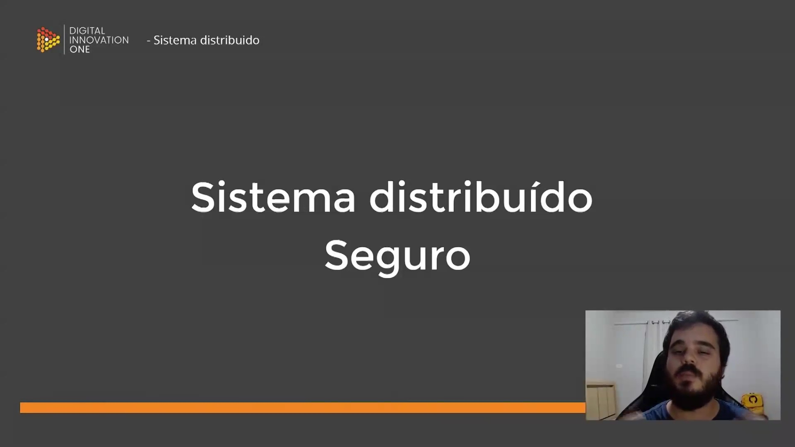
</p>

Em um cenário onde o servidor central (como o GitHub) sofra uma falha crítica, qualquer uma das cópias locais (clones) dos desenvolvedores contém o histórico completo e íntegro. Como cada commit é único e verificado por seu SHA-1, a versão na máquina de cada colaborador é tão confiável quanto a versão que estava no servidor, garantindo a resiliência do código-fonte.

## 🟩 Vídeo 06 - Chave SSH e Token

![[bootcamp_tqi_fullstack-modulo_01-Curso_05-Video_06.webm|vid-60]]

Link do vídeo: https://web.dio.me/track/tqi-fullstack-developer/course/introducao-ao-git-e-ao-github/learning/7410b862-1989-421a-a48d-500db5857f53?autoplay=1

Esta aula apresenta as novas diretrizes de autenticação do **GitHub**, focando na transição das senhas tradicionais para métodos mais robustos como **chaves SSH** e **tokens de acesso**. O instrutor detalha o processo técnico para gerar um par de chaves, explicando como configurar a **chave pública** na plataforma e inicializar o agente no terminal para conexões automáticas. O conteúdo abrange instruções específicas para ambientes **Windows**, **Linux** e **macOS**, demonstrando como clonar repositórios de forma segura. Adicionalmente, o vídeo ensina a criar **tokens pessoais**, essenciais para autenticação via HTTPS nas versões mais recentes do Git. O objetivo central é capacitar o aluno a estabelecer uma comunicação confiável entre a máquina local e a nuvem, garantindo a integridade do código.


# Parte 4 - Primeiros comandos com Git

## 🟩 Vídeo 07 - Iniciando o Git e criando um commit

![[bootcamp_tqi_fullstack-modulo_01-Curso_05-Video_07.webm|vid-60]]

Link do vídeo:  https://web.dio.me/track/tqi-fullstack-developer/course/introducao-ao-git-e-ao-github/learning/12607816-1128-4906-9645-cbe0f7fcc72b?autoplay=1

Esta fonte consiste em uma transcrição de aula prática focada nos **primeiros passos com o Git**, orientando o aluno desde a criação de diretórios até o registro de alterações. O instrutor demonstra comandos essenciais como **git init**, **git add** e **git commit**, explicando a importância de configurar a identidade do autor antes de versionar o código. Além da parte técnica do terminal, o conteúdo introduz o formato **Markdown**, ensinando como estruturar textos de forma simples para criar um arquivo de receitas. O material enfatiza a familiarização com o **fluxo de trabalho inicial**, preparando o estudante para entender a teoria por trás do funcionamento interno da ferramenta em lições futuras. Com uma abordagem direta, o texto busca desmistificar o uso da **linha de comando** e a gestão de repositórios ocultos.

### Anotações

#### Primeiros Comandos com Git

Nesta aula prática, exploramos os comandos fundamentais para iniciar o versionamento de um projeto. O foco inicial é a familiarização com o terminal e o fluxo básico de trabalho do Git, que será detalhado teoricamente em aulas posteriores.

  <p align="center">
    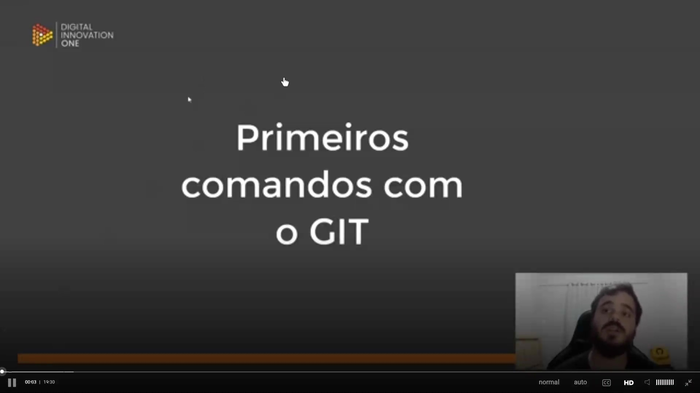
  </p>

Os objetivos principais desta etapa incluem a inicialização de um repositório, o início do rastreamento de arquivos e a criação do primeiro ponto na história do projeto, conhecido como commit.

  <p align="center">
    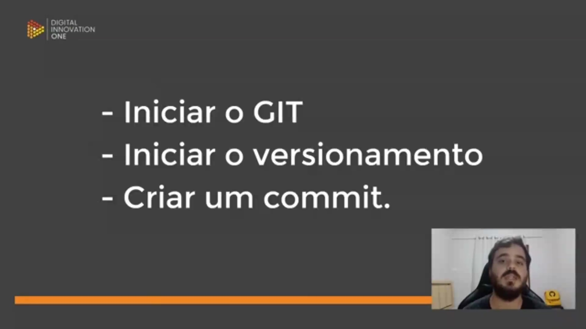
  </p>

#### Comandos Básicos de Inicialização

Para realizar essas tarefas, utilizamos três comandos essenciais. No terminal, todos os comandos do Git devem ser precedidos pela palavra `git`, indicando que estamos chamando o programa específico.

  <p align="center">
    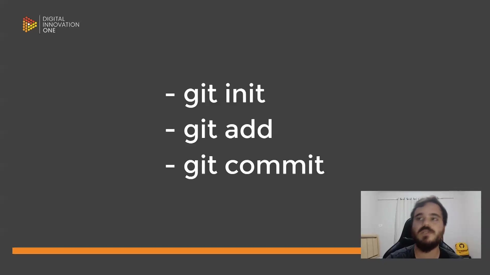
  </p>

*   **git init**: Inicializa um novo repositório Git em um diretório.
*   **git add**: Prepara os arquivos para serem incluídos no próximo commit (inicia o versionamento).
*   **git commit**: Grava as alterações no repositório de forma permanente.

#### Criando um Repositório na Prática

O processo começa com a criação de um diretório para o projeto. No exemplo, utilizamos uma pasta chamada `workspace` e criamos dentro dela o diretório `livro-receitas`.

  <p align="center">
    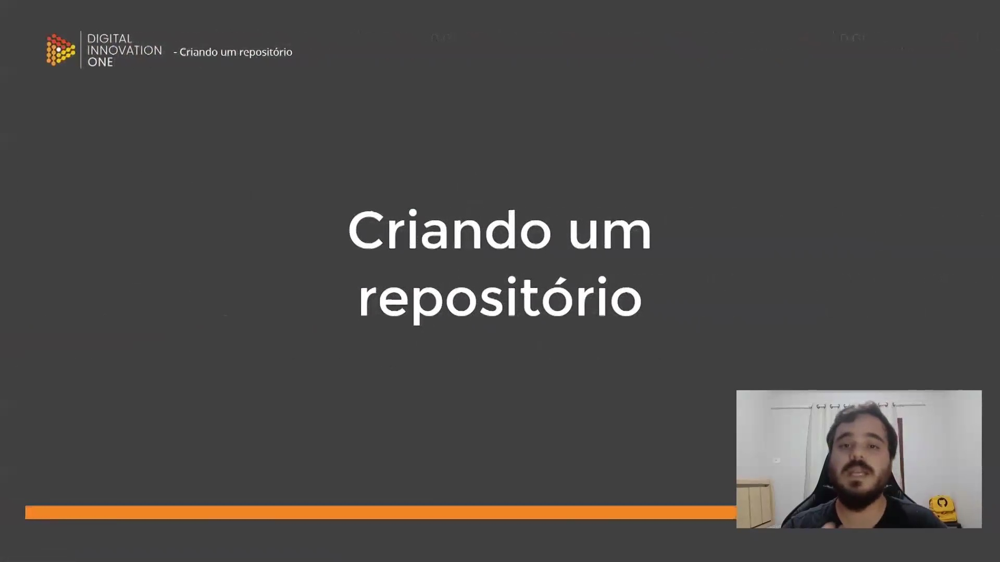
  </p>

Após navegar até a pasta do projeto via terminal, executamos o comando de inicialização.

  <p align="center">
    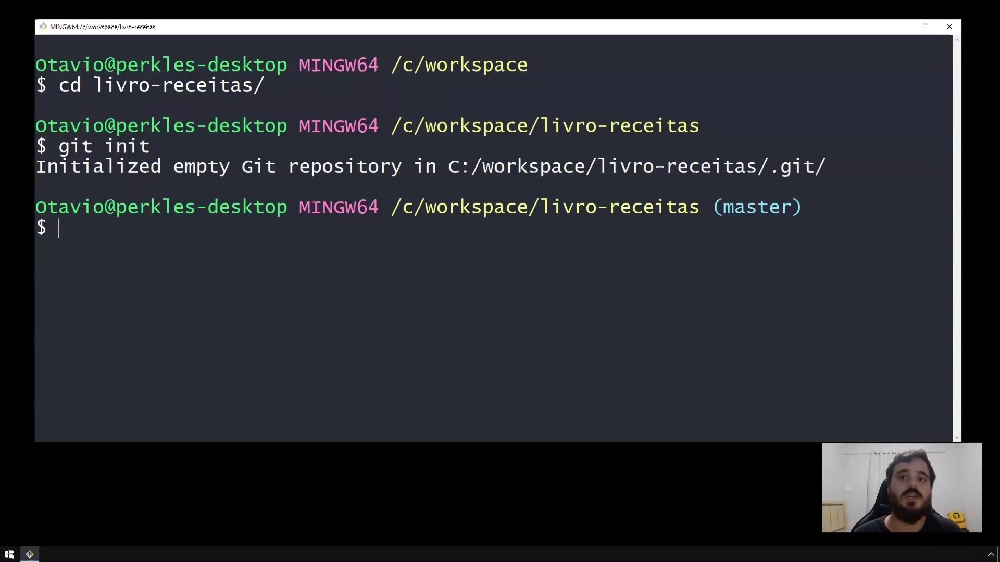
  </p>

```bash
Otavio@perkles-desktop MINGW64 /c/workspace
$ cd livro-receitas/

Otavio@perkles-desktop MINGW64 /c/workspace/livro-receitas
$ git init
Initialized empty Git repository in C:/workspace/livro-receitas/.git/
```

A execução do `git init` cria uma pasta oculta chamada `.git`. Esta pasta é o "coração" do repositório, onde o Git armazena todos os objetos, históricos e configurações gerenciais. Para visualizá-la no terminal, é necessário usar o comando `ls -a`.

  <p align="center">
    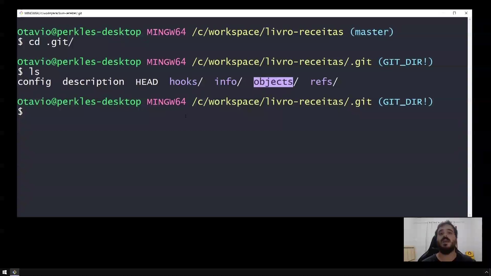
  </p>

```bash
Otavio@perkles-desktop MINGW64 /c/workspace/livro-receitas (master)
$ cd .git/

Otavio@perkles-desktop MINGW64 /c/workspace/livro-receitas/.git (GIT_DIR!)
$ ls
config  description  HEAD  hooks/  info/  objects/  refs/
```

#### Configuração de Identidade

Antes de realizar o primeiro commit, é obrigatório configurar a identidade do autor. O Git exige um nome de usuário e um e-mail para atrelar essas informações a cada commit realizado.

  <p align="center">
    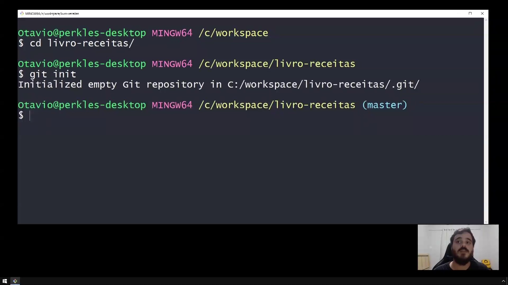
  </p>

Utilizamos o comando `git config --global` para definir essas informações globalmente no sistema.

  <p align="center">
    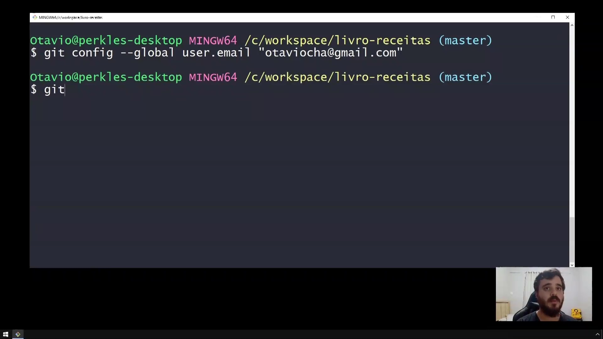
  </p>

```bash
$ git config --global user.email "otaviocha@gmail.com"
```

  <p align="center">
    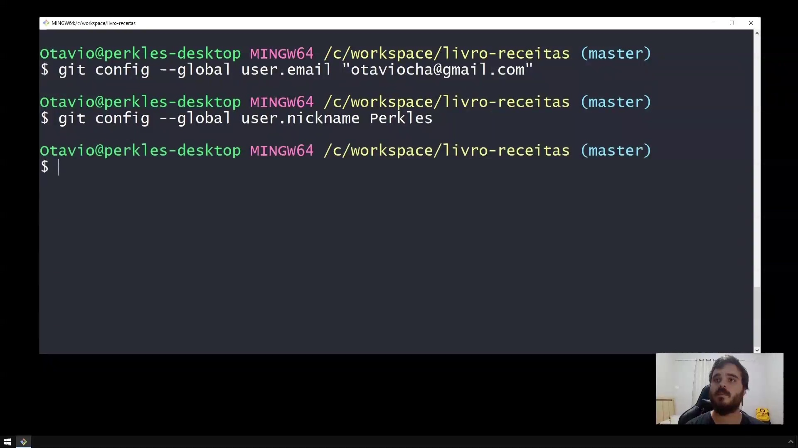
  </p>

```bash
$ git config --global user.name "Perkles"
```

> **Nota:** Na aula, houve uma menção a `user.nickname`, mas o comando correto para configurar o nome é `user.name`.

#### Introdução ao Markdown

Para o nosso primeiro arquivo, utilizamos o formato Markdown (`.md`). O Markdown é uma linguagem de marcação leve que permite estruturar textos de forma simples, sendo facilmente convertida para HTML.

  <p align="center">
    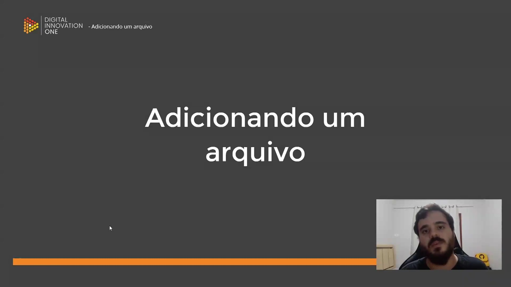
  </p>

A estrutura do Markdown utiliza símbolos intuitivos para formatação:
*   **Hashtags (#)**: Definem títulos (H1 a H6).
*   **Estrelas (**)**: Definem negrito.
*   **Underlines (_)**: Definem itálico.
*   **Sinal de menos (-)**: Cria listas não ordenadas.

  <p align="center">
    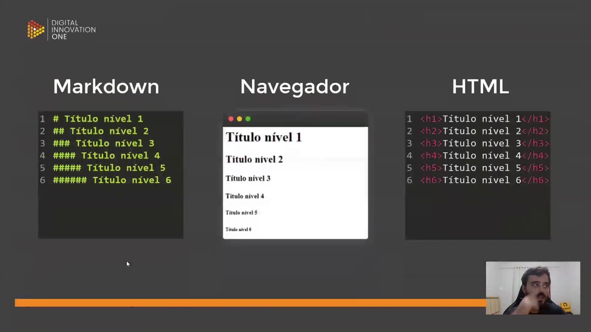
  </p>

No exemplo prático, criamos um arquivo `strogonoff.md` e utilizamos o editor Typora para estruturar a receita com títulos, listas e emojis.

  <p align="center">
    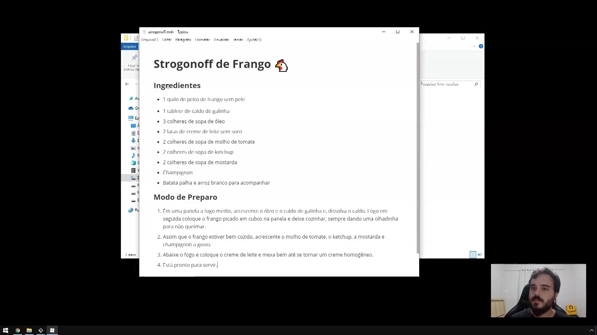
  </p>

Editores como o Typora oferecem guias de ajuda que facilitam a inserção de elementos mais complexos, como tabelas, citações e checklists.

  <p align="center">
    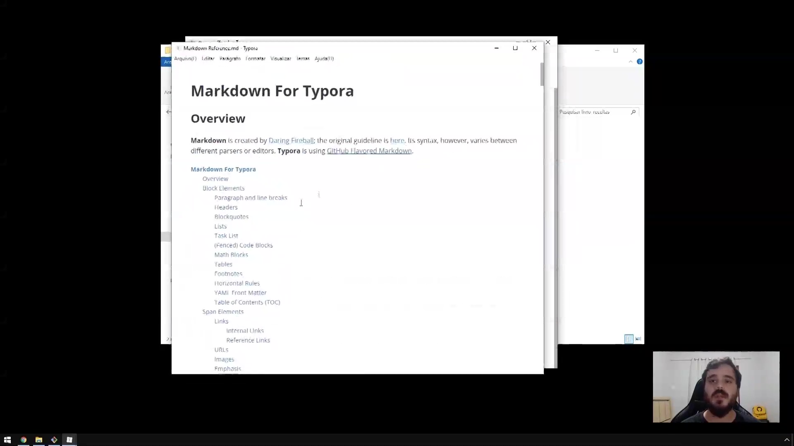
  </p>

#### O Primeiro Commit

Com o arquivo criado e salvo, voltamos ao terminal para realizar o commit. Este processo envolve dois passos: adicionar o arquivo à área de preparação (*staging area*) e efetivar o commit com uma mensagem descritiva.

  <p align="center">
    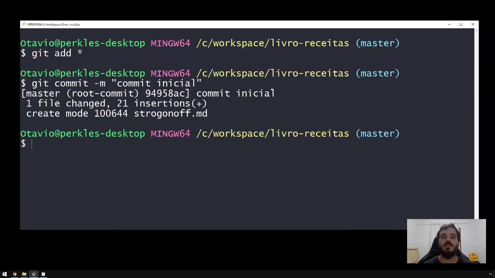
  </p>

```bash
Otavio@perkles-desktop MINGW64 /c/workspace/livro-receitas (master)
$ git add *

Otavio@perkles-desktop MINGW64 /c/workspace/livro-receitas (master)
$ git commit -m "commit inicial"
[master (root-commit) 94958ac] commit inicial
 1 file changed, 21 insertions(+)
 create mode 100644 strogonoff.md
```

Ao finalizar, o Git fornece um resumo da operação, incluindo o identificador único do commit (SHA-1 parcial) e as estatísticas de alterações no arquivo. Com isso, concluímos o ciclo básico de inicialização e versionamento.


# Parte 5 - Ciclo de vida dos arquivos no Git

## 🟩 Vídeo 08 - Passo a passo no ciclo de vida

![[bootcamp_tqi_fullstack-modulo_01-Curso_05-Video_08.webm|vid-60]]

Link do vídeo:  https://web.dio.me/track/tqi-fullstack-developer/course/introducao-ao-git-e-ao-github/learning/54cd3040-b3d1-4e91-aea3-e3b031367774?autoplay=1

Esta fonte explica o **ciclo de vida dos arquivos** e o uso da terminologia correta dentro do sistema **Git**. O conteúdo detalha a transição entre estados, diferenciando arquivos **untracked** (não rastreados) de arquivos **tracked** (rastreados), que se subdividem em **unmodified**, **modified** e **staged**. Através de uma analogia com os bastidores de um teatro, o autor descreve a **staging area** como o local de preparação antes de consolidar as mudanças em um **commit**. O texto também ensina comandos essenciais como `git status`, `git add` e `git commit`, demonstrando como eles organizam o **repositório local**. Por fim, introduz a distinção entre o ambiente de desenvolvimento na máquina do usuário e o **repositório remoto**, preparando o terreno para o uso do **GitHub**.

### Anotações

#### O Conceito de Repositório e o Início do Ciclo de Vida

A aula inicia estabelecendo a terminologia correta, diferenciando **repositório** de **diretório**. O comando `git init` é o responsável por transformar um diretório comum em um repositório Git, criando a pasta oculta `.git` e iniciando o rastreamento de arquivos. Este é o ponto de partida para entender o ciclo de vida dos arquivos.

  <p align="center">
    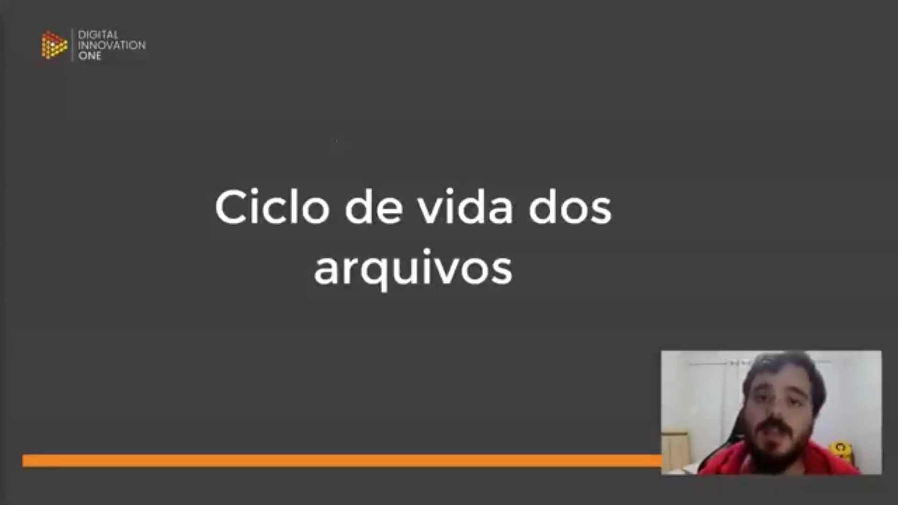
   </p>

O comando `git init` é a ação fundamental que estabelece o conceito de repositório, permitindo que o Git comece a gerenciar as versões do projeto.

  <p align="center">
    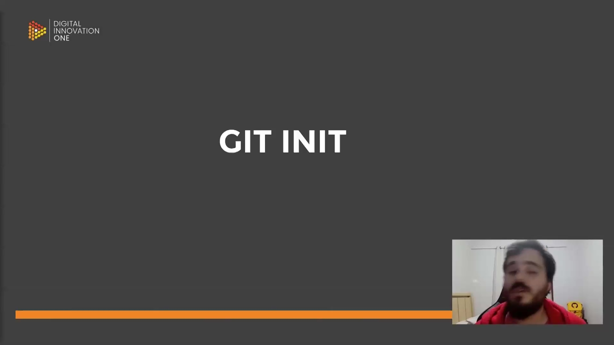
   </p>

#### Os Quatro Estados Fundamentais dos Arquivos

O Git classifica os arquivos em quatro estados principais, sendo dois grupos: **Untracked** (não rastreados) e **Tracked** (rastreados). O grupo rastreado se subdivide em **Unmodified**, **Modified** e **Staged**.

  <p align="center">
    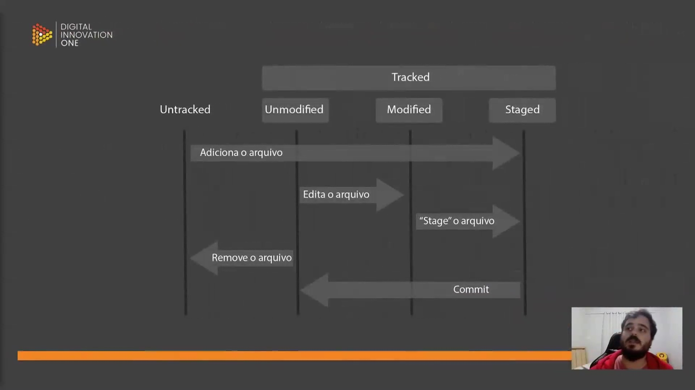
   </p>

- **Untracked:** Arquivos recém-criados que o Git ainda não monitora.
- **Unmodified:** Arquivos rastreados que não sofreram alterações desde o último *commit*.
- **Modified:** Arquivos rastreados que foram alterados.
- **Staged:** Arquivos modificados ou novos que foram selecionados para fazer parte do próximo *commit* (a "área de preparação" ou *backstage*).

#### O Fluxo de Transição e o Papel do Commit

A transição entre os estados é cíclica e controlada por comandos. Um arquivo **Untracked** passa a ser **Staged** (rastreado) ao ser adicionado.

  <p align="center">
    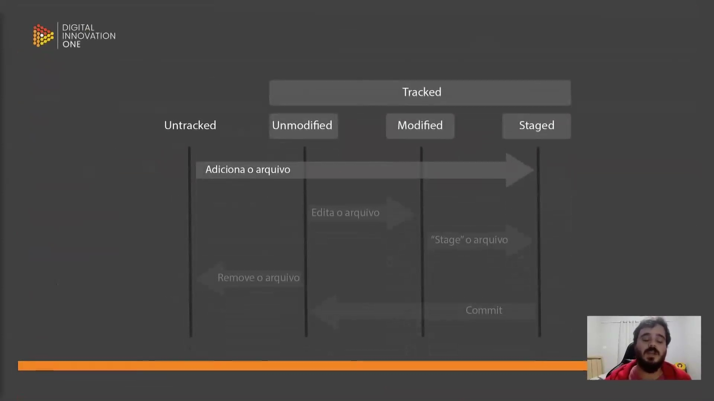
   </p>

Um arquivo **Unmodified** se torna **Modified** quando o Git detecta alterações em seu conteúdo (comparando o *checksum*).

  <p align="center">
    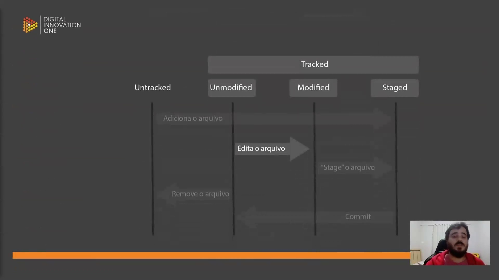
   </p>

O comando `git add` move um arquivo **Modified** para o estado **Staged**, preparando-o para o *commit*.

  <p align="center">
    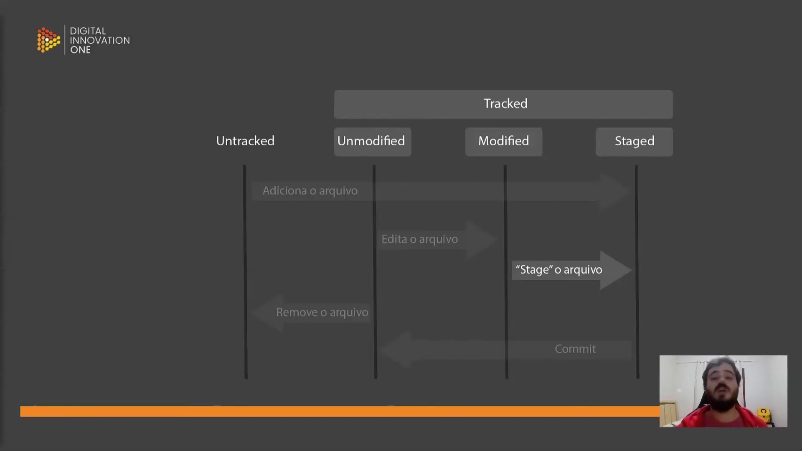
   </p>

A remoção de um arquivo **Unmodified** o move de volta para **Untracked**.

  <p align="center">
    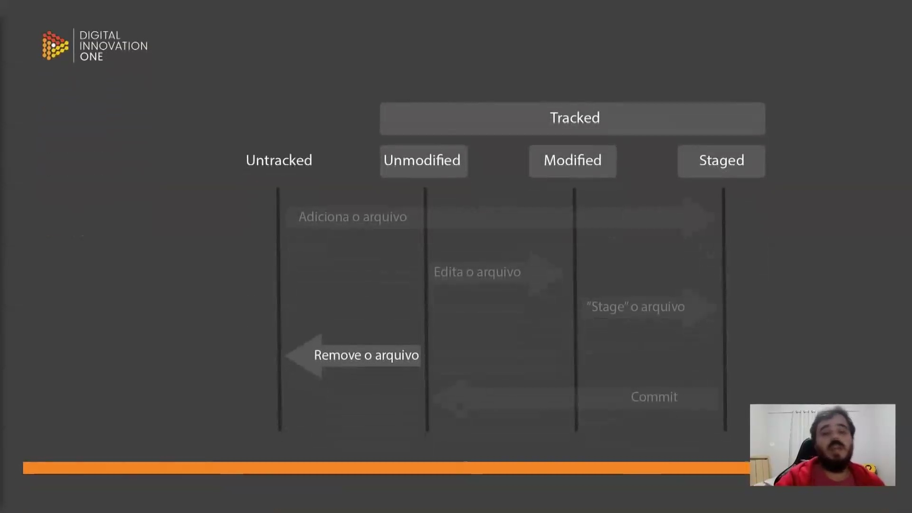
   </p>

O **Commit** é a ação que finaliza o ciclo, criando um *snapshot* (foto) do código e movendo os arquivos da área **Staged** de volta para **Unmodified**.

  <p align="center">
    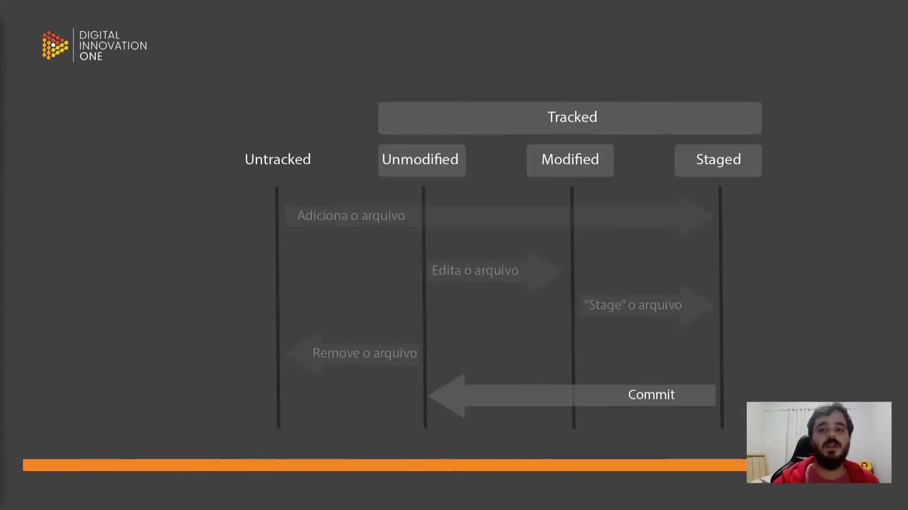
   </p>

#### Estrutura Distribuída: Local e Remoto

O Git é um sistema de controle de versão distribuído. Isso significa que ele opera em dois ambientes principais: o **Servidor** (onde fica o **Remote Repository**, como o GitHub) e o **Ambiente de Desenvolvimento** (sua máquina local).

  <p align="center">
    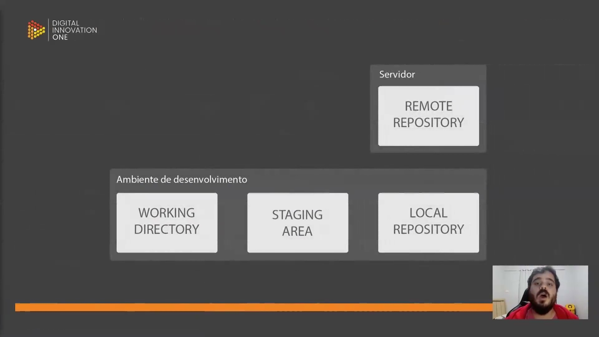
   </p>

O ambiente de desenvolvimento local é composto por três áreas: o **Working Directory** (onde você edita os arquivos), a **Staging Area** (área de preparação) e o **Local Repository** (onde os *commits* são armazenados).

  <p align="center">
    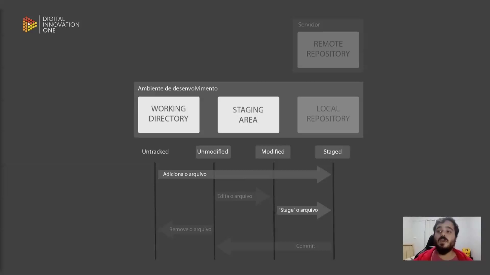
   </p>

O `git add` move do **Working Directory** para a **Staging Area**, e o `git commit` move da **Staging Area** para o **Local Repository**. O **Remote Repository** só é atualizado com comandos como `git push`.

  <p align="center">
    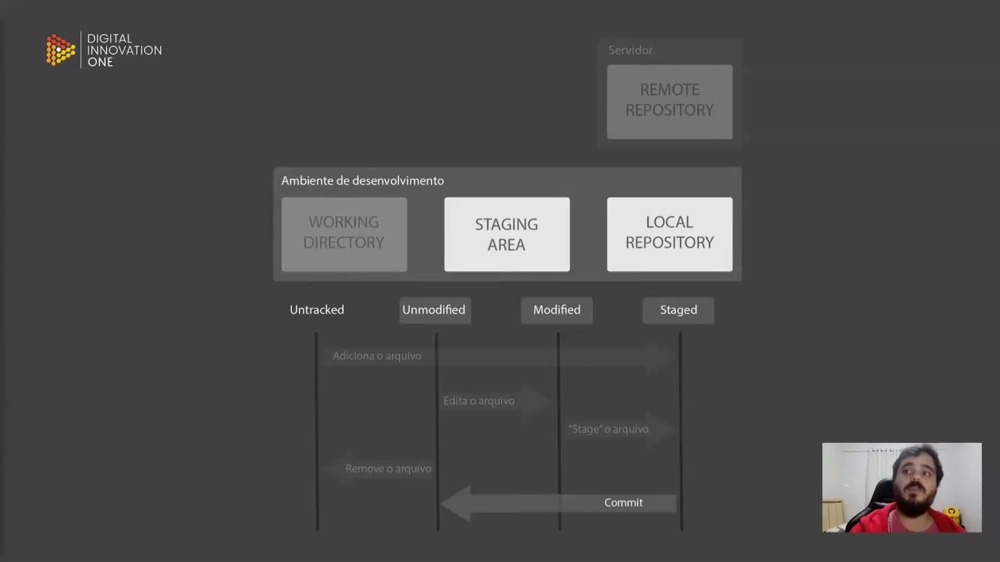
   </p>

#### Demonstração Prática: Movendo Arquivos e Pastas

A prática demonstra o ciclo de vida ao mover um arquivo rastreado (`strogonoff.md`) para uma nova pasta (`receitas`). O `git status` é a ferramenta essencial para monitorar o estado dos arquivos.

  <p align="center">
    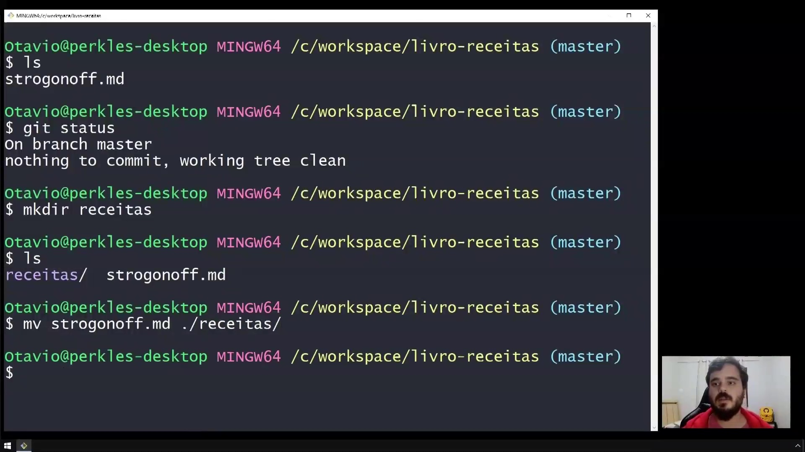
   </p>

O terminal mostra a criação da pasta e a movimentação do arquivo:

```bash
Otavio@perkles-desktop MINGW64 /c/workspace/livro-receitas (master)
$ ls
strogonoff.md

Otavio@perkles-desktop MINGW64 /c/workspace/livro-receitas (master)
$ git status
On branch master
nothing to commit, working tree clean

Otavio@perkles-desktop MINGW64 /c/workspace/livro-receitas (master)
$ mkdir receitas

Otavio@perkles-desktop MINGW64 /c/workspace/livro-receitas (master)
$ ls
receitas/  strogonoff.md

Otavio@perkles-desktop MINGW64 /c/workspace/livro-receitas (master)
$ mv strogonoff.md ./receitas/
```

Após a movimentação, o `git status` revela que o Git detectou duas mudanças: o arquivo original foi **deletado** e a nova pasta (`receitas/`) está **Untracked**.

  <p align="center">
    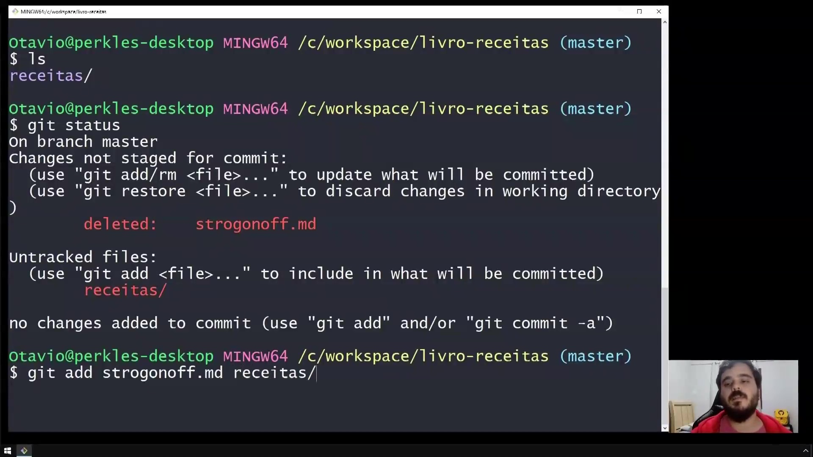
   </p>

```bash
Otavio@perkles-desktop MINGW64 /c/workspace/livro-receitas (master)
$ ls
receitas/

Otavio@perkles-desktop MINGW64 /c/workspace/livro-receitas (master)
$ git status
On branch master
Changes not staged for commit:
  (use "git add/rm <file>..." to update what will be committed)
  (use "git restore <file>..." to discard changes in working directory)

        deleted:    strogonoff.md

Untracked files:
  (use "git add <file>..." to include in what will be committed)
        receitas/

no changes added to commit (use "git add" and/or "git commit -a")

Otavio@perkles-desktop MINGW64 /c/workspace/livro-receitas (master)
$ git add strogonoff.md receitas/
```

#### Commit de Renomeação e Limpeza da Árvore

O comando `git add` é usado para mover as mudanças para a área **Staged**. O Git é inteligente o suficiente para reconhecer que a exclusão e a nova adição na pasta `receitas` representam, na verdade, uma **renomeação** do arquivo.

  <p align="center">
    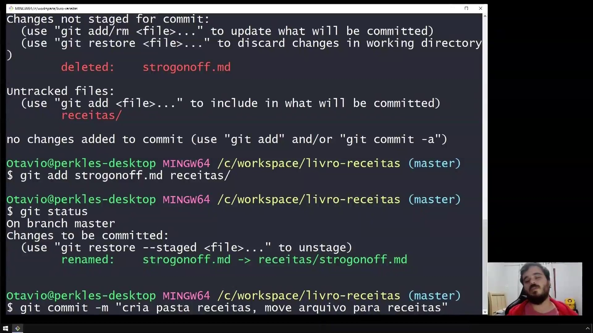
   </p>

O `git status` agora mostra a mudança como `renamed`. O `git commit` finaliza a operação.

```bash
Otavio@perkles-desktop MINGW64 /c/workspace/livro-receitas (master)
$ git add strogonoff.md receitas/

Otavio@perkles-desktop MINGW64 /c/workspace/livro-receitas (master)
$ git status
On branch master
Changes to be committed:
  (use "git restore --staged <file>..." to unstage)
        renamed:    strogonoff.md -> receitas/strogonoff.md


Otavio@perkles-desktop MINGW64 /c/workspace/livro-receitas (master)
$ git commit -m "cria pasta receitas, move arquivo para receitas"
```

A imagem a seguir mostra o resultado do *commit*, incluindo o identificador SHA-1 gerado.

  <p align="center">
    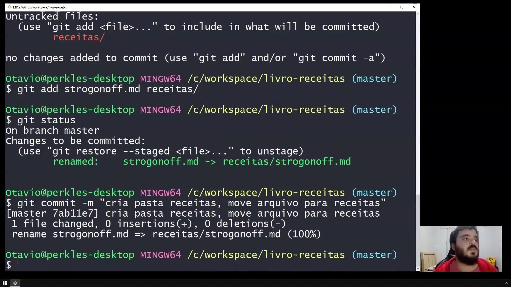
   </p>

```bash
Otavio@perkles-desktop MINGW64 /c/workspace/livro-receitas (master)
$ git commit -m "cria pasta receitas, move arquivo para receitas"
[master 7ab11e7] cria pasta receitas, move arquivo para receitas
 1 file changed, 0 insertions(+), 0 deletions(-)
 rename strogonoff.md => receitas/strogonoff.md (100%)
```

Após o *commit*, o `git status` confirma que a **working tree** está limpa, e os arquivos voltaram ao estado **Unmodified**.

  <p align="center">
    
   </p>

```bash
Otavio@perkles-desktop MINGW64 /c/workspace/livro-receitas (master)
$ git status
On branch master
nothing to commit, working tree clean
```

#### Adicionando um Novo Arquivo (README.md)

Para finalizar a prática, um novo arquivo, `README.md`, é criado para servir como índice do livro de receitas.

  <p align="center">
    
   </p>

O `git status` confirma que o `README.md` está **Untracked**, pois é um arquivo novo e diferente do último *snapshot*.

```bash
Otavio@perkles-desktop MINGW64 /c/workspace/livro-receitas (master)
$ ls
receitas/

Otavio@perkles-desktop MINGW64 /c/workspace/livro-receitas (master)
$ echo > README.md

Otavio@perkles-desktop MINGW64 /c/workspace/livro-receitas (master)
$ ls
README.md  receitas/

Otavio@perkles-desktop MINGW64 /c/workspace/livro-receitas (master)
$ git status
On branch master
Untracked files:
  (use "git add <file>..." to include in what will be committed)
        README.md

nothing added to commit but untracked files present (use "git add" to track)
```

O arquivo é editado (visualização da edição no editor de texto).

  <p align="center">
    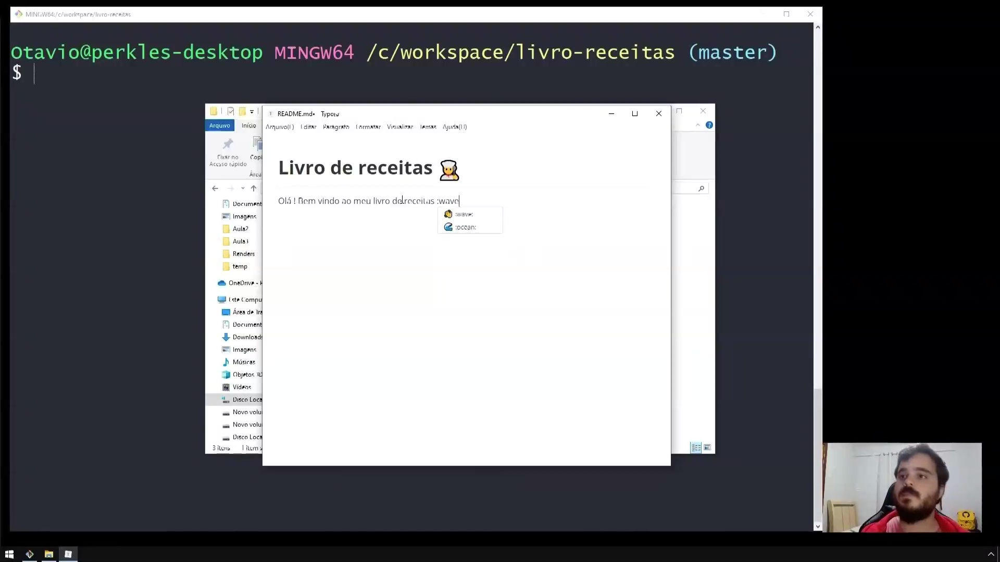
   </p>

A tela do terminal é limpa, e o arquivo permanece **Untracked** até o `git add`.

  <p align="center">
    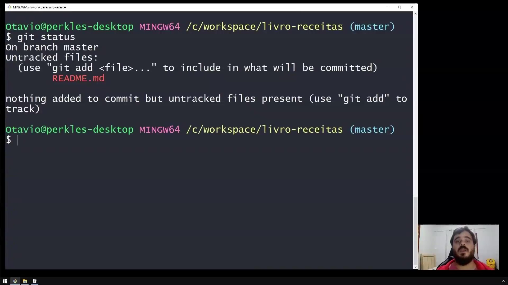
   </p>

```bash
Otavio@perkles-desktop MINGW64 /c/workspace/livro-receitas (master)
$ git status
On branch master
Untracked files:
  (use "git add <file>..." to include in what will be committed)
        README.md

nothing added to commit but untracked files present (use "git add" to track)
```

O comando `git add *` (ou `git add .`) é usado para adicionar todas as modificações pendentes ao **Staged**.

  <p align="center">
    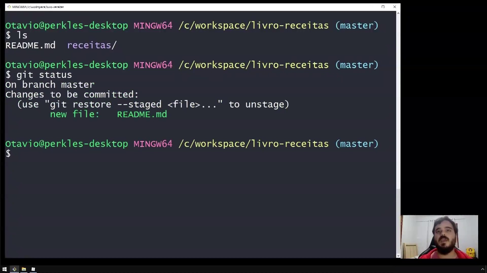
   </p>

O `git status` final confirma que o novo arquivo está pronto para ser comitado, completando o ciclo de vida dos arquivos no Git.

```bash
Otavio@perkles-desktop MINGW64 /c/workspace/livro-receitas (master)
$ ls
README.md  receitas/

Otavio@perkles-desktop MINGW64 /c/workspace/livro-receitas (master)
$ git status
On branch master
Changes to be committed:
  (use "git restore --staged <file>..." to unstage)
        new file:   README.md
```


# Parte 6 - Introdução ao GitHub

## 🟩 Vídeo 09 - Trabalhando com o GitHub


Link do vídeo:  https://web.dio.me/track/tqi-fullstack-developer/course/introducao-ao-git-e-ao-github/learning/00c82124-1594-49e8-9f82-4d8c85aa5a48?autoplay=1


# Parte 7 - Resolvendo conflitos

## 🟩 Vídeo 10 - Como os conflitos acontecem no GitHub e como resolvê-los


Link do vídeo:  


##  Materiais de Apoio


# Certificado: 

- Link na plataforma: 
- Certificado em pdf: 
