## Instrutor

- Renan Johannsen de Paula (Software Engineer Lead)
- Contato Linkedin: / [renanjpaula](https://www.linkedin.com/in/renanjpaula/)

# Parte 1 - Introdução ao curso de HTML

## 🟩 Vídeo 01 - Estrutura básica

![[bootcamp_tqi_fullstack-modulo_02-Video_01.webm|vid-60]]

Link do vídeo:  https://web.dio.me/track/tqi-fullstack-developer/course/introducao-criacao-de-websites-com-html5-e-css3/learning/462f831d-5fdf-485e-bf07-1d391eb94ac8?autoplay=1

Esta fonte consiste na **Aula introdutória** ministrada por um engenheiro de software focada no aprendizado de **HTML5 e CSS3**. O instrutor apresenta o contexto histórico do HTML, destacando sua criação por **Tim Berners-Lee** e a evolução da linguagem até sua estrutura contemporânea. A explicação detalha a anatomia de um **elemento HTML**, abordando desde o uso de tags e atributos até a organização fundamental de um documento. O conteúdo ensina a configurar o **esqueleto básico de uma página**, incluindo as seções de metadados e o corpo do site. Por fim, o autor demonstra a aplicação prática desses conceitos iniciais através da **criação de um site pessoal** simples em um editor de código.

### Anotações

#### Introdução ao HTML5 e CSS3

A aula se inicia com a apresentação do curso de **Introdução ao HTML5 e CSS3**, focado inicialmente no HTML5. O instrutor, Lucas Vilaboim, Front-End Engineer no LuizaLabs, estabelece o escopo do módulo.

  <p align="center">
    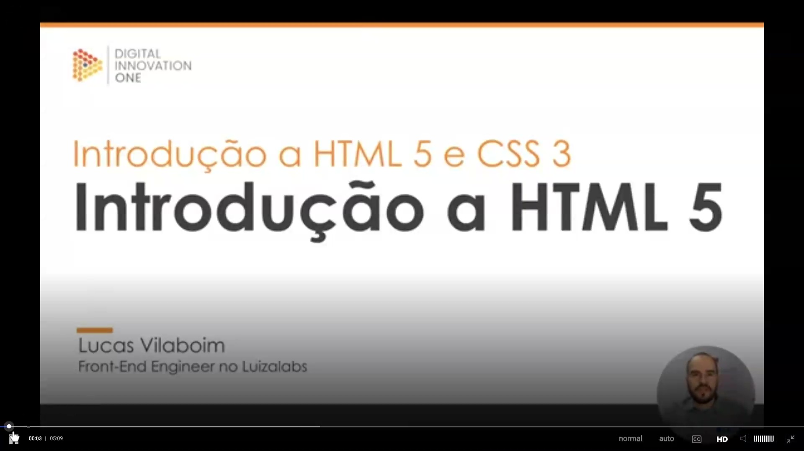
   </p>

#### Objetivos e Requisitos do Curso

Os objetivos centrais da aula são:
1. Conhecer a história e a **estrutura básica** do HTML.
2. Entender o conceito de **semântica** e sua importância.
3. Conhecer os principais elementos do HTML.

  <p align="center">
    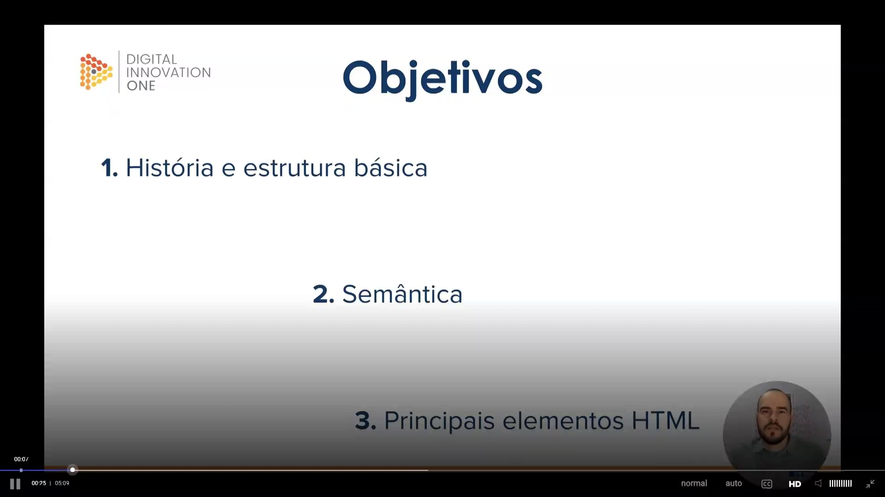
   </p>

Para acompanhar o curso, os **Requisitos Básicos** são um editor de texto (o instrutor utiliza o **VS Code**) e um navegador de internet (o instrutor utiliza o **Chrome**).

  <p align="center">
    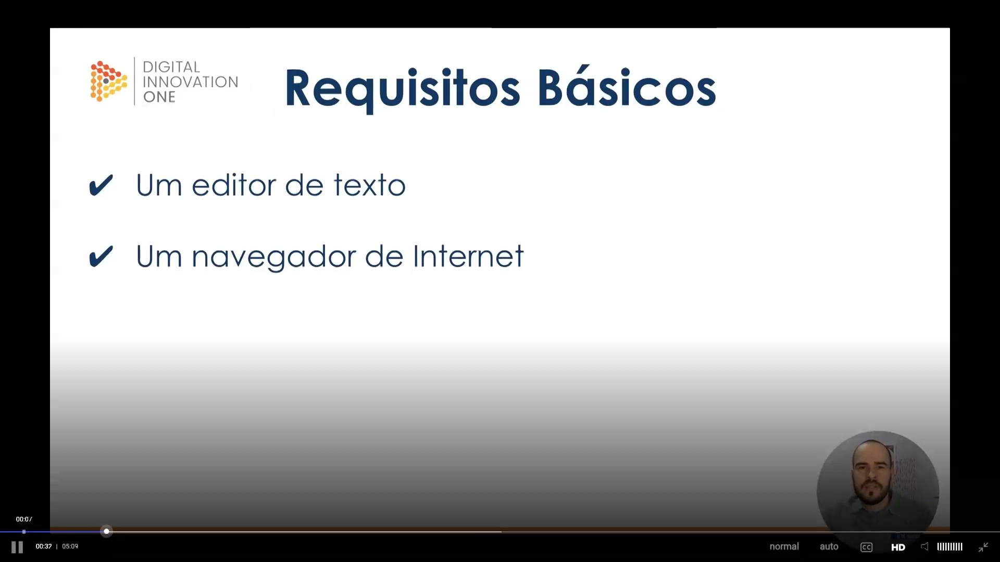
   </p>

#### História e Evolução do HTML

O HTML foi criado em 1991 por **Tim Berners-Lee** no CERN, com o objetivo de compartilhar documentos. A linguagem evoluiu ao longo dos anos, com a versão mais recente, o **HTML5**, sendo lançada em 2014.

  <p align="center">
    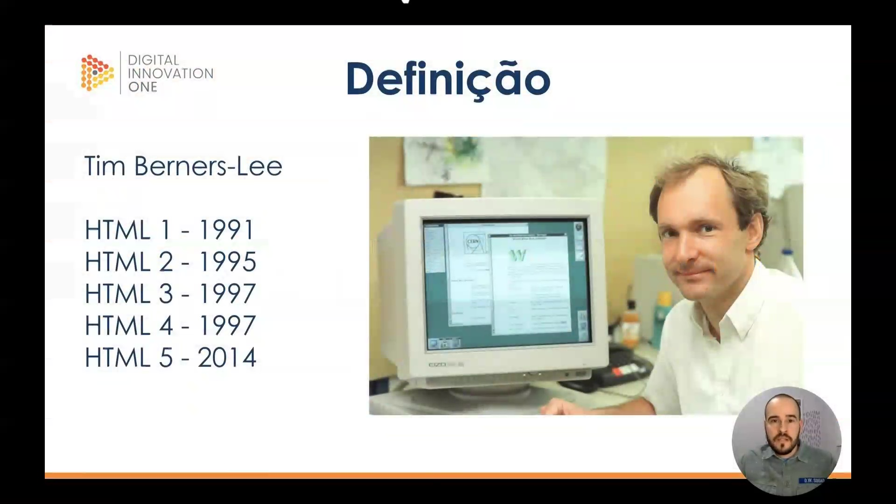
   </p>

#### O Elemento HTML: A Base da Estrutura

O **elemento HTML** é a unidade fundamental de um documento. Ele é composto por uma **tag de abertura**, que pode conter **atributos** (modificando funcionalidade ou aparência), o **conteúdo** do elemento e, por fim, a **tag de fechamento**.

O exemplo abaixo ilustra a estrutura de um elemento `<h1>` (cabeçalho de nível 1), que possui um atributo `class`.

  <p align="center">
    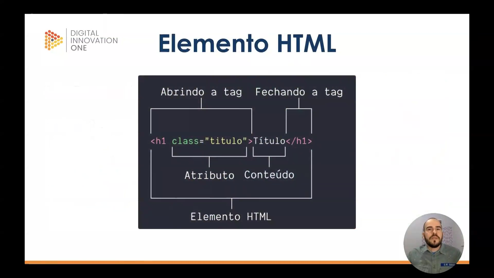
   </p>

```html
<h1 class="titulo">Título</h1>
```

#### Estrutura Básica de um Documento HTML

A estrutura básica de um documento HTML é concisa e essencial para o navegador interpretar o conteúdo corretamente.

  <p align="center">
    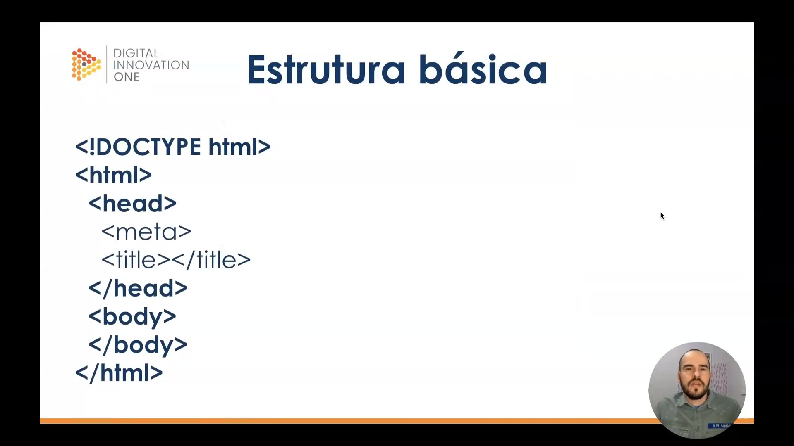
   </p>

- **`<!DOCTYPE html>`**: Não é um elemento HTML, mas uma declaração que informa ao navegador a versão do HTML que está sendo utilizada (HTML5).
- **`<html>`**: O elemento raiz que engloba todo o conteúdo do documento.
- **`<head>`**: Contém **meta informações** sobre o documento, necessárias para o navegador e buscadores (como o `charset` e o `<title>`).
- **`<body>`**: Contém o **conteúdo visível** da página para o usuário.

#### Demonstração Prática: Criando a Estrutura

O instrutor demonstra a criação da estrutura básica em um arquivo `index.html` no VS Code, incluindo a definição do `charset` para **UTF-8** e a tag `<title>` para o título da aba do navegador. O objetivo é criar um site pessoal.

  <p align="center">
    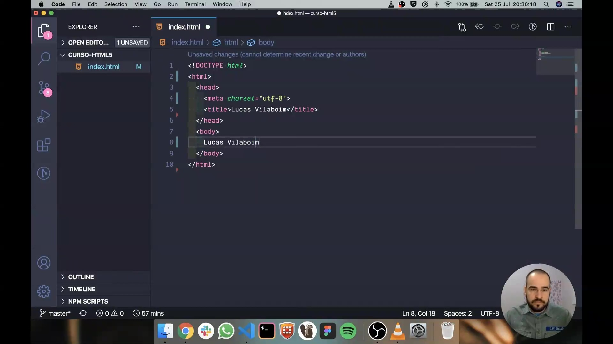
   </p>

```html
<!DOCTYPE html>
<html>
<head>
    <meta charset="UTF-8">
    <title>Lucas Vilaboim</title>
</head>
<body>
    Lucas Vilaboim
</body>
</html>
```

O código acima representa a estrutura mínima, onde o nome do instrutor é inserido diretamente no `<body>` para visualização inicial.

#### Resultado no Navegador

Ao salvar o arquivo e abri-lo no navegador, o conteúdo do `<body>` (`Lucas Vilaboim`) é exibido na tela, e o conteúdo da tag `<title>` (`Lucas Vilaboim`) é exibido na aba do navegador.

  <p align="center">
    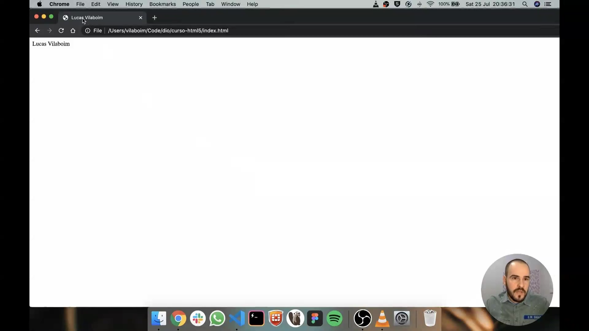
   </p>

A aula conclui reforçando que essa é a estrutura básica a partir da qual o site será enriquecido nas próximas aulas, com foco no conceito de **semântica**.


## 🟩 02 - Material de apoio


Link: https://web.dio.me/track/tqi-fullstack-developer/course/introducao-criacao-de-websites-com-html5-e-css3/learning/f8acdea7-2ee8-49a8-8b96-7200e309fc3a?autoplay=1


### Anotações

#### HTML5

##### Definição e estrutura básica

Em 1991 Tim Berners-Lee criou essa linguagem de marcação para melhorar a comunicação entre ele e seus colegas de trabalho no CERN. Desde então já surgiram 5 versões e o HTML se tornou a base da web.

Com o HTML definimos o significado e a estrutura do conteúdo da web. Além de texto, nossas páginas precisam de imagens, vídeos e vários outros formatos — para isso temos os elementos HTML.

Um elemento HTML é formado pela tag de abertura e seus atributos, o conteúdo e uma tag de fechamento. Mais à frente veremos que existem elementos que não têm tag de fechamento.

Com esses elementos podemos agrupar tipos de conteúdo, alterar tamanho e forma de fontes e adicionar diferentes mídias à nossa página na web.

A primeira linha do documento deve ser o `<!DOCTYPE html>`. Apesar de parecer um elemento HTML, ela apenas diz ao navegador que ele está lidando com um arquivo do tipo HTML5.

##### Estrutura básica

```html
<html>
  <!-- raiz do documento, define o idioma com atributo lang -->
  <head>
    <!-- metadados, charset UTF-8, scripts, estilos e título -->
  </head>
  <body>
    <!-- conteúdo visível: textos, imagens, vídeos -->
  </body>
</html>
```

---

#### Prática: Estrutura inicial

Vamos construir um site pessoal com a estrutura básica:

1. Criar o arquivo `index.html`.
2. Adicionar `<!DOCTYPE html>`, `<html>`, `<head>` e `<body>`.
3. Dentro do `<head>`, adicionar:
   - `<meta charset="UTF-8">`
   - `<title>` com seu nome.
4. Dentro do `<body>`, escrever seu nome para visualizar no navegador.

---

#### Semântica

Durante muitos anos o elemento padrão era a `<div>`, gerando a "sopa de divs". Em 2014, com o HTML5, vieram melhorias de performance, acessibilidade e semântica.

A semântica permite descrever melhor o conteúdo. Agora um bloco de texto pode ser um `<article>`, por exemplo.

##### Elementos semânticos

- `<section>`: seção genérica de conteúdo.
- `<header>`: cabeçalho da página ou seção.
- `<article>`: conteúdo independente e relevante (ex.: post de blog).
- `<aside>`: conteúdo relacionado ao principal (ex.: biografia, publicidade).
- `<footer>`: rodapé do conteúdo ou da página.
- `<h1>` a `<h6>`: títulos hierárquicos (use apenas um `<h1>` por página).

---

#### Prática: Estrutura semântica

1. Criar `<header>` com `<h1>` para o nome.
2. Criar `<section>` com `<header>` e `<h2>` para lista de postagens.
3. Criar `<article>` com `<header>` e `<h3>` para cada postagem.
4. Criar `<footer>` com informações de contato.

---

#### Textos e Links

- `<p>`: representa parágrafos, pode conter diversos tipos de conteúdo.
- `<a>`: representa hiperlinks.

##### Atributos importantes

- `href`: destino do link (página, e-mail, telefone).
- `target="_blank"`: abre o link em nova aba.

---

#### Prática: Texto e hiperlinks

1. Adicionar `<p>` com texto fictício (ex.: do site lipsum.com).
2. Adicionar `<a>` com `href` para perfil no LinkedIn e `target="_blank"`.
3. Adicionar link para e-mail:

```html
<a href="mailto:lucas@vilaboim.com" target="_blank">lucas@vilaboim.com</a>
```

---

#### Imagens

- ``: representa imagens (sem tag de fechamento).
- `src`: caminho da imagem (obrigatório).
- `alt`: descrição da imagem (recomendado para acessibilidade).

---

#### Prática: Inserir imagens

1. Colocar imagens na pasta do projeto.
2. No `<header>` principal, antes do `<h1>`:

```html

```

3. No `<header>` do `<article>`, após o `<h3>`:

```html

```

---

#### Listas

- `<ul>`: lista não ordenada (pontos, círculos).
- `<ol>`: lista ordenada (números, letras).
- `<li>`: item da lista, pode conter vários tipos de conteúdo.

---

#### Prática: Lista de contatos

1. Criar `<ul>` dentro do `<footer>`.
2. Adicionar `<li>` com `<a>` para redes sociais:

```html
<ul>
  <li><a href="https://linkedin.com/in/seuperfil" target="_blank">LinkedIn</a></li>
</ul>
```


# Parte 2 - Entendendo o que é semântica

## 🟩 Vídeo 02 - Semântica - Parte 1

![[bootcamp_tqi_fullstack-modulo_02-Video_02.webm|vid-60]]

Link do vídeo:  https://web.dio.me/track/tqi-fullstack-developer/course/introducao-criacao-de-websites-com-html5-e-css3/learning/3922c73b-3452-467d-80f3-b11eb9cb911e?autoplay=1

Esta fonte discute a transição fundamental do uso genérico de **divs** para a implementação de **HTML semântico** a partir da versão 5 da linguagem. O autor explica que elementos modernos como **header**, **section** e **footer** foram criados para fornecer uma estrutura lógica e clara que define o papel de cada parte do conteúdo. O texto também detalha a importância das **tags de título**, que variam de **H1 a H6**, como ferramentas essenciais para estabelecer uma **hierarquia de informações** em uma página web. É ressaltada a diretriz técnica de manter apenas um **H1** por documento para garantir a organização correta. Por fim, o conteúdo propõe uma **atividade prática** para aplicar esses novos conceitos na evolução de um projeto de codificação anterior.


## 🟩 Vídeo 03- Semântica - Parte 2

![[bootcamp_tqi_fullstack-modulo_02-Video_03.webm|vid-60]]

Link do vídeo: https://web.dio.me/track/tqi-fullstack-developer/course/introducao-criacao-de-websites-com-html5-e-css3/learning/cd186102-3c5e-4b94-a631-0071076d40a6?autoplay=1

Esta fonte consiste em uma transcrição de áudio que ensina como **estruturar uma página web** utilizando a semântica do **HTML5**. O conteúdo demonstra a organização hierárquica de um site através da implementação de **cabeçalhos, seções e artigos** específicos. O instrutor explica a importância de utilizar **diferentes níveis de títulos**, do H1 ao H3, para definir a relevância de cada informação. Além disso, o material detalha a inclusão de um **rodapé** destinado a futuras informações de contato. Por fim, o tutorial ressalta como o **navegador interpreta visualmente** essas tags antes de qualquer estilização personalizada.

### Anotações

#### Evolução da Estrutura do Site com Elementos Semânticos

Nesta aula, o foco é evoluir a estrutura de um site HTML adicionando elementos semânticos que organizam o conteúdo de forma hierárquica e significativa. O instrutor Lucas Vilaboim demonstra como construir uma página web utilizando as tags apropriadas do HTML5.

#### Adicionando o Cabeçalho Principal da Página

O primeiro passo é adicionar um elemento `<header>` que representa o cabeçalho principal da página. Dentro deste header, é inserido um `<h1>` com o nome do autor, que funciona como o título principal do site. É importante destacar que deve existir apenas um `<h1>` por página, representando o título mais importante do conteúdo.

<p align="center">
  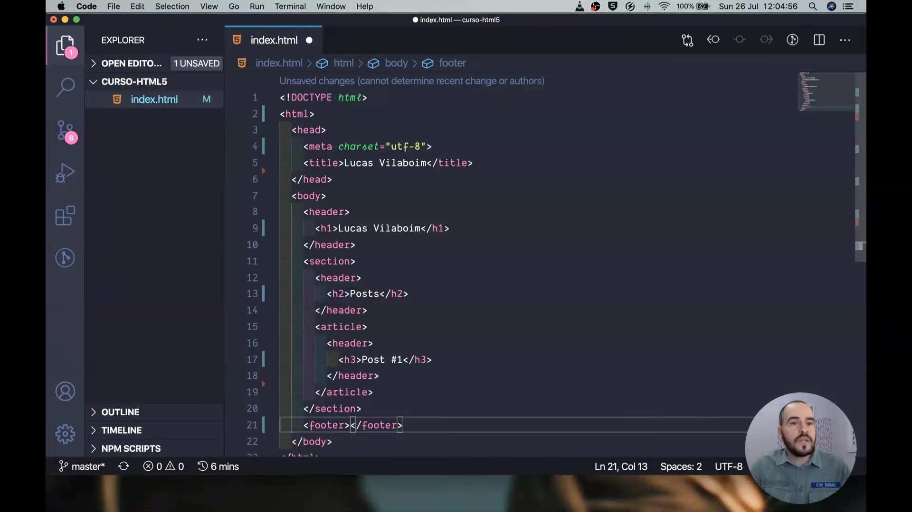
</p>

```html
<!DOCTYPE html>
<html>
  <head>
    <meta charset="utf-8">
    <title>Lucas Vilaboim</title>
  </head>
  <body>
    <header>
      <h1>Lucas Vilaboim</h1>
    </header>
    <section>
      <header>
        <h2>Posts</h2>
      </header>
      <article>
        <header>
          <h3>Post #1</h3>
        </header>
      </article>
    </section>
    <footer></footer>
  </body>
</html>
```

A estrutura mostra claramente a hierarquia dos elementos: o `<header>` principal contém o `<h1>`, seguido por uma `<section>` que agrupa o conteúdo de posts, e um `<footer>` ao final.

#### Criando a Seção de Conteúdo

Após o cabeçalho principal, é criada uma seção de conteúdo usando a tag `<section>`, que é um elemento genérico para agrupar conteúdo relacionado. Dentro desta section, adiciona-se outro `<header>` contendo um `<h2>` com o texto "Posts", indicando que esta seção destina-se à listagem de postagens.

Esta abordagem demonstra que é possível ter múltiplos elementos `<header>` em uma página, cada um contextualizando diferentes seções do conteúdo. A hierarquia de títulos (`h1`, `h2`, `h3`) mantém a estrutura semântica adequada.

#### Adicionando Articles e Estrutura de Posts

Dentro da `<section>`, é inserido um elemento `<article>`, que representa um conteúdo independente e autocontido. Cada article possui seu próprio `<header>` contendo um `<h3>` com o título do post (por exemplo, "Post #1").

A utilização de `<article>` é apropriada para posts, artigos, notícias ou qualquer conteúdo que faça sentido de forma independente. A estrutura hierárquica dos headings (`h1` → `h2` → `h3`) mantém a semântica e acessibilidade do documento.

#### Adicionando o Rodapé

Por último, fora da `<section>`, é adicionado um elemento `<footer>` que representará as informações de contato e outros dados complementares da página. O instrutor menciona que este conteúdo será desenvolvido mais adiante.

O `<footer>` é um elemento semântico que geralmente contém informações sobre o autor, links de navegação secundários, informações de copyright ou dados de contato.

#### Recapitulação da Estrutura HTML

O instrutor faz uma recapitulação completa da estrutura criada:

- **Header principal**: contém o `<h1>` único da página com o título do conteúdo
- **Section**: representa a lista de posts com seu próprio header e `<h2>`
- **Article**: dentro da section, contém outro header com `<h3>` para o nome do post
- **Footer**: elemento para representar a lista de contatos

Esta organização segue as boas práticas de HTML semântico, facilitando a compreensão do conteúdo tanto para desenvolvedores quanto para tecnologias assistivas.

#### Visualização no Navegador


<p align="center">
  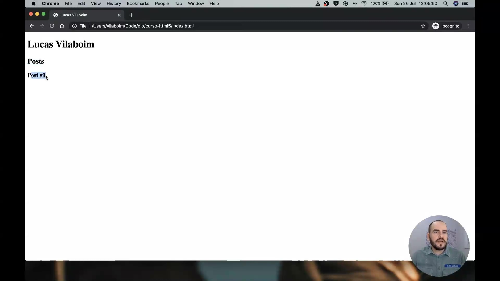
</p>

O instrutor mostra como a página é renderizada no navegador, destacando que o próprio navegador aplica estilos diferentes para cada tamanho de título (`h1`, `h2`, `h3`). Estes estilos padrão podem ser personalizados posteriormente com CSS.

A hierarquia visual criada automaticamente pelo navegador ajuda a entender a estrutura do documento, com o `<h1>` em tamanho maior, seguido pelo `<h2>` e `<h3>` em tamanhos progressivamente menores.

#### Próximos Passos

O instrutor conclui mencionando que na próxima aula serão abordados os tópicos de **textos e links**, expandindo ainda mais as possibilidades de estruturação e interatividade do conteúdo HTML.

# Parte 3 - Como usar textos e links em HTML

## 🟩 Vídeo 04 - Tags para textos

![[bootcamp_tqi_fullstack-modulo_02-Video_04.webm|vid-60]]

Link do vídeo:  https://web.dio.me/track/tqi-fullstack-developer/course/introducao-criacao-de-websites-com-html5-e-css3/learning/e48e8a0f-5940-4cdd-9923-979c31c241f7?autoplay=1

O áudio apresenta os fundamentos da **estruturação de documentos na web**, destacando que o compartilhamento de informações textuais permanece como o pilar central da internet. O conteúdo detalha como os **títulos de hierarquia H1 a H6** organizam visualmente as seções de uma página para facilitar a navegação. Para o desenvolvimento de conteúdos mais extensos, a fonte descreve a importância fundamental da **tag de parágrafo**, conhecida como elemento P. Além de organizar blocos de texto, essa funcionalidade é versátil por permitir a inclusão de **mídias diversas**, como imagens, códigos e vídeos. Assim, a explicação reforça que a evolução tecnológica manteve a **essência do HTML** na organização lógica de documentos digitais.


## 🟩 Vídeo 05 - Tags para links

![[bootcamp_tqi_fullstack-modulo_02-Video_05.webm|vid-60]]

Link do vídeo: https://web.dio.me/track/tqi-fullstack-developer/course/introducao-criacao-de-websites-com-html5-e-css3/learning/7b6afe7e-d962-4241-bf47-d76ed6935347?autoplay=1

O vídeo explica o funcionamento da **tag HTML de âncora**, essencial para a conectividade e navegação entre diferentes páginas da rede. O autor destaca o atributo **href**, que define o destino do link, podendo direcionar o usuário para **sites externos**, endereços de **e-mail** ou números de **telefone**. Além disso, é abordado o uso do atributo **target** com o valor **_blank**, permitindo que o conteúdo seja acessado em uma **nova aba** do navegador. A fonte também orienta sobre a aplicação prática desses elementos em **postagens de blog** ou exercícios de codificação. No geral, as instruções detalham como criar **hiperlinks funcionais** e dinâmicos para melhorar a experiência do usuário na web.

### Anotações

#### O Elemento Âncora (A) e sua Importância na Web

O elemento `<a>` (âncora) é um componente extremamente necessário e interessante na web, pois é responsável por interligar diversos conteúdos. Este elemento funciona como uma ponte ou portal entre páginas, sites e diferentes tipos de recursos na internet.

#### Principais Atributos do Elemento A

<p align="center">
  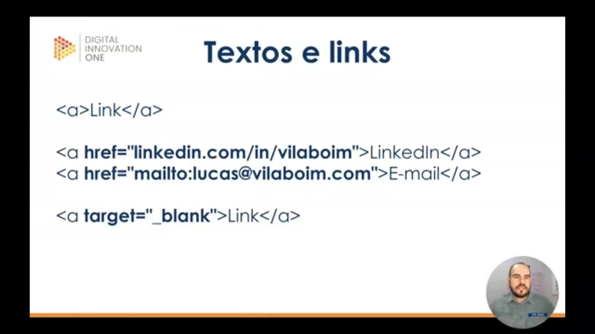
</p>

```html
<a>Link</a>

<a href="linkedin.com/in/vilaboim">LinkedIn</a>
<a href="mailto:lucas@vilaboim.com">E-mail</a>

<a target="_blank">Link</a>
```

O elemento `<a>` possui diversos atributos, mas a aula foca nos dois principais: **href** e **target**.

#### O Atributo href (Hyperlink Reference)

O atributo `href` é o hiperlink que indica para onde a âncora está apontando. Ele pode referenciar:

- **Páginas internas**: páginas dentro do próprio site
- **Sites externos**: endereços de outros sites na web
- **E-mails**: usando o prefixo `mailto:` antes do endereço de email
- **Telefones**: usando o prefixo `tel:` antes do número

Exemplos práticos mostrados:
- `href="linkedin.com/in/vilaboim"` - direciona para um perfil do LinkedIn
- `href="mailto:lucas@vilaboim.com"` - abre o cliente de e-mail padrão com o destinatário já preenchido

#### O Atributo target

O atributo `target` serve para indicar como o link será aberto. O valor apresentado na aula é `_blank`, que instrui o navegador a abrir o link em uma **nova aba**, mantendo a página original aberta.

Esta funcionalidade é especialmente útil quando você deseja que o usuário explore um link externo sem perder a navegação atual no seu site.

#### Aplicação Prática

Para o exercício proposto, será adicionado texto a uma postagem com diversos links incorporados, demonstrando na prática como o elemento `<a>` interliga conteúdos e cria a navegação característica da web.

## 🟩 Vídeo 06 - Exercício prático

![[bootcamp_tqi_fullstack-modulo_02-Video_06.webm|vid-60]]

Link do vídeo: https://web.dio.me/track/tqi-fullstack-developer/course/introducao-criacao-de-websites-com-html5-e-css3/learning/b8233675-5187-40d6-b60c-c6a36ddc18a8?autoplay=1

O vídeo fornece um tutorial técnico sobre a estruturação de elementos básicos em uma página **HTML**. O instrutor demonstra inicialmente como inserir **parágrafos de texto** fictício dentro de um artigo para preencher o conteúdo visual. Em seguida, o foco muda para a criação de **hiperlinks**, detalhando como configurar o atributo para que as páginas abram em **novas abas** do navegador. O material também explora funcionalidades específicas de links, como os prefixos necessários para disparar o envio de **e-mails** e a realização de **chamadas telefônicas**. Por fim, o conteúdo antecipa que as próximas lições abordarão a manipulação de imagens para continuar a evolução do projeto web.

### Anotações

#### Adicionando Texto ao Post com o Elemento P

O primeiro passo para trabalhar com textos na página é adicionar conteúdo aos posts. Dentro do elemento `<article>`, logo abaixo do `<header>`, é inserido um elemento `<p>` (parágrafo). Para este exemplo, o instrutor utiliza um texto fictício do site **lipsum.com**, que é um gerador de texto placeholder comumente usado em desenvolvimento web.

Após colar o texto dentro do elemento `<p>`, ele já aparece renderizado no navegador, demonstrando como o HTML processa e exibe automaticamente o conteúdo textual.

#### Criando um Link para Perfil no LinkedIn

<p align="center">
  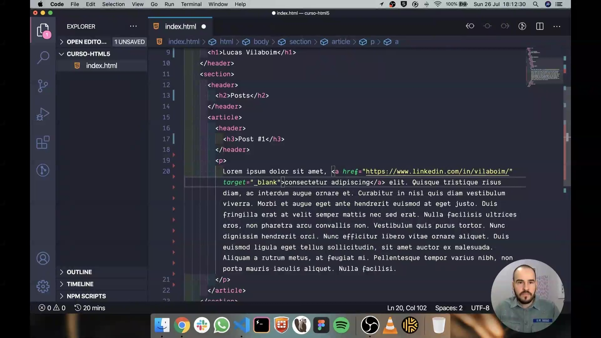
</p>

```html
<h1>Lucas Vilaboim</h1>
</header>
<section>
  <header>
    <h2>Posts</h2>
  </header>
  <article>
    <header>
      <h3>Post #1</h3>
    </header>
    <p>
      Lorem ipsum dolor sit amet, <a href="https://www.linkedin.com/in/vilaboim/"
      target="_blank">consectetur adipiscing</a> elit. Quisque tristique risus
      diam, ac interdum augue ornare et. Curabitur in nisl quis diam vestibulum
      viverra. Morbi et augue eget ante hendrerit euismod at eget justo. Duis
      fringilla erat at velit semper mattis nec sed erat. Nulla facilisis ultrices
      eros, non pharetra arcu convallis non. Vestibulum quis purus tortor. Nunc
      dignissim hendrerit orci. Nunc efficitur libero vitae ornare aliquet. Duis
      euismod ligula eget tellus sollicitudin, sit amet auctor ex malesuada.
      Aliquam a rutrum metus, at feugiat mi. Pellentesque tempor varius nibh, non
      porta mauris iaculis aliquet. Nulla facilisi.
    </p>
  </article>
</section>
```

Para adicionar um link, o processo envolve selecionar uma parte do texto, removê-la temporariamente, adicionar o elemento `<a>`, e colar o texto dentro dele. O atributo `href` é então adicionado com o endereço do perfil do LinkedIn. 

O código mostra o link apontando para `https://www.linkedin.com/in/vilaboim/` com o atributo `target="_blank"`, que instrui o navegador a abrir o link em uma nova aba. Esta é uma prática recomendada para links externos, pois mantém o site original aberto enquanto o usuário explora o conteúdo externo.

#### Visualizando o Link no Navegador

<p align="center">
  
</p>

No navegador, o link aparece com a aparência padrão de hiperlink (sublinhado e em cor diferente). Inicialmente, quando clicado sem o atributo `target="_blank"`, o link abre na mesma aba. No entanto, após adicionar este atributo, o comportamento muda: o link passa a abrir em uma nova aba do navegador, preservando a página original.

A página mostra a estrutura completa renderizada: o cabeçalho "Lucas Vilaboim" com o `<h1>`, a seção "Posts" com `<h2>`, o título do post "Post #1" com `<h3>`, e o parágrafo contendo o link funcional para "consectetur adipiscing".

#### Adicionando Link para E-mail com mailto

<p align="center">
  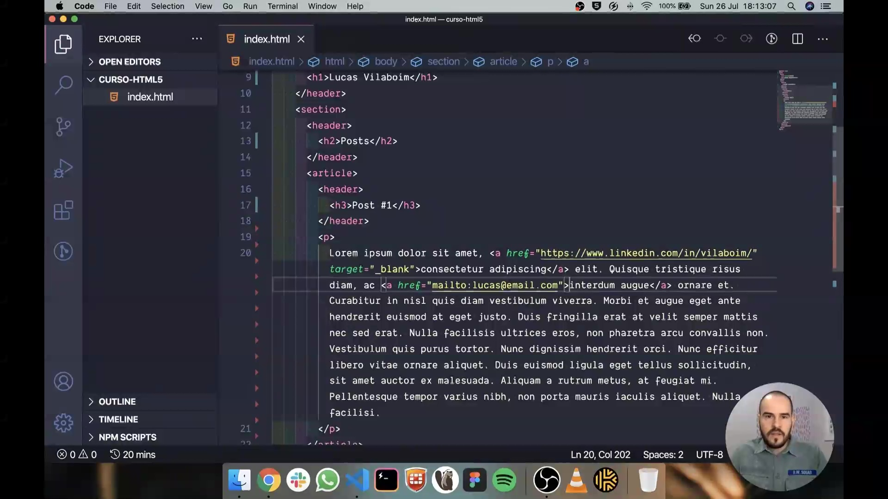
</p>

```html
<h1>Lucas Vilaboim</h1>
</header>
<section>
  <header>
    <h2>Posts</h2>
  </header>
  <article>
    <header>
      <h3>Post #1</h3>
    </header>
    <p>
      Lorem ipsum dolor sit amet, <a href="https://www.linkedin.com/in/vilaboim/"
      target="_blank">consectetur adipiscing</a> elit. Quisque tristique risus
      diam, ac <a href="mailto:lucas@email.com">interdum augue</a> ornare et.
      Curabitur in nisl quis diam vestibulum viverra. Morbi et augue eget ante
      hendrerit euismod at eget justo. Duis fringilla erat at velit semper mattis
      nec sed erat. Nulla facilisis ultrices eros, non pharetra arcu convallis non.
      Vestibulum quis purus tortor. Nunc dignissim hendrerit orci. Nunc efficitur
      libero vitae ornare aliquet. Duis euismod ligula eget tellus sollicitudin,
      sit amet auctor ex malesuada. Aliquam a rutrum metus, at feugiat mi.
      Pellentesque tempor varius nibh, non porta mauris iaculis aliquet. Nulla
      facilisi.
    </p>
  </article>
</section>
```

O segundo tipo de link demonstrado é o link para e-mail. O processo é similar ao anterior, mas o atributo `href` recebe um prefixo especial: `mailto:`. Este prefixo instrui o navegador a tratar o link de forma diferente de um endereço web comum.

No código, o link é criado com `href="mailto:lucas@email.com"`, envolvendo o texto "interdum augue". Quando este tipo de link é clicado, em vez de navegar para uma página web, o navegador abre o cliente de e-mail padrão do usuário (ou o webmail, caso não haja cliente configurado) com o destinatário já preenchido.

#### Comportamento dos Links de E-mail no Navegador

<p align="center">
  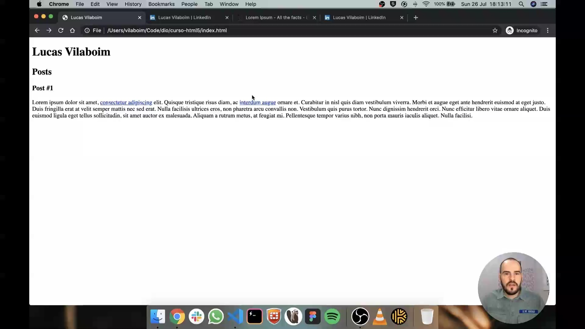
</p>

Visualmente no navegador, o link de e-mail tem a mesma aparência de um link comum, mas seu comportamento é completamente diferente. Ao clicar nele, o sistema operacional interpreta o protocolo `mailto:` e abre o aplicativo de e-mail configurado.

No caso do instrutor, como não há cliente de e-mail instalado localmente, o navegador abre a interface web do Gmail automaticamente. Este comportamento demonstra a versatilidade dos links HTML para diferentes tipos de comunicação além da simples navegação entre páginas.

#### O Prefixo tel: para Telefones

A aula também menciona um prefixo similar ao `mailto:`, que é o `tel:`. Este funciona de maneira análoga, mas para números de telefone. Quando um usuário clica em um link com `tel:` em um dispositivo móvel, o sistema operacional oferece a opção de realizar uma chamada telefônica para o número especificado.

Este recurso é especialmente útil em sites responsivos que serão acessados por smartphones, facilitando a interação do usuário ao permitir que ele inicie uma chamada diretamente ao tocar no número.

#### Próximos Passos

A aula conclui informando que a página continuará evoluindo nas próximas lições, e que o próximo tópico será sobre **imagens**, expandindo ainda mais as possibilidades de criação de conteúdo rico em HTML.


# Parte 4 - Como inserir imagens em seu site

## 🟩 Vídeo 07 - Tag img

![[bootcamp_tqi_fullstack-modulo_02-Video_07.webm|vid-60]]

Link do vídeo: https://web.dio.me/track/tqi-fullstack-developer/course/introducao-criacao-de-websites-com-html5-e-css3/learning/8e1edc74-dde3-42f0-b307-c28822ad8bcb?autoplay=1

O texto descreve o funcionamento básico da **tag de imagem** no desenvolvimento web, destacando que ela é um elemento que **não requer fechamento**. O autor explica que o atributo **src** é indispensável, pois define a origem do arquivo, seja ele **local ou externo**. Além disso, enfatiza-se a importância fundamental do atributo **alt** para promover a **acessibilidade digital**. Essa descrição alternativa garante que usuários de **leitores de tela** compreendam o conteúdo visual e fornece contexto caso o carregamento falhe. Portanto, o foco central é ensinar as **boas práticas** para a implementação correta de elementos visuais em sites.

### Anotações

#### Introdução ao Elemento de Imagem no HTML

A web é composta por diversos tipos de mídia, e as imagens desempenham um papel fundamental na representação visual de conteúdo. Para inserir imagens em uma página, utilizamos a tag ``. Diferente de muitos outros elementos HTML que possuem tags de abertura e fechamento, a tag de imagem é um elemento que não possui tag de fechamento.

#### Atributos Essenciais e Acessibilidade

O elemento de imagem é simples, mas depende de atributos específicos para funcionar corretamente e garantir uma boa experiência ao usuário.

<p align="center">
 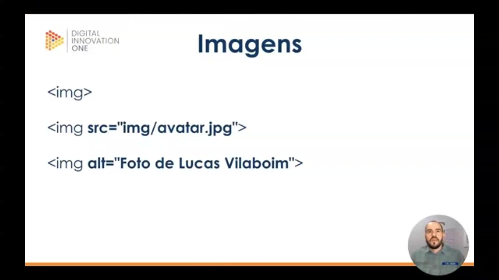
</p>

```html


```

O funcionamento desses atributos pode ser comparado a um porta-retratos digital:

* **Atributo `src` (Source):** Este atributo é obrigatório e define o caminho de origem da imagem. Ele indica ao navegador onde o arquivo está guardado, podendo ser um caminho interno (dentro do próprio site) ou externo (um link de outro lugar na web).
* **Atributo `alt` (Alternative Text):** Embora não seja tecnicamente obrigatório para a renderização, seu uso é altamente recomendado para a acessibilidade. Ele serve como uma "etiqueta escrita atrás da foto":
* **Fallback visual:** Exibe uma descrição textual caso a imagem não carregue por problemas de conexão ou erro no caminho.
* **Acessibilidade:** É lido por leitores de tela para informar a usuários com deficiência visual o que a imagem representa.

## 🟩 Vídeo 08 - Exercício prático

![[bootcamp_tqi_fullstack-modulo_02-Video_08.webm|vid-60]]

Link do vídeo:  https://web.dio.me/track/tqi-fullstack-developer/course/introducao-criacao-de-websites-com-html5-e-css3/learning/770e86ac-5bb8-426b-a003-5ecdb18c14a7?autoplay=1

O tutorial ensina como **inserir e otimizar imagens** em uma página web utilizando a linguagem **HTML**. O instrutor demonstra a aplicação prática da tag de imagem tanto no **cabeçalho** quanto no corpo de uma **postagem**, enfatizando a importância de organizar os arquivos em pastas ou via URLs externas. Um ponto central da aula é o uso correto do **atributo alt**, que garante **acessibilidade** para leitores de tela e fornece descrições textuais caso o arquivo falhe ao carregar. Além das técnicas de codificação, o conteúdo sugere o uso de ferramentas externas para a **compressão e otimização** de arquivos visuais, visando melhorar o desempenho do site. Por fim, o autor antecipa que o módulo seguinte focará na criação de **listas**, preparando o aluno para o encerramento do curso básico.

### Anotações

<p align="center">
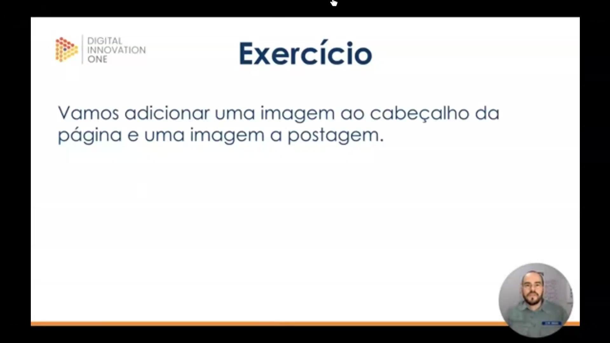
</p>

Nesta etapa, daremos início a um exercício prático focado na manipulação de elementos visuais em uma página web. O objetivo principal é aprender a inserir e gerenciar imagens em dois locais estratégicos: no **cabeçalho (header)** da página e dentro de uma **postagem (article)**.

---

<p align="center">
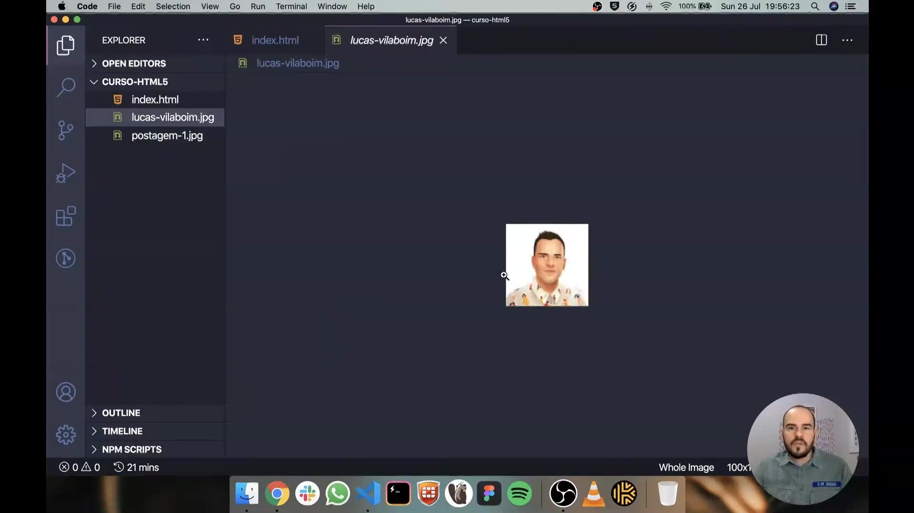
</p>

Antes de realizar a codificação, é necessário preparar os arquivos de imagem que serão utilizados. Para este exemplo, foram selecionadas duas imagens:

* Uma ilustração pessoal com dimensões de **100x100 pixels** para o perfil.
* Uma imagem temática para ilustrar o corpo da postagem.

As imagens devem estar localizadas no mesmo diretório do arquivo HTML para facilitar a referência via caminho relativo, conforme observado na estrutura de pastas do editor.

---

<p align="center">
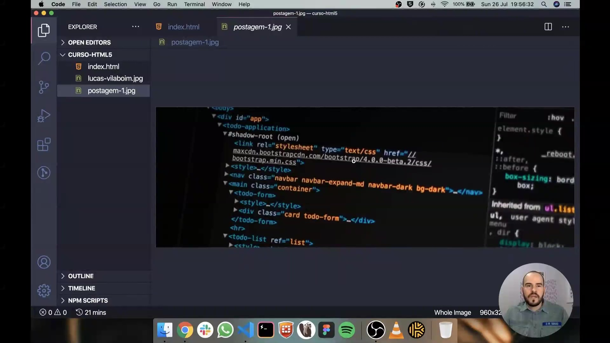
</p>

Para a imagem da postagem, uma boa prática é buscar recursos em bancos de imagens gratuitos. Neste caso, a escolha recaiu sobre uma fotografia que remete a código e tecnologia. É fundamental garantir que os nomes dos arquivos (como `postagem-1.jpg`) sejam simples e sem espaços para evitar erros de carregamento no navegador.

---

<p align="center">
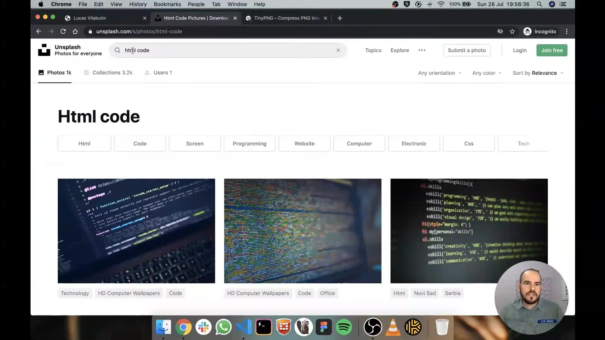
</p>

Uma fonte recomendada para obter imagens de alta qualidade é o site **Unsplash**. Ao realizar buscas por termos como "HTML Code", é possível encontrar diversas opções profissionais que podem ser utilizadas nos projetos sem a necessidade de atribuições complexas de direitos autorais, enriquecendo o aspecto visual do blog ou site.

---

<p align="center">
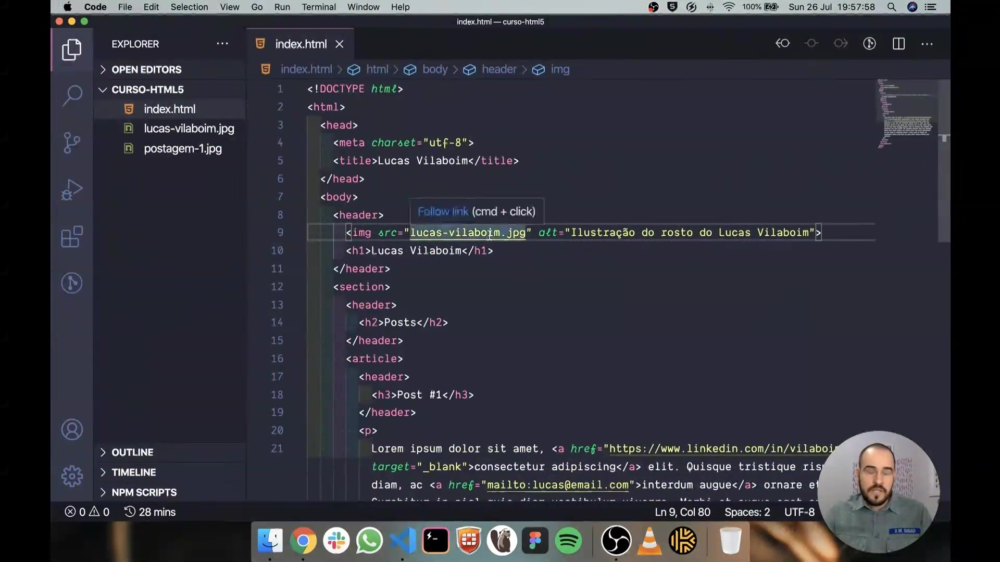
</p>

A inserção da primeira imagem é feita dentro do elemento `<header>` principal, posicionada antes do título `<h1>`. Utilizamos a tag `` com o atributo `src` apontando para o nome do arquivo. Além disso, incluímos o atributo `alt` (texto alternativo), que é essencial para a acessibilidade, permitindo que leitores de tela descrevam o conteúdo para usuários com deficiência visual.

```html
<header>
  
  <h1>Lucas Vilaboim</h1>
</header>

```

---

<p align="center">
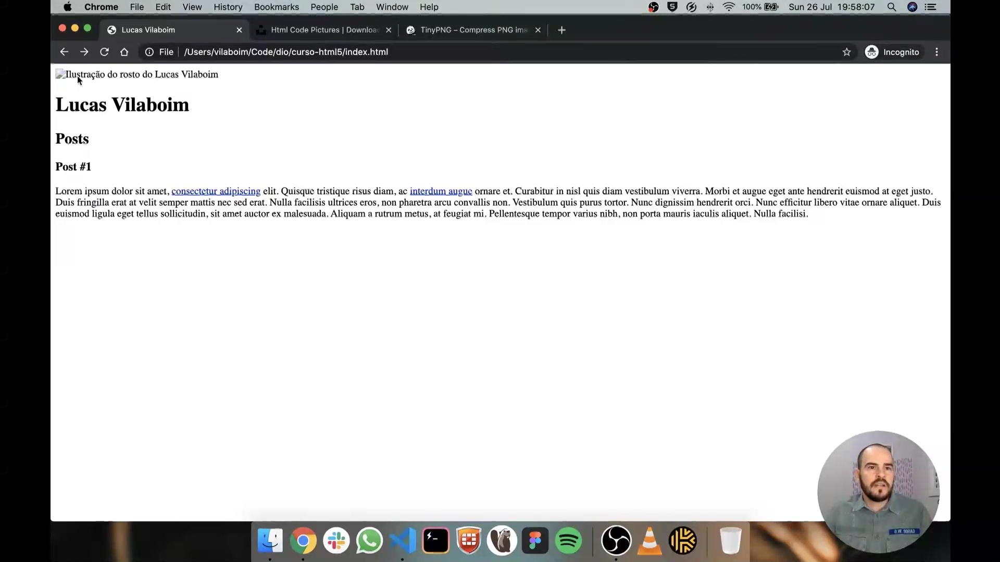
</p>

O atributo `alt` possui uma função dupla. Além da acessibilidade, ele atua como um "plano de reserva". Caso o caminho da imagem esteja incorreto ou o arquivo seja removido do servidor, o navegador exibirá um ícone de imagem quebrada acompanhado do texto definido no `alt`, garantindo que o contexto da informação não seja totalmente perdido para o visitante.

---

<p align="center">

</p>

Para a segunda imagem, o processo é semelhante, mas o posicionamento será dentro do cabeçalho do artigo (`<article>`), logo após o título da postagem (`<h3>`). Isso cria uma hierarquia visual onde o leitor primeiro identifica o tema do texto e imediatamente visualiza uma imagem relacionada.

```html
<article>
  <header>
    <h3>Post #1</h3>
    
  </header>
</article>

```

---

<p align="center">
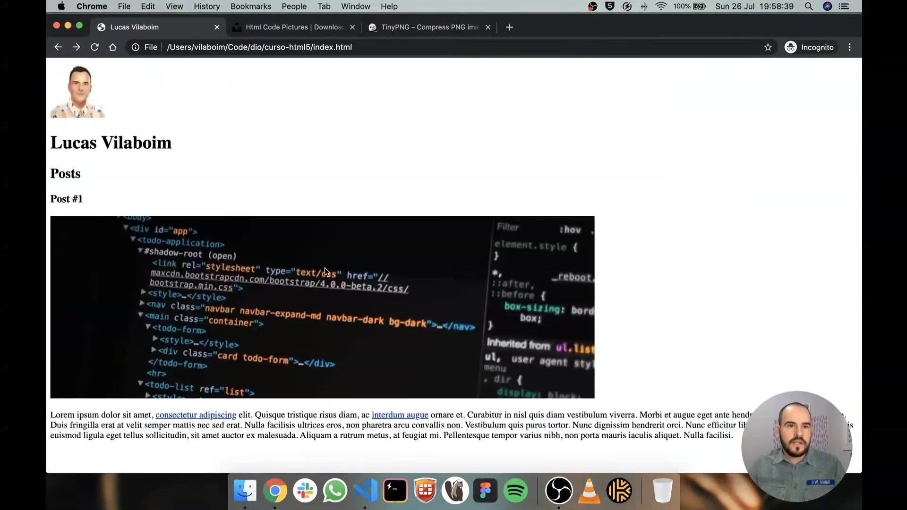
</p>

Ao atualizar a página no navegador, podemos observar o resultado da renderização. A imagem da postagem aparece integrada ao fluxo do texto. É importante notar que, sem a definição de estilos CSS, a imagem ocupará seu tamanho original em pixels, o que pode exigir ajustes futuros para se adequar perfeitamente ao layout.

---

<p align="center">
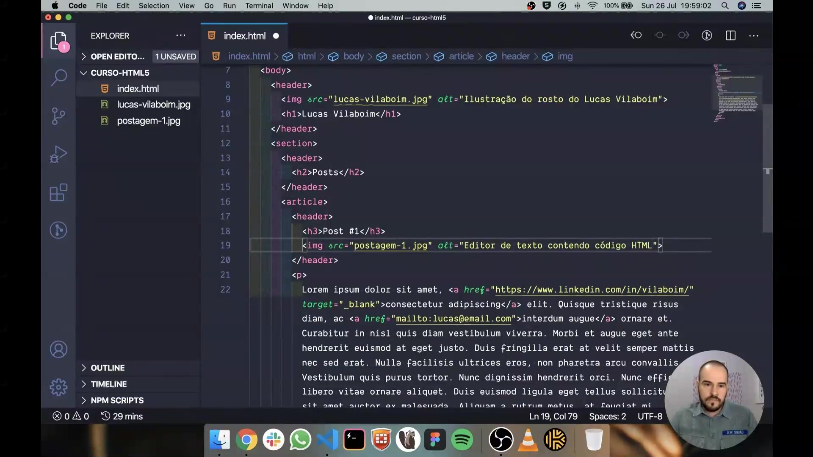
</p>

Finalizamos a marcação da postagem adicionando uma descrição detalhada ao atributo `alt` da imagem do artigo. Quanto mais específica for a descrição, melhor será a experiência para quem utiliza tecnologias assistivas.

```html


```

---

<p align="center">
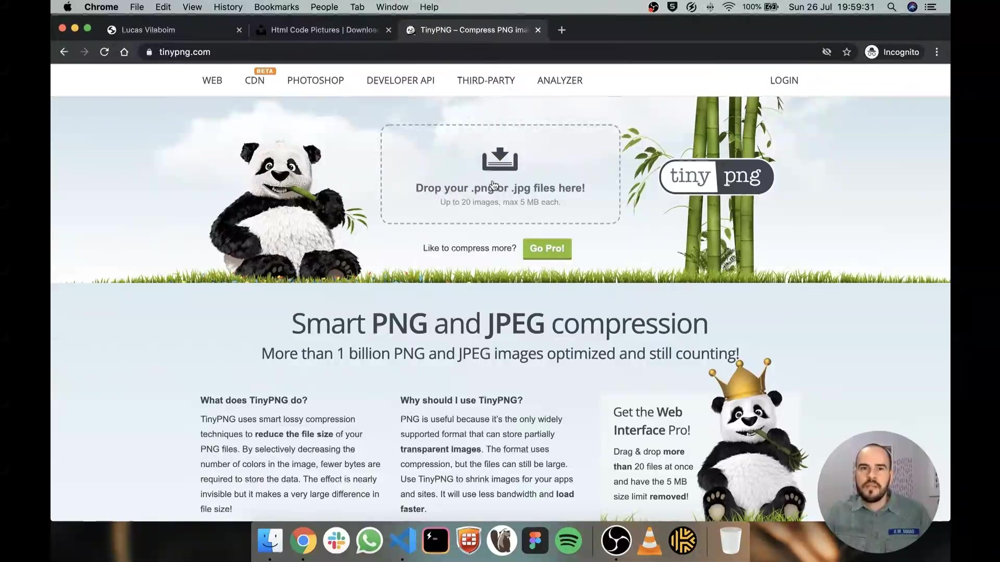
</p>

Uma dica fundamental para o desenvolvimento web é a otimização de performance. Antes de subir imagens para um site real, recomenda-se a utilização de ferramentas como o **TinyPNG**. Esse serviço remove metadados desnecessários e comprime os arquivos (PNG ou JPEG) sem perda perceptível de qualidade, o que reduz o tempo de carregamento da página e economiza largura de banda do usuário.

# Parte 5 - Como organizar listas com HTML

## 🟩 Vídeo 09 - Tags li, ul e ol

![[bootcamp_tqi_fullstack-modulo_02-Video_09.webm|vid-60]]

Link do vídeo:  https://web.dio.me/track/tqi-fullstack-developer/course/introducao-criacao-de-websites-com-html5-e-css3/learning/28e36d51-00f1-483f-a569-05b52de642ca?autoplay=1

Esta fonte explica como utilizar elementos fundamentais de **HTML** para organizar informações de forma estruturada. O texto detalha a diferença entre as tags **UL**, usada para coleções sem ordem específica, e **OL**, aplicada quando a sequência dos itens é relevante. Além disso, introduz o componente **LI** como a unidade básica necessária para listar cada entrada individualmente. O objetivo prático demonstrado é a criação de uma **lista de contatos** que será integrada ao rodapé de uma página web. Essa abordagem didática facilita o agrupamento de dados através de **marcações semânticas** apropriadas para o desenvolvimento de sites.

### Anotações

#### Introdução às Listas

<p align="center">
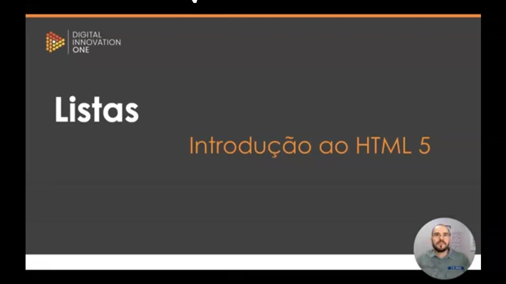
</p>

Nesta etapa, iniciamos o estudo dos elementos fundamentais para a criação de listas no HTML5: `<ul>`, `<ol>` e `<li>`. As listas são utilizadas para agrupar coleções de itens relacionados de forma organizada, como uma lista de ingredientes ou uma relação de informações de contato.

#### Diferenciação entre Listas Ordenadas e Não Ordenadas

<p align="center">
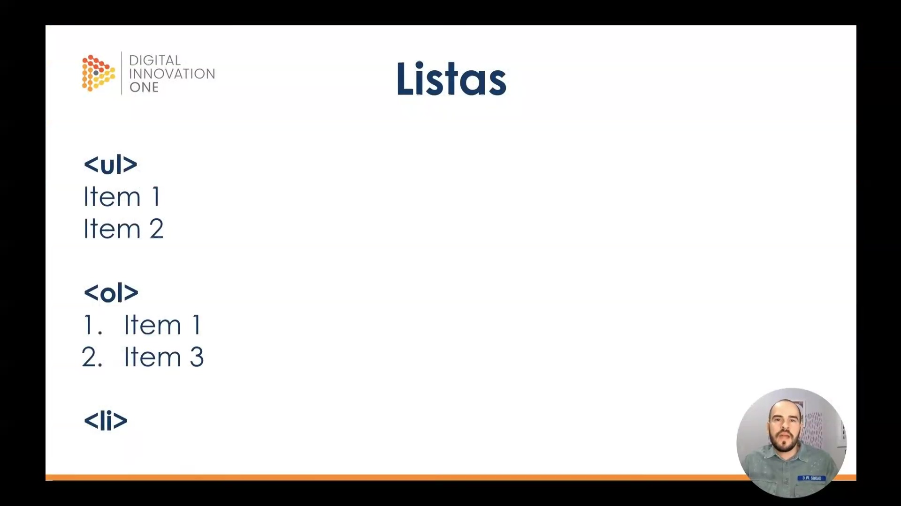
</p>

A estrutura de uma lista depende da relevância da sequência dos itens apresentados:

* **`<ul>` (Unordered List):** Representa uma lista não ordenada, onde a posição dos itens não altera o sentido do conteúdo. Geralmente é renderizada com marcadores (bullets).
* **`<ol>` (Ordered List):** Representa uma lista ordenada, utilizada quando a sequência é importante. Os itens são identificados por números, letras ou algarismos romanos.
* **`<li>` (List Item):** É o elemento utilizado para definir cada item individual dentro de uma lista, seja ela ordenada ou não.

```html
<ul>
  <li>Item 1</li>
  <li>Item 2</li>
</ul>

<ol>
  <li>Item 1</li>
  <li>Item 3</li>
</ol>

```

#### Exercício Prático: Lista de Contatos

<p align="center">
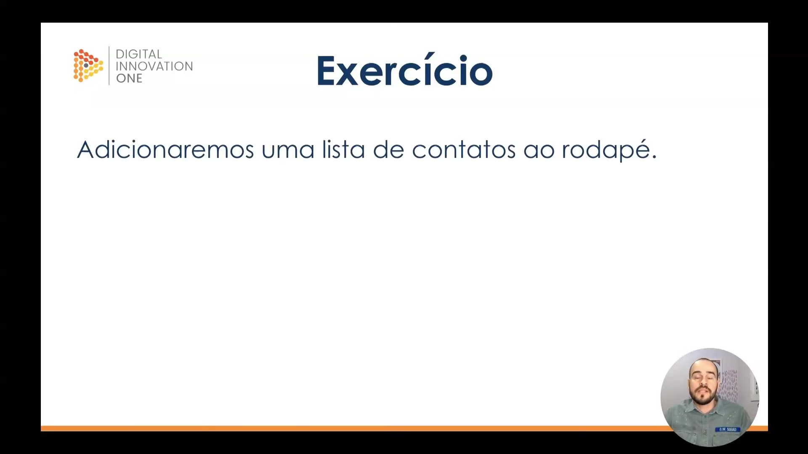
</p>

Para aplicar os conceitos aprendidos, realizaremos um exercício prático focado na organização de informações do site. O objetivo é adicionar uma lista de contatos estruturada diretamente no rodapé (footer) da página, utilizando as tags de lista para garantir a semântica correta do documento.


## 🟩 Vídeo 10 - Exercício prático

![[bootcamp_tqi_fullstack-modulo_02-Video_10.webm|vid-60]]

Link do vídeo:  https://web.dio.me/track/tqi-fullstack-developer/course/introducao-criacao-de-websites-com-html5-e-css3/learning/e4fd6cd4-c680-4df9-9018-cf120bc429a8?autoplay=1

O vídeo apresenta um tutorial prático sobre a **criação de uma seção de contatos** para o rodapé de uma página web utilizando **HTML**. O instrutor demonstra como estruturar uma **lista não ordenada** contendo links externos para e-mail, LinkedIn e GitHub. Durante a explicação, destaca-se a importância do atributo **href** para direcionar o usuário e do atributo **target** para abrir as páginas em abas distintas. Além disso, o conteúdo diferencia visualmente as **listas numeradas** das listas com marcadores simples. Por fim, o autor esclarece que a **aparência estética** do site será refinada posteriormente por meio de estudos em **CSS3**.

### Anotações

#### Implementação de Lista Não Ordenada no Rodapé

<p align="center">

</p>

Para adicionar uma lista de contatos no rodapé da página onde a ordem dos itens não é prioritária, utiliza-se a tag `<ul>` (unordered list). Dentro desta lista, cada item é definido pela tag `<li>`. Para tornar os contatos funcionais, inserimos o elemento `<a>` com o atributo `href` apontando para o e-mail ou perfis em redes sociais, além do atributo `target="_blank"` para garantir que os links externos abram em uma nova aba do navegador.

```html
<footer>
  <ul>
    <li>
      <a href="mailto:lucas@vilaboim.com">lucas@vilaboim.com</a>
    </li>
    <li>
      <a href="https://www.linkedin.com/in/vilaboim/" target="_blank">LinkedIn</a>
    </li>
    <li>
      <a href="https://github.com/vilaboim" target="_blank">Github</a>
    </li>
  </ul>
</footer>

```

#### Renderização Padrão da Lista Não Ordenada

<p align="center">
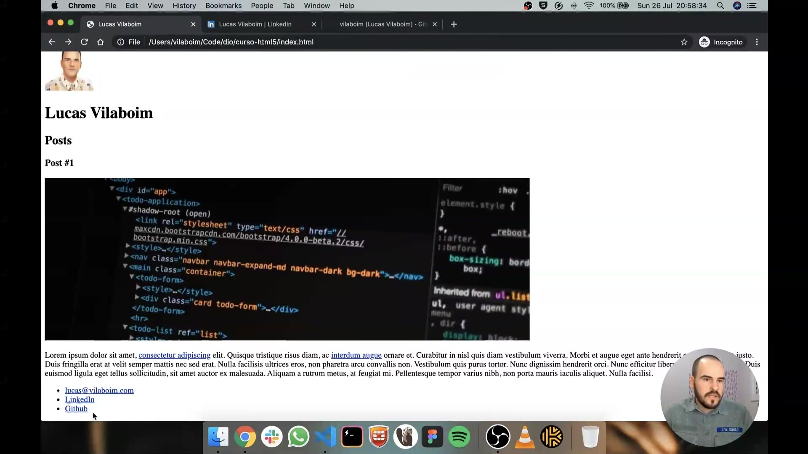
</p>

Ao visualizar o resultado no navegador sem a aplicação de estilos CSS personalizados, a lista não ordenada é representada com marcadores padrão (bolinhas) antes de cada item. Essa formatação visual sinaliza ao usuário que se trata de um agrupamento de itens relacionados, mas sem uma hierarquia sequencial obrigatória.

#### Transição para Lista Ordenada

<p align="center">
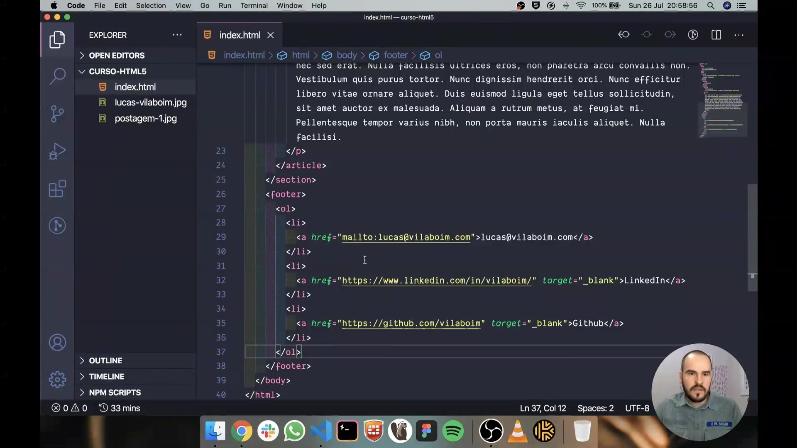
</p>

Para transformar a estrutura em uma lista onde a sequência dos elementos é relevante, substitui-se a tag de abertura e fechamento `<ul>` pela tag `<ol>` (ordered list). Os itens internos permanecem envoltos pela tag `<li>`, mantendo a semântica de "item de lista".

```html
<footer>
  <ol>
    <li>
      <a href="mailto:lucas@vilaboim.com">lucas@vilaboim.com</a>
    </li>
    <li>
      <a href="https://www.linkedin.com/in/vilaboim/" target="_blank">LinkedIn</a>
    </li>
    <li>
      <a href="https://github.com/vilaboim" target="_blank">Github</a>
    </li>
  </ol>
</footer>

```

#### Exibição Numérica da Lista Ordenada

<p align="center">
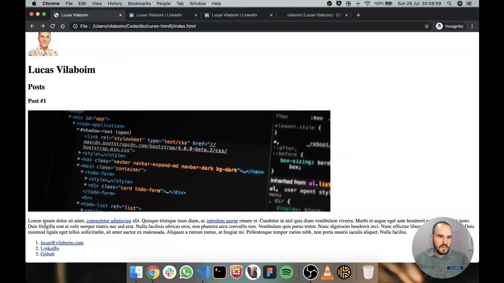
</p>

Com a alteração para `<ol>`, o navegador altera automaticamente a representação visual dos itens. Em vez dos marcadores circulares, os itens passam a ser precedidos por números (1, 2, 3...), indicando explicitamente a ordem da lista de contatos apresentada no rodapé.


# Parte 6 - Introdução e conceitos básicos do CSS3

## 🟩 Vídeo 11 - Introdução ao CSS3

![[bootcamp_tqi_fullstack-modulo_02-Video_11.webm|vid-60]]

Link do vídeo:  https://web.dio.me/track/tqi-fullstack-developer/course/introducao-criacao-de-websites-com-html5-e-css3/learning/8e2d15ba-fb35-4a23-aa3f-2f0f860c44cd?autoplay=1

Esta fonte apresenta uma aula introdutória focada nos fundamentos do **CSS3**, detalhando como essa linguagem é essencial para a **estilização de páginas web**. O conteúdo explica a estrutura básica de uma **regra CSS**, composta por **seletores, propriedades e valores** que definem a aparência de elementos HTML. O instrutor demonstra a diferença prática entre **seletores de tipo, IDs e classes**, ressaltando que identificadores únicos devem ser usados com moderação em comparação às classes reutilizáveis. Além da teoria, o material ensina como **vincular um arquivo externo** de estilos ao documento principal e aplicar modificações de **cor, tamanho de fonte e formatação** de texto. Por fim, o exemplo prático ilustra como essas técnicas transformam o visual padrão do navegador em um **layout personalizado e organizado**.

### Anotações

#### Introdução ao CSS 3

<p align="center">
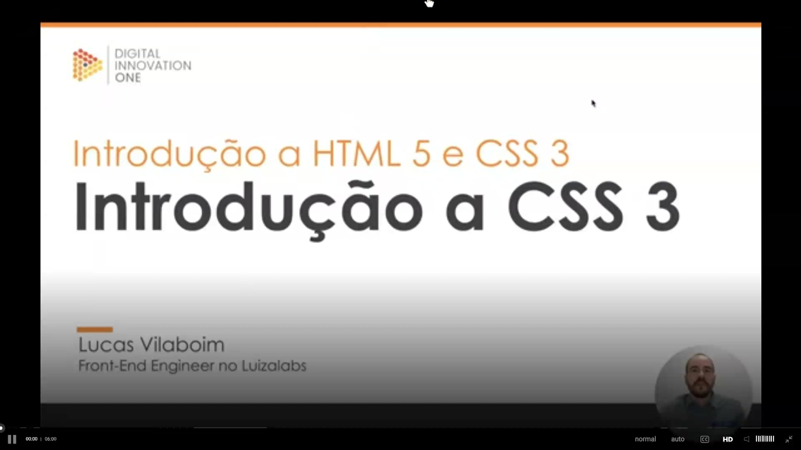
</p>

Início do módulo dedicado ao aprendizado da linguagem de estilo CSS 3, apresentando a continuidade do curso de desenvolvimento web focado em Front-End.

#### Objetivos da Aula

<p align="center">
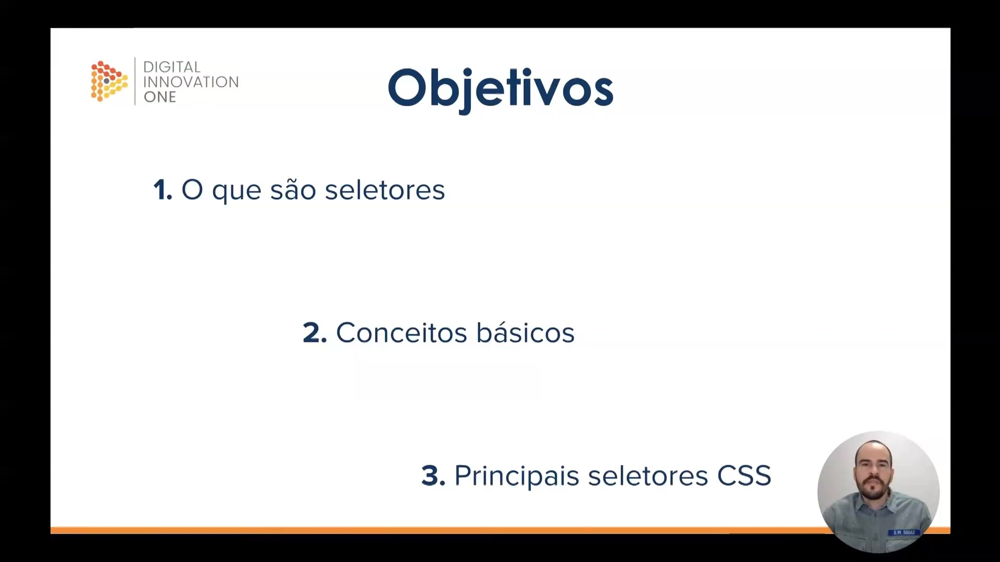
</p>

A aula estabelece três metas principais: compreender a definição e o funcionamento dos seletores, dominar os conceitos básicos da linguagem e conhecer os principais seletores utilizados no cotidiano do desenvolvimento.

#### Requisitos Básicos

<p align="center">
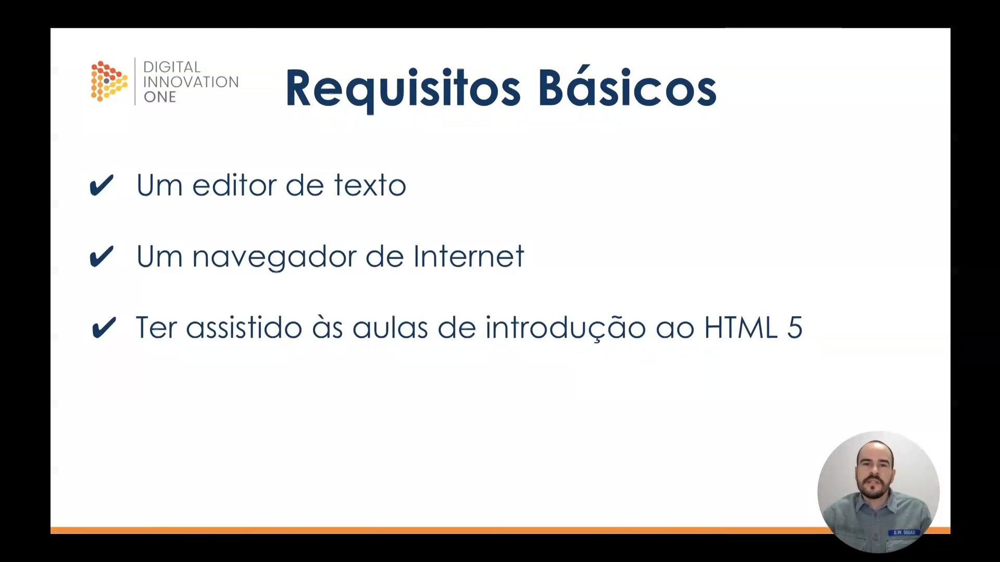
</p>

Para acompanhar o conteúdo de CSS 3, é fundamental possuir um editor de texto e um navegador de internet instalados, além de ter concluído a etapa anterior de introdução ao HTML 5.

#### Definição e Histórico

<p align="center">
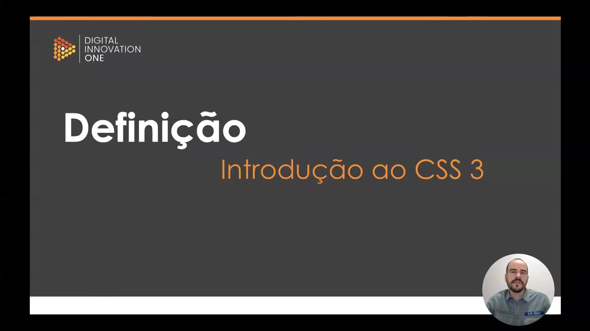
</p>

O CSS (Cascading Style Sheets) surgiu em 1996 como uma resposta à necessidade de formatar e estilizar visualmente as páginas web após a consolidação do HTML como estrutura de conteúdo.

#### Anatomia de uma Regra CSS

<p align="center">
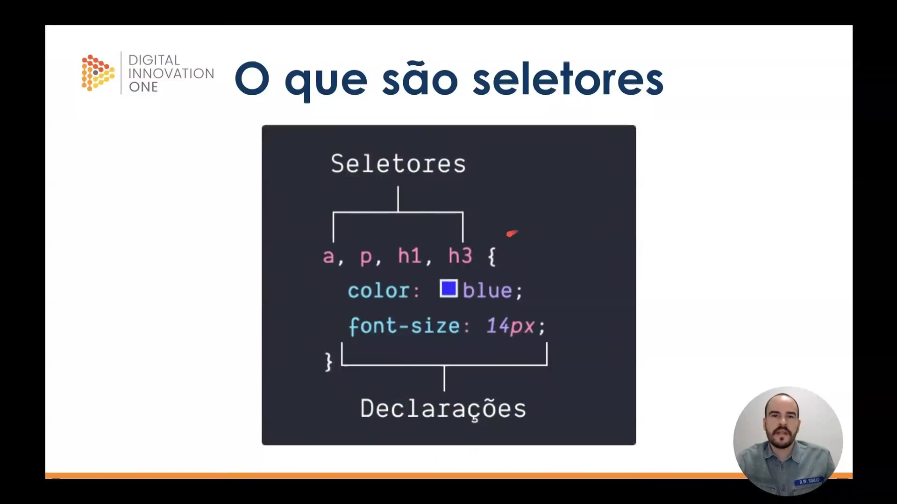
</p>

Uma regra CSS é composta por um seletor (que aponta para um elemento ou grupo de elementos HTML) e um bloco de declarações entre chaves. Cada declaração consiste em uma propriedade seguida de seu respectivo valor.

```css
a, p, h1, h3 {
  color: blue;
  font-size: 14px;
}

```

#### Seletores de ID e Classe no HTML

<p align="center">
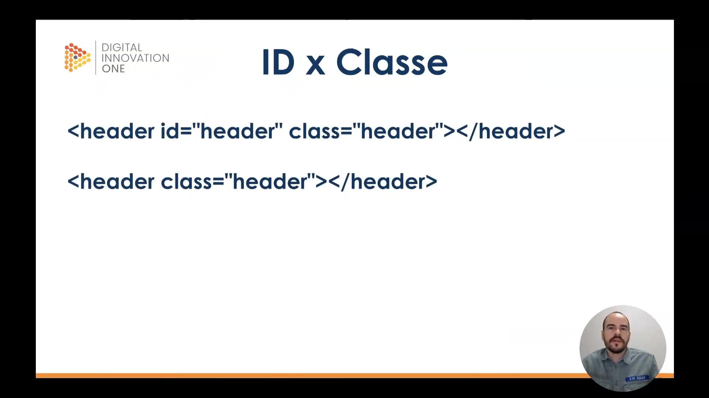
</p>

Diferente do seletor de tipo que afeta todos os elementos da mesma tag, o uso de IDs e classes permite criar regras específicas para elementos individuais ou grupos personalizados dentro do HTML.

```html
<header id="header" class="header"></header>
<header class="header"></header>

```

#### Sintaxe de Seletores no CSS

<p align="center">
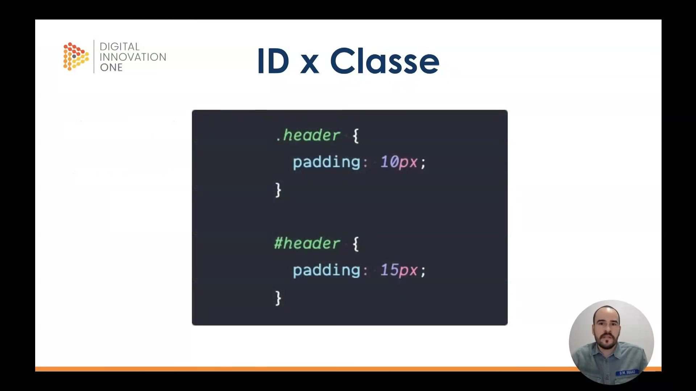
</p>

No arquivo de estilos, a sintaxe diferencia IDs e classes por seus prefixos: as classes são precedidas por um ponto (`.`), enquanto os IDs são identificados por uma cerquilha (`#`). Vale ressaltar que um ID deve ser único dentro de uma mesma página.

```css
.header {
  padding: 10px;
}

#header {
  padding: 15px;
}

```

#### Vinculando a Folha de Estilo Externa

<p align="center">
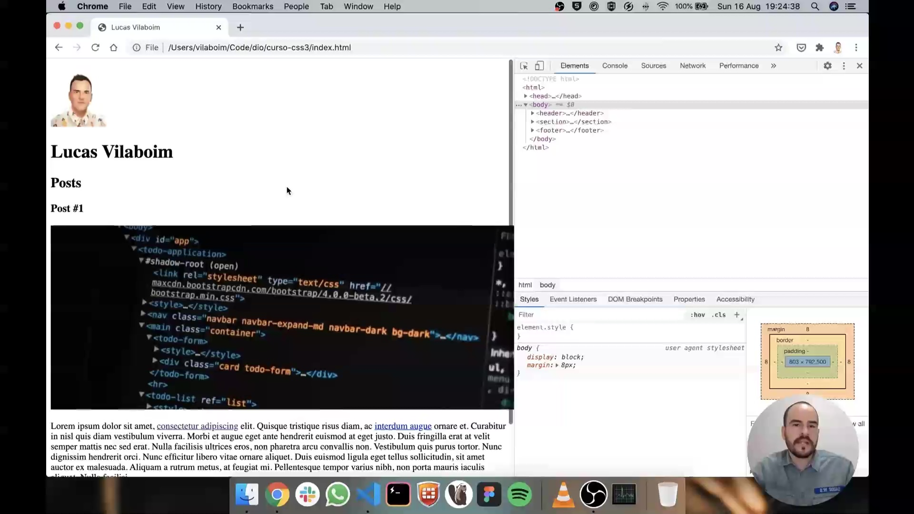
</p>

Para que as regras CSS sejam aplicadas, é necessário criar um arquivo externo (ex: `style.css`) e vinculá-lo ao documento HTML através da tag `<link>` inserida dentro do elemento `<head>`.

```html
<head>
  <meta charset="utf-8">
  <title>Lucas Vilaboim</title>
  <link rel="stylesheet" href="style.css">
</head>

```

#### Organização de IDs e Classes nos Títulos

<p align="center">
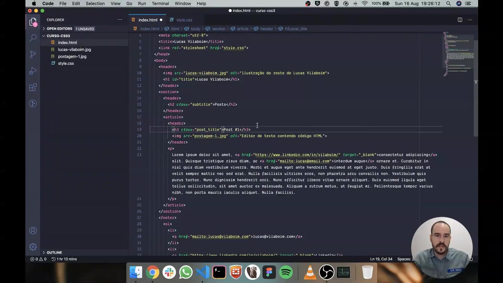
</p>

Na prática do projeto, atribui-se um ID ao título principal (`H1`) para garantir sua unicidade, enquanto classes são aplicadas aos títulos de seção (`H2`) e de postagem (`H3`) para permitir uma estilização consistente em múltiplos elementos.

```html
<h1 id="title">Lucas Vilaboim</h1>
<h2 class="subtitle">Posts</h2>
<h3 class="post_title">Post #1</h3>

```

#### Aplicando Regras Combinadas e Específicas

<p align="center">

</p>

É possível agrupar seletores diferentes em uma única regra para compartilhar propriedades, como a cor. Adicionalmente, regras específicas podem ser criadas para ajustar detalhes individuais, como o tamanho e o estilo da fonte de uma classe específica.

```css
#title, .subtitle, .post_title {
  color: blue;
}

.post_title {
  font-size: 16px;
  font-style: italic;
}

```

#### Validação Visual no Navegador

<p align="center">
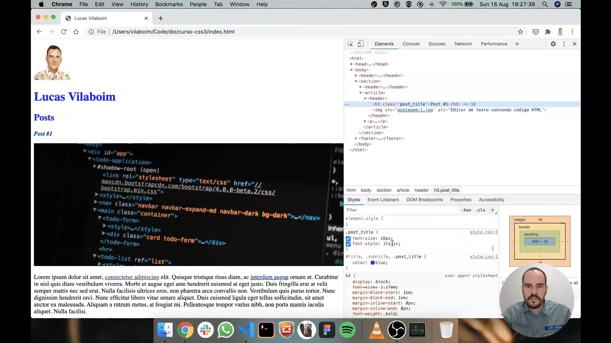
</p>

O resultado das alterações pode ser verificado diretamente no navegador. Utilizando as ferramentas de desenvolvedor (Inspetor de Elementos), confirma-se que os títulos assumiram a cor azul e que as propriedades de fonte específicas foram aplicadas com sucesso.


## 🟩 Vídeo 12 - Conceitos básicos

![[bootcamp_tqi_fullstack-modulo_02-Video_12.webm|vid-60]]

Link do vídeo:  https://web.dio.me/track/tqi-fullstack-developer/course/introducao-criacao-de-websites-com-html5-e-css3/learning/c76466b1-8d11-481a-809d-b184535f6072?autoplay=1

O texto explica o conceito fundamental do **Box Model** no desenvolvimento web, que descreve como o navegador visualiza cada elemento HTML como uma **caixa retangular**. Essa estrutura é composta por quatro camadas essenciais: o **conteúdo** central, o **preenchimento** interno, a **borda** e a **margem** externa. Através do uso de **CSS**, é possível modificar as propriedades visuais de cada uma dessas partes, como cores, larguras e distanciamentos. O autor demonstra na prática como essas alterações afetam o **layout**, utilizando exemplos de códigos para aplicar fundos coloridos e bordas sólidas. Por fim, o conteúdo destaca que ferramentas de inspeção do navegador permitem visualizar essas divisões de forma clara para facilitar a **estilização** de um site.

### Anotações

#### O Conceito de Box Model

<p align="center">
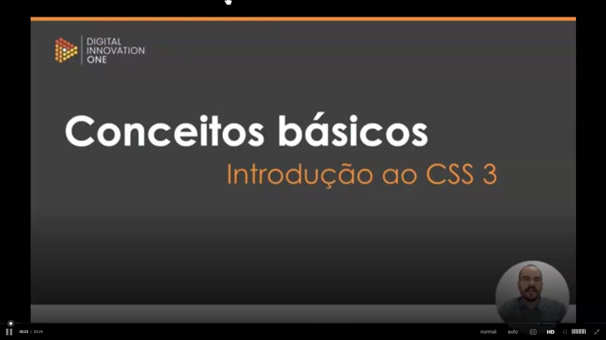
</p>

Início do estudo sobre o **Box Model**, um dos conceitos fundamentais do CSS 3. O modelo estabelece que cada elemento HTML é tratado pelo navegador como um bloco retangular, definindo como o conteúdo e o espaço ao seu redor são processados.

#### Componentes do Box Model

<p align="center">
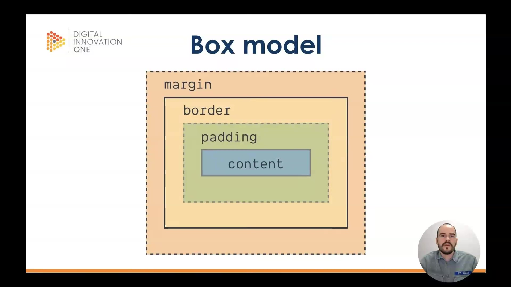
</p>

O Box Model é composto por quatro camadas distintas que envolvem o conteúdo:

* **Content**: O conteúdo real do elemento (texto, imagem, etc.).
* **Padding**: O espaço interno entre o conteúdo e a borda.
* **Border**: A linha que envolve o padding e o conteúdo.
* **Margin**: O espaço externo que separa o bloco de outros elementos vizinhos.

#### Exercício Prático de Visualização

<p align="center">
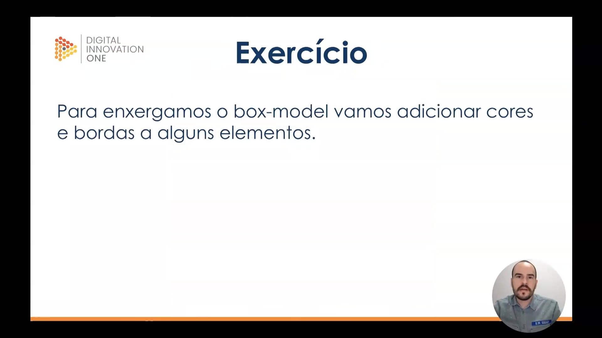
</p>

Para facilitar a compreensão e a visualização de cada parte do modelo, será realizado um exercício prático aplicando cores e bordas a diferentes elementos da página.

#### Estilização de Fundo do Body e Postagens

<p align="center">
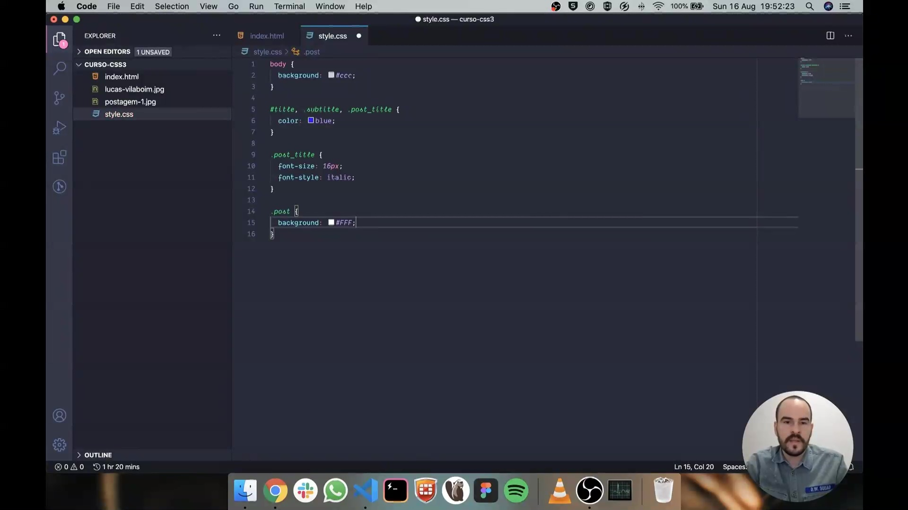
</p>

A primeira etapa consiste em aplicar cores de fundo para distinguir os blocos. Define-se um tom de cinza para o `body` e a cor branca para a classe `.post`, permitindo enxergar claramente os limites do conteúdo.

```css
body {
  background: #ccc;
}

#title, .subtitle, .post_title {
  color: blue;
}

.post_title {
  font-size: 16px;
  font-style: italic;
}

.post {
  background: #FFF;
}

```

#### Visualização Inicial dos Blocos

<p align="center">
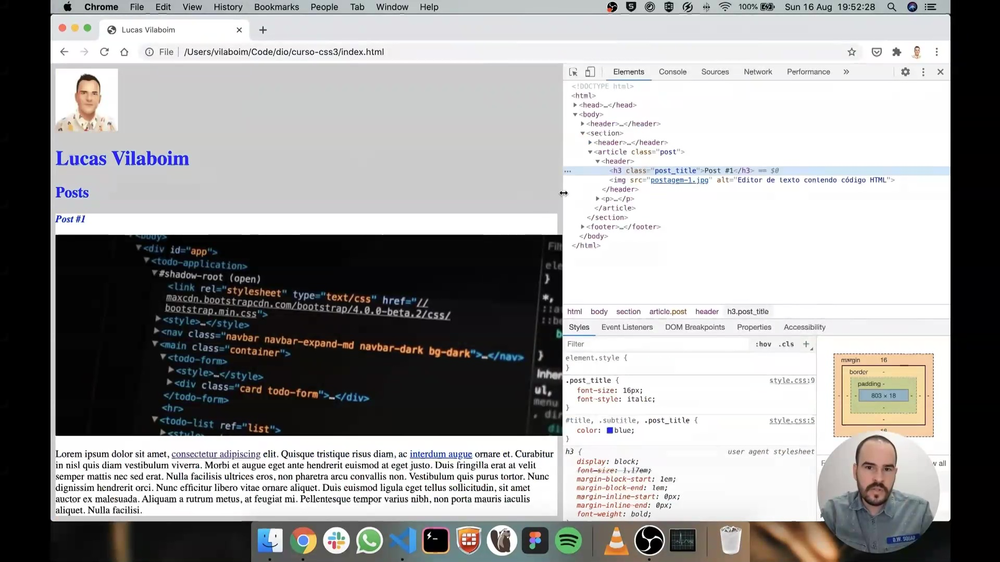
</p>

Após a aplicação das cores de fundo, o navegador renderiza o conteúdo evidenciando o contraste entre o fundo da página e a área ocupada pela postagem, validando a aplicação das regras de estilo iniciais.

#### Aplicação de Padding e Borda

<p align="center">

</p>

Nesta etapa, adiciona-se o **padding** de 10 pixels para criar um respiro entre o texto e a borda do bloco. Em seguida, aplica-se uma **borda** sólida de 3 pixels na cor preta para delimitar visualmente o fim do elemento.

```css
.post {
  background: #FFF;
  padding: 10px;
  border: 3px solid #000;
}

```

#### Inserção de Margem Externa

<p align="center">
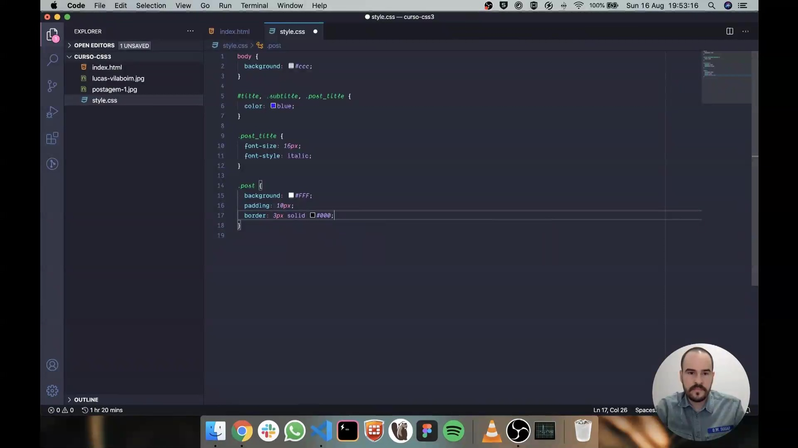
</p>

A propriedade **margin** é aplicada para gerar um espaçamento de 10 pixels no lado externo do bloco. Esse ajuste garante que o elemento não fique colado nas extremidades da página ou em outros elementos adjacentes.

```css
.post {
  background: #FFF;
  padding: 10px;
  border: 3px solid #000;
  margin: 10px;
}

```

<p align="center">
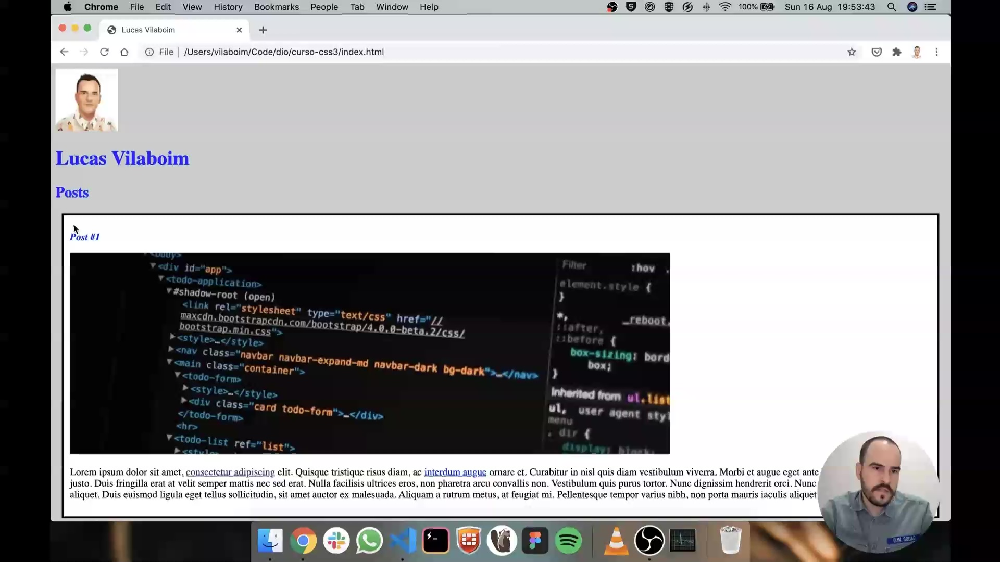
</p>

#### Inspeção do Box Model no Navegador

<p align="center">
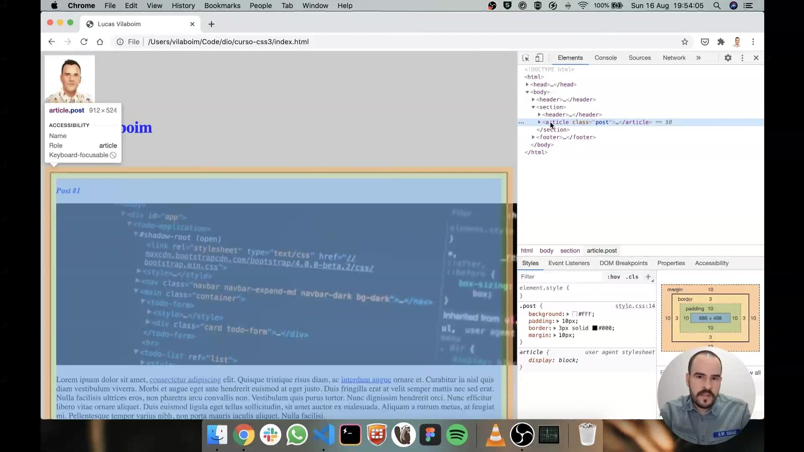
</p>

Utilizando as ferramentas de desenvolvedor do navegador, é possível visualizar o diagrama técnico do Box Model para o elemento selecionado. As cores representam fielmente cada camada: **azul** para o conteúdo, **verde** para o padding, **marrom/amarelo** para a borda e **laranja** para a margem externa.


## 🟧 Material de apoio


Link:  https://claude.ai/chat/45d32f1e-d294-4f55-9cec-6cb609ae79ba

#### CSS 3

##### Definição e seletores

Após a criação do HTML a necessidade de formatar as páginas ficou evidente, assim, em 1996, foi criada a linguagem de estilo que conhecemos por CSS.

A sintaxe é bem simples e pode ser explicada com a frase "você cria regras de estilo para elementos ou grupos de elementos".

Vamos usar um elemento HTML que vimos anteriormente, a âncora `<a>`, para exemplificar.

Uma regra CSS é representada por um seletor ou um grupo de seletores, no nosso caso é o `<a>`, então dentro de um par de chaves adicionamos as declarações, no exemplo acima estamos alterando cor e tamanho da fonte dessa âncora, as declarações são formadas por uma propriedade e um valor.

Percebam que podemos colocar vários seletores em uma regra separando-os por vírgula.

E há um último detalhe nesse exemplo: a pseudo-classe. Elementos HTML sofrem alterações causadas pela interação do usuário, como mover o mouse por cima ou clicar nesse elemento.

O `a:hover` do exemplo significa que a âncora também terá essa aparência quando o usuário passar o mouse por cima de um hyperlink.

##### ID x Classe

No exemplo anterior criamos uma regra que altera um elemento HTML diretamente, mas isso significa que todos os elementos `<a>` ficarão com aquela aparência, e normalmente temos sites mais complexos que precisam de várias regras diferentes para elementos iguais.

Para ficar mais tangível vamos relembrar um pouco o site que começamos a fazer no módulo passado, ele tinha vários elementos header, mas não vamos querer que o header principal tenha a mesma formatação que o header de uma postagem, é aí que entram os IDs e Classes.

O seletor que vimos no primeiro exemplo é um seletor de tipo, pois ele representa um elemento HTML, e com IDs e Classes podemos representar qualquer tipo de elemento mas há algumas diferenças entre eles:

**ID:** é representado pelo símbolo # (hash) seguido de um nome para esse ID.

**Classe:** a classe é representada de forma parecida do ID, mas é precedida por um ponto em vez do hash.

E a diferença mais importante entre eles é a forma como devem ser usados: o ID só pode ser usado uma vez em uma página HTML enquanto a classe não tem restrições.

##### Exercício

Vamos adicionar algumas classes no nosso site e alterar alguns elementos, mas antes precisamos adicionar um arquivo CSS a nossa página.

No módulo de HTML descobrimos que podemos adicionar CSS de duas formas, com o elemento style, e assim suas regras ficarão no arquivo HTML, ou podemos criar um arquivo CSS e adicioná-lo na página através do elemento link, e é essa forma que usaremos.

Crie um elemento link dentro do head do seu arquivo e adicione os atributos `rel="stylesheet"` e `href="style.css"`, o rel denota o tipo de arquivo que estamos incluindo na página e o href é o caminho para o arquivo. E na mesma pasta do arquivo HTML crie um arquivo chamado style.css.

Agora sim vamos ao CSS, adicione um ID `#title` ao h1 da página, pois queremos que ele seja único, e depois adicione as classes `.subtitle` e `.post_title` ao h2 e h3, respectivamente.

No arquivo CSS vamos mudar a cor desses três títulos, e depois alterar o tamanho da fonte do título da postagem.

##### Box-model

Quando estamos criando o layout de um site o navegador representa cada elemento HTML como uma caixa retangular, isso é o box-model. E com CSS nós alteramos a aparência dessa caixa (largura, altura, cor de fundo, etc.). Essa caixa é composta por 4 áreas: o conteúdo, o padding, a borda e a margem.

- As **margens (margin)** são espaçamentos entre elementos;
- As **bordas (border)**;
- O **padding** é um espaçamento entre as bordas e o conteúdo, a diferença para as margens é que declarações de imagem de fundo funcionam nele;
- O **conteúdo (content)** é o que o seu bloco representa, um texto, uma imagem, um vídeo;

##### Exercício

Para enxergamos o box-model vamos adicionar cores e bordas a alguns elementos.

Primeiro adicionaremos uma cor de fundo para a visualização ficar mais fácil, usaremos a propriedade background com o valor `#fcfcfc` no elemento body.

Depois vamos adicionar uma classe ao `<article>`, pode ser `.post`, e então vamos colocar a cor branca de fundo com a propriedade background e o valor `#FFF`. Agora conseguimos enxergar o content do box-model.

Vamos adicionar um padding de 10 pixels neste mesmo article. Perceberam o espaçamento que surgiu em volta do nosso conteúdo?

Agora adicionamos um borda mais escura a ele com a propriedade border. Vou falar mais detalhadamente sobre border mais a frente, mas por enquanto vamos deixar essa borda com 3 pixels de largura, o contorno sólido e a cor azul.

E por último vamos adicionar uma margem do lado de fora do post com a propriedade margin e o valor 10 pixels.

E agora inspecionando o nosso elemento conseguimos todas aquelas camadas citadas antes: o conteúdo em azul, o padding em verde, as bordas em marrom e as margens em laranja.

E já que começamos a falar sobre bordas e cor de fundo, no próximo vídeo vamos nos aprofundar nessas propriedades.

##### Estilizando elementos

Agora que entendemos o box-model podemos focar em deixar nosso site mais bonito, então vamos repassar pelas propriedades já citadas:

###### Padding e Margin

Anteriormente usamos o padding e o margin da forma mais básica, com apenas um valor, mas eles são mais poderosos que isso. Se quisermos atribuir tamanhos diferentes para cada lado do box nós podemos, e vamos ver três formas de fazer isso.

A primeira é colocando um valor para as partes superior e inferior e depois para os lados esquerdo e direito.

O valor de 10 pixels se refere ao eixo Y, ou partes superior e inferior, e os 5 pixels se referem aos lados esquerdo e direito.

A segunda forma é dando valores para cada lado do box.

Então começamos pelo topo com 15 pixels, passamos o lado direito com 10 pixels, depois para a parte inferior com 5 pixels e por último o lado esquerdo com 0, e sempre nessa ordem.

Uma boa dica também é que quando o valor for 0 não precisamos não precisamos colocar a unidade.

A terceira forma é com as propriedades específicas para cada lado, até agora tínhamos visto atalhos para essas propriedades.

Essa opção é mais usada quando temos o mesmo valor para 3 lados, e o quarto precisa ter um valor diferente, então usamos o padding com apenas um valor e uma dessas opções para representar o lado diferente.

###### Background

A propriedade background também é um atalho para várias propriedades, mas isso vocês podem absorver aos poucos, e uma boa opção de leitura é a documentação do MDN.

Por enquanto veremos apenas como mudar a cor de fundo.

E aqui temos 3 formas de colocar uma cor de fundo, e ainda existem outras.

A primeira é pelo nome da cor em inglês, a segunda é pelo código hexadecimal e a terceira é usando apenas o atalho background.

###### Border

Vimos que a propriedade border pode ter 3 valores: a largura, a cor e o estilo, mas existem algumas particularidades nisso.

A largura pode ser usada com várias unidades, como px, em e mm. A cor pode ser atribuída pelo nome ou por um código hexadecimal, assim como fizemos com o background, e o estilo é representada por palavras-chave, vamos ver algumas delas:

- **solid:** mostra uma borda simples e reta;
- **dotted:** são bolinhas com um pequeno espaçamento entre elas;
- **dashed:** forma uma linha tracejada.

E aproveitando que mostrei esse código temos que falar sobre como separar a estilização dos lados de uma borda.

E se você não quiser usar a propriedade border existem as propriedade específicas para cada aspecto de uma borda, são elas `border-width` para a largura, `border-color` para a cor e `border-style` para o estilo.

Aqui temos o mesmo código anterior de duas formas diferentes, a primeira com o atalho border e a segunda com cada propriedade específica.

E depois disso podemos juntar os lados com os aspectos de uma borda e criar uma regra mais específica ainda.

###### Border-radius

E a última propriedade é o `border-radius`, ele permite arredondar os cantos de um elemento. Podemos usar várias unidades, mas as mais comuns são os pixels e a porcentagem.

Colocando apenas um valor mudamos todos os cantos do elemento, mas seguindo aquela mesma ordem que vimos no padding e margin - topo, direita, inferior e esquerda - conseguimos alterar cada canto separadamente.

##### Exercício

Neste exercício vamos deixar o nosso site um pouco mais bonito usando as propriedades que acabamos de ver.

Vamos aumentar o padding para 15 pixels e colocar uma margem de também de 15 pixels só na parte de baixo do post.

Quando olhamos para os textos percebemos que os espaçamentos estão diferentes do restante do post, então vamos padronizar isso.

No título do post vamos retirar todas as margens para depois colocar apenas uma margem inferior de 15 pixels. E no corpo do post precisamos adicionar uma classe e remover todas as margens para depois adicionar uma margem superior de 15 pixels.

Podemos manter o background branco, mas vamos diminuir a largura das bordas para 2 pixels e mudar a cor para a mesma do texto - `#505050` - e por último adicionaremos um border-radius, 5 pixels são suficientes. Podemos adicionar esse mesmo de valor de border-radius na imagem, para isso vamos acrescentar uma class a imagem antes.

##### Estilizando textos

Já sabemos que podemos mudar cor e tamanho de algumas fontes, e agora vamos nos aprofundar nisso.

###### font-family

Com o `font-family` podemos alterar a fonte dos nossos textos, como uma fonte da internet ou uma que esteja instalada no nosso computador, mas vamos nos ater às fontes seguras, chamadas de web safe fonts.

Essas fontes são chamadas assim pois são encontradas em quases todos os sistemas e podem ser usadas sem preocupação.

###### font-size

O `font-size` nos ajuda a mudar o tamanho do texto, existem algumas unidades de medida para ele mas por enquanto os pixels são suficientes para nós.

###### font-style

Usamos o `font-style` para tornar um texto itálico, na maioria das vezes você usará apenas o valor italic para ele, mas se precisar tirar o itálico de um texto você pode usar o valor normal.


# Parte 7 - Estilizando elementos, textos e listas

## 🟩 Vídeo 13 - Estilizando elementos


Link do vídeo:  https://web.dio.me/track/tqi-fullstack-developer/course/introducao-criacao-de-websites-com-html5-e-css3/learning/6ca1d02e-480b-4eea-b0d0-c78135dff209?autoplay=1


## 🟩 Vídeo 14 - Estilizando textos


Link do vídeo:  

## 🟩 Vídeo 15 - Estilizando listas


Link do vídeo:  

## 🟩 Vídeo 16 - Estilizando elementos, textos e listas


Link do vídeo:  


# Parte 8 - Dimensão e alinhamento

## 🟩 Vídeo 01 - Propriedades de dimensões e alinhamento


Link do vídeo:  

## 🟩 Vídeo 02 - Dimensão e alinhamento


Link do vídeo:  

## 🟩 Vídeo 03 - Dimensão e alinhamento


Link do vídeo:  


# Certificado: 

- Link na plataforma: 
- Certificado em pdf: 

---


