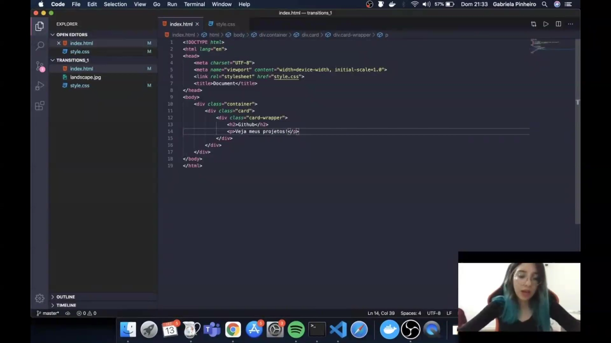
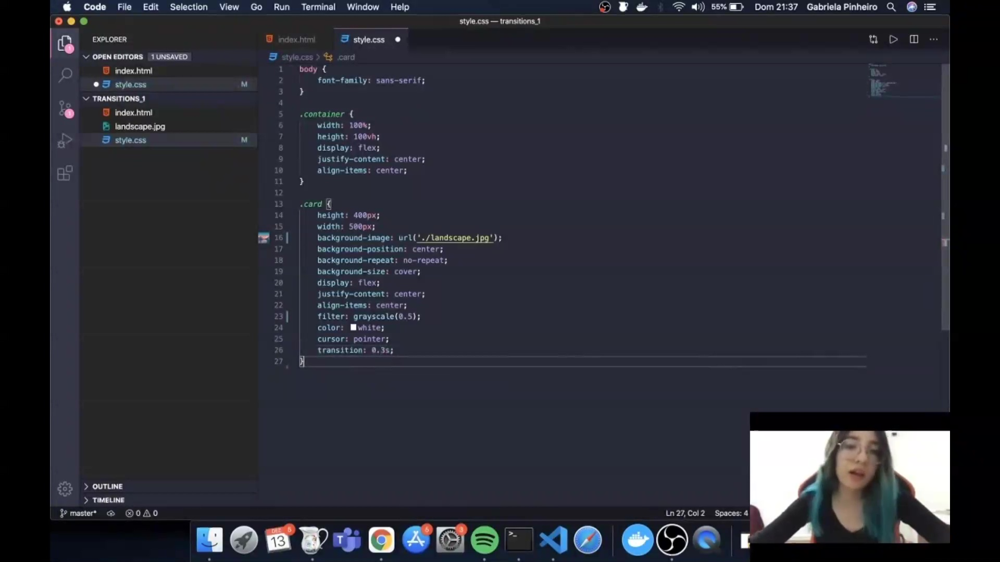
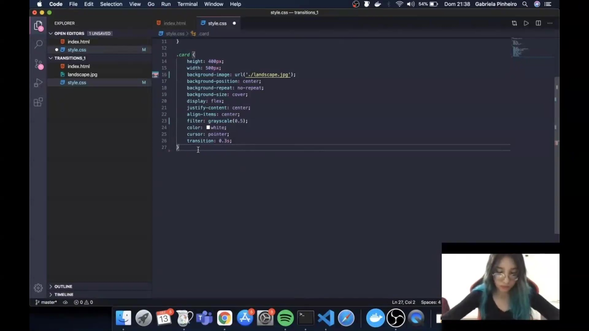
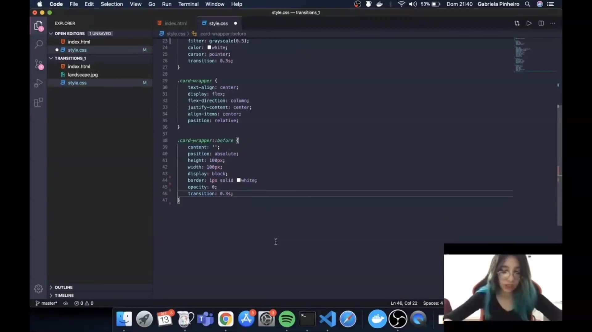
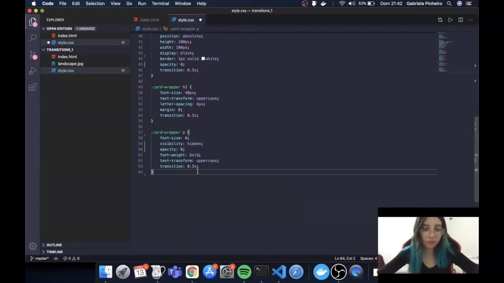
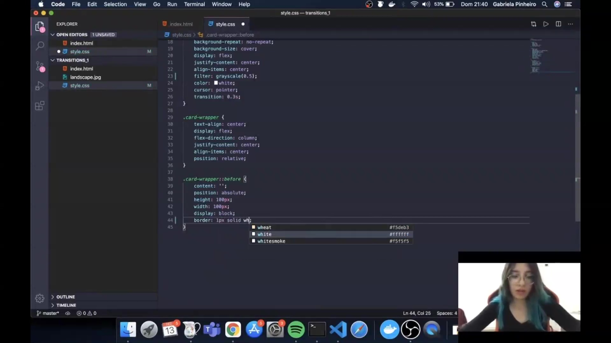

## Instrutor:

- Gabriela Pinheiro (Software Engineer @ Caju | React.js | Next.js | Typescript | Flutter | ex-Uber)
- Contato Linkedin: / [gabrielapinheiro129](https://www.linkedin.com/in/gabrielapinheiro129/)

## 🟩 Vídeo 01 - Parte 1

![[bootcamp_tqi_fullstack-modulo_02-Curso_02-Video_01.webm|vid-60]]

Link do vídeo:  https://web.dio.me/lab/desenvolvendo-um-menu-hamburguer-e-morphing-menu-com-css-transitions/learning/0b8fbfe7-3b69-4a0f-bb86-9f2b826c7731?back=/track/tqi-fullstack-developer

A instrutora expressa entusiasmo ao receber os alunos para uma jornada de aprendizado sobre **transições e animações em CSS**. O conteúdo programático foca no uso de **keyframes** para criar efeitos visuais dinâmicos e fluidos em interfaces. Ao concluir as aulas, os estudantes estarão aptos a implementar esses recursos em seus **portfólios profissionais**. O objetivo principal é tornar os projetos dos desenvolvedores mais **atrativos e impressionantes** para recrutadores no mercado de tecnologia.

## 🟩 Vídeo 02 - Parte 2

![[bootcamp_tqi_fullstack-modulo_02-Curso_02-Video_02.webm|vid-60]]

Link do vídeo: https://web.dio.me/lab/desenvolvendo-um-menu-hamburguer-e-morphing-menu-com-css-transitions/learning/189ea5d2-a2ab-4808-bd56-8280567fd1e2

A instrutora detalha a criação de uma estrutura visual moderna, focando especialmente no uso de **transitions** para suavizar a mudança entre diferentes estados de um elemento. O conteúdo explica como aplicar filtros de **escala de cinza**, posicionar imagens de fundo com a propriedade **cover** e centralizar conteúdos em um contêiner principal. Além disso, o tutorial demonstra a manipulação de **pseudo-elementos** para criar efeitos de bordas que se expandem e textos que surgem dinamicamente durante o **hover**. O objetivo final é ensinar como construir um componente visual elegante para **portfólios**, priorizando a fluidez das animações no navegador.

### Anotações

<p align="center">

</p>

A estrutura inicial do projeto é estabelecida no arquivo `index.html`. O código define a base do documento HTML5, incluindo a vinculação do arquivo de estilos externo `style.css` e a criação de uma estrutura de contêineres aninhados: um `div` principal com a classe `container`, que abriga um `div` com a classe `card`. Dentro do card, existe um `card-wrapper` contendo um título `<h2>` com o texto "Github" e um parágrafo `<p>` para a descrição.

```html
<!DOCTYPE html>
<html lang="en">
<head>
    <meta charset="UTF-8">
    <meta name="viewport" content="width=device-width, initial-scale=1.0">
    <link rel="stylesheet" href="style.css">
    <title>Document</title>
</head>
<body>
    <div class="container">
        <div class="card">
            <div class="card-wrapper">
                <h2>Github</h2>
                <p>Veja meus projetos!</p>
            </div>
        </div>
    </div>
</body>
</html>

```

<p align="center">

</p>

A imagem utilizada como plano de fundo para o card é o arquivo `landscape.jpg`. Ela apresenta uma paisagem natural que será estilizada via CSS para compor o visual do componente, servindo de base para os efeitos de transição e filtros que serão aplicados posteriormente.

<p align="center">

</p>

Nesta etapa, iniciamos a estilização do `body` e do `container`. O `body` recebe uma fonte `sans-serif` para uma aparência limpa. O `.container` é configurado para ocupar toda a largura e altura da janela de visualização (`100vh`), utilizando `flexbox` para centralizar perfeitamente o card tanto na horizontal quanto na vertical.

```css
body {
    font-family: sans-serif;
}

.container {
    width: 100%;
    height: 100vh;
    display: flex;
    justify-content: center;
    align-items: center;
}

```

<p align="center">

</p>

A estilização da classe `.card` define as dimensões do componente (400px de altura e 500px de largura) e aplica a imagem `landscape.jpg` como fundo. Propriedades como `background-position: center`, `background-repeat: no-repeat` e `background-size: cover` garantem que a imagem preencha o card corretamente sem distorções. Além disso, o card é configurado como um contêiner flex para posicionar seu conteúdo interno.

```css
.card {
    height: 400px;
    width: 500px;
    background-image: url('./landscape.jpg');
    background-position: center;
    background-repeat: no-repeat;
    background-size: cover;
    display: flex;
    justify-content: center;
    align-items: center;
}

```

<p align="center">

</p>

Para criar um efeito visual inicial mais sóbrio, aplica-se o filtro `grayscale(0.5)` ao card, deixando a imagem parcialmente em tons de cinza. A cor do texto é definida como branca para contraste, o cursor é alterado para `pointer` para indicar interatividade, e uma transição de `0.3s` é preparada para suavizar mudanças de estado.

```css
.card {
    /* ... propriedades anteriores ... */
    filter: grayscale(0.5);
    color: white;
    cursor: pointer;
    transition: 0.3s;
}

```

<p align="center">

</p>

A classe `.card-wrapper` é configurada para organizar os textos dentro do card. Utiliza-se `flex-direction: column` para alinhar o título e o parágrafo verticalmente, mantendo a centralização. A propriedade `position: relative` é fundamental, pois este elemento servirá de referência para o posicionamento absoluto da borda animada que será criada a seguir.

```css
.card-wrapper {
    text-align: center;
    display: flex;
    flex-direction: column;
    justify-content: center;
    align-items: center;
    position: relative;
}

```

<p align="center">

</p>

Utilizamos o pseudoelemento `.card-wrapper::before` para criar uma moldura decorativa oculta. Inicialmente, ela possui dimensões de 100px por 100px, uma borda branca sólida de 1px e `opacity: 0`. O posicionamento é absoluto para que ela possa ser animada em cima do conteúdo do wrapper sem deslocá-lo.

```css
.card-wrapper::before {
    content: "";
    position: absolute;
    height: 100px;
    width: 100px;
    display: block;
    border: 1px solid white;
    opacity: 0;
    transition: 0.3s;
}

```

<p align="center">

</p>

A transição do pseudoelemento `::before` é ajustada para `0.3s`. Essa configuração garantirá que, quando o estado de hover for ativado, a borda apareça e mude de tamanho de forma fluida, criando o efeito visual de "expansão" da moldura.

```css
.card-wrapper::before {
    /* ... propriedades anteriores ... */
    transition: 0.3s;
}

```

<p align="center">

</p>

O título `<h2>` dentro do `.card-wrapper` é estilizado para ser imponente: fonte de 40px, transformado para letras maiúsculas e com espaçamento entre letras de 4px. Assim como os outros elementos, ele recebe uma transição de `0.3s` para responder suavemente às interações.

```css
.card-wrapper h2 {
    font-size: 40px;
    text-transform: uppercase;
    letter-spacing: 4px;
    margin: 0;
    transition: 0.3s;
}

```

<p align="center">

</p>

O parágrafo `<p>` do wrapper é configurado para estar inicialmente invisível. Definimos seu `font-size` como 0, `visibility: hidden` e `opacity: 0`. Isso permite que ele "surja" apenas quando o usuário interagir com o card, contribuindo para o efeito de revelação progressiva da informação.

```css
.card-wrapper p {
    font-size: 0;
    visibility: hidden;
    opacity: 0;
    font-weight: bold;
    text-transform: uppercase;
    transition: 0.3s;
}

```

<p align="center">

</p>

Definimos as interações de `hover` para o card. Quando o mouse passa sobre ele, o filtro de tons de cinza é removido (`grayscale(0)`), revelando as cores vibrantes da imagem. Simultaneamente, o título `<h2>` tem seu tamanho reduzido para 32px e o espaçamento de letras para 2px, abrindo espaço visual para os outros elementos que aparecerão.

```css
.card:hover {
    filter: grayscale(0);
}

.card:hover .card-wrapper h2 {
    font-size: 32px;
    letter-spacing: 2px;
}

```

<p align="center">

</p>

Finalizando a animação, ao passar o mouse, o pseudoelemento `::before` expande para 300px de altura e 400px de largura, tornando-se visível (`opacity: 1`). O parágrafo `<p>` também é revelado, voltando para o tamanho de fonte de 14px e tornando-se visível. O resultado é um efeito harmonioso onde a borda abraça o conteúdo e a descrição aparece de forma suave.

```css
.card:hover .card-wrapper::before {
    height: 300px;
    width: 400px;
    opacity: 1;
}

.card:hover .card-wrapper p {
    opacity: 1;
    visibility: visible;
    font-size: 14px;
}

```

#### ▶️ Código HTML
```html
<!DOCTYPE html>
<html lang="en">
<head>
    <meta charset="UTF-8">
    <meta name="viewport" content="width=device-width, initial-scale=1.0">
    <link rel="stylesheet" href="style.css">
    <title>Document</title>
</head>
<body>
    <div class="container">
        <div class="card">
            <div class="card-wrapper">
                <h2>Github</h2>
                <p>Veja meus projetos!</p>
            </div>
        </div>
    </div>
</body>
</html>
```

#### ▶️ Código CSS
```css
/* Configuração básica do corpo da página */
body {
    font-family: sans-serif;
}

/* Centralização absoluta do card na viewport */
.container {
    width: 100%;
    height: 100vh;
    display: flex;
    justify-content: center;
    align-items: center;
}

/* Estilização do Card e aplicação da imagem de fundo */
.card {
    height: 400px;
    width: 500px;
    background-image: url('./landscape.jpg'); /* Imagem base do projeto */
    background-position: center;
    background-repeat: no-repeat;
    background-size: cover;
    display: flex;
    justify-content: center;
    align-items: center;
    
    /* Estado inicial: parcialmente em tons de cinza */
    filter: grayscale(0.5);
    color: white;
    cursor: pointer;
    transition: 0.3s; /* Suaviza a volta das cores no hover */
}

/* Organização do conteúdo textual dentro do card */
.card-wrapper {
    text-align: center;
    display: flex;
    flex-direction: column;
    justify-content: center;
    align-items: center;
    position: relative; /* Necessário para posicionar a borda ::before */
}

/* Criação da moldura animada usando pseudoelemento */
.card-wrapper::before {
    content: "";
    position: absolute;
    height: 100px; /* Tamanho inicial menor */
    width: 100px;
    display: block;
    border: 1px solid white;
    opacity: 0; /* Invisível inicialmente */
    transition: 0.3s; /* Define a velocidade da expansão da borda */
}

/* Estilização do Título */
.card-wrapper h2 {
    font-size: 40px;
    text-transform: uppercase;
    letter-spacing: 4px;
    margin: 0;
    transition: 0.3s;
}

/* Estilização do Parágrafo (Descrição oculta) */
.card-wrapper p {
    font-size: 0; /* Começa sem tamanho para o efeito de surgimento */
    visibility: hidden;
    opacity: 0;
    font-weight: bold;
    text-transform: uppercase;
    transition: 0.3s;
}

/* --- ESTADOS DE INTERAÇÃO (HOVER) --- */

/* Remove o filtro de cinza ao passar o mouse */
.card:hover {
    filter: grayscale(0);
}

/* Ajusta o título para dar espaço à descrição e à borda */
.card:hover .card-wrapper h2 {
    font-size: 32px;
    letter-spacing: 2px;
}

/* Expande e revela a moldura branca */
.card:hover .card-wrapper::before {
    height: 300px;
    width: 400px;
    opacity: 1;
}

/* Revela a descrição com animação de opacidade e tamanho */
.card:hover .card-wrapper p {
    opacity: 1;
    visibility: visible;
    font-size: 14px;
}
```


## 🟩 Vídeo 03 - Parte 3


Link do vídeo: 


## 🟩 Vídeo 04 - Parte 4


Link do vídeo: 


## 🟩 Vídeo 05 - Parte 5


Link do vídeo: 


## 🟩 Vídeo 06 - Parte 6


Link do vídeo: 


## 🟩 Vídeo 07 - Parte 7


Link do vídeo:  


##  Materiais de Apoio


# Certificado: 

- Link na plataforma: 
- Certificado em pdf: 
