## Instrutor

- Gabriela Pinheiro (Software Engineer @ Caju | React.js | Next.js | Typescript | Flutter | ex-Uber)
- Contato Linkedin: / [gabrielapinheiro129](https://www.linkedin.com/in/gabrielapinheiro129/)

## 🟩 Vídeo 01 - Parte 1

![[bootcamp_tqi_fullstack-modulo_02-Curso_02-Video_01.webm|vid-60]]

Link do vídeo:  https://web.dio.me/lab/desenvolvendo-um-menu-hamburguer-e-morphing-menu-com-css-transitions/learning/0b8fbfe7-3b69-4a0f-bb86-9f2b826c7731?back=/track/tqi-fullstack-developer

A instrutora expressa entusiasmo ao receber os alunos para uma jornada de aprendizado sobre **transições e animações em CSS**. O conteúdo programático foca no uso de **keyframes** para criar efeitos visuais dinâmicos e fluidos em interfaces. Ao concluir as aulas, os estudantes estarão aptos a implementar esses recursos em seus **portfólios profissionais**. O objetivo principal é tornar os projetos dos desenvolvedores mais **atrativos e impressionantes** para recrutadores no mercado de tecnologia.

## 🟩 Vídeo 02 - Parte 2

![[bootcamp_tqi_fullstack-modulo_02-Curso_02-Video_02.webm|vid-60]]

Link do vídeo: https://web.dio.me/lab/desenvolvendo-um-menu-hamburguer-e-morphing-menu-com-css-transitions/learning/189ea5d2-a2ab-4808-bd56-8280567fd1e2

A instrutora detalha a criação de uma estrutura visual moderna, focando especialmente no uso de **transitions** para suavizar a mudança entre diferentes estados de um elemento. O conteúdo explica como aplicar filtros de **escala de cinza**, posicionar imagens de fundo com a propriedade **cover** e centralizar conteúdos em um contêiner principal. Além disso, o tutorial demonstra a manipulação de **pseudo-elementos** para criar efeitos de bordas que se expandem e textos que surgem dinamicamente durante o **hover**. O objetivo final é ensinar como construir um componente visual elegante para **portfólios**, priorizando a fluidez das animações no navegador.

### Anotações

<p align="center">

</p>

A estrutura inicial do projeto é estabelecida no arquivo `index.html`. O código define a base do documento HTML5, incluindo a vinculação do arquivo de estilos externo `style.css` e a criação de uma estrutura de contêineres aninhados: um `div` principal com a classe `container`, que abriga um `div` com a classe `card`. Dentro do card, existe um `card-wrapper` contendo um título `<h2>` com o texto "Github" e um parágrafo `<p>` para a descrição.

```html
<!DOCTYPE html>
<html lang="en">
<head>
    <meta charset="UTF-8">
    <meta name="viewport" content="width=device-width, initial-scale=1.0">
    <link rel="stylesheet" href="style.css">
    <title>Document</title>
</head>
<body>
    <div class="container">
        <div class="card">
            <div class="card-wrapper">
                <h2>Github</h2>
                <p>Veja meus projetos!</p>
            </div>
        </div>
    </div>
</body>
</html>

```

<p align="center">

</p>

A imagem utilizada como plano de fundo para o card é o arquivo `landscape.jpg`. Ela apresenta uma paisagem natural que será estilizada via CSS para compor o visual do componente, servindo de base para os efeitos de transição e filtros que serão aplicados posteriormente.

<p align="center">

</p>

Nesta etapa, iniciamos a estilização do `body` e do `container`. O `body` recebe uma fonte `sans-serif` para uma aparência limpa. O `.container` é configurado para ocupar toda a largura e altura da janela de visualização (`100vh`), utilizando `flexbox` para centralizar perfeitamente o card tanto na horizontal quanto na vertical.

```css
body {
    font-family: sans-serif;
}

.container {
    width: 100%;
    height: 100vh;
    display: flex;
    justify-content: center;
    align-items: center;
}

```

<p align="center">

</p>

A estilização da classe `.card` define as dimensões do componente (400px de altura e 500px de largura) e aplica a imagem `landscape.jpg` como fundo. Propriedades como `background-position: center`, `background-repeat: no-repeat` e `background-size: cover` garantem que a imagem preencha o card corretamente sem distorções. Além disso, o card é configurado como um contêiner flex para posicionar seu conteúdo interno.

```css
.card {
    height: 400px;
    width: 500px;
    background-image: url('./landscape.jpg');
    background-position: center;
    background-repeat: no-repeat;
    background-size: cover;
    display: flex;
    justify-content: center;
    align-items: center;
}

```

<p align="center">

</p>

Para criar um efeito visual inicial mais sóbrio, aplica-se o filtro `grayscale(0.5)` ao card, deixando a imagem parcialmente em tons de cinza. A cor do texto é definida como branca para contraste, o cursor é alterado para `pointer` para indicar interatividade, e uma transição de `0.3s` é preparada para suavizar mudanças de estado.

```css
.card {
    /* ... propriedades anteriores ... */
    filter: grayscale(0.5);
    color: white;
    cursor: pointer;
    transition: 0.3s;
}

```

<p align="center">

</p>

A classe `.card-wrapper` é configurada para organizar os textos dentro do card. Utiliza-se `flex-direction: column` para alinhar o título e o parágrafo verticalmente, mantendo a centralização. A propriedade `position: relative` é fundamental, pois este elemento servirá de referência para o posicionamento absoluto da borda animada que será criada a seguir.

```css
.card-wrapper {
    text-align: center;
    display: flex;
    flex-direction: column;
    justify-content: center;
    align-items: center;
    position: relative;
}

```

<p align="center">

</p>

Utilizamos o pseudoelemento `.card-wrapper::before` para criar uma moldura decorativa oculta. Inicialmente, ela possui dimensões de 100px por 100px, uma borda branca sólida de 1px e `opacity: 0`. O posicionamento é absoluto para que ela possa ser animada em cima do conteúdo do wrapper sem deslocá-lo.

```css
.card-wrapper::before {
    content: "";
    position: absolute;
    height: 100px;
    width: 100px;
    display: block;
    border: 1px solid white;
    opacity: 0;
    transition: 0.3s;
}

```

<p align="center">

</p>

A transição do pseudoelemento `::before` é ajustada para `0.3s`. Essa configuração garantirá que, quando o estado de hover for ativado, a borda apareça e mude de tamanho de forma fluida, criando o efeito visual de "expansão" da moldura.

```css
.card-wrapper::before {
    /* ... propriedades anteriores ... */
    transition: 0.3s;
}

```

<p align="center">

</p>

O título `<h2>` dentro do `.card-wrapper` é estilizado para ser imponente: fonte de 40px, transformado para letras maiúsculas e com espaçamento entre letras de 4px. Assim como os outros elementos, ele recebe uma transição de `0.3s` para responder suavemente às interações.

```css
.card-wrapper h2 {
    font-size: 40px;
    text-transform: uppercase;
    letter-spacing: 4px;
    margin: 0;
    transition: 0.3s;
}

```

<p align="center">

</p>

O parágrafo `<p>` do wrapper é configurado para estar inicialmente invisível. Definimos seu `font-size` como 0, `visibility: hidden` e `opacity: 0`. Isso permite que ele "surja" apenas quando o usuário interagir com o card, contribuindo para o efeito de revelação progressiva da informação.

```css
.card-wrapper p {
    font-size: 0;
    visibility: hidden;
    opacity: 0;
    font-weight: bold;
    text-transform: uppercase;
    transition: 0.3s;
}

```

<p align="center">

</p>

Definimos as interações de `hover` para o card. Quando o mouse passa sobre ele, o filtro de tons de cinza é removido (`grayscale(0)`), revelando as cores vibrantes da imagem. Simultaneamente, o título `<h2>` tem seu tamanho reduzido para 32px e o espaçamento de letras para 2px, abrindo espaço visual para os outros elementos que aparecerão.

```css
.card:hover {
    filter: grayscale(0);
}

.card:hover .card-wrapper h2 {
    font-size: 32px;
    letter-spacing: 2px;
}

```

<p align="center">

</p>

Finalizando a animação, ao passar o mouse, o pseudoelemento `::before` expande para 300px de altura e 400px de largura, tornando-se visível (`opacity: 1`). O parágrafo `<p>` também é revelado, voltando para o tamanho de fonte de 14px e tornando-se visível. O resultado é um efeito harmonioso onde a borda abraça o conteúdo e a descrição aparece de forma suave.

```css
.card:hover .card-wrapper::before {
    height: 300px;
    width: 400px;
    opacity: 1;
}

.card:hover .card-wrapper p {
    opacity: 1;
    visibility: visible;
    font-size: 14px;
}

```

#### ▶️ Código HTML
```html
<!DOCTYPE html>
<html lang="en">
<head>
    <meta charset="UTF-8">
    <meta name="viewport" content="width=device-width, initial-scale=1.0">
    <link rel="stylesheet" href="style.css">
    <title>Document</title>
</head>
<body>
    <div class="container">
        <div class="card">
            <div class="card-wrapper">
                <h2>Github</h2>
                <p>Veja meus projetos!</p>
            </div>
        </div>
    </div>
</body>
</html>
```

#### ▶️ Código CSS
```css
/* Configuração básica do corpo da página */
body {
    font-family: sans-serif;
}

/* Centralização absoluta do card na viewport */
.container {
    width: 100%;
    height: 100vh;
    display: flex;
    justify-content: center;
    align-items: center;
}

/* Estilização do Card e aplicação da imagem de fundo */
.card {
    height: 400px;
    width: 500px;
    background-image: url('./landscape.jpg'); /* Imagem base do projeto */
    background-position: center;
    background-repeat: no-repeat;
    background-size: cover;
    display: flex;
    justify-content: center;
    align-items: center;
    
    /* Estado inicial: parcialmente em tons de cinza */
    filter: grayscale(0.5);
    color: white;
    cursor: pointer;
    transition: 0.3s; /* Suaviza a volta das cores no hover */
}

/* Organização do conteúdo textual dentro do card */
.card-wrapper {
    text-align: center;
    display: flex;
    flex-direction: column;
    justify-content: center;
    align-items: center;
    position: relative; /* Necessário para posicionar a borda ::before */
}

/* Criação da moldura animada usando pseudoelemento */
.card-wrapper::before {
    content: "";
    position: absolute;
    height: 100px; /* Tamanho inicial menor */
    width: 100px;
    display: block;
    border: 1px solid white;
    opacity: 0; /* Invisível inicialmente */
    transition: 0.3s; /* Define a velocidade da expansão da borda */
}

/* Estilização do Título */
.card-wrapper h2 {
    font-size: 40px;
    text-transform: uppercase;
    letter-spacing: 4px;
    margin: 0;
    transition: 0.3s;
}

/* Estilização do Parágrafo (Descrição oculta) */
.card-wrapper p {
    font-size: 0; /* Começa sem tamanho para o efeito de surgimento */
    visibility: hidden;
    opacity: 0;
    font-weight: bold;
    text-transform: uppercase;
    transition: 0.3s;
}

/* --- ESTADOS DE INTERAÇÃO (HOVER) --- */

/* Remove o filtro de cinza ao passar o mouse */
.card:hover {
    filter: grayscale(0);
}

/* Ajusta o título para dar espaço à descrição e à borda */
.card:hover .card-wrapper h2 {
    font-size: 32px;
    letter-spacing: 2px;
}

/* Expande e revela a moldura branca */
.card:hover .card-wrapper::before {
    height: 300px;
    width: 400px;
    opacity: 1;
}

/* Revela a descrição com animação de opacidade e tamanho */
.card:hover .card-wrapper p {
    opacity: 1;
    visibility: visible;
    font-size: 14px;
}
```


## 🟩 Vídeo 03 - Parte 3

![[bootcamp_tqi_fullstack-modulo_02-Curso_02-Video_03.webm|vid-60]]

Link do vídeo: https://web.dio.me/lab/desenvolvendo-um-menu-hamburguer-e-morphing-menu-com-css-transitions/learning/3674cd8b-668e-4661-8566-85e16a48d74d?back=/track/tqi-fullstack-developer

Esta fonte apresenta um tutorial prático sobre como criar um **menu hambúrguer animado** utilizando exclusivamente **HTML e CSS**, sem a necessidade de JavaScript. O instrutor demonstra a construção de uma estrutura baseada em um **checkbox e label**, onde o estado de "marcado" do input dispara as transições visuais. Através de propriedades como **transform, rotate e opacity**, os três traços horizontais do menu são convertidos suavemente em um ícone de fechar (X). O conteúdo enfatiza o uso da técnica **transition com easing**, garantindo que o movimento seja fluido e visualmente atraente para interfaces móveis. Por fim, o autor destaca que este é um recurso **simples e eficiente** para iniciantes consolidarem conhecimentos em posicionamento absoluto e seletores de estado.

### Anotações

<p align="center">
  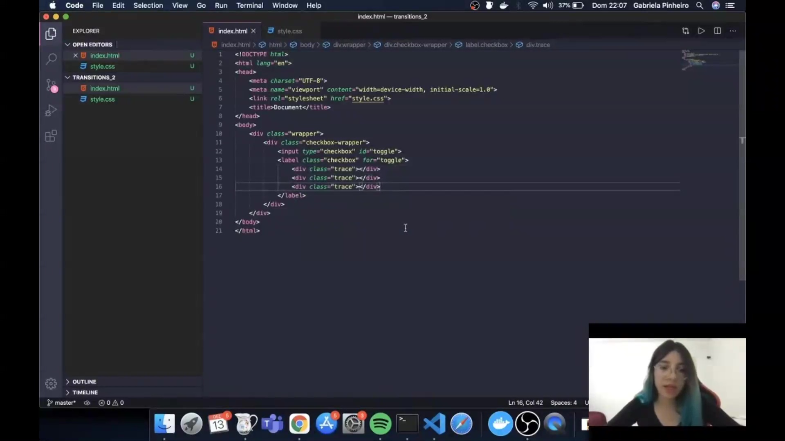
</p>

Este trecho mostra a estrutura inicial do arquivo **index.html**, onde são definidos o `wrapper`, o `checkbox-wrapper`, o `input` do tipo `checkbox` e o `label` com três divs internas (`trace`). Essa configuração é a base para criar o menu hambúrguer que será animado.

```html
<div class="wrapper">
  <div class="checkbox-wrapper">
    <input type="checkbox" id="toggle">
    <label class="checkbox" for="toggle">
      <div class="trace"></div>
      <div class="trace"></div>
      <div class="trace"></div>
    </label>
  </div>
</div>
```

---

#### 

<p align="center">
  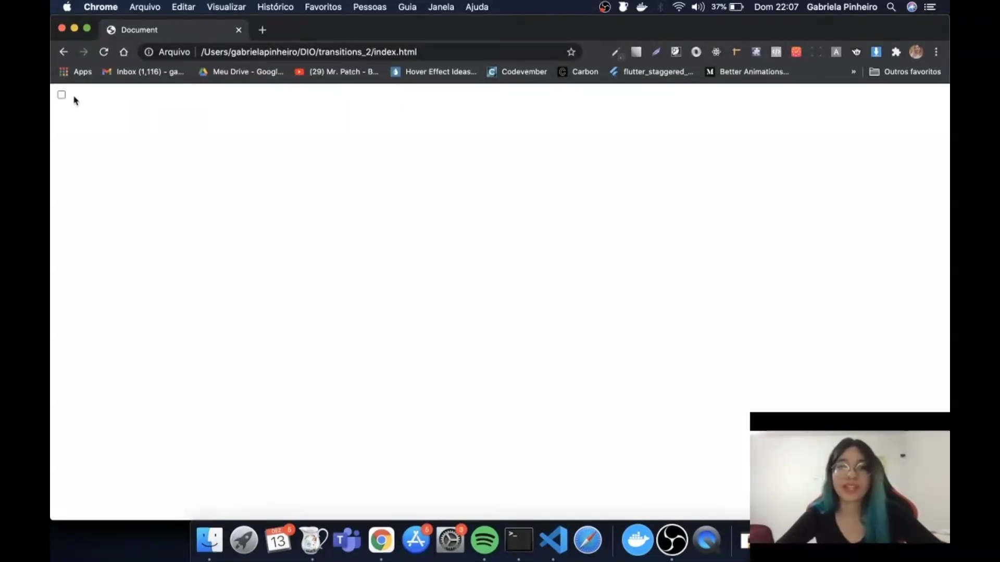
</p>

Aqui vemos o mesmo arquivo HTML aberto no navegador, reforçando a importância da ordem dos elementos: o `input` deve vir antes do `label` para que o seletor CSS `:checked + label` funcione corretamente. O label contém os três traços que compõem o ícone do menu.

---

#### 

<p align="center">
  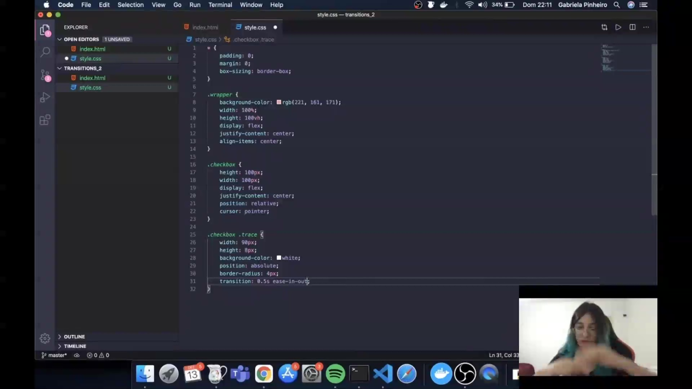
</p>

Este slide mostra o início do arquivo **style.css**, onde são aplicados estilos globais e definidos os parâmetros básicos do `wrapper`. O objetivo é centralizar o conteúdo na tela e aplicar o fundo colorido.

```css
* {
  padding: 0;
  margin: 0;
  box-sizing: border-box;
}

.wrapper {
  background-color: rgb(221, 161, 171);
  width: 100%;
  height: 100vh;
  display: flex;
  justify-content: center;
  align-items: center;
}
```

---

#### 

<p align="center">
  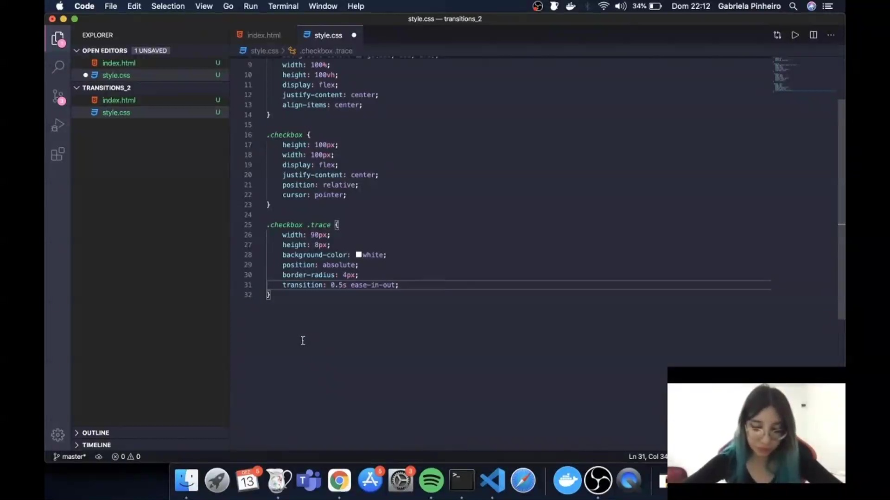
</p>

Nesta etapa, o CSS define as dimensões e o comportamento do `label.checkbox`. Ele é configurado com altura e largura fixas, `position: relative` e `cursor: pointer`, permitindo que os traços internos sejam posicionados de forma absoluta.

---

#### 

<p align="center">
  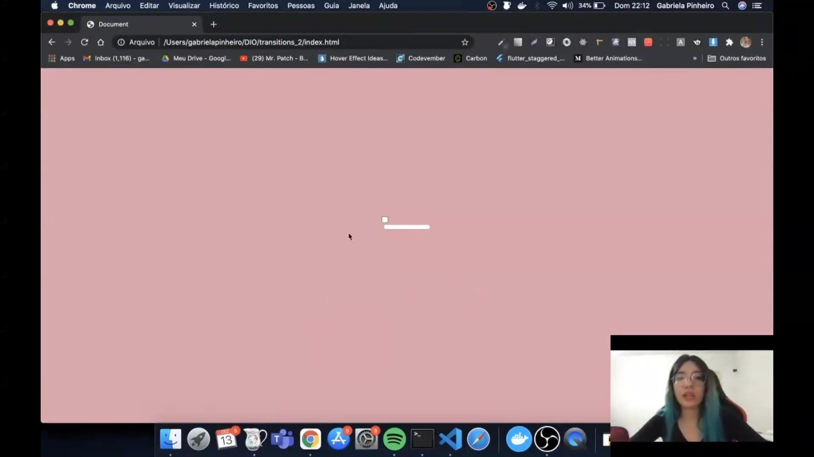
</p>

O código mostra a estilização dos traços (`.trace`). Cada traço é uma barra branca com bordas arredondadas e transição suave, o que permitirá a animação posterior.

```css
.checkbox .trace {
  width: 90px;
  height: 8px;
  background-color: white;
  position: absolute;
  border-radius: 4px;
  transition: 0.5s ease-in-out;
}
```

---

#### 

<p align="center">
  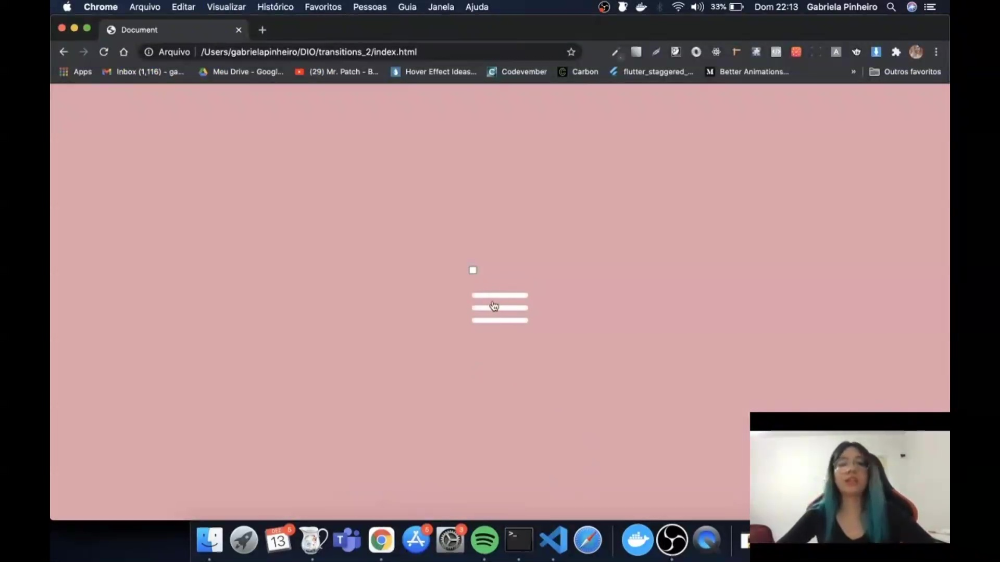
</p>

Aqui são aplicados os seletores `nth-child` para posicionar cada traço verticalmente dentro do botão. Isso cria o visual clássico do menu hambúrguer.

```css
.checkbox .trace:nth-child(1) {
  top: 26px;
}

.checkbox .trace:nth-child(2) {
  top: 46px;
}

.checkbox .trace:nth-child(3) {
  top: 66px;
}
```

---

#### 

<p align="center">
  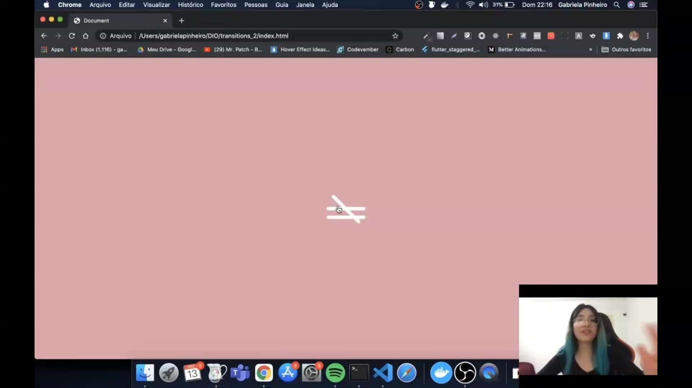
</p>

Este trecho mostra a ocultação do `input` original (`display: none`), já que o label será o elemento visível e interativo. A lógica CSS usará o estado `:checked` do input para animar os traços.

```css
#toggle {
  display: none;
}
```

---

#### 

<p align="center">
  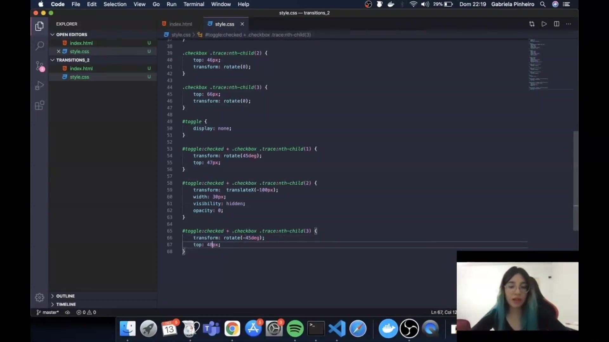
</p>

Aqui vemos a regra para o **primeiro traço** quando o checkbox está marcado. Ele rotaciona 45 graus e se reposiciona para formar parte do "X".

```css
#toggle:checked + .checkbox .trace:nth-child(1) {
  transform: rotate(45deg);
  top: 47px;
}
```

---

#### 

<p align="center">
  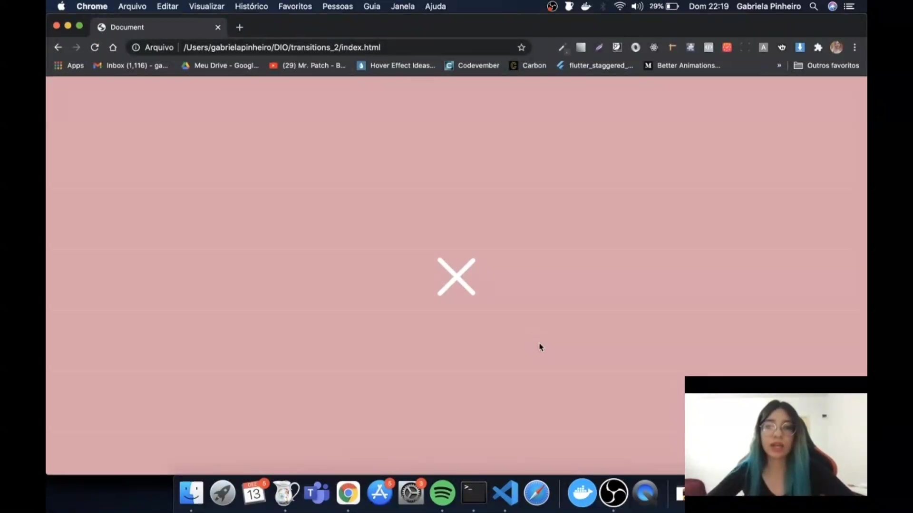
</p>

Este bloco mostra a animação do **segundo traço**. Ele é deslocado para fora da tela, reduzido e ocultado, desaparecendo para que apenas os dois traços restantes formem o "X".

```css
#toggle:checked + .checkbox .trace:nth-child(2) {
  transform: translateX(-100px);
  width: 30px;
  visibility: hidden;
  opacity: 0;
}
```

---

#### 

<p align="center">
  
</p>

Aqui está a regra para o **terceiro traço**. Ele rotaciona -45 graus e ajusta sua posição para completar o ícone de fechamento.

```css
#toggle:checked + .checkbox .trace:nth-child(3) {
  transform: rotate(-45deg);
  top: 48px;
}
```

---

#### 

<p align="center">
  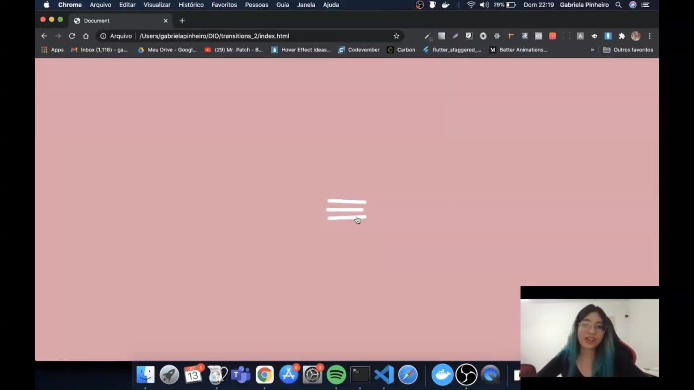
</p>

Este slide reforça a transição suave aplicada anteriormente. O efeito `ease-in-out` garante que os movimentos de rotação e desaparecimento dos traços sejam fluidos e elegantes.

---

#### 

<p align="center">
  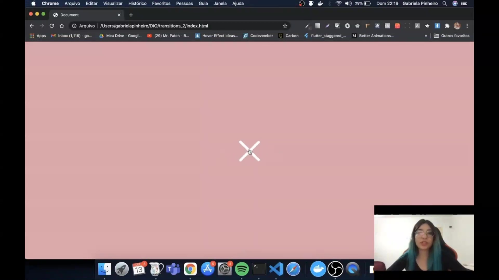
</p>

O resultado final é o menu hambúrguer que se transforma em um "X" ao ser clicado, utilizando apenas HTML e CSS. Esse exemplo demonstra como o seletor `:checked` pode ser usado para criar interações sem JavaScript.

#### ▶️ Código HTML

```html
<!DOCTYPE html>
<html lang="en">
<head>
  <meta charset="UTF-8">
  <meta name="viewport" content="width=device-width, initial-scale=1.0">
  <link rel="stylesheet" href="style.css">
  <title>Document</title>
</head>
<body>

  <div class="wrapper">
    <div class="checkbox-wrapper">
      <input type="checkbox" id="toggle">
      <label class="checkbox" for="toggle">
        <div class="trace"></div>
        <div class="trace"></div>
        <div class="trace"></div>
      </label>
    </div>
  </div>

</body>
</html>

```

#### ▶️ Código CSS

```css
/* Reset básico: remove margens e espaçamentos padrão
   e define o box-sizing para facilitar cálculos de layout */
* {
  padding: 0;
  margin: 0;
  box-sizing: border-box;
}

/* Wrapper principal: ocupa toda a tela e centraliza o conteúdo */
.wrapper {
  background-color: rgb(221, 161, 171); /* cor de fundo */
  width: 100%;                          /* largura total */
  height: 100vh;                        /* altura da viewport */
  display: flex;                        /* ativa flexbox */
  justify-content: center;              /* centraliza horizontalmente */
  align-items: center;                  /* centraliza verticalmente */
}

/* Label que funciona como botão do menu hambúrguer */
.checkbox {
  height: 100px;        /* altura do botão */
  width: 100px;         /* largura do botão */
  display: flex;        /* flexbox para alinhar traços */
  justify-content: center;
  position: relative;   /* necessário para posicionar traços absolutos */
  cursor: pointer;      /* cursor de mão ao passar por cima */
}

/* Estilo dos traços do menu hambúrguer */
.checkbox .trace {
  width: 90px;                  /* largura da barra */
  height: 8px;                  /* espessura da barra */
  background-color: white;      /* cor branca */
  position: absolute;           /* posicionamento relativo ao pai */
  border-radius: 4px;           /* bordas arredondadas */
  transition: 0.5s ease-in-out; /* animação suave */
}

/* Posição vertical de cada traço */
.checkbox .trace:nth-child(1) {
  top: 26px; /* primeiro traço */
}

.checkbox .trace:nth-child(2) {
  top: 46px; /* segundo traço */
}

.checkbox .trace:nth-child(3) {
  top: 66px; /* terceiro traço */
}

/* Esconde o input original, já que o label será o botão visível */
#toggle {
  display: none;
}

/* Animação do primeiro traço quando o checkbox está marcado */
#toggle:checked + .checkbox .trace:nth-child(1) {
  transform: rotate(45deg);
```


## 🟩 Vídeo 04 - Parte 4

![[bootcamp_tqi_fullstack-modulo_02-Curso_02-Video_04.webm|vid-60]]

Link do vídeo: https://web.dio.me/lab/desenvolvendo-um-menu-hamburguer-e-morphing-menu-com-css-transitions/learning/f9f0ec19-f126-48ba-b520-d13f8fad23e3

Esta fonte consiste em uma aula técnica sobre **animações avançadas em CSS**, focada na transição do uso básico de `transitions` para o controle detalhado via **keyframes**. O instrutor orienta a construção prática de uma **landing page de portfólio**, demonstrando como configurar uma estrutura HTML simples e estilizá-la com fontes personalizadas. O destaque do tutorial é a criação de um **background com gradiente animado**, que altera suas cores de forma fluida sem a necessidade de JavaScript. Através da propriedade `background-size` e do posicionamento estratégico em diferentes **porcentagens da linha do tempo**, o autor ensina a gerar efeitos visuais dinâmicos e harmônicos. Além disso, o conteúdo explora o uso de funções de tempo complexas, como **cubic-bezier**, para refinar a interatividade dos botões e links sociais.

### Anotações

Resultado na tela:

<p align="center">
  
</p>


#### ▶️ Código HTML
```html
<!DOCTYPE html>
<html lang="en">
<head>
    <meta charset="UTF-8">
    <meta name="viewport" content="width=device-width, initial-scale=1.0">
    <link rel="stylesheet" href="style.css">
    <title>Document</title>
</head>
<body>
    <main class="wrapper">
        <h1>Gabriela Pinheiro</h1>
        <h2>Front-end Developer</h2>
        <div class="social-media">
            <a href="#">Linkedin</a>
            <a href="#">Github</a>
        </div>
    </main>
</body>
```

#### ▶️ Código CSS
```css
/* Importa a fonte "Amatic SC" do Google Fonts */
@import url('https://fonts.googleapis.com/css2?family=Amatic+SC&display=swap');

/* Estilo global do body */
body {
    margin: 0; /* Remove margens padrão */
    padding: 0; /* Remove espaçamentos internos padrão */
    color: #ffffff; /* Define cor do texto como branco */
    font-family: 'amatic sc', sans-serif; /* Aplica a fonte importada */
}

/* Container principal que ocupa toda a tela */
.wrapper {
    height: 100vh; /* Altura igual à altura da janela */
    width: 100vw;  /* Largura igual à largura da janela */
    background: linear-gradient(-45deg, #5e0878, #085078, #4ca59b, #1fa194); /* Gradiente de fundo */
    background-size: 400% 400%; /* Expande o gradiente para permitir animação */
    display: flex; /* Ativa flexbox */
    flex-direction: column; /* Organiza elementos em coluna */
    justify-content: center; /* Centraliza verticalmente */
    align-items: center; /* Centraliza horizontalmente */
    animation: backgroundTransition 8s ease-in-out infinite; /* Animação contínua do fundo */
}

/* Estilo para títulos h1 */
h1 {
    text-transform: uppercase; /* Converte texto para maiúsculas */
    letter-spacing: 4px; /* Espaçamento entre letras */
}

/* Estilo para títulos h2 */
h2 {
    text-transform: uppercase; /* Converte texto para maiúsculas */
    letter-spacing: 4px; /* Espaçamento entre letras */
}

/* Container para ícones de redes sociais */
.social-media {
    margin-top: 1rem; /* Espaçamento superior */
    display: flex; /* Organiza ícones em linha */
}

/* Estilo para links */
a {
    text-decoration: none; /* Remove sublinhado padrão */
    color: #ffffff; /* Texto branco */
    font-size: 24px; /* Tamanho da fonte */
    padding: 1rem 4rem; /* Espaçamento interno (vertical e horizontal) */
    border: 1px solid #ffffff; /* Borda branca */
    min-width: 4rem; /* Largura mínima */
    display: flex; /* Flexbox para centralizar conteúdo */
    justify-content: center; /* Centraliza horizontalmente */
    align-items: center; /* Centraliza verticalmente */
    transition: .5s cubic-bezier(0.55, 0.025, 0.675, 0.97); /* Transição suave personalizada */
}

/* Efeito hover nos links */
a:hover {
    color: #085078; /* Texto muda para azul */
    background-color: #ffffff; /* Fundo branco */
}

/* Animação do gradiente de fundo */
@keyframes backgroundTransition {
    0% {
        background-position:  0% 80%; /* Posição inicial */
    }
    50% {
        background-position: 80% 100%; /* Posição intermediária */
    }
    100% {
        background-position: 0% 90%; /* Posição final */
    }
}
```


## 🟩 Vídeo 05 - Parte 5

![[bootcamp_tqi_fullstack-modulo_02-Curso_02-Video_05.webm|vid-60]]

Link do vídeo: https://web.dio.me/lab/desenvolvendo-um-menu-hamburguer-e-morphing-menu-com-css-transitions/learning/6bd13b76-1905-4b6b-8ccb-f3fc81681d9e

Esta fonte apresenta um **tutorial técnico em vídeo** focado no desenvolvimento de uma interface visual utilizando exclusivamente **CSS e HTML**. O autor demonstra como construir um **ícone de chat flutuante** com animações integradas que simulam uma pessoa digitando. Durante a explicação, são detalhadas técnicas para a criação de **formas geométricas**, como triângulos e círculos, sem a necessidade de imagens externas ou arquivos SVG. O instrutor enfatiza o uso de **Keyframes e Animation Delay** para sincronizar o movimento das bolinhas internas e o balanço do ícone. Ao final, o conteúdo destaca como essas ferramentas de estilização podem conferir **dinamismo e interatividade** a projetos de desenvolvimento web modernos.

### Anotações

Saída na tela:

<p align="center">
  
</p>


#### ▶️ Código HTML

```html
<!DOCTYPE html>
<html lang="en">
<head>
    <meta charset="UTF-8">
    <meta name="viewport" content="width=device-width, initial-scale=1.0">
    <link rel="stylesheet" href="style.css">
    <title>Document</title>
</head>
<body>
    <main class="wrapper">
        <div class="chatbot">
            <div class="chatbot__loading"></div>
            <div class="chatbot__loading"></div>
            <div class="chatbot__loading"></div>
        </div>
    </main>
</body>
</html>
```

#### ▶️ Código CSS

```css
/* Estilo global do body */
body {
    margin: 0; /* Remove margens padrão */
    padding: 0; /* Remove espaçamentos internos padrão */
    font-family: sans-serif; /* Define fonte simples e legível */
}

/* Container principal que ocupa toda a tela */
.wrapper {
    height: 100vh; /* Altura igual à altura da janela */
    width: 100vw;  /* Largura igual à largura da janela */
    background-color: rgb(53, 53, 53); /* Fundo cinza escuro */
    display: flex; /* Ativa flexbox */
    justify-content: center; /* Centraliza horizontalmente */
    align-items: center; /* Centraliza verticalmente */
}

/* Caixa que representa o chatbot */
.chatbot {
    height: 4rem; /* Altura da caixa */
    width: 8rem;  /* Largura da caixa */
    border-radius: 36px; /* Bordas arredondadas */
    border: 4px solid #949494; /* Borda cinza */
    padding: 0 1rem; /* Espaçamento interno lateral */
    box-sizing: border-box; /* Inclui borda e padding no cálculo total */
    display: flex; /* Flexbox para alinhar elementos internos */
    justify-content: space-evenly; /* Espaçamento uniforme entre elementos */
    align-items: center; /* Centraliza verticalmente os elementos */
    position: relative; /* Necessário para posicionar pseudo-elementos */
    transform: translateY(0); /* Posição inicial */
    animation: chatTranslate 2s ease-in-out infinite; /* Animação de movimento vertical */
}

/* Triângulo abaixo da caixa, simulando balão de fala */
.chatbot::before {
    content: ''; /* Cria elemento vazio */
    width: 0;
    height: 0;
    position: absolute;
    bottom: -1.3rem; /* Posiciona abaixo da caixa */
    left: 2rem; /* Ajusta posição horizontal */
    border-left: 2px solid transparent; /* Lado esquerdo transparente */
    border-right: 17px solid transparent; /* Lado direito transparente */
    border-top: 17px solid #949494; /* Triângulo apontando para baixo */
}

/* Bolinhas de carregamento dentro do chatbot */
.chatbot__loading {
    height: 10px; /* Altura da bolinha */
    width: 10px;  /* Largura da bolinha */
    border-radius: 50%; /* Forma circular */
    background-color: #949494; /* Cor cinza */
    transform: scale(1); /* Tamanho inicial */
}

/* Primeira bolinha com animação de pulsar */
.chatbot__loading:nth-child(1) {
    animation: pulse 1.5s ease-in-out infinite;
}

/* Segunda bolinha com atraso na animação */
.chatbot__loading:nth-child(2) {
    animation: pulse 1.5s ease-in-out infinite;
    animation-delay: 0.2s;
}

/* Terceira bolinha com maior atraso */
.chatbot__loading:nth-child(3) {
    animation: pulse 1.5s ease-in-out infinite;
    animation-delay: 0.4s;
}

/* Animação de pulsar (aumenta e diminui o tamanho das bolinhas) */
@keyframes pulse {
    0% {
        transform: scale(1); /* Tamanho normal */
    }
    50% {
        transform: scale(1.5); /* Cresce */
    }
    100% {
        transform: scale(1); /* Volta ao normal */
    }
}

/* Animação de movimento vertical da caixa do chatbot */
@keyframes chatTranslate {
    0% {
        transform: translateY(0); /* Posição inicial */
    }
    50% {
        transform: translateY(15px); /* Move para baixo */
    }
    100% {
        transform: translateY(0); /* Volta para cima */
    }
}

```


## 🟩 Vídeo 06 - Parte 6

![[bootcamp_tqi_fullstack-modulo_02-Curso_02-Video_06|vid-60.webm]]

Link do vídeo: https://web.dio.me/lab/desenvolvendo-um-menu-hamburguer-e-morphing-menu-com-css-transitions/learning/fc2046c3-9a37-4f52-b559-c3b231f994c8

Proposta do  projeto principal, com demonstrações no desktop e no mobile de como será resultado.

## 🟩 Vídeo 07 - Parte 7


Link do vídeo:  https://web.dio.me/lab/desenvolvendo-um-menu-hamburguer-e-morphing-menu-com-css-transitions/learning/6287bdc5-7b6b-4279-9a31-b75d6ae67382


## 🟩 Vídeo 08 - Parte 8


Link do vídeo:  https://web.dio.me/lab/desenvolvendo-um-menu-hamburguer-e-morphing-menu-com-css-transitions/learning/cd352ae4-e3b7-4f96-9bba-83e6497d8c15

## 🟩 Vídeo 09 - Parte 9


Link do vídeo:  

## 🟩 Vídeo 10 - Parte 10


Link do vídeo:  

## 🟩 Vídeo 11 - Parte 11


Link do vídeo:  


##  Materiais de Apoio


# Certificado: 

- Link na plataforma: 
- Certificado em pdf: 
