## Instrutor

- Stephany Nusch (Software Engineer at Microsoft)
- Contato Linkedin: / [stephanynusch](https://www.linkedin.com/in/stephanynusch/)

# Parte 1 - O que é Javascript?

## 🟩 Vídeo 01 - Apresentação do curso

![[bootcamp_tqi_fullstack-modulo_03-Curso.02-Video_01.webm|vid-60]]

Link do vídeo: https://web.dio.me/track/tqi-fullstack-developer/course/introducao-ao-javascript/learning/ecf563b8-92b8-4061-95f3-66e32b1014cf?autoplay=1

Este material consiste na **introdução de um curso básico de JavaScript** ministrado pela engenheira de software Stephanie Nush. A instrutora detalha sua **trajetória profissional e acadêmica**, destacando o uso de repositórios no GitHub para auxiliar em **atividades práticas e desafios** de programação. O conteúdo programático é dividido em **seis aulas distintas**, abrangendo desde a história da linguagem e conceitos fundamentais até a manipulação de páginas web e o uso de frameworks. Além do aprendizado técnico, a facilitadora oferece uma **visão estratégica sobre o mercado de trabalho** atual para desenvolvedores. Por fim, os estudantes são incentivados a utilizar canais de suporte, como fóruns e comunidades digitais, para **promover a troca de conhecimento** e sanar dúvidas durante o percurso educativo.

### Anotações

<p align="center">

</p>

Bem-vindos ao **Basicamp de JavaScript**, um curso focado na introdução a uma das linguagens mais flexíveis e utilizadas no mundo da programação. Esta jornada será conduzida por **Stephanie Nusch**, engenheira de software no QuintoAndar, que guiará o aprendizado desde os conceitos fundamentais até as aplicações práticas. O objetivo principal é proporcionar uma visão ampla sobre a linguagem, permitindo que o aluno compreenda não apenas a sintaxe, mas todo o repertório de soluções que o JavaScript oferece.

<p align="center">
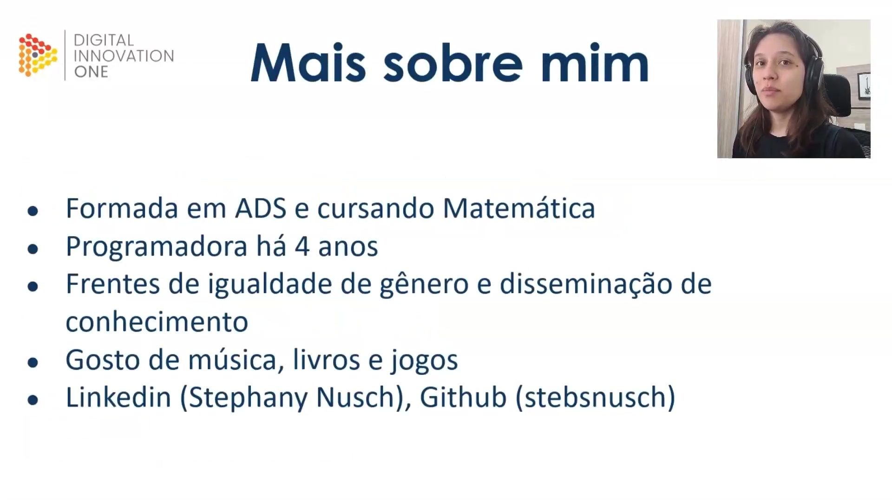
</p>

Para contextualizar o aprendizado, é importante conhecer a trajetória da instrutora. Stephanie é formada em **Análise e Desenvolvimento de Sistemas** e graduanda em **Matemática**, atuando no mercado de tecnologia há cerca de 4 anos. Além da atuação técnica, ela é engajada em causas de igualdade de gênero e na disseminação de conhecimento técnico. Fora do ambiente profissional, compartilha interesses em música, livros e jogos. Para acompanhar o material de apoio e os projetos que serão desenvolvidos, os alunos podem acessar seus perfis no LinkedIn e no GitHub (username: **Stebnush**).

<p align="center">
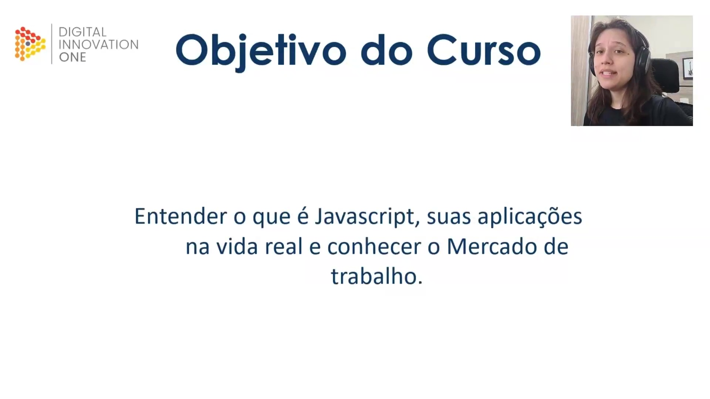
</p>

O curso foi estruturado com objetivos claros para garantir uma formação sólida:

* **Entender o que é JavaScript:** Compreender a natureza da linguagem e sua flexibilidade.
* **Aplicações na vida real:** Identificar como a linguagem é utilizada em projetos reais e cotidianos.
* **Mercado de Trabalho:** Obter um panorama sobre oportunidades, frameworks e o cenário atual para desenvolvedores, especialmente para quem deseja seguir carreira em desenvolvimento web.

<p align="center">
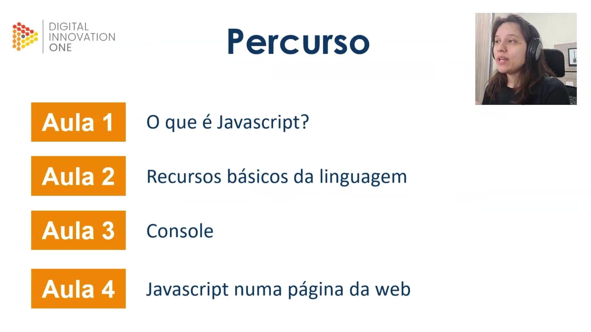
</p>

O percurso de aprendizado está organizado de forma progressiva. Nas quatro primeiras aulas, o foco será:

* **Aula 1:** Introdução teórica sobre a origem, história e evolução do JavaScript.
* **Aula 2:** Início da parte prática, abordando os recursos básicos da linguagem e a escrita do primeiro código.
* **Aula 3:** Exploração do **console**, uma ferramenta essencial para desenvolvedores, aprendendo suas diversas formas de manipulação.
* **Aula 4:** Integração do JavaScript com páginas web (HTML) e a criação da estrutura inicial de um projeto.

<p align="center">
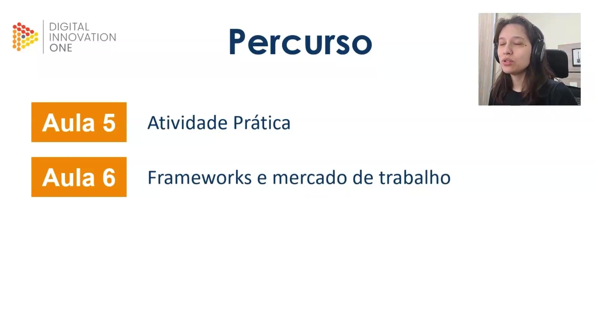
</p>

Na reta final do curso, o conteúdo se aprofunda na prática e no ecossistema da linguagem:

* **Aula 5:** Realização de atividades práticas e desafios baseados em projetos reais disponibilizados no GitHub, incentivando o aluno a encontrar diferentes soluções para o mesmo problema.
* **Aula 6:** Discussão sobre o mercado de trabalho atual e desmistificação de termos comuns, como os **frameworks JavaScript**.

Durante todo o processo, a interação é incentivada através do fórum do curso e da comunidade no Discord, onde alunos e tutores podem trocar conhecimentos e sanar dúvidas.

## 🟩 Vídeo 02 - História, Evolução e Aplicações

![[bootcamp_tqi_fullstack-modulo_03-Curso.02-Video_02.webm|vid-60]]

Link do vídeo: https://web.dio.me/track/tqi-fullstack-developer/course/introducao-ao-javascript/learning/2b53ae76-660e-4c80-9004-3eaee89f5169?autoplay=1

Esta fonte introduz o **JavaScript**, descrevendo-o como uma **linguagem interpretada** e altamente flexível que opera em tempo real sem a necessidade de compilação prévia. O texto detalha a evolução da tecnologia através do padrão **ECMAScript**, destacando como a versão de 2015 trouxe melhorias cruciais, como a orientação a objetos e novas sintaxes para desenvolvedores. Além de ser o pilar fundamental para a **interatividade na web**, a linguagem é apresentada como uma ferramenta **multiparadigma** capaz de criar soluções diversas. O conteúdo enfatiza que o alcance do JavaScript vai muito além dos navegadores, abrangendo o desenvolvimento de **aplicativos móveis**, sistemas para **internet das coisas** e até jogos. Por fim, o material incentiva a exploração da vasta **comunidade ativa** para o aprendizado contínuo dessa tecnologia versátil.

### Anotações

<p align="center">
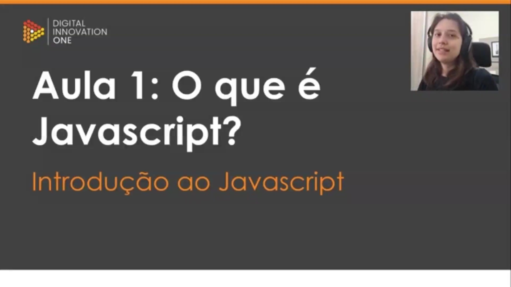
</p>

Esta aula inicial apresenta os fundamentos do JavaScript, abordando sua história, evoluções e as variadas possibilidades de aplicação da linguagem. O aprendizado foca em entender como o JavaScript se tornou uma ferramenta versátil que vai além de uma única utilidade no desenvolvimento.

<p align="center">
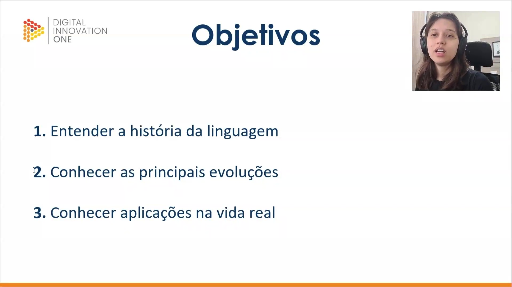
</p>

Os objetivos principais desta introdução são compreender a trajetória histórica da linguagem, identificar suas atualizações mais relevantes ao longo do tempo e explorar como ela é aplicada em cenários do mundo real.

<p align="center">
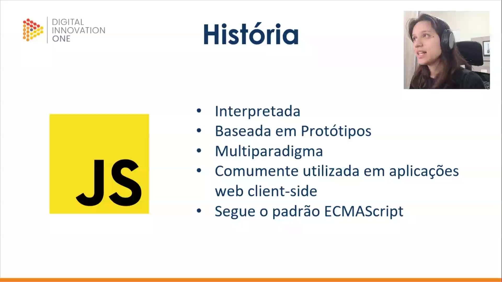
</p>

O JavaScript é definido como uma linguagem interpretada, executada em tempo real pelo navegador sem a necessidade de uma compilação prévia, como ocorre em linguagens como C++. Entre suas características fundamentais, destaca-se por ser baseada em protótipos — que servem de base para estruturas de dados e funções comuns — e por ser multiparadigma, permitindo o uso de orientação a objetos, programação funcional ou estruturada. É considerada a linguagem oficial da web, utilizada em aplicações *client-side* e seguindo rigorosamente o padrão ECMAScript.

<p align="center">
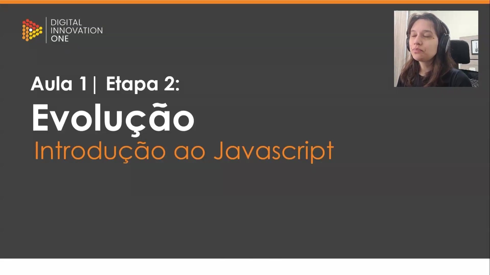
</p>

A segunda etapa da aula foca na evolução do JavaScript, detalhando como a linguagem se transformou desde sua criação oficial em 1995 até a adoção de padrões formais que guiam seu desenvolvimento contínuo.

<p align="center">
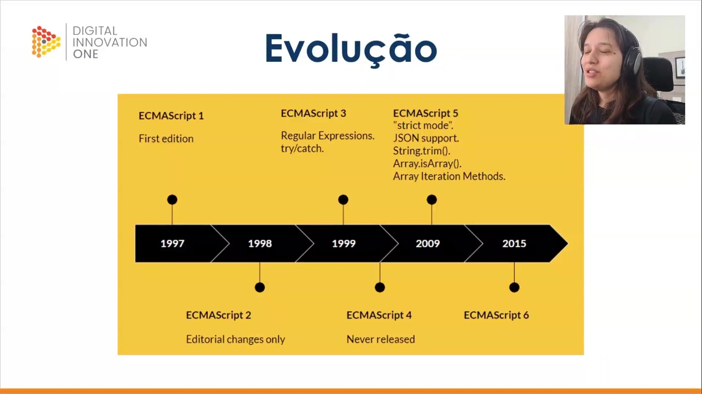
</p>

A linha do tempo da evolução mostra marcos importantes, como o início do padrão ECMAScript 1 em 1997. Versões subsequentes trouxeram melhorias críticas: o ECMAScript 3 (1999) introduziu expressões regulares e o bloco `try/catch` para tratamento de erros; o ECMAScript 5 (2009) adicionou suporte ao JSON e novas funções para manipulação de Arrays. Em 2015, o ECMAScript 6 (ES6) representou uma atualização massiva na linguagem.

<p align="center">
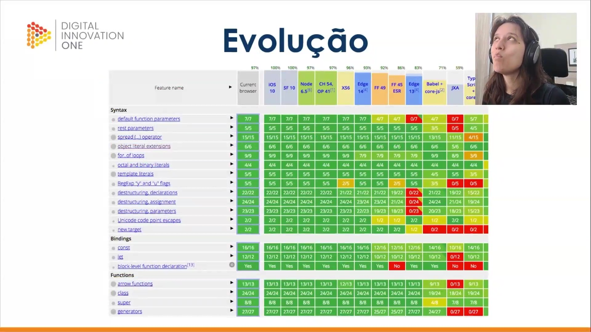
</p>

A atualização do ES6 trouxe recursos que facilitaram significativamente o desenvolvimento, como a introdução de classes para uma sintaxe de orientação a objetos mais familiar, a função `super`, as *Arrow Functions* e novas formas de declaração de variáveis. A compatibilidade desses recursos é monitorada pela comunidade ativa, garantindo que as melhorias na concatenação de strings e outras funcionalidades sejam bem implementadas.

<p align="center">
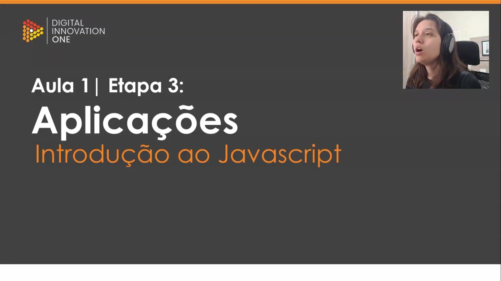
</p>

A etapa final da introdução explora as diversas aplicações práticas da linguagem no mercado atual, demonstrando sua flexibilidade para diferentes plataformas e dispositivos.

<p align="center">
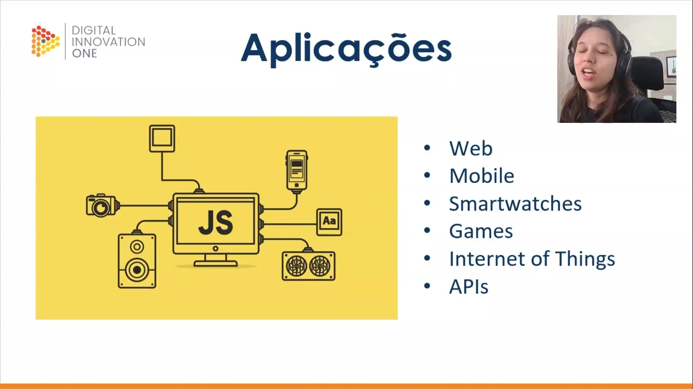
</p>

O JavaScript expandiu seu alcance para além dos navegadores web, sendo utilizado hoje no desenvolvimento de aplicações para dispositivos móveis (*Mobile*), relógios inteligentes (*Smartwatches*) e até jogos. Além disso, a linguagem permite criar rotinas para Internet das Coisas (IoT), como Alexa e Google Home, e desenvolver aplicações no lado do servidor (*back-end*) por meio do Node.js, possibilitando a criação de APIs robustas.


# Parte 2 - Recursos básicos da linguagem

## 🟩 Vídeo 03 - Manipulando um arquivo

![[bootcamp_tqi_fullstack-modulo_03-Curso.02-Video_03.webm|vid-60]]

Link do vídeo:  https://web.dio.me/track/tqi-fullstack-developer/course/introducao-ao-javascript/learning/12029bc1-1f35-4815-a310-9c402ed88d6a?autoplay=1

Esta fonte consiste em uma aula introdutória sobre os fundamentos da linguagem **JavaScript** utilizando o editor **VS Code**. O instrutor explica como organizar arquivos e ensina métodos para inserir **comentários** no código, tanto em linhas únicas quanto em múltiplos blocos. A lição diferencia conceitos de **variáveis** e **constantes**, utilizando exemplos matemáticos e de compras para ilustrar como valores podem ou não ser alterados. Além disso, o conteúdo enfatiza **boas práticas**, sugerindo nomes claros para elementos e o uso de letras maiúsculas para identificar constantes. O tutorial também destaca **atalhos de teclado** úteis que otimizam a produtividade durante o desenvolvimento de sistemas.

### Anotações

<p align="center">
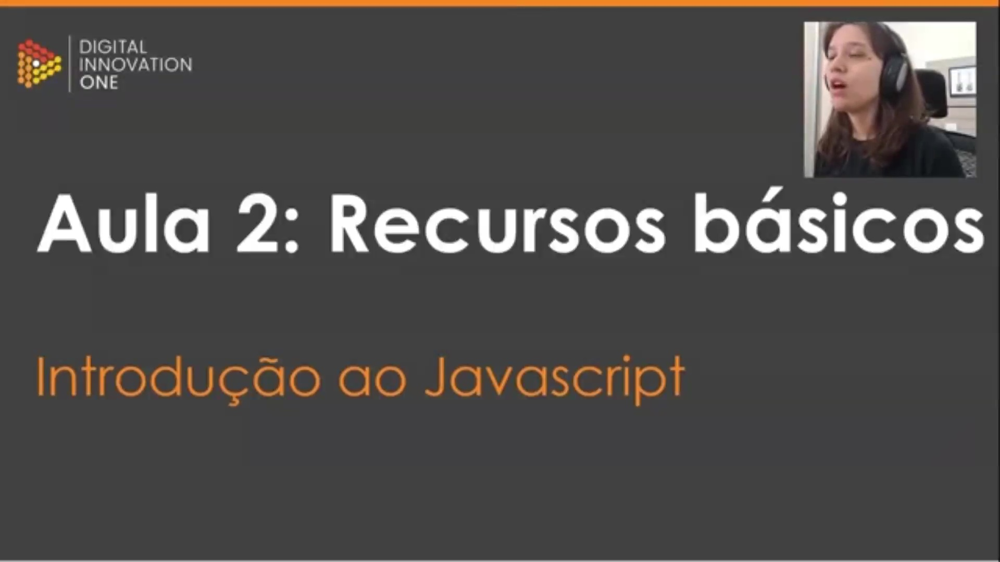
</p>

Nesta introdução, iniciamos o estudo dos **recursos básicos do JavaScript**. O foco inicial está em compreender as fundações da linguagem para permitir o desenvolvimento de scripts funcionais e organizados.

<p align="center">
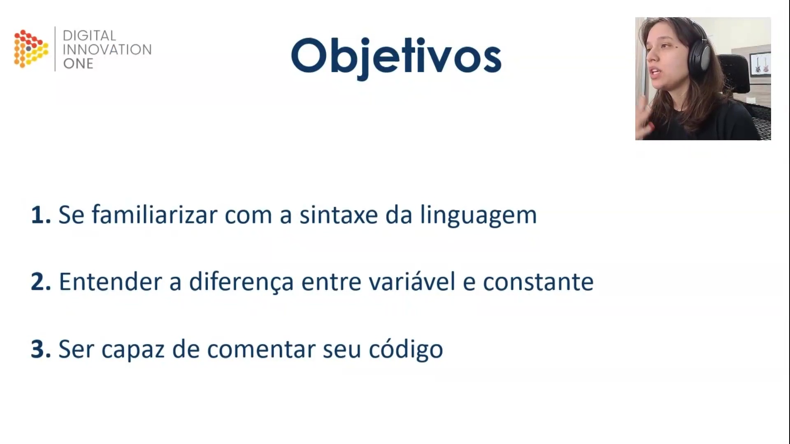
</p>

Os objetivos centrais desta etapa são:

1. Familiarização com a **sintaxe** da linguagem.
2. Compreensão da diferença prática entre **variáveis e constantes**.
3. Capacidade de inserir **comentários** para documentar e organizar o código.

<p align="center">

</p>

Nesta primeira etapa prática, avançamos para a **manipulação de arquivos**. Para trabalhar com JavaScript, os arquivos devem ser salvos com a extensão **.js**, o que permite que o ambiente de desenvolvimento e o navegador identifiquem corretamente o conteúdo como código JavaScript.

<p align="center">
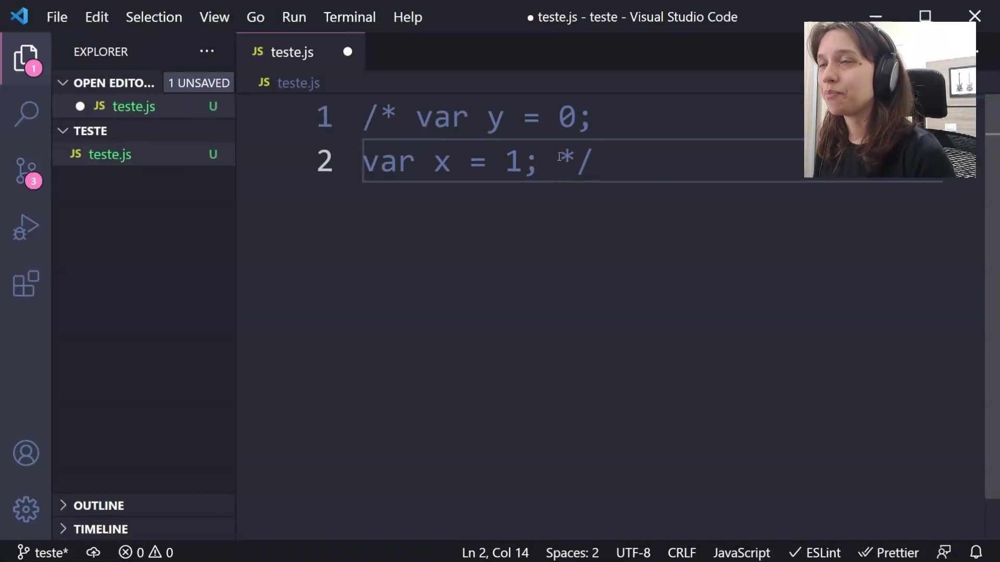
</p>

Exemplo de uso de **comentários de várias linhas**. Ao utilizar a sintaxe `/*` para abrir e `*/` para fechar, todo o conteúdo entre esses delimitadores é ignorado pelo motor de execução do JavaScript. É uma ferramenta essencial para desativar blocos de código ou escrever explicações extensas.

```javascript
/* var
y = 0;
var
x = 1; */

```

<p align="center">
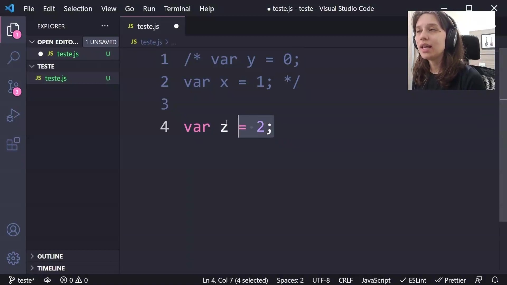
</p>

Neste ponto, observa-se que, assim que fechamos o bloco de comentário e mudamos de linha, o código volta a ser lido normalmente. Abaixo do bloco comentado, uma nova variável `z` é declarada, demonstrando que apenas o que está dentro dos delimitadores permanece inativo.

```javascript
/* var
y = 0;
var
x = 1; */

var z = 2;

```

<p align="center">
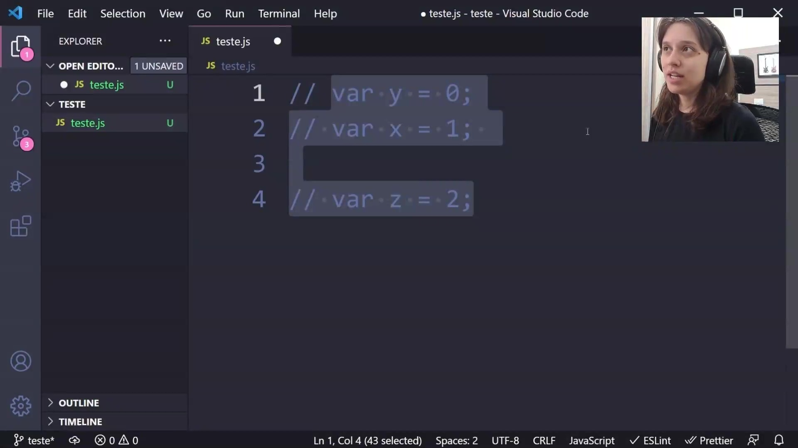
</p>

Apresentação dos **comentários de linha única**. Ao utilizar **duas barras para a direita (//)**, o JavaScript ignora tudo o que vier após elas naquela mesma linha. Diferente do bloco anterior, este formato é ideal para anotações rápidas ou para desativar instruções específicas individualmente.

```javascript
// var y = 0;
// var x = 1;

// var z = 2;

```

<p align="center">
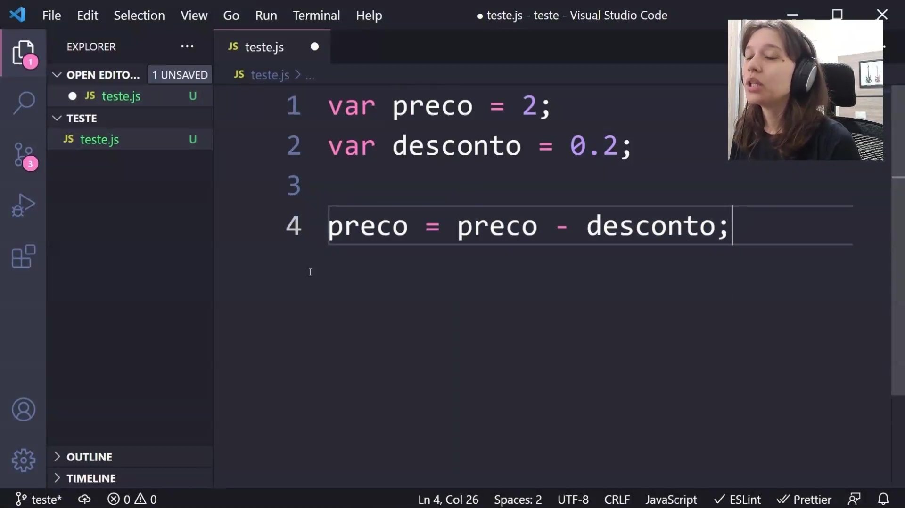
</p>

Exemplo prático de manipulação de **variáveis**. As variáveis são espaços na memória onde os valores podem ser alterados ao longo do tempo. No exemplo abaixo, a variável `preco` é inicialmente definida como 2, mas depois recebe um novo valor resultante da subtração de um desconto.

```javascript
var preco = 2;
var desconto = 0.2;

preco = preco - desconto;

```

<p align="center">
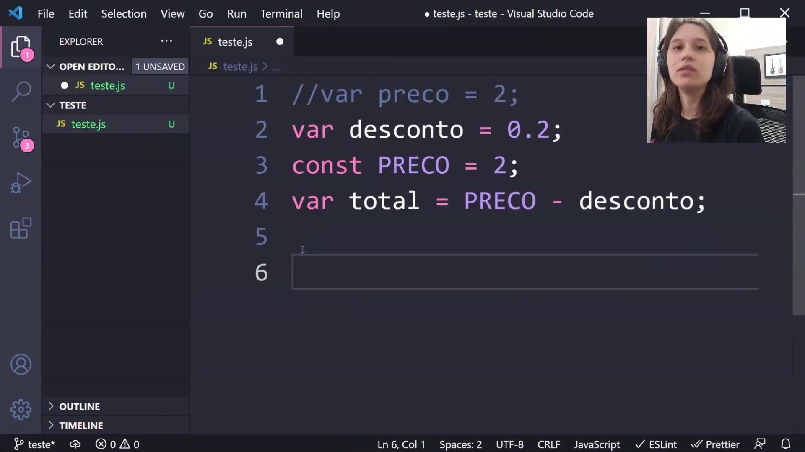
</p>

Introdução ao conceito de **constantes** utilizando a palavra-chave `const`. Diferente das variáveis, o valor de uma constante não pode ser alterado após sua atribuição inicial. Uma boa prática de programação é declarar constantes em **letras maiúsculas** para facilitar a distinção visual. Para obter um resultado dinâmico baseado em uma constante, utiliza-se uma nova variável (como `total`) para armazenar o cálculo.

```javascript
// var preco = 2;
var desconto = 0.2;

const PRECO = 2;
var total = PRECO - desconto;

```


## 🟩 Vídeo 04 - Funções

![[bootcamp_tqi_fullstack-modulo_03-Curso.02-Video_04.webm|vid-60]]

Link do vídeo: https://web.dio.me/track/tqi-fullstack-developer/course/introducao-ao-javascript/learning/7b57c877-07fc-4c32-9032-554835a533c0?autoplay=1

O instrutor detalha o uso da palavra-chave **function**, a importância dos **parâmetros** entre parênteses e a lógica por trás de operações básicas como a **soma de valores**. Além disso, o texto diferencia o uso do comando **return**, necessário para manipular resultados posteriormente, do **console.log**, utilizado majoritariamente para **depuração e visualização** imediata. É enfatizado que uma função só executa sua tarefa quando é explicitamente **chamada no programa**, podendo ou não exigir dados externos para funcionar. Por fim, o conteúdo busca familiarizar o estudante com a **escrita do código** antes de avançar para atividades práticas e demonstrações em tempo real.

### Anotações

<p align="center">

</p>

Esta imagem marca o início da aula sobre **funções no JavaScript**. O conteúdo introduz como a lógica de funções na programação se assemelha aos conceitos matemáticos, focando na sintaxe de declaração e na manipulação de arquivos para a construção de scripts.

<p align="center">
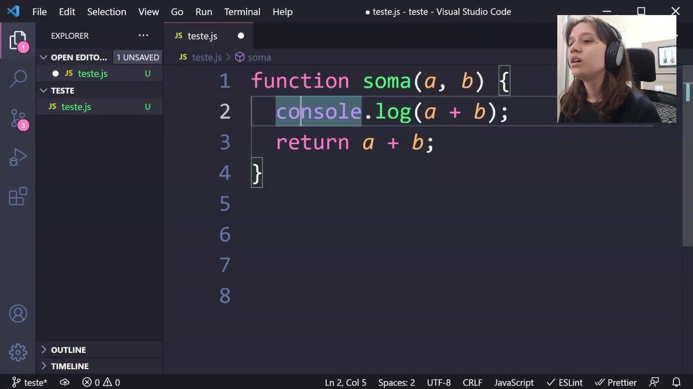
</p>

Nesta etapa, é apresentada a estrutura básica de uma declaração de função em JavaScript. A sintaxe utiliza a palavra-chave `function`, seguida por um nome identificador e parênteses, onde são definidos os **parâmetros** ou atributos que a função irá processar.

```javascript
function soma(a, b) {
  console.log(a + b);
  return a + b;
}

```

A explicação diferencia o uso do **console.log** do **return**:

* **console.log**: É utilizado principalmente para **debugar** o código, permitindo visualizar um valor no console para conferir se a função está sendo executada corretamente.
* **return**: É empregado quando o resultado da função precisa ser enviado de volta para quem a chamou, permitindo que esse valor seja manipulado posteriormente por outras funções ou partes do programa.

<p align="center">
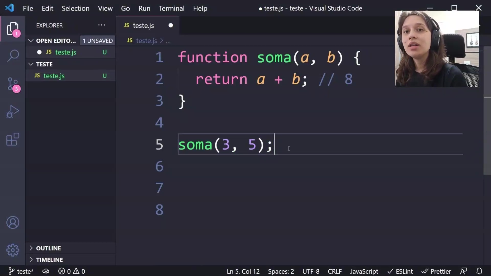
</p>

Após declarar o que a função faz, é necessário **invocá-la** para que ela seja de fato executada. A imagem demonstra como chamar a função pelo seu nome, passando os valores (argumentos) que substituirão as variáveis definidas nos parâmetros.

```javascript
function soma(a, b) {
  return a + b; // 8
}

soma(3, 5);

```

Neste exemplo, ao chamar `soma(3, 5)`, o número 3 é atribuído à variável `a` e o 5 à variável `b`. A função processa a soma e retorna o valor 8. É reforçado que uma função pode ou não receber parâmetros, dependendo da necessidade de manipular dados externos. Caso o desenvolvedor apenas declare a função mas não a chame no código, ela não realizará nenhuma ação.

# Parte 3 - Console

## 🟩 Vídeo 05 - Executando um arquivo .js

![[bootcamp_tqi_fullstack-modulo_03-Curso.02-Video_05.webm|vid-60]]

Link do vídeo: https://web.dio.me/track/tqi-fullstack-developer/course/introducao-ao-javascript/learning/f4ff0c4f-60a1-4d79-8925-0a34b60837bc?autoplay=1

Esta fonte apresenta uma aula prática sobre o **uso do console no desenvolvimento com JavaScript**, destacando sua importância para a **depuração de códigos**. O material explica como acessar essa ferramenta diretamente nos **navegadores web** para realizar testes rápidos e manipular elementos da interface. Além disso, o texto detalha o processo de instalação do **Node.js**, permitindo que o desenvolvedor execute scripts e visualize resultados através do **terminal do computador**. Exemplos práticos demonstram como declarar variáveis, criar funções para filtrar números pares e utilizar o comando **console.log** para exibir mensagens. Por fim, o conteúdo reforça que o console é essencial tanto para o **desenvolvimento front-end** quanto para aplicações no **servidor**.

### Anotações

Este é o material didático da aula sobre o **Console** em JavaScript, detalhando o uso da ferramenta no navegador e no ambiente Node.js.

<p align="center">
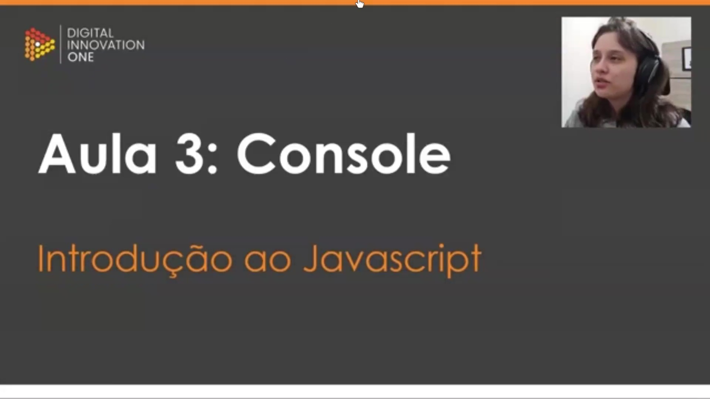
</p>

Esta imagem marca o início da **Aula 3**, que é inteiramente dedicada ao **Console**. O console é apresentado como uma ferramenta fundamental para desenvolvedores JavaScript, permitindo a visualização de saídas, depuração de código e interação direta com o ambiente de execução .

<p align="center">

</p>

O slide apresenta os dois objetivos principais desta aula:

1. 
**Aprender a utilizar o console em uma página web**: Focado no desenvolvimento voltado para o cliente (frontend) .


2. 
**Aprender a utilizar o console no terminal**: Voltado para o uso do Node.js e execução de scripts no lado do servidor ou ambiente de desenvolvimento.


<p align="center">
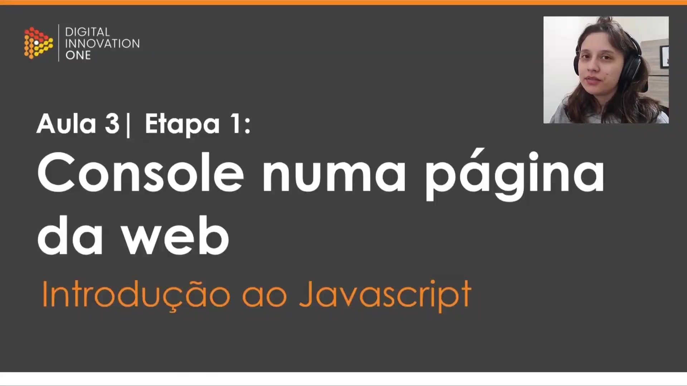
</p>

Início da primeira etapa da aula, focada especificamente no uso do console dentro de uma página web. O console do navegador é uma parte integrante das ferramentas de desenvolvedor (DevTools) e permite interagir com o código JavaScript que está rodando em tempo real no browser .

<p align="center">
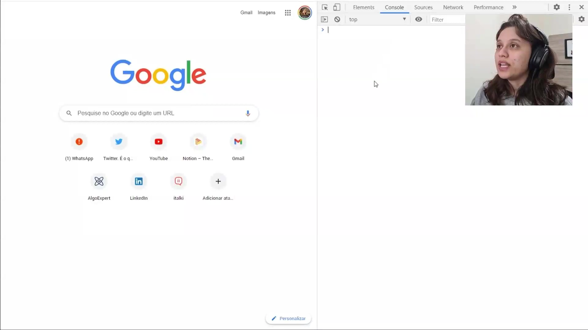
</p>

Para abrir o console no navegador, utiliza-se a ferramenta de "Inspecionar" (acessada pelo botão direito do mouse ou pelo atalho **Ctrl + Shift + I** no Windows). A imagem mostra a interface inicial de um navegador antes da abertura das ferramentas de desenvolvedor .

<p align="center">
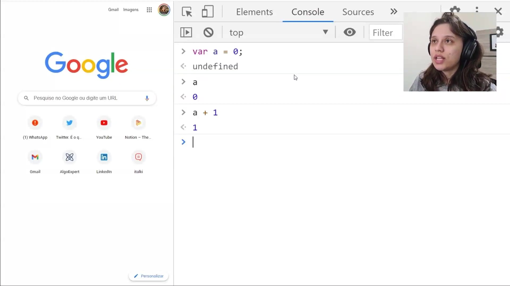
</p>

Dentro da aba **Console**, é possível interagir diretamente com o JavaScript. O exemplo visual mostra a declaração de uma variável, a verificação de seu valor e a realização de operações matemáticas simples diretamente na linha de comando do console .

```javascript
var a = 0;
a
// 0
a + 1
// 1

```

<p align="center">
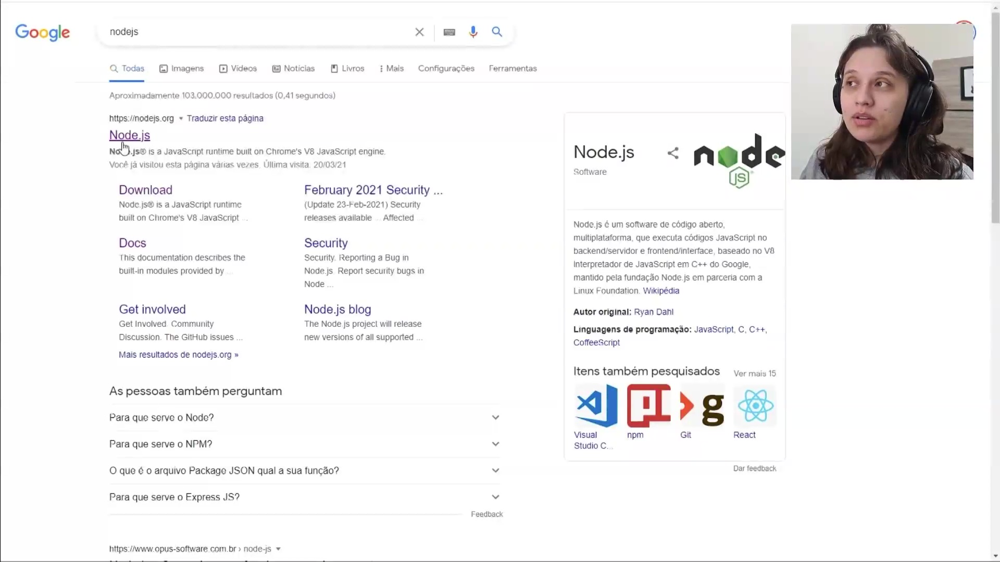
</p>

Para executar JavaScript fora do navegador, é necessário o **Node.js**. A imagem demonstra a busca pelo site oficial do Node.js, onde a ferramenta pode ser baixada para diferentes sistemas operacionais .

<p align="center">
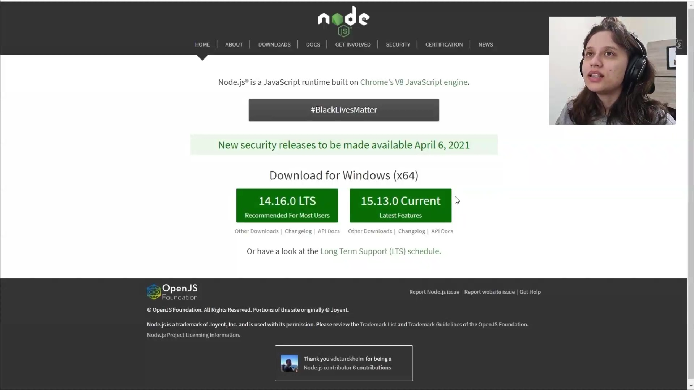
</p>

No site oficial, recomenda-se baixar a versão **LTS (Long Term Support)**, que é a versão estável e com suporte garantido por mais tempo, ideal para a maioria dos desenvolvedores e projetos em produção .

<p align="center">
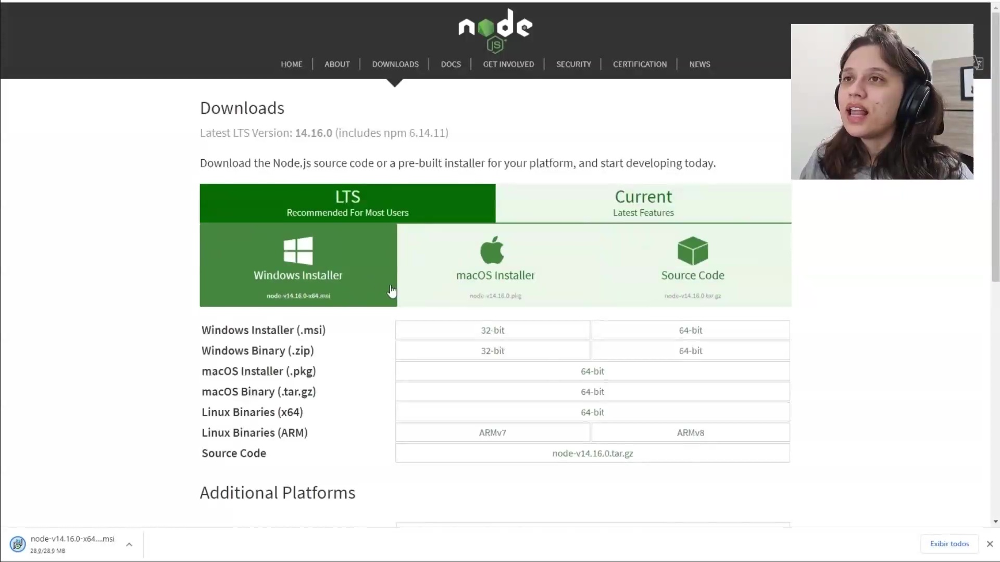
</p>

A página de downloads oferece instaladores para Windows (.msi), macOS e Linux. Durante a instalação no Windows, é fundamental garantir que a opção de **adicionar ao PATH** esteja ativa, permitindo que o comando `node` seja reconhecido pelo terminal em qualquer diretório .

<p align="center">
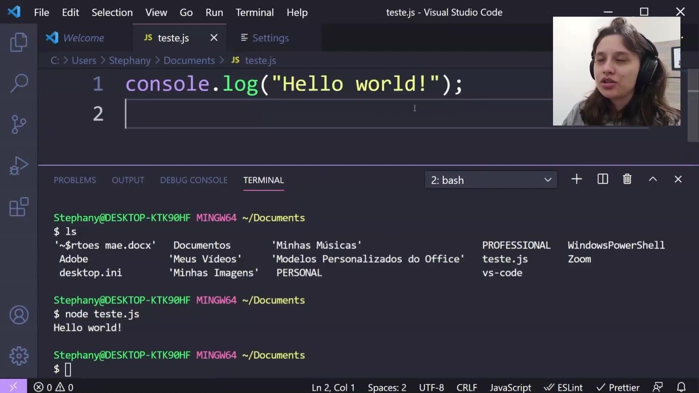
</p>

Com o Node.js instalado, utiliza-se o VS Code para escrever o código e o terminal integrado para executá-lo. O comando `console.log()` é usado para imprimir mensagens. Para rodar o script, navega-se até a pasta do arquivo e executa-se o comando `node` seguido do nome do arquivo .

**Arquivo `teste.js`:**

```javascript
console.log("Hello world!");

```

**Comandos no Terminal:**

```bash
ls
node teste.js
# Hello world!

```

<p align="center">
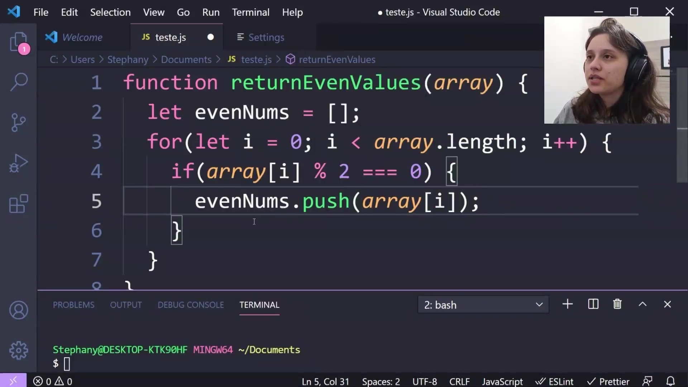
</p>

A imagem mostra a implementação de uma lógica mais complexa: uma função para filtrar números pares em um array. Aqui, o console é essencial para verificar se a lógica de repetição (`for`) e a condição (`if`) estão funcionando conforme o esperado.

```javascript
function returnEvenValues (array) {
  let evenNums = [];
  for(let i = 0; i < array.length; i++) {
    if(array[i] % 2 === 0) {
      evenNums.push(array[i]);
    }
  }
  console.log(evenNums);
}

```

<p align="center">
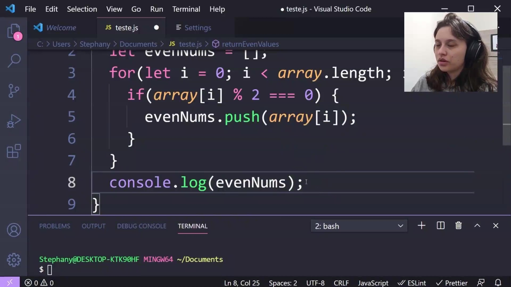
</p>

Após definir a função, ela deve ser invocada passando um array de números como argumento. Somente ao chamar a função e executar o arquivo via terminal o console exibirá o resultado filtrado.

*Conteúdo de código não identificado com segurança a partir do material disponível.*

<p align="center">
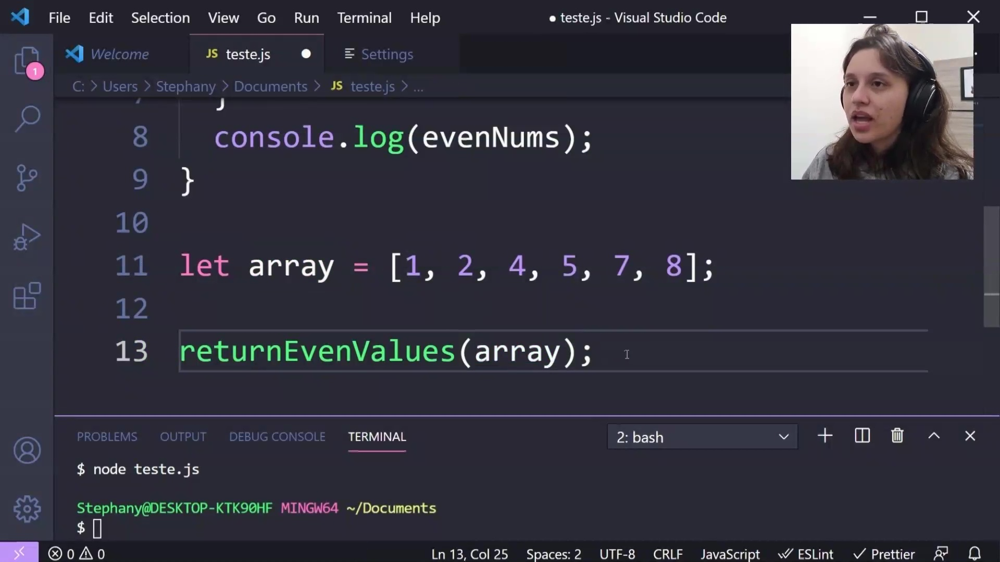
</p>

É possível personalizar as mensagens no `console.log` concatenando strings com variáveis. Isso torna os resultados exibidos no terminal muito mais fáceis de compreender.

<p align="center">
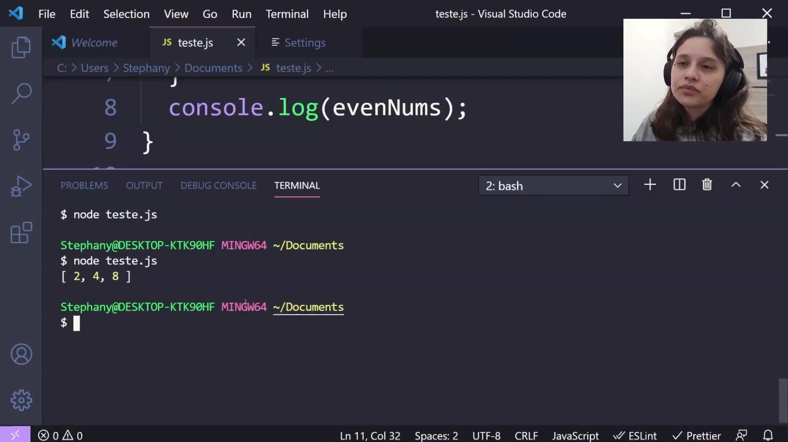
</p>

Demonstração do terminal exibindo a saída formatada da função. Para repetir a última execução do terminal sem precisar digitar novamente, basta utilizar a **seta para cima** no teclado e pressionar Enter.

<p align="center">

</p>

O uso do `console.log` não se limita ao resultado final. Ele pode ser inserido dentro de blocos condicionais, como o `else`, para informar ao usuário quando um número específico não atende ao critério de ser par.

<p align="center">
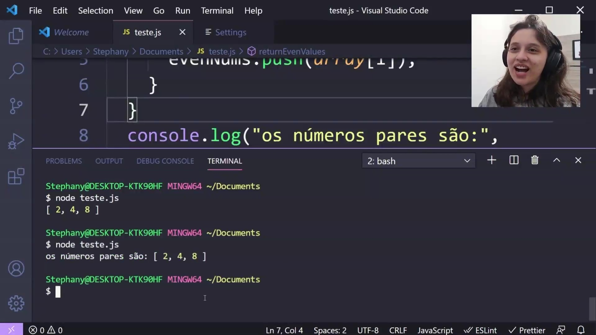
</p>

Exibição no terminal do comportamento do script após a adição do bloco `else`. O console mostra mensagens indicando os números que foram identificados como pares durante o processamento do array.

<p align="center">
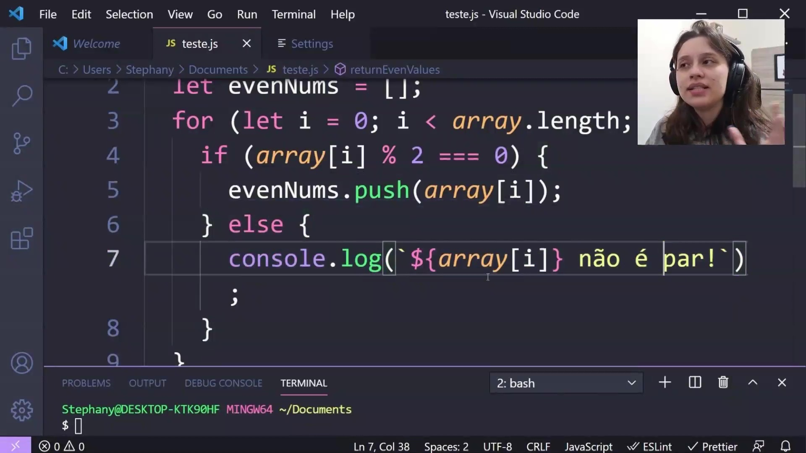
</p>

Além de textos simples, o objeto `console` possui métodos para formatar dados de maneira mais visual, como a criação de tabelas para exibir arrays ou objetos de forma estruturada.

<p align="center">

</p>

Exemplo final da saída do console utilizando técnicas avançadas de formatação para facilitar a depuração. Dominar essas variações do console é um passo importante para quem deseja avançar em frameworks modernos como React ou Angular.


# Parte 4 - Javascript em uma página da web

## 🟩 Vídeo 06 - Estrutura de projeto

![[bootcamp_tqi_fullstack-modulo_03-Curso.02-Video_06.webm|vid-60]]

Link do vídeo:  https://web.dio.me/track/tqi-fullstack-developer/course/introducao-ao-javascript/learning/29e2461c-fa18-47c3-b4fa-900cf1fcc1f5?autoplay=1

Esta fonte apresenta os fundamentos para organizar um **projeto de desenvolvimento web** utilizando as linguagens **HTML, CSS e JavaScript**. O conteúdo ensina como configurar o ambiente de trabalho no **VS Code**, destacando a importância de nomear o arquivo principal como **index.html** para servir de ponto de entrada do sistema. É explicada a criação de uma estrutura de **arquitetura de pastas**, sugerindo o uso de um diretório chamado **assets** para armazenar arquivos complementares e recursos visuais de forma ordenada. O tutorial também demonstra a utilização de ferramentas como o **EMET** para gerar automaticamente o código base necessário para a construção de páginas. Por fim, o autor enfatiza que manter uma **organização lógica** é essencial para a escalabilidade e manutenção de projetos iniciantes.

### Anotações

<p align="center">

</p>

Esta aula introduz o uso do **JavaScript em páginas da web**. O foco inicial é apresentar como a linguagem se integra ao ambiente do navegador para criar interatividade.

<p align="center">

</p>

Os objetivos estabelecidos para esta sessão de aprendizado são:

* 
**Familiarização com a estrutura de projeto**: Compreender como organizar arquivos básicos de desenvolvimento.


* 
**Interação com o DOM**: Aprender os fundamentos para manipular elementos HTML através do JavaScript.


<p align="center">

</p>

A primeira etapa da aula foca na **Estrutura de Projeto**. Nesta fase, é demonstrado como configurar o ambiente de trabalho inicial utilizando o editor de código para organizar os arquivos que compõem uma aplicação web simples.

<p align="center">

</p>

Nesta demonstração prática no **VS Code**, é criado o arquivo `index.html`, que funciona como o índice ou porta de entrada principal do projeto. Utilizando o recurso **EMET**, gera-se automaticamente a estrutura base do HTML5.

Além do arquivo principal, introduz-se o conceito de **arquitetura de pastas** para organizar os recursos do projeto através da pasta `assets`. Esta pasta é subdividida para separar diferentes tipos de arquivos:

* 
**css**: Destinada aos arquivos de estilo, como o `styles.css`.


* 
**js**: Destinada aos scripts JavaScript, como o `scripts.js`.


O código estrutural gerado para o arquivo de teste é o seguinte:

```html
<!DOCTYPE html>
<html lang="en">
<head>
  <meta charset="UTF-8" />
  <meta http-equiv="X-UA-Compatible" content="IE=edge" />
  <meta name="viewport" content="width=device-width, initial-scale=1.0" />
  <title>teste</title>
</head>
<body></body>
</html>

```


## 🟩 Vídeo 07 - Inserindo javascript numa página HTML

![[bootcamp_tqi_fullstack-modulo_03-Curso.02-Video_07.webm|vid-60]]

Link do vídeo: https://web.dio.me/track/tqi-fullstack-developer/course/introducao-ao-javascript/learning/29e2461c-fa18-47c3-b4fa-900cf1fcc1f5?autoplay=1

O instrutor demonstra a utilização da tag **link** para importar o **CSS**, explicando a importância de definir corretamente a relação do arquivo e o seu caminho de origem. Em seguida, o processo é repetido para o **JavaScript** através da tag **script**, incluindo uma breve discussão sobre a **ordem de carregamento** dos elementos na página. Para validar a configuração, o autor ensina a abrir o arquivo no **navegador** e utilizar as ferramentas de desenvolvedor para inspecionar os resultados. Através da mudança de cor do texto e de mensagens no console, confirma-se que a **comunicação entre os arquivos** foi estabelecida com sucesso.

### Anotações

<p align="center">

</p>

Nesta etapa da aula, o objetivo é realizar a integração prática entre as tecnologias web. Para visualizar as mudanças acontecendo na tela, será demonstrado como **inserir o JavaScript no HTML**, utilizando também o CSS como um elemento visual de confirmação. A estratégia consiste em configurar uma cor específica para os textos, garantindo que a folha de estilo foi carregada corretamente antes de avançar para a importação dos scripts.

<p align="center">

</p>

No arquivo de estilos, é definida uma regra básica para o corpo da página. O objetivo é alterar a cor de todos os textos para cinza, servindo como um "teste de sucesso" para a importação do arquivo CSS no documento principal.

```css
body {
  color: grey;
}

```

<p align="center">

</p>

Para o JavaScript, é criado um comando simples de saída no console. Este código permitirá verificar, através das ferramentas de desenvolvedor do navegador, se o arquivo externo foi lido e executado corretamente após a sua importação no HTML.

```javascript
console.log("hello world");

```

<p align="center">

</p>

No arquivo `index.html`, a importação dos recursos externos é realizada dentro da tag `<head>`.

* **CSS:** Utiliza-se a tag `<link>` com o atributo `rel="stylesheet"` para indicar que se trata de uma folha de estilo, e o atributo `href` apontando para o caminho do arquivo (`assets/css/styles.css`).
* **JavaScript:** Utiliza-se a tag `<script>` com o atributo `src` indicando a localização do arquivo (`assets/js/scripts.js`).

Embora em projetos maiores seja comum recomendar a inserção do script ao final do `<body>` para evitar problemas de renderização de elementos que ainda não foram carregados, para este exemplo simples a chamada no topo do documento é funcional.

```html
<head>
  <meta charset="UTF-8" />
  <meta http-equiv="X-UA-Compatible" content="IE=edge" />
  <meta name="viewport" content="width=device-width, initial-scale=1.0" />
  <link rel="stylesheet" href="assets/css/styles.css" />
  <script src="assets/js/scripts.js"></script>
  <title>teste</title>
</head>

```

<p align="center">

</p>

Para finalizar a estrutura e testar a visualização, o conteúdo visível é inserido dentro da tag `<body>`. Ao abrir o arquivo no navegador, o texto "Olá, mundo!" deverá aparecer com a formatação cinza definida no CSS. Ao acessar o console do navegador (atalho **Ctrl + Shift + I**), a mensagem configurada no JavaScript também será exibida, confirmando que ambos os arquivos foram importados com sucesso.

```html
<body>
  <h1>Olá, mundo!</h1>
</body>

```

## 🟩 Vídeo 08 - Interagindo com os elementos do DOM

![[bootcamp_tqi_fullstack-modulo_03-Curso.02-Video_08.webm|vid-60]]

Link do vídeo: https://web.dio.me/track/tqi-fullstack-developer/course/introducao-ao-javascript/learning/b3f92afb-7547-48ac-a072-ef0ff7baf80d?autoplay=1

Esta fonte explica o conceito de **DOM (Document Object Model)** como a representação estrutural de uma página web dentro do navegador. O autor descreve a organização dos elementos em uma **árvore de dependências**, onde tags HTML e textos são tratados como nós que podem ser acessados via JavaScript. Através de um exemplo prático no console do navegador, demonstra-se como **selecionar elementos específicos** e alterar suas propriedades visuais, como a cor de um título. O conteúdo serve como uma introdução técnica para a **manipulação dinâmica de páginas**, preparando o estudante para a criação de projetos interativos. Por fim, destaca-se que o domínio dessas técnicas permite o **controle total sobre o comportamento** e o estilo dos componentes de uma interface digital.

### Anotações

<p align="center">

</p>

Nesta etapa da aula, iniciamos a exploração dos elementos que compõem o **DOM (Document Object Model)**. O objetivo é compreender como o JavaScript interage com os componentes de uma página web, visualizando o documento como um conjunto de objetos acessíveis e manipuláveis pelo navegador.

<p align="center">

</p>

O **DOM (Document Object Model)** pode ser visualizado como uma estrutura de árvore que representa a hierarquia de elementos dentro da janela do navegador. No topo dessa hierarquia está o objeto **Window**, que contém informações de **History** (histórico de rotas), **Location** (localização) e o **Document**.

O **Document** encapsula o código HTML da página. A estrutura organiza os elementos de forma hierárquica:

* **Elementos Pais e Filhos:** No exemplo apresentado, a partir do documento temos tags como **Heading Level 1** (H1) e **Paragraph** (P).
* **Nós de Texto (Text Nodes):** São o conteúdo textual contido dentro das tags, como o texto "Olá, mundo!" dentro de um H1.
* **Elementos Irmãos:** Se um parágrafo for criado fora da tag H1, eles são considerados irmãos na árvore de dependências, pois compartilham o mesmo nível hierárquico abaixo do objeto Document.

<p align="center">

</p>

Para manipular os elementos na prática, utilizamos o **Console** do navegador (acessado via `Ctrl + Shift + I`). Através do objeto `document`, é possível selecionar elementos específicos, armazená-los em variáveis e alterar suas propriedades, como o estilo CSS.

No exemplo demonstrado, o comando `document.getElementsByTagName('h1')` retorna uma **HTML Collection**. Como as listas em JavaScript iniciam no **índice zero**, selecionamos o primeiro elemento para aplicar uma mudança de cor:

```javascript
// Selecionando o elemento H1 pelo índice 0 da coleção
var heading1 = document.getElementsByTagName('h1')[0]

// Verificando o conteúdo da variável
heading1

// Alterando a cor do elemento para vermelho via propriedade style
heading1.style.color = 'red'

```

Essa interação permite que o JavaScript modifique dinamicamente o comportamento e a aparência do HTML em tempo real.

# Parte 5 - Colocando em prática

## 🟩 Vídeo 09 - Criando um contador

![[bootcamp_tqi_fullstack-modulo_03-Curso.02-Video_09.webm|vid-60]]

Link do vídeo:  https://web.dio.me/track/tqi-fullstack-developer/course/introducao-ao-javascript/learning/ec2c12f8-f2d6-461b-9ddf-f6955957997f?autoplay=1

Esta fonte consiste em uma aula prática de um curso de **introdução ao JavaScript**, focada na criação de um **contador interativo**. O instrutor orienta os alunos a utilizarem uma estrutura base de **HTML e CSS** disponível no GitHub para, em seguida, implementar a lógica de programação no **VS Code**. O conteúdo explica como manipular o **DOM** através do método `getElementById` e como capturar interações do usuário com **eventos de clique**. Durante a demonstração, são criadas funções de **incremento e decremento** que alteram dinamicamente o valor exibido na tela. Ao final, o professor propõe desafios para aprofundar o aprendizado, como o uso de **adEventListener** e a implementação de **condicionais** para limitar números ou alterar cores.

### Anotações

#### Introdução ao Javascript

<p align="center">

</p>

Nesta etapa da aula, iniciamos uma **atividade prática** focada na criação de um projeto do zero: um **contador**. O objetivo central é desenvolver um **componente dinâmico**, permitindo que o usuário interaja diretamente com os elementos da tela através da lógica programada em JavaScript. Para isso, utilizaremos o ambiente do VS Code e aproveitaremos estruturas de HTML e CSS para focar no desenvolvimento das funcionalidades.

#### Objetivos

<p align="center">

</p>

Os objetivos principais desta aula prática são:

1. **Criar seu primeiro componente dinâmico:** Desenvolver a capacidade de manipular elementos da página em tempo real conforme a interação do usuário.
2. **Introdução a eventos:** Compreender as propriedades do JavaScript que permitem capturar ações do usuário no navegador, uma habilidade fundamental para o desenvolvimento web moderno.

O projeto prático servirá para aplicar conceitos de manipulação do DOM e lógica de incremento e decremento de valores.

#### ▶️ Código HTML - index.html

```html
<!DOCTYPE html>
<html lang="en">
<head>
    <meta charset="UTF-8">
    <meta name="viewport" content="width=device-width, initial-scale=1.0">
    <link rel="stylesheet" href="assets/styles.css" />
    <title>Contador</title>
</head>
<body>
    <h1>Olá, mundo!</h1>
    <p>Este é o meu primeiro projeto Javascript.</p>
    <div id="counter">
        <button name="subtrair" onclick="decrement()">-</button>
        <span id="currentNumber">0</span>
        <button name="adicionar" onclick="increment()">+</button>
    </div>
    <script src="assets/scripts.js"></script>
</body>
</html>
```

#### ▶️ Código CSS - styles.css

```css
@import url('https://fonts.googleapis.com/css2?family=Open+Sans:wght@300;600&display=swap');

* {
    font-family: 'Open Sans', sans-serif;
}

body {
    display: flex;
    align-items: center;
    justify-content: center;
    flex-direction: column;
    background-color: rgb(177, 225, 255);
}

button {
    height: 40px;
    width: 40px;
    border-radius: 50%;
    border: 2px solid lightcoral;
    background-color: rgb(241, 214, 214);
    color: lightcoral;
    font-size: 16pt;
    font-weight: 600;
    text-align: center;
}

#counter {
    display: flex;
}

#currentNumber {
    display: flex;
    align-items: center;
    margin: 0 20px;
    font-size: 16pt;
}
```

#### ▶️ Código Javascript - scripts.js

```javascript
let count = 0;

const CURRENT_NUMBER = document.getElementById('currentNumber');

function increment() {
	count++;
	CURRENT_NUMBER.innerHTML = count;
}

function decrement() {
	count--;
	CURRENT_NUMBER.innerHTML = count;
}
```

#### Saída no Navegador

<p align="center">

</p>

## 🟩 Vídeo 10 - Desafio: To-do list

![[bootcamp_tqi_fullstack-modulo_03-Curso.02-Video_10.webm|vid-60]]

Link do vídeo: https://web.dio.me/track/tqi-fullstack-developer/course/introducao-ao-javascript/learning/7967cb7d-8ddd-4dae-80a1-845986f5dfc1?autoplay=1

O video apresenta um **novo desafio de programação** focado no desenvolvimento de uma **lista de tarefas** utilizando **JavaScript**. A instrutora orienta os alunos a criarem uma interface onde seja possível **adicionar itens** e marcar tarefas como concluídas através de um **checkbox**. Ela incentiva a autonomia, sugerindo que os estudantes tentem resolver o problema sozinhos antes de consultarem o código de referência no **GitHub**. Além disso, destaca-se a importância de praticar conceitos como **manipulação de eventos** e estilos dinâmicos com **CSS**. Por fim, a mentora reforça a disponibilidade de suporte técnico via **Discord** e fóruns para auxiliar no processo de aprendizagem.

### Anotações


## 🟩 Vídeo 03 - Colocando em prática


Link do vídeo: 

## 🟩 Vídeo 04 - Slides


Link do vídeo: 

## 🟩 Vídeo 05 - Github


Link do vídeo: 


# Parte 6 - Mercado de Trabalho

## 🟩 Vídeo 01 - Frameworks


Link do vídeo:  


## 🟩 Vídeo 02 - Mercado de trabalho


Link do vídeo: 


## 🟩 Vídeo 03 - Mercado de trabalho


Link do vídeo: 

## 🟩 Vídeo 04 - Slides


Link do vídeo: 


##  Materiais de Apoio


# Certificado: 

- Link na plataforma: 
- Certificado em pdf: 
