## Instrutor

- Diana Pontes (Software Engineering Analyst | React | JavaScript | TypeScript | Web Development | Asynchronous Programming | REST APIs | Agile | Code Quality | Performance Optimization | Git | Jest | SQL)
- Contato Linkedin: / [martineoficial](https://www.linkedin.com/in/martineoficial/)

# Parte 1 - Apresentação do curso

## 🟩 Vídeo 01 - Slide - Apresentação do curso

![[bootcamp_tqi_fullstack-modulo_03-Curso.03-Video_01.webm|vid-60]]

Link do vídeo:  https://web.dio.me/track/tqi-fullstack-developer/course/sintaxe-basica-em-javascript/learning/780c7e66-bc21-401f-b3ea-c844898b3614?autoplay=1

Esta fonte apresenta a **introdução de um curso de JavaScript** focado em sintaxe básica, conduzido pela instrutora e desenvolvedora Diana Martini. A professora compartilha sua **trajetória profissional**, destacando seu interesse por eletrônica e sua atuação em projetos educacionais como o TransDev. O conteúdo programático é detalhado em **seis aulas distintas**, que abrangem desde conceitos iniciais até o uso avançado de funções e estruturas lógicas. O objetivo principal é capacitar os alunos a aplicarem a linguagem de forma **prática e independente** em seus próprios projetos. Além disso, são disponibilizados **canais de suporte**, como fóruns e comunidades online, para auxiliar no processo de aprendizagem dos estudantes.

# Parte 2 - O que danado é JavaScript?

## 🟩 Vídeo 02 - O que danado é JavaScript?

![[bootcamp_tqi_fullstack-modulo_03-Curso.03-Video_02.webm|vid-60]]

Link do vídeo: https://web.dio.me/track/tqi-fullstack-developer/course/sintaxe-basica-em-javascript/learning/7577db55-f648-48b4-8392-7a9b7b106d85?autoplay=1

Esta fonte introduz o curso de **Sintaxe Básica em JavaScript**, definindo-a como uma **linguagem de alto nível** essencial para criar interatividade em sites e aplicativos. O material esclarece que o nome da linguagem surgiu de uma **estratégia de marketing** e explica sua função complementar ao **HTML e CSS** no desenvolvimento web. Além da teoria, o conteúdo ensina a configurar o ambiente de trabalho utilizando o **VS Code** e a extensão **Live Server**. O guia demonstra como criar o **primeiro script** prático, utilizando o método nativo de alerta para testar o código. Por fim, são apresentadas **boas práticas**, como a organização de arquivos externos e o posicionamento correto das tags para otimizar o carregamento das páginas.

### Anotações

<p align="center">

</p>

Boas-vindas à primeira aula do curso de Sintaxe Básica em JavaScript. O foco inicial desta aula é definir o que é o JavaScript, apresentar as ferramentas e extensões necessárias para o desenvolvimento e realizar a criação do primeiro script prático.

<p align="center">
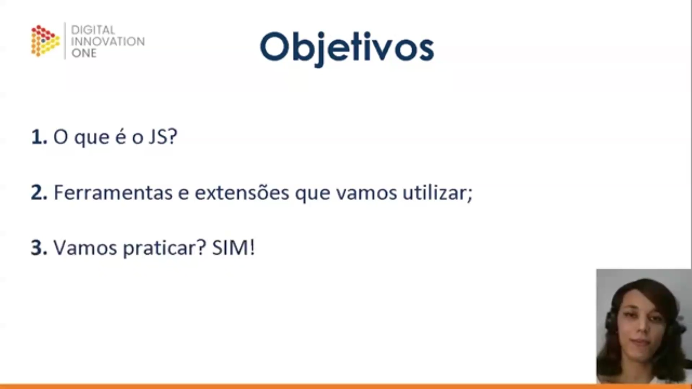
</p>

Os objetivos principais da aula estão divididos em três pontos fundamentais: o entendimento teórico sobre o JavaScript, o conhecimento das ferramentas e extensões que serão utilizadas no ambiente de desenvolvimento e o início das atividades práticas.

<p align="center">
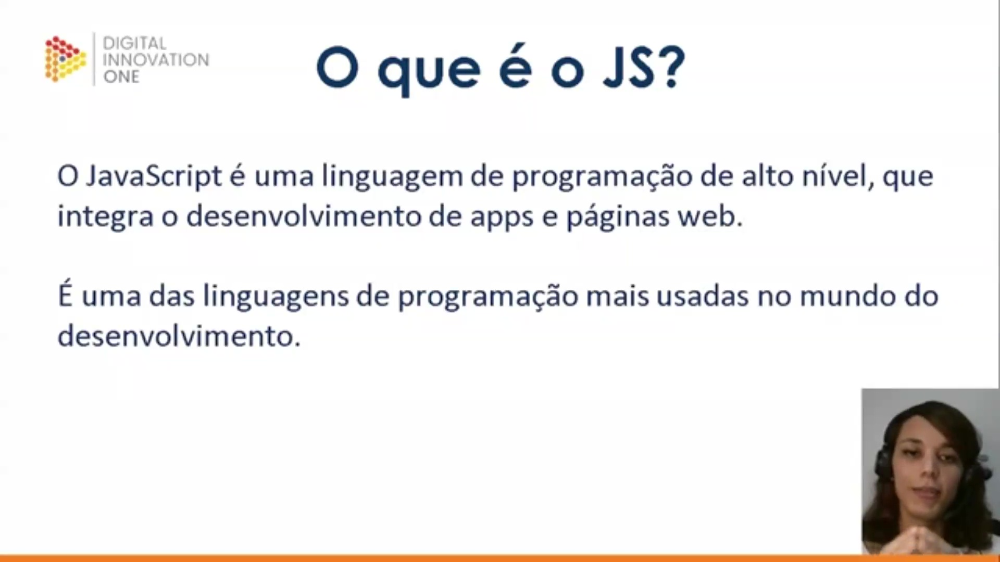
</p>

O JavaScript é definido como uma linguagem de programação de alto nível, o que significa que sua sintaxe é mais próxima da linguagem humana do que de linguagens de baixo nível (como byte code). É uma das linguagens mais populares e essenciais para integrar o desenvolvimento de aplicativos e páginas web.

<p align="center">

</p>

Início da primeira etapa da aula dedicada ao contexto histórico do JavaScript.

<p align="center">

</p>

A linguagem surgiu em 1995, criada pelo programador Brendan Eich na Netscape. Originalmente chamada de Mocha e depois LiveScript, teve seu nome alterado para JavaScript como uma jogada de marketing para aproveitar a popularidade da linguagem Java na época, o que gera confusão até hoje, apesar de serem linguagens totalmente distintas.

<p align="center">
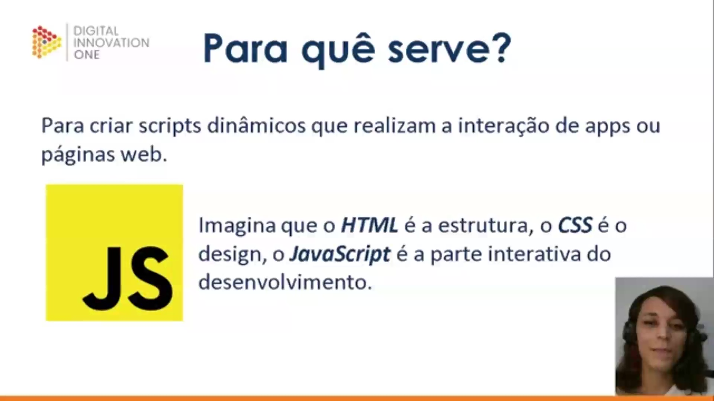
</p>

O JavaScript serve para criar scripts dinâmicos que permitem a interação em páginas web. Na metáfora do desenvolvimento, se o HTML é a estrutura (como a de um prédio) e o CSS é o design (a forma), o JavaScript representa a parte interativa, funcionando como a fiação e o encanamento.

<p align="center">

</p>

Embora possua diversas aplicações, o uso mais comum do JavaScript ocorre no desenvolvimento de sites e aplicativos web, atuando em conjunto com HTML e CSS. No decorrer deste curso, a linguagem será utilizada tanto para o estudo teórico quanto para a criação de projetos práticos.

<p align="center">
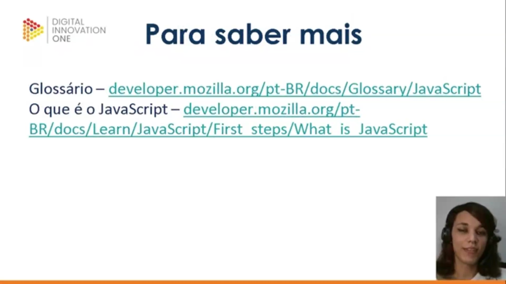
</p>

Sugestões de materiais complementares para aprofundamento, incluindo o Glossário da MDN e guias sobre o que é o JavaScript.

- [Glossário – developer.mozilla.org/pt-BR/docs/Glossary/JavaScript](https://developer.mozilla.org/pt-BR/docs/Glossary/JavaScript)  
- [O que é o JavaScript – developer.mozilla.org/pt-BR/docs/Learn/JavaScript/First_steps/What_is_JavaScript](https://developer.mozilla.org/pt-BR/docs/Learn/JavaScript/First_steps/What_is_JavaScript)


<p align="center">

</p>

Apresentação do link para o repositório oficial no GitHub, onde estão disponíveis os materiais e códigos utilizados no curso.

- [Repo. do curso – github.com/DianaMartine/curso-dio-sintaxe-basica-javascript](https://github.com/DianaMartine/curso-dio-sintaxe-basica-javascript)


<p align="center">

</p>

Transição para a segunda etapa da aula: Configurando e Desenvolvendo.

<p align="center">

</p>

Para o desenvolvimento, será utilizada a IDE Visual Studio Code (VS Code) e a extensão Live Server, que permite visualizar as atualizações do projeto em tempo real no navegador.

<p align="center">

</p>

O processo de configuração inclui o download do instalador do VS Code através do site oficial, selecionando a opção compatível com o sistema operacional do usuário. Durante a instalação, é importante marcar as opções de contexto para facilitar a abertura de pastas diretamente no editor.

<p align="center">
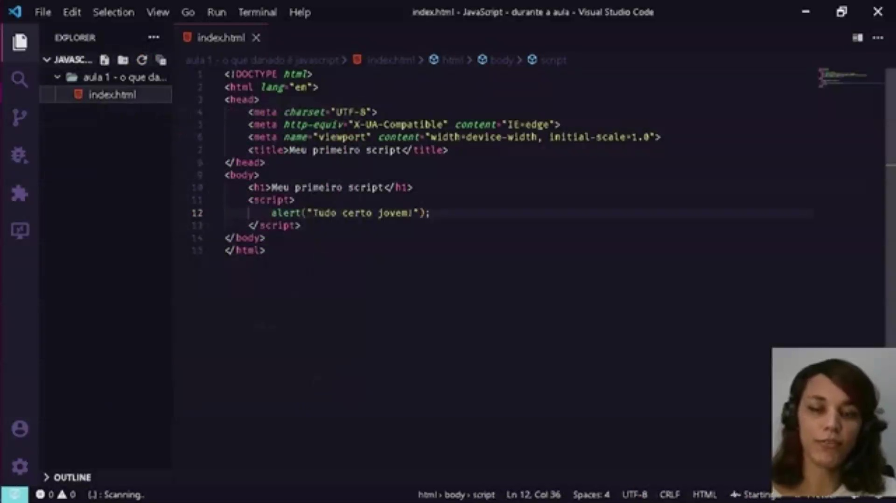
</p>

Criação do primeiro arquivo `index.html` e implementação de um script básico utilizando o método nativo `alert` para exibir uma mensagem no navegador.

```html
<!DOCTYPE html>
<html lang="en">
<head>
    <meta charset="UTF-8">
    <meta name="viewport" content="width=device-width, initial-scale=1.0">
    <title>meu primeiro script</title>
</head>
<body>
    <h1>meu primeiro script</h1>
    <script>
        alert("Tudo certo, jovem");
    </script>
</body>
</html>

```

<p align="center">

</p>

Ao abrir o arquivo com o Live Server, o navegador exibe a caixa de alerta com a mensagem configurada no código.

<p align="center">

</p>

Após fechar o alerta clicando em "OK", o conteúdo HTML da página, como o título definido na tag `<h1>`, é visualizado normalmente.

<p align="center">
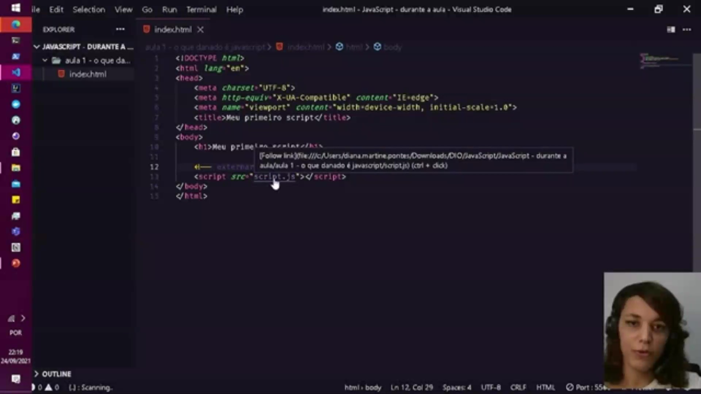
</p>

Como boa prática de desenvolvimento, recomenda-se externar o script. Isso é feito criando um arquivo separado (por exemplo, `script.js`) e referenciando-o no HTML através do atributo `src` na tag `<script>`.

```html
<script src="script.js"></script>
```

<p align="center">
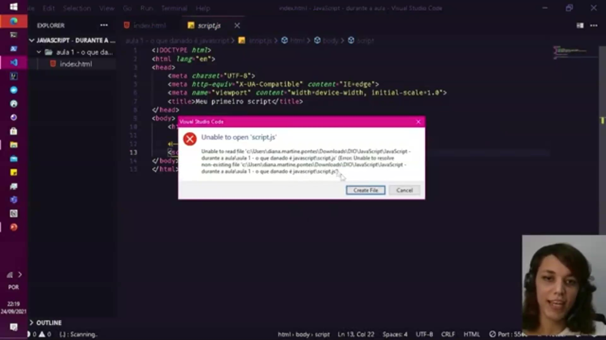
</p>

O código JavaScript é movido para o arquivo externo `script.js`, mantendo a organização do projeto e separando a lógica da estrutura HTML.

```javascript
alert("Tudo certo, jovem");
```

<p align="center">
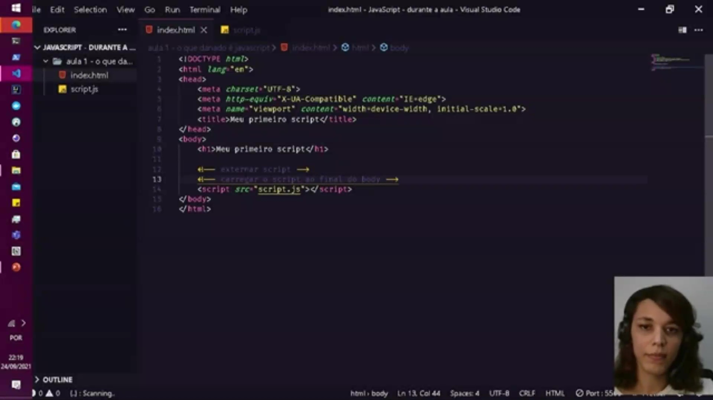
</p>

Outra prática recomendada é carregar o script sempre ao final do `body`. Isso garante que a estrutura visual do site seja carregada antes da execução das funcionalidades, evitando travamentos na renderização.

```html
<body>
    <script src="script.js"></script>
</body>

```

#### ▶️Código HTML
```html
<!DOCTYPE html>
<html lang="en">
<head>
    <meta charset="UTF-8">
    <meta http-equiv="X-UA-Compatible" content="IE=edge">
    <meta name="viewport" content="width=device-width, initial-scale=1.0">
    <title>Meu primeiro script</title>
</head>
<body>
    <h1>Meu primeiro script</h1>
    <!-- externar script -->
    <!-- carregar o script no final do body -->
    <script src="script.js"></script>
</body>
</html>
```

#### ▶️Cõdigo JavaScript

```javascript
alert("Tudo certo, jovem");
```

# Parte 3 - Entendendo variáveis e seus valores


## 🟩 Vídeo 03 - Entendendo variáveis e seus valores

![[bootcamp_tqi_fullstack-modulo_03-Curso.03-Video_03.webm|vid-60]]

Link do vídeo: https://web.dio.me/track/tqi-fullstack-developer/course/sintaxe-basica-em-javascript/learning/1559e7d6-698b-4da6-9d11-ce0f73dcc736?autoplay=1

Esta transcrição apresenta uma aula técnica sobre os fundamentos da **sintaxe em JavaScript**, abordando desde a **tipagem dinâmica** até a manipulação de dados. O conteúdo detalha como declarar **variáveis** utilizando `var`, `let` e `const`, explicando as diferenças cruciais entre **escopo global e local**. Além de definir **tipos primitivos** como strings e booleanos, o material ensina a distinguir entre **atribuição e comparação**, ressaltando a importância da identidade de tipos. Por fim, o guia demonstra o uso prático de **operadores aritméticos, relacionais e lógicos**, oferecendo uma base sólida para iniciantes na programação.

### Anotações

<p align="center">

</p>

Esta aula introduz os conceitos fundamentais de **sintaxe básica em JavaScript**, focando especificamente em variáveis e seus valores. O roteiro de aprendizado abrange desde o funcionamento da tipagem e declaração de variáveis até a utilização de operadores aritméticos, relacionais e lógicos.

<p align="center">
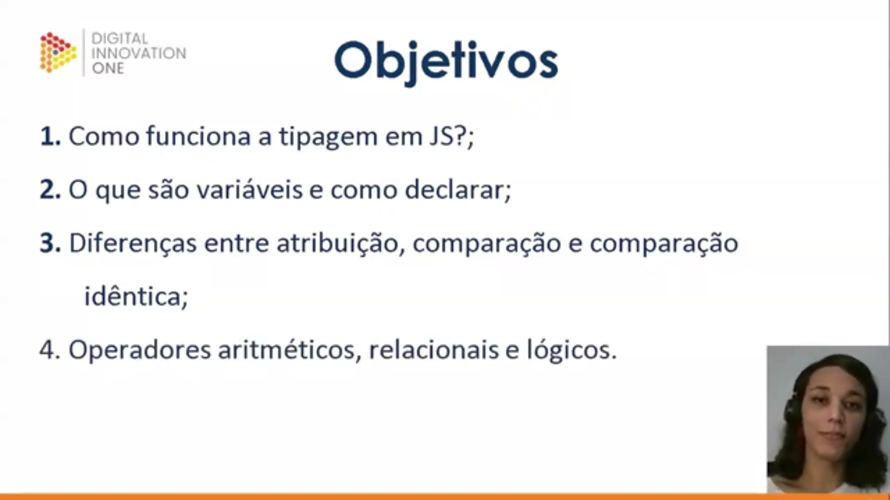
</p>

A tipagem funciona como uma regra para o uso de dados. No JavaScript, a **tipagem é fraca e dinâmica**, o que significa que o interpretador da linguagem identifica o tipo de dado automaticamente conforme o valor atribuído à variável. Por exemplo, ao atribuir o valor `1` entre aspas, o sistema entende como uma **string**, enquanto o valor `1` sem aspas é reconhecido como um **number**.

<p align="center">

</p>

As variáveis podem armazenar diferentes categorias de informações conhecidas como **tipos primitivos**. Entre os principais tipos utilizados no JavaScript estão:

* **Booleanos:** Valores verdadeiro ou falso (`true` ou `false`).
* **Null e Undefined:** Valores nulos ou não definidos.
* **Number:** Números inteiros ou flutuantes.
* **String:** Cadeias de caracteres (textos).
* **Arrays, Objects e Functions:** Estruturas mais complexas de armazenamento e execução.

<p align="center">
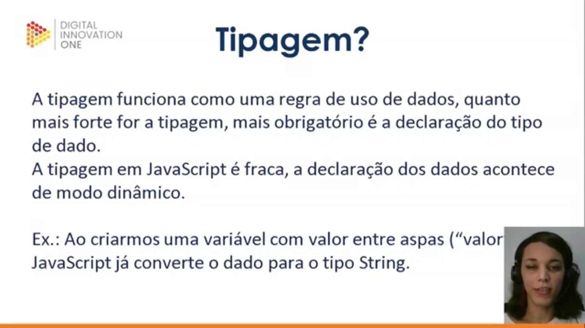
</p>

Para iniciar o desenvolvimento prático, é necessário organizar o ambiente criando uma pasta para o projeto e um arquivo `index.html`. Através da tag `<script>`, podemos vincular um arquivo JavaScript externo ao documento HTML utilizando o parâmetro `src`.

<p align="center">
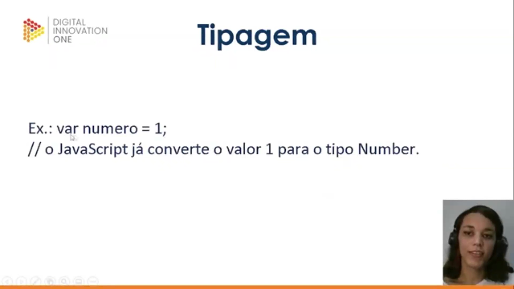
</p>

Para verificar o tipo de dado de uma variável em tempo de execução, utiliza-se o método nativo **typeof**. No exemplo abaixo, declaramos uma variável booleana e solicitamos a impressão de seu tipo no console:

```javascript
// boolean
var vOuF = false;
console.log(typeof(vOuF));

```

<p align="center">

</p>

Ao executar o código anterior no navegador e abrir o console (através da tecla F12 ou "Inspecionar"), o resultado exibido confirma que o tipo da variável `vOuF` é "boolean".

<p align="center">
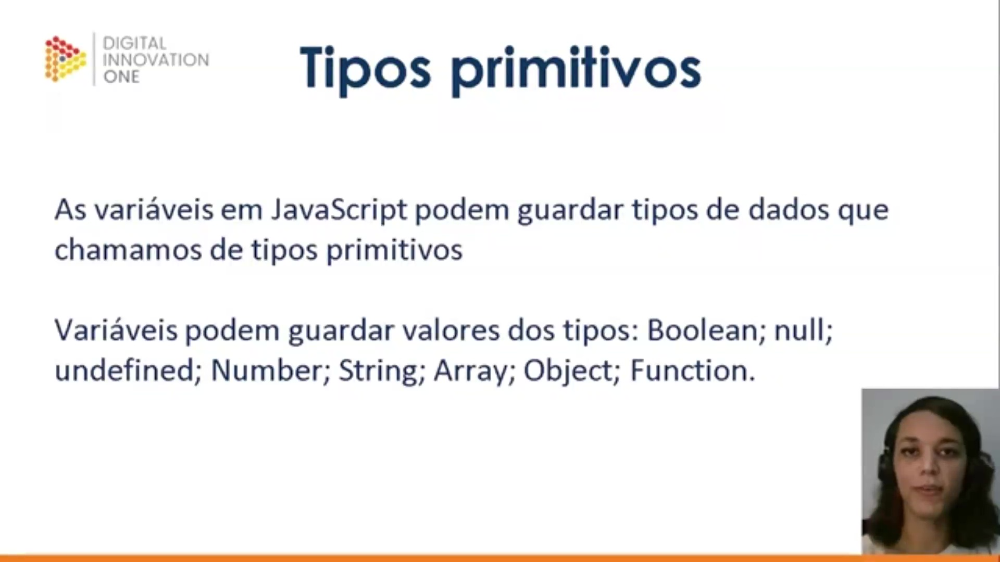
</p>

O mesmo princípio do `typeof` se aplica a outros tipos primitivos, como números e strings. Observe a declaração e a verificação de tipos:

```javascript
// number
var numeroQualquer = 1;
console.log(typeof(numeroQualquer));

// string
var nome = 'diana';
console.log(typeof(nome));

```

<p align="center">
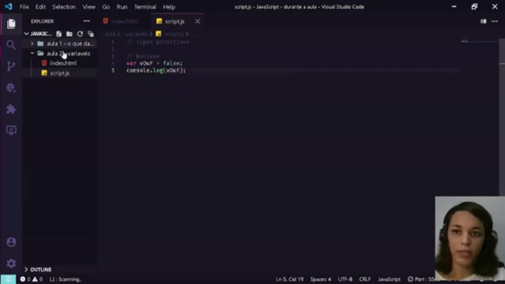
</p>

Conceitualmente, uma **variável** pode ser comparada a uma **caixa** onde guardamos um valor. Esse valor fica armazenado na memória e pode ser acessado ou alterado conforme a necessidade do programa.

<p align="center">
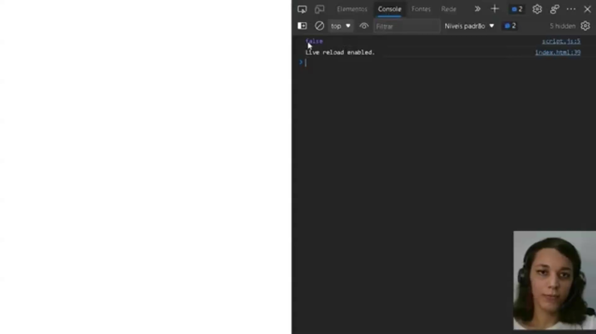
</p>

Existem três modos principais de declarar variáveis no JavaScript:

1. **var:** Escopo global e local; permite alteração de valor; se não inicializada, é tratada como nula/undefined.
2. **let:** Escopo local de bloco; permite alteração de valor; recomendada para variáveis que mudam dentro de um escopo restrito.
3. **const:** Escopo local de bloco; somente leitura; **obrigatoriamente** deve ter um valor inicial e não pode ser alterada posteriormente.

<p align="center">
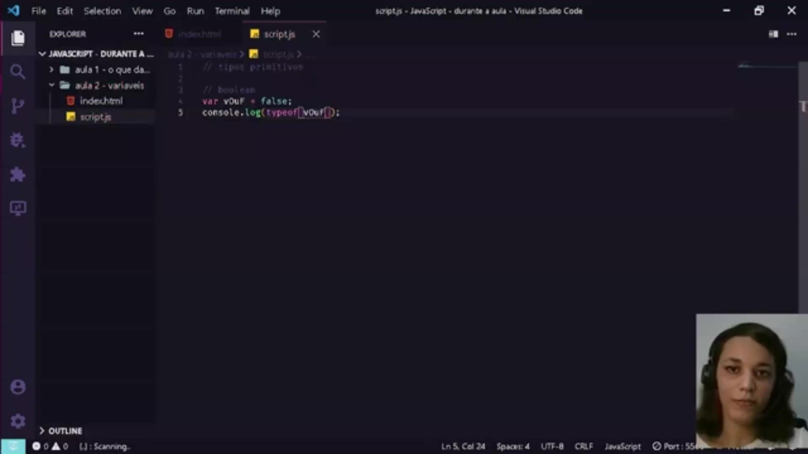
</p>

Utilizando a palavra reservada `var`, é possível criar uma variável e reatribuir seu valor ao longo do código sem gerar erros de execução:

```javascript
var variavel = 'diana';
variavel = 'martine';
console.log(variavel);

```

<p align="center">
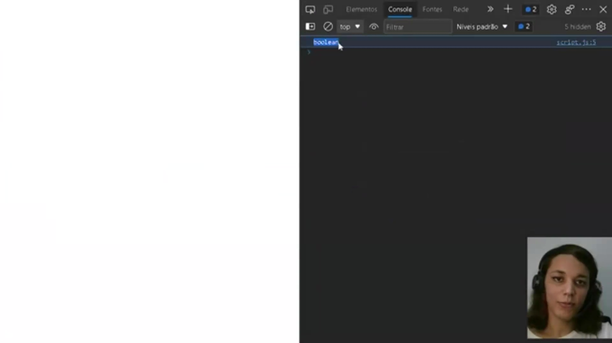
</p>

A declaração `let` funciona de forma semelhante ao `var` no que diz respeito à reatribuição, permitindo que o valor inicial seja modificado posteriormente:

```javascript
let variavel2 = 'diana';
variavel2 = 'martine';
console.log(variavel2);

```

<p align="center">
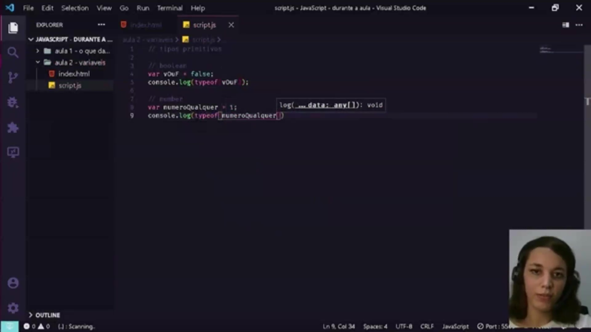
</p>

Diferente das anteriores, a `const` exige um valor no momento da criação. Se tentarmos reatribuir um novo valor a uma constante, o JavaScript retornará um erro informando que a variável não pode ser ressignificada:

```javascript
const constante = 'diana';
// constante = 'martine'; // Esta linha causaria um erro
console.log(constante);

```

<p align="center">
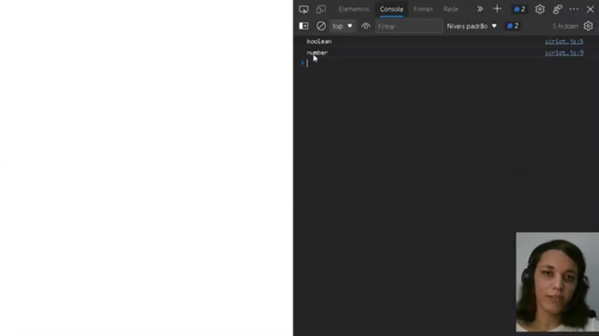
</p>

O **escopo** define a visibilidade de um bloco de código:

* **Escopo Global:** Declarada fora de qualquer bloco, a variável fica disponível em todo o script.
* **Escopo Local:** Declarada dentro de um bloco (como uma função), sua visibilidade é restrita, podendo ou não ser acessada de fora, dependendo da forma como foi declarada.

<p align="center">
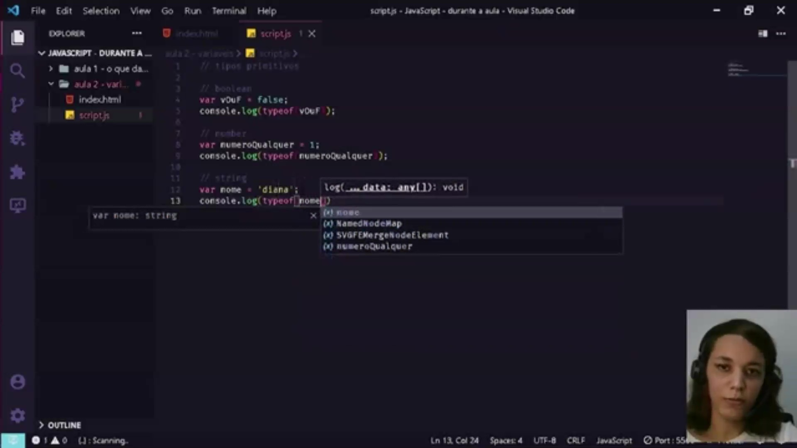
</p>

Neste exemplo, vemos que a variável definida dentro da função `escopoLocal` só pode ser acessada se o comando de impressão estiver dentro da própria função. Variáveis globais, por outro lado, são acessíveis por qualquer parte do código.

```javascript
var escopoGlobal = 'global';
console.log(escopoGlobal);

function escopoLocal() {
    let escopoLocalInterno = 'local';
    console.log(escopoLocalInterno);
}

escopoLocal();

```

<p align="center">
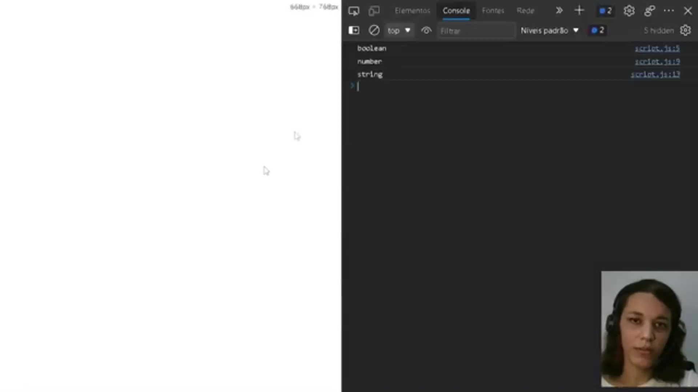
</p>

Para garantir a qualidade do código, algumas regras de nomenclatura devem ser seguidas:

* Sempre inicie nomes com letra, underline (`_`) ou cifrão (`$`).
* Nunca inicie com números.
* Não utilize espaços (use a prática de **camelCase**).
* Não utilize **palavras reservadas** da linguagem (como `function`, `let`, `var`).
* Declare variáveis sempre no topo do bloco (evitando problemas com *hoisting*).

<p align="center">
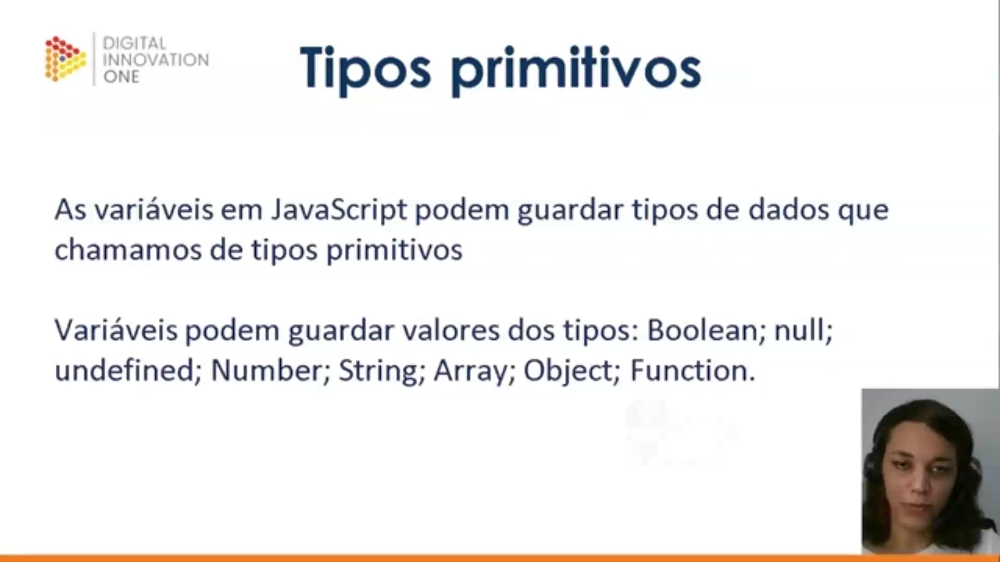
</p>

É fundamental entender a diferença entre os operadores de igualdade:

* **Atribuição (=):** Define um valor para a variável.
* **Comparação (==):** Verifica se os valores são iguais.
* **Comparação Idêntica (===):** Verifica se o valor **e** o tipo de dado são iguais.

<p align="center">

</p>

O sinal de igualdade unitário (=) não significa igual no contexto matemático dentro do JavaScript, mas sim uma **atribuição**. Ele informa ao sistema que o nome à esquerda deve receber o conteúdo à direita.

<p align="center">
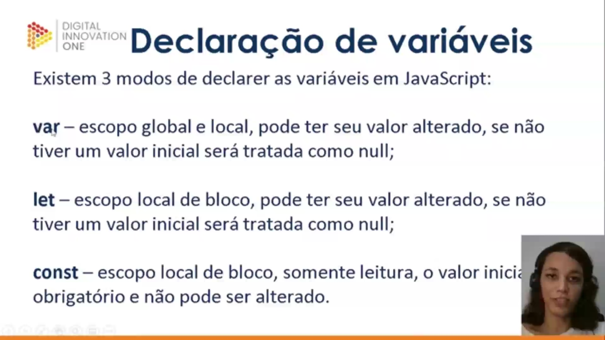
</p>

Exemplo prático de atribuição de uma string a uma variável:

```javascript
// atribuição
var atribuicao = 'diana';

```

<p align="center">

</p>

A comparação feita com dois sinais de igual (==) ignora o tipo do dado e foca apenas no valor. Por isso, ao comparar uma string "0" com o número 0, o resultado será verdadeiro.

<p align="center">
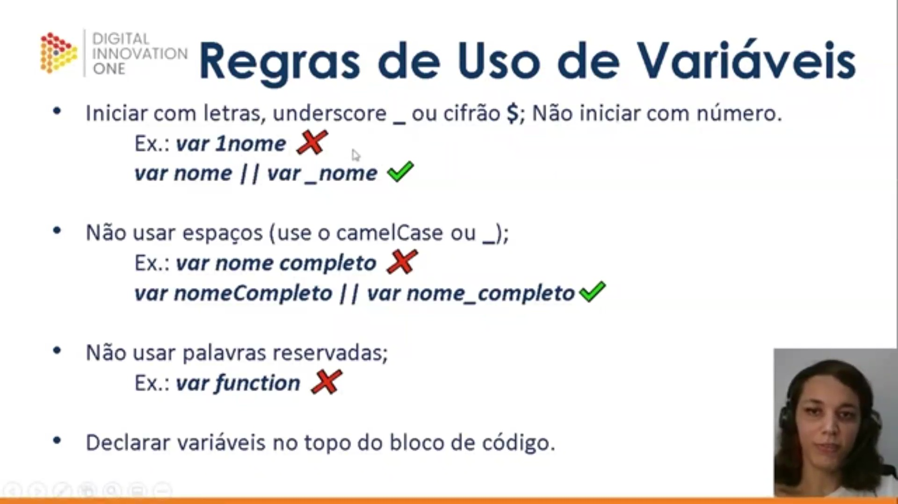
</p>

Demonstração do operador de comparação retornando um valor booleano:

```javascript
// comparação
var comparacao = '0' == 0;
console.log(comparacao); // Retorna true

```

<p align="center">
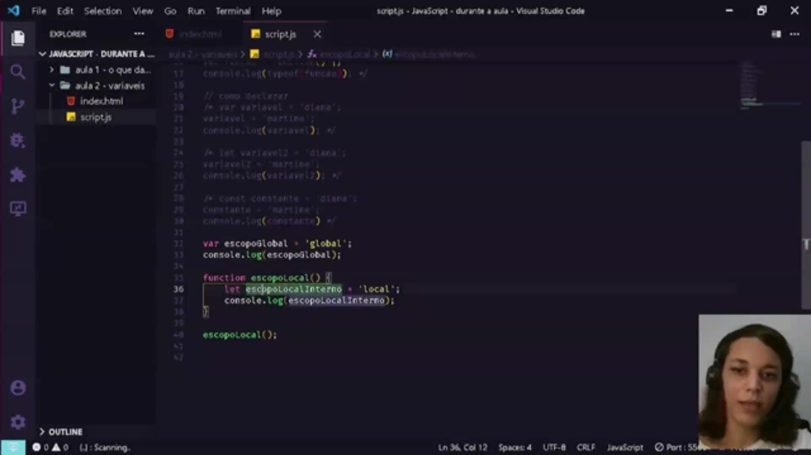
</p>

Já a comparação idêntica (===) é mais rigorosa. Ela retorna falso se os tipos forem diferentes, mesmo que os valores pareçam iguais:

```javascript
// comparação identica
var comparacaoIdentica = '0' === 0;
console.log(comparacaoIdentica); // Retorna false (string vs number)

```

<p align="center">

</p>

Além das comparações de igualdade, o JavaScript utiliza operadores para cálculos matemáticos (Aritméticos), verificação de grandeza entre valores (Relacionais) e lógica booleana (Lógicos).

<p align="center">
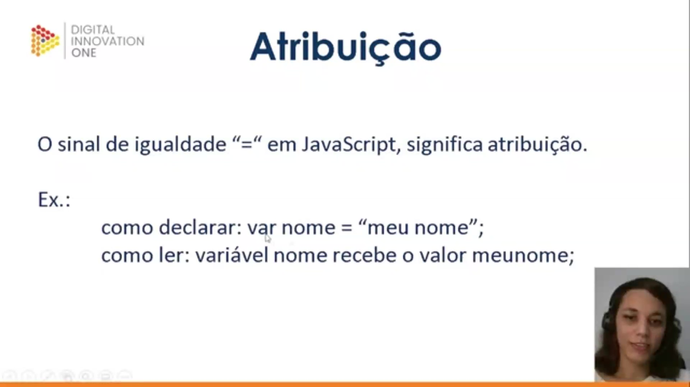
</p>

Os operadores aritméticos padrão incluem:

* **Adição (`+`)**
* **Subtração (`-`)**
* **Multiplicação (`*`)**
* **Divisão Real (`/`)**
* **Divisão Inteira/Resto (`%`)**
* **Potenciação (`**`)**

<p align="center">
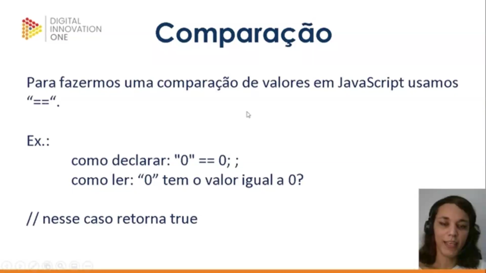
</p>

Abaixo, exemplos práticos de como realizar essas operações matemáticas no código:

```javascript
// adição
var adicao = 1 + 1;
console.log(adicao);

// subtração
var subtracao = 2 - 1;
console.log(subtracao);

// multiplicação
var multiplicacao = 2 * 3;
console.log(multiplicacao);

// divisão real
var divisaoReal = 6 / 2;
console.log(divisaoReal);

// divisão inteira (resto da divisão)
var divisaoInteira = 5 % 2;
console.log(divisaoInteira);

// potenciação
var potenciacao = 2 ** 10;
console.log(potenciacao);

```

<p align="center">
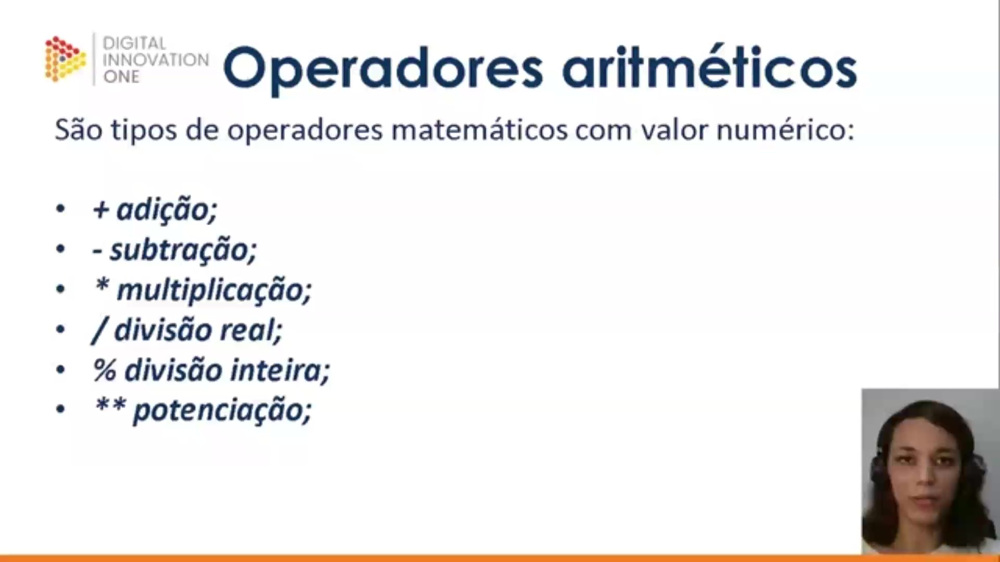
</p>

Os operadores relacionais são usados para testar a relação entre dois valores, sempre retornando um booleano:

* **Maior que (`>`)**
* **Menor que (`<`)**
* **Maior ou igual a (`>=`)**
* **Menor ou igual a (`<=`)**

<p align="center">

</p>

Exemplos de aplicações relacionais:

```javascript
// maior que
var maiorQue = 5 > 2;
console.log(maiorQue);

// menor que
var menorQue = 5 < 2;
console.log(menorQue);

// maior ou igual a
var maiorOuIgual = 5 >= 2;
console.log(maiorOuIgual);

// menor ou igual a
var menorOuIgual = 5 <= 2;
console.log(menorOuIgual);

```

<p align="center">
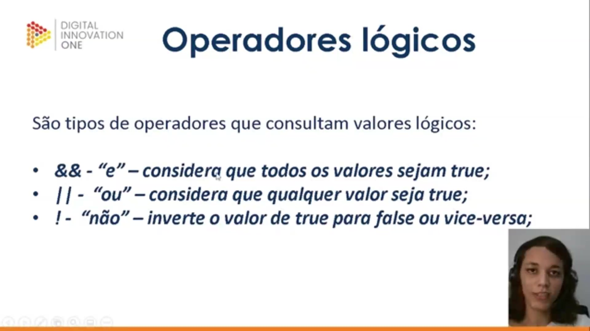
</p>

Por fim, os operadores lógicos permitem combinar ou inverter estados booleanos:

* **E (`&&`):** Todas as condições devem ser verdadeiras.
* **OU (`||`):** Apenas uma condição precisa ser verdadeira.
* **NÃO (`!`):** Inverte o valor booleano atual.

```javascript
// e
var e = true && false;
console.log(e); // Retorna false

// ou
var ou = true || false;
console.log(ou); // Retorna true

// não
var nao = !true;
console.log(nao); // Retorna false

```


# Parte 4 - Vetores e Objetos


## 🟩 Vídeo 04 - Vetores e Objetos

link do vídeo: https://web.dio.me/track/tqi-fullstack-developer/course/sintaxe-basica-em-javascript/learning/aeb705a9-74ea-4e50-901b-44c899c17b6a?autoplay=1


##  Materiais de Apoio


# Certificado: 

- Link na plataforma: 
- Certificado em pdf: 
