## Instrutor

- Stephany Nusch (Software Engineer at Microsoft)
- Contato Linkedin: / [stephanynusch](https://www.linkedin.com/in/stephanynusch/)

# Parte 1 - Operadores

## 🟩 Vídeo 01 - Apresentação do curso

<video width="60%" controls>
  <source src="000-Midia_e_Anexos/bootcamp_tqi_fullstack-modulo_03-Curso.04-Video_01.webm" type="video/webm">
  Seu navegador não suporta vídeo HTML5.
</video>

Link do vídeo:  https://web.dio.me/track/tqi-fullstack-developer/course/sintaxe-e-operadores-javascript/learning/6e83ba51-9a4d-4c0f-9537-f23e9aa7458a?autoplay=1

O vídeo apresenta a **introdução de um curso de JavaScript** focado no ensino de **sintaxe e operadores** essenciais para a manipulação de dados. A instrutora **Stephanie**, uma engenheira de software experiente, compartilha sua trajetória profissional e disponibiliza seus contatos para facilitar o **networking entre os alunos**. O conteúdo programático é dividido em uma **parte teórica** sobre o funcionamento dos comandos e uma subsequente **atividade prática** para consolidar o aprendizado. Para auxiliar no progresso dos estudantes, a mentora destaca a existência de **fóruns e comunidades no Discord** como espaços de suporte técnico. Essas ferramentas visam promover a **troca de conhecimentos** e a resolução conjunta de exercícios durante toda a jornada educacional.

### Anotações

#### Introdução ao curso de Sintaxe e Operadores

<p align="center">
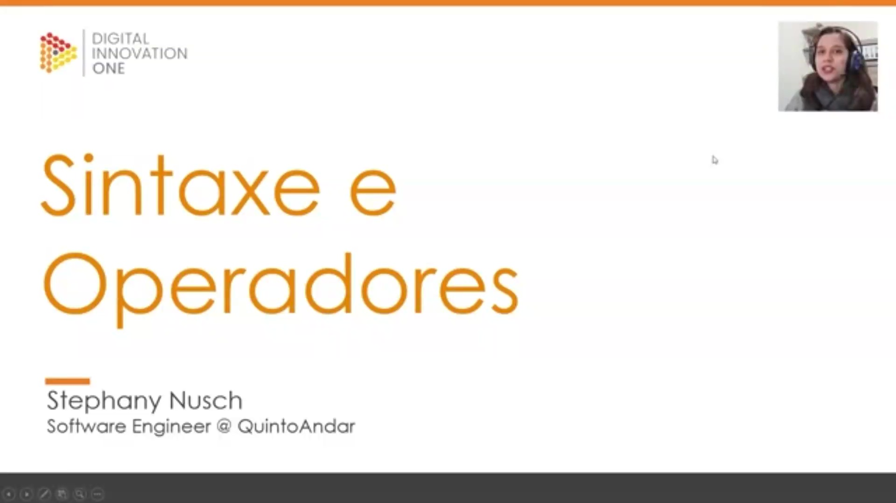
</p>

Nesta aula inicial de **JavaScript**, o foco principal é o estudo da **sintaxe e dos operadores** da linguagem. A apresentação é conduzida por **Stephany Nusch**, engenheira de software no QuintoAndar, que introduz os fundamentos necessários para compreender como a estrutura do código e suas operações básicas funcionam.

#### Perfil da Instrutora

<p align="center">
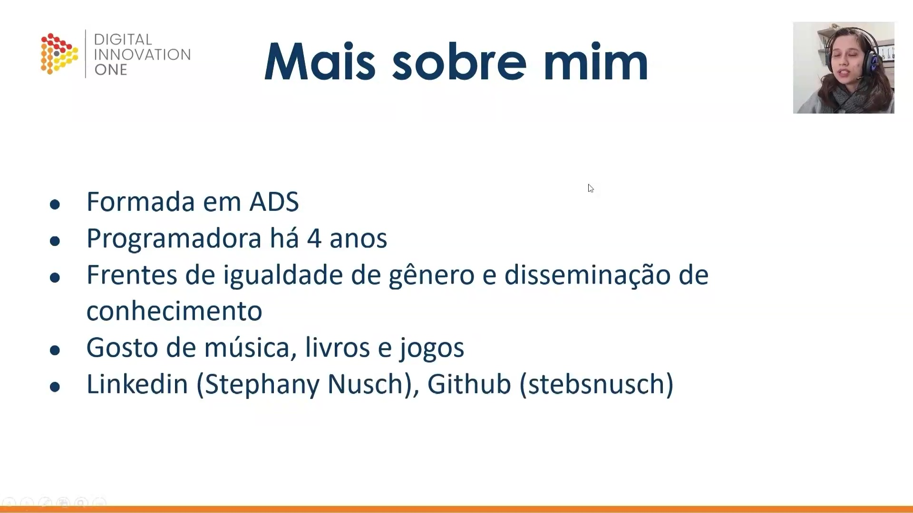
</p>

A instrutora compartilha sua trajetória profissional e acadêmica para contextualizar sua experiência na área:

* **Formação:** Graduada em Análise e Desenvolvimento de Sistemas (ADS).
* **Experiência:** Atua como programadora há aproximadamente 4 anos.
* **Engajamento:** Participa ativamente de frentes voltadas à **igualdade de gênero** e à **disseminação de conhecimento**.
* **Interesses:** Música, livros e jogos.
* **Contato:** Disponibiliza seus perfis no **LinkedIn (Stephany Nusch)** e no **GitHub (stebsnusch)** para networking e dúvidas.

#### Objetivo do Curso

<p align="center">
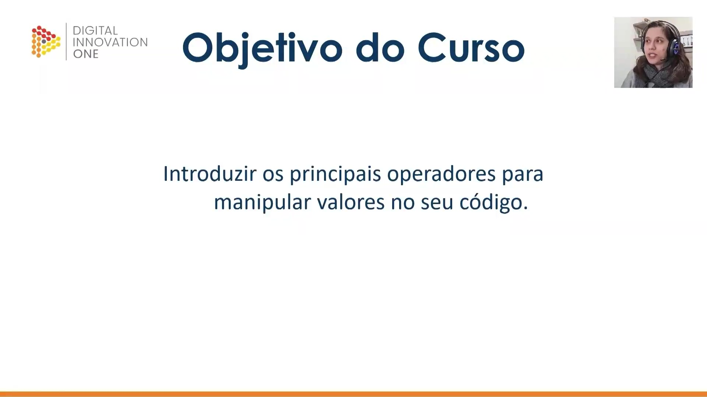
</p>

O propósito central deste treinamento é **introduzir os principais operadores** da linguagem JavaScript. Esses elementos são fundamentais para que o desenvolvedor consiga **manipular valores** de forma eficiente dentro do seu código, permitindo a criação de lógicas e processamento de dados.

#### Percurso de Aprendizado

<p align="center">
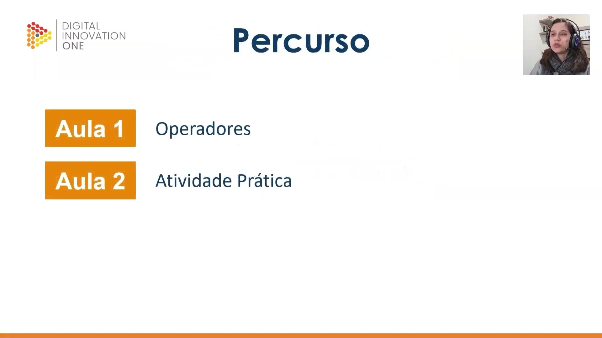
</p>

O curso é estruturado de forma direta e objetiva, dividido em dois momentos principais:

1. **Aula 1 - Operadores:** Exploração teórica sobre o que são e como funcionam os operadores.
2. **Aula 2 - Atividade Prática:** Aplicação dos conceitos aprendidos em um exercício guiado para fixação do conteúdo.

Além das aulas, o suporte ao aprendizado inclui o **fórum do curso** e a **comunidade no Discord**, onde é possível interagir com outros estudantes e especialistas para tirar dúvidas e realizar networking.


## 🟩 Vídeo 02 - Operadores

<video width="60%" controls>
  <source src="000-Midia_e_Anexos/bootcamp_tqi_fullstack-modulo_03-Curso.04-Video_02.webm" type="video/webm">
  Seu navegador não suporta vídeo HTML5.
</video>

Link do vídeo: https://web.dio.me/track/tqi-fullstack-developer/course/sintaxe-e-operadores-javascript/learning/73fbee4f-25f8-456e-a83c-bf111cf68df5?autoplay=1

O instrutor detalha como **atribuir valores** a variáveis, diferenciando a atribuição simples do uso de símbolos que realizam cálculos matemáticos simultâneos. São explicados os **operadores aritméticos** tradicionais, além de recursos específicos como o incremento, o decremento e o cálculo de módulo. Um ponto crucial do conteúdo aborda a **comparação de dados**, enfatizando a diferença vital entre checar apenas o valor ou validar também o tipo da variável para garantir a segurança do código. O texto ainda introduz o funcionamento da **lógica booleana** e do **operador ternário**, apresentando este último como uma alternativa elegante e concisa às estruturas condicionais clássicas. No encerramento, reforça-se que a familiaridade com esses sinais é indispensável para **manipular dados e validar condições** de forma eficiente na programação.

### Anotações

<p align="center">

</p>

Esta é a tela de abertura da aula sobre operadores, parte integrante do módulo de Variáveis e Tipos. O objetivo central desta sessão é introduzir os sinais e símbolos fundamentais utilizados para manipular valores e validar condições dentro do ecossistema JavaScript.

<p align="center">
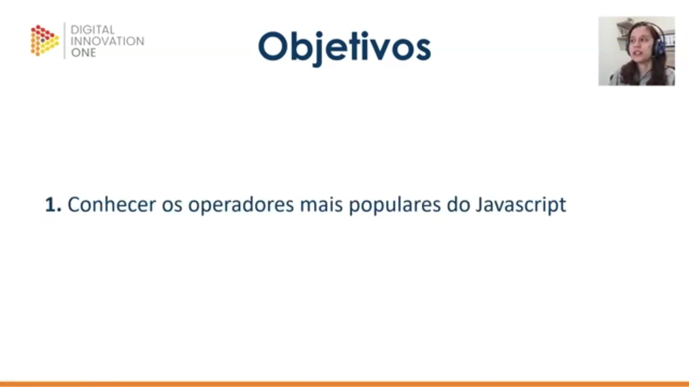
</p>

O slide apresenta os objetivos da aula, destacando o foco em conhecer os operadores mais populares do JavaScript. Estes operadores são as ferramentas básicas para a construção de qualquer lógica de programação, permitindo a execução de cálculos e checagens.

<p align="center">
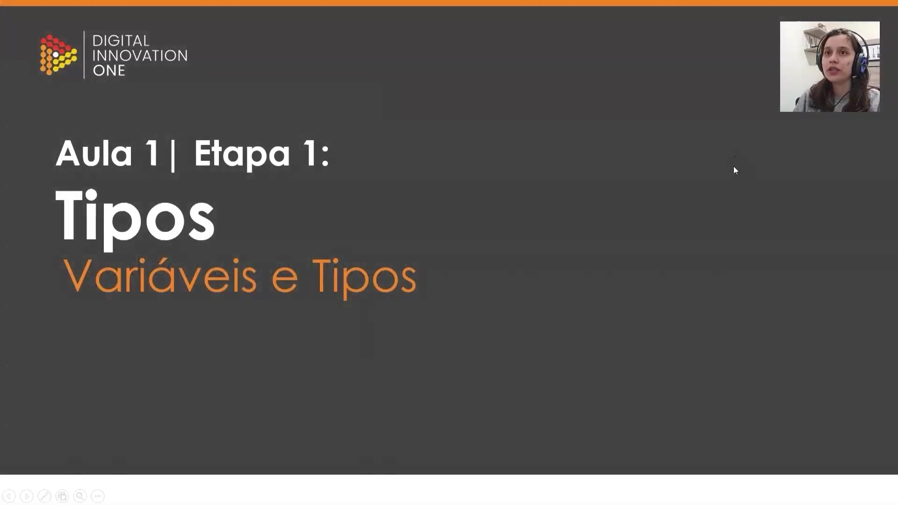
</p>

Início da Etapa 1, que introduz a relação entre os operadores e os tipos de dados. Compreender como essas variáveis interagem é o primeiro passo para dominar a manipulação de dados na linguagem.

<p align="center">
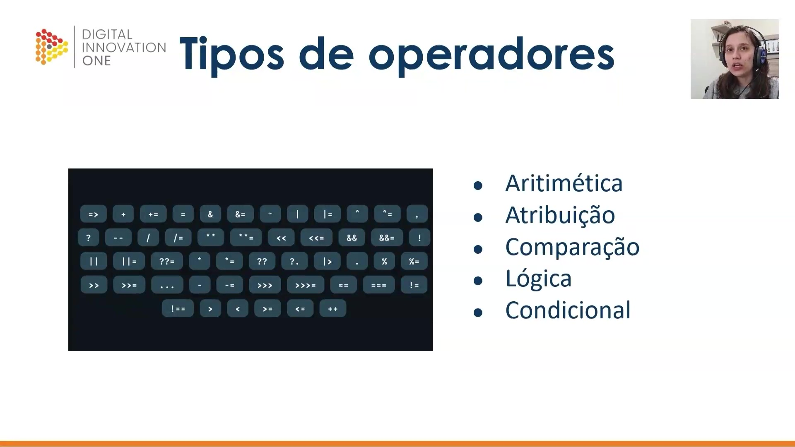
</p>

Este slide oferece uma visão geral dos tipos de operadores que serão abordados ao longo do curso: Aritmética, Atribuição, Comparação, Lógica e Condicional. Cada uma dessas categorias possui um conjunto de sinais específicos para diferentes necessidades de programação.

<p align="center">
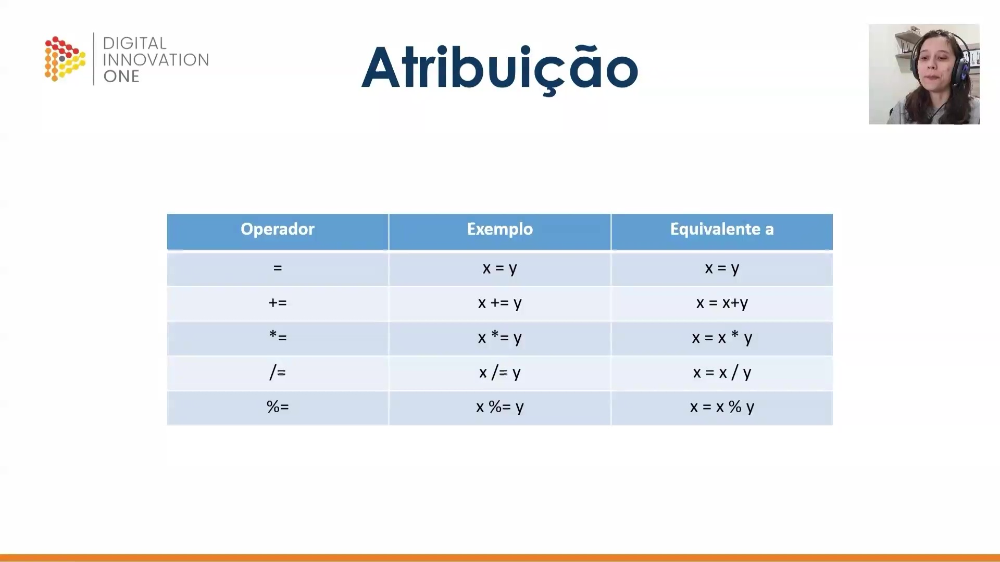
</p>

Detalhamento dos operadores de atribuição. Embora o sinal de igual (`=`) seja o mais utilizado para definir valores, o JavaScript oferece formas abreviadas (como `+=` ou `*=`) que permitem realizar uma operação aritmética e atribuir o resultado à variável em uma única instrução.

| Operador | Exemplo | Equivalente a |
| --- | --- | --- |
| `=` | `x = y` | `x = y` |
| `+=` | `x += y` | `x = x + y` |
| `*=` | `x *= y` | `x = x * y` |
| `/=` | `x /= y` | `x = x / y` |
| `%=` | `x %= y` | `x = x % y` |

<p align="center">

</p>

Transição para a Etapa 3, focada exclusivamente nos operadores aritméticos. Estes são essenciais para a realização de cálculos matemáticos, manipulação de índices em gráficos ou fórmulas de lógica de negócio.

<p align="center">
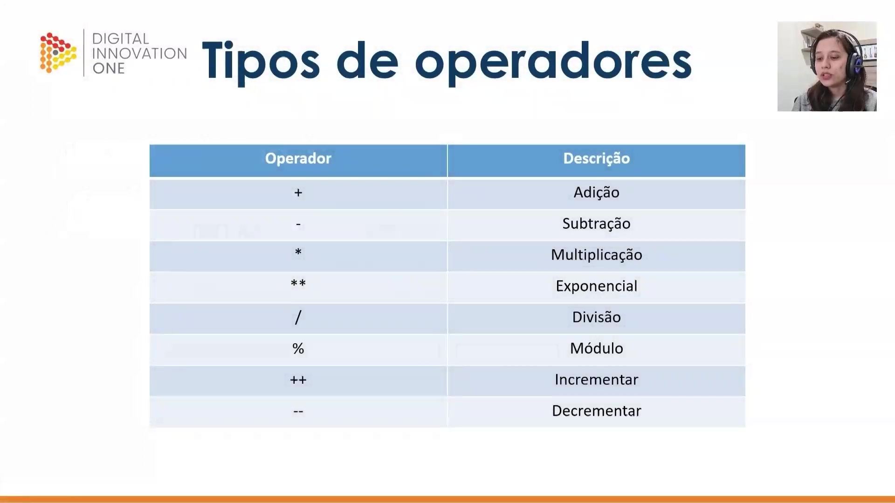
</p>

Apresentação dos operadores aritméticos disponíveis no JavaScript. Além das quatro operações básicas, destacam-se o operador de exponencial (`**`), o módulo (`%`) para obtenção do resto da divisão, e os incrementadores/decrementadores (`++` e `--`) que alteram o valor da variável em uma unidade.

| Operador | Descrição |
| --- | --- |
| `+` | Adição |
| `-` | Subtração |
| `*` | Multiplicação |
| `**` | Exponencial |
| `/` | Divisão |
| `%` | Módulo |
| `++` | Incrementar |
| `--` | Decrementar |

<p align="center">

</p>

Início da Etapa 4, dedicada aos operadores de comparação. Esta fase é crucial para entender como o programa toma decisões baseadas na igualdade ou desigualdade entre valores.

<p align="center">
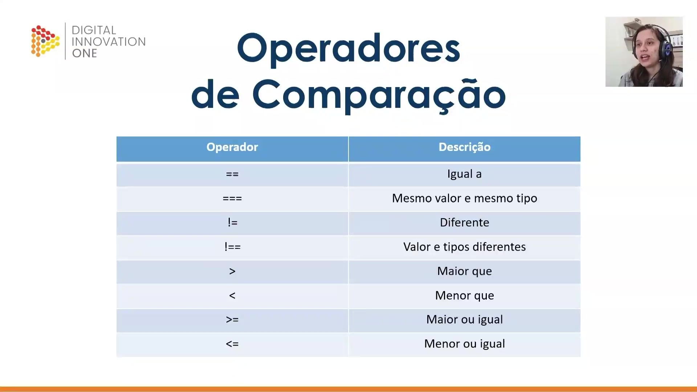
</p>

O slide detalha os operadores de comparação, com ênfase na diferença entre a comparação simples (\==) e a comparação estrita (\=\==\=). O uso de três sinais de igual é recomendado no mercado por garantir maior segurança, validando tanto o valor quanto o tipo do dado comparado.

| Operador | Descrição |
| --- | --- |
| == | Igual a |
| ==== | Mesmo valor e mesmo tipo |
| `!=` | Diferente |
| `!==` | Valor e tipos diferentes |
| `>` | Maior que |
| `<` | Menor que |
| `>=` | Maior ou igual |
| `<=` | Menor ou igual |

<p align="center">
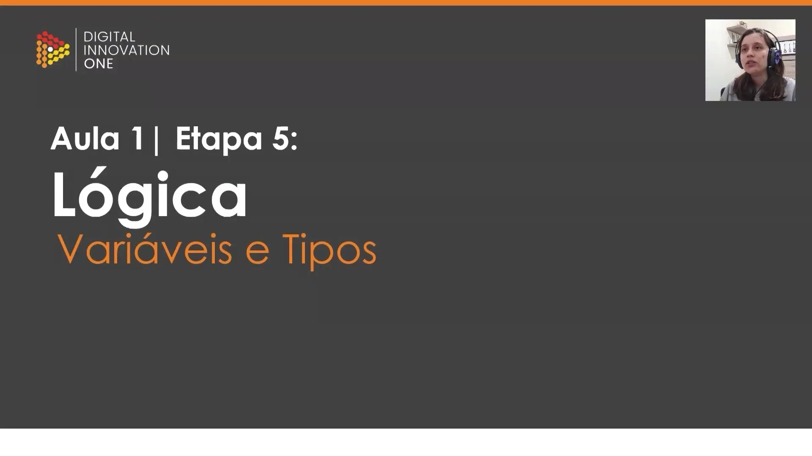
</p>

Introdução à Etapa 5, que aborda os operadores lógicos. Estes operadores são utilizados para combinar múltiplas afirmações e criar regras de validação mais complexas dentro do código.

<p align="center">
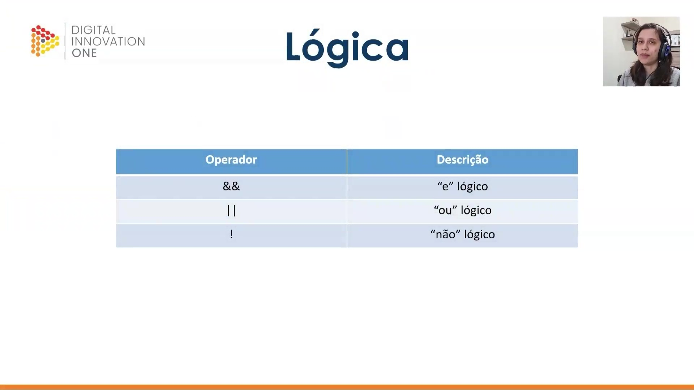
</p>

Explicação sobre os três principais operadores lógicos: o **E lógico (&&)**, que requer que todas as condições sejam verdadeiras; o **OU lógico (||)**, que exige apenas uma condição verdadeira; e o **NÃO lógico (!)**, utilizado para inverter o valor booleano (negando uma afirmação).

<p align="center">

</p>

O slide introduz o **operador condicional (if ternário)**. Este recurso é uma prática recomendada no mercado atual para simplificar e tornar mais concisa a escrita de estruturas `if else` tradicionais quando a lógica envolvida é simples.

<p align="center">
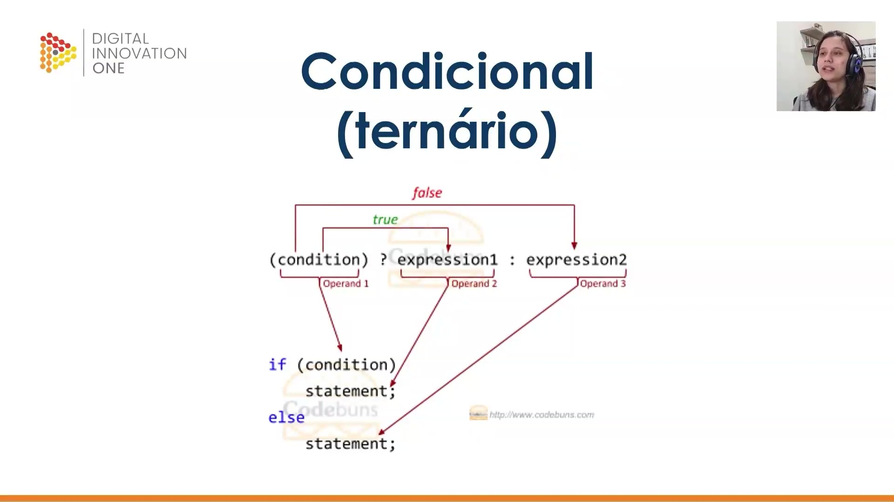
</p>

Demonstração da sintaxe do operador ternário, que utiliza o ponto de interrogação e os dois pontos para definir uma condição e seus respectivos resultados para verdadeiro ou falso.

```javascript
condição ? expressão1 : expressão2

```

Se a condição for verdadeira, a primeira expressão é executada; caso contrário, a segunda é acionada.


# Parte 3 - Atividade prática

## 🟩 Vídeo 03 - Explicando a atividade

<video width="60%" controls>
  <source src="000-Midia_e_Anexos/bootcamp_tqi_fullstack-modulo_03-Curso.04-Video_03.webm" type="video/webm">
  Seu navegador não suporta vídeo HTML5.
</video>

Link do vídeo:  https://web.dio.me/track/tqi-fullstack-developer/course/sintaxe-e-operadores-javascript/learning/be1eafaa-2817-41eb-b4d5-8c63d7b11c9e?autoplay=1

O vídeo apresenta uma **atividade prática** voltada para estudantes de **JavaScript**, focada especificamente em **sintaxe e operadores**. A instrutora orienta os alunos a criarem uma **função** que compare dois números para verificar se são idênticos e analise se a soma deles ultrapassa os limites de **10 e 20**. O enunciado detalhado e o código de referência estão hospedados em um repositório no **GitHub**, servindo como base para o exercício. Os participantes são incentivados a tentar resolver o desafio de forma **independente** antes de consultarem a resolução oficial. Além do material de apoio, o curso oferece suporte através de um **fórum** e de uma comunidade no **Discord**. Por fim, a próxima etapa pedagógica consistirá em um vídeo explicativo com a demonstração da solução passo a passo.

### Anotações

<p align="center">
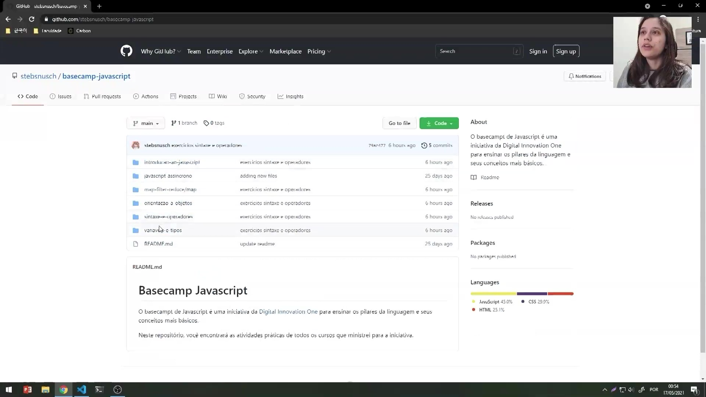
</p>

A atividade prática deste módulo está hospedada no GitHub, no repositório **basecamp-javascript** da conta **stebsnusch**. O projeto funciona como uma coletânea de exercícios organizados por diretórios temáticos, abrangendo desde a introdução à linguagem até conceitos de orientação a objetos e JavaScript assíncrono. Para realizar o exercício proposto, o aluno deve navegar até a pasta específica denominada **sintaxe e operadores**.

---

<p align="center">
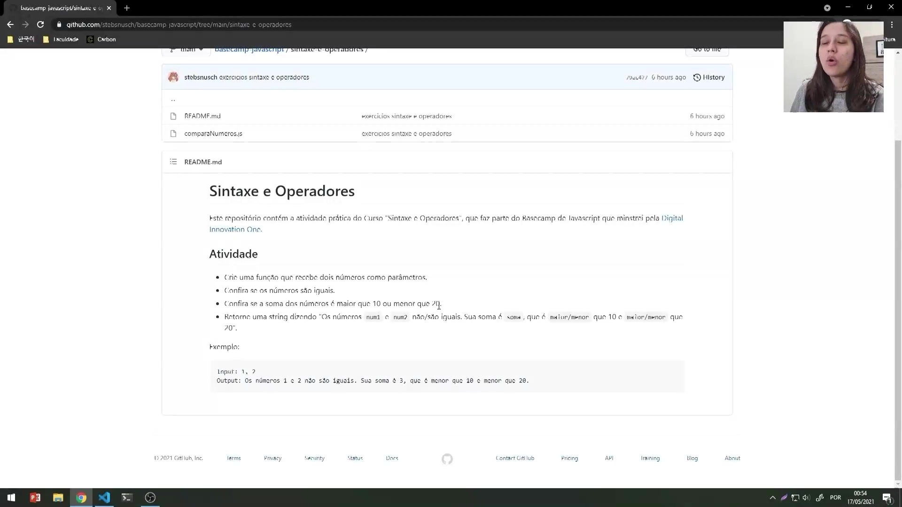
</p>

O enunciado da atividade propõe a criação de uma função JavaScript que opere com dois números recebidos como parâmetros. O objetivo é exercitar a sintaxe da linguagem e o uso de operadores lógicos e aritméticos através dos seguintes requisitos:

* **Comparação**: Verificar se os dois números informados são iguais entre si.
* **Soma e Intervalo**: Calcular a soma dos dois números e validar se esse resultado é maior que 10 ou menor que 20.
* **Saída**: Retornar uma string formatada contendo os números, a confirmação de igualdade e a relação da soma com os valores 10 e 20.

**Exemplo Prático:**

* **Input**: 1, 2 
* **Output**: "Os números 1 e 2 não são iguais. Sua soma é 3, que é menor que 10 e menor que 20".

Para auxiliar no desenvolvimento, o repositório disponibiliza um arquivo de solução chamado `comparaNumeros.js`.


## 🟩 Vídeo 04 - Atividade prática

![[bootcamp_tqi_fullstack-modulo_03-Curso.04-Video_04.webm|vid-60]]

Link do vídeo: https://web.dio.me/track/tqi-fullstack-developer/course/sintaxe-e-operadores-javascript/learning/1adc777c-443e-49d9-9795-2cee3d0f48a7?autoplay=1

O material consiste em uma aula prática de programação focada na criação de uma função em **JavaScript** para comparar dois números e validar suas somas. A instrutora utiliza o **VS Code** para demonstrar como empregar **operadores aritméticos, relacionais e lógicos**, além de introduzir conceitos como o **if ternário** e **template literals**. O objetivo central é ensinar o aluno a estruturar um código modularizado, dividindo a lógica em **funções auxiliares** para melhorar a organização e a legibilidade. Além da implementação técnica, o conteúdo ressalta a importância de realizar **validações de dados** para evitar erros quando parâmetros são omitidos ou inválidos. O vídeo encerra incentivando a experimentação com outros operadores e o uso de comunidades de suporte para o aprendizado contínuo.

### Anotações

<p align="center">
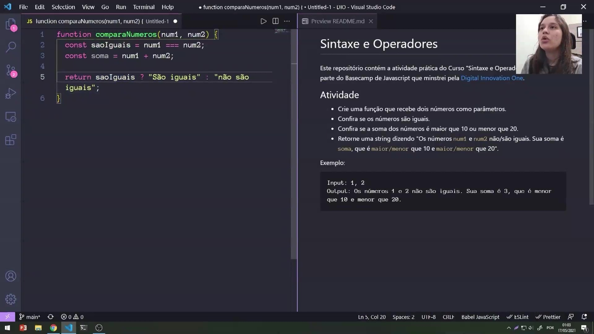
</p>

O ambiente de desenvolvimento no Visual Studio Code é apresentado com o enunciado do exercício de JavaScript sobre Sintaxe e Operadores. O desafio proposto requer a criação de uma função que receba dois números como parâmetros para verificar se são iguais, calcular sua soma e comparar se o resultado é maior ou menor que os valores 10 e 20. A solução deve retornar uma string formatada contendo todas essas informações, exigindo o uso de operadores lógicos e condicionais. 

<p align="center">
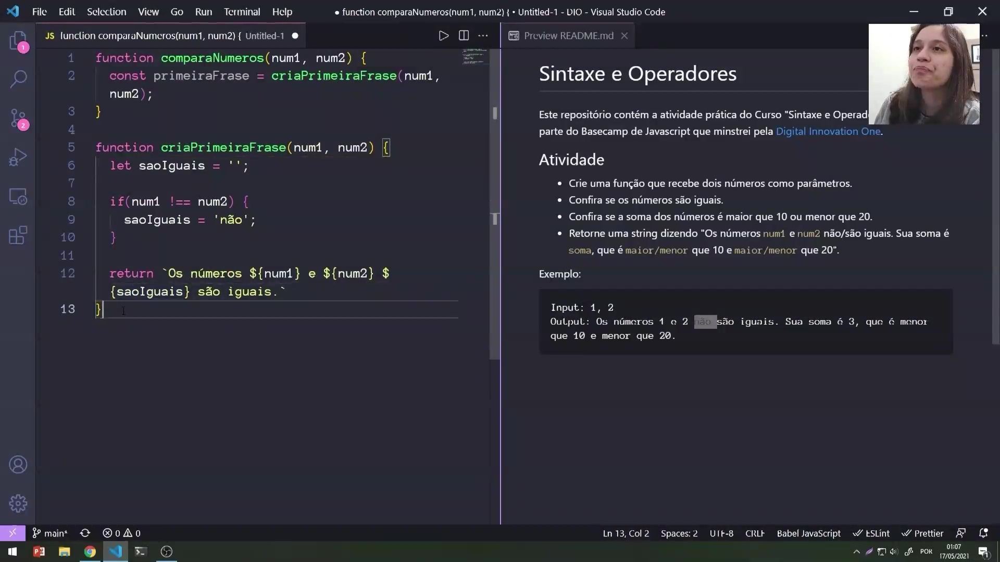
</p>

Para resolver o problema de forma organizada, iniciamos com a criação de uma função auxiliar chamada `criaPrimeiraFrase`. Esta função foca na primeira parte do requisito: a verificação de igualdade. Utilizamos uma variável `saoIguais` que é inicializada como uma string vazia; caso os números sejam diferentes (verificado pelo operador de desigualdade), a variável recebe o valor "não". O retorno é a primeira metade da frase esperada. 

```javascript
function criaPrimeiraFrase(num1, num2) {
	let saoIguais = '';

	if (num1 !== num2) {
		saoIguais = 'não';
	}

	return `Os números ${num1} e ${num2} ${saoIguais} são iguais.`;
}

```

<p align="center">
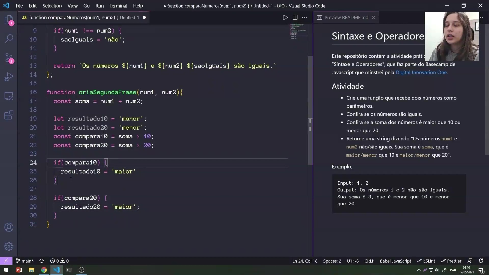
</p>

A implementação prossegue com a função `criaSegundaFrase`, responsável pelo processamento da soma e das comparações de magnitude. Nela, a soma dos parâmetros é calculada e armazenada. Para manter o código limpo, variáveis de resultado para os limites 10 e 20 são inicializadas com o valor padrão "menor". Através de condicionais simples, esses valores são alterados para "maior" caso a soma ultrapasse os respectivos limites. 

```javascript
function criaSegundaFrase(num1, num2) {
	const soma = num1 + num2;
	let resultado10 = 'menor';
	let resultado20 = 'menor';

	const compara10 = soma > 10;
	const compara20 = soma > 20;

	if (compara10) {
		resultado10 = 'maior';
	}

	if (compara20) {
		resultado20 = 'maior';
	}

	return `Sua soma é ${soma}, que é ${resultado10} que 10 e ${resultado20} que 20.`;
}

```

<p align="center">
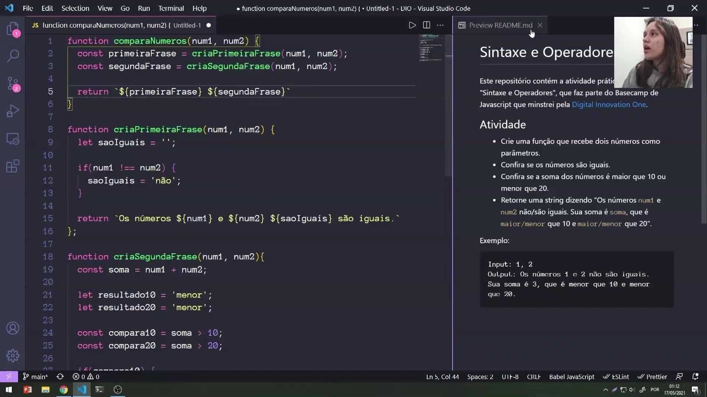
</p>

Nesta etapa, consolidamos a lógica na função principal `comparaNumeros`. Ela atua como uma integradora, invocando as duas funções auxiliares desenvolvidas anteriormente e armazenando seus retornos. O resultado final da função principal é a concatenação das duas partes da resposta utilizando *template literals*, o que garante que a frase completa seja exibida corretamente conforme o exemplo do enunciado. 

```javascript
function comparaNumeros(num1, num2) {
	const primeiraFrase = criaPrimeiraFrase(num1, num2);
	const segundaFrase = criaSegundaFrase(num1, num2);

	return `${primeiraFrase} ${segundaFrase}`;
}

```

<p align="center">
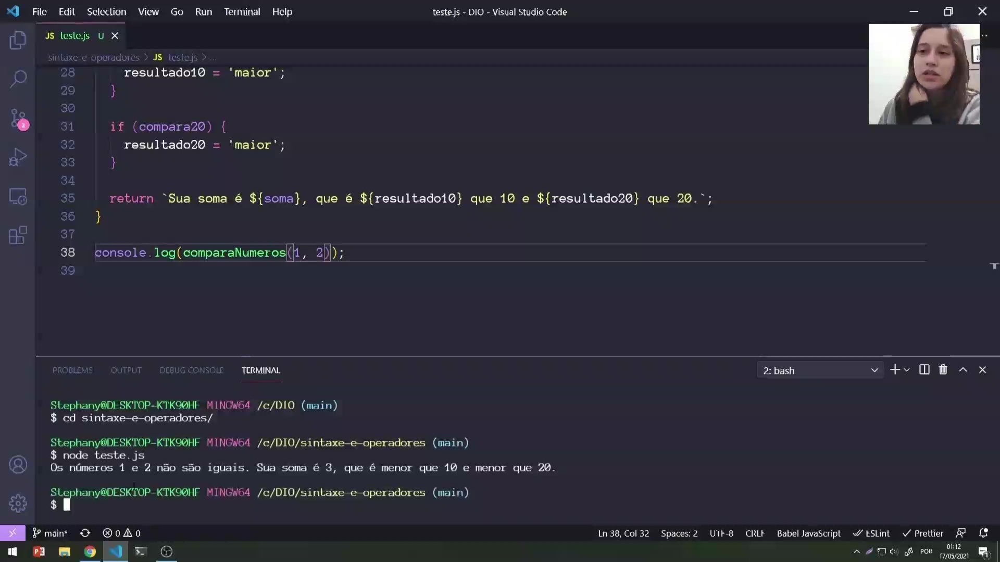
</p>

A execução do código é validada no terminal através do Node.js. Ao testar a função com os valores 1 e 2, o programa processa a lógica de que os números não são iguais e que sua soma (3) é menor que 10 e também menor que 20. A saída no terminal confirma que a formatação da string e as condicionais de valor estão funcionando conforme o esperado para este cenário. 

```bash
$ node teste.js
Os números 1 e 2 não são iguais. Sua soma é 3, que é menor que 10 e menor que 20.

```

<p align="center">
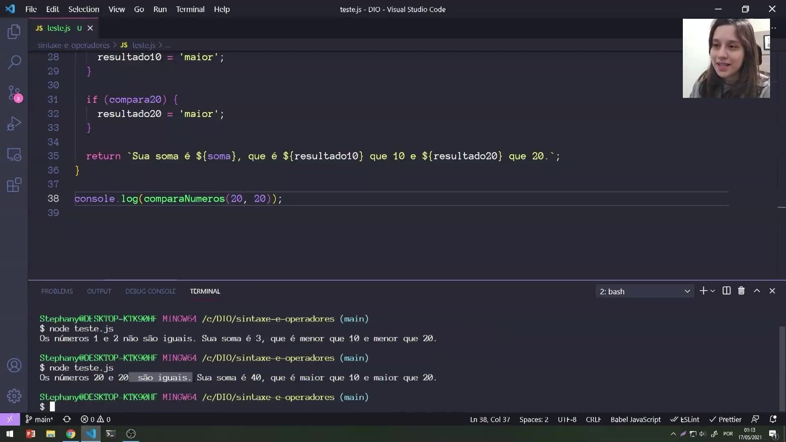
</p>

Um segundo teste é realizado no terminal, desta vez utilizando os valores 20 e 20. Este cenário demonstra a versatilidade do código: ele identifica corretamente que os números são iguais e que a soma (40) é agora maior que 10 e maior que 20. O terminal exibe a frase atualizada, validando que as variáveis de comparação de magnitude foram alteradas de seus valores iniciais "menor" para "maior". 

```bash
$ node teste.js
Os números 20 e 20 são iguais. Sua soma é 40, que é maior que 10 e maior que 20.

```

<p align="center">
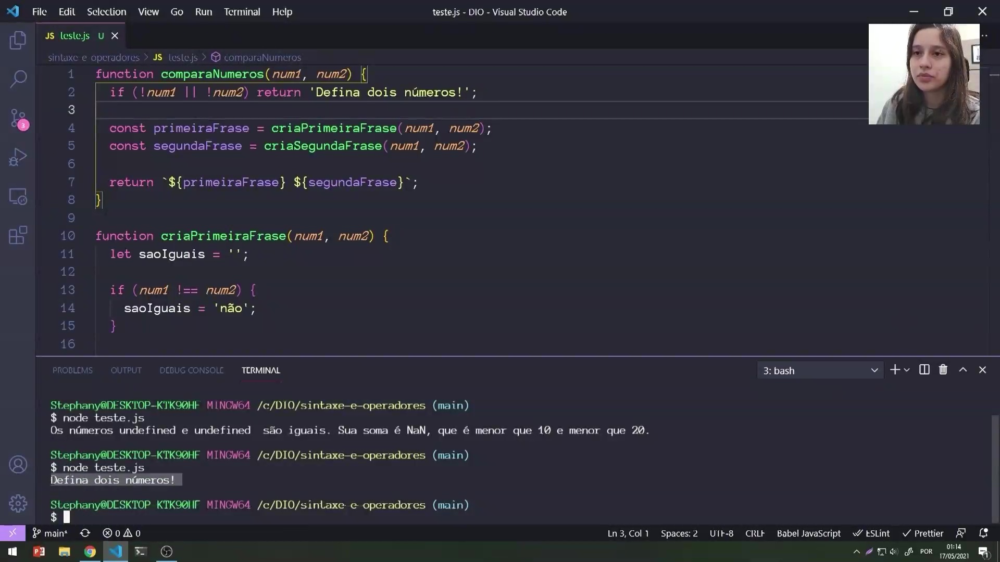
</p>

A etapa final do desenvolvimento foca na robustez do código através da validação de parâmetros. É inserida uma verificação no início da função `comparaNumeros` para garantir que ambos os argumentos foram enviados pelo usuário. Sem essa checagem, a função poderia retornar erros ou valores indefinidos (`undefined` ou `NaN`). O teste no terminal mostra que, ao tentar executar a função sem parâmetros, o sistema agora solicita corretamente a definição dos dois números. 

```javascript
function comparaNumeros(num1, num2) {
	if (!num1 || !num2) return 'Defina dois números!';

	const primeiraFrase = criaPrimeiraFrase(num1, num2);
	const segundaFrase = criaSegundaFrase(num1, num2);

	return `${primeiraFrase} ${segundaFrase}`;
}

```

#### ▶️ Código JavaScript (comparaNumeros.js)

```javascript
function comparaNumeros(num1, num2) {
	const primeiraFrase = criaPrimeiraFrase(num1, num2);
	const segundaFrase = criaSegundaFrase(num1, num2);

	return `${primeiraFrase} ${segundaFrase}`;
}

function criaPrimeiraFrase(num1, num2) {
	let primeiraFrase = `Os números ${num1} e ${num2}`;
	let simNao = 'não';

	if (num1 === num2) {
		simNao = '';
	}

	return `${primeiraFrase} ${simNao} são iguais.`;
}

function criaSegundaFrase(num1, num2) {
	const soma = num1 + num2;
	let comparaDez = 'menor';
	let comparaVinte = 'menor';

	if (soma > 10) {
		comparaDez = 'maior';
	}

	if (soma > 20) {
		comparaVinte = 'maior';
	}

	return `Sua soma é ${soma}, que é ${comparaDez} do que 10 e ${comparaVinte} do que 20.`;
}

console.log(comparaNumeros(10, 10));
```

# Certificado: Sintaxe e Operadores JavaScript

- Link na plataforma: https://hermes.dio.me/certificates/AJJTPTOO.pdf
- Certificado em pdf: [[Certificado-Sintaxe.e.Operadores.JavaScript.pdf]]
