## Instrutor

- Stephany Nusch (Software Engineer at Microsoft)
- Contato Linkedin: / [stephanynusch](https://www.linkedin.com/in/stephanynusch/)

# Parte 1 - Atribuindo valores

## 🟩 Vídeo 01 - Apresentação do curso

<video width="60%" controls>
<source src="000-Midia_e_Anexos/bootcamp_tqi_fullstack-modulo_03-Curso.05-Video_01.webm" type="video/webm">
  Seu navegador não suporta vídeo HTML5.
</video>

Link do vídeo:  https://web.dio.me/track/tqi-fullstack-developer/course/variaveis-e-tipos-com-javascript/learning/f0fb48d7-aaab-4f2d-a8bf-08b426f345e5?autoplay=1

Este conteúdo apresenta o **início de um treinamento de JavaScript** focado em **variáveis e tipos de dados**, ministrado pela engenheira de software Stephanie Nush. A instrutora detalha sua **trajetória profissional e acadêmica** antes de explicar que o curso está estruturado em **três etapas distintas**, abrangendo desde conceitos teóricos até uma **atividade prática final**. Os alunos aprenderão a **manipular estruturas de dados** e a utilizar métodos essenciais para o desenvolvimento na linguagem. Além disso, a fonte destaca a importância do **uso do GitHub** para versionamento de código e incentiva a **interação na comunidade digital** para troca de conhecimentos. O objetivo central é capacitar o estudante a compreender como **atribuir valores e organizar informações** na memória do computador.

## 🟩 Vídeo 02 - Variáveis

<video width="60%" controls>
<source src="000-Midia_e_Anexos/bootcamp_tqi_fullstack-modulo_03-Curso.05-Video_02.webm" type="video/webm">
  Seu navegador não suporta vídeo HTML5.
</video>

Link do vídeo: https://web.dio.me/track/tqi-fullstack-developer/course/variaveis-e-tipos-com-javascript/learning/d775ea49-52c4-4f00-9c25-2e9c4f9429a0?autoplay=1

Esta fonte consiste em uma **aula introdutória de JavaScript** focada na **atribuição de valores** e no uso de **variáveis e constantes**. O instrutor detalha as diferenças fundamentais entre **VAR**, **LET** e **CONST**, destacando como o **escopo de bloco** e o conceito de **hoisting** impactam a segurança e a organização do código. Além das regras técnicas, o material apresenta **boas práticas de nomenclatura**, como as convenções **camelCase** e **snake_case**, essenciais para o mercado de trabalho. Por meio de exemplos práticos no **VS Code**, a lição demonstra por que o uso de **LET** é preferível em relação ao **VAR** no desenvolvimento moderno. O objetivo central é familiarizar o estudante com a manipulação de **endereços de memória** e a sintaxe correta da linguagem.

### Anotações

Esta aula introduz os conceitos fundamentais de atribuição de valores em JavaScript, abordando o uso de variáveis e constantes. O objetivo principal é capacitar o entendimento sobre como armazenar dados em endereços de memória utilizando as palavras reservadas `var`, `let` e `const`.

<p align="center">

</p>

Nesta etapa inicial, definimos os objetivos da aula: compreender a definição de variáveis e constantes, além de explorar as diferenças práticas entre o uso de `var`, `const` e `let` no ecossistema JavaScript.

<p align="center">
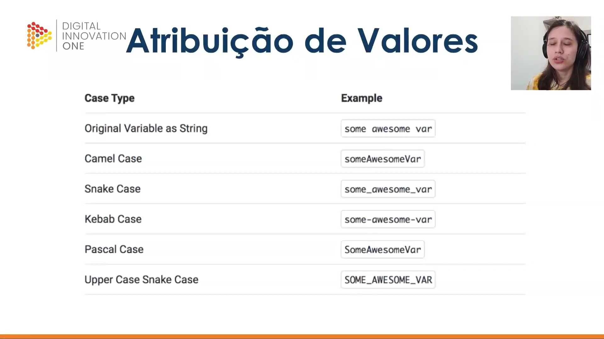
</p>

Existem diversas convenções de nomenclatura (cases) utilizadas na programação para a atribuição de valores. No JavaScript, a boa prática mais comum para nomear variáveis é o **camelCase**, onde a primeira letra da primeira palavra é minúscula e as subsequentes iniciam com maiúscula. Outras convenções incluem:

| Case Type | Example |
| --- | --- |
| Original Variable | `some awesome var` |
| **Camel Case** | `someAwesomeVar` |
| Snake Case | `some_awesome_var` |
| Kebab Case | `some-awesome-var` |
| Pascal Case | `SomeAwesomeVar` |
| Upper Case Snake Case | `SOME_AWESOME_VAR` |

<p align="center">

</p>

Iniciamos agora o estudo aprofundado sobre as diferenças entre `var` e `let`, focando em como essas palavras reservadas gerenciam o escopo e o ciclo de vida das variáveis no código.

<p align="center">
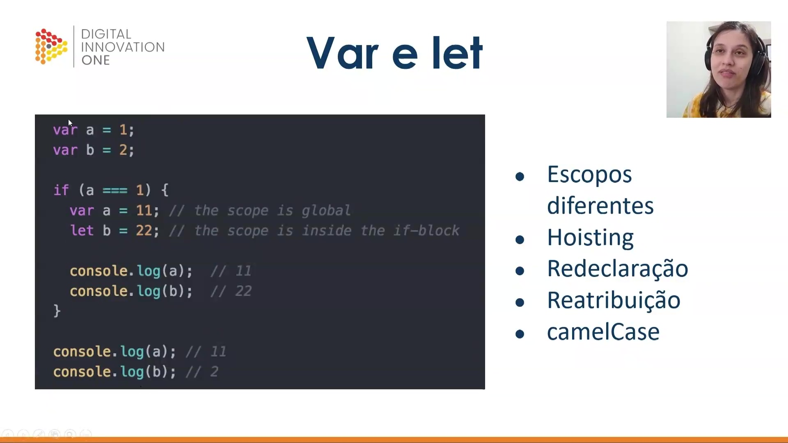
</p>

A principal diferença entre `var` e `let` reside no escopo. Enquanto `var` possui escopo global ou de função, o `let` respeita o escopo de bloco (como dentro de uma condicional `if`). No exemplo abaixo, vemos que a variável `a` (declarada com `var`) é alterada globalmente dentro do bloco, enquanto a variável `b` (declarada com `let`) mantém seu valor original fora do bloco onde foi redefinida.

```javascript
var a = 1;
var b = 2;

if (a === 1) {
  var a = 11; // escopo global
  let b = 22; // escopo de bloco (dentro do if)

  console.log(a); // 11
  console.log(b); // 22
}

console.log(a); // 11
console.log(b); // 2

```

<p align="center">
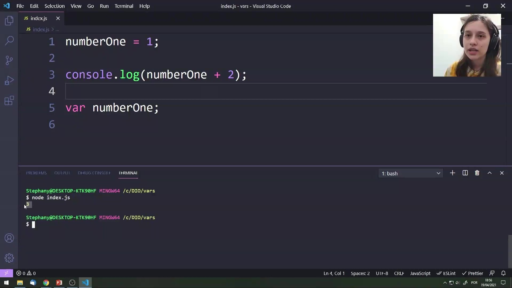
</p>

O conceito de **Hoisting** (elevação) permite que variáveis declaradas com `var` sejam utilizadas antes de sua linha de declaração formal no código. O JavaScript "eleva" a declaração para o topo, permitindo que o código abaixo funcione sem erros, embora a atribuição ocorra na ordem escrita.

```javascript
numberOne = 1;
console.log(numberOne + 2);

var numberOne;

```

<p align="center">

</p>

Diferente do `var`, o `let` não permite o uso da variável antes de sua inicialização. Tentar acessar uma variável declarada com `let` antes da linha onde ela é definida resultará em um erro de referência (`ReferenceError`), pois o hoisting não funciona da mesma forma para `let`.

```javascript
numberOne = 1;
console.log(numberOne + 2);

let numberOne;

```

<p align="center">

</p>

Para corrigir o erro anterior e utilizar o `let` corretamente, devemos primeiro declarar a variável e só então realizar a atribuição e o uso dos dados. Isso garante que o endereço de memória esteja pronto antes do acesso.

```javascript
let numberOne;

numberOne = 1;

console.log(numberOne + 2);

```

<p align="center">

</p>

Neste exemplo prático, testamos a redeclaração e o escopo. Temos variáveis globais `firstName` e `lastName`. Dentro do bloco `if`, tentamos alterar ambas. Como `firstName` usa `var`, a alteração impacta o escopo global. Já `lastName` usa `let`, criando uma nova instância apenas para o bloco interno.

```javascript
var firstName = "João";
var lastName = "Souza";

if (firstName === "João") {
  var firstName = "Pedro";
  let lastName = "Silva";
}

console.log(firstName, lastName);

```

<p align="center">
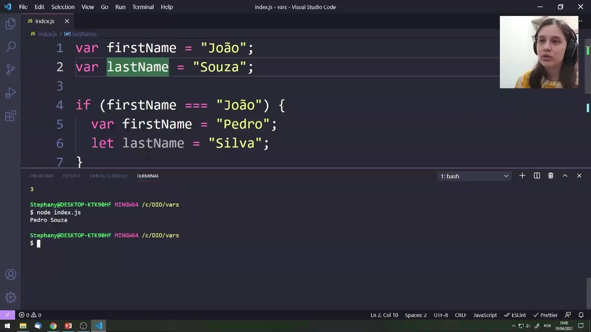
</p>

Ao executar o código anterior, o resultado no terminal será `Pedro Souza`. Isso prova que a variável `firstName` foi de fato alterada para "Pedro" globalmente devido ao uso de `var`. Por outro lado, o `lastName` impresso é o global ("Souza"), pois o "Silva" declarado com `let` existiu apenas dentro do bloco `if`.

```bash
node index.js
Pedro Souza

```

<p align="center">
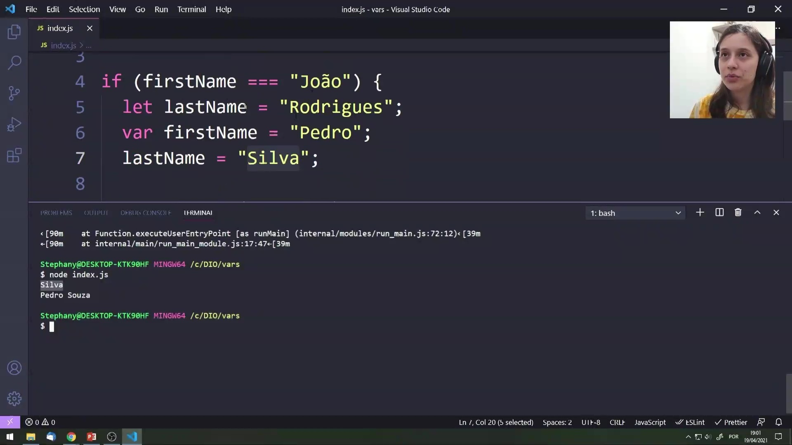
</p>

Para demonstrar a reatribuição dentro de um escopo de bloco, podemos declarar uma variável com `let` e mudar seu valor sem redeclará-la. No console, vemos o valor atualizado que foi atribuído por último dentro da lógica do bloco.

Código:
```javascript
if (firstName === "João") {
  let lastName = "Rodrigues";
  var firstName = "Pedro";
  lastName = "Silva"; // reatribuição
  
  console.log(lastname);
}

console.log(firstName, lastName);
```

Saída:
```bash
$ node index.js

Silva
Pedro Souza
```


## 🟩 Vídeo 03 - Constantes

<video width="60%" controls>
<source src="000-Midia_e_Anexos/bootcamp_tqi_fullstack-modulo_03-Curso.05-Video_03.webm" type="video/webm">
  Seu navegador não suporta vídeo HTML5.
</video>

Link do vídeo:  https://web.dio.me/track/tqi-fullstack-developer/course/variaveis-e-tipos-com-javascript/learning/4d4a2f42-858c-4033-9d1d-40360ef021bb?autoplay=1

O vídeo aborda as características fundamentais das **constantes** na linguagem de programação JavaScript, destacando que elas possuem **escopo de bloco** e não permitem o fenômeno de **hoisting**. A explicação enfatiza que, diferentemente de outros tipos de variáveis, uma constante exige **inicialização imediata** e seu valor permanece **imutável**, sendo impossível realizar a reatribuição ou redeclaração durante a execução do código. O material também detalha a convenção de nomenclatura **Snake Upper Case**, onde utiliza-se letras maiúsculas separadas por sublinhados para identificar esses elementos. Por meio de exemplos práticos, demonstra-se que tentar acessar uma constante antes de sua definição resulta em erro, pois o sistema não eleva a declaração automaticamente. Assim, o conteúdo serve como um guia técnico sobre a **estabilidade e integridade de dados** no desenvolvimento de software.

### Anotações

<p align="center">

</p>

Nesta etapa da aula, iniciamos o estudo sobre as **constantes**. Elas representam um tipo fundamental de declaração de variáveis no JavaScript, inseridas dentro do contexto de **Variáveis e Tipos**, e possuem comportamentos específicos que as diferenciam das declarações feitas com `var` ou `let`.

<p align="center">
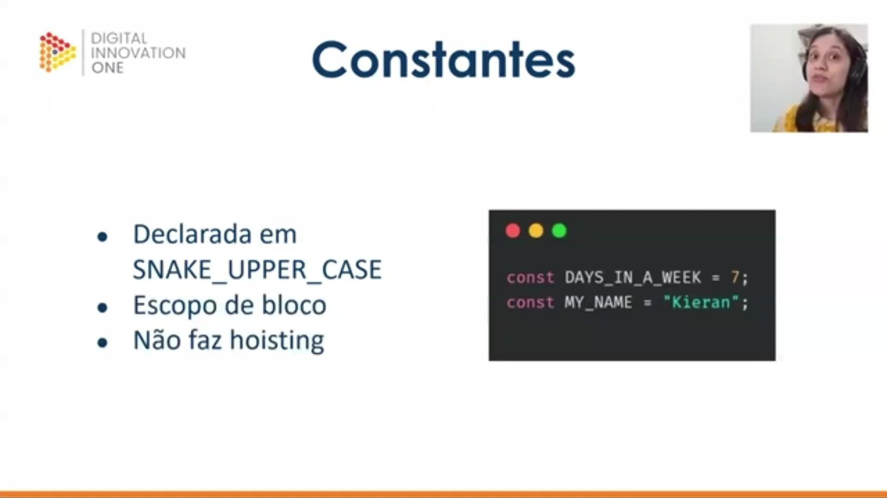
</p>

As constantes no JavaScript possuem três características principais que definem seu funcionamento:

* **SNAKE_UPPER_CASE**: Por convenção, as constantes devem ser declaradas com todas as letras maiúsculas e as palavras separadas por sublinhados (underlines).
* **Escopo de bloco**: Assim como o `let`, o acesso à constante é restrito ao bloco onde ela foi criada.
* **Não faz hoisting**: A declaração não é "elevada" ao topo do código; ela precisa ser declarada antes de ser utilizada.

```javascript
const DAYS_IN_A_WEEK = 7;
const MY_NAME = "Kieran";

```

<p align="center">
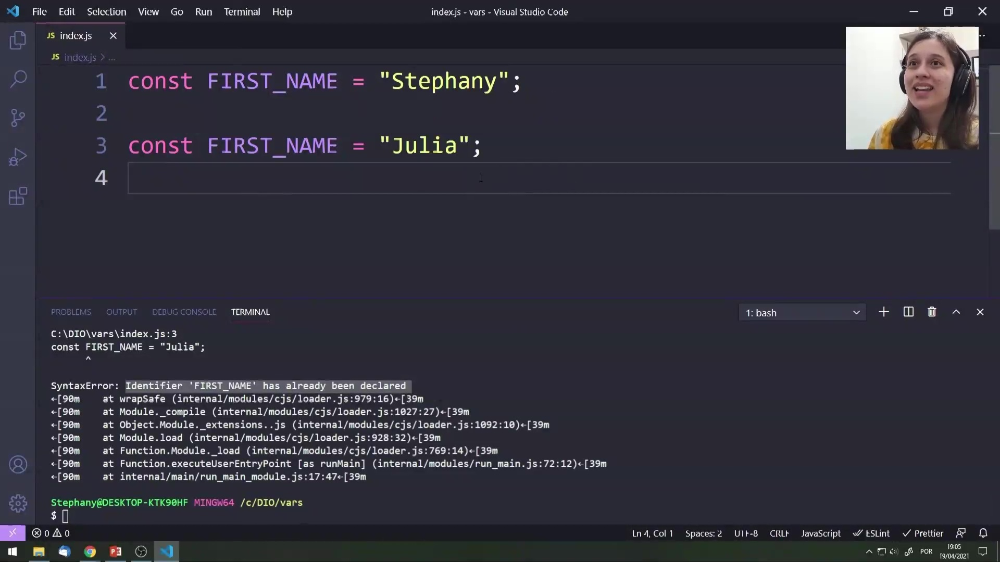
</p>

Uma característica fundamental das constantes é a sua imutabilidade em relação à redeclaração. Uma vez que um identificador foi definido como uma constante, ele não pode ser declarado novamente dentro do mesmo escopo. Tentar fazer isso resultará em um erro de sintaxe, interrompendo a execução do código.

```javascript
const FIRST_NAME = "Stephany";

const FIRST_NAME = "Julia";
// SyntaxError: Identifier 'FIRST_NAME' has already been declared

```

<p align="center">
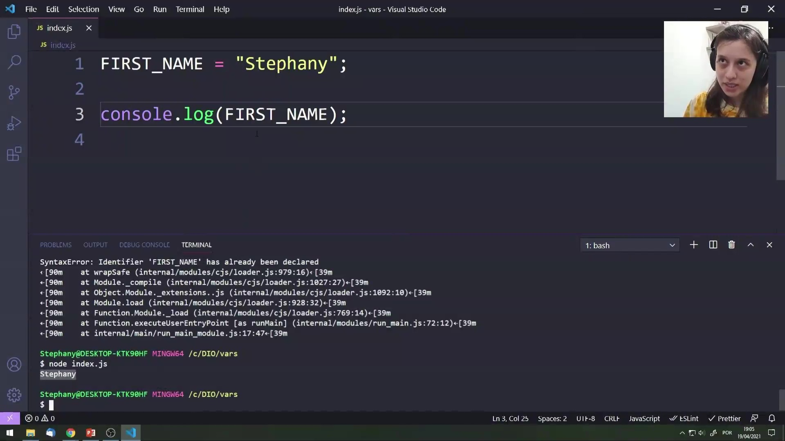
</p>

Diferente das variáveis globais ou declaradas com `var`, as constantes não permitem o uso antes da sua definição formal. Tentar atribuir um valor a um nome que será posteriormente definido como `const` ou tentar acessá-lo sem a devida inicialização gera falhas, pois o JavaScript não realiza o hoisting (subida da declaração) para este tipo de dado.

```javascript
FIRST_NAME = "Stephany";
console.log(FIRST_NAME);

```

<p align="center">
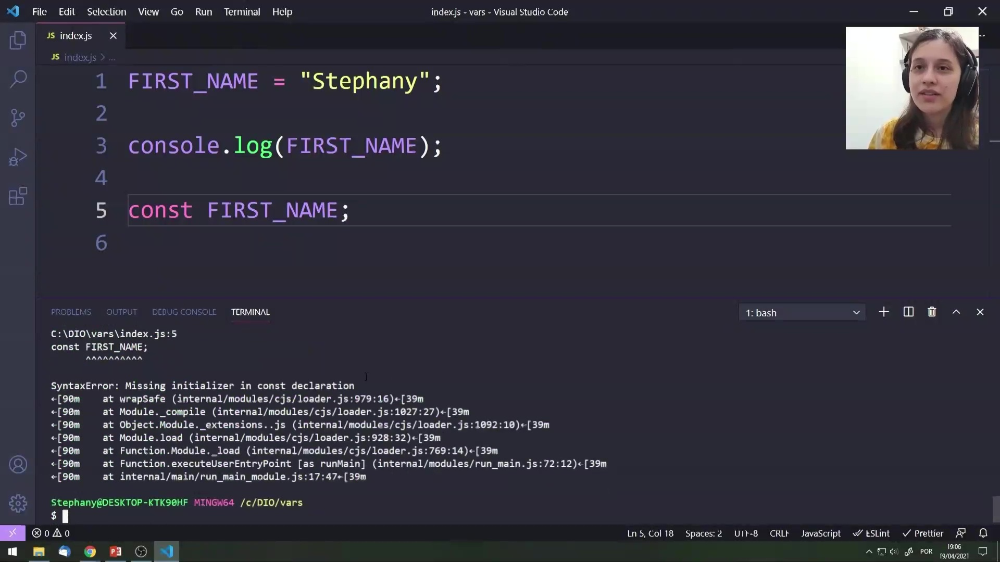
</p>

Diferente de variáveis que podem ser apenas declaradas para receber um valor posteriormente, a **constante exige uma inicialização obrigatória**. Você deve obrigatoriamente atribuir um valor no momento exato da declaração. Como o valor de uma constante não pode ser reatribuído ao longo do ciclo de vida do código, o JavaScript exige que ela já nasça com seu valor definido.

```javascript
const FIRST_NAME;
// SyntaxError: Missing initializer in const declaration

```

#### Comparativo de Variáveis e Constantes

| Característica | `var` | `let` | `const` (Constantes) |
| --- | --- | --- | --- |
| **Escopo** | *Não detalhado no trecho* | *Não detalhado no trecho* | Escopo de bloco |
| **Hoisting** | Sim (age como global) | Não faz hoisting | Não faz hoisting |
| **Reatribuição** | *Não detalhado no trecho* | *Não detalhado no trecho* | Não permitida |
| **Redeclaração** | *Não detalhado no trecho* | *Não detalhado no trecho* | Não permitida |
| **Inicialização** | Opcional | Opcional | Obrigatória na declaração |
| **Convenção de Nome** | *Não detalhado no trecho* | *Não detalhado no trecho* | SNAKE_UPPER_CASE |

---

### Pontos de Atenção para Constantes:

* **Imutabilidade**: O valor definido no momento da inicialização permanecerá o mesmo durante todo o ciclo de vida do código.
* **Erro de Referência**: Tentar usar uma constante antes de declará-la resultará em erro, pois o JavaScript não "sobe" a declaração para você.
* **Sintaxe**: A falta de um valor inicial em uma declaração `const` gera um `SyntaxError` imediato.

# Parte 2 - Tipos

## 🟩 Vídeo 04 - Estrutura de dados

<video width="60%" controls>
<source src="000-Midia_e_Anexos/bootcamp_tqi_fullstack-modulo_03-Curso.05-Video_04.webm" type="video/webm">
  Seu navegador não suporta vídeo HTML5.
</video>

Link do vídeo: https://web.dio.me/track/tqi-fullstack-developer/course/variaveis-e-tipos-com-javascript/learning/4145f810-f3f5-4519-9593-36eddebe75f4?autoplay=1

O instrutor explica que a linguagem possui **tipagem dinâmica e fraca**, o que permite alterar o tipo de uma variável durante a execução do código sem restrições rígidas. Através de exemplos práticos no console, demonstra-se o uso do operador **typeof** para identificar se um dado é, por exemplo, um número ou uma string. O conteúdo também diferencia os **tipos primitivos**, como números e booleanos, dos **tipos não primitivos**, como objetos e arrays. Por fim, destaca-se como o JavaScript lida internamente com a conversão de valores para permitir o uso de **métodos e operações** específicas em cada estrutura.

### Anotações

#### Aula 2: Tipos

<p align="center">

</p>

Nesta segunda aula, o foco é o estudo dos **tipos de dados** em JavaScript. Após a introdução sobre variáveis e constantes e como atribuir valores a elas, exploraremos as características e categorias dos valores que essas variáveis podem armazenar.

#### Objetivos

<p align="center">

</p>

O objetivo principal deste encontro é apresentar as **principais estruturas de dados** presentes no ecossistema JavaScript. Além de identificar cada tipo, aprenderemos sobre os métodos fundamentais que podem ser executados em cada uma dessas estruturas para manipular as informações.

#### Estruturas de Dados e Tipagem

<p align="center">

</p>

Diferente de linguagens como Java, que é fortemente tipada, o JavaScript é uma linguagem de **tipagem dinâmica e fraca**. Isso significa que a linguagem lida com os tipos de dados de forma flexível, permitindo maior agilidade no desenvolvimento, embora exija atenção do desenvolvedor para evitar comportamentos inesperados.

#### Dinâmica da Tipagem

<p align="center">

</p>

A característica de **tipagem dinâmica** no JavaScript significa que não é necessário especificar o tipo de dado (como inteiro, decimal ou lista) no momento em que uma variável é declarada. O interpretador da linguagem identifica o tipo automaticamente com base no valor atribuído, e esse tipo pode ser modificado conforme o programa é executado.

#### Demonstração Prática: Operador typeof

<p align="center">
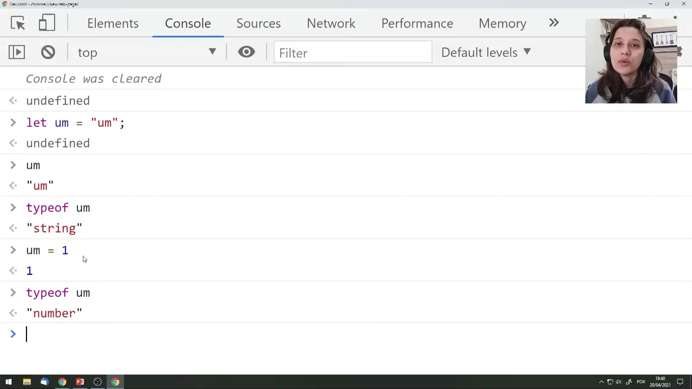
</p>

Podemos observar a tipagem dinâmica em ação utilizando o console. Ao declarar uma variável e atribuir a ela um texto (string), o JavaScript a identifica como tal. Se reatribuirmos um número a essa mesma variável, o seu tipo muda automaticamente. O operador `typeof` é a ferramenta utilizada para verificar o tipo atual de qualquer dado.

```javascript
let um = "um";
console.log(typeof um); 
// Saída: "string"

um = 1;
console.log(typeof um); 
// Saída: "number"

```

#### Categorias de Dados em JavaScript

<p align="center">
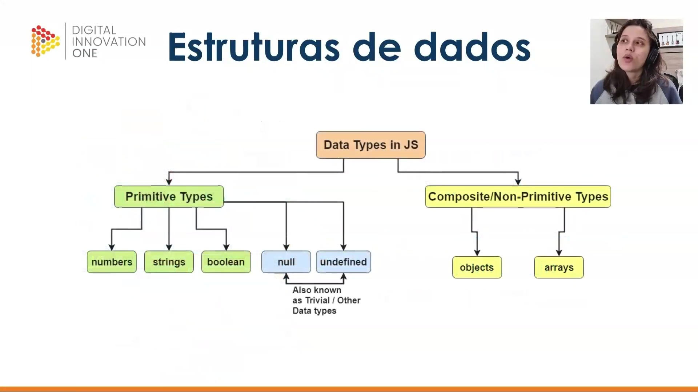
</p>

Os tipos de dados no JavaScript são organizados em dois grandes grupos principais:

* **Tipos Primitivos:** Incluem `numbers`, `strings`, `boolean` (true/false), `null` e `undefined`. Uma característica importante é que tipos primitivos não possuem métodos internos próprios (embora o JavaScript possa convertê-los temporariamente em objetos para permitir operações).
* **Tipos Compostos (Não Primitivos):** Englobam estruturas mais complexas como `objects` (objetos) e `arrays` (listas).

Esta distinção é fundamental para entender como a linguagem gerencia a memória e como os dados interagem entre si.

## 🟩 Vídeo 05 - Strings

<video width="60%" controls>
<source src="000-Midia_e_Anexos/bootcamp_tqi_fullstack-modulo_03-Curso.05-Video_05.webm" type="video/webm">
  Seu navegador não suporta vídeo HTML5.
</video>

Link do vídeo: https://web.dio.me/track/tqi-fullstack-developer/course/variaveis-e-tipos-com-javascript/learning/b4937ea1-bb50-4e07-822d-e6810f5e65c9?autoplay=1

O vídeo apresenta uma introdução detalhada sobre **strings**, definindo-as como a estrutura de dados utilizada para manipular **textos e caracteres** em JavaScript. O autor explica que esses valores podem ser declarados com aspas ou crases, destacando a **interpolação de variáveis** e a facilidade de criar quebras de linha com as **template strings**. É discutida a diferença técnica entre o **tipo primitivo** e o **objeto string**, ressaltando que, embora o primeiro seja mais performático, o JavaScript permite acessar métodos de objeto em ambos. Diversas funcionalidades práticas são demonstradas, como a **concatenação**, o uso da propriedade **length** para medir o tamanho e o acesso a caracteres individuais através de **índices**. Por fim, a fonte enumera métodos essenciais para o tratamento de dados, incluindo o **split** para segmentação, o **replace** para substituições e o **includes** para buscas internas.

### Anotações

<p align="center">

</p>

As **strings** são a primeira estrutura de dados apresentada, fundamentais para lidar com textos e frases. Elas permitem trabalhar diretamente com caracteres individuais. No desenvolvimento, as strings são categorizadas dentro do estudo de **Variáveis e Tipos**.

<p align="center">
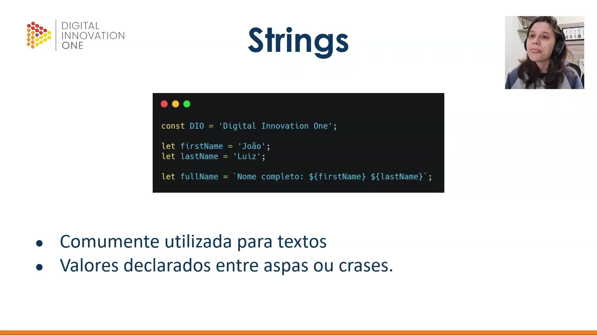
</p>

A declaração de strings no JavaScript pode ser feita utilizando **aspas simples, duplas ou crases**. O uso de crases introduz as **template strings**, que facilitam a **interpolação** de variáveis e a quebra de linhas sem comandos complexos.

```javascript
[cite_start]const DIO = 'Digital Innovation One'; [cite: 13]
[cite_start]let firstName = 'João'; [cite: 14]
[cite_start]let lastName = 'Luiz'; [cite: 15]
[cite_start]let fullName = `Nome completo: ${firstName} ${lastName}`; [cite: 16]

```

Diferente dos tipos primitivos, quando uma string é declarada como um **objeto** (ex: `new String("valor")`), ela ganha acesso a diversas propriedades no seu protótipo, embora o JavaScript converta automaticamente tipos primitivos em objetos temporários para realizar operações.

<p align="center">

</p>

As strings possuem métodos e propriedades fundamentais para a manipulação de dados textuais:

* **Concatenação**: União de duas ou mais strings usando o método `.concat()` ou o operador `+`.
* **Propriedade length**: Retorna o tamanho total da string.
* **Iterabilidade**: Permite acessar caracteres por meio de índices, começando sempre do zero.
* **Formatação e Busca**: Métodos como `.replace()` para trocar termos, e `.includes()`, `.startsWith()` ou `.endsWith()` para verificação de conteúdo.
* **Index de letras**: Localização de posições específicas dentro do texto.

## 🟩 Vídeo 06 - Numbers

<video width="60%" controls>
<source src="000-Midia_e_Anexos/bootcamp_tqi_fullstack-modulo_03-Curso.05-Video_06.webm" type="video/webm">
  Seu navegador não suporta vídeo HTML5.
</video>

Link do vídeo: https://web.dio.me/track/tqi-fullstack-developer/course/variaveis-e-tipos-com-javascript/learning/d98efdcf-9d22-421e-bc83-6c26b8940014?autoplay=1

O vídeo apresenta os fundamentos da manipulação de **números no JavaScript**, destacando que valores numéricos são declarados **sem aspas** para permitir operações matemáticas. O autor explica o uso de **operadores aritméticos básicos** e a importância do **operador de módulo** para encontrar o resto de divisões, técnica essencial para identificar números pares ou ímpares. Além disso, a fonte introduz o **objeto Math**, demonstrando funções práticas para **arredondar valores** e acessar constantes matemáticas. É esclarecido que a exibição de **porcentagens** exige a **concatenação** de números com strings, pois o símbolo de porcentagem isolado possui função lógica no código. Por fim, o conteúdo enfatiza a **conversão entre tipos de dados** e a natureza imutável das variáveis durante operações simples, a menos que haja uma nova atribuição.

### Anotações

<p align="center">

</p>

Esta etapa da aula introduz o conceito de **Numbers** (números) dentro do estudo de variáveis e tipos. Os números são apresentados como tipos de dados fundamentais e básicos na programação, servindo como ponto de partida para a compreensão de como o computador processa informações quantitativas.

<p align="center">
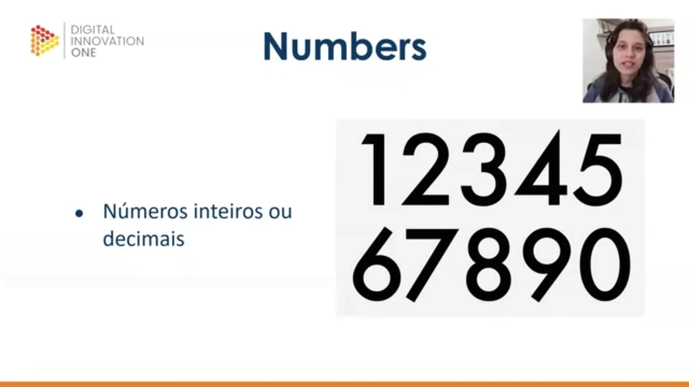
</p>

No desenvolvimento, os números podem ser classificados em dois grupos principais: **inteiros** ou **decimais**. Diferente das strings, os valores numéricos devem ser declarados de forma direta, sem o uso de aspas, para que o sistema reconheça sua natureza matemática e permita a realização de operações aritméticas.

<p align="center">
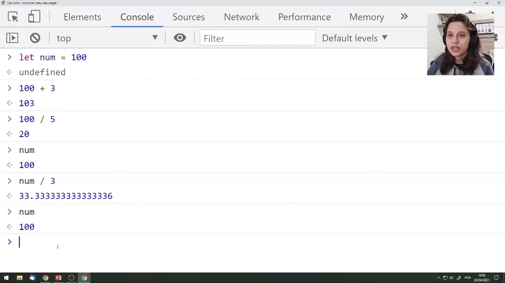
</p>

Através do console, é possível observar a aplicação prática da aritmética básica. Ao realizar operações como soma (`+`) ou divisão (`/`) com uma variável, o sistema retorna um novo valor resultante, mas mantém o valor original da variável intacto, a menos que uma nova atribuição seja realizada.

```javascript
let num = 100
// undefined
100 + 3
// 103
100 / 5
// 20
num
// 100
num / 3
// 33.333333333333336
num
// 100

```

<p align="center">
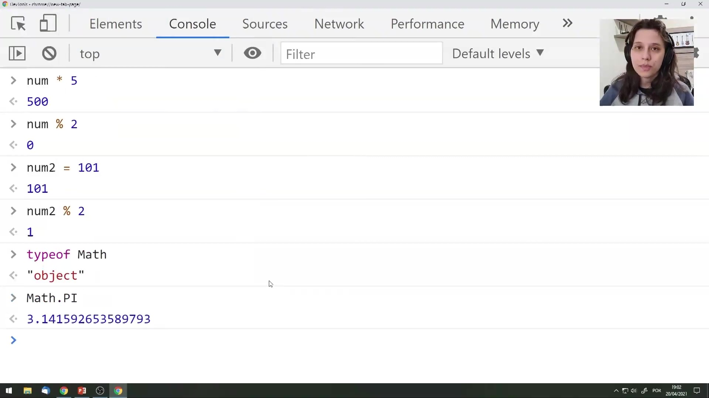
</p>

Além das quatro operações fundamentais, utiliza-se o operador de **módulo** (`%`), que extrai o resto de uma divisão, sendo útil para identificar se um número é par ou ímpar. O JavaScript também disponibiliza o objeto **Math**, que fornece propriedades matemáticas constantes, como o valor de **PI**.

```javascript
num * 5
// 500
num % 2
// 0
let num2 = 101
// 101
num2 % 2
// 1
typeof Math
// "object"
Math.PI
// 3.141592653589793

```

<p align="center">
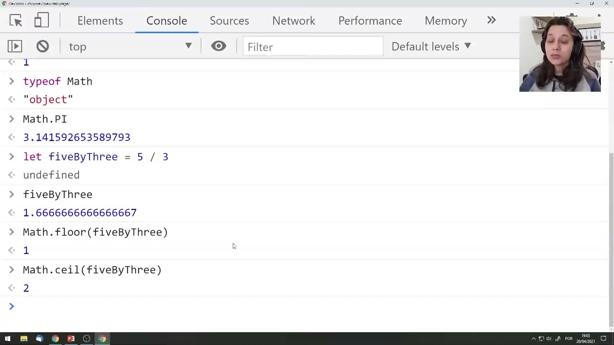
</p>

Para o controle de precisão em números decimais, o objeto `Math` oferece métodos de arredondamento específicos: o **Math.floor**, que arredonda o valor para baixo (piso), e o **Math.ceil**, que arredonda para cima (teto/topo). Esses métodos permitem transformar resultados de divisões complexas em números inteiros conforme a necessidade da lógica programacional.

```javascript
typeof Math
// "object"
Math.PI
// 3.141592653589793
let fiveByThree = 5 / 3
// undefined
fiveByThree
// 1.6666666666666667
Math.floor(fiveByThree)
// 1
Math.ceil(fiveByThree)
// 2

```

## 🟩 Vídeo 07 - Booleans

<video width="60%" controls>
<source src="000-Midia_e_Anexos/bootcamp_tqi_fullstack-modulo_03-Curso.05-Video_07.webm" type="video/webm">
  Seu navegador não suporta vídeo HTML5.
</video>

Link do vídeo: https://web.dio.me/track/tqi-fullstack-developer/course/variaveis-e-tipos-com-javascript/learning/f808462a-8c0f-41be-acfb-2b128d830b70?autoplay=1


## 🟩 Vídeo 08 - Arrays

<video width="60%" controls>
<source src="000-Midia_e_Anexos/bootcamp_tqi_fullstack-modulo_03-Curso.05-Video_08.webm" type="video/webm">
  Seu navegador não suporta vídeo HTML5.
</video>

Link do vídeo: 


## 🟩 Vídeo 09 - Objetos

<video width="60%" controls>
<source src="000-Midia_e_Anexos/bootcamp_tqi_fullstack-modulo_03-Curso.05-Video_09.webm" type="video/webm">
  Seu navegador não suporta vídeo HTML5.
</video>

Link do vídeo: 


## 🟩 Vídeo 10 - Empty, undefined e null

<video width="60%" controls>
<source src="000-Midia_e_Anexos/bootcamp_tqi_fullstack-modulo_03-Curso.05-Video_10.webm" type="video/webm">
  Seu navegador não suporta vídeo HTML5.
</video>

Link do vídeo: 


# Certificado: 

- Link na plataforma: 
- Certificado em pdf: 
