## Instrutor

- Stephany Nusch (Software Engineer at Microsoft)
- Contato Linkedin: / [stephanynusch](https://www.linkedin.com/in/stephanynusch/)

# Parte 1 - Tipos de função

## 🟩 Vídeo 01 - Apresentação do curso

<video width="60%" controls>
	<source src="000-Midia_e_Anexos/bootcamp_tqi_fullstack-modulo_03-Curso.06-Video_01.webm" type="video/webm">
	  Seu navegador não suporta vídeo HTML5.
</video>

Link do vídeo:  https://web.dio.me/track/tqi-fullstack-developer/course/dominando-funcoes-em-javascript/learning/183f95d6-d7cc-4ccb-84d7-f2ecc6f3aa01?autoplay=1

Esta fonte consiste na **introdução** para o curso de programação focado em **JavaScript**, ministrado pela engenheira de software Stephanie Nush. A instrutora apresenta sua **trajetória profissional** e acadêmica, destacando a importância de dominar funções e sintaxes básicas para desenvolvedores iniciantes. O conteúdo programático é detalhado em **seis módulos distintos**, abrangendo desde tipos de funções e parâmetros até conceitos avançados como o uso da palavra-chave *this*. Além das lições teóricas, a orientadora incentiva o uso do **GitHub** para a realização de exercícios práticos contidos em um repositório específico. O material busca fornecer uma **base sólida e completa** para que os alunos consigam manipular dados e lógica de programação com fluidez.

### Anotações

<p align="center">

</p>

Nesta introdução ao curso de JavaScript do Bootcamp, a instrutora Stephany Nusch, Engenheira de Software no QuintoAndar, apresenta o tema central da unidade: **Funções**. Este módulo é fundamental para quem está iniciando na linguagem e deseja compreender como organizar e reutilizar blocos de código de maneira eficiente.

<p align="center">
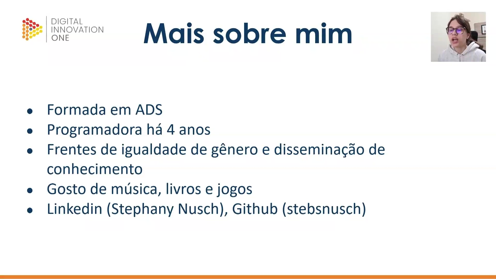
</p>

A instrutora compartilha sua trajetória profissional e acadêmica, destacando os seguintes pontos:

* **Formação**: Graduada em Análise e Desenvolvimento de Sistemas (ADS).
* **Experiência**: Atua como programadora há 4 anos.
* **Causas**: Envolvimento em frentes de igualdade de gênero e na disseminação de conhecimento técnico.
* **Interesses Pessoais**: Aprecia música, livros e jogos.
* **Contatos**: Disponível no LinkedIn (Stephany Nusch) e no GitHub (stebsnusch), onde o material prático do curso está hospedado.

<p align="center">
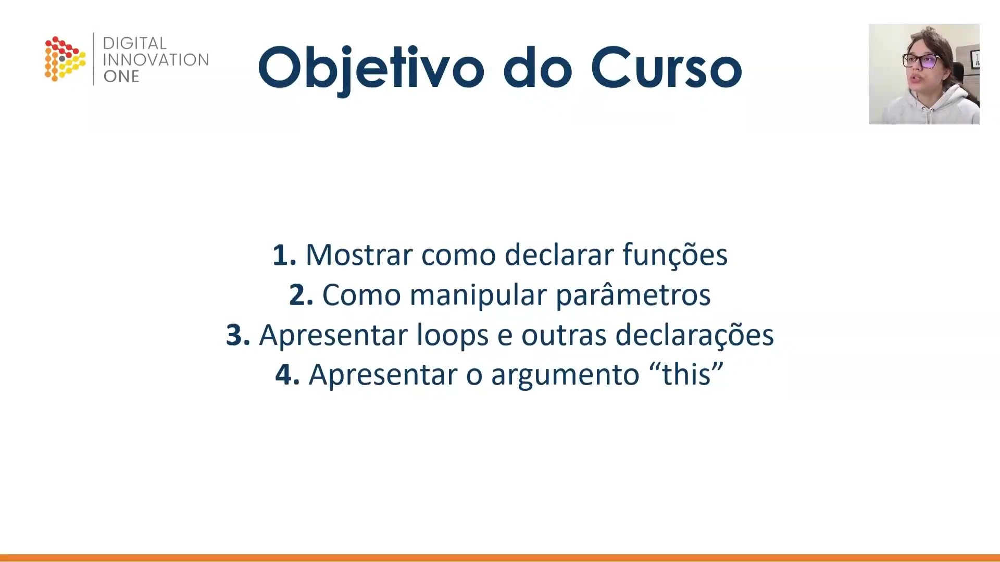
</p>

Os objetivos principais deste curso foram estabelecidos para garantir uma base sólida em JavaScript, focando em:

1. **Declaração de funções**: Aprender as diferentes formas de criar funções.
2. **Manipulação de parâmetros**: Entender como passar e receber dados.
3. **Loops e declarações**: Explorar estruturas de repetição e outras instruções lógicas.
4. **Argumento "this"**: Compreender o comportamento e o contexto desta palavra-chave.

<p align="center">
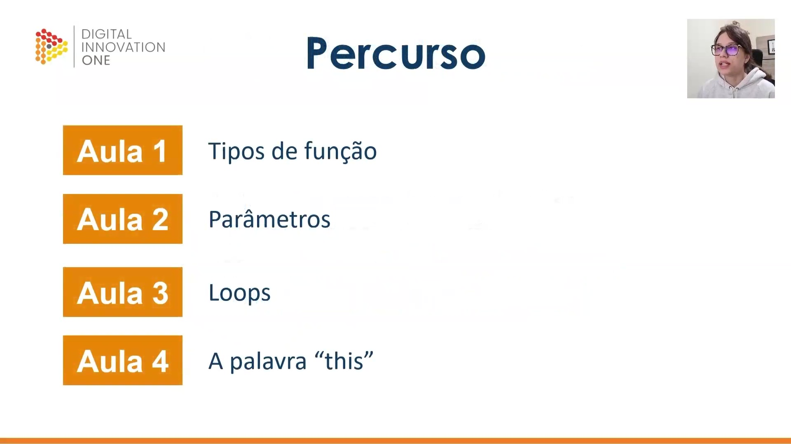
</p>

O percurso de aprendizado está estruturado de forma progressiva para facilitar a retenção do conteúdo. As primeiras etapas incluem:

* **Aula 1**: Estudo sobre os diversos tipos de função.
* **Aula 2**: Foco em parâmetros e como lidar com a entrada de dados.
* **Aula 3**: Implementação de loops.
* **Aula 4**: Uso e manipulação da palavra-chave "this".

<p align="center">
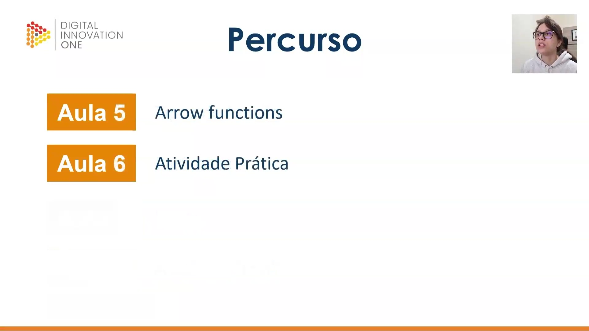
</p>

Finalizando o cronograma do curso, as aulas de encerramento abordam tópicos modernos e aplicação prática:

* **Aula 5**: Introdução às *Arrow Functions* e sua sintaxe simplificada.
* **Aula 6**: Atividade prática para consolidar o conhecimento, com desafios disponíveis no repositório do GitHub.

## 🟩 Vídeo 02 - Estrutura e Função anônima


<video width="60%" controls>
	<source src="000-Midia_e_Anexos/bootcamp_tqi_fullstack-modulo_03-Curso.06-Video_02.webm" type="video/webm">
	  Seu navegador não suporta vídeo HTML5.
</video>

Link do vídeo: https://web.dio.me/track/tqi-fullstack-developer/course/dominando-funcoes-em-javascript/learning/3a696f71-bd28-494e-a27e-1b1ba73627c8?autoplay=1

Esta lição introduz os conceitos fundamentais sobre a estrutura de **funções no JavaScript**, detalhando como elas são declaradas e organizadas. O conteúdo explica que uma função utiliza **parâmetros e instruções** específicas, destacando que variáveis criadas internamente ficam restritas ao **escopo local**. Além disso, o texto aborda o papel da cláusula **return**, que interrompe a execução para fornecer um valor resultante que pode ser reaproveitado pelo sistema. Por fim, o material apresenta as **funções anônimas**, demonstrando como é possível atribuir blocos de código sem nome diretamente a variáveis. Essas explicações visam capacitar o aluno a manipular operações lógicas de forma modular e eficiente.

### Anotações

#### Introdução aos Tipos de Função

<p align="center">

</p>

Nesta etapa inicial, abordamos o tema fundamental de **Tipos de função**. O foco está em compreender como as funções são categorizadas e utilizadas dentro da lógica de programação, estabelecendo a base para o desenvolvimento de rotinas estruturadas.

#### Objetivos da Aula

<p align="center">
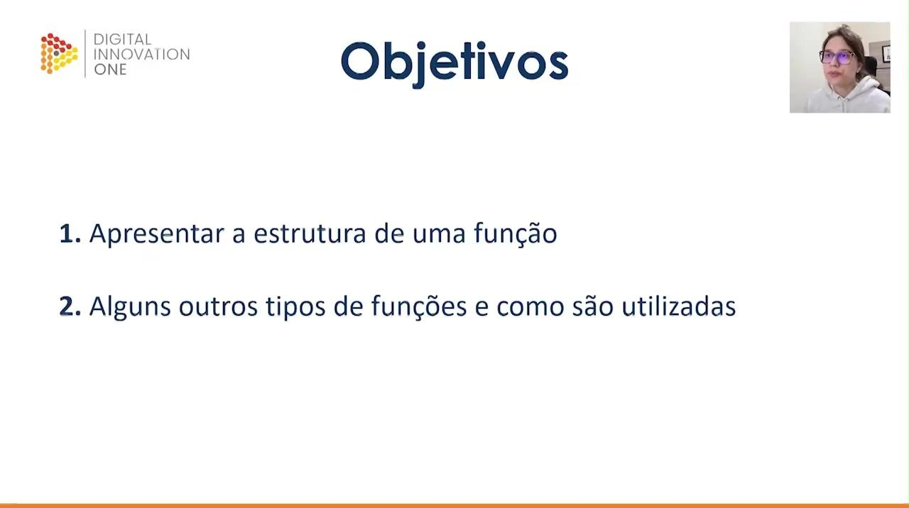
</p>

Os principais objetivos desta sessão são:

1. **Apresentar a estrutura de uma função**: Compreender os componentes essenciais que compõem uma declaração funcional.
2. **Explorar outros tipos de funções**: Analisar variações além do modelo padrão e entender em quais cenários práticos elas são aplicadas.

#### Estrutura de Funções

<p align="center">
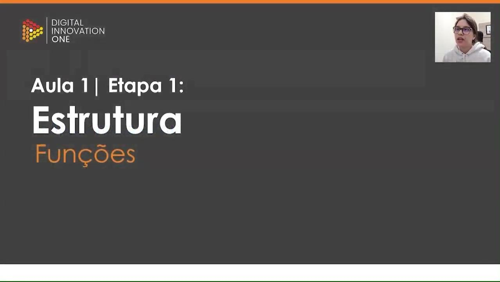
</p>

Iniciamos o estudo da **Estrutura** das funções. Este tópico detalha como organizar o código de maneira que o JavaScript reconheça o bloco de instruções como uma unidade funcional reutilizável.

#### Definição Comum e Escopo

<p align="center">

</p>

A definição padrão de uma função utiliza a palavra reservada `function`. A sintaxe básica segue este modelo:

```javascript
function nome(parametros) {
 // instruções
}

```

É fundamental observar que **variáveis criadas dentro de uma função possuem escopo local**, ou seja, elas apenas podem ser utilizadas dentro do bloco da própria função, não sendo acessíveis externamente.

#### O Uso do Return

<p align="center">
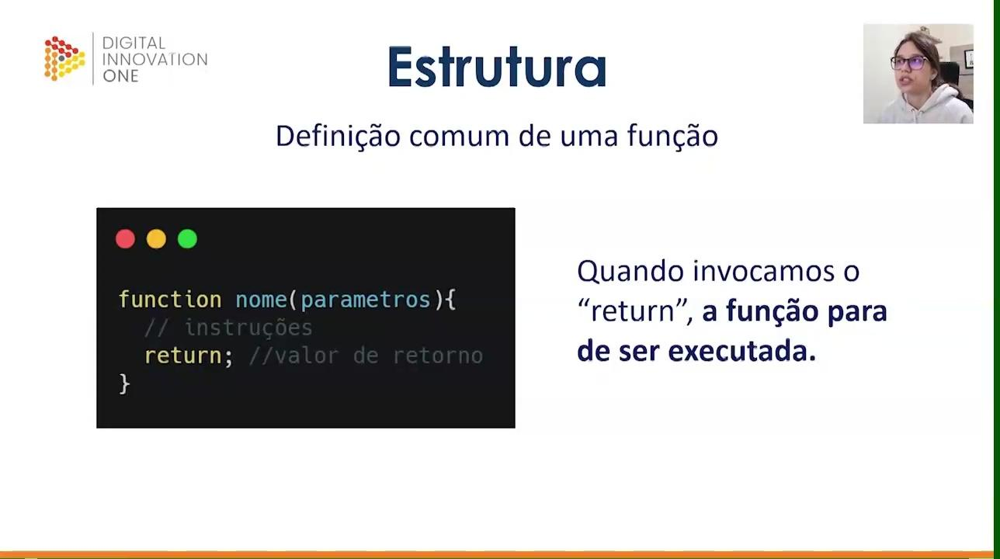
</p>

O comando `return` é utilizado para definir o valor de saída de uma função.

```javascript
function nome(parametros){
 // instruções
 return; //valor de retorno
}

```

**Quando invocamos o "return", a função para de ser executada imediatamente**. Ele permite que o resultado de uma operação interna seja enviado para fora da função, possibilitando que esse valor seja aproveitado em outras partes do programa.

#### Funções Anônimas

<p align="center">

</p>

Avançando para a segunda etapa, exploramos a **Função anônima**. Este tipo de função diferencia-se da definição comum por não possuir um identificador (nome) próprio ligado diretamente à sua declaração, sendo frequentemente associada a expressões.

#### Funções como Expressões

<p align="center">
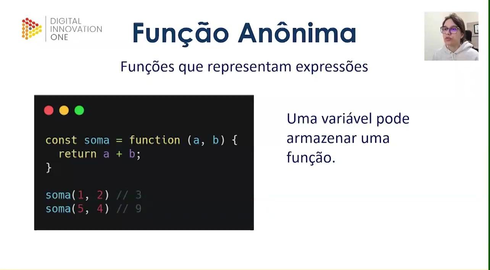
</p>

Uma característica poderosa do JavaScript é que **uma variável pode armazenar uma função**. No exemplo abaixo, a constante `soma` recebe uma função sem nome (anônima) que processa dois parâmetros:

```javascript
const soma = function (a, b) {
 return a + b;
}

soma(1, 2)
// 3
soma(5, 4)
// 9

```

Neste caso, a função é invocada através do nome da variável à qual ela foi atribuída, demonstrando como tratar funções como valores dentro do código.

## 🟩 Vídeo 03 - Função autoinvocável e Callbacks

<video width="60%" controls>
	<source src="000-Midia_e_Anexos/bootcamp_tqi_fullstack-modulo_03-Curso.06-Video_03.webm" type="video/webm">
	  Seu navegador não suporta vídeo HTML5.
</video>

Link do vídeo: https://web.dio.me/track/tqi-fullstack-developer/course/dominando-funcoes-em-javascript/learning/80cd7e6d-5885-4095-afed-fb296b91a376?autoplay=1

O conteúdo explica o funcionamento das **Expressões de Função Invocadas Imediatamente (IIFE)**, destacando que essas estruturas são executadas de forma automática assim que definidas. O autor detalha que essas funções podem ser **anônimas ou nomeadas**, permitindo também o uso de **parâmetros externos** ou o armazenamento de seus resultados em constantes. Além disso, o texto introduz o conceito de **callbacks**, definindo-os como funções que são enviadas como **argumentos** para outros blocos de código. Essa técnica oferece ao desenvolvedor um maior **controle sobre a ordem de execução**, permitindo que uma lógica específica seja acionada apenas quando necessário. Por fim, o material reforça a importância dessas práticas na **organização de sistemas** e incentiva a interação entre estudantes para sanar dúvidas técnicas.

### Anotações

<p align="center">
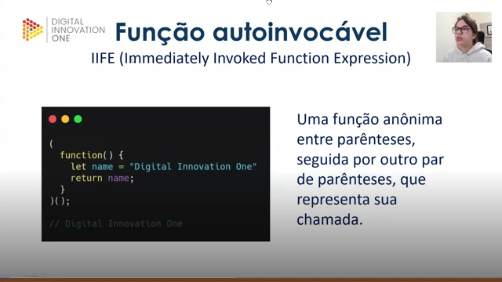
</p>

As **IIFEs** (*Immediately Invoked Function Expressions*), ou funções autoinvocáveis, são expressões de funções executadas imediatamente após sua declaração. Para que o motor do JavaScript as reconheça como uma expressão e não como uma declaração de função comum, elas devem estar envolvidas por parênteses. Um segundo par de parênteses ao final é o que efetivamente realiza a chamada da função.

```javascript
(
function() {
  let name = "Digital Innovation One"
  return name;
}
)();
// Digital Innovation One

```

Este padrão é útil para criar escopos isolados, permitindo que variáveis como `name` não poluam o escopo global.

<p align="center">
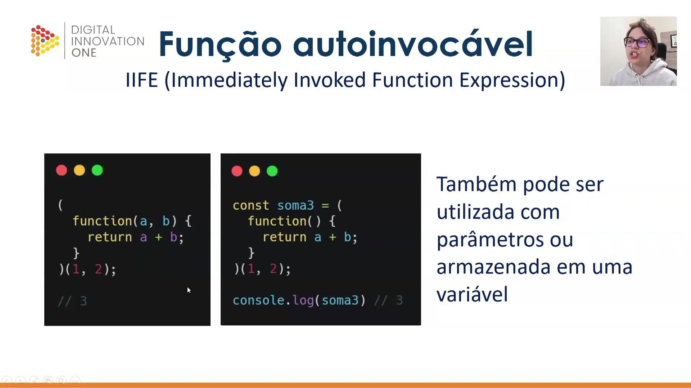
</p>

As funções autoinvocáveis também suportam a passagem de **parâmetros** e podem ter seu resultado de retorno armazenado em variáveis ou constantes. No exemplo abaixo, os valores `1` e `2` são passados como argumentos para os parâmetros `a` e `b`, e o resultado da operação é atribuído à constante `soma3`.

```javascript
const soma3 = (
  function(a, b) {
    return a + b;
  }
)(1, 2);

console.log(soma3); // 3

```

<p align="center">
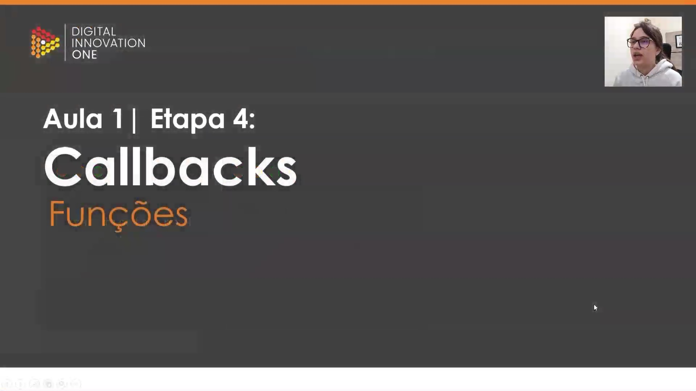
</p>

### Introdução aos Callbacks

Nesta etapa, exploramos o conceito de **Callbacks**. Diferente das IIFEs, os callbacks não possuem uma sintaxe especial obrigatória, mas representam um padrão de projeto fundamental em JavaScript. Um callback é, essencialmente, uma função passada como argumento para outra função, permitindo um comportamento dinâmico e maior controle sobre o fluxo de execução.

<p align="center">

</p>

O uso de callbacks permite que uma função genérica, como `calc`, execute diferentes operações dependendo da função que recebe como argumento. Isso oferece um controle preciso sobre a **ordem das chamadas**, permitindo decidir exatamente quando a função enviada deve ser processada dentro da lógica principal.

```javascript
const calc = function(operacao, num1, num2){
  return operacao(num1, num2);
}

const soma = function(num1, num2) {
  return num1 + num2;
}

const sub = function(num1, num2) {
  return num1 - num2;
}

const resultSoma = calc(soma, 1, 2);
const resultSub = calc(sub, 1, 2);

console.log(resultSub); // -1
console.log(resultSoma); // 3

```

# Parte 2 - Parâmetros

## 🟩 Vídeo 04 - Exercício - Valores padrão e Objeto "arguments"

<video width="60%" controls>
	<source src="000-Midia_e_Anexos/bootcamp_tqi_fullstack-modulo_03-Curso.06-Video_03.webm" type="video/webm">
	  Seu navegador não suporta vídeo HTML5.
</video>

Link do vídeo: https://web.dio.me/track/tqi-fullstack-developer/course/dominando-funcoes-em-javascript/learning/1af71d8f-7d70-4802-9f1e-ce396f1729ef?autoplay=1

...


## 🟩 Vídeo 05 - xxxxxxxxxxxxxxx


Link do vídeo: 


## 🟩 Vídeo 06 - xxxxxxxxxxxxxxx


Link do vídeo: 


## 🟩 Vídeo 07 - xxxxxxxxxxxxxxx


Link do vídeo: 


## 🟩 Vídeo 08 - xxxxxxxxxxxxxxx


Link do vídeo: 


## 🟩 Vídeo 09 - xxxxxxxxxxxxxxx


Link do vídeo: 


## 🟩 Vídeo 10 - xxxxxxxxxxxxxxx


Link do vídeo: 


# Parte 2 - xxxxxxxxxxxxxxx

## 🟩 Vídeo 01 - xxxxxxxxxxxxxxx


Link do vídeo:  


## 🟩 Vídeo 02 - xxxxxxxxxxxxxxx


Link do vídeo: 


## 🟩 Vídeo 03 - xxxxxxxxxxxxxxx


Link do vídeo: 


## 🟩 Vídeo 04 - xxxxxxxxxxxxxxx


Link do vídeo: 


## 🟩 Vídeo 05 - xxxxxxxxxxxxxxx


Link do vídeo: 


## 🟩 Vídeo 06 - xxxxxxxxxxxxxxx


Link do vídeo: 


## 🟩 Vídeo 07 - xxxxxxxxxxxxxxx


Link do vídeo: 


## 🟩 Vídeo 08 - xxxxxxxxxxxxxxx


Link do vídeo: 


## 🟩 Vídeo 09 - xxxxxxxxxxxxxxx


Link do vídeo: 


## 🟩 Vídeo 10 - xxxxxxxxxxxxxxx


Link do vídeo: 


# Parte 3 - xxxxxxxxxxxxxxx

## 🟩 Vídeo 01 - Exxxxxxxxxxxxxxx


Link do vídeo:  


## 🟩 Vídeo 02 - xxxxxxxxxxxxxxx


Link do vídeo: 


## 🟩 Vídeo 03 - xxxxxxxxxxxxxxx


Link do vídeo: 


## 🟩 Vídeo 04 - xxxxxxxxxxxxxxx


Link do vídeo: 


## 🟩 Vídeo 05 - xxxxxxxxxxxxxxx


Link do vídeo: 


## 🟩 Vídeo 06 - xxxxxxxxxxxxxxx


Link do vídeo: 


## 🟩 Vídeo 07 - xxxxxxxxxxxxxxx


Link do vídeo: 


## 🟩 Vídeo 08 - xxxxxxxxxxxxxxx


Link do vídeo: 


## 🟩 Vídeo 09 - xxxxxxxxxxxxxxx


Link do vídeo: 


## 🟩 Vídeo 10 - xxxxxxxxxxxxxxx


Link do vídeo: 


##  Materiais de Apoio


# Certificado: 

- Link na plataforma: 
- Certificado em pdf: 
