## Instrutor

- Stephany Nusch (Software Engineer at Microsoft)
- Contato Linkedin: / [stephanynusch](https://www.linkedin.com/in/stephanynusch/)

# Parte 1 - Tipos de função

## 🟩 Vídeo 01 - Apresentação do curso

<video width="60%" controls>
	<source src="000-Midia_e_Anexos/bootcamp_tqi_fullstack-modulo_03-Curso.06-Video_01.webm" type="video/webm">
	  Seu navegador não suporta vídeo HTML5.
</video>

Link do vídeo:  https://web.dio.me/track/tqi-fullstack-developer/course/dominando-funcoes-em-javascript/learning/183f95d6-d7cc-4ccb-84d7-f2ecc6f3aa01?autoplay=1

Esta fonte consiste na **introdução** para o curso de programação focado em **JavaScript**, ministrado pela engenheira de software Stephanie Nush. A instrutora apresenta sua **trajetória profissional** e acadêmica, destacando a importância de dominar funções e sintaxes básicas para desenvolvedores iniciantes. O conteúdo programático é detalhado em **seis módulos distintos**, abrangendo desde tipos de funções e parâmetros até conceitos avançados como o uso da palavra-chave *this*. Além das lições teóricas, a orientadora incentiva o uso do **GitHub** para a realização de exercícios práticos contidos em um repositório específico. O material busca fornecer uma **base sólida e completa** para que os alunos consigam manipular dados e lógica de programação com fluidez.

### Anotações

<p align="center">

</p>

Nesta introdução ao curso de JavaScript do Bootcamp, a instrutora Stephany Nusch, Engenheira de Software no QuintoAndar, apresenta o tema central da unidade: **Funções**. Este módulo é fundamental para quem está iniciando na linguagem e deseja compreender como organizar e reutilizar blocos de código de maneira eficiente.

<p align="center">

</p>

A instrutora compartilha sua trajetória profissional e acadêmica, destacando os seguintes pontos:

* **Formação**: Graduada em Análise e Desenvolvimento de Sistemas (ADS).
* **Experiência**: Atua como programadora há 4 anos.
* **Causas**: Envolvimento em frentes de igualdade de gênero e na disseminação de conhecimento técnico.
* **Interesses Pessoais**: Aprecia música, livros e jogos.
* **Contatos**: Disponível no LinkedIn (Stephany Nusch) e no GitHub (stebsnusch), onde o material prático do curso está hospedado.

<p align="center">

</p>

Os objetivos principais deste curso foram estabelecidos para garantir uma base sólida em JavaScript, focando em:

1. **Declaração de funções**: Aprender as diferentes formas de criar funções.
2. **Manipulação de parâmetros**: Entender como passar e receber dados.
3. **Loops e declarações**: Explorar estruturas de repetição e outras instruções lógicas.
4. **Argumento "this"**: Compreender o comportamento e o contexto desta palavra-chave.

<p align="center">

</p>

O percurso de aprendizado está estruturado de forma progressiva para facilitar a retenção do conteúdo. As primeiras etapas incluem:

* **Aula 1**: Estudo sobre os diversos tipos de função.
* **Aula 2**: Foco em parâmetros e como lidar com a entrada de dados.
* **Aula 3**: Implementação de loops.
* **Aula 4**: Uso e manipulação da palavra-chave "this".

<p align="center">

</p>

Finalizando o cronograma do curso, as aulas de encerramento abordam tópicos modernos e aplicação prática:

* **Aula 5**: Introdução às *Arrow Functions* e sua sintaxe simplificada.
* **Aula 6**: Atividade prática para consolidar o conhecimento, com desafios disponíveis no repositório do GitHub.

## 🟩 Vídeo 02 - Estrutura e Função anônima


<video width="60%" controls>
	<source src="000-Midia_e_Anexos/bootcamp_tqi_fullstack-modulo_03-Curso.06-Video_02.webm" type="video/webm">
	  Seu navegador não suporta vídeo HTML5.
</video>

Link do vídeo: https://web.dio.me/track/tqi-fullstack-developer/course/dominando-funcoes-em-javascript/learning/3a696f71-bd28-494e-a27e-1b1ba73627c8?autoplay=1

Esta lição introduz os conceitos fundamentais sobre a estrutura de **funções no JavaScript**, detalhando como elas são declaradas e organizadas. O conteúdo explica que uma função utiliza **parâmetros e instruções** específicas, destacando que variáveis criadas internamente ficam restritas ao **escopo local**. Além disso, o texto aborda o papel da cláusula **return**, que interrompe a execução para fornecer um valor resultante que pode ser reaproveitado pelo sistema. Por fim, o material apresenta as **funções anônimas**, demonstrando como é possível atribuir blocos de código sem nome diretamente a variáveis. Essas explicações visam capacitar o aluno a manipular operações lógicas de forma modular e eficiente.

### Anotações

#### Introdução aos Tipos de Função

<p align="center">

</p>

Nesta etapa inicial, abordamos o tema fundamental de **Tipos de função**. O foco está em compreender como as funções são categorizadas e utilizadas dentro da lógica de programação, estabelecendo a base para o desenvolvimento de rotinas estruturadas.

#### Objetivos da Aula

<p align="center">

</p>

Os principais objetivos desta sessão são:

1. **Apresentar a estrutura de uma função**: Compreender os componentes essenciais que compõem uma declaração funcional.
2. **Explorar outros tipos de funções**: Analisar variações além do modelo padrão e entender em quais cenários práticos elas são aplicadas.

#### Estrutura de Funções

<p align="center">

</p>

Iniciamos o estudo da **Estrutura** das funções. Este tópico detalha como organizar o código de maneira que o JavaScript reconheça o bloco de instruções como uma unidade funcional reutilizável.

#### Definição Comum e Escopo

<p align="center">

</p>

A definição padrão de uma função utiliza a palavra reservada `function`. A sintaxe básica segue este modelo:

```javascript
function nome(parametros) {
 // instruções
}

```

É fundamental observar que **variáveis criadas dentro de uma função possuem escopo local**, ou seja, elas apenas podem ser utilizadas dentro do bloco da própria função, não sendo acessíveis externamente.

#### O Uso do Return

<p align="center">

</p>

O comando `return` é utilizado para definir o valor de saída de uma função.

```javascript
function nome(parametros){
 // instruções
 return; //valor de retorno
}

```

**Quando invocamos o "return", a função para de ser executada imediatamente**. Ele permite que o resultado de uma operação interna seja enviado para fora da função, possibilitando que esse valor seja aproveitado em outras partes do programa.

#### Funções Anônimas

<p align="center">

</p>

Avançando para a segunda etapa, exploramos a **Função anônima**. Este tipo de função diferencia-se da definição comum por não possuir um identificador (nome) próprio ligado diretamente à sua declaração, sendo frequentemente associada a expressões.

#### Funções como Expressões

<p align="center">

</p>

Uma característica poderosa do JavaScript é que **uma variável pode armazenar uma função**. No exemplo abaixo, a constante `soma` recebe uma função sem nome (anônima) que processa dois parâmetros:

```javascript
const soma = function (a, b) {
 return a + b;
}

soma(1, 2)
// 3
soma(5, 4)
// 9

```

Neste caso, a função é invocada através do nome da variável à qual ela foi atribuída, demonstrando como tratar funções como valores dentro do código.

## 🟩 Vídeo 03 - Função autoinvocável e Callbacks

<video width="60%" controls>
	<source src="000-Midia_e_Anexos/bootcamp_tqi_fullstack-modulo_03-Curso.06-Video_03.webm" type="video/webm">
	  Seu navegador não suporta vídeo HTML5.
</video>

Link do vídeo: https://web.dio.me/track/tqi-fullstack-developer/course/dominando-funcoes-em-javascript/learning/80cd7e6d-5885-4095-afed-fb296b91a376?autoplay=1

O conteúdo explica o funcionamento das **Expressões de Função Invocadas Imediatamente (IIFE)**, destacando que essas estruturas são executadas de forma automática assim que definidas. O autor detalha que essas funções podem ser **anônimas ou nomeadas**, permitindo também o uso de **parâmetros externos** ou o armazenamento de seus resultados em constantes. Além disso, o texto introduz o conceito de **callbacks**, definindo-os como funções que são enviadas como **argumentos** para outros blocos de código. Essa técnica oferece ao desenvolvedor um maior **controle sobre a ordem de execução**, permitindo que uma lógica específica seja acionada apenas quando necessário. Por fim, o material reforça a importância dessas práticas na **organização de sistemas** e incentiva a interação entre estudantes para sanar dúvidas técnicas.

### Anotações

<p align="center">

</p>

As **IIFEs** (*Immediately Invoked Function Expressions*), ou funções autoinvocáveis, são expressões de funções executadas imediatamente após sua declaração. Para que o motor do JavaScript as reconheça como uma expressão e não como uma declaração de função comum, elas devem estar envolvidas por parênteses. Um segundo par de parênteses ao final é o que efetivamente realiza a chamada da função.

```javascript
(
function() {
  let name = "Digital Innovation One"
  return name;
}
)();
// Digital Innovation One

```

Este padrão é útil para criar escopos isolados, permitindo que variáveis como `name` não poluam o escopo global.

<p align="center">

</p>

As funções autoinvocáveis também suportam a passagem de **parâmetros** e podem ter seu resultado de retorno armazenado em variáveis ou constantes. No exemplo abaixo, os valores `1` e `2` são passados como argumentos para os parâmetros `a` e `b`, e o resultado da operação é atribuído à constante `soma3`.

```javascript
const soma3 = (
  function(a, b) {
    return a + b;
  }
)(1, 2);

console.log(soma3); // 3

```

<p align="center">

</p>

### Introdução aos Callbacks

Nesta etapa, exploramos o conceito de **Callbacks**. Diferente das IIFEs, os callbacks não possuem uma sintaxe especial obrigatória, mas representam um padrão de projeto fundamental em JavaScript. Um callback é, essencialmente, uma função passada como argumento para outra função, permitindo um comportamento dinâmico e maior controle sobre o fluxo de execução.

<p align="center">

</p>

O uso de callbacks permite que uma função genérica, como `calc`, execute diferentes operações dependendo da função que recebe como argumento. Isso oferece um controle preciso sobre a **ordem das chamadas**, permitindo decidir exatamente quando a função enviada deve ser processada dentro da lógica principal.

```javascript
const calc = function(operacao, num1, num2){
  return operacao(num1, num2);
}

const soma = function(num1, num2) {
  return num1 + num2;
}

const sub = function(num1, num2) {
  return num1 - num2;
}

const resultSoma = calc(soma, 1, 2);
const resultSub = calc(sub, 1, 2);

console.log(resultSub); // -1
console.log(resultSoma); // 3

```

# Parte 2 - Parâmetros

## 🟩 Vídeo 04 - Valores padrão e Objeto "arguments"

<video width="60%" controls>
	<source src="000-Midia_e_Anexos/bootcamp_tqi_fullstack-modulo_03-Curso.06-Video_04.webm" type="video/webm">
	  Seu navegador não suporta vídeo HTML5.
</video>

Link do vídeo: https://web.dio.me/track/tqi-fullstack-developer/course/dominando-funcoes-em-javascript/learning/1af71d8f-7d70-4802-9f1e-ce396f1729ef?autoplay=1

O vídeo apresenta conceitos fundamentais sobre tipos de funções em programação, focando inicialmente nas **IIFEs**, que são funções executadas automaticamente logo após sua criação. O autor explica que essas estruturas **autoinvocáveis** podem ser anônimas ou nomeadas, permitindo inclusive o uso de **parâmetros** e o armazenamento de seus resultados em constantes. Em seguida, o conteúdo aborda o conceito de **callbacks**, definindo-os como funções enviadas como argumentos para outras funções para processamento posterior. É demonstrado como essa técnica oferece **controle sobre a execução** do código, permitindo que o desenvolvedor decida o momento exato em que a lógica secundária deve ser ativada. Por fim, o material reforça a importância desses padrões para a **organização lógica** e incentiva a interação entre estudantes para sanar dúvidas sobre o tema.

### Anotações

<p align="center">
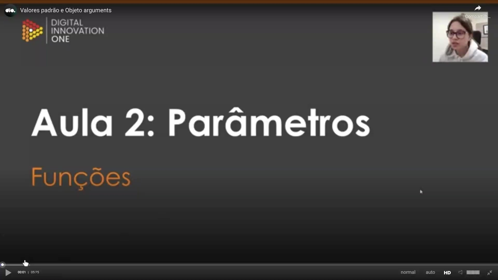
</p>

Esta aula introduz conceitos avançados sobre parâmetros em funções JavaScript, focando especificamente em como manipular valores padrão e utilizar o objeto `arguments`. O objetivo é aprofundar o conhecimento sobre a flexibilidade das funções na linguagem.

<p align="center">
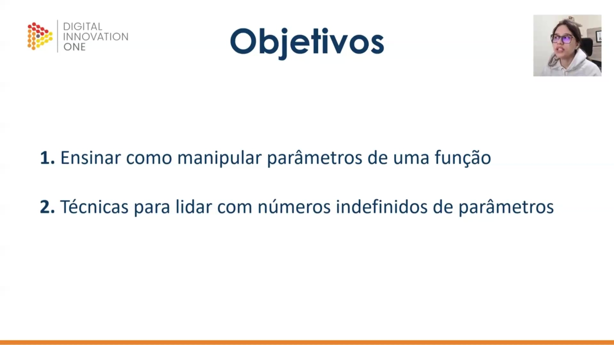
</p>

Os objetivos principais desta etapa do aprendizado consistem em:

1. Ensinar a manipulação eficiente de parâmetros dentro de uma função.
2. Apresentar técnicas para lidar com situações onde o número de parâmetros passados é indefinido ou variável.

<p align="center">

</p>

A primeira etapa foca em **Valores Padrão**, um recurso que permite definir valores predeterminados para os parâmetros caso nenhum argumento seja passado durante a invocação da função.

<p align="center">
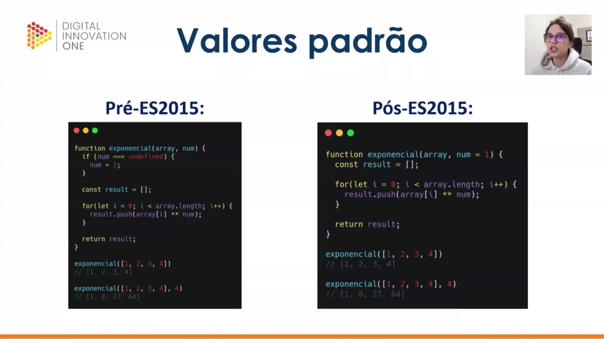
</p>

Existem duas formas de lidar com valores padrão no JavaScript, dependendo da versão do ECMAScript utilizada:

* **Pré-ES2015**: Era necessário verificar manualmente se o parâmetro era `undefined` dentro do corpo da função para atribuir um valor manual.
* **Pós-ES2015**: A sintaxe tornou-se muito mais limpa, permitindo definir o valor padrão diretamente na assinatura da função (ex: `num = 1`).

```javascript
// Pré-ES2015
function exponencial(array, num) {
  if (num === undefined) {
    num = 1;
  }

  const result = [];

  for(let i = 0; i < array.length; i++) {
    result.push(array[i] ** num);
  }

  return result;
}

// Pós-ES2015
function exponencial(array, num = 1) {
  const result = [];

  for(let i = 0; i < array.length; i++) {
    result.push(array[i] ** num);
  }

  return result;
}

exponencial([1, 2, 3, 4]); // [1, 2, 3, 4]
exponencial([1, 2, 3, 4], 4); // [1, 16, 81, 256]

```

<p align="center">
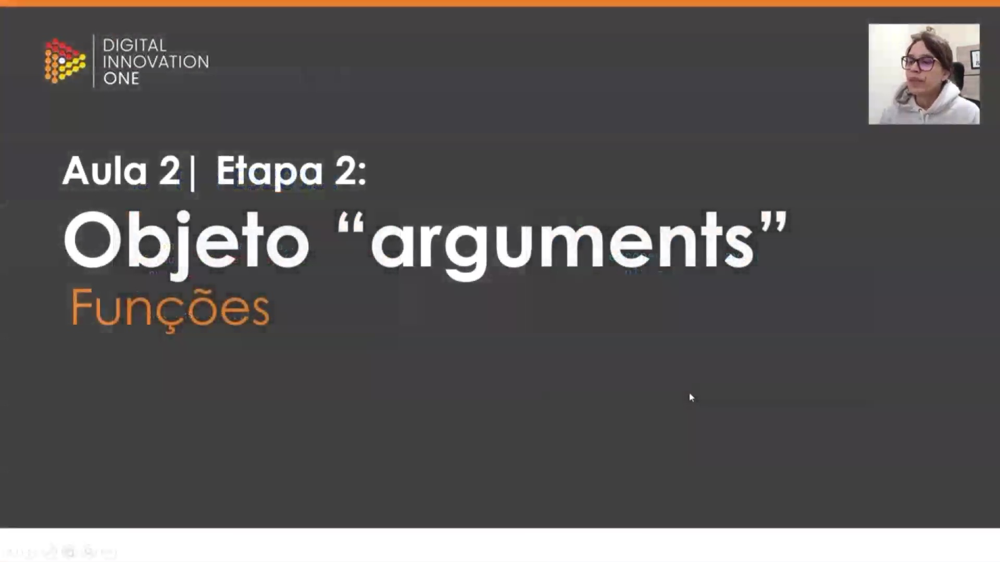
</p>

A segunda etapa aborda o **Objeto "arguments"**. Este é um recurso interno das funções JavaScript que permite acessar todos os argumentos passados para a função, independentemente de quantos parâmetros foram declarados formalmente.

<p align="center">
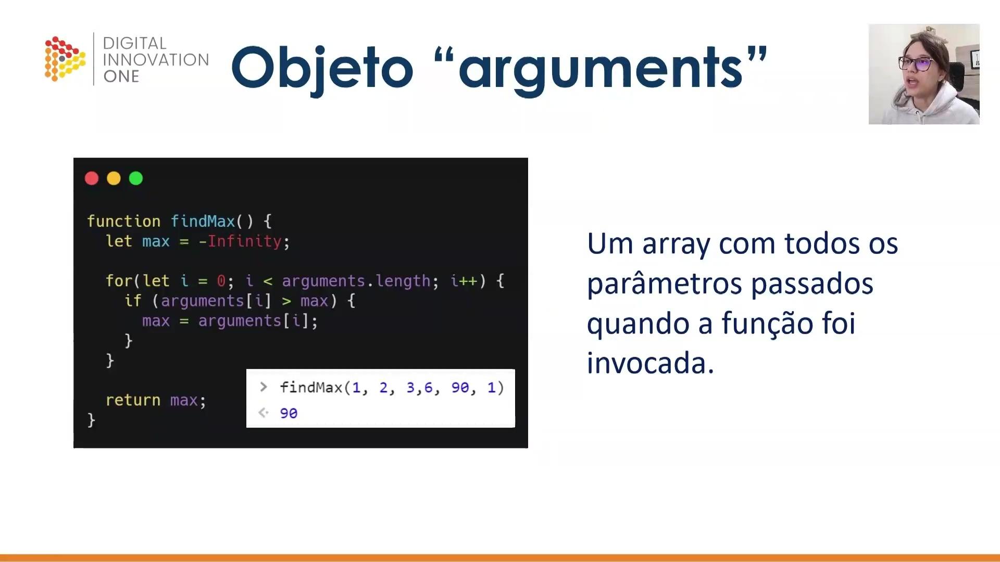
</p>

O objeto `arguments` funciona como um array (embora tecnicamente seja um objeto iterável semelhante a um array) que contém todos os parâmetros passados no momento da invocação. No exemplo abaixo, a função localiza o maior número entre uma lista de argumentos de tamanho variável.

```javascript
function findMax() {
  let max = -Infinity;

  for(let i = 0; i < arguments.length; i++) {
    if (arguments[i] > max) {
      max = arguments[i];
    }
  }

  return max;
}

findMax(1, 2, 3, 6, 90, 1); // 90

```

<p align="center">
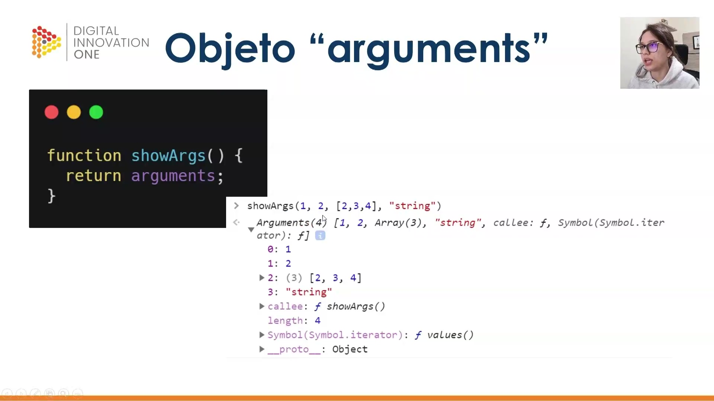
</p>

Ao retornar ou inspecionar o objeto `arguments`, podemos ver que ele armazena índices numéricos para cada valor passado, possui uma propriedade `length` e outras propriedades como `callee`. Ele é capaz de armazenar diferentes tipos de dados simultaneamente, como números, arrays e strings.

```javascript
function showArgs() {
  return arguments;
}

showArgs(1, 2, [2, 3, 4], "string");
/*
Arguments (4) [1, 2, Array(3), "string", callee: f, Symbol(Symbol.iterator): f]
0: 1
1: 2
2: (3) [2, 3, 4]
3: "string"
length: 4
*/

```


## 🟩 Vídeo 05 - Arrays e Objetos

<video width="60%" controls>
	<source src="000-Midia_e_Anexos/bootcamp_tqi_fullstack-modulo_03-Curso.06-Video_05.webm" type="video/webm">
	  Seu navegador não suporta vídeo HTML5.
</video>

Link do vídeo: https://web.dio.me/track/tqi-fullstack-developer/course/dominando-funcoes-em-javascript/learning/5da6e77a-f49b-45e5-a55f-f379e5a01ce0?autoplay=1

Esta fonte explica técnicas fundamentais de **manipulação de dados** em programação, focando especificamente no uso de **JavaScript**. A instrutora detalha o funcionamento do **operador spread**, que serve para expandir os elementos de uma lista e enviá-los de forma individual para uma função. Em contrapartida, o texto apresenta o **parâmetro rest**, utilizado para agrupar diversos argumentos independentes em um único conjunto durante a declaração de funções. Além disso, o conteúdo aborda a **desestruturação de objetos**, um método prático para extrair e renomear apenas as propriedades específicas de que o desenvolvedor necessita. Essas ferramentas são apresentadas como **padrões de mercado** essenciais para otimizar o código e facilitar o tratamento de estruturas complexas.

### Anotações

<p align="center">
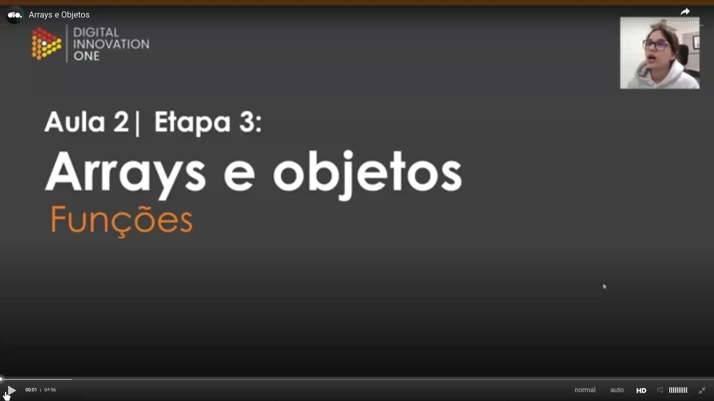
</p>

Esta etapa da aula introduz o tratamento de estruturas de dados fundamentais em JavaScript: **Arrays** e **Objetos**. O objetivo é explorar técnicas modernas de manipulação que permitem lidar com coleções de dados de forma mais eficiente e legível, preparando a base para os conceitos de *Spread*, *Rest* e *Destructuring*.

<p align="center">

</p>

A técnica de **Spread** (espalhar) é utilizada para lidar separadamente com elementos de um array. Ao utilizar a sintaxe de reticências (`...`) antes do nome da variável ao chamar uma função, o que era um único argumento (o array) se torna uma série de elementos independentes passados como parâmetros individuais.

```javascript
function sum(x, y, z) {
  return x + y + z;
}

const numbers = [1, 2, 3];

console.log(sum(...numbers));

```

<p align="center">
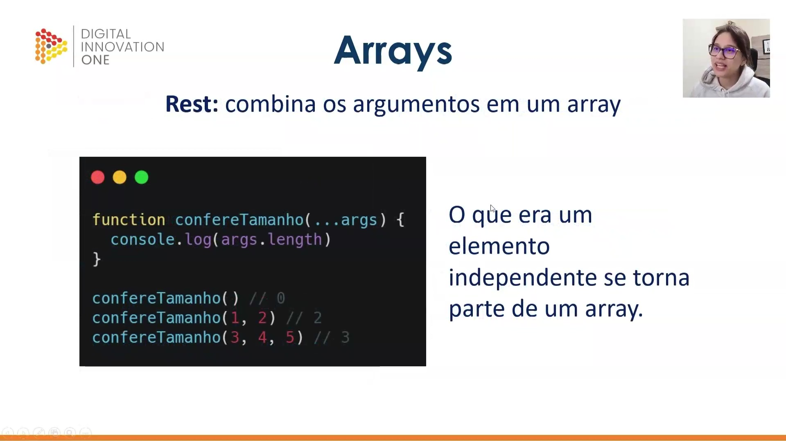
</p>

O operador **Rest** funciona de maneira oposta ao Spread. Ele é utilizado no momento da **declaração** da função para combinar diversos argumentos passados individualmente em um único array. Isso permite que a função receba um número indefinido de parâmetros e os manipule como uma coleção.

```javascript
function confereTamanho(...args) {
  console.log(args.length)
}

confereTamanho() // 0
confereTamanho(1, 2) // 2
confereTamanho(3, 4, 5) // 3

```

<p align="center">
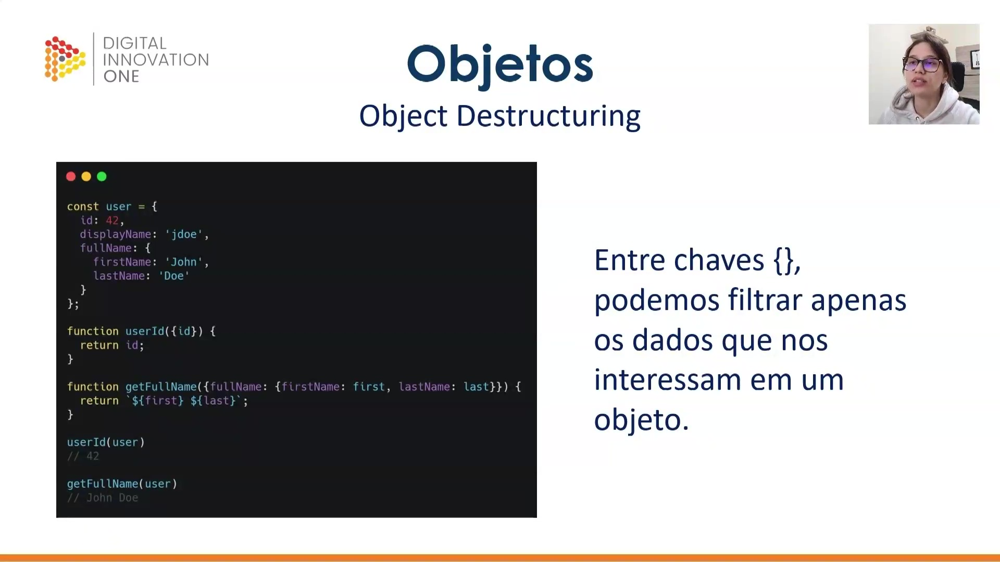
</p>

A técnica de **Object Destructuring** (desestruturação de objeto) permite filtrar e extrair apenas os dados de interesse de dentro de um objeto. Através do uso de chaves `{}` na passagem de parâmetros, é possível acessar propriedades diretas ou até realizar desestruturações aninhadas (como buscar dados dentro de `fullName`) e renomear variáv      

# Parte 3 - Loops

## 🟩 Vídeo 06 - If/else e Switch

<video width="60%" controls>
	<source src="000-Midia_e_Anexos/bootcamp_tqi_fullstack-modulo_03-Curso.06-Video_06.webm" type="video/webm">
	  Seu navegador não suporta vídeo HTML5.
</video>

Link do vídeo: https://web.dio.me/track/tqi-fullstack-developer/course/dominando-funcoes-em-javascript/learning/b42a2926-2274-44df-9158-815a75d5af8c?autoplay=1

Este vídeo apresenta conceitos fundamentais sobre **estruturas de controle** em **JavaScript**, enfatizando a importância de dominar a lógica de programação para o desenvolvimento cotidiano. O instrutor detalha o funcionamento do **if/else**, explicando como validar condições e oferecendo dicas de **clean code**, como o uso de variáveis para tornar as condicionais mais legíveis. A aula também explora técnicas para otimizar o código através do uso estratégico da instrução **return** e do aninhamento de múltiplas verificações. Por fim, o conteúdo introduz o **switch case**, destacando sua utilidade em cenários com muitas opções e ressaltando que essa estrutura realiza comparações estritas de **tipo e valor**.

### Anotações

<p align="center">
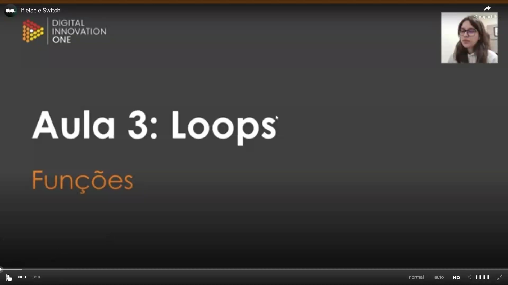
</p>

Esta aula aborda um dos pilares fundamentais do JavaScript: os **loops** e as **estruturas de controle**. Essas declarações compõem o "coração" do desenvolvimento na linguagem, sendo ferramentas essenciais que programadores utilizam diariamente para controlar o fluxo de execução de seus códigos.

<p align="center">
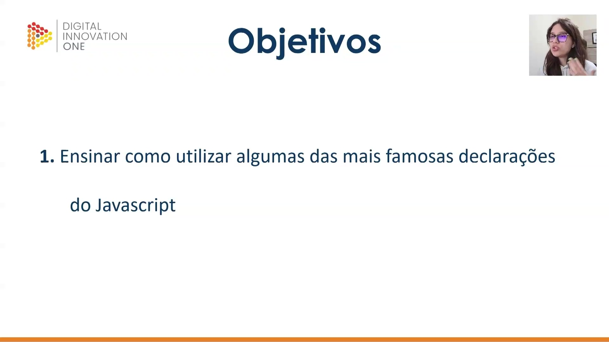
</p>

O objetivo central desta etapa é capacitar o aluno a utilizar as declarações mais famosas e recorrentes do ecossistema JavaScript, garantindo uma base sólida para a lógica de programação.

<p align="center">

</p>

A primeira parte do estudo foca especificamente na estrutura condicional **if/else**, que é a forma mais comum de realizar verificações e tomar decisões baseadas em condições lógicas dentro de uma função.

<p align="center">
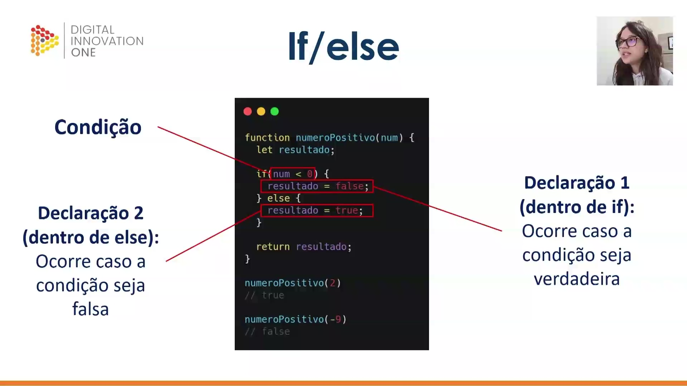
</p>

A estrutura básica do **if/else** funciona através de uma condição avaliada entre parênteses. Se o resultado for verdadeiro, o bloco da **Declaração 1** é executado; caso contrário (se a condição for falsa), o fluxo segue para a **Declaração 2** dentro do `else`.

No exemplo abaixo, a função verifica se um número é positivo:

```javascript
function numeroPositivo(num) {
  let resultado;

  if (num < 0) {
    resultado = false; // Declaração 1
  } else {
    resultado = true;  // Declaração 2
  }

  return resultado;
}

numeroPositivo(2)   // true
numeroPositivo(-9)  // false

```

<p align="center">
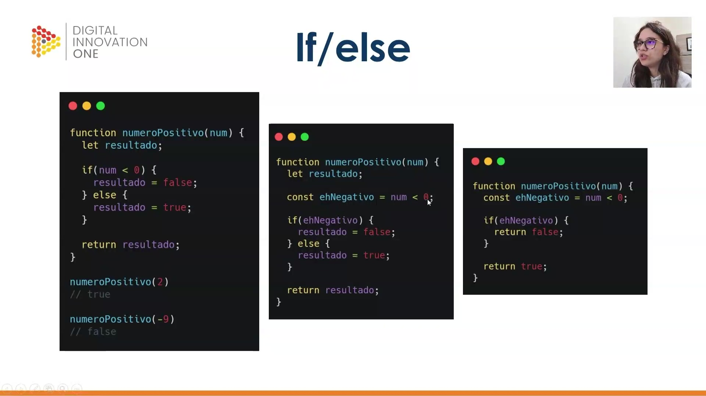
</p>

Existem formas mais refinadas e performáticas de escrever condicionais seguindo boas práticas de **Clean Code**:

* **Variáveis para Condicionais:** Armazenar a lógica em uma constante (ex: `ehNegativo`) torna o código mais legível.
* **Otimização de Memória:** Ao utilizar o `return` diretamente dentro do `if`, eliminamos a necessidade de declarar variáveis auxiliares (como `resultado`), poupando endereços de memória.
* **Controle de Fluxo:** O comando `return` encerra a execução da função imediatamente. Se a condição for atendida, a função retorna o valor e ignora o restante do código abaixo.

```javascript
// Exemplo com variável de suporte à leitura
function numeroPositivo(num) {
  const ehNegativo = num < 0;
  if (ehNegativo) {
    return false;
  }
  return true;
}

```

<p align="center">

</p>

É possível **aninhar condicionais** utilizando a estrutura `else if` para verificar múltiplas possibilidades em sequência. Um detalhe sintático crucial é que, no JavaScript, não existe a palavra reservada única `elseif`; deve-se sempre utilizar **else** e **if** separados por um espaço.

```javascript
function numeroPositivo(num) {
  const ehNegativo = num < 0;
  const maiorQueDez = num > 10;

  if (ehNegativo) {
    return "Esse número é negativo!";
  } else if (!ehNegativo && maiorQueDez) {
    return "Esse número é positivo e maior que 10!";
  }

  return "Esse número é positivo!";
}

// Exemplos de execução:
// numeroPositivo(2)  -> "Esse número é positivo!"
// numeroPositivo(-2) -> "Esse número é negativo!"
// numeroPositivo(40) -> "Esse número é positivo e maior que 10!"

```

<p align="center">

</p>

Na segunda etapa da aula, o foco muda para o **switch**, uma estrutura alternativa ao `if/else` projetada para lidar com múltiplas verificações de forma mais organizada.

<p align="center">
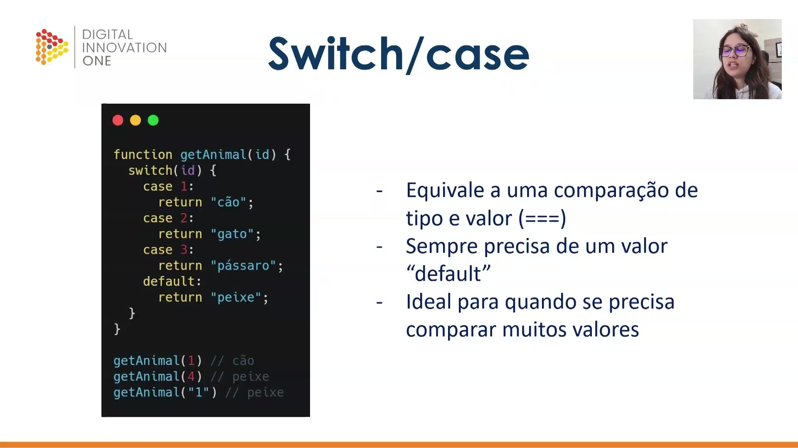
</p>

A declaração **switch/case** é ideal para comparar uma única variável contra diversos valores possíveis. Características importantes:

* **Comparação Estrita:** O `switch` utiliza a comparação de tipo e valor (`===`). Por exemplo, se o caso espera o número `1` e recebe a string `"1"`, ele não será validado.
* **Valor Default:** É indispensável definir um `default` para tratar situações em que nenhuma das opções anteriores foi atendida.

```javascript
function getAnimal(id) {
  switch(id) {
    case 1:
      return "cão";
    case 2:
      return "gato";
    case 3:
      return "pássaro";
    default:
      return "peixe";
  }
}

getAnimal(1)    // "cão"
getAnimal(4)    // "peixe" (cai no default)
getAnimal("1")  // "peixe" (tipo string diferente de número)

```


## 🟩 Vídeo 07 - xxxxxxxxxxxxxxx


Link do vídeo: https://web.dio.me/track/tqi-fullstack-developer/course/dominando-funcoes-em-javascript/learning/4fd60705-f260-4e80-8dcc-ebe40fc6cb98?autoplay=1


## 🟩 Vídeo 08 - xxxxxxxxxxxxxxx


Link do vídeo: 


## 🟩 Vídeo 09 - xxxxxxxxxxxxxxx


Link do vídeo: 


## 🟩 Vídeo 10 - xxxxxxxxxxxxxxx


Link do vídeo: 


# Parte 2 - xxxxxxxxxxxxxxx

## 🟩 Vídeo 01 - xxxxxxxxxxxxxxx


Link do vídeo:  


## 🟩 Vídeo 02 - xxxxxxxxxxxxxxx


Link do vídeo: 


## 🟩 Vídeo 03 - xxxxxxxxxxxxxxx


Link do vídeo: 


## 🟩 Vídeo 04 - xxxxxxxxxxxxxxx


Link do vídeo: 


## 🟩 Vídeo 05 - xxxxxxxxxxxxxxx


Link do vídeo: 


## 🟩 Vídeo 06 - xxxxxxxxxxxxxxx


Link do vídeo: 


## 🟩 Vídeo 07 - xxxxxxxxxxxxxxx


Link do vídeo: 


## 🟩 Vídeo 08 - xxxxxxxxxxxxxxx


Link do vídeo: 


## 🟩 Vídeo 09 - xxxxxxxxxxxxxxx


Link do vídeo: 


## 🟩 Vídeo 10 - xxxxxxxxxxxxxxx


Link do vídeo: 


# Parte 3 - xxxxxxxxxxxxxxx

## 🟩 Vídeo 01 - Exxxxxxxxxxxxxxx


Link do vídeo:  


## 🟩 Vídeo 02 - xxxxxxxxxxxxxxx


Link do vídeo: 


## 🟩 Vídeo 03 - xxxxxxxxxxxxxxx


Link do vídeo: 


## 🟩 Vídeo 04 - xxxxxxxxxxxxxxx


Link do vídeo: 


## 🟩 Vídeo 05 - xxxxxxxxxxxxxxx


Link do vídeo: 


## 🟩 Vídeo 06 - xxxxxxxxxxxxxxx


Link do vídeo: 


## 🟩 Vídeo 07 - xxxxxxxxxxxxxxx


Link do vídeo: 


## 🟩 Vídeo 08 - xxxxxxxxxxxxxxx


Link do vídeo: 


## 🟩 Vídeo 09 - xxxxxxxxxxxxxxx


Link do vídeo: 


## 🟩 Vídeo 10 - xxxxxxxxxxxxxxx


Link do vídeo: 


##  Materiais de Apoio


# Certificado: 

- Link na plataforma: 
- Certificado em pdf: 
