## Instrutor

- Stephany Nusch (Software Engineer at Microsoft)
- Contato Linkedin: / [stephanynusch](https://www.linkedin.com/in/stephanynusch/)

# Parte 1 - Tipos de erros

## 🟩 Vídeo 01 - Apresentação do curso

<video width="60%" controls>
    <source src="000-Midia_e_Anexos/bootcamp_tqi_fullstack-modulo_03-Curso.07-Video_01.webm" type="video/webm" type="video/webm">
    Seu navegador não suporta vídeo HTML5.
</video>

Link do vídeo:  https://web.dio.me/track/tqi-fullstack-developer/course/debugging-e-error-handling-com-javascript/learning/abb903e7-981e-4c41-939e-9d9ae5a2fe29?autoplay=1

A instrutora, Stephanie, apresenta sua trajetória profissional como engenheira de software e define os pilares do aprendizado, que abrangem desde a identificação de falhas até o desenvolvimento de mensagens customizadas. O conteúdo está estruturado em aulas teóricas e atividades práticas para consolidar a escrita de códigos mais robustos e seguros. Além do material didático, os estudantes são incentivados a utilizar fóruns e comunidades digitais para solucionar dúvidas e trocar conhecimentos técnicos. O objetivo central é capacitar o aluno a dominar o fluxo de tratamento de dados de maneira eficiente e profissional.

### Anotações

<p align="center">
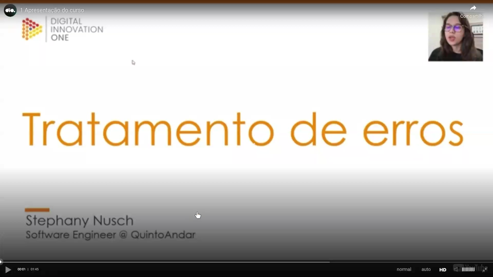
</p>

Nesta aula introdutória sobre Tratamento de Erros no JavaScript, a instrutora Stephany Nusch, engenheira de software no QuintoAndar, apresenta os fundamentos necessários para lidar com exceções no desenvolvimento de software. O curso foca em ensinar como gerenciar falhas de forma eficiente e como criar erros personalizados para atender às necessidades específicas de uma aplicação.

<p align="center">

</p>

A instrutora compartilha sua trajetória profissional e acadêmica:

* Formação: Graduada em Análise e Desenvolvimento de Sistemas (ADS).
* Experiência: Atua como programadora há aproximadamente 4 anos.
* Engajamento: Participa ativamente de frentes voltadas à igualdade de gênero e à disseminação de conhecimento na área de tecnologia.
* Interesses: Além da programação, possui interesse em música, livros e jogos.

Para contatos profissionais e acompanhamento de seus projetos, ela disponibiliza seu LinkedIn (Stephany Nusch) e seu GitHub (stebsnusch).

<p align="center">
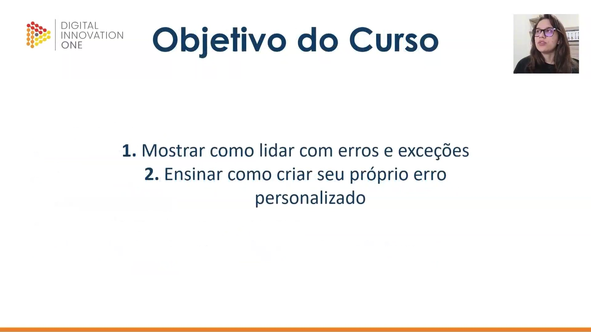
</p>

Os objetivos principais deste curso estão divididos em dois pilares fundamentais:

1. Lidar com erros e exceções: Compreender como o JavaScript identifica e reporta falhas durante a execução do código.
2. Criar erros personalizados: Desenvolver a habilidade de definir exceções próprias, facilitando a depuração e a manutenção do sistema.

<p align="center">
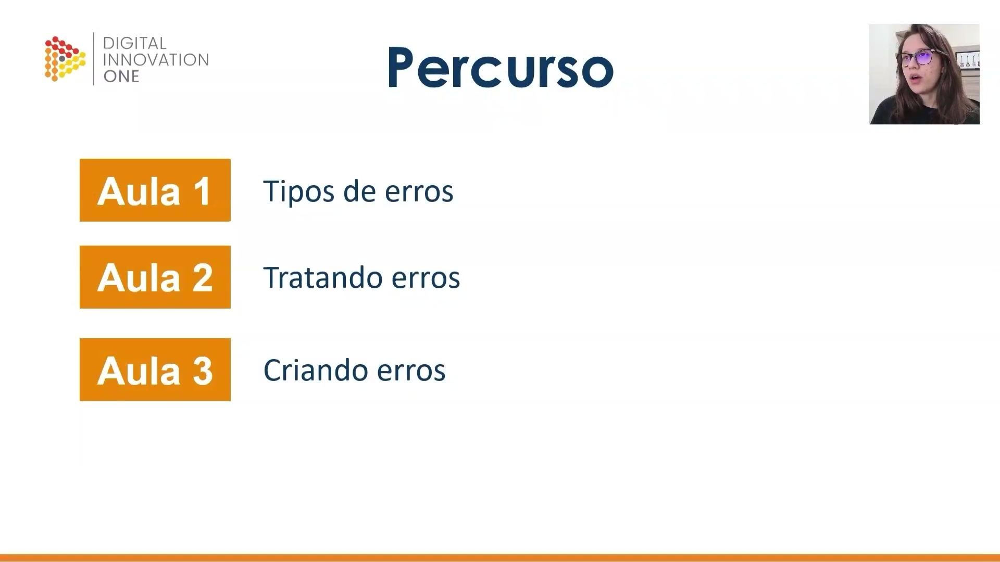
</p>

O percurso do curso é estruturado em três etapas objetivas:

* Aula 1 - Tipos de erros: Uma visão geral sobre as diferentes categorias de erros existentes na linguagem.
* Aula 2 - Tratando erros: Abordagem prática com foco em implementação de código para captura e tratamento de exceções.
* Aula 3 - Criando erros: Atividade prática dedicada à criação de erros customizados e sua integração nas estruturas de tratamento.


## 🟩 Vídeo 02 - ECMAScript Error e DOMException

<video width="60%" controls>
    <source src="000-Midia_e_Anexos/bootcamp_tqi_fullstack-modulo_03-Curso.07-Video_02.webm" type="video/webm" type="video/webm">
    Seu navegador não suporta vídeo HTML5.
</video>

Link do vídeo: https://web.dio.me/track/tqi-fullstack-developer/course/debugging-e-error-handling-com-javascript/learning/be209ab1-55cd-4030-b9f2-2334239b5bce?autoplay=1

Esta fonte explica as distinções fundamentais entre dois tipos principais de falhas que ocorrem no desenvolvimento com JavaScript. O texto detalha o objeto Error do ECMAScript, que surge durante a execução do código devido a falhas de sintaxe, variáveis não declaradas ou erros na pilha de chamadas. Em contraste, a DOM Exception é apresentada como uma exceção específica para o contexto de páginas web, ocorrendo quando há manipulações inválidas na estrutura de elementos do navegador. O conteúdo enfatiza que esses problemas possuem naturezas distintas, variando conforme o ambiente e a interação do script com o documento. Ao compreender essas diferenças, desenvolvedores conseguem identificar se um problema reside na lógica interna da linguagem ou na comunicação com a árvore de elementos da interface. Por fim, o autor reforça que o domínio desses conceitos é essencial para a resolução eficiente de problemas em sistemas modernos.

### Anotações

<p align="center">
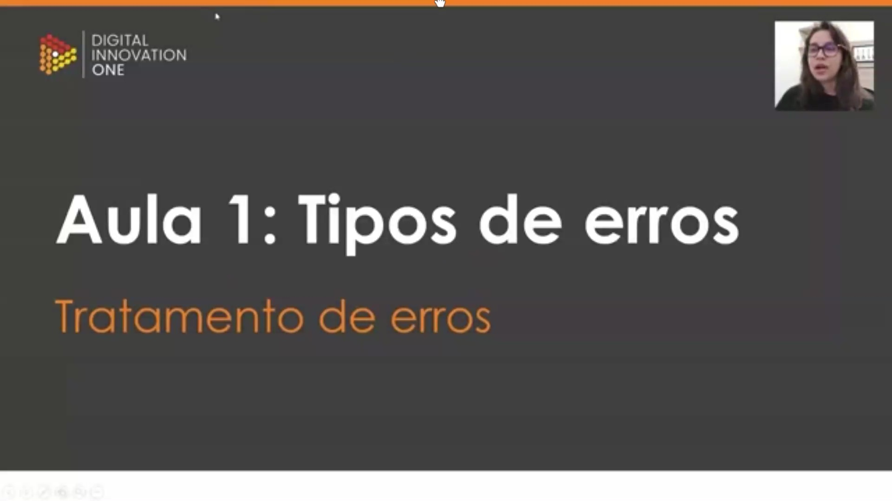
</p>

Esta aula introduz o tema de Tratamento de erros, focando especificamente na identificação e diferenciação dos tipos de erros que podem surgir durante o desenvolvimento em JavaScript. O objetivo principal é compreender como o sistema lida com falhas em diferentes contextos de execução.

<p align="center">
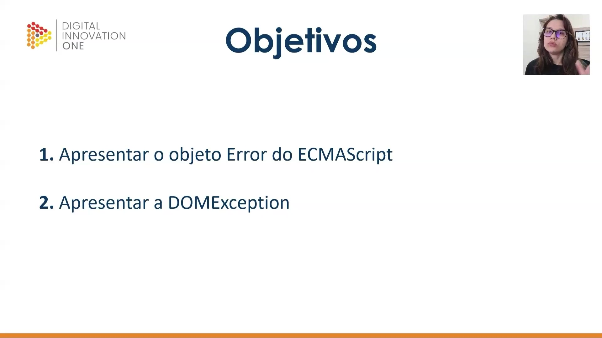
</p>

A apresentação está estruturada em dois objetivos principais:

1. Apresentar o objeto Error do ECMAScript: Compreender a estrutura padrão de erros da linguagem.
2. Apresentar a DOMException: Entender as exceções específicas que ocorrem na interação com a interface da web.

<p align="center">
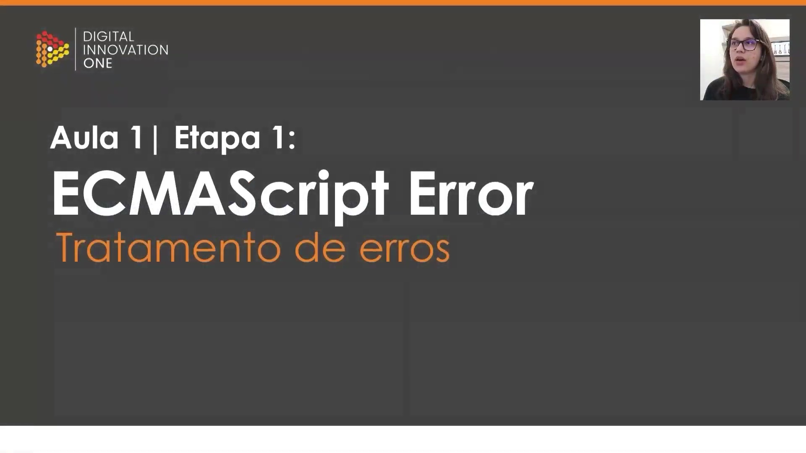
</p>

### ECMAScript Error

Na primeira etapa, exploramos o erro do ECMAScript, que é o tipo de erro padrão da linguagem. Ele se manifesta em tempo de execução, ou seja, enquanto o código está sendo processado pelo motor JavaScript.

<p align="center">
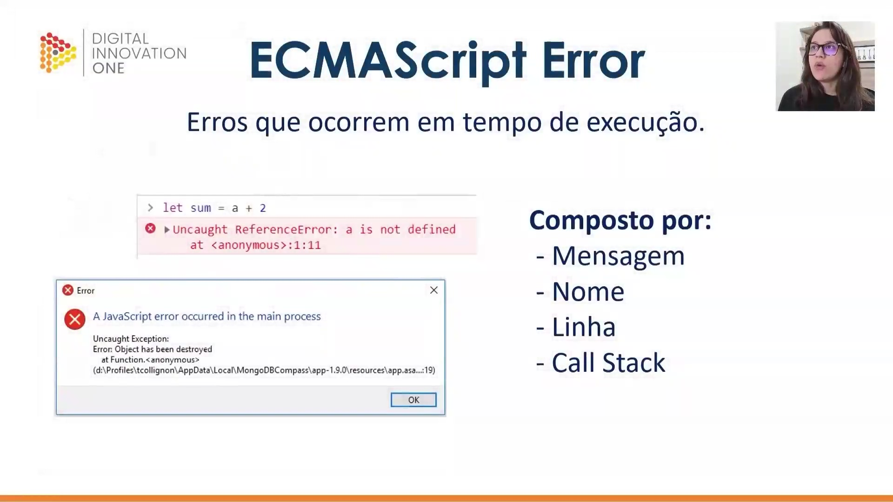
</p>

Os erros do ECMAScript ocorrem quando o código tenta realizar uma operação inválida, como utilizar uma variável que não foi declarada. Um objeto de erro é composto por quatro elementos fundamentais: Mensagem, Nome, Linha e o Call Stack (pilha de chamadas).

```javascript
let sum = a + 2
// Uncaught ReferenceError: a is not defined
// at <anonymous>:1:11

```

Essas notificações podem aparecer tanto no console do navegador quanto em alertas do sistema operacional, indicando exatamente onde a falha ocorreu na estrutura de execução.

<p align="center">
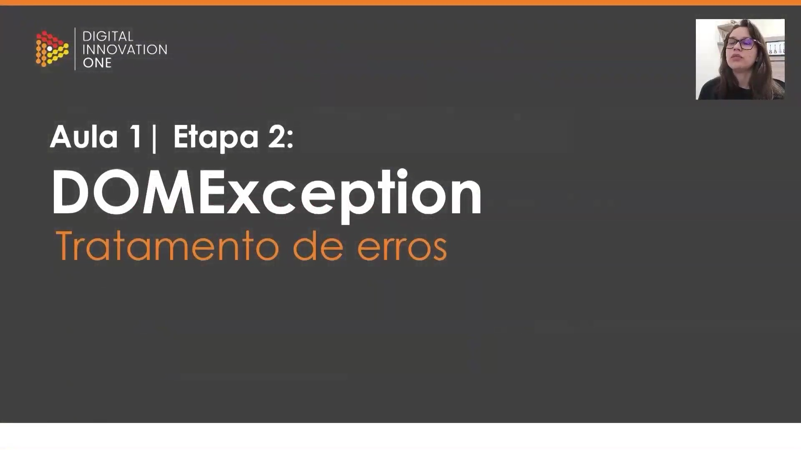
</p>

### DOMException

Na segunda etapa, abordamos a DOMException. Diferente do erro básico de script, esta exceção está estritamente ligada ao contexto da página web e à forma como o JavaScript interage com os elementos do documento (DOM).

<p align="center">
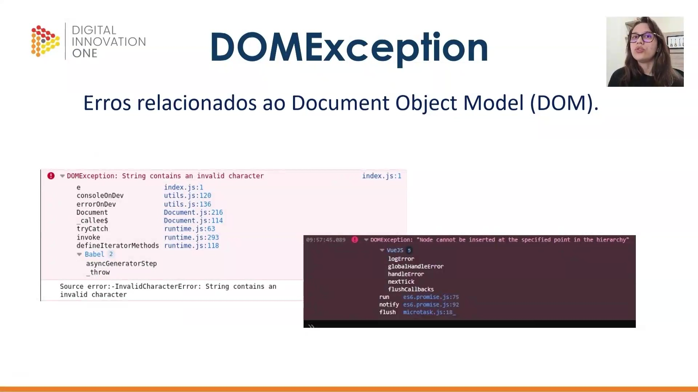
</p>

A DOMException ocorre quando há falhas na manipulação da árvore de elementos de uma página. Exemplos comuns incluem tentar inserir um nó (elemento) em um local inválido da hierarquia ou utilizar caracteres não permitidos em strings processadas pelo DOM.

```bash
DOMException: String contains an invalid character
DOMException: "Node cannot be inserted at the specified point in the hierarchy"

```

Esses erros são fundamentais para identificar problemas na estrutura da página e na forma como os dados estão sendo consumidos pelo navegador.      

# Parte 2 - Tratando Erros

## 🟩 Vídeo 03 - Throw, Try/Catch e Finally


<video width="60%" controls>
    <source src="000-Midia_e_Anexos/bootcamp_tqi_fullstack-modulo_03-Curso.07-Video_02.webm" type="video/webm" type="video/webm">
    Seu navegador não suporta vídeo HTML5.
</video>

Link do vídeo: https://web.dio.me/track/tqi-fullstack-developer/course/debugging-e-error-handling-com-javascript/learning/d98f9b27-bd6c-4f33-bc22-82bee03e5591?autoplay=1 

O vídeo explica as técnicas fundamentais para o gerenciamento de erros em JavaScript, destacando as diferenças cruciais entre os comandos return e throw. Enquanto o primeiro apenas envia uma string comum, o segundo sinaliza uma exceção real que interrompe o fluxo para indicar uma falha no sistema. O conteúdo detalha a estrutura try...catch, demonstrando como capturar e manipular esses problemas de forma organizada e personalizada. Além disso, é introduzido o bloco finally, que garante a execução de um código específico independentemente de ter ocorrido um erro ou não. Através do exemplo de uma função que verifica palíndromos, o material ilustra como essas ferramentas tornam o desenvolvimento de software mais robusto e profissional.

### Anotações

<p align="center">
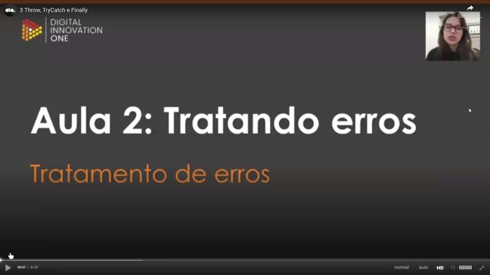
</p>

Esta imagem introduz o tema da aula focado no tratamento de erros em JavaScript, destacando os três pilares fundamentais que serão abordados: Throw, Try...Catch e Finally. O objetivo é compreender como lidar com exceções e fluxos de erro de maneira eficiente no desenvolvimento de software.

<p align="center">
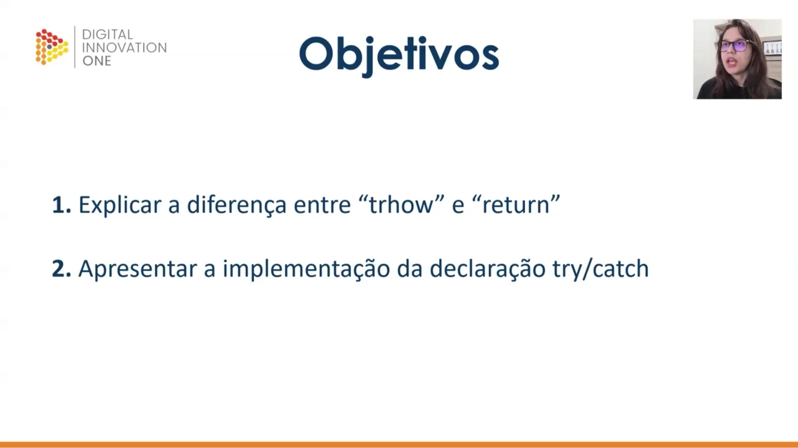
</p>

A imagem apresenta os objetivos principais desta etapa do aprendizado:

1. Explicar a diferença entre `throw` e `return`: entender como o `throw` interrompe o fluxo normal para sinalizar um erro, ao contrário do `return`, que apenas entrega um valor de saída.
2. Apresentar a implementação da declaração `try...catch`: demonstrar a sintaxe e a lógica necessária para capturar e tratar erros que possam ocorrer durante a execução do código.

<p align="center">
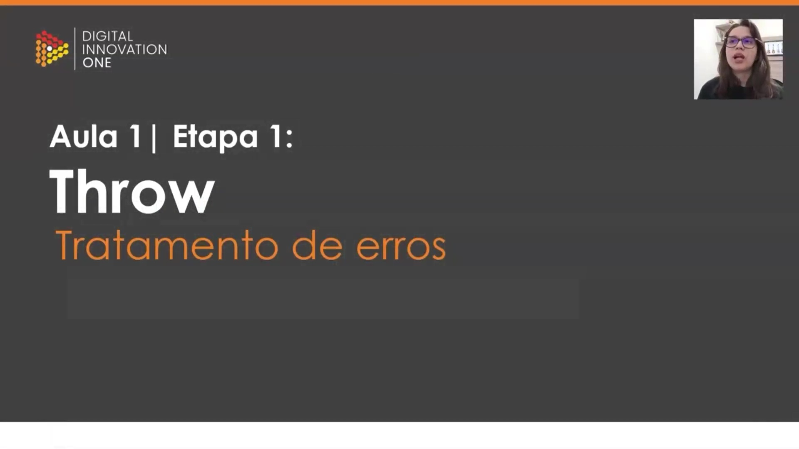
</p>

Nesta etapa, o foco inicial é a instrução Throw. Trata-se do mecanismo utilizado para "lançar" erros personalizados. Quando o interpretador encontra um `throw`, a execução da função atual é interrompida e o controle é passado para o primeiro bloco `catch` na pilha de chamadas.

<p align="center">
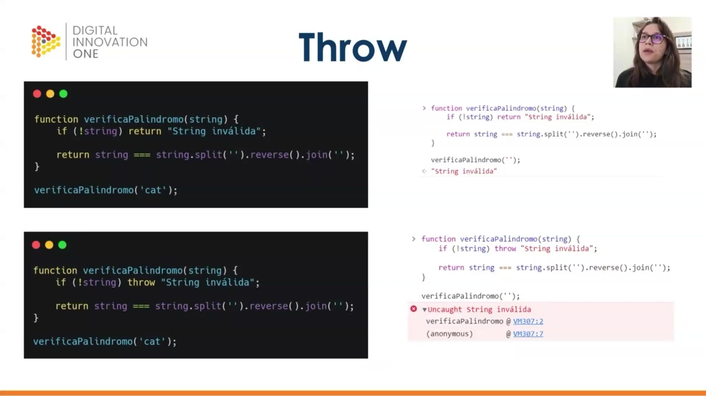
</p>

A imagem demonstra a diferença prática entre o uso de `return` e `throw` dentro de uma função que verifica palíndromos. Enquanto o `return` apenas devolve uma string informativa, o `throw` gera uma exceção que interrompe o fluxo, resultando em uma mensagem de erro no console ("Uncaught String inválida").

```javascript
function verificaPalindromo(string) {
  if (!string) throw "String inválida";

  return string === string.split('').reverse().join('');
}

verificaPalindromo('');

```

<p align="center">
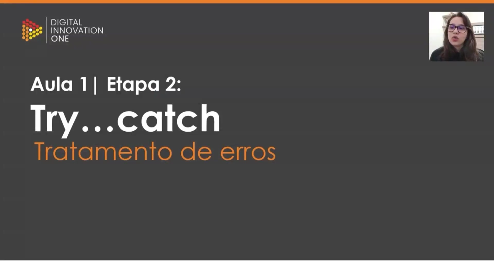
</p>

Esta etapa introduz a estrutura Try...catch. O bloco `try` contém o código que será monitorado quanto a possíveis erros, enquanto o bloco `catch` define como o sistema deve reagir caso uma exceção seja lançada durante a execução do `try`.

<p align="center">
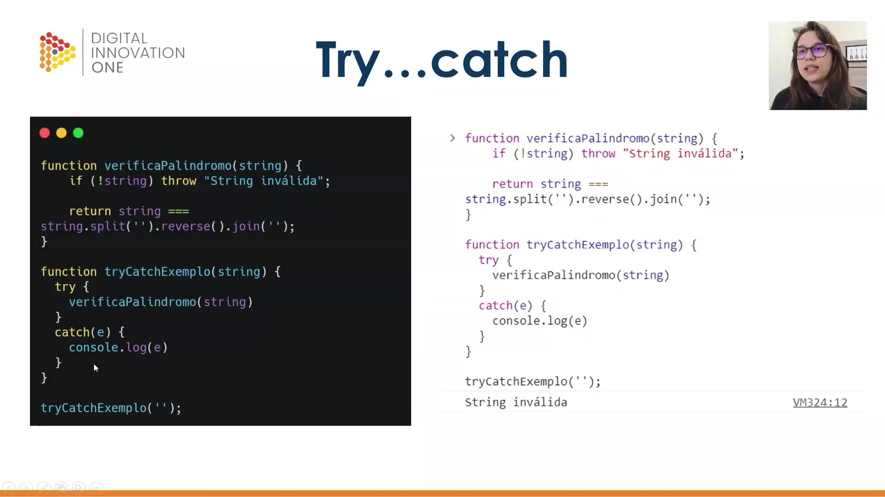
</p>

Aqui, vemos a implementação prática de uma função que encapsula a verificação de palíndromo dentro de um bloco `try...catch`. Ao ocorrer um erro na função `verificaPalindromo`, o fluxo é desviado para o `catch`, onde a variável `e` (que armazena o erro lançado) é exibida no console de forma controlada através de um `console.log(e)`.

```javascript
function verificaPalindromo(string) {
  if (!string) throw "String inválida";
  return string === string.split('').reverse().join('');
}

function tryCatchExemplo(string) {
  try {
    verificaPalindromo(string)
  }
  catch(e) {
    console.log(e)
  }
}

tryCatchExemplo('');

```

<p align="center">
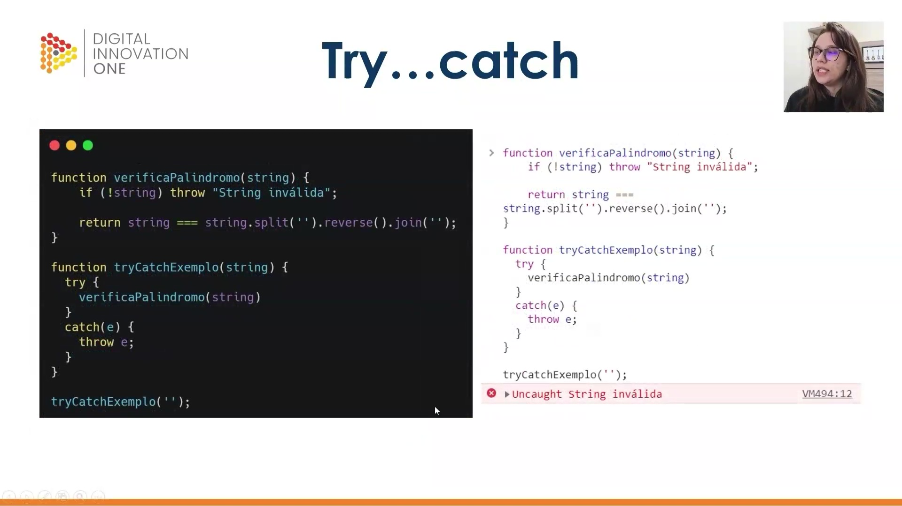
</p>

Neste exemplo, o tratamento de erro dentro do bloco `catch` é modificado para utilizar novamente a instrução `throw`. Isso faz com que o erro capturado seja "relançado", permitindo que o navegador registre a falha formalmente com o ícone vermelho de alerta no console, em vez de apenas imprimir uma mensagem comum.

```javascript
function verificaPalindromo(string) {
  if (!string) throw "String inválida";
  return string === string.split('').reverse().join('');
}

function tryCatchExemplo(string) {
  try {
    verificaPalindromo(string)
  }
  catch(e) {
    throw e;
  }
}

tryCatchExemplo('');

```

<p align="center">

</p>

A imagem apresenta a terceira etapa do tratamento de erros: o bloco Finally. Esta instrução é opcional e compõe a estrutura junto ao `try` e ao `catch`, servindo para executar ações que devem ocorrer independentemente do sucesso ou falha das operações anteriores.

<p align="center">
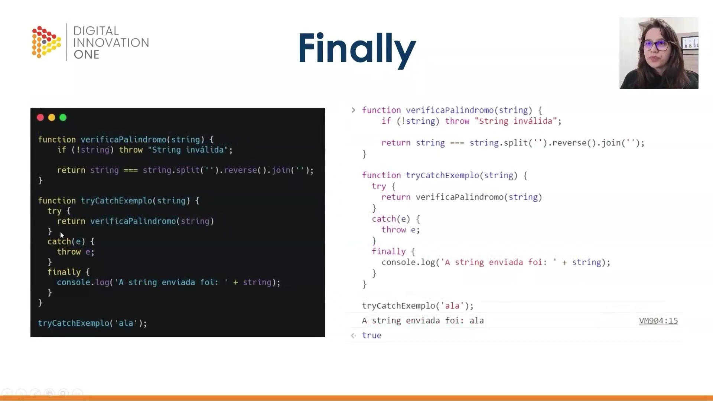
</p>

A imagem ilustra a aplicação completa da estrutura `try...catch...finally`. O bloco `finally` executa um `console.log` informando qual string foi processada. Note que, mesmo quando a função retorna com sucesso (como no caso da string "ala"), o código dentro do `finally` é executado obrigatoriamente antes da conclusão do processo.

```javascript
function verificaPalindromo(string) {
  if (!string) throw "String inválida";
  return string === string.split('').reverse().join('');
}

function tryCatchExemplo(string) {
  try {
    return verificaPalindromo(string)
  }
  catch(e) {
    throw e;
  }
  finally {
    console.log('A string enviada foi: ' + string);
  }
}

tryCatchExemplo('ala');

```      

# Parte 3 - Criando erros

## 🟩 Vídeo 04 - O objeto Error

<video width="60%" controls>
    <source src="000-Midia_e_Anexos/bootcamp_tqi_fullstack-modulo_03-Curso.07-Video_04.webm" type="video/webm" type="video/webm">
    Seu navegador não suporta vídeo HTML5.
</video>


Link do vídeo:  https://web.dio.me/track/tqi-fullstack-developer/course/debugging-e-error-handling-com-javascript/learning/345e4ebc-9020-49f6-9c56-c199c27ff60b?autoplay=1


## 🟩 Vídeo 02 - Atividade prática


Link do vídeo: 


## 🟩 Vídeo 03 - xxxxxxxxxxxxxxx


Link do vídeo: 


## 🟩 Vídeo 04 - xxxxxxxxxxxxxxx


Link do vídeo: 


## 🟩 Vídeo 05 - xxxxxxxxxxxxxxx


Link do vídeo: 


## 🟩 Vídeo 06 - xxxxxxxxxxxxxxx


Link do vídeo: 


## 🟩 Vídeo 07 - xxxxxxxxxxxxxxx


Link do vídeo: 


## 🟩 Vídeo 08 - xxxxxxxxxxxxxxx


Link do vídeo: 


## 🟩 Vídeo 09 - xxxxxxxxxxxxxxx


Link do vídeo: 


## 🟩 Vídeo 10 - xxxxxxxxxxxxxxx


Link do vídeo: 


##  Materiais de Apoio


# Certificado: Debugging e Error Handling com JavaScript

- Link na plataforma: 
- Certificado em pdf: 
