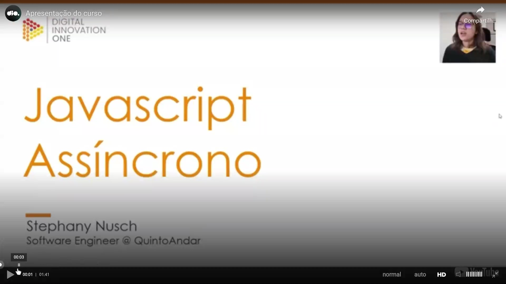
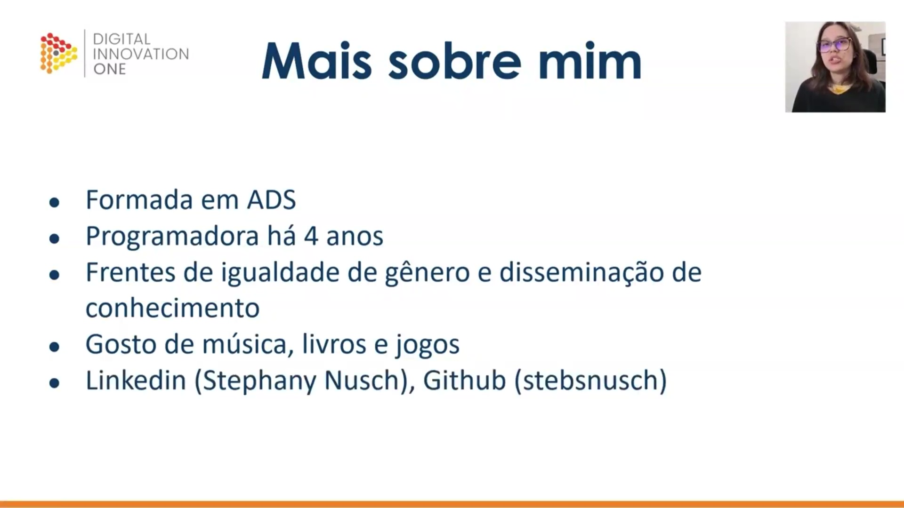
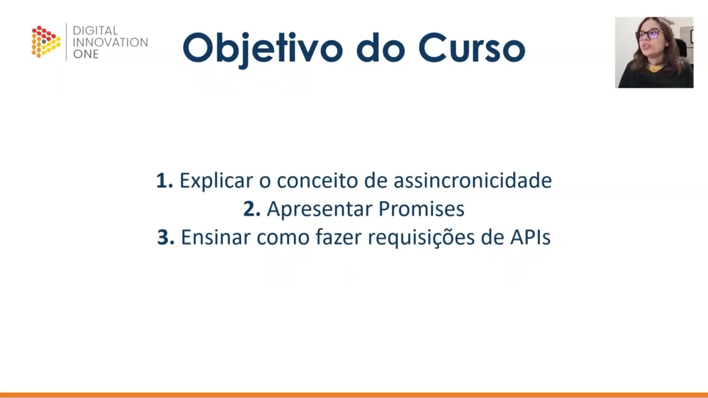
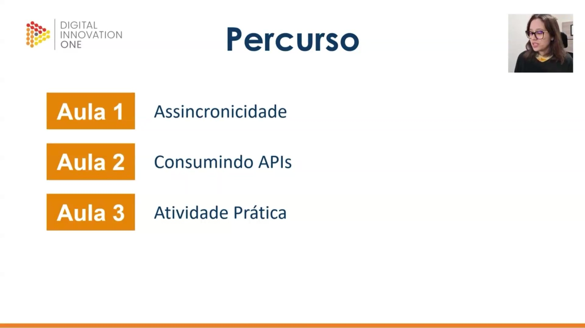

## Instrutor

- Stephany Nusch (Software Engineer at Microsoft)
- Contato Linkedin: / [stephanynusch](https://www.linkedin.com/in/stephanynusch/)

# Parte 1 - Assincronicidade

## 🟩 Vídeo 01 - Apresentação do curso

<video width="60%" controls>
  <source src="000-Midia_e_Anexos/bootcamp_tqi_fullstack-modulo_03-Curso.08-Video_01.webm" type="video/webm">
    Seu navegador não suporta vídeo HTML5.
</video>

Link do vídeo: https://web.dio.me/track/tqi-fullstack-developer/course/fundamentos-de-javascript-assincrono/learning/44d7e850-eb64-47d6-8249-6cb22b3440b3?autoplay=1

O vídeo apresenta a **introdução de um curso** focado em **JavaScript assíncrono**, ministrado pela engenheira de software **Stephanie Nushi**. A instrutora compartilha sua **trajetória profissional** e acadêmica, destacando também seu engajamento em causas de **igualdade de gênero** no setor tecnológico. O conteúdo programático abrange desde a teoria sobre **assincronicidade** e o funcionamento de **Promises** até a aplicação prática em **requisições de APIs**. Durante o aprendizado, os alunos utilizarão o **GitHub** para gerenciar códigos e contarão com suporte via **fórum e Discord**. O objetivo central é capacitar os estudantes a dominarem fluxos de dados complexos através de exercícios de **"mão na massa"**.

### Anotações

#### Apresentação do Curso

Nesta introdução, a instrutora Stephany Nusch, Engenheira de Software no QuintoAndar, apresenta o curso focado em **JavaScript Assíncrono**. O objetivo inicial é contextualizar o tema dentro do ecossistema de desenvolvimento web, preparando o terreno para os conceitos de execução não linear de código. 

#### Mais sobre mim

A instrutora compartilha sua trajetória profissional e acadêmica para estabelecer a base de conhecimento do curso: 

* **Formação:** Graduada em Análise e Desenvolvimento de Sistemas (ADS). 

* **Experiência:** Atua como programadora há 4 anos. 

* **Engajamento:** Participa ativamente em frentes voltadas à igualdade de gênero e disseminação de conhecimento técnico. 

* **Interesses:** Além da tecnologia, possui interesse em música, literatura e jogos. 

* **Conexão:** Disponibiliza perfis no LinkedIn (Stephany Nusch) e GitHub (stebsnusch), ressaltando que o GitHub será a ferramenta central para o compartilhamento dos códigos e atividades práticas propostas. 

#### Objetivo do Curso

O curso está estruturado para cobrir três pilares fundamentais do desenvolvimento moderno: 

1. **Conceito de Assincronicidade:** Compreender como o JavaScript lida com tarefas que não ocorrem instantaneamente. 

2. **Promises:** Apresentação e entendimento do objeto utilizado para gerenciar operações assíncronas. 

3. **Requisições de APIs:** Aprendizado prático sobre como realizar a comunicação entre aplicações e serviços externos. 

#### Percurso

A trilha de aprendizado é organizada de forma incremental para garantir a absorção dos conceitos antes da aplicação: 

* **Aula 1 - Assincronicidade:** Base teórica sobre o funcionamento assíncrono. 

* **Aula 2 - Consumindo APIs:** Aplicação técnica dos conceitos de Promises e comunicação de rede. 

* **Aula 3 - Atividade Prática:** Momento de "mão na massa" para consolidar todo o conhecimento adquirido através de um exercício real. 

Dúvidas podem ser sanadas diretamente no fórum da plataforma ou através da comunidade oficial no Discord.      

## 🟩 Vídeo 02 - xxxxxxxxxxxxxxx

Link do vídeo: https://web.dio.me/track/tqi-fullstack-developer/course/fundamentos-de-javascript-assincrono/learning/cb0f4799-9865-496a-a94a-7236ff842f6b?autoplay=1

## 🟩 Vídeo 03 - xxxxxxxxxxxxxxx

Link do vídeo: 

## 🟩 Vídeo 04 - xxxxxxxxxxxxxxx

Link do vídeo: 

## 🟩 Vídeo 05 - xxxxxxxxxxxxxxx

Link do vídeo: 

## 🟩 Vídeo 06 - xxxxxxxxxxxxxxx

Link do vídeo: 

## 🟩 Vídeo 07 - xxxxxxxxxxxxxxx

Link do vídeo: 

## 🟩 Vídeo 08 - xxxxxxxxxxxxxxx

Link do vídeo: 

## 🟩 Vídeo 09 - xxxxxxxxxxxxxxx

Link do vídeo: 

## 🟩 Vídeo 10 - xxxxxxxxxxxxxxx

Link do vídeo: 

# Parte 2 - xxxxxxxxxxxxxxx

## 🟩 Vídeo 01 - xxxxxxxxxxxxxxx

Link do vídeo:  

## 🟩 Vídeo 02 - xxxxxxxxxxxxxxx

Link do vídeo: 

## 🟩 Vídeo 03 - xxxxxxxxxxxxxxx

Link do vídeo: 

## 🟩 Vídeo 04 - xxxxxxxxxxxxxxx

Link do vídeo: 

## 🟩 Vídeo 05 - xxxxxxxxxxxxxxx

Link do vídeo: 

## 🟩 Vídeo 06 - xxxxxxxxxxxxxxx

Link do vídeo: 

## 🟩 Vídeo 07 - xxxxxxxxxxxxxxx

Link do vídeo: 

## 🟩 Vídeo 08 - xxxxxxxxxxxxxxx

Link do vídeo: 

## 🟩 Vídeo 09 - xxxxxxxxxxxxxxx

Link do vídeo: 

## 🟩 Vídeo 10 - xxxxxxxxxxxxxxx

Link do vídeo: 

# Parte 3 - xxxxxxxxxxxxxxx

## 🟩 Vídeo 01 - Exxxxxxxxxxxxxxx

Link do vídeo:  

## 🟩 Vídeo 02 - xxxxxxxxxxxxxxx

Link do vídeo: 

## 🟩 Vídeo 03 - xxxxxxxxxxxxxxx

Link do vídeo: 

## 🟩 Vídeo 04 - xxxxxxxxxxxxxxx

Link do vídeo: 

## 🟩 Vídeo 05 - xxxxxxxxxxxxxxx

Link do vídeo: 

## 🟩 Vídeo 06 - xxxxxxxxxxxxxxx

Link do vídeo: 

## 🟩 Vídeo 07 - xxxxxxxxxxxxxxx

Link do vídeo: 

## 🟩 Vídeo 08 - xxxxxxxxxxxxxxx

Link do vídeo: 

## 🟩 Vídeo 09 - xxxxxxxxxxxxxxx

Link do vídeo: 

## 🟩 Vídeo 10 - xxxxxxxxxxxxxxx

Link do vídeo: 

##  Materiais de Apoio

# Certificado: 

- Link na plataforma: 
- Certificado em pdf: 
