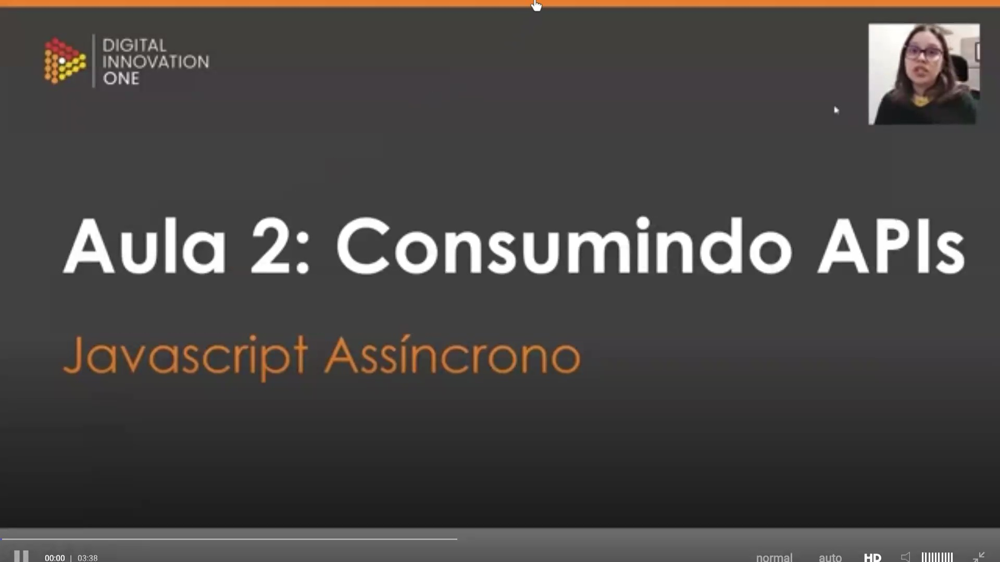
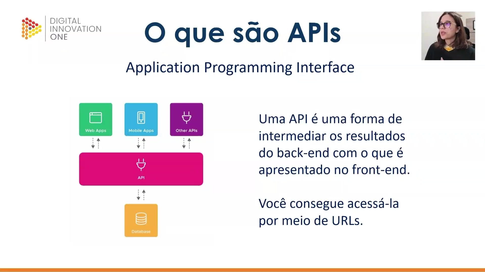
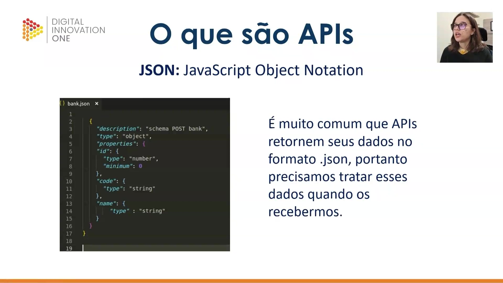
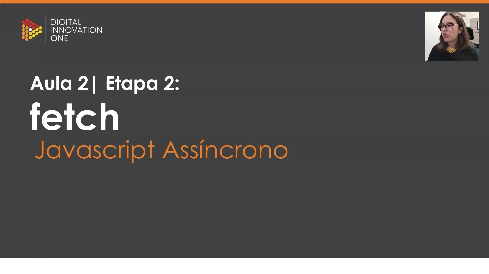
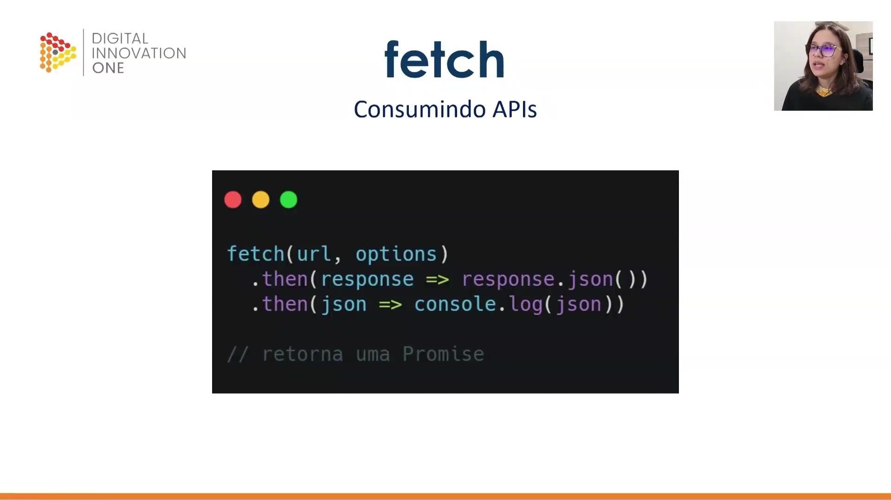
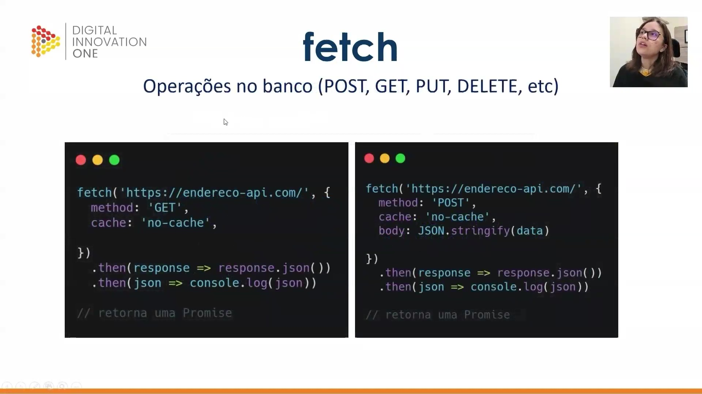

## Instrutor

- Stephany Nusch (Software Engineer at Microsoft)
- Contato Linkedin: / [stephanynusch](https://www.linkedin.com/in/stephanynusch/)

# Parte 1 - Assincronicidade

## 🟩 Vídeo 01 - Apresentação do curso

<video width="60%" controls>
  <source src="000-Midia_e_Anexos/bootcamp_tqi_fullstack-modulo_03-Curso.08-Video_01.webm" type="video/webm">
    Seu navegador não suporta vídeo HTML5.
</video>

Link do vídeo: https://web.dio.me/track/tqi-fullstack-developer/course/fundamentos-de-javascript-assincrono/learning/44d7e850-eb64-47d6-8249-6cb22b3440b3?autoplay=1

O vídeo apresenta a **introdução de um curso** focado em **JavaScript assíncrono**, ministrado pela engenheira de software **Stephanie Nushi**. A instrutora compartilha sua **trajetória profissional** e acadêmica, destacando também seu engajamento em causas de **igualdade de gênero** no setor tecnológico. O conteúdo programático abrange desde a teoria sobre **assincronicidade** e o funcionamento de **Promises** até a aplicação prática em **requisições de APIs**. Durante o aprendizado, os alunos utilizarão o **GitHub** para gerenciar códigos e contarão com suporte via **fórum e Discord**. O objetivo central é capacitar os estudantes a dominarem fluxos de dados complexos através de exercícios de **"mão na massa"**.

### Anotações

#### Apresentação do Curso

<p align="center">

</p>

Nesta introdução, a instrutora Stephany Nusch, Engenheira de Software no QuintoAndar, apresenta o curso focado em **JavaScript Assíncrono**. O objetivo inicial é contextualizar o tema dentro do ecossistema de desenvolvimento web, preparando o terreno para os conceitos de execução não linear de código. 

#### Mais sobre mim

<p align="center">

</p>

A instrutora compartilha sua trajetória profissional e acadêmica para estabelecer a base de conhecimento do curso: 

* **Formação:** Graduada em Análise e Desenvolvimento de Sistemas (ADS). 

* **Experiência:** Atua como programadora há 4 anos. 

* **Engajamento:** Participa ativamente em frentes voltadas à igualdade de gênero e disseminação de conhecimento técnico. 

* **Interesses:** Além da tecnologia, possui interesse em música, literatura e jogos. 

* **Conexão:** Disponibiliza perfis no LinkedIn (Stephany Nusch) e GitHub (stebsnusch), ressaltando que o GitHub será a ferramenta central para o compartilhamento dos códigos e atividades práticas propostas. 


#### Objetivo do Curso

<p align="center">

</p>

O curso está estruturado para cobrir três pilares fundamentais do desenvolvimento moderno: 

1. **Conceito de Assincronicidade:** Compreender como o JavaScript lida com tarefas que não ocorrem instantaneamente. 

2. **Promises:** Apresentação e entendimento do objeto utilizado para gerenciar operações assíncronas. 

3. **Requisições de APIs:** Aprendizado prático sobre como realizar a comunicação entre aplicações e serviços externos. 


#### Percurso

<p align="center">

</p>

A trilha de aprendizado é organizada de forma incremental para garantir a absorção dos conceitos antes da aplicação: 

* **Aula 1 - Assincronicidade:** Base teórica sobre o funcionamento assíncrono. 

* **Aula 2 - Consumindo APIs:** Aplicação técnica dos conceitos de Promises e comunicação de rede. 

* **Aula 3 - Atividade Prática:** Momento de "mão na massa" para consolidar todo o conhecimento adquirido através de um exercício real. 

Dúvidas podem ser sanadas diretamente no fórum da plataforma ou através da comunidade oficial no Discord.      


## 🟩 Vídeo 02 - xxxxxxxxxxxxxxx

<video width="60%" controls>
  <source src="000-Midia_e_Anexos/bootcamp_tqi_fullstack-modulo_03-Curso.08-Video_02.webm" type="video/webm">
    Seu navegador não suporta vídeo HTML5.
</video>

Link do vídeo: https://web.dio.me/track/tqi-fullstack-developer/course/fundamentos-de-javascript-assincrono/learning/cb0f4799-9865-496a-a94a-7236ff842f6b?autoplay=1

O vídeo explica o conceito de **assincronidade** no desenvolvimento com JavaScript, contrastando processos que ocorrem em sequência com tarefas que podem ser executadas em paralelo. O autor utiliza a analogia de um ingresso de cinema para descrever **Promises**, objetos que representam valores futuros ainda pendentes, podendo ser eventualmente resolvidos ou rejeitados. O material detalha como manipular esses estados utilizando os métodos **.then()** e **.catch()** para tratar sucessos ou falhas. Além disso, destaca-se a importância das palavras-chave **async** e **await**, que permitem pausar a execução do código até que uma promessa seja finalizada. Por fim, o texto reforça que o uso de **try/catch** é uma prática recomendada para gerenciar erros dentro dessas funções assíncronas.

### Anotações

<p align="center">

</p>

Esta imagem marca o início da aula sobre **Javascript Assíncrono**, abordando definições fundamentais, o uso de **Promises** e as palavras-chave `async` e `await`. O curso foca em como lidar com operações que não ocorrem simultaneamente, permitindo que o código continue executando enquanto aguarda o processamento de outras tarefas.

<p align="center">

</p>

Os objetivos principais desta etapa do aprendizado são:

1. Compreender a definição e o funcionamento das **Promises**.

2. Aprender as técnicas para manipular essas promessas no código.

3. Dominar a sintaxe e a aplicação prática de `async` e `await` para simplificar o fluxo assíncrono.

<p align="center">

</p>

A primeira etapa foca na **Definição** do que é o Javascript Assíncrono. Antes de avançar para a sintaxe, é fundamental entender o conceito base de como o motor do Javascript gerencia tarefas que demandam tempo sem bloquear a execução do programa principal.

<p align="center">

</p>

Conceitualmente, o termo **Assíncrono** refere-se a algo "que não ocorre ou não se efetiva ao mesmo tempo". Fazendo uma analogia com o aprendizado remoto (Remote Learning), o modelo síncrono exige que todos estejam online ao mesmo tempo, enquanto o modelo assíncrono permite que os estudantes realizem as atividades em seu próprio ritmo, sem depender de uma escala temporal rígida.

<p align="center">

</p>

Embora o Javascript rode nativamente de maneira síncrona, o modelo assíncrono é essencial para a web. No modelo **Síncrono**, o cliente faz uma requisição e fica parado esperando a resposta do servidor. Já no modelo **Assíncrono**, o cliente faz a requisição, continua trabalhando em outras tarefas e, somente quando recebe a resposta, executa a ação correspondente.

<p align="center">

</p>

A segunda etapa da aula introduz as **Promises**, que são a base moderna para lidar com essa assincronicidade no Javascript. Elas permitem estruturar o código de forma que possamos prever o que acontecerá quando uma operação for concluída com sucesso ou falhar.

<p align="center">

</p>

Uma **Promise** é um objeto de processamento assíncrono. Inicialmente, seu valor é desconhecido (estado **Pending**). Ela pode evoluir para dois desfechos:

* **Resolved**: Sucesso, onde utilizamos o método `.then()` para tratar o resultado.

* **Rejected**: Falha, onde utilizamos o método `.catch()` para tratar o erro.


<p align="center">

</p>

O ciclo de vida de uma Promise envolve três estados principais:

1. **Pending**: Estado inicial, quando a operação assíncrona ainda está em processamento.

2. **Fulfilled (ou Resolved)**: Quando a operação é concluída com sucesso, retornando um valor.

3. **Rejected**: Quando a operação falha, retornando um motivo ou erro.
Uma vez que a Promise é resolvida ou rejeitada, dizemos que ela está **Settled** (estabelecida).

<p align="center">

</p>

A estrutura básica para criar uma Promise utiliza o construtor `new Promise`, que recebe uma função com os parâmetros `resolve` e `reject`. No exemplo abaixo, simulamos um atraso de 2 segundos antes de resolver a promessa:

```javascript
const myPromise = new Promise((resolve, reject) => {
  window.setTimeout(() => {
    resolve(console.log('Resolvida!'));
  }, 2000);
});

```

Neste caso, após o tempo determinado, o console exibirá a mensagem "Resolvida!".

<p align="center">

</p>

Para manipular os dados retornados por uma Promise, encadeamos métodos ou utilizamos `await`. O exemplo demonstra como transformar o resultado sucessivamente através de múltiplos blocos `.then()`, permitindo um fluxo de dados contínuo, e o uso do `.catch()` para capturar possíveis erros em qualquer etapa da cadeia.

```javascript
const myPromise = new Promise((resolve, reject) => {
  window.setTimeout(() => {
    resolve('Resolvida');
  }, 2000);
});

await myPromise
  .then((result) => result + ' passando pelo then')
  .then((result) => result + ' e agora acabou!')
  .catch((err) => console.log(err.message));

// Após 2 segundos, retornará o valor
// "Resolvida passando pelo then e agora acabou!"

```     

# Parte 2 - Consumindo APIs

## 🟩 Vídeo 03 - O que são APIs e Fetch

<video width="60%" controls>
  <source src="000-Midia_e_Anexos/bootcamp_tqi_fullstack-modulo_03-Curso.08-Video_03.webm" type="video/webm">
    Seu navegador não suporta vídeo HTML5.
</video>

Link do vídeo: https://web.dio.me/track/tqi-fullstack-developer/course/fundamentos-de-javascript-assincrono/learning/e2af7212-05e0-47e1-891e-d2fdad6e0249?autoplay=1

O vídeo aborda os fundamentos do **consumo de APIs** no desenvolvimento de software, definindo-as como pontes de comunicação entre o **backend e o frontend**. A aula detalha como os programadores utilizam **URLs** para acessar dados, destacando que o formato **JSON** é o padrão predominante para a troca dessas informações. O foco principal da explicação é o **método Fetch**, uma ferramenta do JavaScript que permite realizar requisições de rede e retorna **promises**. A instrutora enfatiza a importância de converter os dados recebidos e dominar o uso de **operações assíncronas** para manipular bancos de dados. Por fim, o conteúdo incentiva a prática por meio de exercícios e o suporte da comunidade para consolidar o aprendizado sobre o **gerenciamento de requisições**.

### Anotações

<p align="center">

</p>

Nesta introdução à aula sobre o consumo de APIs, o foco principal é o estudo do **JavaScript Assíncrono**. O objetivo central é compreender como realizar requisições e manipular dados que não são entregues instantaneamente, permitindo que a aplicação continue funcional enquanto aguarda respostas de servidores externos.

<p align="center">

</p>

Os objetivos estabelecidos para este módulo são divididos em três pilares fundamentais:

1. **Explicar o conceito de APIs**: Entender o papel dessas interfaces na comunicação de software.
2. **Lidar com requisições**: Aprender o fluxo de trabalho para solicitar dados de fontes externas.
3. **Apresentar o método `fetch()**`: Dominar a ferramenta nativa do JavaScript utilizada para realizar essas chamadas assíncronas.

<p align="center">

</p>

**API** é a sigla para *Application Programming Interface* (Interface de Programação de Aplicações). Ela atua como um intermediário que conecta o **back-end** (onde os dados residem, como em um Database) ao **front-end** (Web Apps ou Mobile Apps). A comunicação é feita por meio de **URLs**, que funcionam como endereços onde os dados podem ser acessados ou enviados, permitindo inclusive que diferentes APIs se comuniquem entre si.

<p align="center">

</p>

O formato de dados mais comum no consumo de APIs é o **JSON** (*JavaScript Object Notation*). Ele utiliza uma estrutura de objetos JavaScript (chave e valor) para organizar as informações de maneira leve e legível. Abaixo, observa-se um exemplo de esquema para um arquivo `bank.json`:

```json
{
  "description": "schema POST bank",
  "type": "object",
  "properties": {
    "id": {
      "type": "number",
      "minimum": 0
    },
    "code": {
      "type": "string"
    },
    "name": {
      "type": "string"
    }
  }
}

```

Como as APIs frequentemente retornam dados nesse formato, é fundamental realizar o tratamento adequado para converter essas informações em objetos manipuláveis dentro do código.

<p align="center">

</p>

A etapa prática do consumo de dados foca no método **fetch**. Ele é o recurso padrão do JavaScript Moderno para realizar requisições assíncronas, substituindo métodos mais antigos e complexos.

<p align="center">

</p>

O método `fetch()` recebe a URL do recurso desejado e um objeto opcional de configurações. Um ponto crucial é que o **fetch retorna uma Promise**. Isso permite o uso do encadeamento com `.then()`. O primeiro passo do encadeamento geralmente é converter a resposta bruta em JSON para que o JavaScript consiga processar os dados:

```javascript
fetch(url, options)
  .then(response => response.json())
  .then(json => console.log(json))

// retorna uma Promise

```

<p align="center">

</p>

O `fetch` permite realizar diversas operações no banco de dados através dos métodos HTTP. Quando realizamos um **GET**, buscamos informações; já no **POST**, enviamos dados para gravação. No caso do POST, é necessário transformar o objeto de dados em uma string JSON antes do envio, utilizando `JSON.stringify()`.

**Exemplo de GET:**

```javascript
fetch('https://endereco-api.com/', {
  method: 'GET',
  cache: 'no-cache',
})
.then(response => response.json())
.then(json => console.log(json))
// retorna uma Promise

```

**Exemplo de POST:**

```javascript
fetch('https://endereco-api.com/', {
  method: 'POST',
  cache: 'no-cache',
  body: JSON.stringify(data)
})
.then(response => response.json())
.then(json => console.log(json))
// retorna uma Promise

```

Lembre-se sempre de tratar os dados tanto no recebimento quanto no envio, garantindo a compatibilidade entre o front-end e a API.
      

## 🟩 Vídeo 04 - Atividade prática

<video width="60%" controls>
  <source src="000-Midia_e_Anexos/bootcamp_tqi_fullstack-modulo_03-Curso.08-Video_04.webm" type="video/webm">
    Seu navegador não suporta vídeo HTML5.
</video>

Link do vídeo: 


# Certificado: Fundamentos de JavaScript Assíncrono

- Link na plataforma: 
- Certificado em pdf: 
