## Instrutor

- Stephany Nusch (Software Engineer at Microsoft)
- Contato Linkedin: / [stephanynusch](https://www.linkedin.com/in/stephanynusch/)

# Parte 1 - Assincronicidade

## 🟩 Vídeo 01 - Apresentação do curso

<video width="60%" controls>
  <source src="000-Midia_e_Anexos/bootcamp_tqi_fullstack-modulo_03-Curso.08-Video_01.webm" type="video/webm">
    Seu navegador não suporta vídeo HTML5.
</video>

Link do vídeo: https://web.dio.me/track/tqi-fullstack-developer/course/fundamentos-de-javascript-assincrono/learning/44d7e850-eb64-47d6-8249-6cb22b3440b3?autoplay=1

O vídeo apresenta a **introdução de um curso** focado em **JavaScript assíncrono**, ministrado pela engenheira de software **Stephanie Nushi**. A instrutora compartilha sua **trajetória profissional** e acadêmica, destacando também seu engajamento em causas de **igualdade de gênero** no setor tecnológico. O conteúdo programático abrange desde a teoria sobre **assincronicidade** e o funcionamento de **Promises** até a aplicação prática em **requisições de APIs**. Durante o aprendizado, os alunos utilizarão o **GitHub** para gerenciar códigos e contarão com suporte via **fórum e Discord**. O objetivo central é capacitar os estudantes a dominarem fluxos de dados complexos através de exercícios de **"mão na massa"**.

### Anotações

#### Apresentação do Curso

<p align="center">

</p>

Nesta introdução, a instrutora Stephany Nusch, Engenheira de Software no QuintoAndar, apresenta o curso focado em **JavaScript Assíncrono**. O objetivo inicial é contextualizar o tema dentro do ecossistema de desenvolvimento web, preparando o terreno para os conceitos de execução não linear de código. 

#### Mais sobre mim

<p align="center">

</p>

A instrutora compartilha sua trajetória profissional e acadêmica para estabelecer a base de conhecimento do curso: 

* **Formação:** Graduada em Análise e Desenvolvimento de Sistemas (ADS). 

* **Experiência:** Atua como programadora há 4 anos. 

* **Engajamento:** Participa ativamente em frentes voltadas à igualdade de gênero e disseminação de conhecimento técnico. 

* **Interesses:** Além da tecnologia, possui interesse em música, literatura e jogos. 

* **Conexão:** Disponibiliza perfis no LinkedIn (Stephany Nusch) e GitHub (stebsnusch), ressaltando que o GitHub será a ferramenta central para o compartilhamento dos códigos e atividades práticas propostas. 


#### Objetivo do Curso

<p align="center">

</p>

O curso está estruturado para cobrir três pilares fundamentais do desenvolvimento moderno: 

1. **Conceito de Assincronicidade:** Compreender como o JavaScript lida com tarefas que não ocorrem instantaneamente. 

2. **Promises:** Apresentação e entendimento do objeto utilizado para gerenciar operações assíncronas. 

3. **Requisições de APIs:** Aprendizado prático sobre como realizar a comunicação entre aplicações e serviços externos. 


#### Percurso

<p align="center">

</p>

A trilha de aprendizado é organizada de forma incremental para garantir a absorção dos conceitos antes da aplicação: 

* **Aula 1 - Assincronicidade:** Base teórica sobre o funcionamento assíncrono. 

* **Aula 2 - Consumindo APIs:** Aplicação técnica dos conceitos de Promises e comunicação de rede. 

* **Aula 3 - Atividade Prática:** Momento de "mão na massa" para consolidar todo o conhecimento adquirido através de um exercício real. 

Dúvidas podem ser sanadas diretamente no fórum da plataforma ou através da comunidade oficial no Discord.      


## 🟩 Vídeo 02 - xxxxxxxxxxxxxxx

<video width="60%" controls>
  <source src="000-Midia_e_Anexos/bootcamp_tqi_fullstack-modulo_03-Curso.08-Video_02.webm" type="video/webm">
    Seu navegador não suporta vídeo HTML5.
</video>

Link do vídeo: https://web.dio.me/track/tqi-fullstack-developer/course/fundamentos-de-javascript-assincrono/learning/cb0f4799-9865-496a-a94a-7236ff842f6b?autoplay=1

O vídeo explica o conceito de **assincronidade** no desenvolvimento com JavaScript, contrastando processos que ocorrem em sequência com tarefas que podem ser executadas em paralelo. O autor utiliza a analogia de um ingresso de cinema para descrever **Promises**, objetos que representam valores futuros ainda pendentes, podendo ser eventualmente resolvidos ou rejeitados. O material detalha como manipular esses estados utilizando os métodos **.then()** e **.catch()** para tratar sucessos ou falhas. Além disso, destaca-se a importância das palavras-chave **async** e **await**, que permitem pausar a execução do código até que uma promessa seja finalizada. Por fim, o texto reforça que o uso de **try/catch** é uma prática recomendada para gerenciar erros dentro dessas funções assíncronas.

### Anotações

<p align="center">
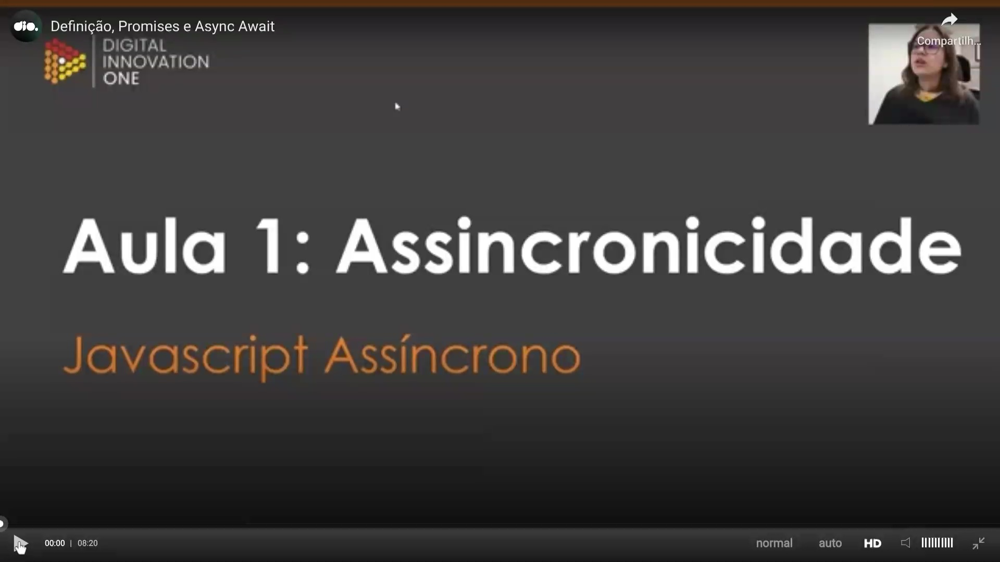
</p>

Nesta introdução, definimos os objetivos principais do estudo sobre **assincronicidade**. O foco da aula está em compreender o que são **Promises**, aprender como manipulá-las de forma eficiente e dominar o uso das palavras-chave `async` e `await` para o controle de fluxo em JavaScript.

<p align="center">
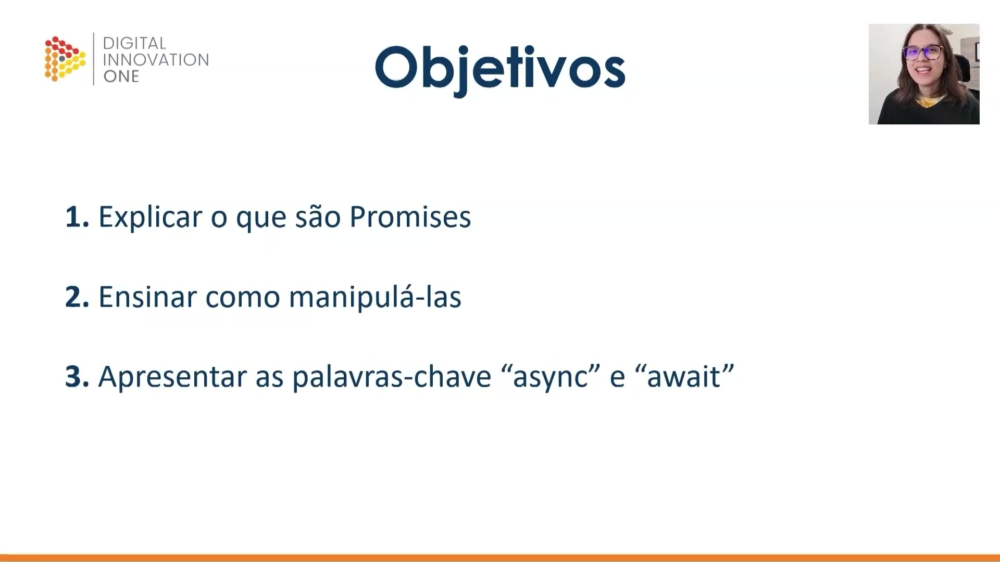
</p>

O conceito de **assincronicidade** refere-se a processos que não ocorrem ou não se efetivam ao mesmo tempo. No cotidiano, um exemplo claro é o aprendizado online (pandemia): enquanto no modelo síncrono todos os alunos devem estar presentes simultaneamente em um local, no modelo assíncrono o estudante consome o conteúdo e realiza as atividades no seu próprio ritmo, sem depender da presença imediata de outros.

<p align="center">
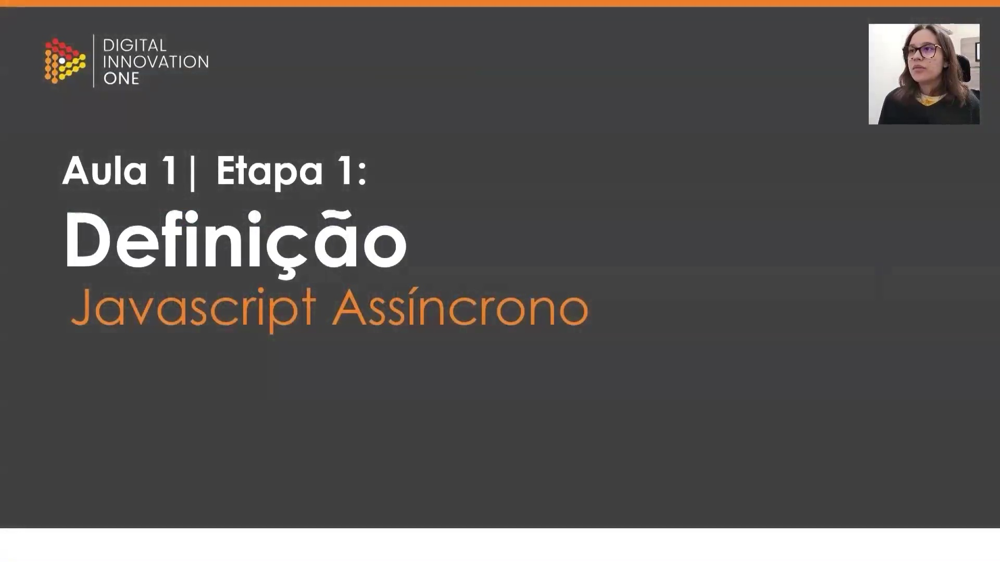
</p>

Por padrão, o JavaScript opera de maneira **síncrona**, onde um processo só começa após o término do anterior. Já no modelo **assíncrono**, é possível iniciar uma tarefa e realizar outras operações simultaneamente, sem bloquear a execução do código enquanto aguarda a finalização daquele processo específico.

<p align="center">
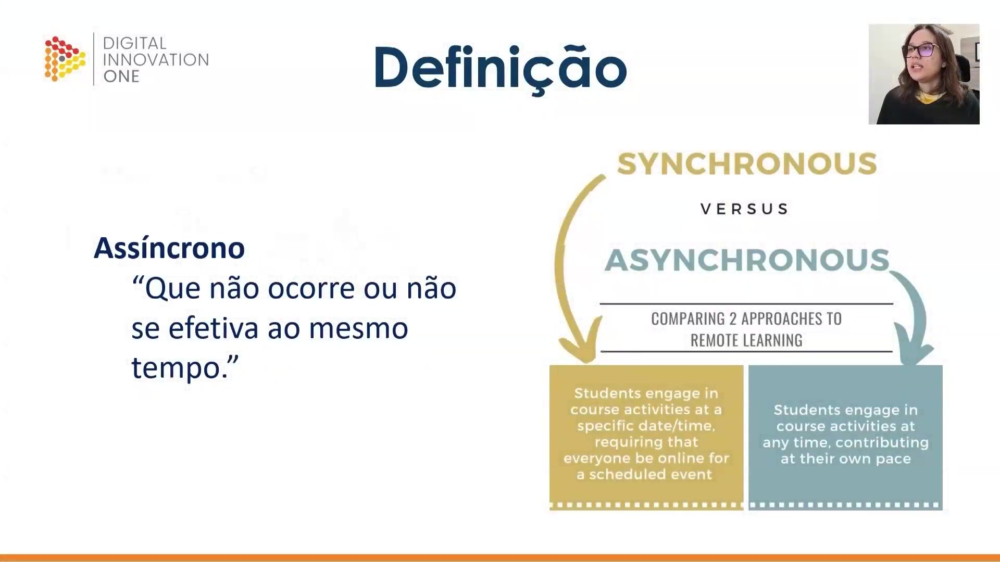
</p>

Uma **Promise** (promessa) é um objeto de processamento assíncrono cujo valor inicial é desconhecido. Analogamente a um ingresso de cinema, a Promise representa a garantia de que algo acontecerá no futuro, mas o resultado final — assistir ao filme ou ter a sessão cancelada — só será conhecido após um determinado tempo.

<p align="center">
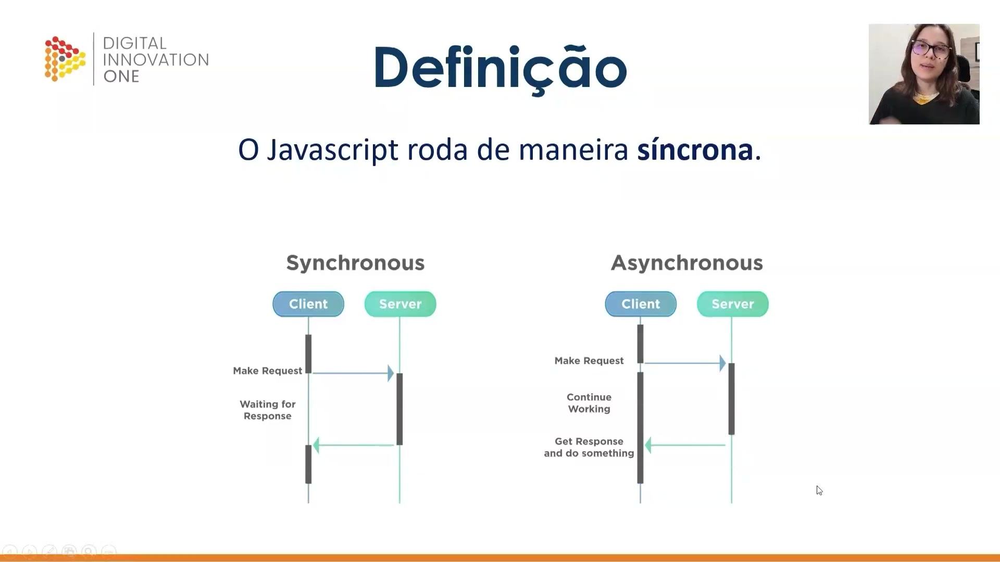
</p>

As Promises possuem três estados fundamentais que definem seu ciclo de vida:

* **Pending (Pendente):** Estado inicial, quando a promessa foi declarada mas ainda não foi resolvida ou rejeitada.
* **Fulfilled (Completada):** Quando a operação foi realizada com sucesso.
* **Rejected (Rejeitada):** Quando a operação falhou ou algum erro ocorreu.

<p align="center">
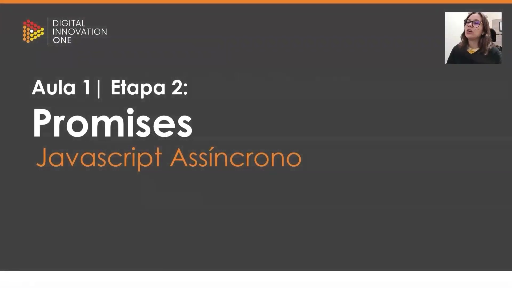
</p>

A estrutura básica para criar uma Promise envolve o uso do construtor `new Promise`, que recebe uma função de callback com dois parâmetros: `resolve` e `reject`. Estes parâmetros são funções chamadas para concluir a promessa com sucesso ou erro, respectivamente.

<p align="center">
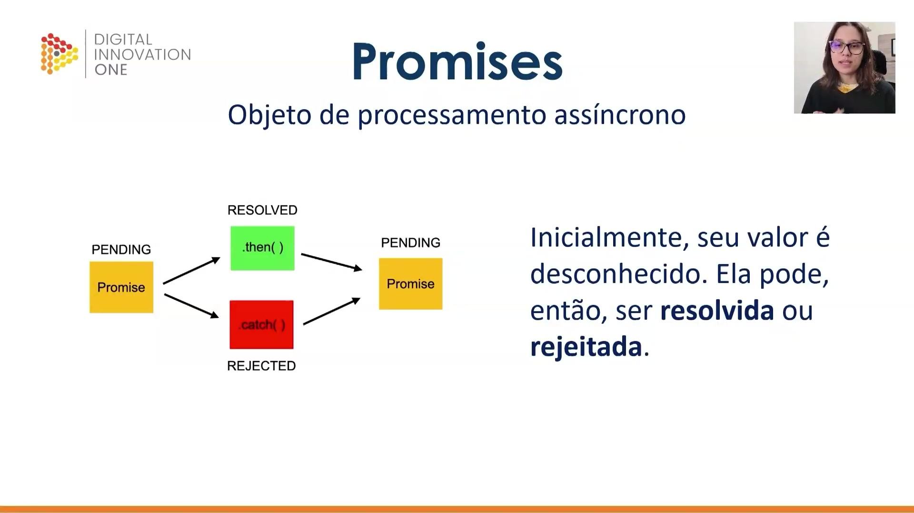
</p>

```javascript
const myPromise = new Promise((resolve, reject) => {
    window.setTimeout(() => {
        resolve('Resolvida');
    }, 2000);
});

```

Neste exemplo, a Promise é configurada para ser resolvida após 2 segundos (utilizando `setTimeout`) com a string "Resolvida". Se consultarmos o valor de `myPromise` imediatamente após a criação, ele constará como pendente.

<p align="center">
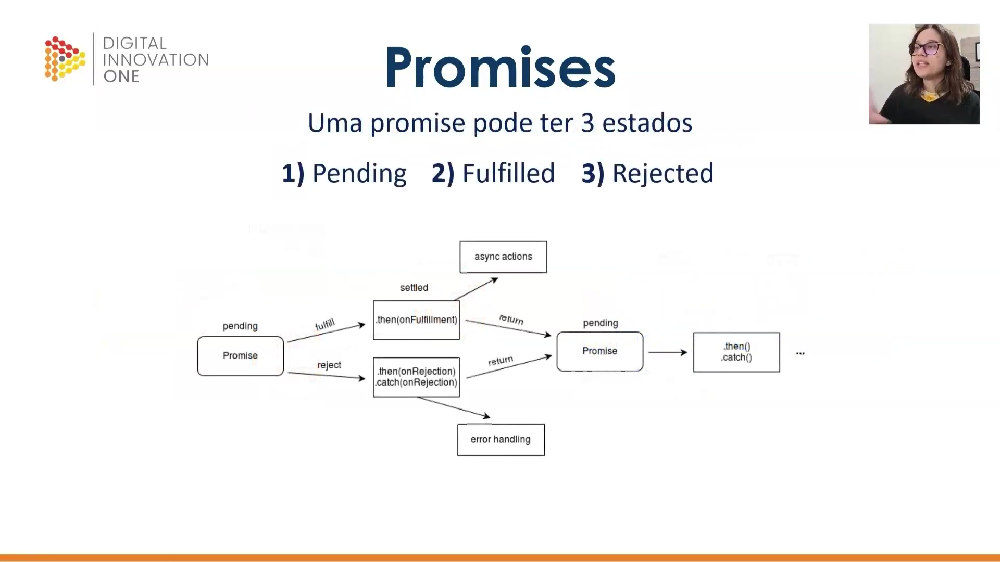
</p>

```javascript
await myPromise
    .then((result) => result + ' passando pelo then')
    .then((result) => result + ' e agora acabou')
    .catch((err) => console.log(err.message));

```

É possível encadear chamadas utilizando o método `.then()`. Quando a Promise é resolvida, o resultado passa por cada bloco `.then()`, permitindo transformações sequenciais nos dados. O método `.catch()` é utilizado para capturar e tratar qualquer erro que ocorra durante o processo.

<p align="center">
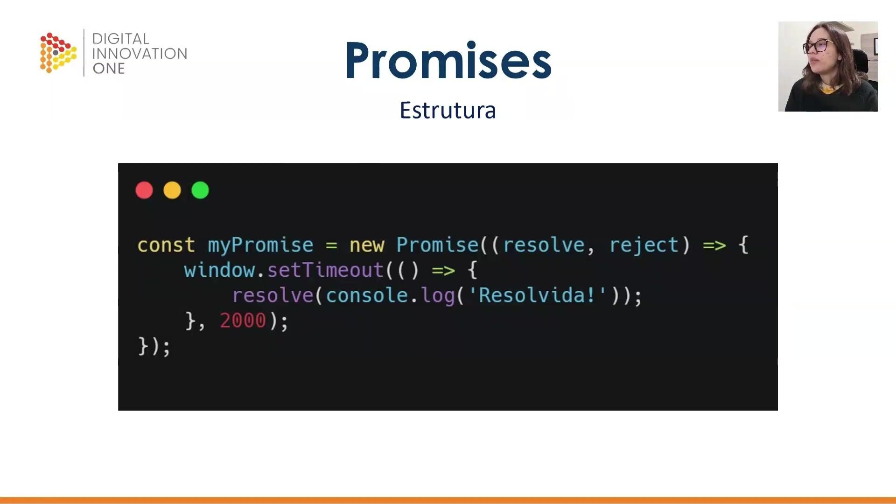
</p>

As palavras-chave `async` e `await` foram criadas para simplificar o trabalho com Promises. Uma função marcada como `async` indica que ela lida com operações assíncronas, permitindo o uso do `await` em seu interior.

<p align="center">
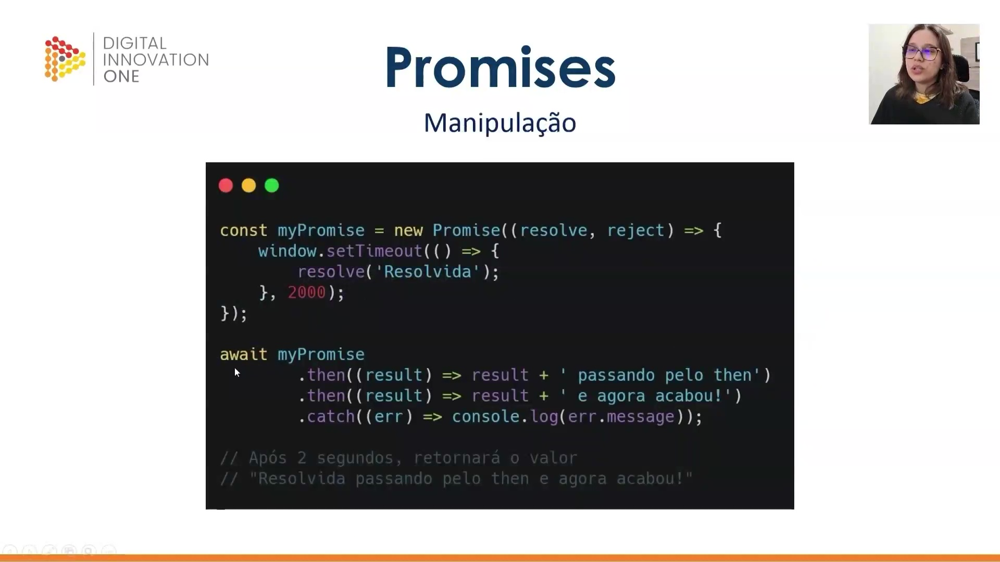
</p>

O `await` instrui o JavaScript a pausar a execução da função assíncrona até que a Promise seja resolvida. Isso garante que o código subsequente só seja executado com o resultado em mãos, evitando que o fluxo síncrono tente utilizar um dado que ainda não chegou.

<p align="center">
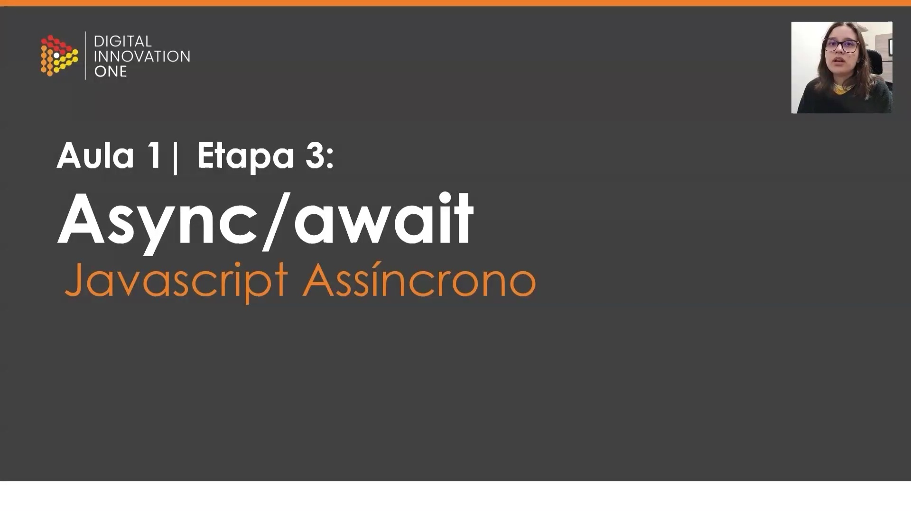
</p>

Ao utilizar `async` e `await`, a manipulação de Promises torna-se mais legível, assemelhando-se ao código síncrono tradicional, mas mantendo os benefícios da execução não bloqueante.

<p align="center">
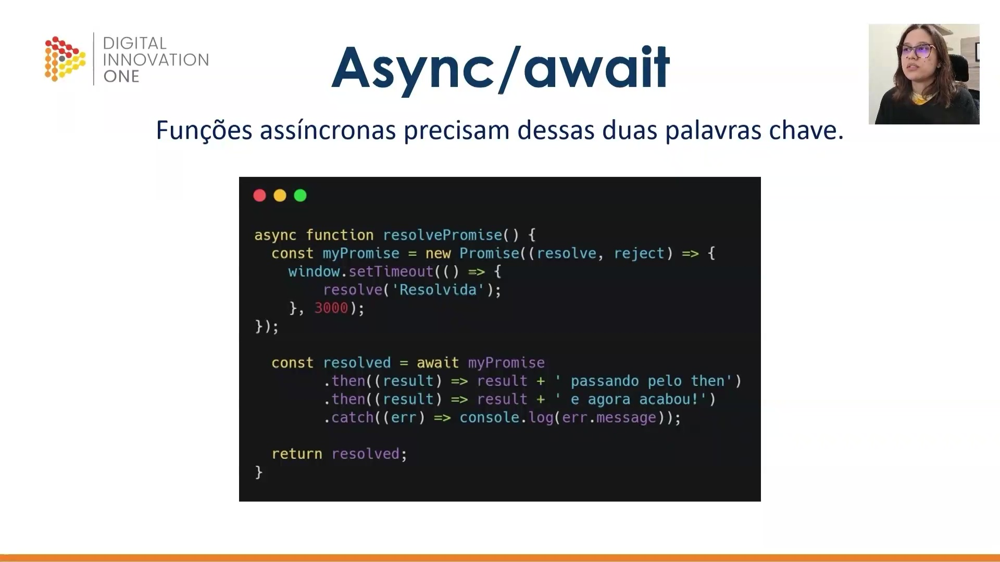
</p>

```javascript
async function resolvePromise() {
    const myPromise = new Promise((resolve, reject) => {
        window.setTimeout(() => {
            resolve('Resolvida');
        }, 3000);
    });

    const resolved = await myPromise
        .then((result) => result + ' passando pelo then')
        .then((result) => result + ' e agora acabou')
        .catch((err) => console.log(err.message));
        
    return resolved;
}

```

Neste exemplo prático, a função `resolvePromise` aguarda a resolução da Promise interna e o processamento de seus encadeamentos (`.then`) antes de retornar o valor final para a constante `resolved`.

<p align="center">
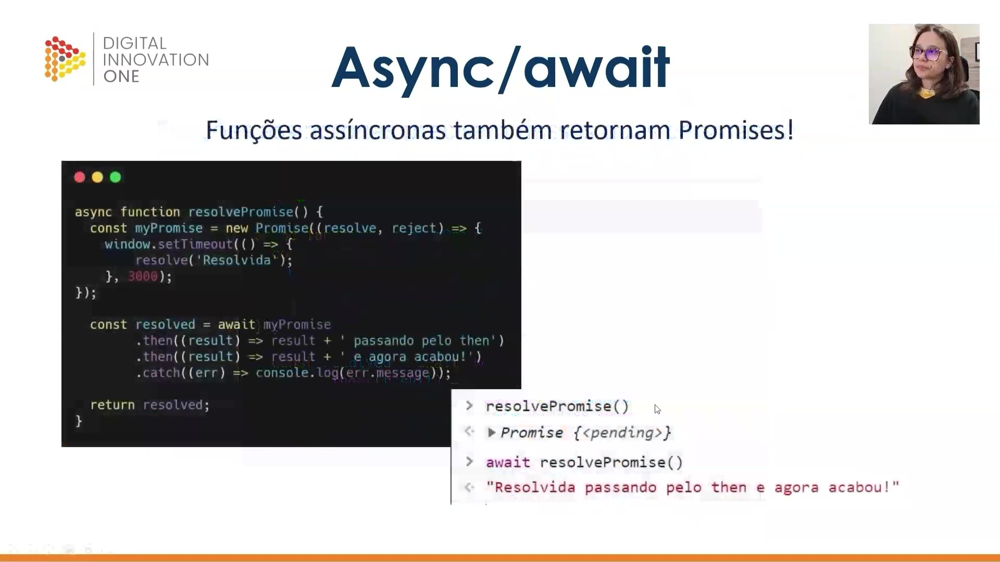
</p>

```javascript
async function resolvePromise() {
    const myPromise = new Promise((resolve, reject) => {
        window.setTimeout(() => {
            resolve('Resolvida');
        }, 3000);
    });

    try {
        const resolved = await myPromise
            .then((result) => result + ' passando pelo then')
            .then((result) => result + ' e agora acabou');
        return resolved;
    } catch(err) {
        return err.message;
    }
}

```

O tratamento de erros em funções assíncronas também pode ser feito através do bloco `try...catch`. Isso permite capturar rejeições de Promises de forma estruturada, retornando o erro ou lidando com ele sem interromper a aplicação.

<p align="center">
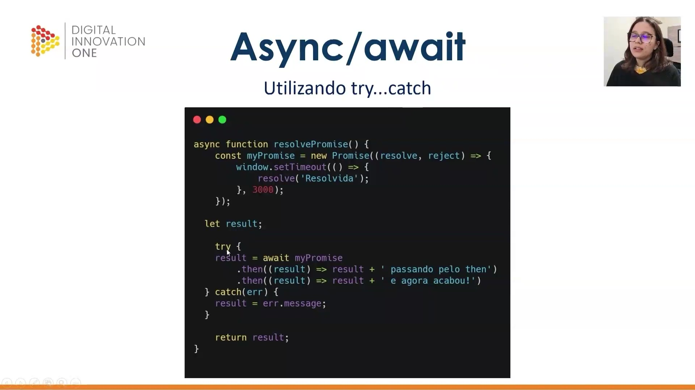
</p>

Concluímos que, embora os nomes e conceitos de assincronicidade pareçam complexos inicialmente, sua compreensão permite escrever códigos JavaScript muito mais robustos e eficientes para lidar com processos que dependem de tempo ou respostas externas.      


## 🟩 Vídeo 03 - xxxxxxxxxxxxxxx


Link do vídeo: 


## 🟩 Vídeo 04 - xxxxxxxxxxxxxxx


Link do vídeo: 


## 🟩 Vídeo 05 - xxxxxxxxxxxxxxx


Link do vídeo: 


## 🟩 Vídeo 06 - xxxxxxxxxxxxxxx


Link do vídeo: 


## 🟩 Vídeo 07 - xxxxxxxxxxxxxxx


Link do vídeo: 


## 🟩 Vídeo 08 - xxxxxxxxxxxxxxx


Link do vídeo: 


## 🟩 Vídeo 09 - xxxxxxxxxxxxxxx


Link do vídeo: 


## 🟩 Vídeo 10 - xxxxxxxxxxxxxxx


Link do vídeo: 


# Parte 2 - xxxxxxxxxxxxxxx

## 🟩 Vídeo 01 - xxxxxxxxxxxxxxx


Link do vídeo:  


## 🟩 Vídeo 02 - xxxxxxxxxxxxxxx


Link do vídeo: 


## 🟩 Vídeo 03 - xxxxxxxxxxxxxxx


Link do vídeo: 


## 🟩 Vídeo 04 - xxxxxxxxxxxxxxx


Link do vídeo: 


## 🟩 Vídeo 05 - xxxxxxxxxxxxxxx


Link do vídeo: 


## 🟩 Vídeo 06 - xxxxxxxxxxxxxxx


Link do vídeo: 


## 🟩 Vídeo 07 - xxxxxxxxxxxxxxx


Link do vídeo: 


## 🟩 Vídeo 08 - xxxxxxxxxxxxxxx


Link do vídeo: 


## 🟩 Vídeo 09 - xxxxxxxxxxxxxxx


Link do vídeo: 


## 🟩 Vídeo 10 - xxxxxxxxxxxxxxx


Link do vídeo: 


# Parte 3 - xxxxxxxxxxxxxxx

## 🟩 Vídeo 01 - Exxxxxxxxxxxxxxx


Link do vídeo:  


## 🟩 Vídeo 02 - xxxxxxxxxxxxxxx


Link do vídeo: 


## 🟩 Vídeo 03 - xxxxxxxxxxxxxxx


Link do vídeo: 


## 🟩 Vídeo 04 - xxxxxxxxxxxxxxx


Link do vídeo: 


## 🟩 Vídeo 05 - xxxxxxxxxxxxxxx


Link do vídeo: 


## 🟩 Vídeo 06 - xxxxxxxxxxxxxxx


Link do vídeo: 


## 🟩 Vídeo 07 - xxxxxxxxxxxxxxx


Link do vídeo: 


## 🟩 Vídeo 08 - xxxxxxxxxxxxxxx


Link do vídeo: 


## 🟩 Vídeo 09 - xxxxxxxxxxxxxxx


Link do vídeo: 


## 🟩 Vídeo 10 - xxxxxxxxxxxxxxx


Link do vídeo: 


##  Materiais de Apoio


# Certificado: 

- Link na plataforma: 
- Certificado em pdf: 
