## Instrutor

- Stephany Nusch (Software Engineer at Microsoft)
- Contato Linkedin: / [stephanynusch](https://www.linkedin.com/in/stephanynusch/)

# Parte 1 - Compreendendo Orientação a Objetos

## 🟩 Vídeo 01 - Apresentação do curso

<video width="60%" controls>
  <source src="000-Midia_e_Anexos/bootcamp_tqi_fullstack-modulo_03-Curso.09-Video_01.webm" type="video/webm">
    Seu navegador não suporta vídeo HTML5.
</video>

Link do vídeo: https://web.dio.me/track/tqi-fullstack-developer/course/orientacao-a-objetos-com-javascript/learning/cc1e176c-b883-4d19-a549-d04afd247687?autoplay=1

O vídeo consiste na **introdução de um treinamento online** focado no ensino de **programação orientada a objetos** utilizando a linguagem **JavaScript**. A instrutora, Stephanie, apresenta sua trajetória profissional como engenheira de software e destaca a importância do **GitHub** para a realização das atividades práticas propostas. O conteúdo programático está estruturado em **três etapas principais**, abrangendo desde conceitos teóricos fundamentais até a aplicação técnica do paradigma. Além das lições, o material incentiva a **interação entre alunos** por meio de fóruns e comunidades digitais para o esclarecimento de dúvidas. O objetivo central é capacitar os estudantes a compreenderem como o JavaScript opera nesse modelo específico de desenvolvimento de sistemas.

### Anotações

<p align="center">

</p>

Nesta introdução ao curso de JavaScript do Bootcamp, a instrutora Stephany Nusch, Engenheira de Software no QuintoAndar, apresenta o tema central das aulas: **Orientação a Objetos**. O objetivo inicial é contextualizar o paradigma de programação que será explorado ao longo do percurso.

<p align="center">
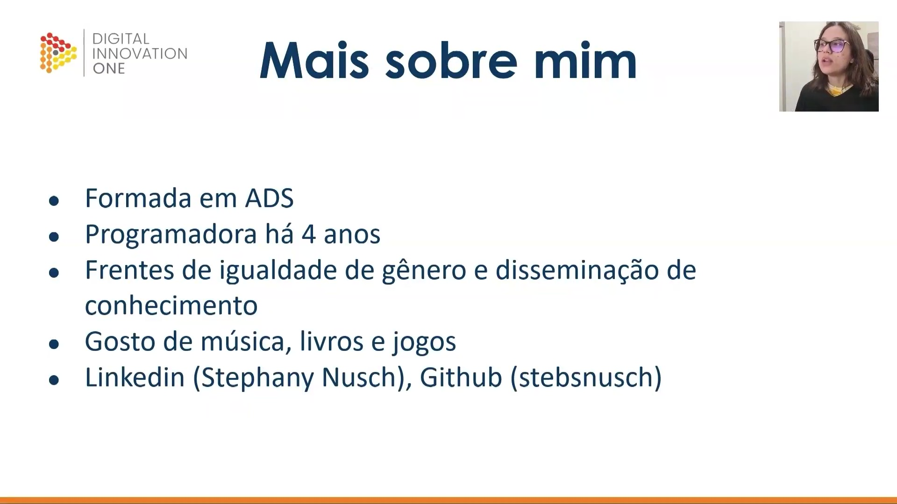
</p>

A instrutora compartilha detalhes sobre sua trajetória profissional e pessoal para estabelecer proximidade com os alunos:

* **Formação:** Graduada em Análise e Desenvolvimento de Sistemas (ADS).
* **Experiência:** Atua como programadora há 4 anos.
* **Causas:** Engajada em frentes de igualdade de gênero e na disseminação de conhecimento técnico.
* **Interesses:** Aprecia música, livros e jogos.
* **Contatos:** Disponível no LinkedIn como Stephany Nusch e no GitHub pelo usuário `stebsnusch`.

O GitHub é destacado como a ferramenta fundamental para a comunicação e compartilhamento das atividades práticas durante o curso.

<p align="center">
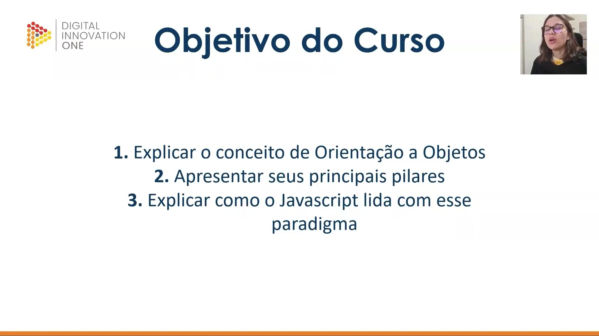
</p>

Os objetivos principais deste módulo estão estruturados em três frentes essenciais:

1. **Conceituação:** Explicar o que é o paradigma de Orientação a Objetos.
2. **Fundamentos:** Apresentar os pilares que sustentam essa metodologia de programação.
3. **Aplicação:** Demonstrar como o ecossistema JavaScript implementa e lida com esses conceitos.

<p align="center">
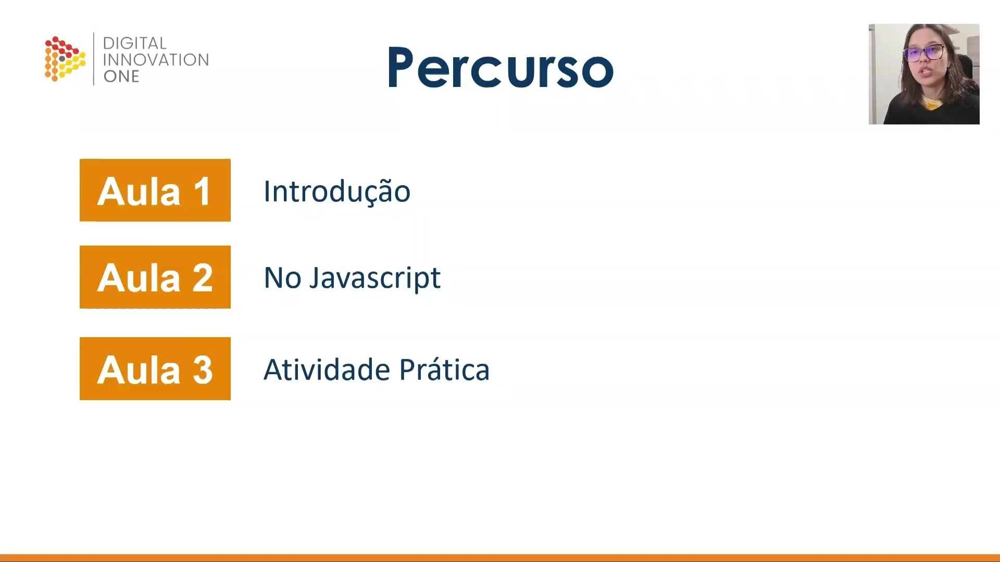
</p>

O curso está organizado em um percurso didático de três etapas:

* **Aula 1 - Introdução:** Uma imersão teórica no conceito de Orientação a Objetos.
* **Aula 2 - No Javascript:** Uma aula dedicada às especificidades do paradigma dentro da linguagem JavaScript.
* **Aula 3 - Atividade Prática:** Um momento reservado para aplicar o conhecimento adquirido através de exercícios de "mão na massa".

Para suporte adicional, os alunos podem recorrer ao fórum do curso e à comunidade no Discord para interação e resolução de dúvidas.      

## 🟩 Vídeo 02 - Paradigmas e Pilares

<video width="60%" controls>
  <source src="000-Midia_e_Anexos/bootcamp_tqi_fullstack-modulo_03-Curso.09-Video_02.webm" type="video/webm">
    Seu navegador não suporta vídeo HTML5.
</video>

Link do vídeo: https://web.dio.me/track/tqi-fullstack-developer/course/orientacao-a-objetos-com-javascript/learning/922dae23-4bb1-4f08-81b4-0e9262253ba1?autoplay=1

O vídeo consiste em uma introdução didática ao paradigma da **programação orientada a objetos**, diferenciando o modelo **imperativo** do **declarativo**. O conteúdo explica que este método foca no "como" resolver problemas através de **objetos** que possuem propriedades e comportamentos específicos. O autor detalha os quatro fundamentos essenciais da área: a **abstração**, que simplifica a complexidade; a **herança**, que permite o compartilhamento de traços entre classes; o **encapsulamento**, que garante a independência do código; e o **polimorfismo**, que possibilita reações distintas para um mesmo comando. A lição utiliza exemplos práticos, como veículos e animais, para ilustrar como essas estruturas facilitam a organização do desenvolvimento de software. Por fim, o material reforça a necessidade de **prática constante** e indica canais de suporte para a resolução de dúvidas dos estudantes.

### Anotações

<p align="center">
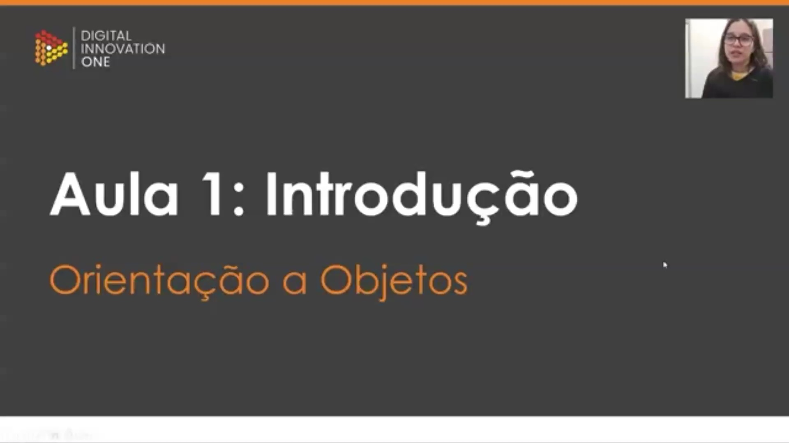
</p>

Esta introdução define os objetivos principais do aprendizado em **orientação a objetos**, focando em dois pontos centrais: a apresentação dos **paradigmas da programação** e o detalhamento dos **pilares da orientação a objetos**.

<p align="center">

</p>

Os paradigmas representam diferentes formas de programar, dividindo-se em duas grandes categorias:

* **Imperativo:** Focado no **como** resolver o problema, descrevendo os passos e a ordem das ações. A orientação a objetos e a programação procedural pertencem a este grupo.
* **Declarativo:** Focado no **que** deve ser feito, como ocorre em bancos de dados SQL ou na programação funcional, onde se declara o resultado desejado.

<p align="center">
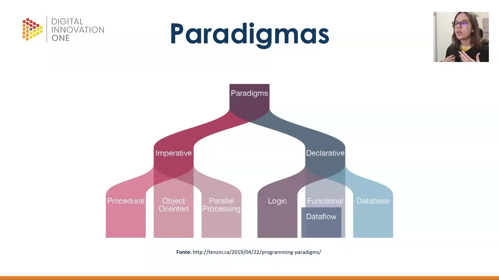
</p>

Na orientação a objetos, os programas são estruturados como **objetos** que possuem **propriedades**. Utilizando o exemplo de uma "Pessoa", o objeto congrega características específicas como altura, nome, cidade e ancestrais.

<p align="center">
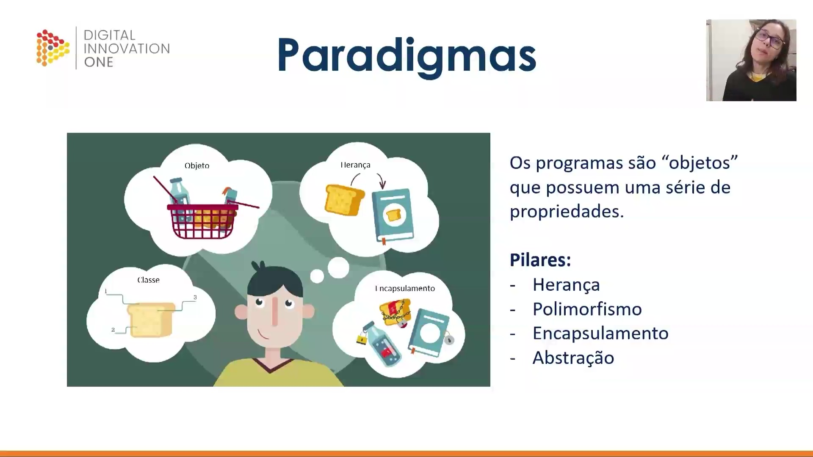
</p>

A estrutura da orientação a objetos é sustentada por **quatro pilares** fundamentais:

1. **Abstração**
2. **Herança**
3. **Encapsulamento**
4. **Polimorfismo**

<p align="center">
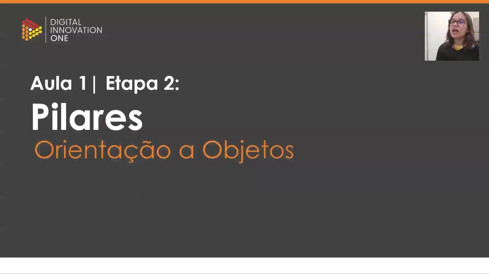
</p>

A **abstração** é o processo de simplificar problemas complexos. Ao **generalizar**, reduzimos um objeto às suas características essenciais para facilitar a classificação e comunicação. Por exemplo, diferentes modelos de carros podem ser simplificados e generalizados para a categoria "Veículo de rodas" e, em um nível ainda mais abstrato, apenas para "Veículo".

<p align="center">
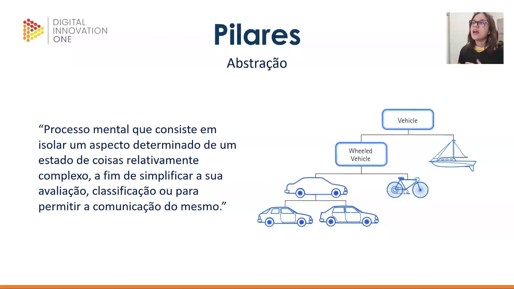
</p>

A relação de abstração permite identificar o que objetos compartilham. Enquanto um carro, uma bicicleta e um caminhão podem ser generalizados como **veículos de rodas**, um barco não se encaixa nessa categoria específica, embora todos ainda pertençam à abstração maior de **veículos**. Quanto mais especificamos, mais complexo e individual o objeto se torna; quanto mais generalizamos, mais abstraímos.

<p align="center">
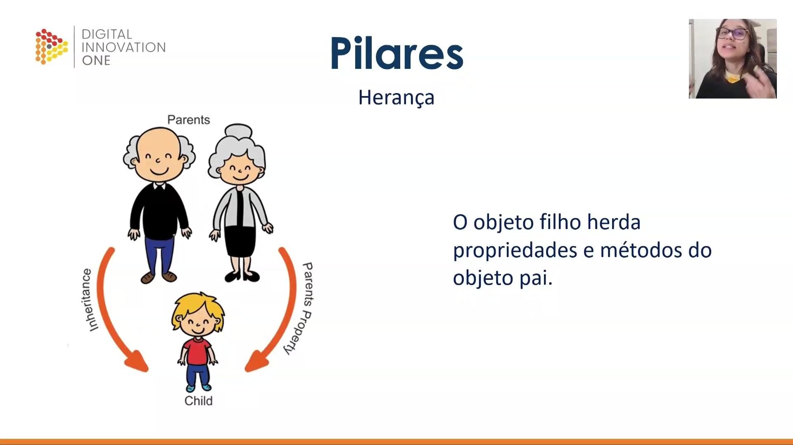
</p>

O conceito de **herança** permite que **objetos filhos herdem propriedades e métodos de objetos pais** (ascendentes). Apesar de compartilharem essa base comum, os objetos filhos mantêm a capacidade de possuir suas próprias características individuais.

<p align="center">
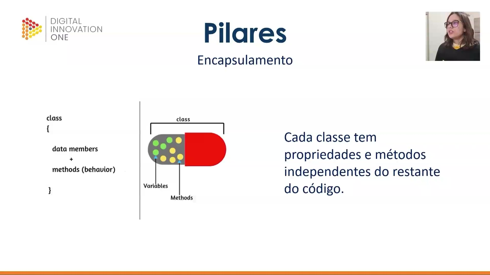
</p>

O **encapsulamento** garante que as classes possuam propriedades e métodos **independentes** do restante do código. Isso significa que uma alteração em uma propriedade interna de uma classe afetará apenas aquela instância, sem gerar influências indesejadas no sistema global. Já o **polimorfismo** permite que métodos herdados de uma classe pai se comportem de formas diferentes. Por exemplo, se a classe pai "Animal" possui o método "falar", um pato, um cachorro e um gato executarão esse mesmo método de maneiras distintas.

<p align="center">
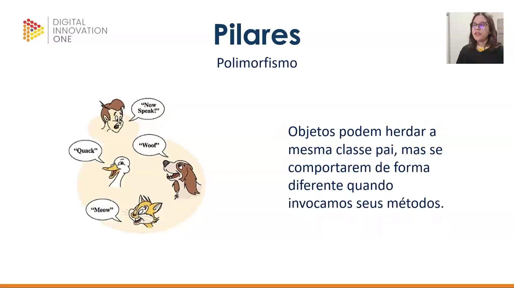
</p>

O domínio desses pilares exige prática e exercício constante para a compreensão plena de como eles se aplicam no desenvolvimento de software. Para suporte adicional, estão disponíveis o fórum do curso e a comunidade no Discord.      


# Parte 2 - Orientação a Objetos em JavaScript

## 🟩 Vídeo 03 - Protótipos e Classes

<video width="60%" controls>
  <source src="000-Midia_e_Anexos/bootcamp_tqi_fullstack-modulo_03-Curso.09-Video_03.webm" type="video/webm">
    Seu navegador não suporta vídeo HTML5.
</video>

Link do vídeo:  https://web.dio.me/track/tqi-fullstack-developer/course/orientacao-a-objetos-com-javascript/learning/922dae23-4bb1-4f08-81b4-0e9262253ba1?autoplay=1

Esta vídeo explica os fundamentos da **programação orientada a objetos no JavaScript**, destacando que o sistema de herança funciona através de **cadeias de protótipos**. O autor esclarece que todos os objetos herdam métodos e propriedades de um "esqueleto" ascendente, buscando funcionalidades até o topo da estrutura. Embora o JavaScript utilize a sintaxe de **classes**, o texto enfatiza que isso é apenas um **açúcar sintático**, pois, por baixo dos panos, a linguagem continua operando estritamente com objetos e protótipos. A lição também detalha a **anatomia das classes modernas**, abordando o uso de **construtores, getters, setters** e o método **super** para a extensão de funcionalidades. Por fim, discute-se o conceito de **encapsulamento** e a possibilidade de sobrescrever métodos para garantir comportamentos específicos em classes filhas.

### Anotações

<p align="center">
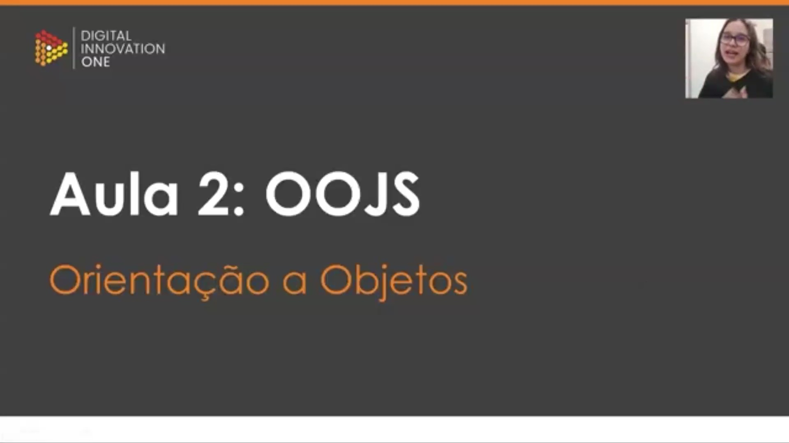
</p>

Esta aula introduz o conceito de **OOJS (Object Oriented JavaScript)**, focando na aplicação do paradigma de Orientação a Objetos dentro do ecossistema JavaScript. O objetivo principal é compreender como a linguagem gerencia objetos e herança, preparando a base para estudos mais avançados sobre a estrutura da linguagem.

<p align="center">

</p>

Os objetivos centrais da unidade são divididos em dois pilares:

1. **Conceituação de protótipos e cadeia de protótipos**: Entender como funciona o mecanismo de herança nativo do JavaScript.
2. **Estrutura de classes**: Explorar a sintaxe de classes introduzida nas versões mais recentes da linguagem.

<p align="center">
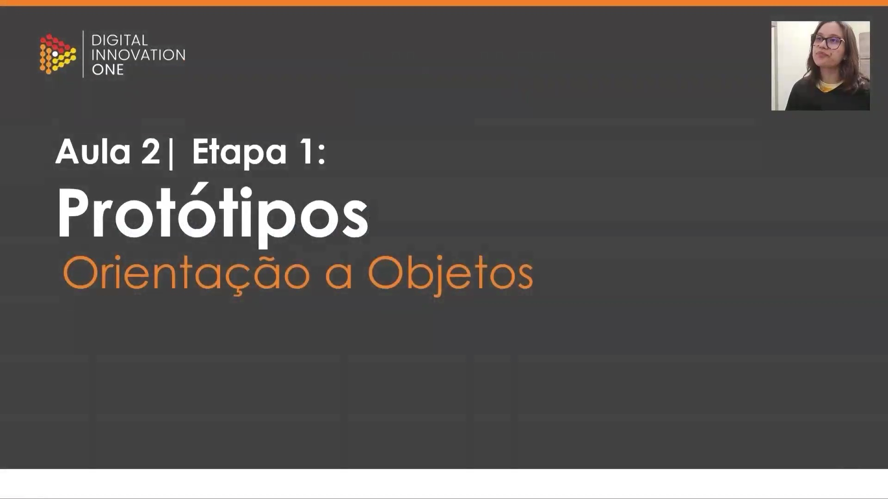
</p>

A primeira etapa da aula foca nos **Protótipos**. No JavaScript, os protótipos funcionam como o "esqueleto" para a criação de objetos, sendo o mecanismo fundamental por trás do comportamento de quase todos os elementos da linguagem.

<p align="center">
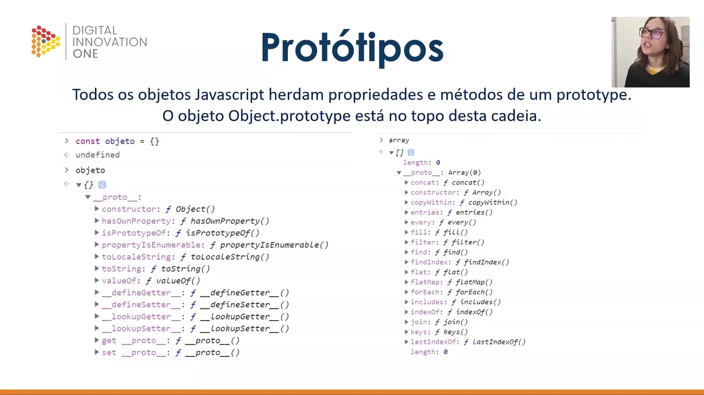
</p>

Todos os objetos em JavaScript herdam propriedades e métodos de um **prototype**. O objeto `Object.prototype` reside no topo desta cadeia. Quando criamos um objeto simples ou um array, eles automaticamente ganham acesso a métodos que não definimos manualmente, como `hasOwnProperty`, `toString` ou `valueOf`, pois esses métodos pertencem ao protótipo pai.

```javascript
// Exemplo de objeto e acesso ao protótipo no console
> const objeto = {}
undefined
> objeto
  _proto_:
    constructor: f Object()
    hasOwnProperty: f hasOwnProperty()
    isPrototypeOf: f isPrototypeOf()
    propertyIsEnumerable: f propertyIsEnumerable()
    toLocaleString: f toLocaleString()
    toString: f toString()
    valueOf: f valueOf()

// Exemplo com Array
> array
[]
  length: 0
  ▼_proto: Array(0)
    concat: f concat()
    constructor: f Array()
    filter: f filter()
    map: f map()
    // ...outros métodos de array

```

<p align="center">
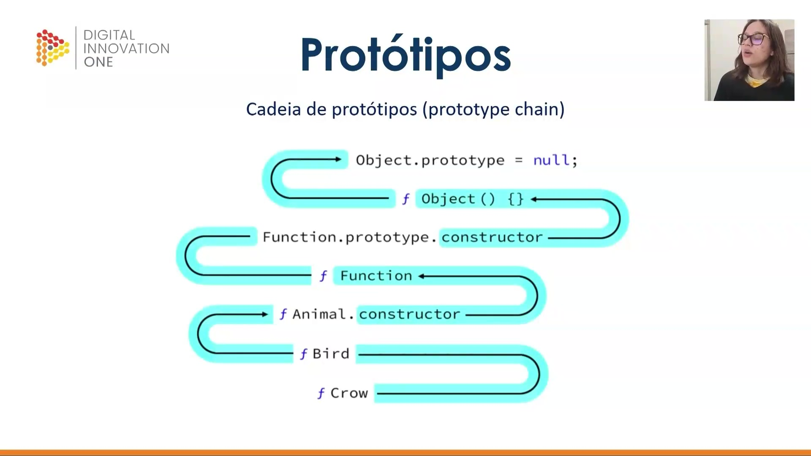
</p>

A **Cadeia de Protótipos (prototype chain)** descreve o caminho de busca que o JavaScript percorre para encontrar um método ou propriedade. Se um objeto não possui o que foi solicitado, o motor do JavaScript sobe para o seu protótipo, e assim sucessivamente até encontrar o valor ou chegar em `null`, que marca o fim da linha no `Object.prototype`.

<p align="center">
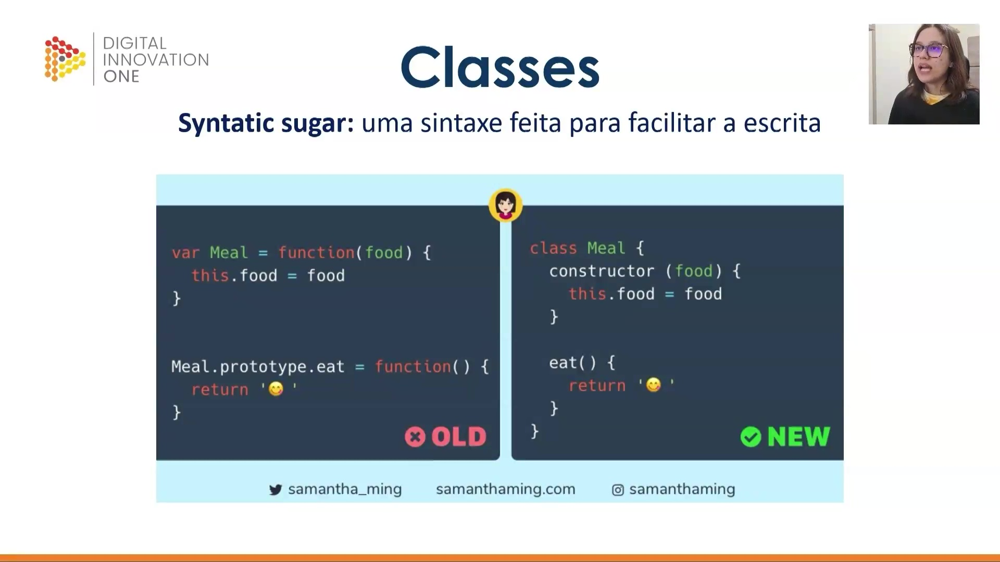
</p>

Embora o JavaScript utilize protótipos, o ES6 introduziu as **Classes** como um **Syntactic Sugar** (açúcar sintático). Isso significa que, embora a sintaxe pareça com a de linguagens como Java, por baixo dos panos o JavaScript continua operando através de objetos e protótipos. Essa nova sintaxe facilita a escrita e a leitura do código orientado a objetos.

```javascript
// OLD: Definindo via função e protótipo
var Meal = function(food) {
  this.food = food
}

Meal.prototype.eat = function() {
  return 'Eating ' + this.food
}

// NEW: Definindo via Classe (ES6+)
class Meal {
  constructor (food) {
    this.food = food
  }

  eat() {
    return 'Eating ' + this.food
  }
}

```

<p align="center">
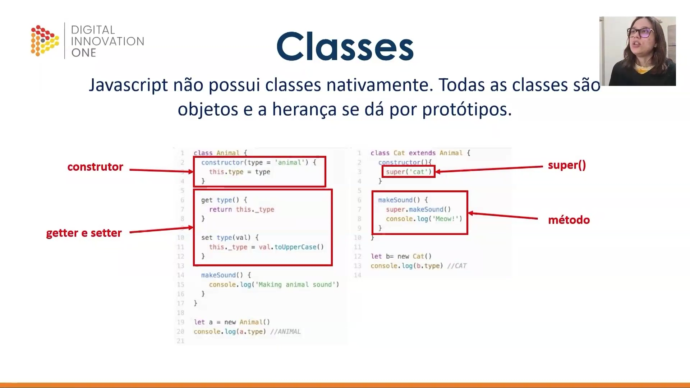
</p>

A anatomia de uma classe moderna em JavaScript inclui elementos como o **construtor**, **getters/setters** e o suporte a herança via **extends**. O método `super()` é crucial em classes filhas para invocar o construtor da classe pai e garantir o acesso às propriedades herdadas.

```javascript
class Animal {
  constructor(type = 'animal') {
    this._type = type
  }

  get type() {
    return this._type
  }

  set type(val) {
    this._type = val.toUpperCase()
  }

  makeSound() {
    console.log('Making animal sound')
  }
}

class Cat extends Animal {
  constructor() {
    super('cat')
  }

  makeSound() {
    super.makeSound()
    console.log('Meow!')
  }
}

let b = new Cat()
console.log(b.type) // CAT
b.makeSound() 
// Making animal sound
// Meow!

```      


## 🟩 Vídeo 04 - Atividade prática

<video width="60%" controls>
  <source src="000-Midia_e_Anexos/bootcamp_tqi_fullstack-modulo_03-Curso.09-Video_04.webm" type="video/webm">
    Seu navegador não suporta vídeo HTML5.
</video>

Link do vídeo: https://web.dio.me/track/tqi-fullstack-developer/course/orientacao-a-objetos-com-javascript/learning/808c0d6b-3c88-488a-b1d4-af43e8a1bf30?autoplay=1

O material consiste em um **tutorial prático** focado no desenvolvimento de um sistema de **contas bancárias** utilizando a linguagem **JavaScript**. A instrutora detalha a aplicação de conceitos fundamentais da **orientação a objetos**, como a criação de classes, o uso de **construtores** e a implementação de métodos de depósito e saque. Através de exemplos, o conteúdo demonstra como funciona a **herança** ao criar tipos específicos de contas, como a corrente e a universitária. Além disso, a fonte explica a utilização de **getters e setters** para a manipulação protegida de dados e o **polimorfismo** ao sobrescrever comportamentos específicos de saque. O processo é finalizado com a integração do código em um arquivo **HTML** para testes diretos no navegador.

### Anotações

<p align="center">
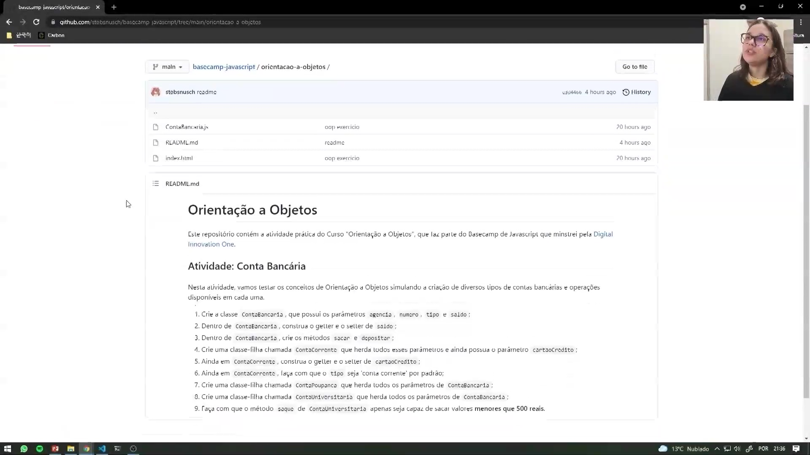
</p>

Nesta etapa, definimos a estrutura da atividade prática **Conta Bancária**. O objetivo é exercitar conceitos de Orientação a Objetos criando uma hierarquia de classes para simular operações bancárias. A classe base, `ContaBancaria`, deve gerenciar informações essenciais como agência, número, tipo e saldo.

As diretrizes do projeto incluem:

* Criação da classe principal com construtor para os parâmetros básicos.
* Implementação de métodos de acesso (getters e setters) para a propriedade saldo.
* Desenvolvimento de métodos para as operações de `sacar` e `depositar`.
* Criação de classes filhas especializadas (`ContaCorrente`, `ContaPoupanca` e `ContaUniversitaria`) para demonstrar o uso de herança e polimorfismo.

<p align="center">
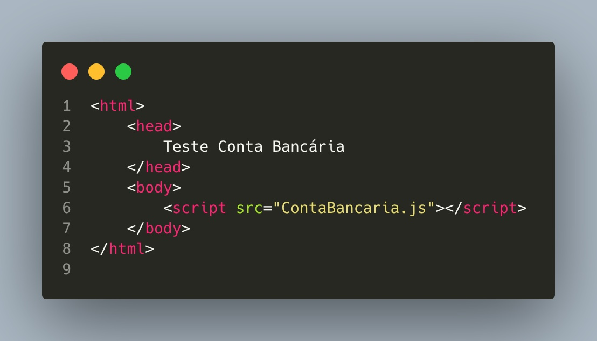
</p>

Para integrar o código JavaScript ao navegador e permitir testes em tempo real, utilizamos uma estrutura HTML básica. O arquivo `index.html` vincula o script externo, permitindo que as classes e instâncias sejam manipuladas diretamente através do console do desenvolvedor.

```html
<html>
<head>
  <title>Teste Conta Bancária</title>
</head>
<body>
  <script src="scripts.js"></script>
</body>
</html>

```

<p align="center">
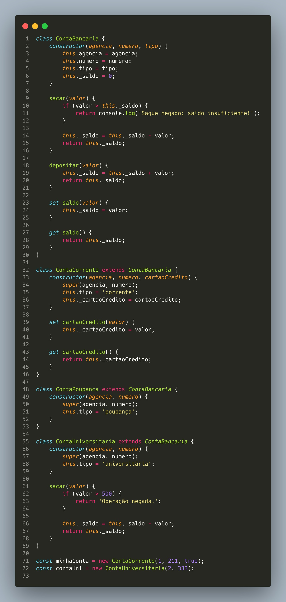
</p>

A implementação completa utiliza a palavra-chave `extends` para realizar a herança e o método `super()` para passar os parâmetros à classe pai. Um detalhe importante é o uso do **underline** (ex: `this._saldo`) para propriedades que possuem getters e setters, evitando loops infinitos na atribuição. Na classe `ContaUniversitaria`, aplicamos o polimorfismo ao sobrescrever o método `sacar` para limitar o valor máximo da operação.

```javascript
class ContaBancaria {
    constructor(agencia, numero, tipo) {
        this.agencia = agencia;
        this.numero = numero;
        this.tipo = tipo;
        this._saldo = 0;
    }

    get saldo() {
        return this._saldo;
    }

    set saldo(valor) {
        this._saldo = valor;
    }

    sacar(valor) {
        if (valor > this._saldo) {
            return "Operação negada";
        }
        this._saldo = this._saldo - valor;
        return this._saldo;
    }

    depositar(valor) {
        this._saldo = this._saldo + valor;
        return this._saldo;
    }
}

class ContaCorrente extends ContaBancaria {
    constructor(agencia, numero, cartaoCredito) {
        super(agencia, numero);
        this.tipo = 'corrente';
        this._cartaoCredito = cartaoCredito;
    }

    get cartaoCredito() {
        return this._cartaoCredito;
    }

    set cartaoCredito(valor) {
        this._cartaoCredito = valor;
    }
}

class ContaPoupanca extends ContaBancaria {
    constructor(agencia, numero) {
        super(agencia, numero);
        this.tipo = 'poupança';
    }
}

class ContaUniversitaria extends ContaBancaria {
    constructor(agencia, numero) {
        super(agencia, numero);
        this.tipo = 'universitária';
    }

    sacar(valor) {
        if (valor > 500) {
            return "Operação negada";
        }
        this._saldo = this._saldo - valor;
        return this._saldo;
    }
}

```      

#### Análise detalhada do código 

Esta análise detalha a implementação do sistema de **Conta Bancária**, correlacionando a estrutura do código com os conceitos de Orientação a Objetos (OO) apresentados pela instrutora.

---

##### 1. Classe Base: Abstração e Encapsulamento

A classe `ContaBancaria` serve como o "molde" principal (classe pai/superclasse) que define as propriedades e comportamentos comuns a todos os tipos de conta.

* **O Construtor e o Operador `this**`: No `constructor`, a instrutora utiliza o `this` para se referir à instância específica que está sendo criada, garantindo que `agencia`, `numero` e `tipo` sejam atribuídos corretamente ao objeto.


* **Encapsulamento com `_saldo**`: Para proteger o saldo e permitir o uso de Getters e Setters sem causar loops infinitos, é utilizado o padrão de prefixar a propriedade com um **underline** (`_saldo`). Isso sinaliza que a propriedade é para uso interno da lógica da classe.


* **Lógica de Operações**:
* **Método `sacar(valor)**`: Implementa uma validação crucial; se o valor solicitado for maior que o saldo atual, a operação é interrompida com uma mensagem de erro.

* **Método `depositar(valor)**`: Uma operação simples de incremento que atualiza o estado interno do objeto e retorna o novo saldo para feedback imediato.

---

##### 2. Herança e a Palavra-chave `super`

A instrutora demonstra o pilar da **Herança** ao criar classes especializadas que estendem a funcionalidade da classe base.

* **Extensão de Classe**: O uso de `extends ContaBancaria` permite que as classes filhas herdem todos os métodos (`sacar`, `depositar`) e propriedades da classe pai.

* **Função `super()**`: É fundamental dentro do construtor da classe filha. Ela invoca o construtor da classe pai, permitindo que as propriedades genéricas (agência, número) sejam inicializadas pela lógica já definida na superclasse.

* **Especialização**:
* A `ContaCorrente` adiciona uma propriedade exclusiva: `cartaoCredito`.

* O `tipo` de cada conta é fixado diretamente no construtor da classe filha (ex: `'corrente'`, `'poupança'`), automatizando essa definição para o usuário.

---

##### 3. Polimorfismo e Sobrescrita de Métodos

O conceito de **Polimorfismo** fica evidente na classe `ContaUniversitaria`. Embora ela herde o comportamento de saque de uma conta comum, ela precisa de uma regra de negócio específica.

* **Sobrescrita (Override)**: Ao definir o método `sacar(valor)` dentro de `ContaUniversitaria`, o JavaScript prioriza esta implementação em vez da que existe na classe pai.

* **Regra Restritiva**: A lógica é alterada para verificar se o valor é maior que 500 reais antes mesmo de verificar o saldo disponível. Se exceder esse tlimite, a operação é negada independentemente do valor em conta.

---

##### 4. Integração e Teste no Navegador

Para validar a lógica de OO, o código é integrado a um ambiente real via HTML.

* **Instanciação**: A criação de objetos reais através do operador `new` (ex: `new ContaCorrente(...)`) transforma a definição teórica das classes em instâncias funcionais na memória do navegador.


* **Interatividade**: No console, é possível observar como diferentes objetos respondem aos mesmos comandos (polimorfismo), como um saque de 600 reais sendo aceito por uma `ContaCorrente` (se houver saldo), mas negado imediatamente por uma `ContaUniversitaria`.


# Certificado: Orientação a Objetos com JavaScript

- Link na plataforma: https://hermes.dio.me/certificates/SHWUPNNQ.pdf
- Certificado em pdf: [Certificado-Orientacao.a.Objetos.com.JavaScript.pdf](000-Midia_e_Anexos/Certificado-Orientacao.a.Objetos.com.JavaScript.pdf)
